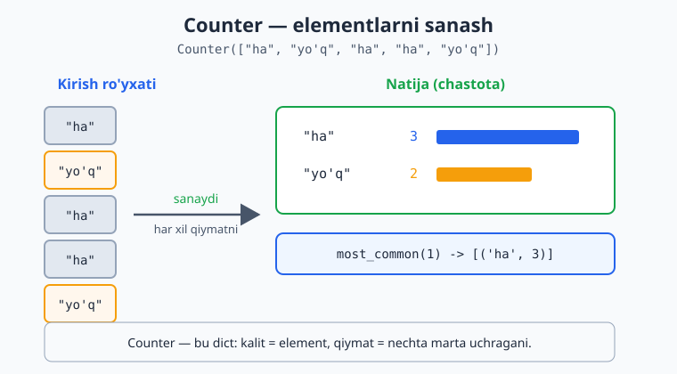
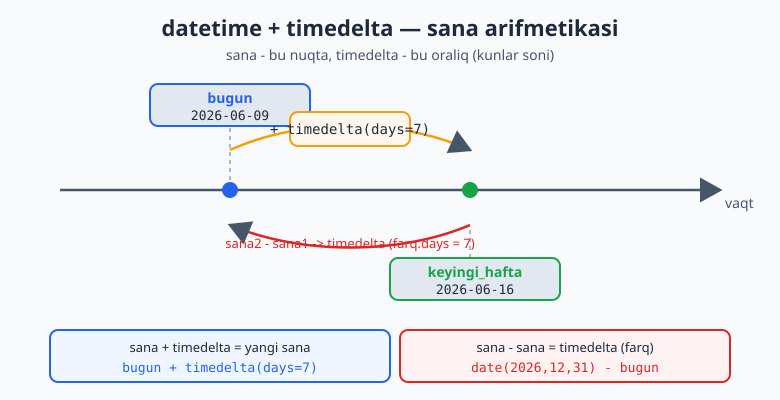

# 11 — Standart kutubxona ("hammasi ichida")

Python "hammasi ichida" (batteries included) tamoyili bilan keladi: ko'p foydali vositalar o'rnatmasdan, til bilan birga keladi. Bu modulda eng ko'p ishlatiladigan standart modullar bilan tanishasan — ular kundalik ishingni ancha osonlashtiradi.

> **Bu modulda:** `collections` (Counter, defaultdict, deque, namedtuple, OrderedDict, ChainMap), `datetime` va `zoneinfo` (sana/vaqt, vaqt mintaqalari), `random` (tasodif), `math` (matematika), `itertools` va `functools` (funksional vositalar), `pathlib` (fayl yo'llari), `re` (qisqacha), `subprocess` (tashqi buyruq), `argparse` (CLI), `logging` (professional log) va `secrets` (xavfsiz tasodif).

---

## 11.1 `collections` — qulay to'plamlar

**`Counter`** — narsalarni sanash uchun (3-moduldagi qo'lda sanashning tayyor varianti):

```python
from collections import Counter

ovozlar = ["ha", "yo'q", "ha", "ha", "yo'q"]
hisob = Counter(ovozlar)
print(hisob)                  # Counter({'ha': 3, "yo'q": 2})
print(hisob["ha"])            # 3
print(hisob.most_common(1))   # [('ha', 3)]  — eng ko'p uchragani

# Matndagi harflarni sanash:
print(Counter("mississippi"))  # Counter({'i': 4, 's': 4, 'p': 2, 'm': 1})
```

`Counter` ro'yxat bo'ylab yurib, har bir elementni avtomatik sanaydi va natijani "element → nechta marta" lug'ati ko'rinishida qaytaradi:



`Counter` shunchaki sanashdan ko'ra ko'proq narsani biladi. U lug'at (`dict`) ning bola-klassi, shuning uchun lug'at kabi ishlaydi, lekin ustiga maxsus usullar qo'shilgan:

```python
from collections import Counter

c = Counter("abracadabra")
print(c.most_common(2))       # [('a', 5), ('b', 2)]  — eng ko'p 2 tasi
print(c.total())              # 11  (3.10+) — barcha sanoqlar yig'indisi
print(list(c.elements()))     # ['a','a','a','a','a','b','b','r','r','c','d'] — qayta yoyadi

# Counter'lar ustida arifmetika — bu uning eng kuchli tomoni:
dushanba = Counter(olma=3, non=2, suv=1)
seshanba = Counter(olma=1, non=4, choy=2)

print(dushanba + seshanba)    # Counter({'non': 6, 'olma': 4, 'choy': 2, 'suv': 1}) — qo'shish
print(seshanba - dushanba)    # Counter({'non': 2, 'choy': 2}) — ayirish (manfiylar tushib qoladi)
print(dushanba & seshanba)    # Counter({'non': 2, 'olma': 1}) — kesishma (minimum)
print(dushanba | seshanba)    # Counter({'non': 4, 'olma': 3, 'choy': 2, 'suv': 1}) — birlashma (maksimum)
```

> `most_common()` argumentsiz chaqirilsa, hamma elementni eng ko'pdan eng kamga qarab tartiblab qaytaradi: `c.most_common()[-1]` — eng kam uchragani.

**`defaultdict`** — yo'q kalitga avtomatik standart qiymat beradi (`KeyError` bo'lmaydi):

```python
from collections import defaultdict

guruh: defaultdict[str, list[str]] = defaultdict(list)   # yo'q kalit avtomatik bo'sh ro'yxat bo'ladi
for ism, sinf in [("Ali", "A"), ("Vali", "B"), ("Gul", "A")]:
    guruh[sinf].append(ism)   # KeyError yo'q — kalit avtomatik yaratiladi

print(dict(guruh))            # {'A': ['Ali', 'Gul'], 'B': ['Vali']}
```

> Oddiy `dict` bilan buni `if kalit not in lugat: lugat[kalit] = []` qilib yozarding — `defaultdict` shuni avtomatlashtiradi.

`defaultdict` ga uzatiladigan argument — "fabrika" (factory): kalit yo'q bo'lsa chaqiriladigan funksiya. `list` → bo'sh ro'yxat, `int` → `0`, `set` → bo'sh to'plam:

```python
from collections import defaultdict

# Sanash uchun int fabrikasi (har yangi kalit 0 dan boshlanadi):
chastota: defaultdict[str, int] = defaultdict(int)
for harf in "mississippi":
    chastota[harf] += 1       # birinchi marta uchraganda 0 + 1
print(dict(chastota))         # {'m': 1, 'i': 4, 's': 4, 'p': 2}

# Takrorsiz to'plam uchun set fabrikasi:
do_stlar: defaultdict[str, set[str]] = defaultdict(set)
do_stlar["Ali"].add("Vali")
do_stlar["Ali"].add("Vali")   # ikkinchi marta — set takrorni o'tkazmaydi
print(dict(do_stlar))         # {'Ali': {'Vali'}}
```

**`deque`** — ikki tomonlama navbat (double-ended queue). Oddiy ro'yxatdan farqi: boshidan element qo'shish/olib tashlash **juda tez** (`O(1)`), ro'yxatda esa boshi sekin (`O(n)`):

```python
from collections import deque

navbat: deque[int] = deque([1, 2, 3])
navbat.append(4)              # o'ngga qo'shish
navbat.appendleft(0)          # chapga qo'shish
print(navbat)                 # deque([0, 1, 2, 3, 4])
print(navbat.pop())           # 4   — o'ngdan olish
print(navbat.popleft())       # 0   — chapdan olish

# maxlen — sig'imi cheklangan navbat: yangi element kirsa, eskisi avtomatik tushadi.
# Bu "oxirgi N ta" ni saqlash uchun ideal:
oxirgi_uch: deque[int] = deque(maxlen=3)
for son in [10, 20, 30, 40, 50]:
    oxirgi_uch.append(son)
print(list(oxirgi_uch))       # [30, 40, 50] — faqat oxirgi 3 tasi qoldi

# rotate — elementlarni aylantirish:
d = deque([1, 2, 3, 4, 5])
d.rotate(2)                   # o'ngga 2 qadam
print(d)                      # deque([4, 5, 1, 2, 3])
```

> `deque` — navbat (queue, FIFO) va stek (stack, LIFO) yasash uchun eng to'g'ri vosita. `maxlen` esa "siljuvchi oyna" (sliding window) — masalan oxirgi 100 ta o'lchovni saqlab turish — uchun bebaho.

**`namedtuple`** — nomli maydonli kortej. Oddiy kortejda `p[0]`, `p[1]` deb indeks bilan murojaat qilasan; `namedtuple` da esa `p.x`, `p.y` deb **nom bilan** murojaat qilasan — kod ancha o'qiladigan bo'ladi:

```python
from collections import namedtuple

Nuqta = namedtuple("Nuqta", ["x", "y"])
p = Nuqta(3, 4)
print(p.x, p.y)               # 3 4   — nom bilan murojaat
print(p[0], p[1])             # 3 4   — indeks ham ishlaydi (u baribir kortej)
print(p)                      # Nuqta(x=3, y=4)  — chiroyli chiqadi

# Foydali usullar:
print(p._asdict())            # {'x': 3, 'y': 4}  — lug'atga aylantirish
p2 = p._replace(y=10)         # nusxa ko'chirib bitta maydonni o'zgartirish
print(p2)                     # Nuqta(x=3, y=10)
```

> `namedtuple` — yengil "ma'lumot konteyneri". Agar metod ham kerak bo'lsa, 17-bobdagi `@dataclass` yoki `typing.NamedTuple` qulayroq. Lekin shunchaki "uchta qiymatni guruhlash" kerak bo'lsa, `namedtuple` eng tez yo'l.

**`OrderedDict`** — tartibni saqlovchi lug'at. Python 3.7 dan boshlab oddiy `dict` ham qo'shilgan tartibni saqlaydi, shuning uchun `OrderedDict` kamroq kerak bo'ladi. Lekin uning bitta maxsus qobiliyati bor — elementni boshiga/oxiriga **ko'chirish**:

```python
from collections import OrderedDict

od: OrderedDict[str, int] = OrderedDict()
od["a"] = 1
od["b"] = 2
od["c"] = 3

od.move_to_end("a")           # 'a' ni oxiriga ko'chir
print(list(od))               # ['b', 'c', 'a']

od.move_to_end("c", last=False)  # 'c' ni boshiga ko'chir
print(list(od))               # ['c', 'b', 'a']
```

> `move_to_end` — eng oddiy LRU (Least Recently Used) kesh yasashning yuragi: har ishlatilgan kalitni oxiriga surib qo'yasan, joy tugaganda boshidagi (eng eskisi) ni o'chirasan.

**`ChainMap`** — bir nechta lug'atni **bitta ko'rinishda** birlashtiradi (nusxa ko'chirmasdan). Kalitni izlaganda ro'yxatdagi lug'atlarni navbat bilan tekshiradi — birinchi topilgani g'olib. Bu sozlamalarni qatlamlash uchun ideal: "foydalanuvchi sozlamasi → loyiha sozlamasi → standart sozlama":

```python
from collections import ChainMap

standart = {"til": "uz", "tema": "yorug'", "olcham": 12}
foydalanuvchi = {"tema": "qorong'u"}

sozlama = ChainMap(foydalanuvchi, standart)
print(sozlama["tema"])        # qorong'u  — foydalanuvchidan (birinchi g'olib)
print(sozlama["til"])         # uz        — standartdan (foydalanuvchida yo'q)
print(sozlama["olcham"])      # 12        — standartdan

# Yangi qiymat HAMISHA birinchi lug'atga yoziladi:
sozlama["til"] = "en"
print(foydalanuvchi)          # {'tema': 'qorong'u', 'til': 'en'}
print(standart["til"])        # uz  — standart o'zgarmadi
```

---

## 11.2 `datetime` — sana va vaqt

```python
from datetime import datetime, date, timedelta

hozir = datetime.now()        # hozirgi sana va vaqt
bugun = date.today()          # bugungi sana

print(hozir.year, hozir.month, hozir.day)   # 2026 6 11
print(bugun)                  # 2026-06-11

# Chiroyli formatlash (strftime):
print(hozir.strftime("%d.%m.%Y"))           # 11.06.2026
print(hozir.strftime("%H:%M"))              # 14:30

# Matndan sana o'qish (strptime):
sana = datetime.strptime("2026-01-15", "%Y-%m-%d")

# timedelta — vaqt qo'shish/ayirish:
keyingi_hafta = bugun + timedelta(days=7)
print(keyingi_hafta)          # 7 kun keyin

farq = date(2026, 12, 31) - bugun
print(farq.days, "kun qoldi")
```

Sana — bu vaqt o'qidagi nuqta, `timedelta` esa ikki nuqta orasidagi oraliq: sanaga `timedelta` qo'shsang yangi sana chiqadi, ikki sanani ayirsang `timedelta` (farq) chiqadi:



> `strftime` (sanani matnga) va `strptime` (matnni sanaga) — kodlar: `%Y`=yil, `%m`=oy, `%d`=kun, `%H`=soat, `%M`=daqiqa. Hammasini yodlash shart emas, kerak bo'lganda qaraysan.

---

## 11.3 `zoneinfo` — vaqt mintaqalari (timezone-aware)

Yuqoridagi `datetime.now()` "soddadil" (naive) sana qaytaradi — unda vaqt mintaqasi yo'q. Bu ko'p hollarda muammo: Toshkentdagi 15:00 bilan Londondagi 15:00 — bir xil emas. **`zoneinfo`** moduli (Python 3.9+) sanaga aniq vaqt mintaqasini bog'lab, "mintaqa-xabardor" (aware) sana yasaydi:

```python
from datetime import datetime
from zoneinfo import ZoneInfo

# Toshkent vaqtidagi aniq nuqta:
toshkent = datetime(2026, 6, 11, 15, 0, tzinfo=ZoneInfo("Asia/Tashkent"))
print(toshkent.isoformat())   # 2026-06-11T15:00:00+05:00  — +05:00 mintaqa siljishi

# Boshqa mintaqaga aylantirish — astimezone:
london = toshkent.astimezone(ZoneInfo("Europe/London"))
print(london.strftime("%H:%M %Z"))   # 11:00 BST  — ayni o'sha lahza, London vaqtida

nyu_york = toshkent.astimezone(ZoneInfo("America/New_York"))
print(nyu_york.strftime("%H:%M %Z")) # 06:00 EDT
```

`ZoneInfo` IANA vaqt mintaqalari nomlarini ishlatadi (`"Asia/Tashkent"`, `"Europe/London"`, `"America/New_York"`). U yoz/qish vaqti almashuvini (DST) ham avtomatik hisobga oladi — buni qo'lda qilish juda xatoga moyil ish edi.

```python
from datetime import datetime, timezone
from zoneinfo import ZoneInfo

# UTC ni olish va mintaqaga o'tkazish (serverlarda standart amaliyot):
hozir_utc = datetime.now(timezone.utc)
hozir_toshkent = hozir_utc.astimezone(ZoneInfo("Asia/Tashkent"))
print("UTC:     ", hozir_utc.strftime("%H:%M"))
print("Toshkent:", hozir_toshkent.strftime("%H:%M"))   # UTC + 5 soat
```

> **Maslahat:** ma'lumotni hamisha **UTC** da saqla, faqat foydalanuvchiga ko'rsatishdan oldin mahalliy mintaqaga o'tkaz. Bu "qaysi vaqt mintaqasida edi?" degan boshog'rig'ini butunlay yo'qotadi.

> **Windows eslatmasi:** Windowsda tizim vaqt mintaqasi bazasi bo'lmasligi mumkin va `ZoneInfo("Asia/Tashkent")` `ZoneInfoNotFoundError` berishi mumkin. Yechim — bir martalik o'rnatish: `pip install tzdata`. Linux/macOS da odatda bu kerak emas.

---

## 11.4 `random` — tasodifiy sonlar

```python
import random

print(random.randint(1, 6))            # 1..6 oralig'ida (zar)
print(random.random())                 # 0.0–1.0 oralig'ida kasr
print(random.choice(["olma", "banan", "uzum"]))   # tasodifiy bittasi

karta = [1, 2, 3, 4, 5]
random.shuffle(karta)                   # ro'yxatni joyida aralashtiradi
print(karta)

# Ro'yxatdan bir nechta tasodifiy (takrorsiz):
print(random.sample(range(1, 50), 5))   # 5 ta tasodifiy son
```

> **Diqqat:** `random` o'yinlar va simulyatsiya uchun. Parol, token, xavfsizlik uchun **ishlatma** — uning natijasi bashorat qilinadi. Xavfsizlik kerak bo'lganda `secrets` moduli bor (11.13-bo'limga qara).

---

## 11.5 `math` — matematik funksiyalar

```python
import math

print(math.sqrt(16))          # 4.0    — kvadrat ildiz
print(math.ceil(4.1))         # 5      — yuqoriga yaxlitlash
print(math.floor(4.9))        # 4      — pastga yaxlitlash
print(math.pi)                # 3.14159...
print(math.factorial(5))      # 120    — faktorial
print(math.gcd(24, 36))       # 12     — eng katta umumiy bo'luvchi
print(round(3.14159, 2))      # 3.14   — yaxlitlash (math emas, lekin foydali)
```

---

## 11.6 `itertools` — iterator "lego" bloklari

`itertools` — iteratorlar ustida ishlovchi tez va xotira-tejamkor vositalar to'plami. Ular ro'yxat yasab xotirani band qilmasdan, elementlarni "oqim" sifatida bir-bir uzatadi. Mana eng ko'p ishlatiladiganlari:

```python
from itertools import chain, accumulate, islice, count, cycle, pairwise

# chain — bir nechta ketma-ketlikni ulab, bittaday yuradi:
print(list(chain([1, 2], [3, 4], [5])))     # [1, 2, 3, 4, 5]

# accumulate — yig'indini bosqichma-bosqich to'playdi (running total):
print(list(accumulate([1, 2, 3, 4])))       # [1, 3, 6, 10]

# count — cheksiz sanagich; islice bilan kesib olamiz:
print(list(islice(count(10, 5), 4)))        # [10, 15, 20, 25]  (10 dan, qadam 5)

# cycle — ketma-ketlikni cheksiz aylantiradi (navbatlash uchun):
ranglar = cycle(["qizil", "yashil"])
print([next(ranglar) for _ in range(4)])    # ['qizil', 'yashil', 'qizil', 'yashil']

# pairwise (3.10+) — qo'shni juftlar:
print(list(pairwise([1, 2, 3, 4])))         # [(1, 2), (2, 3), (3, 4)]
```

Kombinatorika — `itertools` ning eng kuchli tomoni. Qo'lda yozish qiyin bo'lgan barcha kombinatsiya/o'rinlashtirishni bir qatorda beradi:

```python
from itertools import combinations, permutations, product, groupby

print(list(combinations("ABC", 2)))   # [('A','B'), ('A','C'), ('B','C')] — tartibsiz juftlar
print(list(permutations("AB", 2)))    # [('A','B'), ('B','A')] — tartibli o'rinlashtirish
print(list(product([0, 1], repeat=2)))# [(0,0), (0,1), (1,0), (1,1)] — dekart ko'paytmasi

# groupby — qator elementlarni guruhlaydi (E'TIBOR: avval saralangan bo'lishi kerak):
talabalar = [("A", "Ali"), ("A", "Aziz"), ("B", "Bek")]
for sinf, guruh in groupby(talabalar, key=lambda t: t[0]):
    print(sinf, [ism for _, ism in guruh])
# A ['Ali', 'Aziz']
# B ['Bek']
```

> `itertools` shu qadar boy modulki, unga to'liq 19-bob bag'ishlangan — u yerda `tee`, `starmap`, `dropwhile`, `takewhile` va boshqa kuchli "lego" bloklari bilan chuqur tanishasan. Bu yerda esa eng kerakli bir nechtasini ko'rsatdik.

---

## 11.7 `functools` — funksiyalar ustida ishlovchi vositalar

`functools` — funksiyalarni "moslovchi" va "tezlatuvchi" yordamchilar to'plami. Eng muhim uchtasi:

```python
from functools import reduce, cache, partial

# 1) reduce — ketma-ketlikni bitta qiymatga "yig'ib" tushiradi:
print(reduce(lambda a, b: a * b, [1, 2, 3, 4]))   # 24  (1*2*3*4)
print(reduce(lambda a, b: a + b, [1, 2, 3], 100)) # 106 (boshlang'ich qiymat 100)

# 2) @cache — funksiya natijasini eslab qoladi (memoizatsiya).
# Rekursiv fib bularsiz juda sekin; @cache bilan bir lahzada:
@cache
def fib(n: int) -> int:
    return n if n < 2 else fib(n - 1) + fib(n - 2)

print(fib(40))               # 102334155 — tez, chunki har n faqat bir marta hisoblanadi

# 3) partial — funksiyaning ba'zi argumentlarini "qotirib", yangi funksiya yasaydi:
def quvvat(asos: int, daraja: int) -> int:
    return asos ** daraja

kvadrat = partial(quvvat, daraja=2)   # daraja=2 ni qotirib qo'ydik
print(kvadrat(5))            # 25
print(kvadrat(9))            # 81
```

`@lru_cache` — `@cache` ning sig'imli (cheklangan o'lchamli) varianti. Kesh statistikasini ham ko'rsatadi:

```python
from functools import lru_cache

@lru_cache(maxsize=128)
def og_ir_hisob(n: int) -> int:
    print(f"  hisoblanmoqda: {n}")
    return n * n

print(og_ir_hisob(5))        # hisoblanmoqda: 5  ->  25
print(og_ir_hisob(5))        # 25  — endi hisoblanmaydi, keshdan keldi
print(og_ir_hisob.cache_info())  # CacheInfo(hits=1, misses=1, maxsize=128, currsize=1)
```

> `functools` da yana `@wraps` (dekorator yozishda metama'lumotni saqlash), `@reduce`, `cmp_to_key`, `@cached_property` kabi vositalar bor. Ularning hammasi 19-bobda real misollar bilan chuqur ochiladi.

---

## 11.8 `pathlib` — fayl yo'llari bilan ishlash

Eskidan fayl yo'llari oddiy matn (`"papka/fayl.txt"`) sifatida ishlanardi va `os.path.join`, `os.path.basename` kabi funksiyalar bilan birlashtirilardi. **`pathlib`** esa yo'lni **obyekt** sifatida ko'radi — natijada kod ancha toza va o'qiladigan bo'ladi:

```python
from pathlib import Path

# Yo'llarni / belgisi bilan ulash (operatsion tizimga mos ravishda):
p = Path("hujjatlar") / "hisobot.txt"
print(p)                     # hujjatlar\hisobot.txt (Windows) yoki hujjatlar/hisobot.txt

# Yo'lning qismlari:
print(p.name)                # hisobot.txt  — fayl nomi
print(p.stem)                # hisobot      — kengaytmasiz nom
print(p.suffix)              # .txt         — kengaytma
print(p.parent)              # hujjatlar    — ota papka

# Joriy va uy papkalari:
print(Path.cwd())            # joriy ish papkasi
print(Path.home())           # foydalanuvchi uy papkasi
```

`pathlib` faylni o'qish/yozishni bir qatorga jamlaydi va papkadagi fayllarni qulay izlaydi:

```python
from pathlib import Path
import tempfile

papka = Path(tempfile.gettempdir())
fayl = papka / "salom.txt"

fayl.write_text("salom\ndunyo\n", encoding="utf-8")   # yozish (faylni avtomatik ochib-yopadi)
matn = fayl.read_text(encoding="utf-8")               # o'qish
print(matn.splitlines())     # ['salom', 'dunyo']

print(fayl.exists())         # True  — mavjudmi?
print(fayl.is_file())        # True  — faylmi (papka emas)?

# Papkadagi barcha .txt fayllarni topish:
for f in papka.glob("*.txt"):
    print(f.name)

# Pastki papkalarda ham izlash (rekursiv):
# for f in papka.rglob("*.py"):
#     print(f)
```

> Yangi kodda fayl yo'llari uchun `pathlib` ni standart deb hisobla — `os.path` ga nisbatan tozaroq va xatoga kamroq moyil.

---

## 11.9 `re` — muntazam ifodalar (qisqacha)

Ba'zan matnda **naqsh** (pattern) izlash kerak bo'ladi: "to'rt raqam, tire, ikki raqam..." yoki "email shaklimi?". Buni `in` va `.split()` bilan qilish tezda murakkablashadi. `re` moduli mana shu naqshlarni qisqa tilda yozish imkonini beradi:

```python
import re

matn = "Aloqa: 2026-06-11 sanasida, telefon +998 90 123 45 67"

# search — birinchi mosini topadi:
m = re.search(r"(\d{4})-(\d{2})-(\d{2})", matn)
if m:
    print(m.group(0))        # 2026-06-11  — to'liq mos
    print(m.group(1))        # 2026        — birinchi guruh (qavs ichi)

# findall — barcha moslarni ro'yxat qilib qaytaradi:
print(re.findall(r"\d+", matn))   # ['2026', '06', '11', '998', '90', '123', '45', '67']

# sub — almashtirish (bu yerda ortiqcha bo'sh joylarni bittaga):
print(re.sub(r"\s+", " ", "ko'p     bo'sh   joy"))   # ko'p bo'sh joy
```

> `r"..."` — "xom" (raw) satr: ichidagi `\d`, `\s` kabi belgilar regex sifatida o'tadi, Python ularni o'zgartirmaydi. Regex juda kuchli va keng mavzu — `re` moduliga, naqsh belgilariga (`\d`, `+`, `*`, `^`, `$`, guruhlar) va real misollarga (email, telefon, parol, log) to'liq 16-bob bag'ishlangan.

---

## 11.10 `subprocess` — tashqi buyruqlarni ishga tushirish

Ba'zan Python ichidan boshqa dasturni (`git`, `ffmpeg`, `python` skripti, tizim buyrug'i) ishga tushirib, natijasini olish kerak bo'ladi. Buning uchun **`subprocess`** moduli ishlatiladi. Eng oddiy va tavsiya etilgan yo'l — `subprocess.run`:

```python
import subprocess
import sys

# Tashqi buyruqni ishga tushirib, chiqishini olamiz.
# (Misol uchun Python'ning o'zini chaqiramiz — u har bir tizimda bor.)
natija = subprocess.run(
    [sys.executable, "-c", "print('Salom subprocess!')"],
    capture_output=True,     # stdout/stderr ni ushlab qol
    text=True,               # baytlarni emas, matn (str) qaytar
)

print("Chiqish kodi:", natija.returncode)   # 0 — muvaffaqiyat
print("Stdout:", natija.stdout.strip())      # Salom subprocess!
```

Buyruqni **ro'yxat** ko'rinishida berish muhim (`["git", "status"]`, bitta satr emas) — bu xavfsizroq, chunki shell-injection xavfidan saqlaydi. Xato bo'lganda dasturni to'xtatish uchun `check=True` ishlatiladi:

```python
import subprocess
import sys

try:
    # check=True — buyruq nol bo'lmagan kod qaytarsa, istisno ko'taradi:
    subprocess.run(
        [sys.executable, "-c", "import sys; sys.exit(3)"],
        check=True,
    )
except subprocess.CalledProcessError as e:
    print("Buyruq xato kod bilan tugadi:", e.returncode)   # 3
```

> **Diqqat:** foydalanuvchi kiritgan matnni to'g'ridan-to'g'ri buyruqqa qo'shma va imkon qadar `shell=True` dan saqlan — bu jiddiy xavfsizlik teshigi. Argumentlarni hamisha ro'yxat sifatida ber.

---

## 11.11 `argparse` — buyruq qatori parametrlari (CLI)

Skriptingni `python skript.py Olim --necha 3` ko'rinishida chaqirish va parametrlarni qabul qilish uchun **`argparse`** ishlatiladi. U `sys.argv` ni qo'lda tahlil qilishdan ancha qulay: avtomatik yordam matni (`-h`), tip tekshiruvi va xato xabarlarini o'zi yasaydi:

```python
import argparse

def main() -> None:
    parser = argparse.ArgumentParser(description="Salomlashuvchi dastur")

    # Pozitsion argument (majburiy):
    parser.add_argument("ism", help="kimga salom aytamiz")

    # Ixtiyoriy argument (qiymatli):
    parser.add_argument("-n", "--necha", type=int, default=1, help="necha marta")

    # Bayroq (bor/yo'q — qiymatsiz):
    parser.add_argument("-b", "--balandtovush", action="store_true", help="BOSH HARFDA")

    args = parser.parse_args()

    salom = f"Salom, {args.ism}!"
    if args.balandtovush:
        salom = salom.upper()
    for _ in range(args.necha):
        print(salom)

if __name__ == "__main__":
    main()
```

Endi terminalda turlicha chaqirish mumkin:

```text
$ python salom.py Olim
Salom, Olim!

$ python salom.py Olim -n 2 -b
SALOM, OLIM!
SALOM, OLIM!

$ python salom.py -h
usage: salom.py [-h] [-n NECHA] [-b] ism

Salomlashuvchi dastur

positional arguments:
  ism                 kimga salom aytamiz

options:
  -h, --help          show this help message and exit
  -n, --necha NECHA   necha marta
  -b, --balandtovush  BOSH HARFDA
```

> `argparse` haqiqiy buyruq qatori dasturlari (CLI) yozishning standart yo'li. Yordam matnini (`-h`) o'zi yasashi — uning eng yoqimli tomoni.

---

## 11.12 `logging` — `print` o'rniga professional log

Dastur kattalashganda `print` bilan "nima bo'lyapti" ni kuzatish yetarli emas. `print` ni o'chirib-yoqib o'tirish noqulay, va u qaysi qism qachon, qanchalik muhim xabar berganini ajratmaydi. **`logging`** moduli mana shu muammoni hal qiladi: xabarlarni **darajalarga** ajratadi (DEBUG → INFO → WARNING → ERROR → CRITICAL) va ularni qayerga, qanday formatda chiqarishni boshqarish imkonini beradi.

```python
import logging

# basicConfig — eng oddiy sozlash (dastur boshida bir marta):
logging.basicConfig(
    level=logging.INFO,          # INFO va undan yuqorisi ko'rinadi (DEBUG ko'rinmaydi)
    format="%(asctime)s [%(levelname)s] %(name)s: %(message)s",
    datefmt="%H:%M:%S",
)

log = logging.getLogger("hisobot")   # nomli logger (modul nomini berish odat)

log.debug("Bu DEBUG — ko'rinmaydi, chunki daraja INFO ga qo'yilgan")
log.info("Dastur ishga tushdi")
log.warning("Disk deyarli to'lgan")
log.error("Faylni ochib bo'lmadi")
log.critical("Tizim to'xtadi")
```

Natija (DEBUG tushib qoldi, qolganlari daraja va vaqt bilan):

```text
20:01:21 [INFO] hisobot: Dastur ishga tushdi
20:01:21 [WARNING] hisobot: Disk deyarli to'lgan
20:01:21 [ERROR] hisobot: Faylni ochib bo'lmadi
20:01:21 [CRITICAL] hisobot: Tizim to'xtadi
```

**Daraja** — eng muhim tushuncha: `level=logging.WARNING` qo'ysang, faqat WARNING va undan jiddiyroqlari chiqadi — DEBUG va INFO jim bo'ladi. Shu bilan ishlab chiqishda hamma narsani, ishlab chiqarishda (production) faqat ogohlantirishlarni ko'rasan — birorta `print` ni o'chirmasdan.

Ko'proq nazorat kerak bo'lsa, `Handler` (xabar **qayerga** boradi) va `Formatter` (xabar **qanday ko'rinadi**) ni qo'lda sozlaysan. Masalan, bir vaqtda ekranga ham, faylga ham yozish:

```python
import logging

log = logging.getLogger("ilova")
log.setLevel(logging.DEBUG)

# 1) Ekranga chiqaruvchi handler (faqat INFO+):
ekran = logging.StreamHandler()
ekran.setLevel(logging.INFO)
ekran.setFormatter(logging.Formatter("%(levelname)s: %(message)s"))

# 2) Faylga yozuvchi handler (hamma narsa, DEBUG dan):
faylga = logging.FileHandler("ilova.log", encoding="utf-8")
faylga.setLevel(logging.DEBUG)
faylga.setFormatter(logging.Formatter("%(asctime)s %(levelname)s %(message)s"))

log.addHandler(ekran)
log.addHandler(faylga)

log.debug("batafsil — faqat faylga tushadi")
log.info("muhim — ekranga ham, faylga ham")
```

> **Qoida:** kutubxona/loyiha kodida `print` o'rniga `logging` ishlat. `print` — tezkor sinov uchun; `logging` — saqlanadigan, darajalanadigan, sozlanadigan professional yechim.

---

## 11.13 `secrets` — xavfsiz tasodif (parol, token)

`random` o'yin va simulyatsiya uchun zo'r, lekin uning natijasi bashorat qilinadi — shuning uchun **parol, token, sessiya kaliti** kabi xavfsizlik talab qiladigan joylarda uni **ishlatma**. Buning uchun maxsus, kriptografik jihatdan ishonchli modul bor — **`secrets`**:

```python
import secrets

# Xavfsiz token (URL/sessiya uchun):
print(secrets.token_hex(16))      # 32 belgili hex satr, masalan: 9f86d081884c7d...
print(secrets.token_urlsafe(16))  # URL-xavfsiz token, masalan: Drmhze6EPcv0fN_81Bj-nA

# Xavfsiz tanlov va son:
print(secrets.choice(["a", "b", "c"]))   # ro'yxatdan xavfsiz tasodifiy element
print(secrets.randbelow(100))            # 0..99 oralig'ida xavfsiz son
```

Amaliy misol — kuchli parol generatori:

```python
import secrets
import string

def parol_yasa(uzunlik: int = 12) -> str:
    alfbo = string.ascii_letters + string.digits + "!@#$%"
    return "".join(secrets.choice(alfbo) for _ in range(uzunlik))

print(parol_yasa())      # masalan: aZ9!kQ2mP#x7
print(parol_yasa(20))    # 20 belgili parol
```

> **Qoidani yodda tut:** parol/token kerakmi — `secrets`. O'yin/simulyatsiya/test uchunmi — `random`. Ikkalasini chalkashtirish jiddiy xavfsizlik xatosi.

---

## 11.14 Boshqa foydali modullar (qisqacha)

Python'da yana ko'p tayyor modul bor. Bilib qo'ysang foydali:
- `os` — operatsion tizim bilan ishlash (papkalar, muhit o'zgaruvchilari).
- `statistics` — o'rtacha, mediana, standart og'ish.
- `time` — vaqtni o'lchash (`time.perf_counter`), kutish (`time.sleep`).
- `json` — ma'lumotni JSON matniga aylantirish va qaytarish (`json.dumps`, `json.loads`).
- `logging` — `print` o'rniga professional log yozish (11.12-bo'limga qara).

```python
import statistics
baholar = [85, 90, 78, 92]
print(statistics.mean(baholar))     # o'rtacha: 86.25
print(statistics.median(baholar))   # mediana
```

---

## ✍️ Masalalar (26 ta)

> Bu masalalar oldingi modullarga tayanadi.

**Oson (1–7):**

1. `Counter` bilan `"banana"` so'zidagi har harf nechta ekanini sana.
2. `Counter.most_common(1)` bilan `[1,2,2,3,3,3]` dagi eng ko'p uchragan sonni top.
3. `datetime.now()` dan bugungi sanani `"DD.MM.YYYY"` formatida chiqar.
4. `random.randint` bilan 1–100 oralig'ida 5 ta tasodifiy son ro'yxatini yasa.
5. `math.sqrt` va `math.factorial` bilan 144 ning ildizini va 5! ni chiqar.
6. `random.choice` bilan ro'yxatdan tasodifiy element tanla.
7. `random.shuffle` bilan `[1,2,3,4,5]` ni aralashtir.

**O'rta (8–14):**

8. `defaultdict(int)` bilan so'zlar ro'yxatidagi har so'z chastotasini hisobla.
9. `defaultdict(list)` bilan talabalarni sinflar bo'yicha guruhla.
10. `timedelta` bilan bugundan 30 kun keyingi sanani hisobla.
11. `strptime` bilan `"2026-03-15"` matnini sanaga aylantirib, hafta kunini (`%A`) chiqar.
12. `statistics` bilan baholar ro'yxatining o'rtacha va medianasini chiqar.
13. `Counter` bilan matndagi eng ko'p uchragan 3 ta so'zni top.
14. `random.sample` bilan 1–49 dan 6 ta takrorlanmas tasodifiy son tanla (lotereya).

**Murakkab (15–20):**

15. `Counter` bilan ikki ro'yxatning umumiy elementlarini chastotasi bilan top (`&` ishlat).
16. Tug'ilgan kuninggacha necha kun qolganini hisobla (`date` va `timedelta`).
17. `defaultdict` bilan jumladagi har bir harf bilan boshlanadigan so'zlarni guruhla.
18. Oddiy "tanga tashlash" simulyatsiyasi: `random` bilan 1000 marta tashlab, "orol"/"yozuv" nisbatini chiqar.
19. `datetime` bilan ikki sana orasidagi farqni kun, hafta ko'rinishida chiqar.
20. So'zlar ro'yxatining chastota tahlili: `Counter` bilan hisobla, eng ko'p va eng kam uchraganini top, va natijani chiroyli jadval ko'rinishida chiqar.

**Qo'shimcha (21–26):**

21. `deque(maxlen=3)` bilan `[10,20,30,40,50]` ni qo'shib chiqib, oxirida faqat oxirgi 3 ta element qolganini ko'rsat.
22. `namedtuple` bilan `Talaba(ism, yosh, baho)` yarat, bitta nusxa yasab, `_replace` bilan bahosini o'zgartir.
23. `itertools.combinations` bilan `["A","B","C","D"]` jamoadan barcha 2 talik juftlarni chiqar va nechta ekanini sana.
24. `functools.lru_cache` (yoki `@cache`) bilan Fibonacci funksiyasini yasab, `fib(40)` ni tez hisobla.
25. `pathlib` va `Counter` bilan fayl nomlari ro'yxatidagi har kengaytma (`.txt`, `.py`...) nechtaligini sana.
26. `secrets` bilan 16 belgili xavfsiz parol generatori funksiyasini yoz.

---

## ✅ Yechimlar

<details markdown="1">
<summary>Ko'rsatish uchun ochish</summary>

```python
# 1
from collections import Counter
print(Counter("banana"))      # Counter({'a': 3, 'n': 2, 'b': 1})

# 2
print(Counter([1, 2, 2, 3, 3, 3]).most_common(1))   # [(3, 3)]

# 3
from datetime import datetime
print(datetime.now().strftime("%d.%m.%Y"))

# 4
import random
print([random.randint(1, 100) for _ in range(5)])

# 5
import math
print(math.sqrt(144), math.factorial(5))   # 12.0 120

# 6
import random
print(random.choice(["olma", "banan", "uzum"]))

# 7
import random
sonlar = [1, 2, 3, 4, 5]
random.shuffle(sonlar)
print(sonlar)

# 8
from collections import defaultdict
chastota: defaultdict[str, int] = defaultdict(int)
for soz in ["non", "suv", "non", "non", "suv"]:
    chastota[soz] += 1
print(dict(chastota))         # {'non': 3, 'suv': 2}

# 9
from collections import defaultdict
guruh: defaultdict[str, list[str]] = defaultdict(list)
for ism, sinf in [("Ali", "A"), ("Vali", "B"), ("Gul", "A")]:
    guruh[sinf].append(ism)
print(dict(guruh))            # {'A': ['Ali', 'Gul'], 'B': ['Vali']}

# 10
from datetime import date, timedelta
print(date.today() + timedelta(days=30))

# 11
from datetime import datetime
d = datetime.strptime("2026-03-15", "%Y-%m-%d")
print(d.strftime("%A"))       # Sunday

# 12
import statistics
baholar = [85, 90, 78, 92, 88]
print(statistics.mean(baholar), statistics.median(baholar))

# 13
from collections import Counter
matn = "olma non olma suv non olma"
print(Counter(matn.split()).most_common(3))

# 14
import random
print(random.sample(range(1, 50), 6))

# 15
from collections import Counter
a = Counter([1, 2, 2, 3])
b = Counter([2, 3, 3, 4])
print(a & b)                  # Counter({2: 1, 3: 1})

# 16
from datetime import date
bugun = date.today()
tugilgan = date(bugun.year, 12, 31)   # masalan 31-dekabr
if tugilgan < bugun:
    tugilgan = date(bugun.year + 1, 12, 31)
print((tugilgan - bugun).days, "kun qoldi")

# 17
from collections import defaultdict
jumla = "olma anor banan behi olcha"
guruh: defaultdict[str, list[str]] = defaultdict(list)
for soz in jumla.split():
    guruh[soz[0]].append(soz)
print(dict(guruh))

# 18
import random
orol = 0
for _ in range(1000):
    if random.choice(["orol", "yozuv"]) == "orol":
        orol += 1
print(f"Orol: {orol}, Yozuv: {1000 - orol}")

# 19
from datetime import date
d1 = date(2026, 1, 1)
d2 = date(2026, 12, 31)
farq = (d2 - d1).days
print(f"{farq} kun = {farq // 7} hafta {farq % 7} kun")

# 20
from collections import Counter
sozlar = "olma non olma suv non olma choy".split()
hisob = Counter(sozlar)
print("Eng ko'p:", hisob.most_common(1)[0])
print("Eng kam:", hisob.most_common()[-1])
for soz, son in hisob.most_common():
    print(f"{soz:<6} {'*' * son}")

# 21
from collections import deque
oxirgi: deque[int] = deque(maxlen=3)
for x in [10, 20, 30, 40, 50]:
    oxirgi.append(x)
print(list(oxirgi))           # [30, 40, 50]

# 22
from collections import namedtuple
Talaba = namedtuple("Talaba", ["ism", "yosh", "baho"])
t = Talaba("Ali", 20, 5)
print(t.ism, t.baho)          # Ali 5
print(t._replace(baho=4))     # Talaba(ism='Ali', yosh=20, baho=4)

# 23
from itertools import combinations
jamoa = ["A", "B", "C", "D"]
juftlar = list(combinations(jamoa, 2))
print(juftlar)                # [('A','B'), ('A','C'), ('A','D'), ('B','C'), ('B','D'), ('C','D')]
print("Jami:", len(juftlar))  # Jami: 6

# 24
from functools import lru_cache
@lru_cache
def fib(n: int) -> int:
    return n if n < 2 else fib(n - 1) + fib(n - 2)
print(fib(40))                # 102334155

# 25
from pathlib import Path
from collections import Counter
nomlar = ["a.txt", "b.py", "c.txt", "d.md", "e.py"]
sanagich = Counter(Path(n).suffix for n in nomlar)
print(dict(sanagich))         # {'.txt': 2, '.py': 2, '.md': 1}

# 26
import secrets
import string
def parol_yasa(uzunlik: int = 16) -> str:
    alfbo = string.ascii_letters + string.digits + "!@#$%"
    return "".join(secrets.choice(alfbo) for _ in range(uzunlik))
print(parol_yasa())           # 16 belgili xavfsiz parol
```

</details>

---

[← Tip ko'rsatmalari](./10-typing-functional.md) | [Boshlovchilar README ↑](./README.md) | [Keyingi: Parallel ishlash →](./12-concurrency-async.md)
