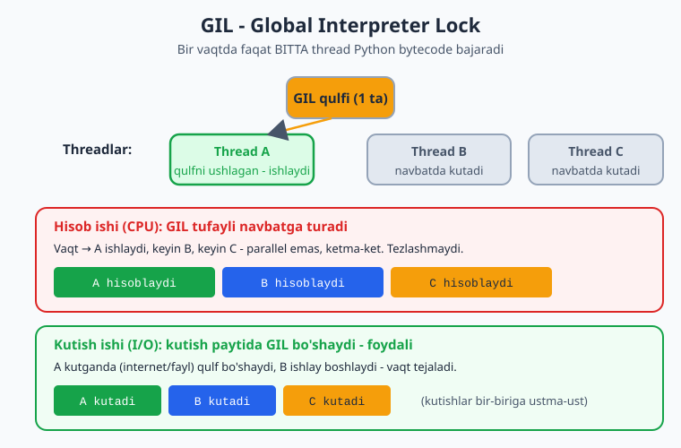
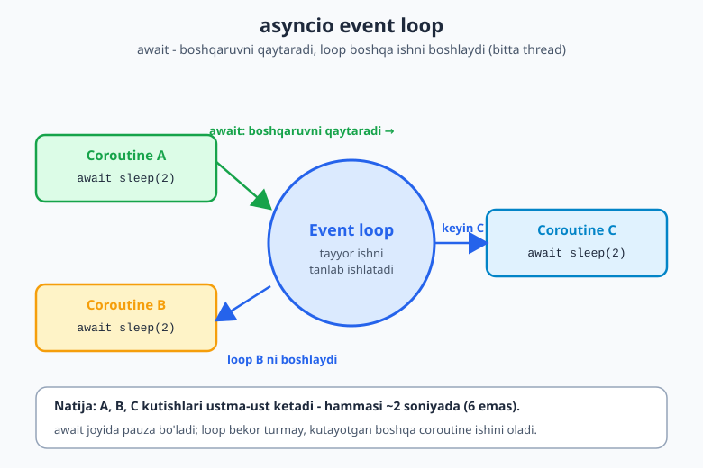
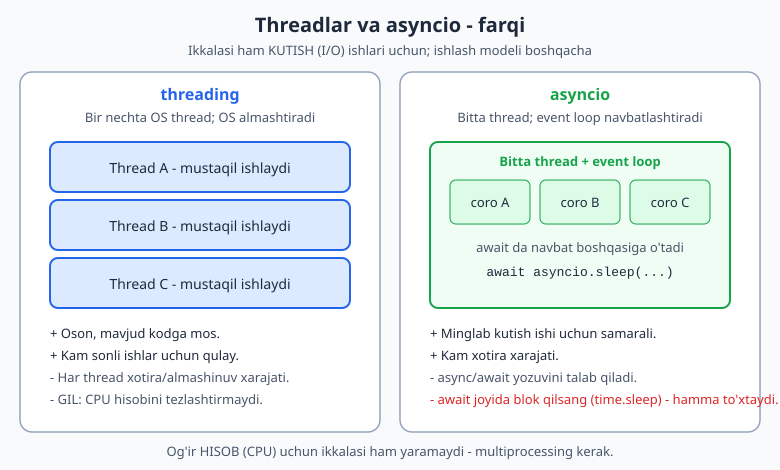

# 12 — Parallel ishlash va `asyncio`

Hozirgacha dasturlarimiz **ketma-ket** ishladi: bir ish tugaguncha keyingisi kutadi. Lekin ba'zan bir nechta ishni **bir vaqtda** qilish kerak — masalan, 100 ta internet sahifani yuklab olishda har birini navbatma-navbat kutish sekin. Bu modulda bir vaqtda bir nechta ishni boshqarishni o'rganasan. Bu mavzu biroz murakkab — tushunchalar darajasida, sodda misollar bilan ko'ramiz.

> **Bu modulda:** parallel ishlash nima, threadlar (I/O kutish uchun), `threading.Lock` (poyga holati), `concurrent.futures` (pul bilan oson parallellik), GIL tushunchasi (va Python 3.13 free-threaded eslatma), hamda `asyncio` (`async`/`await`) — `create_task`, `TaskGroup`, `gather`, `timeout`, `to_thread`, `async with`/`async for` va real I/O (`httpx`).

---

## 12.1 Nega parallel ishlash kerak?

Ishlar ikki xil bo'ladi:

- **Kutish ishi (I/O)** — internet so'rovi, fayl o'qish, baza so'rovi. Dastur ko'p vaqtni shunchaki **kutib** o'tkazadi.
- **Hisob ishi (CPU)** — og'ir matematik hisob-kitob. Protsessor band bo'ladi.

Kutish ishida parallellik juda foydali: bitta so'rovni kutib turganda, boshqasini boshlash mumkin. Misol uchun, 3 ta sahifani har biri 2 soniyada yuklasa — ketma-ket 6 soniya, parallel esa ~2 soniya.

---

## 12.2 Threadlar — bir vaqtda bir nechta ish

`threading` moduli bir nechta ishni "bir vaqtda" boshqarish imkonini beradi (ayniqsa kutish ishlarida foydali):

```python
import threading
import time

def yuklab_ol(nom: str) -> None:
    print(f"{nom} boshlandi")
    time.sleep(2)             # kutishni taqlid qiladi (masalan internet)
    print(f"{nom} tugadi")

# Uchta ishni parallel boshlash:
threadlar: list[threading.Thread] = []
for nom in ["A", "B", "C"]:
    t = threading.Thread(target=yuklab_ol, args=(nom,))
    threadlar.append(t)
    t.start()                 # boshlanadi

for t in threadlar:
    t.join()                  # hammasi tugashini kutamiz

# Ketma-ket bo'lsa 6 soniya, threadlar bilan ~2 soniya
```

> **Zamonaviy izoh:** funksiyaga `nom: str` kabi *type hint* qo'ydik va `list[threading.Thread]` bilan ro'yxat turini aniq belgiladik. Bu Python 3.13 uslubida — kod o'qish va xato topish osonlashadi.

---

## 12.3 `threading.Lock` — poyga holati (race condition)

Threadlar bir vaqtda **umumiy** ma'lumotni (masalan, bitta o'zgaruvchini) o'zgartirsa, muammo chiqadi. `hisoblagich += 1` aslida uch qadamdan iborat: **o'qi → ko'paytir → yoz**. Ikki thread bir vaqtda eski qiymatni o'qib qolsa, biri ikkinchisining ishini bekor qiladi — natija **kam** chiqadi. Buni **poyga holati** (race condition) deyiladi.

Yechim — `Lock` (qulf): bir vaqtda faqat **bitta** thread himoyalangan qismga kiradi:

```python
import threading

# Lock SIZ — poyga holati: natija noto'g'ri chiqishi mumkin
hisoblagich = 0

def oshir_xavfli() -> None:
    global hisoblagich
    for _ in range(100_000):
        hisoblagich += 1          # 3 thread BIR VAQTDA o'zgartirsa, qiymat yo'qoladi

threadlar = [threading.Thread(target=oshir_xavfli) for _ in range(3)]
for t in threadlar:
    t.start()
for t in threadlar:
    t.join()
print("Lock siz:", hisoblagich)   # 300000 BO'LMASLIGI mumkin!

# Lock BILAN — to'g'ri natija kafolatlanadi
hisoblagich2 = 0
lock = threading.Lock()

def oshir_xavfsiz() -> None:
    global hisoblagich2
    for _ in range(100_000):
        with lock:                # bir vaqtda faqat BITTA thread kiradi
            hisoblagich2 += 1

threadlar2 = [threading.Thread(target=oshir_xavfsiz) for _ in range(3)]
for t in threadlar2:
    t.start()
for t in threadlar2:
    t.join()
print("Lock bilan:", hisoblagich2)   # DOIM 300000
```

> **Diqqat:** "Lock siz" varianti ba'zan to'g'ri (300000) chiqishi mumkin, ba'zan kam — bu **bashorat qilib bo'lmaydigan** xato, eng yomon turi. Shuning uchun umumiy ma'lumotni bir nechta thread o'zgartirsa, **doim** `Lock` ishlat. `with lock:` blokidan chiqishda qulf avtomatik bo'shaydi.

---

## 12.4 `concurrent.futures` — pul (pool) bilan oson parallellik

`threading.Thread` ni qo'lda yaratish, `start`/`join` qilish ko'p ish. `concurrent.futures` moduli bularni **avtomatlashtiradi**: sen "ishchilar puli" (pool) yaratasan, ishlarni tashlaysan — qolganini modul boshqaradi.

**`ThreadPoolExecutor` + `map`** — eng oson yo'l. Ro'yxatning har bir elementiga funksiyani parallel qo'llaydi, natijalar **tartibda** qaytadi:

```python
from concurrent.futures import ThreadPoolExecutor
import time

def yuklab_ol(nom: str) -> str:
    time.sleep(1)                       # internet kutishni taqlid qiladi
    return f"{nom} yuklandi"

nomlar: list[str] = ["A", "B", "C", "D"]

with ThreadPoolExecutor(max_workers=4) as pool:
    # map — ro'yxatga tartib bilan qo'llaydi, natijalar TARTIBDA qaytadi:
    natijalar = list(pool.map(yuklab_ol, nomlar))

print(natijalar)   # ['A yuklandi', 'B yuklandi', 'C yuklandi', 'D yuklandi']
# 4 ta ish ~1 soniyada (ketma-ket 4 soniya bo'lardi)
```

**`submit` + `as_completed`** — ishni alohida yuborib, **qaysi birinchi tugasa** o'shani olish. `submit` `Future` (kelajak natija) qaytaradi; `as_completed` tugagan tartibida beradi:

```python
from concurrent.futures import ThreadPoolExecutor, as_completed
import time

def yuklab_ol(nom: str, sekund: float) -> str:
    time.sleep(sekund)
    return f"{nom} ({sekund}s)"

ishlar: dict[str, float] = {"A": 0.3, "B": 0.1, "C": 0.2}

with ThreadPoolExecutor(max_workers=3) as pool:
    # submit — har bir ishni alohida yuboradi, Future qaytaradi:
    futures = {pool.submit(yuklab_ol, nom, sek): nom for nom, sek in ishlar.items()}

    # as_completed — qaysi ish TUGAGAN bo'lsa, o'shani birinchi beradi:
    for fut in as_completed(futures):
        print("tayyor:", fut.result())
# Chiqish tartibi: B (0.1s) -> C (0.2s) -> A (0.3s)
```

**`ProcessPoolExecutor`** — bu yerda eng muhim farq: u **alohida protsesslar** ochadi, GIL chetlab o'tiladi. Shuning uchun **og'ir hisob (CPU)** ishlarini *haqiqatan* parallel bajaradi (threadlardan farqli):

```python
from concurrent.futures import ProcessPoolExecutor

def og_ir_hisob(n: int) -> int:
    # CPU ishi: katta yig'indi
    return sum(i * i for i in range(n))

def main() -> None:
    sonlar: list[int] = [1_000_000, 2_000_000, 3_000_000, 4_000_000]
    with ProcessPoolExecutor() as pool:
        natijalar = list(pool.map(og_ir_hisob, sonlar))
    print(natijalar)

if __name__ == "__main__":     # ProcessPoolExecutor uchun SHART (Windows/macOS)
    main()
```

> **Qoidalar:**
> - **`ThreadPoolExecutor`** → kutish (I/O) ishlari uchun.
> - **`ProcessPoolExecutor`** → og'ir hisob (CPU) ishlari uchun (GIL chetlab o'tiladi).
> - `with ... as pool:` bloki tugaganda pul avtomatik yopiladi va hamma ish tugashini kutadi.
> - `ProcessPoolExecutor` ishlatganda kodni `if __name__ == "__main__":` ichiga olish **shart**, aks holda Windows/macOS'da cheksiz protsess ochilishi mumkin.

---

## 12.5 GIL — Python'ning muhim xususiyati

Python'da bir muhim qoida bor: **GIL** (Global Interpreter Lock). Soddaroq aytganda — Python'da bir vaqtda faqat **bitta** thread haqiqiy hisob-kitob qiladi.

Bundan kelib chiqadigan oddiy qoida:

| Ish turi | Misol | Threadlar yordam beradimi? |
|----------|-------|----------------------------|
| **Kutish (I/O)** | internet, fayl, baza | ✅ Ha — kutishda boshqa thread ishlaydi |
| **Hisob (CPU)** | og'ir matematika | ❌ Yo'q — GIL tufayli navbatga turadi |

> Ya'ni: agar dasturing ko'p **kutsa** (internet/fayl) — threadlar tezlashtiradi. Agar ko'p **hisoblasa** (matematika) — threadlar yordam bermaydi (buning uchun alohida usul, `multiprocessing` yoki `ProcessPoolExecutor`, bor). Hozircha shu qoidani bilib qo'y.

Quyidagi diagramma GIL qulfi qanday ishlashini ko'rsatadi — bir vaqtda faqat bitta thread Python bytecode bajaradi:



### GIL'ning kelajagi: free-threaded Python 3.13 (PEP 703)

Python 3.13 dan boshlab **eksperimental** ravishda **GIL'siz** (free-threaded) Python paydo bo'ldi — bu **PEP 703** loyihasi. Unda alohida o'rnatiladigan variant (masalan `python3.13t`) GIL'ni umuman o'chiradi, shunda threadlar **haqiqiy** parallel hisob-kitob qila oladi (bir nechta yadroda bir vaqtda).

> **Lekin hozircha ehtiyot bo'l:**
> - Bu hali **eksperimental** — har Python'da yoqilgan emas, alohida "free-threaded" build kerak.
> - Ko'p kutubxonalar hali GIL'siz rejimda sinovdan o'tmagan.
> - Bitta thread'li kod biroz sekinroq ishlashi mumkin.
>
> Ya'ni kelajakda "GIL tufayli CPU ishida threadlar foydasiz" qoidasi yumshashi mumkin. Ammo **bugun** loyihalar uchun yuqoridagi jadval (CPU → `ProcessPoolExecutor`, I/O → threadlar/asyncio) hamon to'g'ri. Free-threaded Python — kuzatib boriladigan kelajak, hozirgi standart emas.

---

## 12.6 `asyncio` — minglab kutish ishini boshqarish

`asyncio` — ayniqsa ko'p sonli kutish ishlari (masalan minglab internet so'rovi) uchun zamonaviy usul. `async def` bilan maxsus funksiya yozasan, `await` bilan "kutilayotgan" joyda boshqaruvni bo'shatasan:

```python
import asyncio

async def yuklab_ol(nom: str) -> str:
    print(f"{nom} boshlandi")
    await asyncio.sleep(2)        # NOMBLOCKING kutish (time.sleep emas!)
    print(f"{nom} tugadi")
    return f"{nom} natijasi"

async def main() -> None:
    # gather — bir nechta ishni BIR VAQTDA boshlaydi:
    natijalar = await asyncio.gather(
        yuklab_ol("A"),
        yuklab_ol("B"),
        yuklab_ol("C"),
    )
    print(natijalar)              # ~2 soniyada hammasi (6 emas)

asyncio.run(main())               # async dasturni shunday ishga tushirasan
```

> **Eng ko'p uchraydigan xato:** `async` funksiya ichida oddiy `time.sleep()` ishlatish — u hammasini bloklaydi. `asyncio.sleep()` ishlat. Async kodda kutish uchun maxsus, "nomblocking" funksiyalar bo'ladi.

Mana `asyncio` qanday ishlaydi: `await` ga yetganda coroutine boshqaruvni **event loop**'ga qaytaradi, loop esa kutib turgan boshqa coroutine ishini boshlaydi (hammasi bitta thread'da):



---

## 12.7 `create_task` va `TaskGroup` — ishni fonda boshlash

`gather` bir nechta ishni birga boshlash uchun qulay. Lekin ba'zan ishni **fonda boshlab**, keyin natijani olish kerak. Buning uchun `asyncio.create_task` bor — u coroutine'ni **darhol** ishga tushirib, `Task` obyekti qaytaradi:

```python
import asyncio
import time

async def yuklab_ol(nom: str, sek: float) -> str:
    await asyncio.sleep(sek)
    return f"{nom} tayyor"

async def main() -> None:
    b = time.perf_counter()
    # create_task — coroutine'ni DARHOL fonda ishga tushiradi (Task obyekti):
    t1 = asyncio.create_task(yuklab_ol("A", 1))
    t2 = asyncio.create_task(yuklab_ol("B", 1))

    # Ikkala task allaqachon parallel ishlayapti; natijani await bilan olamiz:
    print(await t1)
    print(await t2)
    print(f"Umumiy: {time.perf_counter() - b:.2f}s")   # ~1s (2 emas)

asyncio.run(main())
```

> **Muhim farq:** agar shunchaki `await yuklab_ol("A", 1)` deb yozsang, u **tugamaguncha** keyingi qatorga o'tmaysan (ketma-ket). `create_task` esa ishni **darhol** boshlaydi — `await` qilgunga qadar fonda ishlayveradi.

**`asyncio.TaskGroup`** (Python 3.11+) — bir nechta task'ni **strukturaviy** boshqarishning zamonaviy yo'li. `async with` bloki tugaguncha hamma task tugashi kafolatlanadi; biror task xato bersa, qolganlari ham to'g'ri tozalanadi:

```python
import asyncio

async def yuklab_ol(nom: str, sek: float) -> str:
    await asyncio.sleep(sek)
    print(f"{nom} tugadi")
    return nom

async def main() -> None:
    tasklar: list[asyncio.Task[str]] = []
    # TaskGroup (3.11+) — strukturaviy: blok tugaguncha HAMMA task tugaydi.
    async with asyncio.TaskGroup() as tg:
        tasklar.append(tg.create_task(yuklab_ol("A", 0.3)))
        tasklar.append(tg.create_task(yuklab_ol("B", 0.1)))
        tasklar.append(tg.create_task(yuklab_ol("C", 0.2)))
    # Bu yerga yetganda hammasi tugagan; natijalarni .result() bilan olamiz:
    print("Natijalar:", [t.result() for t in tasklar])

asyncio.run(main())
# B tugadi / C tugadi / A tugadi
# Natijalar: ['A', 'B', 'C']
```

> **`gather` va `TaskGroup`:** ikkalasi ham bir nechta ishni parallel bajaradi. `TaskGroup` zamonaviyroq (3.11+) — xato bo'lganda hamma task'ni avtomatik to'g'ri to'xtatadi, kod tartibliroq. Yangi kodda `TaskGroup` afzal, `gather` esa hamon keng qo'llaniladi.

---

## 12.8 `gather` chuqurroq, `timeout` va `to_thread`

### `gather` va xatolar

Odatda `gather` ichida biror coroutine xato bersa, butun `gather` to'xtaydi. Agar **qolgan ishlar davom etsin** desang, `return_exceptions=True` ber — u holda xato natija o'rniga `Exception` obyekti qaytadi:

```python
import asyncio

async def ishonchli(nom: str) -> str:
    await asyncio.sleep(0.1)
    return f"{nom} OK"

async def xatoli(nom: str) -> str:
    await asyncio.sleep(0.1)
    raise ValueError(f"{nom} buzildi")

async def main() -> None:
    # return_exceptions=True — bitta ish xato bersa ham, qolganlar to'xtamaydi.
    natijalar = await asyncio.gather(
        ishonchli("A"),
        xatoli("B"),
        ishonchli("C"),
        return_exceptions=True,
    )
    for n in natijalar:
        if isinstance(n, Exception):
            print("XATO:", n)
        else:
            print("natija:", n)

asyncio.run(main())
# natija: A OK / XATO: B buzildi / natija: C OK
```

### `asyncio.timeout` — vaqt chegarasi (3.11+)

Internet so'rovi cheksiz osilib qolmasligi uchun unga **vaqt chegarasi** qo'yiladi. `asyncio.timeout` blok belgilangan vaqtda tugamasa, ishni bekor qilib `TimeoutError` beradi:

```python
import asyncio

async def sekin_ish() -> str:
    await asyncio.sleep(5)             # 5 soniya kutadi
    return "tugadi"

async def main() -> None:
    try:
        # asyncio.timeout (3.11+) — blok 2 soniyada tugamasa, bekor qiladi:
        async with asyncio.timeout(2):
            natija = await sekin_ish()
            print(natija)
    except TimeoutError:
        print("Vaqt tugadi! Ish 2 soniyada ulgurmadi.")

asyncio.run(main())
# Vaqt tugadi! Ish 2 soniyada ulgurmadi.
```

### `asyncio.to_thread` — bloklovchi kodni async ichida ishlatish

Ba'zan eski yoki sinxron funksiya (masalan `time.sleep`, `requests.get`, og'ir fayl o'qish) bor — uni to'g'ridan-to'g'ri `await` qilib bo'lmaydi, va u event loop'ni **bloklaydi**. `asyncio.to_thread` shu bloklovchi funksiyani **alohida thread**'da ishga tushiradi, event loop esa erkin qoladi:

```python
import asyncio
import time

def bloklovchi_ish(nom: str) -> str:
    # Bu ODDIY (sinxron) funksiya — ichida bloklovchi time.sleep bor.
    # Masalan: eski kutubxona, fayl o'qish, requests.get ...
    time.sleep(1)
    return f"{nom} tugadi"

async def main() -> None:
    b = time.perf_counter()
    # to_thread — bloklovchi funksiyani ALOHIDA thread'da ishga tushiradi,
    # event loop esa bloklanmaydi:
    natijalar = await asyncio.gather(
        asyncio.to_thread(bloklovchi_ish, "A"),
        asyncio.to_thread(bloklovchi_ish, "B"),
        asyncio.to_thread(bloklovchi_ish, "C"),
    )
    print(natijalar)
    print(f"Umumiy: {time.perf_counter() - b:.2f}s")   # ~1s (3 emas)

asyncio.run(main())
```

> **Foydasi:** `to_thread` — async dunyo bilan eski sinxron kodni bog'lovchi ko'prik. Async loyihada mavjud bloklovchi funksiyani qayta yozmasdan ishlatish imkonini beradi.

---

## 12.9 `async with` va `async for`

Async dunyoda oddiy `with` va `for` ning asinxron variantlari bor.

**`async with`** — async kontekst menejeri (resursni ochib, oxirida avtomatik yopadi — masalan tarmoq ulanishi). Yuqorida `asyncio.timeout(...)` va `asyncio.TaskGroup()` ni aynan `async with` bilan ishlatdik. Quyida `httpx.AsyncClient` ham shunday ishlatiladi.

**`async for`** — asinxron oqimni (async generator) element-element o'qiydi. Har bir element "kutib" kelganda navbati bilan beriladi:

```python
import asyncio
from collections.abc import AsyncIterator

async def sahifalar() -> AsyncIterator[str]:
    # async generator — har bir elementni "kutib" beradi:
    for i in range(1, 4):
        await asyncio.sleep(0.1)       # har sahifani yuklashni taqlid qiladi
        yield f"sahifa-{i}"

async def main() -> None:
    # async for — asinxron oqimni element-element o'qiydi:
    async for sahifa in sahifalar():
        print("keldi:", sahifa)

asyncio.run(main())
# keldi: sahifa-1 / keldi: sahifa-2 / keldi: sahifa-3
```

> **Qachon kerak?** `async for` — ma'lumot bo'lak-bo'lak, kutib kelganda foydali: katta faylni oqim sifatida o'qish, tarmoq orqali kelayotgan xabarlarni navbati bilan qabul qilish, baza natijalarini sahifalab olish kabi holatlar.

---

## 12.10 Real I/O misoli: `httpx` bilan async so'rovlar

Endi haqiqiy misol. `asyncio.sleep` "kutish"ni taqlid qildi — endi **chinakam** internet so'rovi yuboramiz. Buning uchun `httpx` kutubxonasi async'ni qo'llab-quvvatlaydi (mashhur `requests` async emas):

```bash
pip install httpx
```

```python
import asyncio
import httpx

async def sahifa_olchami(client: httpx.AsyncClient, url: str) -> tuple[str, int]:
    javob = await client.get(url)
    return url, len(javob.text)

async def main() -> None:
    urllar: list[str] = [
        "https://example.com",
        "https://httpbin.org/get",
        "https://www.python.org",
    ]
    # async with — clientni ochib, oxirida avtomatik yopadi:
    async with httpx.AsyncClient(timeout=10) as client:
        natijalar = await asyncio.gather(
            *[sahifa_olchami(client, u) for u in urllar]
        )
    for url, olcham in natijalar:
        print(f"{url} -> {olcham} belgi")

asyncio.run(main())
```

Bu yerda uchta so'rov **bir vaqtda** yuboriladi. Agar har biri 1 soniya kutsa — ketma-ket 3 soniya, `gather` bilan ~1 soniya. 100 ta sahifada farq yanada katta: shu sababdan ko'p sonli internet so'rovi uchun `asyncio` + async client (`httpx`) eng samarali tanlov.

> **Eslatma:** `httpx` standart kutubxonada emas — uni `pip install httpx` bilan o'rnatasan. Bitta `AsyncClient`'ni `async with` ichida ochib, undagi barcha so'rovlar uchun **qayta ishlatish** to'g'ri uslub (har so'rovda yangi client ochmaslik kerak). Async dunyoda `requests` o'rniga `httpx` (yoki `aiohttp`) ishlatiladi.

---

## 12.11 Qaysi usulni qachon ishlataman?

Sodda yo'riqnoma:

```
Bitta ish, parallel kerak emas?
  -> oddiy ketma-ket kod (murakkablashtirma!)

Bir nechta kutish ishi (internet/fayl), kam son?
  -> threading yoki ThreadPoolExecutor (oson)

Juda ko'p kutish ishi (minglab so'rov)?
  -> asyncio (+ httpx) — eng samarali

Og'ir hisob-kitob (CPU)?
  -> ProcessPoolExecutor / multiprocessing (GIL chetlab o'tiladi)
```

`threading` va `asyncio` ikkalasi ham kutish (I/O) ishlari uchun, lekin ishlash modeli farq qiladi — threadlarda bir nechta OS thread bo'ladi, `asyncio`da esa bitta thread ichida event loop navbatlashtiradi:



Jamlangan jadval:

| Vosita | Eng mos ish | Model | Eslatma |
|--------|-------------|-------|---------|
| `threading` / `ThreadPoolExecutor` | kutish (I/O), kam son | ko'p OS thread | umumiy ma'lumotda `Lock` kerak |
| `asyncio` (+ `httpx`) | kutish (I/O), ko'p son | bitta thread, event loop | `await`, bloklovchi kod taqiqlanadi |
| `ProcessPoolExecutor` / `multiprocessing` | hisob (CPU) | alohida protsesslar | GIL chetlab o'tiladi |

> **Eng muhim maslahat:** parallellik kodni murakkablashtiradi va yangi xatolar (masalan bir vaqtda bir ma'lumotni o'zgartirish — poyga holati) keltiradi. Faqat **haqiqatan kerak bo'lganda** ishlat. Avvalo oddiy ketma-ket kod yoz — sekin bo'lsa, keyin optimallashtir.

---

## ✍️ Masalalar (26 ta)

> Bu mavzu murakkab — masalalar asosan tushunish va oddiy misollar uchun.

**Oson (1–7):**

1. Bitta `async def salom()` yoz: "salom" chop etsin. `asyncio.run` bilan ishga tushir.
2. `await asyncio.sleep(1)` bilan 1 soniya kutib, keyin xabar chiqaruvchi coroutine yoz.
3. `threading.Thread` bilan bitta funksiyani ishga tushir (ichida `time.sleep(1)`).
4. GIL nima ekanini o'z so'zlaring bilan (kod izohi sifatida) yoz.
5. Kutish ishi (I/O) va hisob ishi (CPU) farqini misol bilan izohda yoz.
6. `asyncio.gather` bilan ikkita oddiy coroutine'ni birga ishga tushir.
7. `threading.Thread` bilan ikkita funksiyani parallel boshla (`start` + `join`).

**O'rta (8–14):**

8. `asyncio.gather` bilan 3 ta coroutine'ni birga ishga tushir, har biri turli muddat uxlasin.
9. Async funksiya yoz: parametr sifatida nom va kutish vaqtini olsin, kutgach nomni qaytarsin.
10. 3 ta thread'ni ro'yxatda yaratib, hammasini `start` qil, keyin `join` bilan kut.
11. Async coroutine natijasini `await` bilan olib, o'zgaruvchiga saqlab chiqar.
12. `time.sleep` (oddiy) va `asyncio.sleep` (async) farqini izohda tushuntir.
13. `asyncio.gather` natijasini ro'yxatga olib, har birini chiqar.
14. Bir vaqtda 5 ta "yuklab olish"ni (har biri `asyncio.sleep`) ishga tushirib, umumiy vaqtni `time` bilan o'lcha.

**Murakkab (15–20):**

15. Ketma-ket va parallel (gather bilan) bajarishni taqqosla: 3 ta 1-soniyalik ishni ikki usulda bajarib, vaqtlarini chiqar.
16. Async funksiyalar zanjiri: bittasi natija qaytarsin, ikkinchisi shu natijani ishlatsin (`await` bilan).
17. `threading` bilan umumiy hisoblagichni bir nechta thread'dan oshir; natija to'g'ri chiqishini kuzat (bu yerda `Lock` kerakligini izohda ayt).
18. `asyncio.gather` bilan 10 ta ishni parallel bajar, har biri o'z nomini va natijasini qaytarsin.
19. Oddiy "yuklab oluvchi" simulyator: nomlar ro'yxatini async tarzda "yuklab ol" (har biri tasodifiy vaqt uxlasin, `asyncio.sleep` + `random`).
20. Threadli va asyncioli variantni yonma-yon yozib, qaysi qaysi holatda mosligini izohda tushuntir (kutish vs hisob).

**Qo'shimcha — zamonaviy vositalar (21–26):**

21. `ThreadPoolExecutor` va `map` bilan `[1, 2, 3, 4, 5]` ro'yxatining har bir elementi kvadratini parallel hisobla.
22. `ThreadPoolExecutor` + `submit` va `as_completed` bilan ikkita ishni yubor (turli `time.sleep`), qaysi birinchi tugasa o'shani chiqar.
23. `asyncio.TaskGroup` bilan ikkita coroutine'ni ishga tushir, blokdan keyin natijalarini `.result()` orqali chiqar.
24. `asyncio.timeout(1)` ichida 3 soniya uxlovchi coroutine'ni chaqir; `TimeoutError`'ni ushlab xabar chiqar.
25. `asyncio.to_thread` bilan ikkita bloklovchi (`time.sleep`) funksiyani parallel bajarib, natijalarini ol.
26. `asyncio.gather(..., return_exceptions=True)` bilan 3 ta coroutine ishga tushir (biri xato bersin) va har natijani (xato/normal) ajratib chiqar.

---

## ✅ Yechimlar

<details markdown="1">
<summary>Ko'rsatish uchun ochish</summary>

```python
import asyncio
import threading
import time

# 1
async def salom() -> None:
    print("salom")
asyncio.run(salom())

# 2
async def kut() -> None:
    await asyncio.sleep(1)
    print("1 soniya o'tdi")
asyncio.run(kut())

# 3
def ish() -> None:
    time.sleep(1)
    print("ish tugadi")
t = threading.Thread(target=ish)
t.start(); t.join()

# 4
# GIL: Python'da bir vaqtda faqat bitta thread haqiqiy hisob-kitob qiladi.
# Shuning uchun og'ir CPU ishida threadlar tezlashtirmaydi,
# lekin kutish (I/O) ishida foydali — kutishda boshqa thread ishlay oladi.

# 5
# I/O ishi: internet so'rovi, fayl o'qish — dastur ko'p kutadi.
# CPU ishi: katta matematik hisob — protsessor band bo'ladi.
# Parallellik I/O da ko'proq foyda beradi.

# 6
async def a() -> str:
    await asyncio.sleep(0.5); return "a"
async def b() -> str:
    await asyncio.sleep(0.5); return "b"
async def m6() -> None:
    print(await asyncio.gather(a(), b()))
asyncio.run(m6())

# 7
def ish2(nom: str) -> None:
    time.sleep(1)
    print(f"{nom} tugadi")
t1 = threading.Thread(target=ish2, args=("A",))
t2 = threading.Thread(target=ish2, args=("B",))
t1.start(); t2.start(); t1.join(); t2.join()

# 8
async def uxla(nom: str, sek: float) -> str:
    await asyncio.sleep(sek)
    return f"{nom}: {sek}s"
async def m8() -> None:
    print(await asyncio.gather(uxla("A", 1), uxla("B", 0.5), uxla("C", 0.2)))
asyncio.run(m8())

# 9
async def yuklab(nom: str, vaqt: float) -> str:
    await asyncio.sleep(vaqt)
    return nom
async def m9() -> None:
    print(await yuklab("Sahifa", 0.3))
asyncio.run(m9())

# 10
def ish3(nom: str) -> None:
    time.sleep(0.5)
    print(nom)
threadlar = [threading.Thread(target=ish3, args=(f"T{i}",)) for i in range(3)]
for t in threadlar: t.start()
for t in threadlar: t.join()

# 11
async def hisob() -> int:
    await asyncio.sleep(0.2)
    return 42
async def m11() -> None:
    natija = await hisob()
    print("Natija:", natija)
asyncio.run(m11())

# 12
# time.sleep — butun dasturni (yoki event loop'ni) bloklaydi.
# asyncio.sleep — faqat shu coroutine'ni "uxlatadi", boshqalar ishlay beradi.
# Async kodda DOIM asyncio.sleep ishlat.

# 13
async def m13() -> None:
    natijalar = await asyncio.gather(*[uxla(f"ish{i}", 0.1) for i in range(3)])
    for n in natijalar:
        print(n)
asyncio.run(m13())

# 14
async def m14() -> None:
    b = time.perf_counter()
    await asyncio.gather(*[asyncio.sleep(1) for _ in range(5)])
    print(f"5 ta ish: {time.perf_counter() - b:.2f}s")   # ~1s (parallel)
asyncio.run(m14())

# 15
async def bir_ish() -> None:
    await asyncio.sleep(1)
async def m15() -> None:
    # ketma-ket:
    b = time.perf_counter()
    for _ in range(3):
        await bir_ish()
    print(f"ketma-ket: {time.perf_counter() - b:.2f}s")   # ~3s
    # parallel:
    b = time.perf_counter()
    await asyncio.gather(bir_ish(), bir_ish(), bir_ish())
    print(f"parallel: {time.perf_counter() - b:.2f}s")     # ~1s
asyncio.run(m15())

# 16
async def birinchi() -> int:
    await asyncio.sleep(0.2)
    return 10
async def ikkinchi(x: int) -> int:
    await asyncio.sleep(0.2)
    return x * 2
async def m16() -> None:
    a = await birinchi()
    b = await ikkinchi(a)
    print(b)                  # 20
asyncio.run(m16())

# 17
hisoblagich = 0
lock = threading.Lock()
def oshir() -> None:
    global hisoblagich
    for _ in range(10000):
        with lock:            # Lock — bir vaqtda faqat bitta thread o'zgartirsin
            hisoblagich += 1
ts = [threading.Thread(target=oshir) for _ in range(3)]
for t in ts: t.start()
for t in ts: t.join()
print(hisoblagich)            # 30000  (Lock'siz kamroq chiqishi mumkin edi)

# 18
async def vazifa(i: int) -> str:
    await asyncio.sleep(0.1)
    return f"ish{i} tayyor"
async def m18() -> None:
    natijalar = await asyncio.gather(*[vazifa(i) for i in range(10)])
    print(natijalar)
asyncio.run(m18())

# 19
import random
async def yuklab_ol(nom: str) -> str:
    await asyncio.sleep(random.uniform(0.1, 0.5))
    return f"{nom} yuklandi"
async def m19() -> None:
    nomlar = ["sahifa1", "sahifa2", "sahifa3"]
    print(await asyncio.gather(*[yuklab_ol(n) for n in nomlar]))
asyncio.run(m19())

# 20
# threading — oddiy kod bilan, kam sonli kutish ishlari uchun qulay.
# asyncio — ko'p sonli kutish ishlari (minglab so'rov) uchun samarali.
# Ikkalasi ham KUTISH (I/O) uchun. Og'ir HISOB uchun ProcessPoolExecutor kerak.

# 21
from concurrent.futures import ThreadPoolExecutor, as_completed
def kvadrat(n: int) -> int:
    return n * n
with ThreadPoolExecutor() as pool:
    print(list(pool.map(kvadrat, [1, 2, 3, 4, 5])))   # [1, 4, 9, 16, 25]

# 22
def ish_22(nom: str, sek: float) -> str:
    time.sleep(sek)
    return nom
with ThreadPoolExecutor() as pool:
    futures = [pool.submit(ish_22, n, s) for n, s in [("A", 0.3), ("B", 0.1)]]
    for fut in as_completed(futures):
        print("tugadi:", fut.result())   # B birinchi (tezroq)

# 23
async def yuklab_23(nom: str, sek: float) -> str:
    await asyncio.sleep(sek)
    return nom
async def m23() -> None:
    async with asyncio.TaskGroup() as tg:
        t1 = tg.create_task(yuklab_23("X", 0.2))
        t2 = tg.create_task(yuklab_23("Y", 0.1))
    print(t1.result(), t2.result())   # X Y
asyncio.run(m23())

# 24
async def sekin() -> str:
    await asyncio.sleep(3)
    return "tugadi"
async def m24() -> None:
    try:
        async with asyncio.timeout(1):
            await sekin()
    except TimeoutError:
        print("vaqt tugadi")
asyncio.run(m24())

# 25
def bloklovchi(nom: str) -> str:
    time.sleep(0.5)
    return nom
async def m25() -> None:
    natijalar = await asyncio.gather(
        asyncio.to_thread(bloklovchi, "A"),
        asyncio.to_thread(bloklovchi, "B"),
    )
    print(natijalar)   # ['A', 'B'] ~0.5s da
asyncio.run(m25())

# 26
async def buzuq(nom: str) -> str:
    await asyncio.sleep(0.1)
    if nom == "B":
        raise ValueError("B xato")
    return nom
async def m26() -> None:
    natijalar = await asyncio.gather(
        buzuq("A"), buzuq("B"), buzuq("C"),
        return_exceptions=True,
    )
    for n in natijalar:
        print("xato" if isinstance(n, Exception) else n)
asyncio.run(m26())
```

</details>

---

[← Standart kutubxona](./11-standart-kutubxona.md) | [Boshlovchilar README ↑](./README.md) | [Keyingi: Testlash →](./13-testlash.md)
