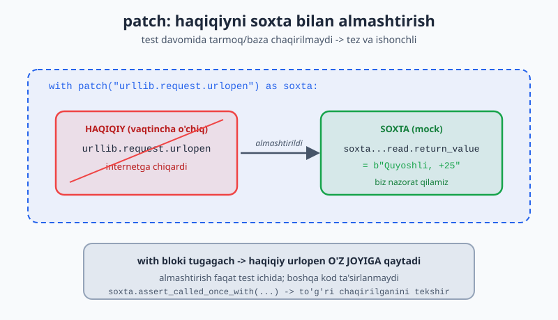

# 13 — Dasturni test qilish (`pytest`)

Kod yozdik — lekin u to'g'ri ishlayaptimi? Har safar qo'lda tekshirish (dasturni ishga tushirib, natijani ko'rib) zerikarli va ishonchsiz. **Testlar** — kodning to'g'ri ishlashini avtomatik tekshiradigan kod. Python'da buning eng mashhur vositasi — **`pytest`**. Bu modulda ishonchli test yozishni o'rganasan.

> **Bu modulda:** nega test kerak, `pytest` asoslari (`assert`, test funksiyalari), fixture'lar, parametrlash, va xatolarni test qilish.

---

## 13.1 Nega test yozamiz?

Tasavvur qil: katta dasturda bir joyni o'zgartirding. Boshqa joy buzilmaganini qanday bilasan? Qo'lda hammasini sinab ko'rish — uzoq va xatoga yo'l qo'yiladi. Testlar bir buyruq bilan hamma narsani tekshiradi.

`pytest` ni o'rnatish (terminalda):

```bash
pip install pytest
```

---

## 13.2 Birinchi test

Test — `assert` ishlatadigan oddiy funksiya. `assert` shartni tekshiradi: agar `True` bo'lsa hech narsa, `False` bo'lsa xato (test "yiqiladi"):

```python
# matematika.py
def qosh(a: int, b: int) -> int:    # 3.13: tip ko'rsatmalari bilan — niyat aniq
    return a + b
```

```python
# test_matematika.py   ← fayl nomi test_ bilan boshlanishi SHART
from matematika import qosh

def test_qosh():                  # funksiya nomi ham test_ bilan
    assert qosh(2, 3) == 5        # "qosh(2,3) natijasi 5 ga teng bo'lishi kerak"

def test_qosh_manfiy():
    assert qosh(-1, -1) == -2
```

Testlarni ishga tushirish (terminalda, fayl turgan papkada):

```bash
pytest                # barcha test_*.py fayllarni topib ishga tushiradi
pytest -v             # batafsil (har test nomi ko'rinadi)
```

Hammasi to'g'ri bo'lsa, yashil `PASSED` chiqadi. Xato bo'lsa, qaysi test va nima sababdan yiqilganini ko'rsatadi.

> **Discovery qoidasi:** `pytest` `test_` bilan boshlanadigan fayllardagi `test_` bilan boshlanadigan funksiyalarni avtomatik topadi. Hech narsa ro'yxatga olish kerak emas.

Har bir test odatda bir xil uch bosqichdan iborat bo'ladi: tayyorla, ishlat, tekshir.


---

## 13.3 `assert` — turli tekshiruvlar

```python
def test_misollar():
    assert 2 + 2 == 4
    assert "salom" in "salom dunyo"      # ichida bormi
    assert len([1, 2, 3]) == 3
    assert [1, 2] == [1, 2]              # ro'yxatlar teng
    natija = None
    assert natija is None
    assert 5 > 3
```

`pytest` aqlli — test yiqilsa, nima kutilgani va nima chiqqanini ko'rsatadi:

```python
def test_xato():
    assert qosh(2, 2) == 5
# pytest chiqaradi:
#   assert 4 == 5
```

---

## 13.4 Fixture — test uchun tayyor ma'lumot

Ko'p testga bir xil tayyorgarlik kerak bo'lsa, **fixture** ishlatasan. Fixture — testga argument sifatida uzatiladigan tayyor ma'lumot:

```python
import pytest

@pytest.fixture
def namuna_talaba():
    return {"ism": "Aziz", "yosh": 20}

def test_ism(namuna_talaba):              # fixture nomini argument qilib ol
    assert namuna_talaba["ism"] == "Aziz"

def test_yosh(namuna_talaba):
    assert namuna_talaba["yosh"] >= 18
```

`pytest` `namuna_talaba` ni avtomatik chaqirib, natijasini testga uzatadi. Bu takror tayyorgarlikni kamaytiradi.

Quyidagi diagramma bitta fixture qanday qilib bir nechta testga tayyor ma'lumot berishini ko'rsatadi.


---

## 13.5 `parametrize` — bitta test, ko'p holat

Bir testni turli kirishlar bilan tekshirish uchun:

```python
import pytest

@pytest.mark.parametrize("kirish, kutilgan", [
    (2, 4),
    (3, 9),
    (4, 16),
    (0, 0),
])
def test_kvadrat(kirish, kutilgan):
    assert kirish ** 2 == kutilgan
# Bu 4 ta alohida test sifatida ishlaydi
```

> Bu juda foydali: bir funksiyani 10 ta holat bilan sinashing kerak bo'lsa, 10 ta alohida test yozish o'rniga bitta `parametrize` jadval yozasan.

Diagrammada jadvaldagi har bir qator alohida test sifatida ishlashini ko'rishing mumkin.


---

## 13.6 Xatolarni test qilish

Funksiya kerakli vaqtda xato chaqirishini ham test qilish kerak (7-modulni esla):

```python
import pytest

def bol(a: float, b: float) -> float:
    if b == 0:
        raise ValueError("nolga bo'lish mumkin emas")
    return a / b

def test_normal():
    assert bol(10, 2) == 5

def test_nolga_bolish():
    with pytest.raises(ValueError):        # "bu yerda ValueError chiqishi KERAK"
        bol(10, 0)
```

`pytest.raises` ichidagi kod kutilgan xatoni chaqirmasa, test yiqiladi. Ya'ni "xato chiqishi shart" ekanini tekshiradi.

---

## 13.7 TDD — avval test, keyin kod

Ilg'or amaliyot **TDD** (Test-Driven Development): avval test yozasan (u yiqiladi, chunki kod yo'q), keyin testni o'tkazadigan kod yozasan. Bu kodni aniq talablar asosida yozishga majbur qiladi.

```python
# 1. Avval test (yiqiladi):
def test_juft():
    assert juftmi(4) is True
    assert juftmi(3) is False

# 2. Keyin testni o'tkazadigan kod:
def juftmi(n: int) -> bool:
    return n % 2 == 0
```

> Hozircha TDD'ni qat'iy qo'llash shart emas. Lekin "kodimni qanday test qilaman?" deb o'ylash — kodni yaxshiroq yozishga yordam beradi.

---

## 13.8 `unittest.mock` — soxta obyektlar (Mock, MagicMock, patch)

Tasavvur qil: funksiyang internetdan ob-havo oladi yoki ma'lumotlar bazasiga yozadi. Bunday kodni test qilish qiyin — har testda haqiqiy tarmoq yoki bazaga murojaat qilsang, test sekin, ishonchsiz va internetga bog'liq bo'ladi. Yechim — **soxta obyekt (mock)**: haqiqiy obyektga o'xshab tutadigan, lekin biz nazorat qiladigan "qalbaki" obyekt. Python'da buning vositasi standart kutubxonadagi `unittest.mock`.

### Mock asoslari

`Mock()` — har qanday metod va atributni "qabul qiladigan" sehrli obyekt. Unga oldindan "shuni qaytar" deb aytib qo'yasan:

```python
from unittest.mock import Mock

def test_mock_asoslari():
    soxta = Mock()
    soxta.olish.return_value = {"ism": "Aziz", "yosh": 20}  # "olish() chaqirilsa, shuni qaytar"

    natija = soxta.olish(5)

    assert natija == {"ism": "Aziz", "yosh": 20}
    soxta.olish.assert_called_once()          # roppa-rosa bir marta chaqirilganmi
    soxta.olish.assert_called_with(5)          # 5 argumenti bilan chaqirilganmi
    assert soxta.olish.call_count == 1         # necha marta chaqirildi
# PASSED — mock chaqiruvlarni "eslab qoladi"
```

Mock'ning kuchi: u nafaqat qiymat qaytaradi, balki **qanday chaqirilganini ham yozib boradi**. `assert_called_with` orqali funksiyang to'g'ri argument bilan chaqirilganini tekshirasan.

### MagicMock — sehrli metodlar bilan

`MagicMock` — `Mock`'ning kuchliroq versiyasi: `len()`, `[]` (indekslash), `in` kabi maxsus (dunder) operatorlarni ham qo'llab-quvvatlaydi:

```python
from unittest.mock import MagicMock

def test_magicmock():
    soxta = MagicMock()
    soxta.__len__.return_value = 3

    assert len(soxta) == 3           # len() ishlaydi
    soxta[0] = "salom"               # indeks bilan yozish ham ishlaydi
    qiymat = soxta["kalit"]          # o'qish — yana MagicMock qaytaradi
    assert isinstance(qiymat, MagicMock)
# PASSED
```

> Qachon qaysi biri? `patch` odatda avtomatik `MagicMock` beradi. Oddiy holatda `Mock`, `len`/`[]` kerak bo'lsa `MagicMock` ishlat.

### `patch` — haqiqiy narsani vaqtincha almashtirish

Eng kuchli qurol — `patch`. U test davomida haqiqiy funksiya/obyektni soxtasi bilan almashtiradi, test tugagach o'z joyiga qaytaradi. Misol: tarmoqqa chiqadigan funksiyani **tarmoqsiz** test qilamiz:

```python
import urllib.request

def ob_havo(shahar: str) -> str:
    javob = urllib.request.urlopen(f"https://api.example.com/{shahar}")
    return javob.read().decode()
```

```python
from unittest.mock import patch

def test_ob_havo_patch():
    with patch("urllib.request.urlopen") as soxta_url:
        # urlopen(...).read() nima qaytarishini biz belgilaymiz:
        soxta_url.return_value.read.return_value = b"Quyoshli, +25"

        natija = ob_havo("Toshkent")

        assert natija == "Quyoshli, +25"
        soxta_url.assert_called_once_with("https://api.example.com/Toshkent")
# PASSED — internet umuman ishlatilmadi!
```

`patch` ni **dekorator** sifatida ham yozish mumkin (soxta obyekt argument bo'lib keladi):

```python
@patch("urllib.request.urlopen")
def test_ob_havo_dekorator(soxta_url):
    soxta_url.return_value.read.return_value = b"Bulutli, +18"
    assert ob_havo("Samarqand") == "Bulutli, +18"
# PASSED
```

> **Muhim qoida:** `patch("urllib.request.urlopen")` da yo'l — funksiya **ishlatilgan joy**, e'lon qilingan joy emas. Ya'ni `mymodule` ichida `from x import f` qilgan bo'lsang, `patch("mymodule.f")` deb yozasan, `patch("x.f")` emas. Bu eng ko'p uchraydigan xato.

### `side_effect` — ketma-ket qiymat yoki xato

`return_value` har safar bir xil qiymat qaytaradi. `side_effect` esa har chaqiruvda boshqa qiymat berishi yoki **xato chaqirishi** mumkin:

```python
def test_side_effect_qiymatlar():
    soxta = Mock()
    soxta.keyingi.side_effect = [1, 2, 3]   # har chaqiruvda navbatdagisi
    assert soxta.keyingi() == 1
    assert soxta.keyingi() == 2
    assert soxta.keyingi() == 3

def test_side_effect_xato():
    soxta = Mock()
    soxta.ishla.side_effect = ValueError("uzilish")  # chaqirilsa — xato
    with pytest.raises(ValueError):
        soxta.ishla()
# Tarmoq uzilishi, timeout kabi xato holatlarini shunday taqlid qilamiz
```

Quyidagi diagramma `patch` test davomida haqiqiy funksiyani soxtasiga almashtirib, keyin qaytarishini ko'rsatadi.



---

## 13.9 `monkeypatch` — pytest uslubidagi almashtirish

`patch` — `unittest`dan. `pytest`ning o'zida shu vazifani bajaradigan, qulayroq **`monkeypatch`** fixture'i bor. U environ (muhit o'zgaruvchilari), atribut va funksiyalarni vaqtincha almashtiradi — va test tugagach **avtomatik tiklaydi** (qo'lda `with` yozish shart emas).

### Muhit o'zgaruvchilarini almashtirish

```python
import os

def maxfiy_kalit() -> str:
    kalit = os.environ.get("API_KEY")
    if kalit is None:
        raise RuntimeError("API_KEY o'rnatilmagan")
    return kalit

def test_env(monkeypatch):
    monkeypatch.setenv("API_KEY", "test-123")   # vaqtincha o'rnat
    assert maxfiy_kalit() == "test-123"

def test_env_yoq(monkeypatch):
    monkeypatch.delenv("API_KEY", raising=False)  # vaqtincha o'chir
    with pytest.raises(RuntimeError):
        maxfiy_kalit()
# Ikkala test ham haqiqiy muhitga ta'sir qilmaydi — pytest o'zi tozalaydi
```

### Funksiyani almashtirish — tasodifni "boshqarish"

Tasodifiy (`random`) yoki vaqtga bog'liq kodni test qilish qiyin — natija har safar boshqacha. `monkeypatch.setattr` bilan tasodifni "qotirib qo'yamiz":

```python
import random

def tanga() -> str:
    return "bosh" if random.random() < 0.5 else "yon"

def test_tanga_bosh(monkeypatch):
    monkeypatch.setattr(random, "random", lambda: 0.1)   # 0.1 < 0.5 → bosh
    assert tanga() == "bosh"

def test_tanga_yon(monkeypatch):
    monkeypatch.setattr(random, "random", lambda: 0.9)   # 0.9 > 0.5 → yon
    assert tanga() == "yon"
# Endi tasodif emas — har ikkala tarmoqni ham aniq test qildik
```

### `input()` ni almashtirish

Foydalanuvchidan ma'lumot so'raydigan kodni test qilish uchun `input` ni almashtiramiz:

```python
def yosh_sora() -> int:
    return int(input("Yoshing: "))

def test_yosh_sora(monkeypatch):
    monkeypatch.setattr("builtins.input", lambda matn="": "25")
    assert yosh_sora() == 25
# Klaviaturadan hech narsa kiritmasdan input()'ni test qildik
```

> **`patch` yoki `monkeypatch`?** Ikkalasi bir xil ishni qiladi. `monkeypatch` — pytest fixture'i, qisqaroq va `with`siz. `patch` — `unittest`dan, ko'p loyihada uchraydi va `assert_called_with` kabi tekshiruvlar bilan birga keladi. Atribut/env almashtirishda `monkeypatch`, chaqiruvlarni tekshirishda `Mock`/`patch` qulayroq.

---

## 13.10 Fixture chuqurroq: `conftest.py`, `scope`, `yield` va bog'liqlik

13.4-bo'limda fixture asoslarini ko'rdik. Endi uni professional darajada ishlatishni o'rganamiz.

### `yield` bilan tozalash (teardown)

Ko'pincha fixture nimadir **ochadi** (fayl, ulanish) — testdan keyin uni **yopish** kerak. Buning uchun `return` o'rniga `yield` ishlatamiz: `yield`gacha — tayyorgarlik (setup), `yield`dan keyin — tozalash (teardown):

```python
import pytest

@pytest.fixture
def vaqtinchalik_fayl(tmp_path):
    fayl = tmp_path / "malumot.txt"
    fayl.write_text("boshlang'ich", encoding="utf-8")  # SETUP
    yield fayl                                          # testga beriladi
    # --- test tugagach bu yer ishlaydi ---
    if fayl.exists():
        fayl.unlink()                                  # TEARDOWN: tozalash

def test_fayl_oqish(vaqtinchalik_fayl):
    assert vaqtinchalik_fayl.read_text(encoding="utf-8") == "boshlang'ich"
# Test o'tdi yoki yiqildimi — teardown baribir ishlaydi
```

### `scope` — fixture qanchalik "yashaydi"

Sukut bo'yicha fixture **har test uchun qaytadan** yaratiladi (`scope="function"`). Agar tayyorgarlik qimmat bo'lsa (masalan, bazaga ulanish), uni bir marta yaratib, ko'p testga ulashish mumkin:

```python
@pytest.fixture(scope="module")    # butun fayl uchun BIR MARTA
def ulanish():
    print("\n>>> Ulanish OCHILDI (module boshida bir marta)")
    ulanish_obyekti = {"holat": "ochiq", "sorovlar": 0}
    yield ulanish_obyekti
    print("\n>>> Ulanish YOPILDI (module oxirida bir marta)")

def test_birinchi_sorov(ulanish):
    ulanish["sorovlar"] += 1
    assert ulanish["holat"] == "ochiq"

def test_ikkinchi_sorov(ulanish):       # AYNI o'sha ulanish obyekti
    ulanish["sorovlar"] += 1
    assert ulanish["sorovlar"] >= 1
```

`scope` qiymatlari: `"function"` (sukut, har test), `"class"` (har klass), `"module"` (har fayl), `"session"` (butun `pytest` ishi davomida bir marta).

### `conftest.py` — fixture'larni baham ko'rish

Bir nechta test faylida bir xil fixture kerak bo'lsa, uni **`conftest.py`** fayliga joylaysan. `pytest` uni avtomatik topadi — `import` qilish shart emas:

```python
# conftest.py  (test fayllar yonida turadi)
import pytest

@pytest.fixture
def admin_user():
    return {"ism": "Admin", "rol": "admin"}
```

```python
# test_huquq.py — import YO'Q, baribir ishlaydi
def test_admin(admin_user):
    assert admin_user["rol"] == "admin"
```

### Fixture bog'liqligi (kompozitsiya)

Fixture boshqa fixture'ni argument sifatida olishi mumkin — bu "qatlam-qatlam" tayyorgarlik yasashga imkon beradi:

```python
@pytest.fixture
def bosh_baza():
    return {"talabalar": []}

@pytest.fixture
def tola_baza(bosh_baza):                 # bosh_baza'ni ishlatadi
    bosh_baza["talabalar"].append({"ism": "Aziz", "ball": 90})
    bosh_baza["talabalar"].append({"ism": "Gul", "ball": 75})
    return bosh_baza

def test_bosh(bosh_baza):
    assert bosh_baza["talabalar"] == []

def test_tola(tola_baza):
    assert len(tola_baza["talabalar"]) == 2
    assert tola_baza["talabalar"][0]["ism"] == "Aziz"
```

---

## 13.11 Markerlar: `skip`, `skipif`, `xfail` va tanlab ishga tushirish

**Marker** — testga yopishtiriladigan "yorliq" (`@pytest.mark.*`). U `pytest`ga test haqida qo'shimcha ma'lumot beradi.

### `skip` va `skipif` — testni o'tkazib yuborish

Ba'zi testlar muayyan sharoitda ishlamaydi (masalan, faqat Windows'da, yoki funksiya hali yozilmagan). Ularni **o'tkazib yuborish** mumkin:

```python
import sys
import pytest

@pytest.mark.skip(reason="bu funksiya hali yozilmagan")
def test_kelajak():
    assert hali_yoq() == 42       # ishlamaydi, lekin pytest yiqilmaydi

@pytest.mark.skipif(sys.version_info < (3, 10), reason="3.10+ kerak")
def test_match_case():
    qiymat = 200
    match qiymat:                  # match/case — 3.10+
        case 200:
            natija = "ok"
        case _:
            natija = "boshqa"
    assert natija == "ok"
```

`skip` — har doim o'tkazib yuboradi; `skipif` — shart `True` bo'lsa o'tkazib yuboradi.

### `xfail` — "yiqilishi kutilyapti"

Ma'lum bug bor, lekin hozir tuzatolmaysan? `xfail` (expected fail) bilan belgila — test yiqilsa, `pytest` buni **kutilgan** deb hisoblaydi (qizil emas):

```python
@pytest.mark.xfail(reason="ma'lum bug, hali tuzatilmagan")
def test_malum_xato():
    assert (0.1 + 0.2) == 0.3       # yiqiladi → XFAIL (kutilgan)
```

Agar bug to'satdan tuzalsa, test "kutilmaganda o'tdi" (`XPASS`) deb belgilanadi — bu signal: `xfail`ni olib tashlash vaqti keldi.

### `parametrize` chuqurroq — `id` va xato holatlari

13.5-bo'limdagi `parametrize`ni kuchaytiramiz. `pytest.param` bilan har holatga **o'qiladigan nom** (`id`) berish mumkin — test natijasida chiroyli ko'rinadi:

```python
@pytest.mark.parametrize("kirish, kutilgan", [
    pytest.param("radar", True, id="palindrom"),
    pytest.param("salom", False, id="oddiy-soz"),
    pytest.param("", True, id="bosh-satr"),
])
def test_palindrom(kirish, kutilgan):
    assert (kirish == kirish[::-1]) == kutilgan
# Natijada: test_palindrom[palindrom], test_palindrom[oddiy-soz] ...
```

Bir testga ikkita `parametrize` qo'ysang — ular **dekart ko'paytmasi** bo'lib ishlaydi (hamma kombinatsiya):

```python
@pytest.mark.parametrize("x", [1, 2])
@pytest.mark.parametrize("y", [10, 20])
def test_kopaytma(x, y):
    assert x * y > 0
# 2 x 2 = 4 ta test: (1,10), (1,20), (2,10), (2,20)
```

### `-k` va `-m` — testlarni tanlab ishga tushirish

Katta loyihada har safar hamma testni ishlatish shart emas. `pytest` tanlash imkonini beradi:

```bash
pytest -k "palindrom"          # nomida "palindrom" bor testlar
pytest -k "qosh or bol"        # nomida "qosh" YOKI "bol" bor
pytest -m "sekin"              # @pytest.mark.sekin bilan belgilangan
pytest -m "not sekin"          # sekin BO'LMAGAN testlar (tez ishlash)
pytest test_fayl.py::test_qosh # aniq bitta test
```

Maxsus markerni `conftest.py` da ro'yxatdan o'tkazasan (ogohlantirish chiqmasligi uchun):

```python
# conftest.py
def pytest_configure(config):
    config.addinivalue_line("markers", "sekin: sekin ishlaydigan testlar")
```

```python
@pytest.mark.sekin
def test_ogir_hisob():
    natija = sum(i * i for i in range(1_000_000))
    assert natija > 0
```

---

## 13.12 `pytest.approx` — kasr sonlarni to'g'ri taqqoslash

Kompyuter kasr (float) sonlarni aniq saqlay olmaydi. Klassik tuzoq:

```python
def test_float_xato():
    assert (0.1 + 0.2) == 0.3     # YIQILADI!
    # chunki 0.1 + 0.2 = 0.30000000000000004
```

Yechim — **`pytest.approx`**: "taxminan teng" deb tekshiradi:

```python
def test_approx():
    assert (0.1 + 0.2) == pytest.approx(0.3)        # PASSED

def test_approx_aniqlik():
    assert 3.14159 == pytest.approx(3.14, abs=0.01)  # 0.01 farq joiz

def test_approx_royxat():
    assert [0.1 + 0.2, 1.0] == pytest.approx([0.3, 1.0])  # ro'yxatlar ham
```

> **Qoida:** float natijalarni HECH QACHON `==` bilan taqqoslama. Har doim `pytest.approx` ishlat. `abs=` — mutlaq farq, `rel=` — nisbiy farq chegarasi.

---

## 13.13 `tmp_path`, `capsys`, `caplog` — pytest o'rnatilgan fixture'lar

`pytest` bir necha foydali fixture'ni o'zi bilan beradi — ularni e'lon qilmasdan ishlataverasan.

### `tmp_path` — vaqtinchalik papka

Faylga yozadigan kodni test qilishda haqiqiy fayl yaratish xavfli (eski faylni buzishi mumkin). `tmp_path` har testga **toza, vaqtinchalik papka** beradi (`pathlib.Path`), test tugagach o'zi o'chiriladi:

```python
def faylga_yoz(yol, matn: str) -> int:
    yol.write_text(matn, encoding="utf-8")
    return len(matn)

def test_fayl_yozish(tmp_path):
    fayl = tmp_path / "natija.txt"        # vaqtinchalik papkada
    uzunlik = faylga_yoz(fayl, "salom dunyo")
    assert fayl.exists()
    assert uzunlik == 11
    assert fayl.read_text(encoding="utf-8") == "salom dunyo"
```

### `capsys` — `print` chiqishini ushlash

`print` qiladigan funksiyani test qilish uchun `capsys` chiqishni ushlaydi:

```python
def salomlash(ism: str) -> None:
    print(f"Salom, {ism}!")
    print("Xush kelibsiz")

def test_chiqishni_tekshir(capsys):
    salomlash("Aziz")
    chiqildi = capsys.readouterr()        # ushlangan chiqishni o'qib ol
    assert "Salom, Aziz!" in chiqildi.out
    assert "Xush kelibsiz" in chiqildi.out
```

### `caplog` — log xabarlarini tekshirish

`logging` ishlatadigan kod to'g'ri ogohlantirish berayotganini tekshirish uchun `caplog`:

```python
import logging
logger = logging.getLogger(__name__)

def hisobla(x: int) -> int:
    if x < 0:
        logger.warning("manfiy son: %s", x)
        x = abs(x)
    return x * 2

def test_loglarni_tekshir(caplog):
    with caplog.at_level(logging.WARNING):
        natija = hisobla(-5)
    assert natija == 10
    assert "manfiy son: -5" in caplog.text
```

---

## 13.14 `pytest-cov` — qamrov (coverage) o'lchash

Testlar yozding — lekin ular kodingning **qancha qismini** tekshiryapti? **Coverage (qamrov)** — kodning necha foizi testlar davomida ishga tushganini ko'rsatadigan o'lchov. Buning vositasi — `pytest-cov`:

```bash
pip install pytest-cov
```

Ishlatish (`mendan` — o'lchanadigan modul/papka nomi):

```bash
pytest --cov=mendan                          # qamrov foizi
pytest --cov=mendan --cov-report=term-missing # qaysi QATORLAR qoldi — ko'rsatadi
pytest --cov=mendan --cov-report=html        # htmlcov/ papkada chiroyli hisobot
```

Natija taxminan shunday ko'rinadi:

```text
Name          Stmts   Miss  Cover   Missing
-------------------------------------------
mendan.py        20      3    85%   14-16
-------------------------------------------
TOTAL            20      3    85%
```

`Missing` ustuni — testlar **tegmagan** qatorlar (bu yerda 14–16). Aynan ularga test yozsang, qamrov 100%ga yaqinlashadi.

> **Ogohlantirish:** 100% qamrov — kod xatosiz degani EMAS. U faqat "har qator ishga tushdi"ni bildiradi, "har holat to'g'ri" degani emas. Qamrov — foydali ko'rsatkich, lekin sifat o'rnini bosmaydi. Test sifati — yaxshi `assert`larda, raqamlarda emas.

---

## 13.15 FastAPI'ni test qilish: `TestClient`

Keyingi (14-) modulda FastAPI bilan veb API yasaysan. Bunday API'ni qanday test qilamiz — serverni qo'lda ishga tushirib, brauzerdan tekshiribmi? Yo'q! FastAPI **`TestClient`** beradi: u serverni **ishga tushirmasdan**, kodda to'g'ridan-to'g'ri so'rov yuboradi va javobni tekshiradi. Bu juda tez va ishonchli.

Avval kichik API (14-modul uslubida):

```python
from fastapi import FastAPI, HTTPException
from pydantic import BaseModel

app = FastAPI()

class Talaba(BaseModel):
    ism: str
    yosh: int

baza: dict[int, Talaba] = {}

@app.get("/")
def bosh():
    return {"xabar": "Salom API"}

@app.get("/talabalar/{id}")
def bittasi(id: int):
    if id not in baza:
        raise HTTPException(status_code=404, detail="Topilmadi")
    return baza[id]

@app.post("/talabalar/{id}")
def qoshish(id: int, talaba: Talaba):
    baza[id] = talaba
    return {"holat": "qo'shildi", "id": id}
```

Endi testlar — `TestClient`ni fixture qilib, har testga toza klient beramiz:

```python
import pytest
from fastapi.testclient import TestClient

@pytest.fixture
def klient():
    baza.clear()                 # har test toza bazadan boshlasin
    return TestClient(app)

def test_bosh_sahifa(klient):
    javob = klient.get("/")
    assert javob.status_code == 200
    assert javob.json() == {"xabar": "Salom API"}

def test_qoshish(klient):
    javob = klient.post("/talabalar/1", json={"ism": "Aziz", "yosh": 20})
    assert javob.status_code == 200
    assert javob.json()["holat"] == "qo'shildi"

def test_oqish(klient):
    klient.post("/talabalar/5", json={"ism": "Gul", "yosh": 19})
    javob = klient.get("/talabalar/5")
    assert javob.status_code == 200
    assert javob.json() == {"ism": "Gul", "yosh": 19}

def test_topilmadi(klient):
    javob = klient.get("/talabalar/999")
    assert javob.status_code == 404
    assert javob.json()["detail"] == "Topilmadi"

def test_notogri_malumot(klient):
    javob = klient.post("/talabalar/2", json={"ism": "Vali"})  # yosh yo'q
    assert javob.status_code == 422       # FastAPI o'zi tekshiradi (Pydantic)
```

E'tibor ber: `test_notogri_malumot` da `yosh` yubormasak, FastAPI avtomatik `422` qaytaradi — bu Pydantic tekshiruvi (14-modulni esla). `TestClient` haqiqiy HTTP klientga o'xshaydi (`.get`, `.post`, `.json()`), lekin tarmoq umuman ishlatilmaydi. Shu sabab API testlari millisekundlarda ishlaydi.

> **Yig'ib aytganda:** test piramidasi — ko'p mayda **birlik testlari** (alohida funksiyalar, tez), o'rtacha **integratsiya testlari** (`TestClient` kabi, bir nechta qism birga), kam **uchidan-uchiga** testlar (butun tizim). Mock va `TestClient` — shu piramidaning poydevorini mustahkam tutadi.

---

## ✍️ Masalalar (26 ta)

> Bu masalalarda funksiya yozib, keyin uning testini yoz. `pytest` ni terminalda ishga tushirib tekshir.

**Oson (1–7):**

1. `kop(a, b)` funksiyasini yoz va `test_kop` testini yoz (`assert` bilan).
2. `juftmi(n)` yoz; juft va toq holat uchun ikkita test yoz.
3. `salom(ism)` yoz (matn qaytarsin); test'da natijada ism borligini `in` bilan tekshir.
4. Ro'yxat qaytaruvchi funksiya yoz; test'da uzunligini va birinchi elementni tekshir.
5. `assert` bilan oddiy holatlarni tekshir: `2+2==4`, `"a" in "abc"`, `len([1,2])==2`.
6. Oddiy `@pytest.fixture` yoz (lug'at qaytarsin), uni testda ishlat.
7. `@pytest.mark.parametrize` bilan `qosh(a,b)` ni 3 xil holatda test qil.

**O'rta (8–14):**

8. `bol(a, b)` (nolga bo'lganda `ValueError`) yoz, `pytest.raises` bilan test qil.
9. Normal holatni va xato holatini ikki alohida test bilan tekshir.
10. `kvadrat(n)` funksiyasini `parametrize` bilan 4 ta holatda sina.
11. Fixture yoz: talabalar ro'yxati qaytarsin, uni bir nechta testda ishlat.
12. `ortacha(sonlar)` yoz; bo'sh ro'yxat berilganda `ZeroDivisionError` chiqishini test qil.
13. `palindrommi(soz)` yoz; `parametrize` bilan palindrom va emas holatlarni test qil.
14. `eng_katta(sonlar)` yoz; turli ro'yxatlar bilan `parametrize` orqali test qil.

**Murakkab (15–20):**

15. `Hisob` klassini (5-moduldagi bank hisobi) yozib, `qoy` va `yech` metodlarini test qil (fixture bilan yangi hisob yarat).
16. `yech` da yetarli mablag' bo'lmasa xato chiqishini `pytest.raises` bilan test qil.
17. `slugify(matn)` yoz (`"Salom Dunyo"` → `"salom-dunyo"`); `parametrize` bilan turli holatlarni test qil.
18. `Kalkulyator` klassini yozib (`qosh`, `ayir`, `kop`, `bol`), barcha metodlarni test bilan qopla (nolga bo'lish ham).
19. Fixture kompozitsiyasi: bir fixture (bo'sh savat) va undan foydalanadigan boshqa fixture (to'la savat) yoz, ikkalasini testlarda ishlat.
20. To'liq test to'plami: `Talaba` klassi (`ball_qosh`, `ortacha`) uchun normal holatlar, chegara holatlar (bo'sh ballar) va xato holatlarini qoplaydigan testlar yoz.

**Mock, monkeypatch va zamonaviy vositalar (21–26):**

21. `foydalanuvchi_ismi(api)` yoz — u `api.olish(1)` ni chaqirib, qaytgan lug'atdan `"ism"` ni qaytarsin. `Mock` bilan soxta `api` yarat va `assert_called_once_with` bilan to'g'ri chaqirilganini tekshir.
22. `rejim()` yoz — `os.environ`dan `"REJIM"` ni o'qisin, bo'lmasa `"ishlab-chiqarish"` qaytarsin. `monkeypatch` bilan ikkala holatni (o'rnatilgan va o'rnatilmagan) test qil.
23. `aylana_yuzasi(r)` yoz (`pi * r**2`); natijani `pytest.approx` bilan tekshir (float ekanini esla).
24. `hisobotni_saqla(yol, sonlar)` yoz — yig'indini faylga yozsin va `print` qilsin. `tmp_path` (fayl) va `capsys` (chiqish) bilan birga test qil.
25. Bitta testni `@pytest.mark.skipif` bilan (masalan, platformaga qarab) o'tkazib yubor, boshqasini `@pytest.mark.xfail` bilan (float bug) belgila.
26. `malumot_ol(url, ochuvchi)` yoz — `ochuvchi(url)` ni chaqirsin, `URLError` chiqsa `"ulanish yo'q"` qaytarsin. `Mock(side_effect=...)` bilan tarmoq uzilishini taqlid qilib test qil.

---

## ✅ Yechimlar

<details markdown="1">
<summary>Ko'rsatish uchun ochish</summary>

```python
import pytest

# 1
def kop(a: int, b: int) -> int:
    return a * b
def test_kop():
    assert kop(3, 4) == 12

# 2
def juftmi(n: int) -> bool:
    return n % 2 == 0
def test_juft():
    assert juftmi(4) is True
def test_toq():
    assert juftmi(3) is False

# 3
def salom(ism: str) -> str:
    return f"Salom, {ism}!"
def test_salom():
    assert "Aziz" in salom("Aziz")

# 4
def sonlar() -> list[int]:
    return [10, 20, 30]
def test_sonlar():
    r = sonlar()
    assert len(r) == 3
    assert r[0] == 10

# 5
def test_oddiy():
    assert 2 + 2 == 4
    assert "a" in "abc"
    assert len([1, 2]) == 2

# 6
@pytest.fixture
def user():
    return {"ism": "Vali", "rol": "admin"}
def test_user(user):
    assert user["rol"] == "admin"

# 7
@pytest.mark.parametrize("a, b, kutilgan", [(1, 1, 2), (5, 5, 10), (-1, 1, 0)])
def test_qosh(a, b, kutilgan):
    assert a + b == kutilgan

# 8
def bol(a: float, b: float) -> float:
    if b == 0:
        raise ValueError("nolga bo'lish mumkin emas")
    return a / b
def test_bol_nol():
    with pytest.raises(ValueError):
        bol(10, 0)

# 9
def test_normal():
    assert bol(10, 2) == 5
def test_xato():
    with pytest.raises(ValueError):
        bol(5, 0)

# 10
def kvadrat(n: int) -> int:
    return n ** 2
@pytest.mark.parametrize("n, kutilgan", [(2, 4), (3, 9), (4, 16), (0, 0)])
def test_kvadrat(n, kutilgan):
    assert kvadrat(n) == kutilgan

# 11
@pytest.fixture
def talabalar():
    return [{"ism": "Aziz", "ball": 85}, {"ism": "Gul", "ball": 70}]
def test_talabalar_soni(talabalar):
    assert len(talabalar) == 2
def test_birinchi(talabalar):
    assert talabalar[0]["ism"] == "Aziz"

# 12
def ortacha(sonlar: list[float]) -> float:
    return sum(sonlar) / len(sonlar)
def test_ortacha_bosh():
    with pytest.raises(ZeroDivisionError):
        ortacha([])

# 13
def palindrommi(soz: str) -> bool:
    return soz == soz[::-1]
@pytest.mark.parametrize("soz, kutilgan", [("radar", True), ("salom", False), ("aba", True)])
def test_palindrom(soz, kutilgan):
    assert palindrommi(soz) == kutilgan

# 14
def eng_katta(sonlar: list[int]) -> int:
    return max(sonlar)
@pytest.mark.parametrize("sonlar, kutilgan", [([1, 5, 3], 5), ([10], 10), ([-1, -5], -1)])
def test_eng_katta(sonlar, kutilgan):
    assert eng_katta(sonlar) == kutilgan

# 15
class Hisob:
    def __init__(self, balans: float = 0) -> None:
        self.balans = balans
    def qoy(self, s: float) -> None:
        self.balans += s
    def yech(self, s: float) -> None:
        if s > self.balans:
            raise ValueError("mablag' yetarli emas")
        self.balans -= s
@pytest.fixture
def hisob():
    return Hisob(100)
def test_qoy(hisob):
    hisob.qoy(50)
    assert hisob.balans == 150
def test_yech(hisob):
    hisob.yech(40)
    assert hisob.balans == 60

# 16
def test_yech_xato(hisob):
    with pytest.raises(ValueError):
        hisob.yech(1000)

# 17
import re
def slugify(matn: str) -> str:
    matn = matn.strip().lower()
    matn = re.sub(r"[^\w\s-]", "", matn)
    return re.sub(r"[\s]+", "-", matn)
@pytest.mark.parametrize("kirish, kutilgan", [
    ("Salom Dunyo", "salom-dunyo"),
    ("Python", "python"),
    ("Bir Ikki Uch", "bir-ikki-uch"),
])
def test_slugify(kirish, kutilgan):
    assert slugify(kirish) == kutilgan

# 18
class Kalkulyator:
    def qosh(self, a: float, b: float) -> float: return a + b
    def ayir(self, a: float, b: float) -> float: return a - b
    def kop(self, a: float, b: float) -> float: return a * b
    def bol(self, a: float, b: float) -> float:
        if b == 0:
            raise ValueError("nolga bo'lish")
        return a / b
@pytest.fixture
def kalk():
    return Kalkulyator()
def test_qosh_k(kalk):
    assert kalk.qosh(2, 3) == 5
def test_bol_k(kalk):
    assert kalk.bol(10, 2) == 5
def test_bol_nol_k(kalk):
    with pytest.raises(ValueError):
        kalk.bol(1, 0)

# 19
@pytest.fixture
def bosh_savat():
    return []
@pytest.fixture
def tola_savat(bosh_savat):
    bosh_savat.append("olma")
    bosh_savat.append("non")
    return bosh_savat
def test_bosh(bosh_savat):
    assert len(bosh_savat) == 0
def test_tola(tola_savat):
    assert len(tola_savat) == 2

# 20
class Talaba:
    def __init__(self, ism: str) -> None:
        self.ism = ism
        self.ballar: list[int] = []
    def ball_qosh(self, b: int) -> None:
        self.ballar.append(b)
    def ortacha(self) -> float:
        if not self.ballar:
            raise ValueError("ballar yo'q")
        return sum(self.ballar) / len(self.ballar)
@pytest.fixture
def talaba():
    return Talaba("Aziz")
def test_ball_qosh(talaba):
    talaba.ball_qosh(80)
    assert talaba.ballar == [80]
def test_ortacha(talaba):
    talaba.ball_qosh(80)
    talaba.ball_qosh(90)
    assert talaba.ortacha() == 85
def test_ortacha_bosh(talaba):
    with pytest.raises(ValueError):
        talaba.ortacha()

# 21 — Mock
from unittest.mock import Mock, patch

def foydalanuvchi_ismi(api) -> str:
    malumot = api.olish(1)
    return malumot["ism"]
def test_foydalanuvchi_ismi():
    soxta_api = Mock()
    soxta_api.olish.return_value = {"ism": "Laylo", "yosh": 22}
    assert foydalanuvchi_ismi(soxta_api) == "Laylo"
    soxta_api.olish.assert_called_once_with(1)

# 22 — monkeypatch (env)
import os
def rejim() -> str:
    return os.environ.get("REJIM", "ishlab-chiqarish")
def test_rejim_test(monkeypatch):
    monkeypatch.setenv("REJIM", "test")
    assert rejim() == "test"
def test_rejim_default(monkeypatch):
    monkeypatch.delenv("REJIM", raising=False)
    assert rejim() == "ishlab-chiqarish"

# 23 — approx
from math import pi
def aylana_yuzasi(r: float) -> float:
    return pi * r ** 2
def test_aylana_yuzasi():
    assert aylana_yuzasi(2) == pytest.approx(12.566, abs=0.001)

# 24 — tmp_path + capsys
def hisobotni_saqla(yol, sonlar: list[int]) -> None:
    jami = sum(sonlar)
    yol.write_text(f"Jami: {jami}", encoding="utf-8")
    print(f"Saqlandi: {jami}")
def test_hisobotni_saqla(tmp_path, capsys):
    fayl = tmp_path / "hisobot.txt"
    hisobotni_saqla(fayl, [10, 20, 30])
    assert fayl.read_text(encoding="utf-8") == "Jami: 60"
    assert "Saqlandi: 60" in capsys.readouterr().out

# 25 — skipif + xfail
import sys
@pytest.mark.skipif(sys.platform == "darwin", reason="bu test mac uchun emas")
def test_platforma():
    assert 1 + 1 == 2
@pytest.mark.xfail(reason="float aniqligi — ma'lum holat")
def test_float_bug():
    assert 0.1 + 0.2 == 0.3

# 26 — Mock side_effect (tarmoq xatosi)
import urllib.error
def malumot_ol(url: str, ochuvchi) -> str:
    try:
        return ochuvchi(url)
    except urllib.error.URLError:
        return "ulanish yo'q"
def test_malumot_ol_xato():
    soxta = Mock(side_effect=urllib.error.URLError("timeout"))
    assert malumot_ol("http://x", soxta) == "ulanish yo'q"
```

</details>

---

[← Parallel ishlash](./12-concurrency-async.md) | [Boshlovchilar README ↑](./README.md) | [Keyingi: FastAPI veb API →](./14-web-capstone.md)
