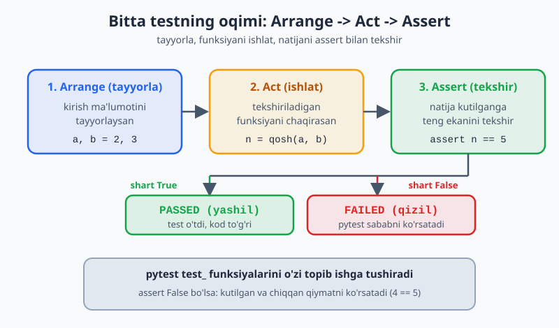
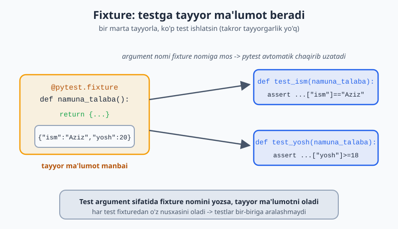
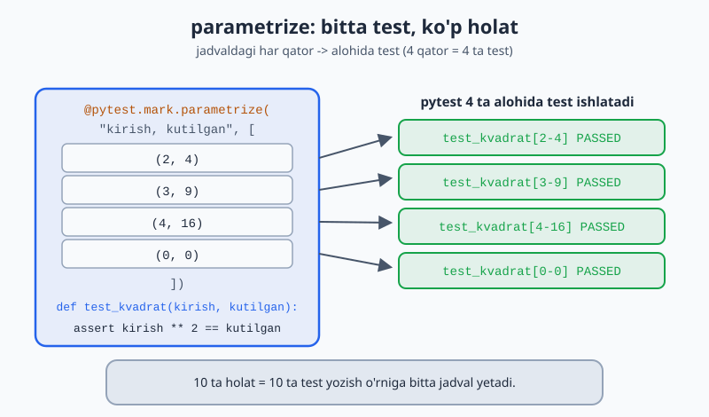

# 13 — Dasturni test qilish (`pytest`)

Kod yozdik — lekin u to'g'ri ishlayaptimi? Har safar qo'lda tekshirish (dasturni ishga tushirib, natijani ko'rib) zerikarli va ishonchsiz. **Testlar** — kodning to'g'ri ishlashini avtomatik tekshiradigan kod. Python'da buning eng mashhur vositasi — **`pytest`**. Bu modulda ishonchli test yozishni o'rganasan.

> **Bu modulda:** nega test kerak, `pytest` asoslari (`assert`, test funksiyalari), fixture'lar, parametrlash, va xatolarni test qilish.

---

## 13.1 Nega test yozamiz?

Tasavvur qil: katta dasturda bir joyni o'zgartirding. Boshqa joy buzilmaganini qanday bilasan? Qo'lda hammasini sinab ko'rish — uzoq va xatoga yo'l qo'yiladi. Testlar bir buyruq bilan hamma narsani tekshiradi.

`pytest` ni o'rnatish (terminalda):

```bash
pip install pytest
```

---

## 13.2 Birinchi test

Test — `assert` ishlatadigan oddiy funksiya. `assert` shartni tekshiradi: agar `True` bo'lsa hech narsa, `False` bo'lsa xato (test "yiqiladi"):

```python
# matematika.py
def qosh(a, b):
    return a + b
```

```python
# test_matematika.py   ← fayl nomi test_ bilan boshlanishi SHART
from matematika import qosh

def test_qosh():                  # funksiya nomi ham test_ bilan
    assert qosh(2, 3) == 5        # "qosh(2,3) natijasi 5 ga teng bo'lishi kerak"

def test_qosh_manfiy():
    assert qosh(-1, -1) == -2
```

Testlarni ishga tushirish (terminalda, fayl turgan papkada):

```bash
pytest                # barcha test_*.py fayllarni topib ishga tushiradi
pytest -v             # batafsil (har test nomi ko'rinadi)
```

Hammasi to'g'ri bo'lsa, yashil `PASSED` chiqadi. Xato bo'lsa, qaysi test va nima sababdan yiqilganini ko'rsatadi.

> **Discovery qoidasi:** `pytest` `test_` bilan boshlanadigan fayllardagi `test_` bilan boshlanadigan funksiyalarni avtomatik topadi. Hech narsa ro'yxatga olish kerak emas.

Har bir test odatda bir xil uch bosqichdan iborat bo'ladi: tayyorla, ishlat, tekshir.



---

## 13.3 `assert` — turli tekshiruvlar

```python
def test_misollar():
    assert 2 + 2 == 4
    assert "salom" in "salom dunyo"      # ichida bormi
    assert len([1, 2, 3]) == 3
    assert [1, 2] == [1, 2]              # ro'yxatlar teng
    natija = None
    assert natija is None
    assert 5 > 3
```

`pytest` aqlli — test yiqilsa, nima kutilgani va nima chiqqanini ko'rsatadi:

```python
def test_xato():
    assert qosh(2, 2) == 5
# pytest chiqaradi:
#   assert 4 == 5
```

---

## 13.4 Fixture — test uchun tayyor ma'lumot

Ko'p testga bir xil tayyorgarlik kerak bo'lsa, **fixture** ishlatasan. Fixture — testga argument sifatida uzatiladigan tayyor ma'lumot:

```python
import pytest

@pytest.fixture
def namuna_talaba():
    return {"ism": "Aziz", "yosh": 20}

def test_ism(namuna_talaba):              # fixture nomini argument qilib ol
    assert namuna_talaba["ism"] == "Aziz"

def test_yosh(namuna_talaba):
    assert namuna_talaba["yosh"] >= 18
```

`pytest` `namuna_talaba` ni avtomatik chaqirib, natijasini testga uzatadi. Bu takror tayyorgarlikni kamaytiradi.

Quyidagi diagramma bitta fixture qanday qilib bir nechta testga tayyor ma'lumot berishini ko'rsatadi.



---

## 13.5 `parametrize` — bitta test, ko'p holat

Bir testni turli kirishlar bilan tekshirish uchun:

```python
import pytest

@pytest.mark.parametrize("kirish, kutilgan", [
    (2, 4),
    (3, 9),
    (4, 16),
    (0, 0),
])
def test_kvadrat(kirish, kutilgan):
    assert kirish ** 2 == kutilgan
# Bu 4 ta alohida test sifatida ishlaydi
```

> Bu juda foydali: bir funksiyani 10 ta holat bilan sinashing kerak bo'lsa, 10 ta alohida test yozish o'rniga bitta `parametrize` jadval yozasan.

Diagrammada jadvaldagi har bir qator alohida test sifatida ishlashini ko'rishing mumkin.



---

## 13.6 Xatolarni test qilish

Funksiya kerakli vaqtda xato chaqirishini ham test qilish kerak (7-modulni esla):

```python
import pytest

def bol(a, b):
    if b == 0:
        raise ValueError("nolga bo'lish mumkin emas")
    return a / b

def test_normal():
    assert bol(10, 2) == 5

def test_nolga_bolish():
    with pytest.raises(ValueError):        # "bu yerda ValueError chiqishi KERAK"
        bol(10, 0)
```

`pytest.raises` ichidagi kod kutilgan xatoni chaqirmasa, test yiqiladi. Ya'ni "xato chiqishi shart" ekanini tekshiradi.

---

## 13.7 TDD — avval test, keyin kod

Ilg'or amaliyot **TDD** (Test-Driven Development): avval test yozasan (u yiqiladi, chunki kod yo'q), keyin testni o'tkazadigan kod yozasan. Bu kodni aniq talablar asosida yozishga majbur qiladi.

```python
# 1. Avval test (yiqiladi):
def test_juft():
    assert juftmi(4) is True
    assert juftmi(3) is False

# 2. Keyin testni o'tkazadigan kod:
def juftmi(n):
    return n % 2 == 0
```

> Hozircha TDD'ni qat'iy qo'llash shart emas. Lekin "kodimni qanday test qilaman?" deb o'ylash — kodni yaxshiroq yozishga yordam beradi.

---

## ✍️ Masalalar (20 ta)

> Bu masalalarda funksiya yozib, keyin uning testini yoz. `pytest` ni terminalda ishga tushirib tekshir.

**Oson (1–7):**

1. `kop(a, b)` funksiyasini yoz va `test_kop` testini yoz (`assert` bilan).
2. `juftmi(n)` yoz; juft va toq holat uchun ikkita test yoz.
3. `salom(ism)` yoz (matn qaytarsin); test'da natijada ism borligini `in` bilan tekshir.
4. Ro'yxat qaytaruvchi funksiya yoz; test'da uzunligini va birinchi elementni tekshir.
5. `assert` bilan oddiy holatlarni tekshir: `2+2==4`, `"a" in "abc"`, `len([1,2])==2`.
6. Oddiy `@pytest.fixture` yoz (lug'at qaytarsin), uni testda ishlat.
7. `@pytest.mark.parametrize` bilan `qosh(a,b)` ni 3 xil holatda test qil.

**O'rta (8–14):**

8. `bol(a, b)` (nolga bo'lganda `ValueError`) yoz, `pytest.raises` bilan test qil.
9. Normal holatni va xato holatini ikki alohida test bilan tekshir.
10. `kvadrat(n)` funksiyasini `parametrize` bilan 4 ta holatda sina.
11. Fixture yoz: talabalar ro'yxati qaytarsin, uni bir nechta testda ishlat.
12. `ortacha(sonlar)` yoz; bo'sh ro'yxat berilganda `ZeroDivisionError` chiqishini test qil.
13. `palindrommi(soz)` yoz; `parametrize` bilan palindrom va emas holatlarni test qil.
14. `eng_katta(sonlar)` yoz; turli ro'yxatlar bilan `parametrize` orqali test qil.

**Murakkab (15–20):**

15. `Hisob` klassini (5-moduldagi bank hisobi) yozib, `qoy` va `yech` metodlarini test qil (fixture bilan yangi hisob yarat).
16. `yech` da yetarli mablag' bo'lmasa xato chiqishini `pytest.raises` bilan test qil.
17. `slugify(matn)` yoz (`"Salom Dunyo"` → `"salom-dunyo"`); `parametrize` bilan turli holatlarni test qil.
18. `Kalkulyator` klassini yozib (`qosh`, `ayir`, `kop`, `bol`), barcha metodlarni test bilan qopla (nolga bo'lish ham).
19. Fixture kompozitsiyasi: bir fixture (bo'sh savat) va undan foydalanadigan boshqa fixture (to'la savat) yoz, ikkalasini testlarda ishlat.
20. To'liq test to'plami: `Talaba` klassi (`ball_qosh`, `ortacha`) uchun normal holatlar, chegara holatlar (bo'sh ballar) va xato holatlarini qoplaydigan testlar yoz.

---

## ✅ Yechimlar

<details markdown="1">
<summary>Ko'rsatish uchun ochish</summary>

```python
import pytest

# 1
def kop(a, b):
    return a * b
def test_kop():
    assert kop(3, 4) == 12

# 2
def juftmi(n):
    return n % 2 == 0
def test_juft():
    assert juftmi(4) is True
def test_toq():
    assert juftmi(3) is False

# 3
def salom(ism):
    return f"Salom, {ism}!"
def test_salom():
    assert "Aziz" in salom("Aziz")

# 4
def sonlar():
    return [10, 20, 30]
def test_sonlar():
    r = sonlar()
    assert len(r) == 3
    assert r[0] == 10

# 5
def test_oddiy():
    assert 2 + 2 == 4
    assert "a" in "abc"
    assert len([1, 2]) == 2

# 6
@pytest.fixture
def user():
    return {"ism": "Vali", "rol": "admin"}
def test_user(user):
    assert user["rol"] == "admin"

# 7
@pytest.mark.parametrize("a, b, kutilgan", [(1, 1, 2), (5, 5, 10), (-1, 1, 0)])
def test_qosh(a, b, kutilgan):
    assert a + b == kutilgan

# 8
def bol(a, b):
    if b == 0:
        raise ValueError("nolga bo'lish mumkin emas")
    return a / b
def test_bol_nol():
    with pytest.raises(ValueError):
        bol(10, 0)

# 9
def test_normal():
    assert bol(10, 2) == 5
def test_xato():
    with pytest.raises(ValueError):
        bol(5, 0)

# 10
def kvadrat(n):
    return n ** 2
@pytest.mark.parametrize("n, kutilgan", [(2, 4), (3, 9), (4, 16), (0, 0)])
def test_kvadrat(n, kutilgan):
    assert kvadrat(n) == kutilgan

# 11
@pytest.fixture
def talabalar():
    return [{"ism": "Aziz", "ball": 85}, {"ism": "Gul", "ball": 70}]
def test_talabalar_soni(talabalar):
    assert len(talabalar) == 2
def test_birinchi(talabalar):
    assert talabalar[0]["ism"] == "Aziz"

# 12
def ortacha(sonlar):
    return sum(sonlar) / len(sonlar)
def test_ortacha_bosh():
    with pytest.raises(ZeroDivisionError):
        ortacha([])

# 13
def palindrommi(soz):
    return soz == soz[::-1]
@pytest.mark.parametrize("soz, kutilgan", [("radar", True), ("salom", False), ("aba", True)])
def test_palindrom(soz, kutilgan):
    assert palindrommi(soz) == kutilgan

# 14
def eng_katta(sonlar):
    return max(sonlar)
@pytest.mark.parametrize("sonlar, kutilgan", [([1, 5, 3], 5), ([10], 10), ([-1, -5], -1)])
def test_eng_katta(sonlar, kutilgan):
    assert eng_katta(sonlar) == kutilgan

# 15
class Hisob:
    def __init__(self, balans=0):
        self.balans = balans
    def qoy(self, s):
        self.balans += s
    def yech(self, s):
        if s > self.balans:
            raise ValueError("mablag' yetarli emas")
        self.balans -= s
@pytest.fixture
def hisob():
    return Hisob(100)
def test_qoy(hisob):
    hisob.qoy(50)
    assert hisob.balans == 150
def test_yech(hisob):
    hisob.yech(40)
    assert hisob.balans == 60

# 16
def test_yech_xato(hisob):
    with pytest.raises(ValueError):
        hisob.yech(1000)

# 17
import re
def slugify(matn):
    matn = matn.strip().lower()
    matn = re.sub(r"[^\w\s-]", "", matn)
    return re.sub(r"[\s]+", "-", matn)
@pytest.mark.parametrize("kirish, kutilgan", [
    ("Salom Dunyo", "salom-dunyo"),
    ("Python", "python"),
    ("Bir Ikki Uch", "bir-ikki-uch"),
])
def test_slugify(kirish, kutilgan):
    assert slugify(kirish) == kutilgan

# 18
class Kalkulyator:
    def qosh(self, a, b): return a + b
    def ayir(self, a, b): return a - b
    def kop(self, a, b): return a * b
    def bol(self, a, b):
        if b == 0:
            raise ValueError("nolga bo'lish")
        return a / b
@pytest.fixture
def kalk():
    return Kalkulyator()
def test_qosh_k(kalk):
    assert kalk.qosh(2, 3) == 5
def test_bol_k(kalk):
    assert kalk.bol(10, 2) == 5
def test_bol_nol_k(kalk):
    with pytest.raises(ValueError):
        kalk.bol(1, 0)

# 19
@pytest.fixture
def bosh_savat():
    return []
@pytest.fixture
def tola_savat(bosh_savat):
    bosh_savat.append("olma")
    bosh_savat.append("non")
    return bosh_savat
def test_bosh(bosh_savat):
    assert len(bosh_savat) == 0
def test_tola(tola_savat):
    assert len(tola_savat) == 2

# 20
class Talaba:
    def __init__(self, ism):
        self.ism = ism
        self.ballar = []
    def ball_qosh(self, b):
        self.ballar.append(b)
    def ortacha(self):
        if not self.ballar:
            raise ValueError("ballar yo'q")
        return sum(self.ballar) / len(self.ballar)
@pytest.fixture
def talaba():
    return Talaba("Aziz")
def test_ball_qosh(talaba):
    talaba.ball_qosh(80)
    assert talaba.ballar == [80]
def test_ortacha(talaba):
    talaba.ball_qosh(80)
    talaba.ball_qosh(90)
    assert talaba.ortacha() == 85
def test_ortacha_bosh(talaba):
    with pytest.raises(ValueError):
        talaba.ortacha()
```

</details>

---

[← Parallel ishlash](./12-concurrency-async.md) | [Boshlovchilar README ↑](./README.md) | [Keyingi: FastAPI veb API →](./14-web-capstone.md)
