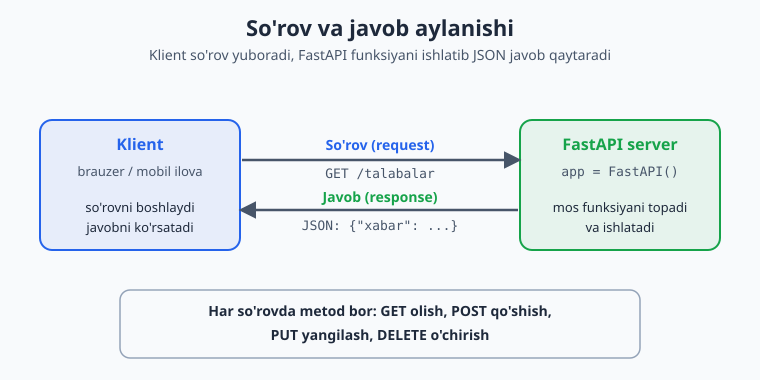
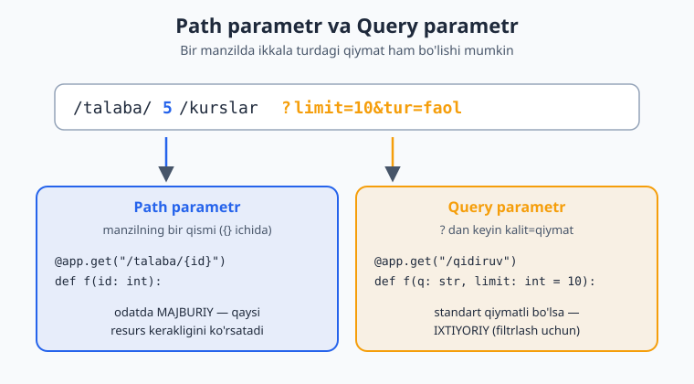
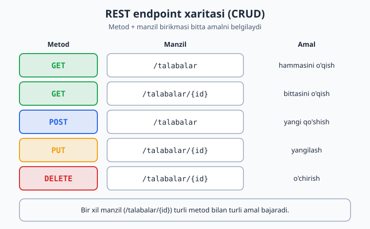

# 14 — FastAPI bilan veb API

Hozirgacha yozgan dasturlarimiz faqat o'z kompyuteringda, terminalda ishladi. Lekin haqiqiy ilovalar (mobil ilova, sayt) ko'pincha **internet orqali** ma'lumot almashadi — buning uchun **veb API** kerak. Bu modulda **FastAPI** bilan oddiy, lekin ishlaydigan API yasashni o'rganasan. Bu — kursning kichik yakuniy loyihasi: oldingi modullardagi bilim (funksiyalar, lug'atlar, tip ko'rsatmalari) shu yerda birlashadi.

> **Bu modulda:** veb API nima, FastAPI'da birinchi API, parametrlar (path va query), Pydantic bilan ma'lumotni qabul qilish, va oddiy CRUD (qo'shish/o'qish/o'zgartirish/o'chirish).

---

## 14.1 Veb API nima?

API — bu dasturlar bir-biri bilan "gaplashadigan" til. Veb API esa internet orqali ishlaydi: mijoz (brauzer, mobil ilova) **so'rov** (request) yuboradi, server **javob** (response) qaytaradi.

Quyidagi diagramma bu aylanishni ko'rsatadi: klient so'rov yuboradi, FastAPI mos funksiyani ishlatib JSON javob qaytaradi.



So'rovlarning asosiy turlari (HTTP metodlari):

| Metod | Ma'nosi | Misol |
|-------|---------|-------|
| `GET` | ma'lumot **olish** | talabalar ro'yxatini ko'rish |
| `POST` | yangi ma'lumot **qo'shish** | yangi talaba qo'shish |
| `PUT` | mavjudni **yangilash** | talaba ma'lumotini o'zgartirish |
| `DELETE` | **o'chirish** | talabani o'chirish |

Javob odatda **JSON** ko'rinishida bo'ladi (8-moduldan tanish).

---

## 14.2 O'rnatish va birinchi API

```bash
pip install "fastapi[standard]"
```

Eng oddiy API — `main.py`:

```python
from fastapi import FastAPI

app = FastAPI()

@app.get("/")
def bosh_sahifa():
    return {"xabar": "Salom, dunyo!"}
```

Ishga tushirish (terminalda):

```bash
fastapi dev main.py
```

Brauzerda `http://127.0.0.1:8000` ni och — `{"xabar": "Salom, dunyo!"}` chiqadi.

> **Bonus:** `http://127.0.0.1:8000/docs` manzilini och — FastAPI **avtomatik** interaktiv hujjat yaratadi! U yerda API'ngni brauzerdan sinab ko'rishing mumkin. Bu FastAPI'ning eng yoqimli xususiyatlaridan biri.

`@app.get("/")` ni shunday o'qi: "kimdir `/` manziliga `GET` so'rov yuborsa, shu funksiyani ishlatib, natijasini qaytar". Funksiya lug'at qaytarsa, FastAPI uni avtomatik JSON ga aylantiradi.

---

## 14.3 Path parametrlari — manzildagi qiymat

Manzilning bir qismini o'zgaruvchi qilish mumkin:

```python
@app.get("/salom/{ism}")
def salomla(ism: str):
    return {"xabar": f"Salom, {ism}!"}

# /salom/Aziz  →  {"xabar": "Salom, Aziz!"}
```

Tip ko'rsatmasi (`ism: str`, `id: int`) bu yerda **haqiqatan tekshiriladi** — FastAPI uni avtomatik tekshiradi va aylantiradi:

```python
@app.get("/talaba/{id}")
def talaba_olish(id: int):           # id avtomatik int ga aylanadi
    return {"id": id, "tur": str(type(id))}

# /talaba/5     →  {"id": 5, ...}       (int)
# /talaba/abc   →  XATO (422): int kutilgan edi  — FastAPI o'zi tekshiradi!
```

> 10-modulda "tip ko'rsatmalari tekshirilmaydi" degandik — bu sof Python'da. FastAPI esa ularni **ishlatadi**: so'rovdagi ma'lumotni tekshirish va aylantirish uchun. Bu juda qulay.

---

## 14.4 Query parametrlari — `?kalit=qiymat`

Manzil oxiridagi `?` dan keyingi qiymatlar — query parametrlari. Funksiya parametri sifatida olasan (standart qiymat bilan — ixtiyoriy bo'ladi):

```python
@app.get("/qidiruv")
def qidiruv(q: str, limit: int = 10):
    return {"qidiruv": q, "limit": limit}

# /qidiruv?q=python            →  {"qidiruv": "python", "limit": 10}
# /qidiruv?q=python&limit=5    →  {"qidiruv": "python", "limit": 5}
```

Endi ikkala turdagi parametrni yonma-yon solishtiramiz: path parametr manzilning bir qismi (`{}` ichida), query parametr esa `?` dan keyin `kalit=qiymat` ko'rinishida keladi.



---

## 14.5 Pydantic — ma'lumotni qabul qilish (POST)

Yangi ma'lumot qabul qilishda (POST), kelgan JSON qanday ko'rinishda bo'lishini **model** orqali belgilaysan. Buning uchun Pydantic ishlatasan:

```python
from pydantic import BaseModel

class Talaba(BaseModel):           # ma'lumot "shakli"
    ism: str
    yosh: int
    ball: float = 0                # standart qiymatli — ixtiyoriy

@app.post("/talabalar")
def qoshish(talaba: Talaba):       # kelgan JSON avtomatik Talaba'ga aylanadi
    return {"qoshildi": talaba}
```

Endi `{"ism": "Aziz", "yosh": 20}` JSON yuborsang, FastAPI uni avtomatik tekshiradi:
- Maydon yetishmasa yoki tur noto'g'ri bo'lsa — o'zi xato (422) qaytaradi.
- Hammasi to'g'ri bo'lsa — funksiyaga tayyor `Talaba` obyekti keladi.

> Pydantic 5-moduldagi klasslarga o'xshaydi, lekin u qo'shimcha ravishda **kelgan ma'lumotni avtomatik tekshiradi**. Bu xavfsiz API yozishni juda osonlashtiradi — kirish ma'lumotini o'zing tekshirib o'tirishing shart emas.

---

## 14.6 To'liq misol — oddiy CRUD

Talabalarni xotirada (oddiy lug'atda) saqlovchi to'liq API. Bu — barcha asoslarni birlashtiradi:

```python
from fastapi import FastAPI, HTTPException
from pydantic import BaseModel

app = FastAPI()

class Talaba(BaseModel):
    ism: str
    yosh: int

# Xotirada saqlash (oddiy lug'at — dastur o'chsa yo'qoladi):
talabalar: dict[int, dict] = {}
keyingi_id = 1

@app.get("/talabalar")                       # HAMMASINI o'qish
def royxat():
    return talabalar

@app.get("/talabalar/{id}")                  # BITTASINI o'qish
def bittasi(id: int):
    if id not in talabalar:
        raise HTTPException(status_code=404, detail="Talaba topilmadi")
    return talabalar[id]

@app.post("/talabalar")                      # QO'SHISH
def qoshish(talaba: Talaba):
    global keyingi_id
    talabalar[keyingi_id] = talaba.model_dump()
    keyingi_id += 1
    return {"id": keyingi_id - 1, **talaba.model_dump()}

@app.put("/talabalar/{id}")                  # YANGILASH
def yangilash(id: int, talaba: Talaba):
    if id not in talabalar:
        raise HTTPException(status_code=404, detail="Talaba topilmadi")
    talabalar[id] = talaba.model_dump()
    return talabalar[id]

@app.delete("/talabalar/{id}")               # O'CHIRISH
def ochirish(id: int):
    if id not in talabalar:
        raise HTTPException(status_code=404, detail="Talaba topilmadi")
    del talabalar[id]
    return {"ochirildi": id}
```

Quyidagi xaritada yuqoridagi endpointlar jamlangan: e'tibor ber — bir xil manzil (`/talabalar/{id}`) turli HTTP metod bilan turli amalni bajaradi.



> **`HTTPException`** — ma'lumot topilmasa, mijozga to'g'ri xato (404 "topilmadi") qaytarish uchun. `model_dump()` — Pydantic obyektini oddiy lug'atga aylantiradi.
>
> **Eslatma:** bu yerda ma'lumot oddiy lug'atda — dastur o'chsa yo'qoladi. Keyingi modulda ma'lumotni **bazaga** (doimiy) saqlashni ko'rasan. Shuningdek, katta loyihalarda kodni qatlamlarga ajratish, xavfsizlik, autentifikatsiya kabi mavzular bor — ular ilg'orroq, vaqt o'tib o'rganasan.

---

## ✍️ Masalalar (20 ta)

> Bu masalalar uchun `fastapi dev main.py` bilan serverni ishga tushirib, `/docs` orqali sina.

**Oson (1–7):**

1. `/` manzilida `{"xabar": "Salom"}` qaytaruvchi API yoz.
2. `/salom/{ism}` yoz: "Salom, {ism}!" qaytarsin.
3. `/kvadrat/{son}` yoz: sonning kvadratini qaytarsin (`son: int`).
4. `/qoshish?a=2&b=3` ko'rinishida ikki sonni qo'shadigan endpoint yoz (query params).
5. `/vaqt` yoz: hozirgi sanani qaytarsin (`datetime` ishlat).
6. `/docs` ni ochib, yozgan endpointlaringni brauzerdan sina.
7. `/salom` endpointiga ixtiyoriy `til` query parametrini qo'sh (standart "uz").

**O'rta (8–14):**

8. `Mahsulot` Pydantic modeli yoz (`nom: str`, `narx: float`), `POST /mahsulotlar` bilan qabul qilib qaytar.
9. `GET /talabalar` yoz: oldindan to'ldirilgan ro'yxatni (lug'atlar) qaytarsin.
10. `GET /talabalar/{id}` yoz: berilgan id'li talabani qaytarsin, topilmasa 404.
11. Query parametrli qidiruv: `GET /qidiruv?q=...` — mahsulotlardan nomida `q` bo'lganlarni qaytarsin.
12. `POST` bilan kelgan Pydantic modelni tekshir: noto'g'ri ma'lumot yuborib, 422 xatosini ko'r.
13. `limit` va `skip` query parametrlari bilan ro'yxatni "sahifalash" (qism qaytarish).
14. `HTTPException` bilan: id topilmasa 404, manfiy id berilsa 400 qaytar.

**Murakkab (15–20):**

15. To'liq CRUD yoz: `Kitob` (`nom`, `muallif`) uchun GET (hammasi), GET (bittasi), POST, DELETE.
16. PUT qo'sh: mavjud kitobni yangilash, topilmasa 404.
17. Avtomatik `id` berish: yangi yozuvga ketma-ket id ber (yuqoridagi `keyingi_id` namunasiday).
18. Validatsiya qo'sh: Pydantic modelda `yosh` manfiy bo'lmasligini ta'minla (`field_validator` yoki shartli tekshiruv bilan).
19. Statistika endpointi: `GET /statistika` — talabalar soni va o'rtacha yoshni qaytarsin.
20. Mini "vazifa boshqaruvchi" (todo) API: vazifa qo'shish, ro'yxatni ko'rish, bajarildi deb belgilash (PUT), o'chirish — to'liq CRUD bilan.

---

## ✅ Yechimlar

<details markdown="1">
<summary>Ko'rsatish uchun ochish</summary>

```python
from fastapi import FastAPI, HTTPException
from pydantic import BaseModel
from datetime import date

app = FastAPI()

# 1
@app.get("/")
def bosh():
    return {"xabar": "Salom"}

# 2
@app.get("/salom/{ism}")
def salom(ism: str):
    return {"xabar": f"Salom, {ism}!"}

# 3
@app.get("/kvadrat/{son}")
def kvadrat(son: int):
    return {"natija": son ** 2}

# 4
@app.get("/qoshish")
def qoshish(a: int, b: int):
    return {"natija": a + b}

# 5
@app.get("/vaqt")
def vaqt():
    return {"sana": str(date.today())}

# 7
@app.get("/salom2")
def salom2(ism: str = "dunyo", til: str = "uz"):
    matnlar = {"uz": "Salom", "en": "Hello", "ru": "Privet"}
    return {"xabar": f"{matnlar.get(til, 'Salom')}, {ism}!"}

# 8
class Mahsulot(BaseModel):
    nom: str
    narx: float
@app.post("/mahsulotlar")
def mahsulot_qosh(m: Mahsulot):
    return {"qoshildi": m}

# 9, 10, 11, 13 — namuna ma'lumot bilan:
talabalar_db = {
    1: {"ism": "Aziz", "yosh": 20},
    2: {"ism": "Malika", "yosh": 22},
}

@app.get("/talabalar")
def talabalar_royxat(skip: int = 0, limit: int = 10):
    qiymatlar = list(talabalar_db.values())
    return qiymatlar[skip: skip + limit]

@app.get("/talabalar/{id}")
def talaba_bittasi(id: int):
    if id < 0:
        raise HTTPException(status_code=400, detail="id manfiy bo'lmaydi")
    if id not in talabalar_db:
        raise HTTPException(status_code=404, detail="Topilmadi")
    return talabalar_db[id]

mahsulotlar_db = [{"nom": "Olma", "narx": 12000}, {"nom": "Non", "narx": 4000}]
@app.get("/qidiruv")
def qidiruv(q: str):
    return [m for m in mahsulotlar_db if q.lower() in m["nom"].lower()]

# 15, 16, 17 — Kitob uchun to'liq CRUD:
class Kitob(BaseModel):
    nom: str
    muallif: str

kitoblar: dict[int, dict] = {}
kitob_id = 1

@app.get("/kitoblar")
def kitoblar_royxat():
    return kitoblar

@app.get("/kitoblar/{id}")
def kitob_bittasi(id: int):
    if id not in kitoblar:
        raise HTTPException(status_code=404, detail="Topilmadi")
    return kitoblar[id]

@app.post("/kitoblar")
def kitob_qosh(k: Kitob):
    global kitob_id
    kitoblar[kitob_id] = k.model_dump()
    kitob_id += 1
    return {"id": kitob_id - 1, **k.model_dump()}

@app.put("/kitoblar/{id}")
def kitob_yangila(id: int, k: Kitob):
    if id not in kitoblar:
        raise HTTPException(status_code=404, detail="Topilmadi")
    kitoblar[id] = k.model_dump()
    return kitoblar[id]

@app.delete("/kitoblar/{id}")
def kitob_ochir(id: int):
    if id not in kitoblar:
        raise HTTPException(status_code=404, detail="Topilmadi")
    del kitoblar[id]
    return {"ochirildi": id}

# 18 — validatsiyali model:
from pydantic import field_validator
class TalabaV(BaseModel):
    ism: str
    yosh: int
    @field_validator("yosh")
    @classmethod
    def yosh_musbat(cls, v):
        if v < 0:
            raise ValueError("yosh manfiy bo'lmaydi")
        return v

# 19
@app.get("/statistika")
def statistika():
    yoshlar = [t["yosh"] for t in talabalar_db.values()]
    return {
        "soni": len(yoshlar),
        "ortacha_yosh": sum(yoshlar) / len(yoshlar) if yoshlar else 0,
    }

# 20 — todo API:
class Vazifa(BaseModel):
    matn: str
    bajarildi: bool = False

vazifalar: dict[int, dict] = {}
vazifa_id = 1

@app.get("/vazifalar")
def vazifalar_royxat():
    return vazifalar

@app.post("/vazifalar")
def vazifa_qosh(v: Vazifa):
    global vazifa_id
    vazifalar[vazifa_id] = v.model_dump()
    vazifa_id += 1
    return {"id": vazifa_id - 1, **v.model_dump()}

@app.put("/vazifalar/{id}/bajarildi")
def vazifa_belgila(id: int):
    if id not in vazifalar:
        raise HTTPException(status_code=404, detail="Topilmadi")
    vazifalar[id]["bajarildi"] = True
    return vazifalar[id]

@app.delete("/vazifalar/{id}")
def vazifa_ochir(id: int):
    if id not in vazifalar:
        raise HTTPException(status_code=404, detail="Topilmadi")
    del vazifalar[id]
    return {"ochirildi": id}
```

</details>

---

[← Dasturni test qilish](./13-testlash.md) | [Boshlovchilar README ↑](./README.md) | [Keyingi: Ma'lumotlar bazasi →](./15-malumotlar-bazasi.md)
