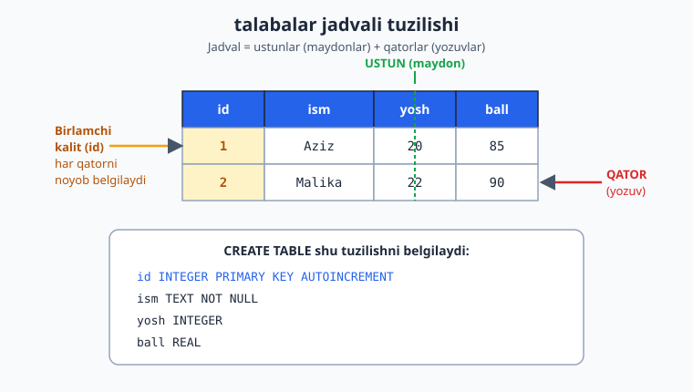
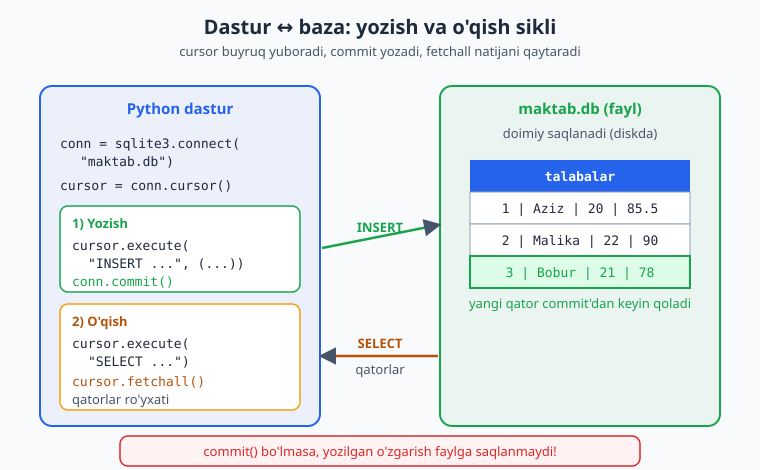
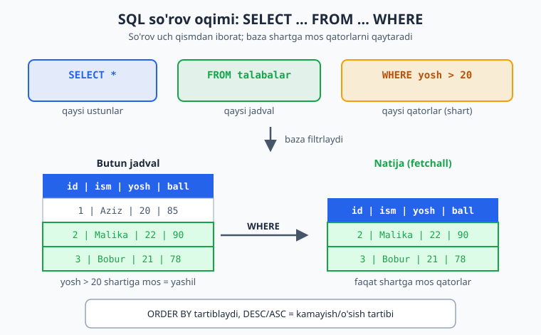

# 15 — Ma'lumotlar bazasi va SQL

Oldingi modulda ma'lumotni oddiy lug'atda saqladik — lekin dastur o'chsa, hammasi yo'qoldi. **Ma'lumotlar bazasi** ma'lumotni doimiy, tartibli va tez qidiriladigan ko'rinishda saqlaydi. Bu yakuniy modulda **SQL** tilining asoslarini va Python'ning o'rnatilgan **`sqlite3`** modulini o'rganasan — qo'shimcha hech narsa o'rnatmasdan ishlaydigan, to'liq baza.

> **Bu modulda:** ma'lumotlar bazasi nima, `sqlite3` bilan jadval yaratish, ma'lumot qo'shish/o'qish/yangilash/o'chirish (SQL), xavfsiz so'rovlar (parametrlash), **ko'p jadval va JOIN**, **tashqi kalit (FOREIGN KEY)**, **agregatlar (GROUP BY/HAVING)**, **tranzaksiyalar (atomarlik)**, **`sqlite3.Row`**, **indeks/sahifalash**, va qisqacha **ORM (SQLAlchemy)** hamda **FastAPI + baza** integratsiyasi.

---

## 15.1 Ma'lumotlar bazasi nima?

Ma'lumotlar bazasi — ma'lumotni **jadval**lar ko'rinishida saqlaydi (Excel jadvaliga o'xshash, lekin ancha kuchli). Jadval **ustun**lar (maydonlar) va **qator**lardan (yozuvlar) iborat.

Misol — `talabalar` jadvali:

| id | ism | yosh | ball |
|----|-----|------|------|
| 1 | Aziz | 20 | 85 |
| 2 | Malika | 22 | 90 |

Jadvalning ustun (maydon), qator (yozuv) va birlamchi kalit (`id`) qismlarini quyidagicha tasavvur qil:



Baza bilan **SQL** (Structured Query Language) tilida "gaplashasan". `sqlite3` Python bilan birga keladi — o'rnatish shart emas, va butun baza bitta faylda saqlanadi. Boshlash uchun ideal.

---

## 15.2 Bazaga ulanish va jadval yaratish

```python
import sqlite3

# Bazaga ulanish (fayl yo'q bo'lsa, yaratiladi):
conn = sqlite3.connect("maktab.db")
cursor = conn.cursor()

# Jadval yaratish (SQL):
cursor.execute("""
    CREATE TABLE IF NOT EXISTS talabalar (
        id INTEGER PRIMARY KEY AUTOINCREMENT,
        ism TEXT NOT NULL,
        yosh INTEGER,
        ball REAL
    )
""")

conn.commit()      # o'zgarishlarni saqlash
conn.close()       # ulanishni yopish
```

Tushuntirish:
- `connect("maktab.db")` — baza fayliga ulanadi (yo'q bo'lsa yaratadi).
- `cursor` — buyruqlarni bajaruvchi "kursor".
- `CREATE TABLE IF NOT EXISTS` — jadval yo'q bo'lsa yaratadi (bor bo'lsa xato bermaydi).
- `INTEGER PRIMARY KEY AUTOINCREMENT` — har yozuvga avtomatik o'sib boruvchi `id`.
- `TEXT`, `INTEGER`, `REAL` — ustun turlari (matn, butun son, kasr).
- `conn.commit()` — o'zgarishlarni faylga **yozadi** (busiz saqlanmaydi!).

---

## 15.3 Ma'lumot qo'shish (INSERT)

```python
import sqlite3
conn = sqlite3.connect("maktab.db")
cursor = conn.cursor()

cursor.execute(
    "INSERT INTO talabalar (ism, yosh, ball) VALUES (?, ?, ?)",
    ("Aziz", 20, 85.5)
)
conn.commit()
conn.close()
```

> **`?` belgilari — JUDA muhim (xavfsizlik!):** qiymatlarni SQL matniga to'g'ridan-to'g'ri yozma, doim `?` ishlatib, qiymatlarni alohida uzat. Aks holda **SQL injection** degan jiddiy xavfsizlik zaifligi paydo bo'ladi. Bu eng muhim qoidalardan biri.
>
> ```python
> # ❌ HECH QACHON BUNDAY QILMA:
> cursor.execute(f"INSERT INTO talabalar (ism) VALUES ('{ism}')")
> # ✅ DOIM BUNDAY:
> cursor.execute("INSERT INTO talabalar (ism) VALUES (?)", (ism,))
> ```

Ko'p yozuvni birdan qo'shish (`executemany`):

```python
talabalar = [("Malika", 22, 90), ("Bobur", 21, 78)]
cursor.executemany(
    "INSERT INTO talabalar (ism, yosh, ball) VALUES (?, ?, ?)",
    talabalar
)
conn.commit()
```

Yozish (`INSERT` + `commit`) va o'qish (`SELECT` + `fetchall`) dastur bilan baza fayli orasida shunday aylanadi:



---

## 15.4 Ma'lumot o'qish (SELECT)

```python
import sqlite3
conn = sqlite3.connect("maktab.db")
cursor = conn.cursor()

# Barcha yozuvlar:
cursor.execute("SELECT * FROM talabalar")
qatorlar = cursor.fetchall()       # barcha natijalar ro'yxati
for qator in qatorlar:
    print(qator)                   # (1, 'Aziz', 20, 85.5)

# Bitta yozuv:
cursor.execute("SELECT * FROM talabalar WHERE id = ?", (1,))
print(cursor.fetchone())           # bitta qator yoki None

conn.close()
```

Foydali SQL so'rovlari:

```python
# Shart bilan:
cursor.execute("SELECT * FROM talabalar WHERE yosh > ?", (20,))

# Tartiblash:
cursor.execute("SELECT * FROM talabalar ORDER BY ball DESC")

# Faqat kerakli ustunlar:
cursor.execute("SELECT ism, ball FROM talabalar")

# Sanash:
cursor.execute("SELECT COUNT(*) FROM talabalar")
print(cursor.fetchone()[0])        # nechta talaba bor
```

> **SQL kalit so'zlari:** `SELECT` (tanlash) ... `FROM` (qaysi jadval) ... `WHERE` (shart) ... `ORDER BY` (tartiblash) ... `DESC`/`ASC` (kamayish/o'sish). Bular barcha SQL bazalarda deyarli bir xil.

So'rovning uch qismi — `SELECT` (qaysi ustunlar), `FROM` (qaysi jadval), `WHERE` (qaysi qatorlar) — qanday ishlashini quyidagi oqim ko'rsatadi:



---

## 15.5 Yangilash (UPDATE) va o'chirish (DELETE)

```python
# Yangilash:
cursor.execute(
    "UPDATE talabalar SET ball = ? WHERE id = ?",
    (95, 1)
)
conn.commit()

# O'chirish:
cursor.execute("DELETE FROM talabalar WHERE id = ?", (2,))
conn.commit()
```

> **Diqqat — `WHERE`ni unutma!** `UPDATE` yoki `DELETE` da `WHERE` yozmasang, **butun jadval**ga ta'sir qiladi (hamma yozuv o'chadi/o'zgaradi). Bu juda keng tarqalgan, achchiq xato. Doim `WHERE` borligini tekshir.

---

## 15.6 `with` bilan toza ishlash

8-moduldagi `with` bu yerda ham ishlaydi — ulanishni avtomatik boshqaradi:

```python
import sqlite3

with sqlite3.connect("maktab.db") as conn:
    cursor = conn.cursor()
    cursor.execute("SELECT * FROM talabalar")
    for qator in cursor.fetchall():
        print(qator)
    # with bloki commit'ni avtomatik bajaradi
```

> **Nozik nuqta:** `sqlite3` da `with sqlite3.connect(...) as conn` bloki **ulanishni avtomatik yopmaydi** — u faqat **tranzaksiyani** boshqaradi (xatosiz tugasa `commit`, xato bo'lsa `rollback`). Ulanishni o'zi yopilishini istasang, `conn.close()` ni alohida chaqir yoki `contextlib.closing` dan foydalan. Buni 15.10-bo'limda batafsil ko'ramiz.

---

## 15.7 `sqlite3.Row` — ustun nomi bilan o'qish

Hozirgacha `SELECT` natijasi oddiy **kortej** (`tuple`) bo'lib qaytdi: `(1, 'Aziz', 20, 85.5)`. Ustunni indeks bilan olishga to'g'ri keladi — `qator[1]` ismmi yoki yoshmi? Kod o'qilishi qiyin va ustun tartibi o'zgarsa, sinadi.

`conn.row_factory = sqlite3.Row` ni o'rnatsang, har qator **ustun nomi bilan** murojaat qilinadigan obyektga aylanadi — xuddi lug'atdek:

```python
import sqlite3

conn = sqlite3.connect("maktab.db")
conn.row_factory = sqlite3.Row      # SHU QATOR — sehrli kalit
cursor = conn.cursor()

cursor.execute("CREATE TABLE IF NOT EXISTS talabalar ("
               "id INTEGER PRIMARY KEY AUTOINCREMENT, ism TEXT, yosh INTEGER, ball REAL)")
cursor.execute("INSERT INTO talabalar (ism, yosh, ball) VALUES (?, ?, ?)", ("Aziz", 20, 85.5))
conn.commit()

qator = cursor.execute("SELECT * FROM talabalar WHERE id = ?", (1,)).fetchone()

# Endi indeks O'RNIGA ustun nomi bilan:
print(qator["ism"])     # Aziz
print(qator["ball"])    # 85.5
print(qator["id"], qator["yosh"])   # 1 20

# Bir qatorni lug'atga aylantirish ham oson:
print(dict(qator))      # {'id': 1, 'ism': 'Aziz', 'yosh': 20, 'ball': 85.5}
print(qator.keys())     # ['id', 'ism', 'yosh', 'ball']
conn.close()
```

> **Nega muhim?** `qator["ism"]` `qator[1]` dan ancha aniqroq va xavfsizroq. JSON qaytaruvchi veb API'da (14-modul) bu ayniqsa qulay — `dict(qator)` bilan qatorni to'g'ridan-to'g'ri JSON'ga aylantirasan. Real loyihalarda `sqlite3.Row` ni deyarli doim yoqib qo'yiladi.

`Row` bilan ustunni indeks (`qator[0]`) bilan ham olish mumkin — ya'ni eski kodlar ham ishlayveradi, faqat endi nom bilan ham murojaat qo'shimcha imkon sifatida qo'shiladi.

---

## 15.8 Ko'p jadval: bog'lanish va FOREIGN KEY

Hozirgacha bitta jadval bilan ishladik. Lekin real loyihalar **bir necha bog'langan jadval**dan iborat. Masalan, kutubxonada: bir tomonda **mualliflar**, ikkinchi tomonda **kitoblar**. Har kitob bitta muallifga tegishli.

Ma'lumotni takrorlamaslik uchun (har kitobda muallif ismini qayta yozmaslik uchun) kitobda faqat muallifning **`id`**'sini saqlaymiz. Bu **tashqi kalit** (foreign key) deyiladi — bir jadvalning ustuni boshqa jadvalning birlamchi kalitiga "ishora qiladi".

```python
import sqlite3

conn = sqlite3.connect(":memory:")   # xotirada vaqtinchalik baza (test uchun ideal)
conn.execute("PRAGMA foreign_keys = ON")   # SQLite'da tashqi kalitni MAJBURAN yoqamiz
cursor = conn.cursor()

# Ota-jadval: mualliflar
cursor.execute("""
    CREATE TABLE mualliflar (
        id INTEGER PRIMARY KEY AUTOINCREMENT,
        ism TEXT NOT NULL
    )
""")

# Bola-jadval: kitoblar -> muallif_id orqali mualliflarga bog'langan
cursor.execute("""
    CREATE TABLE kitoblar (
        id INTEGER PRIMARY KEY AUTOINCREMENT,
        nom TEXT NOT NULL,
        muallif_id INTEGER,
        FOREIGN KEY (muallif_id) REFERENCES mualliflar(id)
    )
""")

cursor.executemany("INSERT INTO mualliflar (ism) VALUES (?)",
                   [("Oybek",), ("Abdulla Qodiriy",)])
cursor.executemany("INSERT INTO kitoblar (nom, muallif_id) VALUES (?, ?)",
                   [("Navoiy", 1), ("O'tkan kunlar", 2), ("Mehrobdan chayon", 2)])
conn.commit()
```

Bog'lanishni shunday tasavvur qil — `kitoblar.muallif_id` `mualliflar.id` ga "strelka tashlaydi":

```
mualliflar                  kitoblar
+----+------------------+   +----+-------------------+------------+
| id | ism              |   | id | nom               | muallif_id |
+----+------------------+   +----+-------------------+------------+
|  1 | Oybek            |<--|  1 | Navoiy            |     1      |
|  2 | Abdulla Qodiriy  |<--|  2 | O'tkan kunlar     |     2      |
+----+------------------+ \-|  3 | Mehrobdan chayon  |     2      |
                            +----+-------------------+------------+
```

> **`PRAGMA foreign_keys = ON` — SQLite'da MAJBURIY!** Tarixiy sabablarga ko'ra SQLite tashqi kalit qoidalarini sukut bo'yicha **tekshirmaydi**. Har ulanishdan keyin shu qatorni yozmasang, `FOREIGN KEY` shunchaki hujjat bo'lib qoladi — ishlamaydi. PostgreSQL/MySQL'da esa u doim yoqilgan.

Endi tashqi kalit nimani **himoya qiladi**ni ko'ramiz — mavjud bo'lmagan muallifga kitob qo'shib bo'lmaydi:

```python
# Mavjud bo'lmagan muallif id=999 ga kitob qo'shishga urinish:
try:
    cursor.execute("INSERT INTO kitoblar (nom, muallif_id) VALUES (?, ?)", ("Xato kitob", 999))
    conn.commit()
except sqlite3.IntegrityError as xato:
    print("Bloklandi:", xato)     # Bloklandi: FOREIGN KEY constraint failed
```

Ya'ni baza **ma'lumot yaxlitligini** o'zi qo'riqlaydi: "egasiz" kitob yozib bo'lmaydi. Bu — bazaning eng kuchli afzalliklaridan biri.

---

## 15.9 JOIN — jadvallarni birlashtirib o'qish

Kitob nomini **va** uning muallifi ismini bitta natijada ko'rish uchun ikki jadvalni birlashtirish kerak. Buni **`JOIN`** qiladi.

### INNER JOIN — faqat moslar

`INNER JOIN` ikki jadvaldan **mos kelgan** qatorlarni qaytaradi (kitob + uning muallifi):

```python
cursor.execute("""
    SELECT kitoblar.nom, mualliflar.ism
    FROM kitoblar
    INNER JOIN mualliflar ON kitoblar.muallif_id = mualliflar.id
""")
for qator in cursor.fetchall():
    print(qator)
# ('Navoiy', 'Oybek')
# ("O'tkan kunlar", 'Abdulla Qodiriy')
# ('Mehrobdan chayon', 'Abdulla Qodiriy')
```

Tushuntirish:
- `FROM kitoblar` — asosiy jadval.
- `INNER JOIN mualliflar` — qaysi jadval bilan birlashtiramiz.
- `ON kitoblar.muallif_id = mualliflar.id` — **qanday** bog'lash sharti (kalitlar tengligi).
- `SELECT kitoblar.nom, mualliflar.ism` — ikki jadvaldan kerakli ustunlar (`jadval.ustun` ko'rinishida).

### LEFT JOIN — chap jadvalning hammasi

Agar muallifsiz (`muallif_id = NULL`) kitob bo'lsa-chi? `INNER JOIN` uni **tushirib qoldiradi**. `LEFT JOIN` esa chap (`FROM`) jadvalning **barcha** qatorini saqlaydi, mos kelmaganida o'ng tomon `None` bo'ladi:

```python
# Avval muallifi noma'lum kitob qo'shaylik:
cursor.execute("INSERT INTO kitoblar (nom, muallif_id) VALUES (?, ?)", ("Anonim asar", None))
conn.commit()

cursor.execute("""
    SELECT kitoblar.nom, mualliflar.ism
    FROM kitoblar
    LEFT JOIN mualliflar ON kitoblar.muallif_id = mualliflar.id
""")
for qator in cursor.fetchall():
    print(qator)
# ('Navoiy', 'Oybek')
# ("O'tkan kunlar", 'Abdulla Qodiriy')
# ('Mehrobdan chayon', 'Abdulla Qodiriy')
# ('Anonim asar', None)        <- muallifsiz kitob HAM ko'rinadi
```

> **INNER vs LEFT — qachon qaysi?**
> - **INNER JOIN** — "faqat har ikki tomonda ham bor bo'lgan" qatorlar kerak bo'lsa (kitob VA uning muallifi).
> - **LEFT JOIN** — chap jadvalning hammasini ko'rsataylik, juftligi bo'lmasa ham (barcha kitoblar, muallifsizini ham). Ko'pincha "kim/nima yetishmayapti?" degan savolga javob beradi.

> **Taxallus (alias) bilan qisqartirish:** uzun `jadval.ustun` yozuvini `AS` bilan qisqartirib bo'ladi:
> ```python
> cursor.execute("""
>     SELECT k.nom, m.ism
>     FROM kitoblar AS k
>     INNER JOIN mualliflar AS m ON k.muallif_id = m.id
> """)
> ```

---

## 15.10 Agregatlar: GROUP BY ... HAVING

`COUNT`, `SUM`, `AVG`, `MAX`, `MIN` — bular **agregat funksiyalar**: ko'p qatorni bitta songa "yig'adi". `GROUP BY` esa qatorlarni **guruhlarga** bo'lib, har guruh uchun alohida hisoblaydi.

Misol: har bir muallif nechta kitob yozgan?

```python
cursor.execute("""
    SELECT mualliflar.ism, COUNT(kitoblar.id) AS kitoblar_soni
    FROM mualliflar
    INNER JOIN kitoblar ON mualliflar.id = kitoblar.muallif_id
    GROUP BY mualliflar.id
""")
for qator in cursor.fetchall():
    print(qator)
# ('Oybek', 1)
# ('Abdulla Qodiriy', 2)
```

- `GROUP BY mualliflar.id` — qatorlarni muallif bo'yicha guruhlaydi.
- `COUNT(kitoblar.id)` — har guruhdagi kitoblar sonini sanaydi.
- `AS kitoblar_soni` — natija ustuniga nom beradi.

### HAVING — guruhlarni filtrlash

`WHERE` **alohida qatorlarni** filtrlaydi (guruhlashdan **oldin**). `HAVING` esa **guruhlarni** filtrlaydi (guruhlashdan **keyin** — agregat natijasi bo'yicha). "Kamida 2 ta kitob yozgan" mualliflar:

```python
cursor.execute("""
    SELECT mualliflar.ism, COUNT(kitoblar.id) AS soni
    FROM mualliflar
    INNER JOIN kitoblar ON mualliflar.id = kitoblar.muallif_id
    GROUP BY mualliflar.id
    HAVING soni >= 2
""")
print(cursor.fetchall())     # [('Abdulla Qodiriy', 2)]
```

> **WHERE vs HAVING — chalkashmaslik uchun:**
> - `WHERE yosh > 20` — guruhlashdan **oldin**, har bir qatorga.
> - `HAVING COUNT(*) >= 2` — guruhlashdan **keyin**, agregat natijasiga.
> Tartib doim shunday: `SELECT ... FROM ... WHERE ... GROUP BY ... HAVING ... ORDER BY ...`.

Boshqa agregat misollar (yagona jadvalda ham ishlaydi):

```python
# Ballar bo'yicha statistika:
cursor.execute("SELECT AVG(ball), MAX(ball), MIN(ball), SUM(ball) FROM talabalar")
print(cursor.fetchone())     # (o'rtacha, eng yuqori, eng past, yig'indi)
```

---

## 15.11 Tranzaksiyalar: "yo hammasi, yo hech narsa"

Tasavvur qil: bankda Aziz Malikaga pul o'tkazyapti. Bu **ikki** amal:
1. Azizning balansidan ayirish,
2. Malikaning balansiga qo'shish.

Agar 1-amaldan keyin dastur qulasa (elektr o'chdi, xato chiqdi), pul Azizdan ketdi-yu, Malikaga yetib bormadi — **yo'qoldi**. Bu falokat.

**Tranzaksiya** — bir nechta amalni **bitta bo'linmas blok** sifatida bajaradi: yo **hammasi** muvaffaqiyatli yoziladi (`COMMIT`), yo **hech biri** yozilmaydi (`ROLLBACK`). Bu "atomarlik" deyiladi — bo'lib bo'lmaydigan.

```python
import sqlite3

conn = sqlite3.connect(":memory:")
cursor = conn.cursor()
cursor.execute("CREATE TABLE hisoblar (id INTEGER PRIMARY KEY, egasi TEXT, balans INTEGER)")
cursor.executemany("INSERT INTO hisoblar (egasi, balans) VALUES (?, ?)",
                   [("Aziz", 100_000), ("Malika", 50_000)])
conn.commit()


def pul_otkaz(conn: sqlite3.Connection, kimdan: int, kimga: int, summa: int) -> None:
    cur = conn.cursor()
    try:
        cur.execute("UPDATE hisoblar SET balans = balans - ? WHERE id = ?", (summa, kimdan))
        qoldiq = cur.execute("SELECT balans FROM hisoblar WHERE id = ?", (kimdan,)).fetchone()[0]
        if qoldiq < 0:
            raise ValueError("Mablag' yetarli emas!")
        cur.execute("UPDATE hisoblar SET balans = balans + ? WHERE id = ?", (summa, kimga))
        conn.commit()                # HAMMASI joyida -> yozamiz
        print("O'tkazma muvaffaqiyatli")
    except Exception as xato:
        conn.rollback()              # XATO -> hammasini bekor qilamiz
        print(f"Xato: {xato} -> o'tkazma bekor qilindi (rollback)")


pul_otkaz(conn, kimdan=1, kimga=2, summa=30_000)    # OK
pul_otkaz(conn, kimdan=2, kimga=1, summa=999_999)   # mablag' yetmaydi -> rollback

for qator in conn.execute("SELECT egasi, balans FROM hisoblar"):
    print(qator)
# ('Aziz', 70000)      <- faqat birinchi (muvaffaqiyatli) o'tkazma ta'sir qildi
# ('Malika', 80000)
```

E'tibor ber: ikkinchi o'tkazma yarmida xato chiqdi, lekin `rollback` tufayli **birinchi `UPDATE` ham bekor qilindi** — balanslar buzilmadi. "Yarim bajarilgan" holat qolmaydi.

### `with conn` — avtomatik commit/rollback

Qo'lda `commit`/`rollback` yozish o'rniga `with conn:` blokidan foydalanish toza va xavfsizroq. Blok **xatosiz** tugasa — `COMMIT`, **xato** otilsa — `ROLLBACK` avtomatik bajariladi:

```python
conn = sqlite3.connect(":memory:")
conn.execute("CREATE TABLE t (id INTEGER PRIMARY KEY, x INTEGER)")
conn.execute("INSERT INTO t (x) VALUES (10)")
conn.commit()

try:
    with conn:                       # blok tranzaksiya = bitta atomar amal
        conn.execute("UPDATE t SET x = 20 WHERE id = 1")
        raise RuntimeError("nimadir buzildi")   # blok o'rtasida xato
except RuntimeError as xato:
    print("Ushlandi:", xato)

# x hali ham 10 — chunki xato tufayli ROLLBACK bo'ldi:
print("x =", conn.execute("SELECT x FROM t").fetchone()[0])   # x = 10
```

> **`with conn` faqat tranzaksiyani boshqaradi, ulanishni yopmaydi.** Ulanishni ham yopish kerak bo'lsa, oxirida `conn.close()` chaqir yoki `contextlib.closing` ishlat:
> ```python
> from contextlib import closing
> with closing(sqlite3.connect("baza.db")) as conn, conn:
>     conn.execute("INSERT INTO t (x) VALUES (99)")
> # blokdan chiqishda: tranzaksiya commit + ulanish close
> ```

---

## 15.12 Indeks, DISTINCT va sahifalash (LIMIT/OFFSET)

### INDEX — qidiruvni tezlashtirish

Baza katta bo'lganda (minglab qator), `WHERE` bo'yicha qidiruv sekinlashadi — chunki baza har safar **hamma qatorni ketma-ket** ko'zdan kechiradi. **Indeks** — kitobning orqasidagi alifbo ko'rsatkichiga o'xshaydi: qaysi qiymat qaysi qatorda ekanini oldindan tartiblab qo'yadi, shuning uchun qidiruv juda tez bo'ladi.

```python
# Tez-tez WHERE ishlatadigan ustunga indeks qo'yamiz:
cursor.execute("CREATE INDEX IF NOT EXISTS idx_talaba_ism ON talabalar(ism)")

# Endi bu so'rov katta jadvalda ancha tez ishlaydi:
cursor.execute("SELECT * FROM talabalar WHERE ism = ?", ("Aziz",))
```

> **Indeks bepul emas:** u qidiruvni tezlashtiradi, lekin `INSERT`/`UPDATE`'ni biroz sekinlashtiradi (indeksni ham yangilash kerak) va joy egallaydi. Shuning uchun indeksni faqat **tez-tez qidiriladigan** ustunlarga qo'yiladi (masalan, foydalanuvchi email'i, mahsulot kodi). Birlamchi kalit (`PRIMARY KEY`) avtomatik indekslangan.

### DISTINCT — takrorlarni olib tashlash

`DISTINCT` natijadagi **bir xil qiymatlarni** bittaga tushiradi:

```python
cursor.execute("CREATE TABLE loglar (id INTEGER PRIMARY KEY, shahar TEXT)")
cursor.executemany("INSERT INTO loglar (shahar) VALUES (?)",
                   [("Toshkent",), ("Samarqand",), ("Toshkent",), ("Buxoro",), ("Samarqand",)])
conn.commit()

cursor.execute("SELECT DISTINCT shahar FROM loglar ORDER BY shahar")
print([q[0] for q in cursor.fetchall()])
# ['Buxoro', 'Samarqand', 'Toshkent']   <- har shahar bir marta
```

### LIMIT / OFFSET — sahifalash (pagination)

Veb-saytlarda ma'lumot **sahifalab** ko'rsatiladi (har sahifada 10 ta natija). `LIMIT` — nechta qator olish, `OFFSET` — qanchasini tashlab ketish:

```python
cursor.execute("CREATE TABLE t (id INTEGER PRIMARY KEY, ism TEXT)")
cursor.executemany("INSERT INTO t (ism) VALUES (?)",
                   [(f"User{i}",) for i in range(1, 26)])   # 25 ta yozuv
conn.commit()


def sahifa(cur, raqam: int, hajm: int = 10) -> list[str]:
    ofset = (raqam - 1) * hajm
    rows = cur.execute(
        "SELECT ism FROM t ORDER BY id LIMIT ? OFFSET ?",
        (hajm, ofset),
    ).fetchall()
    return [r[0] for r in rows]


print(sahifa(cursor, 1))   # ['User1', ..., 'User10']
print(sahifa(cursor, 2))   # ['User11', ..., 'User20']
print(sahifa(cursor, 3))   # ['User21', ..., 'User25']  (oxirgi 5 ta)
```

> **`ORDER BY` ni unutma!** `LIMIT`/`OFFSET` ni **doim** `ORDER BY` bilan ishlat. Aks holda qatorlar tartibi kafolatlanmaydi — turli sahifalarda bir xil yozuv ikki marta chiqishi yoki tushib qolishi mumkin.

---

## 15.13 ORM va SQLAlchemy (qisqacha kirish)

SQL kuchli, lekin uni Python kodida matn ko'rinishida yozish ba'zan noqulay: matnda xato bo'lsa, ishga tushirmaguncha bilinmaydi; jadvalga mos klass yozish qo'lda bo'ladi. **ORM** (Object-Relational Mapping) shu muammoni hal qiladi: **klass = jadval**, **obyekt = qator**, **maydon = ustun**. SQL'ni o'zing yozmaysan — kutubxona generatsiya qiladi.

Python'da eng mashhur ORM — **SQLAlchemy**. U standart kutubxonaga kirmaydi, alohida o'rnatiladi:

```bash
pip install sqlalchemy
```

Quyida 15.8–15.9'dagi mualliflar/kitoblar bog'lanishini ORM bilan yozamiz (zamonaviy SQLAlchemy 2.0 uslubi, tip ko'rsatmalari bilan):

```python
from sqlalchemy import create_engine, String, ForeignKey, select, func
from sqlalchemy.orm import (
    DeclarativeBase, Mapped, mapped_column, relationship, Session,
)


class Base(DeclarativeBase):
    pass


class Muallif(Base):
    __tablename__ = "mualliflar"

    id: Mapped[int] = mapped_column(primary_key=True)
    ism: Mapped[str] = mapped_column(String(100))
    # bog'lanish: bir muallifning ko'p kitobi
    kitoblar: Mapped[list["Kitob"]] = relationship(back_populates="muallif")


class Kitob(Base):
    __tablename__ = "kitoblar"

    id: Mapped[int] = mapped_column(primary_key=True)
    nom: Mapped[str] = mapped_column(String(200))
    muallif_id: Mapped[int | None] = mapped_column(ForeignKey("mualliflar.id"))
    muallif: Mapped["Muallif | None"] = relationship(back_populates="kitoblar")


# Bazaga ulanish va jadvallarni yaratish:
engine = create_engine("sqlite:///kutubxona.db")
Base.metadata.create_all(engine)

# Yozish — SQL emas, Python obyektlari bilan:
with Session(engine) as session:
    oybek = Muallif(ism="Oybek")
    oybek.kitoblar = [Kitob(nom="Navoiy"), Kitob(nom="Qutlug' qon")]
    session.add(oybek)
    session.commit()

# O'qish — JOIN avtomatik, obyekt orqali:
with Session(engine) as session:
    for kitob in session.scalars(select(Kitob)):
        print(kitob.nom, "->", kitob.muallif.ism)
    # Navoiy -> Oybek
    # Qutlug' qon -> Oybek

    soni = session.scalar(select(func.count()).select_from(Kitob))
    print("Kitoblar soni:", soni)   # Kitoblar soni: 2
```

E'tibor ber: hech qayerda `INSERT`, `SELECT ... JOIN`, `?` parametr yozmadik. `kitob.muallif.ism` deganda SQLAlchemy fonda kerakli `JOIN`'ni o'zi bajaradi.

> **ORM kerakmi yoki to'g'ridan-to'g'ri SQL?** Ikkalasi ham o'rinli. Kichik loyiha va o'rganish uchun `sqlite3` + SQL toza va shaffof (nima bo'layotgani ko'rinib turadi). Katta loyihada (ko'p jadval, murakkab bog'lanishlar) ORM kodni soddalashtiradi va xatoni kamaytiradi. **Lekin** ORM ham fonda aynan shu modulda o'rgangan SQL'ni generatsiya qiladi — shuning uchun avval SQL asoslarini bilish shart. ORM "sehr" emas, qulaylik qatlami.

---

## 15.14 14↔15 integratsiya: FastAPI + ma'lumotlar bazasi

14-modulda FastAPI bilan veb API yozgan eding, lekin ma'lumot ro'yxatda (xotirada) saqlanardi — server o'chsa, yo'qolardi. Endi shu API'ni **bazaga** ulaymiz: ma'lumot doimiy saqlanadi, qayta ishga tushirsang ham joyida qoladi. Bu ikki modulning birlashmasi — real veb-ilovaning poydevori.

```python
import sqlite3
from fastapi import FastAPI, HTTPException
from pydantic import BaseModel

app = FastAPI()
DB = "kitoblar.db"


def db() -> sqlite3.Connection:
    conn = sqlite3.connect(DB)
    conn.row_factory = sqlite3.Row      # qatorlarni nom bilan o'qish (15.7)
    return conn


def init_db() -> None:
    with db() as conn:
        conn.execute("""
            CREATE TABLE IF NOT EXISTS kitoblar (
                id INTEGER PRIMARY KEY AUTOINCREMENT,
                nom TEXT NOT NULL,
                yil INTEGER
            )
        """)


init_db()


class KitobIn(BaseModel):              # kiruvchi ma'lumot sxemasi (14-modul)
    nom: str
    yil: int | None = None


@app.get("/kitoblar")
def royxat() -> list[dict]:
    with db() as conn:
        qatorlar = conn.execute("SELECT * FROM kitoblar").fetchall()
        return [dict(q) for q in qatorlar]      # Row -> dict -> JSON


@app.post("/kitoblar")
def qosh(kitob: KitobIn) -> dict:
    with db() as conn:
        cur = conn.execute(
            "INSERT INTO kitoblar (nom, yil) VALUES (?, ?)",
            (kitob.nom, kitob.yil),             # ? parametr — SQL injection'dan himoya
        )
        return {"id": cur.lastrowid, "nom": kitob.nom, "yil": kitob.yil}


@app.get("/kitoblar/{kitob_id}")
def bitta(kitob_id: int) -> dict:
    with db() as conn:
        q = conn.execute("SELECT * FROM kitoblar WHERE id = ?", (kitob_id,)).fetchone()
        if q is None:
            raise HTTPException(status_code=404, detail="Kitob topilmadi")
        return dict(q)
```

Ishga tushirish (14-moduldagidek):

```bash
uvicorn main:app --reload
```

Endi `POST /kitoblar` bilan qo'shilgan kitob **bazada** saqlanadi — serverni o'chirib yoqsang ham `GET /kitoblar` uni qaytaradi. Diqqat qil, bu yerda shu modulda o'rgangan hamma narsa birlashdi:
- `?` parametr — xavfsiz so'rov (15.3),
- `sqlite3.Row` + `dict(q)` — JSON uchun qulay (15.7),
- `with db() as conn` — tranzaksiya boshqaruvi (15.11),
- `INTEGER PRIMARY KEY AUTOINCREMENT` + `lastrowid` — yangi `id` (15.2).

> **Keyingi qadam:** real loyihada har so'rovda yangi ulanish ochish o'rniga **ulanish puli** (connection pool) yoki FastAPI'ning `Depends` mexanizmi ishlatiladi, baza esa ko'pincha PostgreSQL bo'ladi. Bu — alohida mavzu, lekin asos aynan shu.

---

## 15.15 Keyingi qadam: katta loyihalar uchun

`sqlite3` o'rganish va kichik loyihalar uchun ajoyib. Loyihalaring kattalashganda quyidagilarni o'rganasan:
- **PostgreSQL / MySQL** — ko'p foydalanuvchili, katta loyihalar uchun kuchli bazalar (alohida server sifatida ishlaydi). Python'da ularga ulanish uchun maxsus kutubxonalar bor (`psycopg`, `mysql-connector`). Yaxshi xabar: shu modulda o'rgangan SQL — `SELECT`, `JOIN`, `GROUP BY`, tranzaksiya — ularda deyarli aynan ishlaydi.
- **ORM** (SQLAlchemy) — yuqorida (15.13) ko'rganimizdek, SQL yozmasdan baza bilan Python obyektlari orqali ishlash. Klasslar jadvalga, obyektlar qatorlarga mos keladi.
- **Migratsiyalar** (Alembic) — baza tuzilmasi (jadval/ustunlar) vaqt o'tib o'zgarganda, o'zgarishlarni tartibli boshqarish vositasi.

Bularning hammasi shu modulda o'rgangan asoslarga (jadval, qator, SELECT/INSERT/UPDATE/DELETE, JOIN, tranzaksiya) tayanadi — shuning uchun bu poydevor muhim.

---

## ✍️ Masalalar (26 ta)

> Bu masalalar `sqlite3` bilan ishlaydi — har birini ishga tushirib, yaratilgan `.db` faylni sina.

**Oson (1–7):**

1. `test.db` bazasiga ulanib, `talabalar` jadvalini yarat (`id`, `ism`, `yosh`).
2. Jadvalga bitta talaba qo'sh (`INSERT` + `?` parametrlar bilan).
3. `SELECT * FROM talabalar` bilan barcha yozuvlarni o'qib chiqar.
4. `executemany` bilan 3 ta talabani birdan qo'sh.
5. `WHERE` bilan id'si 1 bo'lgan talabani top.
6. `COUNT(*)` bilan jadvaldagi yozuvlar sonini chiqar.
7. `ORDER BY` bilan talabalarni yoshi bo'yicha tartiblab chiqar.

**O'rta (8–14):**

8. `UPDATE` bilan bitta talabaning yoshini o'zgartir (`WHERE` bilan).
9. `DELETE` bilan bitta talabani o'chir (`WHERE` bilan).
10. `WHERE yosh > ?` bilan yoshi 20 dan katta talabalarni top.
11. Foydalanuvchidan ism va yosh so'rab (`input`), bazaga qo'sh (`?` parametrlar bilan).
12. `SELECT ism, yosh` bilan faqat kerakli ustunlarni o'qi.
13. `mahsulotlar` jadvali yarat (`nom`, `narx`), bir nechta mahsulot qo'sh, narxi bo'yicha kamayish tartibida chiqar.
14. `with sqlite3.connect(...)` ishlatib, jadvalni o'qib chiqar.

**Murakkab (15–20):**

15. To'liq CRUD funksiyalari yoz: `qosh(ism, yosh)`, `royxat()`, `yangila(id, yosh)`, `ochir(id)` — har biri bazaga ulanib ishlasin.
16. Oddiy "telefon kitobchasi" dasturi: menyu (qo'shish/ko'rish/o'chirish) bilan, ma'lumot `sqlite3` bazada saqlansin.
17. `WHERE ism LIKE ?` bilan qidiruv: ismida berilgan harf(lar) bor talabalarni top (`LIKE '%a%'`).
18. Ballar jadvali yaratib, `SELECT AVG(ball), MAX(ball), MIN(ball)` bilan statistika chiqar.
19. Oddiy "vazifalar" (todo) dasturi: vazifa qo'shish, bajarildi deb belgilash (`UPDATE`), o'chirish — bazada saqlansin.
20. Mini inventarizatsiya: `mahsulotlar` jadvali (`nom`, `soni`, `narx`); qo'shish, sotish (sonni kamaytirish, `UPDATE`), umumiy qiymatni hisoblash (`SELECT SUM(soni * narx)`) funksiyalari bilan to'liq dastur yoz.

**Ilg'or — ko'p jadval, tranzaksiya, optimizatsiya (21–26):**

21. Ikki bog'langan jadval yarat: `guruhlar` (`id`, `nom`) va `talabalar` (`id`, `ism`, `guruh_id`). `FOREIGN KEY` qo'y, `PRAGMA foreign_keys = ON` yoqib, `INNER JOIN` bilan har talaba va uning guruhini chiqar.
22. 21-masaladagi bazada guruhi `NULL` bo'lgan ("guruhsiz") talaba qo'sh, `LEFT JOIN` bilan **barcha** talabalarni guruhi bilan chiqar (guruhsizniki `None` bo'lsin).
23. `buyurtmalar` jadvali (`mijoz`, `summa`) yarat, har mijozga bir nechta buyurtma qo'sh. `GROUP BY mijoz` + `SUM(summa)` bilan har mijozning umumiy xaridi, `HAVING` bilan faqat 250 dan oshganlarini chiqar.
24. `hisoblar` jadvali bilan bank o'tkazmasini **tranzaksiya** orqali yoz: bir hisobdan ayir, ikkinchisiga qo'sh; agar balans manfiy bo'lib qolsa, `rollback` qil ("yo hammasi, yo hech narsa").
25. `conn.row_factory = sqlite3.Row` yoqib, qatorlarni ustun nomi bilan o'qi; `LIMIT`/`OFFSET` bilan sahifalash funksiyasi yoz (`sahifa(raqam, hajm)`).
26. Bir jadvalga `INDEX` qo'shib (`CREATE INDEX`), `DISTINCT` bilan takrorlanmas qiymatlarni chiqar (masalan, loglardan noyob foydalanuvchilar ro'yxati).

---

## ✅ Yechimlar

<details markdown="1">
<summary>Ko'rsatish uchun ochish (1–20)</summary>

```python
import sqlite3

# 1
conn = sqlite3.connect("test.db")
cur = conn.cursor()
cur.execute("""CREATE TABLE IF NOT EXISTS talabalar (
    id INTEGER PRIMARY KEY AUTOINCREMENT,
    ism TEXT NOT NULL,
    yosh INTEGER
)""")
conn.commit()

# 2
cur.execute("INSERT INTO talabalar (ism, yosh) VALUES (?, ?)", ("Aziz", 20))
conn.commit()

# 3
cur.execute("SELECT * FROM talabalar")
for q in cur.fetchall():
    print(q)

# 4
cur.executemany(
    "INSERT INTO talabalar (ism, yosh) VALUES (?, ?)",
    [("Malika", 22), ("Bobur", 21), ("Gul", 19)]
)
conn.commit()

# 5
cur.execute("SELECT * FROM talabalar WHERE id = ?", (1,))
print(cur.fetchone())

# 6
cur.execute("SELECT COUNT(*) FROM talabalar")
print("Jami:", cur.fetchone()[0])

# 7
cur.execute("SELECT * FROM talabalar ORDER BY yosh")
for q in cur.fetchall():
    print(q)

# 8
cur.execute("UPDATE talabalar SET yosh = ? WHERE id = ?", (25, 1))
conn.commit()

# 9
cur.execute("DELETE FROM talabalar WHERE id = ?", (4,))
conn.commit()

# 10
cur.execute("SELECT * FROM talabalar WHERE yosh > ?", (20,))
print(cur.fetchall())

# 11
ism = input("Ism: ")
yosh = int(input("Yosh: "))
cur.execute("INSERT INTO talabalar (ism, yosh) VALUES (?, ?)", (ism, yosh))
conn.commit()

# 12
cur.execute("SELECT ism, yosh FROM talabalar")
for q in cur.fetchall():
    print(q)

# 13
cur.execute("""CREATE TABLE IF NOT EXISTS mahsulotlar (
    id INTEGER PRIMARY KEY AUTOINCREMENT, nom TEXT, narx REAL
)""")
cur.executemany("INSERT INTO mahsulotlar (nom, narx) VALUES (?, ?)",
                [("Olma", 12000), ("Non", 4000), ("Go'sht", 90000)])
conn.commit()
cur.execute("SELECT * FROM mahsulotlar ORDER BY narx DESC")
print(cur.fetchall())
conn.close()

# 14
with sqlite3.connect("test.db") as conn:
    cur = conn.cursor()
    cur.execute("SELECT * FROM talabalar")
    for q in cur.fetchall():
        print(q)

# 15
def ulanish() -> sqlite3.Connection:
    return sqlite3.connect("test.db")

def qosh(ism: str, yosh: int) -> None:
    with ulanish() as c:
        c.execute("INSERT INTO talabalar (ism, yosh) VALUES (?, ?)", (ism, yosh))

def royxat() -> list[tuple]:
    with ulanish() as c:
        return c.execute("SELECT * FROM talabalar").fetchall()

def yangila(talaba_id: int, yosh: int) -> None:
    with ulanish() as c:
        c.execute("UPDATE talabalar SET yosh = ? WHERE id = ?", (yosh, talaba_id))

def ochir(talaba_id: int) -> None:
    with ulanish() as c:
        c.execute("DELETE FROM talabalar WHERE id = ?", (talaba_id,))

qosh("Kamol", 23)
print(royxat())

# 16
def init() -> None:
    with sqlite3.connect("tel.db") as c:
        c.execute("""CREATE TABLE IF NOT EXISTS kontaktlar (
            id INTEGER PRIMARY KEY AUTOINCREMENT, ism TEXT, raqam TEXT)""")

init()
while True:
    amal = input("qosh / korish / ochirish / chiqish: ")
    if amal == "chiqish":
        break
    with sqlite3.connect("tel.db") as c:
        match amal:
            case "qosh":
                ism = input("Ism: ")
                raqam = input("Raqam: ")
                c.execute("INSERT INTO kontaktlar (ism, raqam) VALUES (?, ?)", (ism, raqam))
            case "korish":
                for q in c.execute("SELECT * FROM kontaktlar").fetchall():
                    print(q)
            case "ochirish":
                kontakt_id = int(input("id: "))
                c.execute("DELETE FROM kontaktlar WHERE id = ?", (kontakt_id,))
            case _:
                print("Noma'lum amal")

# 17
with sqlite3.connect("test.db") as conn:
    cur = conn.cursor()
    cur.execute("SELECT * FROM talabalar WHERE ism LIKE ?", ("%a%",))
    print(cur.fetchall())

# 18
with sqlite3.connect("ball.db") as conn:
    cur = conn.cursor()
    cur.execute("CREATE TABLE IF NOT EXISTS b (id INTEGER PRIMARY KEY, ball REAL)")
    cur.executemany("INSERT INTO b (ball) VALUES (?)", [(85,), (90,), (78,), (92,)])
    cur.execute("SELECT AVG(ball), MAX(ball), MIN(ball) FROM b")
    print(cur.fetchone())     # (86.25, 92.0, 78.0)

# 19
def todo_init() -> None:
    with sqlite3.connect("todo.db") as c:
        c.execute("""CREATE TABLE IF NOT EXISTS vazifalar (
            id INTEGER PRIMARY KEY AUTOINCREMENT, matn TEXT, bajarildi INTEGER DEFAULT 0)""")

todo_init()

def vazifa_qosh(matn: str) -> None:
    with sqlite3.connect("todo.db") as c:
        c.execute("INSERT INTO vazifalar (matn) VALUES (?)", (matn,))

def vazifa_belgila(vazifa_id: int) -> None:
    with sqlite3.connect("todo.db") as c:
        c.execute("UPDATE vazifalar SET bajarildi = 1 WHERE id = ?", (vazifa_id,))

def vazifa_ochir(vazifa_id: int) -> None:
    with sqlite3.connect("todo.db") as c:
        c.execute("DELETE FROM vazifalar WHERE id = ?", (vazifa_id,))

vazifa_qosh("Python o'rganish")
vazifa_belgila(1)

# 20
def inv_init() -> None:
    with sqlite3.connect("inv.db") as c:
        c.execute("""CREATE TABLE IF NOT EXISTS mahsulotlar (
            id INTEGER PRIMARY KEY AUTOINCREMENT, nom TEXT, soni INTEGER, narx REAL)""")

inv_init()

def mahsulot_qosh(nom: str, soni: int, narx: float) -> None:
    with sqlite3.connect("inv.db") as c:
        c.execute("INSERT INTO mahsulotlar (nom, soni, narx) VALUES (?, ?, ?)", (nom, soni, narx))

def sotish(mahsulot_id: int, miqdor: int) -> None:
    with sqlite3.connect("inv.db") as c:
        c.execute("UPDATE mahsulotlar SET soni = soni - ? WHERE id = ?", (miqdor, mahsulot_id))

def umumiy_qiymat() -> float:
    with sqlite3.connect("inv.db") as c:
        return c.execute("SELECT SUM(soni * narx) FROM mahsulotlar").fetchone()[0]

mahsulot_qosh("Olma", 100, 12000)
mahsulot_qosh("Non", 50, 4000)
sotish(1, 10)
print("Umumiy qiymat:", umumiy_qiymat())
```

</details>

<details markdown="1">
<summary>Masala 21 (ko'p jadval + INNER JOIN)</summary>

```python
import sqlite3

conn = sqlite3.connect(":memory:")
conn.execute("PRAGMA foreign_keys = ON")
cur = conn.cursor()

cur.execute("CREATE TABLE guruhlar (id INTEGER PRIMARY KEY AUTOINCREMENT, nom TEXT)")
cur.execute("""CREATE TABLE talabalar (
    id INTEGER PRIMARY KEY AUTOINCREMENT,
    ism TEXT,
    guruh_id INTEGER,
    FOREIGN KEY (guruh_id) REFERENCES guruhlar(id)
)""")

cur.executemany("INSERT INTO guruhlar (nom) VALUES (?)", [("PY-1",), ("PY-2",)])
cur.executemany("INSERT INTO talabalar (ism, guruh_id) VALUES (?, ?)",
                [("Aziz", 1), ("Malika", 1), ("Bobur", 2)])
conn.commit()

cur.execute("""
    SELECT talabalar.ism, guruhlar.nom
    FROM talabalar
    INNER JOIN guruhlar ON talabalar.guruh_id = guruhlar.id
    ORDER BY talabalar.ism
""")
for q in cur.fetchall():
    print(q)
# ('Aziz', 'PY-1')
# ('Bobur', 'PY-2')
# ('Malika', 'PY-1')
conn.close()
```

</details>

<details markdown="1">
<summary>Masala 22 (LEFT JOIN — guruhsiz talaba)</summary>

```python
import sqlite3

conn = sqlite3.connect(":memory:")
cur = conn.cursor()
cur.execute("CREATE TABLE guruhlar (id INTEGER PRIMARY KEY AUTOINCREMENT, nom TEXT)")
cur.execute("CREATE TABLE talabalar (id INTEGER PRIMARY KEY AUTOINCREMENT, ism TEXT, guruh_id INTEGER)")

cur.execute("INSERT INTO guruhlar (nom) VALUES (?)", ("PY-1",))
cur.executemany("INSERT INTO talabalar (ism, guruh_id) VALUES (?, ?)",
                [("Aziz", 1), ("Yangi talaba", None)])   # guruhsiz
conn.commit()

cur.execute("""
    SELECT talabalar.ism, guruhlar.nom
    FROM talabalar
    LEFT JOIN guruhlar ON talabalar.guruh_id = guruhlar.id
""")
for q in cur.fetchall():
    print(q)
# ('Aziz', 'PY-1')
# ('Yangi talaba', None)     <- guruhsiz talaba ham ko'rinadi
conn.close()
```

</details>

<details markdown="1">
<summary>Masala 23 (GROUP BY ... HAVING)</summary>

```python
import sqlite3

conn = sqlite3.connect(":memory:")
cur = conn.cursor()
cur.execute("CREATE TABLE buyurtmalar (id INTEGER PRIMARY KEY AUTOINCREMENT, mijoz TEXT, summa INTEGER)")
cur.executemany("INSERT INTO buyurtmalar (mijoz, summa) VALUES (?, ?)",
                [("Aziz", 100), ("Aziz", 200), ("Malika", 50),
                 ("Bobur", 300), ("Bobur", 400)])
conn.commit()

cur.execute("""
    SELECT mijoz, SUM(summa) AS jami
    FROM buyurtmalar
    GROUP BY mijoz
    HAVING jami > 250
    ORDER BY jami DESC
""")
print(cur.fetchall())     # [('Bobur', 700), ('Aziz', 300)]
conn.close()
```

</details>

<details markdown="1">
<summary>Masala 24 (tranzaksiya — bank o'tkazmasi)</summary>

```python
import sqlite3

conn = sqlite3.connect(":memory:")
cur = conn.cursor()
cur.execute("CREATE TABLE hisoblar (id INTEGER PRIMARY KEY AUTOINCREMENT, egasi TEXT, balans INTEGER)")
cur.executemany("INSERT INTO hisoblar (egasi, balans) VALUES (?, ?)",
                [("Aziz", 100), ("Malika", 100)])
conn.commit()


def otkaz(summa: int) -> None:
    try:
        with conn:      # xatosiz -> commit, xato -> rollback
            conn.execute("UPDATE hisoblar SET balans = balans - ? WHERE id = 1", (summa,))
            qoldiq = conn.execute("SELECT balans FROM hisoblar WHERE id = 1").fetchone()[0]
            if qoldiq < 0:
                raise ValueError("Mablag' yetarli emas!")
            conn.execute("UPDATE hisoblar SET balans = balans + ? WHERE id = 2", (summa,))
    except ValueError as xato:
        print("Bekor qilindi:", xato)


otkaz(30)        # OK
otkaz(1000)      # mablag' yetmaydi -> rollback
print(conn.execute("SELECT egasi, balans FROM hisoblar").fetchall())
# [('Aziz', 70), ('Malika', 130)]   <- faqat 30 lik o'tkazma ta'sir qildi
conn.close()
```

</details>

<details markdown="1">
<summary>Masala 25 (row_factory + sahifalash)</summary>

```python
import sqlite3

conn = sqlite3.connect(":memory:")
conn.row_factory = sqlite3.Row          # ustun nomi bilan o'qish
cur = conn.cursor()
cur.execute("CREATE TABLE t (id INTEGER PRIMARY KEY AUTOINCREMENT, ism TEXT)")
cur.executemany("INSERT INTO t (ism) VALUES (?)", [(f"User{i}",) for i in range(1, 11)])
conn.commit()


def sahifa(raqam: int, hajm: int = 3) -> list[str]:
    ofset = (raqam - 1) * hajm
    rows = cur.execute(
        "SELECT id, ism FROM t ORDER BY id LIMIT ? OFFSET ?",
        (hajm, ofset),
    ).fetchall()
    return [r["ism"] for r in rows]     # Row -> nom bilan


print(sahifa(1))   # ['User1', 'User2', 'User3']
print(sahifa(2))   # ['User4', 'User5', 'User6']
print(sahifa(4))   # ['User10']
conn.close()
```

</details>

<details markdown="1">
<summary>Masala 26 (INDEX + DISTINCT)</summary>

```python
import sqlite3

conn = sqlite3.connect(":memory:")
cur = conn.cursor()
cur.execute("CREATE TABLE loglar (id INTEGER PRIMARY KEY AUTOINCREMENT, foydalanuvchi TEXT)")
cur.executemany("INSERT INTO loglar (foydalanuvchi) VALUES (?)",
                [("aziz",), ("bobur",), ("aziz",), ("malika",), ("bobur",), ("aziz",)])
conn.commit()

# Tez-tez qidiriladigan ustunga indeks:
cur.execute("CREATE INDEX IF NOT EXISTS idx_foydalanuvchi ON loglar(foydalanuvchi)")

# Noyob (takrorlanmas) foydalanuvchilar ro'yxati:
cur.execute("SELECT DISTINCT foydalanuvchi FROM loglar ORDER BY foydalanuvchi")
print([q[0] for q in cur.fetchall()])     # ['aziz', 'bobur', 'malika']
conn.close()
```

</details>

---

---

## 🎉 Tabriklayman — kursni tugatding!

Bu — boshlovchilar yo'nalishining **oxirgi moduli**. Noldan boshlab, sen quyidagilarni o'rganding:

- **Asoslar:** o'zgaruvchilar, tiplar, shartlar, sikllar, funksiyalar (01–02)
- **Ma'lumot:** ro'yxat, lug'at, to'plam, stringlar (03–04)
- **OOP:** klasslar, obyektlar, meros (05)
- **Tashkil etish:** modullar, virtual muhit, xatolarni boshqarish (06–07)
- **Ma'lumot bilan ishlash:** fayllar, JSON, CSV (08)
- **Ilg'or vositalar:** generatorlar, dekoratorlar, tip ko'rsatmalari, standart kutubxona (09–11)
- **Professional ko'nikmalar:** parallel ishlash, test yozish, veb API, ma'lumotlar bazasi (12–15)

**Endi nima qilish kerak?**
1. **Loyiha yoz.** Eng yaxshi o'rganish — amaliyot. Kichik bir narsa qil: CLI dastur, telegram bot, yoki kichik veb API (14 + 15 modullarni birlashtirib).
2. **Rasmiy hujjatni o'qi.** [docs.python.org](https://docs.python.org/3/) — eng ishonchli manba. Endi uni o'qiy oladigan darajadasan.
3. **Mashq qil.** Har modulning masalalarini yechib chiqqaningga ishonch hosil qil.

Omad! 🚀

[← FastAPI veb API](./14-web-capstone.md) | [Boshlovchilar README ↑](./README.md) | [Keyingi: Muntazam ifodalar (regex) →](./16-regex.md)
