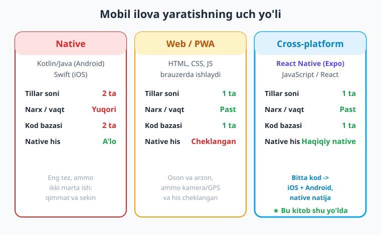
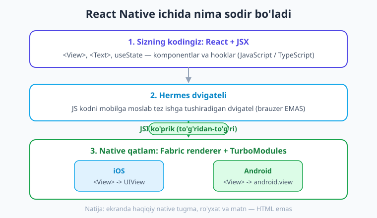
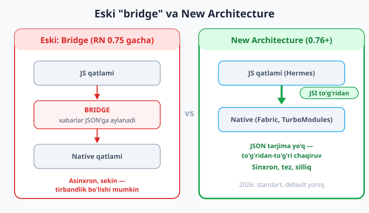

# 01 — React Native nima va nega kerak

[🏠 Kitob boshi](./README.md) · [Keyingi: 02 — Muhit sozlash va birinchi ilova ➡️](./02-muhit-birinchi-ilova.md)

> **Bu bobda:** mobil ilova yaratishning uch yo'lini (native, web, cross-platform) taqqoslaymiz; React Native nima ekanini, u qanday "tarjima" qilib haqiqiy native ilova chiqarishini tushunamiz; New Architecture (Fabric, JSI, Hermes) nega tez ekanini ko'ramiz; Expo nima va nega tavsiya etilishini bilib olamiz. Bir qatordan ham kod yozmaymiz — bu bob "katta rasm"ni ko'rsatadi.

---

## Muammodan boshlaymiz: telefon uchun ilova kerak

Tasavvur qiling, sizda ajoyib g'oya bor — masalan, mahalliy taksi xizmati yoki onlayn do'kon ilovasi. Uni odamlar telefoniga o'rnatishini xohlaysiz. Telefon dunyosi esa ikkiga bo'lingan:

- **Android** — dunyodagi telefonlarning ko'pchiligi, O'zbekistonda ham eng keng tarqalgani.
- **iOS** — Apple'ning iPhone va iPad qurilmalari.

Bu ikki dunyo bir-biriga o'xshamaydi. Ularning "ona tili" ham har xil:

- Android uchun ilova odatda **Kotlin** yoki **Java** tilida yoziladi.
- iOS uchun ilova **Swift** (yoki eski **Objective-C**) tilida yoziladi.

> **Hayotiy o'xshatish.** Tasavvur qiling, bitta kitobni yozmoqchisiz, lekin uni **ikki xil tilda** — masalan o'zbek va arab tilida — chiqarish kerak. Ikkala kitob bir xil hikoyani aytadi, ammo siz uni ikki marta yozasiz: ikkita muharrir, ikkita tahrir, ikkita bosmaxona. Bir tomonda biror narsani o'zgartirsangiz, ikkinchi tomonda ham qo'lda takrorlaysiz. Mana shu — an'anaviy mobil dasturlashning asosiy og'rig'i.

Amalda bu nimani anglatadi? An'anaviy yo'lda bitta ilovani ikki platformaga chiqarish uchun sizga kerak bo'ladi:

- **Ikki xil til** — Kotlin va Swift'ni alohida o'rganish.
- **Ikki alohida jamoa** (yoki bitta jamoa ikki barobar ko'p vaqt sarflaydi).
- **Ikki kod bazasi** — ikki xil loyiha, ikki marta sinov, ikki marta tuzatish.

Natija: **qimmat va sekin.** Yangi tugma qo'shsangiz — ikki joyda qo'shasiz. Xato chiqsa — ikki joyda tuzatasiz. Aynan shu muammoni hal qilish uchun yangi yondashuvlar paydo bo'ldi. Ana shulardan biri — **React Native**.

!!! note "Atamalar"
    **Native ilova** — telefon operatsion tizimi (Android yoki iOS) uchun maxsus, "o'z tilida" yozilgan ilova. **Platforma** — bu yerda Android yoki iOS degani. **Kod bazasi (codebase)** — bitta loyihaning barcha kodi.

---

## Yechimlar spektri: uch xil yo'l

Mobil ilova yaratishning bugungi kunda asosan **uch xil yo'li** bor. Har birining o'z kuchli va kuchsiz tomoni bor — keling, ularni yonma-yon qo'yib ko'raylik.

### 1-yo'l: Native (har platforma uchun alohida)

Yuqorida aytganimiz — Android uchun Kotlin, iOS uchun Swift. Bu eng "asl" yo'l.

- **Kuchli tomoni:** eng tez ishlash, qurilmaning har bir imkoniyatidan to'liq foydalanish, eng silliq his.
- **Kuchsiz tomoni:** **ikki marta ish** — ikki til, ikki kod bazasi, ikki barobar vaqt va pul.

### 2-yo'l: Web / PWA (brauzer asosida)

Bu yerda siz oddiy veb-sayt yasaysiz (HTML, CSS, JavaScript) va uni telefonda "ilovaga o'xshatib" ko'rsatasiz. PWA — bu "Progressive Web App", ya'ni brauzerdagi sayt bo'lib, uni bosh ekranga qo'shsa, ilovaga o'xshab ochiladi.

- **Kuchli tomoni:** oson, arzon, bitta kod hammasi uchun, veb-bilimlaringiz yetadi.
- **Kuchsiz tomoni:** **native his va imkoniyatlar cheklangan.** Bu aslida brauzer ichidagi sayt — kamera, GPS, push-bildirishnomalar bilan ishlash qiyin yoki cheklangan, harakat va his "asl ilova"dek emas.

### 3-yo'l: Hibrid / Cross-platform (React Native, Flutter)

Bu — "oltin o'rtalik". Siz **bitta kod** yozasiz, lekin u **haqiqiy native** ilovaga aylanadi va ham Android, ham iOS'da ishlaydi. Brauzer ichidagi sayt emas — chinakam mobil ilova.

- **Kuchli tomoni:** **bitta kod -> ikki platforma**, native natija va his, tez ishlab chiqish.
- **Kuchsiz tomoni:** o'rtada qo'shimcha qatlam bor (lekin zamonaviy texnologiyalar buni deyarli sezilmas qildi — buni quyida ko'ramiz).

Bu kitobning butun mavzusi — aynan shu uchinchi yo'l, ya'ni **React Native**.

> **Hayotiy o'xshatish.** Native — bu uyni ikki marta, ikki xil reja bilan qurish. Web — bu uyga o'xshatilgan dekoratsiya. Cross-platform (React Native) — bu bitta puxta reja chizib, undan ham Android, ham iOS uchun haqiqiy uy qurish: bir marta o'ylaysiz, ikki marta foyda olasiz.

!!! tip "Maslahat"
    Agar siz JavaScript yoki React bilan tanish bo'lsangiz, React Native siz uchun eng tabiiy yo'l: yangi til o'rganmasdan, allaqachon bilgan bilimlaringiz bilan mobil ilova yozasiz.

---

## React Native falsafasi: React bilan haqiqiy native ilova

Endi eng muhim g'oyaga keldik. **React Native** — bu Facebook (hozirgi Meta) yaratgan texnologiya bo'lib, u sizga **JavaScript va React** bilan **haqiqiy native** mobil ilova yozish imkonini beradi.

Bu jumladagi har bir so'z muhim, shuning uchun ochib beraylik.

> **Hayotiy o'xshatish.** React Native — bu **tarjimon** kabi. Siz React tilida gapirasiz (komponentlar, JSX), tarjimon esa sizning so'zlaringizni telefon tushunadigan native tilga o'giradi. Siz ingliz tilini bilmaysiz, lekin tarjimon yordamida ingliz bilan bemalol muloqot qilasiz — xuddi shunday, siz Kotlin/Swift bilmaysiz, lekin React Native ularning tilida native UI yasaydi.

!!! note "React nima edi?"
    **React** — veb-saytlar uchun foydalanuvchi interfeysi (UI) yasaydigan mashhur JavaScript kutubxonasi. Uning asosiy g'oyasi — interfeysni **komponentlar**ga bo'lish. **Komponent** — bu ekranning qayta ishlatiladigan bo'lagi (masalan, "tugma" komponenti yoki "karta" komponenti), uni xuddi LEGO g'ishti kabi yig'ib, butun ekran quriladi. Agar React bilan tanish bo'lmasangiz, hech qisi yo'q — bu kitobda kerakli tushunchalarni qaytaramiz.

### Eng muhim haqiqat: bu brauzer EMAS, HTML EMAS

Bu joyni juda yaxshi tushunib oling, chunki ko'p boshlovchilar shu yerda adashadi.

Veb-saytda siz `
`, `
`, `` kabi **HTML teglar**ini yozasiz va ular brauzerda ko'rinadi. React Native'da esa **HTML yo'q** va **brauzer yo'q**. Uning o'rniga maxsus React Native komponentlari bor:

- `<View>` — konteyner (veb'dagi `
` kabi, lekin u HTML emas).
- `<Text>` — matn (veb'dagi `
` yoki `` kabi).

Va eng qizig'i: bu komponentlar ekranda **haqiqiy native UI elementlari** sifatida chiziladi:

- `<View>` iOS'da `UIView`'ga, Android'da `android.view`'ga aylanadi.
- `<Text>` native matn elementiga aylanadi.

Ya'ni siz React tilida `<View>` deb yozasiz, lekin telefonda paydo bo'ladigan narsa — Swift dasturchisi `UIView` yozganda yoki Kotlin dasturchisi native view yasaganda chiqadigan **aynan o'sha** haqiqiy native element. Brauzer ichidagi taqlid emas.

!!! warning "Ehtiyot bo'ling: HTML odatlarini unuting"
    Agar veb-dasturlashdan kelgan bo'lsangiz, `
`, `
`, `class="..."`, oddiy CSS fayllar — bularning hech biri React Native'da ishlamaydi. Buning o'rniga `<View>`, `<Text>` va `StyleSheet` ishlatiladi. Yana bir qoida: **har qanday matn albatta `<Text>` ichida bo'lishi shart.** Bu — eng keng tarqalgan boshlovchi xatosi. Buni keyingi boblarda batafsil ko'ramiz.

---

## React Native qanday ishlaydi?

Endi "tarjimon" ichkarida aslida nima qilishini ko'raylik. Buni bilish shart emas, lekin bilsangiz — nima uchun ba'zi narsalar tez, ba'zilari sekin ekanini tushunasiz va keyinroq xatolarni osonroq topasiz.

Oqim shunday:

1. **Sizning kodingiz** — React komponentlari, JSX, hooklar. Buni siz JavaScript (yoki TypeScript) tilida yozasiz: `<View>`, `<Text>`, `useState` va hokazo.

2. **Hermes dvigateli.** Yozgan JavaScript kodingiz **Hermes** degan maxsus dvigatelda ishga tushadi. Hermes — bu Meta tomonidan aynan mobil uchun yaratilgan, JS kodni tez bajaradigan dvigatel. (Diqqat: bu brauzer emas — bu telefon ilovasi ichida yashaydigan kichik, tez "yurak".)

3. **JSI ko'prigi.** Hermes'dagi JavaScript kod **JSI (JavaScript Interface)** orqali native dunyo bilan gaplashadi. JSI — bu JavaScript bilan native kodni to'g'ridan-to'g'ri bog'laydigan zamonaviy aloqa kanali. Siz `onPress` (bosish) hodisasini yozsangiz yoki kameraga murojaat qilsangiz — xabar shu kanal orqali o'tadi.

4. **Native UI (Fabric).** **Fabric** — React Native'ning renderi, ya'ni ekranga native elementlarni chizadigan qism. U sizning `<View>` va `<Text>`'laringizni iOS'da `UIView`'ga, Android'da `android.view`'ga aylantirib, ekranga chiqaradi.

> **Hayotiy o'xshatish.** Buni restoran deb tasavvur qiling. Siz (React kod) ovqat buyurtma qilasiz. Ofitsiant (JSI) buyurtmani oshxonaga (native qatlam) yetkazadi. Oshpaz (Fabric) esa haqiqiy taom (native UI) tayyorlab, oldingizga qo'yadi. Siz oshxonaga kirmaysiz, lekin chinakam, issiq taom yeysiz — taqlid emas.

!!! note "Atamalar (qisqacha)"
    - **Hermes** — mobil uchun maxsus JS dvigateli (JS kodni ishga tushiradi).
    - **JSI (JavaScript Interface)** — JS va native kod o'rtasidagi to'g'ridan-to'g'ri ko'prik.
    - **Fabric** — native UI'ni chizadigan renderer.
    - **TurboModules** — native imkoniyatlarni (kamera, GPS va h.k.) JS'ga ulaydigan zamonaviy modullar tizimi.

---

## New Architecture: 2026-yilning standarti

Yuqoridagi rasmda biz **zamonaviy** React Native'ni ko'rsatdik. Lekin shunday bo'lmagan vaqt ham bor edi. Bu yerda biroz tarixga to'xtalamiz, chunki bu farq **nima uchun zamonaviy RN tez ekanini** tushuntiradi.

### Eski yo'l: "bridge" (ko'prik)

Avvalroq React Native JS dunyosi bilan native dunyoni **"bridge"** (ko'prik) orqali bog'lardi. Buning muammosi shunda ediki:

- Har bir xabar (masalan, "bu tugma bosildi") avval **JSON matniga** aylantirilardi, ko'prikdan o'tardi, keyin yana qayta o'qilardi.
- Bu **asinxron** edi — ya'ni xabar yuborildi, lekin javob qachon kelishi noma'lum, biroz kutish kerak edi.
- Ko'p xabar bir vaqtda yuborilsa, ko'prikda **tirbandlik** hosil bo'lardi va ilova "sekin", "qotib qolgan"dek his qilinardi.

> **Hayotiy o'xshatish.** Eski bridge — bu ikki qirg'oq orasidagi tor ko'prik bo'lib, har bir mashina o'tishidan oldin yukini quticha ichiga joylab (JSON'ga aylantirib), ko'prikdan o'tib, narigi tomonda yana ochib oladi. Mashina ko'p bo'lsa — navbat, tirbandlik, sekinlik.

### Yangi yo'l: New Architecture (JSI + Fabric + TurboModules + Hermes)

Keyin React Native jamoasi butunlay yangi poydevor — **New Architecture**ni yaratdi. Uning asosiy qismlari:

- **JSI** — JS va native to'g'ridan-to'g'ri gaplashadi, JSON tarjimasi yo'q.
- **Fabric** — yangi, tezroq renderer.
- **TurboModules** — native modullar faqat kerak bo'lganda yuklanadi (tezroq ishga tushish).
- **Hermes** — tez JS dvigateli (default).

Natijada aloqa **to'g'ridan-to'g'ri va sinxron** bo'ldi — JSON'ga o'rab-ochish yo'q, tirbandlik yo'q. Ilova **sezilarli tez va silliq** ishlaydi.

> **Hayotiy o'xshatish.** New Architecture — bu tor ko'prik o'rniga keng, to'g'ridan-to'g'ri yo'l: mashina yukini qutiga joylamasdan, to'xtamasdan o'tib ketadi. Tezroq, silliqroq, navbatsiz.

### Bu sizga nimani anglatadi?

Eng yaxshi yangilik — **siz buning uchun hech narsa qilishingiz shart emas.** 2026-yilda New Architecture standart:

- **RN 0.76** dan boshlab — default yoniq.
- **RN 0.82** dan boshlab — majburiy.
- **RN 0.85** (bu kitob ishlatadigan versiya) — to'liq, eski bridge butunlay olib tashlangan.

Ya'ni bu kitobdagi har bir ilova avtomatik ravishda New Architecture'da, eng tez rejimda ishlaydi. Siz faqat React yozasiz — qolganini framework hal qiladi.

!!! tip "Nega buni bilish foydali?"
    Internetda eski (2-3 yil oldingi) maqolalarni o'qiganingizda, "bridge", "ilovam sekin" kabi gaplarni uchratasiz. Endi bilasiz: bular eski arxitektura haqida. Zamonaviy React Native (0.76+) butunlay boshqacha — JSI asosida, tez va sinxron.

---

## Expo nima va nega tavsiya etiladi?

React Native — kuchli poydevor. Lekin yalang'och React Native bilan ishlash boshlovchi uchun biroz mashaqqatli: muhitni qo'lda sozlash, native loyihalarni boshqarish, kamera/GPS kabi imkoniyatlarni qo'lda ulash kerak bo'ladi. Aynan shu yerda **Expo** yordamga keladi.

> **Hayotiy o'xshatish.** Agar React Native — uy qurish uchun g'isht, sement va asboblar bo'lsa, **Expo** — barcha asbob va materiallar saralangan, ko'rsatma va elektr-suv allaqachon o'tkazilgan **to'liq jihozlangan ustaxona**. Siz noldan quvur tortmaysiz — darhol qurishga kirishasiz.

**Expo** — bu React Native ustiga qurilgan, "to'liq jihozlangan" framework. U sizga quyidagilarni tayyor holda beradi:

- **File-based routing** — sahifalarni (ekranlarni) shunchaki fayl yaratish orqali tashkil qilasiz. Fayl yasadingiz — yangi ekran tayyor (buni 14-bobda ko'ramiz).
- **Tayyor native kutubxonalar** — kamera (`expo-camera`), joylashuv (`expo-location`), bildirishnoma va boshqalar — qo'lda native kod yozmasdan ishlatasiz.
- **Config plugins** — native sozlamalarni oddiy konfiguratsiya orqali boshqarasiz, Xcode/Android Studio bilan ovora bo'lmaysiz.
- **EAS Build** — ilovangizni bulutda (o'z kompyuteringizda emas) yig'ib, `.apk` (Android) yoki `.ipa` (iOS) faylga aylantiradigan xizmat.

### Expo Go — telefonda darhol sinash

Expo'ning eng yoqimli imkoniyatlaridan biri — **Expo Go**. Bu telefoningizga o'rnatadigan bepul ilova bo'lib, u yordamida o'z ilovangizni **darhol**, hech narsa "build" qilmasdan telefonda ochib ko'rasiz. Kodni o'zgartirasiz — telefon ekranida o'zgarish bir lahzada ko'rinadi. Boshlash uchun bundan oson yo'l yo'q (buni 2-bobda amalda sinaymiz).

### Eng muhimi: bu rasmiy tavsiya

2026-yilda **React Native jamoasining o'zi yangi loyihalar uchun rasman Expo'ni tavsiya qiladi.** Ya'ni Expo — bu chetdagi qo'shimcha emas, balki React Native bilan ishlashning standart, tavsiya etilgan yo'li.

Shuning uchun **bu kitob to'liq Expo asosida** yozilgan. Biz Expo SDK 56, React Native 0.85 va React 19 ishlatamiz.

!!! note "Bu kitob ishlatadigan versiyalar"
    - **Expo SDK 56** — Expo'ning to'plam versiyasi.
    - **React Native 0.85** — New Architecture to'liq yoniq.
    - **React 19** — eng yangi React.
    - **TypeScript** — kod xavfsizroq va tushunarliroq bo'lishi uchun.

    Bularning hammasini 2-bobda bitta buyruq bilan o'rnatamiz — hozir yodlash shart emas.

---

## Kimlar React Native ishlatadi?

React Native — kichik tajriba emas. Uni dunyodagi eng yirik kompaniyalar mahsulotlarida ishlatishadi:

- **Instagram** — ko'plab ekranlari React Native'da.
- **Discord** — millionlab foydalanuvchili chat ilovasi.
- **Shopify** — onlayn savdo platformasi, mobil ilovalari React Native'ga ko'chgan.
- **Coinbase**, **Microsoft**, **Tesla** va boshqa ko'plab kompaniyalar.

> **Hayotiy o'xshatish.** Bu — sinovdan o'tgan, ishonchli yo'l. Siz "noma'lum tajriba" bilan emas, balki millionlab odam har kuni ishlatadigan ilovalarni quvvatlaydigan texnologiya bilan ishlaysiz.

**O'zbekistonda ham** mobil ilovalarga talab katta: bank ilovalari, taksi, yetkazib berish, onlayn do'konlar — bularning barchasi mobil ilova talab qiladi. React Native bilan siz bitta jamoa, bitta kod bazasi bilan ham Android, ham iOS bozoriga chiqasiz — bu mahalliy bozor uchun ayniqsa qulay.

---

## React Native vs Flutter (qisqa va halol)

Cross-platform yo'lda React Native'ning eng mashhur raqibi — **Flutter** (Google yaratgan). Adolatli bo'lish uchun qisqa taqqoslaymiz:

| Jihat | React Native | Flutter |
|---|---|---|
| **Til** | JavaScript / TypeScript (React) | Dart |
| **Yondashuv** | Haqiqiy native UI elementlari | O'z grafik renderi (Skia/Impeller) bilan chizadi |
| **Ekotizim** | Juda katta (JavaScript dunyosi) | Katta va o'sib bormoqda |
| **O'rganish** | JS/React bilsangiz oson | Yangi til (Dart) o'rganasiz |

**Halol xulosa:** ikkalasi ham juda yaxshi, zamonaviy texnologiya. To'g'ri yoki noto'g'ri tanlov yo'q.

- Agar siz **JavaScript yoki React** bilan tanish bo'lsangiz yoki veb-dunyodan kelsangiz — **React Native** tabiiyroq tanlov.
- Agar yangi til o'rganishga tayyor bo'lsangiz va Google ekotizimini afzal ko'rsangiz — Flutter ham ajoyib.

Bu kitob React Native'ga bag'ishlangan, chunki u JavaScript/React bilimingizni to'g'ridan-to'g'ri mobilga olib o'tadi.

!!! question "Tekshirib ko'ring"
    React Native va Flutter o'rtasidagi eng asosiy farqni o'z so'zingiz bilan ayta olasizmi? (Maslahat: qaysi tilda yoziladi va UI'ni qanday chizadi.)

---

## Kitob yo'l xaritasi

Bu kitob sizni "React Native nima?" degan savoldan to **App Store va Google Play'ga ilova joylashtirish**gacha bosqichma-bosqich olib boradi. Qisqacha yo'nalish:

- **Asoslar** (1–5): muhit sozlash, JSX va core komponentlar, stillar, Flexbox layout.
- **UI va o'zaro ta'sir** (6–9): input va tugmalar, skroll va xavfsiz hudud, ro'yxatlar, holat (state).
- **React chuqur** (10–13): props va kompozitsiya, `useEffect`, hooklar, custom hooklar.
- **Navigatsiya** (14–16): Expo Router, Tabs/Drawer, dinamik marshrutlar.
- **Ma'lumot va backend** (17–20): tarmoq/API, lokal saqlash, global holat, formalar.
- **Native imkoniyatlar** (21–24): kamera, joylashuv/xarita, bildirishnoma/sensor, animatsiya.
- **Professional daraja** (25–27): autentifikatsiya, testlash, performance va deploy.
- **Kapston** (28): hamma bilimni birlashtirib, to'liq mobil ilova quramiz.

Har bob oldingisiga tayanadi, shuning uchun **tartib bilan** o'qishni tavsiya qilamiz. Va eng muhimi — **har misolni o'z qo'lingiz bilan terib, telefonda ochib ko'ring.** Mobil dasturlashni faqat o'qib emas, qilib o'rganasiz.

Keyingi bobda esa nazariyani yig'ishtirib, **muhitni sozlaymiz va birinchi ilovamizni telefonda ishga tushiramiz.**

---

## Xulosa

- An'anaviy mobil dasturlash **ikki til** (Android uchun Kotlin/Java, iOS uchun Swift) va **ikki kod bazasi**ni talab qiladi — bu qimmat va sekin.
- Yechimlar uch xil: **Native** (tez, lekin ikki marta ish), **Web/PWA** (oson, lekin native his/imkoniyat cheklangan) va **Cross-platform** (bitta kod, native natija).
- **React Native** — JavaScript/React bilan **haqiqiy native** ilova yozish imkonini beradi. `<View>` native `UIView`/`android.view`'ga aylanadi. Bu **brauzer emas, HTML emas.**
- React Native ichida: kod **Hermes** dvigatelida ishlaydi, **JSI** orqali native bilan to'g'ridan-to'g'ri gaplashadi, **Fabric** native UI'ni chizadi.
- **New Architecture** (JSI + Fabric + TurboModules + Hermes) eski sekin "bridge"ni almashtirdi: aloqa **to'g'ridan-to'g'ri va sinxron**, shuning uchun tez. 2026-yilda standart (RN 0.85'da to'liq), siz uchun avtomatik yoniq.
- **Expo** — React Native uchun "to'liq jihozlangan" framework: file-based routing, tayyor native kutubxonalar, config plugins, EAS Build. 2026-yilda **rasman tavsiya etilgan**, va bu kitob aynan **Expo asosida**. **Expo Go** — telefonda ilovani darhol sinash ilovasi.
- React Native'ni Instagram, Discord, Shopify, Coinbase kabi yirik kompaniyalar ishlatadi; O'zbekistonda ham mobil talab katta.
- **React Native (JavaScript/React)** va **Flutter (Dart)** — ikkalasi ham yaxshi; JS/React bilsangiz, React Native tabiiyroq.

## Amaliy mashqlar

Bu bob nazariy bo'lgani uchun mashqlar ham fikrlash va tushuntirishga qaratilgan. Hech qanday kod yozish shart emas — javoblarni o'z so'zingiz bilan, og'zaki yoki daftarga yozing.

1. **(Oson)** Mobil ilova yaratishning uch yo'lini (Native, Web/PWA, Cross-platform) o'z so'zingiz bilan, har biriga bittadan kuchli va bittadan kuchsiz tomonini aytib, do'stingizga tushuntiring.

2. **(Oson)** "React Native — bu brauzer emas, HTML emas" jumlasi nimani anglatadi? `<View>` va `<Text>` aslida ekranda nimaga aylanadi?

3. **(O'rtacha)** Tasavvur qiling, siz O'zbekistonda kichik startap uchun mobil ilova qilmoqchisiz: cheklangan byudjet, kichik jamoa, ham Android, ham iOS kerak. Qaysi yo'lni tanlaysiz va **nega**? Tanlovingizni 3-4 jumla bilan asoslang.

4. **(O'rtacha)** New Architecture (JSI) nega eski "bridge"dan tezroq? "JSON", "to'g'ridan-to'g'ri" va "sinxron" so'zlarini ishlatib tushuntiring. (Maslahat: bobdagi ko'prik o'xshatishini eslang.)

5. **(Qiyin)** Internetdan "React Native bridge slow" kabi 2-3 yil oldingi maqolani topib o'qing. Unda yozilgan muammolar bugungi (RN 0.85, New Architecture) holatga taalluqlimi? Nega? Eski va yangi arxitektura farqini misol bilan tushuntiring.

---

[🏠 Kitob boshi](./README.md) · [Keyingi: 02 — Muhit sozlash va birinchi ilova ➡️](./02-muhit-birinchi-ilova.md)
