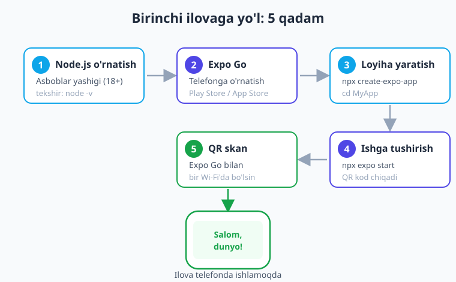
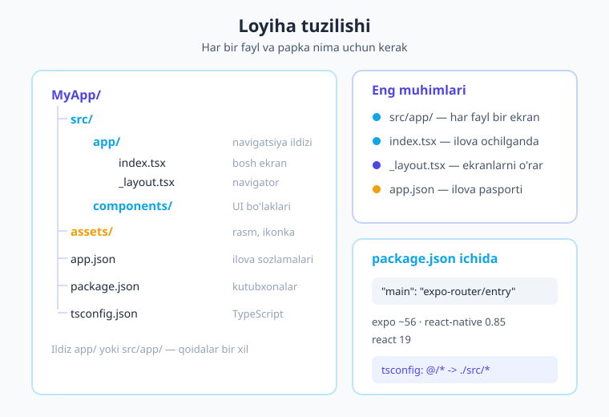
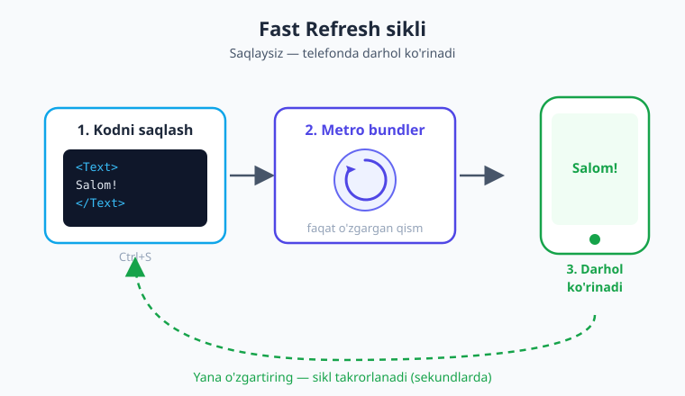

# 02 — Muhit sozlash va birinchi ilova

[⬅️ Oldingi: 01 — React Native nima](./01-react-native-nima.md) · [🏠 Kitob boshi](./README.md) · [Keyingi: 03 — JSX va Core komponentlar ➡️](./03-jsx-core-komponentlar.md)

> **Bu bobda:** kompyuteringizni mobil ilova yozishga tayyorlaymiz. Node.js o'rnatamiz, telefonga **Expo Go** ilovasini qo'yamiz, `create-expo-app` bilan birinchi loyihani yaratamiz va uni **o'z telefoningizda** ishga tushiramiz. Oxirida bir qator kodni o'zgartirib, ekranda **darhol** o'zgarishini ko'rib, "sehr"ni o'z ko'zingiz bilan his qilasiz.

---

## Kirish: nega bu bob muhim?

Avvalgi bobda biz React Native nima ekanini va u qanday ishlashini o'rgandik. Endi nazariyadan amaliyotga o'tamiz. Bu kitobning eng yoqimli onlaridan biri — chunki bob oxirida sizning **shaxsiy telefoningizda** o'zingiz yozgan ilova ishlab turadi.

Ko'p odamlar mobil dasturlashdan qo'rqadi, chunki ular shunday deb o'ylaydi: "Buning uchun qimmat Mac kompyuter, og'ir Android Studio, murakkab Xcode kerak bo'lsa kerak". **Yaxshi xabar:** boshlash uchun bularning **hech biri shart emas**. Bizga faqat oddiy kompyuter, bitta dasturchi vositasi (Node.js) va sizning telefoningiz kifoya.

> **Hayotiy o'xshatish.** Tasavvur qiling, ovqat pishirishni o'rganmoqchisiz. Ikki yo'l bor. Birinchisi — darhol restoran oshxonasini qurish: pech, sovutgich, o'nlab pichoq sotib olish. Bu qimmat va charchatadi. Ikkinchisi — uydagi oddiy gaz plitasida boshlash: arzon, tez, hozir. **Expo** — aynan shu ikkinchi yo'l. U barcha murakkab "oshxona jihozlari"ni siz uchun tayyorlab qo'ygan; siz darhol "ovqat pishirish"ni — ya'ni ilova yozishni boshlaysiz.

Keling, qadamlarga bo'lib boramiz. Pastdagi rasmda butun yo'limizning xaritasi: Node o'rnatishdan tortib, telefonda ishlovchi ilovagacha.



---

## 1-qadam: Talablar bilan tanishuv

Birinchi ilovamizni yozish uchun bizga quyidagilar kerak bo'ladi:

| Nima kerak | Tafsilot |
|---|---|
| **Kompyuter** | Windows, macOS yoki Linux — farqi yo'q. Expo uchunmisi muhim emas. |
| **Node.js** | Dasturchi vositasi. **18-versiya yoki yuqori** (biz **24-versiyani** tavsiya qilamiz). |
| **Telefon** | Android yoki iPhone — ilovani **shu yerda** ko'ramiz. (Yoki emulator — pastda tushuntiramiz.) |
| **Matn muharriri** | Kod yozish uchun. **VS Code** bepul va eng mashhur — uni tavsiya qilamiz. |

> **Hayotiy o'xshatish.** Node.js — bu dasturchining "asboblar yashigi". Bolg'a yoki tashqi (otvyortka) qurol kabi, u JavaScript dunyosidagi deyarli barcha vositalarni ishlatish uchun zarur. `create-expo-app`, `expo` buyruqlari — hammasi Node ustida ishlaydi.

### Node.js nima va nega kerak?

**Node.js** (qisqacha "Node") — JavaScript kodini brauzersiz, to'g'ridan-to'g'ri kompyuterda ishlatadigan dastur. React Native loyihasini yaratish, kutubxonalarni yuklab olish (`npm` orqali) va dev-serverni ishga tushirish — bularning hammasi Node yordamida bo'ladi.

`npm` (Node Package Manager) — Node bilan **birga keladi**. U boshqalar yozgan tayyor kutubxonalarni yuklab oladigan "do'kon" deb o'ylang.

### Node o'rnatilganini tekshirish

Node sizda allaqachon bo'lishi mumkin. Buni tekshirish uchun **terminal** (Windows'da PowerShell yoki Buyruqlar qatori, macOS/Linux'da Terminal) ochib, quyidagini yozing:

```bash
node -v
```

Agar javob `v24.x.x` yoki `v18.x.x` (yoki undan yuqori) ko'rinishida bo'lsa — zo'r, Node tayyor. Misol uchun:

```text
$ node -v
v24.3.0
```

`npm` ham borligini tekshiraylik:

```bash
npm -v
```

Agar `node -v` "command not found" (buyruq topilmadi) yoki shunga o'xshash xato bersa, demak Node hali o'rnatilmagan.

!!! tip "Node'ni qayerdan olish kerak?"
    [nodejs.org](https://nodejs.org) saytiga kiring va **LTS** (Long Term Support — uzoq muddat qo'llab-quvvatlanadigan, eng barqaror) versiyasini yuklab oling. O'rnatuvchini ishga tushirib, "Next, Next, Finish" bosing. So'ng terminalni **yangidan** oching va `node -v` ni qayta tekshiring.

!!! warning "Eski versiyaga ehtiyot bo'ling"
    Agar Node'ingiz 18-versiyadan past bo'lsa (masalan, `v16`), zamonaviy Expo SDK 56 to'g'ri ishlamasligi mumkin. Yangilang. Bir nechta Node versiyasini boshqarish kerak bo'lsa, **nvm** (Node Version Manager) vositasidan foydalaning.

---

## 2-qadam: Eng oson yo'l — Expo va Expo Go

Endi eng muhim qarorga keldik: ilovani qanday ishlatamiz?

Avvalgi bobda aytganimizdek, React Native'ni ikki yo'l bilan yozish mumkin: "yalang'och" React Native (Android Studio + Xcode kerak) yoki **Expo** orqali. Biz **Expo** ni tanlaymiz, chunki u:

- **Og'ir dasturlarsiz** boshlashga imkon beradi (Android Studio, Xcode boshlang'ich bosqichda **shart emas**);
- Yuzlab tayyor native kutubxonalarni (kamera, GPS, bildirishnoma...) bir buyruq bilan beradi;
- Kodingizni telefonda darhol ko'rsatadigan **Expo Go** sherigi bilan keladi.

### Expo Go nima?

**Expo Go** — bu telefoningizga o'rnatadigan bepul ilova. U sizning yozgan kodingizni **alohida o'rnatishsiz**, to'g'ridan-to'g'ri ichida ochib beradi.

> **Hayotiy o'xshatish.** Expo Go — bu "namuna ko'rgazma zali". Mebel sotuvchi har bir divanni alohida uyingizga yetkazib, yig'ib bermaydi — siz ko'rgazma zaliga borib, o'sha yerda sinab ko'rasiz. Xuddi shunday, har safar kodni o'zgartirganingizda ilovani qaytadan "qurib", telefonga o'rnatib o'tirmaysiz. Expo Go yozayotgan ilovangizni o'z ichiga olib, darhol ko'rsatadi. Tez va qulay.

### Expo Go'ni o'rnatish

Telefoningizda do'konni oching va **"Expo Go"** deb qidiring:

- **Android** — Google Play Store'dan o'rnating.
- **iPhone (iOS)** — App Store'dan o'rnating.

O'rnatgach, hozircha ochish shart emas — keyinroq QR kod orqali ilovamizni unda ochamiz.

!!! note "iOS va Android farqi"
    Expo Go ikkala platformada ham bir xil ishlaydi. Faqat bitta nozik joy bor: **iPhone'da** QR kodni telefon **kamerasi** orqali skanerlaysiz (kamera Expo Go'ni ochishni taklif qiladi), **Android'da** esa to'g'ridan-to'g'ri **Expo Go ilovasi ichidagi** skanerdan foydalanasiz. Bularni 4-qadamda batafsil ko'ramiz.

---

## 3-qadam: Birinchi loyihani yaratish

Hammasi tayyor. Endi birinchi loyihamizni yaratamiz. Terminalni oching va loyihani saqlamoqchi bo'lgan papkaga o'ting (masalan, `Desktop` yoki `Projects`). So'ng quyidagi buyruqni yozing:

```bash
npx create-expo-app@latest MyApp
```

Bu buyruqni qismlarga bo'lib tushunaylik:

- `npx` — Node bilan keladigan vosita. U dasturni **doimiy o'rnatmasdan**, faqat shu safar uchun yuklab ishga tushiradi.
- `create-expo-app` — yangi Expo loyihasi yaratadigan rasmiy vosita.
- `@latest` — eng so'nggi versiyasini ishlat, degani.
- `MyApp` — yangi loyihangizning nomi (papka shu nomda yaratiladi). Istalgan nom qo'ysangiz bo'ladi, masalan `birinchi-ilova`.

Buyruqni bosgach, Expo ishga tushadi: shablon fayllarni yaratadi va barcha kerakli kutubxonalarni internetdan yuklab oladi. Bu bir-ikki daqiqa vaqt olishi mumkin — sabr qiling.

### Nima o'rnatildi?

Buyruq tugagach, `MyApp` papkasi ichida tayyor loyiha paydo bo'ladi. Unga `expo` frameworki, `react`, `react-native` va navigatsiya uchun `expo-router` kabi kutubxonalar o'rnatilgan bo'ladi. Versiyalarni keyin `package.json` faylida ko'ramiz.

Endi terminalda yangi papkaga kiramiz:

```bash
cd MyApp
```

`cd` — "change directory" (papkani o'zgartirish) degani. Endi terminalimiz loyiha ichida turadi.

!!! tip "VS Code'da ochish"
    Loyihani matn muharririda ko'rish uchun, agar VS Code o'rnatilgan bo'lsa, terminalda `code .` yozing (nuqta — "shu papka" degani). Yoki VS Code'ni qo'lda ochib, `File → Open Folder → MyApp` ni tanlang.

---

## 4-qadam: Ilovani ishga tushirish

Mana eng qiziq joyi! Loyiha papkasida turib (`cd MyApp` qilingan), quyidagini yozing:

```bash
npx expo start
```

Bu **dev-server** (ishlab chiqish serveri) ni ishga tushiradi. Bir necha soniyadan so'ng terminalda **QR kod** va bir nechta klaviatura buyruqlari ro'yxati paydo bo'ladi.

> **Hayotiy o'xshatish.** Dev-server — bu "oshpaz va ofitsiant"ning birikmasi. Siz oshxonada (kompyuterda) taom (kod) tayyorlaysiz, dev-server uni telefoningizgacha yetkazib beradi. Siz taomni o'zgartirsangiz — masalan, tuz qo'shsangiz — ofitsiant darhol yangi laganni olib keladi. Kodni qaytadan "buyurtma qilish" shart emas.

### QR kod orqali telefonda ochish (eng oson yo'l)

1. Kompyuter va telefoningiz **bitta Wi-Fi tarmog'ida** ekaniga ishonch hosil qiling. Bu **juda muhim** — aks holda telefon serverni topa olmaydi.
2. Telefoningizda QR kodni skanerlang:
   - **Android** — Expo Go ilovasini ochib, ichidagi **"Scan QR code"** tugmasidan foydalaning.
   - **iPhone** — oddiy **Kamera** ilovasini oching va QR kodga qarating; chiqqan bildirishnomani bosing.
3. Bir necha soniyadan so'ng telefoningizda ilovangiz **ochiladi**! Tabriklaymiz — bu sizning birinchi mobil ilovangiz.

### Emulator yoki brauzerda ochish

Telefon yo'qmi yoki sinab ko'rmoqchimisiz? `npx expo start` ishlab turganda terminalga quyidagi harflarni bosishingiz mumkin:

| Tugma | Nima qiladi |
|---|---|
| `w` | Ilovani **web** brauzerida ochadi (eng tez sinash usuli). |
| `a` | **Android emulatori**da ochadi (Android Studio o'rnatilgan bo'lsa). |
| `i` | **iOS simulyatori**da ochadi (faqat macOS + Xcode). |
| `r` | Ilovani qayta yuklaydi (reload). |
| `m` | Dev-menyuni ochadi (pastda gaplashamiz). |
| `j` | React Native DevTools'ni ochadi (xatolarni topish vositasi). |

!!! tip "Tez sinash uchun web"
    Hozircha telefon yoki emulator bilan ovora bo'lmasdan, faqat `w` ni bosib brauzerda ko'rishingiz mumkin. Bu eng tez yo'l. Lekin esda tuting: web — to'liq mobil emas; ba'zi native imkoniyatlar (kamera, GPS) faqat haqiqiy telefonda yoki emulatorda ishlaydi.

!!! warning "Telefon ilovani topa olmayaptimi?"
    Eng keng tarqalgan sabab — kompyuter va telefon **boshqa-boshqa Wi-Fi**da. Ikkalasini bir tarmoqqa ulang. Agar shunda ham ishlamasa, terminalda dev-server turganda `s` (yoki menyu orqali) bosib **Tunnel** rejimiga o'ting — u internet orqali bog'lanadi va turli tarmoqlarda ham ishlaydi (biroz sekinroq).

---

## 5-qadam: Loyiha tuzilishini tushunish

Ilovamiz ishladi. Endi loyihaning ichini ochib, qaysi fayl nima uchun ekanini ko'raylik. VS Code'da chap tomonda papka daraxtini ko'rasiz. Asosiy qismlari quyidagicha:



Eng muhim papka va fayllar:

```text
MyApp/
├── src/
│   ├── app/                 # Navigatsiya ildizi — har fayl bir ekran/sahifa
│   │   ├── index.tsx        # Bosh ekran (ilova ochilganda birinchi ko'rinadi)
│   │   └── _layout.tsx      # Navigator — ekranlarni o'rab turadi
│   └── components/          # Qayta ishlatiladigan UI bo'laklari
├── assets/                  # Rasm, ikonka, shrift fayllari
├── app.json                 # Ilova sozlamalari (nom, ikonka, plaginlar)
├── package.json             # Kutubxonalar ro'yxati va skriptlar
└── tsconfig.json            # TypeScript sozlamalari
```

> **Hayotiy o'xshatish.** Loyiha papkasi — bu yangi quriladigan uyning chizmasi. `src/app/` — xonalar (har bir fayl bir xona, ya'ni bir ekran), `components/` — qayta ishlatiladigan g'ishtlar (tugma, karta), `assets/` — bezaklar (rasm, ikonka), `app.json` — uyning umumiy pasporti (nomi, manzili, tashqi ko'rinishi).

!!! note "Diqqat: `src/app/` yoki `app/`?"
    Expo SDK 56'ning yangi shabloni navigatsiya ildizini **`src/app/`** ichiga joylashtiradi. Lekin ba'zi loyihalarda u to'g'ridan-to'g'ri **`app/`** (ildizda, `src`siz) bo'lishi mumkin. **Ikkalasi ham to'g'ri va qoidalar aynan bir xil** — Expo Router ikkalasini ham qo'llab-quvvatlaydi. Bu kitobning keyingi boblarida qisqalik uchun ko'pincha `app/` deb yozamiz, lekin sizning loyihangizda u `src/app/` bo'lsa — hech qanaqa muammo yo'q, faqat yo'l boshiga `src/` qo'shing.

### `src/app/` — navigatsiyaning yuragi

Expo Router'da papka tuzilishining o'zi navigatsiyani belgilaydi: **har bir fayl — bir ekran**. Buni 14-bobda chuqur o'rganamiz. Hozircha shuni bilish kifoya:

- `src/app/index.tsx` — bu **bosh ekran**, ilova ochilganda birinchi ko'rinadigan sahifa.
- `src/app/_layout.tsx` — bu **navigator**: barcha ekranlarni o'rab, ular orasidagi o'tishni boshqaradi.

### `package.json` — kutubxonalar pasporti

`package.json` — loyihangiz qaysi kutubxonalardan foydalanishini va versiyalarini saqlaydigan fayl. Uni ochsangiz, taxminan shunday qismni ko'rasiz:

```json
{
  "name": "MyApp",
  "main": "expo-router/entry",
  "dependencies": {
    "expo": "~56.0.11",
    "expo-router": "~56.2.10",
    "react": "19.2.3",
    "react-native": "0.85.3",
    "react-native-safe-area-context": "~5.7.0"
  }
}
```

E'tibor bering:

- `"main": "expo-router/entry"` — ilova `expo-router` orqali ishga tushishini bildiradi. Demak, asosiy "kirish nuqtasi" — `src/app/` papkasi.
- **Expo SDK 56**, **React Native 0.85**, **React 19** — bu kitob aynan shu versiyalarga asoslangan.

!!! tip "`~` (tilda) belgisi nimani anglatadi?"
    `"expo": "~56.0.11"` dagi `~` belgisi "shu kichik versiya doirasida yangilanishlarni qabul qil" degani (masalan `56.0.11` dan `56.0.20` gacha, lekin `56.1` ga emas). Bu kutubxonalar mos kelishini ta'minlaydi.

### `tsconfig.json` — TypeScript va `@/` qisqartmasi

Loyiha **TypeScript** ishlatadi (`.tsx` fayllar). `tsconfig.json` faylida bitta foydali sozlama bor — yo'l qisqartmasi (alias):

```json
{
  "extends": "expo/tsconfig.base",
  "compilerOptions": {
    "strict": true,
    "paths": {
      "@/*": ["./src/*"]
    }
  }
}
```

Bu `@/*` belgisi `./src/*` ga ishora qiladi. Ya'ni, `src/components/Tugma.tsx` faylini chaqirayotganda uzun nisbiy yo'l (`../../components/Tugma`) o'rniga qisqa `@/components/Tugma` deb yozsangiz bo'ladi. Bu juda qulay.

---

## 6-qadam: `app.json` — ilovaning sozlamalari

`app.json` — ilovangizning umumiy sozlamalari saqlanadigan fayl. Uni ochsangiz, taxminan shunday ko'rinishni ko'rasiz:

```json
{
  "expo": {
    "name": "MyApp",
    "slug": "my-app",
    "version": "1.0.0",
    "orientation": "portrait",
    "icon": "./assets/images/icon.png",
    "userInterfaceStyle": "automatic",
    "plugins": [
      "expo-router",
      ["expo-splash-screen", { "backgroundColor": "#208AEF" }]
    ],
    "experiments": {
      "typedRoutes": true,
      "reactCompiler": true
    }
  }
}
```

Asosiy maydonlarni ko'rib chiqaylik:

| Maydon | Nima qiladi |
|---|---|
| `name` | Ilovaning telefon ekranida ko'rinadigan nomi. |
| `slug` | Ilovaning qisqa, internet-do'stona nomi (URL'da ishlatiladi). |
| `icon` | Ilova ikonkasi (telefon ekranidagi belgi). |
| `orientation` | Ekran yo'nalishi (`portrait` = tik holat). |
| `plugins` | Qo'shimcha imkoniyatlar. `expo-router` — navigatsiya, `expo-splash-screen` — ochilish ekrani. |
| `experiments` | Yangi imkoniyatlar: `typedRoutes` (havolalarni tip-tekshirish), `reactCompiler` (React'ni avtomatik tezlashtirish). |

!!! note "New Architecture allaqachon yoniq"
    Avvalgi bobda eslatib o'tgan **New Architecture** (Fabric, TurboModules, JSI — tezroq, zamonaviy "dvigatel") Expo SDK 56'da **default holatda yoniq**. Siz uni `app.json`'da alohida sozlashingiz **shart emas** — hammasi o'z-o'zidan ishlaydi. Bu juda qulay.

---

## 7-qadam: Birinchi o'zgartirish — "sehr"ni his qilish

Mana endi haqiqiy zavqli qism keldi! Kelgan tayyor ekranni o'zimizniki qilamiz. `src/app/index.tsx` faylini oching. U taxminan ancha to'liq, tayyor ekranni ko'rsatadi. Biz uni **eng soddasiga** almashtiramiz, toki "Salom, dunyo!" yozilsin.

`src/app/index.tsx` faylining butun mazmunini o'chiring va o'rniga quyidagini yozing:

```tsx
// src/app/index.tsx
import { View, Text, StyleSheet } from 'react-native';

export default function Index() {
  return (
    <View style={styles.box}>
      <Text style={styles.matn}>Salom, dunyo!</Text>
    </View>
  );
}

const styles = StyleSheet.create({
  box: { flex: 1, alignItems: 'center', justifyContent: 'center' },
  matn: { fontSize: 24, fontWeight: '700', color: '#1e293b' },
});
```

Bu kodni qisqacha tushuntiramiz (batafsil 03 va 04-boblarda):

- `import { View, Text, StyleSheet } from 'react-native';` — bizga kerakli "g'ishtlar"ni `react-native` kutubxonasidan olamiz.
- `View` — bu konteyner, web'dagi `<div>` ga o'xshaydi. Boshqa elementlarni o'z ichiga oladi.
- `Text` — bu matn ko'rsatuvchi element. **Diqqat:** React Native'da har qanday matn **albatta** `<Text>` ichida bo'lishi shart!
- `StyleSheet.create({...})` — stillarni (rang, o'lcham, joylashuv) belgilaydigan vosita. Bu CSS emas, balki oddiy JavaScript obyekti.
- `export default function Index()` — bu bizning komponentimiz (ya'ni ekranning qayta ishlatiladigan bo'lagi). U JSX qaytaradi.

!!! warning "Eng keng tarqalgan boshlovchi xatosi"
    React Native'da matnni to'g'ridan-to'g'ri `<View>` ichiga yozib bo'lmaydi. `<View>Salom</View>` — **xato**! To'g'risi: `<View><Text>Salom</Text></View>`. **Har qanday matn `<Text>` ichida bo'lishi shart.** Buni ko'p marta eslatamiz, chunki har bir boshlovchi shu xatoga duch keladi.

### Faylni saqlang va sehrni kuzating

Endi faylni saqlang (`Ctrl+S` yoki macOS'da `Cmd+S`). Telefoningizga (yoki emulator/brauzerga) qarang...

**Ekran darhol yangilandi!** Endi unda "Salom, dunyo!" yozuvi turibdi. Siz hech narsani qayta yuklamadingiz, hech qanday tugma bosmadingiz — faqat saqladingiz, va o'zgarish **bir soniyada** ko'rindi.

Bu **Fast Refresh** (Tez yangilash) deb ataladi. Bu React Native'ning eng yoqimli imkoniyatlaridan biri.



> **Hayotiy o'xshatish.** Fast Refresh — bu jonli efirdagi suratchi kabi. Eski usulda rasm chizib, uni laboratoriyaga yuborib, bir kun kutib, keyin natijani ko'rar edingiz. Fast Refresh bilan esa — qalamingizni harakatlantirgan zahoti chiziq ekranda paydo bo'ladi. Kod yozasiz, saqlaysiz, natijani **shu zahoti** ko'rasiz. Bu o'rganishni nihoyatda tezlashtiradi.

Bu yerda "ko'rinmas ishchi" — **Metro bundler**. U sizning barcha JavaScript fayllaringizni yig'ib, telefonga yuboriladigan bitta paketga aylantiradi. Siz faylni saqlaganingizda Metro faqat **o'zgargan qismni** qayta yig'ib, telefonga yuboradi — shuning uchun shunday tez.

!!! tip "O'zingiz tajriba qiling"
    "Salom, dunyo!" matnini "Mening birinchi ilovam 🚀" ga o'zgartiring va saqlang. Yana o'zgardimi? Rangni `color: '#1e293b'` dan `color: '#4f46e5'` (indigo) ga o'zgartirib ko'ring. `fontSize: 24` ni `fontSize: 40` qiling. Har safar saqlaganda telefonda darhol o'zgarishini kuzating. Mana shu "his qilish" — mobil dasturlashning eng muhim ko'nikmasi.

---

## 8-qadam: Dev-menyu va DevTools

Ilovani yozayotganda sizga yordam beradigan bir nechta vosita bor. Ulardan eng asosiysi — **dev-menyu** (ishlab chiquvchi menyusi).

### Dev-menyuni qanday ochish kerak?

- **Haqiqiy telefonda** — telefonni **silkiting** (silkitsangiz menyu chiqadi).
- **Terminalda** — dev-server turganda `m` harfini bosing.
- **Emulatorda** — `Cmd+M` (Android) yoki `Cmd+D` (iOS).

Dev-menyuda foydali tugmalar bor:

| Tugma | Nima qiladi |
|---|---|
| **Reload** | Ilovani to'liq qayta yuklaydi (kod chalkashib qolsa foydali). |
| **Toggle Performance Monitor** | Ekranda tezlik ko'rsatkichlarini ko'rsatadi. |
| **Open JS Debugger** | React Native DevTools'ni ochadi. |

### React Native DevTools

**React Native DevTools** — bu kodingizdagi xatolarni topish va ilova ichini "ko'rish" vositasi. Uni terminalda `j` bosib ochasiz. Bu yerda `console.log(...)` orqali chop etgan xabarlaringizni ko'rasiz, xatolarni tahlil qilasiz.

Hozircha bularni chuqur o'rganmaymiz — **26-bobda** ("Testlash va debugging") batafsil to'xtalamiz. Lekin biror narsa ishlamay qolsa, birinchi navbatda **Reload** (`r`) qilib ko'ring — bu ko'p muammolarni hal qiladi.

!!! tip "Eng foydali debug usuli"
    Eng oddiy va eng kuchli vosita — `console.log()`. Komponent ichida `console.log('Bu yer ishladi', biror_qiymat)` yozsangiz, terminalda yoki DevTools'da xabar chiqadi. Bu kodning qaysi qismi ishlayotganini tushunishning eng tez yo'li.

---

## 9-qadam: Android Studio va Xcode qachon kerak?

Biz boshidan beri Android Studio va Xcode'siz ishlab keldik — va bu juda yaxshi. Lekin keling, ular **qachon** kerak bo'lishini ham aniqlashtiraylik, toki kelajakda chalkashmang.

| Vaziyat | Android Studio / Xcode kerakmi? |
|---|---|
| O'rganish, Expo Go bilan telefonda sinash | **Yo'q.** Bu kitobning katta qismi shunday. |
| **Emulator/simulyator**da ishlatish (telefonsiz) | **Ha** — emulator Android Studio (Android) yoki Xcode (iOS, faqat Mac) bilan keladi. |
| Expo Go qo'llab-quvvatlamaydigan **maxsus native kutubxona** ishlatish | **Ha** — "development build" (rivojlanish qurilishi) kerak bo'ladi. |
| Ilovani **App Store / Google Play**'ga chiqarish | **Shart emas!** Buning uchun **EAS Build** (bulutda quradi) bor. |

> **Hayotiy o'xshatish.** Android Studio va Xcode — bu og'ir "zavod uskunalari". Ularsiz ham (Expo Go bilan) ko'p narsa qilamiz. Faqat haqiqiy "mahsulot qutisini" yasashda (do'konga chiqarish, maxsus native kod) zavod kerak bo'ladi — va u zavodni ham bulutda (EAS) ijaraga olsa bo'ladi, o'zingizda qurish shart emas.

Yaxshi xabar: ilovani do'konga chiqarish uchun **EAS Build** degan bulut xizmati bor. U sizning o'rningizga `.apk`/`.aab` (Android) va `.ipa` (iOS) fayllarini bulutda quradi — sizning kompyuteringizda Xcode bo'lmasa ham iOS uchun build olishingiz mumkin. Buni **27-bobda** to'liq o'rganamiz.

!!! note "Hozircha Expo Go yetarli"
    Bu kitobning ko'p qismi davomida sizga faqat **Expo Go** va telefon kifoya. Android Studio/Xcode haqida hozircha bosh qotirmang — ular kerak bo'lganda (27-bobda) qadamma-qadam o'rgatamiz.

---

## `npm run reset-project` — toza boshlash

Yana bir foydali narsa. Yangi loyiha ko'plab namuna fayllar bilan keladi (tablar, ko'rsatmalar, demolar). Agar siz **toza varaqdan** boshlamoqchi bo'lsangiz, loyiha papkasida quyidagini ishlating:

```bash
npm run reset-project
```

Bu buyruq namuna fayllarni `example/` papkasiga ko'chiradi (yoki o'chiradi — sizdan so'raydi) va **toza** `src/app/` yaratadi: faqat ikkita fayl bilan — sodda `index.tsx` va `_layout.tsx`. Boshlovchilar ko'pincha shu yerdan boshlaydi. Reset'dan keyingi `index.tsx` shunday ko'rinadi:

```tsx
// src/app/index.tsx (reset-project'dan keyin)
import { Text, View, StyleSheet } from 'react-native';

export default function Index() {
  return (
    <View style={styles.container}>
      <Text>Edit src/app/index.tsx to edit this screen.</Text>
    </View>
  );
}

const styles = StyleSheet.create({
  container: { flex: 1, alignItems: 'center', justifyContent: 'center' },
});
```

Ko'rib turganingizdek — bu juda sodda boshlang'ich nuqta. Bizning "Salom, dunyo!" misolimiz aynan shunga o'xshaydi.

---

## Xulosa

Bu bobda mobil dasturlash uchun butun muhitni sozladik va birinchi ilovani ishga tushirdik. Asosiy fikrlar:

- **Node.js** (18+, eng yaxshisi 24) — React Native ishlashi uchun zarur asboblar yashigi. `node -v` bilan tekshiriladi.
- **Expo** boshlash uchun eng oson yo'l — og'ir **Android Studio/Xcode** boshlang'ich bosqichda **shart emas**.
- Telefonga **Expo Go** ilovasi o'rnatiladi (Play Store / App Store) — kodni telefonda darhol ko'rsatadi.
- Loyiha `npx create-expo-app@latest MyApp` bilan yaratiladi, `npx expo start` bilan ishga tushiriladi (QR kod yoki `w`/`a`/`i` tugmalari).
- **Loyiha tuzilishi:** `src/app/` (navigatsiya ildizi — `index.tsx` bosh ekran, `_layout.tsx` navigator), `components/`, `assets/`, `app.json`, `package.json` (`"main": "expo-router/entry"`), `tsconfig.json` (`@/*` → `src/*`). Ildiz `app/` yoki `src/app/` bo'lishi mumkin — qoidalar bir xil.
- **New Architecture** Expo SDK 56'da default yoniq — alohida sozlash shart emas.
- **Fast Refresh** — kodni saqlaganingizda telefon ekrani darhol yangilanadi. Metro bundler shu sehrni amalga oshiradi.
- **Dev-menyu** (telefonni silkitish yoki `m`) va **React Native DevTools** (`j`) — yozish va xatolarni topishda yordam beradi.
- Android Studio/Xcode faqat emulator yoki maxsus native build uchun kerak; do'konga chiqarish esa **EAS Build** (bulut) orqali, 27-bobda.

## Amaliy mashqlar

1. **Tekshiruv.** Terminalda `node -v` va `npm -v` ni ishga tushiring. Versiyalaringizni yozib qo'ying. Node'ingiz 18'dan yuqorimi?

2. **Birinchi loyiha.** `npx create-expo-app@latest birinchi-ilova` bilan yangi loyiha yarating, ichiga kiring (`cd birinchi-ilova`) va `npx expo start` bilan ishga tushiring. QR kodni telefoningizdagi Expo Go bilan skanerlab oching (kompyuter va telefon bir Wi-Fi'da bo'lsin).

3. **Fast Refresh'ni his qilish.** `src/app/index.tsx` ni ochib, matnni o'zgartiring va saqlang. Telefonda darhol o'zgardimi? Endi `color` va `fontSize` qiymatlarini bir necha marta o'zgartirib, har safar natijani kuzating. Bu "his qilish" — eng muhim mashq.

4. **Loyihani kashf qiling.** Loyiha ichidagi `app.json` faylini oching. `name` maydonini o'zgartiring (masalan, "Mening ilovam"). Yana qaysi maydonlar borligini o'qib chiqing. `package.json` da qaysi versiyada `expo` va `react-native` borligini toping.

5. **(Qiyinroq) Toza boshlash.** `npm run reset-project` ni ishga tushiring va nima o'zgarganini kuzating. Eski fayllar qayerga ketdi? Yangi `src/app/index.tsx` qanday ko'rinishda? Uni o'zgartirib, ekranga o'z ismingizni chiqaring (esda tuting: matn `<Text>` ichida bo'lishi shart!).

---

[⬅️ Oldingi: 01 — React Native nima](./01-react-native-nima.md) · [🏠 Kitob boshi](./README.md) · [Keyingi: 03 — JSX va Core komponentlar ➡️](./03-jsx-core-komponentlar.md)
