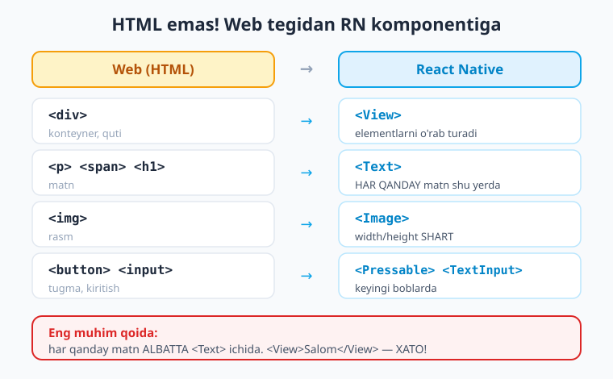
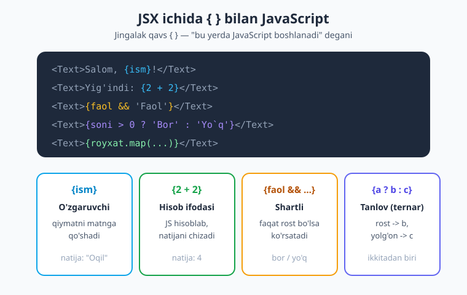
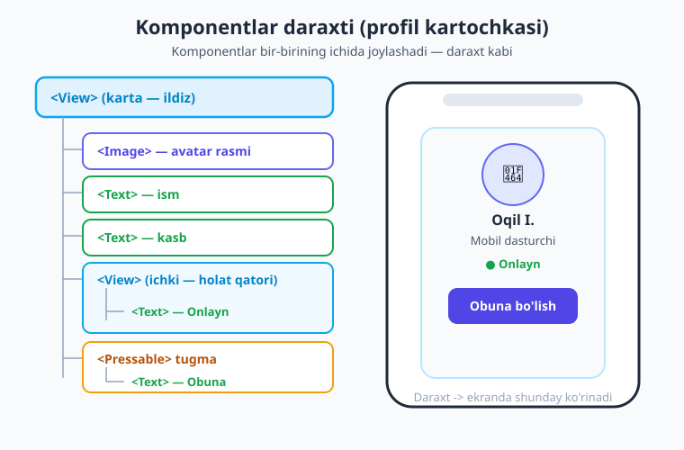

# 03 — JSX va Core komponentlar

[⬅️ Oldingi: 02 — Muhit sozlash](./02-muhit-birinchi-ilova.md) · [🏠 Kitob boshi](./README.md) · [Keyingi: 04 — Stillar: StyleSheet ➡️](./04-stillar-stylesheet.md)

> **Bu bobda:** ekrandagi narsalarni qanday "chizishni" o'rganamiz. JSX nima ekanini, komponent nima ekanini va React Native'ning eng asosiy "g'ishtlari" — `View`, `Text`, `Image` komponentlarini ko'rib chiqamiz. HTML bilstangiz ham, bu **HTML emas** — eng muhim farqlarni jadval bilan yonma-yon qo'yamiz va boshlovchilar eng ko'p qiladigan xatodan saqlanishni o'rganamiz.

---

## Kirish: ekranni "chizish"

Oldingi bobda biz birinchi ilovamizni ishga tushirdik va telefon ekranida matn paydo bo'lganini ko'rdik. Ammo o'sha matn ekranga qanday chiqdi? Kodda biz `<View>` va `<Text>` degan g'alati narsalarni yozdik. Bu nima o'zi?

Bu bob — kitobning eng amaliy boblaridan biri. Shu paytgacha hamma narsa nazariya edi: "React Native nima", "muhitni sozlash". Endi biz **haqiqatan ham ekranda nimadir chizishni** o'rganamiz. Bobni o'qib bo'lganingizdan so'ng siz o'zingizning birinchi profil kartochkangizni — rasmi, ismi va tugmasi bilan — yarata olasiz.

> **Hayotiy o'xshatish.** Lego konstruktorini tasavvur qiling. Sizda turli bo'laklar bor: katta plastinkalar, kichik g'ishtchalar, oynalar, eshikchalar. Ulardan istalgan narsa — uy, mashina, kema — qurish mumkin. React Native ham xuddi shunday: sizda tayyor "bo'laklar" bor (`View`, `Text`, `Image`), siz ularni bir-biriga ulab istalgan ekranni quryapsiz. Bu bo'laklar **komponentlar** deyiladi.

Keling, avval JSX bilan tanishaylik — bu o'sha "bo'laklarni" yozadigan til.

---

## JSX nima?

Kodimizda biz `<View>` va `<Text>` kabi narsalarni yozdik. Bu HTML tegiga juda o'xshaydi, lekin biz JavaScript faylida (`.tsx`) yozyapmiz. Bu **JSX** deb ataladi.

> **JSX** (JavaScript XML) — bu JavaScript ichida UI (foydalanuvchi interfeysi, ya'ni ekranda ko'rinadigan narsalar)ni yozish usuli. Qisqasi: "HTML'ga o'xshaydi, lekin aslida bu JavaScript".

Nima uchun bu qulay? Chunki interfeysni tasvirlash (bu yerda matn, bu yerda rasm) va mantiqni yozish (agar foydalanuvchi tizimga kirgan bo'lsa...) — ikkalasi **bitta joyda** turadi. Biz alohida HTML fayl va alohida JavaScript fayl o'rtasida sakrashimiz shart emas.

Mana eng oddiy JSX:

```tsx
<Text>Salom, dunyo!</Text>
```

Bu bir qarashda oddiy matnga o'xshaydi, lekin aslida bu JavaScriptga aylantiriladigan kod. Brauzer yoki telefon buni o'qiy olmaydi — uni avval oddiy JavaScriptga **tarjima qilish** kerak. Buni biz uchun maxsus dastur (Babel) avtomatik bajaradi, shuning uchun bu haqida o'ylamasak ham bo'ladi.

!!! note "Eslatma"
    JSX HTML emas, lekin u juda o'xshaganligi sababli HTML bilgan odam tez o'rganadi. Asosiy farqlarni shu bobda batafsil ko'rib chiqamiz — ular oz, lekin muhim.

---

## Komponent nima?

Biz "komponent" so'zini ko'p ishlatamiz, shuning uchun uni aniq tushuntiraylik.

> **Komponent** — ekranning qayta ishlatiladigan bo'lagi. Texnik tilda: **JSX qaytaradigan funksiya**. Masalan, "tugma" komponenti, "profil kartochkasi" komponenti, "ro'yxat elementi" komponenti.

Eng oddiy komponent — bu funksiya, u JSX qaytaradi:

```tsx
// app/index.tsx
import { View, Text } from 'react-native';

export default function Salom() {
  return (
    <View>
      <Text>Salom, dunyo!</Text>
    </View>
  );
}
```

Buni bo'lak-bo'lak ko'rib chiqamiz:

- `import { View, Text } from 'react-native';` — bizga kerak bo'lgan "bo'laklar"ni `react-native` kutubxonasidan olib kelyapmiz. Lego qutisidan kerakli g'ishtlarni stolga chiqarganday.
- `export default function Salom() {` — `Salom` nomli funksiya yaratyapmiz. Bu bizning komponentimiz. `export default` — "bu faylning asosiy komponenti shu" degani (boshqa fayllar uni ishlatishi mumkin).
- `return ( ... )` — funksiya nima qaytaradi? JSX qaytaradi — ekranda nima ko'rinishi kerakligini.

!!! tip "Maslahat"
    Komponent nomi **har doim katta harf** bilan boshlanadi: `Salom`, `ProfilKartochka`, `Tugma`. Bu shunchaki uslub emas — React aynan shu orqali sizning komponentingizni oddiy HTML-tegidan ajratadi. `<salom />` (kichik harf) ishlamaydi.

### Bitta ildiz element

Komponent **bitta ildiz element** qaytarishi kerak. Ya'ni `return` ichida eng tashqi bitta element bo'lishi shart:

```tsx
// TO'G'RI — bitta ildiz (View) hamma narsani o'rab turadi
return (
  <View>
    <Text>Birinchi qator</Text>
    <Text>Ikkinchi qator</Text>
  </View>
);
```

```tsx
// XATO — ikkita element yonma-yon, ildiz yo'q
return (
  <Text>Birinchi qator</Text>
  <Text>Ikkinchi qator</Text>
);
```

Agar qo'shimcha `View` o'ramaslik, lekin bir nechta elementni qaytarishni xohlasangiz, **fragment** ishlating — bu bo'sh `<>...</>` teg:

```tsx
return (
  <>
    <Text>Birinchi qator</Text>
    <Text>Ikkinchi qator</Text>
  </>
);
```

> **Hayotiy o'xshatish.** Fragment — bu ko'rinmas paket. Pochtaga bir nechta xat yuborayotganda ularni bitta konvertga solasiz, lekin oluvchi konvertni ko'rmaydi — faqat xatlarni oladi. Fragment ham shunday: u elementlarni guruhlaydi, lekin ekranda hech qanday quti chizmaydi.

---

## Eng muhim farq: bu HTML EMAS

Endi kitobning eng muhim g'oyalaridan biriga keldik. JSX HTML'ga o'xshaydi, lekin teglar **boshqacha**. Web'da `<div>`, `<p>`, `` ishlatasiz. React Native'da bular **yo'q**. Buning sababi: biz brauzer uchun emas, **haqiqiy mobil ilova** uchun yozyapmiz, va telefonda `<div>` degan narsa mavjud emas.

Mana asosiy moslik jadvali:

| Web (HTML) | React Native | Vazifasi |
|---|---|---|
| `<div>` | `<View>` | Konteyner — boshqa narsalarni o'rab turadi |
| `<p>`, `<span>`, `<h1>` | `<Text>` | Matn ko'rsatish |
| `` | `<Image>` | Rasm ko'rsatish |
| `<button>` | `<Pressable>`, `<Button>` | Bosiladigan tugma (6-bobda) |
| `<input>` | `<TextInput>` | Matn kiritish maydoni (6-bobda) |
| `<ul>` / `<li>` | `<FlatList>` | Ro'yxat (8-bobda) |



> **Hayotiy o'xshatish.** Tasavvur qiling, siz Toshkentda taksi chaqiryapsiz va "mashina" deysiz. Boshqa shaharda esa "avtomobil" deyishadi — boshqa so'z, lekin bir xil narsa. Web va React Native ham shunday: g'oya bir xil (konteyner, matn, rasm), lekin "so'z" boshqacha. Web "div" deydi, React Native "View" deydi.

Bu teglar shunchaki boshqa nom emas — ular telefonning **haqiqiy native elementlariga** aylanadi. `<View>` Android'da `android.view`ga, iOS'da `UIView`ga aylanadi. Ya'ni siz JavaScript yozyapsiz, lekin natijada telefon o'zining haqiqiy interfeys elementlarini chizadi. Aynan shuning uchun React Native ilovalari "haqiqiy native" his beradi.

---

## `<Text>` qoidasi — eng muhim qoida!

Endi React Native'dagi **eng muhim qoida**ni o'rganamiz. Bu boshlovchilar eng ko'p adashadigan joy, shuning uchun diqqat bilan o'qing:

!!! danger "ENG MUHIM QOIDA"
    React Native'da **har qanday matn ALBATTA `<Text>` ichida bo'lishi shart.** Matnni to'g'ridan-to'g'ri `<View>` ichiga yoza olmaysiz!

Web'da bunday yozish mumkin edi:

```html
<!-- Web (HTML) — bu ishlaydi -->
<div>Salom</div>
```

React Native'da esa bu **XATO** beradi:

```tsx
// XATO! Telefon ilovani ishga tushirishdan bosh tortadi
<View>Salom</View>
```

To'g'ri yo'l — matnni `<Text>` ichiga o'rash:

```tsx
// TO'G'RI
<View>
  <Text>Salom</Text>
</View>
```

Agar siz adashib matnni `View` ichiga to'g'ridan-to'g'ri yozsangiz, quyidagiga o'xshash xato ko'rasiz:

```text
Error: Text strings must be rendered within a <Text> component.
```

> **Hayotiy o'xshatish.** `<View>` — bu rasm ramkasi (faqat chegara va fon), `<Text>` — bu ramkaga solinadigan rasm (mazmun). Ramkaga to'g'ridan-to'g'ri bo'yoq sepib bo'lmaydi — avval rasm (matn) bo'lishi kerak, keyin uni ramkaga (View'ga) solasiz.

!!! warning "Ehtiyot bo'ling"
    Bu xato shu qadar keng tarqalganki, agar ilovangiz "Text strings must be rendered within a `<Text>`" deb xato bersa, deyarli har doim sabab bitta: biror joyda matnni `<Text>` ichiga o'ramagansiz. Ko'pincha bu `View` ichiga adashib qo'yilgan bo'sh joy yoki vergul bo'ladi.

Nima uchun bunday? Chunki matnni ekranga chizish — bu maxsus ish (shrift, rang, qator). Telefon "qaysi matn qanday ko'rinishi kerak"ligini bilishi uchun matn `<Text>` ichida bo'lishi shart. `<View>` esa faqat **konteyner** — u matnni qanday chizishni bilmaydi.

---

## `<View>` — konteyner

`<View>` — React Native'dagi eng asosiy "g'isht". U **konteyner**: boshqa komponentlarni o'rab turadi va ekranda joylashtiradi. Web'dagi `<div>`ning ekvivalenti.

```tsx
import { View, Text } from 'react-native';

export default function Misol() {
  return (
    <View>
      <Text>Birinchi matn</Text>
      <Text>Ikkinchi matn</Text>
    </View>
  );
}
```

`<View>` o'zi hech narsa ko'rsatmaydi — u shunchaki ichidagi narsalarni ushlab turadi va ularni tartibga soladi. Stil bersangiz (fon rangi, chegara, ichki bo'shliq), u ko'rinadigan quti bo'ladi:

```tsx
<View style={{ backgroundColor: '#e0f2fe', padding: 16 }}>
  <Text>Men ko'k qutining ichidaman</Text>
</View>
```

Stillar haqida keyingi bobda batafsil gaplashamiz, hozircha shuni bilsangiz kifoya: `style` orqali View'ga ko'rinish berasiz.

### Ichma-ich View'lar

View'larni bir-birining ichiga joylashtirish mumkin — xuddi qutilarni qutilar ichiga qo'yganday. Bu real ilovalarning asosiy quvvati:

```tsx
<View>
  {/* Tashqi konteyner — butun karta */}
  <View>
    {/* Ichki konteyner — yuqori qism */}
    <Text>Sarlavha</Text>
  </View>
  <View>
    {/* Ichki konteyner — pastki qism */}
    <Text>Tafsilot</Text>
  </View>
</View>
```

> **Hayotiy o'xshatish.** Ichma-ich View'lar — bu uy ichidagi xonalar. Uy (eng tashqi View) ichida zal va oshxona (ichki View'lar), zal ichida divan va televizor (yana View'lar yoki Text'lar). Har bir "xona" o'z mebellarini ushlab turadi.

!!! note "Izoh JSX ichida"
    JSX ichida izoh yozish uchun `{/* ... */}` ishlatiladi (oddiy `//` emas). Yuqoridagi misolda buni ko'rdingiz.

---

## `<Text>` — matn

`<Text>` — ekranda matn ko'rsatadigan komponent. Web'dagi `<p>`, `<span>`, `<h1>` — hammasining o'rnini bitta `<Text>` egallaydi.

```tsx
<Text>Bu oddiy matn</Text>
```

### Ichma-ich Text (stil merosi)

Qiziq xususiyat: `<Text>` ichiga yana `<Text>` qo'yish mumkin. Ichki Text tashqi Text'ning stilini **meros qilib oladi**, lekin o'zini ham qo'sha oladi. Bu bir gap ichida ba'zi so'zlarni ajratib ko'rsatish uchun juda qulay:

```tsx
import { View, Text } from 'react-native';

export default function MatnMisol() {
  return (
    <Text>
      Bu oddiy matn, ichida{' '}
      <Text style={{ fontWeight: '700' }}>qalin bo'lak</Text> bor.
    </Text>
  );
}
```

Bu yerda butun gap oddiy, lekin "qalin bo'lak" so'zlari qalin (`fontWeight: '700'`) bo'lib chiqadi.

!!! tip "Maslahat: {' '} nima?"
    Yuqoridagi `{' '}` — bu ataylab qo'yilgan bo'sh joy (probel). JSX qatorlar orasidagi ortiqcha bo'shliqlarni olib tashlaydi, shuning uchun ikkita matn bo'lagi orasida bo'sh joy kerak bo'lsa, `{' '}` yozamiz. Bu "bu yerda bitta probel bo'lsin" degani.

### `numberOfLines`

Agar matn juda uzun bo'lsa va siz uni necha qatorga cheklashni xohlasangiz, `numberOfLines` ishlating. Ortiqcha matn `...` bilan kesiladi:

```tsx
<Text numberOfLines={2}>
  Bu juda uzun matn bo'lib, agar ikki qatordan oshsa, oxiri uchta nuqta
  bilan kesiladi va foydalanuvchi uni to'liq ko'ra olmaydi.
</Text>
```

Bu yangiliklar ro'yxati yoki kartochkalarda matnni ixcham ushlash uchun ajoyib.

### `onPress`

`<Text>`ni bosiladigan qila olasiz — `onPress` qo'shib. Bu havola yoki "Ko'proq" tugmasi uchun qulay:

```tsx
<Text onPress={() => console.log('Matn bosildi')}>
  Bu yerni bosing
</Text>
```

`() => console.log(...)` — bu **funksiya**: foydalanuvchi matnni bosganda nima bo'lishini aytadi. Bosish va hodisalar haqida 6 va 9-boblarda batafsil gaplashamiz.

---

## `<Image>` — rasm

`<Image>` — ekranda rasm ko'rsatadigan komponent. Web'dagi ``ning o'rnida.

Eng muhim props (ya'ni komponentga beriladigan sozlama) — `source`: rasm qayerdan olinishini aytadi. Ikki xil manba bor:

**1. Internetdan (URL bo'yicha):**

```tsx
import { Image } from 'react-native';

export default function InternetRasm() {
  return (
    <Image
      source={{ uri: 'https://reactnative.dev/img/tiny_logo.png' }}
      style={{ width: 120, height: 120 }}
    />
  );
}
```

Diqqat: `source` ikkita jingalak qavs oladi — `source={{ uri: '...' }}`. Tashqi `{ }` "bu yerda JavaScript", ichki `{ }` esa obyekt (`{ uri: '...' }`).

**2. Loyihangizdagi lokal fayldan:**

```tsx
import { Image } from 'react-native';

export default function LokalRasm() {
  return (
    <Image
      source={require('./logo.png')}
      style={{ width: 120, height: 120 }}
    />
  );
}
```

Lokal rasm uchun `require('./fayl.png')` ishlatiladi — bu fayl loyihangizda turishini aytadi.

!!! danger "width va height SHART"
    Internetdan kelgan rasm uchun siz **`width` va `height`ni albatta berishingiz kerak**. Aks holda rasm ko'rinmaydi (chunki React Native rasm o'lchamini oldindan bilmaydi). Bu yana bir keng tarqalgan boshlovchi xatosi: "rasm ko'rinmayapti" — odatda o'lcham berilmagan.

### `resizeMode`

Rasm o'z ramkasiga qanday sig'ishini `resizeMode` boshqaradi:

- `cover` — ramkani to'ldiradi, kerak bo'lsa rasm cheti kesiladi (eng ko'p ishlatiladi).
- `contain` — butun rasm ko'rinadi, ramka ichiga sig'adi (chetda bo'sh joy qolishi mumkin).
- `stretch` — rasm cho'ziladi (nisbat buziladi, kam ishlatiladi).

```tsx
<Image
  source={{ uri: 'https://reactnative.dev/img/tiny_logo.png' }}
  style={{ width: 200, height: 120 }}
  resizeMode="contain"
/>
```

!!! note "expo-image — kuchliroq variant"
    Loyihada `expo-image` paketi ham bor (`<Image>` o'rniga `import { Image } from 'expo-image'`). U keshlash va tezlik bo'yicha yaxshiroq. Boshlash uchun esa `react-native`ning `Image`i to'liq yetarli. Performance haqida 27-bobda gaplashamiz.

---

## JSX ichida JavaScript: `{ }`

Endi JSXning eng kuchli tomoniga keldik. JSX ichida istalgan **JavaScript ifodasini** ishlatish mumkin — buning uchun **jingalak qavs `{ }`** ishlatiladi. Qavs ichidagi narsa JavaScript sifatida hisoblanadi va natijasi ekranga chiqadi.

> **Hayotiy o'xshatish.** Jingalak qavs `{ }` — bu "JavaScriptga eshik". Matn yozayotganda gap o'zbekcha ketadi, lekin eshikni ochsangiz (`{`) JavaScript dunyosiga kirasiz, eshikni yopsangiz (`}`) yana matnga qaytasiz.



### O'zgaruvchini ko'rsatish

```tsx
import { View, Text } from 'react-native';

export default function Salomlash() {
  const ism = 'Oqil';
  return (
    <View>
      <Text>Salom, {ism}!</Text>
    </View>
  );
}
```

Ekranda `Salom, Oqil!` chiqadi. `{ism}` o'rniga o'zgaruvchining qiymati qo'yiladi.

### Hisob va ifodalar

Qavs ichida istalgan ifoda — hisob, funksiya chaqiruvi va hokazo:

```tsx
const yosh = 25;
return (
  <View>
    <Text>2 + 2 = {2 + 2}</Text>
    <Text>Tug'ilgan yil: {2026 - yosh}</Text>
    <Text>Bugun: {new Date().getFullYear()}-yil</Text>
  </View>
);
```

### Shartli ko'rsatish: `&&`

Ba'zan biror narsani **faqat ma'lum shartda** ko'rsatmoqchi bo'lasiz. Buning eng oddiy yo'li — `&&` (mantiqiy "va"):

```tsx
const faol = true;
return (
  <View>
    <Text>Foydalanuvchi profili</Text>
    {faol && <Text>Holat: faol</Text>}
  </View>
);
```

Bu shunday o'qiladi: "agar `faol` rost bo'lsa, `<Text>Holat: faol</Text>`ni ko'rsat". Agar `faol` yolg'on (`false`) bo'lsa, hech narsa ko'rsatilmaydi.

!!! warning "Ehtiyot bo'ling: && bilan raqam"
    `{soni && <Text>...</Text>}` da `soni` 0 bo'lsa, ekranda kutilmaganda `0` chiqib qoladi (chunki 0 — "yolg'on"ga o'xshash, lekin React uni matn sifatida chizadi). Shuning uchun raqam bilan shart qo'yganda `{soni > 0 && <Text>...</Text>}` deb aniq yozing.

### Tanlov: ternar operator `? :`

Ikkitadan birini ko'rsatish kerak bo'lsa, **ternar operator** ishlating: `shart ? buni : buni`:

```tsx
const onlayn = true;
return (
  <View>
    {onlayn ? (
      <Text>🟢 Onlayn</Text>
    ) : (
      <Text>⚪ Oflayn</Text>
    )}
  </View>
);
```

Bu shunday o'qiladi: "agar `onlayn` rost bo'lsa — 'Onlayn' ko'rsat, aks holda — 'Oflayn' ko'rsat".

!!! tip "&& va ? : qachon?"
    - **`&&`** — bir narsani ko'rsat yoki ko'rsatma (ikkinchi variant yo'q).
    - **`? :`** — ikkitadan **birini** ko'rsat (har doim biri ko'rinadi).

### Ro'yxatni ko'rsatish: `.map()`

Massivdagi har bir element uchun komponent chizish kerak bo'lsa, `.map()` ishlatiladi:

```tsx
const mevalar = ['Olma', 'Banan', 'Uzum'];
return (
  <View>
    {mevalar.map((meva) => (
      <Text key={meva}>🍎 {meva}</Text>
    ))}
  </View>
);
```

Har bir elementga `key` (noyob belgi) berish kerak — React shu orqali elementlarni farqlaydi. Ro'yxatlar haqida 8-bobda `FlatList` bilan to'liq gaplashamiz; hozircha shu yetarli.

---

## props bilan birinchi tanishuv

Hozirgacha komponentlarimiz bir xil narsa ko'rsatardi. Lekin haqiqiy ilovada bizga **bir xil shakldagi, lekin turli ma'lumotli** komponentlar kerak: har biri har xil ismli o'nta profil kartochkasi, har xil narxli mahsulot kartochkalari va hokazo.

Buning yo'li — **props** (ya'ni "properties", xususiyatlar). Props orqali komponentga ma'lumot **uzatasiz** — xuddi funksiyaga argument berganday.

> **Hayotiy o'xshatish.** Komponent — bu retsept (masalan "kek pishirish"). Props — bu masalliqlar (qaysi meva, qancha shakar). Bitta retseptdan turli masalliqlar bilan turli kek pishirasiz. Bitta `ProfilKartochka` komponentidan turli ismlar bilan turli kartochkalar yasaysiz.

Props uzatish — HTML atributiga o'xshaydi:

```tsx
<Salom ism="Oqil" />
```

Props qabul qilish — funksiya parametri orqali:

```tsx
import { Text } from 'react-native';

function Salom({ ism }) {
  return <Text>Assalomu alaykum, {ism}!</Text>;
}
```

Endi bitta komponentni turli ma'lumotlar bilan ishlatamiz:

```tsx
import { View, Text } from 'react-native';

function Salom({ ism }: { ism: string }) {
  return <Text>Assalomu alaykum, {ism}!</Text>;
}

export default function Ekran() {
  return (
    <View>
      <Salom ism="Oqil" />
      <Salom ism="Dilnoza" />
      <Salom ism="Jasur" />
    </View>
  );
}
```

Ekranda uchta turli salomlashish chiqadi! Bitta komponentdan uchta natija.

!!! note "{ ism: string } nima?"
    Biz TypeScript ishlatamiz, shuning uchun `ism`ning **turini** aytamiz: `{ ism: string }` — "ism — bu matn (string)". Bu xatolardan saqlaydi: agar adashib `<Salom ism={5} />` (raqam) yozsangiz, TypeScript sizni ogohlantiradi. Props va TypeScript haqida 10-bobda chuqur gaplashamiz — hozircha shaklini eslab qoling.

---

## To'liq misol: profil kartochkasi

Endi o'rgangan hamma narsani bitta misolga jamlaymiz — **profil kartochkasi**. Unda `View`, `Image`, bir nechta `Text` va JSX ifodalar bor. Bu kod jonli Expo loyihada `tsc` bilan tekshirilgan — to'g'ri ishlaydi.



Komponentlar bir-birining ichida joylashganini yodda tuting — yuqoridagi rasmda butun "daraxt" ko'rsatilgan: eng tashqi `View` (karta), ichida `Image` (avatar), bir nechta `Text` va tugma.

```tsx
// app/index.tsx
import { View, Text, Image, Pressable, StyleSheet } from 'react-native';

// Karta uchun props turi
type ProfilProps = {
  ism: string;
  kasb: string;
  rasmUrl: string;
  onlayn: boolean;
  obunachilar: number;
};

function ProfilKartochka({ ism, kasb, rasmUrl, onlayn, obunachilar }: ProfilProps) {
  return (
    <View style={styles.karta}>
      {/* Avatar rasmi — internetdan, width/height shart */}
      <Image source={{ uri: rasmUrl }} style={styles.avatar} />

      {/* Ism — qalin, katta */}
      <Text style={styles.ism}>{ism}</Text>

      {/* Kasb — kichik, kulrang */}
      <Text style={styles.kasb}>{kasb}</Text>

      {/* Holat — ternar bilan ikkitadan biri */}
      {onlayn ? (
        <Text style={styles.onlayn}>🟢 Onlayn</Text>
      ) : (
        <Text style={styles.oflayn}>⚪ Oflayn</Text>
      )}

      {/* Obunachilar soni — 1000 dan oshsa "k" bilan */}
      <Text style={styles.obuna}>
        {obunachilar > 1000
          ? `${(obunachilar / 1000).toFixed(1)}k`
          : obunachilar}{' '}
        obunachi
      </Text>

      {/* Tugma — Pressable ichida Text (matn har doim Text ichida!) */}
      <Pressable style={styles.tugma} onPress={() => console.log('Obuna bo`ldi')}>
        <Text style={styles.tugmaMatn}>Obuna bo'lish</Text>
      </Pressable>
    </View>
  );
}

export default function Ekran() {
  return (
    <View style={styles.fon}>
      <ProfilKartochka
        ism="Oqil Imomnazarov"
        kasb="Mobil dasturchi"
        rasmUrl="https://reactnative.dev/img/tiny_logo.png"
        onlayn={true}
        obunachilar={1500}
      />
    </View>
  );
}

const styles = StyleSheet.create({
  fon: { flex: 1, alignItems: 'center', justifyContent: 'center', backgroundColor: '#f8fafc' },
  karta: { backgroundColor: '#ffffff', borderRadius: 16, padding: 20, alignItems: 'center', gap: 6, width: 260 },
  avatar: { width: 96, height: 96, borderRadius: 48 },
  ism: { fontSize: 20, fontWeight: '700', color: '#1e293b' },
  kasb: { fontSize: 14, color: '#475569' },
  onlayn: { fontSize: 13, color: '#16a34a', fontWeight: '600' },
  oflayn: { fontSize: 13, color: '#94a3b8' },
  obuna: { fontSize: 13, color: '#475569' },
  tugma: { backgroundColor: '#4f46e5', paddingVertical: 10, paddingHorizontal: 20, borderRadius: 10, marginTop: 8 },
  tugmaMatn: { color: '#ffffff', fontWeight: '600' },
});
```

Bu misolda biz o'rgangan hamma narsa bor:

- **`View`** — karta va tashqi fon konteynerlari.
- **`Image`** — avatar (internetdan, `width`/`height` berilgan).
- **bir nechta `Text`** — ism, kasb, holat, obunachilar.
- **JSX ifodalar** — `{ism}`, ternar (`onlayn ? ... : ...`), hisob (`obunachilar / 1000`).
- **props** — `ProfilKartochka` komponenti tashqaridan ma'lumot oladi.
- **`<Text>` qoidasi** — tugma matni ham `<Text>` ichida (`<Pressable>` ichidagi `<Text>`).

!!! tip "O'zingiz sinab ko'ring"
    Bu kodni `app/index.tsx` (yoki SDK 56 shablonida `src/app/index.tsx` — qoidalar bir xil) fayliga qo'ying, `npx expo start` bilan ishga tushiring va telefoningizda (Expo Go) oching. So'ng `ism`, `kasb`, `onlayn` qiymatlarini o'zgartirib, ekran qanday o'zgarishini kuzating.

`StyleSheet` va stillar haqida hali to'liq gaplashganimiz yo'q — ular [keyingi bobning](./04-stillar-stylesheet.md) mavzusi. Hozircha shuni bilsangiz kifoya: `style={styles.karta}` orqali komponentga ko'rinish berasiz.

---

## Xulosa

- **JSX** — JavaScript ichida UI yozish usuli. "HTML'ga o'xshaydi, lekin JavaScript". `.tsx` fayllarida yoziladi.
- **Komponent** — ekranning qayta ishlatiladigan bo'lagi, ya'ni JSX qaytaradigan funksiya. Nomi katta harf bilan boshlanadi. `export default` bilan eksport qilinadi.
- Komponent **bitta ildiz element** qaytaradi. Bir nechta elementni o'ramasdan qaytarish kerak bo'lsa — **fragment** `<>...</>`.
- **Bu HTML emas:** `<div>` → `<View>`, `<p>`/`<span>` → `<Text>`, `` → `<Image>`. Teglar telefonning haqiqiy native elementlariga aylanadi.
- **Eng muhim qoida:** har qanday matn ALBATTA `<Text>` ichida bo'lishi shart. `<View>Salom</View>` — xato.
- **`<View>`** — konteyner (ichma-ich joylashtiriladi); **`<Text>`** — matn (ichma-ich Text, `numberOfLines`, `onPress`); **`<Image>`** — rasm (`source={{ uri }}` yoki `require()`, `width`/`height` shart, `resizeMode`).
- JSX ichida **`{ }`** bilan JavaScript: o'zgaruvchi, hisob, shartli `{x && ...}`, tanlov `{x ? a : b}`, ro'yxat `.map()`.
- **props** — komponentga tashqaridan ma'lumot uzatish: `<Salom ism="Oqil" />`, qabul `function Salom({ ism }) {...}`.

---

## Amaliy mashqlar

Quyidagi mashqlarni `app/index.tsx` faylida bajaring va telefoningizda (Expo Go) natijani ko'ring. Yechimni o'zingiz toping — yo'l-yo'riq berilgan.

1. **Salomlashuv kartasi.** `View` ichida ikkita `Text` ko'rsating: birinchisi "Assalomu alaykum!", ikkinchisi sizning ismingiz. Eslatma: matn har doim `<Text>` ichida.

2. **O'zgaruvchi bilan.** Bir nechta `const` o'zgaruvchi yarating (`ism`, `shahar`, `yosh`) va ularni `{ }` bilan matnga qo'shing: "Mening ismim {ism}, men {shahar} shahridanman". `yosh` orqali tug'ilgan yilni hisoblang: `{2026 - yosh}`.

3. **Rasm + matn.** `Image` komponenti bilan internetdan bitta rasm ko'rsating (`source={{ uri: '...' }}`, `width`/`height` berishni unutmang) va ostiga `Text` bilan izoh yozing. Eslatma: o'lcham bermasangiz rasm ko'rinmaydi.

4. **Shartli ko'rsatish.** `const tushlikVaqti = true;` o'zgaruvchisini yarating. Ternar (`? :`) bilan: agar rost bo'lsa "🍽️ Tushlik vaqti", aks holda "⏰ Hali emas" ko'rsating. So'ng qiymatni `false`ga o'zgartirib, natija qanday o'zgarishini ko'ring.

5. **O'z profil kartangiz (qiyin).** Bobdagi `ProfilKartochka` misoliga tayanib, o'zingiz haqingizda karta yasang: rasm, ism, kasb va `&&` bilan shartli "✓ Tasdiqlangan" belgisi qo'shing (`const tasdiqlangan = true;`). Qo'shimcha: bir xil komponentni ikki marta turli props bilan ishlatib, ekranda ikkita karta ko'rsating.

---

[⬅️ Oldingi: 02 — Muhit sozlash](./02-muhit-birinchi-ilova.md) · [🏠 Kitob boshi](./README.md) · [Keyingi: 04 — Stillar: StyleSheet ➡️](./04-stillar-stylesheet.md)
