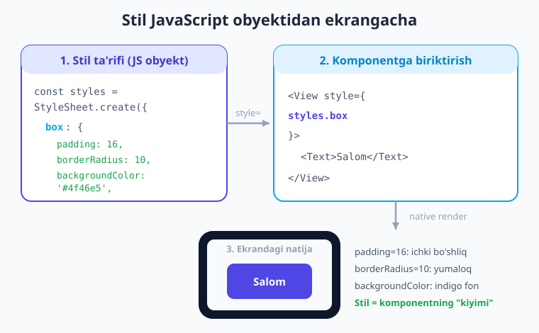
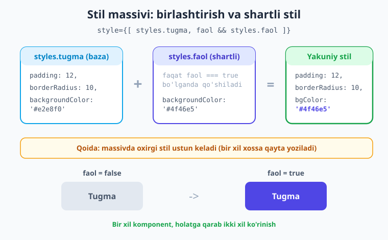
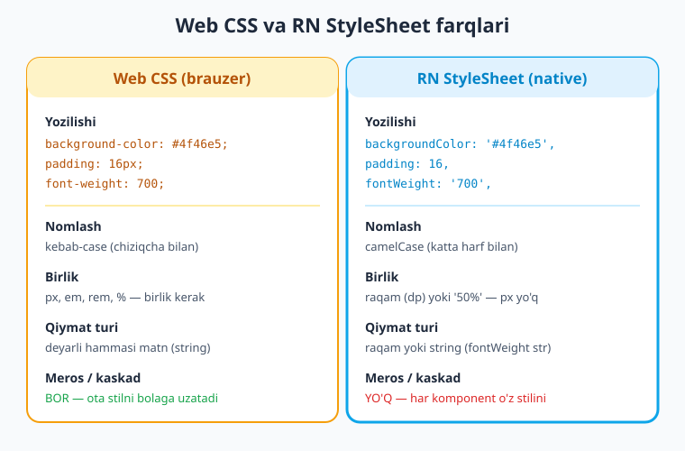

# 04 — Stillar: StyleSheet

[⬅️ Oldingi: 03 — JSX va Core komponentlar](./03-jsx-core-komponentlar.md) · [🏠 Kitob boshi](./README.md) · [Keyingi: 05 — Flexbox va layout ➡️](./05-flexbox-layout.md)

> **Bu bobda:** komponentlarni chiroyli qilishni — ya'ni ularga rang, bo'shliq, yumaloq burchak va soya berishni o'rganamiz. React Native'da CSS fayl yo'q; stil — bu oddiy JavaScript obyekti. `StyleSheet.create`, inline stil, stil massivi, shartli stil, CSS'dan asosiy farqlar, soya (iOS va Android), rang formatlari va o'z tema faylingizni yaratishni ko'rib chiqamiz.

---

## Komponent — odam, stil — kiyim

Oldingi bobda biz `<View>` va `<Text>` kabi **komponentlar** (ya'ni ekranning qayta ishlatiladigan bo'laklari) bilan tanishdik. Lekin agar siz ularni shunchaki ekranga qo'ysangiz — rangsiz, bo'shliqsiz, bir-biriga yopishib turadi. Chiroyli emas.

> **Hayotiy o'xshatish.** Komponentni **odam** deb tasavvur qiling. `<Text>Salom</Text>` — bu odamning o'zi, uning skeleti. Lekin odam ko'chaga kiyimsiz chiqmaydi-ku! **Stil** — bu komponentning **kiyimi**: rangi (ko'ylakning rangi), o'lchami (bo'yi), bo'shliqlari (qancha joy egallashi), yumaloqligi (burchaklari). Bir xil odam (komponent) turli kiyim (stil) bilan butunlay boshqacha ko'rinadi. Shu bobda komponentlarimizni "kiyintiramiz".

Veb-saytda dizaynni alohida `.css` faylda yozamiz. React Native'da bunday fayl **YO'Q**. Buning o'rniga stil — bu **JavaScript obyekti**: kalit (xossa nomi) va qiymatlardan iborat oddiy `{ }` obyekt. Bu g'alati tuyulishi mumkin, lekin ajoyib tomoni bor — stil ham, mantiq ham, tuzilish ham bitta tilda (JavaScript/TypeScript) yoziladi.

!!! note "Eslatma"
    React Native brauzer emas — u haqiqiy native ilova yaratadi. Shuning uchun `<div class="card">` va alohida `.card { ... }` CSS qoidasi bu yerda ishlamaydi. Stilni to'g'ridan-to'g'ri komponentning `style` xossasiga JS obyekt ko'rinishida beramiz.

---

## Eng oddiy yo'l: inline stil

Komponentga stil berishning eng tez usuli — uni to'g'ridan-to'g'ri `style` xossasiga yozish. Bunga **inline stil** (joyida yozilgan stil) deyiladi:

```tsx
// app/index.tsx
import { View, Text } from 'react-native';

export default function Index() {
  return (
    <View style={{ padding: 20, backgroundColor: '#e0f2fe' }}>
      <Text style={{ fontSize: 18, color: '#0284c7' }}>Salom, stil!</Text>
    </View>
  );
}
```

Bu yerda diqqat qiling: `style` xossasiga **ikki marta jingalak qavs** beramiz — `style={{ ... }}`. Nega ikkita?

- **Tashqi `{ }`** — JSX'ga "bu yerda JavaScript boshlanadi" deb aytadi (03-bobda ko'rgan edik).
- **Ichki `{ }`** — bu JavaScript **obyekti** — ya'ni stilning o'zi.

Demak `style={{ padding: 20 }}` aslida `style={ obyekt }` bo'lib, obyekt — `{ padding: 20 }`.

!!! warning "Ehtiyot bo'ling"
    Inline stil oson, lekin **katta loyihada tartibsizlikka olib keladi**: komponent kodi stillar bilan to'lib ketadi, bir stilni bir necha joyda qayta yozasiz va har render'da yangi obyekt yaratiladi. Kichik, bir martalik stillar uchun mayli; jiddiy ilova uchun esa pastdagi `StyleSheet.create` afzal.

---

## Asosiy yo'l: `StyleSheet.create`

React Native bizga stillarni alohida, tartibli joyda saqlash uchun maxsus vosita beradi — `StyleSheet.create`. Avval uni `react-native`'dan import qilamiz, keyin stillar to'plamini yaratamiz:

```tsx
// app/index.tsx
import { View, Text, StyleSheet } from 'react-native';

export default function Index() {
  return (
    <View style={styles.box}>
      <Text style={styles.matn}>Salom, StyleSheet!</Text>
    </View>
  );
}

const styles = StyleSheet.create({
  box: {
    padding: 20,
    backgroundColor: '#4f46e5',
    borderRadius: 12,
  },
  matn: {
    color: '#ffffff',
    fontSize: 18,
    fontWeight: '700',
  },
});
```

Bu yerda nima bo'ldi? `StyleSheet.create({ ... })` ichiga **nomli stillar** to'plamini berdik: `box` va `matn`. Har biri — bitta JS obyekt. Keyin komponentda `style={styles.box}` deb shu nomli stilni biriktirdik. Aniq, o'qiladi, qayta ishlatiladi.

> **Hayotiy o'xshatish.** `StyleSheet.create` — bu **kiyim shkafi**. Inline stilda har safar kiyimni qo'lda tikasiz (`{ padding: 20, ... }`). Shkafda esa kiyimlar tayyor, nomlangan ("ko'k ko'ylak" = `styles.box`). Kerak bo'lganda shkafdan tortib olasiz: `style={styles.box}`. Tartibli va tezroq.

Quyidagi diagrammada stil ta'rifidan ekrandagi natijagacha bo'lgan yo'l ko'rsatilgan:



### Nega `StyleSheet.create`, oddiy obyekt emas?

Savol tug'ilishi mumkin: "Nega `const styles = { box: { ... } }` deb oddiy obyekt yozmaymiz? Nega `StyleSheet.create` kerak?" Sabablari bor:

- **Validatsiya (tekshirish).** `StyleSheet.create` xossa nomlarini va qiymatlarini tekshiradi. Agar `bckgroundColor` (xato yozilgan) yozsangiz, TypeScript darrov ogohlantiradi. Oddiy obyektda bunday himoya kuchsizroq.
- **Tartib va o'qilishi.** Stillar bir joyda, nomlangan holda turadi — komponent JSX'i toza qoladi.
- **Optimizatsiya.** Tarixan `StyleSheet.create` stillarni bir marta ro'yxatdan o'tkazib, ID bilan ishlatardi. Bugungi New Architecture'da bu unchalik muhim emas, lekin odat va validatsiya foydasi saqlanib qoladi.

!!! tip "Maslahat"
    Stillarni komponentdan **pastda** (faylning oxirida) e'lon qiling. Shunda komponent funksiyasini o'qiyotganda avval tuzilishni ko'rasiz, stil tafsilotlari pastda qoladi. Bu RN jamiyatida keng tarqalgan odat.

---

## Stil massivi: bir nechta stilni birlashtirish

Ko'pincha bir komponentga bir nechta stilni birlashtirib berish kerak bo'ladi. Buning uchun `style`'ga **massiv** beramiz — kvadrat qavs `[ ]` ichida:

```tsx
<View style={[styles.box, styles.soyali]}>
  <Text style={styles.matn}>Bir nechta stil</Text>
</View>
```

React Native massivdagi stillarni **chapdan o'ngga** birlashtiradi. Agar ikki stilda bir xil xossa bo'lsa — **oxirgisi g'olib** keladi (CSS'da keyingi qoida ustun bo'lgani kabi). Masalan:

```tsx
const styles = StyleSheet.create({
  box: { padding: 16, backgroundColor: '#e2e8f0' },
  ogohlantirish: { backgroundColor: '#dc2626' },
});

// natija: padding 16 + backgroundColor '#dc2626' (oxirgisi ustun)
<View style={[styles.box, styles.ogohlantirish]} />
```

### Shartli stil

Massivning eng kuchli tomoni — **shartli stil**: stilni faqat ma'lum bir holatda qo'shish. Buning uchun `shart && styles.x` yozamiz:

```tsx
// app/index.tsx
import { View, Text, StyleSheet, Pressable } from 'react-native';
import { useState } from 'react';

export default function Index() {
  const [faol, setFaol] = useState(false);

  return (
    <Pressable
      style={[styles.tugma, faol && styles.faol]}
      onPress={() => setFaol(!faol)}
    >
      <Text style={[styles.matn, faol && styles.matnFaol]}>
        {faol ? 'Faol' : 'Nofaol'}
      </Text>
    </Pressable>
  );
}

const styles = StyleSheet.create({
  tugma: {
    paddingVertical: 12,
    paddingHorizontal: 24,
    borderRadius: 10,
    backgroundColor: '#e2e8f0',
  },
  faol: {
    backgroundColor: '#4f46e5',
  },
  matn: { fontWeight: '600', color: '#1e293b' },
  matnFaol: { color: '#ffffff' },
});
```

Bu yerda `faol && styles.faol` quyidagicha ishlaydi: agar `faol` — `true` bo'lsa, `styles.faol` qo'shiladi; agar `false` bo'lsa — `false` qaytadi va RN uni e'tiborga olmaydi. Natijada tugma bosilganda rangini o'zgartiradi.

> **Hayotiy o'xshatish.** Shartli stil — bu **chiroq tugmasi**. Tugma "yoqilgan" holatda (`faol = true`) yorqin indigo bo'ladi, "o'chiq" holatda (`faol = false`) kulrang. Bir xil tugma — ikki xil ko'rinish, holatga qarab.

Quyidagi diagramma stil massivi qanday birlashishini va shartli stil natijasini ko'rsatadi:



!!! note "Eslatma"
    Massivda `null`, `false` va `undefined` qiymatlar **e'tiborsiz qoldiriladi** — ular xato bermaydi. Shuning uchun `faol && styles.faol` xavfsiz: `faol` yolg'on bo'lsa, `false` massivga tushadi va shunchaki o'tkazib yuboriladi.

---

## CSS'dan asosiy farqlar

Agar siz oldin veb-sayt uchun CSS yozgan bo'lsangiz, RN stillari tanish ko'rinadi — lekin bir nechta **muhim farq** bor. Bularni bilmaslik boshlovchilarning eng ko'p uchraydigan xatosi.

| Mavzu | Web CSS | React Native StyleSheet |
|---|---|---|
| **Nomlash** | `background-color` (kebab-case) | `backgroundColor` (camelCase) |
| **Bo'shliq xossalari** | `padding-horizontal` | `paddingHorizontal` |
| **Birlik** | `16px`, `2em`, `1rem` | `16` (oddiy raqam = dp), `'50%'` |
| **`fontWeight` qiymati** | `font-weight: 700;` (raqam) | `fontWeight: '700'` (**string!**) |
| **Qiymat turi** | deyarli hammasi matn | raqam yoki string |
| **Meros / kaskad** | bor (ota → bola) | **YO'Q** (Text ichidagi Text'dan tashqari) |
| **Selektorlar** | `.card`, `#id`, `:hover` | yo'q — to'g'ridan-to'g'ri `style` |

Quyidagi diagrammada bu farqlar yonma-yon ko'rsatilgan:



Endi har bir farqni alohida ko'rib chiqamiz.

### 1. camelCase nomlash

CSS'da xossalar chiziqcha bilan yoziladi (`background-color`, `border-radius`). JavaScript obyektida chiziqcha ishlatib bo'lmaydi (`background-color` — bu ayirish amali!). Shuning uchun RN **camelCase** ishlatadi: chiziqcha o'rniga keyingi so'z **katta harf** bilan boshlanadi:

```text
background-color   ->  backgroundColor
border-radius      ->  borderRadius
padding-horizontal ->  paddingHorizontal
font-size          ->  fontSize
text-align         ->  textAlign
```

### 2. Birlik yo'q — oddiy raqam (dp)

CSS'da `padding: 16px` deb yozasiz. RN'da esa shunchaki `padding: 16` — **`px` yozilmaydi**. Bu raqam **dp** (density-independent pixel, ya'ni piksel zichligidan mustaqil birlik) ma'nosini bildiradi. RN avtomatik ravishda har bir qurilmaning ekran zichligiga moslab masshtablaydi, shuning uchun stilingiz arzon ham, qimmat ham telefonda bir xil ko'rinadi.

Foiz ham mavjud, lekin u **string** bo'lishi kerak: `width: '50%'`.

```tsx
const styles = StyleSheet.create({
  yarim: { width: '50%' },     // foiz — string
  belgilangan: { width: 200 }, // dp — raqam
});
```

### 3. `fontWeight` — string

Bu eng ko'p yanglishtiradigan joy. CSS'da `font-weight: 700` raqam. RN'da esa `fontWeight: '700'` — **qo'shtirnoq ichida string** bo'lishi kerak. Yoki `'bold'`, `'normal'` kabi nomlardan foydalaning.

```tsx
const styles = StyleSheet.create({
  qalin: { fontWeight: '700' },   // to'g'ri
  qalin2: { fontWeight: 'bold' }, // bu ham to'g'ri
  // fontWeight: 700  <- ba'zi versiyalarda TS shikoyat qiladi; '700' ishonchli
});
```

!!! warning "Ehtiyot bo'ling"
    `fontWeight: 700` (raqam) o'rniga `fontWeight: '700'` (string) yozing. Boshlovchilar tez-tez raqam yozib, TypeScript xatosiga duch kelishadi.

### 4. Meros (kaskad) YO'Q

Bu eng muhim falsafiy farq. CSS'da agar `<div>`'ga rang bersangiz, ichidagi barcha matn shu rangni **meros** qilib oladi. RN'da bunday emas: **har komponent faqat o'ziga berilgan stilni oladi.**

```tsx
// CSS'da bo'lganida: ichki "Salom" matni ham qizil bo'lardi.
// RN'da: View'ga rang berish Text'ga TA'SIR QILMAYDI!
<View style={{ color: 'red' }}>
  <Text>Bu matn QIZIL EMAS — View'ning color'i Text'ga o'tmaydi</Text>
</View>

// To'g'ri yo'l: rangni to'g'ridan-to'g'ri Text'ga bering
<View>
  <Text style={{ color: 'red' }}>Bu matn qizil</Text>
</View>
```

**Yagona istisno:** `<Text>` ichidagi `<Text>`. Matn stillari (rang, shrift, o'lcham) ichki matnga meros bo'ladi:

```tsx
<Text style={{ color: '#1e293b', fontSize: 16 }}>
  Oddiy matn, ichida{' '}
  <Text style={{ fontWeight: '700' }}>qalin so'z</Text>
  {' '}bor. Qalin so'z ham rang va o'lchamni meros oldi.
</Text>
```

!!! tip "Maslahat"
    "Meros yo'q" qoidasini afzallik deb biling: stil oqimi tasodifan boshqa komponentlarni buzmaydi. Har komponentning ko'rinishi faqat o'z stiliga bog'liq — bu xatolarni topishni osonlashtiradi.

---

## Keng ishlatiladigan stil xossalari

Quyida har kuni ishlatadigan xossalar. Hammasi camelCase, qiymatlar raqam (yoki kerakli joyda string).

**Rang:**

```tsx
{
  color: '#1e293b',           // matn rangi (faqat Text uchun)
  backgroundColor: '#f8fafc', // fon rangi
}
```

**O'lcham:**

```tsx
{
  width: 200,      // kenglik (dp)
  height: 100,     // balandlik (dp)
  width: '100%',   // yoki foiz (string)
  minHeight: 48,   // minimal balandlik
  maxWidth: 320,
}
```

**Bo'shliq (eng ko'p ishlatiladi):**

```tsx
{
  padding: 16,            // ichki bo'shliq (har tomondan)
  paddingHorizontal: 20,  // chap + o'ng
  paddingVertical: 12,    // yuqori + past
  paddingTop: 8,          // faqat yuqori
  margin: 12,             // tashqi bo'shliq
  marginBottom: 16,       // faqat past tashqi
  gap: 10,                // bola elementlar orasidagi masofa
}
```

> **Hayotiy o'xshatish.** `padding` va `margin`ni rasm va ramka bilan tasavvur qiling. `padding` — rasm bilan ramka **ichki** chekkasi orasidagi bo'shliq (komponent ichidagi havo). `margin` — ramkaning **tashqi** atrofidagi bo'shliq (qo'shni komponentlardan uzoqlik). `gap` esa — bir nechta rasm bir devorga osilganda, ular orasidagi teng masofa.

**Chegara (ramka):**

```tsx
{
  borderWidth: 2,          // chegara qalinligi
  borderColor: '#bae6fd',  // chegara rangi
  borderRadius: 12,        // burchaklar yumaloqligi
  borderBottomWidth: 1,    // faqat pastki chegara
}
```

**Matn (faqat `<Text>`):**

```tsx
{
  fontSize: 16,
  fontWeight: '700',       // string!
  textAlign: 'center',     // 'left' | 'center' | 'right'
  lineHeight: 22,          // qatorlar balandligi
  letterSpacing: 0.5,      // harflar orasi
}
```

**Shaffoflik:**

```tsx
{
  opacity: 0.5,  // 0 (ko'rinmas) dan 1 (to'liq) gacha
}
```

!!! example "Misol"
    Quyidagi karta yuqoridagi xossalarni birlashtiradi:

    ```tsx
    const styles = StyleSheet.create({
      karta: {
        backgroundColor: '#ffffff',
        padding: 16,
        borderRadius: 12,
        borderWidth: 1,
        borderColor: '#e2e8f0',
        gap: 8,
      },
      sarlavha: { fontSize: 18, fontWeight: '700', color: '#1e293b' },
      tavsif: { fontSize: 14, color: '#475569', lineHeight: 20 },
    });
    ```

---

## Soya: iOS va Android farqi

Kartochka yoki tugmaga **soya** berish ilovaga chuqurlik va zamonaviy ko'rinish bag'ishlaydi. Lekin bu yerda platforma farqi bor: iOS va Android soyani turlicha ishlatadi.

- **iOS** — `shadowColor`, `shadowOffset`, `shadowOpacity`, `shadowRadius` xossalari bilan.
- **Android** — bitta `elevation` (ko'tarilish) raqami bilan.

Ikkalasini bir vaqtda to'g'ri qilish uchun `Platform.select` ishlatamiz — u joriy platformaga mos stilni tanlaydi:

```tsx
// app/index.tsx
import { View, Text, StyleSheet, Platform } from 'react-native';

export default function Index() {
  return (
    <View style={styles.karta}>
      <Text style={styles.matn}>Soyali kartochka</Text>
    </View>
  );
}

const styles = StyleSheet.create({
  karta: {
    backgroundColor: '#ffffff',
    borderRadius: 16,
    padding: 20,
    ...Platform.select({
      ios: {
        shadowColor: '#000000',
        shadowOffset: { width: 0, height: 4 },
        shadowOpacity: 0.12,
        shadowRadius: 12,
      },
      android: {
        elevation: 5,
      },
    }),
  },
  matn: { fontSize: 16, color: '#1e293b' },
});
```

Bu yerda `...Platform.select({ ... })` quyidagicha ishlaydi: `Platform.select` joriy qurilmaga mos obyektni (iOS'da `ios:`, Android'da `android:`) qaytaradi, `...` (spread operatori) esa uni `karta` stiliga "yoyadi". Natijada har platforma o'ziga to'g'ri soyani oladi.

!!! note "iOS va Android farqi"
    iOS soyaning rangi, yo'nalishi va xiraligini nozik boshqarishga imkon beradi. Android esa Material Design'ning `elevation` tizimiga tayanadi — bitta raqam (qancha katta bo'lsa, soya shunchalik kuchli). Shuning uchun bitta xossa ikkalasini qoplay olmaydi.

### Yangiroq yo'l: `boxShadow`

Yangi React Native versiyalarida (siz ishlatayotgan RN 0.85 ham) CSS'ga o'xshash **`boxShadow`** xossasi paydo bo'ldi. U bitta string bilan ikkala platformada ishlaydi:

```tsx
const styles = StyleSheet.create({
  karta: {
    backgroundColor: '#ffffff',
    borderRadius: 16,
    padding: 20,
    boxShadow: '0px 4px 12px rgba(0, 0, 0, 0.12)',
  },
});
```

`boxShadow` qulay, lekin u nisbatan yangi. Eski qurilmalarda yoki to'liq nazorat kerak bo'lsa, `Platform.select` bilan `shadow*`/`elevation` hali ham ishonchli yo'l.

---

## Rang formatlari

RN'da ranglarni bir necha usulda yozish mumkin — CSS'dagi kabi:

```tsx
const styles = StyleSheet.create({
  hex:       { backgroundColor: '#4f46e5' },              // hex (eng ko'p)
  hexQisqa:  { backgroundColor: '#fff' },                 // qisqa hex
  rgba:      { backgroundColor: 'rgba(15, 23, 42, 0.5)' },// rang + shaffoflik
  nom:       { backgroundColor: 'red' },                  // CSS rang nomi
  shaffof:   { backgroundColor: 'transparent' },          // butunlay shaffof
});
```

- **Hex** (`#4f46e5`) — eng keng tarqalgan. Dizaynda aniq ranglar uchun.
- **rgba** (`rgba(0, 0, 0, 0.5)`) — oxirgi raqam (`0.5`) **shaffoflik** (alpha): `0` ko'rinmas, `1` to'liq. Soya va qoplama (overlay) uchun juda foydali.
- **Nom** (`'red'`, `'white'`, `'tomato'`) — tez prototip uchun qulay, lekin loyihada hex afzal (aniqroq).

!!! tip "Maslahat"
    `rgba` ni yarim shaffof qoplamalar uchun ishlating — masalan modal oynaning orqa fonidagi qora xira parda: `backgroundColor: 'rgba(0, 0, 0, 0.5)'`.

---

## Ranglarni temaga ajrating (konstanta fayli)

Ilovangiz o'sganda, bir xil indigo rangni (`#4f46e5`) o'nlab faylda takrorlaysiz. Bir kun kelib rangni o'zgartirish kerak bo'lsa-chi? Hamma joyni qidirib chiqishingiz kerak. Yechim — **ranglar va o'lchamlarni bitta tema fayliga chiqarish.**

> **Hayotiy o'xshatish.** Tema fayli — bu **bo'yoq palitrasi**. Rassom har gal yangi rang aralashtirmaydi — palitrada tayyor ranglar turadi, u shulardan oladi. Siz ham `ranglar.asosiy` deb yozasiz, har joyda `#4f46e5` ni qo'lda terib o'tirmaysiz. Palitradagi rangni o'zgartirsangiz — butun ilova yangilanadi.

`src/constants/theme.ts` faylini yarating:

```ts
// src/constants/theme.ts
export const ranglar = {
  asosiy: '#4f46e5',
  asosiyOch: '#6366f1',
  matn: '#1e293b',
  matnOch: '#475569',
  fon: '#f8fafc',
  oq: '#ffffff',
  yashil: '#16a34a',
  qizil: '#dc2626',
} as const;

export const bolshliq = {
  xs: 4,
  s: 8,
  m: 16,
  l: 24,
  xl: 32,
} as const;

export const radius = {
  s: 8,
  m: 12,
  l: 16,
} as const;
```

`as const` qo'shilishi TypeScript'ga bu qiymatlar o'zgarmasligini aytadi — bu aniqroq tiplash beradi. Endi istalgan komponentda import qilib ishlatasiz:

```tsx
// app/index.tsx
import { View, Text, StyleSheet } from 'react-native';
import { ranglar, bolshliq, radius } from '@/constants/theme';

export default function Index() {
  return (
    <View style={styles.karta}>
      <Text style={styles.sarlavha}>Tema bilan</Text>
    </View>
  );
}

const styles = StyleSheet.create({
  karta: {
    backgroundColor: ranglar.oq,
    padding: bolshliq.m,
    borderRadius: radius.m,
  },
  sarlavha: {
    fontSize: 18,
    fontWeight: '700',
    color: ranglar.matn,
  },
});
```

> `@/constants/theme` — bu `src/constants/theme.ts` ga **alias** (qisqartma yo'l). Expo SDK 56 shabloni `tsconfig.json` da `@/*` -> `./src/*` ni sozlab beradi, shuning uchun chuqur `../../` yozish shart emas.

!!! tip "Maslahat"
    Tema faylida nafaqat ranglar, balki bo'shliq (`bolshliq.m`), radius va shrift o'lchamlarini ham saqlang. Bu dizayningizni **izchil** (consistent) qiladi — barcha kartalar bir xil burchak, barcha bo'limlar bir xil bo'shliqqa ega bo'ladi.

---

## To'liq misol: chiroyli kartochka

Endi o'rganganlarimizni birlashtirib, real ko'rinishdagi kartochka yasaymiz: rasm joyi, sarlavha, tavsif, narx va belgi. Bu kod jonli Expo SDK 56 loyihada `tsc` bilan tekshirilgan:

```tsx
// app/index.tsx
import { View, Text, StyleSheet, Platform } from 'react-native';
import { ranglar, bolshliq, radius } from '@/constants/theme';

export default function Index() {
  return (
    <View style={styles.ekran}>
      <View style={styles.karta}>
        <View style={styles.rasmJoyi}>
          <Text style={styles.emoji}>🏔️</Text>
        </View>

        <View style={styles.tana}>
          <Text style={styles.sarlavha}>Chimyon tog'lari</Text>
          <Text style={styles.tavsif}>
            Toshkentdan 90 km. Qishda chang'i, yozda salqin
            havo va ajoyib tog' manzarasi.
          </Text>

          <View style={styles.pastQator}>
            <Text style={styles.narx}>250 000 so'm</Text>
            <View style={styles.belgi}>
              <Text style={styles.belgiMatn}>Mashhur</Text>
            </View>
          </View>
        </View>
      </View>
    </View>
  );
}

const styles = StyleSheet.create({
  ekran: {
    flex: 1,
    backgroundColor: ranglar.fon,
    padding: bolshliq.m,
    justifyContent: 'center',
  },
  karta: {
    backgroundColor: ranglar.oq,
    borderRadius: radius.l,
    overflow: 'hidden', // yumaloq burchakdan tashqariga chiqqan rasmni kesadi
    ...Platform.select({
      ios: {
        shadowColor: '#000000',
        shadowOffset: { width: 0, height: 4 },
        shadowOpacity: 0.1,
        shadowRadius: 12,
      },
      android: { elevation: 4 },
    }),
  },
  rasmJoyi: {
    height: 140,
    backgroundColor: '#e0f2fe',
    alignItems: 'center',
    justifyContent: 'center',
  },
  emoji: { fontSize: 56 },
  tana: { padding: bolshliq.m, gap: bolshliq.s },
  sarlavha: {
    fontSize: 20,
    fontWeight: '700',
    color: ranglar.matn,
  },
  tavsif: {
    fontSize: 14,
    color: ranglar.matnOch,
    lineHeight: 20,
  },
  pastQator: {
    flexDirection: 'row',
    justifyContent: 'space-between',
    alignItems: 'center',
    marginTop: bolshliq.s,
  },
  narx: {
    fontSize: 16,
    fontWeight: '700',
    color: ranglar.asosiy,
  },
  belgi: {
    backgroundColor: '#dcfce7',
    paddingHorizontal: 10,
    paddingVertical: 4,
    borderRadius: radius.s,
  },
  belgiMatn: {
    fontSize: 12,
    fontWeight: '600',
    color: ranglar.yashil,
  },
});
```

Bu kodda biz hamma narsani ishlatdik: tema konstantalari (`ranglar`, `bolshliq`, `radius`), platforma soyasi, `borderRadius`, `padding`/`gap`, matn stillari va `flexDirection: 'row'` (bu haqda keyingi bobda batafsil). Natijada professional ko'rinishdagi kartochka chiqadi.

!!! note "Eslatma"
    `pastQator`da `flexDirection: 'row'` va `justifyContent: 'space-between'` ko'rdingiz — bular **Flexbox** xossalari. Joylashuv (bir elementni boshqasining yoniga, markazga, chetga qo'yish) keyingi — **05-bob, Flexbox va layout** — ning butun mavzusi. Hozircha shu kartochka stillarini his qiling, joylashuvni keyingi bobda chuqur o'rganamiz.

---

## NativeWind — ixtiyoriy alternativa (qisqa eslatma)

Agar siz veb-dunyodan kelib **Tailwind CSS** bilan ishlagan bo'lsangiz, RN'da ham shunga o'xshash usul bor — **NativeWind**. U Tailwind sintaksisini RN'ga olib keladi: stilni `className` orqali qisqa qoidalar bilan yozasiz:

```tsx
// NativeWind bilan (ixtiyoriy)
<View className="p-4 bg-blue-500 rounded-xl">
  <Text className="text-white font-bold">Salom</Text>
</View>
```

Bu `p-4` = `padding: 16`, `bg-blue-500` = ko'k fon, `rounded-xl` = katta yumaloqlik demakdir. NativeWind qulay va tez, lekin u **qo'shimcha kutubxona** va sozlash talab qiladi.

!!! note "Eslatma"
    Bu kitob **`StyleSheet`** asosida — chunki u RN'ning o'rnatilgan, qo'shimchasiz standart usuli va sodda stilni chuqur tushunish uchun eng yaxshi yo'l. NativeWind — keyinroq, xohlasangiz qo'shadigan ixtiyoriy alternativa. Asoslarni `StyleSheet` bilan mustahkamlang.

---

## Xulosa

- React Native'da **CSS fayl yo'q** — stil bu oddiy **JavaScript obyekti**. Komponent — odam, stil — uning kiyimi.
- **Inline stil** (`style={{ ... }}`) tez, lekin **`StyleSheet.create`** afzal: tartibli, validatsiya beradi va komponent kodini toza saqlaydi.
- **Stil massivi** `style={[a, b]}` bir nechta stilni birlashtiradi; bir xil xossada **oxirgisi g'olib**. Shartli stil: `[base, shart && styles.x]`.
- CSS'dan farqlar: **camelCase** (`backgroundColor`), birliksiz **raqam (dp)** yoki `'50%'`, `fontWeight` — **string** (`'700'`), va **meros (kaskad) YO'Q** (faqat `Text` ichidagi `Text`'da matn stillari meros bo'ladi).
- Eng ko'p ishlatiladigan xossalar: rang (`color`, `backgroundColor`), o'lcham, bo'shliq (`padding*`, `margin*`, `gap`), chegara (`borderWidth/Color/Radius`), matn (`fontSize`, `fontWeight`, `lineHeight`) va `opacity`.
- **Soya** platformaga bog'liq: iOS — `shadow*`, Android — `elevation`; `Platform.select` bilan birlashtiriladi. Yangi RN'da bitta `boxShadow` ham bor.
- Ranglar: **hex** (`#4f46e5`), **rgba** (shaffoflik bilan), **nom** (`'red'`). `rgba` yarim shaffof qoplamalar uchun.
- Ranglar, bo'shliq va radiusni **tema fayliga** (`constants/theme.ts`) chiqarib, `@/` alias bilan import qiling — izchil va o'zgartirishga oson dizayn.

## Amaliy mashqlar

1. **Profil kartochkasi.** `StyleSheet.create` bilan profil kartasi yasang: oq fon, `borderRadius`, ichida ism (`fontSize: 18, fontWeight: '700'`) va lavozim (`color: '#475569'`). Kartaga `padding` va Android+iOS uchun mos soya bering (`Platform.select` yoki `boxShadow`).

2. **Shartli "Yoqdi" tugmasi.** `Pressable` va `useState` bilan tugma yarating. Bosilganda `style={[styles.tugma, yoqdi && styles.tugmaFaol]}` orqali fon rangi kulrangdan qizilga, matni ❤️ ga o'zgarsin. Massiv va shartli stilni ishlating.

3. **CSS'dan o'tkazish.** Quyidagi CSS qoidasini RN `StyleSheet` ga o'giring (camelCase, birliksiz, `fontWeight` string'ga e'tibor bering): `background-color: #0ea5e9; padding: 12px 20px; border-radius: 8px; font-size: 16px; font-weight: 600;`.

4. **Tema fayli.** `constants/theme.ts` yarating: kamida 5 rang, 4 bo'shliq o'lchami va 3 radius o'lchami. Keyin 1-mashqdagi kartochkani qayta yozing — barcha qiymatlar temadan kelsin (`#hex` qo'lda yozilmasin). Rangni o'zgartirib, kartaning yangilanishini ko'ring.

5. **Meros tekshiruvi.** `<View style={{ color: 'red' }}>` ichiga `<Text>Salom</Text>` qo'ying va matn qizil chiqmasligini o'zingiz tasdiqlang. Keyin rangni to'g'ri joyga (`Text`'ga) ko'chiring. Nima uchun View'ning `color`'i ishlamasligini bir jumlada izohlang.

---

[⬅️ Oldingi: 03 — JSX va Core komponentlar](./03-jsx-core-komponentlar.md) · [🏠 Kitob boshi](./README.md) · [Keyingi: 05 — Flexbox va layout ➡️](./05-flexbox-layout.md)
