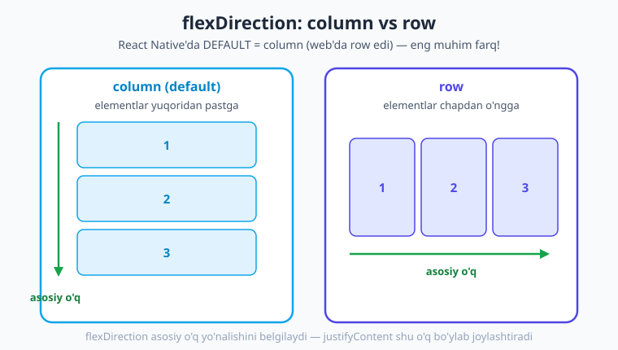
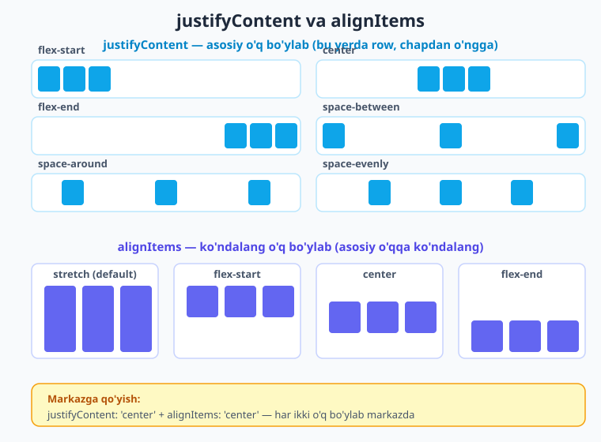
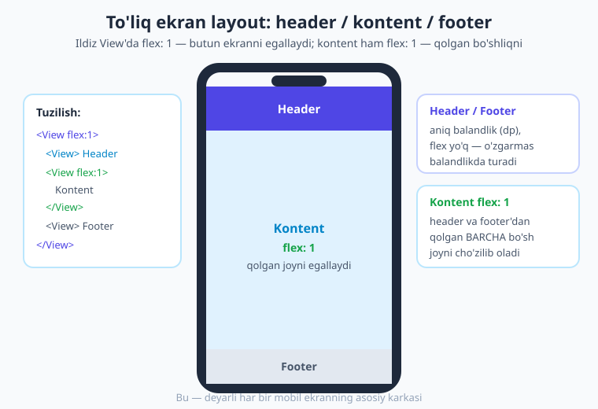

# 05 — Flexbox va layout

[⬅️ Oldingi: 04 — Stillar: StyleSheet](./04-stillar-stylesheet.md) · [🏠 Kitob boshi](./README.md) · [Keyingi: 06 — Input va tugmalar ➡️](./06-input-tugma.md)

> **Bu bobda:** elementlarni ekranda joylashtirishni — yonma-yon, ustma-ust, markazda — o'rganamiz. React Native'da buning yagona usuli **Flexbox**. Eng muhim farqni (RN'da `flexDirection` defaulti `column`!) aniqlab olamiz, `justifyContent`/`alignItems`/`flex`/`gap` ni misollar bilan o'zlashtiramiz va header–kontent–footer kabi haqiqiy ekran karkasini quramiz.

---

## Layout muammosi

Oldingi bobda biz elementlarga **rang, o'lcham va bo'shliq** berishni o'rgandik. Lekin bitta savol javobsiz qoldi: agar ekranda ikkita tugma bo'lsa, ular **yonma-yonmi yoki ustma-ust**? Sarlavhani **markazga** qanday qo'yamiz? Footer'ni ekranning **eng pastiga** qanday "yopishtiramiz"?

Mana shu — elementlarni fazoda joylashtirish — **layout** (joylashuv) deyiladi. Bu mobil dasturlashning eng asosiy mahoratlaridan biri.

> **Hayotiy o'xshatish.** Tasavvur qiling, sizda **javon** bor va unga kitoblarni terishingiz kerak. Kitoblarni **gorizontal** (yonma-yon, oddiy javon polkasidagidek) yoki **vertikal** (ustma-ust, taxlab) qo'yishingiz mumkin. Polka bo'ylab kitoblarni **chap chetga**, **markazga** yoki teng **oraliq** bilan tarqatib qo'yishingiz mumkin. Flexbox aynan shu — siz "polka"ning yo'nalishini va undagi narsalarning taqsimotini aytasiz, qolganini Flexbox o'zi hisoblaydi.

!!! note "Eslatma"
    Web'da (HTML/CSS) layout uchun ko'p usul bor: `float`, `position`, `table`, `grid`, `flexbox`... React Native'da esa **deyarli faqat Flexbox** ishlatiladi. Bu — yaxshi yangilik: bitta tizimni puxta o'rgansangiz, butun ilovani joylashtira olasiz. Web'dagi Flexbox'ni bilsangiz — bu yerda 95% bilim ishlaydi, faqat bir nechta farq bor (ularning eng kattasini hozir ko'ramiz).

Flexbox har doim ikki darajada ishlaydi:

- **Konteyner (ota element)** — `<View>` — bolalarini *qanday joylashtirishni* aytadi (`flexDirection`, `justifyContent`, `alignItems`).
- **Bola elementlar** — konteyner ichidagi `<View>`/`<Text>` lar — qancha joy egallashini aytishi mumkin (`flex`).

---

## ENG MUHIM FARQ: `flexDirection` defaulti `column`

Bu bobning eng muhim jumlasini qalin shrift bilan yozamiz, chunki **deyarli har bir boshlovchi shu yerda adashadi**:

> **React Native'da `flexDirection` ning standart (default) qiymati — `column` (vertikal, yuqoridan pastga).** Web (CSS)'da esa default `row` (gorizontal) edi.

Demak, agar siz bir `<View>` ichiga uchta element qo'ysangiz va **hech qanday `flexDirection` yozmasangiz**, ular **ustma-ust** (yuqoridan pastga) chiqadi — yonma-yon emas.



Quyidagi misolda biz hech qanday `flexDirection` yozmadik — natija **vertikal** (chunki default `column`):

```tsx
// Hech qanday flexDirection yo'q -> default 'column' -> ustma-ust
<View>
  <View style={{ width: 60, height: 60, backgroundColor: '#0ea5e9' }} />
  <View style={{ width: 60, height: 60, backgroundColor: '#4f46e5' }} />
  <View style={{ width: 60, height: 60, backgroundColor: '#16a34a' }} />
</View>
```

Endi xuddi shu kodga `flexDirection: 'row'` qo'shsak — elementlar **yonma-yon** (gorizontal) chiqadi:

```tsx
// flexDirection: 'row' -> yonma-yon
<View style={{ flexDirection: 'row' }}>
  <View style={{ width: 60, height: 60, backgroundColor: '#0ea5e9' }} />
  <View style={{ width: 60, height: 60, backgroundColor: '#4f46e5' }} />
  <View style={{ width: 60, height: 60, backgroundColor: '#16a34a' }} />
</View>
```

!!! warning "Ehtiyot bo'ling"
    Web'dan kelgan bo'lsangiz, miyangiz "default = yonma-yon" deb o'ylaydi. RN'da bu **teskari**. Agar elementlaringiz nega yonma-yon emas, ustma-ust chiqayotganidan hayron bo'lsangiz — sababi shu. Yonma-yon kerak bo'lsa, **`flexDirection: 'row'` ni o'zingiz yozishingiz shart**.

---

## `flexDirection` ning to'rt qiymati

`flexDirection` to'rtta qiymat qabul qiladi:

| Qiymat | Yo'nalish | Tushuntirish |
|---|---|---|
| `'column'` | yuqoridan pastga ⬇️ | **default** — vertikal taxlam |
| `'row'` | chapdan o'ngga ➡️ | gorizontal qator |
| `'column-reverse'` | pastdan yuqoriga ⬆️ | teskari vertikal |
| `'row-reverse'` | o'ngdan chapga ⬅️ | teskari gorizontal |

`-reverse` variantlari elementlar tartibini teskari qiladi (birinchi element oxirida turadi). Ular kamroq kerak bo'ladi, lekin masalan chat ilovasida xabarlarni pastdan yuqoriga ko'rsatishda foydali.

```tsx
// Tugmalar o'ngdan chapga teriladi
<View style={{ flexDirection: 'row-reverse' }}>
  <Text>Birinchi</Text>
  <Text>Ikkinchi</Text>
</View>
```

---

## Asosiy o'q va ko'ndalang o'q

Flexbox'ni tushunishning kaliti — **ikkita o'q (axis)** tushunchasi. Bularsiz `justifyContent` va `alignItems` ni hech qachon yodda saqlay olmaysiz.

> **Hayotiy o'xshatish.** Yo'lda ketayotgan **poyezd** haqida o'ylang. Poyezd vagonlari **relslar bo'ylab** (asosiy yo'nalish) joylashadi — bu **asosiy o'q**. Vagonning **eni** esa relsga **ko'ndalang** — bu **ko'ndalang o'q**. Flexbox ham xuddi shunday: elementlar bir o'q bo'ylab teriladi, ikkinchi o'q esa unga ko'ndalang.

- **Asosiy o'q (main axis)** — `flexDirection` ko'rsatgan yo'nalish. Elementlar **shu o'q bo'ylab** teriladi.
- **Ko'ndalang o'q (cross axis)** — asosiy o'qqa **perpendikulyar** (90 daraja).

Demak o'qlar `flexDirection` ga **bog'liq**:

| `flexDirection` | Asosiy o'q | Ko'ndalang o'q |
|---|---|---|
| `'column'` (default) | vertikal (yuqori↓past) | gorizontal (chap↔o'ng) |
| `'row'` | gorizontal (chap→o'ng) | vertikal (yuqori↔past) |

Buni yodda tuting:

- **`justifyContent`** — elementlarni **asosiy o'q** bo'ylab joylashtiradi.
- **`alignItems`** — elementlarni **ko'ndalang o'q** bo'ylab joylashtiradi.

!!! tip "Maslahat"
    Esda saqlash hiyla-nayrangi: **j**ustifyContent — bu *yo'nalish bo'yicha* (asosiy o'q), **a**lignItems — bu *to'g'rilash* (ko'ndalang o'q). Agar `flexDirection` ni o'zgartirsangiz, ikkala xossa ham "buriladi" — chunki o'qlar o'rin almashadi. Shuning uchun avval `flexDirection` ni aniqlang, keyin `justify`/`align` haqida o'ylang.

---

## `justifyContent` — asosiy o'q bo'ylab taqsimot

`justifyContent` elementlarni **asosiy o'q** bo'ylab qanday taqsimlashni belgilaydi. Olti qiymati bor:

| Qiymat | Nima qiladi |
|---|---|
| `'flex-start'` | boshiga yig'adi (default) |
| `'center'` | markazga yig'adi |
| `'flex-end'` | oxiriga yig'adi |
| `'space-between'` | birinchi va oxirgisi chetda, oraliqlar teng |
| `'space-around'` | har element atrofida teng bo'shliq |
| `'space-evenly'` | barcha bo'shliqlar (chet ham) bir xil teng |



Yuqoridagi diagrammada `flexDirection: 'row'` da har bir qiymat qanday ko'rinishini ko'rasiz. Kodda:

```tsx
// Uchta kvadratni qatorda teng oraliq bilan tarqatamiz
<View style={{ flexDirection: 'row', justifyContent: 'space-between' }}>
  <View style={{ width: 40, height: 40, backgroundColor: '#0ea5e9' }} />
  <View style={{ width: 40, height: 40, backgroundColor: '#0ea5e9' }} />
  <View style={{ width: 40, height: 40, backgroundColor: '#0ea5e9' }} />
</View>
```

`space-between`, `space-around` va `space-evenly` o'rtasidagi farq nozik:

- **`space-between`** — birinchi element eng chapda, oxirgisi eng o'ngda, oraliqlar teng. **Chetlarda bo'shliq yo'q.**
- **`space-around`** — har element o'zining ikki tomonida teng bo'shliqqa ega. Natijada chetdagi bo'shliqlar **ichkidan ikki marta kichik**.
- **`space-evenly`** — barcha bo'shliqlar (chetdagilar ham) **mutlaqo bir xil**.

!!! note "Eslatma"
    `justifyContent` faqat **bo'sh joy bo'lganda** ko'rinadi. Agar elementlaringiz konteynerni to'liq to'ldirib turgan bo'lsa, taqsimlashga joy qolmaydi — hech qanday o'zgarish sezmaysiz.

---

## `alignItems` — ko'ndalang o'q bo'ylab to'g'rilash

`alignItems` elementlarni **ko'ndalang o'q** bo'ylab to'g'rilaydi:

| Qiymat | Nima qiladi |
|---|---|
| `'stretch'` | ko'ndalang o'q bo'ylab **cho'ziladi** (default) |
| `'flex-start'` | ko'ndalang o'q boshiga |
| `'center'` | ko'ndalang o'q markaziga |
| `'flex-end'` | ko'ndalang o'q oxiriga |

`'stretch'` default ekanini eslab qoling: agar elementga **ko'ndalang o'lcham bermasangiz** (masalan `flexDirection: 'row'` da `height`, yoki `column` da `width` bermasangiz), element shu o'q bo'ylab to'la cho'ziladi.

```tsx
// 'column' konteyner -> ko'ndalang o'q gorizontal.
// alignItems: 'center' -> bolalar gorizontal markazga keladi.
<View style={{ alignItems: 'center' }}>
  <Text>Markazlangan matn</Text>
  <View style={{ width: 80, height: 40, backgroundColor: '#0ea5e9' }} />
</View>
```

### Eng ko'p so'raladigan savol: "Markazga qanday qo'yaman?"

Element(lar)ni ekran **markaziga** qo'yish uchun ikkala o'q bo'ylab ham markazlash kerak:

```tsx
// flex: 1 -> butun bo'sh joyni egallaydi; ikki o'q bo'ylab markaz
<View style={{ flex: 1, justifyContent: 'center', alignItems: 'center' }}>
  <Text style={{ fontSize: 20, fontWeight: '700' }}>Men markazdaman!</Text>
</View>
```

Bu uch qatorli kombinatsiya — `flex: 1` + `justifyContent: 'center'` + `alignItems: 'center'` — RN'da eng ko'p ishlatiladigan layout naqshlaridan biri. Yodlab oling.

### `alignSelf` — bitta elementni ajratib to'g'rilash

`alignItems` **barcha** bolalarga ta'sir qiladi. Agar faqat **bitta** elementni boshqacha to'g'rilamoqchi bo'lsangiz, o'sha elementning o'ziga `alignSelf` bering — u konteynerning `alignItems` ini shu element uchun bekor qiladi:

```tsx
<View style={{ alignItems: 'flex-start' }}>
  <Text>Chapda</Text>
  <Text style={{ alignSelf: 'flex-end' }}>Men o'zim o'ngga chiqdim</Text>
  <Text>Chapda</Text>
</View>
```

---

## `flex` xossasi — bo'sh joyni egallash

Endi eng kuchli xossaga keldik. `flex` — bu **bola elementga** beriladigan son. U elementga: "konteynerdagi **bo'sh joydan** qancha ulush olishingni" aytadi.

> **Hayotiy o'xshatish.** Bir bo'lak pirog (bo'sh joy) bor va uni bir necha kishiga bo'lyapsiz. Har kim aytadi: "menga **1 ulush**", "menga **2 ulush**". Kim qancha so'rasa, shuncha oladi (nisbatda). `flex` aynan shu — son qancha katta bo'lsa, element shuncha ko'p bo'sh joy oladi.

Eng ko'p ishlatiladigan holat — **`flex: 1`**. U elementga "mavjud bo'sh joyni **to'liq** egalla" deydi:

```tsx
// Bu View butun ekranni egallaydi
<View style={{ flex: 1, backgroundColor: '#f8fafc' }}>
  {/* ilova mazmuni */}
</View>
```

!!! tip "Maslahat"
    Ilovangizning **ildiz `<View>`** iga deyarli har doim `flex: 1` bering. Aks holda u faqat ichidagi mazmun balandligida bo'lib qoladi va ekranning qolgan qismi bo'sh ko'rinadi. `flex: 1` — "butun ekranni ol" degani.

### Nisbatlar: `flex: 1` vs `flex: 2`

Bir nechta elementga `flex` bersangiz, bo'sh joy **nisbatda** bo'linadi. Quyida birinchi View 1 ulush, ikkinchisi 2 ulush oladi — ya'ni ikkinchisi **ikki barobar** kengroq:

```tsx
// row konteyner: chap 1/3, o'ng 2/3 bo'lib joyni oladi
<View style={{ flex: 1, flexDirection: 'row' }}>
  <View style={{ flex: 1, backgroundColor: '#0ea5e9' }} />
  <View style={{ flex: 2, backgroundColor: '#4f46e5' }} />
</View>
```

Jami `flex` = 1 + 2 = 3 ulush. Birinchi element `1/3`, ikkinchisi `2/3` joyni oladi. Bu — ekranni "sidebar + asosiy maydon" kabi bo'lishda ajoyib ishlaydi.

!!! warning "Ehtiyot bo'ling"
    `flex` faqat **bo'sh joy** bo'lganda ishlaydi va konteynerning `flexDirection` iga bog'liq. `row` da `flex` **kenglikni**, `column` da **balandlikni** bo'ladi. Agar ota `<View>` ning o'zida o'lcham yoki `flex` bo'lmasa, ichkaridagi `flex: 1` ko'rinmasligi mumkin — chunki bo'linadigan bo'sh joyning o'zi yo'q.

---

## `gap` — elementlar orasidagi bo'shliq

Ilgari elementlar orasiga bo'shliq qo'yish uchun har biriga `margin` berishga to'g'ri kelardi — bu zerikarli va xatoga moyil edi. Zamonaviy RN'da **`gap`** bor: u konteynerdagi **barcha bolalar orasiga** bir xil bo'shliq qo'yadi:

```tsx
// Uch tugma orasida 12dp dan teng bo'shliq
<View style={{ flexDirection: 'row', gap: 12 }}>
  <View style={styles.tugma} />
  <View style={styles.tugma} />
  <View style={styles.tugma} />
</View>
```

`gap` ni `rowGap` (qatorlar orasi) va `columnGap` (ustunlar orasi) deb alohida ham berish mumkin. Ko'pchilik holatda oddiy `gap` yetarli — toza va sodda.

---

## `flexWrap` — yangi qatorga o'tish

Default holatda `flexDirection: 'row'` dagi elementlar **bitta qatorga** tiqilib, joy yetmasa siqiladi. Agar elementlar joyga sig'masa **yangi qatorga o'tishini** xohlasangiz — `flexWrap: 'wrap'` qo'shing:

```tsx
// Elementlar joyga sig'masa, avtomatik yangi qatorga o'tadi
<View style={{ flexDirection: 'row', flexWrap: 'wrap', gap: 12 }}>
  {[1, 2, 3, 4, 5, 6].map((n) => (
    <View key={n} style={{ width: 100, height: 60, backgroundColor: '#bae6fd' }}>
      <Text>{n}</Text>
    </View>
  ))}
</View>
```

Bu — **galereya** (rasmlar to'ri), **teglar ro'yxati** yoki **tugmalar paneli** kabi "kerak bo'lganda o'rama" UI uchun ajoyib.

!!! note "Eslatma"
    `flexWrap` ning defaulti `'nowrap'` (o'ramaslik). `gap` bilan birga `flexWrap` ishlatish — toza to'r (grid) yasashning eng oson yo'li.

---

## O'lcham: `width`, `height`, foiz va `Dimensions`

Elementga aniq o'lcham berishning bir necha usuli bor.

### Raqam (dp) va foiz

```tsx
<View style={{ width: 120, height: 80 }} />   {/* 120dp x 80dp */}
<View style={{ width: '50%', height: 100 }} /> {/* otaning yarmi kengligida */}
```

- **Raqam** — bu **dp** (density-independent pixel, ya'ni qurilma piksel zichligidan mustaqil o'lchov). RN o'zi har telefon ekraniga moslab fizik piksellarga aylantiradi — siz CSS `px` haqida o'ylamaysiz.
- **Foiz** (`'50%'`) — **ota elementga nisbatan**. Ota qancha keng bo'lsa, bola shuncha foiz oladi.

### `Dimensions.get('window')` — ekran o'lchamini olish

Ba'zan ekranning **joriy** kengligi yoki balandligini bilishingiz kerak (masalan, kvadrat karta yasash uchun). Buning uchun `Dimensions` bor:

```tsx
import { Dimensions, View } from 'react-native';

const oyna = Dimensions.get('window');
// oyna.width — ekran kengligi (dp), oyna.height — balandligi

function KvadratKarta() {
  const tomon = oyna.width * 0.9; // ekran kengligining 90% i
  return <View style={{ width: tomon, height: tomon, backgroundColor: '#0ea5e9' }} />;
}
```

!!! warning "Ehtiyot bo'ling"
    `Dimensions.get('window')` faqat **bir marta** — komponent yuklanganda — qiymat oladi. Agar foydalanuvchi telefonni **aylantirsa** (portret↔landshaft) yoki ekran o'lchami o'zgarsa, bu qiymat **yangilanmaydi**. Shuning uchun zamonaviy RN'da responsive layout uchun `Dimensions` o'rniga **`useWindowDimensions()` hook**ini ishlatish tavsiya etiladi (pastda).

---

## Responsive layout: `useWindowDimensions()`

**Responsive** (moslashuvchan) layout — bu ekran o'lchamiga **qarab o'zgaradigan** joylashuv. Telefonda bir xil, planshetda yoki aylantirilganda boshqacha ko'rinadi.

`useWindowDimensions()` — bu **hook** (ya'ni komponent ichida ishlatiladigan maxsus funksiya). U ekran o'lchami o'zgarganda **avtomatik yangilanadi** va komponentni qayta render qiladi — `Dimensions` dan farqli o'laroq:

```tsx
import { useWindowDimensions, View } from 'react-native';

function Moslashuvchan() {
  const { width } = useWindowDimensions();
  // Keng ekranda (planshet/landshaft) -> ustunlarni yonma-yon,
  // tor ekranda (telefon) -> ustma-ust
  const yonalish = width > 600 ? 'row' : 'column';

  return (
    <View style={{ flexDirection: yonalish, gap: 12, flex: 1 }}>
      <View style={{ flex: 1, backgroundColor: '#0ea5e9' }} />
      <View style={{ flex: 1, backgroundColor: '#4f46e5' }} />
    </View>
  );
}
```

Bu naqsh — "tor ekranda `column`, keng ekranda `row`" — responsive dizaynning eng keng tarqalgan usuli.

---

## Platformaga qarab layout: `Platform`

Ba'zan iOS va Android uchun layout biroz **boshqacha** bo'lishi kerak (masalan, status bar balandligi yoki soya stili). Buning uchun `Platform` moduli bor:

```tsx
import { Platform, View, Text } from 'react-native';

function PlatformaMisoli() {
  // Platform.OS — 'ios' | 'android' | 'web'
  const yuqori = Platform.select({ ios: 44, android: 24, default: 0 });

  return (
    <View style={{ paddingTop: yuqori }}>
      <Text>Men {Platform.OS} da ishlayapman</Text>
    </View>
  );
}
```

- **`Platform.OS`** — joriy platforma nomini qaytaradi (`'ios'`, `'android'` yoki `'web'`).
- **`Platform.select({ ios, android, default })`** — platformaga mos qiymatni tanlaydi. `default` mos kelmagan holatlar uchun (masalan web).

!!! tip "Maslahat"
    Ko'p hollarda layoutni `Platform` bilan ajratishga **hojat yo'q** — Flexbox ikkala platformada bir xil ishlaydi. `Platform` ni faqat haqiqatan kerak bo'lganda (status bar, native his-tuyg'u farqlari) ishlating, aks holda kod murakkablashadi.

---

## To'liq misol: header + kontent + footer

Endi hamma bilimni birlashtirib, deyarli **har bir ilovaning asosiy karkasini** quramiz: tepada **header**, o'rtada **kontent** (qolgan joyni egallaydi), pastda **footer**.



Quyidagi kod jonli **Expo SDK 56** loyihada `npx tsc --noEmit` bilan tekshirildi:

```tsx
// app/index.tsx
import { useState } from 'react';
import { View, Text, StyleSheet, Pressable } from 'react-native';

export default function Index() {
  const [soni, setSoni] = useState(0);

  return (
    // Ildiz View: flex:1 -> butun ekran
    <View style={styles.ekran}>
      {/* HEADER — aniq balandlik, flex yo'q */}
      <View style={styles.header}>
        <Text style={styles.headerMatn}>Mening ilovam</Text>
      </View>

      {/* KONTENT — flex:1 -> qolgan BARCHA bo'sh joyni egallaydi */}
      <View style={styles.kontent}>
        {/* Markazlangan kartochka */}
        <View style={styles.kartochka}>
          <Text style={styles.kartochkaSarlavha}>Bosildi: {soni}</Text>

          {/* Gorizontal tugmalar qatori */}
          <View style={styles.tugmalarQatori}>
            <Pressable style={styles.tugma} onPress={() => setSoni((s) => s - 1)}>
              <Text style={styles.tugmaMatn}>-</Text>
            </Pressable>
            <Pressable style={styles.tugma} onPress={() => setSoni((s) => s + 1)}>
              <Text style={styles.tugmaMatn}>+</Text>
            </Pressable>
          </View>
        </View>
      </View>

      {/* FOOTER — aniq balandlik, flex yo'q */}
      <View style={styles.footer}>
        <Text style={styles.footerMatn}>2026 — Mening ilovam</Text>
      </View>
    </View>
  );
}

const styles = StyleSheet.create({
  ekran: { flex: 1, backgroundColor: '#f8fafc' },

  header: {
    height: 56,                  // aniq balandlik (dp)
    backgroundColor: '#4f46e5',
    alignItems: 'center',        // gorizontal markaz
    justifyContent: 'center',    // vertikal markaz
  },
  headerMatn: { color: '#ffffff', fontSize: 18, fontWeight: '700' },

  kontent: {
    flex: 1,                     // <-- qolgan joyni egallaydi
    padding: 16,
    justifyContent: 'center',    // kartochkani vertikal markazga
    alignItems: 'center',        // kartochkani gorizontal markazga
  },

  kartochka: {
    backgroundColor: '#ffffff',
    borderRadius: 16,
    padding: 24,
    alignItems: 'center',
    gap: 16,                     // sarlavha bilan tugmalar orasi
    // soddagina soya:
    shadowColor: '#000',
    shadowOpacity: 0.08,
    shadowRadius: 8,
    elevation: 3,                // Android uchun soya
  },
  kartochkaSarlavha: { fontSize: 20, fontWeight: '700', color: '#1e293b' },

  tugmalarQatori: { flexDirection: 'row', gap: 12 },  // yonma-yon tugmalar
  tugma: {
    backgroundColor: '#0ea5e9',
    width: 56,
    height: 56,
    borderRadius: 12,
    alignItems: 'center',
    justifyContent: 'center',
  },
  tugmaMatn: { color: '#ffffff', fontSize: 24, fontWeight: '700' },

  footer: {
    height: 44,
    backgroundColor: '#e2e8f0',
    alignItems: 'center',
    justifyContent: 'center',
  },
  footerMatn: { fontSize: 13, color: '#475569' },
});
```

Diqqat qiling, sirning kaliti — bu **uchta `<View>`** ketma-ket: header va footer **aniq balandlikda** (`height`), o'rtadagi kontent esa **`flex: 1`** — shuning uchun u **qolgan barcha joyni** cho'zilib oladi. Header doim tepada, footer doim pastda "yopishib" turadi, mazmun har qancha bo'lsa ham. Bu — mobil UI ning eng asosiy naqshi.

!!! note "iOS va Android farqi"
    Yuqorida soya uchun ikki xil xossa ishlatdik: iOS `shadowColor`/`shadowOpacity`/`shadowRadius` ni, Android esa `elevation` ni tushunadi. Ularni birga yozsangiz — har ikki platformada soya ko'rinadi. Eslatma: yuqori header tizim status bari (soat, batareya) bilan ustma-ust tushmasligi uchun `SafeAreaView` kerak bo'ladi — buni **[07-bobda](./07-scrollview-safearea.md)** o'rganamiz.

---

## Xulosa

- **Layout** — elementlarni ekranda joylashtirish. React Native'da buning **yagona** asosiy usuli — **Flexbox**.
- **Eng muhim farq:** RN'da `flexDirection` defaulti **`column`** (yuqoridan pastga), web'dagi `row` emas. Yonma-yon kerak bo'lsa, `flexDirection: 'row'` ni o'zingiz yozing.
- **`flexDirection`** asosiy o'q yo'nalishini belgilaydi: `column`, `row` va ularning `-reverse` variantlari.
- **`justifyContent`** elementlarni **asosiy o'q** bo'ylab taqsimlaydi: `flex-start`/`center`/`flex-end`/`space-between`/`space-around`/`space-evenly`.
- **`alignItems`** elementlarni **ko'ndalang o'q** bo'ylab to'g'rilaydi (`stretch` default); **`alignSelf`** bitta elementni ajratib to'g'rilaydi.
- **`flex: 1`** — bo'sh joyni egallaydi; `flex` sonlari joyni **nisbatda** (1 vs 2) bo'ladi; ildiz View'ga `flex: 1` bering.
- **`gap`** elementlar orasiga teng bo'shliq, **`flexWrap: 'wrap'`** joy yetmaganda yangi qatorga o'tkazadi.
- **Responsive:** `'50%'` foiz, `Dimensions.get('window')` (yangilanmaydi) yoki **`useWindowDimensions()`** (yangilanadi); **`Platform.OS`/`Platform.select`** platformaga qarab.
- Markazlash retsepti: `flex: 1` + `justifyContent: 'center'` + `alignItems: 'center'`.

## Amaliy mashqlar

1. **Markazlangan kartochka.** Ildiz View'ga `flex: 1` bering va ichida bitta oq kartochka (`borderRadius`, `padding`) yarating, u ekranning **aniq markazida** tursin. Ichida bitta sarlavha matni bo'lsin. (Maslahat: `justifyContent: 'center'` + `alignItems: 'center'`.)

2. **Header–kontent–footer.** Yuqoridagi to'liq misolga tayanib, o'z ekran karkasingizni yarating: balandligi `60dp` bo'lgan rangli header, `flex: 1` bo'lgan kontent va `40dp` footer. Kontent ichiga ixtiyoriy matn qo'ying va header doim tepada, footer doim pastda turishini telefoningizda (Expo Go) tekshiring.

3. **Tugmalar qatori.** Uchta tugmani **yonma-yon** (`flexDirection: 'row'`) joylang, ular orasida `gap` bilan teng bo'shliq bo'lsin. So'ng `justifyContent` ni `space-between`, `space-around` va `space-evenly` ga o'zgartirib, farqni o'z ko'zingiz bilan ko'ring.

4. **Nisbatli ustunlar.** `flexDirection: 'row'` va `flex: 1` li ildizda ikkita View yarating: chapdagisiga `flex: 1`, o'ngdagisiga `flex: 2` bering. Chap ustun ekranning `1/3` ini, o'ng ustun `2/3` ini egallaganini tekshiring.

5. **Responsive to'r.** Oltita rangli kvadratni `flexWrap: 'wrap'` va `gap` bilan to'r qilib joylang. So'ng `useWindowDimensions()` dan foydalanib, ekran kengligi `600` dan katta bo'lsa kvadratlar kattaroq (`width: '30%'`), aks holda kichikroq (`width: '45%'`) bo'lsin. Telefonni aylantirib (yoki web brauzer oynasini cho'zib) layout o'zgarganini kuzating.

---

[⬅️ Oldingi: 04 — Stillar: StyleSheet](./04-stillar-stylesheet.md) · [🏠 Kitob boshi](./README.md) · [Keyingi: 06 — Input va tugmalar ➡️](./06-input-tugma.md)
