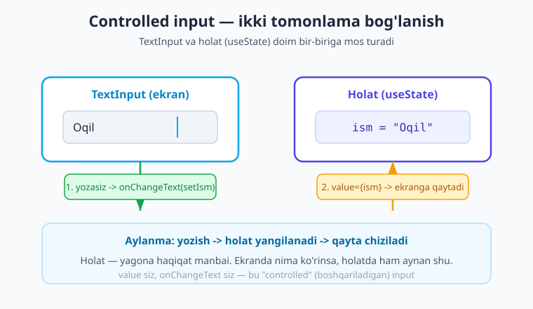
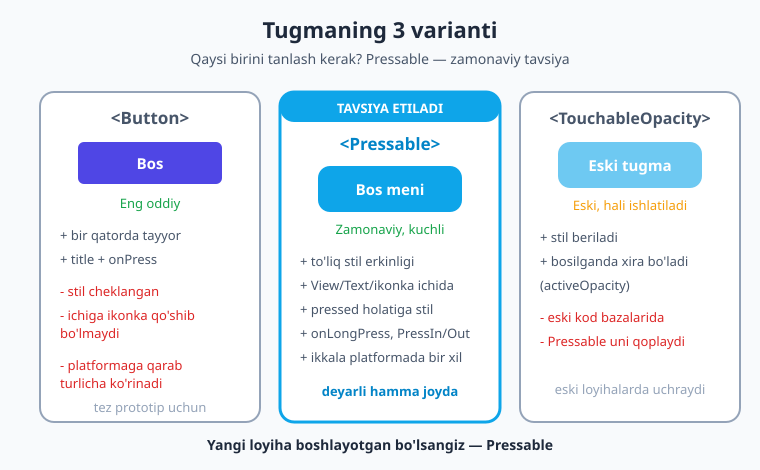
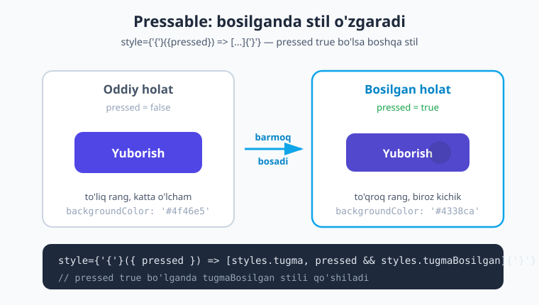

# 06 — Input va tugmalar

[⬅️ Oldingi: 05 — Flexbox va layout](./05-flexbox-layout.md) · [🏠 Kitob boshi](./README.md) · [Keyingi: 07 — ScrollView, SafeArea, StatusBar ➡️](./07-scrollview-safearea.md)

> **Bu bobda:** ilovangizni "tirik" qilamiz — foydalanuvchi bilan suhbat boshlaymiz. `TextInput` bilan matn kiritishni, `Button`, `Pressable` va `TouchableOpacity` bilan tugma bosishni o'rganamiz. Controlled input (holat bilan bog'langan kiritish maydoni), klaviatura boshqaruvi, `Switch` va oxirida to'liq kirish formasini yasaymiz.

---

## Suhbat boshlaymiz

Hozirgacha biz yasagan ekranlar bir tomonlama edi: ilova matn ko'rsatardi, foydalanuvchi esa faqat tomosha qilardi. Bu — devorga osilgan plakat kabi: chiroyli, ammo siz unga gapira olmaysiz.

Endi esa **suhbat** boshlaymiz. Suhbat ikki tomonlama bo'ladi:

- Foydalanuvchi sizga gapiradi — **matn kiritadi** (ismi, paroli, izohi).
- Foydalanuvchi sizga ishora qiladi — **tugma bosadi** ("Yuborish", "Saqlash", "Yoqish").
- Ilova esa javob beradi — ekranni yangilaydi, xabar chiqaradi.

> **Hayotiy o'xshatish.** Tasavvur qiling, kassada turibsiz. Siz kassirga ismingizni aytasiz (matn kiritish) va "to'lov" tugmasini bosasiz. Kassir eshitadi, tushunadi va chek beradi. `TextInput` — siz gapiradigan mikrofon; tugma — siz bosadigan "to'lov" knopkasi; ilova — sizni eshituvchi kassir.

Bu bob — mobil ilovangizning eshitish va his qilish a'zolarini yasaydi. Boshlaymiz.

---

## TextInput — matn kiritish maydoni

`TextInput` — foydalanuvchi klaviaturadan matn yozadigan maydon. Web'dagi `<input>` ning React Native'dagi ukasi.

Eng oddiy ko'rinishi:

```tsx
// app/index.tsx
import { View, TextInput, StyleSheet } from 'react-native';

export default function Index() {
  return (
    <View style={styles.box}>
      <TextInput placeholder="Ismingizni yozing" style={styles.input} />
    </View>
  );
}

const styles = StyleSheet.create({
  box: { flex: 1, justifyContent: 'center', padding: 20 },
  input: {
    borderWidth: 1,
    borderColor: '#cbd5e1',
    borderRadius: 10,
    paddingVertical: 12,
    paddingHorizontal: 14,
    fontSize: 16,
  },
});
```

Bu kodni ishga tushirsangiz, ekranda yozish mumkin bo'lgan maydon paydo bo'ladi. `placeholder` — maydon bo'sh turganda ko'rinadigan kulrang yo'l-yo'riq matn ("Ismingizni yozing"). Foydalanuvchi yoza boshlasa, u yo'qoladi.

!!! warning "TextInput stilsiz deyarli ko'rinmaydi"
    `TextInput` ning o'zida chegara (border) bo'lmaydi — u faqat shaffof maydon. Shuning uchun `borderWidth`, `borderColor` va `padding` qo'shmasak, foydalanuvchi qayerga bosishni bilmaydi. Har doim stil bering.

### TextInput ning foydali xususiyatlari

`TextInput` da ko'p sozlama bor. Eng kerakliarini ko'rib chiqamiz:

| Xususiyat | Vazifasi | Misol |
|---|---|---|
| `placeholder` | Bo'sh maydon yo'l-yo'rig'i | `placeholder="Email"` |
| `keyboardType` | Qanday klaviatura ochilsin | `keyboardType="numeric"` |
| `secureTextEntry` | Yozilganni yulduzcha bilan yashir (parol) | `secureTextEntry` |
| `multiline` | Bir necha qatorli matn | `multiline` |
| `maxLength` | Eng ko'pi bilan necha belgi | `maxLength={10}` |
| `autoCapitalize` | Bosh harf qoidasi | `autoCapitalize="words"` |
| `autoFocus` | Ekran ochilishi bilan klaviatura ochilsin | `autoFocus` |
| `editable` | O'zgartirsa bo'ladimi | `editable={false}` |

`keyboardType` — ayniqsa foydali. U telefon klaviaturasining qanday ko'rinishini boshqaradi:

- `"default"` — oddiy harf klaviaturasi.
- `"numeric"` — faqat raqamlar (yosh, miqdor uchun).
- `"email-address"` — `@` belgisi qo'l ostida bo'ladi.
- `"phone-pad"` — telefon raqami uchun raqam paneli.

Misol — turli klaviaturalar:

```tsx
// app/index.tsx
import { View, TextInput, StyleSheet } from 'react-native';

export default function Index() {
  return (
    <View style={styles.box}>
      <TextInput
        placeholder="email@misol.uz"
        keyboardType="email-address"
        autoCapitalize="none"
        style={styles.input}
      />
      <TextInput
        placeholder="Yoshingiz"
        keyboardType="numeric"
        style={styles.input}
      />
    </View>
  );
}

const styles = StyleSheet.create({
  box: { flex: 1, justifyContent: 'center', padding: 20, gap: 12 },
  input: {
    borderWidth: 1,
    borderColor: '#cbd5e1',
    borderRadius: 10,
    paddingVertical: 12,
    paddingHorizontal: 14,
    fontSize: 16,
  },
});
```

!!! tip "Email maydonida `autoCapitalize=\"none\"`"
    Telefon odatda har gapni bosh harf bilan boshlaydi. Email manzili esa har doim kichik harf bo'ladi (`Oqil@...` noto'g'ri). Shuning uchun email maydonida `autoCapitalize="none"` yozing — telefon birinchi harfni katta qilib yuvormaydi.

`autoCapitalize` ning qiymatlari: `"none"` (hech qachon), `"sentences"` (har gap boshida — default), `"words"` (har so'z boshida — ism uchun yaxshi), `"characters"` (hammasi katta).

---

## Controlled input — holat bilan bog'lash

Yuqoridagi maydonlarning bitta katta kamchiligi bor: **biz foydalanuvchi nima yozganini bilmaymiz!** Maydon o'zicha matnni saqlaydi, lekin bizning kodimiz uni o'qiy olmaydi.

Buni hal qilish uchun maydonni **holatga (state) bog'laymiz**. Bu "controlled input" (boshqariladigan kiritish) deyiladi.

> **Hayotiy o'xshatish.** Tasavvur qiling, doskaga kimdir yozyapti, lekin yonida sizning daftaringiz ham bor. Har safar doskaga harf yozilganda, siz o'sha harfni daftaringizga ko'chirasiz. Endi doskada nima bo'lsa, daftaringizda ham aynan shu turadi — ikkisi doim bir xil. **Doska — TextInput, daftar — holat (state).** Ikkisi bir-biriga bog'langan.

Buning uchun ikkita narsa kerak:

1. **`value`** — maydonda nima ko'rinishi (holatdan keladi).
2. **`onChangeText`** — foydalanuvchi yozganda nima qilish (holatni yangilaydi).

Holatni esa `useState` bilan saqlaymiz.

!!! note "useState bu yerda — chuqur 09-bobda"
    `useState` — komponentga "xotira" beradigan React hook'i (asbobi). Hozircha shunchaki ishlatib ko'ramiz; uning to'liq sirlarini [09-bob](./09-state-hodisalar.md)da ochamiz. Hozir esa shuni bilsangiz yetadi: `useState('')` bizga ikkita narsa beradi — joriy qiymat va uni o'zgartiradigan funksiya.

Mana, controlled input:

```tsx
// app/index.tsx
import { useState } from 'react';
import { View, TextInput, Text, StyleSheet } from 'react-native';

export default function Index() {
  // ism = joriy qiymat, setIsm = uni o'zgartiruvchi funksiya
  const [ism, setIsm] = useState('');

  return (
    <View style={styles.box}>
      <TextInput
        value={ism}              // maydonda holatdagi qiymat ko'rinadi
        onChangeText={setIsm}    // yozilganda holatni yangilaymiz
        placeholder="Ismingizni yozing"
        style={styles.input}
      />
      <Text style={styles.salom}>Salom, {ism}!</Text>
    </View>
  );
}

const styles = StyleSheet.create({
  box: { flex: 1, justifyContent: 'center', padding: 20, gap: 16 },
  input: {
    borderWidth: 1,
    borderColor: '#cbd5e1',
    borderRadius: 10,
    paddingVertical: 12,
    paddingHorizontal: 14,
    fontSize: 16,
  },
  salom: { fontSize: 20, fontWeight: '700', color: '#1e293b' },
});
```

Ishga tushiring va yozib ko'ring: har bir harf yozganingizda, pastdagi "Salom, ..." matni darhol o'zgaradi! Sababi:

1. Siz harf yozasiz.
2. `onChangeText` chaqiriladi va `setIsm` orqali holat yangilanadi.
3. Holat o'zgargani uchun komponent qayta chiziladi.
4. `value={ism}` va `{ism}` yangi qiymatni ko'rsatadi.

Bu aylanmani diagrammada ko'ramiz:



Diagrammadagi asosiy g'oya: **holat — yagona haqiqat manbai**. Ekranda nima ko'rinsa, holatda ham aynan shu turadi. Bu React'ning eng muhim tamoyili.

!!! warning "onChangeText, onChange emas"
    Web'da `onChange` ishlatiladi va u hodisa obyektini beradi. React Native'da esa `onChangeText` bor va u to'g'ridan-to'g'ri **matn satrini** beradi. Shuning uchun `onChangeText={setIsm}` shunday qisqa yozilishi mumkin — `setIsm` matnni qabul qiladi. Aralashtirib yubormang.

### onSubmitEditing — "tayyor" tugmasini bosish

Klaviaturada "tayyor" (return/enter) tugmasi bosilganda biror ish qilish uchun `onSubmitEditing` ishlatiladi:

```tsx
<TextInput
  value={ism}
  onChangeText={setIsm}
  placeholder="Ism"
  onSubmitEditing={() => console.log('Tayyor bosildi:', ism)}
  style={styles.input}
/>
```

Buni qidiruv maydonida ko'p ishlatamiz: foydalanuvchi yozib bo'lib, klaviaturada "qidirish" tugmasini bossa, qidiruv boshlanadi.

---

## Tugmalar — uch xil yo'l

Endi tugmaga o'tamiz. React Native'da tugma yasashning **uch yo'li** bor. Ularning farqini bilish muhim, chunki ko'pchilik boshlovchilar noto'g'risini tanlaydi.



### 1. Button — eng oddiy

`Button` — bir qatorda tayyor tugma. Faqat ikki narsa kerak: `title` (yozuvi) va `onPress` (bosilganda nima bo'lishi).

```tsx
// app/index.tsx
import { View, Button, StyleSheet } from 'react-native';

export default function Index() {
  return (
    <View style={styles.box}>
      <Button title="Bos" onPress={() => console.log('Bosildi!')} />
    </View>
  );
}

const styles = StyleSheet.create({
  box: { flex: 1, justifyContent: 'center', padding: 20 },
});
```

`Button` ning **kuchli tomoni** — soddaligi. Bir qatorda tayyor.

`Button` ning **kamchiligi** — uni deyarli bezab bo'lmaydi. Rangini (`color`) o'zgartirish mumkin, xolos. Ichiga ikonka qo'sha olmaysiz, burchaklarini yumaloqlay olmaysiz, padding bera olmaysiz. Eng yomoni — u iOS'da boshqacha, Android'da boshqacha ko'rinadi (iOS'da rangli matn, Android'da rangli to'rtburchak).

!!! note "iOS va Android farqi"
    `Button` har platformaning o'z uslubiga bo'ysunadi: iOS'da u rangli **matn** ko'rinishida, Android'da esa to'ldirilgan rangli **to'rtburchak** ko'rinishida chiqadi. Agar ilovangiz ikkala platformada **bir xil** ko'rinishi kerak bo'lsa, `Button` o'rniga `Pressable` ishlating.

`Button` ni tez prototip yoki o'rganish uchun ishlating. Haqiqiy ilovada esa odatda `Pressable` ga o'tasiz.

### 2. Pressable — zamonaviy va kuchli

`Pressable` — bugungi tavsiya etiladigan usul. U shunchaki "bosish mumkin bo'lgan maydon" — ichiga istalgan narsani (matn, ikonka, View) qo'yasiz va to'liq stil erkinligiga ega bo'lasiz.

```tsx
// app/index.tsx
import { View, Pressable, Text, StyleSheet } from 'react-native';

export default function Index() {
  return (
    <View style={styles.box}>
      <Pressable
        onPress={() => console.log('Pressable bosildi')}
        style={styles.tugma}
      >
        <Text style={styles.tugmaMatn}>Bos meni</Text>
      </Pressable>
    </View>
  );
}

const styles = StyleSheet.create({
  box: { flex: 1, justifyContent: 'center', padding: 20 },
  tugma: {
    backgroundColor: '#4f46e5',
    paddingVertical: 14,
    paddingHorizontal: 24,
    borderRadius: 10,
    alignItems: 'center',
  },
  tugmaMatn: { color: '#fff', fontSize: 16, fontWeight: '600' },
});
```

E'tibor bering: `Pressable` ning o'zi ko'rinmaydi — biz uni `backgroundColor`, `padding`, `borderRadius` bilan bezadik, ichiga esa `<Text>` qo'ydik. Demak, tugma ko'rinishini **to'liq biz boshqaramiz**, ikkala platformada bir xil chiqadi.

!!! warning "Pressable ichida matn — albatta `<Text>` da"
    `<Pressable>Bos</Pressable>` deb yozsangiz, ilova qulaydi! RN qoidasi: har qanday matn `<Text>` ichida bo'lishi shart. To'g'risi — `<Pressable><Text>Bos</Text></Pressable>`. Bu eng keng tarqalgan boshlovchi xatosi.

`Pressable` ning eng zo'r imkoniyati — **bosilganda stilni o'zgartirish**. Buni quyida alohida ko'ramiz.

### 3. TouchableOpacity — eski, lekin hali tirik

`TouchableOpacity` — `Pressable` dan oldingi avlod. U ham bosish maydoni yasaydi, lekin bitta o'ziga xos xususiyati bor: bosilganda **xira (yarim shaffof) bo'lib** qoladi — go'yo ekranga botgandek.

```tsx
// app/index.tsx
import { View, TouchableOpacity, Text, StyleSheet } from 'react-native';

export default function Index() {
  return (
    <View style={styles.box}>
      <TouchableOpacity
        activeOpacity={0.6}        // bosilganda 60% shaffoflik
        onPress={() => console.log('Touchable bosildi')}
        style={styles.tugma}
      >
        <Text style={styles.tugmaMatn}>Eski tugma</Text>
      </TouchableOpacity>
    </View>
  );
}

const styles = StyleSheet.create({
  box: { flex: 1, justifyContent: 'center', padding: 20 },
  tugma: {
    backgroundColor: '#0ea5e9',
    paddingVertical: 14,
    paddingHorizontal: 24,
    borderRadius: 10,
    alignItems: 'center',
  },
  tugmaMatn: { color: '#fff', fontSize: 16, fontWeight: '600' },
});
```

`activeOpacity` — bosilgandagi shaffoflik darajasi (0 = ko'rinmas, 1 = o'zgarishsiz). Default 0.2.

`TouchableOpacity` ni hali ko'p kod bazalarida (ayniqsa eski loyihalarda) uchratasiz, shuning uchun uni bilib qo'yish kerak. Lekin **yangi kod yozayotgan bo'lsangiz — `Pressable` tanlang**: u kuchliroq va React Native jamoasi aynan uni tavsiya qiladi.

### Qaysi birini tanlash kerak?

| Vaziyat | Tavsiya |
|---|---|
| Tez sinab ko'rish, o'rganish | `Button` |
| Yangi loyiha, chiroyli tugma | **`Pressable`** ✅ |
| Eski kodga qo'shimcha | `TouchableOpacity` (kod uslubiga moslab) |

Qoida sodda: **shubha bo'lsa — `Pressable`**.

---

## Bosish hodisalari

Tugma faqat oddiy bosishni emas, balki turli xil teginishni eshitishi mumkin. `Pressable` (va `TouchableOpacity`) quyidagi hodisalarni qo'llab-quvvatlaydi:

| Hodisa | Qachon ishlaydi |
|---|---|
| `onPress` | Bosib qo'yib yuborilganda (oddiy bosish) |
| `onLongPress` | Uzoq bosib turilganda (~0.5 soniya) |
| `onPressIn` | Barmoq ekranga tegishi bilan (darhol) |
| `onPressOut` | Barmoq ekrandan ko'tarilganda |

> **Hayotiy o'xshatish.** Eshik qo'ng'irog'ini tasavvur qiling. `onPressIn` — barmoqni knopkaga qo'yganingiz. `onPressOut` — barmoqni olganingiz. `onPress` — to'liq "bosib-qo'yib yuborish" (qo'ng'iroq jiringladi). `onLongPress` — knopkani uzoq bosib turganingiz (uzunroq jiringlash).

Hammasini bir tugmada ko'ramiz:

```tsx
// app/index.tsx
import { useState } from 'react';
import { View, Pressable, Text, StyleSheet } from 'react-native';

export default function Index() {
  const [holat, setHolat] = useState('Tegmagan');

  return (
    <View style={styles.box}>
      <Pressable
        onPress={() => setHolat('Bosildi')}
        onLongPress={() => setHolat('Uzoq bosildi')}
        onPressIn={() => setHolat('Barmoq tushdi')}
        onPressOut={() => setHolat('Barmoq ko\'tarildi')}
        style={styles.tugma}
      >
        <Text style={styles.tugmaMatn}>{holat}</Text>
      </Pressable>
    </View>
  );
}

const styles = StyleSheet.create({
  box: { flex: 1, justifyContent: 'center', padding: 20 },
  tugma: {
    backgroundColor: '#4f46e5',
    paddingVertical: 16,
    paddingHorizontal: 24,
    borderRadius: 12,
    alignItems: 'center',
  },
  tugmaMatn: { color: '#fff', fontSize: 16, fontWeight: '600' },
});
```

Tugmani turlicha bosib ko'ring — yozuvi o'zgarib turadi. Ko'pgina hollarda sizga faqat `onPress` kerak bo'ladi; qolganlari maxsus holatlar uchun (masalan, uzoq bosganda kontekst menyu chiqarish).

---

## Chiroyli tugma yasash — bosilganda effekt

`Pressable` ning eng yoqimli tomoni — **bosilganda ko'rinishini o'zgartirish**. Buning uchun `style` ga oddiy obyekt emas, **funksiya** beriladi. Bu funksiya `pressed` (bosilganmi?) qiymatini oladi:

```tsx
<Pressable
  style={({ pressed }) => [
    styles.tugma,                       // doimiy stil
    pressed && styles.tugmaBosilgan,    // bosilganda qo'shiladigan stil
  ]}
>
```

`style={({ pressed }) => [...]}` — bu "agar `pressed` rost bo'lsa, `tugmaBosilgan` stilini ham qo'sh" degani. `pressed && styles.tugmaBosilgan` — JavaScript hiylasi: agar `pressed` `true` bo'lsa, stilni qaytaradi; `false` bo'lsa, hech narsa qo'shilmaydi.

To'liq misol:

```tsx
// app/index.tsx
import { View, Pressable, Text, StyleSheet } from 'react-native';

export default function Index() {
  return (
    <View style={styles.box}>
      <Pressable
        onPress={() => console.log('Yuborildi')}
        style={({ pressed }) => [
          styles.tugma,
          pressed && styles.tugmaBosilgan,
        ]}
      >
        <Text style={styles.tugmaMatn}>Yuborish</Text>
      </Pressable>
    </View>
  );
}

const styles = StyleSheet.create({
  box: { flex: 1, justifyContent: 'center', padding: 20 },
  tugma: {
    backgroundColor: '#4f46e5',
    paddingVertical: 14,
    paddingHorizontal: 24,
    borderRadius: 12,
    alignItems: 'center',
  },
  // bosilganda: to'qroq rang
  tugmaBosilgan: {
    backgroundColor: '#4338ca',
  },
  tugmaMatn: { color: '#fff', fontSize: 16, fontWeight: '600' },
});
```

Bosib ko'ring — tugma bosilganda rangi to'qlashadi va qo'yib yuborganingizda yana ochroq bo'ladi. Bu foydalanuvchiga "bosding, eshitdim" degan **his** beradi (UX uchun juda muhim).

Diagrammada bu jarayonni ko'ramiz:



!!! tip "Faqat rangni emas"
    `tugmaBosilgan` ichida xohlagan stilni o'zgartiring: rang, o'lcham (`transform: [{ scale: 0.97 }]`), shaffoflik (`opacity: 0.8`). Eng tabiiy his — rangni biroz to'qlashtirish yoki tugmani arzimas darajada kichraytirish.

---

## Klaviaturani boshqarish

Klaviatura mobil ilovada doim "muammo" tug'diradi: u ekranning yarmini egallaydi va ba'zan kerakmas joyda ochilib qoladi. Bir nechta foydali asbob bilan tanishamiz.

### returnKeyType — "tayyor" tugmasi ko'rinishi

Klaviaturadagi pastki-o'ng tugmaning yozuvini `returnKeyType` boshqaradi:

```tsx
<TextInput
  placeholder="Qidirish..."
  returnKeyType="search"   // "tayyor" o'rniga "qidirish" yozuvi
  style={styles.input}
/>
```

Qiymatlari: `"done"` (tayyor), `"go"` (o'tish), `"search"` (qidirish), `"send"` (yuborish), `"next"` (keyingi). Bu klaviaturaning ko'rinishini foydalanuvchi maqsadiga moslaydi.

### Keyboard.dismiss() — klaviaturani yopish

Ba'zan klaviaturani **dasturiy** yopish kerak (masalan, foydalanuvchi "tayyor" bosgach yoki bo'sh joyga tegganda). Buning uchun `Keyboard` modulidan foydalanamiz:

```tsx
import { Keyboard, TextInput } from 'react-native';

<TextInput
  placeholder="Izoh..."
  returnKeyType="done"
  onSubmitEditing={() => Keyboard.dismiss()}   // "tayyor" bosilsa klaviatura yopiladi
  style={styles.input}
/>
```

`Keyboard.dismiss()` — klaviaturani darhol yopadi. Uni `onSubmitEditing` ichida yoki tugma `onPress` ida chaqirish mumkin.

### autoFocus — ekran ochilishi bilan yozish

Agar ekran ochilishi bilanoq foydalanuvchi yoza boshlashini xohlasangiz (masalan, qidiruv ekrani), `autoFocus` qo'shing:

```tsx
<TextInput placeholder="Qidirish..." autoFocus style={styles.input} />
```

Ekran ochilishi bilan klaviatura avtomatik ochiladi va kursor maydonga qo'yiladi.

!!! note "KeyboardAvoidingView — keyingi bobda"
    Klaviatura ochilganda maydon uning ostida qolib ketmasligi uchun ekranni yuqoriga surish kerak bo'ladi. Buni `KeyboardAvoidingView` qiladi — uni [07-bobda](./07-scrollview-safearea.md) batafsil ko'ramiz. Hozircha asosiy g'oyaga e'tibor qaratamiz.

---

## Boshqa kiritish elementlari

Matn va tugmadan tashqari yana ikkita keng ishlatiladigan element bor.

### Switch — yoqish/o'chirish

`Switch` — ON/OFF tugmachasi (telefon sozlamalaridagi kabi). Sozlamalar, "eslab qol" belgisi, "bildirishnoma yoqilsinmi?" uchun ideal.

`Switch` ham controlled: `value` (yoqilganmi?) va `onValueChange` (o'zgarganda) kerak.

```tsx
// app/index.tsx
import { useState } from 'react';
import { View, Text, Switch, StyleSheet } from 'react-native';

export default function Index() {
  const [yoqilgan, setYoqilgan] = useState(false);

  return (
    <View style={styles.box}>
      <View style={styles.qator}>
        <Text style={styles.matn}>Bildirishnoma</Text>
        <Switch value={yoqilgan} onValueChange={setYoqilgan} />
      </View>
      <Text style={styles.holat}>
        Bildirishnoma {yoqilgan ? 'yoqilgan' : 'o\'chirilgan'}
      </Text>
    </View>
  );
}

const styles = StyleSheet.create({
  box: { flex: 1, justifyContent: 'center', padding: 20, gap: 16 },
  qator: {
    flexDirection: 'row',
    justifyContent: 'space-between',
    alignItems: 'center',
  },
  matn: { fontSize: 18, color: '#1e293b' },
  holat: { fontSize: 15, color: '#475569' },
});
```

`Switch` ni surganingizda holat o'zgaradi va pastdagi matn yangilanadi. E'tibor bering: `TextInput` da `onChangeText`, `Switch` da esa `onValueChange` — har element o'zgarishni o'z nomi bilan xabar qiladi.

!!! tip "Switch rangini moslash"
    `trackColor={{ false: '#cbd5e1', true: '#4f46e5' }}` bilan o'chiq/yoniq holatdagi "yo'l" rangini, `thumbColor` bilan esa dumaloq tugmacha rangini berishingiz mumkin.

### Slider — qiymatni surib tanlash

`Slider` — qiymatni surib tanlaydigan element (ovoz balandligi, narx oralig'i uchun). U **alohida paket** orqali keladi (Expo'ning o'zida o'rnatilmagan):

```bash
npx expo install @react-native-community/slider
```

```tsx
import Slider from '@react-native-community/slider';

<Slider
  minimumValue={0}
  maximumValue={100}
  value={ovoz}
  onValueChange={setOvoz}
/>
```

`Slider` ni endi sanab o'tdik; uni ko'p loyihalarda kamroq ishlatasiz, shuning uchun batafsil to'xtalmaymiz. Asosiysi — bunday element borligini bilib qo'ying.

---

## To'liq misol — kirish formasi

Endi hammasini birlashtiramiz: ism maydoni, parol maydoni, parolni ko'rsatish uchun `Switch` va "Yuborish" tugmasi. Tugma bosilganda `Alert` (qalqib chiquvchi xabar) ko'rsatamiz.

`Alert.alert('Sarlavha', 'Matn')` — telefonning tabiiy ogohlantirish oynasini chiqaradi.

```tsx
// app/index.tsx
import { useState } from 'react';
import {
  View,
  Text,
  TextInput,
  Pressable,
  Switch,
  Alert,
  Keyboard,
  StyleSheet,
} from 'react-native';

export default function Index() {
  const [ism, setIsm] = useState('');
  const [parol, setParol] = useState('');
  const [parolKorinsin, setParolKorinsin] = useState(false);

  function yuborish() {
    // oddiy tekshiruv: ism bo'sh bo'lmasin
    if (ism.trim() === '') {
      Alert.alert('Xato', 'Iltimos, ismingizni kiriting');
      return;
    }
    Keyboard.dismiss();                       // klaviaturani yopamiz
    Alert.alert('Salom!', `Xush kelibsiz, ${ism}`);
  }

  return (
    <View style={styles.forma}>
      <Text style={styles.sarlavha}>Kirish</Text>

      {/* Ism */}
      <TextInput
        value={ism}
        onChangeText={setIsm}
        placeholder="Ismingiz"
        autoCapitalize="words"
        style={styles.input}
      />

      {/* Parol — secureTextEntry switch'ga bog'langan */}
      <TextInput
        value={parol}
        onChangeText={setParol}
        placeholder="Parol"
        secureTextEntry={!parolKorinsin}      // ko'rsatish yoqilsa, yashirishni o'chiramiz
        style={styles.input}
      />

      {/* Parolni ko'rsatish/yashirish */}
      <View style={styles.qator}>
        <Text style={styles.matn}>Parolni ko'rsatish</Text>
        <Switch value={parolKorinsin} onValueChange={setParolKorinsin} />
      </View>

      {/* Yuborish tugmasi — bosilganda effekt bilan */}
      <Pressable
        onPress={yuborish}
        style={({ pressed }) => [
          styles.tugma,
          pressed && styles.tugmaBosilgan,
        ]}
      >
        <Text style={styles.tugmaMatn}>Yuborish</Text>
      </Pressable>
    </View>
  );
}

const styles = StyleSheet.create({
  forma: { flex: 1, justifyContent: 'center', padding: 20, gap: 14 },
  sarlavha: { fontSize: 26, fontWeight: '700', color: '#1e293b', marginBottom: 8 },
  input: {
    borderWidth: 1,
    borderColor: '#cbd5e1',
    borderRadius: 10,
    paddingVertical: 12,
    paddingHorizontal: 14,
    fontSize: 16,
  },
  qator: {
    flexDirection: 'row',
    justifyContent: 'space-between',
    alignItems: 'center',
  },
  matn: { fontSize: 16, color: '#475569' },
  tugma: {
    backgroundColor: '#4f46e5',
    paddingVertical: 14,
    borderRadius: 10,
    alignItems: 'center',
    marginTop: 8,
  },
  tugmaBosilgan: { backgroundColor: '#4338ca' },
  tugmaMatn: { color: '#fff', fontSize: 16, fontWeight: '600' },
});
```

Bu kichik forma — sizning birinchi haqiqiy interaktiv ekraningiz! Unda:

- **Ikkita controlled input** — ism va parol holatga bog'langan.
- **Switch bilan parolni ko'rsatish** — `secureTextEntry={!parolKorinsin}` orqali. `Switch` yoqilsa, parol ochiq ko'rinadi.
- **Tekshiruv (validatsiya)** — ism bo'sh bo'lsa, xato xabari chiqadi.
- **Bosilganda effekt** — `Pressable` tugmasi bosilganda rangi to'qlashadi.
- **Alert** — muvaffaqiyatda "Xush kelibsiz" oynasi.

!!! example "Parolni ko'rsatish hiylasi"
    `secureTextEntry={!parolKorinsin}` — bu eng aqlli qism. `parolKorinsin` `false` bo'lsa (ko'rsatilmasin), `!parolKorinsin` `true` bo'ladi va parol yulduzcha bilan yashiriladi. `Switch` ni yoqsangiz, aksincha bo'ladi va parol ochiladi. Bitta holat ikkala maydon va tugmachani boshqaradi!

> **Eslatma — bu kod tekshirilgan.** Yuqoridagi barcha kod namunalari jonli Expo SDK 56 loyihasida `npx tsc --noEmit` bilan tip-tekshiruvidan o'tkazildi va xatosiz kompilyatsiya bo'ldi.

---

## Xulosa

- **`TextInput`** — matn kiritish maydoni. Stil bermasangiz deyarli ko'rinmaydi.
- **Controlled input** — `value` + `onChangeText` bilan maydonni holatga (`useState`) bog'lash. Holat — yagona haqiqat manbai; ekranda nima bo'lsa, holatda ham aynan shu.
- TextInput xususiyatlari: `placeholder`, `keyboardType`, `secureTextEntry`, `multiline`, `maxLength`, `autoCapitalize`, `autoFocus`, `onSubmitEditing`.
- **Tugmaning 3 yo'li:** `Button` (oddiy, lekin cheklangan), **`Pressable`** (zamonaviy, tavsiya etiladi), `TouchableOpacity` (eski, hali ishlatiladi).
- **`Pressable`** — `style={({ pressed }) => [...]}` bilan bosilganda stilni o'zgartiradi; ichiga istalgan narsani qo'yib, to'liq bezab bo'ladi.
- Bosish hodisalari: `onPress`, `onLongPress`, `onPressIn`, `onPressOut`.
- Klaviatura: `returnKeyType`, `Keyboard.dismiss()`, `autoFocus`.
- **`Switch`** — yoqish/o'chirish; `value` + `onValueChange`. `Slider` — qiymatni surib tanlash (alohida paket).
- Matn HAR DOIM `<Text>` ichida — `Pressable`/`TouchableOpacity` ichida ham.

## Amaliy mashqlar

1. **Salomlashish ekrani.** Bitta `TextInput` (ism uchun) va bitta `Pressable` tugma yasang. Tugma bosilganda `Alert.alert` orqali "Salom, [ism]!" ko'rsating. Agar maydon bo'sh bo'lsa, "Iltimos, ism kiriting" xatosini chiqaring.

2. **Belgilar hisoblagichi.** `multiline` `TextInput` yasang (izoh uchun) va `maxLength={100}` qo'ying. Maydon ostida "yozildi: X / 100" deb ko'rsating (maslahat: `ism.length` dan foydalaning, controlled input kerak).

3. **Parol ko'rsatish/yashirish.** Parol `TextInput` va yonida `Switch` yasang. `Switch` yoqilganda parol ochiq, o'chirilganda yashirin bo'lsin (`secureTextEntry` ni `Switch` holatiga bog'lang).

4. **Chiroyli tugma.** `Pressable` bilan tugma yasang: indigo rang, yumaloq burchak, ichida matn. Bosilganda rangi to'qlashsin **va** `transform: [{ scale: 0.97 }]` bilan biroz kichraysin. (Maslahat: `tugmaBosilgan` stiliga ikkala xususiyatni qo'shing.)

5. **Mini kalkulyator boshlanishi.** Ikkita raqamli `TextInput` (`keyboardType="numeric"`) va "Qo'shish" tugmasini yasang. Tugma bosilganda ikki sonni qo'shib, natijani `Text` da ko'rsating. (Maslahat: matn satrini songa aylantirish uchun `Number(qiymat)` ishlating.)

---

[⬅️ Oldingi: 05 — Flexbox va layout](./05-flexbox-layout.md) · [🏠 Kitob boshi](./README.md) · [Keyingi: 07 — ScrollView, SafeArea, StatusBar ➡️](./07-scrollview-safearea.md)
