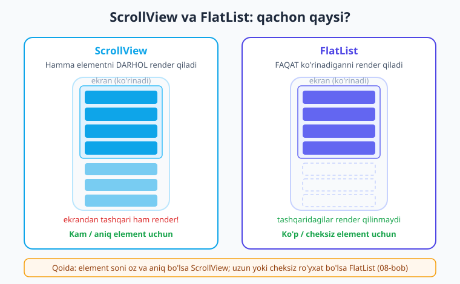
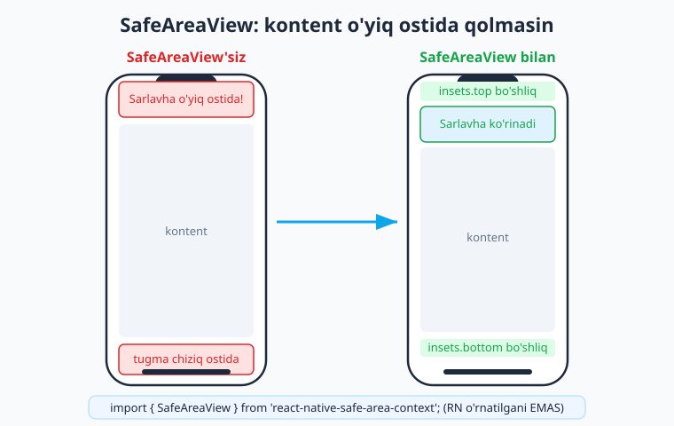
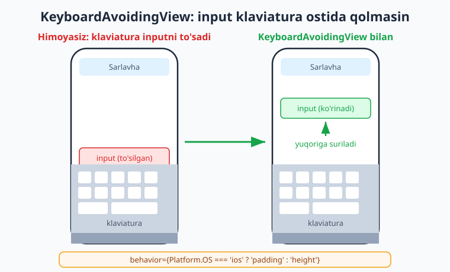

# 07 — ScrollView, SafeArea va StatusBar

[⬅️ Oldingi: 06 — Input va tugmalar](./06-input-tugma.md) · [🏠 Kitob boshi](./README.md) · [Keyingi: 08 — Ro'yxatlar: FlatList ➡️](./08-royxatlar-flatlist.md)

> **Bu bobda:** kontent ekranga sig'maganda nima qilamiz? `<ScrollView>` bilan sahifani skroll qilinadigan qilamiz. Zamonaviy telefonlardagi notch (kamera o'yig'i) va pastki chiziq kontentni to'sib qo'ymasligi uchun `SafeAreaView` ni o'rganamiz. Yuqoridagi soat/batareya zonasini `StatusBar` bilan boshqaramiz, rasmlarni chuqurroq ko'ramiz va klaviatura inputni to'smasligi uchun `KeyboardAvoidingView` dan foydalanamiz.

---

## Muammo: kontent ekranga sig'maydi

Oldingi boblarda biz `<View>` ichida bir nechta element joyladik va ular ekranga chiroyli sig'di. Lekin haqiqiy ilovalarda kontent ko'pincha ekrandan **uzunroq** bo'ladi: profil sahifasi, sozlamalar ro'yxati, maqola matni, mahsulotlar...

Keling, oddiy bir tajriba qilaylik. Tasavvur qiling, 30 ta qatorni oddiy `<View>` ichiga joyladingiz:

```tsx
// app/index.tsx — MUAMMOLI: View skroll qilmaydi!
import { View, Text } from 'react-native';

export default function Index() {
  return (
    <View style={{ flex: 1, padding: 20 }}>
      {Array.from({ length: 30 }).map((_, i) => (
        <Text key={i} style={{ fontSize: 18, marginBottom: 16 }}>
          Bu {i + 1}-qator matn.
        </Text>
      ))}
    </View>
  );
}
```

Telefoningizda buni ochsangiz: dastlabki bir nechta qator ko'rinadi, qolganlari esa **ekran tashqarisida qoladi va ularga yetib bo'lmaydi**. Barmoq bilan yuqoriga torting — hech narsa bo'lmaydi. `<View>` qimirlamaydi!

> **Hayotiy o'xshatish.** `<View>` — bu deraza. Deraza orqali faqat oldingizdagi narsani ko'rasiz; orqada nima borligini ko'rish uchun derazani siljitolmaysiz. `<ScrollView>` esa — **uzun bir qog'oz varaq** o'ralgan rulon. Varaqni qo'lingiz bilan pastga-yuqoriga aylantirib, undagi hamma yozuvni o'qiy olasiz. Mana shu "aylantirish" — skroll.

!!! warning "Ehtiyot bo'ling"
    `<View>` **hech qachon** skroll qilmaydi. Bu boshlovchilarning eng ko'p uchraydigan chalkashligi: "kodim to'g'ri, lekin pastdagi tugmaga yetolmayapman". Sababi — element `<View>` ichida, `<ScrollView>` ichida emas.

---

## `<ScrollView>` — skroll qilinadigan konteyner

Yechim oddiy: `<View>` o'rniga `<ScrollView>` ishlatamiz. U `react-native` dan import qilinadi va ichidagi **hamma narsani** skroll qilinadigan qiladi.

```tsx
// app/index.tsx — ScrollView bilan: endi skroll ishlaydi!
import { ScrollView, Text } from 'react-native';

export default function Index() {
  return (
    <ScrollView style={{ flex: 1, padding: 20 }}>
      {Array.from({ length: 30 }).map((_, i) => (
        <Text key={i} style={{ fontSize: 18, marginBottom: 16 }}>
          Bu {i + 1}-qator matn.
        </Text>
      ))}
    </ScrollView>
  );
}
```

Atigi bitta so'zni o'zgartirdik — `View` o'rniga `ScrollView` — va endi barmoq bilan tortib hamma 30 qatorni ko'ra olasiz. Ajoyib!

### `style` va `contentContainerStyle` — MUHIM farq

`<ScrollView>` da ikkita alohida stil propi bor va ularni chalkashtirish — juda keng tarqalgan xato. Keling, farqni aniq tushunib olaylik.

- **`style`** — bu ScrollView'ning **o'zining** (ya'ni "deraza"ning) stili. Uning balandligi, foni, chegarasi shu yerda.
- **`contentContainerStyle`** — bu ScrollView **ichidagi kontentning** (ya'ni "uzun varaq"ning) stili. Ichki `padding`, `gap`, `alignItems` shu yerda yoziladi.

> **Hayotiy o'xshatish.** `style` — derazaning ramkasi va o'lchami. `contentContainerStyle` — deraza ortidagi varaqning ichki tartibi (matn chetidan qancha bo'shliq qoldirish, qatorlar orasi qancha bo'lishi).

```tsx
// padding va gap'ni contentContainerStyle ga beramiz — style ga emas!
import { ScrollView, Text, StyleSheet } from 'react-native';

export default function Index() {
  return (
    <ScrollView
      style={styles.skroll}                  // deraza: flex, fon
      contentContainerStyle={styles.ichi}    // varaq ichi: padding, gap
    >
      <Text style={styles.matn}>Birinchi blok</Text>
      <Text style={styles.matn}>Ikkinchi blok</Text>
      <Text style={styles.matn}>Uchinchi blok</Text>
    </ScrollView>
  );
}

const styles = StyleSheet.create({
  skroll: { flex: 1, backgroundColor: '#f8fafc' },
  ichi: { padding: 16, gap: 12 },
  matn: { fontSize: 16, color: '#1e293b' },
});
```

!!! warning "Eng ko'p uchraydigan xato"
    `padding`, `gap`, `alignItems`, `justifyContent` kabi **ichki tartib** stillarini `style` ga yozsangiz, ular kutilgandek ishlamasligi mumkin (ayniqsa `justifyContent`). Ichki kontentni joylash uchun **doim `contentContainerStyle`** ishlating. `flex: 1` esa aksincha — `style` ga yoziladi.

### `horizontal` — yon tomonga skroll

Sukut bo'yicha ScrollView **vertikal** (yuqori-past) skroll qiladi. `horizontal` propini qo'shsangiz — **gorizontal** (chap-o'ng) skrollga aylanadi. Bu rasm galereyasi, "stories", toifa teglari uchun juda qulay.

```tsx
// Gorizontal rang galereyasi — yon tomonga skroll
import { ScrollView, View, StyleSheet } from 'react-native';

export default function Galereya() {
  const ranglar = ['#0ea5e9', '#6366f1', '#16a34a', '#f59e0b', '#dc2626'];
  return (
    <ScrollView
      horizontal                                  // yon tomonga skroll
      showsHorizontalScrollIndicator={false}      // pastdagi skroll chizig'ini yashir
      contentContainerStyle={{ gap: 12, padding: 16 }}
    >
      {ranglar.map((rang) => (
        <View key={rang} style={[styles.karta, { backgroundColor: rang }]} />
      ))}
    </ScrollView>
  );
}

const styles = StyleSheet.create({
  karta: { width: 120, height: 160, borderRadius: 16 },
});
```

### Skroll chizig'ini yashirish

ScrollView yon tomonida (yoki pastida) ingichka skroll ko'rsatkichi paydo bo'ladi. Uni yashirish uchun:

- `showsVerticalScrollIndicator={false}` — vertikal chiziqni yashiradi.
- `showsHorizontalScrollIndicator={false}` — gorizontal chiziqni yashiradi.

Bu ko'pincha dizayn toza ko'rinishi uchun ishlatiladi.

### `refreshControl` — "tortib yangilash"

Mobil ilovalarda mashhur naqsh bor: ro'yxatni **pastga tortsangiz**, u yangilanadi (yangi xabarlar, postlar yuklanadi). Bu "pull to refresh" deb ataladi. ScrollView'ga `refreshControl` propi orqali qo'shiladi.

```tsx
// Tortib yangilash (pull to refresh)
import { useState } from 'react';
import { ScrollView, Text, RefreshControl } from 'react-native';

export default function Royxat() {
  const [yangilanmoqda, setYangilanmoqda] = useState(false);

  const yangila = () => {
    setYangilanmoqda(true);
    // bu yerda odatda API'dan yangi ma'lumot olinadi
    setTimeout(() => setYangilanmoqda(false), 1500); // soxta yuklash
  };

  return (
    <ScrollView
      refreshControl={
        <RefreshControl refreshing={yangilanmoqda} onRefresh={yangila} />
      }
    >
      <Text style={{ fontSize: 16, padding: 20 }}>
        Ekranni pastga torting — yangilanadi.
      </Text>
    </ScrollView>
  );
}
```

`refreshing` — hozir yangilanyaptimi (spinner ko'rinadimi); `onRefresh` — foydalanuvchi tortganda chaqiriladigan funksiya. Ish tugagach `refreshing` ni yana `false` qilish **shart**, aks holda spinner aylanaverib qoladi.

---

## ScrollView vs FlatList — qachon qaysi?

Bu — bobning eng muhim tushunchalaridan biri. ScrollView qulay, lekin uning **jiddiy cheklovi** bor:

**`<ScrollView>` ichidagi BARCHA elementlarni darhol render qiladi** — hatto ekrandan tashqarida, hali ko'rinmayotganlarini ham. 20-30 element uchun bu yaxshi. Lekin 1000 ta element bo'lsa? Telefon hammasini bir vaqtda chizishga urinib, sekinlashadi yoki "qotadi".

Bunday holatlar uchun **`<FlatList>`** bor (uni keyingi, 08-bobda batafsil o'rganamiz). FlatList faqat **hozir ekranda ko'rinadigan** elementlarni render qiladi; pastga skroll qilsangiz, yangilarini chizib, yuqoridagi ko'rinmaydiganlarini "tashlab yuboradi". Shuning uchun u uzun ro'yxatlarda juda tez ishlaydi.



!!! tip "Oddiy qoida"
    - Elementlar soni **oz va aniq** bo'lsa (masalan profil sahifasi, sozlamalar, forma) → **`ScrollView`**.
    - Elementlar **ko'p, cheksiz yoki noma'lum** sonda bo'lsa (xabarlar lentasi, mahsulotlar ro'yxati, izohlar) → **`FlatList`**.

!!! warning "Ichma-ich qo'ymang"
    Vertikal `ScrollView` ichiga vertikal `FlatList` (yoki teskarisini) joylash sekinlik va ogohlantirishlarga olib keladi, chunki ikkalasi ham balandlikni cheksiz deb hisoblaydi. Agar kerak bo'lsa, FlatList'ning o'z `ListHeaderComponent` / `ListFooterComponent` proplaridan foydalaning (08-bobda).

---

## SafeAreaView — kontent o'yiq ostida qolmasin

Endi zamonaviy telefonlarning eng muhim muammosiga keldik. Hozirgi telefonlarda ekran chetlari to'liq bilan band: yuqorida **notch** (kamera/dinamik orol o'yig'i), pastda esa **bosh sahifa chizig'i** (home indicator) bor.

Agar kontentingizni hech qanday himoyasiz to'g'ridan-to'g'ri ekran chetiga joylasangiz, sarlavhangiz notch ostiga, pastdagi tugmangiz esa bosh sahifa chizig'i ostiga tushib qolib, **ko'rinmay yoki bosib bo'lmaydigan** holga keladi.

> **Hayotiy o'xshatish.** Telefon ekrani — devordagi suratga o'xshaydi, lekin uning yuqori burchaklarida (notch) va pastida (chiziq) "teshik"lar bor. Agar muhim yozuvni aynan shu teshiklar ustiga yozsangiz, uni o'qib bo'lmaydi. **Xavfsiz hudud (safe area)** — teshiklardan xoli, "toza" markaziy zona. SafeAreaView kontentni mana shu toza zonaga joylaydi.



### To'g'ri import — bu juda muhim!

`SafeAreaView` ni **`react-native-safe-area-context`** paketidan import qiling, React Native'ning o'zidagi eski `SafeAreaView` dan **EMAS**.

```tsx
// TO'G'RI — zamonaviy, iOS va Android'da to'g'ri ishlaydi:
import { SafeAreaView } from 'react-native-safe-area-context';

// XATO — RN'ning eski o'rnatilgani (faqat iOS, eskirgan):
// import { SafeAreaView } from 'react-native';
```

!!! danger "Nega aynan shu paket?"
    RN'ning ichki `SafeAreaView` faqat iOS'da ishlaydi va Android notch'larini hisobga olmaydi. `react-native-safe-area-context` esa ikkala platformada ham qurilmaning haqiqiy o'lchamlarini biladi. Expo loyihalarida bu paket **allaqachon o'rnatilgan** — qo'shimcha o'rnatish shart emas.

Foydalanish o'ta oddiy — eng tashqi `<View>` ni `<SafeAreaView>` ga almashtiring:

```tsx
// app/index.tsx — kontent xavfsiz hududda
import { SafeAreaView } from 'react-native-safe-area-context';
import { Text } from 'react-native';

export default function Index() {
  return (
    <SafeAreaView style={{ flex: 1 }}>
      <Text style={{ fontSize: 20, padding: 20 }}>
        Salom! Men o'yiq ostida emasman.
      </Text>
    </SafeAreaView>
  );
}
```

`style={{ flex: 1 }}` — SafeAreaView butun ekranni egallashi uchun kerak. U avtomatik ravishda yuqoridan va pastdan kerakli bo'shliqni qoldiradi.

### `useSafeAreaInsets()` — aniq o'lchamlar kerak bo'lganda

Ba'zan kontentni `SafeAreaView` ichiga butunlay o'rab qo'yish o'rniga, **faqat bir tomondan** bo'shliq qoldirishni xohlaysiz (masalan, faqat yuqoridan, fon esa to'liq ekranga yoyilishi kerak). Buning uchun `useSafeAreaInsets()` hookidan foydalanamiz. U sizga to'rt tomondagi xavfsiz bo'shliqlarni **raqam** sifatida beradi.

```tsx
// useSafeAreaInsets bilan moslashuvchan joylash
import { useSafeAreaInsets } from 'react-native-safe-area-context';
import { View, Text } from 'react-native';

export default function Ekran() {
  const insets = useSafeAreaInsets();
  // insets.top, insets.bottom, insets.left, insets.right — barchasi raqam (dp)

  return (
    <View style={{ flex: 1, paddingTop: insets.top, backgroundColor: '#0ea5e9' }}>
      <Text style={{ fontSize: 18, color: '#fff', padding: 16 }}>
        Yuqori bo'shliq: {insets.top} (notch balandligi)
      </Text>
    </View>
  );
}
```

Bu yerda ko'k fon **butun ekranga** (notch ortiga ham) yoyiladi, lekin matn `paddingTop: insets.top` tufayli notch ostiga tushmaydi. Bu naqsh — rangli sarlavha (header) yasashda juda foydali.

!!! note "Qaysi birini tanlash?"
    - Oddiy holatlar uchun → **`<SafeAreaView style={{ flex: 1 }}>`** (oson, tez).
    - Fonni chetga yoyib, faqat matnni himoya qilish kerak bo'lsa → **`useSafeAreaInsets()`**.

### `SafeAreaProvider` — ildizda kerak

`SafeAreaView` va `useSafeAreaInsets()` ishlashi uchun, ilovaning eng yuqorisida `SafeAreaProvider` bo'lishi kerak. U xavfsiz hudud o'lchamlarini butun ilovaga "tarqatadi".

```tsx
import { SafeAreaProvider } from 'react-native-safe-area-context';

export default function App() {
  return (
    <SafeAreaProvider>
      {/* butun ilova shu yerda */}
    </SafeAreaProvider>
  );
}
```

!!! tip "Yaxshi xabar"
    Agar **Expo Router** ishlatayotgan bo'lsangiz (bu kitobda biz uni ishlatamiz — 14-bobdan boshlab), `SafeAreaProvider` **avtomatik** sozlangan. Siz uni qo'lda qo'shishingiz shart emas — to'g'ridan-to'g'ri `SafeAreaView` va `useSafeAreaInsets()` dan foydalanaverasiz.

---

## StatusBar — yuqoridagi soat/batareya zonasi

**Status bar** — telefon ekranining eng yuqorisidagi, soat, batareya va signal ko'rsatadigan tor chiziq. Ba'zan u oq (och) fonda yaxshi ko'rinadi, ba'zan esa to'q fon kerak. RN'da uni boshqarish uchun **`expo-status-bar`** paketidagi `StatusBar` komponentidan foydalanamiz.

```tsx
import { StatusBar } from 'expo-status-bar';

// ...
<StatusBar style="auto" />
```

`style` propi uchta qiymat oladi:

- **`"auto"`** — tizimga moslashadi (yorug' rejimda qora matn, qorong'i rejimda oq matn). Ko'p hollarda eng yaxshi tanlov.
- **`"dark"`** — soat/batareya **qora** rangda (och fon uchun).
- **`"light"`** — soat/batareya **oq** rangda (to'q fon uchun).

> **Hayotiy o'xshatish.** Status bar matnini fonga moslang: oq qog'ozga oq qalam bilan yozsangiz hech narsa ko'rinmaydi. To'q fon ustiga `"light"`, och fon ustiga `"dark"` qo'ying — shunda soat va batareya doim aniq ko'rinadi.

!!! warning "Ikki xil StatusBar bor"
    `react-native` da ham `StatusBar` bor, lekin Expo loyihalarida **`expo-status-bar`** dagisini ishlating — u soddaroq va Expo bilan yaxshiroq ishlaydi. Importga e'tibor bering: `import { StatusBar } from 'expo-status-bar';`.

---

## `Image` — chuqurroq (06-bobdan davom)

06-bobda `Image` bilan tanishgandik. Endi uni chuqurroq ko'ramiz, chunki skroll qilinadigan sahifalarda rasmlar ko'p uchraydi.

### `source` — rasm qayerdan keladi?

Rasmning ikki manbasi bor:

1. **Internetdan (uri):** `source={{ uri: '...' }}` — obyekt ichida `uri` kaliti. **O'lcham berish SHART**, aks holda rasm ko'rinmaydi (RN internet rasmining o'lchamini oldindan bilmaydi).
2. **Loyiha ichidan (require):** `source={require('./rasm.png')}` — bunda RN o'lchamni o'zi biladi, lekin xohlasangiz baribir o'lcham bera olasiz.

```tsx
import { Image } from 'react-native';

// Internetdan — o'lcham SHART
<Image
  source={{ uri: 'https://picsum.photos/300' }}
  style={{ width: 200, height: 200, borderRadius: 12 }}
/>

// Loyiha ichidan
<Image
  source={require('../assets/images/icon.png')}
  style={{ width: 80, height: 80 }}
/>
```

### `resizeMode` — rasm ramkaga qanday sig'sin?

Rasm bilan unga ajratilgan ramka (`width`/`height`) o'lchamlari mos kelmasa, `resizeMode` rasm qanday joylashishini hal qiladi:

- **`'cover'`** (default) — rasm ramkani **to'liq to'ldiradi**, kerak bo'lsa chetlari kesiladi. Nisbat saqlanadi. (Profil rasmlari uchun ideal.)
- **`'contain'`** — rasm ramkaga **butunligicha sig'adi**, hech narsa kesilmaydi, lekin bo'sh joy qolishi mumkin. Nisbat saqlanadi.
- **`'stretch'`** — rasm ramkani to'ldirish uchun **cho'ziladi**, nisbat buziladi (odatda chiroyli emas).

```tsx
<Image
  source={{ uri: 'https://picsum.photos/400' }}
  style={{ width: 200, height: 120, borderRadius: 8 }}
  resizeMode="cover"   // ramkani to'ldiradi, ortig'i kesiladi
/>
```

> **Hayotiy o'xshatish.** `cover` — suratni ramkaga "to'ldirib", chetlarini qaychilab joylash. `contain` — suratni butunligicha ramka ichiga "joylash", atrofida oq haoshiya qolsa qolaveradi. `stretch` — suratni rezina kabi cho'zib ramkaga moslash (odam yuzlari "yoyilib" ketadi — shuning uchun kamdan-kam ishlatiladi).

### `expo-image` — zamonaviy, tez alternativa

Katta yoki ko'p rasmli ilovalarda RN'ning oddiy `Image` o'rniga **`expo-image`** ni ishlatish tavsiya etiladi. U **tezroq**, rasmlarni avtomatik **keshlaydi** (ikkinchi marta darhol ko'rinadi) va rasm yuklanayotganda silliq o'tish (transition) beradi.

```tsx
import { Image } from 'expo-image';

<Image
  source="https://picsum.photos/400"      // to'g'ridan-to'g'ri satr ham mumkin
  style={{ width: 200, height: 120 }}
  contentFit="cover"                       // RN'dagi resizeMode'ning ekvivalenti
  transition={300}                         // yuklanishda silliq paydo bo'lish (ms)
/>
```

!!! note "Farqni unutmang"
    `expo-image` da `resizeMode` emas, **`contentFit`** ishlatiladi (qiymatlari deyarli bir xil: `'cover'`, `'contain'` va h.k.). Expo loyihalarida `expo-image` ko'pincha oldindan o'rnatilgan bo'ladi.

---

## `KeyboardAvoidingView` — klaviatura inputni to'smasin

Yana bir keng tarqalgan muammo: ekran pastidagi `TextInput` ni bossangiz, klaviatura ochiladi va aynan shu inputni **to'sib qo'yadi**. Foydalanuvchi nima yozayotganini ko'rmaydi — bu yomon tajriba.

Yechim — `react-native` dagi **`KeyboardAvoidingView`**. U klaviatura ochilganda kontentni avtomatik **yuqoriga suradi**, shunda input ko'rinib turadi.



```tsx
// Klaviatura inputni to'smaydigan forma
import { useState } from 'react';
import {
  KeyboardAvoidingView,
  ScrollView,
  TextInput,
  Platform,
  StyleSheet,
} from 'react-native';

export default function Forma() {
  const [matn, setMatn] = useState('');
  return (
    <KeyboardAvoidingView
      style={{ flex: 1 }}
      behavior={Platform.OS === 'ios' ? 'padding' : 'height'}
    >
      <ScrollView contentContainerStyle={{ flexGrow: 1, justifyContent: 'flex-end' }}>
        <TextInput
          value={matn}
          onChangeText={setMatn}
          placeholder="Bu yerga yozing..."
          style={styles.input}
        />
      </ScrollView>
    </KeyboardAvoidingView>
  );
}

const styles = StyleSheet.create({
  input: {
    borderWidth: 1, borderColor: '#cbd5e1',
    borderRadius: 10, padding: 12, margin: 16, fontSize: 16,
  },
});
```

Eng muhim qism — `behavior` propi. U iOS va Android'da har xil ishlaydi:

```tsx
behavior={Platform.OS === 'ios' ? 'padding' : 'height'}
```

!!! note "iOS va Android farqi"
    iOS'da `behavior="padding"` eng silliq natija beradi; Android'da esa ko'pincha `"height"` (yoki umuman shart emas, chunki Android'da klaviatura odatda kontentni o'zi suradi). `Platform.OS` ni tekshirib, har platformaga mosini berish — eng ishonchli yo'l. `Platform` ni `react-native` dan import qilishni unutmang.

---

## To'liq misol: skroll qilinadigan profil sahifasi

Endi shu bobdagi hamma narsani bitta ekranda birlashtiramiz: `SafeAreaView` (xavfsiz hudud) + `StatusBar` (yuqori zona) + `ScrollView` (uzun kontent) + rasm + ko'p matn + tortib yangilash. Bu kod jonli loyihada `tsc` bilan tekshirilgan.

```tsx
// app/profil.tsx — to'liq profil sahifasi
import { useState } from 'react';
import {
  ScrollView,
  View,
  Text,
  Image,
  Pressable,
  RefreshControl,
  StyleSheet,
} from 'react-native';
import { SafeAreaView } from 'react-native-safe-area-context';
import { StatusBar } from 'expo-status-bar';

export default function ProfilSahifasi() {
  const [yangilanmoqda, setYangilanmoqda] = useState(false);

  const yangila = () => {
    setYangilanmoqda(true);
    setTimeout(() => setYangilanmoqda(false), 1500); // soxta yuklash
  };

  return (
    <SafeAreaView style={styles.ekran}>
      {/* och fon — soat/batareya qora bo'lsin */}
      <StatusBar style="dark" />

      <ScrollView
        contentContainerStyle={styles.kontent}
        showsVerticalScrollIndicator={false}
        refreshControl={
          <RefreshControl refreshing={yangilanmoqda} onRefresh={yangila} />
        }
      >
        {/* profil rasmi — dumaloq */}
        <Image
          source={{ uri: 'https://i.pravatar.cc/200' }}
          style={styles.avatar}
        />
        <Text style={styles.ism}>Oqil Imomnazarov</Text>
        <Text style={styles.bio}>React Native dasturchisi</Text>

        {/* uzun matn — skroll kerak bo'ladi */}
        {Array.from({ length: 20 }).map((_, i) => (
          <Text key={i} style={styles.paragraf}>
            Bu {i + 1}-qator. ScrollView ichida ko'p matn bemalol skroll qilinadi.
          </Text>
        ))}

        <Pressable style={styles.tugma}>
          <Text style={styles.tugmaMatn}>Profilni tahrirlash</Text>
        </Pressable>
      </ScrollView>
    </SafeAreaView>
  );
}

const styles = StyleSheet.create({
  ekran: { flex: 1, backgroundColor: '#f8fafc' },
  kontent: { padding: 20, gap: 10, alignItems: 'center' },
  avatar: { width: 120, height: 120, borderRadius: 60 },  // radius = yarmi -> dumaloq
  ism: { fontSize: 22, fontWeight: '700', color: '#1e293b' },
  bio: { fontSize: 15, color: '#475569' },
  paragraf: { fontSize: 14, color: '#475569', alignSelf: 'stretch' },
  tugma: {
    backgroundColor: '#4f46e5', paddingVertical: 12,
    paddingHorizontal: 28, borderRadius: 10, marginTop: 12,
  },
  tugmaMatn: { color: '#fff', fontWeight: '600' },
});
```

Diqqat qiling:

- `SafeAreaView` butun ekranni o'raydi — kontent notch va pastki chiziq ostiga tushmaydi.
- `StatusBar style="dark"` — fonimiz och, shuning uchun soat/batareya qora.
- `ScrollView` uzun matnni skroll qilinadigan qiladi, `refreshControl` tortib yangilashni qo'shadi.
- `contentContainerStyle` ichida `padding`, `gap`, `alignItems` — chunki bular **ichki kontent** stillari.
- `borderRadius: 60` (kenglikning yarmi) bilan rasm **dumaloq** bo'ladi.

!!! question "Tekshirib ko'ring"
    Bu kodni `app/profil.tsx` ga joylab, telefoningizda oching. Ekranni pastga tortib yangilash spinnerini, so'ng yuqoriga skroll qilib hamma matnni ko'ring. Sarlavha notch ostiga tushyaptimi? Yo'q bo'lsa — `SafeAreaView` ishlayapti, demak!

---

## Xulosa

- **`<View>` skroll qilmaydi** — kontent ekrandan uzun bo'lsa `<ScrollView>` ishlating ("uzun varaq" o'xshatishi).
- ScrollView'da **`style`** = konteynerning o'zi (flex, fon), **`contentContainerStyle`** = ichki kontent (padding, gap, alignItems). Bularni chalkashtirmang.
- `horizontal` — yon tomonga skroll; `showsVerticalScrollIndicator={false}` — skroll chizig'ini yashiradi; `refreshControl` — tortib yangilash.
- **ScrollView hamma elementni darhol render qiladi** — kam/aniq element uchun. Ko'p yoki cheksiz element uchun **`FlatList`** (08-bob).
- **`SafeAreaView`** kontentni notch va pastki chiziqdan himoyalaydi. **`react-native-safe-area-context`** dan import qiling (RN'ning o'zidagidan emas). Aniqlik kerak bo'lsa — `useSafeAreaInsets()`.
- Expo Router `SafeAreaProvider` ni avtomatik beradi — qo'lda qo'shish shart emas.
- **`StatusBar`** (`expo-status-bar` dan) yuqoridagi soat/batareya rangini boshqaradi: `"auto"` / `"light"` / `"dark"`.
- **`Image`**: `uri` uchun o'lcham SHART; `resizeMode` (`'cover'`/`'contain'`/`'stretch'`); zamonaviy/tez alternativa — `expo-image` (`contentFit`, kesh).
- **`KeyboardAvoidingView`** klaviatura ochilganda inputni yuqoriga surib, to'silishdan saqlaydi: `behavior={Platform.OS === 'ios' ? 'padding' : 'height'}`.

## Amaliy mashqlar

1. **Skroll qilinadigan profil sahifasi.** Yuqoridagi to'liq misolni o'z loyihangizda terib, telefoningizda oching. Matn qatorlari sonini 5 taga kamaytiring — skroll yo'qoladimi? Endi 50 taga oshiring — ScrollView'ni `FlatList` bilan almashtirmasdan, sekinlashish sezilyaptimi? (Keyingi bobda buni FlatList bilan hal qilamiz.)

2. **Gorizontal rasm galereyasi.** `horizontal` ScrollView yasab, ichiga kamida 6 ta rasmni (`expo-image` yoki oddiy `Image`, `uri` bilan, masalan `https://picsum.photos/200?random=1`, `...random=2`, ...) yon tomonga skroll qilinadigan qilib joylang. Rasmlar orasiga `gap` qo'ying va skroll chizig'ini yashiring. Maslahat: rasmlarni massivdan `.map()` bilan chiqaring.

3. **SafeArea bilan to'g'ri joylashtirish.** Bir ekran yasang: yuqorida rangli (to'q ko'k) **header** ichida oq sarlavha, ostida esa oq fonli kontent bo'lsin. Header rangi ekranning eng tepasiga (notch ortiga) yoyilsin, lekin sarlavha matni notch ostiga tushmasin. Maslahat: `useSafeAreaInsets()` va `paddingTop: insets.top` dan foydalaning. `StatusBar style` ni to'q header'ga moslang (`"light"`).

4. **Klaviatura sinovi.** Ekran pastida `TextInput` joylashtiring va uni `KeyboardAvoidingView` ichiga oling. Telefonda inputni bosing — klaviatura uni to'syaptimi? `behavior` ni o'zgartirib (`"padding"` ↔ `"height"`) iOS va Android'da farqni kuzating. Maslahat: `Platform.OS` ni vaqtincha bitta qiymatga "majburlab" qo'yib, ikkala holatni ham sinab ko'ring.

5. **Tortib yangilash (qiyinroq).** ScrollView'ga `refreshControl` qo'shing va `onRefresh` chaqirilganda ekranda ko'rsatiladigan tasodifiy sonni (`Math.random()`) yangilang. Spinner 1.5 soniyadan keyin yo'qolib, yangi son ko'rinishiga ishonch hosil qiling. (Bu naqshni 17-bobda haqiqiy API bilan bog'laymiz.)

---

[⬅️ Oldingi: 06 — Input va tugmalar](./06-input-tugma.md) · [🏠 Kitob boshi](./README.md) · [Keyingi: 08 — Ro'yxatlar: FlatList ➡️](./08-royxatlar-flatlist.md)
