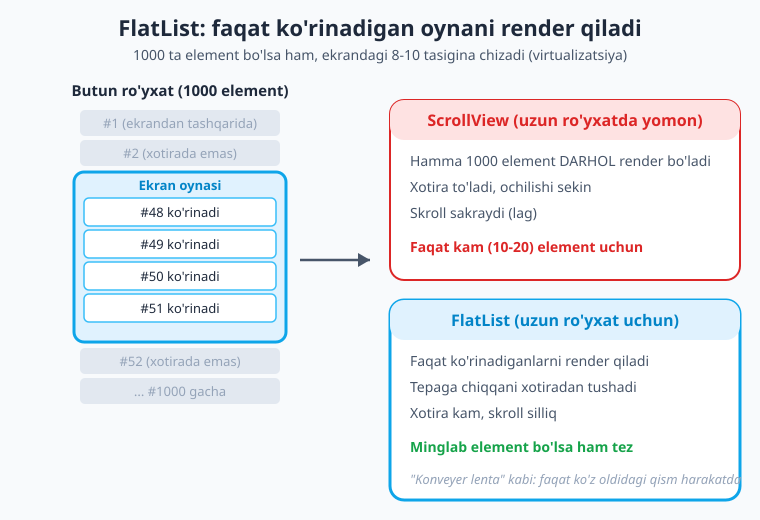
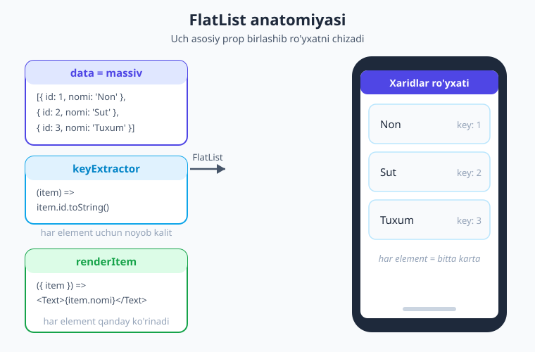
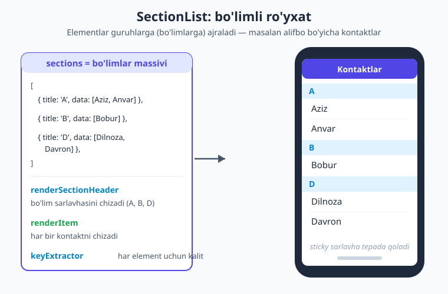

# 08 — Ro'yxatlar: FlatList va SectionList

[⬅️ Oldingi: 07 — ScrollView, SafeArea](./07-scrollview-safearea.md) · [🏠 Kitob boshi](./README.md) · [Keyingi: 09 — State va hodisalar ➡️](./09-state-hodisalar.md)

> **Bu bobda:** Uzun ro'yxatlarni (postlar, kontaktlar, mahsulotlar) qanday qilib **tez va xotira-tejamkor** ko'rsatishni o'rganamiz. `FlatList` virtualizatsiyasi nima, `data` / `renderItem` / `keyExtractor` qanday ishlaydi, bo'sh holat va separator qanday qo'shiladi, pull-to-refresh va cheksiz skroll qanday yoziladi, `SectionList` bilan bo'limli ro'yxat (alifbo bo'yicha kontaktlar) qanday quriladi va ro'yxatni tezlashtiradigan asosiy maslahatlar.

---

## Muammo: 1000 ta elementni qanday ko'rsatamiz?

Tasavvur qiling, siz Instagram'ga o'xshash ilova yozyapsiz. Foydalanuvchi tasmasida (lentasida) minglab post bor. Yoki telefoningizdagi kontaktlar ilovasini eslang — u yerda yuzlab, ba'zan minglab ism saqlangan.

O'tgan bobda (07) biz `ScrollView` bilan tanishdik. Tabiiy fikr shu: "Hamma postni `ScrollView` ichiga joylashtiraman, foydalanuvchi skroll qiladi". Keling, oddiy misolni ko'ramiz:

```tsx
// app/lenta.tsx — BU YOMON YONDASHUV (uzun ro'yxat uchun)
import { ScrollView, Text, View } from 'react-native';

const postlar = [/* ... 1000 ta post ... */];

export default function Lenta() {
  return (
    <ScrollView>
      {postlar.map((post) => (
        <View key={post.id}>
          <Text>{post.sarlavha}</Text>
        </View>
      ))}
    </ScrollView>
  );
}
```

Bu kod **ishlaydi**, lekin sekin. Nega? Chunki `ScrollView` ichidagi **hamma** elementni — ekranga sig'maydigan, foydalanuvchi hech qachon ko'rmasligi mumkin bo'lganlarini ham — **darhol** chizadi (render qiladi). 1000 ta `<View>` va `<Text>` bir vaqtda yaratiladi:

- Ilova ochilishi **sekinlashadi** (1000 ta element tayyorlanguncha kutasiz).
- **Xotira** to'ladi (1000 ta UI element xotirada turadi).
- Skroll **sakraydi**, lag beradi.

> **Hayotiy o'xshatish.** Tasavvur qiling, kutubxonachidan bitta kitob so'radingiz. U sizga 1000 ta kitobni bittadan emas, balki **hammasini birdan** stolingizga tashlasa — stol to'lib ketadi, kerakli kitobni topish qiyinlashadi. Aqlli kutubxonachi esa faqat **sizga hozir kerak bo'lganini** beradi, qolganini javonda saqlaydi. `FlatList` — aynan shunday aqlli kutubxonachi.

### Yechim: FlatList va virtualizatsiya

`FlatList` — bu uzun ro'yxatlar uchun maxsus komponent. U **virtualizatsiya** degan usulni qo'llaydi: faqat **ekranda hozir ko'rinadigan** (va biroz atrofdagi) elementlarni render qiladi. Foydalanuvchi pastga skroll qilsa, tepaga chiqib ketgan elementlar xotiradan tushadi, yangi ko'rinadiganlari render bo'ladi.

> **Hayotiy o'xshatish.** `FlatList` — zavoddagi **konveyer lenta** kabi. Ishchi (ekran) faqat ko'z oldidagi bir nechta buyumni ko'radi va ishlaydi. Lenta aylanadi: yangi buyumlar keladi, ishlangani ketadi. Hamma 1000 buyum bir vaqtda ishchining oldida turmaydi — faqat hozir kerak bo'lgani.



!!! tip "Qachon qaysi?"
    **Kam element (taxminan 10-20 tagacha, oldindan ma'lum, qisqa)** — `ScrollView` yetarli va soddaroq (masalan, sozlamalar sahifasi). **Uzun yoki noma'lum uzunlikdagi ro'yxat (postlar, kontaktlar, mahsulotlar)** — har doim `FlatList` (yoki `SectionList`). Shubha bo'lsa, `FlatList` ni tanlang.

---

## FlatList asoslari: uchta asosiy prop

`FlatList` ishlashi uchun unga kamida ikkita narsa kerak: **qaysi ma'lumotni** ko'rsatish (`data`) va **har bir element qanday ko'rinishi** (`renderItem`). Uchinchisi — `keyExtractor` — texnik jihatdan ixtiyoriy, lekin amalda deyarli har doim kerak. Keling, har birini ko'rib chiqamiz.



### 1. `data` — ko'rsatiladigan ma'lumotlar

`data` — bu **massiv**. Har bir element ro'yxatdagi bitta qator (yoki karta) bo'ladi. Odatda bu obyektlar massivi:

```tsx
const xaridlar = [
  { id: 1, nomi: 'Non' },
  { id: 2, nomi: 'Sut' },
  { id: 3, nomi: 'Tuxum' },
];
```

### 2. `renderItem` — har bir element qanday ko'rinadi

`renderItem` — bu **funksiya**. `FlatList` uni har bir element uchun chaqiradi va sizga ma'lumotni argument sifatida beradi. Argument — obyekt, uning ichida `item` xususiyati bor (bu — `data` massividagi joriy element):

```tsx
renderItem={({ item }) => <Text>{item.nomi}</Text>}
```

Bu yerda `{ item }` — **destrukturizatsiya** (obyektdan `item` ni ajratib olish). `FlatList` aslida funksiyaga `{ item, index, separators }` beradi; bizga ko'pincha faqat `item` kerak.

> **Eslatma.** React Native qoidasini unutmang: **matn har doim `<Text>` ichida** bo'lishi shart. `renderItem` ichida to'g'ridan-to'g'ri `{item.nomi}` yozsangiz (View yoki Text'siz), ilova qulaydi. Bu boshlovchilarning eng keng tarqalgan xatosi.

### 3. `keyExtractor` — har element uchun noyob kalit

`keyExtractor` — bu har element uchun **noyob (takrorlanmas) identifikator** (kalit, ya'ni key) qaytaradigan funksiya. U **string** qaytarishi kerak:

```tsx
keyExtractor={(item) => item.id.toString()}
```

**Nega bu muhim?** React har bir elementni o'ziga xos "tug'ilish guvohnomasi" bilan tanib oladi. Kalit yordamida React qaysi element o'zgardi, qaysi biri qo'shildi yoki o'chirildi — buni aniq biladi. Kalitsiz React har safar hammasini qaytadan chizishga majbur bo'ladi yoki noto'g'ri elementni yangilaydi (masalan, ro'yxat o'rtasidan element o'chirsangiz, noto'g'ri qator g'oyib bo'ladi).

!!! warning "Indeksni kalit qilmang"
    Vasvasaga tushib `keyExtractor={(item, index) => index.toString()}` deb yozmang. Indeks — elementning **o'rni**, uning **o'ziligi** emas. Ro'yxat tartibi o'zgarsa (saralash, element qo'shish/o'chirish), indekslar siljiydi va React noto'g'ri elementlarni chalkashtiradi. Har doim ma'lumotning **barqaror, noyob** maydonidan (odatda `id`) foydalaning.

### Birinchi to'liq FlatList

Mana uch propni birlashtirgan eng oddiy, ishlaydigan ro'yxat:

```tsx
// app/xaridlar.tsx
import { FlatList, Text, View, StyleSheet } from 'react-native';

const xaridlar = [
  { id: 1, nomi: 'Non' },
  { id: 2, nomi: 'Sut' },
  { id: 3, nomi: 'Tuxum' },
];

export default function Xaridlar() {
  return (
    <FlatList
      data={xaridlar}
      keyExtractor={(item) => item.id.toString()}
      renderItem={({ item }) => (
        <View style={styles.qator}>
          <Text style={styles.matn}>{item.nomi}</Text>
        </View>
      )}
    />
  );
}

const styles = StyleSheet.create({
  qator: { padding: 16, backgroundColor: '#ffffff' },
  matn: { fontSize: 16, color: '#1e293b' },
});
```

> **Eslatma (SDK 56).** Bu kitob misollarida qisqalik uchun `app/` yo'lini ishlatamiz. Sizning loyihangiz SDK 56 shabloni bo'lsa, fayllar `src/app/` ichida bo'ladi — **qoidalar aynan bir xil**, faqat papka nomi farq qiladi.

> **Eslatma.** `FlatList` o'zi skroll bo'ladi — uni `ScrollView` ichiga **solmang**. Aks hola virtualizatsiya buziladi va ogohlantirish (warning) chiqadi. `FlatList` allaqachon "skroll qiluvchi konteyner".

---

## Foydali proplar: header, footer, bo'sh holat, separator

Haqiqiy ilovada ro'yxat shunchaki qatorlardan iborat emas. Yuqorida sarlavha, qatorlar orasida ajratuvchi chiziq, ro'yxat bo'sh bo'lsa esa do'stona xabar kerak bo'ladi. `FlatList` bularning hammasi uchun tayyor proplar beradi.

### `ListHeaderComponent` va `ListFooterComponent`

Ro'yxatning **boshiga** (header) yoki **oxiriga** (footer) qo'shiladigan komponent. Header — ko'pincha sarlavha yoki qidiruv maydoni; footer — "Ko'proq yuklash" tugmasi yoki yuklanish indikatori:

```tsx
<FlatList
  data={postlar}
  keyExtractor={(item) => item.id.toString()}
  renderItem={({ item }) => <PostQatori post={item} />}
  ListHeaderComponent={<Text style={styles.sarlavha}>So'nggi postlar</Text>}
  ListFooterComponent={<Text style={styles.footer}>Tugadi 🎉</Text>}
/>
```

!!! tip "Header — ro'yxat bilan birga skroll bo'ladi"
    `ListHeaderComponent` ro'yxat ustida turadi va u **bilan birga** yuqoriga skroll bo'lib ketadi. Agar sarlavhani doimo ekran tepasida (qotirilgan) ushlab turmoqchi bo'lsangiz, uni `FlatList`dan **tashqarida**, alohida `<View>` ichiga qo'ying.

### `ItemSeparatorComponent` — elementlar orasidagi ajratgich

Bu komponent **har ikki element orasiga** qo'yiladi (birinchidan oldin va oxirgidan keyin emas — aynan oralarda). Ko'pincha nozik chiziq yoki bo'shliq:

```tsx
function Ajratgich() {
  return <View style={{ height: 1, backgroundColor: '#e2e8f0' }} />;
}

<FlatList
  data={postlar}
  keyExtractor={(item) => item.id.toString()}
  renderItem={({ item }) => <PostQatori post={item} />}
  ItemSeparatorComponent={Ajratgich}
/>
```

!!! note "Komponent uzatishning ikki usuli"
    `ItemSeparatorComponent` ga komponentni **funksiya sifatida** (`{Ajratgich}` — JSX'siz) berasiz, `ListHeaderComponent` ga esa odatda **JSX element** (`{<Text>...</Text>}`) yoki funksiya berishingiz mumkin. Ikkalasi ham ishlaydi; misollarda har ikkala uslubni ko'rasiz.

### `ListEmptyComponent` — bo'sh holat

`data` massivi **bo'sh** (`[]`) bo'lganda ko'rsatiladigan komponent. Bu juda muhim: bo'sh ekran foydalanuvchini chalg'itadi ("ilova buzilganmi?"). Yaxshi ilova bo'sh holatni do'stona tushuntiradi:

```tsx
function BoshHolat() {
  return (
    <View style={styles.bosh}>
      <Text style={styles.boshMatn}>Hozircha post yo'q</Text>
      <Text style={styles.boshKichik}>Birinchi postni siz yozing!</Text>
    </View>
  );
}

<FlatList
  data={postlar}
  keyExtractor={(item) => item.id.toString()}
  renderItem={({ item }) => <PostQatori post={item} />}
  ListEmptyComponent={BoshHolat}
/>
```

### `numColumns` — grid (panjara) ko'rinishi

Ro'yxatni bir ustun emas, **bir necha ustun** (grid) qilib ko'rsatish uchun `numColumns` ni bering. Bu fotogalereya yoki mahsulot panjarasi uchun ideal:

```tsx
<FlatList
  data={rasmlar}
  numColumns={2}
  keyExtractor={(item) => item.id.toString()}
  columnWrapperStyle={{ gap: 12 }}
  renderItem={({ item }) => (
    <View style={styles.katak}>
      <Text>{item.nomi}</Text>
    </View>
  )}
/>
```

`columnWrapperStyle` — bir qatordagi ustunlar orasidagi masofa va tekislash uchun. Element stilida `flex: 1` ishlatsangiz, ustunlar ekran kengligini teng bo'lishadi.

!!! warning "numColumns o'zgartirilsa"
    `numColumns` ni dinamik o'zgartirmoqchi bo'lsangiz (masalan, ekran burilganda 2 dan 3 ga), `FlatList` ga `key` prop berib uni qaytadan yaratish kerak bo'ladi. Aks holda ogohlantirish chiqadi.

### `horizontal` — yotiq ro'yxat

`horizontal` propi ro'yxatni **yon tomonga** (yotiq) skroll qiladigan qiladi — "stories" yoki "tavsiya etilgan mahsulotlar" lentasi kabi:

```tsx
<FlatList
  data={tavsiyalar}
  horizontal
  showsHorizontalScrollIndicator={false}
  keyExtractor={(item) => item.id.toString()}
  renderItem={({ item }) => <TavsiyaKarta mahsulot={item} />}
/>
```

---

## Pull-to-refresh: pastga torting va yangilang

Mobil ilovalarda juda tanish harakat: ro'yxat tepasida turib **pastga torting** — ro'yxat yangilanadi (yangi postlar yuklanadi). Buni "pull-to-refresh" deyiladi.

> **Hayotiy o'xshatish.** Bu — oynani pastga tushirib, yangi havodan nafas olishga o'xshaydi. Foydalanuvchi "menga eng so'nggi ma'lumotni ber" deydi, ilova esa serverdan yangilarini olib keladi.

`FlatList` da buni ikki prop bilan qilamiz:

- `refreshing` — **boolean**. `true` bo'lsa, aylanuvchi indikator (spinner) ko'rinadi.
- `onRefresh` — **funksiya**. Foydalanuvchi pastga tortganda chaqiriladi; bu yerda ma'lumotni yangilaysiz.

```tsx
// app/lenta.tsx
import { useState, useCallback } from 'react';
import { FlatList, Text, View, StyleSheet } from 'react-native';

type Post = { id: number; sarlavha: string };

export default function Lenta() {
  const [postlar, setPostlar] = useState<Post[]>([]);
  const [yangilanmoqda, setYangilanmoqda] = useState(false);

  const yangilash = useCallback(async () => {
    setYangilanmoqda(true);          // spinnerni yoqamiz
    // haqiqiy ilovada bu yerda serverdan ma'lumot olamiz (17-bob)
    const yangi = await soxtaYukla();
    setPostlar(yangi);
    setYangilanmoqda(false);         // spinnerni o'chiramiz
  }, []);

  return (
    <FlatList
      data={postlar}
      keyExtractor={(item) => item.id.toString()}
      renderItem={({ item }) => (
        <View style={styles.qator}>
          <Text>{item.sarlavha}</Text>
        </View>
      )}
      refreshing={yangilanmoqda}
      onRefresh={yangilash}
    />
  );
}

// namuna: 1 soniyada soxta ma'lumot qaytaradi
function soxtaYukla(): Promise<Post[]> {
  return new Promise((resolve) =>
    setTimeout(
      () => resolve([
        { id: 1, sarlavha: 'Yangilangan post 1' },
        { id: 2, sarlavha: 'Yangilangan post 2' },
      ]),
      1000,
    ),
  );
}

const styles = StyleSheet.create({
  qator: { padding: 16, borderBottomWidth: 1, borderBottomColor: '#e2e8f0' },
});
```

!!! tip "Tarmoq keyinroq"
    Bu yerda serverdan haqiqiy ma'lumot olishni `soxtaYukla` bilan taqlid qildik. Haqiqiy `fetch`/API bilan ishlashni **17-bobda** (Tarmoq va API) batafsil o'rganamiz.

---

## Cheksiz skroll (infinite scroll): pastga yetganda ko'proq yukla

Ijtimoiy tarmoqlarda postlar "tugamaydi" — pastga skroll qilaverasiz, yangi postlar yuklanaveradi. Bu — **cheksiz skroll** (yoki "lazy loading", ya'ni asta-sekin yuklash). Bir vaqtda hamma postni yuklash o'rniga, ro'yxat oxiriga yaqinlashganda keyingi "sahifani" yuklaymiz.

`FlatList` da ikkita prop:

- `onEndReached` — **funksiya**. Foydalanuvchi ro'yxat **oxiriga** yaqinlashganda chaqiriladi; bu yerda keyingi qismni yuklaysiz.
- `onEndReachedThreshold` — **raqam (0 dan 1 gacha)**. Oxirgacha qancha qolganda `onEndReached` ishga tushishini belgilaydi. `0.5` — ro'yxat oxiriga yarim ekran qolganda. `0.1` — deyarli tagiga yetganda.

```tsx
const [postlar, setPostlar] = useState<Post[]>(boshlangichPostlar);
const [koproqYuklanmoqda, setKoproqYuklanmoqda] = useState(false);

const koproqYukla = useCallback(async () => {
  if (koproqYuklanmoqda) return;     // ikki marta yuklamaslik
  setKoproqYuklanmoqda(true);
  const keyingiSahifa = await sahifaYukla(postlar.length);
  setPostlar((avval) => [...avval, ...keyingiSahifa]);  // qo'shamiz
  setKoproqYuklanmoqda(false);
}, [postlar.length, koproqYuklanmoqda]);

<FlatList
  data={postlar}
  keyExtractor={(item) => item.id.toString()}
  renderItem={({ item }) => <PostQatori post={item} />}
  onEndReached={koproqYukla}
  onEndReachedThreshold={0.5}
  ListFooterComponent={
    koproqYuklanmoqda ? <ActivityIndicator /> : null
  }
/>
```

E'tibor bering: yangi postlarni **qo'shamiz** (`[...avval, ...keyingiSahifa]`), almashtirmaymiz. Eski postlar joyida qoladi, tagiga yangilari ulanadi.

!!! warning "Ikki marta chaqirilishidan ehtiyot bo'ling"
    `onEndReached` ba'zan bir necha marta ketma-ket chaqirilishi mumkin. Yuqoridagi `if (koproqYuklanmoqda) return;` qatori — bir vaqtda faqat bitta yuklash ketishini ta'minlovchi oddiy "qulf". Busiz bir xil postlar ikki marta yuklanib qolishi mumkin.

---

## SectionList: bo'limli ro'yxat

Ba'zan ro'yxatni **guruhlarga** ajratish kerak. Klassik misol — telefon kontaktlari: ismlar alifbo bo'yicha bo'limlarga ajraladi (A bo'limi, B bo'limi, D bo'limi...), har bo'lim ustida harf-sarlavha turadi. Yana misollar: kunlar bo'yicha guruhlangan vazifalar, kategoriyalar bo'yicha mahsulotlar, sanalar bo'yicha xabarlar.

Buning uchun `FlatList` emas, **`SectionList`** ishlatiladi. U ham virtualizatsiyalangan (tez), faqat ma'lumot tuzilishi va proplari biroz boshqacha.



### `sections` — bo'limlar massivi

`FlatList` da `data` oddiy massiv edi. `SectionList` da esa **`sections`** — bu **bo'limlar** massivi. Har bir bo'lim — obyekt, uning ichida ikkita maydon:

- `title` — bo'lim sarlavhasi (masalan, harf "A").
- `data` — shu bo'limdagi elementlar massivi.

```tsx
const bolimlar = [
  { title: 'A', data: [{ id: 'a1', ism: 'Aziz' }, { id: 'a2', ism: 'Anvar' }] },
  { title: 'B', data: [{ id: 'b1', ism: 'Bobur' }] },
  { title: 'D', data: [{ id: 'd1', ism: 'Dilnoza' }, { id: 'd2', ism: 'Davron' }] },
];
```

### `renderItem` va `renderSectionHeader`

`SectionList` ikkita render funksiyasini kutadi:

- `renderItem={({ item }) => ...}` — har bir **element** (kontakt) qanday ko'rinadi (`FlatList` dagi kabi).
- `renderSectionHeader={({ section }) => ...}` — har bir **bo'lim sarlavhasi** qanday ko'rinadi. Bu yerda `section` — joriy bo'lim obyekti, undan `section.title` ni olasiz.

```tsx
// app/kontaktlar.tsx
import { SectionList, Text, View, StyleSheet } from 'react-native';

type Kontakt = { id: string; ism: string };

const bolimlar = [
  { title: 'A', data: [{ id: 'a1', ism: 'Aziz' }, { id: 'a2', ism: 'Anvar' }] },
  { title: 'B', data: [{ id: 'b1', ism: 'Bobur' }] },
  { title: 'D', data: [{ id: 'd1', ism: 'Dilnoza' }, { id: 'd2', ism: 'Davron' }] },
];

export default function Kontaktlar() {
  return (
    <SectionList
      sections={bolimlar}
      keyExtractor={(item) => item.id}
      renderItem={({ item }) => (
        <Text style={styles.kontakt}>{item.ism}</Text>
      )}
      renderSectionHeader={({ section }) => (
        <Text style={styles.bolimSarlavha}>{section.title}</Text>
      )}
    />
  );
}

const styles = StyleSheet.create({
  kontakt: { fontSize: 16, color: '#1e293b', paddingVertical: 10, paddingHorizontal: 16 },
  bolimSarlavha: {
    fontSize: 14,
    fontWeight: '700',
    color: '#0284c7',
    backgroundColor: '#e0f2fe',
    paddingVertical: 6,
    paddingHorizontal: 16,
  },
});
```

!!! tip "Sticky (yopishqoq) sarlavhalar"
    `SectionList` da bo'lim sarlavhalari sukut bo'yicha (default) **yopishqoq** — siz skroll qilganda joriy bo'lim sarlavhasi ekran tepasida turib qoladi, keyingi bo'lim kelguncha. Buni o'chirmoqchi bo'lsangiz: `stickySectionHeadersEnabled={false}`.

> **Eslatma.** `SectionList` ham `FlatList` ning ko'p proplarini qo'llaydi: `ItemSeparatorComponent`, `ListEmptyComponent`, `ListHeaderComponent`, `refreshing`/`onRefresh`, `onEndReached`. Ya'ni biz yuqorida o'rganganlarning aksariyati bu yerda ham ishlaydi.

---

## Element komponentini ajratish (qayta ishlatish + memo)

Hozirgacha `renderItem` ichiga JSX'ni to'g'ridan-to'g'ri yozdik. Ro'yxat elementi murakkablashganda (rasm, sarlavha, matn, tugmalar) bu funksiya katta va chalkash bo'lib ketadi. Yaxshi yechim — har bir elementni **alohida komponentga** ajratish:

```tsx
// components/PostKarta.tsx
import { View, Text, Pressable, StyleSheet } from 'react-native';

type Post = { id: number; sarlavha: string; muallif: string };

type Props = {
  post: Post;
  onPress: (id: number) => void;
};

function PostKarta({ post, onPress }: Props) {
  return (
    <Pressable style={styles.karta} onPress={() => onPress(post.id)}>
      <Text style={styles.sarlavha}>{post.sarlavha}</Text>
      <Text style={styles.muallif}>Muallif: {post.muallif}</Text>
    </Pressable>
  );
}

const styles = StyleSheet.create({
  karta: { backgroundColor: '#ffffff', borderRadius: 12, padding: 16 },
  sarlavha: { fontSize: 16, fontWeight: '700', color: '#1e293b' },
  muallif: { fontSize: 13, color: '#475569', marginTop: 4 },
});

export default PostKarta;
```

Bunday ajratishning ikkita foydasi bor:

1. **Qayta ishlatish** — bir xil karta boshqa ekranlarda ham kerak bo'lsa, tayyor.
2. **Tezlik (memoizatsiya)** — komponentni `React.memo` bilan o'rab, keraksiz qayta render'larning oldini olamiz.

### `React.memo` nima qiladi?

`React.memo` — bu komponentni "o'rab" beradigan funksiya. U komponentga **props o'zgarmasa, qayta render qilma** deydi. Ro'yxatlarda bu juda muhim: bitta element o'zgarganda, qolgan yuzlab elementlar behuda qaytadan chizilmasligi kerak.

```tsx
import { memo } from 'react';

const PostKarta = memo(function PostKarta({ post, onPress }: Props) {
  // ... yuqoridagi kabi
});
```

Endi `post` va `onPress` o'zgarmasa, bu karta qayta render bo'lmaydi.

!!! warning "memo va funksiya proplari"
    `React.memo` faqat props **bir xil** bo'lsa ishlaydi. Lekin `renderItem` ichida har render'da **yangi funksiya** yaratsangiz (masalan, `onPress={() => ...}`), `onPress` har safar "yangi" hisoblanadi va memo foydasiz bo'ladi. Yechim: funksiyani `useCallback` bilan o'rab, barqaror qiling. Buni quyidagi to'liq misolda ko'rasiz.

---

## To'liq misol: postlar ro'yxati

Endi hamma narsani birlashtiramiz: ajratilgan + memoizatsiya qilingan element komponenti, separator, header, bo'sh holat, pull-to-refresh va `useCallback` bilan barqaror funksiyalar. Bu kod jonli Expo loyihada `tsc` bilan tip-tekshiruvidan o'tgan.

```tsx
// app/postlar.tsx
import { useState, useCallback, memo } from 'react';
import {
  FlatList,
  View,
  Text,
  Pressable,
  StyleSheet,
  type ListRenderItemInfo,
} from 'react-native';

type Post = { id: number; sarlavha: string; muallif: string };

const BOSHLANGICH: Post[] = [
  { id: 1, sarlavha: 'React Native nima?', muallif: 'Oqil' },
  { id: 2, sarlavha: 'FlatList sirlari', muallif: 'Dilnoza' },
  { id: 3, sarlavha: 'Expo bilan tezkor start', muallif: 'Sardor' },
];

// ── Element komponenti (ajratilgan + memo) ──
type KartaProps = { post: Post; onPress: (id: number) => void };

const PostKarta = memo(function PostKarta({ post, onPress }: KartaProps) {
  return (
    <Pressable style={styles.karta} onPress={() => onPress(post.id)}>
      <Text style={styles.kartaSarlavha}>{post.sarlavha}</Text>
      <Text style={styles.kartaMuallif}>Muallif: {post.muallif}</Text>
    </Pressable>
  );
});

// ── Yordamchi komponentlar ──
function Ajratgich() {
  return <View style={styles.ajratgich} />;
}

function BoshHolat() {
  return (
    <View style={styles.bosh}>
      <Text style={styles.boshMatn}>Hozircha post yo'q</Text>
    </View>
  );
}

// ── Asosiy ekran ──
export default function Postlar() {
  const [postlar, setPostlar] = useState<Post[]>(BOSHLANGICH);
  const [yangilanmoqda, setYangilanmoqda] = useState(false);

  // pull-to-refresh
  const yangilash = useCallback(() => {
    setYangilanmoqda(true);
    setTimeout(() => {
      setPostlar(BOSHLANGICH);
      setYangilanmoqda(false);
    }, 1000);
  }, []);

  // element bosilganda — barqaror funksiya (memo ishlashi uchun)
  const ochish = useCallback((id: number) => {
    console.log('Post bosildi:', id);
  }, []);

  // renderItem — useCallback bilan barqaror
  const renderItem = useCallback(
    ({ item }: ListRenderItemInfo<Post>) => (
      <PostKarta post={item} onPress={ochish} />
    ),
    [ochish],
  );

  return (
    <FlatList
      data={postlar}
      keyExtractor={(item) => item.id.toString()}
      renderItem={renderItem}
      ItemSeparatorComponent={Ajratgich}
      ListHeaderComponent={<Text style={styles.sarlavha}>So'nggi postlar</Text>}
      ListEmptyComponent={BoshHolat}
      refreshing={yangilanmoqda}
      onRefresh={yangilash}
      contentContainerStyle={styles.konteyner}
    />
  );
}

const styles = StyleSheet.create({
  konteyner: { padding: 16 },
  sarlavha: { fontSize: 22, fontWeight: '700', color: '#1e293b', marginBottom: 16 },
  karta: { backgroundColor: '#ffffff', borderRadius: 12, padding: 16 },
  kartaSarlavha: { fontSize: 16, fontWeight: '700', color: '#1e293b' },
  kartaMuallif: { fontSize: 13, color: '#475569', marginTop: 4 },
  ajratgich: { height: 12 },
  bosh: { padding: 40, alignItems: 'center' },
  boshMatn: { fontSize: 16, color: '#94a3b8' },
});
```

Bu misolda diqqat qiling:

- `ListRenderItemInfo<Post>` — `renderItem` argumentining **tipi** (`react-native` dan). TypeScript yordamida `item` ning tipini aniq belgilaydi.
- `contentContainerStyle` — bu ro'yxatning **ichki** stili (padding shu yerda). `style` esa konteynerning **tashqi** o'lchamiga ta'sir qiladi. Padding kerak bo'lsa, `contentContainerStyle` ishlating.
- `ochish` va `renderItem` `useCallback` bilan o'ralgan — shuning uchun `PostKarta` ning `memo` si haqiqatan ishlaydi.

---

## Performance maslahatlari

`FlatList` o'zi tez, lekin uzun ro'yxatlarni yanada silliq qilish uchun bir nechta amal bor. Bularni endi qisqacha tanishtirib o'tamiz; chuqur **27-bobda** (Performance) qaytamiz.

!!! tip "Asosiy maslahatlar"
    1. **`keyExtractor` ni har doim bering** — indeks emas, barqaror `id`. Bu eng muhim qoida.
    2. **Element komponentini ajrating va `React.memo` qiling** — keraksiz qayta render'lar kamayadi.
    3. **`renderItem` va element'ga uzatiladigan funksiyalarni `useCallback` qiling** — memo ishlashi uchun.
    4. **`getItemLayout`** — agar har bir element **bir xil balandlikda** bo'lsa, `FlatList` ga balandlikni oldindan ayting. Shunda u har birini o'lchashga vaqt sarflamaydi va skroll tezroq bo'ladi.
    5. **`initialNumToRender`** — birinchi marta nechta element render qilinishi. Birinchi ekran sig'imicha qiymat (masalan, 10) — ortig'ini render qilmaslik ilova ochilishini tezlashtiradi.

`getItemLayout` ko'rinishi (har element 64px balandlikda deylik):

```tsx
const BALANDLIK = 64;

<FlatList
  data={postlar}
  keyExtractor={(item) => item.id.toString()}
  renderItem={renderItem}
  getItemLayout={(_, index) => ({
    length: BALANDLIK,           // har element balandligi
    offset: BALANDLIK * index,   // shu elementgacha bo'lgan masofa
    index,
  })}
/>
```

!!! warning "getItemLayout faqat bir xil balandlik uchun"
    `getItemLayout` ni **faqat** har bir element balandligi **aniq bir xil** bo'lsa ishlating. Agar elementlar turli balandlikda bo'lsa (masalan, har xil uzunlikdagi matn), `getItemLayout` noto'g'ri hisoblaydi va skroll buziladi.

---

## Xulosa

- **Uzun ro'yxatlar uchun `ScrollView` emas, `FlatList`** ishlating. `ScrollView` hamma elementni darhol render qiladi (sekin, xotira to'ladi); `FlatList` faqat ekranda ko'rinadiganlarni render qiladi (**virtualizatsiya** — "konveyer lenta").
- `FlatList` ning uchta asosi: **`data`** (massiv), **`renderItem`** (`({ item }) => ...`), **`keyExtractor`** (`(item) => item.id.toString()` — barqaror, noyob kalit; indeks emas!).
- Matn har doim **`<Text>` ichida** — `renderItem` ichida ham bu qoida amal qiladi.
- Foydali proplar: **`ListEmptyComponent`** (bo'sh holat), **`ListHeaderComponent`/`ListFooterComponent`**, **`ItemSeparatorComponent`**, **`numColumns`** (grid), **`horizontal`** (yotiq).
- **Pull-to-refresh**: `refreshing={boolean}` + `onRefresh={funksiya}`. **Cheksiz skroll**: `onEndReached` + `onEndReachedThreshold` (yangi elementlarni qo'shing, almashtirmang).
- **`SectionList`** — bo'limli ro'yxat (alifbo bo'yicha kontaktlar): `sections` (`{ title, data }` massivi) + `renderSectionHeader`. Sarlavhalar default yopishqoq (sticky).
- **Tezlik uchun**: element komponentini ajrating + `React.memo`, funksiyalarni `useCallback`, bir xil balandlikda `getItemLayout`, `initialNumToRender`. Chuqurroq — 27-bobda.

---

## Amaliy mashqlar

1. **Xaridlar ro'yxati (oson).** `FlatList` bilan 5-6 mahsulotdan iborat xaridlar ro'yxati yarating. Har element — `<View>` ichida mahsulot nomi va narxi. `keyExtractor` va `ItemSeparatorComponent` (nozik chiziq) qo'shing. Ro'yxat bo'sh bo'lganda "Savatcha bo'sh" degan `ListEmptyComponent` ko'rsating (`data` ni vaqtincha `[]` qilib sinab ko'ring).

2. **Postlar va pull-to-refresh (o'rta).** Postlar ro'yxatini tuzing. Element komponentini alohida fayl/komponentga ajrating va `React.memo` bilan o'rang. Pastga tortilganda (`refreshing` + `onRefresh`) ro'yxat boshiga yangi post **qo'shilsin** (masalan, `setTimeout` bilan 1 soniyada). `useCallback` to'g'ri ishlatilganini tekshiring.

3. **Alifbo bo'yicha kontaktlar (o'rta).** `SectionList` bilan kontaktlar ilovasi yarating: kamida 3 ta bo'lim (A, B, D), har bo'limda 2-3 ismdan. `renderSectionHeader` da harfni ko'k fon bilan ko'rsating. Keyin: oddiy ismlar massividan (bo'limsiz) bo'limlarni **avtomatik** hosil qiluvchi funksiya yozing (har ismning birinchi harfi bo'yicha guruhlang).

4. **Grid galereya (qiyin).** `numColumns={2}` bilan rang kartalari panjarasini yarating (har element — rangli kvadrat va uning nomi). `columnWrapperStyle` bilan ustunlar orasiga masofa qo'ying, element stilida `flex: 1` ishlatib ustunlarni tenglashtiring. Bonus: ekran kengligi (`useWindowDimensions`, 05-bobdan) 600px dan katta bo'lsa, `numColumns` ni 3 ga o'zgartiring (`FlatList` ga `key` berishni unutmang).

5. **Cheksiz skroll (qiyin).** Postlar ro'yxatiga `onEndReached` qo'shing: tagiga yetganda 10 ta yangi post **qo'shilsin** (`setTimeout` bilan soxta yuklash). Bir vaqtda faqat bitta yuklash ketishini ta'minlovchi "qulf" (`if (yuklanmoqda) return`) yozing va `ListFooterComponent` da yuklanish indikatori (`ActivityIndicator`) ko'rsating.

---

[⬅️ Oldingi: 07 — ScrollView, SafeArea](./07-scrollview-safearea.md) · [🏠 Kitob boshi](./README.md) · [Keyingi: 09 — State va hodisalar ➡️](./09-state-hodisalar.md)
