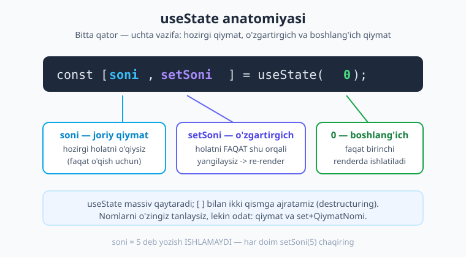
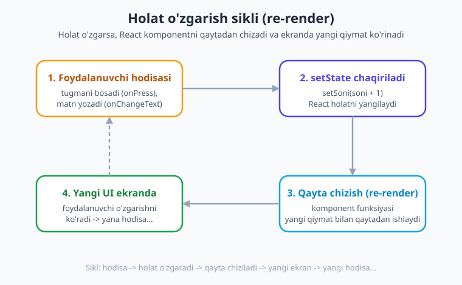
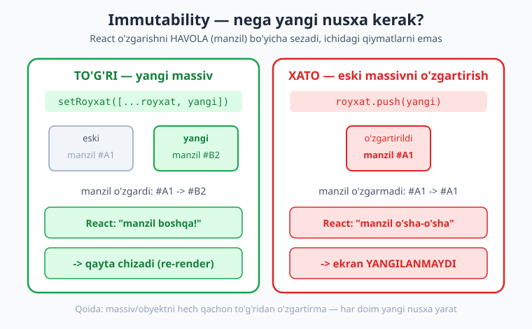

# 09 — State (holat) va hodisalar

[⬅️ Oldingi: 08 — Ro'yxatlar: FlatList](./08-royxatlar-flatlist.md) · [🏠 Kitob boshi](./README.md) · [Keyingi: 10 — Props va kompozitsiya ➡️](./10-props-kompozitsiya.md)

> **Bu bobda:** Komponentlarni "tirik" qiladigan eng muhim tushuncha — **holat (state)** bilan tanishamiz. `useState` hookini bo'lak-bo'lak o'rganamiz, holatni to'g'ri o'zgartirish qoidalarini, **immutability** (massiv/obyektni o'zgartirmaslik) sirini va hodisalarni (bosish, matn yozish) ko'rib chiqamiz. Oxirida hamma bilimni birlashtirib **vazifalar ro'yxati (todo)** ilovasini quramiz.

---

## Komponentning "xotirasi" nima?

Avvalgi boblarda biz ekranga matn, tugma, ro'yxat chizdik. Lekin ularning hammasi **harakatsiz** edi: bir marta chizilib, qotib qolardi. Tugmani bosganda son o'zgarmadi, inputga yozganda hech narsa eslab qolinmadi.

Haqiqiy ilovada esa hamma narsa **o'zgaradi**: hisoblagich oshadi, foydalanuvchi inputga yozadi, ro'yxatga yangi element qo'shiladi, tugma "yoniq/o'chiq" holatga o'tadi. Bu o'zgaruvchan ma'lumotni qayerda saqlash kerak? Aynan shu yerda **holat (state)** kerak bo'ladi.

> **Hayotiy o'xshatish.** Holatni komponentning **xotirasi** yoki **kayfiyati** deb tasavvur qiling. Odam kayfiyati o'zgarsa — yuz ifodasi o'zgaradi. Komponent holati o'zgarsa — uning ko'rinishi (ekrandagi UI) o'zgaradi. Holat — bu komponent "eslab turadigan" va vaqt o'tishi bilan o'zgaradigan ma'lumot.

**Holat (state)** — bu komponent ichida saqlanadigan, vaqt o'tishi bilan o'zgarib turadigan ma'lumot. Masalan:

- hisoblagichdagi **son** (0, 1, 2, 3...),
- input maydoniga yozilgan **matn**,
- tugma **yoniqmi yoki o'chiq** (boolean),
- vazifalar **ro'yxati** (massiv),
- foydalanuvchi **profili** (obyekt).

Eng muhim sehr shundaki: **holat o'zgarsa, React komponentni avtomatik qaytadan chizadi (re-render)** va ekranda yangi qiymat ko'rinadi. Sizning vazifangiz — faqat holatni o'zgartirish; ekranni yangilashni React o'zi qiladi.

> **Hayotiy o'xshatish.** Bu xuddi raqamli sport tablosi kabi: siz tablodagi har bir lampochkani qo'lda yoqib-o'chirmaysiz. Siz faqat **hisobni** o'zgartirasiz ("2:1 bo'ldi"), tablo esa o'zini yangi hisobga moslab qayta yoritadi. React — bu sizning tablongiz.

---

## `useState` — holat yaratish

React'da holat yaratish uchun **`useState`** nomli **hook** ishlatiladi.

> **Eslatma.** **Hook** (ya'ni "ilgak") — bu komponentga qo'shimcha imkoniyat (masalan, holat yoki yon ta'sir) "ilib" beradigan maxsus funksiya. Nomlari `use` bilan boshlanadi: `useState`, `useEffect` va h.k. Hooklar haqida 11–13-boblarda batafsil gaplashamiz; hozircha `useState` yetarli.

Eng oddiy hisoblagichni ko'raylik:

```tsx
// app/index.tsx
import { View, Text, Pressable, StyleSheet } from 'react-native';
import { useState } from 'react';

export default function Index() {
  // soni — joriy qiymat, setSoni — uni o'zgartirgich, 0 — boshlang'ich qiymat
  const [soni, setSoni] = useState(0);

  return (
    <View style={styles.box}>
      <Text style={styles.matn}>Bosildi: {soni}</Text>
      <Pressable style={styles.tugma} onPress={() => setSoni(soni + 1)}>
        <Text style={styles.tugmaMatn}>+1</Text>
      </Pressable>
    </View>
  );
}

const styles = StyleSheet.create({
  box: { flex: 1, alignItems: 'center', justifyContent: 'center', gap: 16 },
  matn: { fontSize: 24, fontWeight: '700', color: '#1e293b' },
  tugma: { backgroundColor: '#4f46e5', paddingVertical: 12, paddingHorizontal: 28, borderRadius: 10 },
  tugmaMatn: { color: '#fff', fontWeight: '600', fontSize: 16 },
});
```

Tugmani bosganingizda son birga oshib boradi va ekranda yangilanadi. Bu — birinchi "tirik" komponentingiz! Endi har bir bo'lakni alohida tushunaylik.

### `useState` qatorini bo'lib o'rganamiz

```tsx
const [soni, setSoni] = useState(0);
```

Bu bir qator uchta ish qiladi:



1. **`useState(0)`** — holatni yaratadi va unga **boshlang'ich qiymat** (bu yerda `0`) beradi. Bu boshlang'ich qiymat **faqat birinchi marta** (komponent ekranga birinchi chizilganda) ishlatiladi. Keyingi chizishlarda React saqlangan qiymatni eslab turadi.
2. **`soni`** — holatning **joriy (hozirgi) qiymati**. Uni faqat **o'qiysiz** (JSX ichida ko'rsatasiz, hisob-kitobda ishlatasiz). To'g'ridan o'zgartirib bo'lmaydi.
3. **`setSoni`** — holatni **o'zgartiradigan funksiya**. Holatni yangilashning **yagona to'g'ri yo'li** shu. Uni chaqirganingizda React holatni yangilaydi **va** komponentni qaytadan chizadi.

> **Eslatma.** `useState` aslida ikki elementli **massiv** qaytaradi: `[joriyQiymat, ozgartirgichFunksiya]`. Biz uni `[soni, setSoni]` deb ikkita o'zgaruvchiga ajratib olamiz — bu **destructuring** (massivni qismlarga ajratish) deyiladi. Nomlarni o'zingiz tanlaysiz, lekin o'rnatilgan odat: qiymat `xxx`, o'zgartirgich `setXxx`.

!!! tip "Maslahat"
    `useState` ni **komponent funksiyasining eng yuqorisida** (boshqa kod boshlanishidan oldin) chaqiring. Uni `if` ichida, sikl ichida yoki funksiya ichidagi funksiyada chaqirmang — bu hooklarning oltin qoidasi. Sababini 12-bobda ko'ramiz.

---

## Holatni qanday o'zgartiriladi?

Bu — yangi boshlovchilar eng ko'p adashadigan joy, shuning uchun diqqat bilan o'qing.

**Holatni faqat `setXxx` funksiyasi orqali o'zgartiring.** To'g'ridan o'zgaruvchiga qiymat berish **ISHLAMAYDI**:

```tsx
// ❌ XATO — bunday qilmang
soni = soni + 1; // React bu o'zgarishni BILMAYDI, ekran yangilanmaydi

// ✅ TO'G'RI
setSoni(soni + 1); // React holatni yangilaydi VA qayta chizadi
```

> **Hayotiy o'xshatish.** Tasavvur qiling, siz pochta orqali manzilingizni o'zgartirmoqchisiz. Uy devoridagi manzil yozuvini bo'yab o'zgartirsangiz (`soni = ...`), pochtachi buni bilmaydi — xatlar baribir eski manzilga keladi. To'g'ri yo'l — pochta bo'limiga **rasmiy ariza topshirish** (`setSoni(...)`): shunda tizim o'zgarishdan xabardor bo'ladi. `setSoni` — bu sizning "rasmiy aytishingiz".

### Holat o'zgarish sikli

Tugma bosishdan ekran yangilanishigacha bo'lgan jarayon doimo bir xil siklda kechadi:



1. **Foydalanuvchi hodisasi** — tugmani bosadi (`onPress`) yoki matn yozadi (`onChangeText`).
2. **`setState` chaqiriladi** — siz `setSoni(soni + 1)` deysiz, React yangi qiymatni eslab qoladi.
3. **Qayta chizish (re-render)** — React komponent funksiyasini **yangi qiymat bilan** boshidan ishga tushiradi.
4. **Yangi UI ekranda** — foydalanuvchi yangilangan sonni ko'radi. Yana bosishi mumkin — sikl takrorlanadi.

Siz faqat 1 va 2-qadamlarni yozasiz; 3 va 4-qadamlarni React o'zi bajaradi.

### To'g'ridan yangilash vs funksional yangilash

`setSoni` ga ikki xil narsa berish mumkin:

```tsx
// 1) To'g'ridan yangi qiymat
setSoni(soni + 1);

// 2) Funksional yangilash — oldingi qiymatdan yangisini hisoblovchi funksiya
setSoni((oldingi) => oldingi + 1);
```

Ko'pincha ikkalasi bir xil natija beradi. Lekin **bir nechta yangilanish ketma-ket bo'lganda** farq paydo bo'ladi. Quyidagi kodga qarang:

```tsx
// ❌ Kutilmagan natija: faqat BIR marta oshadi (3 emas)
const ucMartaOshir = () => {
  setSoni(soni + 1);
  setSoni(soni + 1);
  setSoni(soni + 1);
};
```

Nega? Chunki bitta hodisa ichida `soni` o'zgarmaydi — uchchala qatorda ham `soni` o'sha eski qiymatda qoladi (masalan, 0), shuning uchun uchchalasi ham `0 + 1 = 1` ni o'rnatadi. Natijada son faqat 1 ga oshadi.

To'g'ri yechim — **funksional yangilash**, chunki u har safar **eng so'nggi** qiymatni oladi:

```tsx
// ✅ To'g'ri: 3 marta oshadi
const ucMartaOshir = () => {
  setSoni((n) => n + 1); // n = eng so'nggi qiymat
  setSoni((n) => n + 1);
  setSoni((n) => n + 1);
};
```

!!! tip "Oddiy qoida"
    Agar yangi qiymat **oldingi holatga bog'liq** bo'lsa (oshirish, kamaytirish, almashtirish), **funksional shaklni** ishlating: `setSoni((n) => n + 1)`. Bu xavfsizroq va ko'p hollarda to'g'ri ishlaydi.

---

## Holatning turli turlari

Holat istalgan turdagi ma'lumot bo'lishi mumkin. Eng ko'p ishlatiladiganlari bilan tanishaylik.

### Son (number)

```tsx
const [soni, setSoni] = useState(0);
setSoni(soni + 1); // oshirish
```

### Matn (string) — odatda inputlar bilan

```tsx
const [ism, setIsm] = useState('');
// TextInput bilan bog'lash (controlled input)
<TextInput value={ism} onChangeText={setIsm} placeholder="Ismingiz" />
```

Bu yerda `onChangeText` to'g'ridan `setIsm` ga ulangan: foydalanuvchi har harf yozganda, matn holatga yoziladi va `value` orqali ekranga qaytadi. Bunday inputga **controlled input** (boshqariladigan input) deyiladi — uning qiymati to'liq holat tomonidan boshqariladi.

### Mantiqiy qiymat (boolean) — toggle/almashtirish

```tsx
const [yoqilgan, setYoqilgan] = useState(false);
// almashtirish (toggle): yoniqni o'chiqqa, o'chiqni yoniqqa
<Pressable onPress={() => setYoqilgan((oldingi) => !oldingi)}>
  <Text>{yoqilgan ? 'Yoniq' : "O'chiq"}</Text>
</Pressable>
```

`!oldingi` — bu "teskarisi": `true` -> `false`, `false` -> `true`. Toggle uchun funksional shakl ayni muddao.

### Massiv (array) — ro'yxatlar

```tsx
const [royxat, setRoyxat] = useState<string[]>(['olma', 'anor']);
```

> **Eslatma.** `useState<string[]>(...)` dagi `<string[]>` — TypeScript'ga "bu holat matnlar massivi" deb aytadi. Sonlar yoki obyektlar massivida tipni shunday belgilaymiz: `useState<number[]>([])`, `useState<Vazifa[]>([])`. Boshlang'ich qiymat bo'sh massiv `[]` bo'lsa, tip yozish ayniqsa muhim.

### Obyekt (object) — bir nechta bog'liq maydon

```tsx
const [profil, setProfil] = useState({ nom: 'Ali', yosh: 20 });
```

Massiv va obyektni yangilash alohida ehtiyotni talab qiladi. Bu — keyingi bo'lim mavzusi.

---

## Immutability — eng muhim qoida

Mana bobning eng muhim qismi. Diqqat bilan o'qing, chunki bu xato deyarli har bir boshlovchida uchraydi.

**Qoida: massiv yoki obyektni HECH QACHON to'g'ridan o'zgartirmang. Har doim YANGI nusxa yarating.**

Buni inglizcha **immutability** ("o'zgarmaslik") deyishadi: eski ma'lumotga tegmaymiz, uning o'rniga yangisini yasaymiz.

### Nega bunday?

React holat o'zgarganini **havola (manzil) bo'yicha** taqqoslab biladi, ichidagi qiymatlarni emas. Massiv yoki obyektni `push` bilan o'zgartirsangiz, uning xotiradagi **manzili o'sha-o'sha qoladi** — React "hech narsa o'zgarmabdi" deb o'ylaydi va ekranni **yangilamaydi**. Yangi nusxa yaratsangiz esa, manzil o'zgaradi va React o'zgarishni darrov sezadi.



```tsx
// ❌ XATO — eski massivni o'zgartirish (manzil o'zgarmaydi)
royxat.push('uzum');
setRoyxat(royxat); // React: "manzil o'sha-o'sha" -> ekran YANGILANMAYDI

// ✅ TO'G'RI — yangi massiv (manzil o'zgaradi)
setRoyxat([...royxat, 'uzum']); // React: "manzil boshqa!" -> qayta chizadi
```

> **Hayotiy o'xshatish.** Faylga o'zgartirish kiritayotgan kotibni tasavvur qiling. Eski qog'ozning ustiga chizib-o'chirsa, boshliq o'zgarishni payqamasligi mumkin. Yangi, toza nusxa yasab, ustki javonga qo'ysa — boshliq darrov "ha, yangi versiya keldi" deb biladi. `[...royxat, yangi]` — bu "yangi nusxa".

### Massivni yangilashning uchta amali

Bu uch naqsh (pattern) eng ko'p kerak bo'ladi — yodlab oling:

**Qo'shish** — spread (`...`) bilan eski elementlarni yangisi bilan birlashtiramiz:

```tsx
setRoyxat([...royxat, yangiElement]);          // oxiriga qo'shish
setRoyxat([yangiElement, ...royxat]);          // boshiga qo'shish
```

**O'chirish** — `filter` kerakmaslarni chiqarib tashlab, **yangi** massiv qaytaradi:

```tsx
setRoyxat(royxat.filter((x) => x.id !== ochiriladiganId));
```

**Yangilash (o'zgartirish)** — `map` har elementdan o'tib, kerakligini yangilab, **yangi** massiv yasaydi:

```tsx
setRoyxat(
  royxat.map((x) =>
    x.id === yangilanadiganId ? { ...x, bajarildi: true } : x
  )
);
```

> **Eslatma.** `filter` va `map` o'zining tabiatiga ko'ra **doim yangi massiv qaytaradi** — eski massivga tegmaydi. Aynan shu sababli ular immutability uchun ideal. `push`, `splice`, `sort` esa eski massivni **o'zgartiradi** — holat bilan ulardan ehtiyot bo'ling.

### Obyektni yangilash

Obyekt uchun ham xuddi shu qoida — spread bilan yangi nusxa:

```tsx
const [profil, setProfil] = useState({ nom: 'Ali', yosh: 20 });

// ❌ XATO
profil.yosh = 21;
setProfil(profil); // manzil o'zgarmaydi -> ekran yangilanmaydi

// ✅ TO'G'RI — eski maydonlarni nusxalab, faqat kerakligini almashtiramiz
setProfil({ ...profil, yosh: 21 }); // nom o'sha-o'sha qoladi, yosh yangilanadi
```

`{ ...profil, yosh: 21 }` degani: "`profil`ning hamma maydonini ol, lekin `yosh`ni 21 ga almashtir". Boshqa maydonlar (`nom`) avtomatik saqlanadi.

!!! warning "Ehtiyot bo'ling"
    Eng ko'p uchraydigan xato — `setProfil(profil)` deb **o'sha** obyektni qaytarish (uni avval `.` bilan o'zgartirgandan keyin). React manzil o'zgarmaganini ko'rib, ekranni yangilamaydi va "kodimda hammasi to'g'ri, lekin ekran o'zgarmayapti" degan boshi berk holatga tushasiz. Yodda tuting: **har doim `{ ... }` yoki `[ ... ]` bilan yangi nusxa**.

---

## Hodisalar (events)

Holat o'zgarishini boshlab beruvchi narsa — **hodisa**. Mobil ilovada eng ko'p ishlatiladigan hodisalar:

| Hodisa | Qayerda | Nima qiladi |
|---|---|---|
| `onPress` | `Pressable`, `Button`, `TouchableOpacity` | Element bosilganda ishlaydi |
| `onLongPress` | `Pressable` va boshqalar | Element **uzoq** bosib turilganda |
| `onChangeText` | `TextInput` | Matn har o'zgarganda (yangi matnni beradi) |
| `onSubmitEditing` | `TextInput` | Klaviaturada "tugatish/enter" bosilganda |

Hodisaga **funksiya** ulaymiz. Bu funksiya odatda ichida `setXxx` chaqiradi — shu bilan holat sikli boshlanadi:

```tsx
<Pressable onPress={() => setSoni(soni + 1)}>
  <Text>Bos</Text>
</Pressable>

<TextInput value={ism} onChangeText={setIsm} />

<Pressable onLongPress={() => setSoni(0)}>
  <Text>Uzoq bossang tozalanadi</Text>
</Pressable>
```

!!! warning "Tez-tez uchraydigan xato"
    `onPress={setSoni(soni + 1)}` deb yozmang — bu funksiyani **darrov chaqirib yuboradi** (render paytida), bosishni kutmaydi. To'g'ri yo'l — funksiyani **strelka funksiyaga o'rab** uzating: `onPress={() => setSoni(soni + 1)}`. Argumentsiz funksiyani esa to'g'ridan berish mumkin: `onChangeText={setIsm}`.

---

## Bitta holat vs bir nechta holat

Bir komponentda nechta `useState` ishlatish mumkin? **Istalgancha.** Ikki xil yondashuv bor:

```tsx
// 1) Bir nechta alohida holat — ko'pincha eng oddiy va tavsiya etiladi
const [ism, setIsm] = useState('');
const [yosh, setYosh] = useState(0);
const [faolmi, setFaolmi] = useState(true);

// 2) Bitta obyekt holat — maydonlar mantiqan bog'liq bo'lsa
const [forma, setForma] = useState({ ism: '', yosh: 0, faolmi: true });
setForma({ ...forma, ism: 'Olim' }); // bitta maydonni yangilash uchun spread kerak
```

**Maslahat:** boshlovchilarga **alohida `useState`** lar odatda tushunarliroq va xatosizroq, chunki har birini mustaqil yangilaysiz (spread'siz). Maydonlar bir butun bo'lib o'zgaradigan (masalan, katta forma) hollardagina bitta obyekt qulayroq.

### `useReducer` — murakkab holat uchun (qisqa eslatma)

Holat juda murakkablashganda (ko'p maydon, ko'p turdagi o'zgarish bir-biriga bog'liq), React **`useReducer`** nomli kuchliroq vositani taklif qiladi. U holatni o'zgartirish mantig'ini bitta joyga (reducer funksiyasi) jamlaydi:

```tsx
const [holat, dispatch] = useReducer(reducer, boshlangichHolat);
dispatch({ type: 'oshir' }); // "buyruq" yuboramiz, reducer yangi holatni qaytaradi
```

Hozircha bilishingiz yetarli: **oddiy holatga `useState`, murakkab/bog'liq holatga `useReducer`**. Batafsil 12-bobda ko'ramiz.

---

## Holat qayerda yashaydi?

Holat **o'zi e'lon qilingan komponent ichida** yashaydi — bu uning **lokal** xotirasi. Boshqa komponent unga to'g'ridan tegolmaydi.

Ko'pincha bitta holatni bir nechta komponent **birga ishlatishi** kerak bo'ladi. Masalan, ota komponentda ro'yxat bor, bola komponent unga element qo'shadi. Bunda holatni **eng yaqin umumiy ota komponentga ko'taramiz** — bu naqsh **"holatni yuqoriga ko'tarish" (lifting state up)** deyiladi. Ota holatni va uni o'zgartirgichni bolaga **props** orqali uzatadi.

> **Ko'prik.** Props orqali holatni va funksiyalarni bolaga uzatish — keyingi, **10-bob** mavzusi. U yerda komponentlarni qanday qilib bir-biriga ulashni va qayta ishlatiladigan qism yasashni o'rganamiz.

!!! tip "Maslahat"
    Holatni **kerak bo'lgan eng past joyda** saqlang. Faqat bir nechta komponent birga ishlatganda yuqoriga ko'taring. Agar holat **butun ilova** bo'ylab kerak bo'lsa (masalan, login holati), unda **global holat** kerak — bu 19-bob mavzusi (Context, Zustand).

---

## To'liq misol: vazifalar ro'yxati (todo)

Endi hamma bilimni birlashtiramiz: input + qo'shish + ro'yxat (FlatList) + bajarildi belgilash + o'chirish. Bu klassik "todo" ilovasi — holat va immutabilityni mustahkamlashning eng yaxshi mashqi.

> Quyidagi kod jonli Expo loyihada `npx tsc --noEmit` bilan tip-tekshiruvidan o'tkazilgan.

```tsx
// app/index.tsx
import { useState } from 'react';
import { View, Text, TextInput, Pressable, FlatList, StyleSheet } from 'react-native';

// Bitta vazifaning tipi
type Vazifa = {
  id: string;
  matn: string;
  bajarildi: boolean;
};

export default function Index() {
  const [matn, setMatn] = useState('');             // input matni (string)
  const [vazifalar, setVazifalar] = useState<Vazifa[]>([]); // ro'yxat (array)

  // Yangi vazifa qo'shish
  const qoshish = () => {
    const toza = matn.trim();
    if (toza === '') return; // bo'sh matnni qo'shmaymiz

    const yangi: Vazifa = {
      id: Date.now().toString(), // oddiy noyob id (vaqt belgisidan)
      matn: toza,
      bajarildi: false,
    };
    setVazifalar((oldingi) => [yangi, ...oldingi]); // boshiga qo'shamiz (yangi nusxa)
    setMatn(''); // inputni tozalaymiz
  };

  // Bajarildi/bajarilmadi holatini almashtirish
  const belgilash = (id: string) => {
    setVazifalar((oldingi) =>
      oldingi.map((v) => (v.id === id ? { ...v, bajarildi: !v.bajarildi } : v))
    );
  };

  // Vazifani o'chirish
  const ochirish = (id: string) => {
    setVazifalar((oldingi) => oldingi.filter((v) => v.id !== id));
  };

  return (
    <View style={styles.box}>
      <Text style={styles.sarlavha}>Mening vazifalarim</Text>

      {/* Input + qo'shish tugmasi */}
      <View style={styles.qatorInput}>
        <TextInput
          style={styles.input}
          value={matn}
          onChangeText={setMatn}
          placeholder="Yangi vazifa..."
          onSubmitEditing={qoshish} // klaviaturada "enter" bosilganda ham qo'shadi
        />
        <Pressable style={styles.qoshTugma} onPress={qoshish}>
          <Text style={styles.qoshMatn}>Qo'shish</Text>
        </Pressable>
      </View>

      {/* Ro'yxat */}
      <FlatList
        data={vazifalar}
        keyExtractor={(item) => item.id}
        ListEmptyComponent={
          <Text style={styles.bosh}>Hali vazifa yo'q. Birinchisini qo'shing!</Text>
        }
        renderItem={({ item }) => (
          <View style={styles.qator}>
            {/* Matnni bosish -> bajarildi belgisini almashtiradi */}
            <Pressable style={styles.qatorMatn} onPress={() => belgilash(item.id)}>
              <Text style={[styles.vazifaMatn, item.bajarildi && styles.bajarilgan]}>
                {item.bajarildi ? '✓ ' : '○ '}
                {item.matn}
              </Text>
            </Pressable>
            {/* O'chirish tugmasi */}
            <Pressable onPress={() => ochirish(item.id)}>
              <Text style={styles.ochir}>🗑️</Text>
            </Pressable>
          </View>
        )}
      />
    </View>
  );
}

const styles = StyleSheet.create({
  box: { flex: 1, padding: 16, gap: 12 },
  sarlavha: { fontSize: 24, fontWeight: '700', color: '#1e293b' },
  qatorInput: { flexDirection: 'row', gap: 8 },
  input: {
    flex: 1,
    borderWidth: 1,
    borderColor: '#cbd5e1',
    borderRadius: 10,
    paddingHorizontal: 12,
    paddingVertical: 10,
    fontSize: 16,
  },
  qoshTugma: {
    backgroundColor: '#4f46e5',
    paddingHorizontal: 16,
    justifyContent: 'center',
    borderRadius: 10,
  },
  qoshMatn: { color: '#fff', fontWeight: '600' },
  qator: {
    flexDirection: 'row',
    alignItems: 'center',
    paddingVertical: 12,
    borderBottomWidth: 1,
    borderBottomColor: '#e2e8f0',
  },
  qatorMatn: { flex: 1 },
  vazifaMatn: { fontSize: 16, color: '#1e293b' },
  bajarilgan: { textDecorationLine: 'line-through', color: '#94a3b8' },
  ochir: { fontSize: 18, paddingHorizontal: 8 },
  bosh: { textAlign: 'center', color: '#94a3b8', marginTop: 24, fontSize: 15 },
});
```

Bu kichik ilovada bobning hamma g'oyasi birlashgan:

- **Ikki holat:** `matn` (string) va `vazifalar` (array).
- **Hodisalar:** `onChangeText` (yozish), `onPress` (qo'shish, belgilash, o'chirish), `onSubmitEditing` (enter).
- **Immutability:** qo'shish `[yangi, ...oldingi]`, o'chirish `filter`, yangilash `map` + `{ ...v }` — hammasi yangi nusxa orqali.
- **Funksional yangilash:** `setVazifalar((oldingi) => ...)` — har doim eng so'nggi ro'yxatdan ishlaymiz.
- **Re-render:** holat o'zgargan zahoti `FlatList` qaytadan chiziladi va yangi ro'yxat ko'rinadi.

> **Eslatma.** SDK 56 shabloni routing ildizi sifatida `src/app/` ni ishlatadi — qoidalar `app/` bilan aynan bir xil. Misollarda qisqalik uchun `app/` yo'lini yozdik; o'z loyihangizda fayl `src/app/index.tsx` da bo'lishi mumkin.

!!! example "Sinab ko'ring"
    `id` uchun `Date.now().toString()` ishlatdik — bu oddiy holatda yetarli. Lekin bir soniyada bir nechta element qo'shilsa, `id` takrorlanishi mumkin. Haqiqiy ilovada `crypto.randomUUID()` yoki kichik kutubxona (masalan, `nanoid`) ishlating.

---

## Xulosa

- **Holat (state)** — komponentning xotirasi: vaqt o'tishi bilan o'zgaradigan ma'lumot. Holat o'zgarsa, React komponentni avtomatik **qayta chizadi (re-render)**.
- **`useState`** holat yaratadi: `const [qiymat, setQiymat] = useState(boshlangich)`. Uch qism — joriy qiymat, o'zgartirgich funksiya, boshlang'ich qiymat.
- Holatni **faqat `setXxx`** orqali o'zgartiring. `qiymat = ...` ishlamaydi — React buni sezmaydi.
- Yangi qiymat oldingiga bog'liq bo'lsa, **funksional shaklni** ishlating: `setSoni((n) => n + 1)` — ketma-ket yangilanishlarda to'g'ri ishlaydi.
- Holat har turda bo'ladi: number, string (input), boolean (toggle), array (ro'yxat), object.
- **Immutability** — massiv/obyektni to'g'ridan o'zgartirmang, **yangi nusxa** yarating: qo'shish `[...royxat, yangi]`, o'chirish `filter`, yangilash `map`/`{ ...obj }`. React o'zgarishni **havola** bo'yicha sezadi.
- **Hodisalar** (`onPress`, `onChangeText`, `onLongPress`, `onSubmitEditing`) holat siklini boshlaydi: hodisa -> `setState` -> re-render -> yangi UI.
- Holat **lokal** yashaydi; bola bilan ulashish uchun **yuqoriga ko'tariladi** (props orqali — 10-bob), butun ilovaga kerak bo'lsa **global holat** (19-bob).

## Amaliy mashqlar

1. **Hisoblagich+.** `+1`, `−1` va "Tozalash" tugmalari bo'lgan hisoblagich yasang. Qo'shimcha: son **manfiyga tushmasin** (0 dan past bo'lmasin) — funksional yangilash ichida tekshiring.

2. **Yoritgich (toggle).** Bitta tugma bilan "Yoniq/O'chiq" holatini almashtiruvchi komponent yozing. Boolean holat va fon rangini holatga qarab o'zgartiring (yoniqda och, o'chiqda to'q).

3. **Profil tahriri.** `{ ism, yosh }` obyekt holatini yarating. Ikki `TextInput` (ism uchun) va ikkita tugma (yoshni +1/−1) bilan **faqat spread orqali** maydonlarni yangilang. Diqqat: ismni o'zgartirganda yosh saqlanib qolsin.

4. **Todo ro'yxatni kengaytiring.** Bobdagi todo ilovasiga quyidagilarni qo'shing: (a) jami va bajarilgan vazifalar **sonini** sarlavhada ko'rsating; (b) "Hammasini tozalash" tugmasi; (c) faqat **bajarilmagan** vazifalarni ko'rsatuvchi filtr tugmasi (`filter` bilan).

5. **(Qiyin) Savatcha.** Mahsulotlar massividan (`{ id, nom, narx, soni }`) iborat savatcha yasang. "+/−" tugmalari `soni`ni o'zgartirsin (`map` bilan), umumiy narxni hisoblab ko'rsating. `soni` 0 ga tushganda mahsulot ro'yxatdan o'chirilsin (`filter`).

---

[⬅️ Oldingi: 08 — Ro'yxatlar: FlatList](./08-royxatlar-flatlist.md) · [🏠 Kitob boshi](./README.md) · [Keyingi: 10 — Props va kompozitsiya ➡️](./10-props-kompozitsiya.md)
