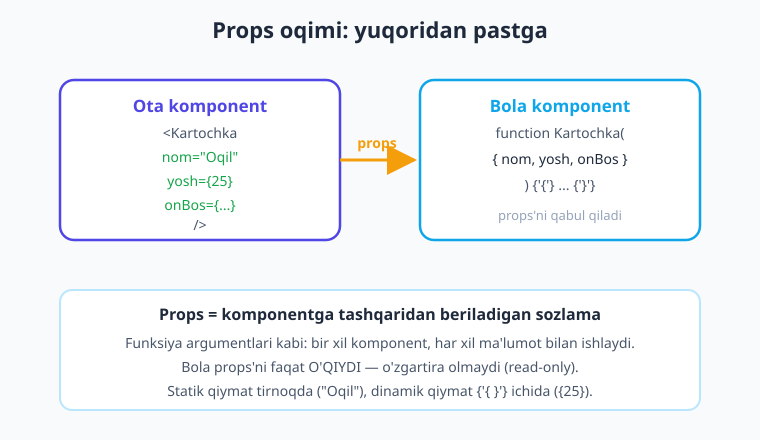
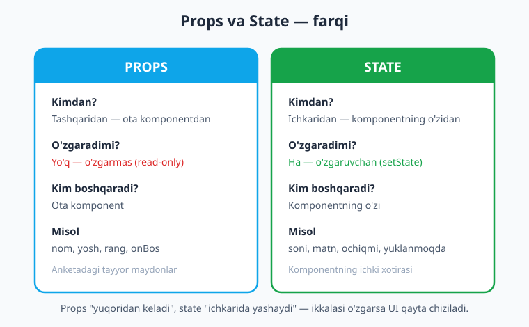
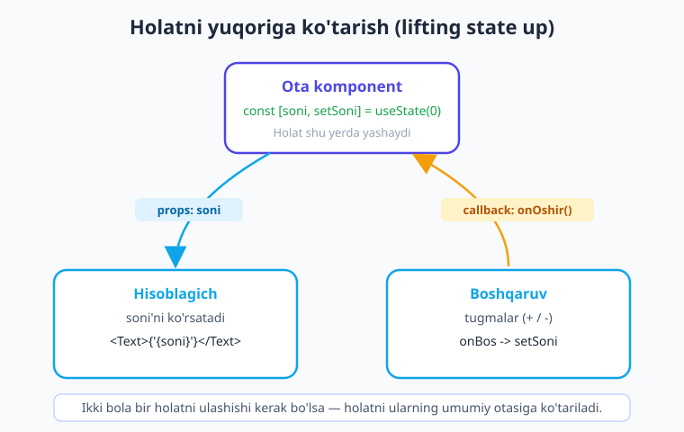

# 10 — Props va kompozitsiya

[⬅️ Oldingi: 09 — State va hodisalar](./09-state-hodisalar.md) · [🏠 Kitob boshi](./README.md) · [Keyingi: 11 — useEffect va yon ta'sirlar ➡️](./11-useeffect.md)

> **Bu bobda:** komponentlarni **moslashuvchan** qiladigan eng muhim mexanizm — **props** (komponentga tashqaridan beriladigan ma'lumot) bilan tanishamiz. `children` orqali komponent ichiga JSX uzatishni, funksiya-props (callback) bilan boladan otaga xabar berishni, props'ni **TypeScript** bilan tiplashni o'rganamiz. So'ng kichik komponentlardan kattalarini yig'ish (**kompozitsiya**) va ikki komponent bir holatni ulashishi kerak bo'lganda **holatni yuqoriga ko'tarish** (lifting state up) usulini ko'rib chiqamiz.

---

## Kirish: nega props kerak?

Oldingi boblarda biz komponentlar yozdik — `<View>`, `<Text>`, tugmalar. Lekin ularning hammasi **bitta aniq narsani** ko'rsatardi. Tasavvur qiling: ilovangizda 50 ta foydalanuvchi bor va har biri uchun ism, yosh, rasm ko'rsatadigan kartochka kerak. Har bir kartochka uchun **alohida komponent** yozasizmi? `OqilKartochkasi`, `DilnozaKartochkasi`, `BekzodKartochkasi`... 50 ta funksiya? Bu aqlga sig'maydi.

Yechim — **bitta** `Kartochka` komponenti yozish va unga **har safar boshqa ma'lumot berish**. Aynan shu ma'lumotni uzatish vositasi — **props**.

> **Hayotiy o'xshatish.** Props — bu **anketa to'ldirish** kabi. Anketa blankasi (forma) bitta — hammada bir xil: "Ism: ___", "Yosh: ___", "Telefon: ___". Lekin har bir odam o'z ma'lumotini yozadi. Blankaning o'zi o'zgarmaydi — faqat ichiga yozilgan ma'lumot har xil. Komponent — blanka, props — odam to'ldirgan maydonlar. Yoki yana bir o'xshatish: pizza buyurtmasi. "Pizza" bitta tushuncha, lekin siz uni **sozlaysiz**: o'lcham (katta), qo'shimcha (qo'ziqorin), achchiqlik (o'rta). Props — komponentni sozlash usuli.

---

## 1. Props nima

**Props** (inglizcha *properties* — "xususiyatlar"ning qisqartmasi) — bu komponentga **tashqaridan**, ya'ni uni ishlatayotgan komponent tomonidan beriladigan ma'lumot (sozlama). Komponent shu ma'lumotni qabul qiladi va unga qarab o'zini ko'rsatadi.

Eslang: React'da komponent — bu **funksiya**. Oddiy funksiyaga argument berasiz:

```ts
function salom(ism: string) {
  return `Assalomu alaykum, ${ism}!`;
}

salom('Oqil');    // "Assalomu alaykum, Oqil!"
salom('Dilnoza'); // "Assalomu alaykum, Dilnoza!"
```

Bir xil funksiya, har xil argument — har xil natija. **Props ham aynan shu**: komponent funksiyasiga beriladigan argumentlar. Faqat ular JSX sintaksisi orqali, atribut ko'rinishida beriladi.

> **Hayotiy o'xshatish.** Props — funksiya **argumentlari** kabi. Funksiyaga nima bersangiz, shunga mos ishlaydi. Komponent ham xuddi shunday: unga `nom="Oqil"` bersangiz "Oqil"ni, `nom="Dilnoza"` bersangiz "Dilnoza"ni ko'rsatadi. Props komponentni **moslashuvchan** qiladi — bir marta yozasiz, ko'p marta, har xil ma'lumot bilan ishlatasiz.



Diagrammada ko'rinib turibdiki, **ota komponent** (komponentni ishlatayotgan) pastdagi **bola komponent**ga `props` orqali ma'lumot uzatadi. Ma'lumot doimo **yuqoridan pastga** oqadi — bu React'ning eng muhim qoidalaridan biri.

!!! note "Atamalar"
    - **Ota komponent** (parent) — boshqa komponentni o'z ichida ishlatayotgan komponent.
    - **Bola komponent** (child) — boshqa komponent ichida ishlatilayotgan komponent.
    - Bir komponent boshqasiga nisbatan ota, uchinchisiga nisbatan bola bo'lishi mumkin — bu munosabat, mutlaq nom emas.

---

## 2. Props uzatish va qabul qilish

Keling, amalda ko'raylik. **Uzatish** — JSX'da atribut yozish kabi:

```tsx
// Otadagi JSX — Kartochka komponentiga props uzatamiz
<Kartochka nom="Oqil" yosh={25} />
```

Bu yerda `Kartochka` komponentiga ikkita prop berdik: `nom` va `yosh`. Endi shu props'ni **qabul qiluvchi** tomonni yozamiz:

```tsx
// app/components/Kartochka.tsx
import { View, Text } from 'react-native';

function Kartochka(props) {
  return (
    <View>
      <Text>Ism: {props.nom}</Text>
      <Text>Yosh: {props.yosh}</Text>
    </View>
  );
}
```

Komponent funksiyasi **bitta argument** oladi — odatda uni `props` deb ataymiz. Bu obyekt, ichida siz bergan barcha props bor: `props.nom` = `"Oqil"`, `props.yosh` = `25`.

### Destructuring — toza yo'l

`props.nom`, `props.yosh`, `props.faol`... har safar `props.` yozish zerikarli. JavaScript'ning **destructuring** (qism-qismga ajratish) imkoniyati bilan props'ni darrov nomlarga ajratamiz:

```tsx
// props o'rniga to'g'ridan-to'g'ri { nom, yosh } olamiz
function Kartochka({ nom, yosh }) {
  return (
    <View>
      <Text>Ism: {nom}</Text>
      <Text>Yosh: {yosh}</Text>
    </View>
  );
}
```

Bu **aynan bir xil ishlaydi**, lekin toza va qisqa. Kitobda bundan keyin doimo shu **destructuring** uslubidan foydalanamiz — bu React'da standart amaliyot.

### Statik va dinamik qiymatlar

Props qiymatini ikki xil berish mumkin:

```tsx
<Kartochka nom="Oqil" yosh={25} faol={true} />
```

- `nom="Oqil"` — **statik** qiymat (oddiy matn). Tirnoq ichida yoziladi, faqat matn (string) uchun.
- `yosh={25}` — **dinamik** qiymat. Jingalak qavs `{ }` ichida — bu yerga **istalgan JavaScript ifodasi** kiritiladi: raqam, `true`/`false`, o'zgaruvchi, hisob-kitob, hatto funksiya.

```tsx
const foydalanuvchiYoshi = 30;

<Kartochka
  nom="Bekzod"
  yosh={foydalanuvchiYoshi}      {/* o'zgaruvchi */}
  faol={foydalanuvchiYoshi > 18} {/* hisoblanadigan ifoda */}
/>
```

!!! warning "Ehtiyot bo'ling"
    Raqam, mantiqiy qiymat va o'zgaruvchini **doimo** `{ }` ichida bering. `yosh="25"` (tirnoqda) yozsangiz — bu raqam emas, `"25"` **matni** bo'ladi! Faqat o'zgarmas matn (string)ni tirnoqda yozish mumkin. Shubha bo'lsa — `{ }` ishlating.

---

## 3. TypeScript bilan props tiplash

Bizning kitobimiz **TypeScript** ishlatadi (loyiha `strict` rejimida). Yuqoridagi misollar JavaScript'da ishlaydi, lekin TypeScript `props` qanday shaklda ekanini bilmaydi — uni biz aytib qo'yishimiz kerak. Bu juda muhim: tip xatosini **kod yozayotgan paytda** topasiz, ilova ishlaganda emas.

Props uchun **tip** (`type`) e'lon qilamiz:

```tsx
// app/components/Kartochka.tsx
import { View, Text } from 'react-native';

type KartochkaProps = {
  nom: string;
  yosh: number;
  faol?: boolean; // ? = ixtiyoriy, berilmasa ham bo'ladi
};

function Kartochka({ nom, yosh, faol = false }: KartochkaProps) {
  return (
    <View>
      <Text>{nom}</Text>
      <Text>{yosh} yosh</Text>
      <Text>{faol ? 'Onlayn' : 'Oflayn'}</Text>
    </View>
  );
}
```

Bu yerda nima sodir bo'ldi:

- `type KartochkaProps = { ... }` — props shaklini ta'riflaydi: `nom` matn bo'lishi shart, `yosh` raqam bo'lishi shart.
- `faol?: boolean` — savol belgisi `?` bu propni **ixtiyoriy** qiladi. Ya'ni `<Kartochka nom="..." yosh={...} />` deb `faol`siz ishlatsangiz ham xato bermaydi.
- `{ nom, yosh, faol = false }: KartochkaProps` — destructuring'dan keyin `: KartochkaProps` orqali tipni belgilaymiz. `faol = false` esa — **default qiymat**: `faol` berilmasa, `false` bo'ladi.

### Ixtiyoriy props va default qiymat

Ikkalasi birga ishlaydi: `?` propni ixtiyoriy qiladi, default qiymat esa berilmaganda nima bo'lishini aytadi.

```tsx
<Kartochka nom="Oqil" yosh={25} />              {/* faol = false (default) */}
<Kartochka nom="Dilnoza" yosh={22} faol={true} /> {/* faol = true */}
<Kartochka nom="Sardor" yosh={28} faol />        {/* faol = true (qisqa shakl) */}
```

!!! tip "Maslahat"
    `faol={true}` o'rniga shunchaki `faol` deb yozsa ham bo'ladi — bu mantiqiy props uchun "qisqa shakl" va `true` degani. Lekin `faol={false}` ni qisqartirib bo'lmaydi.

TypeScript endi sizni xatolardan saqlaydi. Agar `yosh` ni unutsangiz yoki noto'g'ri tip bersangiz, tahrirlovchi (editor) darrov ogohlantiradi:

```tsx
<Kartochka nom="Oqil" />            {/* ❌ xato: 'yosh' yetishmayapti */}
<Kartochka nom="Oqil" yosh="25" />  {/* ❌ xato: 'yosh' raqam bo'lishi kerak, matn emas */}
<Kartochka nom={42} yosh={25} />    {/* ❌ xato: 'nom' matn bo'lishi kerak */}
```

> **Hayotiy o'xshatish.** Tip — bu anketadagi **ko'rsatma** kabi: "Yosh maydoniga faqat raqam yozing", "Ism majburiy". Ko'rsatmaga rioya qilmasangiz, anketa qabul qilinmaydi. TypeScript ham shunday: props "qoidasini" buzsangiz, kod kompilyatsiyadan o'tmaydi.

---

## 4. `children` prop — komponent ichiga JSX uzatish

Hozirgacha props'ni atribut sifatida berdik (`nom="..."`). Lekin yana bir maxsus prop bor — **`children`**. Bu komponentning **ochilish va yopilish teglari orasiga** yozgan narsangiz.

HTML'dagi `<div>...</div>` orasiga matn yozganingiz kabi, o'z komponentingiz orasiga ham JSX yozishingiz mumkin:

```tsx
// Karta komponentini shunday ishlatamiz:
<Karta>
  <Text>Bu Karta ichidagi matn</Text>
</Karta>
```

`<Karta>` va `</Karta>` orasidagi `<Text>...</Text>` — bu `Karta` komponentiga **`children`** propi sifatida uzatiladi. Karta uni qabul qilib, kerakli joyga joylashtiradi:

```tsx
// app/components/Karta.tsx
import { View, StyleSheet } from 'react-native';
import type { ReactNode } from 'react';

type KartaProps = {
  children: ReactNode; // ichkariga uzatilgan JSX
};

function Karta({ children }: KartaProps) {
  return <View style={styles.karta}>{children}</View>;
}

const styles = StyleSheet.create({
  karta: {
    backgroundColor: '#ffffff',
    padding: 16,
    borderRadius: 12,
    borderWidth: 1,
    borderColor: '#c7d2fe',
  },
});
```

E'tibor bering: `children` tipi — **`ReactNode`** (React'ning `react` paketidan). Bu "JSX bo'lishi mumkin bo'lgan har qanday narsa" degani: `<Text>`, `<View>`, matn, raqam, ro'yxat yoki ularning aralashmasi.

> **Hayotiy o'xshatish.** `children` bilan ishlovchi komponent — bu **quti** (yoki ramka) kabi. Quti o'zi shaklni (chegara, fon, soya) beradi, lekin ichiga **nimani solishni siz hal qilasiz**. Bir xil `Karta` quti ichiga matn, rasm, tugma — istalgan narsa solishingiz mumkin. Bu komponentni nihoyatda moslashuvchan qiladi.

Endi bitta `Karta`ni turli mazmun bilan ishlatamiz:

```tsx
<Karta>
  <Text style={styles.sarlavha}>Birinchi karta</Text>
  <Text>Bu yerda istalgan matn bo'lishi mumkin.</Text>
</Karta>

<Karta>
  <Image source={{ uri: 'https://example.com/rasm.png' }} style={{ width: 80, height: 80 }} />
  <Text>Rasmli karta</Text>
</Karta>
```

Ko'rdingizmi? Bitta `Karta` komponenti — cheksiz xil mazmun. Bu **kompozitsiya**ning poydevori (pastda batafsil).

!!! note "Eslatma"
    `children` — oddiy prop, faqat maxsus nomi bor. Uni `props.children` deb ham olishingiz mumkin. Atributlar bilan ham birga ishlatasiz: `<Karta sarlavha="Profil"><Text>...</Text></Karta>` — bu yerda `sarlavha` oddiy prop, JSX esa `children`.

---

## 5. Funksiya prop (callback) — boladan otaga xabar berish

Props doimo yuqoridan pastga oqadi. Lekin ko'pincha **bola otaga** xabar berishi kerak: "meni bosishdi!", "matn o'zgardi!". Buni qanday qilamiz? Yana props orqali — faqat bu safar prop sifatida **funksiya** uzatamiz.

Funksiya-prop (boshqacha aytganda **callback** — "qaytib chaqiriladigan funksiya") — bu ota tomonidan yozilgan, lekin bola tomonidan **kerakli paytda chaqiriladigan** funksiya.

Avval `09-bob`dan eslaylik: tugma bosilganda hodisa ishlaydi. Endi shu hodisani **o'z** komponentimizdan otaga uzatamiz. Qayta ishlatiladigan `Tugma` komponenti yozamiz:

```tsx
// app/components/Tugma.tsx
import { Pressable, Text, StyleSheet } from 'react-native';

type TugmaProps = {
  matn: string;
  onBos: () => void;   // funksiya prop: hech narsa qaytarmaydi
  rang?: string;
};

function Tugma({ matn, onBos, rang = '#4f46e5' }: TugmaProps) {
  return (
    <Pressable style={[styles.tugma, { backgroundColor: rang }]} onPress={onBos}>
      <Text style={styles.tugmaMatn}>{matn}</Text>
    </Pressable>
  );
}

const styles = StyleSheet.create({
  tugma: { paddingVertical: 12, paddingHorizontal: 24, borderRadius: 10 },
  tugmaMatn: { color: '#ffffff', fontWeight: '600', fontSize: 16 },
});
```

`onBos: () => void` tipiga e'tibor bering — bu "argumentsiz, hech narsa qaytarmaydigan funksiya" degani. `Pressable`ning `onPress` xususiyatiga aynan shu `onBos`ni ulaymiz. Ya'ni tugma bosilganda RN `onPress`ni, u esa **bizning `onBos`**ni chaqiradi.

Endi ota komponent bu `Tugma`ni ishlatib, "bosilganda nima bo'lishini" o'zi belgilaydi:

```tsx
// Ota komponentda
<Tugma matn="Saqlash" onBos={() => console.log('Saqlandi!')} rang="#16a34a" />
<Tugma matn="Bekor qilish" onBos={() => console.log('Bekor qilindi')} rang="#dc2626" />
```

> **Hayotiy o'xshatish.** Callback — bu **manzilingizni qoldirib ketish** kabi. Do'konga buyurtma berasiz va telefon raqamingizni qoldirasiz: "Tayyor bo'lganda menga qo'ng'iroq qiling". Do'kon (bola komponent) tovaringizni tayyorlaydi va **kerakli paytda** sizning raqamingizni (callback'ni) chaqiradi. Siz (ota) qachon chaqirilishini emas, chaqirilganda **nima qilishni** belgilaysiz.

Shunday qilib, ikki yo'nalishli aloqa hosil bo'ladi:

- **Ota → bola:** oddiy props (ma'lumot, sozlama) — `matn`, `rang`.
- **Bola → ota:** funksiya-props (hodisa, voqea) — `onBos`.

!!! tip "Nomlash an'anasi"
    Funksiya-propslarni odatda `on` bilan boshlaymiz: `onBos`, `onSaqla`, `onOzgar`, `onYopish`. Bu RN'ning o'zidagi `onPress`, `onChangeText`ga mos keladi va kod o'qishni osonlashtiradi — `on...` ko'rsangiz, bu "biror voqea sodir bo'lganda chaqiriladigan funksiya" deb bilasiz.

---

## 6. Props va State — qaysi biri qachon?

Ikkita o'xshash, lekin tubdan farqli tushuncha bor: **props** (bu bob) va **state** (09-bob). Boshlovchilar ularni tez-tez chalkashtiradi. Keling, aniq ajratamiz.



| | **Props** | **State** |
|---|---|---|
| **Kimdan keladi?** | Tashqaridan — ota komponentdan | Ichkaridan — komponentning o'zidan |
| **O'zgaradimi?** | Yo'q — o'zgarmas (read-only) | Ha — `setState` bilan o'zgaradi |
| **Kim boshqaradi?** | Ota komponent | Komponentning o'zi |
| **Maqsadi** | Komponentni sozlash | Vaqt o'tishi bilan o'zgaradigan ma'lumot |
| **Misol** | `nom`, `yosh`, `rang`, `onBos` | `soni`, `matn`, `ochiqmi`, `yuklanmoqda` |

**Eng muhim qoida: props'ni komponent ichida O'ZGARTIRMAYSIZ.** Props — "faqat o'qish uchun" (read-only). Agar komponent ichida props qiymatini o'zgartirmoqchi bo'lsangiz — bu xato. Quyidagi kod ishlamaydi va mantiqsiz:

```tsx
function Kartochka({ yosh }: { yosh: number }) {
  yosh = yosh + 1; // ❌ XATO: props'ni o'zgartirma!
  return <Text>{yosh}</Text>;
}
```

> **Hayotiy o'xshatish.** Props — bu sizga **pochta orqali kelgan xat** kabi. Uni o'qiysiz, lekin ichidagi yozuvni o'zgartirib, jo'natuvchiga "men o'zgartirdim" deb qaytarib bo'lmaydi. O'zgartirmoqchi bo'lsangiz — yangi xat (yangi qiymat) **otadan** so'rashingiz kerak. State esa — sizning **shaxsiy daftaringiz**: istalgan vaqt o'zingiz yozasiz, o'chirasiz, o'zgartirasiz.

**Qachon qaysi biri?**

- Ma'lumot **tashqaridan** kelyaptimi va komponent uni o'zgartirmaydimi? → **props**.
- Ma'lumot komponentning **ichida tug'iladimi** va vaqt o'tishi bilan **o'zgaradimi** (foydalanuvchi bosishi, yozishi bilan)? → **state**.

Ko'pincha ikkalasi birga ishlaydi: ota `state` saqlaydi, uni bolaga `props` orqali uzatadi. Bola props'ni ko'rsatadi, callback orqali otaga "o'zgartir" deb signal beradi, ota o'z `state`'ini yangilaydi — va UI qayta chiziladi. Bu — keyingi bo'limlarning mavzusi.

---

## 7. Komponent kompozitsiyasi — Lego usuli

**Kompozitsiya** (composition — "yig'ish") — bu kichik, sodda komponentlardan kattalarini **qurish** san'ati. React'ning butun falsafasi shunga asoslangan.

> **Hayotiy o'xshatish.** Kompozitsiya — bu **Lego** o'yini kabi. Sizda bir nechta oddiy g'isht (Tugma, Kartochka, Avatar) bor. Ulardan kosmik kema ham, qal'a ham, mashina ham yig'asiz. G'ishtlar bir xil — yig'ish usuli har xil. React'da ham: bir nechta qayta ishlatiladigan komponentdan butun ilova quriladi.

Buning kuchi shundaki: bir marta yozgan komponentingizni **istalgan joyda** qayta ishlatasiz. Tuzatish kerak bo'lsa, **bitta joyda** tuzatasiz — hamma joyda yangilanadi. Keling, kichik komponentlardan kattasini yig'amiz:

```tsx
// Kichik g'ishtlar: Avatar, Tugma — alohida komponentlar
import { View, Text, Image, StyleSheet } from 'react-native';

type AvatarProps = { harf: string };

function Avatar({ harf }: AvatarProps) {
  return (
    <View style={styles.avatar}>
      <Text style={styles.avatarHarf}>{harf}</Text>
    </View>
  );
}

// Kattaroq komponent: kichiklardan yig'ilgan
type ProfilProps = {
  nom: string;
  kasb: string;
  onYozish: () => void;
};

function Profil({ nom, kasb, onYozish }: ProfilProps) {
  return (
    <View style={styles.profil}>
      <Avatar harf={nom[0]} />          {/* Avatar'ni ishlatamiz */}
      <View style={styles.matnBlok}>
        <Text style={styles.nom}>{nom}</Text>
        <Text style={styles.kasb}>{kasb}</Text>
      </View>
      <Tugma matn="Yozish" onBos={onYozish} />  {/* Tugma'ni ishlatamiz */}
    </View>
  );
}

const styles = StyleSheet.create({
  avatar: {
    width: 48, height: 48, borderRadius: 24,
    backgroundColor: '#6366f1',
    alignItems: 'center', justifyContent: 'center',
  },
  avatarHarf: { color: '#ffffff', fontSize: 20, fontWeight: '700' },
  profil: { flexDirection: 'row', alignItems: 'center', gap: 12, padding: 12 },
  matnBlok: { flex: 1 },
  nom: { fontSize: 16, fontWeight: '700', color: '#1e293b' },
  kasb: { fontSize: 13, color: '#475569' },
});
```

`Profil` komponenti o'zi ichida `Avatar` va `Tugma`ni ishlatadi — bu kompozitsiya. Endi `Profil`ni ham boshqa joyda qayta ishlatasiz. Komponentlar **bir-birining ichida joylashadi**, daraxt hosil qiladi (03-bobdagi komponent daraxti — eslang).

!!! tip "Maslahat"
    Komponentni qachon ajratish kerak? Ikki belgi: (1) **takrorlanish** — bir xil JSX bo'lakni ikki-uch marta yozayotgan bo'lsangiz, uni komponentga aylantiring; (2) **uzunlik** — bitta komponent juda kattalashib ketsa (100+ qator), uni mantiqiy bo'laklarga ajrating. Kichik komponentlarni o'qish, tuzatish va sinash osonroq.

---

## 8. Holatni yuqoriga ko'tarish (lifting state up)

Endi eng muhim naqshlardan biriga keldik. Tasavvur qiling: ikkita bola komponent **bir xil ma'lumot** bilan ishlashi kerak. Masalan, bittasi sonni **ko'rsatadi**, ikkinchisi shu sonni **o'zgartiradi** (tugmalar). Ular qanday "kelishadi"?

Muammo: state bitta komponentga "tegishli" — uni ikki komponent baravar saqlay olmaydi. Yechim — **holatni yuqoriga ko'tarish** (lifting state up): umumiy holatni ularning **umumiy otasiga** joylashtirish, so'ng pastga props bilan, yuqoriga callback bilan ulashish.



Diagramma aniq ko'rsatadi:

- **Ota** komponent `useState` bilan `soni`ni saqlaydi (holat shu yerda yashaydi).
- **Hisoblagich** bolaga `soni` **props** orqali pastga uzatiladi (faqat ko'rsatish uchun).
- **Boshqaruv** bola **callback** (`onOshir`) orqali otaga "sonni oshir" deb signal beradi.
- Ota holatni yangilaydi → ikkala bola ham yangi qiymatni ko'radi.

Kodda ko'ramiz. Avval ikkita bola:

```tsx
// Faqat ko'rsatadigan bola
function Hisoblagich({ soni }: { soni: number }) {
  return <Text style={styles.katta}>{soni}</Text>;
}

// Faqat boshqaradigan bola (Tugma'ni ishlatadi — kompozitsiya!)
type BoshqaruvProps = {
  onOshir: () => void;
  onKamaytir: () => void;
};

function Boshqaruv({ onOshir, onKamaytir }: BoshqaruvProps) {
  return (
    <View style={styles.qator}>
      <Tugma matn="-" onBos={onKamaytir} rang="#dc2626" />
      <Tugma matn="+" onBos={onOshir} rang="#16a34a" />
    </View>
  );
}
```

`Hisoblagich`da state YO'Q — u faqat `soni` propini ko'rsatadi. `Boshqaruv`da ham state yo'q — u faqat callback'larni chaqiradi. Holat ularda emas, **otada**:

```tsx
// Ota — holatni SAQLAYDI va ikki bolaga ulashadi
import { useState } from 'react';

export default function Sahifa() {
  const [soni, setSoni] = useState(0); // holat shu yerda!

  return (
    <View style={styles.box}>
      <Hisoblagich soni={soni} />       {/* pastga: props */}
      <Boshqaruv
        onOshir={() => setSoni((avvalgi) => avvalgi + 1)}   {/* yuqoriga: callback */}
        onKamaytir={() => setSoni((avvalgi) => avvalgi - 1)}
      />
    </View>
  );
}
```

Endi `Boshqaruv`dagi tugmani bosganingizda: `onOshir` chaqiriladi → ota `setSoni` ishlaydi → `soni` o'zgaradi → ota qayta render bo'ladi → `Hisoblagich`ga yangi `soni` uzatiladi → ekranda yangi raqam ko'rinadi. Ikki bola otaning yagona holati orqali "gaplashdi".

> **Hayotiy o'xshatish.** Tasavvur qiling, ikki bola bir o'yinchoq (umumiy holat) bilan o'ynamoqchi. Janjal chiqmasin deb, o'yinchoqni **ota** olib turadi (state otada). Bola o'ynamoqchi bo'lsa, otadan so'raydi (callback), ota beradi (yangi props). Shunda ikki bola ham bir xil o'yinchoqni ko'radi va navbat bilan o'ynaydi. Umumiy narsani — umumiy "kattaga" ko'tarish kerak.

!!! note "Qoida"
    Ikki (yoki undan ko'p) komponent bir xil ma'lumotni ulashishi kerak bo'lsa — o'sha holatni ularning **eng yaqin umumiy otasiga** ko'taring. Bu React'ning rasmiy tavsiya etgan naqshi.

---

## 9. Props drilling muammosi (qisqacha)

Lifting state up ajoyib, lekin uning bir kamchiligi bor. Tasavvur qiling, holat juda yuqorida (ilovaning ildizida), unga muhtoj komponent esa juda chuqurda (5-6 qavat pastda). Ma'lumotni har bir oraliq komponent orqali **qo'lma-qo'l** uzatishingizga to'g'ri keladi:

```tsx
// Ildiz holatni saqlaydi
<Ilova foydalanuvchi={foydalanuvchi} />
  // -> <Sahifa foydalanuvchi={foydalanuvchi} />
  //      -> <Panel foydalanuvchi={foydalanuvchi} />
  //           -> <Menyu foydalanuvchi={foydalanuvchi} />
  //                -> <Profil foydalanuvchi={foydalanuvchi} /> {/* nihoyat shu yerda kerak! */}
```

Oradagi `Sahifa`, `Panel`, `Menyu`ga `foydalanuvchi` umuman kerak emas — ular shunchaki uni pastga uzatish uchun "pochtachi" bo'lib qoladi. Bu **props drilling** ("props'ni qatlam-qatlam burg'ulash") deb ataladi va katta ilovalarda zerikarli hamda xatoga moyil.

> **Hayotiy o'xshatish.** Props drilling — bu xatni 5-qavatdan 1-qavatga **qo'lma-qo'l** uzatish kabi. Har bir qavatdagi odam (oraliq komponent) xatni o'qimaydi ham — faqat keyingisiga uzatadi. Bu samarasiz.

Bu muammoning yechimi bor — **Context API** (va Zustand kabi vositalar): ma'lumotni har bir qavatdan o'tkazmasdan, to'g'ridan-to'g'ri kerakli komponentga yetkazish. Bu mavzuni **[19-bobda](./19-global-holat.md)** batafsil o'rganamiz.

!!! note "Eslatma"
    Props drilling har doim ham yomon emas! 2-3 qavat oddiy holatda — bu butunlay normal va props eng sodda yechim. Faqat ko'p qavat va ko'p joyda kerak bo'lsa, Context'ga o'tasiz. "Avval props, kerak bo'lganda Context" — yaxshi qoida.

---

## 10. To'liq misol — qayta ishlatiladigan komponentlar bilan sahifa

Endi bobdagi hamma narsani birlashtiramiz: TS bilan tiplangan props, `children`, callback, kompozitsiya va lifting state up. Quyidagi kod jonli Expo loyihada `tsc --noEmit` bilan **tekshirilgan**.

Avval **qayta ishlatiladigan** `Tugma`, `Kartochka` va `Karta` komponentlari:

```tsx
// app/components/UI.tsx — qayta ishlatiladigan UI komponentlari
import { View, Text, Pressable, StyleSheet } from 'react-native';
import type { ReactNode } from 'react';

// --- Tugma: matn + callback + ixtiyoriy rang ---
type TugmaProps = {
  matn: string;
  onBos: () => void;
  rang?: string;
};

export function Tugma({ matn, onBos, rang = '#4f46e5' }: TugmaProps) {
  return (
    <Pressable style={[styles.tugma, { backgroundColor: rang }]} onPress={onBos}>
      <Text style={styles.tugmaMatn}>{matn}</Text>
    </Pressable>
  );
}

// --- Karta: children'ni o'rab beruvchi "quti" ---
type KartaProps = { children: ReactNode };

export function Karta({ children }: KartaProps) {
  return <View style={styles.karta}>{children}</View>;
}

// --- Kartochka: tiplangan props, ixtiyoriy + default ---
type KartochkaProps = {
  nom: string;
  yosh: number;
  faol?: boolean;
};

export function Kartochka({ nom, yosh, faol = false }: KartochkaProps) {
  return (
    <Karta>
      <Text style={styles.nom}>{nom}</Text>
      <Text style={styles.yosh}>{yosh} yosh</Text>
      <Text style={[styles.holat, { color: faol ? '#16a34a' : '#94a3b8' }]}>
        {faol ? 'Onlayn' : 'Oflayn'}
      </Text>
    </Karta>
  );
}

const styles = StyleSheet.create({
  tugma: { paddingVertical: 12, paddingHorizontal: 24, borderRadius: 10 },
  tugmaMatn: { color: '#ffffff', fontWeight: '600', fontSize: 16 },
  karta: {
    backgroundColor: '#ffffff', padding: 16, borderRadius: 12,
    borderWidth: 1, borderColor: '#c7d2fe', width: '100%', gap: 4,
  },
  nom: { fontSize: 18, fontWeight: '700', color: '#1e293b' },
  yosh: { fontSize: 14, color: '#475569' },
  holat: { fontSize: 13 },
});
```

E'tibor bering: `Kartochka` o'zi ichida `Karta`ni ishlatadi (kompozitsiya), `Karta` esa `children` qabul qiladi. Endi shu komponentlardan **sahifa** yig'amiz, lifting state up bilan:

```tsx
// app/index.tsx — hammasini birlashtiramiz
import { View, Text, StyleSheet } from 'react-native';
import { useState } from 'react';
import { Tugma, Kartochka } from './components/UI';

export default function Sahifa() {
  const [yoqtirildi, setYoqtirildi] = useState(0); // holat OTADA

  return (
    <View style={styles.box}>
      <Text style={styles.sarlavha}>Jamoa a'zolari</Text>

      {/* Tiplangan props — har xil ma'lumot, bir komponent */}
      <Kartochka nom="Oqil" yosh={25} faol />
      <Kartochka nom="Dilnoza" yosh={22} />
      <Kartochka nom="Bekzod" yosh={30} faol />

      {/* Holat ko'rsatiladi (props pastga) */}
      <Text style={styles.hisob}>Yoqtirilganlar: {yoqtirildi}</Text>

      {/* Callback yuqoriga: bola otaning holatini o'zgartiradi */}
      <Tugma
        matn="👍 Yoqtirish"
        onBos={() => setYoqtirildi((avvalgi) => avvalgi + 1)}
        rang="#16a34a"
      />
    </View>
  );
}

const styles = StyleSheet.create({
  box: { flex: 1, justifyContent: 'center', gap: 12, padding: 16, backgroundColor: '#f8fafc' },
  sarlavha: { fontSize: 22, fontWeight: '800', color: '#1e293b', marginBottom: 4 },
  hisob: { fontSize: 16, color: '#475569', marginTop: 8 },
});
```

Bu kichik dasturda bobdagi barcha tushunchalar bor:

- **Tiplangan props** — `Kartochka` `nom`/`yosh`/`faol?` ni TS bilan oladi.
- **Default qiymat** — `faol` berilmasa `false`.
- **`children`** — `Karta` ichidagi matnni o'raydi.
- **Kompozitsiya** — `Kartochka` `Karta`ni, sahifa `Kartochka`/`Tugma`ni ishlatadi.
- **Callback** — `Tugma`ning `onBos`i orqali bola otaning holatini o'zgartiradi.
- **Lifting state up** — holat (`yoqtirildi`) otada, pastga props bilan ko'rsatiladi.

!!! question "Tekshirib ko'ring"
    Bu kodni o'z loyihangizga tering (`npx expo start` bilan Expo Go'da oching). So'ng o'zgartiring: `Kartochka`ga `kasb?: string` propini qo'shing, default qiymatsiz ixtiyoriy qiling, bittasini `kasb`siz qoldiring. TypeScript sizdan xato so'ramasligini ko'ring. Keyin `Kartochka`dan `yosh`ni olib tashlang — endi TS qanday xato berishini ko'ring.

---

## Xulosa

- **Props** — komponentga **tashqaridan** (ota komponentdan) beriladigan ma'lumot/sozlama. Funksiya argumentlari kabi — komponentni moslashuvchan qiladi.
- Props **JSX atributi** sifatida uzatiladi (`<Kartochka nom="Oqil" yosh={25} />`) va **destructuring** bilan qabul qilinadi (`function Kartochka({ nom, yosh })`). Statik qiymat tirnoqda, dinamik qiymat `{ }` ichida.
- **TypeScript** bilan props'ni `type` orqali tiplaymiz: `?` — ixtiyoriy prop, `= qiymat` — default qiymat. Tip xatolarini kod yozayotganda topasiz.
- **`children`** — komponent teglari orasiga yozilgan JSX (`ReactNode`). Komponentni "quti"ga aylantiradi — ichiga istalgan mazmun solinadi.
- **Funksiya-prop (callback)** orqali bola otaga xabar beradi (`onBos: () => void`). Ota → bola: ma'lumot props; bola → ota: hodisa callback.
- **Props ≠ State.** Props tashqaridan, **o'zgarmas** (read-only); state ichkarida, **o'zgaruvchan**. Props'ni komponent ichida hech qachon o'zgartirmang.
- **Kompozitsiya** — kichik komponentlardan (Tugma, Kartochka, Avatar) kattalarni yig'ish (Lego usuli). Qayta ishlatish, oson tuzatish.
- **Holatni yuqoriga ko'tarish** — ikki komponent bir holatni ulashsa, holatni umumiy otaga joylashtiring; pastga props, yuqoriga callback bilan ulang. Chuqur uzatish (**props drilling**) muammosini esa Context hal qiladi (19-bob).

---

## Amaliy mashqlar

1. **`Belgi` komponenti (oson).** `matn: string` va `rang?: string` (default `#6366f1`) props oladigan kichik `Belgi` (badge) komponenti yozing — yumaloq burchakli rangli fonda matn ko'rsatsin. Uni uch xil rang bilan uch marta ishlating.

2. **`Karta` + `children` (oson).** Faqat `children` qabul qiladigan `Karta` "quti" komponenti yozing (oq fon, chegara, soya — `padding`). Uning ichiga bir joyda matn, boshqa joyda rasm + matn soling. Bitta komponent, ikki xil mazmun ekanini his qiling.

3. **Hisoblagich — lifting state up (o'rta).** `Sanagich` ota komponenti `soni` holatini `useState` bilan saqlasin. Ikkita bola yarating: `Korsatkich` (faqat `soni`ni ko'rsatadi) va `Tugmalar` (`onOshir`/`onKamaytir`/`onTozala` callback'lari bilan). Holat faqat otada bo'lsin.

4. **`Profil` kompozitsiyasi (o'rta).** `Avatar` (ism birinchi harfini doirada ko'rsatadi), `Tugma` (callback bilan) va `Kartochka` komponentlaridan `Profil` kartasini yig'ing: avatar + ism/kasb + "Kuzatish" tugmasi. Tugma bosilganda holat "Kuzatilmoqda" ga o'zgarsin (matn va rang o'zgarsin).

5. **TS tiplash mustahkamligi (qiyin).** `Ovoz` (vote) komponenti yozing: `savol: string`, `variantlar: string[]` (massiv prop), `onTanla: (variant: string) => void` (argumentli callback). Har variant tugma bo'lsin; bosilganda `onTanla`ga o'sha variant uzatilsin. Ota komponentda tanlangan variantni `state`da saqlab, ekranda ko'rsating. Massiv propni `.map()` bilan render qiling — har biriga `key` bering.

---

[⬅️ Oldingi: 09 — State va hodisalar](./09-state-hodisalar.md) · [🏠 Kitob boshi](./README.md) · [Keyingi: 11 — useEffect va yon ta'sirlar ➡️](./11-useeffect.md)
