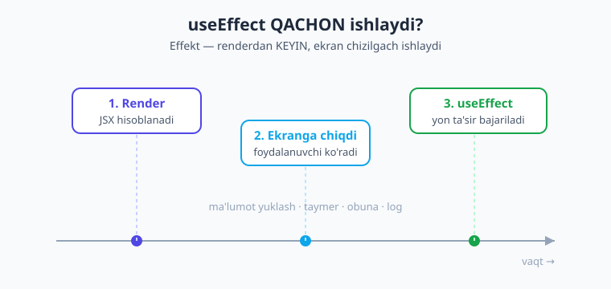
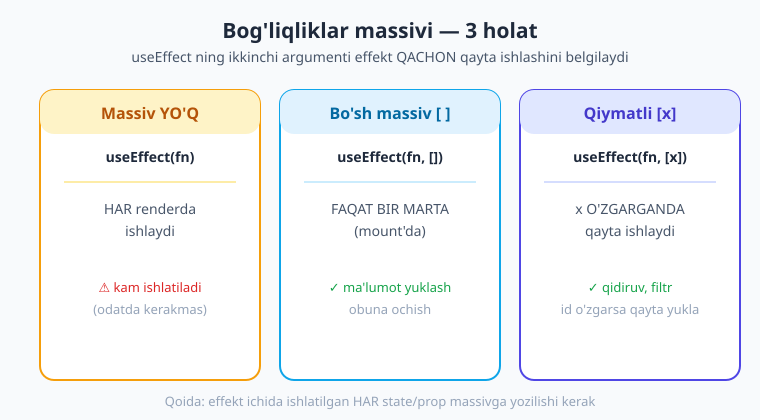
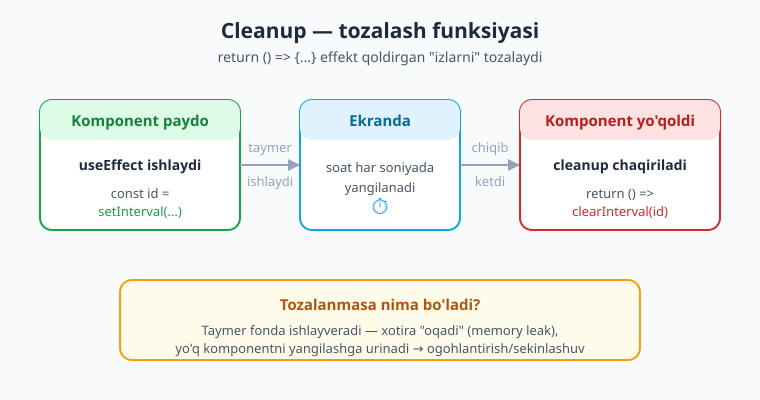

# 11 — useEffect va yon ta'sirlar

[⬅️ Oldingi: 10 — Props va kompozitsiya](./10-props-kompozitsiya.md) · [🏠 Kitob boshi](./README.md) · [Keyingi: 12 — Hooks chuqur ➡️](./12-hooks-chuqur.md)

> **Bu bobda:** komponentdan **tashqaridagi dunyo** bilan ishlashni o'rganamiz — ma'lumot yuklash, taymerlar, obunalar. Buning vositasi — **`useEffect`** hooki. `useEffect(fn, [deps])` qachon va necha marta ishlashini, **bog'liqliklar massivi** (dependency array) nima uchun kerakligini, **cleanup** (tozalash) bilan taymer/obunani to'g'ri yopishni va eng xavfli xato — **cheksiz sikl**ni qanday oldini olishni ko'ramiz. Oxirida API'dan ma'lumot yuklaydigan haqiqiy ekran va jonli soat yozamiz.

---

## Kirish: render hamma narsa emas

Oldingi boblarda komponentlarimiz **toza** edi: state'ni olib, JSX qaytarardi — xolos. Tugma bossangiz state o'zgaradi, ekran qayta chiziladi. Hammasi komponent **ichida**.

Lekin haqiqiy ilova bunchalik yopiq emas. U **tashqi dunyo** bilan gaplashishi kerak:

- **Internetdan ma'lumot yuklash** — serverdan postlar, ob-havo, foydalanuvchi profili.
- **Taymer** — soat, sanoq, slayd-shou.
- **Obuna** — klaviatura ochilishi, ilova fonga o'tishi (AppState), qurilma sensorlari.
- **Log yozish** — analitika, biror voqeani qayd qilish.

Bularning hammasida bitta umumiy narsa bor: ular komponentning **asosiy vazifasi** (ekranga rasm chizish) emas. Ular — **yon ta'sirlar**.

> **Hayotiy o'xshatish.** Render — bu **rasm chizish** kabi: rassom qog'ozga bor kuchini berib rasm chizadi, undan boshqa narsaga chalg'imaydi. Yon ta'sir (side effect) esa — **rasm chizib bo'lgandan keyingi ishlar**: rasmni ramkalash, devorga osish, do'stga jo'natish. Bular rasmga aloqador, lekin chizish jarayonining o'zi emas. React'da ham: avval ekran chiziladi (render), KEYIN "rasmdan tashqari" ishlar bajariladi (effekt).

Nega bularni to'g'ridan-to'g'ri komponent ichiga yozib bo'lmaydi? Sababi muhim: **komponent funksiyasi har render'da boshidan ishlaydi.** Agar `fetch(...)` ni to'g'ridan funksiya ichiga yozsangiz, har qayta-chizishda yangi so'rov ketadi — minglab keraksiz so'rov, sekinlashuv, hatto cheksiz sikl. Yon ta'sirni **render'dan ajratish** kerak — aynan shu uchun `useEffect` bor.

---

## 1. Yon ta'sir (side effect) nima

**Yon ta'sir** — komponent renderidan **tashqaridagi** har qanday ish. Ya'ni "JSX hisoblab, qaytarish"dan boshqa narsa:

- Ma'lumot yuklash (`fetch`)
- Taymer o'rnatish (`setInterval`, `setTimeout`)
- Hodisaga obuna bo'lish (`addEventListener`, sensor)
- Tashqi tizimni o'zgartirish (telefon sarlavhasi, ekran yorug'ligi)
- Konsolga log yozish, analitika yuborish

Render esa **toza** (pure) bo'lishi kerak: bir xil props/state berilsa, doimo bir xil JSX qaytarishi va boshqa hech narsani "buzmasligi" lozim. Yon ta'sirlar bu tozalikni buzadi — shuning uchun ularni alohida joyga, `useEffect`ga ko'chiramiz.

!!! note "Eslatma"
    "Yon ta'sir" qo'rqinchli atama emas. Bu shunchaki "render'dan boshqa, dunyoga ta'sir qiladigan ish" degani. Ma'lumot yuklash ham, soat tiklash ham — yon ta'sir.

---

## 2. `useEffect` — asosiy shakl

`useEffect` — React'ning yon ta'sirlar uchun maxsus hooki. U `react` paketidan import qilinadi va komponent ichida chaqiriladi:

```tsx
import { useEffect } from 'react';

useEffect(() => {
  // bu yerda yon ta'sir: fetch, taymer, log...
}, [deps]);
```

`useEffect` **ikkita argument** oladi:

1. **Effekt funksiyasi** — `() => {...}` — bajariladigan ish.
2. **Bog'liqliklar massivi** (`[deps]`) — effekt **qachon** qayta ishlashini boshqaradi (3-bo'limda batafsil).

Eng muhim qoida: **effekt render'dan KEYIN ishlaydi.** Avval komponent JSX qaytaradi, ekran chiziladi, foydalanuvchi ko'radi — keyin React effektni chaqiradi. Mana shu tartib:



Diagrammada ko'rinib turibdi: (1) komponent **render** bo'ladi (JSX hisoblanadi) → (2) natija **ekranga chiqadi** → (3) shundan keyin **`useEffect`** ishga tushadi. Effekt hech qachon render'ni "to'xtatib" turmaydi — ekran avval ko'rinadi, ish keyin bajariladi. Shu sabab ilova "muzlab" qolmaydi.

### Effektning uch shakli

`useEffect`ning ikkinchi argumenti (deps massivi) uch xil bo'lishi mumkin, va har biri butunlay boshqacha xulq beradi:

```tsx
// 1) Massiv YO'Q — HAR renderda ishlaydi (kam ishlatiladi)
useEffect(() => {
  console.log('Har safar render bo\'lganda');
});

// 2) Bo'sh massiv [] — FAQAT BIR MARTA (komponent paydo bo'lganda)
useEffect(() => {
  console.log('Faqat bir marta, boshida');
}, []);

// 3) Qiymatli massiv [x] — x O'ZGARGANDA ishlaydi
useEffect(() => {
  console.log('soni o\'zgardi:', soni);
}, [soni]);
```

Bu uch shaklni yaxshilab tushunish — bu bobning **eng muhim** qismi. Keling, har birini alohida ko'ramiz.

> **Hayotiy o'xshatish.** Bog'liqliklar massivi — bu **signalizatsiyaning sozlamasi** kabi. "Hech qachon" (massivsiz — har harakatda chiqadi), "faqat eshik birinchi ochilganda" (`[]` — bir marta), yoki "faqat ma'lum eshik ochilganda" (`[eshik]` — o'sha o'zgarganda). Massiv — effektga "qachon uyg'on" deb aytadigan sozlama.

!!! note "iOS va Android farqi"
    `useEffect`ning xulqi iOS va Android'da **bir xil** — bu React darajasidagi mexanizm, platformaga bog'liq emas. Faqat ichidagi ishlar (masalan, `AppState` fonga o'tish) platformaga xos voqealarga reaksiya qilishi mumkin.

---

## 3. Bog'liqliklar massivi (dependency array)

Bu — boshlovchilarni eng ko'p chalkashtiradigan tushuncha, shuning uchun sekin-asta boramiz. Bog'liqliklar massivi React'ga shuni aytadi: **"effekt ichidagi ish qaysi qiymatlarga bog'liq?"** React shu qiymatlarni har render'da tekshiradi: agar **birortasi o'zgargan** bo'lsa — effektni qayta ishga tushiradi; o'zgarmagan bo'lsa — tinch qoldiradi.



### Holat 1: bo'sh massiv `[]` — bir marta

Bu eng ko'p ishlatiladigan shakl. Effekt **faqat bir marta**, komponent birinchi marta ekranga chiqqanda (buni **mount** deymiz) ishlaydi va boshqa hech qachon takrorlanmaydi.

```tsx
useEffect(() => {
  console.log('Ekran ochildi — ma\'lumot yuklayman');
  // bu yerda fetch(...) — bir martalik yuklash
}, []); // <- bo'sh massiv: faqat boshida
```

Bu **ma'lumot yuklash** uchun ideal: ekran ochilganda serverdan ma'lumotni bir marta olib kelasiz.

### Holat 2: qiymatli massiv `[x]` — o'zgarganda

Massivga qiymat yozsangiz, effekt **o'sha qiymat o'zgarganda** qayta ishlaydi:

```tsx
const [qidiruv, setQidiruv] = useState('');

useEffect(() => {
  console.log('Qidiruv o\'zgardi:', qidiruv);
  // bu yerda qidiruv bo'yicha yangi so'rov
}, [qidiruv]); // <- qidiruv har o'zgarganda ishlaydi
```

Foydalanuvchi qidiruv maydoniga yozgan sayin `qidiruv` o'zgaradi → effekt qayta ishlaydi. Bir nechta qiymatga bog'liq bo'lsa, vergul bilan yozasiz: `[qidiruv, filtr]`.

### Holat 3: massiv yo'q — har render'da

Agar ikkinchi argumentni umuman bermasangiz, effekt **har render'da** ishlaydi. Bu juda kam kerak bo'ladi va ko'pincha xato belgisidir — odatda `[]` yoki `[x]` kerak.

```tsx
useEffect(() => {
  console.log('Har render'); // odatda kerakmas
}); // <- massiv yo'q
```

### Massivga nima yozish kerak?

**Oltin qoida:** effekt funksiyasi ichida ishlatadigan **har bir** o'zgaruvchini (state, prop, yoki tashqi o'zgaruvchi) massivga yozing.

```tsx
const [id, setId] = useState(1);
const [til, setTil] = useState('uz');

useEffect(() => {
  // effekt ichida id VA til ishlatilyapti
  yuklash(id, til);
}, [id, til]); // <- ikkalasini ham yozdik
```

Agar `til`ni massivga yozishni unutsangiz, `til` o'zgarganda effekt qayta ishlamaydi — eski `til` qiymati bilan "qotib" qoladi. Bu **eskirgan qiymat** (stale value) xatosi.

!!! tip "Maslahat"
    Bog'liqliklarni o'zingiz hisoblab o'tirmang. Expo loyihasida **ESLint** o'rnatilgan (`eslint-plugin-react-hooks`) — u effekt ichidagi qiymatlardan birortasini massivda unutib qoldirsangiz, sariq chiziq bilan ogohlantiradi. Ogohlantirishga quloq soling — u deyarli har doim haq.

!!! warning "Ehtiyot bo'ling"
    Noto'g'ri bog'liqliklar = bug. **Kam yozsangiz** — effekt eskirgan qiymat bilan ishlaydi (kerakli paytda yangilanmaydi). **State'ni o'zgartiruvchi ishni** noto'g'ri massiv bilan yozsangiz — cheksiz sikl (5-bo'limda). Shubha bo'lsa: "effekt ichida nima ishlatdim?" deb so'rab, hammasini yozing.

---

## 4. Cleanup — tozalash funksiyasi

Ko'p yon ta'sirlar "iz qoldiradi": taymer ishlab turadi, obuna ochiq qoladi. Komponent ekrandan yo'qolganda (buni **unmount** deymiz) bu izlarni **tozalash** kerak — aks holda ular fonda ishlayverib, xotira "oqishi" (memory leak) va xatolarga olib keladi.

Buning uchun effekt funksiyasidan **boshqa funksiya qaytaramiz** — bu **cleanup** (tozalash) funksiyasi:

```tsx
useEffect(() => {
  const id = setInterval(() => {
    console.log('Har soniyada');
  }, 1000);

  // CLEANUP — qaytariladigan funksiya
  return () => {
    clearInterval(id); // taymerni to'xtatamiz
  };
}, []);
```

Cleanup **ikki holatda** chaqiriladi:

1. Komponent ekrandan **yo'qolganda** (unmount).
2. Effekt **qayta ishlashidan oldin** (deps o'zgargan bo'lsa — eski effektni avval tozalab, keyin yangisini boshlaydi).



Diagramma soat misolida ko'rsatadi: komponent paydo bo'lganda `setInterval` taymer ishga tushadi (har soniyada vaqtni yangilaydi); foydalanuvchi boshqa ekranga o'tib, komponent yo'qolganda **cleanup** chaqiriladi va `clearInterval` taymerni to'xtatadi.

> **Hayotiy o'xshatish.** Cleanup — bu **mehmonxonadan chiqishdan oldin xonani tartibga keltirish** kabi. Kelganingizda chiroqni yoqasiz, konditsionerni ishga tushirasiz (effekt). Chiqayotganda hammasini o'chirib ketasiz (cleanup) — aks holda chiroq behuda yonib turadi, hisob o'sadi. React'da ham: ochgan narsangizni (taymer, obuna) yopib keting.

!!! tip "Qoida"
    Agar effekt biror narsani **ochsa** (taymer, obuna, listener) — cleanup'da uni **yoping**. `setInterval` → `clearInterval`, `setTimeout` → `clearTimeout`, `addEventListener`/`addEventListener` → `remove()`. "Nimani ochdim — shuni yopaman."

---

## 5. Cheksiz sikl tuzog'i (KRITIK xato)

Bu — `useEffect` bilan bog'liq **eng xavfli** xato, va deyarli har bir boshlovchi unga bir marta tushadi. Keling, mexanizmni tushunaylik, toki siz tushmang.

Sikl mana shunday hosil bo'ladi:

1. Effekt ishlaydi va **state'ni o'zgartiradi** (`setSoni`).
2. State o'zgargani uchun komponent **qayta render** bo'ladi.
3. Effekt o'sha state'ga **bog'liq** (massivda bor), shuning uchun u **yana ishlaydi**.
4. U yana state'ni o'zgartiradi → yana render → yana effekt → ... **cheksiz**.

Mana xato kod (buni **ishlatmang**):

```tsx
function Yomon() {
  const [soni, setSoni] = useState(0);

  useEffect(() => {
    setSoni(soni + 1); // ❌ deps'da soni bor, ichida soni'ni o'zgartiramiz
  }, [soni]);          // ❌ -> render -> effekt -> render -> ... CHEKSIZ!

  return <Text>{soni}</Text>;
}
```

`soni` o'zgaradi → render → effekt ishlaydi → `soni` yana o'zgaradi → render → ... Ilova qotib qoladi yoki "Maximum update depth exceeded" xatosini beradi.

!!! warning "Ehtiyot bo'ling"
    **Cheksiz sikl belgisi:** effekt ichida `setX(...)` chaqiryapsiz va `x` o'sha effektning bog'liqliklar massivida bor. Bu deyarli har doim sikl yaratadi.

**Qanday oldini olish kerak?**

- **Yangilashni shartga o'rang.** State'ni faqat kerak bo'lganda o'zgartiring (masalan, serverdan kelgan ma'lumot avvalgisidan farq qilsagina).
- **Funksional yangilashdan foydalaning.** `setSoni((avvalgi) => avvalgi + 1)` ishlatsangiz, `soni`ni o'qishingiz shart emas — uni massivdan olib tashlay olasiz. (Lekin agar maqsadingiz "bir marta oshirish" bo'lsa, baribir `[]` ishlating, taymer ichida emas.)
- **State o'rniga to'g'ri joyni tanlang.** Ko'pincha effekt ichida state yangilash umuman kerak emas — buni hodisa ishlovchisiga (`onPress`) ko'chiring, yoki render paytida hisoblang.

Masalan, "bir marta sanog'ni 10 ga o'rnatish" kerak bo'lsa:

```tsx
useEffect(() => {
  setSoni(10); // ✓ bir marta, deps bo'sh -> sikl yo'q
}, []);        // soni massivda YO'Q
```

---

## 6. Amaliy effektlar

Nazariyani ko'rdik — endi haqiqiy vazifalarda qo'llaymiz.

### Ma'lumot yuklash (`[]`)

Eng keng tarqalgan foydalanish: ekran ochilganda serverdan ma'lumot olib kelish. `fetch` ishlatamiz (`async` funksiya effekt ichida e'lon qilinadi — effektning o'zini `async` qilib bo'lmaydi):

```tsx
useEffect(() => {
  async function yukla() {
    const javob = await fetch('https://jsonplaceholder.typicode.com/posts');
    const malumot = await javob.json();
    setPostlar(malumot);
  }
  yukla();
}, []); // bir marta yuklaymiz
```

!!! note "Nega effektni o'zini `async` qilmaymiz?"
    `useEffect(async () => {...})` **noto'g'ri** — `async` funksiya Promise qaytaradi, lekin React effektdan **cleanup funksiyasi** kutadi. Shuning uchun ichkarida alohida `async` funksiya yozib (`yukla`), uni darrov chaqiramiz.

### Taymer / soat (cleanup bilan)

Har soniyada yangilanadigan soat — `setInterval` + albatta `clearInterval`:

```tsx
const [vaqt, setVaqt] = useState(new Date());

useEffect(() => {
  const id = setInterval(() => setVaqt(new Date()), 1000);
  return () => clearInterval(id); // tozalash MAJBURIY
}, []);
```

### Qidiruvda debounce (`[search]`)

Foydalanuvchi har harf yozganda darrov so'rov yubormaslik uchun — biroz **kutamiz** (debounce). `setTimeout` + cleanup'da `clearTimeout` ajoyib ishlaydi: har yangi harf eski taymerni bekor qiladi, faqat foydalanuvchi to'xtaganda so'rov ketadi.

```tsx
const [qidiruv, setQidiruv] = useState('');

useEffect(() => {
  if (qidiruv === '') return; // bo'sh bo'lsa qidirmaymiz

  const id = setTimeout(() => {
    console.log('Qidiruv so\'rovi:', qidiruv); // bu yerda fetch
  }, 500); // 500ms kutamiz

  return () => clearTimeout(id); // har harfda eski taymerni bekor qil
}, [qidiruv]); // qidiruv o'zgarganda
```

Bu naqsh juda nafis: foydalanuvchi "react native" deb tez yozsa, har harfda taymer **qayta-qayta bekor** bo'ladi va faqat oxirgi (yozish to'xtagan) holatda 500ms o'tib so'rov ketadi. Server behuda yuklanmaydi.

### Klaviatura / AppState obunasi

Tashqi voqealarga obuna — masalan, ilova fonga (background) yoki faol (active) holatga o'tganini kuzatish. `AppState` `react-native` dan keladi:

```tsx
import { AppState } from 'react-native';

useEffect(() => {
  const obuna = AppState.addEventListener('change', (yangiHolat) => {
    console.log('Ilova holati:', yangiHolat); // 'active' | 'background' | 'inactive'
  });
  return () => obuna.remove(); // obunani tozalash
}, []);
```

E'tibor bering: bu yerda ham **obuna ochildi → cleanup'da yopildi** qoidasi ishlaydi. `AppState.addEventListener` obyekt qaytaradi, uning `.remove()` metodi obunani bekor qiladi.

---

## 7. `useEffect` mobil kontekstda

Mobil ilovada `useEffect`ni tushunish ayniqsa muhim, chunki ekranlar tez-tez ochilib-yopiladi va ilova fonga o'tib turadi.

### `AppState` — fon/faol holat

Yuqorida ko'rganimizdek, `AppState` ilovaning **'active'** (ekranda), **'background'** (boshqa ilovaga o'tildi) yoki **'inactive'** (oraliq) holatda ekanini bildiradi. Masalan, ilova fonga o'tganda taymerni to'xtatib, qaytganda davom ettirishingiz mumkin.

### `useFocusEffect` — ekran fokusda

Expo Router'da bitta nozik nuqta bor: tab'lar yoki stack'da ekran **butunlay yo'qolmasligi** mumkin — u shunchaki fonda turadi (siz boshqa tab'dasiz). Oddiy `useEffect(() => {...}, [])` faqat ekran **birinchi** yaratilganda ishlaydi, har safar qaytib kelganingizda emas.

Agar siz **har safar ekranga qaytganda** biror ish bajarmoqchi bo'lsangiz (masalan, ma'lumotni yangilash), `expo-router` dan **`useFocusEffect`** ishlatasiz:

```tsx
import { useFocusEffect } from 'expo-router';
import { useCallback } from 'react';

useFocusEffect(
  useCallback(() => {
    console.log('Ekran fokusga keldi');
    return () => console.log('Ekran fokusdan ketdi'); // cleanup ham bor
  }, [])
);
```

!!! note "Eslatma"
    `useFocusEffect`ni hozircha faqat **eslatib** o'tyapmiz — uni navigatsiya boblarida (14–16-bob) batafsil ko'ramiz. Asosiy g'oya: `useEffect` "komponent yaratildi/yo'qoldi" ga, `useFocusEffect` esa "ekran ko'rinadi/yashirinadi" ga reaksiya qiladi. Boshlanishida `useEffect` yetarli.

---

## 8. React 19 va React Compiler (qisqa eslatma)

Bu kitob **React 19** va **Expo SDK 56** ga asoslangan, ularda **React Compiler** (eksperimental) bor. React Compiler ba'zi optimizatsiyalarni **avtomatik** qiladi — masalan, qaysi qiymatlarni eslab qolish (memoizatsiya) kerakligini o'zi aniqlaydi (`useMemo`/`useCallback` ko'pincha kerak bo'lmay qoladi — bu haqda 12-bobda).

Lekin muhim: **React Compiler `useEffect`ni o'rnini bosmaydi.** Yon ta'sirlar (ma'lumot yuklash, taymer, obuna) baribir `useEffect`da bo'ladi. Kompilyator faqat tezlikni yaxshilaydi, yon ta'sir mantig'ini siz baribir to'g'ri yozishingiz, deps va cleanup'ni o'zingiz boshqarishingiz kerak.

!!! tip "Maslahat"
    Zamonaviy React'da tendensiya shu: ma'lumot yuklashni `useEffect`da qo'lda yozish o'rniga, ko'pincha **TanStack Query** (React Query) kabi kutubxonalardan foydalaniladi — ular loading/error/cache'ni o'zi boshqaradi. Lekin uning ostida ham `useEffect` mantig'i yotadi, shuning uchun avval `useEffect`ni puxta tushunish shart. Bu kutubxonalarni keyingi boblarda eslatamiz.

---

## 9. To'liq misol — API'dan ma'lumot yuklaydigan ekran

Endi hamma narsani birlashtiramiz: bobdagi eng muhim amaliy naqsh — **ma'lumot yuklash ekrani** loading/data/error holatlari va cleanup (`AbortController`) bilan. Quyidagi kod jonli Expo loyihada `npx tsc --noEmit` bilan **tekshirilgan**.

```tsx
// app/postlar.tsx — API'dan postlar yuklaydigan ekran
import { View, Text, FlatList, StyleSheet, ActivityIndicator } from 'react-native';
import { useState, useEffect } from 'react';

type Post = { id: number; title: string };

export default function Postlar() {
  const [postlar, setPostlar] = useState<Post[]>([]);
  const [yuklanmoqda, setYuklanmoqda] = useState(true);
  const [xato, setXato] = useState<string | null>(null);

  useEffect(() => {
    // AbortController — yarim yo'lda so'rovni bekor qilish vositasi
    const controller = new AbortController();

    async function yukla() {
      try {
        setYuklanmoqda(true);
        setXato(null);
        const javob = await fetch(
          'https://jsonplaceholder.typicode.com/posts?_limit=10',
          { signal: controller.signal } // bekor qilish signalini ulaymiz
        );
        if (!javob.ok) throw new Error('Server xatosi: ' + javob.status);
        const malumot: Post[] = await javob.json();
        setPostlar(malumot);
      } catch (e) {
        // ekran yopilib so'rov bekor qilingan bo'lsa — bu xato emas
        if (e instanceof Error && e.name === 'AbortError') return;
        setXato(e instanceof Error ? e.message : 'Noma\'lum xato');
      } finally {
        setYuklanmoqda(false);
      }
    }

    yukla();

    // CLEANUP: ekran yopilsa, tugamagan so'rovni bekor qilamiz
    return () => controller.abort();
  }, []); // bir marta yuklaymiz

  // Uch holat: yuklanmoqda / xato / ma'lumot
  if (yuklanmoqda) {
    return (
      <View style={styles.markaz}>
        <ActivityIndicator size="large" color="#0ea5e9" />
        <Text style={styles.holatMatn}>Yuklanmoqda...</Text>
      </View>
    );
  }

  if (xato) {
    return (
      <View style={styles.markaz}>
        <Text style={styles.xato}>Xato: {xato}</Text>
      </View>
    );
  }

  return (
    <FlatList
      data={postlar}
      keyExtractor={(item) => item.id.toString()}
      contentContainerStyle={styles.royxat}
      renderItem={({ item }) => (
        <View style={styles.karta}>
          <Text style={styles.sarlavha}>{item.title}</Text>
        </View>
      )}
    />
  );
}

const styles = StyleSheet.create({
  markaz: { flex: 1, alignItems: 'center', justifyContent: 'center', gap: 12, backgroundColor: '#f8fafc' },
  holatMatn: { fontSize: 14, color: '#475569' },
  xato: { fontSize: 15, color: '#dc2626', textAlign: 'center', paddingHorizontal: 24 },
  royxat: { padding: 16, gap: 10 },
  karta: {
    backgroundColor: '#ffffff', padding: 16, borderRadius: 12,
    borderWidth: 1, borderColor: '#bae6fd',
  },
  sarlavha: { fontSize: 15, color: '#1e293b', fontWeight: '600' },
});
```

Bu ekranda bobning barcha tushunchalari bor:

- **`useEffect(..., [])`** — ma'lumot bir marta, ekran ochilganda yuklanadi.
- **Uch holat** — `yuklanmoqda` (spinner), `xato` (qizil matn), `postlar` (ro'yxat). Boshlovchilar ko'pincha faqat ma'lumotni o'ylaydi, lekin **yuklanish va xato** holatlari ham shart.
- **`async` ichkarida** — effekt o'zi `async` emas, ichida `yukla()` funksiyasi.
- **Cleanup + `AbortController`** — ekran yopilsa, tugamagan so'rov bekor qilinadi, "yo'q komponentni yangilash" ogohlantirishi chiqmaydi.

### Muqobil: jonli soat

Soddaroq, lekin cleanup'ni yorqin ko'rsatadigan misol — har soniyada yangilanadigan soat. Bu ham `tsc` bilan **tekshirilgan**:

```tsx
// app/soat.tsx — jonli raqamli soat
import { View, Text, StyleSheet } from 'react-native';
import { useState, useEffect } from 'react';

export default function Soat() {
  const [vaqt, setVaqt] = useState(new Date());

  useEffect(() => {
    // har soniyada vaqtni yangilaydigan taymer
    const id = setInterval(() => setVaqt(new Date()), 1000);
    // CLEANUP: komponent yo'qolganda taymerni to'xtatamiz
    return () => clearInterval(id);
  }, []); // taymer bir marta o'rnatiladi

  return (
    <View style={styles.box}>
      <Text style={styles.soat}>{vaqt.toLocaleTimeString()}</Text>
      <Text style={styles.sana}>{vaqt.toLocaleDateString()}</Text>
    </View>
  );
}

const styles = StyleSheet.create({
  box: { flex: 1, alignItems: 'center', justifyContent: 'center', gap: 8, backgroundColor: '#f8fafc' },
  soat: { fontSize: 48, fontWeight: '800', color: '#1e293b', fontVariant: ['tabular-nums'] },
  sana: { fontSize: 16, color: '#475569' },
});
```

Bu yerda `clearInterval`ni unutsangiz, foydalanuvchi boshqa ekranga o'tgach ham taymer fonda har soniya `setVaqt` chaqirib turadi — yo'q komponentni yangilashga urinib, xotira oqishi va ogohlantirishlarga sabab bo'ladi. **Cleanup buni hal qiladi.**

!!! question "Tekshirib ko'ring"
    Soat misolini loyihangizga tering (`npx expo start`). So'ng `return () => clearInterval(id)` qatorini **vaqtincha o'chiring** va terminaldagi ogohlantirishlarni kuzating (yoki ekranlar orasida tez-tez yuring). Cleanup'siz nima bo'lishini his qilgach, qatorni qaytaring.

---

## Xulosa

- **Yon ta'sir (side effect)** — render'dan tashqaridagi ish: ma'lumot yuklash, taymer, obuna, log. Render "rasm chizish", effekt "rasmdan keyingi ishlar".
- **`useEffect(fn, [deps])`** effektni render'dan ajratadi va uni **render'dan KEYIN** (ekran chizilgach) ishga tushiradi.
- **Uch shakl:** massivsiz → har render (kam kerak); `[]` → faqat bir marta (mount, ma'lumot yuklash); `[x]` → `x` o'zgarganda.
- **Bog'liqliklar massivi:** effekt ichida ishlatilgan **har** state/prop'ni yozing. Kam yozsangiz — eskirgan qiymat bug'i. ESLint `react-hooks` qoidasi yordam beradi.
- **Cleanup** — effektdan `return () => {...}` qaytariladi; komponent yo'qolganda yoki effekt qayta ishlashidan oldin chaqiriladi. "Nimani ochding — shuni yop": `setInterval`→`clearInterval`, obuna→`.remove()`.
- **Cheksiz sikl** — effekt ichida deps'dagi state'ni yangilash → render → effekt → ... cheksiz. Funksional yangilash, shart, yoki to'g'ri joyni tanlash bilan oldini oling.
- **Ma'lumot yuklash** uchun loading/error/data uch holatini va `AbortController` cleanup'ini ishlating. Effektni `async` qilmang — ichida `async` funksiya yozing.
- **Mobil kontekst:** `AppState` (fon/faol), `useFocusEffect` (ekran fokusda — Expo Router). **React 19/Compiler** optimizatsiyani avtomatlashtiradi, lekin `useEffect` tushunish baribir shart.

---

## Amaliy mashqlar

1. **Salom-log (oson).** Ekran ochilganda konsolga "Ekran ochildi" deb bir marta yozadigan `useEffect` yozing. So'ng massivni `[]` dan olib tashlab, har render'da chiqishini kuzating (ekranda tugma qo'yib, state'ni o'zgartiring). Farqni his qiling.

2. **Jonli soat cleanup bilan (oson).** Yuqoridagi `Soat` komponentini o'zingiz qaytadan yozing. `setInterval` bilan har soniyada vaqtni yangilang va `return () => clearInterval(id)` bilan tozalang. Cleanup'ni vaqtincha o'chirib, ogohlantirishni ko'ring.

3. **Deps o'zgarishini kuzatish (o'rta).** `useState` bilan `soni` saqlang va uni oshiradigan tugma qo'ying. `useEffect(() => { console.log('soni:', soni) }, [soni])` yozing. Tugmani bosib, har o'zgarishda log chiqishini ko'ring. So'ng massivni `[]` ga o'zgartirib, endi faqat bir marta chiqishini taqqoslang.

4. **Debounce qidiruv (o'rta).** `TextInput` qo'ying (`value`/`onChangeText` — 06-bobdan). Foydalanuvchi yozganda darrov emas, **500ms kutib** "Qidirilmoqda: ..." matnini ko'rsating. `setTimeout` + cleanup'da `clearTimeout` ishlating, deps = `[qidiruv]`. Tez yozganda faqat oxirida ishlashini ko'ring.

5. **API ekrani to'liq (qiyin).** `https://jsonplaceholder.typicode.com/users` dan foydalanuvchilarni yuklang. `yuklanmoqda` (`ActivityIndicator`), `xato` (qizil matn) va `data` (`FlatList` bilan ism/email) uch holatini to'liq qayta ishlang. `AbortController` cleanup'ini qo'shing. Qo'shimcha: "Qayta yuklash" tugmasi bosilganda effektni qayta ishga tushiradigan `[hisoblagich]` deps qo'shing.

---

[⬅️ Oldingi: 10 — Props va kompozitsiya](./10-props-kompozitsiya.md) · [🏠 Kitob boshi](./README.md) · [Keyingi: 12 — Hooks chuqur ➡️](./12-hooks-chuqur.md)
