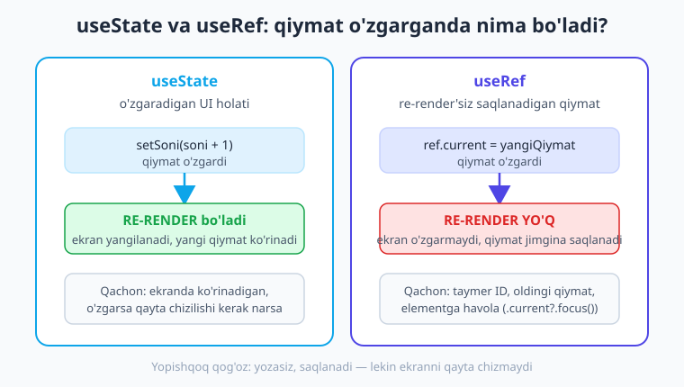
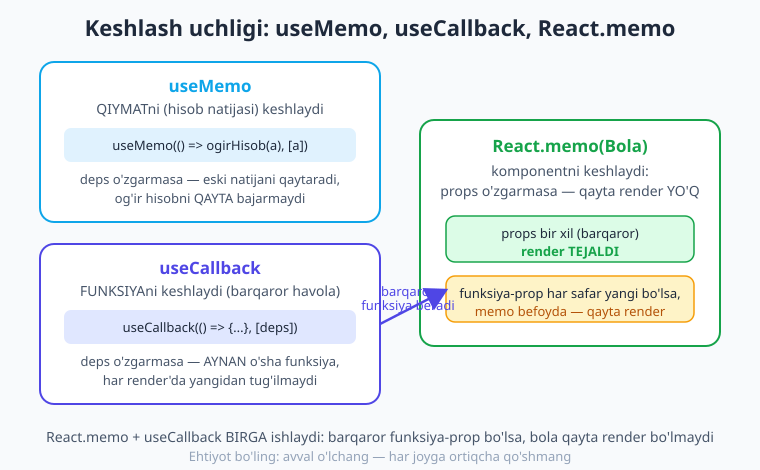
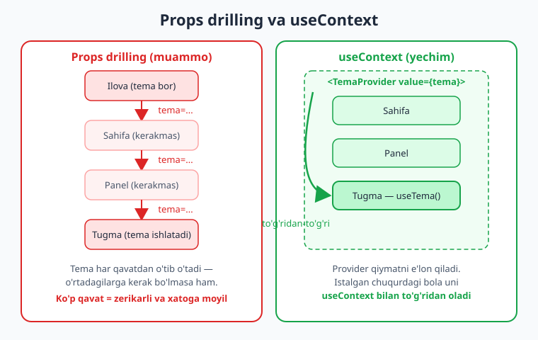

# 12 — Hooks chuqur: useRef, useMemo, useCallback, useContext

[⬅️ Oldingi: 11 — useEffect va yon ta'sirlar](./11-useeffect.md) · [🏠 Kitob boshi](./README.md) · [Keyingi: 13 — Custom hooks va loyiha tuzilishi ➡️](./13-custom-hooks-tuzilish.md)

> **Bu bobda:** React'ning eng kuchli to'rtta hookini chuqur o'rganamiz. **`useRef`** bilan elementga (masalan, matn maydoniga) havola olamiz va re-render'ni keltirib chiqarmasdan qiymat saqlaymiz; **`useMemo`** bilan og'ir hisobni keshlaymiz; **`useCallback`** va **`React.memo`** bilan keraksiz qayta render'larni oldini olamiz; **`useContext`** bilan esa "props drilling" muammosini yechib, temani (yorug'/qorong'i) butun ilovaga ulashamiz. Oxirida React 19 va React Compiler avtomatik keshlashga qisqa nazar tashlaymiz.

---

## Kirish: hooklar — "ulanish nuqtalari"

Avvalgi boblarda `useState` (holat) va `useEffect` (yon ta'sir) bilan tanishdik. Lekin React'ning hooklar dunyosi shulardan ancha kengroq. Tasavvur qiling: siz bog'da turli asboblar bilan ishlaysiz. Bittasi suv quyadi (`useState`), bittasi vaqti-vaqti bilan o'g'it sepadi (`useEffect`). Lekin bog'ingizda yana boshqa ehtiyojlar ham bor: ba'zan bir gulga **to'g'ridan-to'g'ri** qo'l tekkizish kerak (`useRef`), ba'zan bir og'ir ishni **takror qilmaslik** uchun natijani yodda saqlash kerak (`useMemo`), ba'zan butun bog'cha uchun **bitta umumiy qoida** (masalan, "bugun hamma gulga ko'k yorug' tushadi") o'rnatish kerak (`useContext`).

Bu bobdagi hooklarning hammasi bitta umumiy maqsadga xizmat qiladi: **ilovangizni tezroq, toza va boshqariladigan qilish.** Ulardan ba'zilari (`useRef`, `useContext`) deyarli har bir jiddiy ilovada kerak bo'ladi. Boshqalari (`useMemo`, `useCallback`) esa **optimizatsiya** uchun — ya'ni ularni hamma joyga emas, faqat kerak bo'lganda ishlatasiz.

> **Hayotiy o'xshatish.** Hooklar — oshxonadagi asboblar to'plami kabi. Pichoq (`useState`) deyarli har taomda kerak. Mikser (`useMemo`) faqat ko'p narsa aralashtirganda foydali — bir piyola choy uchun mikser olmaysiz. Devordagi umumiy yorug'lik kaliti (`useContext`) esa butun oshxona uchun bir marta yoqiladi va hammaga ta'sir qiladi. To'g'ri asbobni to'g'ri vazifaga tanlash — usta oshpazning mahorati. Shu bobda har bir asbobning **qachon** kerakligini aniq bilib olamiz.

---

## 1. Hook qoidalari (qisqa eslatma)

Yangi hooklarni o'rganishdan oldin, ularning hammasiga tegishli **ikkita oltin qoidani** takrorlaylik. Bu qoidalar 09 va 11-boblarda ham aytilgan edi, lekin shunchalik muhimki, yana eslatib o'tamiz. Bularni **"Hook qoidalari"** deyishadi.

**Qoida 1: hooklarni faqat React funksiyalari ichida chaqiring.** Ya'ni hookni faqat (a) komponent funksiyasi ichida yoki (b) boshqa custom hook ichida chaqirish mumkin. Oddiy funksiya yoki sinf ichida emas.

**Qoida 2: hooklarni faqat yuqori darajada chaqiring.** Ya'ni hookni `if`, `for` yoki boshqa shart/sikl ichiga **solmang**. Hooklar har render'da **aynan bir xil tartibda va bir xil sonda** chaqirilishi shart.

```tsx
// ❌ NOTO'G'RI — hook shart ichida
function Komponent({ kirgan }: { kirgan: boolean }) {
  if (kirgan) {
    const ref = useRef(null); // XATO! shart ichida hook
  }
}

// ✅ TO'G'RI — hook eng yuqorida, shart ichida emas
function Komponent({ kirgan }: { kirgan: boolean }) {
  const ref = useRef(null); // doimo chaqiriladi
  if (kirgan) {
    // ref'ni shart ichida ISHLATISH mumkin
  }
}
```

!!! warning "Nega bu qoida muhim?"
    React hooklarni **chaqirilish tartibiga** qarab bir-biridan ajratadi. Birinchi `useState`, ikkinchi `useState`, uchinchi `useRef`... Agar bir render'da shart tufayli `useRef` o'tkazib yuborilsa, tartib buziladi va React qaysi qiymat qaysi hookka tegishli ekanligini chalkashtirib yuboradi. Shuning uchun hooklar **doimo, har render'da, bir xil tartibda** chaqirilishi shart.

> **Maslahat.** Bu qoidalarni `eslint-plugin-react-hooks` plagini avtomatik tekshiradi va xato qilsangiz, ogohlantiradi. Expo loyihasida u allaqachon o'rnatilgan, shuning uchun tahrirlovchingiz sizni qoidabuzarlikdan saqlaydi.

---

## 2. `useRef` — havola va re-render'siz xotira

`useRef` ikki xil vazifa bajaradi va ko'pchilik boshlovchilar shu yerda chalkashadi. Keling, ikkalasini ham alohida ko'rib chiqamiz.

### 2.1 Birinchi vazifa: elementga havola olish

Ba'zan komponentdagi aniq bir elementga **to'g'ridan-to'g'ri murojaat** qilish kerak bo'ladi. Eng keng tarqalgan misol: matn maydoniga **fokus berish** (klaviaturani ochish va kursorni o'sha maydonga qo'yish).

> **Hayotiy o'xshatish.** `useRef` — bu **manzil yorlig'i** kabi. Tasavvur qiling, katta omborda yuzlab quti bor. Siz bir qutiga "12-javon, 3-qator" deb yorliq yopishtirib qo'yasiz. Endi kerak bo'lganda butun omborni qidirmaysiz — to'g'ri o'sha qutiga borasiz. `useRef` ham aynan shunday: ekrandagi aniq bir elementga "yorliq" qo'yib, keyin unga to'g'ridan-to'g'ri murojaat qilasiz.

`useRef` yordamida `TextInput`ga fokus beraylik:

```tsx
// app/index.tsx
import { View, TextInput, Pressable, Text, StyleSheet } from 'react-native';
import { useRef } from 'react';

export default function Index() {
  // 1. ref yaratamiz — boshida bo'sh (null)
  const inputRef = useRef<TextInput>(null);

  return (
    <View style={styles.box}>
      {/* 2. ref'ni elementga ulaymiz */}
      <TextInput
        ref={inputRef}
        placeholder="Ismingizni yozing"
        style={styles.input}
      />
      <Pressable
        style={styles.tugma}
        // 3. .current orqali elementga murojaat qilamiz
        onPress={() => inputRef.current?.focus()}
      >
        <Text style={styles.tugmaMatn}>Maydonga o'tish</Text>
      </Pressable>
    </View>
  );
}

const styles = StyleSheet.create({
  box: { flex: 1, justifyContent: 'center', padding: 24, gap: 16 },
  input: { borderWidth: 1, borderColor: '#cbd5e1', borderRadius: 10, padding: 14 },
  tugma: { backgroundColor: '#4f46e5', padding: 14, borderRadius: 10, alignItems: 'center' },
  tugmaMatn: { color: '#fff', fontWeight: '600' },
});
```

Bu yerda uch qadam bor:

1. `const inputRef = useRef<TextInput>(null)` — ref obyektini yaratamiz. Boshlang'ich qiymati `null`, chunki komponent hali chizilmagan paytda element mavjud emas.
2. `ref={inputRef}` — yaratgan ref'imizni `TextInput`ga **ulaymiz**. React element chizilgach, uni avtomatik ravishda `inputRef.current`ga joylab qo'yadi.
3. `inputRef.current?.focus()` — tugma bosilganda, `.current` orqali haqiqiy `TextInput` elementiga yetib boramiz va uning `focus()` metodini chaqiramiz.

!!! note "Nega `?.` (ixtiyoriy zanjir) kerak?"
    `inputRef.current` boshida `null` bo'lishi mumkin (komponent hali chizilmagan paytda). `?.` (optional chaining) yozsak, `current` `null` bo'lsa, `focus()` umuman chaqirilmaydi va dastur ishdan chiqmaydi. Bu TypeScript va xavfsizlik uchun yaxshi odat. `<TextInput>` deb tip berganimiz uchun, `inputRef.current.` deb yozganda tahrirlovchi `focus()`, `blur()` kabi metodlarni avtomatik taklif qiladi.

`ScrollView` yoki `FlatList`ni ham xuddi shunday boshqarish mumkin — masalan, "Yuqoriga" tugmasi:

```tsx
import { ScrollView, Text, Pressable } from 'react-native';
import { useRef } from 'react';

function UzunSahifa() {
  const skrollRef = useRef<ScrollView>(null);

  return (
    <>
      <ScrollView ref={skrollRef}>
        {/* ...juda uzun mazmun... */}
        <Text>Pastdagi matn</Text>
      </ScrollView>
      <Pressable onPress={() => skrollRef.current?.scrollTo({ y: 0, animated: true })}>
        <Text>Yuqoriga qaytish</Text>
      </Pressable>
    </>
  );
}
```

`FlatList` uchun `scrollToIndex` yoki `scrollToOffset` metodlari bor — ulardan keyingi boblarda foydalanamiz.

### 2.2 Ikkinchi vazifa: re-render'siz qiymat saqlash

Bu `useRef`ning eng nozik, eng muhim xususiyati. `useRef` shunchaki `{ current: ... }` ko'rinishidagi oddiy obyektni qaytaradi. Siz `ref.current`ga istalgan qiymatni yozishingiz mumkin va u **render'lar orasida saqlanib qoladi** — xuddi `useState` kabi. Lekin **bitta ulkan farq** bor:

> **`useState`** — qiymat o'zgarsa, komponent **qayta chiziladi** (re-render).
> **`useRef`** — qiymat o'zgarsa, komponent **qayta chizilmaydi**.



> **Hayotiy o'xshatish.** `useRef.current` — bu **yopishqoq qog'oz** (stiker) kabi. Stol ustidagi monitor yoniga "telefon: 99-123" deb stiker yopishtirasiz. Bu yozuv saqlanadi, kerak bo'lganda o'qiysiz, yangisiga almashtirasiz. Lekin stikerni almashtirganingiz bilan butun xona qaytadan bo'yalmaydi — hech kim hatto sezmaydi. `useRef` ham aynan shunday: qiymatni jimgina yozasiz va o'qiysiz, lekin **ekran qayta chizilmaydi.**

Bu nima uchun foydali? Eng klassik misol — **taymer ID saqlash**. `setInterval` bir raqam (ID) qaytaradi, keyin uni `clearInterval`ga berib taymerni to'xtatamiz. Bu ID'ni biror joyda saqlashimiz kerak, lekin uni ekranda ko'rsatmaymiz — demak, `useState`ga hojat yo'q. Aynan `useRef` uchun ish:

```tsx
// app/index.tsx
import { View, Text, Pressable, StyleSheet } from 'react-native';
import { useRef, useState } from 'react';

export default function Sekundomer() {
  const [vaqt, setVaqt] = useState(0);      // bu EKRANDA ko'rinadi -> useState
  const taymerRef = useRef<ReturnType<typeof setInterval> | null>(null); // bu ko'rinmaydi -> useRef

  function boshla() {
    if (taymerRef.current !== null) return; // allaqachon ishlayapti -> ikki marta boshlamaymiz
    taymerRef.current = setInterval(() => {
      setVaqt((v) => v + 1);                 // har soniyada vaqtni oshiramiz
    }, 1000);
  }

  function toxtat() {
    if (taymerRef.current !== null) {
      clearInterval(taymerRef.current);      // taymerni to'xtatamiz
      taymerRef.current = null;              // ID'ni tozalaymiz
    }
  }

  return (
    <View style={styles.box}>
      <Text style={styles.vaqt}>{vaqt} soniya</Text>
      <View style={styles.qator}>
        <Pressable style={styles.tugma} onPress={boshla}>
          <Text style={styles.tugmaMatn}>Boshlash</Text>
        </Pressable>
        <Pressable style={[styles.tugma, styles.qizil]} onPress={toxtat}>
          <Text style={styles.tugmaMatn}>To'xtatish</Text>
        </Pressable>
      </View>
    </View>
  );
}

const styles = StyleSheet.create({
  box: { flex: 1, justifyContent: 'center', alignItems: 'center', gap: 20 },
  vaqt: { fontSize: 40, fontWeight: '800', color: '#1e293b' },
  qator: { flexDirection: 'row', gap: 12 },
  tugma: { backgroundColor: '#16a34a', paddingVertical: 12, paddingHorizontal: 24, borderRadius: 10 },
  qizil: { backgroundColor: '#dc2626' },
  tugmaMatn: { color: '#fff', fontWeight: '600' },
});
```

Bu yerdagi tafakkurga e'tibor bering: **`vaqt`** ekranda ko'rinadi, har soniyada o'zgaradi va ekran yangilanishi kerak — shuning uchun `useState`. **`taymerRef`** esa shunchaki ichki "yorliq" — uni ekranda ko'rsatmaymiz, faqat keyinroq taymerni to'xtatish uchun kerak — shuning uchun `useRef`. Agar taymer ID'sini `useState`da saqlasak, har safar ID o'zgarganda keraksiz re-render bo'lardi.

!!! tip "Agar `vaqt`ni ham `useRef`da saqlasak nima bo'ladi?"
    `taymerRef.current`ni har soniya oshirsangiz, qiymat ortib boradi, **lekin ekranda hech narsa o'zgarmaydi** — chunki `useRef` re-render keltirmaydi. Ekranda doimo `0` turaveradi. Mana shu — `useState` va `useRef` o'rtasidagi farqni eng yaxshi tushuntiradigan tajriba.

Yana bir foydali holat — **oldingi qiymatni eslab qolish**:

```tsx
import { useRef, useState } from 'react';

function HisobgichTarixi() {
  const [soni, setSoni] = useState(0);
  const oldingiRef = useRef(0); // oldingi qiymatni saqlaymiz

  function kopaytir() {
    oldingiRef.current = soni; // o'zgartirishdan oldin hozirgini yodda tutamiz
    setSoni(soni + 1);
  }

  // Endi "hozir 5, oldin 4 edi" kabi ma'lumotni ko'rsatishimiz mumkin
  return null; // (qisqartirildi)
}
```

!!! warning "Ehtiyot bo'ling: `ref.current`ni render ichida o'qib/yozmang"
    `ref.current`ni komponent funksiyasining **asosiy tanasida** (render paytida) bevosita o'qish yoki yozish noto'g'ri. Uni faqat **hodisa ishlovchilarida** (`onPress`, funksiyalar ichida) yoki **`useEffect` ichida** o'qing/yozing. Sababi: render paytida `ref.current` o'qilsa, React uni "tabiiy ravishda" qaytadan hisoblamaydi va natija eskirgan bo'lib qolishi mumkin. Ekranda ko'rsatiladigan ma'lumot uchun har doim `useState` ishlating.

---

## 3. `useMemo` — og'ir hisobni keshlash

Endi optimizatsiya hooklariga o'tamiz. Avval bitta haqiqatni eslab qolaylik: **komponent har re-render'da o'z funksiyasini boshidan oxirigacha qaytadan ishga tushiradi.** Ya'ni ichidagi barcha hisob-kitoblar har safar qaytadan bajariladi. Aksariyat hollarda bu muammo emas — hisoblar tez. Lekin ba'zan ichida **og'ir** hisob bo'ladi (masalan, mingta elementni saralash yoki murakkab matematik amal). Shunda har keraksiz re-render'da o'sha og'ir ish takror bajarilib, ilova sekinlashadi.

`useMemo` aynan shu muammoni yechadi: u **hisob natijasini eslab qoladi (keshlaydi)** va faqat kerakli ma'lumot (deps) o'zgargandagina qayta hisoblaydi.

> **Hayotiy o'xshatish.** `useMemo` — bu **muzlatgichdagi tayyor ovqat** kabi. Bir marta katta qozonda osh damlaysiz (og'ir ish) va muzlatgichga solib qo'yasiz. Keyingi kunlari yana och qolsangiz, butun oshni qayta damlamaysiz — muzlatgichdan olib isitasiz (tez). Faqat osh tugaganda yoki yangi mehmon kelganda (ya'ni "shart o'zgarganda") qayta damlaysiz. `useMemo` ham hisob natijasini "muzlatib" qo'yadi va kerak bo'lmaguncha qayta hisoblamaydi.

Sintaksisi:

```tsx
const natija = useMemo(() => ogirHisob(a), [a]);
```

Buni shunday o'qiymiz: "`ogirHisob(a)`ni hisobla va natijani eslab qol. `a` o'zgarmagunicha, har re-render'da eski natijani qaytar. `a` o'zgarsa — qaytadan hisobla." Bu `useEffect`dagi bog'liqliklar massivi (`[a]`) bilan aynan bir xil mantiq.

Amaliy misol — qidiruv natijasini filtrlash. Ro'yxat juda katta bo'lsa, har harf yozilganda butun ro'yxatni qaytadan filtrlash sekin bo'ladi:

```tsx
// app/dokon.tsx
import { View, TextInput, FlatList, Text, StyleSheet } from 'react-native';
import { useMemo, useState } from 'react';

type Mahsulot = { id: string; nomi: string; narx: number };

const MAHSULOTLAR: Mahsulot[] = [
  { id: '1', nomi: 'Olma', narx: 12000 },
  { id: '2', nomi: 'Banan', narx: 18000 },
  { id: '3', nomi: 'Apelsin', narx: 15000 },
  // ...tasavvur qiling, bu yerda mingta mahsulot bor
];

export default function Dokon() {
  const [qidiruv, setQidiruv] = useState('');

  // Faqat `qidiruv` o'zgarganda qayta filtrlanadi
  const topilganlar = useMemo(() => {
    return MAHSULOTLAR.filter((m) =>
      m.nomi.toLowerCase().includes(qidiruv.toLowerCase())
    );
  }, [qidiruv]);

  return (
    <View style={styles.box}>
      <TextInput
        value={qidiruv}
        onChangeText={setQidiruv}
        placeholder="Mahsulot qidirish"
        style={styles.input}
      />
      <Text style={styles.soni}>{topilganlar.length} ta topildi</Text>
      <FlatList
        data={topilganlar}
        keyExtractor={(item) => item.id}
        renderItem={({ item }) => (
          <Text style={styles.element}>{item.nomi} — {item.narx} so'm</Text>
        )}
      />
    </View>
  );
}

const styles = StyleSheet.create({
  box: { flex: 1, padding: 16, gap: 12 },
  input: { borderWidth: 1, borderColor: '#cbd5e1', borderRadius: 10, padding: 12 },
  soni: { color: '#475569', fontWeight: '600' },
  element: { paddingVertical: 10, borderBottomWidth: 1, borderBottomColor: '#e2e8f0', color: '#1e293b' },
});
```

Bu yerda muhim nuqta: agar boshqa biror state (masalan, qandaydir tugma holati) o'zgarib, komponent qayta render bo'lsa-yu, lekin `qidiruv` o'zgarmagan bo'lsa — `topilganlar` **qayta hisoblanmaydi**, eski natija ishlatiladi. Mana shu tejamkorlik.

!!! warning "useMemo'ni HAR JOYGA solmang"
    `useMemo`ning o'zi ham biroz resurs talab qiladi (natijani saqlash, deps'ni solishtirish). Agar hisob arzon bo'lsa (oddiy qo'shish, kichik ro'yxat), `useMemo` foyda emas, **ziyon** keltiradi — kodingiz murakkablashadi, tezlik esa oshmaydi. Qoida sodda: avval oddiy yozing. Ilova sekinlashganini **sezsangiz yoki o'lchasangizgina**, og'ir hisobni `useMemo`ga o'rab oling. "Erta optimizatsiya — barcha yomonliklarning ildizi" degan mashhur gap aynan shu haqida.

---

## 4. `useCallback` — funksiyani keshlash

`useCallback` `useMemo`ning yaqin qarindoshi. Farqi: `useMemo` **qiymatni** (hisob natijasini) keshlasa, `useCallback` **funksiyani** keshlaydi.

Lekin "funksiyani keshlash" nimani anglatadi va nega kerak? Mana shu joyni tushunish biroz mehnat talab qiladi, shoshilmaylik.

Eslang: komponent har re-render'da o'z funksiyasini boshidan ishga tushiradi. Demak, ichidagi har bir **funksiya ham har safar yangidan tug'iladi**. Mana:

```tsx
function Komponent() {
  // Bu funksiya HAR render'da yangi obyekt sifatida qayta yaratiladi
  const bosildi = () => console.log('bosildi');
  return null;
}
```

Mazmunan funksiya bir xil, lekin JavaScript uchun bu **har safar boshqa obyekt**. Odatda buning ahamiyati yo'q. Lekin **bitta holatda muhim**: funksiyani bola komponentga **prop** sifatida uzatganda va o'sha bola `React.memo` bilan optimizatsiya qilingan bo'lganda (buni keyingi bo'limda ko'ramiz). Chunki `React.memo` props'ni solishtiradi va har safar "yangi" funksiya kelaversa, "props o'zgardi" deb o'ylab, behuda qayta render qiladi.

`useCallback` aynan shuni hal qiladi — funksiyani **barqaror** qiladi: deps o'zgarmaguncha, **aynan o'sha funksiya** qaytariladi.

> **Hayotiy o'xshatish.** `useCallback` — bu **doimiy uy manzili** kabi. Tasavvur qiling, do'stingizga har kuni yangi manzil yuborib turasiz: bugun "1-ko'cha", ertaga "2-ko'cha"... U esa har safar "manzil o'zgaribdi, demak yangi joyga ko'chibsan" deb o'ylab, sovg'a olib boraveradi (keraksiz ish). `useCallback` esa do'stingizga **bitta o'zgarmas manzil** beradi — "men shu yerdaman, ko'chmaganman". Endi u behuda yo'lga chiqmaydi.

```tsx
const fn = useCallback(() => {
  // ...funksiya tanasi
}, [deps]);
```

Eng amaliy misol — `FlatList`dagi `renderItem` ichidagi har element uchun bosish ishlovchisi:

```tsx
// app/vazifalar.tsx
import { FlatList, Pressable, Text, StyleSheet } from 'react-native';
import { useCallback, useState, memo } from 'react';

type Vazifa = { id: string; matn: string };

type ElementProps = {
  vazifa: Vazifa;
  onBosildi: (id: string) => void;
};

// React.memo bilan o'ralgan bola — pastda 5-bo'limda tushuntiramiz
const VazifaElementi = memo(function VazifaElementi({ vazifa, onBosildi }: ElementProps) {
  console.log('render:', vazifa.matn); // qachon qayta render bo'lishini kuzatamiz
  return (
    <Pressable onPress={() => onBosildi(vazifa.id)} style={styles.element}>
      <Text style={styles.matn}>{vazifa.matn}</Text>
    </Pressable>
  );
});

export default function VazifaRoyxati() {
  const [vazifalar] = useState<Vazifa[]>([
    { id: '1', matn: 'Non olish' },
    { id: '2', matn: "Kitob o'qish" },
  ]);

  // useCallback bo'lmasa, bu funksiya har render'da yangi bo'lardi
  const elementBosildi = useCallback((id: string) => {
    console.log('Bajarildi:', id);
  }, []); // bo'sh deps -> funksiya hech qachon o'zgarmaydi

  return (
    <FlatList
      data={vazifalar}
      keyExtractor={(item) => item.id}
      renderItem={({ item }) => (
        <VazifaElementi vazifa={item} onBosildi={elementBosildi} />
      )}
    />
  );
}

const styles = StyleSheet.create({
  element: { padding: 16, borderBottomWidth: 1, borderBottomColor: '#e2e8f0' },
  matn: { fontSize: 16, color: '#1e293b' },
});
```

`elementBosildi` `useCallback` bilan barqaror qilinmaganda, ota komponent har qayta render bo'lganda **barcha** `VazifaElementi`lar ham qayta render bo'lardi (chunki ularga "yangi" funksiya kelardi). `useCallback` bilan esa funksiya bir xil qoladi, shuning uchun `React.memo` o'z ishini qila oladi.

!!! note "useMemo va useCallback bog'liqligi"
    Aslida `useCallback(fn, deps)` — `useMemo(() => fn, deps)`ning qisqartmasi. Ikkalasi ham bir xil ishlaydi, faqat `useCallback` funksiyalar uchun maxsus qulay shakl. `useMemo` qiymatni qaytaradi, `useCallback` funksiyaning o'zini.

---

## 5. `React.memo` — komponentni keshlash

`useCallback`ni to'liq tushunish uchun uning **jufti** — `React.memo` bilan tanishish shart. Bu **hook emas** — bu komponentni o'rab oladigan funksiya.

`React.memo(Komponent)` shunday ishlaydi: u bola komponentni "eslab qoladi" va **ota qayta render bo'lganda, agar bolaning props'lari o'zgarmagan bo'lsa, bolani qayta render qilmaydi** — eski natijani ishlatadi.

> **Hayotiy o'xshatish.** `React.memo` — **eskirmas fotosurat** kabi. Tasavvur qiling, oilaviy suratni studiyada chizdirdingiz. Agar oila a'zolari o'zgarmagan bo'lsa (props bir xil), studiyaga qaytib borib qayta chizdirishning hojati yo'q — eski surat hali ham to'g'ri. Faqat oilaga yangi a'zo qo'shilganda (props o'zgarganda) yangi surat chizdirasiz. `React.memo` ham aynan shunday: props o'zgarmasa, eski "rasmni" (render natijasini) saqlab qoladi.



Diagrammadan ko'rinib turibdiki, bu uchlik birga ishlaydi:

- **`useMemo`** — og'ir hisob natijasini (qiymatni) keshlaydi.
- **`useCallback`** — funksiya-propni barqaror qiladi.
- **`React.memo`** — bola komponentni, props o'zgarmasa, qayta render qilmaydi.

**Eng muhim nuqta:** `React.memo` faqat **barqaror props** bilan ishlaydi. Agar bolaga har render'da yangi funksiya (`useCallback`siz) yoki yangi obyekt/massiv (`useMemo`siz) uzatsangiz, `React.memo` "props o'zgardi" deb o'ylaydi va baribir qayta render qiladi — ya'ni `memo` befoyda bo'lib qoladi. Shuning uchun `React.memo` ko'pincha `useCallback`/`useMemo` bilan **birga** ishlatiladi.

```tsx
import { memo } from 'react';

type KartochkaProps = { nomi: string; narx: number };

// Bu komponent faqat nomi yoki narx o'zgarganda qayta render bo'ladi
const Kartochka = memo(function Kartochka({ nomi, narx }: KartochkaProps) {
  return null; // (qisqartirildi) — bu yerda JSX bo'lardi
});
```

!!! tip "FlatList va React.memo"
    `FlatList` uzun ro'yxatlarda har element uchun `renderItem`ni chaqiradi. Agar har element komponentini `React.memo` bilan o'rab, unga uzatiladigan funksiyalarni `useCallback` bilan barqaror qilsangiz, ro'yxatni skroll qilganda yoki bitta element o'zgarganda **boshqa elementlar behuda qayta render bo'lmaydi**. Bu uzun ro'yxatlarda sezilarli tezlik beradi — 27-bobda (performance) buni chuqurroq ko'ramiz.

---

## 6. `useContext` — "props drilling"ni yengish

Endi butunlay boshqa muammoga o'tamiz. 10-bobda ko'rgan edik: ma'lumot props orqali **yuqoridan pastga** oqadi. Ammo ba'zi ma'lumotlar (masalan, ilova **temasi** — yorug' yoki qorong'i; **til**; **kirgan foydalanuvchi**) deyarli **hamma** komponentga kerak bo'ladi. Ularni props orqali uzatsak, qiziq holat yuzaga keladi.

Tasavvur qiling: temani eng tepada saqlaysiz, lekin u eng pastdagi tugmaga kerak. Oradagi har bir komponent (Sahifa → Panel → Tugma) **o'ziga kerak bo'lmasa ham** temani props sifatida qabul qilib, pastga uzatishi kerak. Bu — **"props drilling"** (props'ni qatlamlar orqali "burg'ulab" o'tkazish) muammosi.

> **Hayotiy o'xshatish.** Props drilling — bu **bir stakan suvni qator turgan 10 kishidan o'tkazib berish** kabi. Birinchi odamdan oxirgisigacha — har biri stakanni ushlab, keyingisiga uzatadi. Oradagilar suvga muhtoj emas, ular shunchaki "tashuvchi". Zerikarli, sekin va kimdir stakanni tushirib yuborishi mumkin. **`useContext`** esa — devordagi **umumiy suv jo'mragi** kabi. Suvni bir joyga (Provider) ulaysiz, va kimga kerak bo'lsa — to'g'ridan-to'g'ri jo'mrakdan oladi. Hech kim hech kimga "tashib" bermaydi.



`useContext` uch qismdan iborat:

1. **`createContext`** — Context ("kanal") yaratamiz.
2. **`<Provider value={...}>`** — kanal orqali ma'lumot **uzatamiz** (eng tepada).
3. **`useContext(Ctx)`** — kanaldan ma'lumotni **olamiz** (istalgan chuqurdan).

Keling, dark/light temani Context bilan butun ilovaga ulashamiz. Avval Context va Provider:

```tsx
// theme/TemaContext.tsx
import { createContext, useContext, useState, useCallback, useMemo } from 'react';
import type { ReactNode } from 'react';

type Tema = 'light' | 'dark';

type TemaContextTuri = {
  tema: Tema;
  almashtir: () => void;
};

// 1. Context yaratamiz (boshlang'ich qiymat null)
const TemaContext = createContext<TemaContextTuri | null>(null);

// 2. Provider komponenti — ilovani o'raydi va qiymatni e'lon qiladi
export function TemaProvider({ children }: { children: ReactNode }) {
  const [tema, setTema] = useState<Tema>('light');

  const almashtir = useCallback(() => {
    setTema((t) => (t === 'light' ? 'dark' : 'light'));
  }, []);

  // value obyektini useMemo bilan barqaror qilamiz (keraksiz re-render kamayadi)
  const qiymat = useMemo(() => ({ tema, almashtir }), [tema, almashtir]);

  return <TemaContext.Provider value={qiymat}>{children}</TemaContext.Provider>;
}

// 3. Qulay maxsus hook — Context'ni xavfsiz o'qish
export function useTema(): TemaContextTuri {
  const ctx = useContext(TemaContext);
  if (ctx === null) {
    throw new Error('useTema faqat TemaProvider ichida ishlatilishi kerak');
  }
  return ctx;
}
```

Bu yerda bir nechta nozik nuqta bor:

- `createContext<TemaContextTuri | null>(null)` — boshlang'ich qiymat `null`, chunki Provider o'rab olmaguncha haqiqiy qiymat yo'q.
- `useTema()` — bizning **maxsus hook**imiz (custom hook — keyingi bobning asosiy mavzusi). U `useContext`ni o'rab, agar Provider unutilgan bo'lsa, tushunarli xato beradi. Bu juda foydali odat: komponentlar `useContext(TemaContext)` o'rniga, qisqa va xavfsiz `useTema()`ni ishlatadi.
- `value`ni `useMemo` bilan o'radik — chunki har render'da yangi `{ tema, almashtir }` obyekti tug'ilsa, Context'ni o'qiydigan barcha komponentlar behuda qayta render bo'lardi.

Endi Provider'ni ilova ildizida o'rnatamiz (Expo Router'da bu `_layout.tsx`):

```tsx
// app/_layout.tsx
import { Stack } from 'expo-router';
import { TemaProvider } from '../theme/TemaContext';

export default function RootLayout() {
  return (
    <TemaProvider>
      <Stack />
    </TemaProvider>
  );
}
```

!!! note "SDK 56 shabloni `src/app/` ishlatadi"
    Yangi Expo loyihalarida routing ildizi `src/app/` bo'lishi mumkin — bu holda `_layout.tsx` ham `src/app/` ichida bo'ladi, import yo'llari esa `@/*` aliasi bilan yoziladi. Provider'ni o'rnatish qoidasi aynan bir xil: u eng yuqori `_layout`da bo'lishi shart.

Endi **istalgan chuqurdagi** komponent temani props'siz oladi:

```tsx
// app/index.tsx
import { View, Text, Pressable, StyleSheet } from 'react-native';
import { useTema } from '../theme/TemaContext';

export default function Index() {
  // Props orqali emas — to'g'ridan-to'g'ri Context'dan!
  const { tema, almashtir } = useTema();

  const fon = tema === 'dark' ? '#0f172a' : '#f8fafc';
  const matnRangi = tema === 'dark' ? '#f8fafc' : '#1e293b';

  return (
    <View style={[styles.box, { backgroundColor: fon }]}>
      <Text style={[styles.sarlavha, { color: matnRangi }]}>
        Hozirgi tema: {tema}
      </Text>
      <Pressable style={styles.tugma} onPress={almashtir}>
        <Text style={styles.tugmaMatn}>Temani almashtirish</Text>
      </Pressable>
    </View>
  );
}

const styles = StyleSheet.create({
  box: { flex: 1, justifyContent: 'center', alignItems: 'center', gap: 20 },
  sarlavha: { fontSize: 22, fontWeight: '700' },
  tugma: { backgroundColor: '#4f46e5', paddingVertical: 12, paddingHorizontal: 24, borderRadius: 10 },
  tugmaMatn: { color: '#fff', fontWeight: '600' },
});
```

E'tibor bering — `Index` komponenti temani **hech kimdan props sifatida olmadi**. U `useTema()` orqali to'g'ridan-to'g'ri eng tepadagi `TemaProvider`dan oldi. Oradagi komponentlar (agar bo'lganda ham) temani "tashib" o'tkazishi shart emas edi. Mana shu — `useContext`ning go'zalligi.

!!! warning "useContext'ning cheklovi"
    Context qiymati o'zgarganda, o'sha Context'ni **o'qiyotgan barcha** komponentlar qayta render bo'ladi. Shuning uchun Context'ni **tez-tez** (masalan, har soniyada) o'zgaradigan ma'lumot uchun ishlatmang — sekinlashtirishi mumkin. Tema, til, auth kabi **kamdan-kam o'zgaradigan** global ma'lumot uchun ideal. Katta yoki tez o'zgaradigan global holat uchun **Zustand** kabi maxsus kutubxonalar bor — bularni **19-bobda (global holat)** chuqur ko'ramiz.

---

## 7. React 19 va React Compiler: avtomatik keshlash

Hozir `useMemo`, `useCallback`, `React.memo`ni qo'lda yozishni o'rgandik. Lekin kelajak biroz boshqacha bo'lishi mumkin.

**React 19** bilan birga **React Compiler** degan yangi vosita keldi (Expo SDK 56'da eksperimental). U sizning kodingizni avtomatik tahlil qiladi va **kerakli joylarga `useMemo`/`useCallback`/`React.memo`ni o'zi qo'shadi**. Ya'ni kelajakda bu optimizatsiyalarni ko'p hollarda qo'lda yozish shart bo'lmasligi mumkin — kompilyator buni siz uchun bajaradi.

> **Hayotiy o'xshatish.** React Compiler — bu **avtomatik vites qutisi** (avtomat korobka) kabi. Ilgari haydovchi viteslarni qo'lda almashtirardi (qo'lda `useMemo`/`useCallback`). Endi mashina o'zi to'g'ri vitesni tanlaydi. Lekin yaxshi haydovchi vites qanday ishlashini baribir **biladi** — shunda extiyoj bo'lganda to'g'ri qaror qabul qiladi.

!!! tip "Tushunish baribir SHART"
    React Compiler hamma narsani avtomatlashtirsa ham, `useMemo`/`useCallback`/`React.memo` **nima uchun** kerakligini, re-render qanday ishlashini tushunish baribir muhim. Sababi: (1) kompilyator hali eksperimental va hamma loyihada yoqilmagan; (2) ba'zi murakkab holatlarda baribir qo'lda optimizatsiya kerak bo'ladi; (3) muammoni tashxislash uchun mexanizmni bilish shart. Shuning uchun bu bobdagi bilim eskirmaydi — u poydevor.

Hozircha amaliy maslahat: **avval toza, oddiy kod yozing.** Optimizatsiyani (`useMemo`/`useCallback`/`memo`) faqat haqiqiy ehtiyoj bo'lganda — ya'ni ilova sekinlashganini sezganingizda yoki uzun ro'yxat/og'ir hisob bilan ishlaganingizda — qo'shing.

---

## 8. Qachon qaysi hook? (xulosa jadval)

Bu bobdagi (va oldingi boblardagi) hooklarni bir joyga jamlaymiz. Bu jadval — sizning "qaysi asbobni tanlash" qo'llanmangiz:

| Hook | Nima uchun | Qachon ishlatish |
|------|-----------|------------------|
| `useState` | O'zgaradigan UI holati | Ekranda ko'rinadigan, o'zgarsa qayta chizilishi kerak ma'lumot (matn, son, ro'yxat) |
| `useRef` | Re-render'siz qiymat yoki elementga havola | Taymer ID, oldingi qiymat, input fokus, scroll boshqaruvi |
| `useEffect` | Yon ta'sir | Ma'lumot yuklash, obuna, tozalash (11-bob) |
| `useMemo` | Og'ir HISOB natijasini keshlash | Katta ro'yxat filtri/saralash, murakkab hisob — faqat sekinlashsa |
| `useCallback` | FUNKSIYANI barqaror qilish | Funksiyani `React.memo` bola komponentga prop sifatida uzatganda |
| `useContext` | Global-ish ma'lumotni props'siz olish | Tema, til, auth — kamdan-kam o'zgaradigan global ma'lumot |

!!! example "Tezkor qaror daraxti"
    - **Ekranda ko'rinadimi va o'zgaradimi?** → `useState`
    - **Saqlash kerak, lekin ekran o'zgarmasligi kerakmi?** → `useRef`
    - **Elementga to'g'ridan-to'g'ri murojaat (fokus, skroll)?** → `useRef`
    - **Og'ir hisob takror bajarilyaptimi?** → `useMemo`
    - **Funksiya-prop `React.memo` bolani behuda render qilyaptimi?** → `useCallback`
    - **Bir ma'lumot ko'p qatlamga kerakmi?** → `useContext`

---

## 9. To'liq misol: tema + fokus + filtr birga

Endi bu bobdagi uchta asosiy g'oyani — **`useContext`** (tema), **`useRef`** (input fokus) va **`useMemo`** (ro'yxat filtri) — bitta ekranda birlashtiramiz. Bu kod jonli loyihada `npx tsc --noEmit` bilan tekshirilgan.

Avval Context fayli (yuqoridagi `TemaContext.tsx`ni ishlatamiz). Keyin asosiy ekran:

```tsx
// app/index.tsx
import { View, Text, TextInput, Pressable, FlatList, StyleSheet } from 'react-native';
import { useMemo, useRef, useState } from 'react';
import { useTema } from '../theme/TemaContext';

type Mahsulot = { id: string; nomi: string; narx: number };

const MAHSULOTLAR: Mahsulot[] = [
  { id: '1', nomi: 'Olma', narx: 12000 },
  { id: '2', nomi: 'Banan', narx: 18000 },
  { id: '3', nomi: 'Apelsin', narx: 15000 },
  { id: '4', nomi: 'Anor', narx: 22000 },
];

export default function Dokon() {
  const { tema, almashtir } = useTema();          // useContext (maxsus hook orqali)
  const [qidiruv, setQidiruv] = useState('');      // useState — input matni
  const inputRef = useRef<TextInput>(null);        // useRef — input havolasi

  // useMemo — faqat qidiruv o'zgarganda qayta filtrlanadi
  const topilganlar = useMemo(() => {
    return MAHSULOTLAR.filter((m) =>
      m.nomi.toLowerCase().includes(qidiruv.toLowerCase())
    );
  }, [qidiruv]);

  // Temaga qarab ranglar
  const fon = tema === 'dark' ? '#0f172a' : '#f8fafc';
  const matnRangi = tema === 'dark' ? '#f8fafc' : '#1e293b';

  return (
    <View style={[styles.box, { backgroundColor: fon }]}>
      <Pressable style={styles.temaTugma} onPress={almashtir}>
        <Text style={styles.temaTugmaMatn}>
          Tema: {tema === 'dark' ? 'qorong\'i' : 'yorug\''} — almashtirish
        </Text>
      </Pressable>

      <TextInput
        ref={inputRef}
        value={qidiruv}
        onChangeText={setQidiruv}
        placeholder="Mahsulot qidirish"
        placeholderTextColor="#94a3b8"
        style={[styles.input, { color: matnRangi, borderColor: '#475569' }]}
      />

      {/* useRef bilan inputga fokus beramiz */}
      <Pressable onPress={() => inputRef.current?.focus()}>
        <Text style={[styles.havola, { color: matnRangi }]}>Qidiruvga o'tish</Text>
      </Pressable>

      <Text style={[styles.soni, { color: matnRangi }]}>
        {topilganlar.length} ta mahsulot
      </Text>

      <FlatList
        data={topilganlar}
        keyExtractor={(item) => item.id}
        renderItem={({ item }) => (
          <Text style={[styles.element, { color: matnRangi }]}>
            {item.nomi} — {item.narx} so'm
          </Text>
        )}
        ListEmptyComponent={
          <Text style={[styles.element, { color: matnRangi }]}>Hech narsa topilmadi</Text>
        }
      />
    </View>
  );
}

const styles = StyleSheet.create({
  box: { flex: 1, padding: 16, gap: 12 },
  temaTugma: { backgroundColor: '#4f46e5', padding: 12, borderRadius: 10, alignItems: 'center' },
  temaTugmaMatn: { color: '#fff', fontWeight: '600' },
  input: { borderWidth: 1, borderRadius: 10, padding: 12 },
  havola: { fontWeight: '600', textDecorationLine: 'underline' },
  soni: { fontWeight: '700' },
  element: { paddingVertical: 10, borderBottomWidth: 1, borderBottomColor: '#33415555' },
});
```

Bu ekranda uchala hook birga ishlamoqda:

- **`useTema()`** (`useContext`) — temani props'siz oldi va butun ekran rangini boshqaradi.
- **`useRef`** — "Qidiruvga o'tish" tugmasi bosilganda inputga fokus beradi (klaviatura ochiladi).
- **`useMemo`** — qidiruv matni o'zgargandagina ro'yxatni qayta filtrlaydi, boshqa re-render'larda behuda ishlamaydi.

Mana shu kichik ekran — real ilovalarda doimo uchraydigan namuna. Uni o'zlashtirsangiz, bu bobning mohiyatini tushungan bo'lasiz.

---

## Xulosa

- **`useRef`** ikki vazifa bajaradi: (1) elementga **havola** olish (`inputRef.current?.focus()`); (2) re-render **keltirib chiqarmasdan** qiymat saqlash (taymer ID, oldingi qiymat). `useState`dan farqi — `ref.current` o'zgarsa, ekran **qayta chizilmaydi** ("yopishqoq qog'oz").
- **`useMemo`** og'ir **hisob natijasini** keshlaydi: `useMemo(() => ogirHisob(a), [a])`. Faqat deps o'zgarganda qayta hisoblaydi. Faqat haqiqatan sekin hisob uchun ishlating — har joyga emas.
- **`useCallback`** **funksiyani** barqaror qiladi: `useCallback(fn, [deps])`. Bola komponentga funksiya-prop uzatilganda (`React.memo` bilan) behuda render'ni oldini oladi.
- **`React.memo`** komponentni keshlaydi — props o'zgarmasa, qayta render qilmaydi. `useCallback`/`useMemo` bilan **birga** ishlatiladi (barqaror props bo'lishi shart).
- **`useContext`** "props drilling" muammosini yechadi: `createContext` + `<Provider value={...}>` + `useContext(Ctx)`. Tema, til, auth kabi kamdan-kam o'zgaradigan global ma'lumot uchun ideal.
- **React 19 / React Compiler** kelajakda `useMemo`/`useCallback`ni avtomatik qo'shishi mumkin, lekin mexanizmni tushunish baribir **shart**.
- Asosiy tamoyil: **avval oddiy yozing, faqat sekinlashganda optimizatsiya qiling.** "Erta optimizatsiya — yomonlik ildizi."
- Hook qoidalarini unutmang: faqat React funksiyasi ichida, faqat yuqori darajada (shart/sikl ichida emas).

---

## Amaliy mashqlar

!!! question "1-mashq (oson): Input fokus"
    Bitta ekran yarating: unda `TextInput` va "Boshlash" tugmasi bo'lsin. Ekran ochilganda kursor inputda bo'lmasin, lekin tugma bosilganda `useRef` orqali inputga fokus berilsin (klaviatura ochilsin). *Yo'naltirish: `useRef<TextInput>(null)`, `ref={...}`, `current?.focus()`.*

!!! question "2-mashq (oson): Bosishlar soni — useRef bilan"
    Ekranda bitta tugma bo'lsin. Tugma har bosilganda, uning necha marta bosilganini `useRef`da sanang (ekranda ko'rsatmang). Yana bir alohida tugma — "Natijani ko'rsat" — bosilganda `Alert` yoki `console.log` orqali umumiy sonni chiqarsin. *O'ylab ko'ring: nega bu yerda `useRef` `useState`'dan qulay? Sanoq har bosishda ekranda yangilanmasligi kerak.*

!!! question "3-mashq (o'rta): Tema Context"
    `TemaProvider` yarating (yorug'/qorong'i). Uni ilova ildizida (`_layout.tsx`) o'rnating. Kamida **ikkita alohida ekran** yoki komponent yarating va ikkalasi ham `useTema()` orqali bir xil temaga bo'ysunsin. Bir ekrandagi tugma temani almashtirsa, ikkinchi ekran ham o'zgarishini tekshiring. *Yo'naltirish: `createContext`, `Provider`, maxsus `useTema()` hook.*

!!! question "4-mashq (o'rta): Og'ir hisobni useMemo bilan"
    Ekranda raqam kiritish maydoni (`TextInput`) va alohida hisoblagich tugmasi bo'lsin. Berilgan songacha bo'lgan barcha tub sonlarni (yoki shunchaki uzun siklli og'ir hisobni) sanaydigan funksiya yozing. Avval `useMemo`siz yozib, input matnini yozganda sekinlashishni sezing. Keyin natijani `useMemo`ga o'rab, faqat son o'zgarganda qayta hisoblanishiga erishing. *Tajriba qiling: `console.log`ni hisob ichiga qo'yib, qachon ishga tushishini kuzating.*

!!! question "5-mashq (qiyin): To'liq ro'yxat optimizatsiyasi"
    20-30 elementli ro'yxatni `FlatList` bilan chizing. Har element alohida komponent bo'lib, `React.memo` bilan o'ralsin. Elementga uzatiladigan bosish funksiyasini `useCallback` bilan barqaror qiling. Har element ichiga `console.log('render')` qo'yib, ro'yxatdagi bitta elementni o'zgartirganda **faqat o'sha element** qayta render bo'lishini (boshqalari emas) tasdiqlang. *Bu — real ilovalarda performance'ning kaliti.*

---

[⬅️ Oldingi: 11 — useEffect va yon ta'sirlar](./11-useeffect.md) · [🏠 Kitob boshi](./README.md) · [Keyingi: 13 — Custom hooks va loyiha tuzilishi ➡️](./13-custom-hooks-tuzilish.md)
