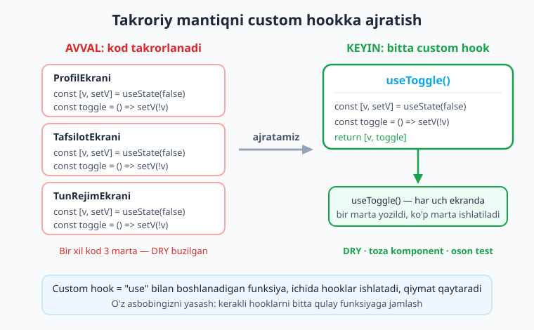
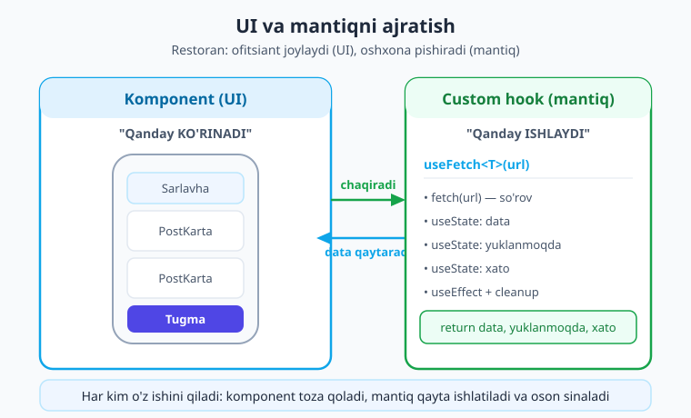
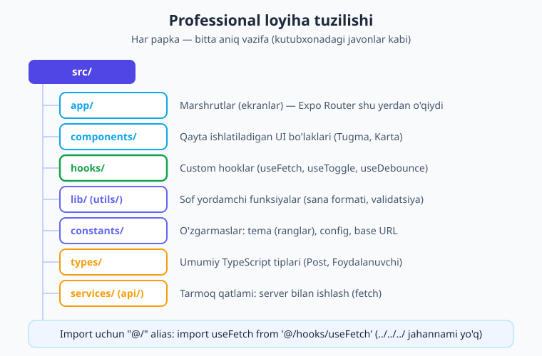

# 13 — Custom hooks va loyiha tuzilishi

[⬅️ Oldingi: 12 — Hooks chuqur](./12-hooks-chuqur.md) · [🏠 Kitob boshi](./README.md) · [Keyingi: 14 — Expo Router asoslari ➡️](./14-expo-router-asoslari.md)

> **Bu bobda:** bir xil mantiq ko'p joyda takrorlanganda uni **custom hook** (ya'ni o'zingiz yozadigan, `use` bilan boshlanadigan hook) ga ajratishni o'rganamiz. `useToggle`, `useCounter`, generik `useFetch<T>`, `useDebounce` va `useAsyncStorage` kabi amaliy hooklarni noldan yozamiz. So'ng loyihani professional darajada tartibga solishni — `app/`, `components/`, `hooks/`, `lib/`, `constants/`, `types/`, `services/` papkalari va `@/` aliasi bilan — ko'rib chiqamiz. Bob oxirida UI'ni mantiqdan ajratib, to'liq toza tuzilishda postlar ekranini yasaymiz.

---

## Kirish: bir xil ish necha marta takrorlanadi?

Tasavvur qiling, ilovangizda uchta ekran bor. Birinchisida — "Profilni ko'rsatish/yashirish" tugmasi. Ikkinchisida — "Tafsilotlarni ochish/yopish". Uchinchisida — "Qorong'i rejimni yoqish/o'chirish". Uchalasi ham bir xil ishni qiladi: bittagina **rost/yolg'on** (boolean) qiymatni almashtiradi. Va siz uchala ekranda ham aynan bir xil kodni yozasiz:

```tsx
const [ochiq, setOchiq] = useState(false);
const almashtir = () => setOchiq((oldingi) => !oldingi);
```

Keyin to'rtinchi, beshinchi ekran qo'shilganda yana shu kodni nusxalaysiz. Bir kun kelib bu mantiqda nimanidir o'zgartirish kerak bo'lsa — masalan, almashtirish vaqtida log yozish kerak bo'lsa — uni **besh joyda** topib tuzatishingiz kerak. Bittasini unutsangiz, xato yuzaga keladi.

Bu — har bir dasturchi duch keladigan muammo: **takrorlanuvchi mantiq**. Yechimi esa siz allaqachon bilasiz — funksiyaga ajratish. Lekin oddiy funksiyaga emas, chunki bu kod ichida `useState` bor, ya'ni **hooklar** ishlatadi. Hooklarni esa oddiy funksiya ichiga solib bo'lmaydi. Bizga maxsus turdagi funksiya kerak — **custom hook**.

> **Hayotiy o'xshatish.** Custom hook — bu **o'z asbobingizni yasash** kabi. Tasavvur qiling, ustaxonangizda har gal yong'oqni burash uchun bir nechta oddiy kalitni birlashtirib ishlatasiz. Buni har safar qaytadan yig'ish o'rniga, siz bir marta **maxsus asbob** yasab olasiz — kerakli kalitlarni bitta dastaga jamlaysiz. Endi yong'oq bursangiz, faqat shu bitta asbobni olasiz. Custom hook ham xuddi shunday: React'ning tayyor hooklarini (`useState`, `useEffect`...) bitta funksiyaga jamlab, o'zingizning qayta ishlatiladigan asbobingizni yasaysiz.



---

## 1. Custom hook nima?

**Custom hook** — bu nomi `use` bilan boshlanadigan, ichida boshqa hooklar (`useState`, `useEffect` va h.k.) ishlatadigan oddiy funksiya. U logikani (mantiqni) o'rab oladi va natijada biror qiymat (yoki qiymatlar to'plami) qaytaradi.

Custom hookni tushunish uchun uchta narsani eslab qoling:

1. **Nomi `use` bilan boshlanadi.** Bu shunchaki kelishuv emas — React aynan shu prefiks orqali "bu funksiya hook" deb tushunadi va hook qoidalariga rioya qilinayotganini tekshiradi. `useToggle`, `useFetch` — to'g'ri. `toggleHook`, `getFetch` — noto'g'ri (React buni hook deb hisoblamaydi).
2. **Ichida boshqa hooklar ishlatadi.** Custom hook — bu tayyor hooklarni birlashtiradigan "qadoq". Agar funksiya ichida hech qanday hook bo'lmasa, u custom hook emas, oddiy yordamchi funksiya.
3. **Qiymat qaytaradi.** Komponent shu qaytgan qiymatdan foydalanadi — xuddi `useState` ikkita element (qiymat va o'rnatuvchi) qaytarganidek.

Eng sodda custom hookni yozamiz — boolean qiymatni almashtiruvchi `useToggle`:

```tsx
// hooks/useToggle.ts
import { useState, useCallback } from 'react';

function useToggle(boshlangich = false) {
  const [holat, setHolat] = useState(boshlangich);
  // useCallback — funksiya har renderda qaytadan yaratilmasligi uchun (12-bobdan)
  const toggle = useCallback(() => setHolat((x) => !x), []);
  return [holat, toggle] as const;
}

export default useToggle;
```

E'tibor bering: `useToggle` ichida `useState` va `useCallback` ishlatildi — demak bu chinakam hook. U ikkita narsa qaytaradi: joriy holat (`holat`) va uni almashtiruvchi funksiya (`toggle`).

> **`as const` nima uchun?** `return [holat, toggle]` yozsak, TypeScript buni `(boolean | (() => void))[]` deb — ya'ni "ikkala element ham boolean YOKI funksiya bo'lishi mumkin" deb tushunadi. Bu noaniq. `as const` qo'shsak, TS aynan "birinchisi `boolean`, ikkinchisi funksiya" deb biladi va massivni **tuple** (aniq tipli, aniq tartibli) qiladi. Shunda komponentda `const [ochiq, ochYop] = useToggle()` deyilganda har bir o'zgaruvchi to'g'ri tipni oladi.

Endi uni komponentda ishlatamiz — xuddi React'ning o'z hooklaridek:

```tsx
function ProfilEkrani() {
  const [ochiq, ochYop] = useToggle();   // boshlang'ich = false
  return (
    <Pressable onPress={ochYop}>
      <Text>{ochiq ? 'Profilni yashirish' : 'Profilni ko\'rsatish'}</Text>
    </Pressable>
  );
}
```

Ko'rdingizmi — `useState` + almashtirish funksiyasi endi **bitta qatorda**. Va eng muhimi: bu mantiqni xohlagancha ko'p ekranda, faqat `const [x, almashtir] = useToggle()` yozib ishlatasiz. Bir marta yozdik — cheksiz marta ishlatamiz.

!!! note "Custom hook — sehr emas"
    Custom hook hech qanday yangi React mexanizmi emas. U shunchaki **boshqa hooklarni chaqiradigan funksiya**. Hamma "sehr" — `useState`, `useEffect` — ichida sodir bo'ladi. Siz ularni qulay tarzda qadoqlab, nom berib olasiz, xolos.

---

## 2. Custom hook qoidalari

Custom hook ham **hook** bo'lgani uchun, 12-bobda o'rgangan ikkita oltin qoidaga bo'ysunadi:

1. **Hooklarni faqat eng yuqori darajada chaqiring.** Custom hook ichida ham `useState`/`useEffect`ni `if`, `for` yoki ichki funksiya ichiga solmang — har doim funksiyaning eng tepasida chaqiring.
2. **Hooklarni faqat React funksiyalarida chaqiring.** Ya'ni komponentlarda yoki **boshqa custom hooklarda**. Oddiy funksiyada hook chaqirmang.

Va custom hookka xos uchta qo'shimcha qoida:

- **Nomi `use` bilan boshlanishi SHART.** `useToggle` — to'g'ri. Bu prefiks orqali React va linter "bu hook, qoidalarni tekshir" deb biladi. `use` siz nom bersangiz (`toggle`), uni oddiy funksiya deb hisoblaydi va ichidagi hookni xato deb belgilaydi.
- **Har bir chaqiriq mustaqil holat oladi.** Ikki komponent bir custom hookni ishlatsa, ularning holatlari **bir-biridan ajralgan** bo'ladi. `useToggle`ni A va B ekranda ishlatsangiz, A'dagi `ochiq` o'zgarsa, B'dagi o'zgarmaydi. Custom hook — holatni *ulashish* emas, mantiqni *qayta ishlatish* vositasi. (Holatni ulashish kerak bo'lsa — Context yoki Zustand, 19-bobda.)
- **Kirish (argument) va chiqish (qaytariladigan qiymat) ni o'ylab loyihalang.** Yaxshi hook — kirishi sodda, chiqishi tushunarli bo'lgan hook.

!!! warning "Eng keng tarqalgan xato: `use` prefiksini unutish"
    `function toggle() { const [v, setV] = useState(false); ... }` deb yozsangiz, ESLint darhol ogohlantiradi: "React Hook `useState` is called in function `toggle` which is neither a React function component nor a custom React Hook function". Sababi — `use` prefiksi yo'q. To'g'ri nom: `useToggle`.

---

## 3. Foydali custom hooklar to'plami

Endi amaliyotda eng ko'p kerak bo'ladigan custom hooklarni yozamiz. Bularning hammasini tayyor "asboblar to'plami" sifatida o'z loyihangizga ko'chirib ishlatishingiz mumkin.

### 3.1 `useCounter` — hisoblagich

Hisoblagich — savatdagi mahsulot soni, sahifa raqami, "yana yuklash" hisoblagichi kabi joylarda kerak bo'ladi. U uchta amalni jamlaydi: oshirish, kamaytirish, nolga qaytarish.

```tsx
// hooks/useCounter.ts
import { useState, useCallback } from 'react';

function useCounter(boshlangich = 0, qadam = 1) {
  const [soni, setSoni] = useState(boshlangich);

  const oshir = useCallback(() => setSoni((s) => s + qadam), [qadam]);
  const kamaytir = useCallback(() => setSoni((s) => s - qadam), [qadam]);
  const reset = useCallback(() => setSoni(boshlangich), [boshlangich]);

  return { soni, oshir, kamaytir, reset };
}

export default useCounter;
```

Bu safar massiv emas, **obyekt** qaytardik. Bu — ataylab qilingan tanlov. Element soni ikkitadan ko'p bo'lganda (bu yerda to'rtta: `soni`, `oshir`, `kamaytir`, `reset`), obyekt qulayroq, chunki:

- Tartib muhim emas — `const { reset, soni } = useCounter()` deyish mumkin.
- Faqat kerakligini olish mumkin — `const { soni } = useCounter()`.
- Har birining aniq nomi bor — yanglishish kamayadi.

Komponentda ishlatish:

```tsx
function SavatEkrani() {
  const { soni, oshir, kamaytir, reset } = useCounter(1);
  return (
    <View>
      <Text>Mahsulot: {soni} dona</Text>
      <Pressable onPress={oshir}><Text>+</Text></Pressable>
      <Pressable onPress={kamaytir}><Text>-</Text></Pressable>
      <Pressable onPress={reset}><Text>Tozalash</Text></Pressable>
    </View>
  );
}
```

!!! tip "Massiv yoki obyekt — qaysi biri?"
    Qoida sodda: **ikkita element** qaytarsangiz — massiv (`useState` kabi: `[qiymat, setter]`), nom berish foydalanuvchiga qoladi. **Uch va undan ko'p** element qaytarsangiz — obyekt, har biriga aniq nom bering.

### 3.2 `useFetch<T>` — ma'lumot yuklash (generik)

Bu — eng ko'p ishlatiladigan custom hooklardan biri. Deyarli har bir ekran internetdan ma'lumot oladi va har safar bir xil mantiq takrorlanadi: yuklashni boshlash, kutish, natija yoki xatoni olish. 11-bobda buni `useEffect` bilan qo'lda yozgan edik — endi uni bir marta hookka jamlaymiz.

Eng qiziq tomoni — bu hook **generik** (umumiy) bo'ladi. Ya'ni u qanday ma'lumot kelishini oldindan bilmaydi: postmi, foydalanuvchimi, mahsulotmi. TypeScript'ning `<T>` (tip parametri) mexanizmi shu uchun kerak — hookni chaqirganda qaysi tipni kutayotganingizni aytasiz, qolganini TS o'zi hal qiladi.

```tsx
// hooks/useFetch.ts
import { useState, useEffect } from 'react';

type FetchHolati<T> = {
  data: T | null;
  yuklanmoqda: boolean;
  xato: string | null;
};

function useFetch<T>(url: string): FetchHolati<T> {
  const [data, setData] = useState<T | null>(null);
  const [yuklanmoqda, setYuklanmoqda] = useState(true);
  const [xato, setXato] = useState<string | null>(null);

  useEffect(() => {
    let bekorQilindi = false;          // tozalash uchun (11-bobdan)
    setYuklanmoqda(true);
    setXato(null);

    fetch(url)
      .then((javob) => {
        if (!javob.ok) throw new Error(`HTTP xatosi: ${javob.status}`);
        return javob.json();
      })
      .then((natija: T) => {
        if (!bekorQilindi) setData(natija);
      })
      .catch((e: unknown) => {
        if (!bekorQilindi) {
          setXato(e instanceof Error ? e.message : 'Noma\'lum xato');
        }
      })
      .finally(() => {
        if (!bekorQilindi) setYuklanmoqda(false);
      });

    return () => {
      bekorQilindi = true;   // komponent yo'qolsa, eski javobni e'tiborsiz qoldiramiz
    };
  }, [url]);

  return { data, yuklanmoqda, xato };
}

export default useFetch;
```

Bu hookda 11-bobda o'rgangan barcha to'g'ri usullar jamlangan:

- **Uchta holat:** `data` (ma'lumot), `yuklanmoqda` (kutish jarayoni), `xato` (xatolik). UI'da shu uch holatga qarab nima ko'rsatishni hal qilamiz.
- **`bekorQilindi` bayrog'i** (cleanup): agar komponent ekrandan yo'qolsa yoki `url` o'zgarsa, eski so'rovning kech kelgan javobini e'tiborsiz qoldiramiz — bu "holat o'zgartirish, lekin komponent yo'q" xatosini oldini oladi.
- **`[url]` bog'liqlik** (dependency): `url` o'zgarsa, hook avtomatik qaytadan yuklaydi.

Endi e'tibor bering — buni komponentda ishlatish naqadar qisqa:

```tsx
type Post = { id: number; title: string; body: string };

function PostlarEkrani() {
  // <Post[]> deb aytdik — TS endi data'ni Post[] | null deb biladi
  const { data, yuklanmoqda, xato } = useFetch<Post[]>(
    'https://jsonplaceholder.typicode.com/posts'
  );
  // ... data, yuklanmoqda, xato bilan ishlash
}
```

`useFetch<Post[]>` deganimizda, `data` avtomatik `Post[] | null` tipini oladi. Boshqa ekranda `useFetch<Foydalanuvchi>` desangiz — `data` `Foydalanuvchi | null` bo'ladi. Bitta hook, cheksiz tip. Bu — generiklarning kuchi.

!!! note "Bu kod tsc bilan tekshirilgan"
    Yuqoridagi `useFetch` va undan keyingi to'liq misol jonli Expo loyihada `npx tsc --noEmit` bilan sinab ko'rildi — TypeScript xatolarisiz o'tdi.

### 3.3 `useDebounce` — qidiruvni "tinchlantirish"

Tasavvur qiling, qidiruv maydoni bor. Foydalanuvchi "react native" deb yozadi — bu 12 ta harf, ya'ni 12 ta o'zgarish. Agar har bir harfda serverga so'rov yuborsangiz, 12 ta keraksiz so'rov ketadi! Kerakli javob — faqat oxirgisi. Qolgan 11 tasi — behuda.

**Debounce** ("dabauns" — "qaytarishni kechiktirish") — bu shu muammoni hal qiladi: u qiymat o'zgarishni to'xtatib, belgilangan vaqt (masalan, 400 ms) **jim turganidan keyingina** yangi qiymatni qaytaradi.

> **Hayotiy o'xshatish.** Debounce — bu **liftning eshigi** kabi. Lift eshigi siz tugmani bosishingiz bilan darrov yopilmaydi — u biroz kutadi. Agar shu vaqtda yana kimdir kirsa, taymer qaytadan boshlanadi. Hamma kirib bo'lib, biroz jim turilgandagina eshik yopiladi. Debounce ham xuddi shunday: har bosishda taymer qaytadan boshlanadi, jim turilgandagina amal bajariladi.

```tsx
// hooks/useDebounce.ts
import { useState, useEffect } from 'react';

function useDebounce<T>(qiymat: T, kechikish = 500): T {
  const [debounced, setDebounced] = useState(qiymat);

  useEffect(() => {
    // har o'zgarishda taymer o'rnatamiz
    const taymer = setTimeout(() => setDebounced(qiymat), kechikish);
    // qiymat yana o'zgarsa, eski taymerni bekor qilamiz (taymer qayta boshlanadi)
    return () => clearTimeout(taymer);
  }, [qiymat, kechikish]);

  return debounced;
}

export default useDebounce;
```

Sirning kaliti — `useEffect`ning **tozalash funksiyasida** (`return () => clearTimeout(taymer)`). Qiymat har o'zgarganda: avval eski taymer bekor qilinadi, keyin yangisi o'rnatiladi. Foydalanuvchi yozishni to'xtatib, `kechikish` vaqtdan ko'proq jim tursa — taymer ishga tushadi va `debounced` yangilanadi.

Qidiruvda ishlatish — `useFetch` bilan birga, juda chiroyli chiqadi:

```tsx
function QidiruvEkrani() {
  const [matn, setMatn] = useState('');
  const debouncedMatn = useDebounce(matn, 400);   // 400 ms jim turilsa
  // so'rov faqat debouncedMatn o'zgarganda yuboriladi, har harfda emas
  const { data } = useFetch<Post[]>(
    `https://jsonplaceholder.typicode.com/posts?q=${debouncedMatn}`
  );
  return (
    <View>
      <TextInput value={matn} onChangeText={setMatn} placeholder="Qidirish..." />
      <Text>Topildi: {data?.length ?? 0} ta</Text>
    </View>
  );
}
```

E'tibor bering: bu yerda biz ikkita custom hookni **birga** ishlatdik — `useDebounce` va `useFetch`. Mana custom hooklarning chiroyi: ularni xuddi lego bo'laklaridek bir-biriga ulab, murakkab xulqni sodda kod bilan yasaysiz.

### 3.4 `useAsyncStorage` — saqlangan holat (18-bobga ko'prik)

Ba'zan holatni nafaqat xotirada, balki **telefon xotirasida** doimiy saqlash kerak: foydalanuvchi ilovani yopib qayta ochsa ham, sozlamalari (masalan, qorong'i rejim) joyida turishi kerak. Buning uchun `@react-native-async-storage/async-storage` paketi ishlatiladi (to'liq mavzu — 18-bobda). Bu yerda esa qisqacha custom hook bilan tanishamiz: u holatni `useState` kabi boshqaradi, lekin orqa fonda diskka ham saqlaydi.

```tsx
// hooks/useAsyncStorage.ts
import { useState, useEffect, useCallback } from 'react';
import AsyncStorage from '@react-native-async-storage/async-storage';

function useAsyncStorage<T>(kalit: string, boshlangich: T) {
  const [qiymat, setQiymat] = useState<T>(boshlangich);
  const [yuklandi, setYuklandi] = useState(false);

  // ilk yuklashda diskdan o'qiymiz
  useEffect(() => {
    AsyncStorage.getItem(kalit)
      .then((saqlangan) => {
        if (saqlangan != null) setQiymat(JSON.parse(saqlangan) as T);
      })
      .finally(() => setYuklandi(true));
  }, [kalit]);

  // saqlash: xotirani ham, diskni ham yangilaymiz
  const saqla = useCallback(
    async (yangi: T) => {
      setQiymat(yangi);
      await AsyncStorage.setItem(kalit, JSON.stringify(yangi));
    },
    [kalit]
  );

  return { qiymat, saqla, yuklandi };
}

export default useAsyncStorage;
```

Ishlatish `useState`ga juda o'xshaydi, faqat qiymat doimiy saqlanadi:

```tsx
const { qiymat: tunRejimi, saqla: saqlaTunRejimi } = useAsyncStorage('tunRejimi', false);
// saqlaTunRejimi(true) -> ham UI yangilanadi, ham diskka yoziladi
```

Mana shu yagona misol "bir parcha mantiqni custom hookka qadoqlash qancha qulay" ekanini ko'rsatadi: AsyncStorage'ning barcha murakkabligi (async o'qish/yozish, JSON aylantirish) hook ichida yashiringan. Komponent esa shunchaki "qiymat va uni saqlovchi funksiya" ko'radi — go'yo oddiy `useState`. To'liq tafsilotlar (xatolarni boshqarish, ko'p kalit, xavfsizlik) — 18-bobda.

!!! warning "AsyncStorage maxfiy ma'lumot uchun emas"
    AsyncStorage shifrlanmagan. Token, parol kabi maxfiy narsalarni unga saqlamang — buning uchun `expo-secure-store` bor (18-bob). AsyncStorage faqat oddiy sozlamalar, kesh kabi maxfiy bo'lmagan ma'lumot uchun.

---

## 4. Nega custom hook ishlatamiz? (uchta sabab)

Custom hookning foydasini uch jihatdan jamlaymiz:

1. **DRY — takrorlanmaslik** (*Don't Repeat Yourself* — "o'zingni takrorlama"). Bir xil mantiqni o'nta ekranda nusxalash o'rniga, bir marta yozasiz. O'zgartirish kerak bo'lsa — bir joyda tuzatasiz, hamma joyda o'zgaradi. Xato ehtimoli keskin kamayadi.

2. **Komponent toza qoladi.** Bu — eng muhim sabab. Custom hook **mantiqni** (qanday ishlash) o'rab oladi, komponent esa faqat **UI** (qanday ko'rinish) bilan shug'ullanadi. `PostlarEkrani` ichida endi `fetch`, `then`, `catch`, uchta `useState` yo'q — faqat bitta `useFetch` chaqiriqi va chiroyli JSX. Kod o'qishga oson.

3. **Test qilish oson.** Custom hook — alohida funksiya. Uni komponentdan ajratib, mustaqil sinab ko'rish mumkin (26-bob). UI'ni rendersiz, faqat mantiqni tekshirasiz.

> **Hayotiy o'xshatish.** Komponent — bu **oshpaz**, custom hook — **oshxonadagi tayyor sous**. Oshpaz har gal sousni noldan tayyorlamaydi — tayyor sousni oladi va taomga qo'shadi. Sousni alohida, sifatli qilib tayyorlab qo'yasiz (custom hook), keyin uni istalgan taomga (komponentga) qo'shasiz. Taomning ko'rinishi (UI) — oshpazda, sousning ta'mi (mantiq) — sousda. Har biri o'z ishini qiladi.



---

## 5. Loyiha tuzilishi: papkalarni tartibga solish

Ikkita-uchta fayldan iborat o'quv loyihangizda hamma narsani bitta papkaga tashlab qo'yish mumkin. Lekin loyiha o'sgani sayin — 20, 50, 200 fayl bo'lganda — tartibsizlik fojiaga aylanadi. Kerakli faylni topolmaysiz, qaysi kod qaerda ekanini bilmaysiz, jamoangiz adashadi.

> **Hayotiy o'xshatish.** Loyiha tuzilishi — **kutubxonadagi javonlar** kabi. Agar kutubxonachi barcha kitobni bitta uyumga tashlasa, kerakli kitobni topish — soatlar ishi. Lekin kitoblar mavzu bo'yicha javonlarga (fantastika, tarix, ilm-fan) terilgan bo'lsa, har qanday kitobni bir daqiqada topasiz. Papkalar — javonlar, fayllar — kitoblar. To'g'ri tartiblangan loyihada har bir fayl o'z "javonida".

Professional React Native (Expo) loyihasida quyidagi papka tuzilishi keng tarqalgan:



```text
src/
├── app/            # Marshrutlar (ekranlar). Expo Router shu yerdan o'qiydi.
│   ├── _layout.tsx
│   ├── index.tsx
│   └── postlar.tsx
├── components/     # Qayta ishlatiladigan UI bo'laklari (tugma, karta, badge)
│   ├── Tugma.tsx
│   └── PostKarta.tsx
├── hooks/          # Custom hooklar (useFetch, useToggle, useDebounce...)
│   ├── useFetch.ts
│   └── useToggle.ts
├── lib/            # (yoki utils/) Sof yordamchi funksiyalar (sana formati, validatsiya)
│   └── format.ts
├── constants/      # O'zgarmas qiymatlar: tema (ranglar), config, URL
│   └── theme.ts
├── types/          # Umumiy TypeScript tiplari (Post, Foydalanuvchi)
│   └── index.ts
└── services/       # (yoki api/) Tarmoq qatlami: server bilan ishlash
    └── api.ts
```

Har bir papkaning aniq mas'uliyati bor:

- **`app/`** — ekranlar va marshrutlar. Expo Router shu papkadagi fayllarni avtomatik marshrutga aylantiradi (14-bob). Bu yerga faqat **ekran** komponentlari tushadi.
- **`components/`** — qayta ishlatiladigan **UI bo'laklari**: `Tugma`, `Karta`, `Yuklovchi`. Bular ekran emas — ekranlar ichida ishlatiladigan "g'ishtlar".
- **`hooks/`** — barcha custom hooklaringiz. Shu bobdagilar aynan shu yerga tushadi.
- **`lib/`** yoki **`utils/`** — React'ga bog'liq bo'lmagan sof funksiyalar: sanani formatlash, matnni qisqartirish, raqamni tekshirish. Hook emas, UI emas — faqat mantiq.
- **`constants/`** — o'zgarmas qiymatlar: rang palitrasi, shrift o'lchamlari, server manzili (base URL), sozlamalar.
- **`types/`** — loyiha bo'ylab ishlatiladigan TypeScript tiplari va interfeyslar: `Post`, `Foydalanuvchi`, `Mahsulot`.
- **`services/`** yoki **`api/`** — server bilan aloqa qatlami: `fetch` so'rovlari shu yerda jamlanadi (hookdan ajratilgan holda).

!!! note "SDK 56: `app/` yoki `src/app/`?"
    Expo SDK 56 ning default shabloni routing ildizini **`src/app/`** qiladi, qolgan papkalar (`components`, `hooks`...) ham `src/` ichida bo'ladi. Eskiroq loyihalarda ular ildizda — `app/`, `components/`... bo'lishi mumkin. Ikki holatda ham qoidalar **aynan bir xil**. Kitobda qisqalik uchun `app/`, `hooks/` deb yozamiz; sizning loyihangizda ular `src/` ostida bo'lsa, shunchaki `src/` qo'shing.

### 5.1 `@/` alias bilan import

Papkalar chuqurlashganda import yo'llari xunuklashadi:

```tsx
// xunuk va mo'rt — papka ko'chsa, buziladi
import useFetch from '../../../hooks/useFetch';
import { Tugma } from '../../components/Tugma';
```

Bu `../../../` "nuqta-nuqta" jahannami. Yechim — **`@/` aliasi**. SDK 56 shabloni `tsconfig.json`da `@/*` ni `src/*` ga bog'laydi (yoki `app/*` ga, loyihaga qarab):

```json
{
  "compilerOptions": {
    "paths": {
      "@/*": ["./src/*"]
    }
  }
}
```

Endi har qanday joydan, fayl qancha chuqur bo'lsa ham, bir xil va tushunarli yozasiz:

```tsx
import useFetch from '@/hooks/useFetch';
import { Tugma } from '@/components/Tugma';
import type { Post } from '@/types';
```

`@/` — "loyihaning ildizidan boshla" degani. Faylni boshqa papkaga ko'chirsangiz ham, import o'zgarmaydi. Bu — kichik o'zgarish, lekin kundalik ishni juda yengillashtiradi.

!!! tip "Aliasni shablon o'zi sozlab beradi"
    `npx create-expo-app` bilan yaratilgan loyihada `@/*` aliasi `tsconfig.json`da allaqachon sozlangan. Qo'lda hech narsa qilish shart emas — to'g'ridan-to'g'ri `@/hooks/...` deb yozaverasiz.

---

## 6. Feature-based vs type-based tuzilish

Yuqoridagi tuzilish — **type-based** (tur bo'yicha): fayllar **nima ekaniga** qarab guruhlanadi (hammasi `components/`, hammasi `hooks/`). Bu kichik va o'rta loyihalar uchun ajoyib.

Lekin loyiha juda kattalashganda (masalan, "profil", "savat", "to'lov", "chat" kabi yirik bo'limlar paydo bo'lganda) ikkinchi yondashuv qulayroq bo'ladi — **feature-based** (xususiyat bo'yicha): fayllar **qaysi bo'limga** tegishliligiga qarab guruhlanadi.

| | **Type-based** (tur bo'yicha) | **Feature-based** (xususiyat bo'yicha) |
|---|---|---|
| **Guruhlash** | Fayl turi bilan: `components/`, `hooks/` | Bo'lim bilan: `features/profil/`, `features/savat/` |
| **Ichi** | `components/`da hamma komponent | Har bo'limda o'z `components/`, `hooks/`, `api/` |
| **Qachon yaxshi** | Kichik/o'rta loyiha | Katta loyiha, ko'p jamoa |
| **Afzalligi** | Sodda, tushunarli, tez boshlash | Bo'limlar mustaqil, kengaytirish oson |

Feature-based tuzilishda har bir bo'lim "kichik loyiha" kabi bo'ladi:

```text
src/
├── features/
│   ├── profil/
│   │   ├── components/
│   │   ├── hooks/
│   │   └── api.ts
│   └── savat/
│       ├── components/
│       ├── hooks/
│       └── api.ts
├── app/            # marshrutlar baribir shu yerda
└── shared/         # bir necha bo'lim ulashadigan umumiy kod
```

!!! tip "Qaysidan boshlash kerak?"
    Boshlovchi yoki o'rta loyiha uchun **type-based** dan boshlang — u soddaroq va aniq. Loyiha o'sib, bir nechta yirik bo'lim paydo bo'lganda, kerakli bo'limlarni asta-sekin **feature-based** ga ko'chirasiz. Hozircha noto'g'ri tanlovdan qo'rqmang — ikkala usul ham to'g'ri, faqat masshtabga bog'liq.

---

## 7. Komponentni ajratish: UI'ni mantiqdan ajratish

Custom hook va papka tuzilishini birlashtirib, eng muhim amaliy ko'nikmaga kelamiz: **katta komponentni kichik, mas'uliyatli bo'laklarga ajratish.**

Yomon komponent — "hamma narsani qiladigan" gigant: ichida `fetch`, beshta `useState`, murakkab JSX, stillar — hammasi aralash, 300 qator. Uni o'qib bo'lmaydi, sinab bo'lmaydi, o'zgartirish — qo'rqinchli.

Yaxshi yondashuv — **ikki o'qni** ajratish:

1. **Mantiq o'qi** — custom hookka chiqadi (`useFetch`, `useDebounce`). "Qanday ishlaydi".
2. **UI o'qi** — kichik komponentlarga bo'linadi (`PostKarta`, `Yuklovchi`). "Qanday ko'rinadi".

Natijada ekran komponenti — faqat **dirijyor**: kerakli hookni chaqiradi, kerakli kichik komponentlarni joylashtiradi. O'zi hech qanday murakkab ish qilmaydi.

> **Hayotiy o'xshatish.** Bu — **restoran** kabi. Ofitsiant (ekran komponenti) ovqat pishirmaydi va idish yuvmaydi — u faqat oshxonaga (custom hook) buyurtma beradi va tayyor taomni (UI bo'laklarini) stolga joylaydi. Har kim o'z ishini qiladi: oshpaz — pishiradi, ofitsiant — joylaydi. Hamma ish bitta odamda bo'lsa — xaos.

---

## 8. To'liq misol: postlar ekrani toza tuzilishda

Endi hamma narsani birlashtiramiz. Quyida — to'liq, ishlaydigan misol: `useFetch` hooki, alohida `PostKarta` komponenti va ularni bog'lovchi toza ekran. Bu kod jonli loyihada `npx tsc --noEmit` bilan tekshirilgan.

Avval — tip (uni `types/` ga qo'yamiz):

```tsx
// types/index.ts
export type Post = {
  id: number;
  title: string;
  body: string;
};
```

Hook — `useFetch` (3.2-bo'limdan, `hooks/useFetch.ts` ga). Endi UI bo'lagi — bitta postni ko'rsatuvchi karta (`components/`):

```tsx
// components/PostKarta.tsx
import { View, Text, StyleSheet } from 'react-native';
import type { Post } from '@/types';

type PostKartaProps = { post: Post };

export default function PostKarta({ post }: PostKartaProps) {
  return (
    <View style={styles.karta}>
      <Text style={styles.sarlavha}>{post.title}</Text>
      <Text style={styles.matn} numberOfLines={2}>{post.body}</Text>
    </View>
  );
}

const styles = StyleSheet.create({
  karta: {
    backgroundColor: '#ffffff',
    borderRadius: 12,
    padding: 16,
    borderWidth: 1,
    borderColor: '#e2e8f0',
  },
  sarlavha: { fontSize: 16, fontWeight: '700', color: '#1e293b', marginBottom: 4 },
  matn: { fontSize: 14, color: '#475569' },
});
```

`PostKarta` — faqat UI. U `fetch` ham, holat ham bilmaydi — shunchaki bitta `post`ni oladi va chiroyli ko'rsatadi. Mana shu — toza, qayta ishlatiladigan komponent.

Endi ekran — hammasini bog'lovchi dirijyor (`app/`):

```tsx
// app/postlar.tsx
import { View, Text, FlatList, ActivityIndicator, StyleSheet } from 'react-native';
import useFetch from '@/hooks/useFetch';
import PostKarta from '@/components/PostKarta';
import type { Post } from '@/types';

export default function PostlarEkrani() {
  const { data, yuklanmoqda, xato } = useFetch<Post[]>(
    'https://jsonplaceholder.typicode.com/posts'
  );

  // 1-holat: yuklanmoqda
  if (yuklanmoqda) {
    return (
      <View style={styles.markaz}>
        <ActivityIndicator size="large" color="#4f46e5" />
        <Text style={styles.holatMatn}>Yuklanmoqda...</Text>
      </View>
    );
  }

  // 2-holat: xato
  if (xato) {
    return (
      <View style={styles.markaz}>
        <Text style={styles.xatoMatn}>Xato: {xato}</Text>
      </View>
    );
  }

  // 3-holat: ma'lumot tayyor
  return (
    <FlatList
      data={data}
      keyExtractor={(item) => item.id.toString()}
      contentContainerStyle={styles.royxat}
      renderItem={({ item }) => <PostKarta post={item} />}
      ListEmptyComponent={<Text style={styles.holatMatn}>Post topilmadi</Text>}
    />
  );
}

const styles = StyleSheet.create({
  markaz: { flex: 1, alignItems: 'center', justifyContent: 'center', gap: 8 },
  royxat: { padding: 16, gap: 12 },
  holatMatn: { fontSize: 14, color: '#475569' },
  xatoMatn: { fontSize: 14, color: '#dc2626' },
});
```

Bu ekranga diqqat bilan qarang. U **uch holatni** boshqaradi (yuklanmoqda, xato, ma'lumot) — lekin **hech qanday murakkab mantiq yo'q**. `fetch` qaerda? Hookda. Karta dizayni qaerda? `PostKarta`da. Ekran — faqat "agar yuklanmoqda — spinner, agar xato — xabar, aks holda — ro'yxat" deydi. Toza, o'qiladigan, sinaladigan.

Mana to'liq tuzilish:

```text
src/
├── app/
│   └── postlar.tsx       # ekran (dirijyor)
├── components/
│   └── PostKarta.tsx     # UI bo'lagi
├── hooks/
│   └── useFetch.ts       # mantiq
└── types/
    └── index.ts          # Post tipi
```

To'rtta fayl, har biri **bitta ish** qiladi. Yangi ekran kerakmi? `useFetch`ni qayta ishlatasiz. Karta dizaynini o'zgartirasizmi? Faqat `PostKarta`ga tegasiz. Yuklash mantiqida xato bormi? Faqat `useFetch`ni tuzatasiz. Mana professional loyiha qanday tashkil etiladi.

!!! question "Tekshirib ko'ring"
    Yuqoridagi `PostlarEkrani`da `data` `Post[] | null` tipiga ega. `FlatList`ning `data` xususiyati `null` ni ham qabul qiladimi? (Ha — `FlatList` `data={null}` bo'lsa bo'sh ro'yxat ko'rsatadi va `ListEmptyComponent`ni chizadi. Shuning uchun qo'shimcha tekshiruv shart emas.)

---

## Xulosa

- **Custom hook** — nomi `use` bilan boshlanadigan, ichida boshqa hooklar ishlatadigan va qiymat qaytaradigan funksiya. Takrorlanuvchi mantiqni bir joyga jamlash uchun.
- Custom hook **mantiqni** qadoqlaydi, komponent esa faqat **UI** bilan qoladi — kod toza, o'qiladigan, sinaladigan bo'ladi.
- `use` prefiksi shart — React aynan shu orqali hookni taniydi va hook qoidalarini tekshiradi.
- Ikkita element qaytarsangiz — **massiv** (`as const` bilan), uchdan ko'p bo'lsa — **obyekt**.
- Amaliy hooklar: `useToggle` (boolean), `useCounter` (hisoblagich), generik `useFetch<T>` (ma'lumot yuklash), `useDebounce` (qidiruvni tinchlantirish), `useAsyncStorage` (saqlangan holat).
- Custom hookning uch foydasi: **DRY** (takrorlanmaslik), **toza komponent**, **oson test**.
- Loyihani papkalarga ajrating: `app/` (marshrutlar), `components/` (UI), `hooks/` (custom hooklar), `lib/`/`utils/` (yordamchi), `constants/` (o'zgarmaslar), `types/` (tiplar), `services/`/`api/` (tarmoq). Import uchun **`@/` alias**.
- Kichik/o'rta loyiha — **type-based**; juda katta loyiha — **feature-based** tuzilish.

## Amaliy mashqlar

1. **`useToggle`'ni kengaytiring.** `useToggle` hookiga uchinchi qaytariladigan qiymat qo'shing — qiymatni to'g'ridan-to'g'ri o'rnatuvchi `ochYopBelgilab(qiymat: boolean)` funksiyasi. Endi u `[holat, almashtir, belgila]` qaytarsin. Massiv o'rniga obyekt qaytarish yaxshiroqmi — o'ylab ko'ring.

2. **`useFetch`'ni qayta-yuklash bilan.** `useFetch`ga `qaytaYukla` nomli funksiya qo'shing, u chaqirilganda ma'lumotni serverdan qayta oladi. Maslahat: `useState` bilan "yangilash hisoblagichi" yarating va uni `useEffect` bog'liqliklariga qo'shing.

3. **`useDebounce` bilan qidiruv ekrani.** `TextInput` + `useDebounce` + `useFetch`ni birlashtirib, foydalanuvchi yozishni to'xtatgandan 500 ms keyingina server'ga so'rov yuboradigan qidiruv ekrani yasang. Har bir harfda so'rov ketmayotganini `console.log` bilan tekshiring.

4. **Loyihani qayta tashkil eting.** Oldingi boblarda yozgan biror loyihangizni oling. Hamma kodni `app/`, `components/`, `hooks/`, `types/` papkalariga ajrating. Importlarni `@/` aliasiga o'tkazing. Eng kamida bitta takrorlanuvchi mantiqni custom hookka chiqaring.

5. **`useCounter`'ni chegaralar bilan.** `useCounter`ga ixtiyoriy `min` va `max` argumentlarini qo'shing: hisoblagich shu chegaradan chiqmasin (`oshir` `max`da to'xtaydi, `kamaytir` `min`da). Bu — savatdagi mahsulot soni kabi real holatlar uchun foydali.

---

[⬅️ Oldingi: 12 — Hooks chuqur](./12-hooks-chuqur.md) · [🏠 Kitob boshi](./README.md) · [Keyingi: 14 — Expo Router asoslari ➡️](./14-expo-router-asoslari.md)
