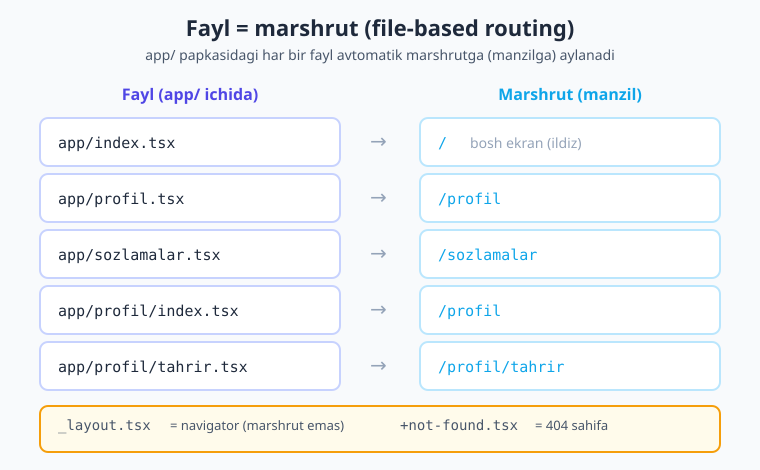
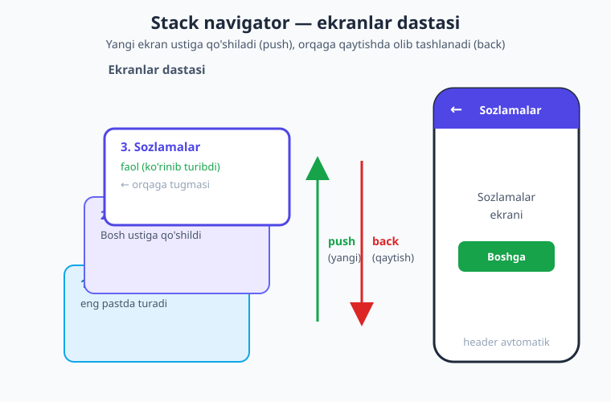
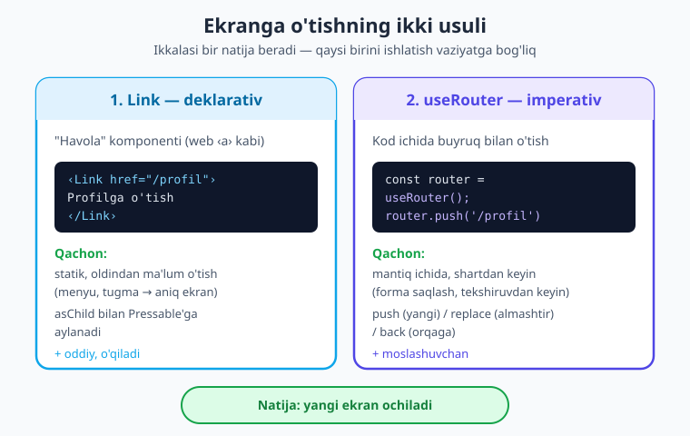

# 14 — Expo Router asoslari

[⬅️ Oldingi: 13 — Custom hooks va loyiha tuzilishi](./13-custom-hooks-tuzilish.md) · [🏠 Kitob boshi](./README.md) · [Keyingi: 15 — Tabs va Drawer navigatsiya ➡️](./15-tabs-drawer.md)

> **Bu bobda:** ilovani **bir nechta ekranli** qilamiz. **Navigatsiya** nimaligini, **Expo Router**ning "fayl = marshrut" (file-based routing) g'oyasini, `_layout.tsx` orqali **Stack navigator** o'rnatishni o'rganamiz. So'ng ekranlar orasida `Link` (deklarativ) va `useRouter` (imperativ) bilan o'tishni, sarlavha/header'ni sozlashni, `Slot`, `usePathname` va `+not-found` (404) sahifasini ko'rib chiqamiz. Oxirida 3 ekranli to'liq ilova yig'amiz — kodi jonli Expo loyihada `tsc` bilan tekshirilgan.

---

## Kirish: bitta ekran kam keladi

Shu paytgacha biz yozgan ilovalarning hammasi **bitta ekran**dan iborat edi: hisoblagich, ro'yxat, forma. Lekin haqiqiy ilovalarni eslang. Telegram'ni ochasiz — chatlar ro'yxati ko'rinadi. Bir chatni bosasiz — yangi ekran ochiladi, suhbat ko'rinadi. Profil rasmini bosasiz — yana boshqa ekran. Instagram, bank ilovasi, do'kon ilovasi — barchasi **ko'p ekranli**.

Ekrandan ekranga o'tish, orqaga qaytish, qaysidir ekranni yopib boshqasini ochish — bularning hammasi **navigatsiya** deyiladi. Bu bob — kitobimizning yangi katta bo'limining boshlanishi: **navigatsiya**. Undan oldingi 13 bobda biz bitta ekran ichida ishladik; endi ilovani **xonalarga** ajratamiz.

> **Hayotiy o'xshatish.** Ilovani **uy** deb tasavvur qiling. Hozirgacha biz bitta xonali uyda yashardik — hamma narsa bir joyda. Lekin haqiqiy uyda **bir nechta xona** bor: yotoqxona, oshxona, mehmonxona, hammom. Siz xonadan xonaga **eshiklar** orqali o'tasiz. **Navigatsiya** — aynan shu eshiklar tizimi: qaysi xonada turibsiz, qaysi xonaga o'tasiz, qanday qilib orqaga (chiqib ketgan xonangizga) qaytasiz. Har bir **ekran** — bitta xona; **navigator** — xonalarni bog'lab turuvchi yo'lak va eshiklar.

---

## 1. Navigatsiya nima

**Navigatsiya** (navigation) — bu ilovadagi **bir ekrandan boshqasiga o'tish** jarayoni va uni boshqaradigan tizim. Foydalanuvchi tugma bossa yoki biror element ustiga bossa — yangi ekran ochiladi; orqaga tugmasini bossa — avvalgi ekranga qaytadi.

Tipik oqim:

- **Bosh ekran** (chatlar ro'yxati, mahsulotlar, postlar) → foydalanuvchi bir elementni bosadi →
- **Detal ekran** (bitta chat, bitta mahsulot) → "Sozlamalar" tugmasini bosadi →
- **Sozlamalar ekrani** → orqaga → detal → orqaga → bosh.

Ko'p ekranli ilovada uchta narsa kerak bo'ladi:

1. **Ekranlarni e'lon qilish** — qaysi ekranlar mavjud (bosh, profil, sozlamalar...).
2. **Ekranlar orasida o'tish** — qaysi tugma qaysi ekranni ochadi.
3. **Tarixni saqlash** — qayerdan kelganini eslab, orqaga qaytarish.

Bularning hammasini qo'lda yozish juda murakkab. Shuning uchun **navigatsiya kutubxonasi** ishlatamiz. Expo loyihalarida bu — **Expo Router**.

!!! note "Eslatma"
    React Native dunyosida ikkita asosiy yondashuv bor: **React Navigation** (an'anaviy, kodda ekranlarni qo'lda ro'yxatlaysiz) va **Expo Router** (zamonaviy, fayllarga asoslangan). Expo Router aslida React Navigation ustiga qurilgan — ya'ni ichkarida o'sha kuchli dvigatel ishlaydi, lekin sizga ancha soddaroq, fayllarga asoslangan usulni beradi. Bu kitob — Expo asosida, shuning uchun biz **Expo Router**'ni o'rganamiz.

---

## 2. Expo Router: fayl = marshrut

Expo Router'ning bosh g'oyasi juda sodda va kuchli: **har bir fayl — bitta marshrut (ekran)**. Bu **file-based routing** ("fayllarga asoslangan marshrutlash") deb ataladi.

> **Hayotiy o'xshatish.** Buni **web sayt**ga o'xshating. Web saytda har bir sahifa — alohida fayl/manzil: `sayt.uz/` (bosh sahifa), `sayt.uz/haqida` (haqida sahifasi), `sayt.uz/aloqa` (aloqa). Manzil qatoriga yo'lni yozasiz — mos sahifa ochiladi. Expo Router ilovangizni xuddi shunday qiladi: papkadagi har bir fayl — bitta "sahifa" (ekran), fayl nomi esa uning **manzili** (marshruti) bo'ladi.

Demak, yangi ekran qo'shish uchun biror joyda ro'yxatga olishingiz **shart emas** — shunchaki `app/` papkasiga yangi fayl yaratasiz, va u avtomatik marshrutga aylanadi. Fayl nomi marshrutga qanday mos kelishini ko'ramiz:



Asosiy qoidalar:

| Fayl | Marshrut (manzil) | Izoh |
|---|---|---|
| `app/index.tsx` | `/` | `index` — papkaning **bosh** ekrani (ildiz) |
| `app/profil.tsx` | `/profil` | Fayl nomi = marshrut nomi |
| `app/sozlamalar.tsx` | `/sozlamalar` | |
| `app/profil/index.tsx` | `/profil` | Papka + `index` = papkaning ildizi |
| `app/profil/tahrir.tsx` | `/profil/tahrir` | Ichki (joylashgan) marshrut |
| `app/_layout.tsx` | — (marshrut emas) | Layout — ekranlarni o'raydi (3-bo'lim) |
| `app/+not-found.tsx` | har qanday topilmagan yo'l | 404 sahifasi (9-bo'lim) |

Diqqat qiling: `index.tsx` — bu maxsus nom. U turgan papkaning **asosiy** (ildiz) manzilini bildiradi. `app/index.tsx` → `/` (ilova ochilganda birinchi ko'rinadigan ekran). `app/profil/index.tsx` → `/profil`.

!!! warning "Ehtiyot bo'ling"
    `_` (pastki chiziq) bilan boshlangan fayllar (`_layout.tsx`) va `+` bilan boshlanganlari (`+not-found.tsx`) — **maxsus** fayllar, ular oddiy marshrut emas. Oddiy ekran fayllarini oddiy nom bilan ataing (`profil.tsx`, `sozlamalar.tsx`), katta harf yoki bo'sh joy ishlatmang.

> **`app/` yoki `src/app/`?** SDK 56 standart shabloni marshrut ildizini **`src/app/`** papkasiga joylashtiradi (`app/` emas). Qoidalar **aynan bir xil** — faqat papka joyi boshqacha. Bu bobda qisqalik uchun biz `app/` yozamiz; agar loyihangizda `src/app/` bo'lsa, shu papka ichida ishlayvering. Ikkalasida ham `app/index.tsx` ↔ `src/app/index.tsx` bir xil `/` marshrutiga aylanadi.

---

## 3. `_layout.tsx` — ekranlarni o'rab turuvchi qatlam

Faqat ekran fayllari yetarli emas. Bizga ekranlarni **bog'lab**, ular orasida o'tishni boshqaradigan narsa kerak — **navigator**. Navigatorni biz **`_layout.tsx`** faylida belgilaymiz.

**`_layout.tsx`** (layout fayli) — bu o'zi ekran **emas**. U turgan papkadagi barcha ekranlarni **o'rab** (qoplab) turuvchi qobiq. Unda navigator (Stack, Tabs va h.k.) joylashadi.

> **Hayotiy o'xshatish.** `_layout.tsx` — bu **ramka** kabi. Tasavvur qiling, sizda bir nechta rasm (ekran) bor. Layout — bularni ushlab turadigan **albom yoki devordagi ramkalar tizimi**. Rasmlar almashadi, lekin ramka (yuqoridagi sarlavha, orqaga tugmasi, ranglar) o'sha-o'sha turadi. Layout har bir ekranni shu umumiy "qobiq" ichida ko'rsatadi.

Eng muhimi — **ildiz layout**: `app/_layout.tsx`. U **butun ilovani** o'raydi. Har bir ilovada kamida bitta `_layout.tsx` bo'ladi. Ichki papkalar ham o'z `_layout.tsx`'iga ega bo'lishi mumkin (masalan, `app/profil/_layout.tsx` — faqat profil bo'limini o'raydi).

```text
app/
├─ _layout.tsx       ← ildiz layout (BUTUN ilovani o'raydi, navigator shu yerda)
├─ index.tsx         ← /        (bosh ekran)
├─ profil.tsx        ← /profil
└─ sozlamalar.tsx    ← /sozlamalar
```

Endi layout ichiga qanaqa navigator qo'yishni ko'ramiz.

---

## 4. Stack navigator — asosiy navigator

Eng ko'p ishlatiladigan navigator — **Stack** ("dasta"). U ekranlarni **ustma-ust** joylashtiradi.

> **Hayotiy o'xshatish.** Stack — bu **stol ustidagi qog'ozlar dastasi** yoki **kitob sahifalari** kabi. Yangi ekranga o'tganingizda — yangi qog'oz **ustiga** qo'yiladi (avvalgisi pastda turaveradi). Orqaga qaytganingizda — eng ustki qog'oz **olib tashlanadi** va ostidagi avvalgi ekran qaytadan ko'rinadi. "Stack" so'zi shuning uchun — qog'ozlar dastalanib boradi.



Diagrammada ko'rinib turibdiki:

- **push** — yangi ekranni dasta **ustiga** qo'yadi (oldinga o'tish).
- **back** — eng ustki ekranni **olib tashlaydi** (orqaga qaytish).
- Stack avtomatik ravishda yuqorida **header** (sarlavha paneli) va unda **orqaga tugmasi** (← yoki "<") chizadi.

Stack'ni ildiz layout'da o'rnatamiz. `expo-router`dan `Stack`ni import qilamiz:

```tsx
// app/_layout.tsx — eng oddiy Stack
import { Stack } from 'expo-router';

export default function RootLayout() {
  return <Stack />;
}
```

Shuncha! Bo'sh `<Stack />` ham ishlaydi — u `app/` papkadagi barcha ekranlarni avtomatik topadi va har biriga header + orqaga tugmasi beradi. Lekin odatda biz ekranlarni `<Stack.Screen>` bilan **sozlaymiz** — masalan, har biriga sarlavha (title) beramiz:

```tsx
// app/_layout.tsx — ekranlarni sozlash bilan
import { Stack } from 'expo-router';

export default function RootLayout() {
  return (
    <Stack>
      <Stack.Screen name="index" options={{ title: 'Bosh' }} />
      <Stack.Screen name="profil" options={{ title: 'Profil' }} />
      <Stack.Screen name="sozlamalar" options={{ title: 'Sozlamalar' }} />
    </Stack>
  );
}
```

Bu yerda:

- `<Stack.Screen name="index" .../>` — `name` qaysi **fayl**ga tegishli ekanini bildiradi (`index` → `index.tsx`). Kengaytmasiz (`.tsx`siz) yoziladi.
- `options={{ title: 'Bosh' }}` — o'sha ekranning sozlamalari. `title` — header'da ko'rinadigan **sarlavha**.

!!! note "Bo'sh Stack ham yetarli"
    Agar `<Stack.Screen>` yozmasangiz ham ilova ishlaydi — Expo Router ekranlarni o'zi topadi. `<Stack.Screen>`ni faqat **sozlash** kerak bo'lganda yozasiz (sarlavha, header rangi, header'ni yashirish va h.k.). Sarlavha berilmasa, fayl nomi sarlavha bo'ladi.

Endi ildiz layout va uchta ekran fayli bo'lsa — ilova ishga tushganda `index.tsx` ("Bosh") ekrani ko'rinadi, yuqorida "Bosh" sarlavhasi bilan. Faqat o'tish (navigatsiya) qoldi.

---

## 5. Ekranlar orasida o'tish

Bir ekrandan boshqasiga o'tishning **ikki** usuli bor:

1. **Deklarativ** — `<Link>` komponenti bilan (havola, web'dagi `<a>` kabi).
2. **Imperativ** — `useRouter` hook'i bilan (kod ichida `router.push(...)`).



Ikkalasini ham ko'ramiz — qachon qaysi birini ishlatishni ham aytamiz.

### 5.1 `Link` — deklarativ o'tish

**`Link`** — bu bosilganda boshqa ekranga olib o'tadigan **havola** komponenti. Web saytdagi link (`<a href="...">`) kabi, lekin native ilova uchun. `expo-router`dan import qilinadi:

```tsx
// app/index.tsx
import { View, Text, StyleSheet } from 'react-native';
import { Link } from 'expo-router';

export default function Bosh() {
  return (
    <View style={styles.box}>
      <Text style={styles.sarlavha}>Bosh ekran</Text>

      {/* Bosilganda /profil ekraniga o'tadi */}
      <Link href="/profil" style={styles.link}>
        Profilga o'tish
      </Link>

      <Link href="/sozlamalar" style={styles.link}>
        Sozlamalarga o'tish
      </Link>
    </View>
  );
}

const styles = StyleSheet.create({
  box: { flex: 1, alignItems: 'center', justifyContent: 'center', gap: 16, backgroundColor: '#f8fafc' },
  sarlavha: { fontSize: 22, fontWeight: '700', color: '#1e293b' },
  link: { fontSize: 18, color: '#4f46e5', fontWeight: '600' },
});
```

`href="/profil"` — qaysi marshrutga o'tishni bildiradi (`/` bilan boshlanadi). Link matni esa ekranda ko'k havola bo'lib ko'rinadi. Bosilsa — `/profil` ekrani ochiladi.

**`asChild` — istalgan komponentni havola qilish.** `Link` o'zicha oddiy matn ko'rsatadi. Lekin ko'pincha biz **tugma** (`Pressable`) ni bosilganda o'tadigan qilmoqchimiz. Buning uchun `asChild` propini ishlatamiz — u "havola xususiyatini ichimdagi bolaga ber" deydi:

```tsx
import { View, Text, Pressable, StyleSheet } from 'react-native';
import { Link } from 'expo-router';

export default function Bosh() {
  return (
    <View style={styles.box}>
      {/* Link xususiyatini Pressable'ga beramiz */}
      <Link href="/profil" asChild>
        <Pressable style={styles.tugma}>
          <Text style={styles.tugmaMatn}>Profilga o'tish</Text>
        </Pressable>
      </Link>
    </View>
  );
}

const styles = StyleSheet.create({
  box: { flex: 1, alignItems: 'center', justifyContent: 'center', backgroundColor: '#f8fafc' },
  tugma: { backgroundColor: '#4f46e5', paddingVertical: 12, paddingHorizontal: 24, borderRadius: 10 },
  tugmaMatn: { color: '#ffffff', fontWeight: '600', fontSize: 16 },
});
```

> **Hayotiy o'xshatish.** `asChild` — bu "men sehrli kuchimni (havola bo'lish) o'zimga emas, **ichimdagi bolaga** beraman" deyish kabi. `Link` o'zi ko'rinmas bo'lib qoladi, lekin ichidagi `Pressable` butunlay havolaga aylanadi — bosilsa o'tadi.

!!! tip "Maslahat"
    `Link` qachon eng qulay? — **Statik, oldindan ma'lum** o'tishlar uchun: "Profil", "Haqida", "Sozlamalar" kabi tugmalar har doim aynan o'sha ekranga olib boradi. Kod soddaroq va o'qiladi. Aytmoqchi, `Link` web ilovada haqiqiy `<a>` teg bo'lib chiqadi — bu SEO va "yangi oynada ochish" uchun foydali.

### 5.2 `useRouter` — imperativ o'tish

Ba'zan o'tishni **kod ichida**, biror shartdan keyin bajarish kerak bo'ladi. Masalan: foydalanuvchi formani to'ldirdi → **tekshirdik** → to'g'ri bo'lsa keyingi ekranga o'tamiz. Bu yerda `Link` qulay emas, chunki o'tish foydalanuvchi bosishidan emas, **bizning mantiqimiz**dan kelib chiqadi.

Bunday holatda **`useRouter`** hook'ini ishlatamiz. U `router` obyektini beradi, undagi metodlar bilan o'tishni boshqaramiz:

```tsx
import { View, Text, Pressable, StyleSheet } from 'react-native';
import { useRouter } from 'expo-router';

export default function Profil() {
  const router = useRouter(); // router obyektini olamiz

  return (
    <View style={styles.box}>
      <Text style={styles.sarlavha}>Profil ekrani</Text>

      {/* push — yangi ekranni dasta ustiga qo'shadi */}
      <Pressable style={styles.tugma} onPress={() => router.push('/sozlamalar')}>
        <Text style={styles.tugmaMatn}>Sozlamalar</Text>
      </Pressable>

      {/* back — bir qadam orqaga qaytadi */}
      <Pressable style={styles.tugma} onPress={() => router.back()}>
        <Text style={styles.tugmaMatn}>Orqaga</Text>
      </Pressable>
    </View>
  );
}

const styles = StyleSheet.create({
  box: { flex: 1, alignItems: 'center', justifyContent: 'center', gap: 12, backgroundColor: '#f8fafc' },
  sarlavha: { fontSize: 22, fontWeight: '700', color: '#1e293b' },
  tugma: { backgroundColor: '#4f46e5', paddingVertical: 12, paddingHorizontal: 24, borderRadius: 10 },
  tugmaMatn: { color: '#ffffff', fontWeight: '600', fontSize: 16 },
});
```

`router`ning eng muhim uchta metodi:

| Metod | Nima qiladi | Qachon ishlatiladi |
|---|---|---|
| `router.push('/yol')` | Yangi ekranni dasta **ustiga** qo'shadi (orqaga qaytish mumkin) | Oddiy "oldinga o'tish" — detal ekran, ichki sahifa |
| `router.replace('/yol')` | Joriy ekranni boshqasiga **almashtiradi** (orqaga qaytib bo'lmaydi) | Login → bosh ekran; orqaga qaytish kerak bo'lmaganda |
| `router.back()` | Bir qadam **orqaga** qaytadi | "Bekor qilish", maxsus orqaga tugmasi |

> **`push` va `replace` farqi.** `push` — yangi sahifa qo'shadi, dasta o'sadi: `Bosh → Profil → Sozlamalar` (orqaga bossangiz Profil'ga qaytasiz). `replace` — joriy sahifani o'rnini almashtiradi, dasta o'smaydi. Eng tipik misol: **login** ekrani. Foydalanuvchi tizimga kirgach, `router.replace('/')` bilan bosh ekranga o'tasiz — endi orqaga bossa, login'ga **qaytmasligi** kerak (chunki allaqachon kirgan).

!!! tip "Maslahat — Link yoki useRouter?"
    **Statik, foydalanuvchi bevosita bosadigan** o'tishlar uchun → `Link` (oddiyroq, deklarativ). **Mantiq ichida, shartdan keyin** o'tish uchun → `useRouter` (`router.push/replace/back`). Ko'p hollarda `Link` yetarli; `useRouter` esa "formani saqlagandan keyin", "tekshiruvdan keyin" kabi vaziyatlarda kerak bo'ladi.

---

## 6. Header (sarlavha) sozlamalari

Stack navigator har bir ekran tepasiga **header** chizadi — sarlavha, orqaga tugmasi va boshqa elementlar bilan. Bu header'ni `options` orqali sozlaymiz. Eng ko'p ishlatiladigan sozlamalar:

| Sozlama | Nima qiladi |
|---|---|
| `title` | Header'dagi sarlavha matni |
| `headerShown` | `false` — header'ni butunlay yashiradi |
| `headerStyle` | Header foni stili (`{ backgroundColor: '#...' }`) |
| `headerTintColor` | Sarlavha va orqaga tugmasi rangi |
| `headerRight` | Header o'ng tomoniga komponent (tugma, ikonka) qo'yish |

Sozlashning **ikki** joyi bor.

### 6.1 Statik — layout ichida

Eng keng tarqalgan usul — `_layout.tsx`da, `<Stack.Screen>` ichida. Ekran sarlavhasi o'zgarmas bo'lsa, shu yerda yozing:

```tsx
// app/_layout.tsx
import { Stack } from 'expo-router';

export default function RootLayout() {
  return (
    <Stack
      // Barcha ekranlarga umumiy sozlama (screenOptions)
      screenOptions={{
        headerStyle: { backgroundColor: '#4f46e5' }, // header foni indigo
        headerTintColor: '#ffffff',                  // sarlavha/tugma oq
      }}
    >
      <Stack.Screen name="index" options={{ title: 'Bosh' }} />
      <Stack.Screen name="profil" options={{ title: 'Profil' }} />
      {/* Bu ekranda header butunlay yo'q */}
      <Stack.Screen name="sozlamalar" options={{ headerShown: false }} />
    </Stack>
  );
}
```

E'tibor bering: `<Stack>`dagi **`screenOptions`** — barcha ekranlarga **umumiy** sozlama (bu yerda header rangi). Har bir `<Stack.Screen>`dagi `options` esa **faqat o'sha ekranga** tegishli (sarlavha, header'ni yashirish).

### 6.2 Dinamik — ekran ichida

Ba'zan sarlavha **ekran ma'lumotidan** kelib chiqadi (masalan, mahsulot nomi, foydalanuvchi ismi). Bunday holatda ekran faylining **ichida** `<Stack.Screen>` qo'yib, `options` beramiz:

```tsx
// app/profil.tsx — sarlavhani ekran ichida belgilash
import { View, Text, StyleSheet } from 'react-native';
import { Stack } from 'expo-router';

export default function Profil() {
  const ism = 'Oqil'; // odatda props/ma'lumotdan keladi

  return (
    <View style={styles.box}>
      {/* Bu ekranning sarlavhasini dinamik beramiz */}
      <Stack.Screen options={{ title: `${ism}ning profili` }} />

      <Text style={styles.matn}>Salom, {ism}!</Text>
    </View>
  );
}

const styles = StyleSheet.create({
  box: { flex: 1, alignItems: 'center', justifyContent: 'center', backgroundColor: '#f8fafc' },
  matn: { fontSize: 20, color: '#1e293b' },
});
```

Bu yerda `<Stack.Screen options={...} />` ekran **ichida** (komponent JSX'i ichida) yozildi — `name` kerak emas, chunki u allaqachon shu ekran. Sarlavha "Oqilning profili" bo'lib chiqadi.

Header'ga o'ng tomondan tugma qo'shish (`headerRight`) ham shu tarzda:

```tsx
import { Stack } from 'expo-router';
import { Pressable, Text } from 'react-native';

// ... komponent ichida:
<Stack.Screen
  options={{
    title: 'Sozlamalar',
    headerRight: () => (
      <Pressable onPress={() => console.log('Saqlandi')}>
        <Text style={{ color: '#ffffff', fontWeight: '600' }}>Saqlash</Text>
      </Pressable>
    ),
  }}
/>
```

`headerRight` — **funksiya** bo'lishi kerak (komponent qaytaradi), shuning uchun `() => (...)` yoziladi.

!!! note "Yana bir usul — useNavigation().setOptions"
    Sarlavhani **kod oqimida** (masalan, ma'lumot yuklangandan keyin) o'zgartirish kerak bo'lsa, `useNavigation` hook'ini ishlatasiz:
    ```tsx
    import { useNavigation } from 'expo-router';
    import { useLayoutEffect } from 'react';
    // ...
    const navigation = useNavigation();
    useLayoutEffect(() => {
      navigation.setOptions({ title: 'Yangilangan sarlavha' });
    }, [navigation]);
    ```
    Boshlovchilar uchun `<Stack.Screen options={...} />` usuli oddiyroq — odatda shuni ishlating.

---

## 7. Typed routes — TypeScript yo'llarni tekshiradi

SDK 56'da Expo Router'ning yoqimli xususiyati bor: **typed routes** ("tiplangan marshrutlar"). Bu nima degani? — `href` va `router.push(...)` ichidagi yo'llar **TypeScript bilan tekshiriladi**. Agar mavjud bo'lmagan yo'l yozsangiz, kod yozayotgan paytdayoq xato chiqadi.

```tsx
import { Link, useRouter } from 'expo-router';

// To'g'ri — bu marshrutlar mavjud:
<Link href="/profil">Profil</Link>;

const router = useRouter();
router.push('/sozlamalar'); // ✅

// Xato — bunday marshrut yo'q:
router.push('/profill');    // ❌ TypeScript xato beradi (imloda xato)
```

> **Hayotiy o'xshatish.** Typed routes — bu **manzilni xaritada tekshiruvchi** kabi. Avval (typed routes'siz) noto'g'ri yo'l yozsangiz, ilova ishlayotganda "bunday sahifa yo'q" deb xato berardi — ya'ni xatoni faqat **sinab ko'rganda** topardingiz. Endi esa TypeScript yo'lni darrov tekshiradi: imlo xatosini **kod yozayotgan paytda** ko'rsatadi. Xato ilovaga yetib bormaydi.

Bu xususiyat SDK 56 shablonida **avtomatik yoniq**. Siz uchun hech narsa qilish shart emas — shunchaki noto'g'ri yo'l yozsangiz, muharrir (VS Code) qizil chiziq bilan ogohlantiradi.

!!! tip "Maslahat"
    Typed routes tufayli marshrut nomini o'zgartirsangiz (`profil.tsx` → `mening-profil.tsx`), eski `href="/profil"` darrov xato bo'lib chiqadi — barcha bog'liq joylarni topib tuzatasiz. Bu katta ilovada juda ko'p vaqt tejaydi.

---

## 8. `Slot` va `usePathname`

Yana ikkita foydali narsa bor — soddaroq layout va joriy yo'lni bilish.

### 8.1 `Slot` — eng oddiy layout

Ba'zan layout'da **navigator** (Stack, Tabs) kerak emas — faqat ekranlar **o'rnini** belgilash kerak bo'ladi. Bunday holatda **`<Slot />`** ishlatamiz. U "joriy ekran shu yerga joylashsin" deydi, lekin header/orqaga tugmasi qo'shmaydi.

```tsx
// app/_layout.tsx — eng oddiy layout (navigatorsiz)
import { View, Text, StyleSheet } from 'react-native';
import { Slot } from 'expo-router';

export default function RootLayout() {
  return (
    <View style={styles.qobiq}>
      <Text style={styles.brend}>Mening Ilovam</Text>
      {/* Joriy ekran shu yerga chiziladi */}
      <Slot />
    </View>
  );
}

const styles = StyleSheet.create({
  qobiq: { flex: 1, paddingTop: 60, backgroundColor: '#f8fafc' },
  brend: { fontSize: 16, fontWeight: '700', color: '#4f46e5', textAlign: 'center', marginBottom: 8 },
});
```

> **Hayotiy o'xshatish.** `Slot` — bu rasm **ramkasidagi bo'sh joy** kabi. Ramka (layout) bir xil turadi — yuqorida brend nomi bilan; ichidagi rasm (ekran) esa navigatsiyaga qarab almashadi. `Slot` — "rasm shu teshikka tushadi" degan belgi. Stack/Tabs esa `Slot`'ning kuchaytirilgan versiyasi — ular header, tab paneli ham qo'shadi.

!!! note "Slot vs Stack"
    `<Slot />` — eng yalang'och layout: faqat joy, hech qanday navigatsiya bezagi yo'q. `<Stack />` — Slot ustiga header + orqaga tugmasi + o'tish animatsiyasini qo'shadi. Boshlovchilar uchun odatda `<Stack />` kerak bo'ladi; `<Slot />` maxsus holatlarda (masalan, butunlay o'z dizayningizdagi qobiq) ishlatiladi.

### 8.2 `usePathname` — joriy yo'lni bilish

**`usePathname`** hook'i hozir **qaysi marshrutda** turganingizni qaytaradi (string ko'rinishida: `'/'`, `'/profil'`...). Bu, masalan, qaysidir elementni "faol" qilib ko'rsatish uchun foydali:

```tsx
import { Text } from 'react-native';
import { usePathname } from 'expo-router';

export default function Bosh() {
  const yol = usePathname(); // masalan: '/'
  return <Text>Hozir turgan yo'lingiz: {yol}</Text>;
}
```

---

## 9. 404 sahifasi — `+not-found`

Foydalanuvchi (yoki kod) **mavjud bo'lmagan** yo'lga o'tib qolsa nima bo'ladi? Buning uchun maxsus fayl bor: **`app/+not-found.tsx`**. Yo'l topilmasa, Expo Router avtomatik shu ekranni ko'rsatadi (web saytlardagi "404 — sahifa topilmadi" kabi).

```tsx
// app/+not-found.tsx
import { View, Text, StyleSheet } from 'react-native';
import { Link, Stack } from 'expo-router';

export default function TopilmadiSahifasi() {
  return (
    <View style={styles.box}>
      <Stack.Screen options={{ title: 'Topilmadi' }} />
      <Text style={styles.katta}>404</Text>
      <Text style={styles.matn}>Bunday sahifa mavjud emas.</Text>
      <Link href="/" style={styles.link}>
        Bosh ekranga qaytish
      </Link>
    </View>
  );
}

const styles = StyleSheet.create({
  box: { flex: 1, alignItems: 'center', justifyContent: 'center', gap: 12, backgroundColor: '#f8fafc' },
  katta: { fontSize: 48, fontWeight: '800', color: '#dc2626' },
  matn: { fontSize: 16, color: '#475569' },
  link: { fontSize: 16, color: '#4f46e5', fontWeight: '600' },
});
```

`+not-found.tsx` — `+` bilan boshlanadigan maxsus fayl. Foydalanuvchini chalkash holatda qoldirmaslik uchun unda **bosh ekranga qaytish** havolasini qo'yish yaxshi odat.

!!! tip "Maslahat"
    `+not-found.tsx`'ni har doim qo'shing. Bu — foydalanuvchi tajribasi (UX) uchun muhim: noto'g'ri yo'lga tushib qolgan odam "ilova buzildimi?" deb o'ylamaydi, balki tushunarli xabar va chiqish yo'lini ko'radi.

---

## 10. To'liq misol — 3 ekranli ilova

Endi bobdagi hamma narsani birlashtiramiz: ildiz layout'da **Stack**, uchta ekran, **Link** va **router.push** bilan o'tish, **header** sozlash. Quyidagi kodlar jonli Expo loyihada `tsc --noEmit` bilan **tekshirilgan** (typed routes bilan).

Avval **ildiz layout** — navigator va header ranglari:

```tsx
// app/_layout.tsx
import { Stack } from 'expo-router';

export default function RootLayout() {
  return (
    <Stack
      screenOptions={{
        headerStyle: { backgroundColor: '#4f46e5' },
        headerTintColor: '#ffffff',
        headerTitleStyle: { fontWeight: '700' },
      }}
    >
      <Stack.Screen name="index" options={{ title: 'Bosh' }} />
      <Stack.Screen name="detal" options={{ title: 'Detal' }} />
      <Stack.Screen name="sozlamalar" options={{ title: 'Sozlamalar' }} />
    </Stack>
  );
}
```

Endi **bosh ekran** (`index.tsx`) — `Link` (deklarativ) va `router.push` (imperativ) ikkalasini ham ko'rsatamiz:

```tsx
// app/index.tsx
import { View, Text, Pressable, StyleSheet } from 'react-native';
import { Link, useRouter, usePathname } from 'expo-router';

export default function Bosh() {
  const router = useRouter();
  const yol = usePathname();

  return (
    <View style={styles.box}>
      <Text style={styles.sarlavha}>Bosh ekran</Text>
      <Text style={styles.kichik}>Joriy yo'l: {yol}</Text>

      {/* 1-usul: Link (deklarativ) — Pressable bilan */}
      <Link href="/detal" asChild>
        <Pressable style={styles.tugma}>
          <Text style={styles.tugmaMatn}>Detalga o'tish (Link)</Text>
        </Pressable>
      </Link>

      {/* 2-usul: useRouter (imperativ) */}
      <Pressable style={styles.tugma} onPress={() => router.push('/sozlamalar')}>
        <Text style={styles.tugmaMatn}>Sozlamalar (router.push)</Text>
      </Pressable>
    </View>
  );
}

const styles = StyleSheet.create({
  box: { flex: 1, alignItems: 'center', justifyContent: 'center', gap: 14, backgroundColor: '#f8fafc' },
  sarlavha: { fontSize: 24, fontWeight: '800', color: '#1e293b' },
  kichik: { fontSize: 14, color: '#94a3b8' },
  tugma: { backgroundColor: '#4f46e5', paddingVertical: 12, paddingHorizontal: 24, borderRadius: 10 },
  tugmaMatn: { color: '#ffffff', fontWeight: '600', fontSize: 16 },
});
```

**Detal ekrani** (`detal.tsx`) — dinamik sarlavha (`<Stack.Screen>` ekran ichida) va orqaga qaytish:

```tsx
// app/detal.tsx
import { View, Text, Pressable, StyleSheet } from 'react-native';
import { Stack, useRouter } from 'expo-router';

export default function Detal() {
  const router = useRouter();

  return (
    <View style={styles.box}>
      {/* Sarlavhani shu ekran ichida o'zgartiramiz */}
      <Stack.Screen options={{ title: 'Mahsulot detali' }} />

      <Text style={styles.sarlavha}>Detal ekrani</Text>
      <Text style={styles.matn}>Bu yerda mahsulot haqida ma'lumot.</Text>

      <Pressable style={styles.tugma} onPress={() => router.back()}>
        <Text style={styles.tugmaMatn}>Orqaga qaytish</Text>
      </Pressable>
    </View>
  );
}

const styles = StyleSheet.create({
  box: { flex: 1, alignItems: 'center', justifyContent: 'center', gap: 12, backgroundColor: '#f8fafc' },
  sarlavha: { fontSize: 22, fontWeight: '700', color: '#1e293b' },
  matn: { fontSize: 16, color: '#475569' },
  tugma: { backgroundColor: '#0ea5e9', paddingVertical: 12, paddingHorizontal: 24, borderRadius: 10 },
  tugmaMatn: { color: '#ffffff', fontWeight: '600', fontSize: 16 },
});
```

**Sozlamalar ekrani** (`sozlamalar.tsx`) — header'ga "Saqlash" tugmasi (`headerRight`) va bosh ekranga `replace`:

```tsx
// app/sozlamalar.tsx
import { View, Text, Pressable, StyleSheet } from 'react-native';
import { Stack, useRouter } from 'expo-router';

export default function Sozlamalar() {
  const router = useRouter();

  return (
    <View style={styles.box}>
      <Stack.Screen
        options={{
          title: 'Sozlamalar',
          // Header o'ng tomoniga tugma
          headerRight: () => (
            <Pressable onPress={() => console.log('Saqlandi')}>
              <Text style={styles.headerTugma}>Saqlash</Text>
            </Pressable>
          ),
        }}
      />

      <Text style={styles.sarlavha}>Sozlamalar ekrani</Text>

      {/* replace — bosh ekranga, orqaga qaytib bo'lmaydi */}
      <Pressable style={styles.tugma} onPress={() => router.replace('/')}>
        <Text style={styles.tugmaMatn}>Boshga qaytish (replace)</Text>
      </Pressable>
    </View>
  );
}

const styles = StyleSheet.create({
  box: { flex: 1, alignItems: 'center', justifyContent: 'center', gap: 12, backgroundColor: '#f8fafc' },
  sarlavha: { fontSize: 22, fontWeight: '700', color: '#1e293b' },
  tugma: { backgroundColor: '#16a34a', paddingVertical: 12, paddingHorizontal: 24, borderRadius: 10 },
  tugmaMatn: { color: '#ffffff', fontWeight: '600', fontSize: 16 },
  headerTugma: { color: '#ffffff', fontWeight: '600', fontSize: 15 },
});
```

Va nihoyat **404 sahifasi** (`+not-found.tsx`) — yuqoridagi 9-bo'limdagi kod. Endi papka tuzilishi shunday:

```text
app/
├─ _layout.tsx        ← Stack navigator + umumiy header rangi
├─ index.tsx          ← /            (Bosh — Link va router.push)
├─ detal.tsx          ← /detal       (dinamik sarlavha + back)
├─ sozlamalar.tsx     ← /sozlamalar  (headerRight + replace)
└─ +not-found.tsx     ← 404 sahifasi
```

Bu kichik ilovada bobdagi barcha tushunchalar bor:

- **File-based routing** — har bir fayl bitta ekran/marshrut.
- **Stack navigator** — `_layout.tsx`da, avtomatik header va orqaga tugmasi.
- **Link** (deklarativ, `asChild` bilan) va **useRouter** (`push`/`replace`/`back`) — ikki o'tish usuli.
- **Header sozlash** — statik (`screenOptions`/`Stack.Screen` layout'da) va dinamik (ekran ichida), `headerRight`.
- **usePathname** — joriy yo'l, **+not-found** — 404.

!!! question "Tekshirib ko'ring"
    Bu fayllarni o'z loyihangizning `app/` (yoki `src/app/`) papkasiga tering va `npx expo start` bilan oching. Sinab ko'ring: Bosh → Detal → orqaga; Bosh → Sozlamalar → "replace" → endi orqaga tugmasi yo'qligini sezing. So'ng manzilni qo'lda buzib (masalan, `router.push`ga noto'g'ri yo'l yozib) typed routes qanday xato berishini, va `+not-found` qachon ko'rinishini kuzating.

---

## Xulosa

- **Navigatsiya** — ilovadagi bir ekrandan boshqasiga o'tish va uni boshqaradigan tizim. Ekran = "xona", navigator = "eshiklar tizimi".
- **Expo Router = file-based routing**: har bir fayl bitta marshrut. `app/index.tsx` → `/`, `app/profil.tsx` → `/profil`, `app/profil/index.tsx` → `/profil`. (SDK 56 shabloni `src/app/` ishlatadi — qoidalar aynan bir xil.)
- **`_layout.tsx`** — ekranlarni o'rab turuvchi qatlam; navigator shu yerda joylashadi. Ildiz `app/_layout.tsx` butun ilovani o'raydi.
- **Stack navigator** (`import { Stack } from 'expo-router'`) — eng asosiy navigator: ekranlar ustma-ust ("dasta"), avtomatik header + orqaga tugmasi. `<Stack.Screen name="..." options={{ title }} />` bilan sozlanadi.
- O'tishning ikki usuli: **`Link`** (deklarativ — `<Link href="/profil">`, `asChild` bilan tugmaga aylanadi) va **`useRouter`** (imperativ — `router.push` yangi ekran, `router.replace` almashtirish, `router.back` orqaga).
- **Header** `options` orqali sozlanadi: `title`, `headerShown`, `headerStyle`, `headerTintColor`, `headerRight`. Statik — layout'da; dinamik — ekran ichida `<Stack.Screen options={...} />` yoki `useNavigation().setOptions`.
- **Typed routes** (SDK 56) — `href`/`router.push` yo'llari TypeScript bilan tekshiriladi; noto'g'ri yo'l kod yozayotganda xato beradi.
- **`<Slot />`** — eng oddiy layout (navigatorsiz, faqat joy); **`usePathname()`** — joriy yo'l; **`app/+not-found.tsx`** — 404 sahifasi.

---

## Amaliy mashqlar

1. **Ikki ekranli ilova (oson).** `app/` papkasida `index.tsx` (Bosh) va `haqida.tsx` (Haqida) ekranlarini yarating. Ildiz `_layout.tsx`da Stack o'rnating, har ikkala ekranga `title` bering. Bosh ekrandan Haqida'ga `<Link href="/haqida">` bilan o'ting, Haqida'da orqaga tugmasi avtomatik ishlashini ko'ring.

2. **Link vs router.push (oson).** Yuqoridagi ilovaga uchinchi ekran (`aloqa.tsx`) qo'shing. Bosh ekranda Haqida'ga `Link` bilan, Aloqa'ga `useRouter` + `router.push` bilan o'ting. Ikkala usul bir xil natija berishini, lekin kodi farqli ekanini his qiling.

3. **Header'ni sozlash (o'rta).** `_layout.tsx`da `screenOptions` orqali barcha header'ni bitta rangda qiling (fon va matn rangi). Bitta ekranda esa `headerShown: false` bilan header'ni butunlay yashiring. So'ng boshqa ekranda `headerRight` orqali o'ng tomonga "Yopish" tugmasini qo'ying (bosilganda `router.back()` qilsin).

4. **replace bilan oqim (o'rta).** "Soxta login" oqimi yasang: `login.tsx` ekrani va Bosh ekran. Login ekranida "Kirish" tugmasi bo'lsin — bosilganda `router.replace('/')` qilib bosh ekranga o'tsin. Bosh ekranga o'tgach, orqaga tugmasi login'ga **qaytmasligini** tekshiring. So'ng buni `router.push` bilan almashtirib, farqni kuzating.

5. **Dinamik sarlavha + 404 (qiyin).** `mahsulot.tsx` ekrani yarating: ichida `useState` bilan mahsulot nomini saqlang va `<Stack.Screen options={{ title: nom }} />` bilan sarlavhani **shu nomdan** chiqaring (nom o'zgarsa, header ham o'zgaradimi — sinab ko'ring). Keyin `app/+not-found.tsx` qo'shing va `router.push` orqali ataylab mavjud bo'lmagan yo'lga o'tib (typed routes o'chirilgan holatda yoki `'/yoqyol' as any` bilan), 404 ekranining ishlashini ko'ring. 404'da bosh ekranga qaytish havolasini qo'ying.

---

[⬅️ Oldingi: 13 — Custom hooks va loyiha tuzilishi](./13-custom-hooks-tuzilish.md) · [🏠 Kitob boshi](./README.md) · [Keyingi: 15 — Tabs va Drawer navigatsiya ➡️](./15-tabs-drawer.md)
