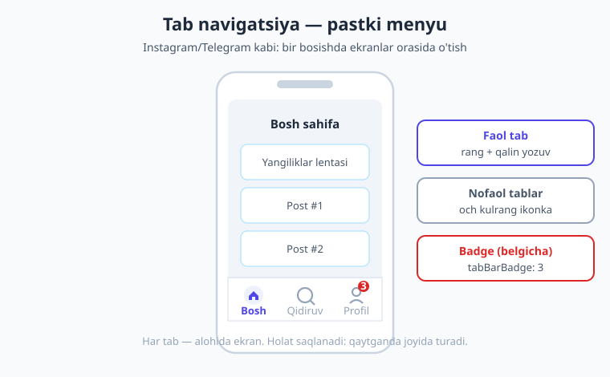
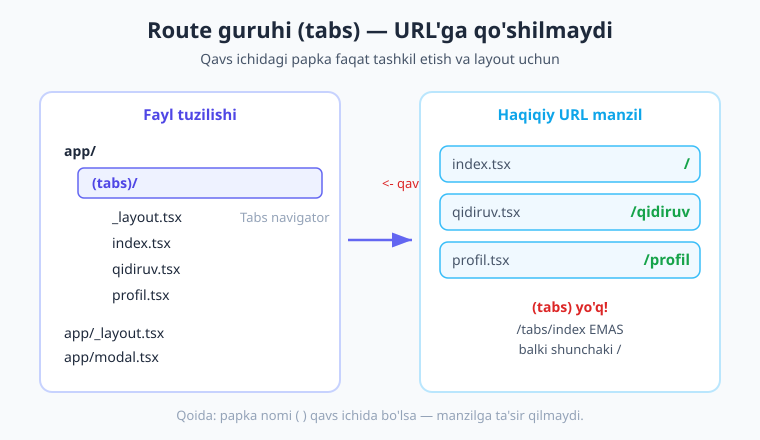
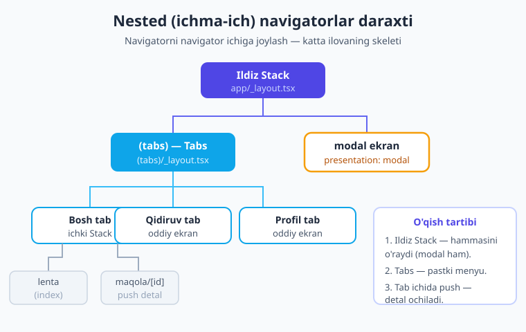

# 15 — Tabs va Drawer navigatsiya

[⬅️ Oldingi: 14 — Expo Router asoslari](./14-expo-router-asoslari.md) · [🏠 Kitob boshi](./README.md) · [Keyingi: 16 — Dinamik marshrut va parametrlar ➡️](./16-dinamik-marshrut.md)

> **Bu bobda:** mobil ilovalarning eng tanish ikki navigatsiya naqshini o'rganamiz — pastdagi **tab menyu** (Bosh / Qidiruv / Profil) va chetdan ochiladigan **drawer** (yon menyu). Route guruhlari `(tabs)` qanday ishlashini, tab ikonkalarini `@expo/vector-icons` bilan qo'yishni, **nested** (ichma-ich) navigatorlarni — Stack ichida Tabs, tab ichida yana Stack — va **modal** ekranni ko'ramiz. Oxirida 3 tabli to'liq ilovani noldan yig'amiz.

---

## Kirish: nega tab va drawer kerak?

O'tgan bobda Expo Router bilan tanishdik: fayl = marshrut, `app/_layout.tsx` da `Stack` navigatori ekranlarni **uyum** (stack) qilib ustma-ust qo'yardi. Stack — bu "orqaga" tugmasi bilan ishlaydigan navigatsiya: ekranga kirasiz, ustiga yangisi tushadi, orqaga qaytasiz. Bu mukammal naqsh, lekin u **butun** ilovaga yetmaydi.

Telefoningizdagi istalgan jiddiy ilovani oching — Instagram, Telegram, YouTube, Spotify. Eng pastida nima turibdi? **Bir qator tugma**: bosh sahifa, qidiruv, profil... Bularning birortasini bossangiz, butun ekran almashadi — lekin siz hech qayerga "chuqurlashmaysiz", shunchaki **bo'limlar** orasida sakraysiz. Aynan shu — **tab navigatsiya**. Bu mobil ilovalarning eng keng tarqalgan naqshi.

> **Hayotiy o'xshatish.** Tab menyu — bu **televizor pulti tugmalari** kabi. Pultda "1-kanal", "2-kanal", "3-kanal" tugmalari bor. Qaysi birini bossangiz, butun ekran o'sha kanalga o'tadi. Lekin kanallar bir-birining ustiga "tushmaydi" — ular yonma-yon, teng huquqli. Tab tugmalarini bossangiz ham xuddi shunday: ekran butunlay almashadi, lekin "orqaga" qaytish kerak emas — istalgan tugmani bosib, istalgan bo'limga o'tasiz.

Stack va Tabs bir-birini **inkor etmaydi** — aksincha, ular birga ishlaydi. Bir tab ichida elementga bosib, uning batafsil sahifasiga (detal) o'tish kerak bo'lsa, o'sha tabning ichiga Stack joylashtiramiz. Bu — **nested navigator** g'oyasi, va bu bobning eng qimmatli tushunchasi.

Keling, eng oddiy tab menyudan boshlaymiz.

---

## 1. Tab navigatsiya: birinchi misol

O'tgan bobda Stack uchun `app/_layout.tsx` ga `<Stack>` qo'ygan edik. Tabs uchun ham xuddi shu — faqat `<Stack>` o'rniga `<Tabs>` ishlatamiz.

> **Hayotiy o'xshatish.** Layout fayli — bu **rom** (ramka) kabi. Devorga rasm osmoqchisiz: rasmlar (ekranlar) almashishi mumkin, lekin rom doimo turadi. `Stack` romi rasmlarni ketma-ket ko'rsatadi, `Tabs` romi esa pastida tugmalar qatorini chizib, har tugmaga bitta rasm bog'laydi.

Eng sodda tab menyu:

```tsx
// app/(tabs)/_layout.tsx
import { Tabs } from 'expo-router/js-tabs';

export default function TabsLayout() {
  return (
    <Tabs>
      <Tabs.Screen name="index" options={{ title: 'Bosh' }} />
      <Tabs.Screen name="profil" options={{ title: 'Profil' }} />
    </Tabs>
  );
}
```

Bu yerda nimalar bo'lyapti:

- `<Tabs>` — navigator komponenti. U avtomatik ravishda **pastki menyu** chizadi.
- `<Tabs.Screen name="index" />` — ekranni navigatorga ro'yxatdan o'tkazadi. `name` — fayl nomi (kengaytmasiz): `index` -> `index.tsx`, `profil` -> `profil.tsx`.
- `options={{ title: 'Bosh' }}` — shu tabning tagidagi yozuv va yuqoridagi sarlavha.

Endi shu ikki ekranning o'zini yaratamiz:

```tsx
// app/(tabs)/index.tsx
import { View, Text, StyleSheet } from 'react-native';

export default function BoshEkran() {
  return (
    <View style={styles.box}>
      <Text style={styles.matn}>Bosh sahifa</Text>
    </View>
  );
}

const styles = StyleSheet.create({
  box: { flex: 1, alignItems: 'center', justifyContent: 'center' },
  matn: { fontSize: 22, fontWeight: '700', color: '#1e293b' },
});
```

```tsx
// app/(tabs)/profil.tsx
import { View, Text, StyleSheet } from 'react-native';

export default function ProfilEkran() {
  return (
    <View style={styles.box}>
      <Text style={styles.matn}>Profil sahifasi</Text>
    </View>
  );
}

const styles = StyleSheet.create({
  box: { flex: 1, alignItems: 'center', justifyContent: 'center' },
  matn: { fontSize: 22, fontWeight: '700', color: '#1e293b' },
});
```

Tayyor! Ilovani ishga tushiring (`npx expo start`), Expo Go'da oching — pastida ikki tugma paydo bo'ladi: "Bosh" va "Profil". Bittasini bosing — ekran almashadi. **Bu hammasi** — biz birorta murakkab kod yozmadik.



!!! tip "Import yo'li — SDK 56 yangiligi"
    Expo SDK 56'da `Tabs`ni `expo-router/js-tabs` dan import qilamiz. Ilgari (eski boblar va eski qo'llanmalar) `import { Tabs } from 'expo-router'` deb yozardi — bu hali ham ishlaydi, lekin SDK 56 uni **eskirgan** (deprecated) deb belgilab, ogohlantirish chiqaradi. Yangi loyihada to'g'ri yo'l — `'expo-router/js-tabs'`. (`Stack`, `Link`, `useRouter` kabilar esa o'zgarmagan — ular `'expo-router'` dan keladi.)

!!! note "`app/` yoki `src/app/`?"
    SDK 56 shabloni routing ildizini `src/app/` qiladi. Bu bobda qisqalik uchun **`app/`** yo'lini yozamiz, lekin agar loyihangizda `src/app/` bo'lsa, qoidalar **aynan bir xil** — shunchaki `src/` prefiksini qo'shing.

---

## 2. Route guruhlari `(tabs)` — eng muhim tushuncha

E'tibor berdingizmi: fayllarni `app/(tabs)/` ichiga, qavs bilan joyladik. Bu **route guruhi** deb ataladi va Expo Router'ning eng nozik, lekin eng foydali xususiyatlaridan biri.

**Qoida:** papka nomi **qavs ichida** bo'lsa — `(tabs)`, `(auth)`, `(app)` — bu papka **URL manziliga qo'shilmaydi**. U faqat fayllarni **tashkil etish** va ularga **umumiy layout** berish uchun ishlatiladi.

> **Hayotiy o'xshatish.** Route guruhi — bu **idishlarni javondagi qutilarga ajratish** kabi. Oshxonangizda piyolalar "Mehmon" qutisida, kosalar "Kundalik" qutisida turadi. Lekin dasturxonga qo'yganda hech kim "Mehmon qutisidagi piyola" demaydi — shunchaki "piyola" deydi. Quti tartib uchun, atash uchun emas. `(tabs)` ham xuddi shu: kodingizni tartibga soladi, lekin foydalanuvchi ko'radigan manzilga ta'sir qilmaydi.

Mana natija:

```text
app/(tabs)/index.tsx    ->  /          (tabs ko'rinmaydi!)
app/(tabs)/qidiruv.tsx  ->  /qidiruv
app/(tabs)/profil.tsx   ->  /profil
```

`index.tsx` manzili `/(tabs)/index` **emas**, balki shunchaki `/`. Qavs ichidagi qism "ko'rinmas". Bu juda muhim, chunki:

1. **URL toza qoladi.** Foydalanuvchi `/profil` ko'radi, `/(tabs)/profil` emas.
2. **Bir nechta guruh bir xil darajada bo'lishi mumkin.** Masalan, `(auth)` guruhida login/ro'yxatdan o'tish ekranlari (tab menyusiz), `(tabs)` guruhida asosiy ilova (tab menyu bilan). Foydalanuvchi kirgan-kirmaganiga qarab birini yoki ikkinchisini ko'rsatasiz — lekin manzillar ikkalasida ham bir xil ildizdan boshlanadi.



!!! warning "Eng ko'p uchraydigan adashish"
    Boshlovchilar `<Link href="/(tabs)/profil">` deb yozishga harakat qiladi. Buning hojati yo'q — manzil shunchaki `/profil`. Qavsli qismni manzilga qo'shmang. Faqat `<Tabs.Screen name="..." />` da fayl nomini yozasiz, havolada esa toza URL ishlatasiz.

!!! question "Tekshirib ko'ring"
    `app/(tabs)/profil.tsx` faylini yarating va `<Tabs.Screen name="profil" />` qo'shing. So'ng `index.tsx` ga `<Link href="/profil"><Text>Profilga</Text></Link>` joylang. Havola ishlashini ko'ring. Endi `href="/(tabs)/profil"` deb o'zgartiring — TypeScript ogohlantirishini (typed routes) yoki noto'g'ri yo'nalishni ko'rasiz. Toza manzilni eslang.

---

## 3. Tab ikonkalari — `@expo/vector-icons`

Yozuvsiz ikonka — bu tor menyu, ikonkasiz yozuv — quruq. Yaxshi tab menyu **ikonka + yozuv** beradi. RN'da ikonkalar uchun rasmiy yechim — `@expo/vector-icons` paketi.

Bu paket ichida juda ko'p ikonka to'plami bor (Ionicons, MaterialIcons, FontAwesome, Feather...). Boshlovchi uchun eng qulayi — **Ionicons** (iOS uslubidagi, lekin har ikki platformada chiroyli).

Avval paketni o'rnatamiz:

```bash
npx expo install @expo/vector-icons
```

!!! note "Eslatma"
    Ko'pincha bu paket Expo loyihasiga avtomatik kiradi (default shablon uni ishlatadi). Lekin toza loyihada bo'lmasligi mumkin — `npx expo install` bilan qo'shing. (`npx expo install` ishlatish muhim: u SDK'ga **mos** versiyani tanlaydi, oddiy `npm install` esa har doim ham emas.)

Endi har `Tabs.Screen` ga `tabBarIcon` beramiz. Bu — funksiya: u `color` (rang) va `size` (o'lcham)ni oladi va JSX qaytaradi. Rang/o'lchamni navigator beradi — biz uni ikonkaga uzatamiz, shunda faol/nofaol holatda ikonka **avtomatik** ranglanadi:

```tsx
// app/(tabs)/_layout.tsx
import { Tabs } from 'expo-router/js-tabs';
import { Ionicons } from '@expo/vector-icons';

export default function TabsLayout() {
  return (
    <Tabs
      screenOptions={{
        tabBarActiveTintColor: '#4f46e5',   // faol tab rangi
        tabBarInactiveTintColor: '#94a3b8', // nofaol tab rangi
      }}
    >
      <Tabs.Screen
        name="index"
        options={{
          title: 'Bosh',
          tabBarIcon: ({ color, size }) => (
            <Ionicons name="home" size={size} color={color} />
          ),
        }}
      />
      <Tabs.Screen
        name="qidiruv"
        options={{
          title: 'Qidiruv',
          tabBarIcon: ({ color, size }) => (
            <Ionicons name="search" size={size} color={color} />
          ),
        }}
      />
      <Tabs.Screen
        name="profil"
        options={{
          title: 'Profil',
          tabBarIcon: ({ color, size }) => (
            <Ionicons name="person" size={size} color={color} />
          ),
        }}
      />
    </Tabs>
  );
}
```

Endi har tab o'z ikonkasiga ega. Faol tab indigo (`#4f46e5`), qolganlari kulrang (`#94a3b8`). E'tibor bering — biz **rangni o'zimiz yozmaymiz** ikonkaga; navigatordan kelgan `color`ni o'tkazamiz, shunda u faol/nofaol holatga qarab o'zgaradi. Bu juda muhim naqsh.

!!! tip "Ikonka nomini qanday topish"
    `Ionicons` ichida minglab ikonka bor: `home`, `search`, `person`, `settings`, `heart`, `cart`, `notifications`, `add-circle`... To'liq ro'yxatni `icons.expo.fyi` saytida ko'rish mumkin (qidiruv bilan). To'plam variantlari ham bor: `home` (to'la), `home-outline` (faqat chiziq). Nofaol uchun `-outline`, faol uchun to'la ko'rsatish — chiroyli naqsh.

### 3.1 Qo'shimcha tab sozlamalari

`Tabs.Screen` options'ida yana ko'p foydali sozlamalar bor:

- **`tabBarLabel`** — tab tagidagi yozuv (agar `title`dan farqli bo'lishini xohlasangiz). Sarlavha "Profil", lekin tabda "Mening profilim" yozilsin desangiz.
- **`tabBarBadge`** — ikonka ustidagi qizil belgicha (raqam yoki matn). Yangi xabarlar sonini ko'rsatish uchun ideal.
- **`tabBarActiveTintColor`** / **`tabBarInactiveTintColor`** — yuqorida ko'rdik, faol/nofaol rang.
- **`headerShown: false`** — yuqoridagi sarlavhani yashirish.

Misol — profil tabiga "3" badge va alohida yozuv:

```tsx
<Tabs.Screen
  name="profil"
  options={{
    title: 'Profil',
    tabBarLabel: 'Mening profilim',  // tab tagidagi yozuv
    tabBarBadge: 3,                   // ikonka ustida qizil "3"
    tabBarIcon: ({ color, size }) => (
      <Ionicons name="person" size={size} color={color} />
    ),
  }}
/>
```

!!! note "Badge'ni dinamik qilish"
    Haqiqiy ilovada `tabBarBadge` qiymati holatdan keladi — masalan o'qilmagan xabarlar soni. Buni global holat (19-bob) yoki context bilan boshqarasiz. Badge `undefined` bo'lsa — ko'rinmaydi; raqam bo'lsa — qizil doirada chiqadi.

---

## 4. Drawer (yon menyu)

Tab menyu — pastdagi 3-5 ta bo'lim uchun ajoyib. Lekin bo'limlar ko'p bo'lsa (8-10 ta), yoki ular asosiy emas, balki "ikkinchi darajali" bo'lsa (sozlamalar, yordam, chiqish), pastga sig'maydi. Bunda **drawer** — chetdan surib ochiladigan yon menyu — qo'l keladi.

> **Hayotiy o'xshatish.** Drawer — bu **shkaf eshigi** kabi. U doimo ko'rinmaydi — devorga qo'shilib turadi. Lekin chetidan tortsangiz (yoki yuqoridagi "uch chiziq" tugmasini bossangiz), eshik ochiladi va ichidagi javonlar (menyu bo'limlari) ko'rinadi. Kerakli narsani oldingizdan keyin eshik yana yopiladi. Gmail, ko'plab Google ilovalari aynan shu naqshni ishlatadi.

Drawer ikkita native kutubxonaga tayanadi:

- **`react-native-gesture-handler`** — barmoq harakatlarini (chetdan surish) tutadi.
- **`react-native-reanimated`** — menyuning silliq ochilish/yopilish animatsiyasi.

!!! tip "Yaxshi xabar — SDK 56'da osonroq"
    Bu kutubxonalar Expo SDK 56 default shablonida **allaqachon o'rnatilgan** (chunki ular boshqa joylarda ham kerak). Drawer komponentining o'zi `expo-router/drawer` dan keladi va alohida `@react-navigation/drawer` paketini qo'lda o'rnatish **shart emas** — u Expo Router ichiga jamlangan. Agar toza loyiha bo'lsa, ishonch uchun: `npx expo install react-native-gesture-handler react-native-reanimated`.

Drawer'ni odatda **ildiz** `app/_layout.tsx` ga qo'yamiz:

```tsx
// app/_layout.tsx
import Drawer from 'expo-router/drawer';
import { Ionicons } from '@expo/vector-icons';

export default function RootLayout() {
  return (
    <Drawer screenOptions={{ drawerActiveTintColor: '#4f46e5' }}>
      <Drawer.Screen
        name="index"
        options={{
          title: 'Bosh',
          drawerLabel: 'Bosh sahifa',
          drawerIcon: ({ color, size }) => (
            <Ionicons name="home" size={size} color={color} />
          ),
        }}
      />
      <Drawer.Screen
        name="sozlamalar"
        options={{
          title: 'Sozlamalar',
          drawerIcon: ({ color, size }) => (
            <Ionicons name="settings" size={size} color={color} />
          ),
        }}
      />
    </Drawer>
  );
}
```

E'tibor bering — tuzilish Tabs bilan deyarli **bir xil**: `<Drawer>` o'rab turadi, ichida `<Drawer.Screen>` har bir ekran uchun. Faqat prefiks `tabBar...` o'rniga `drawer...` (`drawerLabel`, `drawerIcon`, `drawerActiveTintColor`). Bir navigatorni o'rgansangiz, qolganlari osongina o'rganiladi.

Drawer ekranlari ham oddiy fayl: `app/index.tsx`, `app/sozlamalar.tsx`. Ochish uchun foydalanuvchi chetdan suradi yoki yuqoridagi avtomatik chiqadigan "uch chiziq" tugmasini bosadi.

### 4.1 Qachon Tabs, qachon Drawer?

Ikkalasi ham "yuqori darajadagi" bo'limlarni ko'rsatadi. Tanlash mezoni:

| Tabs (pastki menyu) | Drawer (yon menyu) |
|---|---|
| 3-5 ta **asosiy** bo'lim | Ko'p (6+) yoki **ikkinchi darajali** bo'limlar |
| Doimo ko'rinadi — bir bosishda o'tasiz | Yashirin — ochish kerak |
| Instagram, Telegram, YouTube | Gmail, ko'p admin-panellar |
| Eng tez-tez ishlatiladigan bo'limlar | Sozlamalar, profil, yordam, chiqish |

!!! tip "Ikkalasini birga ishlatish"
    Ko'plab katta ilovalar **ikkalasini** ham ishlatadi: asosiy 4-5 bo'lim pastda tab, qolgan "qo'shimcha" bo'limlar drawer'da. Buni nested navigator bilan quramiz — drawer ildizda, uning ichida bitta ekran o'rnida butun tab navigatori turadi. Lekin boshlovchi uchun **bittasidan** boshlash tavsiya etiladi.

---

## 5. Nested navigatorlar — navigator ichida navigator

Endi bobning eng kuchli g'oyasiga keldik. Haqiqiy ilovalar **bitta** navigatordan iborat emas — ular bir nechta navigatorni **ichma-ich** joylaydi.

> **Hayotiy o'xshatish.** Nested navigatorlar — bu **bino, qavatlar va xonalar** kabi. Bino (ildiz Stack) — eng tashqi qobiq. Ichida liftga chiqasiz, har qavatga (tab) o'tasiz. Har qavatda esa o'z xonalari (ichki Stack ekranlari) bor — bir xonadan ikkinchisiga o'tasiz. Tashqi qobiq ichidagilarni ushlab turadi; har qavat o'z ichida mustaqil harakatlanadi.

Eng tipik tuzilish:

```text
Ildiz Stack  (app/_layout.tsx)
 ├─ (tabs)   <- Tabs navigatori  (app/(tabs)/_layout.tsx)
 │   ├─ Bosh    <- ichki Stack (tabda push qilish uchun)
 │   ├─ Qidiruv <- oddiy ekran
 │   └─ Profil  <- oddiy ekran
 └─ modal     <- modal ekran (tabdan tashqarida, ustiga chiqadi)
```



Diagrammadan ko'rinib turibdiki, **ildiz Stack** eng tepada — u butun ilovani o'raydi. Uning ichida `(tabs)` guruhi turadi, va u **bitta ekran** sifatida ko'rinadi Stack uchun — lekin aslida butun tab navigatori. Va `modal` — tablardan **tashqarida**, ildiz Stack darajasida, shu sababli u tab menyu **ustiga** chiqadi (tablar ko'rinmay qoladi).

### 5.1 Nega ildizda Stack kerak?

Faqat tab menyu yetarli bo'lardi, agar har tab "tekis" ekran bo'lsa. Lekin biz ko'pincha:

1. **Modal** ekranlar qo'shamiz (yangi yozuv yaratish, rasm ochish) — ular tab tashqarisida turishi kerak.
2. **Login/auth** ekranlarini tab menyusiz ko'rsatamiz.

Shu sababli eng yaxshi amaliyot — **ildizda Stack**, uning bitta "ekrani" o'rnida `(tabs)`:

```tsx
// app/_layout.tsx — ildiz Stack
import { Stack } from 'expo-router';

export default function RootLayout() {
  return (
    <Stack>
      <Stack.Screen name="(tabs)" options={{ headerShown: false }} />
      <Stack.Screen
        name="modal"
        options={{ presentation: 'modal', title: 'Yangi yozuv' }}
      />
    </Stack>
  );
}
```

E'tibor bering:

- `<Stack.Screen name="(tabs)" />` — bu yerda `(tabs)` butun tab navigatorga ishora qiladi (`app/(tabs)/_layout.tsx`). `headerShown: false` — chunki tab navigatorning o'z sarlavhasi bor, ikkalasi chiqmasin.
- `<Stack.Screen name="modal" />` — `presentation: 'modal'` bilan. Bu ekran pastdan surib chiqadigan **modal** sifatida ochiladi.

### 5.2 Modal ekran

**Modal** — bu asosiy oqimni "to'xtatib", ustiga chiqadigan ekran: yangi yozuv yozish, sozlama tanlash, tasdiqlash. iOS'da u pastdan ko'tariladi va tepada "tortib yopish" imkoni beradi.

Modal ekranning o'zi — oddiy fayl:

```tsx
// app/modal.tsx
import { View, Text, StyleSheet, Pressable } from 'react-native';
import { useRouter } from 'expo-router';

export default function ModalEkran() {
  const router = useRouter();
  return (
    <View style={styles.box}>
      <Text style={styles.sarlavha}>Yangi yozuv</Text>
      <Text style={styles.matn}>Bu modal ekran — asosiy oqim ustida chiqadi.</Text>
      <Pressable style={styles.tugma} onPress={() => router.back()}>
        <Text style={styles.tugmaMatn}>Yopish</Text>
      </Pressable>
    </View>
  );
}

const styles = StyleSheet.create({
  box: { flex: 1, alignItems: 'center', justifyContent: 'center', gap: 14, padding: 24 },
  sarlavha: { fontSize: 22, fontWeight: '800', color: '#1e293b' },
  matn: { fontSize: 15, color: '#475569', textAlign: 'center' },
  tugma: { backgroundColor: '#4f46e5', paddingVertical: 12, paddingHorizontal: 28, borderRadius: 10 },
  tugmaMatn: { color: '#fff', fontWeight: '600', fontSize: 15 },
});
```

Modalni ochish — oddiy navigatsiya: `router.push('/modal')` yoki `<Link href="/modal">`. Yopish uchun `router.back()`. Chunki u Stack'da `presentation: 'modal'` bilan ro'yxatga olingan, Expo Router uni avtomatik modal sifatida chiqaradi.

!!! note "iOS va Android farqi"
    `presentation: 'modal'` iOS'da yaqqol "kartochka" effekti beradi — ekran pastdan ko'tariladi, orqada eski ekran ko'rinib turadi, pastga tortib yopiladi. Android'da effekt ozroq boshqacha (to'liq ekran sirpanish), lekin mantiq bir xil. Kross-platforma ilovada bu farqdan tashvishlanmang — har platforma o'z odatiga mos ko'rsatadi.

### 5.3 Tab ichida detalga push

Eng ko'p uchraydigan ehtiyoj: tabda ro'yxat bor (masalan postlar), elementni bosib **detal** sahifasiga o'tish kerak. Detal — yangi ekran, "orqaga" tugmasi bilan. Bu — Stack vazifasi. Demak, **shu tabning ichiga** Stack joylaymiz.

Buning uchun tabning fayli o'rniga **papka** qilamiz, ichiga `_layout.tsx` (Stack) qo'yamiz:

```text
app/(tabs)/
 ├─ _layout.tsx       <- Tabs navigatori
 ├─ index.tsx         <- (agar Bosh tab papka bo'lmasa)
 ├─ qidiruv.tsx
 └─ profil/           <- Profil tab — endi PAPKA
     ├─ _layout.tsx   <- ichki Stack
     ├─ index.tsx     <- profil bosh ekrani
     └─ [id].tsx      <- detal ekrani
```

Bu yerda diqqat: tabning fayli `profil.tsx` emas, balki `profil/` papka bo'ldi, va uning ichida `_layout.tsx` (Stack) bor. Tab tugmasi `profil` papkaga ishora qiladi, ichidagi `index` esa boshlang'ich ekran.

Soddaroq va keng tarqalgan namuna — **Bosh** tabda ro'yxat, undan detalga o'tish. Detal sahifasini esa biz `app/(tabs)/` darajasida emas, ko'pincha alohida marshrutda saqlaymiz, masalan `app/maqola/[id].tsx` (ildiz Stack ichida). Shunda detal ochilganda tab menyu **ham ko'rinib turadi** yoki yo'qoladi — bu tuzilishga bog'liq. Eng oddiy yo'l — push'ni ildiz Stack orqali qilish:

```tsx
// app/(tabs)/index.tsx — Bosh tab, ro'yxatdan detalga push
import { View, Text, StyleSheet, Pressable, FlatList } from 'react-native';
import { useRouter } from 'expo-router';

const POSTLAR = [
  { id: '1', sarlavha: 'React Native bilan tanishuv' },
  { id: '2', sarlavha: 'Expo Router asoslari' },
  { id: '3', sarlavha: 'Tab va Drawer navigatsiya' },
];

export default function BoshEkran() {
  const router = useRouter();
  return (
    <View style={styles.box}>
      <Text style={styles.sarlavha}>Postlar</Text>
      <FlatList
        data={POSTLAR}
        keyExtractor={(item) => item.id}
        renderItem={({ item }) => (
          <Pressable
            style={styles.qator}
            onPress={() => router.push(`/maqola/${item.id}`)}
          >
            <Text style={styles.qatorMatn}>{item.sarlavha}</Text>
          </Pressable>
        )}
      />
    </View>
  );
}

const styles = StyleSheet.create({
  box: { flex: 1, padding: 16, gap: 8 },
  sarlavha: { fontSize: 22, fontWeight: '800', color: '#1e293b', marginBottom: 8 },
  qator: { backgroundColor: '#fff', padding: 16, borderRadius: 10, borderWidth: 1, borderColor: '#bae6fd' },
  qatorMatn: { fontSize: 15, color: '#475569' },
});
```

Bu yerda `router.push(\`/maqola/${item.id}\`)` — bosilgan postning `id`si bilan detal sahifasiga o'tamiz. Detal sahifasi — keyingi bobning (16-bob) mavzusi: **dinamik marshrut** `[id].tsx`. Hozircha shuni biling: `push` yangi ekranni stack ustiga qo'yadi, va foydalanuvchi "orqaga" bilan ro'yxatga qaytadi.

!!! tip "Tabda holat saqlanadi"
    Tab navigatorning ajoyib jihati: bir tabdan boshqasiga o'tib, qaytib kelsangiz — birinchi tab **o'z holatida** turadi (skroll joyi, kiritilgan matn, ochilgan detal). Tablar "o'chmaydi", balki orqada turaveradi. Bu foydalanuvchi uchun juda qulay — Instagram'da profildan bosh sahifaga qaytsangiz, lentaning o'sha joyida turasiz.

---

## 6. To'liq misol — 3 tabli ilova

Endi bilganlarimizni bitta ishlaydigan ilovaga yig'amiz: **Bosh / Qidiruv / Profil** uch tabli, ikonkalari bilan, va Bosh tabda detalga push qiladigan ilova. Bu kodning hammasi `npx tsc --noEmit` bilan tekshirilgan — ishlaydi.

Fayl tuzilishi:

```text
app/
 ├─ _layout.tsx              <- ildiz Stack (modal bilan)
 ├─ modal.tsx               <- modal ekran
 ├─ maqola/
 │   └─ [id].tsx            <- detal (16-bobda to'liq)
 └─ (tabs)/
     ├─ _layout.tsx         <- Tabs navigatori (ikonkalar)
     ├─ index.tsx           <- Bosh (ro'yxat -> push)
     ├─ qidiruv.tsx         <- Qidiruv
     └─ profil.tsx          <- Profil
```

**1) Ildiz Stack:**

```tsx
// app/_layout.tsx
import { Stack } from 'expo-router';

export default function RootLayout() {
  return (
    <Stack>
      {/* Tab navigatori — bitta "ekran" sifatida, o'z sarlavhasi bor */}
      <Stack.Screen name="(tabs)" options={{ headerShown: false }} />
      {/* Modal — tablardan tashqarida, ustiga chiqadi */}
      <Stack.Screen name="modal" options={{ presentation: 'modal', title: 'Yangi yozuv' }} />
      {/* Detal — push bilan ochiladi (16-bob) */}
      <Stack.Screen name="maqola/[id]" options={{ title: 'Maqola' }} />
    </Stack>
  );
}
```

**2) Tab navigatori (ikonkalar bilan):**

```tsx
// app/(tabs)/_layout.tsx
import { Tabs } from 'expo-router/js-tabs';
import { Ionicons } from '@expo/vector-icons';

export default function TabsLayout() {
  return (
    <Tabs
      screenOptions={{
        tabBarActiveTintColor: '#4f46e5',
        tabBarInactiveTintColor: '#94a3b8',
      }}
    >
      <Tabs.Screen
        name="index"
        options={{
          title: 'Bosh',
          tabBarIcon: ({ color, size }) => (
            <Ionicons name="home-outline" size={size} color={color} />
          ),
        }}
      />
      <Tabs.Screen
        name="qidiruv"
        options={{
          title: 'Qidiruv',
          tabBarIcon: ({ color, size }) => (
            <Ionicons name="search-outline" size={size} color={color} />
          ),
        }}
      />
      <Tabs.Screen
        name="profil"
        options={{
          title: 'Profil',
          tabBarBadge: 2,
          tabBarIcon: ({ color, size }) => (
            <Ionicons name="person-outline" size={size} color={color} />
          ),
        }}
      />
    </Tabs>
  );
}
```

**3) Bosh tab — ro'yxat va detalga push:**

```tsx
// app/(tabs)/index.tsx
import { View, Text, StyleSheet, Pressable, FlatList } from 'react-native';
import { useRouter } from 'expo-router';

const POSTLAR = [
  { id: '1', sarlavha: 'React Native bilan tanishuv' },
  { id: '2', sarlavha: 'Expo Router asoslari' },
  { id: '3', sarlavha: 'Tab va Drawer navigatsiya' },
];

export default function BoshEkran() {
  const router = useRouter();
  return (
    <View style={styles.box}>
      <Text style={styles.sarlavha}>Postlar</Text>
      <FlatList
        data={POSTLAR}
        keyExtractor={(item) => item.id}
        renderItem={({ item }) => (
          <Pressable style={styles.qator} onPress={() => router.push(`/maqola/${item.id}`)}>
            <Text style={styles.qatorMatn}>{item.sarlavha}</Text>
            <Ionicons name="chevron-forward" size={18} color="#94a3b8" />
          </Pressable>
        )}
      />
      <Pressable style={styles.fab} onPress={() => router.push('/modal')}>
        <Ionicons name="add" size={26} color="#fff" />
      </Pressable>
    </View>
  );
}

import { Ionicons } from '@expo/vector-icons';

const styles = StyleSheet.create({
  box: { flex: 1, padding: 16, gap: 8 },
  sarlavha: { fontSize: 22, fontWeight: '800', color: '#1e293b', marginBottom: 8 },
  qator: {
    flexDirection: 'row', alignItems: 'center', justifyContent: 'space-between',
    backgroundColor: '#fff', padding: 16, borderRadius: 10, borderWidth: 1, borderColor: '#bae6fd', marginBottom: 8,
  },
  qatorMatn: { fontSize: 15, color: '#475569' },
  fab: {
    position: 'absolute', right: 20, bottom: 20,
    width: 56, height: 56, borderRadius: 28, backgroundColor: '#4f46e5',
    alignItems: 'center', justifyContent: 'center',
  },
});
```

!!! warning "Import joyi"
    Yuqorida `import` ni stillar yonida ko'rsatdim — bu faqat tushuntirish uchun. Haqiqiy faylda **barcha `import`lar fayl boshida** turishi kerak. `import { Ionicons } from '@expo/vector-icons';` ni fayl tepasiga, qolgan importlar bilan birga qo'ying.

**4) Qidiruv va Profil ekranlari (oddiy):**

```tsx
// app/(tabs)/qidiruv.tsx
import { View, Text, TextInput, StyleSheet } from 'react-native';
import { useState } from 'react';

export default function QidiruvEkran() {
  const [matn, setMatn] = useState('');
  return (
    <View style={styles.box}>
      <TextInput
        style={styles.input}
        placeholder="Qidirish..."
        value={matn}
        onChangeText={setMatn}
      />
      <Text style={styles.natija}>So'rov: {matn || '(bo\'sh)'}</Text>
    </View>
  );
}

const styles = StyleSheet.create({
  box: { flex: 1, padding: 16, gap: 12 },
  input: { borderWidth: 1, borderColor: '#cbd5e1', borderRadius: 10, padding: 12, fontSize: 15 },
  natija: { fontSize: 15, color: '#475569' },
});
```

```tsx
// app/(tabs)/profil.tsx
import { View, Text, StyleSheet } from 'react-native';

export default function ProfilEkran() {
  return (
    <View style={styles.box}>
      <View style={styles.avatar}>
        <Text style={styles.avatarMatn}>O</Text>
      </View>
      <Text style={styles.ism}>Oqil Imomnazarov</Text>
      <Text style={styles.kasb}>React Native dasturchisi</Text>
    </View>
  );
}

const styles = StyleSheet.create({
  box: { flex: 1, alignItems: 'center', justifyContent: 'center', gap: 8 },
  avatar: { width: 80, height: 80, borderRadius: 40, backgroundColor: '#4f46e5', alignItems: 'center', justifyContent: 'center' },
  avatarMatn: { color: '#fff', fontSize: 32, fontWeight: '800' },
  ism: { fontSize: 20, fontWeight: '700', color: '#1e293b' },
  kasb: { fontSize: 14, color: '#475569' },
});
```

Mana — to'liq, ishlaydigan 3 tabli ilova: ikonkalar bilan tab menyu, badge, Bosh tabda ro'yxat va detalga push, modal ochuvchi suzuvchi tugma (FAB), qidiruv inputi va profil. Buni `npx expo start` bilan ishga tushiring va Expo Go'da sinab ko'ring.

!!! example "Nima qildik — qisqacha"
    - **Ildiz Stack** butun ilovani o'radi, modal va detalni boshqaradi.
    - **`(tabs)` guruhi** URL'ga qo'shilmaydi, faqat tab layout beradi.
    - **3 tab** har biri ikonka bilan, faol/nofaol rang avtomatik.
    - **`tabBarBadge`** profilga "2" belgicha qo'ydi.
    - **`router.push`** bilan detalga (`/maqola/:id`) va modalga (`/modal`) o'tdik.

---

## 7. Tez-tez uchraydigan xatolar

!!! danger "Eng ko'p uchraydigan xatolar"
    1. **`<Tabs.Screen name="index.tsx" />`** — `.tsx` kengaytmasi YOZILMAYDI. Faqat `name="index"`.
    2. **Eski import** — `import { Tabs } from 'expo-router'`. SDK 56'da `'expo-router/js-tabs'` ishlating.
    3. **`href="/(tabs)/profil"`** — qavsli qism manzilga qo'shilmaydi. To'g'risi: `/profil`.
    4. **Ikonkaga `color` o'tkazmaslik** — `<Ionicons name="home" color="#000" />` deb qattiq rang yozsangiz, faol/nofaol holat ishlamaydi. Navigatordan kelgan `color`ni uzating.
    5. **Matnni `<Text>`siz qo'yish** — RN'da har bir matn `<Text>` ichida bo'lishi SHART. `<View>Bosh</View>` xato; `<View><Text>Bosh</Text></View>` to'g'ri.
    6. **Modal options'ni ekranga qo'yish** — `presentation: 'modal'` ekran faylida emas, balki uni e'lon qilgan `Stack.Screen` options'ida yoziladi.

---

## Xulosa

- **Tab navigatsiya** — pastdagi tugmalar qatori (Bosh/Qidiruv/Profil) orqali ilovaning asosiy bo'limlari orasida o'tish. Mobil ilovalarning eng keng tarqalgan naqshi. Layout: `app/(tabs)/_layout.tsx` da `<Tabs>` + har ekran uchun `<Tabs.Screen name="..." />`.
- **SDK 56'da `Tabs`ni `expo-router/js-tabs` dan import qiling** — eski `'expo-router'` yo'li eskirgan (deprecated) hisoblanadi.
- **Route guruhi `(tabs)`** — qavs ichidagi papka **URL'ga qo'shilmaydi**, faqat fayllarni tashkil etish va umumiy layout berish uchun. `app/(tabs)/index.tsx` -> `/`, `/tabs/index` emas.
- **Tab ikonkalari** — `@expo/vector-icons` (`Ionicons`) bilan: `tabBarIcon: ({ color, size }) => <Ionicons name="home" size={size} color={color} />`. Rangni navigatordan oling — faol/nofaol avtomatik ranglanadi. Yana: `tabBarLabel`, `tabBarBadge`, `tabBarActiveTintColor`.
- **Drawer (yon menyu)** — `expo-router/drawer` dan `<Drawer>`. `gesture-handler` + `reanimated` ga tayanadi (SDK 56 shablonida tayyor; alohida `@react-navigation/drawer` shart emas). Ko'p yoki ikkinchi darajali bo'limlar uchun; tuzilishi Tabs'ga o'xshash (`drawer...` prefiksi).
- **Tabs vs Drawer** — 3-5 asosiy bo'lim -> Tabs (doimo ko'rinadi); ko'p/qo'shimcha bo'lim -> Drawer (yashirin). Katta ilovalar ikkalasini birga ishlatishi mumkin.
- **Nested navigatorlar** — ildiz Stack ichida `(tabs)` Tabs, tab ichida yana Stack (push uchun). Bino-qavat-xona naqshi. Eng mustahkam tuzilish — ildizda Stack, uning bitta "ekrani" o'rnida `(tabs)`.
- **Modal ekran** — `app/modal.tsx` + `Stack.Screen` da `presentation: 'modal'`. Tablardan tashqarida, ustiga chiqadi; `router.push('/modal')` ochadi, `router.back()` yopadi.

---

## Amaliy mashqlar

1. **Ikki tabli ilova (oson).** `app/(tabs)/_layout.tsx` da ikki tabli (`index` va `sozlamalar`) menyu yarating. Har biriga `title` bering. Ekranlarni yozing — markazda tab nomini ko'rsatsin. Expo Go'da ikki tab orasida o'tib ko'ring.

2. **Ikonkalar qo'shing (oson).** Yuqoridagi ilovaga `@expo/vector-icons`dan `Ionicons` ikonka qo'shing (`home`, `settings`). `tabBarActiveTintColor`ni o'zingiz tanlagan rangga sozlang. Nofaol holatda `-outline`, faol holatda to'la variant ko'rsatishga harakat qiling (maslahat: `options` funksiya bo'lishi va `focused`ni ishlatishi mumkin).

3. **Drawer'ga o'tkazing (o'rta).** 2-mashqdagi ilovani Tabs o'rniga **Drawer** bilan qayta yozing: ildiz `app/_layout.tsx` da `<Drawer>`, ichida `<Drawer.Screen>`. `drawerIcon` va `drawerLabel` qo'shing. Chetdan surib ochilishini sinang. Qaysi naqsh bu ilovaga ko'proq mos kelishini o'ylab ko'ring.

4. **Tabda detalga push (o'rta).** Uch tabli ilova qiling. Bosh tabda 4-5 elementli `FlatList` ro'yxat bo'lsin. Element bosilganda `router.push('/element/...')` bilan detal sahifasiga o'ting. Detal sahifasini ildiz Stack'ga `Stack.Screen` sifatida qo'shing. ("Orqaga" tugmasi avtomatik ishlaydi.)

5. **Modal + badge (qiyin).** To'liq misoldagi ilovaga: (a) suzuvchi tugma (FAB) bosilganda `app/modal.tsx` modalini oching; (b) modalda matn kiritib "Saqlash" bosilsa, profil tabidagi `tabBarBadge` qiymati birga oshsin. Maslahat: badge soni global holatda (Context yoki Zustand — 19-bob) saqlanishi kerak, chunki uni boshqa ekrandan o'zgartiryapsiz. Hozircha sodda Context bilan urinib ko'ring.

---

[⬅️ Oldingi: 14 — Expo Router asoslari](./14-expo-router-asoslari.md) · [🏠 Kitob boshi](./README.md) · [Keyingi: 16 — Dinamik marshrut va parametrlar ➡️](./16-dinamik-marshrut.md)
