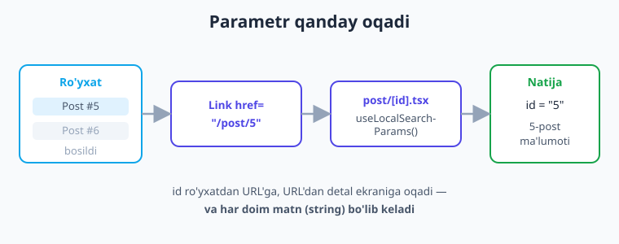
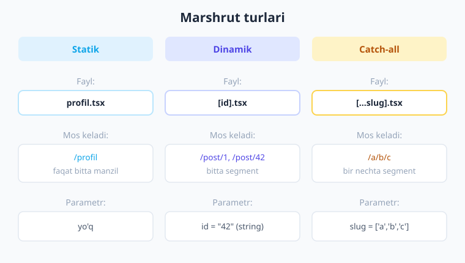

# 16 — Dinamik marshrut va parametrlar

[⬅️ Oldingi: 15 — Tabs va Drawer navigatsiya](./15-tabs-drawer.md) · [🏠 Kitob boshi](./README.md) · [Keyingi: 17 — Tarmoq va API ➡️](./17-tarmoq-api.md)

> **Bu bobda:** bitta ekran shabloni bilan minglab manzilni qanday ishlatishni o'rganamiz. **Dinamik segment** (`app/post/[id].tsx`), `useLocalSearchParams` bilan parametrni o'qish, `Link` va `router.push` orqali parametr uzatish, `?q=...` ko'rinishidagi **query parametrlar**, bir nechta segmentni ushlaydigan **catch-all** marshrut, yuklangan ma'lumotga qarab **dinamik sarlavha**, va dinamik marshrutlarning **deep link** bilan avtomatik bog'lanishini ko'rib chiqamiz. Oxirida ro'yxat → detal ekrani to'liq misolini yig'amiz.

---

## Kirish: 1000 ta postga 1000 ta fayl yozasizmi?

14 va 15-boblarda biz ekranlar yaratdik: `app/profil.tsx` → `/profil`, `app/sozlamalar.tsx` → `/sozlamalar`. Har bir fayl bitta aniq manzilga aylandi. Bu yondashuv **bosh sahifa**, **profil**, **sozlamalar** kabi *sanab bo'ladigan* sahifalarga juda mos.

Endi tasavvur qiling: ilovangizda **1000 ta yangilik posti** bor. Foydalanuvchi ro'yxatdan bittasini bossa, o'sha postning to'liq matnini ko'rsatadigan ekran ochilishi kerak. Savol: nechta fayl yozasiz?

`app/post-1.tsx`, `app/post-2.tsx`, `app/post-3.tsx`... `app/post-1000.tsx`? Bu mantiqsiz. Postlar har kuni qo'shiladi — yangi post chiqqanda yangi fayl yozib, ilovani qaytadan chiqarasizmi? Albatta yo'q.

Aslida bu 1000 ta ekran **bir-biriga aynan o'xshaydi**: hammasi sarlavha, sana va matn ko'rsatadi. Faqat **ma'lumot** har xil. Demak kerak bo'lgani — **bitta shablon ekran** va unga "qaysi postni ko'rsatay?" degan savolga javob. Aynan shu javob — **parametr**.

> **Hayotiy o'xshatish.** Dinamik marshrut — bu **pochtachi** kabi. Pochtachining ishi bitta: xatni manzilga yetkazish. U "Chilonzor 5-uy" uchun alohida, "Yunusobod 12-uy" uchun alohida pochtachi emas — **bitta** pochtachi, har safar **boshqa manzil** bilan ishlaydi. Manzil — parametr. Yoki: restoran ofitsianti. Bitta ofitsiant, har stolga boradi — stol raqami har xil. Ekran (ofitsiant) bitta, parametr (stol raqami) har xil.

![Bitta [id].tsx fayli barcha /post/N manzillarini ishlaydi](rasmlar/rn16-dinamik-marshrut.svg)

Diagrammada ko'rinib turibdiki, **bitta** `post/[id].tsx` fayli `/post/1`, `/post/42`, `/post/1000` — barcha manzillarni ishlaydi. Faqat `id` qiymati har xil bo'ladi. Bu — dinamik marshrutning butun mohiyati.

---

## 1. Dinamik segment: `[id]` nima

Expo Router'da fayl nomini **kvadrat qavs** ichiga olsangiz, u qism **o'zgaruvchi** (dinamik) bo'ladi:

```text
app/
  post/
    [id].tsx      ← [id] — o'zgaruvchi qism
```

Bu fayl quyidagi manzillarning **hammasini** ishlaydi:

```text
/post/1       →  [id].tsx  (id = "1")
/post/42      →  [id].tsx  (id = "42")
/post/abc     →  [id].tsx  (id = "abc")
/post/salom   →  [id].tsx  (id = "salom")
```

`[id]` — bu **segment** (URL'ning slesh bilan ajratilgan bir bo'lagi). Qavs ichidagi so'z (`id`) — bu **parametrning nomi**. Siz uni xohlagancha nomlashingiz mumkin: `[slug]`, `[postId]`, `[foydalanuvchiNomi]`. Manzilda shu o'rinda turgan har qanday qiymat o'sha nom ostida faylga yetib boradi.

> **Hayotiy o'xshatish.** `[id]` — anketadagi **bo'sh chiziq** kabi: "Ism: ______". Chiziqning o'zi o'zgarmaydi, lekin har kim o'z ismini yozadi. `[id]` ham shunday — qavs joyiga URL har xil qiymat "yozadi".

!!! note "Nega kvadrat qavs?"
    Kvadrat qavs Expo Router uchun "bu segment qattiq bog'langan (statik) emas, o'zgaruvchi" degan **signal**. Agar fayl nomini oddiy `id.tsx` deb yozsangiz, u faqat `/post/id` manziliga (so'zma-so'z "id") mos kelardi. Qavs uni dinamik qiladi.

!!! tip "Eslatma: `app/` yoki `src/app/`"
    Yangi Expo SDK 56 shabloni marshrut ildizi sifatida **`src/app/`** papkasini ishlatadi (`@/*` → `./src/*` aliasi bilan). Biz misollarda qisqalik uchun **`app/`** yo'lini yozamiz — qoidalar ikkala holatda **aynan bir xil**. Sizning loyihangizda `src/app/post/[id].tsx` bo'lishi mumkin.

---

## 2. Parametrni o'qish: `useLocalSearchParams`

Manzildan parametrni olish uchun Expo Router'ning **`useLocalSearchParams`** hookidan foydalanamiz (hook — ya'ni komponent ichida React imkoniyatiga ulanadigan maxsus funksiya, nomi `use` bilan boshlanadi):

```tsx
// app/post/[id].tsx
import { Text } from 'react-native';
import { useLocalSearchParams } from 'expo-router';

export default function PostDetali() {
  // [id] segmentidagi qiymatni olamiz
  const { id } = useLocalSearchParams();
  return <Text>Tanlangan post: {id}</Text>;
}
```

Agar foydalanuvchi `/post/42` ga o'tsa, `id` qiymati `"42"` bo'ladi. Faylning ichidagi `id` o'zgaruvchisi nomi **fayl nomidagi qavs ichidagi nom bilan bir xil** bo'lishi shart: fayl `[id].tsx` → o'zgaruvchi `id`; fayl `[slug].tsx` → o'zgaruvchi `slug`.

### TypeScript bilan tiplash

Loyihamiz TypeScript'da. Hookga **qaysi parametrlarni kutayotganimizni** aytib qo'ysak, kod yozayotganda yordam va xato tekshiruvini olamiz:

```tsx
// id'ni string deb tiplaymiz
const { id } = useLocalSearchParams<{ id: string }>();
```

### EHTIYOT: parametr HAR DOIM matn (string)

Bu eng ko'p uchraydigan xato. URL — bu matn. Demak undan o'qilgan **har qanday parametr `string` bo'ladi**, hatto raqamga o'xshasa ham:

```tsx
const { id } = useLocalSearchParams<{ id: string }>();
// id = "42"  ← bu RAQAM emas, MATN!

// console.log(id + 1);     // "421"  ← matn ulanishi, qo'shilish EMAS!
// To'g'ri: avval raqamga o'tkazing
const idRaqam = Number(id); // 42 (raqam)
```

!!! warning "Eng keng tarqalgan boshlovchi xatosi"
    `id` ni to'g'ridan-to'g'ri raqam deb hisoblamang. `id + 1` ni bajarsangiz, `"42" + 1` → `"421"` (matnlar ulanadi) chiqadi, `43` emas. Raqam kerak bo'lsa **`Number(id)`** yoki **`parseInt(id, 10)`** bilan o'tkazing.

---

## 3. Parametr uzatish: `Link` va `router.push`

Endi *qarama-qarshi* tomon — qanday qilib `/post/42` manziliga **o'tkazamiz** va `id` qiymatini uzatamiz? Ikkita asosiy usul bor (14-bobdan tanish): deklarativ **`Link`** va dasturiy **`router.push`**.

### 3.1 `Link` bilan

`Link` — bosiladigan havola (14-bobda ko'rganmiz). Eng oddiy usul — manzilni **shablon-satr** (template literal) bilan tuzish:

```tsx
import { Link } from 'expo-router';

// 42-postga o'tadigan havola
<Link href={`/post/42`}>42-postni ochish</Link>

// dinamik id bilan (post — bizning ma'lumotimiz)
<Link href={`/post/${post.id}`}>{post.nomi}</Link>
```

E'tibor bering: `` `/post/${post.id}` `` — bu JavaScript **shablon-satr**i (teskari tirnoq `` ` ``). `${post.id}` ichiga `post` obyektining `id` qiymati qo'yiladi. Agar `post.id` `5` bo'lsa, manzil `/post/5` bo'ladi.

Ikkinchi, **obyekt** ko'rinishidagi usul ham bor — u aniqroq va katta ilovalarda xavfsizroq:

```tsx
<Link
  href={{
    pathname: '/post/[id]',           // shablon yo'l (qavs bilan!)
    params: { id: post.id },          // parametrlar alohida
  }}
>
  {post.nomi}
</Link>
```

Bu yerda `pathname` — bu **shablon** (fayl nomidagidek `[id]` qavs bilan), `params` esa qaysi qiymatni qaysi qavsga qo'yishni aytadi. Bu usul **typed routes** (tip-tekshiruvi) bilan zo'r ishlaydi — Expo agar `pathname` xato bo'lsa, kod yozayotganda ogohlantiradi.

### 3.2 `router.push` bilan (dasturiy)

Ba'zan havola emas, **kod** ichidan o'tish kerak bo'ladi — masalan, biror tekshiruvdan keyin. Buning uchun `useRouter` hooki:

```tsx
import { useRouter } from 'expo-router';

export default function Royxat() {
  const router = useRouter();

  function postniOch(id: string) {
    // dasturiy ravishda o'tamiz
    router.push(`/post/${id}`);
    // yoki obyekt shaklida:
    // router.push({ pathname: '/post/[id]', params: { id } });
  }
  // ...
}
```

`router.push` — yangi ekranni stekka **qo'shadi** (orqaga tugmasi ishlaydi). `router.replace` — joriy ekranni almashtiradi (orqaga qaytib bo'lmaydi). `router.back` — bir qadam orqaga (14-bobda batafsil ko'rgansiz).



Diagrammada to'liq oqim ko'rsatilgan: foydalanuvchi **ro'yxat**dan postni bosadi → **`Link href="/post/5"`** ishga tushadi → **`post/[id].tsx`** ekrani ochiladi → **`useLocalSearchParams`** `id`ni o'qiydi → ekran **5-post ma'lumotini** ko'rsatadi.

!!! tip "Maslahat: qaysi usulni tanlash?"
    - **Ro'yxat elementi, tugma, menyu** — `Link` (deklarativ, soddaroq).
    - **Shart tekshirgandan keyin** o'tish kerak bo'lsa (masalan "saqlandi → orqaga") — `router.push`/`router.replace`.
    - Katta loyihada **obyekt shakli** (`pathname` + `params`) — chunki TypeScript yo'lni tekshiradi.

---

## 4. Query parametrlar: `?q=react`

Hozirgina ko'rganimiz — yo'l (path) ichidagi parametr: `/post/42`. Lekin parametrning yana bir turi bor: **query parametr** — manzil oxiriga `?` bilan qo'shiladigan qism:

```text
/qidiruv?q=react
/qidiruv?q=react&sahifa=2
/mahsulotlar?turi=telefon&narx=arzon&saralash=yangi
```

`?` dan keyingi `nom=qiymat` juftliklari — query parametrlar. Bir nechtasini `&` bilan ulanadi. Ular ko'pincha **ixtiyoriy filtrlar, qidiruv so'zi, sahifa raqami** uchun ishlatiladi.

> **Hayotiy o'xshatish.** Yo'l parametri (`/post/42`) — bu **uy manzili** (qaysi binoga borasiz). Query parametri (`?q=react`) — pochtachiga aytgan **qo'shimcha ko'rsatmangiz**: "tezkor yetkaz", "domofon orqali". Asosiy manzilni o'zgartirmaydi, faqat aniqlik kiritadi.

Eng yaxshi yangilik: query parametrlarni ham **xuddi shu** `useLocalSearchParams` bilan o'qiysiz!

```tsx
// app/qidiruv.tsx  →  /qidiruv?q=react&sahifa=2
import { Text, View } from 'react-native';
import { useLocalSearchParams } from 'expo-router';

export default function Qidiruv() {
  const { q, sahifa } = useLocalSearchParams<{ q: string; sahifa?: string }>();
  return (
    <View>
      <Text>Qidiruv so'zi: {q}</Text>
      <Text>Sahifa: {sahifa ?? '1'}</Text>
    </View>
  );
}
```

Query parametrni uzatish — yo'l parametriga o'xshash:

```tsx
// Link bilan
<Link href="/qidiruv?q=react">React qidiruvi</Link>

// obyekt shaklida (params'ga query'ni ham qo'shiladi)
<Link href={{ pathname: '/qidiruv', params: { q: 'react', sahifa: '2' } }}>
  Qidirish
</Link>

// router bilan
router.push(`/qidiruv?q=${qidiruvSozi}`);
```

!!! note "Yo'l parametri vs query parametri"
    - **Yo'l** (`/post/42`): segment **majburiy** — `[id].tsx` faylga mos kelishi uchun shart. "Qaysi narsa" degan savolga javob.
    - **Query** (`?q=react`): qism **ixtiyoriy** — bo'lsa ham, bo'lmasa ham bir xil ekran ochiladi. "Qanday ko'rsatay / filtr" degan savolga javob.
    - Ikkalasi ham `useLocalSearchParams` bilan o'qiladi va ikkalasi ham **string**.

!!! warning "Bo'lmasligi mumkin"
    Query parametr ixtiyoriy bo'lgani uchun `undefined` bo'lishi mumkin (foydalanuvchi `/qidiruv` ga query'siz kelsa). Shuning uchun yuqorida `sahifa?: string` (savol belgisi bilan ixtiyoriy) deb tipladik va `sahifa ?? '1'` (default qiymat) ishlatdik.

---

## 5. `useLocalSearchParams` vs `useGlobalSearchParams`

Expo Router'da parametr o'qishning ikki hooki bor. Farqi nozik, lekin muhim:

| Hook | Nimani o'qiydi | Qachon yangilanadi |
|------|----------------|--------------------|
| `useLocalSearchParams` | **Faqat shu ekranning** o'z parametrlari | Shu ekranning params'i o'zgarsa |
| `useGlobalSearchParams` | **Eng yuqoridagi** (joriy faol) ekran parametrlari | Stekdagi har qanday ekran o'zgarsa |

99% holatda sizga **`useLocalSearchParams`** kerak. U "menga shu ekran qaysi `id` bilan ochilganini ber" deydi va boshqa ekranlar o'zgarganda keraksiz qayta-render (re-render) qilmaydi.

> **Hayotiy o'xshatish.** `useLocalSearchParams` — "men o'tirgan **xona** raqami nechi?" degan savol (o'zgarmaydi, men shu yerdaman). `useGlobalSearchParams` — "hozir butun **binoda eng faol xona** qaysi?" degan savol (boshqalar yurganda o'zgaradi).

!!! tip "Qoida"
    Detal ekranida o'z `id`ingizni o'qiyapsizmi? — **`useLocalSearchParams`** ishlating. `useGlobalSearchParams` faqat alohida holatlarda (masalan, fonda turgan ekran yuqoridagi ekran params'ini kuzatishi kerak bo'lsa) zarur.

---

## 6. Catch-all marshrut: `[...slug].tsx`

`[id].tsx` faqat **bitta** segmentni ushlaydi: `/post/42` ✅, lekin `/post/2026/iyun/maqola` ❌ (uch segment) ushlamaydi. Ba'zan esa **noma'lum sondagi** segment kerak bo'ladi. Buning uchun **catch-all** (hammasini ushlovchi) marshrut bor — qavs ichida **uch nuqta** (`...`) bilan:

```text
app/
  [...slug].tsx     ← /a, /a/b, /a/b/c — hammasini ushlaydi
```

Bunda parametr **massiv** (array) bo'lib keladi — har bir segment massivning bir elementi:

```tsx
// app/[...slug].tsx
import { Text } from 'react-native';
import { useLocalSearchParams } from 'expo-router';

export default function CatchAll() {
  // /hujjat/2026/iyun  →  slug = ['hujjat', '2026', 'iyun']
  const { slug } = useLocalSearchParams<{ slug: string[] }>();
  return <Text>Yo'l: /{slug.join('/')}</Text>;
}
```

**Qachon kerak?** Real holatlar:

- **Hujjat/wiki tizimi**: `/hujjat/react/asoslar/komponent` — sahifa daraxti chuqurligi oldindan noma'lum.
- **Fayl tizimi ko'rinishi**: `/papka/rasmlar/2026/tabiat` — istalgan chuqurlikdagi yo'l.
- **404 / "topilmadi" ekrani**: noma'lum har qanday manzilni ushlab, chiroyli xato sahifasi ko'rsatish.

!!! note "Eslatma: ustuvorlik (priority)"
    Agar sizda bir vaqtning o'zida `app/post/[id].tsx` ham, `app/post/[...slug].tsx` ham bo'lsa, Expo Router **aniqroq** marshrutni afzal ko'radi: `/post/42` aniq bitta segment bo'lgani uchun `[id].tsx` ga boradi, `[...slug].tsx` ga emas. Catch-all — eng oxirgi "qolgan hammasi" variant.



Diagrammada uch turdagi marshrut yonma-yon: **statik** (`profil.tsx` → faqat `/profil`, parametr yo'q), **dinamik** (`[id].tsx` → bitta segment, `id` string), **catch-all** (`[...slug].tsx` → bir nechta segment, `slug` massiv).

---

## 7. Dinamik sarlavha: param bilan header

Detal ekranida ko'pincha **sarlavha (header)** ekranga yuklangan ma'lumotga bog'liq bo'lishi kerak — masalan postning nomi. Avval `15`-bob va Stack navigatorni eslang: sarlavhani `Stack.Screen options` orqali beramiz. Statik holatda buni `_layout.tsx` da yozardik. Lekin sarlavha **dinamik** (yuklangan ma'lumotga qarab) bo'lsa, uni **ekranning o'zida**, JSX ichida `<Stack.Screen />` komponenti bilan beramiz:

```tsx
// app/post/[id].tsx
import { View, Text } from 'react-native';
import { useLocalSearchParams, Stack } from 'expo-router';

export default function PostDetali() {
  const { id } = useLocalSearchParams<{ id: string }>();
  // (haqiqiy ilovada bu ma'lumot API'dan keladi — 17-bob)
  const post = { nomi: `Post #${id}` };

  return (
    <View>
      {/* sarlavhani ma'lumotga qarab o'rnatamiz */}
      <Stack.Screen options={{ title: post.nomi }} />
      <Text>{post.nomi}</Text>
    </View>
  );
}
```

Bu yerdagi `<Stack.Screen options={{ title: post.nomi }} />` — ko'rinmas komponent (ekranda hech narsa chizmaydi), lekin u Stack navigatorga "shu ekran ochiq turganda yuqoridagi sarlavha `post.nomi` bo'lsin" deb buyuradi. Ma'lumot API'dan kelib `post.nomi` o'zgarsa, sarlavha ham o'zi yangilanadi.

> **Hayotiy o'xshatish.** `<Stack.Screen>` ekran ichida — bu **eshikka osib qo'yiladigan taxtacha** kabi. Xonaga (ekranga) kirgan odam taxtachaga (sarlavhaga) qaraydi. Xona egasi o'zgarsa, taxtachadagi yozuvni almashtirasiz — devorni buzmaysiz.

!!! tip "Maslahat"
    Sarlavha API'dan kelguncha vaqtinchalik "Yuklanmoqda..." ko'rsatishingiz mumkin: `options={{ title: post ? post.nomi : 'Yuklanmoqda...' }}`. Foydalanuvchi bo'sh sarlavhaga qaramaydi.

---

## 8. Deep linking: dinamik marshrut avtomatik ishlaydi

**Deep link** (chuqur havola) — bu ilovangizning **aniq bir ekraniga** to'g'ridan-to'g'ri olib boradigan havola. Masalan, do'stingiz sizga `myapp://post/42` havolasini yuborsa va siz bossangiz, ilova ochilib **to'g'ridan-to'g'ri 42-post** ekranini ko'rsatadi — bosh sahifadan emas.

> **Hayotiy o'xshatish.** Oddiy havola — binoning **kirish eshigi** (har doim qabulxonaga olib boradi). Deep link — to'g'ridan-to'g'ri **kerakli xona eshigi** (qabulxonadan o'tmasdan, darrov o'sha xonaga).

Eng zo'r tomoni: **Expo Router'da dinamik marshrutlar deep link bilan avtomatik bog'lanadi.** Siz `app/post/[id].tsx` yozgan bo'lsangiz, `myapp://post/42` havolasi avtomatik shu ekranni `id="42"` bilan ochadi — qo'shimcha sozlash kerak emas. Yagona shart: ilovangizga **scheme** (havola prefiksi) berish. U `app.json` da turadi:

```json
{
  "expo": {
    "scheme": "myapp"
  }
}
```

Endi `myapp://post/42`, `myapp://qidiruv?q=react` kabi havolalar ishlaydi. Faylga asoslangan marshrut tuzilmangiz — bu bir vaqtning o'zida deep link xaritangiz hamdir.

!!! note "Universal/App Links (qisqacha)"
    `myapp://` — bu **maxsus scheme**. Bundan tashqari haqiqiy `https://saytim.uz/post/42` havolasi to'g'ridan-to'g'ri ilovani ochishi mumkin (iOS Universal Links / Android App Links). Bu domen tasdiqi va qo'shimcha sozlamani talab qiladi — ilg'or mavzu. Boshlash uchun `scheme` yetarli.

!!! tip "Test qilish"
    Terminalda deep link'ni shunday sinab ko'rasiz: `npx uri-scheme open "myapp://post/42" --ios` (yoki `--android`). Ilova ochilib, to'g'ridan-to'g'ri 42-post ekraniga o'tishini ko'rasiz.

---

## 9. To'liq misol: ro'yxat → detal ekrani

Endi hammasini birlashtiramiz. Ikkita fayl: ro'yxat (`index.tsx`) va dinamik detal (`post/[id].tsx`). Bu kod loyihada tekshirildi (`npx tsc` xatosiz o'tdi).

**1-fayl — postlar ro'yxati.** FlatList har postni bosiladigan satr qiladi; bosilganda `/post/<id>` ga o'tadi:

```tsx
// app/index.tsx — postlar ro'yxati
import { View, Text, FlatList, Pressable, StyleSheet } from 'react-native';
import { Link, useRouter } from 'expo-router';

type Post = { id: string; nomi: string };

const POSTLAR: Post[] = [
  { id: '1', nomi: 'React Native nima' },
  { id: '5', nomi: 'Dinamik marshrut' },
  { id: '42', nomi: 'Deep linking' },
];

export default function Royxat() {
  const router = useRouter();

  return (
    <View style={styles.box}>
      <Text style={styles.sarlavha}>Postlar</Text>

      <FlatList
        data={POSTLAR}
        keyExtractor={(item) => item.id}
        renderItem={({ item }) => (
          // Link satrni bosiladigan qiladi; asChild — ichki Pressable'ga uzatamiz
          <Link href={`/post/${item.id}`} asChild>
            <Pressable style={styles.qator}>
              <Text style={styles.qatorMatn}>{item.nomi}</Text>
            </Pressable>
          </Link>
        )}
      />

      {/* dasturiy o'tish — router.push bilan */}
      <Pressable style={styles.tugma} onPress={() => router.push(`/post/99`)}>
        <Text style={styles.tugmaMatn}>99-postga o'tish (router)</Text>
      </Pressable>
    </View>
  );
}

const styles = StyleSheet.create({
  box: { flex: 1, padding: 16, gap: 10 },
  sarlavha: { fontSize: 22, fontWeight: '700', color: '#1e293b' },
  qator: {
    padding: 14, backgroundColor: '#fff', borderRadius: 10,
    borderWidth: 1, borderColor: '#bae6fd',
  },
  qatorMatn: { fontSize: 16, color: '#1e293b' },
  tugma: { backgroundColor: '#4f46e5', padding: 12, borderRadius: 10, alignItems: 'center' },
  tugmaMatn: { color: '#fff', fontWeight: '600' },
});
```

`Link` ichida `asChild` propi muhim: u Link'ning bosish funksiyasini **ichidagi `Pressable`ga** uzatadi (Link o'zi alohida o'rab matn chizmaydi). Shunday qilib bizning chiroyli satrimiz bosiladigan bo'ladi.

**2-fayl — dinamik detal ekrani.** `id`ni o'qiydi, ma'lumotni "yuklaydi" (bu yerda soxta — 17-bobda haqiqiy API qo'shamiz), sarlavhani dinamik o'rnatadi:

```tsx
// app/post/[id].tsx — dinamik post detali
import { View, Text, ActivityIndicator, StyleSheet } from 'react-native';
import { useLocalSearchParams, Stack } from 'expo-router';
import { useEffect, useState } from 'react';

type Post = { id: string; nomi: string; matn: string };

export default function PostDetali() {
  // URL'dagi [id] segmentini olamiz — har doim string
  const { id } = useLocalSearchParams<{ id: string }>();
  const [post, setPost] = useState<Post | null>(null);

  useEffect(() => {
    // bu yerda haqiqiy API bo'lardi (17-bob); biz soxta ma'lumot beramiz
    setPost({ id, nomi: `Post #${id}`, matn: `Bu ${id}-postning matni.` });
  }, [id]);

  // ma'lumot kelguncha spinner
  if (!post) {
    return (
      <View style={styles.markaz}>
        <ActivityIndicator size="large" color="#4f46e5" />
      </View>
    );
  }

  return (
    <View style={styles.box}>
      {/* sarlavhani yuklangan ma'lumotga qarab o'rnatamiz */}
      <Stack.Screen options={{ title: post.nomi }} />
      <Text style={styles.sarlavhaMatn}>{post.nomi}</Text>
      <Text style={styles.matn}>{post.matn}</Text>
      <Text style={styles.izoh}>ID (string sifatida): {id}</Text>
    </View>
  );
}

const styles = StyleSheet.create({
  box: { flex: 1, padding: 20, gap: 10 },
  markaz: { flex: 1, alignItems: 'center', justifyContent: 'center' },
  sarlavhaMatn: { fontSize: 22, fontWeight: '700', color: '#1e293b' },
  matn: { fontSize: 16, color: '#475569' },
  izoh: { fontSize: 13, color: '#94a3b8' },
});
```

Bu ikki fayl bilan butun oqim ishlaydi:

1. Foydalanuvchi ro'yxatda **"Dinamik marshrut"** (id=`5`) ni bosadi.
2. `Link` `/post/5` ga o'tadi.
3. `post/[id].tsx` ochiladi, `useLocalSearchParams` `id="5"` ni o'qiydi.
4. `useEffect` 5-post ma'lumotini "yuklaydi" (haqiqiyda API'dan).
5. Sarlavha "Post #5", ekranda postning matni ko'rinadi.

> **Eslang (RN qoidasi):** har bir matn `<Text>` ichida bo'lishi shart. Sarlavhani ham, matnni ham, `id`ni ham `<Text>` ichida ko'rsatdik. To'g'ridan-to'g'ri `<View>` ichiga matn yozsangiz, ilova xato beradi.

!!! example "Tekshirib ko'ring"
    Bu ikki faylni loyihangizga qo'ying (`app/index.tsx` va `app/post/[id].tsx`), `app/_layout.tsx` da `<Stack />` borligiga ishonch hosil qiling, `npx expo start` bilan oching. Ro'yxatdan element bosing — detal ekrani parametr bilan ochilishini ko'ring. So'ng telefonning **orqaga** tugmasi sizni ro'yxatga qaytarishini sinab ko'ring.

---

## Xulosa

- **Dinamik marshrut** — bitta fayl-shablon bilan minglab manzilni ishlash. `1000` ta postga `1000` ta fayl emas, **bitta** `[id].tsx` yetadi.
- **Dinamik segment** — fayl nomini kvadrat qavsga olish: `app/post/[id].tsx`. `[id]` — o'zgaruvchi qism; `/post/1`, `/post/42` — hammasi shu faylga keladi.
- Parametrni **`useLocalSearchParams`** bilan o'qiymiz: `const { id } = useLocalSearchParams<{ id: string }>()`. O'zgaruvchi nomi qavs ichidagi nom bilan bir xil bo'lishi shart.
- **Parametr HAR DOIM string** — URL matn. Raqam kerak bo'lsa `Number(id)` bilan o'tkazing (`id + 1` ≠ qo'shilish!).
- Parametr **uzatish**: `<Link href={`/post/${id}`}>`, obyekt shakli `href={{ pathname: '/post/[id]', params: { id } }}`, yoki `router.push(`/post/${id}`)`.
- **Query parametr** (`?q=react&sahifa=2`) ham xuddi shu `useLocalSearchParams` bilan o'qiladi; ixtiyoriy, filtr/qidiruv/sahifa uchun.
- **`useLocalSearchParams`** (shu ekran params'i — odatda shu kerak) vs **`useGlobalSearchParams`** (eng faol ekran params'i).
- **Catch-all** `[...slug].tsx` — bir nechta segment (`/a/b/c`), `slug` **massiv** bo'lib keladi; wiki/fayl-yo'l/404 uchun.
- **Dinamik sarlavha**: ekran ichida `<Stack.Screen options={{ title: post.nomi }} />` — yuklangan ma'lumotga qarab header.
- **Deep linking**: dinamik marshrutlar `app.json` dagi `scheme` bilan avtomatik deep link bo'ladi (`myapp://post/42`) — qo'shimcha sozlamasiz.

---

## Amaliy mashqlar

1. **Mahsulot detali (oson).** `app/mahsulot/[id].tsx` dinamik ekrani yarating. Ro'yxat sahifasida 3-4 ta mahsulotni (id, nom, narx) `FlatList` bilan ko'rsating; har biri `<Link href={`/mahsulot/${item.id}`}>` bo'lsin. Detal ekrani `useLocalSearchParams` bilan `id`ni o'qib, tegishli mahsulot nomi va narxini ko'rsatsin.

2. **Dinamik sarlavha (oson).** Yuqoridagi detal ekraniga `<Stack.Screen options={{ title: ... }} />` qo'shib, header'da **mahsulot nomini** ko'rsating. So'ng ma'lumot hali kelmaganda (yuqoridagi `post === null` holatidagidek) sarlavha "Yuklanmoqda..." bo'lishini ta'minlang.

3. **Query param qidiruv (o'rta).** `app/qidiruv.tsx` ekrani yarating. Bosh sahifada `TextInput` (6-bob) va "Qidirish" tugmasi bo'lsin; tugma bosilganda `router.push(`/qidiruv?q=${soz}`)` bilan o'ting. Qidiruv ekrani `const { q } = useLocalSearchParams()` bilan so'zni o'qib, "Siz qidirdingiz: ..." deb ko'rsatsin. `q` bo'sh kelganda ("/qidiruv" query'siz) "Hech narsa qidirilmadi" yozing.

4. **Raqam tuzog'i (o'rta).** 1-mashqdagi detal ekranida `id`ga `1` qo'shib ko'rsating (`id + 1`). Natija nega `"51"` (yoki `"431"`) chiqishini tushuntiring, so'ng `Number(id) + 1` bilan to'g'rilang. Bu — parametr string ekanini his qilish uchun.

5. **Catch-all hujjat (qiyin).** `app/hujjat/[...yol].tsx` catch-all ekrani yarating. U `yol` massivini olib, har bir segmentni alohida `<Text>` qatorida ko'rsatsin (masalan `/hujjat/react/asoslar` → "react", "asoslar"). Bosh sahifada uch xil chuqurlikdagi havola bering (`/hujjat/a`, `/hujjat/a/b`, `/hujjat/a/b/c`) va massiv uzunligi qanday o'zgarishini kuzating. Qo'shimcha: agar `yol` undefined bo'lsa (faqat `/hujjat`) "Bo'sh yo'l" ko'rsating.

---

[⬅️ Oldingi: 15 — Tabs va Drawer navigatsiya](./15-tabs-drawer.md) · [🏠 Kitob boshi](./README.md) · [Keyingi: 17 — Tarmoq va API ➡️](./17-tarmoq-api.md)
