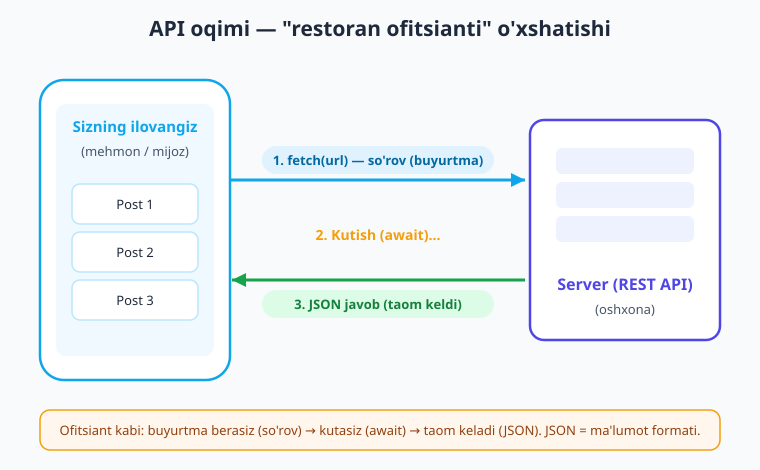
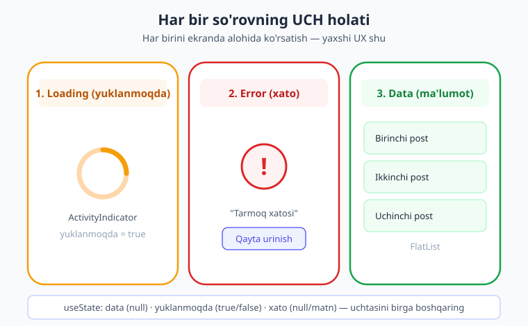
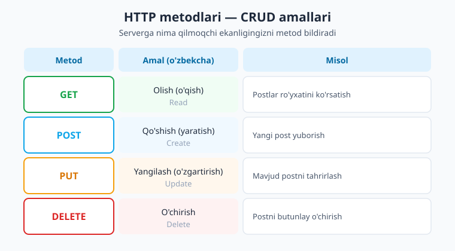

# 17 — Tarmoq va API

[⬅️ Oldingi: 16 — Dinamik marshrut va parametrlar](./16-dinamik-marshrut.md) · [🏠 Kitob boshi](./README.md) · [Keyingi: 18 — Lokal saqlash ➡️](./18-lokal-saqlash.md)

> **Bu bobda:** Ilovangizni internetga ulaymiz. API nimaligini, `fetch` bilan serverdan ma'lumot olishni, **loading / error / data** uch holatini to'g'ri boshqarishni o'rganamiz. POST/PUT/DELETE bilan ma'lumot yuborishni, `axios` alternativasini, xatolarni chiroyli ishlashni, qayta ishlatiladigan `useFetch` hookini va so'rovni bekor qilishni (AbortController) ko'rib chiqamiz. Oxirida real API'dan postlar ro'yxatini yuklaydigan to'liq ilova quramiz.

---

## Nega ilovaga internet kerak?

Hozirgacha biz qurgan ilovalar faqat o'z ichidagi ma'lumot bilan ishlaydi: siz yozgan ro'yxat, hisoblagich soni, forma qiymatlari. Lekin haqiqiy ilovalar deyarli har doim **tashqi dunyo bilan gaplashadi**:

- Instagram boshqalar yuklagan rasmlarni ko'rsatadi,
- ob-havo ilovasi bugungi haroratni serverdan oladi,
- onlayn do'kon mahsulotlar ro'yxatini yuklaydi,
- chat ilovasi yangi xabarlarni qabul qiladi.

Bu ma'lumotlarning hammasi sizning telefoningizda emas, balki internetdagi **server**da turadi. Ilova serverga "menga postlar ro'yxatini ber" deb murojaat qiladi, server javob qaytaradi, ilova esa uni ekranga chizadi. Mana shu muloqotni o'rganamiz.

> **Hayotiy o'xshatish.** API bilan ishlashni **restoranda ovqatlanishga** o'xshating. Siz (ilova) ofitsiantga buyurtma berasiz — bu **so'rov (request)**. Keyin biroz **kutasiz** — oshxona (server) taom tayyorlaydi. So'ng ofitsiant taomingizni keltiradi — bu **javob (response)**. Siz oshxonaga kirib ovqat pishirmaysiz; faqat menyu orqali so'raysiz. Aynan shunday, ilova ham serverning ichki ishlashini bilmaydi — u faqat to'g'ri so'rov yuborib, javobni kutadi.



---

## API va REST nima?

**API** (Application Programming Interface — "dasturlar o'rtasidagi muloqot interfeysi") — bu ikki dastur bir-biri bilan qanday gaplashishini belgilaydigan qoidalar to'plami. Restoran menyusi kabi: menyu sizga nima so'rash mumkinligini va qanday so'rashni ko'rsatadi.

Bugungi kunda eng keng tarqalgan API turi — **REST API**. Uning asosiy g'oyasi sodda:

- Har bir ma'lumot turi o'z **manzili (URL)** ga ega. Masalan, `https://api.example.com/posts` — postlar, `https://api.example.com/users` — foydalanuvchilar.
- Siz bu manzilga **HTTP metodi** bilan murojaat qilasiz: olish uchun `GET`, qo'shish uchun `POST` va hokazo (buni quyida ko'ramiz).
- Server ko'pincha **JSON** formatida javob qaytaradi.

> **Eslatma.** **JSON** (JavaScript Object Notation) — bu ma'lumotni matn ko'rinishida yozish formati. U JavaScript obyektiga juda o'xshaydi va inson ham, kompyuter ham osongina o'qiy oladi. Masalan, bitta post quyidagicha ko'rinadi:
>
> ```json
> {
>   "id": 1,
>   "title": "Birinchi post",
>   "body": "Bu post matni"
> }
> ```

Biz bu bobda **JSONPlaceholder** (`https://jsonplaceholder.typicode.com`) nomli bepul, ro'yxatdan o'tishsiz ishlaydigan test API'sidan foydalanamiz. U haqiqiy postlar, foydalanuvchilar va izohlarni qaytaradi — mashq qilish uchun ideal.

---

## `fetch` — birinchi so'rov

React Native'da serverga so'rov yuborishning eng oddiy yo'li — **`fetch`** funksiyasi. U ilovaga allaqachon o'rnatilgan; hech narsa qo'shish shart emas (xuddi brauzerdagi kabi).

`fetch` **asinxron** (asynchronous) ishlaydi — ya'ni javob darrov kelmaydi, internetdan ma'lumot kelishini biroz kutish kerak. Shu sababli biz `async/await` ishlatamiz.

> **Hayotiy o'xshatish.** "Asinxron" so'zidan qo'rqmang. Bu shunchaki "darhol emas, biroz kutib" degani. Choy damlashga o'xshaydi: choynakka suv quyib, qaynashini kutasiz — shu vaqt davomida boshqa ish bilan shug'ullanishingiz mumkin. `await` so'zi esa "men shu joyda natija kelguncha kutaman" deydi.

Eng sodda GET so'rovi ikki qadamdan iborat:

```tsx
// 1-qadam: serverga murojaat qilamiz va javobni kutamiz
const javob = await fetch('https://jsonplaceholder.typicode.com/posts');

// 2-qadam: javobni JSON'ga aylantiramiz (yana kutamiz)
const data = await javob.json();

console.log(data); // postlar massivi
```

Diqqat qiling: bu yerda **ikkita `await`** bor. Birinchisi — serverdan javob kelishini kutadi. Ikkinchisi — kelgan javobni JavaScript obyektiga aylantirishni kutadi (`javob.json()` ham asinxron). Bu juda keng uchraydigan ikki qadam, uni yodda saqlang.

> **Eslatma.** `await` faqat `async` funksiya ichida ishlatiladi. Shuning uchun ko'pincha `fetch`ni alohida `async` funksiyaga o'rab qo'yamiz, masalan `async function postlarniYukla() { ... }`.

`async/await`ning eski muqobili — `.then()` zanjiri. Ba'zi kodlarda uchratasiz, shuning uchun ko'rib qo'ying:

```tsx
fetch('https://jsonplaceholder.typicode.com/posts')
  .then((javob) => javob.json()) // javobni JSON'ga aylantir
  .then((data) => console.log(data)) // natijani ishlat
  .catch((xato) => console.log(xato)); // xato bo'lsa ushla
```

Ikkalasi ham bir xil ishni qiladi. Biz kitobda asosan `async/await`dan foydalanamiz — u ko'proq o'qishga oson.

---

## Uch holat — eng muhim tushuncha

Bu bobdagi eng muhim g'oyaga keldik. Har qanday tarmoq so'rovi **uchta holat**dan o'tadi va siz har birini foydalanuvchiga ko'rsatishingiz kerak:

1. **Loading (yuklanmoqda)** — so'rov yuborildi, javob hali kelmadi. Foydalanuvchiga aylanuvchi spinner ko'rsatamiz.
2. **Error (xato)** — biror narsa noto'g'ri ketdi (internet yo'q, server ishlamadi). Tushunarli xato xabarini ko'rsatamiz.
3. **Data (ma'lumot)** — javob muvaffaqiyatli keldi. Endi ma'lumotni ekranga chizamiz.

> **Hayotiy o'xshatish.** Tasavvur qiling, pizza buyurtma qildingiz. Uch holat bor: **kutyapsiz** ("yetkazib berilmoqda" — loading), **muammo** ("kuryer adashdi" — error), yoki **pizza keldi** (data). Yaxshi ilova hech qachon sizni qorong'uda qoldirmaydi — har doim qaysi holatda ekanligini bildiradi.



Ko'pchilik boshlovchilar faqat "data" holatini ko'rsatadi va loading/error'ni unutadi. Natijada foydalanuvchi bo'sh ekranga qarab "ilova qotdimi?" deb o'ylaydi. Shuning uchun uch holatni **har doim** birga boshqaring. Buning uchun uchta `useState` ishlatamiz:

```tsx
import { useState } from 'react';

const [data, setData] = useState(null); // ma'lumot (boshda yo'q)
const [yuklanmoqda, setYuklanmoqda] = useState(true); // boshda yuklanmoqda
const [xato, setXato] = useState(null); // xato (boshda yo'q)
```

Boshlang'ich qiymatlarga e'tibor bering: `data` — `null` (hali ma'lumot yo'q), `yuklanmoqda` — `true` (chunki ilova ochilishi bilan yuklash boshlanadi), `xato` — `null` (hali xato yo'q).

---

## `useEffect` bilan yuklash — to'liq namuna

So'rovni qachon yuborish kerak? Komponent ekranda paydo bo'lishi bilan. Buning uchun 11-bobda o'rgangan **`useEffect`**dan foydalanamiz: bo'sh bog'liqliklar massivi `[]` bilan u faqat bir marta, komponent birinchi chizilganda ishlaydi.

> **Eslatma.** 11-bobni eslang: `useEffect(() => { ... }, [])` — komponent ekranga chiqqanda bir marta bajariladigan kod. Tarmoq so'rovi uchun aynan shu kerak. Batafsil esa [11 — useEffect](./11-useeffect.md) bobiga qarang.

Mana to'liq, ishlaydigan namuna. Bunda `try/catch/finally` bloki uch holatni mukammal boshqaradi:

```tsx
// app/postlar.tsx
import { useState, useEffect } from 'react';
import { View, Text, FlatList, ActivityIndicator, StyleSheet } from 'react-native';

// Post ma'lumotining tipini aniqlaymiz (TypeScript)
type Post = { id: number; title: string; body: string };

export default function Postlar() {
  const [data, setData] = useState<Post[] | null>(null);
  const [yuklanmoqda, setYuklanmoqda] = useState(true);
  const [xato, setXato] = useState<string | null>(null);

  useEffect(() => {
    async function yukla() {
      try {
        setYuklanmoqda(true); // yuklashni boshladik
        setXato(null); // oldingi xatoni tozalaymiz
        const javob = await fetch('https://jsonplaceholder.typicode.com/posts');
        if (!javob.ok) {
          // server xato status qaytarsa (masalan 404, 500)
          throw new Error(`Server xatosi: ${javob.status}`);
        }
        const natija: Post[] = await javob.json();
        setData(natija); // ma'lumotni saqlaymiz
      } catch (e: unknown) {
        // tarmoq uzilsa yoki yuqoridagi throw ishlasa shu yerga tushamiz
        setXato(e instanceof Error ? e.message : 'Nomalum xato');
      } finally {
        setYuklanmoqda(false); // har holatda ham yuklash tugadi
      }
    }
    yukla();
  }, []); // [] — faqat bir marta, ochilishda

  // 1-holat: yuklanmoqda
  if (yuklanmoqda) {
    return (
      <View style={styles.markaz}>
        <ActivityIndicator size="large" color="#0ea5e9" />
        <Text style={styles.holat}>Yuklanmoqda...</Text>
      </View>
    );
  }

  // 2-holat: xato
  if (xato) {
    return (
      <View style={styles.markaz}>
        <Text style={styles.xato}>Xato: {xato}</Text>
      </View>
    );
  }

  // 3-holat: ma'lumot
  return (
    <FlatList
      data={data}
      keyExtractor={(item) => item.id.toString()}
      renderItem={({ item }) => (
        <View style={styles.karta}>
          <Text style={styles.sarlavha}>{item.title}</Text>
          <Text style={styles.tana}>{item.body}</Text>
        </View>
      )}
      ListEmptyComponent={<Text style={styles.holat}>Post topilmadi</Text>}
    />
  );
}

const styles = StyleSheet.create({
  markaz: { flex: 1, alignItems: 'center', justifyContent: 'center', gap: 10 },
  holat: { fontSize: 15, color: '#475569' },
  xato: { fontSize: 15, color: '#dc2626', textAlign: 'center', paddingHorizontal: 24 },
  karta: {
    backgroundColor: '#ffffff', padding: 14, marginVertical: 6, marginHorizontal: 12,
    borderRadius: 10, borderWidth: 1, borderColor: '#bae6fd',
  },
  sarlavha: { fontSize: 16, fontWeight: '700', color: '#1e293b' },
  tana: { fontSize: 14, color: '#475569', marginTop: 4 },
});
```

Bu kodni diqqat bilan o'qing — bu butun bobning yuragi. E'tibor bering:

- **`try`** ichida ma'lumot olamiz. Agar hammasi joyida bo'lsa — `setData`.
- **`catch`** xatoni ushlaydi va `setXato` qiladi. Internet yo'qligi ham, server xatosi ham shu yerga keladi.
- **`finally`** har doim (ham muvaffaqiyat, ham xatoda) ishlaydi — shuning uchun `setYuklanmoqda(false)`ni shu yerga qo'yamiz. Bu spinnerning "abadiy" aylanib qolishining oldini oladi.
- UI'da **uchta `return`** bor: avval `yuklanmoqda`, keyin `xato`, oxirida ma'lumot. Tartib muhim.

> **Ehtiyot bo'ling.** `fetch` faqat **tarmoq uzilganda** xato (reject) qaytaradi. Server 404 yoki 500 kabi xato status qaytarsa, `fetch` buni xato deb hisoblamaydi! Shuning uchun biz `if (!javob.ok)` bilan o'zimiz tekshirib, `throw` qilamiz. `javob.ok` — status 200–299 oralig'ida bo'lsa `true`. Bu juda keng uchraydigan tuzoq.

> **Maslahat.** Matn har doim `<Text>` ichida bo'lishi kerak — bu RN qoidasi. `<ActivityIndicator>` — bu RN'ning o'rnatilgan aylanuvchi spinneri; `size="large"` va `color` bilan moslashtiriladi.

---

## Ma'lumot yuborish: POST, PUT, DELETE

Hozirgacha biz faqat ma'lumot **oldik** (GET). Endi ma'lumot **yuborishni** ham o'rganamiz. Buning uchun `fetch`ga ikkinchi argument — **sozlamalar obyekti** beramiz.



Bu to'rt metodni birgalikda **CRUD** deb atashadi: **C**reate (yaratish), **R**ead (o'qish), **U**pdate (yangilash), **D**elete (o'chirish). Ko'pchilik ilovalar shu to'rt amaldan iborat.

### POST — yangi ma'lumot qo'shish

Yangi post yaratish uchun `POST` metodi va yuboriladigan ma'lumot (`body`) kerak:

```tsx
async function postQoshish(sarlavha: string, tana: string) {
  const javob = await fetch('https://jsonplaceholder.typicode.com/posts', {
    method: 'POST', // metod — POST
    headers: { 'Content-Type': 'application/json' }, // "men JSON yuboryapman"
    body: JSON.stringify({ title: sarlavha, body: tana, userId: 1 }), // ma'lumot
  });
  if (!javob.ok) {
    throw new Error(`Qo'shishda xato: ${javob.status}`);
  }
  const yangiPost = await javob.json();
  return yangiPost; // server qaytargan yangi post (id bilan)
}
```

Bu yerda uchta yangi narsa bor:

- **`method: 'POST'`** — qanday amal qilishni serverga bildiramiz.
- **`headers`** — qo'shimcha ma'lumot. `'Content-Type': 'application/json'` serverga "men JSON formatida ma'lumot yuboryapman" deydi.
- **`body`** — yuboriladigan ma'lumot. U **matn** bo'lishi shart, shuning uchun obyektni `JSON.stringify(...)` bilan matnga aylantiramiz.

> **Hayotiy o'xshatish.** GET — bu kutubxonadan kitob **olish** (faqat o'qiysiz). POST — bu kutubxonaga yangi kitob **topshirish** (siz biror narsa berasiz). PUT — eski kitobni yangi nashr bilan **almashtirish**. DELETE — kitobni javondan **olib tashlash**.

### PUT — mavjud ma'lumotni yangilash

Mavjud postni o'zgartirish uchun URL'da uning `id`sini ko'rsatamiz va `PUT` ishlatamiz:

```tsx
async function postYangilash(id: number, yangiSarlavha: string) {
  await fetch(`https://jsonplaceholder.typicode.com/posts/${id}`, {
    method: 'PUT',
    headers: { 'Content-Type': 'application/json' },
    body: JSON.stringify({ title: yangiSarlavha }),
  });
}
```

### DELETE — o'chirish

O'chirish eng sodda — `body` kerak emas, faqat metod va `id`:

```tsx
async function postOchirish(id: number) {
  await fetch(`https://jsonplaceholder.typicode.com/posts/${id}`, {
    method: 'DELETE',
  });
}
```

!!! note "JSONPlaceholder haqida"
    JSONPlaceholder — test API. POST/PUT/DELETE so'rovlari "ishladi" deb javob qaytaradi, lekin haqiqatda hech narsani saqlamaydi (keyingi GET'da yangi postingizni ko'rmaysiz). Bu mashq uchun normal — siz so'rov yuborishni o'rganasiz. Haqiqiy serverda esa o'zgarishlar saqlanadi.

---

## So'rov parametrlari va sarlavhalar

Ko'pincha serverga "qaysi" ma'lumotni xohlayotganingizni aytishingiz kerak: faqat 10 ta post, faqat 1-foydalanuvchi postlari, "telefon" so'zi bo'yicha qidiruv va hokazo. Buni **so'rov parametrlari** (query parameters) orqali aytasiz — ular URL oxiriga `?` belgisidan keyin qo'shiladi:

```text
https://jsonplaceholder.typicode.com/posts?userId=1&_limit=5
                                          └─────────┬─────────┘
                                       so'rov parametrlari
```

Bu yerda `userId=1` — faqat 1-foydalanuvchi postlari, `_limit=5` — faqat 5 ta. Parametrlar bir-biridan `&` bilan ajraladi.

> **Hayotiy o'xshatish.** So'rov parametrlari — bu kafedagi buyurtmangizga qo'shimcha izoh berishga o'xshaydi: "kofe — **shakarsiz**, **sutli**". Asosiy buyurtma bir xil (kofe), lekin parametrlar uni aniqlashtiradi.

URL'ni qo'lda yopishtirish o'rniga, `URL` obyektidan foydalanish toza va xavfsiz:

```tsx
async function postlarniOl(foydalanuvchiId: number) {
  const url = new URL('https://jsonplaceholder.typicode.com/posts');
  url.searchParams.set('userId', String(foydalanuvchiId)); // ?userId=...
  url.searchParams.set('_limit', '5'); // &_limit=5

  const javob = await fetch(url); // URL obyektini to'g'ridan-to'g'ri beramiz
  return await javob.json();
}
```

Bunda maxsus belgilar (bo'shliq, o'zbekcha harflar) avtomatik to'g'ri kodlanadi — qo'lda yopishtirilganda esa xato chiqishi mumkin.

**Sarlavhalar (headers)** esa so'rov haqida qo'shimcha ma'lumot beradi. Eng keng tarqalganlari:

- `'Content-Type': 'application/json'` — "men JSON yuboryapman" (POST/PUT'da kerak).
- `'Authorization': 'Bearer <token>'` — "men kimligimni token bilan tasdiqlayman" (himoyalangan API'larda).
- `'Accept': 'application/json'` — "menga JSON qaytaring".

```tsx
const javob = await fetch('https://api.example.com/profil', {
  headers: {
    'Authorization': `Bearer ${token}`, // token bilan kirish
    'Accept': 'application/json',
  },
});
```

> **Eslatma.** Token va himoyalangan so'rovlar haqida [25 — Autentifikatsiya](./25-autentifikatsiya.md) bobida batafsil gaplashamiz. Hozircha shuni biling: ko'p API'lar har so'rovda kim ekanligingizni `Authorization` sarlavhasi orqali so'raydi.

---

## `axios` — mashhur muqobil

`fetch` yetarli, lekin ko'plab loyihalarda **axios** nomli kutubxona ishlatiladi. U `fetch`ga qaraganda biroz qulayroq. O'rnatish:

```bash
npm install axios
```

Bir xil GET so'rovini axios bilan solishtiring:

```tsx
import axios from 'axios';

// GET — javob to'g'ridan-to'g'ri .data ichida
const javob = await axios.get('https://jsonplaceholder.typicode.com/posts');
const postlar = javob.data; // .json() chaqirish SHART EMAS!

// POST — ikkinchi argument to'g'ridan-to'g'ri ma'lumot
await axios.post('https://jsonplaceholder.typicode.com/posts', {
  title: 'Yangi post',
  body: 'Matn',
  userId: 1,
});
```

`fetch` va `axios` farqlari:

| Xususiyat | `fetch` (o'rnatilgan) | `axios` (kutubxona) |
| --- | --- | --- |
| O'rnatish | Kerak emas | `npm install axios` |
| JSON aylantirish | Qo'lda: `await javob.json()` | Avtomatik: `javob.data` |
| Xato statuslar (404/500) | O'zingiz `javob.ok` tekshirasiz | Avtomatik `catch`ga tushadi |
| `body` | `JSON.stringify(...)` qilasiz | Obyektni to'g'ridan-to'g'ri berasiz |
| Interceptor (oraliq qayta ishlash) | Yo'q | Bor (qulay) |

axiosning eng kuchli tomoni — **interceptor**, ya'ni har bir so'rovga avtomatik biror narsa qo'shish imkoni. Masalan, har so'rovga autentifikatsiya tokenini qo'shish:

```tsx
import axios from 'axios';

// Markaziy sozlama — barcha so'rovlar shu manzildan boshlanadi
const api = axios.create({ baseURL: 'https://jsonplaceholder.typicode.com' });

// Interceptor: har bir so'rovga token qo'shamiz
api.interceptors.request.use((config) => {
  const token = 'foydalanuvchi-tokeni'; // odatda saqlangan joydan olinadi
  config.headers.Authorization = `Bearer ${token}`;
  return config;
});

// Endi har bir api.get/post avtomatik tokenni o'z ichiga oladi
const javob = await api.get('/posts');
```

> **Maslahat.** Boshlovchi sifatida `fetch`dan boshlang — u hech narsa o'rnatmasdan ishlaydi va asoslarni o'rgatadi. Loyihangiz kattalashganda, ko'p so'rov bo'lsa yoki tokenlar bilan ishlasangiz — axiosga o'tish qulay. Token va autentifikatsiya haqida [25 — Autentifikatsiya](./25-autentifikatsiya.md) bobida gaplashamiz.

---

## Xatolarni chiroyli ishlash

Yomon internet — hayotning bir qismi. Yaxshi ilova xatoga "qulamaydi", balki foydalanuvchiga tushunarli xabar beradi. Uch xil xatoni ajratish foydali:

1. **Tarmoq xatosi** — internet yo'q, server javob bermadi. `fetch` to'g'ridan-to'g'ri `catch`ga tashlaydi.
2. **HTTP status xatosi** — server javob berdi, lekin xato bilan (404 — topilmadi, 500 — server xatosi, 401 — ruxsat yo'q). Buni `javob.ok` yoki `javob.status` bilan tekshiramiz.
3. **Timeout** — server juda sekin javob beryapti. Buni `AbortController` bilan to'xtatamiz (quyida).

Foydalanuvchiga texnik xatoni emas, **tushunarli xabar** ko'rsating:

```tsx
catch (e: unknown) {
  let xabar = 'Nimadir xato ketdi. Qaytadan urinib ko\'ring.';
  if (e instanceof TypeError) {
    // ko'pincha internet yo'qligi shu xatoni beradi
    xabar = 'Internet aloqasi yo\'q. Ulanishni tekshiring.';
  } else if (e instanceof Error) {
    xabar = e.message; // bizning throw qilgan xabarimiz
  }
  setXato(xabar);
}
```

> **Ehtiyot bo'ling.** Foydalanuvchiga `TypeError: Network request failed` kabi texnik xatolarni ko'rsatmang — ular tushunarsiz va qo'rqitadi. Har doim oddiy tildagi xabar bering: "Internet yo'q", "Server javob bermadi", "Qayta urinib ko'ring". Xato yonida **"Qayta urinish"** tugmasini qo'ying — bu eng yaxshi UX amaliyotlaridan biri.

---

## `useFetch` — qayta ishlatiladigan custom hook

Har bir ekranga `useState` (×3) + `useEffect` + `try/catch/finally` yozish charchatadi va takrorlanadi. 13-bobda o'rgangan **custom hook** g'oyasi aynan shu uchun: takrorlanuvchi mantiqni bitta funksiyaga yig'amiz.

> **Eslatma.** Custom hook — bu `use` bilan boshlanadigan, ichida boshqa hooklar ishlatadigan funksiya. U bir necha komponent o'rtasida mantiqni ulashish imkonini beradi. Batafsil: [13 — Custom hooklar va tuzilish](./13-custom-hooks-tuzilish.md).

Mana to'liq, qayta ishlatiladigan `useFetch` hooki. U URL'ni qabul qiladi va `{ data, yuklanmoqda, xato, qaytaYukla }` qaytaradi:

```tsx
// hooks/useFetch.ts
import { useState, useEffect, useCallback } from 'react';

type FetchHolati<T> = {
  data: T | null;
  yuklanmoqda: boolean;
  xato: string | null;
  qaytaYukla: () => void;
};

export function useFetch<T>(url: string): FetchHolati<T> {
  const [data, setData] = useState<T | null>(null);
  const [yuklanmoqda, setYuklanmoqda] = useState(true);
  const [xato, setXato] = useState<string | null>(null);
  const [sanagich, setSanagich] = useState(0); // qayta yuklash uchun

  // qaytaYukla — sanagichni oshirib, useEffect'ni qaytadan ishga tushiramiz
  const qaytaYukla = useCallback(() => setSanagich((s) => s + 1), []);

  useEffect(() => {
    const controller = new AbortController(); // so'rovni bekor qilish uchun

    async function yukla() {
      try {
        setYuklanmoqda(true);
        setXato(null);
        const javob = await fetch(url, { signal: controller.signal });
        if (!javob.ok) {
          throw new Error(`HTTP xatosi: ${javob.status}`);
        }
        const natija: T = await javob.json();
        setData(natija);
      } catch (e: unknown) {
        // bekor qilingan so'rov — bu xato emas, jim qolamiz
        if (e instanceof Error && e.name === 'AbortError') return;
        setXato(e instanceof Error ? e.message : 'Nomalum xato');
      } finally {
        setYuklanmoqda(false);
      }
    }

    yukla();
    return () => controller.abort(); // tozalash: komponent yo'qolsa bekor qil
  }, [url, sanagich]); // url o'zgarsa yoki qaytaYukla bosilsa — qayta yukla

  return { data, yuklanmoqda, xato, qaytaYukla };
}
```

Bu hook `<T>` (generik tip) bilan ishlaydi, ya'ni har qanday ma'lumot turi uchun mos. Endi istalgan ekranda bir qator bilan ishlatasiz:

```tsx
// app/postlar.tsx
import { useFetch } from '../hooks/useFetch';

type Post = { id: number; title: string };

export default function Postlar() {
  const { data, yuklanmoqda, xato, qaytaYukla } = useFetch<Post[]>(
    'https://jsonplaceholder.typicode.com/posts'
  );
  // ...endi data/yuklanmoqda/xato'ni UI'da ishlatamiz (uch holat)
}
```

Mana custom hookning kuchi: barcha murakkab mantiq yashiringan, har ekranda atigi bitta qator. Bu **DRY** (Don't Repeat Yourself — "takrorlama") tamoyili.

---

## `AbortController` — so'rovni bekor qilish (tozalash)

Tasavvur qiling: foydalanuvchi profil ekranini ochdi (so'rov boshlandi), lekin javob kelishidan oldin orqaga qaytdi. Komponent ekrandan yo'qoldi, lekin so'rov hali "havoda". Javob kelganda `setData` qilishga urinadi — bu komponent yo'q bo'lib ketgan! Bu xotira oqishi (memory leak) va ogohlantirishlarga olib keladi.

> **Hayotiy o'xshatish.** Bu xuddi taksi chaqirib, keyin o'zingiz boshqa yo'l bilan ketib qolganingizdek. Taksi kelganda siz yo'qsiz. To'g'risi — ketishdan oldin buyurtmani bekor qilish. `AbortController` aynan shu — "endi javob kerak emas" deb so'rovni bekor qiladi.

Buning yechimi — **`AbortController`** va `useEffect`ning **tozalash funksiyasi** (11-bobni eslang):

```tsx
useEffect(() => {
  const controller = new AbortController();

  async function yukla() {
    try {
      const javob = await fetch(url, { signal: controller.signal });
      const data = await javob.json();
      setData(data);
    } catch (e: unknown) {
      if (e instanceof Error && e.name === 'AbortError') return; // bekor qilindi
      // boshqa xatolar...
    }
  }
  yukla();

  // tozalash: komponent yo'qolsa yoki url o'zgarsa — so'rovni bekor qil
  return () => controller.abort();
}, [url]);
```

Yuqoridagi `useFetch` hookida bu allaqachon bor — shuning uchun u "to'g'ri" hook hisoblanadi. Tozalash (cleanup) haqida batafsil: [11 — useEffect](./11-useeffect.md) va obunalarni boshqarish haqida [12 — Hooklar chuqurroq](./12-hooks-chuqur.md).

---

## Ma'lumotni yangilash: pull-to-refresh

Mobil ilovalarda eng tabiiy "yangilash" usuli — ro'yxatni **pastga tortish** (pull-to-refresh). 8-bobda `FlatList`ni o'rgangan edik; uning `refreshControl` xususiyati shu uchun:

```tsx
import { FlatList, RefreshControl, View, Text, StyleSheet } from 'react-native';
import { useFetch } from '../hooks/useFetch';

type Post = { id: number; title: string };

export default function Postlar() {
  const { data, yuklanmoqda, xato, qaytaYukla } = useFetch<Post[]>(
    'https://jsonplaceholder.typicode.com/posts'
  );

  return (
    <FlatList
      data={data}
      keyExtractor={(item) => item.id.toString()}
      renderItem={({ item }) => (
        <View style={styles.karta}>
          <Text style={styles.sarlavha}>{item.title}</Text>
        </View>
      )}
      // pastga tortilganda qaytaYukla ishga tushadi
      refreshControl={
        <RefreshControl refreshing={yuklanmoqda} onRefresh={qaytaYukla} />
      }
    />
  );
}

const styles = StyleSheet.create({
  karta: { backgroundColor: '#fff', padding: 14, margin: 8, borderRadius: 10 },
  sarlavha: { fontSize: 16, color: '#1e293b' },
});
```

`RefreshControl` — bu RN komponenti. `refreshing` (yuklanyaptimi?) va `onRefresh` (tortilganda nima qilish) ikki xususiyatini oladi. Foydalanuvchi ro'yxatni pastga tortsa — `qaytaYukla` ishlaydi, hookimiz so'rovni yangilaydi.

!!! tip "Keshlash va TanStack Query"
    Ilovangiz o'sgan sayin "keshlash" (cache — bir marta yuklangan ma'lumotni saqlab, qayta-qayta yuklamaslik) muhim bo'ladi. Buni qo'lda yozish murakkab. **TanStack Query** (`@tanstack/react-query`) nomli kutubxona buni avtomatik qiladi: keshlash, qayta yuklash, fon yangilash, xatoda qayta urinish — barchasi tayyor. Ko'p ma'lumot bilan ishlaydigan jiddiy ilovalar uchun uni o'rganishni tavsiya qilamiz. Hozircha `useFetch` asoslarni mukammal beradi.

---

## To'liq misol: postlar ro'yxati ilovasi

Endi hamma bilimni birlashtiramiz. Quyidagi ekran real API'dan postlarni yuklaydi, uch holatni to'liq boshqaradi, pull-to-refresh va "Qayta urinish" tugmasini o'z ichiga oladi. Bu kod jonli loyihada `tsc` bilan sinab ko'rilgan — ishonch bilan ishlating:

```tsx
// app/postlar.tsx
import { useState, useEffect, useCallback } from 'react';
import {
  View, Text, FlatList, ActivityIndicator, Pressable, RefreshControl, StyleSheet,
} from 'react-native';

type Post = { id: number; title: string; body: string };

export default function Postlar() {
  const [data, setData] = useState<Post[] | null>(null);
  const [yuklanmoqda, setYuklanmoqda] = useState(true);
  const [xato, setXato] = useState<string | null>(null);

  // useCallback — funksiya har renderda qayta yaratilmasligi uchun
  const yukla = useCallback(async () => {
    try {
      setYuklanmoqda(true);
      setXato(null);
      const javob = await fetch('https://jsonplaceholder.typicode.com/posts');
      if (!javob.ok) {
        throw new Error(`Server xatosi: ${javob.status}`);
      }
      const natija: Post[] = await javob.json();
      setData(natija);
    } catch (e: unknown) {
      setXato(e instanceof Error ? e.message : 'Nimadir xato ketdi');
    } finally {
      setYuklanmoqda(false);
    }
  }, []);

  useEffect(() => {
    yukla();
  }, [yukla]);

  // 1-holat: birinchi yuklash (hali ma'lumot yo'q)
  if (yuklanmoqda && !data) {
    return (
      <View style={styles.markaz}>
        <ActivityIndicator size="large" color="#0ea5e9" />
        <Text style={styles.holat}>Postlar yuklanmoqda...</Text>
      </View>
    );
  }

  // 2-holat: xato (va ma'lumot ham yo'q)
  if (xato && !data) {
    return (
      <View style={styles.markaz}>
        <Text style={styles.xato}>{xato}</Text>
        <Pressable style={styles.tugma} onPress={yukla}>
          <Text style={styles.tugmaMatn}>Qayta urinish</Text>
        </Pressable>
      </View>
    );
  }

  // 3-holat: ma'lumot ro'yxati
  return (
    <FlatList
      data={data}
      keyExtractor={(item) => item.id.toString()}
      contentContainerStyle={styles.royxat}
      renderItem={({ item }) => (
        <View style={styles.karta}>
          <Text style={styles.sarlavha} numberOfLines={1}>{item.title}</Text>
          <Text style={styles.tana} numberOfLines={2}>{item.body}</Text>
        </View>
      )}
      ListEmptyComponent={<Text style={styles.holat}>Hech qanday post yo'q</Text>}
      refreshControl={
        <RefreshControl refreshing={yuklanmoqda} onRefresh={yukla} />
      }
    />
  );
}

const styles = StyleSheet.create({
  markaz: { flex: 1, alignItems: 'center', justifyContent: 'center', gap: 12, padding: 24 },
  holat: { fontSize: 15, color: '#475569' },
  xato: { fontSize: 15, color: '#dc2626', textAlign: 'center' },
  royxat: { padding: 12, gap: 10 },
  karta: {
    backgroundColor: '#ffffff', padding: 16, borderRadius: 12,
    borderWidth: 1, borderColor: '#bae6fd',
  },
  sarlavha: { fontSize: 16, fontWeight: '700', color: '#1e293b' },
  tana: { fontSize: 14, color: '#475569', marginTop: 6 },
  tugma: {
    backgroundColor: '#4f46e5', paddingVertical: 12, paddingHorizontal: 28,
    borderRadius: 10,
  },
  tugmaMatn: { color: '#fff', fontWeight: '600', fontSize: 15 },
});
```

E'tibor bering, bu to'liq misolda biz holatlarni biroz nozikroq tekshiramiz:

- `yuklanmoqda && !data` — bu **birinchi** yuklash (hali hech narsa yo'q). To'liq ekran spinner.
- `xato && !data` — xato bo'ldi va ko'rsatadigan ma'lumot ham yo'q. To'liq ekran xato + tugma.
- Aks holda — ma'lumotni ko'rsatamiz. `refreshing={yuklanmoqda}` esa pull-to-refresh spinnerini boshqaradi (ma'lumot allaqachon ekranda turganda).

> **Maslahat.** `numberOfLines` xususiyati matnni ko'rsatilgan qatordan oshmasligini ta'minlaydi (uzun matn `...` bilan kesiladi). Uzun sarlavhalar va matnlarda kartani toza saqlash uchun foydali.

---

## Xulosa

- **API** — ikki dastur o'rtasidagi muloqot qoidalari; **REST API** har ma'lumotga URL + HTTP metod orqali murojaat qiladi va ko'pincha **JSON** qaytaradi.
- **`fetch`** — RN'ga o'rnatilgan tarmoq vositasi. Ikki qadam: `const javob = await fetch(url)` va `const data = await javob.json()`. `async/await` ishlating.
- **Uch holat** (loading / error / data) — har bir so'rovning asosi. Uchta `useState` bilan boshqaring va har birini UI'da ko'rsating. Faqat "data"ni ko'rsatish — eng keng tarqalgan boshlovchi xatosi.
- **`useEffect(() => { yukla(); }, [])`** — komponent ochilganda bir marta yuklash. `try/catch/finally` uch holatni mukammal boshqaradi; `finally`da `setYuklanmoqda(false)`.
- **`fetch` 404/500'ni xato deb hisoblamaydi** — `if (!javob.ok)` bilan o'zingiz tekshiring va `throw` qiling.
- **POST/PUT/DELETE** — `fetch(url, { method, headers, body: JSON.stringify(...) })` bilan ma'lumot yuborasiz. Bu CRUD amallari.
- **`axios`** — qulay muqobil: avtomatik JSON (`javob.data`), xato statuslar avtomatik `catch`ga tushadi, interceptor bilan tokenlar qo'shiladi.
- **`useFetch` custom hook** takror kodni yo'qotadi; **`AbortController`** komponent yo'qolganda so'rovni bekor qiladi; **`RefreshControl`** pull-to-refresh beradi.

---

## Amaliy mashqlar

1. **Foydalanuvchilar ro'yxati (uch holat).** `https://jsonplaceholder.typicode.com/users` manzilidan foydalanuvchilarni yuklang. `ActivityIndicator` (yuklanmoqda), xato matni (xato) va `FlatList` (ma'lumot) — uch holatni to'liq ko'rsating. Har foydalanuvchi uchun ism va email'ni karta ichida chiqaring.

2. **`javob.ok` tuzog'i.** Bilatdan noto'g'ri URL bering (masalan `.../postlarrr`). `if (!javob.ok)` tekshiruvisiz nima bo'lishini kuzating, keyin tekshiruvni qo'shing va farqni ko'ring. Foydalanuvchiga tushunarli xato xabarini yozing.

3. **Yangi post qo'shish (POST).** `TextInput` va tugma bilan kichik forma yarating. Tugma bosilganda `POST` so'rovi yuboring (sarlavha + matn). "Yuborilmoqda..." holatini ko'rsating va server qaytargan `id`ni ekranda chiqaring. Tugmani yuborish vaqtida `disabled` qiling.

4. **`useFetch` hookini ajrating.** Yuqoridagi `useFetch` hookini alohida `hooks/useFetch.ts` fayliga ko'chiring va kamida ikki xil ekranda (postlar va foydalanuvchilar) ishlating. Generik `<T>` to'g'ri ishlashiga ishonch hosil qiling.

5. **Pull-to-refresh + qayta urinish.** Postlar ro'yxatiga `RefreshControl` qo'shing. Xato holatida "Qayta urinish" tugmasini chiqaring. Qiyinroq: o'chirilgan internetda nima bo'lishini sinab ko'ring (Wi-Fi'ni o'chiring) va xato xabaringiz tushunarli ekanligiga ishonch hosil qiling.

---

[⬅️ Oldingi: 16 — Dinamik marshrut va parametrlar](./16-dinamik-marshrut.md) · [🏠 Kitob boshi](./README.md) · [Keyingi: 18 — Lokal saqlash ➡️](./18-lokal-saqlash.md)
