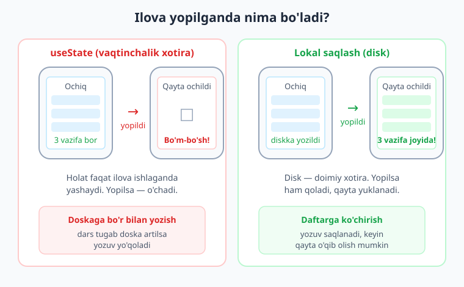
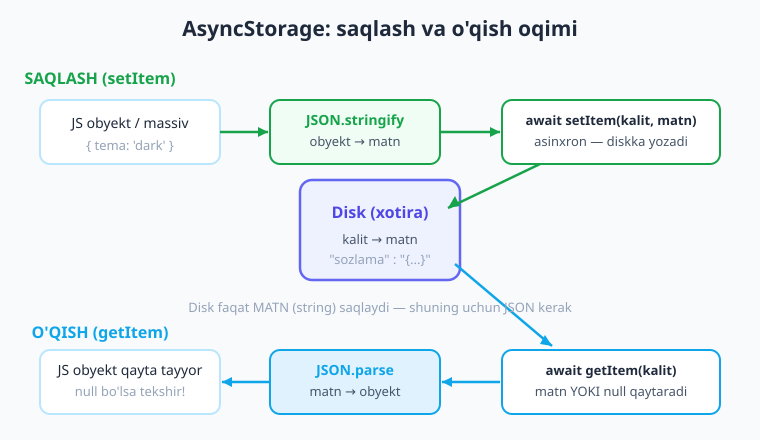
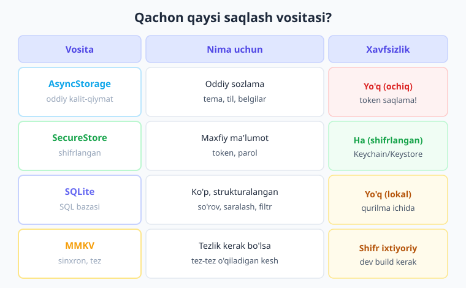

# 18 — Lokal saqlash

[⬅️ Oldingi: 17 — Tarmoq va API](./17-tarmoq-api.md) · [🏠 Kitob boshi](./README.md) · [Keyingi: 19 — Global holat: Context va Zustand ➡️](./19-global-holat.md)

> **Bu bobda:** Ilova yopilganda ma'lumotni qanday saqlab qolishni o'rganamiz. **AsyncStorage** bilan oddiy sozlamalarni, **expo-secure-store** bilan maxfiy ma'lumotni (token, parol), **expo-sqlite** bilan strukturalangan ma'lumotni saqlaymiz. Yo'l-yo'lakay o'zimizning `usePersistentState` custom hookini quramiz va vazifalar ro'yxatini diskka yozadigan to'liq ilova yaratamiz.

---

## Muammo: ilova yopilsa, hamma narsa yo'qoladi

Tasavvur qiling: siz ajoyib vazifalar ro'yxati (todo) ilovasini yozdingiz. Foydalanuvchi 10 ta vazifa qo'shdi, ba'zilarini "bajarildi" deb belgiladi. Keyin telefonni qo'ydi, ilovani yopdi. Ertasi kuni ochib qaradi va... **ro'yxat bo'm-bo'sh!** Hamma vazifalar yo'qolib ketgan.

Nega bunday bo'ldi? Chunki biz ma'lumotni `useState` ichida saqladik. `useState` (va umuman komponent holati) — bu **vaqtinchalik xotira**: u faqat ilova ishlab turgan vaqtgacha yashaydi. Ilova yopilishi bilan butun holat o'chib ketadi.

> **Hayotiy o'xshatish.** `useState` — bu doskaga bo'r bilan yozish kabi. Sinf davomida hamma narsa ko'rinib turadi, lekin dars tugab, doska artilsa — yozuvlar yo'qoladi. Agar yozuvni saqlab qolmoqchi bo'lsangiz, uni **daftarga** ko'chirib olishingiz kerak. Bizning "daftarimiz" — qurilmaning diski (lokal xotira). Disk — uzoq muddatli, doimiy saqlash joyi; ilova qayta ochilganda undan yana o'qib olishimiz mumkin.

Demak, quyidagi narsalar qurilmada **doimiy saqlanishi** kerak:

- foydalanuvchi sozlamalari (tema: yorug'/qorong'i, til, shrift o'lchami);
- login holati va token (foydalanuvchi tizimga kirgan-kirmaganligi);
- foydalanuvchi yaratgan ma'lumot (vazifalar, eslatmalar, savatcha);
- serverdan kelgan ma'lumotning keshi (internet bo'lmaganda ko'rsatish uchun).

Yechim — **qurilmada lokal saqlash**. React Native'da buning bir nechta usuli bor, har biri o'z vazifasiga mos. Keling, eng oddiysidan boshlaymiz.



---

## AsyncStorage — eng oddiy saqlash

**AsyncStorage** — React Native ekotizimidagi eng ommabop va eng oddiy saqlash vositasi. U ma'lumotni **kalit-qiymat** (key-value) ko'rinishida saqlaydi.

> **Hayotiy o'xshatish.** AsyncStorage'ni katta **shkafdagi tortmalar** deb tasavvur qiling. Har bir tortmaning nomi (kalit) bor: "ism", "sozlama", "tema". Siz tortmaga biror narsa qo'yasiz (qiymat), keyin nomini aytib uni qaytarib olasiz. Oddiy va tushunarli — lekin tortmaga faqat **qog'ozga yozilgan matn** sig'adi (qiymat har doim string bo'lishi shart, bu haqda quyida).

AsyncStorage React Native'ga o'rnatilgan emas — uni alohida paket sifatida o'rnatamiz:

```bash
npx expo install @react-native-async-storage/async-storage
```

> **Eslatma.** `npx expo install` (oddiy `npm install` o'rniga) Expo SDK versiyangizga mos paketni tanlaydi. Native modul (qurilma diskiga kirish) bo'lgani uchun AsyncStorage'ni **Expo Go**'da yoki **dev build**'da sinab ko'rasiz — brauzer (`w`) o'rniga telefonda ishlatgan ma'qul.

### Asinxronlik — eng muhim tushuncha

Nomidagi **"Async"** bejiz emas. Diskka yozish va undan o'qish **darhol bajarilmaydi** — bu biroz vaqt oladi. Shu sababli AsyncStorage'ning barcha metodlari **Promise** qaytaradi, ya'ni ularni `await` bilan kutib olamiz.

> **Eslatma.** Asinxronlik va `async/await` haqida 11-bobda (`useEffect`) va 17-bobda (Tarmoq) gaplashgandik. Qisqacha: `await` — "natija tayyor bo'lguncha kutib tur" degani. `await` ishlatish uchun funksiya `async` bo'lishi kerak.

### Saqlash — `setItem`

```tsx
import AsyncStorage from '@react-native-async-storage/async-storage';

async function saqla() {
  // setItem(kalit, qiymat) — qiymat STRING bo'lishi SHART
  await AsyncStorage.setItem('foydalanuvchi_ismi', 'Aziz');
  console.log('Saqlandi!');
}
```

`setItem` ikkita argument oladi: **kalit** (string) va **qiymat** (string). Ikkalasi ham matn bo'lishi shart.

### O'qish — `getItem`

```tsx
async function oqi() {
  const ism = await AsyncStorage.getItem('foydalanuvchi_ismi');
  // ism — string YOKI null (agar bunday kalit yo'q bo'lsa)
  if (ism !== null) {
    console.log('Ism:', ism); // "Aziz"
  } else {
    console.log('Hech narsa saqlanmagan');
  }
}
```

!!! warning "Ehtiyot bo'ling: `null` tekshiring"
    `getItem` agar kalit topilmasa **`null`** qaytaradi (xato emas!). Shuning uchun o'qiganingizdan keyin har doim `if (qiymat !== null)` bilan tekshiring. Aks holda `null` qiymat bilan ishlab xatoga uchrashingiz mumkin.

### Obyekt va massivni saqlash — `JSON.stringify` / `JSON.parse`

Yodingizda bo'lsin: AsyncStorage faqat **string** saqlaydi. Lekin biz ko'pincha obyekt yoki massivni saqlashni xohlaymiz (sozlamalar obyekti, vazifalar massivi). Yechim — uni **JSON** matniga aylantirish.

> **Hayotiy o'xshatish.** Obyekt — bu hajmli, jonli narsa (xuddi yig'ilgan mebel kabi). Uni tortmaga (AsyncStorage'ga) joylash uchun **tekis qutiga qadoqlash** kerak — bu `JSON.stringify`. Qaytarib olganda esa **qutidan chiqarib yig'ish** kerak — bu `JSON.parse`.

```tsx
type Sozlama = {
  tema: 'light' | 'dark';
  til: 'uz' | 'en' | 'ru';
  bildirishnoma: boolean;
};

// SAQLASH: obyekt -> matn
async function saqlaSozlama(sozlama: Sozlama) {
  const matn = JSON.stringify(sozlama); // {"tema":"dark",...} -> matn
  await AsyncStorage.setItem('sozlama', matn);
}

// O'QISH: matn -> obyekt
async function oqiSozlama(): Promise<Sozlama | null> {
  const matn = await AsyncStorage.getItem('sozlama');
  if (matn === null) return null;
  return JSON.parse(matn) as Sozlama; // matn -> {tema, til, ...}
}
```

!!! tip "Maslahat: `JSON.stringify` saqlashda, `JSON.parse` o'qishda"
    Bu juftlikni doim eslab qoling:
    
    - **Saqlashda:** `AsyncStorage.setItem('kalit', JSON.stringify(obyekt))`
    - **O'qishda:** `JSON.parse(await AsyncStorage.getItem('kalit'))`
    
    Eng keng tarqalgan xato — obyektni to'g'ridan-to'g'ri `setItem`'ga berish. U holda `"[object Object]"` degan foydasiz matn saqlanib qoladi.

### Boshqa foydali metodlar

```tsx
// Bitta kalitni o'chirish
await AsyncStorage.removeItem('sozlama');

// Barcha saqlangan kalitlarni olish
const kalitlar = await AsyncStorage.getAllKeys();
console.log(kalitlar); // ['sozlama', 'foydalanuvchi_ismi']

// Bir nechta kalitni birdaniga o'qish
const juftliklar = await AsyncStorage.multiGet(['sozlama', 'foydalanuvchi_ismi']);
juftliklar.forEach(([kalit, qiymat]) => console.log(kalit, '=', qiymat));

// HAMMASINI o'chirish (ehtiyot bo'ling!)
await AsyncStorage.clear();
```

!!! danger "`clear()` — butun ilovaning xotirasini o'chiradi"
    `AsyncStorage.clear()` ilovangizda saqlangan **barcha** kalit-qiymatlarni o'chiradi. Buni faqat "Sozlamalarni tiklash" yoki "Tizimdan chiqish (logout)" kabi maxsus holatlarda ishlating. Bitta narsani o'chirish kerak bo'lsa — `removeItem` ishlating.



---

## DIQQAT: AsyncStorage xavfsiz EMAS

Bu juda muhim qoida. **AsyncStorage ma'lumotni shifrlamaydi** — u oddiy matn ko'rinishida diskda yotadi. Telefoni "rootlangan" (Android) yoki "jailbreak" qilingan (iOS) odam, yoki zararli dastur uni o'qib olishi mumkin.

!!! danger "Xavfsizlik: token va parolni AsyncStorage'da SAQLAMANG"
    AsyncStorage faqat **maxfiy bo'lmagan, oddiy ma'lumot** uchun:
    
    - ✅ tema (yorug'/qorong'i), til, shrift o'lchami;
    - ✅ "onboarding ko'rsatildimi?" kabi belgilar;
    - ✅ serverdan kelgan ommaviy ma'lumot keshi;
    - ❌ **auth token** — saqlamang!
    - ❌ **parol** — saqlamang!
    - ❌ bank karta raqami, shaxsiy maxfiy ma'lumot — saqlamang!
    
    Maxfiy ma'lumot uchun keyingi bo'limdagi **expo-secure-store** ishlatiladi.

---

## expo-secure-store — maxfiy ma'lumot uchun

Maxfiy ma'lumot (token, parol) uchun **expo-secure-store** ishlatamiz. Bu kutubxona ma'lumotni **shifrlab** saqlaydi va operatsion tizimning xavfsiz omborini ishlatadi: iOS'da **Keychain**, Android'da **Keystore**.

> **Hayotiy o'xshatish.** Agar AsyncStorage oddiy tortma bo'lsa, SecureStore — **banking seyfi**. Unga qo'ygan narsangiz qulflanadi va shifrlanadi; faqat sizning ilovangiz uni ochib o'qiy oladi. Pasport, kalitlar, qimmatbaho narsalar uchun.

O'rnatish:

```bash
npx expo install expo-secure-store
```

Asosiy metodlar AsyncStorage'ga juda o'xshash, faqat nomlari `Async` bilan tugaydi:

```tsx
import * as SecureStore from 'expo-secure-store';

// Saqlash (faqat string)
async function saqlaToken(token: string) {
  await SecureStore.setItemAsync('auth_token', token);
}

// O'qish (string yoki null)
async function oqiToken(): Promise<string | null> {
  return await SecureStore.getItemAsync('auth_token');
}

// O'chirish (masalan, logout paytida)
async function ochirToken() {
  await SecureStore.deleteItemAsync('auth_token');
}
```

!!! note "iOS va Android farqi"
    SecureStore ikkala platformada ham mavjud, lekin ostida turli tizimlardan foydalanadi (iOS Keychain, Android Keystore). Siz uchun kod bir xil — Expo farqlarni yashiradi. Eslatma: SecureStore'da kalitlar faqat harf, raqam, `.`, `-`, `_` belgilaridan iborat bo'lishi mumkin.

Biz token saqlash haqida **25-bobda (Autentifikatsiya)** batafsil to'xtalamiz. Hozircha shuni eslab qoling: **maxfiy narsa = SecureStore, oddiy narsa = AsyncStorage**.

---

## Custom hook: `usePersistentState`

E'tibor bersangiz, "holatni o'qish + saqlash" naqshini har safar qo'lda yozish zerikarli: `useEffect` bilan yuklash, har o'zgarishda yozish... Buni bir marta yozib, **custom hook**'ga o'rab qo'yamiz. So'ng istalgan joyda bitta qator bilan ishlatamiz.

> **Eslatma.** Custom hook (o'z hookingiz) haqida 13-bobda gaplashgandik: bu `use` bilan boshlanadigan, ichida boshqa hooklarni ishlatadigan funksiya. U takrorlanuvchi mantiqni qayta ishlatish uchun.

Maqsadimiz: `useState` kabi ishlaydigan, lekin qiymatni **avtomatik diskka saqlaydigan va qayta ochilganda yuklaydigan** hook.

```tsx
// hooks/usePersistentState.ts
import { useState, useEffect, useCallback } from 'react';
import AsyncStorage from '@react-native-async-storage/async-storage';

// <T> — istalgan tip bilan ishlaydi (string, boolean, obyekt, massiv...)
export function usePersistentState<T>(
  kalit: string,
  boshlangich: T
): [T, (yangi: T) => void, boolean] {
  const [qiymat, setQiymat] = useState<T>(boshlangich);
  const [yuklandi, setYuklandi] = useState(false); // disk o'qib bo'lindimi?

  // 1) Mount paytida BIR MARTA diskdan yuklaymiz
  useEffect(() => {
    let bekorQilindi = false; // tozalash uchun bayroq
    (async () => {
      try {
        const saqlangan = await AsyncStorage.getItem(kalit);
        if (saqlangan !== null && !bekorQilindi) {
          setQiymat(JSON.parse(saqlangan) as T);
        }
      } catch (e) {
        console.warn('Yuklashda xato:', e);
      } finally {
        if (!bekorQilindi) setYuklandi(true);
      }
    })();
    return () => {
      bekorQilindi = true; // komponent o'chsa, natijani e'tiborsiz qoldiramiz
    };
  }, [kalit]);

  // 2) Qiymatni o'zgartiradigan funksiya — bir vaqtda diskka ham yozadi
  const yangila = useCallback(
    (yangi: T) => {
      setQiymat(yangi);
      AsyncStorage.setItem(kalit, JSON.stringify(yangi)).catch((e) =>
        console.warn('Saqlashda xato:', e)
      );
    },
    [kalit]
  );

  return [qiymat, yangila, yuklandi];
}
```

Bu hookni `useState` kabi ishlatamiz, lekin u uchta narsa qaytaradi: qiymat, o'zgartirgich va `yuklandi` bayrog'i (disk o'qilgunicha "Yuklanmoqda..." ko'rsatish uchun):

```tsx
// app/index.tsx — tema sozlamasini saqlaydigan misol
import { View, Text, Pressable, StyleSheet } from 'react-native';
import { usePersistentState } from '../hooks/usePersistentState';

export default function Index() {
  const [qora, setQora, yuklandi] = usePersistentState<boolean>('qora_tema', false);

  if (!yuklandi) {
    return <Text>Yuklanmoqda...</Text>; // disk o'qilguncha kutamiz
  }

  return (
    <View style={[styles.box, { backgroundColor: qora ? '#0f172a' : '#f8fafc' }]}>
      <Text style={{ color: qora ? '#fff' : '#1e293b', fontSize: 20 }}>
        {qora ? 'Qorong\'i tema' : 'Yorug\' tema'}
      </Text>
      <Pressable style={styles.tugma} onPress={() => setQora(!qora)}>
        <Text style={styles.tugmaMatn}>Temani almashtirish</Text>
      </Pressable>
    </View>
  );
}

const styles = StyleSheet.create({
  box: { flex: 1, alignItems: 'center', justifyContent: 'center', gap: 16 },
  tugma: { backgroundColor: '#4f46e5', paddingVertical: 12, paddingHorizontal: 24, borderRadius: 10 },
  tugmaMatn: { color: '#fff', fontWeight: '600' },
});
```

Endi foydalanuvchi temani qorong'iga o'zgartirib, ilovani yopsa — qayta ochganda **tema saqlanib qoladi**. Sehr emas, shunchaki disk!

!!! tip "Nega `yuklandi` bayrog'i kerak?"
    Disk o'qish vaqt oladi. Agar uni kutmasak, ilova birinchi soniyada boshlang'ich qiymatni (masalan, "yorug' tema") ko'rsatib, keyin to'satdan saqlangan qiymatga (qorong'i) "sakraydi" — bu "miltillash" (flicker) deb ataladi. `yuklandi` tekshiruvi bu yoqimsiz effektni oldini oladi.

---

## expo-sqlite — strukturalangan ko'p ma'lumot uchun

AsyncStorage oddiy narsalar uchun ajoyib, lekin **ko'p va strukturalangan ma'lumot** bilan ishlash qiyinlashadi. Tasavvur qiling: minglab mahsulot bor do'kon ilovasi, ularni narxi bo'yicha saralash, qidirish, filtrlash kerak. AsyncStorage'da buni qilish uchun butun massivni har safar o'qib, JS'da filtrlashga to'g'ri keladi — sekin va noqulay.

Mana shunday holatlar uchun **ma'lumotlar bazasi** — **expo-sqlite** kerak. SQLite — telefon ichida ishlaydigan to'liq SQL ma'lumotlar bazasi.

> **Hayotiy o'xshatish.** AsyncStorage — bu tartibsiz tortma (kalit bilan bitta narsa olasiz). SQLite esa — **kutubxonadagi katalog tizimi**: jadvallar, satrlar, ustunlar bilan. "Narxi 10000'dan arzon kitoblarni muallifi bo'yicha tartibla" kabi murakkab so'rovlarni bir buyruq bilan bajarish mumkin.

O'rnatish:

```bash
npx expo install expo-sqlite
```

Qisqa misol — mahsulotlar jadvali:

```tsx
import * as SQLite from 'expo-sqlite';

type Mahsulot = { id: number; nomi: string; narxi: number };

async function dokonMisoli() {
  // Bazani ochamiz (yo'q bo'lsa yaratiladi)
  const db = await SQLite.openDatabaseAsync('dokon.db');

  // Jadval yaratamiz (faqat mavjud bo'lmasa)
  await db.execAsync(`
    CREATE TABLE IF NOT EXISTS mahsulotlar (
      id INTEGER PRIMARY KEY AUTOINCREMENT,
      nomi TEXT NOT NULL,
      narxi REAL NOT NULL
    );
  `);

  // Ma'lumot qo'shamiz (? — xavfsiz parametr, SQL-injection'dan himoya)
  await db.runAsync('INSERT INTO mahsulotlar (nomi, narxi) VALUES (?, ?)', 'Non', 5000);

  // Barcha qatorlarni o'qiymiz
  const hammasi = await db.getAllAsync<Mahsulot>('SELECT * FROM mahsulotlar');
  hammasi.forEach((m) => console.log(m.nomi, m.narxi));

  // Bitta qator
  const bitta = await db.getFirstAsync<Mahsulot>(
    'SELECT * FROM mahsulotlar WHERE id = ?',
    1
  );
  console.log(bitta?.nomi);
}
```

Asosiy metodlar:

- **`openDatabaseAsync('nom.db')`** — bazani ochadi (yo'q bo'lsa yaratadi);
- **`execAsync(sql)`** — natija qaytarmaydigan SQL (jadval yaratish va h.k.);
- **`runAsync(sql, ...params)`** — `INSERT`/`UPDATE`/`DELETE` (o'zgartirish);
- **`getAllAsync<T>(sql, ...params)`** — bir nechta qator o'qish (massiv);
- **`getFirstAsync<T>(sql, ...params)`** — bitta qator o'qish.

!!! warning "Doim `?` parametrlardan foydalaning"
    SQL so'roviga qiymatni `'INSERT ... VALUES (' + nomi + ')'` kabi **qo'shib yozmang**. Buning o'rniga `?` belgisini qo'ying va qiymatni alohida bering: `runAsync('... VALUES (?)', nomi)`. Bu **SQL-injection** hujumidan himoya qiladi va qiymatlarni to'g'ri ekranlaydi. (SQL haqida chuqurroq bilim uchun alohida SQL kitobiga murojaat qiling.)

!!! note "SQLite qachon kerak?"
    Faqat ma'lumot **ko'p** (yuzlab/minglab qator) va sizga **so'rovlar** (saralash, filtrlash, qidirish, jadvallar orasidagi bog'lanish) kerak bo'lganda. Oddiy sozlama yoki kichik ro'yxat uchun bu ortiqcha murakkablik — AsyncStorage yetarli.

---

## MMKV — tez va sinxron alternativa

Yana bir mashhur variant — **react-native-mmkv** kutubxonasi. Bu AsyncStorage'ga o'xshash kalit-qiymat ombori, lekin ikkita katta afzalligi bor:

- **Juda tez** — AsyncStorage'dan o'n barobar tezroq (C++ asosida);
- **Sinxron** — `await` shart emas! Qiymatni darhol qaytaradi: `const ism = storage.getString('ism');`.

```tsx
import { MMKV } from 'react-native-mmkv';
const storage = new MMKV();

storage.set('ism', 'Aziz');          // await yo'q!
const ism = storage.getString('ism'); // darhol qaytaradi
```

!!! note "MMKV haqida qisqacha"
    MMKV native modul bo'lgani uchun **dev build** talab qiladi (oddiy Expo Go'da ishlamaydi). Shuning uchun yangi boshlayotgan loyihalar odatda AsyncStorage'dan boshlaydi, keyin tezlik muammo bo'lsa MMKV'ga o'tadi. Bu kitobda asosiy vositamiz — AsyncStorage.

---

## Qachon qaysisini ishlatish?

Endi to'rtta vositamiz bor. Qaysi biri qachon kerakligini esda saqlash uchun jadval:

| Vosita | Nima uchun | Misol | Xavfsizmi? |
|---|---|---|---|
| **AsyncStorage** | Oddiy kalit-qiymat, sozlama | Tema, til, belgilar | Yo'q (shifrlanmagan) |
| **SecureStore** | Maxfiy ma'lumot | Token, parol | Ha (shifrlangan) |
| **SQLite** | Strukturalangan ko'p ma'lumot | Mahsulotlar, so'rovlar | Yo'q (lekin lokal) |
| **MMKV** | Tezlik kerak bo'lganda | Tez-tez o'qiladigan kesh | Yo'q (shifr ixtiyoriy) |

Oddiy qoida:

- **Oddiy sozlama** → AsyncStorage
- **Maxfiy (token/parol)** → SecureStore
- **Ko'p strukturalangan ma'lumot + so'rovlar** → SQLite
- **Maksimal tezlik** → MMKV



---

## To'liq misol: saqlanadigan vazifalar ro'yxati

Endi bobni boshidagi muammoni hal qilamiz — vazifalar ro'yxatini AsyncStorage'da saqlaymiz. Ilova qayta ochilganda vazifalar **joyida qoladi**.

Strategiya oddiy:

1. **Yuklash:** ilova ochilganda (`useEffect`, bo'sh `[]`) diskdan vazifalarni o'qib, holatga qo'yamiz.
2. **Saqlash:** vazifalar massivi har o'zgarganda (`useEffect`, `[vazifalar]`) diskka yozamiz.

```tsx
// app/index.tsx
import { View, Text, Pressable, StyleSheet, TextInput, FlatList } from 'react-native';
import { useState, useEffect } from 'react';
import AsyncStorage from '@react-native-async-storage/async-storage';

type Vazifa = { id: string; matn: string; bajarildi: boolean };
const VAZIFALAR_KALIT = 'vazifalar';

export default function Index() {
  const [vazifalar, setVazifalar] = useState<Vazifa[]>([]);
  const [yangiMatn, setYangiMatn] = useState('');
  const [yuklanmoqda, setYuklanmoqda] = useState(true);

  // 1) Ilova ochilganda diskdan YUKLAYMIZ (bir marta)
  useEffect(() => {
    (async () => {
      try {
        const saqlangan = await AsyncStorage.getItem(VAZIFALAR_KALIT);
        if (saqlangan !== null) {
          setVazifalar(JSON.parse(saqlangan) as Vazifa[]);
        }
      } catch (e) {
        console.warn('Yuklashda xato:', e);
      } finally {
        setYuklanmoqda(false);
      }
    })();
  }, []);

  // 2) vazifalar o'zgarganda diskka SAQLAYMIZ
  useEffect(() => {
    if (yuklanmoqda) return; // dastlabki yuklash tugamasdan yozmaymiz
    AsyncStorage.setItem(VAZIFALAR_KALIT, JSON.stringify(vazifalar)).catch((e) =>
      console.warn('Saqlashda xato:', e)
    );
  }, [vazifalar, yuklanmoqda]);

  const qoshish = () => {
    if (yangiMatn.trim() === '') return;
    const yangi: Vazifa = {
      id: Date.now().toString(),
      matn: yangiMatn.trim(),
      bajarildi: false,
    };
    setVazifalar((eski) => [...eski, yangi]); // immutability — yangi massiv
    setYangiMatn('');
  };

  const almashtir = (id: string) => {
    setVazifalar((eski) =>
      eski.map((v) => (v.id === id ? { ...v, bajarildi: !v.bajarildi } : v))
    );
  };

  return (
    <View style={styles.box}>
      <Text style={styles.sarlavha}>Vazifalarim</Text>
      <View style={styles.qator}>
        <TextInput
          style={styles.input}
          value={yangiMatn}
          onChangeText={setYangiMatn}
          placeholder="Yangi vazifa..."
        />
        <Pressable style={styles.tugma} onPress={qoshish}>
          <Text style={styles.tugmaMatn}>Qo'sh</Text>
        </Pressable>
      </View>
      <FlatList
        data={vazifalar}
        keyExtractor={(item) => item.id}
        renderItem={({ item }) => (
          <Pressable onPress={() => almashtir(item.id)}>
            <Text style={[styles.vazifa, item.bajarildi && styles.bajarilgan]}>
              {item.bajarildi ? '✅' : '⬜'} {item.matn}
            </Text>
          </Pressable>
        )}
        ListEmptyComponent={<Text style={styles.bosh}>Vazifa yo'q</Text>}
      />
    </View>
  );
}

const styles = StyleSheet.create({
  box: { flex: 1, padding: 20, gap: 12 },
  sarlavha: { fontSize: 24, fontWeight: '700', color: '#1e293b' },
  qator: { flexDirection: 'row', gap: 8 },
  input: {
    flex: 1,
    borderWidth: 1,
    borderColor: '#cbd5e1',
    borderRadius: 8,
    paddingHorizontal: 12,
    paddingVertical: 8,
  },
  tugma: { backgroundColor: '#4f46e5', paddingHorizontal: 16, justifyContent: 'center', borderRadius: 8 },
  tugmaMatn: { color: '#fff', fontWeight: '600' },
  vazifa: { fontSize: 16, paddingVertical: 10, color: '#1e293b' },
  bajarilgan: { textDecorationLine: 'line-through', color: '#94a3b8' },
  bosh: { color: '#94a3b8', textAlign: 'center', marginTop: 20 },
});
```

Ushbu kod TypeScript tekshiruvidan (`tsc`) muvaffaqiyatli o'tdi. Ikkita `useEffect` bir-birini to'ldiradi: biri **o'qiydi**, ikkinchisi **yozadi**. `yuklanmoqda` tekshiruvi muhim — usiz birinchi render'da bo'sh massiv diskka yozilib, eski vazifalarni o'chirib yuborardi.

!!! tip "Immutability — eslatma"
    Diqqat qiling: `qoshish` va `almashtir`'da biz mavjud massivni o'zgartirmaymiz, balki **yangi massiv** yaratamiz (`[...eski, yangi]`, `.map(...)`). Bu 9-bobda o'rgangan immutability qoidasi — React o'zgarishni faqat shu tarzda sezadi va `useEffect`'imizni ishga tushiradi.

---

## Xulosa

- `useState` — vaqtinchalik xotira: ilova yopilsa **yo'qoladi**. Doimiy saqlash uchun ma'lumotni **qurilma diskiga** yozish kerak.
- **AsyncStorage** — eng oddiy kalit-qiymat ombori. Barcha metodlari **asinxron** (`await`). Qiymat har doim **string**.
- Obyekt/massivni saqlashda **`JSON.stringify`**, o'qishda **`JSON.parse`** ishlating. `getItem` yo'q kalit uchun **`null`** qaytaradi — har doim tekshiring.
- AsyncStorage **shifrlanmagan** — token/parol/maxfiy ma'lumotni **unga saqlamang**.
- Maxfiy ma'lumot uchun **expo-secure-store** (`setItemAsync`/`getItemAsync`/`deleteItemAsync`) — iOS Keychain / Android Keystore bilan shifrlangan.
- **expo-sqlite** — ko'p, strukturalangan ma'lumot va SQL so'rovlari uchun ma'lumotlar bazasi (`openDatabaseAsync`, `execAsync`, `runAsync`, `getAllAsync`, `getFirstAsync`). Doim `?` parametrlarni ishlating.
- **MMKV** — juda tez, sinxron alternativa (dev build kerak).
- Takrorlanuvchi "yukla + saqla" mantiqini **custom hook** (`usePersistentState`) ga o'rab, bir qator bilan ishlating.

---

## Amaliy mashqlar

1. **Tema saqlash (oson).** Ekranda "Yorug'/Qorong'i" tugmasi bo'lsin. Tanlangan tema AsyncStorage'da saqlansin va ilova qayta ochilganda tiklansin. Boshlang'ich qiymat — yorug' tema. (Maslahat: `JSON.stringify(true/false)` ishlatish shart emas, lekin bir xillik uchun foydali.)

2. **So'nggi qidiruv (oson-o'rta).** Qidiruv inputi bo'lsin. Foydalanuvchi qidirgan so'zlar massivga qo'shilib AsyncStorage'da saqlansin (eng ko'pi 5 ta, eskilari o'chsin). Ilova ochilganda "so'nggi qidiruvlar" ko'rinsin.

3. **`usePersistentState`'ni ishlating (o'rta).** Yuqorida yozgan `usePersistentState` hookini o'z loyihangizga ko'chiring. Uni ikki joyda ishlating: bittasi `boolean` (tema), ikkinchisi `string` (foydalanuvchi ismi). `yuklandi` bayrog'i bilan "Yuklanmoqda..." holatini to'g'ri ko'rsating.

4. **Vazifalarga o'chirish qo'shing (o'rta).** Yuqoridagi to'liq misolga har vazifa yonida "🗑️ O'chirish" tugmasini qo'shing. O'chirilgandan keyin ham ro'yxat diskka saqlanishini tekshiring (ilovani yopib-oching).

5. **SecureStore bilan token (qiyin).** Soxta "login" ekrani yarating: tugma bosilganda `SecureStore.setItemAsync('token', 'soxta-token-123')` chaqirilsin. Boshqa ekranda token bor-yo'qligini tekshirib, "Tizimga kirgansiz" yoki "Kiring" deb ko'rsating. "Chiqish" tugmasi `deleteItemAsync` bilan tokenni o'chirsin. (Bu 25-bobdagi haqiqiy autentifikatsiyaga ko'prik.)

---

[⬅️ Oldingi: 17 — Tarmoq va API](./17-tarmoq-api.md) · [🏠 Kitob boshi](./README.md) · [Keyingi: 19 — Global holat: Context va Zustand ➡️](./19-global-holat.md)
