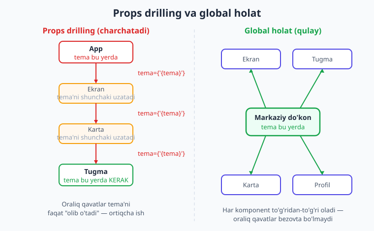
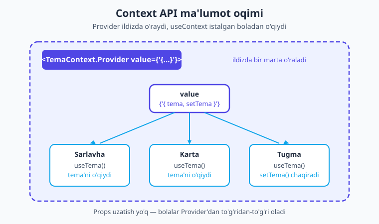
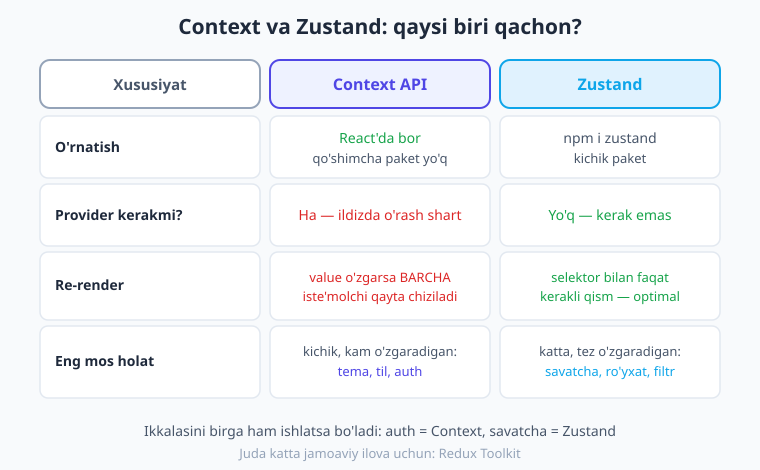

# 19 — Global holat: Context va Zustand

[⬅️ Oldingi: 18 — Lokal saqlash](./18-lokal-saqlash.md) · [🏠 Kitob boshi](./README.md) · [Keyingi: 20 — Formalar va validatsiya ➡️](./20-formalar-validatsiya.md)

> **Bu bobda:** Ba'zi ma'lumot (kim login qilgan, qaysi tema tanlangan, savatchada nima bor) butun ilovaga kerak bo'ladi. Uni har bir komponentga props orqali qo'lda uzatish charchatadi. Shu muammoni yechadigan **global holat**ni o'rganamiz: avval React'ning o'rnatilgan **Context API**'sini, keyin zamonaviy va sodda **Zustand** kutubxonasini. Ikkalasini taqqoslaymiz, qaysi biri qachon mosligini ko'ramiz va saqlashni `persist` bilan birga ulaymiz.

---

## Muammo: ma'lumot butun ilovaga kerak

Tasavvur qiling: ilovangizda foydalanuvchi tizimga kirdi. Endi uning ismi bosh ekranda ham, profil ekranida ham, har bir kommentariya ostida ham ko'rinishi kerak. Yoki foydalanuvchi "qorong'i tema"ni tanladi — bu tanlov **butun ilovaning** har bir tugmasiga, har bir matniga ta'sir qilishi kerak. Yoki onlayn-do'kon savatchasi: mahsulot qaysi ekranda qo'shilganidan qat'i nazar, savatcha belgisi har joyda bir xil sonni ko'rsatishi shart.

Bunday ma'lumotlarning umumiy xususiyati shu: ular **bitta komponentga tegishli emas** — ular ilovaning ko'p joyiga, ba'zan butun daraxtga kerak.

9–10-boblarda biz holatni `useState` bilan komponent ichida saqlashni va uni props orqali bolaga uzatishni o'rgandik. Bu yondashuv yaqin "qarindosh" komponentlar uchun ajoyib ishlaydi. Lekin ma'lumot daraxtning yuqorisidan pastdagi chuqur joylashgan komponentga kerak bo'lsa-chi?

### Props drilling — "har xonaga simni alohida tortish"

Aytaylik, `tema` qiymati eng yuqorida — `App` komponentida saqlanadi. Lekin u faqat daraxtning eng tubidagi `Tugma` komponentiga kerak. Props orqali yetkazish uchun biz uni **har bir oraliq qavatdan** o'tkazishimiz kerak:

```tsx
// App tema'ni biladi, lekin u faqat Tugma'ga kerak
<Ekran tema={tema}>      {/* Ekran tema'dan foydalanmaydi, faqat uzatadi */}
  <Karta tema={tema}>    {/* Karta ham foydalanmaydi, faqat uzatadi */}
    <Tugma tema={tema} /> {/* mana shu yerda KERAK */}
  </Karta>
</Ekran>
```

Bu yerda `Ekran` va `Karta` `tema`ni umuman ishlatmaydi — ular shunchaki uni quyiroqqa **olib o'tadi**. Bu hodisa **"props drilling"** (ya'ni "props'larni har qavatdan o'tkazib teshib o'tish") deb ataladi. Daraxt chuqurlashgani sayin bu ish chidab bo'lmas darajada zerikarli va xatoga moyil bo'ladi.

> **Hayotiy o'xshatish.** Props drilling — bu uyning har bir xonasiga elektr simini **alohida**, qo'lda tortishga o'xshaydi: oshxonaga simni yotoqxona orqali, yotoqxonaga dahliz orqali... Oraliq xonalarga bu sim kerak emas, lekin u baribir ulardan o'tib ketadi. **Global holat** esa — uyning **markaziy elektr tarmog'i** kabi: har bir xona kerak bo'lganda shunchaki **shtepselni** rozetkaga tiqadi. Markazdan har joyga to'g'ridan-to'g'ri ulanish bor, oraliq xonalarni bezovta qilish shart emas.



**Yechim — global holat.** Ma'lumotni daraxtning bitta tepa nuqtasida saqlaymiz, keyin uni **istalgan** komponent oraliq qavatlarsiz to'g'ridan-to'g'ri o'qiy oladi. Bu bobda ikkita yo'lini ko'ramiz:

1. **Context API** — React'ning o'zida bor, o'rnatilgan. Kichik, kam o'zgaradigan holatga (tema, til, auth) juda mos.
2. **Zustand** — kichik, zamonaviy kutubxona. Katta yoki tez-tez o'zgaradigan holatga (savatcha, ro'yxat) qulay va tezroq.

---

## Context API — React'ning o'rnatilgan yechimi

**Context** (ya'ni "kontekst, umumiy muhit") — bu React'ning o'zida bor mexanizm. U bir qiymatni daraxtning yuqorisida e'lon qilib, uni props uzatmasdan **har qanday** quyi komponentga yetkazib berishga imkon beradi.

Context'ning uch qismi bor, ularni "rozetka tizimi"ga o'xshatib eslab qoling:

1. **`createContext`** — kontekstni *yaratish* (rozetka standartini belgilash).
2. **`Provider`** (ta'minlovchi) — qiymatni *uzatish*; daraxtni o'raydigan komponent (markaziy tarmoqni yoqish).
3. **`useContext`** — qiymatni *o'qish*; istalgan boladan (shtepselni tiqish).



### 1-qadam: kontekstni yaratish

Avval `createContext` bilan kontekst obyektini yaratamiz. TypeScript'da kontekst ichida qanday ma'lumot turishini ham e'lon qilamiz:

```tsx
// context/TemaContext.tsx
import { createContext } from 'react';

type Tema = 'yorug' | 'qorongi';

// Kontekstda nima turishini tip bilan ta'riflaymiz
type TemaContextTuri = {
  tema: Tema;
  temaAlmashtir: () => void;
};

// Boshlang'ich qiymat undefined — keyin "Provider yo'q" xatosini ushlash uchun
export const TemaContext = createContext<TemaContextTuri | undefined>(undefined);
```

> **Eslatma.** Boshlang'ich qiymat sifatida `undefined` qo'yyapmiz. Bu — agar biror komponent `Provider` o'ralmagan joyda kontekstni o'qimoqchi bo'lsa, biz aniq xato bera olishimiz uchun. Buni biroz pastda ko'ramiz.

### 2-qadam: Provider bilan o'rash

Endi haqiqiy qiymatni (`tema` va uni o'zgartiradigan funksiya) `Provider`ga beramiz. Provider — bu daraxtni o'raydigan komponent. Uning ichidagi **hamma** bola bu qiymatga ega bo'ladi:

```tsx
// context/TemaContext.tsx (davomi)
import { useState, type ReactNode } from 'react';

export function TemaProvider({ children }: { children: ReactNode }) {
  // Asl holat shu yerda — oddiy useState bilan
  const [tema, setTema] = useState<Tema>('yorug');

  const temaAlmashtir = () =>
    setTema((t) => (t === 'yorug' ? 'qorongi' : 'yorug'));

  return (
    <TemaContext.Provider value={{ tema, temaAlmashtir }}>
      {children}
    </TemaContext.Provider>
  );
}
```

Bu yerda `children` (ya'ni "bolalar") — Provider ichiga joylanadigan butun daraxt. `value` esa — barcha bolalarga tarqatiladigan qiymat.

> **Eslatma.** `ReactNode` (ya'ni "React tuguni") — bu komponent ichiga joylanishi mumkin bo'lgan har qanday narsaning tipi: matn, boshqa komponentlar, ro'yxat. `children` shu tipda bo'ladi.

### 3-qadam: Provider'ni ildizda joylash

Provider butun ilovani o'rashi uchun uni Expo Router'ning **ildiz `_layout.tsx`** fayliga qo'yamiz. Shunda undan pastdagi har bir ekran kontekstga ega bo'ladi:

```tsx
// app/_layout.tsx
import { Stack } from 'expo-router';
import { TemaProvider } from '../context/TemaContext';

export default function RootLayout() {
  return (
    <TemaProvider>
      <Stack />
    </TemaProvider>
  );
}
```

> **Eslatma.** SDK 56 shabloni routing ildizini `src/app/` qiladi — qoidalar aynan bir xil, faqat yo'l `src/app/_layout.tsx` bo'ladi. Misollarda qisqalik uchun `app/` ishlatamiz.

### 4-qadam: `useContext` bilan o'qish

Endi istalgan komponentdan `useContext` orqali `tema`ga yetib boramiz — hech qanday props uzatmasdan:

```tsx
// app/index.tsx
import { useContext } from 'react';
import { View, Text, Pressable, StyleSheet } from 'react-native';
import { TemaContext } from '../context/TemaContext';

export default function Bosh() {
  const ctx = useContext(TemaContext);
  if (!ctx) return null; // Provider yo'q bo'lsa
  const { tema, temaAlmashtir } = ctx;

  return (
    <View style={styles.box}>
      <Text style={styles.matn}>Joriy tema: {tema}</Text>
      <Pressable style={styles.tugma} onPress={temaAlmashtir}>
        <Text style={styles.tugmaMatn}>Temani almashtirish</Text>
      </Pressable>
    </View>
  );
}

const styles = StyleSheet.create({
  box: { flex: 1, alignItems: 'center', justifyContent: 'center', gap: 16 },
  matn: { fontSize: 20, fontWeight: '700', color: '#1e293b' },
  tugma: { backgroundColor: '#4f46e5', paddingVertical: 12, paddingHorizontal: 24, borderRadius: 10 },
  tugmaMatn: { color: '#fff', fontWeight: '600' },
});
```

Diqqat qiling: `Bosh` komponentiga `tema` props sifatida **berilmadi**. U uni to'g'ridan-to'g'ri kontekstdan oldi. Daraxt qanchalik chuqur bo'lsa ham, ahamiyati yo'q — `useContext` har joydan ishlaydi.

### Custom hook bilan tartibga solish

Yuqoridagi `if (!ctx) return null` qatorini har bir komponentda takrorlash zerikarli. Buni **custom hook** (13-bobda o'rgangan o'z hookimiz) ichiga yashiramiz. Bu — kontekstga murojaat qilishning toza va xavfsiz yo'li:

```tsx
// context/TemaContext.tsx (davomi)
import { useContext } from 'react';

export function useTema() {
  const ctx = useContext(TemaContext);
  if (ctx === undefined) {
    // Aniq, foydali xato — Provider unutilganda darrov bilinadi
    throw new Error('useTema() faqat <TemaProvider> ichida ishlaydi');
  }
  return ctx;
}
```

Endi komponentlarda hammasi soddalashadi — `undefined` tekshiruvini hook o'zi qiladi:

```tsx
// app/index.tsx (toza versiya)
import { useTema } from '../context/TemaContext';

export default function Bosh() {
  const { tema, temaAlmashtir } = useTema(); // bir qatorda, xavfsiz
  // ...
}
```

> **Maslahat.** Har bir kontekst uchun shunday `useXxx` hook yozish — keng tarqalgan va kuchli amaliyot. U kodni toza qiladi, Provider unutilganda aniq xato beradi va kontekstni qayerda ishlatayotganingizni oson topishga yordam beradi.

!!! tip "Maslahat"
    `useTema()` hookini real loyihada `tsc` bilan tekshirib ko'rdik — `createContext`, `Provider`, `useContext` va custom hook bilan to'liq misol xatosiz kompilyatsiya bo'ldi.

---

## Context'ning muhim cheklovi: ortiqcha re-render

Context kuchli, lekin uning bitta jiddiy cheklovini **albatta** bilishingiz kerak.

> **Hayotiy o'xshatish.** Tasavvur qiling, bitta umumiy radioeshittirish bor va unga 50 ta uy ulangan. Hatto eshittirishda **bitta** so'z o'zgarsa ham, signal **barcha** 50 uyga qayta yuboriladi — garchi ko'p uylar faqat ob-havo qismini tinglayotgan bo'lsa ham. Context ham xuddi shunday.

Texnik tilda: **Provider'ning `value` qiymati o'zgarganda, shu kontekstni o'qiydigan BARCHA komponent qayta render bo'ladi** — hatto ular o'zgargan qismdan foydalanmasa ham.

Agar kontekst tez-tez o'zgaradigan katta holatni saqlasa (masalan, har sekundda yangilanadigan savatcha yoki har harf yozilganda o'zgaradigan forma), bu juda ko'p ortiqcha re-render'ga olib keladi va ilova sekinlashadi.

!!! warning "Ehtiyot bo'ling"
    Context'ni **kichik va kam o'zgaradigan** global holat uchun ishlating: **tema, til (lokalizatsiya), login qilingan foydalanuvchi (auth)**. Tez-tez o'zgaradigan yoki katta holat uchun (savatcha, qidiruv natijalari, jonli ro'yxat) **Zustand**'ni tanlang — u re-render'ni ancha aqlli boshqaradi.

Aynan shu cheklov bizni keyingi vositaga — Zustand'ga olib keladi.

---

## Zustand — sodda va zamonaviy global holat

**Zustand** (nemischa "holat" so'zi, "tsu-shtand" deb o'qiladi) — bugungi React va React Native dunyosida eng mashhur global holat kutubxonalaridan biri. Uning sehri — **soddaligida**: Provider o'rash shart emas, kod kam, o'rganish oson.

> **Hayotiy o'xshatish.** Zustand do'koni — bu ilovaning **markaziy omboriga** o'xshaydi. Ombor bitta joyda turadi. Har bir komponent omborga borib **faqat o'ziga kerakli javondan** mahsulot oladi (selektor). Mahsulot ombor ichida o'zgarsa, faqat o'sha javonni kuzatayotgan komponentlar xabardor bo'ladi — boshqalar bezovta bo'lmaydi.

### O'rnatish

Zustand kichik kutubxona, bitta buyruq bilan o'rnatiladi:

```bash
npm i zustand
```

### Do'kon (store) yaratish

Zustand'da holat **do'kon (store)** deb ataladigan narsada saqlanadi. Uni `create` funksiyasi bilan yaratamiz. Do'kon ichida ham **ma'lumot**, ham uni **o'zgartiradigan funksiyalar** (action'lar) birga turadi:

```ts
// store/savat.ts
import { create } from 'zustand';

type Mahsulot = { id: string; nomi: string; narxi: number };

// Do'konda nima turishini tip bilan ta'riflaymiz
type SavatHolati = {
  mahsulotlar: Mahsulot[];
  qoshish: (m: Mahsulot) => void;
  ochirish: (id: string) => void;
  tozalash: () => void;
};

export const useSavat = create<SavatHolati>((set) => ({
  // boshlang'ich ma'lumot
  mahsulotlar: [],

  // action'lar — set() bilan holatni yangilaydi
  qoshish: (m) => set((s) => ({ mahsulotlar: [...s.mahsulotlar, m] })),
  ochirish: (id) =>
    set((s) => ({ mahsulotlar: s.mahsulotlar.filter((x) => x.id !== id) })),
  tozalash: () => set({ mahsulotlar: [] }),
}));
```

Bu yerda eng muhim funksiya — **`set`**. U holatni yangilaydi. Ikki ko'rinishda ishlatamiz:

- `set({ mahsulotlar: [] })` — yangi qiymatni to'g'ridan-to'g'ri berish.
- `set((s) => ({ ... }))` — **joriy holatga** (`s`) qarab yangilash. Bu — 9-bobdagi immutability qoidasining aynan o'zi: eski massivni o'zgartirmasdan, `[...s.mahsulotlar, m]` bilan **yangi** massiv yaratyapmiz.

> **Eslatma.** `useSavat` — bu **hook**. Nomi `use` bilan boshlanishi bejiz emas: uni xuddi `useState` kabi komponent ichida chaqiramiz. Lekin oddiy hookdan farqi — bu do'kon **butun ilova uchun bitta**, har bir komponentda umumiy.

### Komponentda ishlatish — selektor sehri

Endi eng go'zal qism. Komponent do'kondan **faqat o'ziga kerakli qismni** so'raydi. Buni **selektor** (ya'ni "tanlovchi" funksiya) deb ataymiz:

```tsx
// Savat sonini ko'rsatadigan kichik komponent
import { Text } from 'react-native';
import { useSavat } from '../store/savat';

function SavatBelgisi() {
  // FAQAT mahsulotlar sonini tanlaymiz
  const soni = useSavat((s) => s.mahsulotlar.length);
  return <Text>Savatda: {soni} ta</Text>;
}
```

Bu yerdagi `(s) => s.mahsulotlar.length` — selektor. U do'konning butun holatidan **faqat son**ni ajratib oladi. Natijada `SavatBelgisi` faqat **son o'zgarganda** qayta render bo'ladi. Agar mahsulot narxi o'zgarsa-yu, soni o'zgarmasa — bu komponent qayta chizilmaydi.

Mana shu — Zustand'ning Context'dan asosiy ustunligi: **selektor tufayli ortiqcha re-render bo'lmaydi.** Va e'tibor bering — biz hech qanday `Provider` o'ramadik. Do'kon shunchaki mavjud, har joydan ishlatsa bo'ladi.

Action'larni ham xuddi shunday tanlab olamiz:

```tsx
// app/savat.tsx
import { View, Text, Pressable, FlatList, StyleSheet } from 'react-native';
import { useSavat } from '../store/savat';

export default function SavatEkrani() {
  const mahsulotlar = useSavat((s) => s.mahsulotlar);
  const qoshish = useSavat((s) => s.qoshish);
  const tozalash = useSavat((s) => s.tozalash);

  const jami = mahsulotlar.reduce((y, m) => y + m.narxi, 0);

  return (
    <View style={styles.box}>
      <Text style={styles.sarlavha}>Savat ({mahsulotlar.length})</Text>

      <Pressable
        style={styles.tugma}
        onPress={() =>
          qoshish({ id: String(Date.now()), nomi: 'Olma', narxi: 5000 })
        }
      >
        <Text style={styles.tugmaMatn}>Olma qo'shish</Text>
      </Pressable>

      <FlatList
        data={mahsulotlar}
        keyExtractor={(item) => item.id}
        renderItem={({ item }) => (
          <Text style={styles.qator}>
            {item.nomi} — {item.narxi} so'm
          </Text>
        )}
      />

      <Text style={styles.sarlavha}>Jami: {jami} so'm</Text>
      <Pressable style={styles.tugma} onPress={tozalash}>
        <Text style={styles.tugmaMatn}>Savatni tozalash</Text>
      </Pressable>
    </View>
  );
}

const styles = StyleSheet.create({
  box: { flex: 1, padding: 16, gap: 12 },
  sarlavha: { fontSize: 18, fontWeight: '700', color: '#1e293b' },
  qator: { fontSize: 15, color: '#475569', paddingVertical: 4 },
  tugma: { padding: 12, backgroundColor: '#0ea5e9', borderRadius: 10 },
  tugmaMatn: { color: '#fff', fontWeight: '600', textAlign: 'center' },
});
```

!!! tip "Maslahat"
    Har bir qiymat va action uchun **alohida** `useSavat((s) => ...)` chaqiruvi yozing. Shunday qilsangiz, har bir komponent faqat o'zi tanlagan qism o'zgargandagina qayta render bo'ladi — bu eng optimal usul.

!!! example "Misol"
    Yuqoridagi savatcha do'koni va uning komponentini real Expo loyihasida Zustand v5.0 bilan `tsc` orqali tekshirdik — selektorlar, `set` bilan immutable yangilash va `FlatList` bilan ro'yxat — barchasi xatosiz kompilyatsiya bo'ldi.

---

## Context va Zustand: qaysi biri qachon?

Endi ikkala vositani yonma-yon qo'yib taqqoslaylik. Ular raqib emas — har biri o'z o'rnida ajoyib:



| Xususiyat | Context API | Zustand |
| --- | --- | --- |
| O'rnatish | React'da bor, paket kerak emas | `npm i zustand` (kichik paket) |
| Provider kerakmi? | Ha — ildizda o'rash shart | Yo'q — kerak emas |
| Re-render | `value` o'zgarsa **barcha** iste'molchi | selektor bilan **faqat kerakli** qism |
| Kod miqdori | ko'proq (Provider + hook) | kamroq, sodda |
| Eng mos holat | kichik, kam o'zgaradigan: **tema, til, auth** | katta yoki tez: **savatcha, ro'yxat, filtr** |

> **Hayotiy o'xshatish.** Context — uyning **markaziy yorug'lik kaliti**: kamdan-kam bosiladi, butun uyga ta'sir qiladi, sodda. Zustand — uyning **aqlli ombori**: ko'p mahsulot tez kelib-ketadi, har bir komponent faqat o'z javonini kuzatadi, samarali. Kichik narsaga kalit, katta oqimga ombor.

> **Maslahat.** Boshlovchi sifatida sodda qoidaga amal qiling: **kam o'zgaradigan kichik holatga Context, qolgan barchasiga Zustand.** Aslida, ko'pchilik real ilovalarda Zustand'ni asosiy vosita sifatida tanlash — ham sodda, ham unumdor yo'l.

---

## Zustand + persist: holatni saqlash

18-bobda biz `AsyncStorage` bilan ma'lumotni telefon xotirasida saqlashni o'rgandik. Zustand buni avtomatlashtiradigan ajoyib **`persist`** ("saqlab qolish") middleware'iga ega. Uni qo'shsangiz, do'kon holati **avtomatik** AsyncStorage'ga yoziladi va ilova qayta ochilganda **avtomatik** tiklanadi.

> **Hayotiy o'xshatish.** `persist` — bu omborning har kungi hisobini **kvitansiyaga** yozib qo'yadigan kotib kabi. Ombor yopilsa ham (ilova o'chsa), ertasiga kvitansiyadan hammasi tiklanadi — hech narsa yo'qolmaydi.

Avval AsyncStorage'ni o'rnatamiz (18-bobdagi paket):

```bash
npm i zustand @react-native-async-storage/async-storage
```

Endi do'konni `persist` bilan o'raymiz. Foydalanuvchi sozlamalarini saqlaydigan do'kon misolida:

```ts
// store/sozlamalar.ts
import { create } from 'zustand';
import { persist, createJSONStorage } from 'zustand/middleware';
import AsyncStorage from '@react-native-async-storage/async-storage';

type SozlamalarHolati = {
  tilKodi: string;
  bildirishnoma: boolean;
  tilOzgartir: (kod: string) => void;
  bildirishnomaAlmashtir: () => void;
};

export const useSozlamalar = create<SozlamalarHolati>()(
  persist(
    (set) => ({
      tilKodi: 'uz',
      bildirishnoma: true,
      tilOzgartir: (kod) => set({ tilKodi: kod }),
      bildirishnomaAlmashtir: () =>
        set((s) => ({ bildirishnoma: !s.bildirishnoma })),
    }),
    {
      name: 'sozlamalar-saqlovi', // xotiradagi kalit nomi
      storage: createJSONStorage(() => AsyncStorage), // qayerga saqlash
    }
  )
);
```

Diqqat qiling, ikkita yangi narsa bor:

- **`persist(...)`** — do'konni o'raydi: birinchi argument — odatdagi do'kon, ikkinchisi — sozlamalar (`name` va `storage`).
- **`createJSONStorage(() => AsyncStorage)`** — Zustand'ga "ma'lumotni JSON sifatida AsyncStorage'ga yoz" deb aytadi.

!!! warning "Ehtiyot bo'ling"
    TypeScript'da `persist` (va boshqa middleware) ishlatganda `create<Tur>()(...)` — ikki marta qavs ochish kerak: avval `<Tur>()`, keyin `(persist(...))`. Bu — TypeScript tiplarini to'g'ri ulash uchun zarur "egri" sintaksis. Buni real loyihada `tsc` bilan tasdiqladik.

Komponentda ishlatish — oddiy do'kondek, hech qanday farqi yo'q. Saqlash va tiklash sahna ortida o'z-o'zidan bo'ladi:

```tsx
import { View, Text, Pressable, StyleSheet } from 'react-native';
import { useSozlamalar } from '../store/sozlamalar';

export default function SozlamalarEkrani() {
  const bildirishnoma = useSozlamalar((s) => s.bildirishnoma);
  const almashtir = useSozlamalar((s) => s.bildirishnomaAlmashtir);

  return (
    <View style={styles.box}>
      <Text style={styles.matn}>
        Bildirishnoma: {bildirishnoma ? 'yoniq' : "o'chiq"}
      </Text>
      <Pressable style={styles.tugma} onPress={almashtir}>
        <Text style={styles.tugmaMatn}>Almashtirish</Text>
      </Pressable>
    </View>
  );
}

const styles = StyleSheet.create({
  box: { flex: 1, alignItems: 'center', justifyContent: 'center', gap: 16 },
  matn: { fontSize: 18, color: '#1e293b' },
  tugma: { padding: 12, backgroundColor: '#4f46e5', borderRadius: 10 },
  tugmaMatn: { color: '#fff', fontWeight: '600' },
});
```

Ilovani o'chirib qayta oching — bildirishnoma sozlamasi avvalgidek qoladi. `persist` o'z ishini qildi.

!!! danger "Xavfsizlik"
    `persist` AsyncStorage'ga yozadi, AsyncStorage esa **shifrlanmagan**. 18-bobdan eslang: token, parol kabi **maxfiy** ma'lumotni hech qachon shu yerga saqlamang — ular uchun `expo-secure-store` ishlating. Tema, til, savatcha kabi maxfiy bo'lmagan ma'lumot uchun `persist` mukammal.

---

## Redux Toolkit — qisqacha eslatma

Siz **Redux** nomini eshitgan bo'lishingiz mumkin — bu uzoq yillar React dunyosida global holat uchun "standart" hisoblangan kutubxona. Bugungi zamonaviy ko'rinishi — **Redux Toolkit** (RTK).

Redux juda kuchli va tartibli, lekin u **ko'proq kod** va ko'proq tushunchalarni talab qiladi (action, reducer, dispatch, store, slice...). U asosan **juda katta, ko'p odamli jamoaviy ilovalar** uchun mos — qattiq tartib va bashorat qilinadigan holat oqimi kerak bo'lganda.

!!! note "Eslatma"
    Aksariyat ilovalar uchun — ayniqsa yangi boshlayotganda — **Zustand yetarli va ancha qulay.** Redux Toolkit'ni keyinroq, katta jamoaviy loyihada zarurat tug'ilganda o'rgansangiz bo'ladi. Hozir e'tiboringizni Context va Zustand'ga qarating.

---

## Qachon global holat KERAK EMAS

Global holat kuchli, lekin uni **kerak bo'lmaganda ishlatish** ham xato. Yangi boshlovchilar ko'pincha hamma narsani global qilib qo'yadi — bu kodni murakkablashtiradi.

> **Hayotiy o'xshatish.** Bitta xonadagi stol chiroqini yoqish uchun butun uyning markaziy tarmog'iga aralashish shart emas — shunchaki shu chiroqning o'z kalitini bosasiz. Holat ham shunday: faqat bitta komponentga kerak bo'lsa, uni global qilmang.

**Oltin qoida:** holat faqat **bitta** komponentga (yoki uning yaqin bolasiga) kerak bo'lsa — uni `useState` bilan **lokal** saqlang. Global holatni faqat ma'lumot rostdan ham **ko'p, uzoq** komponentlarga kerak bo'lgandagina ishlating.

!!! tip "Maslahat"
    Avval `useState` bilan boshlang. Keyin "bu ma'lumot props orqali juda chuqurga ketyaptimi?" deb savol bering. Faqat **ha** bo'lsa — Context yoki Zustand'ga ko'taring. Erta optimizatsiya — ortiqcha murakkablik.

### Server holati — alohida hikoya

Yana bir muhim nuqta: API'dan kelgan ma'lumot (postlar ro'yxati, foydalanuvchi profili serverdan) — bu **server holati** deb ataladi va u **boshqacha** muomalani talab qiladi: keshlash, qayta yuklash, "eskirgan" ma'lumotni yangilash.

Buni Context yoki Zustand'da qo'lda boshqarish o'rniga, maxsus vosita — **TanStack Query** (avvalgi nomi React Query) ishlatiladi. U `fetch`/`axios` ustida ishlaydi va loading, error, kesh, qayta urinishni o'z zimmasiga oladi (17-bobdagi tarmoq mavzusining davomi).

!!! note "Eslatma"
    Sodda farq: **server holati** (API ma'lumoti) uchun — TanStack Query. **Klient holati** (tema, savatcha, UI tanlovlari) uchun — Context yoki Zustand. Ularni aralashtirmang — har biri o'z ishini eng yaxshi bajaradi.

---

## To'liq misol: auth (Context) + savatcha (Zustand)

Endi hamma bilimni birlashtiramiz. Real ilovada ikkala vositani **birga** ishlatish juda keng tarqalgan: kam o'zgaradigan **auth** uchun Context, tez o'zgaradigan **savatcha** uchun Zustand.

**1-qism: Auth — Context bilan.** Kim login qilgani — kam o'zgaradi, butun ilovaga kerak. Bu Context uchun ideal:

```tsx
// context/AuthContext.tsx
import { createContext, useContext, useState, type ReactNode } from 'react';

type Foydalanuvchi = { ism: string };

type AuthContextTuri = {
  foydalanuvchi: Foydalanuvchi | null;
  kirish: (ism: string) => void;
  chiqish: () => void;
};

const AuthContext = createContext<AuthContextTuri | undefined>(undefined);

export function AuthProvider({ children }: { children: ReactNode }) {
  const [foydalanuvchi, setFoydalanuvchi] = useState<Foydalanuvchi | null>(null);
  const kirish = (ism: string) => setFoydalanuvchi({ ism });
  const chiqish = () => setFoydalanuvchi(null);
  return (
    <AuthContext.Provider value={{ foydalanuvchi, kirish, chiqish }}>
      {children}
    </AuthContext.Provider>
  );
}

export function useAuth() {
  const ctx = useContext(AuthContext);
  if (!ctx) throw new Error("useAuth() <AuthProvider> ichida bo'lishi kerak");
  return ctx;
}
```

**2-qism: Savatcha — Zustand bilan.** Savatcha tez-tez o'zgaradi — Zustand selektori bilan optimal:

```ts
// store/savat.ts
import { create } from 'zustand';

type SavatHolati = {
  soni: number;
  qoshish: () => void;
};

export const useSavat = create<SavatHolati>((set) => ({
  soni: 0,
  qoshish: () => set((s) => ({ soni: s.soni + 1 })),
}));
```

**3-qism: ildizda Provider.** Auth Context bo'lgani uchun Provider'ni o'raymiz (Zustand'ga Provider kerak emas, eslang):

```tsx
// app/_layout.tsx
import { Stack } from 'expo-router';
import { AuthProvider } from '../context/AuthContext';

export default function RootLayout() {
  return (
    <AuthProvider>
      <Stack />
    </AuthProvider>
  );
}
```

**4-qism: ekran — ikkalasini birga ishlatadi.** Bir komponentda Context'dan auth, Zustand'dan savatcha sonini olamiz:

```tsx
// app/index.tsx
import { View, Text, Pressable, StyleSheet } from 'react-native';
import { useAuth } from '../context/AuthContext';
import { useSavat } from '../store/savat';

export default function Bosh() {
  const { foydalanuvchi, kirish, chiqish } = useAuth(); // Context
  const soni = useSavat((s) => s.soni);                 // Zustand (selektor)
  const qoshish = useSavat((s) => s.qoshish);

  // Login qilinmagan bo'lsa — kirish tugmasi
  if (!foydalanuvchi) {
    return (
      <View style={styles.box}>
        <Pressable style={styles.tugma} onPress={() => kirish('Ali')}>
          <Text style={styles.tugmaMatn}>Kirish</Text>
        </Pressable>
      </View>
    );
  }

  // Login qilingan bo'lsa — salom + savatcha
  return (
    <View style={styles.box}>
      <Text style={styles.matn}>Salom, {foydalanuvchi.ism}!</Text>
      <Text style={styles.matn}>Savatda: {soni} ta</Text>
      <Pressable style={styles.tugma} onPress={qoshish}>
        <Text style={styles.tugmaMatn}>Savatga qo'shish</Text>
      </Pressable>
      <Pressable style={[styles.tugma, styles.qizil]} onPress={chiqish}>
        <Text style={styles.tugmaMatn}>Chiqish</Text>
      </Pressable>
    </View>
  );
}

const styles = StyleSheet.create({
  box: { flex: 1, alignItems: 'center', justifyContent: 'center', gap: 14 },
  matn: { fontSize: 18, fontWeight: '600', color: '#1e293b' },
  tugma: { backgroundColor: '#0ea5e9', paddingVertical: 12, paddingHorizontal: 28, borderRadius: 10 },
  qizil: { backgroundColor: '#dc2626' },
  tugmaMatn: { color: '#fff', fontWeight: '600' },
});
```

Mana — bitta ekranda ikkala global holat vositasi yonma-yon ishlamoqda. Auth o'zgarsa, faqat auth'ga bog'liq qismlar yangilanadi. Savatcha o'zgarsa, selektor tufayli faqat savatcha soni yangilanadi. Har bir vosita o'z ishini eng yaxshi bajaradi.

!!! example "Misol"
    Bu to'liq misolni — auth Context, savatcha Zustand va ularning birga ishlashini — real Expo loyihasida `npx tsc --noEmit` bilan sinadik. `createContext` + `useContext` + custom `useAuth` hook va Zustand selektorlari birgalikda **xatosiz** kompilyatsiya bo'ldi.

> **Eslatma.** Keyingi 25-bobda (Autentifikatsiya) auth holatini bu yerdagidek Context/Zustand'da saqlab, tokenni `expo-secure-store`ga yozish va himoyalangan marshrutlarni `<Redirect />` bilan qo'riqlashni to'liq ko'rib chiqamiz. Bu bob — uning poydevori.

---

## Xulosa

- **Props drilling** — ma'lumotni har bir oraliq qavatdan qo'lda uzatish — chuqur daraxtda charchatadi va xatoga moyil. **Global holat** uni markazdan har komponentga to'g'ridan-to'g'ri yetkazib bu muammoni yechadi.
- **Context API** React'da o'rnatilgan: `createContext` (yaratish) + `Provider` (ildizda o'rash) + `useContext` (o'qish). Har kontekst uchun `useXxx` custom hook yozish — toza va xavfsiz amaliyot.
- Context'ning **cheklovi**: `value` o'zgarsa **barcha** iste'molchi qayta render bo'ladi. Shuning uchun u **kichik, kam o'zgaradigan** holatga (tema, til, auth) mos.
- **Zustand** — sodda, mashhur kutubxona: `create((set) => ({...}))` bilan do'kon, **Provider kerak emas**, **selektor** (`(s) => s.qism`) tufayli faqat kerakli qism o'zgarganda re-render — katta/tez holatga (savatcha, ro'yxat) optimal.
- **`persist`** middleware do'kon holatini AsyncStorage'ga avtomatik saqlaydi va tiklaydi (`name` + `createJSONStorage`). Maxfiy ma'lumotni emas — u shifrlanmagan.
- TypeScript'da middleware bilan **`create<Tur>()(persist(...))`** — qo'sh qavs sintaksisi kerak.
- Global holatni **kerak bo'lmaganda ishlatmang**: bitta komponentga yetadigan holatni `useState` bilan lokal saqlang. **Server holati** (API ma'lumoti) uchun esa Context/Zustand emas, **TanStack Query** mos.
- Ikkala vosita **birga** yashashi mumkin: kam o'zgaradigan auth — Context, tez o'zgaradigan savatcha — Zustand.

---

## Amaliy mashqlar

1. **Tema konteksti.** `TemaContext` yarating ("yorug"/"qorong'i" temalar). `useTema()` custom hookini yozing. Bir ekranda tugma bilan temani almashtiring va kamida ikkita matn rangini temaga qarab o'zgartiring. *Yo'naltirish:* Provider'ni ildiz `_layout.tsx`ga qo'ying; rang qiymatini `tema === 'qorongi' ? '#fff' : '#1e293b'` ko'rinishida tanlang.

2. **Savatcha do'koni (Zustand).** `qoshish`, `ochirish`, `tozalash` action'lari bo'lgan savatcha do'koni yarating. Bir komponent faqat **savatdagi sonni** selektor bilan ko'rsatsin, boshqasi to'liq ro'yxatni `FlatList`da chizsin. *Yo'naltirish:* sonni `useSavat((s) => s.mahsulotlar.length)` bilan oling — shunda ro'yxat detallari o'zgarganda son komponenti ortiqcha render bo'lmaydi.

3. **Saqlanadigan sozlamalar (persist).** 2-mashqdagi savatchani yoki yangi "sozlamalar" do'konini `persist` middleware bilan o'rab, AsyncStorage'ga saqlang. Ilovani qayta ochib, holat saqlanib qolganini tekshiring. *Yo'naltirish:* `npm i @react-native-async-storage/async-storage`; `create<Tur>()(persist(..., { name, storage: createJSONStorage(() => AsyncStorage) }))`.

4. **Auth global holati.** `AuthProvider` va `useAuth()` yarating (`foydalanuvchi`, `kirish`, `chiqish`). Login qilinmaganda "Kirish" tugmasini, login qilinganda foydalanuvchi ismi va "Chiqish" tugmasini ko'rsating. *Yo'naltirish:* `foydalanuvchi === null` shartiga qarab ikki xil UI qaytaring.

5. **Birlashtirish (qiyin).** 4-mashqdagi auth (Context) va 2-mashqdagi savatcha (Zustand)ni bitta ekranda birga ishlating: faqat login qilingan foydalanuvchi savatga mahsulot qo'sha olsin. *Yo'naltirish:* qo'shish tugmasini `if (!foydalanuvchi) return ...` shartidan keyin ko'rsating; ikki vosita bir-biriga xalal bermasdan ishlashini kuzating.

---

[⬅️ Oldingi: 18 — Lokal saqlash](./18-lokal-saqlash.md) · [🏠 Kitob boshi](./README.md) · [Keyingi: 20 — Formalar va validatsiya ➡️](./20-formalar-validatsiya.md)
