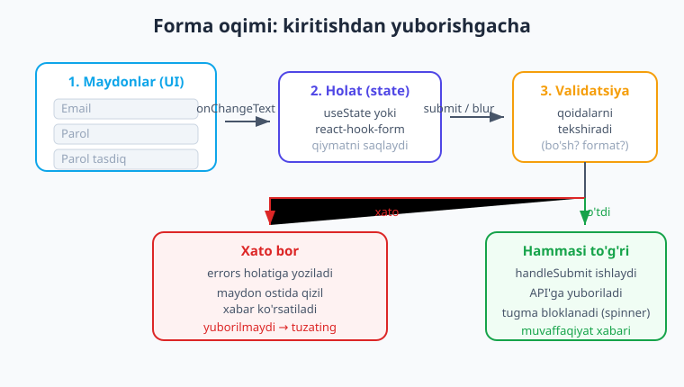
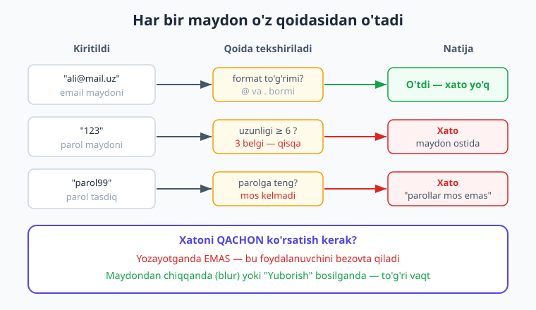
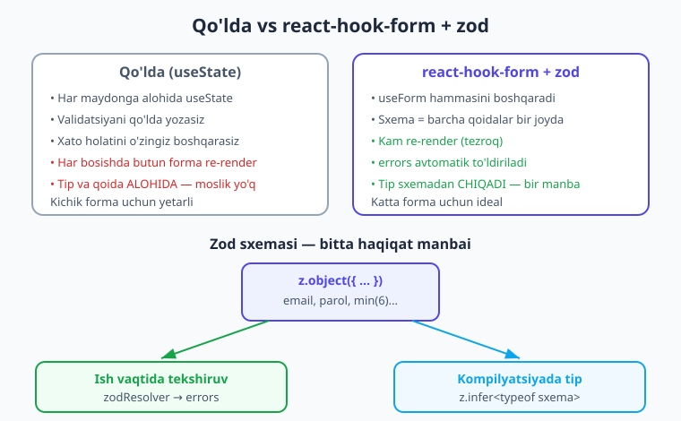

# 20 — Formalar va validatsiya

[⬅️ Oldingi: 19 — Global holat: Context va Zustand](./19-global-holat.md) · [🏠 Kitob boshi](./README.md) · [Keyingi: 21 — Kamera, rasm va galereya ➡️](./21-kamera-rasm.md)

> **Bu bobda:** Deyarli har bir ilovada forma bor — login, ro'yxatdan o'tish, profil tahrirlash, izoh qoldirish. Bu bobda formalarni qanday qurishni o'rganamiz: avval **qo'lda** (`useState` bilan, validatsiyani o'zimiz yozib), keyin zamonaviy **`react-hook-form`** kutubxonasi va undagi qoidalarni **`zod`** sxemasi bilan tip-xavfsiz tekshirishni ko'ramiz. Yo'l-yo'lakay klaviatura boshqaruvi, xatoni qachon ko'rsatish va murakkab maydonlar (select, sana, switch) bilan ishlashni o'rganamiz. Yakunda — to'liq ro'yxatdan o'tish formasini birga yozamiz.

---

## Forma muammosi: bitta maydon oson, o'ntasi qiyin

6-bobda biz bitta `TextInput`ni `useState` bilan boshqarishni o'rgandik. Bitta maydon uchun bu juda oson. Lekin haqiqiy formalarda maydonlar ko'p bo'ladi.

> **Hayotiy o'xshatish.** Forma — bu **anketa to'ldirish** kabi. Pochta bo'limida posilka jo'natayotganingizni tasavvur qiling: ism, manzil, telefon, og'irlik, ko'rsatma... Har bir katakni to'ldirasiz. Operator esa har katakni **tekshiradi**: telefon raqamida harf yo'qmi? manzil bo'sh emasmi? Agar biror katak xato bo'lsa, sizga **aynan o'sha katakni** ko'rsatib: "bu yerni to'g'rilang" deydi — butun anketani qaytadan emas. Yaxshi forma ham aynan shunday ishlaydi: har maydonni tekshiradi, xatoni aynan o'sha maydon ostida ko'rsatadi.

Ro'yxatdan o'tish formasini qo'lda qurganimizda nima qilishimiz kerakligini sanab chiqaylik:

- har maydon uchun alohida `useState` (ism, email, parol, parol-tasdiq...);
- har maydon uchun **validatsiya** qoidasi (bo'sh emasmi? email to'g'rimi? parol uzunmi?);
- har maydon uchun **xato xabari** holati va uni ekranda ko'rsatish;
- xatoni **qachon** ko'rsatish (yozayotganda? blur'da? submit'da?);
- submit paytida tugmani **bloklash** va spinner ko'rsatish.

Bularning hammasini qo'lda qilish — beshta maydonli formada ham charchatadi. Shuning uchun bu bobda ikkita yo'lni ko'ramiz: avval qo'lda (asosni tushunish uchun), keyin kutubxona bilan (haqiqiy loyihada shuni ishlatasiz).



---

## Oddiy controlled forma

Avval eng oddiy formadan boshlaymiz — ikkita maydon, validatsiyasiz. 6-bobdan eslang: **controlled input** (ya'ni "boshqariladigan kiritma") — bu qiymati holatda saqlanadigan `TextInput`. Qiymatni `value` bilan beramiz, o'zgarishni `onChangeText` bilan ushlaymiz.

Har maydonga alohida `useState` o'rniga, bir nechta maydonni **bitta obyekt holatda** saqlash ko'pincha qulayroq:

```tsx
// app/oddiy-forma.tsx
import { useState } from 'react';
import { View, Text, TextInput, Pressable, StyleSheet } from 'react-native';

type Forma = {
  ism: string;
  email: string;
};

export default function OddiyForma() {
  const [forma, setForma] = useState<Forma>({ ism: '', email: '' });

  // Bitta umumiy yangilovchi — har maydon uchun alohida funksiya shart emas
  function ozgartir(maydon: keyof Forma, qiymat: string) {
    setForma((eski) => ({ ...eski, [maydon]: qiymat }));
  }

  function yubor() {
    console.log('Yuborildi:', forma);
  }

  return (
    <View style={styles.box}>
      <TextInput
        style={styles.input}
        placeholder="Ism"
        value={forma.ism}
        onChangeText={(t) => ozgartir('ism', t)}
      />
      <TextInput
        style={styles.input}
        placeholder="Email"
        value={forma.email}
        onChangeText={(t) => ozgartir('email', t)}
        autoCapitalize="none"
        keyboardType="email-address"
      />
      <Pressable style={styles.tugma} onPress={yubor}>
        <Text style={styles.tugmaMatn}>Yuborish</Text>
      </Pressable>
    </View>
  );
}

const styles = StyleSheet.create({
  box: { flex: 1, justifyContent: 'center', padding: 24, gap: 10 },
  input: {
    borderWidth: 1,
    borderColor: '#cbd5e1',
    borderRadius: 10,
    paddingHorizontal: 14,
    paddingVertical: 12,
    fontSize: 16,
  },
  tugma: { backgroundColor: '#0ea5e9', paddingVertical: 14, borderRadius: 10, alignItems: 'center' },
  tugmaMatn: { color: '#fff', fontWeight: '600', fontSize: 16 },
});
```

E'tibor bering: bizda **bitta** `ozgartir` funksiyasi bor, har maydon o'z nomini (`'ism'`, `'email'`) beradi. `keyof Forma` (ya'ni "Forma obyektining kalitlari") tipi tufayli TypeScript faqat mavjud maydon nomlarini qabul qiladi — `ozgartir('telefon', ...)` deb yozsangiz, kompilyator darrov ogohlantiradi.

> **Eslatma.** `setForma((eski) => ({ ...eski, [maydon]: qiymat }))` — bu yerda `...eski` eski qiymatlarni nusxalaydi (9-bobdagi **immutability** qoidasi), `[maydon]: qiymat` esa faqat bitta maydonni yangilaydi. Holatni hech qachon to'g'ridan-to'g'ri o'zgartirmaymiz, doim **yangi obyekt** qaytaramiz.

Bu forma ishlaydi, lekin u **hech narsani tekshirmaydi** — bo'sh email bilan ham yuboriladi. Endi validatsiya qo'shamiz.

---

## Validatsiya (qo'lda)

**Validatsiya** (ya'ni "kiritilgan ma'lumotning to'g'riligini tekshirish") — bu formaning yuragi. Keng tarqalgan qoidalar:

- maydon **bo'sh emasmi**;
- email **to'g'ri formatdami** (`@` va `.` bormi);
- parol **yetarlicha uzunmi** (masalan, kamida 6 belgi);
- parol-tasdiq **asl parolga mosmi**.



Buni qo'lda qilish uchun yana bitta holat kerak — **xatolar obyekti**. Har maydon nomi -> xato matni (yoki yo'q). Mana ro'yxatdan o'tish formasining qo'lda validatsiyali to'liq versiyasi:

```tsx
// app/royxat-qolda.tsx
import { useState } from 'react';
import { View, Text, TextInput, Pressable, StyleSheet } from 'react-native';

type Xatolar = {
  email?: string;
  parol?: string;
  parolTasdiq?: string;
};

export default function RoyxatQolda() {
  const [email, setEmail] = useState('');
  const [parol, setParol] = useState('');
  const [parolTasdiq, setParolTasdiq] = useState('');
  const [xatolar, setXatolar] = useState<Xatolar>({});

  function tekshir(): boolean {
    const yangi: Xatolar = {};

    if (email.trim() === '') {
      yangi.email = 'Email kiriting';
    } else if (!/^[^\s@]+@[^\s@]+\.[^\s@]+$/.test(email)) {
      yangi.email = 'Email formati noto‘g‘ri';
    }

    if (parol.length < 6) {
      yangi.parol = 'Parol kamida 6 belgidan iborat bo‘lsin';
    }

    if (parolTasdiq !== parol) {
      yangi.parolTasdiq = 'Parollar mos kelmadi';
    }

    setXatolar(yangi);
    // Xatolar bo'sh bo'lsa — forma to'g'ri
    return Object.keys(yangi).length === 0;
  }

  function yubor() {
    if (!tekshir()) return; // xato bo'lsa — to'xtaymiz
    console.log('Forma to‘g‘ri:', { email });
  }

  return (
    <View style={styles.box}>
      <TextInput
        style={[styles.input, xatolar.email ? styles.inputXato : null]}
        placeholder="Email"
        value={email}
        onChangeText={setEmail}
        autoCapitalize="none"
        keyboardType="email-address"
      />
      {xatolar.email ? <Text style={styles.xato}>{xatolar.email}</Text> : null}

      <TextInput
        style={[styles.input, xatolar.parol ? styles.inputXato : null]}
        placeholder="Parol"
        value={parol}
        onChangeText={setParol}
        secureTextEntry
      />
      {xatolar.parol ? <Text style={styles.xato}>{xatolar.parol}</Text> : null}

      <TextInput
        style={[styles.input, xatolar.parolTasdiq ? styles.inputXato : null]}
        placeholder="Parolni tasdiqlang"
        value={parolTasdiq}
        onChangeText={setParolTasdiq}
        secureTextEntry
      />
      {xatolar.parolTasdiq ? (
        <Text style={styles.xato}>{xatolar.parolTasdiq}</Text>
      ) : null}

      <Pressable style={styles.tugma} onPress={yubor}>
        <Text style={styles.tugmaMatn}>Ro‘yxatdan o‘tish</Text>
      </Pressable>
    </View>
  );
}

const styles = StyleSheet.create({
  box: { flex: 1, justifyContent: 'center', padding: 24, gap: 8 },
  input: {
    borderWidth: 1,
    borderColor: '#cbd5e1',
    borderRadius: 10,
    paddingHorizontal: 14,
    paddingVertical: 12,
    fontSize: 16,
  },
  inputXato: { borderColor: '#dc2626' }, // xato bo'lsa qizil chegara
  xato: { color: '#dc2626', fontSize: 13, marginBottom: 4 },
  tugma: {
    backgroundColor: '#4f46e5',
    paddingVertical: 14,
    borderRadius: 10,
    alignItems: 'center',
    marginTop: 8,
  },
  tugmaMatn: { color: '#fff', fontWeight: '600', fontSize: 16 },
});
```

Bu yerda muhim usullarni ko'rib chiqaylik:

- **Xato xabari maydon ostida.** Har `TextInput`dan keyin `{xatolar.X ? <Text>...</Text> : null}` shartli ko'rsatamiz. Xato yo'q bo'lsa — hech narsa chiqmaydi.
- **Vizual belgi.** Xato bo'lsa, `style` massivga `styles.inputXato` qo'shilib, chegara **qizil** bo'ladi. `style={[a, shart ? b : null]}` — bu 4-bobda o'rgangan stil massivi.
- **Email tekshiruvi.** `/^[^\s@]+@[^\s@]+\.[^\s@]+$/` — bu **regular expression** (ya'ni "matn shabloni"): `@` belgisi va undan keyin `.` bo'lishini talab qiladi. Mukammal emas (100% email tekshiruvi murakkab), lekin amaliyot uchun yetarli.

> **Maslahat.** `tekshir()` funksiyasi `boolean` qaytaradi — forma to'g'rimi yoki yo'q. Shunda `yubor()` ichida `if (!tekshir()) return;` deb yozib, xato bo'lsa darrov to'xtatamiz. Validatsiya mantig'ini bitta funksiyaga jamlash — toza yondashuv.

!!! warning "Ehtiyot bo'ling"
    Bu yerda biz xatoni faqat **submit bosilganda** tekshiramiz. Agar har bosishda (`onChangeText` ichida) tekshirsangiz, foydalanuvchi hali emailni yozib tugatmasdan turib "Email noto‘g‘ri" degan qizil xato chiqib, uni bezovta qiladi. Xatoni qachon ko'rsatish haqida quyiroqda batafsil to'xtalamiz.

Bu yondashuv ishlaydi va asosni tushunish uchun zarur. Lekin sezgan bo'lsangiz — kod ancha uzun, har maydon takrorlanadi. Maydonlar ko'paysa, bu yanada og'irlashadi. Mana shu yerda **`react-hook-form`** yordamga keladi.

---

## `react-hook-form` — zamonaviy yo'l

**`react-hook-form`** (qisqacha **RHF**) — React va React Native uchun eng mashhur forma kutubxonasi. U formaning butun "ichki ishini" o'z zimmasiga oladi: qiymatlarni saqlash, validatsiya, xatolarni boshqarish.

> **Hayotiy o'xshatish.** Qo'lda forma yozish — har bir kvitansiyani **qo'lda** hisoblab, yozib chiqishga o'xshaydi. `react-hook-form` esa — **kassa apparati**: siz faqat qoidalarni kiritasiz, u o'zi hisoblaydi, tekshiradi va chekni chiqaradi. Sizning ishingiz kamayadi, xato kamayadi.

Nega RHF qulay:

- **Kam re-render.** Qo'lda yozganda har harf bosilganda butun forma qayta render bo'ladi. RHF esa qiymatlarni "ref" orqali kuzatib, ortiqcha render'ni kamaytiradi — forma tezroq ishlaydi.
- **Validatsiya oson.** Qoidalarni bir joyda e'lon qilasiz.
- **`errors` avtomatik.** Xatolar obyektini o'zi to'ldiradi — siz qo'lda boshqarmaysiz.

### O'rnatish

```bash
npx expo install react-hook-form
```

### Asosiy qismlar

```tsx
import { useForm, Controller } from 'react-hook-form';
```

- **`useForm`** — asosiy hook. U `control`, `handleSubmit`, `formState` kabi vositalarni qaytaradi.
- **`handleSubmit`** — submit'ni o'raydi: avval validatsiyani ishga tushiradi, faqat hammasi to'g'ri bo'lsa sizning funksiyangizni chaqiradi.
- **`formState.errors`** — joriy xatolar obyekti.
- **`Controller`** — React Native uchun **muhim** qism. RHF asli web uchun yaratilgan (`register` bilan `<input>`ni ulaydi). RN'da `<TextInput>` boshqacha ishlaydi, shuning uchun uni **`Controller`** bilan o'raymiz.

!!! note "iOS va Android farqi yo'q, lekin web bilan farq bor"
    Web React'da maydonni `{...register('email')}` bilan ulaysiz. React Native'da bu ishlamaydi — RN `TextInput` `onChange` event'i emas, `onChangeText` ishlatadi. Shuning uchun RN'da **doim `Controller`** ishlatamiz. Bu — eng keng tarqalgan yangi boshlovchilar xatosi.

### Oddiy RHF misol

```tsx
// app/rhf-oddiy.tsx
import { View, TextInput, Text, Pressable, StyleSheet } from 'react-native';
import { useForm, Controller } from 'react-hook-form';

type Forma = { ism: string };

export default function RhfOddiy() {
  const {
    control,
    handleSubmit,
    formState: { errors },
  } = useForm<Forma>({ defaultValues: { ism: '' } });

  function yubor(qiymatlar: Forma) {
    console.log(qiymatlar); // { ism: '...' }
  }

  return (
    <View style={styles.box}>
      <Controller
        control={control}
        name="ism"
        rules={{ required: 'Ism kiriting', minLength: { value: 2, message: 'Juda qisqa' } }}
        render={({ field: { value, onChange, onBlur } }) => (
          <TextInput
            style={styles.input}
            placeholder="Ism"
            value={value}
            onChangeText={onChange}
            onBlur={onBlur}
          />
        )}
      />
      {errors.ism ? <Text style={styles.xato}>{errors.ism.message}</Text> : null}

      <Pressable style={styles.tugma} onPress={handleSubmit(yubor)}>
        <Text style={styles.tugmaMatn}>Yuborish</Text>
      </Pressable>
    </View>
  );
}

const styles = StyleSheet.create({
  box: { flex: 1, justifyContent: 'center', padding: 24, gap: 8 },
  input: { borderWidth: 1, borderColor: '#cbd5e1', borderRadius: 10, padding: 12, fontSize: 16 },
  xato: { color: '#dc2626', fontSize: 13 },
  tugma: { backgroundColor: '#4f46e5', padding: 14, borderRadius: 10, alignItems: 'center' },
  tugmaMatn: { color: '#fff', fontWeight: '600' },
});
```

Diqqat qiling — `Controller`ning ishi shunday:

- **`control`** — `useForm`dan keladi, formani `Controller`ga bog'laydi.
- **`name`** — maydon nomi (`Forma` tipidagi kalit).
- **`rules`** — validatsiya qoidalari (`required`, `minLength`, `maxLength`, `pattern`...).
- **`render`** — bu yerda `field` obyektini olamiz: `value`, `onChange`, `onBlur`. Ularni `TextInput`ga ulaymiz. `onChange`ni `onChangeText`ga ulashni unutmang (RN xususiyati).

`onPress={handleSubmit(yubor)}` — `handleSubmit` avval validatsiyani ishga tushiradi; hamma narsa to'g'ri bo'lsagina `yubor` chaqiriladi. Xato bo'lsa — `errors` to'ldiriladi va `yubor` chaqirilmaydi.

`rules` bilan oddiy validatsiya yetarli bo'lsa-da, qoidalar murakkablashganda (masalan, parol-tasdiq asl parolga teng bo'lishi) yana qo'lda mantiq yozish kerak bo'ladi. Mana shu yerda **`zod`** ishni soddalashtiradi.

---

## `zod` bilan sxema validatsiyasi

**`zod`** — TypeScript uchun **sxema** (ya'ni "ma'lumot tuzilishi va qoidalari") kutubxonasi. U bilan ma'lumotning qanday ko'rinishini va qanday qoidalarga bo'ysunishini **bir joyda** e'lon qilasiz.

> **Hayotiy o'xshatish.** Zod sxemasi — bu **anketa namunasi** (shablon): "Email maydon to'ldirilishi shart, format @bilan; parol kamida 6 ta belgi". Bu shablonni bir marta tuzasiz, keyin har bir to'ldirilgan anketani shu shablonga solishtirib tekshirasiz. Bonus: shablondan **avtomatik** TypeScript tipi ham chiqadi — tip va qoidalar bir manbadan, hech qachon bir-biridan ajralib qolmaydi.



### O'rnatish

```bash
npx expo install zod @hookform/resolvers
```

`@hookform/resolvers` — bu RHF va zod'ni bog'laydigan "ko'prik". Undagi **`zodResolver`** zod sxemasini RHF tushunadigan validatsiyaga aylantiradi.

### Sxema yaratish

```tsx
import { z } from 'zod';

// Formaning "qonun-qoidasi" — bir joyda
const sxema = z
  .object({
    ism: z.string().min(2, 'Ism kamida 2 harf'),
    email: z.string().email('Email noto‘g‘ri'),
    parol: z.string().min(6, 'Parol kamida 6 belgi'),
    parolTasdiq: z.string(),
  })
  // Maydonlararo qoida: parol-tasdiq asl parolga teng bo'lishi kerak
  .refine((d) => d.parol === d.parolTasdiq, {
    message: 'Parollar mos kelmadi',
    path: ['parolTasdiq'], // xato qaysi maydonga tegishli
  });

// Tip sxemadan AVTOMATIK chiqariladi — qo'lda yozish shart emas!
type FormaQiymatlari = z.infer<typeof sxema>;
```

Bu yerda eng kuchli narsa — **`z.infer<typeof sxema>`**. Bu sxemadan TypeScript tipini **avtomatik** chiqaradi. Ya'ni `FormaQiymatlari` tipi `{ ism: string; email: string; parol: string; parolTasdiq: string }` bo'ladi — va siz uni qo'lda yozmaysiz. Sxemani o'zgartirsangiz, tip ham o'zi yangilanadi. **Bitta haqiqat manbai** — bu tip-xavfsizlikning kaliti.

- **`.min(2, '...')`** — minimal uzunlik + xato xabari.
- **`.email('...')`** — email formatini tekshiradi (regex'ni qo'lda yozish shart emas).
- **`.refine(...)`** — maydonlararo murakkab qoida. `path` xato qaysi maydon ostida ko'rinishini belgilaydi.

!!! tip "Maslahat"
    Validatsiya qoidalarini `rules` ichida tarqatib yozish o'rniga, hammasini **bitta zod sxemasiga** jamlash — toza va saqlovchan yondashuv. Forma o'sganda ham qoidalar bir joyda turadi.

---

## Klaviatura boshqaruvi

Formada klaviatura — alohida e'tibor talab qiladi. 7-bobda **`KeyboardAvoidingView`** bilan tanishgansiz: u klaviatura ochilganda kontentni yuqoriga surib, maydonni klaviatura ostida qolib ketishidan saqlaydi.

Formaga yana ikkita muhim qulaylik qo'shamiz:

1. **`returnKeyType`** — klaviaturadagi "Enter" tugmasi qanday ko'rinishi (`"next"` = keyingi, `"done"` = tugadi).
2. **`onSubmitEditing` + `ref`** — "next" bosilganda **keyingi maydonga avtomatik o'tish**.

```tsx
// app/klaviatura.tsx
import { useRef } from 'react';
import {
  View, TextInput, Keyboard, Pressable, Text,
  KeyboardAvoidingView, Platform, StyleSheet,
} from 'react-native';

export default function Klaviatura() {
  const ikkinchiRef = useRef<TextInput>(null); // ikkinchi maydonga "ko'rsatgich"

  return (
    <KeyboardAvoidingView
      style={styles.box}
      behavior={Platform.OS === 'ios' ? 'padding' : undefined}
    >
      <TextInput
        style={styles.input}
        placeholder="Birinchi maydon"
        returnKeyType="next"
        onSubmitEditing={() => ikkinchiRef.current?.focus()} // keyingiga o'tish
      />
      <TextInput
        ref={ikkinchiRef}
        style={styles.input}
        placeholder="Ikkinchi maydon"
        returnKeyType="done"
        onSubmitEditing={() => Keyboard.dismiss()} // klaviaturani yopish
      />
      <Pressable style={styles.tugma} onPress={() => Keyboard.dismiss()}>
        <Text style={styles.tugmaMatn}>Klaviaturani yopish</Text>
      </Pressable>
    </KeyboardAvoidingView>
  );
}

const styles = StyleSheet.create({
  box: { flex: 1, justifyContent: 'center', padding: 24, gap: 10 },
  input: { borderWidth: 1, borderColor: '#cbd5e1', borderRadius: 10, padding: 12, fontSize: 16 },
  tugma: { backgroundColor: '#4f46e5', padding: 14, borderRadius: 10, alignItems: 'center' },
  tugmaMatn: { color: '#fff', fontWeight: '600' },
});
```

Bu yerda:

- **`useRef<TextInput>(null)`** — ikkinchi maydonga "ko'rsatgich" (12-bobdagi `useRef`). U DOM emas, native komponentga to'g'ridan-to'g'ri murojaat qilish imkonini beradi.
- **`onSubmitEditing={() => ikkinchiRef.current?.focus()}`** — birinchi maydonda "next" bosilganda, ikkinchi maydonga **fokus** o'tadi. Foydalanuvchi qo'l bilan bosishga hojat qolmaydi.
- **`Keyboard.dismiss()`** — klaviaturani dasturiy yopish.

> **Eslatma.** `behavior` iOS va Android'da farq qiladi. iOS'da `'padding'` yaxshi ishlaydi; Android'da odatda tizimning o'zi (`android:windowSoftInputMode`) klaviaturani boshqaradi, shuning uchun `undefined` qoldirish ko'pincha yetarli. Ehtiyoj bo'lsa `'height'` ham sinab ko'ring.

---

## Foydalanuvchi tajribasi: xatoni qachon ko'rsatish

Texnik tomon tayyor, endi **tajriba** haqida. Xatoni noto'g'ri vaqtda ko'rsatish foydalanuvchini bezovta qiladi.

- **Yozayotganda EMAS.** Foydalanuvchi `a` deb yozishi bilan "Email noto‘g‘ri" deb qizartirish — qo'pol. U hali yozishni boshlamadi.
- **Blur'da (maydondan chiqqanda) yoki submit'da.** Bu — to'g'ri vaqt. Foydalanuvchi maydonni to'ldirib, keyingisiga o'tganda yoki "Yuborish" bosganda tekshirib, xato bo'lsa ko'rsatamiz.

`react-hook-form`da buni **`mode`** sozlamasi boshqaradi:

```tsx
const form = useForm<FormaQiymatlari>({
  resolver: zodResolver(sxema),
  mode: 'onBlur',        // maydondan chiqqanda tekshiriladi
  // mode: 'onSubmit',   // faqat submit'da (default)
  // mode: 'onTouched',  // bir marta tegilgach, keyin har o'zgarishda
});
```

Yana ikki muhim UX nuqtasi:

- **Submit paytida tugmani bloklash.** Tarmoq so'rovi ketayotganda foydalanuvchi tugmani qayta-qayta bosmasligi uchun tugmani `disabled` qilamiz va spinner (`ActivityIndicator`) ko'rsatamiz. RHF buning uchun **`formState.isSubmitting`** beradi.
- **Muvaffaqiyat xabari.** Forma muvaffaqiyatli yuborilganda foydalanuvchiga bildiramiz (masalan, `Alert` yoki yashil matn bilan).

!!! tip "Maslahat"
    `isSubmitting` — RHF avtomatik beradigan holat. `handleSubmit`ga bergan funksiyangiz `async` bo'lsa (tarmoq so'rovi `await` qilinsa), RHF so'rov tugaguncha `isSubmitting`ni `true` qilib turadi. Sizga qo'shimcha `useState` kerak emas.

---

## Murakkab maydonlar: select, sana, switch

Matn maydonlaridan tashqari, formalarda boshqa turdagi kiritmalar ham uchraydi. Eng ko'p ishlatiladiganlari:

- **Select / Picker** (ro'yxatdan tanlash) — `@react-native-picker/picker`;
- **Sana tanlash** — `@react-native-community/datetimepicker`;
- **Checkbox / Switch** (ha/yo'q) — RN'ning o'rnatilgan `Switch` komponenti.

O'rnatish:

```bash
npx expo install @react-native-picker/picker @react-native-community/datetimepicker
```

Mana uchalasini ham ko'rsatadigan misol:

```tsx
// app/murakkab-maydonlar.tsx
import { useState } from 'react';
import { View, Text, Switch, Pressable, Platform, StyleSheet } from 'react-native';
import { Picker } from '@react-native-picker/picker';
import DateTimePicker, {
  type DateTimePickerEvent,
} from '@react-native-community/datetimepicker';

export default function MurakkabMaydonlar() {
  const [shahar, setShahar] = useState('toshkent');
  const [sana, setSana] = useState(new Date());
  const [korsat, setKorsat] = useState(false);
  const [rozimi, setRozimi] = useState(false);

  function sanaOzgardi(hodisa: DateTimePickerEvent, tanlangan?: Date) {
    setKorsat(Platform.OS === 'ios'); // Android'da tanlangach o'zi yopiladi
    if (tanlangan) setSana(tanlangan);
  }

  return (
    <View style={styles.box}>
      {/* Select / Picker */}
      <Text style={styles.yorliq}>Shahar</Text>
      <View style={styles.pickerQuti}>
        <Picker selectedValue={shahar} onValueChange={setShahar}>
          <Picker.Item label="Toshkent" value="toshkent" />
          <Picker.Item label="Samarqand" value="samarqand" />
          <Picker.Item label="Buxoro" value="buxoro" />
        </Picker>
      </View>

      {/* Sana */}
      <Text style={styles.yorliq}>Tug‘ilgan sana</Text>
      <Pressable style={styles.tugma} onPress={() => setKorsat(true)}>
        <Text style={styles.tugmaMatn}>{sana.toLocaleDateString()}</Text>
      </Pressable>
      {korsat ? (
        <DateTimePicker value={sana} mode="date" onChange={sanaOzgardi} />
      ) : null}

      {/* Switch (ha/yo'q) */}
      <View style={styles.qator}>
        <Text style={styles.yorliq}>Shartlarga roziman</Text>
        <Switch value={rozimi} onValueChange={setRozimi} />
      </View>
    </View>
  );
}

const styles = StyleSheet.create({
  box: { flex: 1, padding: 24, gap: 12 },
  yorliq: { fontSize: 15, fontWeight: '600', color: '#1e293b' },
  pickerQuti: { borderWidth: 1, borderColor: '#cbd5e1', borderRadius: 10, overflow: 'hidden' },
  tugma: { borderWidth: 1, borderColor: '#cbd5e1', borderRadius: 10, padding: 14 },
  tugmaMatn: { fontSize: 16, color: '#1e293b' },
  qator: { flexDirection: 'row', alignItems: 'center', justifyContent: 'space-between' },
});
```

Bir necha nozik nuqta:

- **`Picker`** — `selectedValue` (joriy tanlov) va `onValueChange` (tanlash o'zgarganda) bilan ishlaydi. Har variant — `<Picker.Item label="..." value="..." />`.
- **`DateTimePicker`** — uni doim ko'rsatmaymiz; tugma bosilganda `korsat`ni `true` qilamiz. iOS'da u joyida ochiq turadi, Android'da esa tizim dialogi sifatida chiqib, tanlangach o'zi yopiladi — shuning uchun `setKorsat(Platform.OS === 'ios')`.
- **`Switch`** — eng oddiyi: `value` (yoniq/o'chiq) va `onValueChange`. "Shartlarga roziman" kabi maydonlar uchun ideal.

!!! note "iOS va Android farqi"
    `DateTimePicker` ikki platformada **boshqacha ko'rinadi**: iOS'da g'ildirak yoki kalendar, Android'da esa tizim dialogi. Bu normal — har platforma o'z native komponentini ishlatadi, foydalanuvchi tanish interfeysni ko'radi. Sizning kodingiz bir xil qoladi.

---

## To'liq misol: ro'yxatdan o'tish formasi (RHF + zod)

Endi hamma narsani birlashtiramiz. Bu — to'liq, ishlaydigan ro'yxatdan o'tish formasi: `react-hook-form` + `zod` validatsiya, har maydon ostida xato, klaviatura bilan keyingi maydonga o'tish, submit paytida spinner. Bu kod real Expo loyihasida `npx tsc --noEmit` bilan **xatosiz** kompilyatsiya bo'ldi.

```tsx
// app/royxat.tsx
import { useRef } from 'react';
import {
  View, Text, TextInput, Pressable, StyleSheet,
  ActivityIndicator, KeyboardAvoidingView, Platform,
} from 'react-native';
import { useForm, Controller } from 'react-hook-form';
import { zodResolver } from '@hookform/resolvers/zod';
import { z } from 'zod';

// 1. Sxema — barcha qoidalar bir joyda
const sxema = z
  .object({
    ism: z.string().min(2, 'Ism kamida 2 harf'),
    email: z.string().email('Email noto‘g‘ri'),
    parol: z.string().min(6, 'Parol kamida 6 belgi'),
    parolTasdiq: z.string(),
  })
  .refine((d) => d.parol === d.parolTasdiq, {
    message: 'Parollar mos kelmadi',
    path: ['parolTasdiq'],
  });

// 2. Tip sxemadan avtomatik
type FormaQiymatlari = z.infer<typeof sxema>;

export default function Royxat() {
  const {
    control,
    handleSubmit,
    formState: { errors, isSubmitting },
  } = useForm<FormaQiymatlari>({
    resolver: zodResolver(sxema),
    mode: 'onBlur', // maydondan chiqqanda tekshirish
    defaultValues: { ism: '', email: '', parol: '', parolTasdiq: '' },
  });

  // Keyingi maydonga o'tish uchun ref'lar
  const emailRef = useRef<TextInput>(null);
  const parolRef = useRef<TextInput>(null);
  const tasdiqRef = useRef<TextInput>(null);

  async function yubor(qiymatlar: FormaQiymatlari) {
    // Bu yerda real API'ga so'rov yuboriladi. Soxta kechikish:
    await new Promise((r) => setTimeout(r, 1000));
    console.log('Yuborildi:', qiymatlar);
  }

  return (
    <KeyboardAvoidingView
      style={styles.box}
      behavior={Platform.OS === 'ios' ? 'padding' : undefined}
    >
      <Text style={styles.sarlavha}>Ro‘yxatdan o‘tish</Text>

      <Controller
        control={control}
        name="ism"
        render={({ field: { value, onChange, onBlur } }) => (
          <TextInput
            style={[styles.input, errors.ism ? styles.inputXato : null]}
            placeholder="Ism"
            value={value}
            onChangeText={onChange}
            onBlur={onBlur}
            returnKeyType="next"
            onSubmitEditing={() => emailRef.current?.focus()}
          />
        )}
      />
      {errors.ism ? <Text style={styles.xato}>{errors.ism.message}</Text> : null}

      <Controller
        control={control}
        name="email"
        render={({ field: { value, onChange, onBlur } }) => (
          <TextInput
            ref={emailRef}
            style={[styles.input, errors.email ? styles.inputXato : null]}
            placeholder="Email"
            value={value}
            onChangeText={onChange}
            onBlur={onBlur}
            autoCapitalize="none"
            keyboardType="email-address"
            returnKeyType="next"
            onSubmitEditing={() => parolRef.current?.focus()}
          />
        )}
      />
      {errors.email ? <Text style={styles.xato}>{errors.email.message}</Text> : null}

      <Controller
        control={control}
        name="parol"
        render={({ field: { value, onChange, onBlur } }) => (
          <TextInput
            ref={parolRef}
            style={[styles.input, errors.parol ? styles.inputXato : null]}
            placeholder="Parol"
            value={value}
            onChangeText={onChange}
            onBlur={onBlur}
            secureTextEntry
            returnKeyType="next"
            onSubmitEditing={() => tasdiqRef.current?.focus()}
          />
        )}
      />
      {errors.parol ? <Text style={styles.xato}>{errors.parol.message}</Text> : null}

      <Controller
        control={control}
        name="parolTasdiq"
        render={({ field: { value, onChange, onBlur } }) => (
          <TextInput
            ref={tasdiqRef}
            style={[styles.input, errors.parolTasdiq ? styles.inputXato : null]}
            placeholder="Parolni tasdiqlang"
            value={value}
            onChangeText={onChange}
            onBlur={onBlur}
            secureTextEntry
            returnKeyType="done"
            onSubmitEditing={handleSubmit(yubor)}
          />
        )}
      />
      {errors.parolTasdiq ? (
        <Text style={styles.xato}>{errors.parolTasdiq.message}</Text>
      ) : null}

      <Pressable
        style={[styles.tugma, isSubmitting ? styles.tugmaBloklangan : null]}
        onPress={handleSubmit(yubor)}
        disabled={isSubmitting}
      >
        {isSubmitting ? (
          <ActivityIndicator color="#fff" />
        ) : (
          <Text style={styles.tugmaMatn}>Ro‘yxatdan o‘tish</Text>
        )}
      </Pressable>
    </KeyboardAvoidingView>
  );
}

const styles = StyleSheet.create({
  box: { flex: 1, justifyContent: 'center', padding: 24, gap: 8 },
  sarlavha: { fontSize: 24, fontWeight: '700', color: '#1e293b', marginBottom: 12, textAlign: 'center' },
  input: {
    borderWidth: 1,
    borderColor: '#cbd5e1',
    borderRadius: 10,
    paddingHorizontal: 14,
    paddingVertical: 12,
    fontSize: 16,
  },
  inputXato: { borderColor: '#dc2626' },
  xato: { color: '#dc2626', fontSize: 13, marginBottom: 4 },
  tugma: {
    backgroundColor: '#4f46e5',
    paddingVertical: 14,
    borderRadius: 10,
    alignItems: 'center',
    marginTop: 8,
  },
  tugmaBloklangan: { opacity: 0.6 },
  tugmaMatn: { color: '#fff', fontWeight: '600', fontSize: 16 },
});
```

Bu formada quyidagilarni birlashtirib qo'ydik:

- **`zod` sxema + `zodResolver`** — barcha qoidalar (uzunlik, email, parol mosligi) bir joyda, tip avtomatik.
- **`Controller`** — har `TextInput`ni RHF'ga ulaydi (`onChange`ni `onChangeText`ga).
- **Xato ko'rsatish** — har maydon ostida `errors.X.message`, xato bo'lsa qizil chegara.
- **Klaviatura** — `ref` va `onSubmitEditing` bilan maydondan maydonga o'tish, oxirida `handleSubmit`.
- **`isSubmitting`** — submit paytida tugma bloklanadi va spinner aylanadi.

!!! example "Misol"
    Bu to'liq misol — `react-hook-form` 7.79, `zod` 4.4 va `@hookform/resolvers` 5.4 bilan real Expo SDK 56 loyihasida `npx tsc --noEmit` (strict rejim) ostida **xatosiz** kompilyatsiya bo'ldi. `z.infer` tipi `FormaQiymatlari`ni to'g'ri chiqardi va `yubor` funksiyasi maydonlarni tip-xavfsiz qabul qildi.

> **Eslatma.** Keyingi 25-bobda (Autentifikatsiya) aynan shu login/ro'yxatdan o'tish formalaridan foydalanib, kiritilgan ma'lumotni serverga yuborish, token olish va uni `expo-secure-store`'da saqlashni ko'ramiz. Bu bob — uning poydevori.

---

## Xulosa

- **Forma** — bir nechta maydon, holat, validatsiya va xato ko'rsatish. Bir maydon oson, ko'p maydon esa boshqaruvni talab qiladi.
- **Qo'lda yondashuv** (`useState` + xatolar obyekti) asosni tushuntiradi: har maydonga holat, `tekshir()` funksiyasi, maydon ostida shartli xato matni. Kichik formaga yetadi, lekin takroriy va uzun.
- **Validatsiya qoidalari**: bo'sh emas (`.trim()`), email format (regex yoki `zod`), parol uzunligi (`length >= 6`), parol mosligi. Xatoni **maydon ostida** va **qizil chegara** bilan ko'rsating.
- **`react-hook-form`** formani professional boshqaradi: kam re-render, `handleSubmit`, avtomatik `errors`. RN'da maydonni **doim `Controller`** bilan o'rang (`onChange` -> `onChangeText`).
- **`zod`** + **`zodResolver`** — barcha qoidalarni bitta sxemaga jamlaydi; **`z.infer`** undan tipni avtomatik chiqaradi (bitta haqiqat manbai, tip-xavfsiz).
- **Klaviatura**: `KeyboardAvoidingView`, `returnKeyType`, `ref` + `onSubmitEditing` bilan keyingi maydonga o'tish, `Keyboard.dismiss()`.
- **UX**: xatoni yozayotganda emas, **blur yoki submit**da ko'rsating (`mode: 'onBlur'`); submit paytida tugmani `isSubmitting` bilan **bloklang** va spinner ko'rsating.
- **Murakkab maydonlar**: `Picker` (select), `DateTimePicker` (sana, platformaga qarab farq qiladi), `Switch` (ha/yo'q).

---

## Amaliy mashqlar

1. **Login formasi (qo'lda).** `useState` bilan email va parol maydonli login formasi yarating. Submit'da tekshiring: email bo'sh emasligini va parol kamida 6 belgi ekanligini. Xato bo'lsa, maydon ostida qizil matn va qizil chegara ko'rsating. *Yo'naltirish:* `xatolar` obyektini holatda saqlang; `tekshir()` funksiyasi xatolarni to'plab `boolean` qaytarsin; `style={[styles.input, xatolar.email ? styles.inputXato : null]}`.

2. **Email regex'ini sinash.** 1-mashqdagi login formaga email format tekshiruvini qo'shing (`/^[^\s@]+@[^\s@]+\.[^\s@]+$/`). "ali", "ali@", "ali@mail" va "ali@mail.uz" qiymatlarini sinab, qaysi biri o'tishini kuzating. *Yo'naltirish:* `.test(email)` `false` qaytarsa — xato qo'ying.

3. **RHF + zod ro'yxatdan o'tish.** `react-hook-form` va `zod` o'rnatib, ism/email/parol/parol-tasdiq maydonli ro'yxatdan o'tish formasini yarating. Sxemada parol kamida 8 belgi va parollar mosligini (`.refine`) talab qiling. *Yo'naltirish:* `npx expo install react-hook-form zod @hookform/resolvers`; har maydonni `Controller` bilan o'rang; `resolver: zodResolver(sxema)`.

4. **Klaviatura bilan keyingi maydon.** 3-mashqdagi formada har maydonga `returnKeyType="next"` va `ref` qo'shib, "next" bosilganda keyingi maydonga avtomatik o'tishni sozlang; oxirgi maydonda `returnKeyType="done"` va `onSubmitEditing={handleSubmit(...)}`. *Yo'naltirish:* har maydon uchun `useRef<TextInput>(null)`; `onSubmitEditing={() => keyingiRef.current?.focus()}`.

5. **Submit holati va murakkab maydon (qiyin).** 3-mashqdagi formaga: (a) `isSubmitting` bilan submit paytida tugmani bloklab `ActivityIndicator` ko'rsating (`yubor`ni `async` qiling, ichida 1 soniya `await` kechikish); (b) `Switch` qo'shib, "Shartlarga roziman" belgilanmagan bo'lsa, sxemada xato bering. *Yo'naltirish:* `Switch` qiymatini sxemada `z.boolean().refine((v) => v === true, 'Shartlarni qabul qiling')` bilan tekshiring.

---

[⬅️ Oldingi: 19 — Global holat: Context va Zustand](./19-global-holat.md) · [🏠 Kitob boshi](./README.md) · [Keyingi: 21 — Kamera, rasm va galereya ➡️](./21-kamera-rasm.md)
