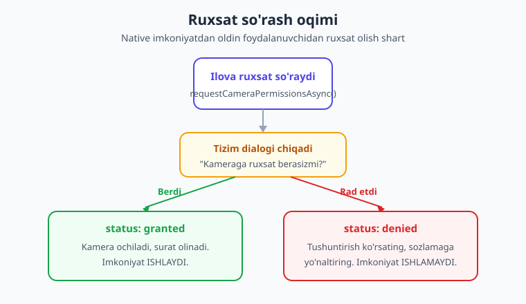
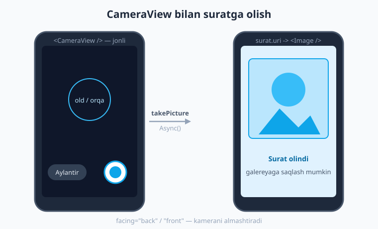

# 21 — Kamera, rasm va galereya

[⬅️ Oldingi: 20 — Formalar va validatsiya](./20-formalar-validatsiya.md) · [🏠 Kitob boshi](./README.md) · [Keyingi: 22 — Joylashuv va xarita ➡️](./22-joylashuv-xarita.md)

> **Bu bobda:** Ilovangizga **telefonning super-kuchlari**ni ulashni boshlaymiz. Avval native imkoniyatlar va ularning eng muhim qoidasi — **ruxsat (permission)** tushunchasini o'rganamiz. So'ng `expo-image-picker` bilan galereyadan rasm tanlash va kameradan suratga olishni, `expo-camera` bilan ilova ichidagi to'liq kamerani (QR skaner bilan), `expo-image` bilan rasmni chiroyli ko'rsatish va keshlashni, `expo-media-library` bilan galereyaga saqlashni ko'rib chiqamiz. Oxirida hammasini **avatar tanlash ilovasi**ga birlashtiramiz.

---

## Telefonning super-kuchlari

Hozirgacha biz ilova ichida ma'lumotlarni ko'rsatdik, formalar to'ldirdik, serverdan ma'lumot oldik. Lekin zamonaviy telefon — bu shunchaki ekran emas. U **kamerasi**, **GPS**i, **mikrofoni**, **sensorlari** (akselerometr, gyroskop, kompas), tebranishi va boshqa o'nlab apparat imkoniyatlari bo'lgan kuchli qurilma.

> **Hayotiy o'xshatish.** Tasavvur qiling, sizda yangi sotib olingan, lekin hali ulanmagan kuchli ish stoli bor: stolda kamera, mikrofon, GPS-qabul qilgich — hammasi *jismonan* mavjud, lekin ular bilan ishlash uchun har biriga **sim ulashingiz** kerak. React Native va Expo — aynan shu **ulagichlar to'plami**: ular sizning JavaScript kodingizni telefonning apparat super-kuchlariga bog'laydi. Siz `expo-camera` "simini" ulaysiz va kameradan surat olasiz; `expo-location` "simini" ulaysiz va GPS koordinatalarini olasiz.

Bu imkoniyatlarning aksariyati Expo'da alohida **`expo-*`** paketlar ko'rinishida keladi. Mana eng ko'p ishlatiladiganlari:

| Paket | Nima beradi |
|---|---|
| `expo-image-picker` | Galereyadan rasm tanlash yoki kameradan tezda surat olish |
| `expo-camera` | Ilova ichida to'liq kamera UI'si, QR/shtrix-kod skan |
| `expo-image` | Rasmlarni tez, keshlangan, chiroyli ko'rsatish |
| `expo-media-library` | Rasm/videoni qurilma galereyasiga saqlash, o'qish |
| `expo-location` | GPS koordinatalari (22-bobda) |
| `expo-sensors` | Akselerometr, gyroskop (23-bobda) |
| `expo-notifications` | Push-bildirishnomalar (23-bobda) |

Bu va keyingi ikki bob (22, 23) — to'liq **native imkoniyatlar** mavzusiga bag'ishlangan. Shu bobda biz rasm bilan ishlaymiz: tanlash, suratga olish, ko'rsatish va saqlash.

!!! note "Bu paketlar nega alohida?"
    React Native "yadro" ichida faqat eng asosiy komponentlar (`View`, `Text`, `Image`...) bor. Kamera kabi apparat imkoniyatlari ilova hajmini oshiradi va har ilovaga kerak emas. Shuning uchun ular alohida paketlar — siz faqat kerakligini o'rnatasiz. Bu — "kerakli simni kerak bo'lganda ulash" tamoyili.

---

## Ruxsat (permission) — eng muhim tushuncha

Native imkoniyatlarning HAR BIRIDA bitta umumiy va eng muhim qoida bor: **foydalanuvchi ruxsat berishi kerak.** Ilova kamerangizga, mikrofoningizga yoki rasm-galereyangizga **avtomatik** kira olmaydi — bu maxfiylik (privacy) va xavfsizlik uchun. iOS ham, Android ham foydalanuvchini har bir maxfiy imkoniyatdan himoya qiladi.

> **Hayotiy o'xshatish.** Ruxsat — bu **uy egasidan kalit so'rash**ga o'xshaydi. Siz mehmonning uyiga kirmoqchisiz (kamera = mehmon xonasi). Avval eshikni taqillatib, "Kirsam bo'ladimi?" deb so'raysiz. Uy egasi **"Ha, marhamat"** (granted) deyishi yoki **"Yo'q"** (denied) deyishi mumkin. Ruxsatsiz zo'rlik bilan kirib bo'lmaydi — va to'g'ri ilova **rad etilganda ham odob bilan** muomala qiladi: "Mayli, keyinroq".

Ruxsat bilan ishlashning umumiy oqimi har doim bir xil:

1. **Ruxsat so'rash** — masalan `requestCameraPermissionsAsync()`.
2. Tizim foydalanuvchiga **dialog** ko'rsatadi.
3. Natijada **holat (status)** qaytadi: `granted` (berildi) yoki `denied` (rad etildi).
4. `granted` bo'lsa — imkoniyatdan foydalanamiz. `denied` bo'lsa — foydalanuvchiga muloyim tushuntirish ko'rsatamiz.



Ruxsat so'rovi `Promise` qaytaradi, shuning uchun `await` bilan ishlatamiz. Qaytgan obyektda eng muhim ikki maydon bor:

```ts
const ruxsat = await ImagePicker.requestCameraPermissionsAsync();
console.log(ruxsat.granted); // true yoki false — eng oson tekshiruv
console.log(ruxsat.status);  // 'granted' | 'denied' | 'undetermined'
```

`granted` — bu oddiy `boolean`, shuning uchun uni ishlatish eng qulay. `status` esa batafsilroq: `undetermined` ("hali so'ralmagan") ham bo'lishi mumkin.

!!! warning "Ruxsatni HAR DOIM tekshiring"
    Eng keng tarqalgan xato — ruxsat berilganligini tekshirmasdan to'g'ridan-to'g'ri kameraga murojaat qilish. Foydalanuvchi rad etgan bo'lsa, ilova **ishlamaydi yoki qulaydi**. Har bir native imkoniyatdan oldin ruxsat holatini tekshiring va `denied` holatiga ham ishlov bering (tushuntirish ko'rsating).

### Ruxsatni `app.json` ga e'lon qilish

Ruxsat so'rashning yana bir qismi bor: do'kon (App Store / Google Play) talabiga ko'ra, ilova **nima uchun** kameraga kerakligini oldindan e'lon qilishi shart. Buni `app.json` faylida **config plugin** orqali yozamiz. Masalan, `expo-camera`:

```json
{
  "expo": {
    "plugins": [
      [
        "expo-camera",
        {
          "cameraPermission": "Avatar suratini olish uchun kameraga ruxsat kerak.",
          "microphonePermission": "Video yozish uchun mikrofonga ruxsat kerak."
        }
      ]
    ]
  }
}
```

Bu matn — foydalanuvchi ruxsat dialogida ko'radigan **tushuntirish**. iOS uni majburiy talab qiladi: tushuntirishsiz ilova App Store'dan rad etiladi.

!!! tip "Expo o'zi qo'shadi"
    Yangi paketni `npx expo install` bilan o'rnatganingizda, Expo ko'p hollarda kerakli plugin'ni `app.json` ga **avtomatik** qo'shadi. Siz faqat tushuntirish matnini o'zingizning ilovangizga moslab tahrirlaysiz. O'zgartirishlar **dev build** yoki **EAS Build** da kuchga kiradi (oddiy Expo Go'da ba'zi ruxsatlar cheklangan).

!!! note "iOS va Android farqi"
    **iOS** har bir tushuntirish matnini (`Info.plist` da) majburiy qiladi va foydalanuvchi rad etgach, ilova ichidan boshqa so'ray olmaydi — faqat **Sozlamalar**ga yo'naltirish mumkin. **Android** ko'proq moslashuvchan: ba'zi ruxsatlarni qayta so'rash mumkin. Shuning uchun "Sozlamalarga o'tish" yo'lini har doim taklif qiling.

---

## `expo-image-picker` — eng oson yo'l

Agar sizga shunchaki "foydalanuvchi bitta rasm tanlasin yoki bitta surat olsin" kerak bo'lsa, **`expo-image-picker`** — eng oddiy va tez yechim. U telefonning **tayyor** galereya/kamera ekranini ochadi; siz o'zingiz kamera UI'sini qurmaysiz.

O'rnatamiz:

```bash
npx expo install expo-image-picker
```

`expo-image-picker` ikkita asosiy ishni qiladi:

- **Galereyadan tanlash** — `launchImageLibraryAsync(...)`
- **Kameradan surat olish** — `launchCameraAsync(...)`

![expo-image-picker oqimi: galereya yoki kamera tanlash, launchAsync chaqirish, result.assets[0].uri olish va Image bilan ko'rsatish](rasmlar/rn21-image-picker.svg)

### Galereyadan rasm tanlash

Avval galereyaga ruxsat so'raymiz, keyin galereyani ochamiz:

```tsx
// app/galereya.tsx
import { useState } from 'react';
import { View, Text, Pressable, Image, Alert, StyleSheet } from 'react-native';
import * as ImagePicker from 'expo-image-picker';

export default function GalereyaEkran() {
  // tanlangan rasm manzili (URI) yoki hali tanlanmagan bo'lsa null
  const [rasm, setRasm] = useState<string | null>(null);

  async function rasmTanla() {
    // 1) galereyaga ruxsat so'raymiz
    const ruxsat = await ImagePicker.requestMediaLibraryPermissionsAsync();
    if (!ruxsat.granted) {
      Alert.alert('Ruxsat kerak', 'Rasm tanlash uchun galereyaga ruxsat bering.');
      return; // ruxsat yo'q — to'xtaymiz
    }

    // 2) galereyani ochamiz
    const natija = await ImagePicker.launchImageLibraryAsync({
      mediaTypes: ['images'],   // faqat rasmlar (video emas)
      allowsEditing: true,      // tanlagandan keyin kesish/kadrlash oynasi
      aspect: [1, 1],           // kvadrat kesish (avatar uchun qulay)
      quality: 0.7,             // 0..1 — sifat (kichikroq = yengilroq fayl)
    });

    // 3) natijani tekshiramiz
    if (!natija.canceled) {
      setRasm(natija.assets[0].uri); // tanlangan rasmning manzili
    }
  }

  return (
    <View style={styles.box}>
      <Pressable style={styles.tugma} onPress={rasmTanla}>
        <Text style={styles.tugmaMatn}>Galereyadan tanlash</Text>
      </Pressable>
      {rasm && <Image source={{ uri: rasm }} style={styles.rasm} />}
    </View>
  );
}

const styles = StyleSheet.create({
  box: { flex: 1, alignItems: 'center', justifyContent: 'center', gap: 16 },
  tugma: { backgroundColor: '#4f46e5', paddingVertical: 12, paddingHorizontal: 24, borderRadius: 10 },
  tugmaMatn: { color: '#fff', fontWeight: '600' },
  rasm: { width: 200, height: 200, borderRadius: 12 },
});
```

Eng muhim joylar:

- **`mediaTypes: ['images']`** — endi bu **massiv**dir (`'images'`, `'videos'`, `'livePhotos'`). Eski misollarda `ImagePicker.MediaTypeOptions.Images` ishlatilgan, lekin u **eskirgan (deprecated)** — yangi loyihalarda massiv shaklini yozing.
- **`natija.canceled`** — foydalanuvchi hech narsa tanlamasdan orqaga qaytsa, bu `true` bo'ladi. Bunda `assets` `null` bo'ladi, shuning uchun avval `canceled`ni tekshirish **shart**.
- **`natija.assets[0].uri`** — tanlangan rasmning **manzili** (URI). Bu `file://...` ko'rinishidagi yo'l. Aynan shu URI'ni `<Image source={{ uri }} />` ga beramiz.

!!! warning "MATN HAR DOIM Text ichida"
    Esda tuting: React Native'da har qanday matn `<Text>` ichida bo'lishi shart. Lekin **rasm** `<Image>` komponenti bilan ko'rsatiladi va u matn emas — uni to'g'ridan-to'g'ri `<View>` ichiga qo'yasiz.

### Kameradan surat olish

Kameradan surat olish deyarli bir xil — faqat boshqa funksiya va boshqa ruxsat. Bu safar **permission hook** (`useCameraPermissions`) ishlatamiz — bu ruxsat holatini komponent ichida qulay kuzatishning zamonaviy usuli:

```tsx
// app/surat.tsx
import { useState } from 'react';
import { View, Text, Pressable, Image, StyleSheet } from 'react-native';
import * as ImagePicker from 'expo-image-picker';

export default function SuratEkran() {
  // hook: [holat, so'rash funksiyasi]
  const [ruxsat, soraRuxsat] = ImagePicker.useCameraPermissions();
  const [rasm, setRasm] = useState<string | null>(null);

  async function suratOl() {
    // ruxsat hali yo'q bo'lsa — so'raymiz
    if (!ruxsat?.granted) {
      const yangi = await soraRuxsat();
      if (!yangi.granted) return; // foydalanuvchi rad etdi
    }

    const natija = await ImagePicker.launchCameraAsync({
      allowsEditing: true,
      quality: 0.6,
    });
    if (!natija.canceled) {
      setRasm(natija.assets[0].uri);
    }
  }

  return (
    <View style={styles.box}>
      <Pressable style={styles.tugma} onPress={suratOl}>
        <Text style={styles.tugmaMatn}>Kameradan surat olish</Text>
      </Pressable>
      {rasm && <Image source={{ uri: rasm }} style={styles.rasm} />}
    </View>
  );
}

const styles = StyleSheet.create({
  box: { flex: 1, alignItems: 'center', justifyContent: 'center', gap: 16 },
  tugma: { backgroundColor: '#0ea5e9', paddingVertical: 12, paddingHorizontal: 24, borderRadius: 10 },
  tugmaMatn: { color: '#fff', fontWeight: '600' },
  rasm: { width: 200, height: 200, borderRadius: 12 },
});
```

`useCameraPermissions()` — qulay tomoni shundaki, u `[ruxsat, soraRuxsat]` qaytaradi: birinchisi joriy holat (boshida `null`), ikkinchisi — ruxsat so'rash funksiyasi. Komponent qayta render bo'lganda holat avtomatik yangilanadi.

!!! tip "Galereya yoki kamera — birgalikda"
    Ko'pincha ilovalar foydalanuvchiga **ikki tanlovni** beradi: "Galereyadan tanlash" yoki "Suratga olish". Bunda ikkala funksiyani ham yozasiz va ikkita tugma qo'yasiz (yoki `Alert` bilan tanlov ko'rsatasiz). Bobning oxiridagi to'liq misolda aynan shunday qilamiz.

---

## `expo-camera` — to'liq kamera ilova ichida

`expo-image-picker` telefonning **tayyor** kamera ekranini ochadi. Lekin ba'zan sizga **o'z ilovangiz ichida** kameraning jonli ko'rinishini ko'rsatish kerak bo'ladi: masalan, QR-kod skaner, maxsus tugmali kamera, real vaqtli filtr. Bunda **`expo-camera`** ishlatamiz.

```bash
npx expo install expo-camera
```

Asosiy farq: bu yerda kamerani **siz quryapsiz**. `<CameraView>` komponenti — telefon kamerasining jonli oqimini ko'rsatadigan native komponent.

> **Hayotiy o'xshatish.** `expo-image-picker` — bu **fotosalonga borib surat oldirish**: salonchining o'z apparati, o'z fonida ishlaydi, sizga tayyor rasm beradi. `expo-camera` esa — **o'zingizning kamerangizni qo'lga olish**: ko'rinishni siz boshqarasiz, qachon bosishni, qaysi tomonni (old/orqa) — hammasi sizning nazoratingizda.



`expo-camera`'ning asosiy qismlari:

- **`useCameraPermissions()`** — kamera ruxsatini boshqaradigan hook.
- **`<CameraView>`** — jonli kamera ko'rinishi (`facing` bilan old/orqa).
- **`takePictureAsync()`** — `CameraView` ga `ref` orqali murojaat qilib, surat oladi.
- **`barcodeScannerSettings` + `onBarcodeScanned`** — QR/shtrix-kod skan qilish.

### Jonli kamera va surat olish

```tsx
// app/kamera.tsx
import { useState, useRef } from 'react';
import { View, Text, Pressable, Image, StyleSheet } from 'react-native';
import { CameraView, useCameraPermissions, type CameraType } from 'expo-camera';

export default function KameraEkran() {
  const [ruxsat, soraRuxsat] = useCameraPermissions();
  const [yon, setYon] = useState<CameraType>('back'); // 'back' = orqa, 'front' = old
  const [rasm, setRasm] = useState<string | null>(null);
  const kameraRef = useRef<CameraView>(null);         // CameraView'ga "tutqich"

  // 1) ruxsat hali yuklanmagan (null) — bo'sh ekran
  if (!ruxsat) return <View />;

  // 2) ruxsat yo'q — tushuntirish va so'rash tugmasi
  if (!ruxsat.granted) {
    return (
      <View style={styles.markaz}>
        <Text style={styles.matn}>Kameradan foydalanish uchun ruxsat kerak.</Text>
        <Pressable style={styles.tugma} onPress={soraRuxsat}>
          <Text style={styles.tugmaMatn}>Ruxsat berish</Text>
        </Pressable>
      </View>
    );
  }

  // surat olish funksiyasi
  async function suratOl() {
    const surat = await kameraRef.current?.takePictureAsync({ quality: 0.7 });
    if (surat) setRasm(surat.uri); // olingan suratning manzili
  }

  // kamerani aylantirish (old <-> orqa)
  function aylantir() {
    setYon((eski) => (eski === 'back' ? 'front' : 'back'));
  }

  // 3) ruxsat bor — jonli kamera
  return (
    <View style={{ flex: 1 }}>
      <CameraView style={{ flex: 1 }} facing={yon} ref={kameraRef} />
      <View style={styles.panel}>
        <Pressable style={styles.tugma} onPress={aylantir}>
          <Text style={styles.tugmaMatn}>Aylantirish</Text>
        </Pressable>
        <Pressable style={styles.tugma} onPress={suratOl}>
          <Text style={styles.tugmaMatn}>Suratga olish</Text>
        </Pressable>
      </View>
      {rasm && <Image source={{ uri: rasm }} style={styles.kichikRasm} />}
    </View>
  );
}

const styles = StyleSheet.create({
  markaz: { flex: 1, alignItems: 'center', justifyContent: 'center', gap: 16, padding: 24 },
  matn: { fontSize: 16, color: '#1e293b', textAlign: 'center' },
  panel: { flexDirection: 'row', justifyContent: 'space-around', padding: 16, backgroundColor: '#0f172a' },
  tugma: { backgroundColor: '#0ea5e9', paddingVertical: 12, paddingHorizontal: 20, borderRadius: 10 },
  tugmaMatn: { color: '#fff', fontWeight: '600' },
  kichikRasm: { position: 'absolute', top: 40, right: 16, width: 80, height: 80, borderRadius: 8 },
});
```

Bu yerda yangi va muhim narsalar:

- **`useRef<CameraView>(null)`** — `CameraView` ga "tutqich" (ref). `takePictureAsync` aynan shu ref orqali chaqiriladi: `kameraRef.current?.takePictureAsync(...)`. `?.` — agar ref hali tayyor bo'lmasa, xato chiqmaydi.
- **Uchta holat:** ruxsat `null` (yuklanmoqda) -> bo'sh; `denied` -> tushuntirish; `granted` -> kamera. Bu — har bir native ekranning to'g'ri shabloni.
- **`facing={yon}`** — `'back'` (orqa) yoki `'front'` (old). State o'zgarsa, kamera avtomatik almashadi.

!!! warning "CameraView faqat haqiqiy qurilmada to'liq ishlaydi"
    Kamera jonli oqimini ko'rish uchun **haqiqiy telefon** (yoki kamera ulangan emulyator) kerak. Web brauzerda `CameraView` cheklangan, ba'zi emulyatorlarda umuman ishlamaydi. Sinab ko'rishni Expo Go yoki dev build orqali telefonda qiling.

### QR-kod / shtrix-kod skan qilish

`expo-camera`'ning eng foydali imkoniyatlaridan biri — **QR va shtrix-kodlarni skan qilish**. Buni alohida kutubxonasiz, `CameraView`'ning o'zida ikkita prop bilan qilamiz:

- **`barcodeScannerSettings={{ barcodeTypes: ['qr'] }}`** — qaysi turdagi kodlarni qidirish.
- **`onBarcodeScanned`** — kod topilganda chaqiriladigan funksiya. Unga `{ type, data }` keladi; `data` — kod ichidagi ma'lumot (masalan URL).

```tsx
// app/qr-skaner.tsx
import { useState } from 'react';
import { View, Text, Pressable, StyleSheet } from 'react-native';
import { CameraView, useCameraPermissions, type BarcodeScanningResult } from 'expo-camera';

export default function QrSkanerEkran() {
  const [ruxsat, soraRuxsat] = useCameraPermissions();
  const [skanlandi, setSkanlandi] = useState(false); // takror skanning oldini olamiz
  const [malumot, setMalumot] = useState('');

  function ozSkan({ type, data }: BarcodeScanningResult) {
    if (skanlandi) return;     // bir marta yetarli
    setSkanlandi(true);
    setMalumot(`${type}: ${data}`);
  }

  if (!ruxsat?.granted) {
    return (
      <View style={styles.markaz}>
        <Text style={styles.matn}>Skaner uchun kameraga ruxsat kerak.</Text>
        <Pressable style={styles.tugma} onPress={soraRuxsat}>
          <Text style={styles.tugmaMatn}>Ruxsat berish</Text>
        </Pressable>
      </View>
    );
  }

  return (
    <View style={{ flex: 1 }}>
      <CameraView
        style={{ flex: 1 }}
        barcodeScannerSettings={{ barcodeTypes: ['qr', 'ean13'] }}
        // skanlangan bo'lsa, qayta tinglashni to'xtatamiz (undefined)
        onBarcodeScanned={skanlandi ? undefined : ozSkan}
      />
      <View style={styles.panel}>
        {malumot ? <Text style={styles.natija}>Topildi -> {malumot}</Text> : <Text style={styles.natija}>QR-kodni kameraga tuting...</Text>}
        {skanlandi && (
          <Pressable style={styles.tugma} onPress={() => setSkanlandi(false)}>
            <Text style={styles.tugmaMatn}>Yana skan qilish</Text>
          </Pressable>
        )}
      </View>
    </View>
  );
}

const styles = StyleSheet.create({
  markaz: { flex: 1, alignItems: 'center', justifyContent: 'center', gap: 16, padding: 24 },
  matn: { fontSize: 16, color: '#1e293b', textAlign: 'center' },
  panel: { padding: 16, gap: 12, backgroundColor: '#0f172a' },
  natija: { color: '#e2e8f0', fontSize: 15, textAlign: 'center' },
  tugma: { backgroundColor: '#0ea5e9', paddingVertical: 12, paddingHorizontal: 20, borderRadius: 10, alignSelf: 'center' },
  tugmaMatn: { color: '#fff', fontWeight: '600' },
});
```

Bu yerdagi muhim nozik joy — **takror skan muammosi**. Kamera har sekundda o'nlab marta tekshiradi, shuning uchun bitta QR-kod soniyada bir necha bor "topiladi". `skanlandi` flagi va `onBarcodeScanned={skanlandi ? undefined : ozSkan}` — funksiyani vaqtincha **o'chirib qo'yib**, faqat bir marta ishlashini ta'minlaydi.

### Qachon `image-picker`, qachon `camera`?

| Sizga kerak | Tanlang |
|---|---|
| Foydalanuvchi galereyadan rasm tanlasin | `expo-image-picker` |
| Tezda bitta surat olish (tayyor kamera) | `expo-image-picker` |
| Ilova ichida jonli kamera ko'rinishi | `expo-camera` |
| QR / shtrix-kod skan | `expo-camera` |
| Maxsus tugmali, filterli kamera | `expo-camera` |

Oddiy qilib aytganda: **"shunchaki rasm kerak" -> `image-picker`**; **"kamera ustidan nazorat kerak" -> `camera`**.

---

## Rasmni serverga yuklash

Tanlangan yoki olingan rasmni ko'pincha **serverga yuklash** kerak bo'ladi (masalan, profil avatarini saqlash). Buning uchun 17-bobda ko'rgan `fetch` va **`FormData`** ishlatamiz. `FormData` — fayllarni jo'natishning standart usuli; rasmni uning `uri`si orqali qo'shamiz:

```ts
// rasmni serverga yuklash
async function rasmYukla(uri: string) {
  const forma = new FormData();
  forma.append('avatar', {
    uri,                  // rasm manzili (file://...)
    name: 'avatar.jpg',   // server ko'radigan fayl nomi
    type: 'image/jpeg',   // MIME-tur
  } as any);

  const javob = await fetch('https://example.com/api/avatar', {
    method: 'POST',
    body: forma,
    // DIQQAT: Content-Type'ni QO'LDA yozmang!
  });
  return javob.json();
}
```

!!! warning "Content-Type'ni qo'lda yozmang"
    `FormData` bilan ishlaganda `Content-Type` sarlavhasini **o'zingiz belgilamang**. `fetch` uni avtomatik `multipart/form-data` qilib, kerakli "boundary" (chegara) bilan to'g'ri qo'yadi. Qo'lda yozsangiz — yuklash buziladi. Bu — keng tarqalgan xato.

`as any` (yoki aniqroq `as unknown as Blob`) bu yerda kerak, chunki React Native'da `FormData`ga fayl-obyekt qo'shish veb-standartdan biroz farq qiladi va TypeScript tiplari to'liq mos kelmaydi. Bu — React Native'da odatiy va xavfsiz amaliyot.

---

## `expo-image` — zamonaviy rasm ko'rsatish

`react-native`'ning o'rnatilgan `<Image>` komponenti oddiy ishlar uchun yetarli. Lekin **`expo-image`** — undan ancha kuchli: u **tezroq**, rasmlarni **keshlaydi** (bir marta yuklab, qayta-qayta ishlatadi), yuklanayotganda **placeholder** (o'rin egasi) ko'rsatadi va silliq **o'tish (transition)** beradi.

```bash
npx expo install expo-image
```

```tsx
// expo-image bilan rasm ko'rsatish
import { Image } from 'expo-image'; // DIQQAT: react-native'dan EMAS!

<Image
  source="https://example.com/avatar.jpg"
  style={{ width: 150, height: 150, borderRadius: 75 }}
  contentFit="cover"          // rasm qutiga qanday sig'sin (cover/contain/fill)
  transition={300}            // paydo bo'lishda 300ms silliq o'tish
  cachePolicy="memory-disk"   // xotirada va diskda keshlash
  placeholder={{ blurhash: 'L6PZfSi_.AyE_3t7t7R**0o#DgR4' }} // yuklanayotganda xiralashgan o'rin
/>
```

Eng foydali xususiyatlar:

- **`contentFit`** — `'cover'` (qutini to'ldiradi, kerak bo'lsa kesadi), `'contain'` (butun rasm ko'rinadi), `'fill'` (cho'zadi). Bu — veb'dagi `object-fit` o'xshashi.
- **`cachePolicy`** — keshlash strategiyasi. `'memory-disk'` — rasm bir marta yuklanib, keyin doim keshdan keladi (juda tez).
- **`placeholder` + `blurhash`** — **blurhash** rasmning juda kichik, xiralashgan "old ko'rinishi"ni ifodalovchi qisqa matn. Rasm to'liq yuklanguncha foydalanuvchi bo'sh joy emas, chiroyli xira surat ko'radi.
- **`transition`** — rasm paydo bo'lishidagi silliq animatsiya (millisekundda).

!!! tip "Lokal va onlayn rasm"
    `expo-image` ham onlayn rasmlarni (URL string), ham galereyadan olingan rasmlarni (`{ uri }`), ham loyihadagi rasmlarni (`require('./logo.png')`) qabul qiladi. Avatar ilovangizda galereyadan/kameradan olingan `uri`ni shu komponentga berib, keshlash va silliq o'tishdan foydalanishingiz mumkin.

---

## `expo-media-library` — galereyaga saqlash

Foydalanuvchi ilovada surat oldi yoki tahrir qildi — uni **qurilma galereyasiga saqlash** kerak bo'lishi mumkin. Buning uchun **`expo-media-library`** ishlatamiz.

```bash
npx expo install expo-media-library
```

```tsx
// rasmni galereyaga saqlash
import * as MediaLibrary from 'expo-media-library';
import { Alert } from 'react-native';

export function SaqlashTugma({ uri }: { uri: string }) {
  // saqlash uchun YOZISH ruxsati kerak
  const [ruxsat, soraRuxsat] = MediaLibrary.usePermissions();

  async function galereyagaSaqla() {
    if (!ruxsat?.granted) {
      const yangi = await soraRuxsat();
      if (!yangi.granted) return;
    }
    await MediaLibrary.saveToLibraryAsync(uri); // galereyaga saqlaydi
    Alert.alert('Saqlandi', 'Rasm galereyangizga saqlandi.');
  }

  // ... tugma JSX'i
}
```

`saveToLibraryAsync(uri)` — eng oddiy yo'l: berilgan `uri`'dagi rasmni galereyaga qo'shadi. Agar siz rasmni maxsus **albom**ga joylamoqchi bo'lsangiz, `MediaLibrary.createAssetAsync(uri)` va albom funksiyalaridan foydalanasiz. Saqlash uchun **yozish ruxsati** kerakligini unutmang — shuning uchun bu yerda ham `usePermissions` ishlatamiz.

---

## To'liq misol: avatar tanlash ilovasi

Endi hammasini birlashtiramiz. Foydalanuvchi **galereyadan rasm tanlashi yoki kameradan surat olishi** mumkin bo'lgan oddiy avatar tanlash ekranini yozamiz. Ruxsatlarni to'g'ri so'raymiz, tanlangan rasmni `expo-image` bilan chiroyli ko'rsatamiz.

```tsx
// app/avatar.tsx
import { useState } from 'react';
import { View, Text, Pressable, Alert, StyleSheet } from 'react-native';
import { Image } from 'expo-image';
import * as ImagePicker from 'expo-image-picker';

export default function AvatarEkran() {
  const [avatar, setAvatar] = useState<string | null>(null);

  // galereyadan tanlash
  async function galereyadan() {
    const ruxsat = await ImagePicker.requestMediaLibraryPermissionsAsync();
    if (!ruxsat.granted) {
      Alert.alert('Ruxsat kerak', 'Galereyaga ruxsat bering.');
      return;
    }
    const natija = await ImagePicker.launchImageLibraryAsync({
      mediaTypes: ['images'],
      allowsEditing: true,
      aspect: [1, 1],   // kvadrat avatar
      quality: 0.7,
    });
    if (!natija.canceled) setAvatar(natija.assets[0].uri);
  }

  // kameradan surat olish
  async function kameradan() {
    const ruxsat = await ImagePicker.requestCameraPermissionsAsync();
    if (!ruxsat.granted) {
      Alert.alert('Ruxsat kerak', 'Kameraga ruxsat bering.');
      return;
    }
    const natija = await ImagePicker.launchCameraAsync({
      allowsEditing: true,
      aspect: [1, 1],
      quality: 0.7,
    });
    if (!natija.canceled) setAvatar(natija.assets[0].uri);
  }

  return (
    <View style={styles.box}>
      <Text style={styles.sarlavha}>Profil rasmi</Text>

      {/* avatar doirasi: rasm bor bo'lsa rasm, yo'q bo'lsa bo'sh o'rin */}
      {avatar ? (
        <Image source={{ uri: avatar }} style={styles.avatar} contentFit="cover" transition={250} />
      ) : (
        <View style={[styles.avatar, styles.bosh]}>
          <Text style={styles.boshMatn}>Rasm yo'q</Text>
        </View>
      )}

      <View style={styles.panel}>
        <Pressable style={styles.tugma} onPress={galereyadan}>
          <Text style={styles.tugmaMatn}>Galereya</Text>
        </Pressable>
        <Pressable style={[styles.tugma, styles.tugmaKok]} onPress={kameradan}>
          <Text style={styles.tugmaMatn}>Kamera</Text>
        </Pressable>
      </View>

      {avatar && (
        <Pressable onPress={() => setAvatar(null)}>
          <Text style={styles.olib}>Rasmni olib tashlash</Text>
        </Pressable>
      )}
    </View>
  );
}

const styles = StyleSheet.create({
  box: { flex: 1, alignItems: 'center', justifyContent: 'center', gap: 24, padding: 24 },
  sarlavha: { fontSize: 22, fontWeight: '700', color: '#1e293b' },
  avatar: { width: 160, height: 160, borderRadius: 80, backgroundColor: '#e2e8f0' },
  bosh: { alignItems: 'center', justifyContent: 'center' },
  boshMatn: { color: '#94a3b8', fontSize: 14 },
  panel: { flexDirection: 'row', gap: 12 },
  tugma: { backgroundColor: '#4f46e5', paddingVertical: 12, paddingHorizontal: 28, borderRadius: 10 },
  tugmaKok: { backgroundColor: '#0ea5e9' },
  tugmaMatn: { color: '#fff', fontWeight: '600' },
  olib: { color: '#dc2626', fontSize: 14, fontWeight: '600' },
});
```

Bu ilova hamma o'rgangan narsalarni birlashtiradi:

- **Ikki manba** — galereya va kamera, har biri o'z ruxsatini so'raydi.
- **`canceled` tekshiruvi** — foydalanuvchi bekor qilsa, eski avatar saqlanadi.
- **`expo-image`** — `contentFit="cover"` va `transition` bilan chiroyli ko'rsatish.
- **Bo'sh holat** — rasm tanlanmaganda muloyim "Rasm yo'q" o'rin egasi.

Bu kod jonli Expo loyihada `npx tsc --noEmit` bilan tekshirilgan — tip xatosisiz ishlaydi. Endi siz uni serverga yuklash (yuqoridagi `FormData` misoli) yoki galereyaga saqlash bilan kengaytirishingiz mumkin.

!!! example "Sinab ko'ring"
    Bu ekranni `app/avatar.tsx` ga joylashtiring va telefoningizda Expo Go orqali oching. Galereya va kamera tugmalarini bosib, ruxsat dialoglarini va natijani kuzating. Avatar doirasi ichida rasm qanday "kesilishini" (`cover`) ko'ring.

---

## Xulosa

- **Native imkoniyatlar** (kamera, GPS, sensorlar) — telefonning "super-kuchlari"; Expo ularni `expo-*` paketlar orqali JavaScript'ga ulaydi.
- **Ruxsat (permission)** — har bir native imkoniyatning eng muhim qoidasi: foydalanuvchi `granted` (berdi) yoki `denied` (rad etdi). Ruxsatni HAR DOIM tekshiring va `denied` holatiga ishlov bering.
- **`app.json` plugins** ga ruxsat tushuntirish matnini yozish shart — ayniqsa iOS uchun (do'kon talabi).
- **`expo-image-picker`** — eng oson yo'l: `launchImageLibraryAsync` (galereya), `launchCameraAsync` (kamera). Natija: `result.canceled` va `result.assets[0].uri`. `mediaTypes` endi massiv (`['images']`).
- **`expo-camera`** — ilova ichidagi to'liq kamera: `useCameraPermissions`, `<CameraView facing>`, `takePictureAsync` (ref orqali), QR skan (`barcodeScannerSettings` + `onBarcodeScanned`).
- **Rasmni serverga yuklash** — `FormData` + `fetch`; `Content-Type`'ni qo'lda YOZMANG.
- **`expo-image`** — zamonaviy ko'rsatish: `contentFit`, keshlash (`cachePolicy`), `placeholder`/`blurhash`, `transition`.
- **`expo-media-library`** — `saveToLibraryAsync` bilan galereyaga saqlash (yozish ruxsati kerak).

## Amaliy mashqlar

1. **Avatar tanlash (asosiy).** Yuqoridagi `AvatarEkran` misolini o'z loyihangizga ko'chiring va ishlatib ko'ring. Tugma matnlarini va ranglarini o'zingizga moslang. Rasm tanlanmaganda "Rasm yo'q" o'rniga foydalanuvchi ismining bosh harfini ko'rsating.

2. **Kameradan surat (camera).** `expo-camera` bilan jonli kamerali ekran yarating: old/orqa almashtirish tugmasi, suratga olish tugmasi va olingan suratni ekranning bir burchagida kichik ko'rinishda ko'rsating. Ruxsatning uchta holatini (`null`, `denied`, `granted`) to'g'ri ishlang.

3. **QR skaner.** `CameraView` + `barcodeScannerSettings` bilan QR-kod skaneri yozing. Topilgan ma'lumotni ekranda ko'rsating va "Yana skan qilish" tugmasi qo'ying. Qo'shimcha: agar `data` `http` bilan boshlansa, uni havola sifatida ajratib ko'rsating.

4. **Rasm yuklash (server).** Tanlangan rasmni `FormData` bilan biror test serveriga (masalan `https://httpbin.org/post`) yuborib ko'ring. Yuklash davomida `ActivityIndicator` (spinner) ko'rsating va natijada server javobini ekranga chiqaring. `Content-Type`'ni qo'lda yozmaganingizga ishonch hosil qiling.

5. **Galereyaga saqlash + kesh (qiyin).** Kameradan olingan suratni `expo-media-library` bilan galereyaga saqlang. So'ng `expo-image` yordamida bir nechta onlayn rasmni ro'yxatda ko'rsating: `placeholder`/`blurhash` va `transition` qo'shib, keshlash ta'sirini (ikkinchi marta tezroq yuklanishini) kuzating.

---

[⬅️ Oldingi: 20 — Formalar va validatsiya](./20-formalar-validatsiya.md) · [🏠 Kitob boshi](./README.md) · [Keyingi: 22 — Joylashuv va xarita ➡️](./22-joylashuv-xarita.md)
