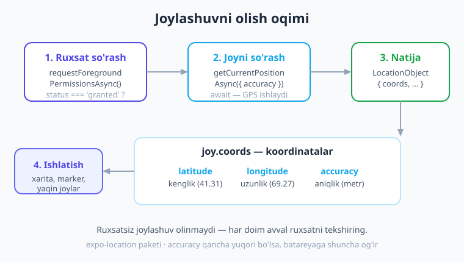
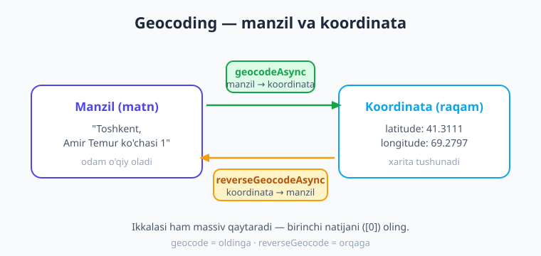
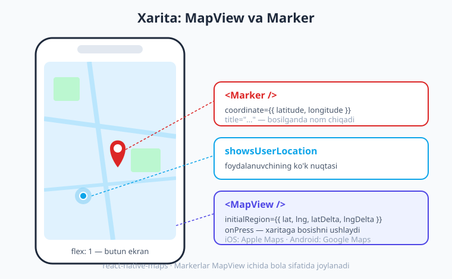

# 22 — Joylashuv va xarita

[⬅️ Oldingi: 21 — Kamera, rasm va galereya](./21-kamera-rasm.md) · [🏠 Kitob boshi](./README.md) · [Keyingi: 23 — Bildirishnoma va sensorlar ➡️](./23-bildirishnoma-sensor.md)

> **Bu bobda:** Ilovangizga "telefon qayerdaligini bilish" qobiliyatini qo'shamiz. **expo-location** bilan ruxsat so'rab joriy GPS koordinatasini olamiz, harakatni real vaqtda kuzatamiz va **geocoding** orqali manzilni koordinataga (va aksincha) aylantiramiz. Keyin **react-native-maps** bilan haqiqiy xarita chizamiz, unga **belgi (marker)** qo'yamiz va foydalanuvchining joylashuvini ko'rsatamiz. Oxirida hammasini birlashtirib "Mening joylashuvim" ilovasini quramiz.

---

## Nima uchun joylashuv kerak?

Telefoningizdagi eng foydali ilovalarning ko'pchiligi bitta sirli qobiliyatga tayanadi: ular **telefon qayerdaligini biladi**.

- **Yetkazib berish** ilovasi buyurtmangizni aynan sizning eshigingizgacha olib keladi.
- **Taksi** ilovasi sizni qayerdan olib ketishini va haydovchi qayerda turganini ko'rsatadi.
- **Xarita** ilovasi "siz shu yerdasiz" deb ko'k nuqta chizadi va manzilga yo'l soladi.
- **"Yaqindagi joylar"** ilovasi atrofdagi kafe, dorixona yoki bankomatlarni topadi.

Bularning hammasi ostida bitta narsa yotadi — **GPS** (ya'ni "Global Positioning System", sun'iy yo'ldoshlar yordamida joyni aniqlash tizimi). GPS telefonning Yer yuzidagi o'rnini ikkita raqam bilan ifodalaydi:

- **kenglik** (`latitude`) — shimol-janub o'qi bo'ylab joylashuv (ekvatordan qancha yuqori/past),
- **uzunlik** (`longitude`) — sharq-g'arb o'qi bo'ylab joylashuv.

> **Hayotiy o'xshatish.** Koordinatalar — bu Yer yuzasiga tortilgan ulkan **shaxmat to'ri** kabi. Har bir nuqtaning aniq "qatori" (kenglik) va "ustuni" (uzunlik) bor. Masalan, Toshkent markazi taxminan `41.31` kenglik va `69.28` uzunlikda turadi. Ikkita raqamni aytsangiz, dunyoning istalgan nuqtasini topib bo'ladi — xuddi do'stingizga "uchinchi qator, beshinchi ustun" deb stolni ko'rsatgandek.

Bizning vazifamiz — telefondan shu ikkita raqamni so'rash, keyin ular bilan biror foydali ish qilish (xaritada ko'rsatish, masofani hisoblash, manzilga aylantirish). Boshlaymiz.



---

## expo-location: o'rnatish va ruxsat

Joylashuv bilan ishlash uchun Expo'ning maxsus paketi bor — **expo-location**. Uni odatdagidek `expo install` bilan o'rnatamiz (bu buyruq SDK'ga mos versiyani tanlaydi):

```bash
npx expo install expo-location
```

### Ruxsat — bu shaxsiy ma'lumot

21-bobda kamera bilan ishlaganimizda **ruxsat (permission)** tushunchasini ko'rgan edik: foydalanuvchidan oldindan rozilik so'ramasdan kamerasiga kira olmaymiz. Joylashuv ham xuddi shunday — aslida **undan ham nozikroq** ma'lumot. Inson qayerda yashashi, qayerda ishlashi, qayerga borishi — bularning hammasini joylashuv ochib beradi.

> **Hayotiy o'xshatish.** Ilovangiz foydalanuvchining uyiga mehmon bo'lib kelgan odam kabi. Eshikdan kirib darrov "qayerdasan, manzilingni ayt" deyish odobsizlik. Avval **chiroyli so'rash** kerak: "Sizning joylashuvingizdan foydalansam maylimi?". Foydalanuvchi "ha" desagina davom etamiz. "Yo'q" desa — xafa bo'lmasdan, ishni boshqacha tashkil qilamiz.

Joylashuvning ikki turi bor:

- **Foreground (oldinda)** — ilova **ochiq va ekranda turganida** joylashuvni olish. Bizga aynan shu kerak.
- **Background (orqada)** — ilova yopiq bo'lsa ham orqada kuzatish. Bu juda nozik, alohida sozlash va do'kon tomonidan qattiq tekshiruv talab qiladi. Bu bobda unga tegmaymiz.

Foreground ruxsatini shunday so'raymiz:

```tsx
import * as Location from 'expo-location';

const { status } = await Location.requestForegroundPermissionsAsync();
if (status !== 'granted') {
  // foydalanuvchi rad etdi — joylashuvsiz davom etamiz
  console.log('Joylashuvga ruxsat berilmadi');
}
```

`requestForegroundPermissionsAsync()` foydalanuvchiga tizim oynachasini ko'rsatadi va u tugma bossagina davom etadi (shuning uchun `await`). Natijadagi `status` `'granted'` (ruxsat berildi), `'denied'` (rad etildi) yoki `'undetermined'` (hali so'ralmagan) bo'lishi mumkin. Biz faqat `'granted'` bo'lganda joylashuvni so'raymiz.

!!! warning "Ehtiyot bo'ling"
    Ruxsatni **tekshirmasdan** to'g'ridan-to'g'ri joylashuvni so'rash — eng keng tarqalgan xato. Foydalanuvchi rad etgan bo'lsa, ilovangiz qulab tushishi yoki "muzlab" qolishi mumkin. Har doim avval `status`'ni tekshiring.

### app.json va ruxsat matni

Telefon foydalanuvchiga "bu ilova joylashuvingizni so'rayapti" deganda, **nima uchun** kerakligini tushuntiruvchi matn ko'rsatadi. Bu matnni biz `app.json` faylida config plugin orqali beramiz:

```json
{
  "expo": {
    "plugins": [
      [
        "expo-location",
        {
          "locationAlwaysAndWhenInUsePermission": "Yaqin atrofdagi joylarni xaritada ko'rsatish uchun joylashuvingizdan foydalanamiz."
        }
      ]
    ]
  }
}
```

Bu matn iOS'da ruxsat oynasida ko'rinadi. Android uchun ruxsatlar (`ACCESS_FINE_LOCATION`, `ACCESS_COARSE_LOCATION`) plugin tomonidan avtomatik qo'shiladi. Yaxshi, tushunarli matn yozing — foydalanuvchi nega kerakligini bilsa, "ruxsat berish" ehtimoli ortadi.

!!! note "iOS va Android farqi"
    iOS ruxsat matnini **majburiy** talab qiladi — matnsiz ilova App Store'da rad etiladi. Android'da matn shart emas, lekin tizim ruxsatlari kerak. `expo-location` plugin ikkalasini ham siz uchun sozlaydi.

---

## Joriy joylashuvni olish

Ruxsat olganimizdan keyin joriy koordinatani olish bir qator kod:

```tsx
const joy = await Location.getCurrentPositionAsync({});
```

`getCurrentPositionAsync` GPS'ni so'roqqa tutadi va natijani `await` bilan kutib oladi. Natija — `LocationObject` deb ataluvchi obyekt. Uning ichidagi eng muhim qism — **`coords`** (koordinatalar):

```tsx
console.log(joy.coords.latitude);  // 41.3111  — kenglik
console.log(joy.coords.longitude); // 69.2797  — uzunlik
console.log(joy.coords.accuracy);  // 12        — aniqlik (metr)
console.log(joy.timestamp);        // qachon olingani (millisekund)
```

`coords` ichida boshqa maydonlar ham bor: `altitude` (balandlik), `speed` (tezlik), `heading` (harakat yo'nalishi). Lekin kunlik ishda asosan **`latitude`** va **`longitude`** kerak bo'ladi.

### Aniqlik darajalari

`getCurrentPositionAsync` ga `accuracy` (aniqlik) sozlamasini berishingiz mumkin. Bu — muhim tanlov, chunki **aniqlik qancha yuqori bo'lsa, batareya shuncha tez quriydi** va javob shuncha sekinroq keladi.

```tsx
const joy = await Location.getCurrentPositionAsync({
  accuracy: Location.Accuracy.High, // ~10 metr aniqlik
});
```

`Location.Accuracy` — bu tayyor darajalar to'plami:

| Daraja | Taxminiy aniqlik | Qachon ishlatish |
|---|---|---|
| `Lowest` | ~3 km | shahar darajasida yetarli (ob-havo) |
| `Low` | ~1 km | taxminiy hudud |
| `Balanced` | ~100 m | **default** — ko'p holatga mos |
| `High` | ~10 m | xaritada aniq nuqta, yetkazib berish |
| `Highest` | eng yuqori | aniq pin kerak bo'lganda |
| `BestForNavigation` | navigatsiya | yo'l ko'rsatuvchi ilovalar |

!!! tip "Maslahat"
    Aniqlikni vazifaga qarab tanlang. "Yaqindagi shaharlar" uchun `Low` yetarli va batareyani tejaydi. "Mening aniq joyim xaritada" uchun `High` mos. Hamma joyda `Highest` ishlatish — batareyani behuda yondirish.

### Joriy joyni olish — to'liq funksiya

Endi ruxsat va joylashuvni bitta funksiyaga jamlaymiz. Bu naqsh — keyingi misollarimizning poydevori:

```tsx
import * as Location from 'expo-location';

async function joriyJoyniOl() {
  // 1. Avval ruxsat
  const { status } = await Location.requestForegroundPermissionsAsync();
  if (status !== 'granted') {
    return null; // ruxsat yo'q — joyni qaytarmaymiz
  }

  // 2. Keyin joylashuv
  const joy = await Location.getCurrentPositionAsync({
    accuracy: Location.Accuracy.High,
  });

  // 3. Faqat kerakli qismni qaytaramiz
  return {
    kenglik: joy.coords.latitude,
    uzunlik: joy.coords.longitude,
    aniqlik: joy.coords.accuracy,
  };
}
```

Diqqat qiling: tartib doim bir xil — **avval ruxsat, keyin joy**. Bu naqshni yodda saqlang, butun bob shunga tayanadi.

---

## Real vaqtda kuzatish

`getCurrentPositionAsync` joyni **bir marta** oladi — xuddi rasmga tushirgandek. Lekin taksi yoki yugurish ilovasida foydalanuvchi **harakatlanadi**, va biz uning yangi joyini doimo bilishimiz kerak. Buning uchun **`watchPositionAsync`** bor — u joy o'zgargani sayin sizni xabardor qiladi.

> **Hayotiy o'xshatish.** `getCurrentPositionAsync` — bu bir lahzaning **fotosurati**. `watchPositionAsync` esa — **videokamera**: u uzluksiz kuzatib turadi va biror narsa o'zgarganda sizga "qara, yangilik!" deb signal beradi.

```tsx
const obuna = await Location.watchPositionAsync(
  {
    accuracy: Location.Accuracy.Balanced,
    distanceInterval: 5, // har 5 metr siljiganda yangila
    timeInterval: 2000,  // yoki har 2 soniyada (Android)
  },
  (yangiJoy) => {
    console.log('Yangi joy:', yangiJoy.coords.latitude, yangiJoy.coords.longitude);
  }
);
```

`watchPositionAsync` ikkita narsa oladi: sozlamalar va **callback** (har yangilanishda chaqiriladigan funksiya). U **obuna obyektini** qaytaradi — bu obyekt orqali keyinroq kuzatuvni to'xtatamiz.

### Cleanup — kuzatuvni to'xtatish shart

11-bobda `useEffect` cleanup'ni o'rgangan edik: agar effekt biror **obuna** ochsa, komponent ekrandan ketganda uni albatta **yopish** kerak. Aks holda kuzatuv orqada ishlayverib batareyani yeydi va xotira sizib ketadi (memory leak).

> **Hayotiy o'xshatish.** Kuzatuvni to'xtatmaslik — xonadan chiqib ketayotib **kranni ochiq qoldirish** kabi. Suv (batareya) behuda oqaveradi. Chiqishdan oldin kranni yoping.

`watchPositionAsync` ni `useEffect` ichida ishlatib, cleanup'da obunani yopamiz:

```tsx
import { useEffect, useState } from 'react';
import { Text } from 'react-native';
import * as Location from 'expo-location';

export default function Kuzatuvchi() {
  const [joy, setJoy] = useState<Location.LocationObject | null>(null);

  useEffect(() => {
    let obuna: Location.LocationSubscription | null = null;

    (async () => {
      const { status } = await Location.requestForegroundPermissionsAsync();
      if (status !== 'granted') return;

      obuna = await Location.watchPositionAsync(
        { accuracy: Location.Accuracy.Balanced, distanceInterval: 5 },
        (yangi) => setJoy(yangi) // har yangilanishda holatni o'zgartiramiz
      );
    })();

    // Cleanup: komponent ketganda kuzatuvni TO'XTAT
    return () => {
      obuna?.remove();
    };
  }, []); // [] — faqat bir marta boshlanadi

  return (
    <Text>
      {joy ? `${joy.coords.latitude}, ${joy.coords.longitude}` : 'Kutilmoqda...'}
    </Text>
  );
}
```

Bu kodda bir nechta muhim nuqta bor:

- `useEffect` ichida `async` funksiyani **darhol chaqiriladigan** `(async () => { ... })()` ko'rinishida yozdik, chunki `useEffect`'ning o'zi `async` bo'la olmaydi.
- `obuna` o'zgaruvchisini effekt ichida e'lon qildik, lekin cleanup unga kira oladi (closure).
- `obuna?.remove()` — `?.` (ixtiyoriy zanjir) tufayli, agar obuna hali ochilmagan bo'lsa, xato chiqmaydi.

!!! warning "Ehtiyot bo'ling"
    `watchPositionAsync` ni cleanup'siz qoldirish — boshlovchilarning eng og'riqli xatosi. Test paytida sezilmaydi, lekin foydalanuvchi telefonida batareya "sababsiz" tez quriydi. Cleanup'ni hech qachon unutmang.

---

## Geocoding: manzil va koordinata

GPS bizga raqamlar beradi (`41.31, 69.28`), lekin odamlar **manzil** bilan gaplashadi ("Amir Temur ko'chasi, 1-uy"). Bu ikkisini bir-biriga aylantirish — **geocoding** deyiladi.

> **Hayotiy o'xshatish.** Geocoding — bu **lug'at** kabi. Bir tomondan "manzil so'zi", ikkinchi tomondan "koordinata raqami". Lug'atni ikki yo'nalishda ishlatish mumkin: so'zdan tarjimaga (`geocode`) yoki tarjimadan so'zga (`reverseGeocode`).



### Manzil -> koordinata (geocodeAsync)

Foydalanuvchi manzil yozadi, biz uni xaritaga qo'yish uchun koordinataga aylantiramiz:

```tsx
const natijalar = await Location.geocodeAsync('Toshkent, Amir Temur ko\'chasi 1');

if (natijalar.length > 0) {
  const { latitude, longitude } = natijalar[0];
  console.log(latitude, longitude); // bu manzilning koordinatasi
}
```

`geocodeAsync` **massiv** qaytaradi, chunki bitta manzil bir nechta joyga to'g'ri kelishi mumkin (masalan, ko'p shaharda "Mustaqillik ko'chasi" bor). Odatda birinchi natijani (`natijalar[0]`) olamiz. Massiv bo'sh bo'lsa — manzil topilmadi.

### Koordinata -> manzil (reverseGeocodeAsync)

Teskari yo'nalish: bizda koordinata bor (masalan, foydalanuvchi xaritaga bosdi), va undan o'qiladigan manzil chiqarmoqchimiz:

```tsx
const manzillar = await Location.reverseGeocodeAsync({
  latitude: 41.3111,
  longitude: 69.2797,
});

if (manzillar.length > 0) {
  const m = manzillar[0];
  console.log(m.city);    // shahar:  "Toshkent"
  console.log(m.street);  // ko'cha
  console.log(m.country); // davlat:  "O'zbekiston"
}
```

Qaytgan har bir manzilda `city`, `street`, `streetNumber`, `region`, `country`, `postalCode` kabi maydonlar bor. **Diqqat:** ularning har biri `null` bo'lishi mumkin (ba'zi joyda ko'cha nomi yo'q), shuning uchun ko'rsatishdan oldin tekshiring.

!!! note "Eslatma"
    Geocoding internet talab qiladi (joy ma'lumotlari serverdan keladi). Shuning uchun `geocodeAsync` va `reverseGeocodeAsync` ni `try/catch` ichida ishlatish va internet yo'qligini hisobga olish yaxshi amaliyot.

---

## Xarita: react-native-maps

Endi eng qiziq qismi — koordinatalarni **haqiqiy xaritada** ko'rsatamiz. Buning uchun eng mashhur paket — **react-native-maps**:

```bash
npx expo install react-native-maps
```

> **Hayotiy o'xshatish.** `react-native-maps` — ilovangizga **deraza** o'rnatish kabi. Deraza ortida butun dunyo xaritasi turadi. Siz derazaning qaysi qismiga qarashni (`region`) va unga qanday belgilar (`Marker`) ilishni boshqarasiz.

### MapView — xarita oynasi

Asosiy komponent — **`<MapView>`**. U ekranni xaritaga aylantiradi. Uni odatda `flex: 1` bilan butun ekranga yoyamiz:

```tsx
import MapView from 'react-native-maps';

export default function Xarita() {
  return (
    <MapView
      style={{ flex: 1 }}
      initialRegion={{
        latitude: 41.3111,
        longitude: 69.2797,
        latitudeDelta: 0.05,  // vertikal zoom (kichik = yaqinroq)
        longitudeDelta: 0.05, // gorizontal zoom
      }}
    />
  );
}
```

`initialRegion` — xarita **birinchi ochilganda** qayerga va qanchalik yaqin qarashini belgilaydi. Uning to'rt qismi bor:

- `latitude`, `longitude` — markaz nuqtasi (qayerga qaraymiz),
- `latitudeDelta`, `longitudeDelta` — **zoom darajasi**. Bu raqamlar qancha **kichik** bo'lsa, xarita shuncha **yaqin** ko'rinadi (`0.01` ≈ bir necha ko'cha, `0.5` ≈ butun shahar).

!!! tip "initialRegion vs region"
    **`initialRegion`** — faqat boshlang'ich holat; keyin foydalanuvchi xaritani erkin suradi. **`region`** — xaritani **siz boshqarasiz** (har o'zgarganda shu nuqtaga qaytadi). Foydalanuvchi erkin sursin desangiz `initialRegion`, dasturiy boshqarmoqchi bo'lsangiz `region` ishlating.



### Marker — xaritadagi belgi

Xaritaga **belgi (pin)** qo'yish uchun `MapView` ichiga **`<Marker>`** joylaymiz. Marker — bu ko'pincha qizil "tomchi" shaklidagi belgi:

```tsx
import MapView, { Marker } from 'react-native-maps';

<MapView style={{ flex: 1 }} initialRegion={hudud}>
  <Marker
    coordinate={{ latitude: 41.3111, longitude: 69.2797 }}
    title="Amir Temur xiyoboni"
    description="Toshkent markazi"
  />
</MapView>
```

`Marker`'ning eng muhim propi — **`coordinate`** (belgi qayerda turishi). `title` va `description` — foydalanuvchi belgini bosganda chiqadigan oynacha (callout) matnlari. Bir nechta marker qo'yish uchun shunchaki ko'p `<Marker>` yozasiz yoki `.map()` bilan ro'yxatdan generatsiya qilasiz.

### Foydalanuvchi joyini va bosishni boshqarish

`MapView`'ning yana ikki foydali propi:

- **`showsUserLocation`** — xaritada foydalanuvchining ko'k nuqtasini ko'rsatadi (ruxsat kerak),
- **`onPress`** — foydalanuvchi xaritaga bosganda chaqiriladi va bosilgan koordinatani beradi.

```tsx
import { useState } from 'react';
import MapView, { Marker, type LatLng, type MapPressEvent } from 'react-native-maps';

export default function BosiladiganXarita() {
  const [belgi, setBelgi] = useState<LatLng | null>(null);

  return (
    <MapView
      style={{ flex: 1 }}
      initialRegion={{
        latitude: 41.3111, longitude: 69.2797,
        latitudeDelta: 0.05, longitudeDelta: 0.05,
      }}
      showsUserLocation
      onPress={(e: MapPressEvent) => setBelgi(e.nativeEvent.coordinate)}
    >
      {belgi && <Marker coordinate={belgi} title="Siz tanlagan joy" />}
    </MapView>
  );
}
```

Bu kodda foydalanuvchi xaritaga qayerga bossa, o'sha joyga marker qo'yiladi. `e.nativeEvent.coordinate` — bosilgan nuqtaning koordinatasi.

!!! note "iOS va Android farqi"
    Xarita ostidagi "dvigatel" platformaga qarab farq qiladi. **iOS**'da default — **Apple Maps**, **Android**'da — **Google Maps**. Ikkalasida ham bir xil Google Maps ishlatmoqchi bo'lsangiz, `provider={PROVIDER_GOOGLE}` bering va **Google Maps API kalitini** `app.json`'ga qo'shing (Google Cloud Console'dan olinadi). API kalitsiz Google provayderi bo'sh xarita ko'rsatadi — bu eng tez-tez uchraydigan "xaritam ko'rinmayapti" sababidir.

---

## To'liq misol: "Mening joylashuvim" ilovasi

Endi o'rganganlarimizni bitta ilovaga jamlaymiz. Ilova tugmani bosganda: **(1)** ruxsat so'raydi, **(2)** joriy GPS'ni oladi, **(3)** xaritada o'sha joyga marker qo'yib ko'rsatadi. Yo'l-yo'lakay yuklanish va xato holatlarini ham to'g'ri boshqaramiz (17-bobdagi `loading`/`error` naqshini eslang).

```tsx
// app/joylashuv.tsx
import { useState } from 'react';
import { View, Text, StyleSheet, Pressable, ActivityIndicator } from 'react-native';
import * as Location from 'expo-location';
import MapView, { Marker, type Region } from 'react-native-maps';

export default function MeningJoylashuvim() {
  const [joy, setJoy] = useState<Location.LocationObject | null>(null);
  const [xato, setXato] = useState<string | null>(null);
  const [yuklanmoqda, setYuklanmoqda] = useState(false);

  async function topish() {
    setYuklanmoqda(true);
    setXato(null);

    // 1. Ruxsat
    const { status } = await Location.requestForegroundPermissionsAsync();
    if (status !== 'granted') {
      setXato('Joylashuvga ruxsat berilmadi.');
      setYuklanmoqda(false);
      return;
    }

    // 2. Joriy joyni olish (xatoni ushlab)
    try {
      const natija = await Location.getCurrentPositionAsync({
        accuracy: Location.Accuracy.High,
      });
      setJoy(natija);
    } catch {
      setXato("Joylashuvni aniqlab bo'lmadi.");
    } finally {
      setYuklanmoqda(false);
    }
  }

  // joy bor bo'lsa — xarita uchun hudud tayyorlaymiz
  const hudud: Region | undefined = joy
    ? {
        latitude: joy.coords.latitude,
        longitude: joy.coords.longitude,
        latitudeDelta: 0.01,
        longitudeDelta: 0.01,
      }
    : undefined;

  return (
    <View style={styles.box}>
      {joy && hudud ? (
        <MapView style={styles.xarita} region={hudud} showsUserLocation>
          <Marker
            coordinate={{
              latitude: joy.coords.latitude,
              longitude: joy.coords.longitude,
            }}
            title="Men shu yerdaman"
            description={`Aniqlik: ${Math.round(joy.coords.accuracy ?? 0)} m`}
          />
        </MapView>
      ) : (
        <Text style={styles.matn}>Joylashuv hali aniqlanmadi.</Text>
      )}

      {xato && <Text style={styles.xato}>{xato}</Text>}

      <Pressable style={styles.tugma} onPress={topish}>
        {yuklanmoqda ? (
          <ActivityIndicator color="#fff" />
        ) : (
          <Text style={styles.tugmaMatn}>Joylashuvimni topish</Text>
        )}
      </Pressable>
    </View>
  );
}

const styles = StyleSheet.create({
  box: { flex: 1 },
  xarita: { flex: 1 },
  matn: { fontSize: 16, color: '#475569', textAlign: 'center', marginTop: 40 },
  xato: { color: '#dc2626', textAlign: 'center', padding: 8 },
  tugma: {
    backgroundColor: '#0ea5e9',
    padding: 14,
    alignItems: 'center',
    margin: 16,
    borderRadius: 10,
  },
  tugmaMatn: { color: '#fff', fontWeight: '600', fontSize: 16 },
});
```

Ushbu kod TypeScript tekshiruvidan (`tsc`) muvaffaqiyatli o'tdi. E'tibor bering:

- Tartib doim bir xil — **ruxsat -> joy -> ko'rsatish**.
- `region` ishlatdik, shuning uchun xarita aniqlangan joyga **avtomatik markazlashadi**.
- `accuracy ?? 0` — `accuracy` `null` bo'lsa, `0` qabul qilamiz (`??` — nullish coalescing).
- `yuklanmoqda` paytida tugmada `ActivityIndicator` (spinner) ko'rsatamiz — foydalanuvchi GPS o'ylab turganini biladi.

!!! question "Tekshirib ko'ring"
    Bu kod **haqiqiy qurilmada** yoki simulyatorda ishlaydi (Expo Go'da ham). Simulyatorda GPS yo'q — shuning uchun **soxta joylashuv** qo'yiladi: iOS Simulator'da `Features -> Location`, Android Emulator'da `Extended Controls -> Location` orqali koordinata bering. Aks holda joylashuv hech qachon kelmaydi.

---

## Xulosa

- Joylashuv — **GPS koordinatalari**: `latitude` (kenglik) va `longitude` (uzunlik). Ikki raqam Yer yuzidagi istalgan nuqtani aniqlaydi.
- **expo-location** paketi joylashuv bilan ishlaydi. Tartib doim: **avval ruxsat, keyin joy**.
- `requestForegroundPermissionsAsync()` ruxsat so'raydi; `status === 'granted'` bo'lsagina davom eting. `app.json` plugin'ga tushuntiruvchi matn qo'shing.
- `getCurrentPositionAsync({ accuracy })` joyni **bir marta** oladi -> `joy.coords.latitude/longitude/accuracy`. Aniqlik darajasini vazifaga moslang (batareyani tejang).
- `watchPositionAsync(opts, callback)` harakatni **real vaqtda** kuzatadi. `useEffect` cleanup'da `obuna.remove()` bilan **albatta to'xtating**.
- **Geocoding**: `geocodeAsync` (manzil -> koordinata), `reverseGeocodeAsync` (koordinata -> manzil). Ikkalasi massiv qaytaradi — `[0]` ni oling, `null` maydonlarni tekshiring.
- **react-native-maps**: `<MapView>` (xarita oynasi, `initialRegion`/`region` bilan zoom), `<Marker coordinate={...} />` (belgi), `showsUserLocation` va `onPress`.
- iOS = Apple Maps, Android = Google Maps (default). Hamma joyda Google kerak bo'lsa — `PROVIDER_GOOGLE` + API kaliti.

---

## Amaliy mashqlar

1. **Joriy joyni ko'rsatish (oson).** Tugma bosilganda joriy koordinatani olib, ekranda `Kenglik: ... / Uzunlik: ...` ko'rinishida chiqaring. Ruxsat rad etilsa, "Ruxsat kerak" xabarini ko'rsating. (Maslahat: `joriyJoyniOl` funksiyasidan boshlang.)

2. **Xaritada marker (oson-o'rta).** O'zingiz yoqtirgan joyning koordinatasini (masalan, maktabingiz yoki sevimli kafeni Google Maps'dan ko'chiring) `<MapView>` da `<Marker>` bilan ko'rsating. Markerga `title` va `description` bering, bosib ko'ring.

3. **Bosilgan joyga belgi (o'rta).** Xaritaga `onPress` qo'shing. Foydalanuvchi qayerga bossa, o'sha joyga marker o'tsin. Bonus: bosilgan koordinatani ekran ostida ham raqam bilan ko'rsating.

4. **Real vaqtda kuzatish (o'rta-qiyin).** `watchPositionAsync` bilan joyni doimiy kuzating va har yangilanishda xarita markazini yangi joyga suring (`region` ni state'da saqlang). `useEffect` cleanup'da kuzatuvni to'xtatishni unutmang. (Simulyatorda joyni qo'lda o'zgartirib sinab ko'ring.)

5. **Manzilni ko'rsatish (qiyin).** 3-mashqni davom ettiring: foydalanuvchi xaritaga bosganda, `reverseGeocodeAsync` bilan o'sha nuqtaning **manzilini** (shahar + ko'cha) aniqlab, markerning `title`'iga yoki ekran ostiga yozing. Internet yo'q holatni `try/catch` bilan boshqaring.

---

[⬅️ Oldingi: 21 — Kamera, rasm va galereya](./21-kamera-rasm.md) · [🏠 Kitob boshi](./README.md) · [Keyingi: 23 — Bildirishnoma va sensorlar ➡️](./23-bildirishnoma-sensor.md)
