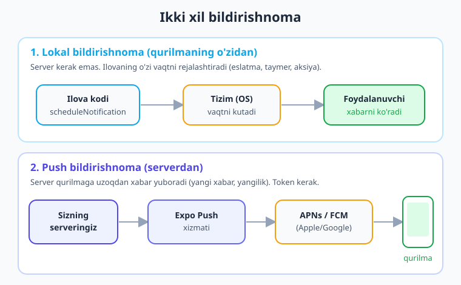
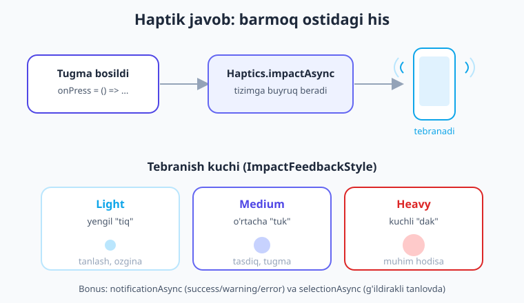
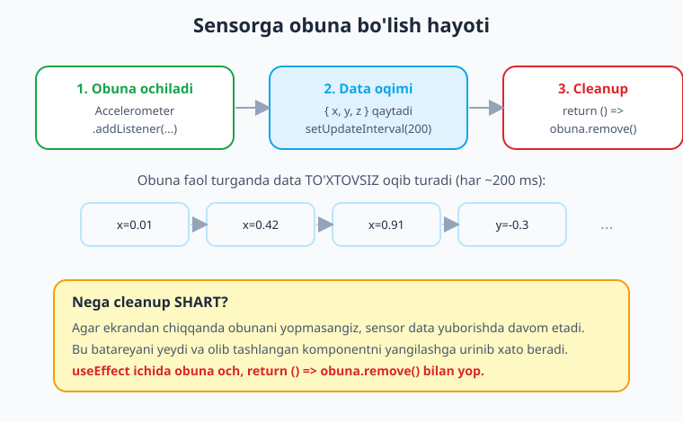

# 23 — Bildirishnoma va sensorlar

[⬅️ Oldingi: 22 — Joylashuv va xarita](./22-joylashuv-xarita.md) · [🏠 Kitob boshi](./README.md) · [Keyingi: 24 — Animatsiya va gestlar ➡️](./24-animatsiya-gest.md)

> **Bu bobda:** Ilovangizni "tirik" qiladigan ikki kuchli imkoniyatni o'rganamiz. Birinchisi — **bildirishnoma** (notification): ilova yopiq bo'lganda ham foydalanuvchiga xabar yetkazish (eslatma, yangi xabar, aksiya). Lokal va push bildirishnomalarni, ruxsat so'rashni va `expo-notifications` paketini ko'ramiz. Ikkinchisi — qurilmaning **sensorlari**: tebranish bilan his beradigan `expo-haptics` va harakatni o'lchaydigan `expo-sensors` (akselerometr, gyroskop). Oxirida hammasini birlashtirib, eslatma rejalashtiradigan, tugma bosilganda tebranadigan va telefon qiyaligini ko'rsatadigan kichik ilova yasaymiz.

---

## Kirish: ilova "uxlaganda" ham xabar berish

Tasavvur qiling, do'stingiz sizga muhim narsani aytmoqchi, lekin siz boshqa xona­dasiz. U baqirib chaqirmaydi — **pochtachi**ni yuboradi. Pochtachi eshikni taqillatib xat tashlaydi. Siz qayerda bo'lsangiz ham, hatto uxlab yotgan bo'lsangiz ham, ertalab eshik oldidagi xatni ko'rasiz.

**Bildirishnoma** (notification, ya'ni "xabardor qilish") xuddi shu pochtachi kabi ishlaydi. Ilovangiz **yopiq** bo'lsa ham, telefon ekranida (lock-ekranda yoki yuqoridan tushadigan banner sifatida) foydalanuvchiga xabar ko'rsatadi: "Yangi xabaringiz bor", "Eslatma: 18:00 da uchrashuv", "Bugun 30% chegirma!".

Bu juda muhim, chunki foydalanuvchi ilovangizni har soatda ochib turmaydi. Bildirishnoma — uni qaytarib chaqirishning, vaqtida xabardor qilishning eng kuchli usuli.

Bobning ikkinchi yarmida esa **sensorlar**ni o'rganamiz: telefon ichidagi kichik "sezgi organlari" — tebranishni boshqaradigan motor (haptics) va harakatni o'lchaydigan akselerometr. Ular ilovaga jonli, jismoniy his beradi.

---

## 1-qism. Bildirishnoma nima va qanday turlari bor

### Ikki tur: lokal va push

Bildirishnomaning ikkita asosiy turi bor, va ularni farqlash juda muhim:

1. **Lokal bildirishnoma** (local notification) — **qurilmaning o'zi** chiqaradi. Internet ham, server ham kerak emas. Ilovangiz tizimga aytadi: "5 daqiqadan keyin bu xabarni ko'rsat" yoki "har kuni soat 8:00 da eslat". Tizim vaqtni kutib turadi va o'zi ko'rsatadi.
   - Misol: eslatma ilovasi, taymer, "suv ichish vaqti" eslatmasi, mashqqa chaqiruv.

2. **Push bildirishnoma** (push notification) — **serverdan** keladi. Sizning backend serveringiz uzoqdan, internet orqali, telefonga xabar "itaradi" (push = itarmoq). Ilova ochiq bo'lmasa ham xabar yetib keladi.
   - Misol: Telegram'da yangi xabar, Instagram'da like, yangiliklardan ogohlantirish.



> **Hayotiy o'xshatish.** **Lokal** bildirishnoma — bu uydagi **budilnik**ga o'xshaydi: uni o'zingiz qo'yasiz va u o'zi belgilangan vaqtda jiringlaydi, hech kim tashqaridan aralashmaydi. **Push** bildirishnoma esa — **pochtachi olib keladigan xat**: kimdir (server) uni uzoqdan yo'lga qo'yadi, u bir necha bekat (Expo Push, Apple/Google serverlari) orqali o'tib, sizning eshigingizga (telefon) yetib keladi.

!!! note "Bu bob nimaga e'tibor beradi"
    Lokal bildirishnomani to'liq, ishlaydigan kod bilan o'rganamiz — uni o'rnatish oson va backend kerak emas. Push bildirishnomaning esa **oqimini** (token olish, serverga yuborish) tushuntiramiz, lekin to'liq server kodi yozmaymiz — bu alohida katta mavzu.

---

## 2-qism. expo-notifications: o'rnatish va ruxsat

Bildirishnomalar bilan ishlash uchun Expo'ning rasmiy paketidan foydalanamiz. Uni terminalda `expo install` orqali o'rnatamiz (oddiy `npm install` emas — `expo install` SDK versiyasiga mos versiyani tanlaydi):

```bash
npx expo install expo-notifications expo-device
```

`expo-device` qurilma haqiqiy telefon ekanini tekshirish uchun kerak (emulyator/simulyatorda push token har doim ham ishlamaydi).

### Ruxsat so'rash — birinchi qadam

Kamera yoki joylashuv kabi, bildirishnoma ham foydalanuvchining **ruxsati**ni talab qiladi. Hech bir ilova ruxsatsiz sizga banner ko'rsata olmaydi. Shuning uchun **har doim** avval ruxsatni so'raymiz va natijani tekshiramiz.

```tsx
import * as Notifications from 'expo-notifications';

// Ruxsat so'raydigan funksiya
async function ruxsatSora(): Promise<boolean> {
  // Hozirgi holatni so'raymiz (avval berilgan bo'lishi mumkin)
  const { status } = await Notifications.requestPermissionsAsync();
  // 'granted' = ruxsat berildi
  if (status !== 'granted') {
    console.log('Bildirishnoma uchun ruxsat berilmadi');
    return false;
  }
  return true;
}
```

`requestPermissionsAsync()` foydalanuvchiga tizim dialogini ko'rsatadi ("Bu ilova bildirishnoma yuborsinmi?"). Natijada `status` qaytadi: `'granted'` (ruxsat berildi), `'denied'` (rad etildi) yoki `'undetermined'` (hali so'ralmagan).

> **Hayotiy o'xshatish.** Ruxsat so'rash — uyga mehmon chaqirishdan oldin **eshik qo'ng'irog'ini bosish**ga o'xshaydi. Eshikni ochmaguncha (ruxsat bermaguncha) ichkariga kira olmaysiz. Foydalanuvchi "yo'q" desa, bu uning huquqi — siz uni hurmat qilishingiz kerak.

!!! warning "Ruxsatni majburlamang"
    Foydalanuvchi ruxsatni rad etsa, ilova qulashi kerak emas. Funksiyangiz `false` qaytarganda bildirishnoma yuborishni shunchaki o'tkazib yuboring va kerak bo'lsa muloyim eslatma ko'rsating: "Eslatmalar uchun Sozlamalardan ruxsat bering".

---

## 3-qism. Lokal bildirishnoma yuborish

Endi eng qiziq qismi — bildirishnomani aslida ko'rsatish. Buning uchun `scheduleNotificationAsync()` funksiyasidan foydalanamiz.

### Eng oddiy misol: 5 soniyadan keyin

```tsx
import * as Notifications from 'expo-notifications';

async function eslatmaQoy() {
  await Notifications.scheduleNotificationAsync({
    content: {
      title: 'Suv ichish vaqti! 💧',           // sarlavha (qalin)
      body: 'Bir stakan suv iching — foydali.', // matn
      data: { turi: 'suv' },                    // yashirin ma'lumot (ixtiyoriy)
    },
    trigger: {
      type: Notifications.SchedulableTriggerInputTypes.TIME_INTERVAL,
      seconds: 5, // 5 soniyadan keyin chiqsin
    },
  });
}
```

Bu kodda ikki qism bor:

- **`content`** — bildirishnomaning ko'rinadigan qismi: `title` (sarlavha), `body` (asosiy matn) va ixtiyoriy `data` (foydalanuvchi ko'rmaydigan, lekin biz keyin o'qiy oladigan ma'lumot — masalan, qaysi ekranni ochish kerakligi).
- **`trigger`** — **qachon** ko'rsatish. Bu yerda `TIME_INTERVAL` turi va `seconds: 5` — ya'ni 5 soniyadan keyin.

> **Hayotiy o'xshatish.** `content` — bu xatning **mazmuni** (nima yozilgan), `trigger` esa **qachon yetkazib berish** kerakligini aytadigan ko'rsatma. Pochtachiga "bu xatni ertaga ertalab tashla" deyish kabi.

### Darhol ko'rsatish

Agar `trigger` ni `null` qilib qo'ysangiz, bildirishnoma **darhol** chiqadi:

```tsx
await Notifications.scheduleNotificationAsync({
  content: { title: 'Salom!', body: 'Bu darhol chiqadi.' },
  trigger: null, // null = darhol
});
```

### Boshqa trigger turlari

Eslatma ilovalari uchun turli vaqt jadvallar mavjud. Mana eng foydalilari:

```tsx
// Har kuni belgilangan soatda (masalan, har kuni 8:00 da)
trigger: {
  type: Notifications.SchedulableTriggerInputTypes.DAILY,
  hour: 8,
  minute: 0,
}

// Aniq sana va vaqtda (bir martalik)
trigger: {
  type: Notifications.SchedulableTriggerInputTypes.DATE,
  date: new Date(2026, 11, 31, 23, 59), // 31-dekabr 23:59
}
```

!!! tip "Maslahat — sondan foydalanish"
    `scheduleNotificationAsync()` bir **identifikator** (matn) qaytaradi. Uni saqlab qo'ysangiz, keyin shu eslatmani bekor qila olasiz: `await Notifications.cancelScheduledNotificationAsync(id)`. Hammasini o'chirish uchun: `await Notifications.cancelAllScheduledNotificationsAsync()`.

### Bildirishnoma ilova ochiqligida ham ko'rinsin: handler

Standart holatda, ilova **ochiq** bo'lganda bildirishnoma banneri ko'rinmaydi (chunki foydalanuvchi allaqachon ilovada). Agar uni ochiqligida ham ko'rsatmoqchi bo'lsangiz, ilova boshlanishida bir marta **handler** o'rnatishingiz kerak:

```tsx
import * as Notifications from 'expo-notifications';

// Ilova ochiq bo'lsa ham bildirishnomani qanday ko'rsatish kerakligini aytadi
Notifications.setNotificationHandler({
  handleNotification: async () => ({
    shouldShowBanner: true, // banner ko'rsat
    shouldShowList: true,    // bildirishnoma markaziga qo'sh
    shouldPlaySound: true,   // ovoz chiqar
    shouldSetBadge: false,   // ikonkadagi sonni o'zgartirma
  }),
});
```

Bu kodni komponent ichida emas, fayl yuqorisida (modul darajasida) yozing — u butun ilova uchun bir marta ishlasin.

!!! note "Yangi va eski API"
    SDK 56 da `shouldShowBanner` va `shouldShowList` ishlatiladi. Eskiroq kodlarda `shouldShowAlert` ko'rishingiz mumkin — u endi eskirgan (deprecated). Yangi kod uchun yuqoridagi ikkitasini ishlating.

### Bildirishnoma bosilganda ishlov berish

Foydalanuvchi bildirishnomani bosganda nimadir bo'lishi kerak — masalan, ilova kerakli ekranni ochsin. Buning uchun **listener** (tinglovchi) o'rnatamiz:

```tsx
import { useEffect } from 'react';
import * as Notifications from 'expo-notifications';

useEffect(() => {
  // Foydalanuvchi bildirishnomani BOSGANIDA chaqiriladi
  const subscription = Notifications.addNotificationResponseReceivedListener(
    (response) => {
      // Yuqorida content.data ga qo'ygan ma'lumotimizni o'qiymiz
      const data = response.notification.request.content.data;
      // data ixtiyoriy (undefined bo'lishi mumkin), shuning uchun ?. ishlatamiz
      console.log('Bildirishnoma bosildi, turi:', data?.turi);
      // Bu yerda router.push('/...') bilan ekran ochishimiz mumkin
    }
  );
  // Komponent olib tashlanganda tinglovchini yopamiz
  return () => subscription.remove();
}, []);
```

`addNotificationResponseReceivedListener` foydalanuvchi bannerni **bosganida** ishlaydi. E'tibor bering: `useEffect` ning `return` qismida `subscription.remove()` chaqiramiz — bu **cleanup** (tozalash). Bu naqsh bu bobning hamma joyida takrorlanadi, chunki obunani yopmaslik xato va batareya isrofiga olib keladi.

---

## 4-qism. Push bildirishnoma: serverdan xabar

Lokal bildirishnoma yaxshi, lekin "Telegram'da yangi xabar keldi" kabi narsalarni telefon o'zi bila olmaydi — bu xabar **serverdan** kelishi kerak. Bu push bildirishnoma.

To'liq push tizimi backend talab qiladi, shuning uchun bu yerda biz uning **oqimini** tushuntiramiz, to'liq server kodini emas.

### 1-qadam: qurilmaning push token'ini olish

Har bir telefon (aniqrog'i, har bir ilova-o'rnatma) o'ziga xos **push token**ga ega — bu xuddi **manzil** kabi. Server bu manzilga xabar yuboradi. Tokenni `getExpoPushTokenAsync()` bilan olamiz:

```tsx
import * as Notifications from 'expo-notifications';
import * as Device from 'expo-device';

async function pushTokenOl(): Promise<string | null> {
  // Push token faqat haqiqiy qurilmada ishlaydi (emulyatorda emas)
  if (!Device.isDevice) {
    console.log('Push token uchun haqiqiy qurilma kerak');
    return null;
  }
  // Avval ruxsat
  const { status } = await Notifications.requestPermissionsAsync();
  if (status !== 'granted') return null;

  // Token olamiz (projectId — app.json dagi loyiha id'ngiz)
  const tokenObyekt = await Notifications.getExpoPushTokenAsync({
    projectId: 'sizning-loyiha-id', // EAS loyiha id'ngiz
  });
  return tokenObyekt.data; // masalan: "ExponentPushToken[xxxxxxxx]"
}
```

### 2-qadam: tokenni serverga yuborish

Tokenni olganingizdan keyin uni **o'z serveringizga** yuborasiz (oddiy `fetch` bilan) va u yerda saqlaysiz — masalan, foydalanuvchi profiliga bog'lab:

```tsx
// Tokenni o'z backendingizga saqlash uchun yuboramiz
await fetch('https://server.example.com/token-saqla', {
  method: 'POST',
  headers: { 'Content-Type': 'application/json' },
  body: JSON.stringify({ token }),
});
```

### 3-qadam: server xabar yuboradi (Expo Push orqali)

Endi server foydalanuvchiga xabar yubormoqchi bo'lganda, u **Expo Push xizmati**ga so'rov jo'natadi (bu sodda HTTP so'rov). Expo esa Apple (APNs) yoki Google (FCM) serverlari orqali xabarni telefonga yetkazadi:

```text
Sizning serveringiz  ->  Expo Push xizmati  ->  APNs/FCM  ->  Telefon
```

Server tomonidagi so'rov shunday ko'rinadi (bu **backend** kodi, ma'lumot uchun):

```json
{
  "to": "ExponentPushToken[xxxxxxxx]",
  "title": "Yangi xabar",
  "body": "Ali sizga xabar yozdi"
}
```

Bu JSON `https://exp.host/--/api/v2/push/send` manziliga POST qilinadi. Expo qolganini bajaradi.

> **Hayotiy o'xshatish.** Push token — telefonning **uy manzili**. Siz uni serverga (pochta bo'limiga) ro'yxatdan o'tkazasiz. Keyin kimdir sizga xat yozmoqchi bo'lganda, server xatni Expo Push (markaziy pochta markazi)ga beradi, u esa to'g'ri ko'chaga (Apple yoki Google) yo'naltirib, eshigingizgacha yetkazadi.

!!! tip "Sinash uchun"
    To'liq backend yozmasdan push'ni sinab ko'rish uchun Expo'ning onlayn vositasi bor: **expo.dev/notifications**. U yerga tokenni va xabarni kiritib, "Send" bossangiz — telefoningizga test bildirishnoma keladi.

!!! warning "Ehtiyot bo'ling — push uchun build kerak"
    Push token Expo Go ilovasida cheklangan ishlaydi. To'liq push uchun **dev build** (`expo-dev-client`) yoki haqiqiy build kerak (27-bobda ko'ramiz). Lokal bildirishnomalar esa Expo Go'da ham ishlayveradi.

---

## 5-qism. expo-haptics: barmoq ostidagi his

Endi sensorlarga o'tamiz. Birinchisi eng oddiy va eng yoqimlisi — **haptics** (haptik javob, ya'ni tebranish orqali his berish).

Zamonaviy telefonlarda kichik tebranish motori bor. Tugma bosganingizda yengil "tiq" sezsangiz — bu haptik javob. U ilovani **jonli** va **professional** qiladi: foydalanuvchi nafaqat ko'radi, balki **his qiladi**.

O'rnatamiz:

```bash
npx expo install expo-haptics
```

### Uch xil kuch: impactAsync

Eng asosiy funksiya — `impactAsync`. U turli kuchda "tuk" beradi:

```tsx
import * as Haptics from 'expo-haptics';

Haptics.impactAsync(Haptics.ImpactFeedbackStyle.Light);  // yengil
Haptics.impactAsync(Haptics.ImpactFeedbackStyle.Medium); // o'rtacha
Haptics.impactAsync(Haptics.ImpactFeedbackStyle.Heavy);  // kuchli
```



Misol — tugma bosilganda his beradigan komponent:

```tsx
import { Pressable, Text, StyleSheet } from 'react-native';
import * as Haptics from 'expo-haptics';

export default function HaptikTugma() {
  return (
    <Pressable
      style={styles.tugma}
      onPress={() => {
        // Tugma bosilishi bilan o'rtacha tebranish
        Haptics.impactAsync(Haptics.ImpactFeedbackStyle.Medium);
        console.log('Bosildi');
      }}
    >
      <Text style={styles.matn}>Bos meni</Text>
    </Pressable>
  );
}

const styles = StyleSheet.create({
  tugma: { backgroundColor: '#4f46e5', padding: 16, borderRadius: 12, alignItems: 'center' },
  matn: { color: '#fff', fontWeight: '600', fontSize: 16 },
});
```

> **Hayotiy o'xshatish.** `Light` — bu kalitni yengil bosgandagi "klik". `Medium` — eshikni taqillatish. `Heavy` — stolga musht urish. Har biri turli darajadagi muhimlikni bildiradi.

### Boshqa haptik turlar

`impactAsync`'dan tashqari yana ikkita foydali funksiya bor:

```tsx
// 1. Natija turini bildirish (muvaffaqiyat, ogohlantirish, xato)
Haptics.notificationAsync(Haptics.NotificationFeedbackType.Success); // muvaffaqiyat
Haptics.notificationAsync(Haptics.NotificationFeedbackType.Warning); // ogohlantirish
Haptics.notificationAsync(Haptics.NotificationFeedbackType.Error);   // xato

// 2. Tanlov o'zgargandagi yengilgina his (g'ildirakli tanlovda, sliderda)
Haptics.selectionAsync();
```

`notificationAsync` — forma muvaffaqiyatli yuborilganda (`Success`), noto'g'ri parol kiritilganda (`Error`) juda mos. `selectionAsync` esa — vaqt tanlovchi (date picker) yoki slider aylantirilganda har bir qadamda yengil "tiq" berish uchun.

!!! tip "Maslahat — me'yorida ishlating"
    Haptik javob — tuz kabi: ozgina bo'lsa taom mazali, ko'p bo'lsa achchiq. Faqat **muhim** harakatlarga (tugma, tasdiq, xato) qo'shing. Har bir teginishga tebranish qo'ysangiz, foydalanuvchini charchatasiz.

!!! note "iOS va Android farqi"
    Haptik javob iOS'da (ayniqsa Taptic Engine bilan) eng aniq va kuchli his beradi. Android'da qurilmaga qarab kuchsizroq yoki oddiy tebranish bo'lishi mumkin. Ba'zi eski qurilmalarda umuman bo'lmasligi mumkin — shuning uchun haptika asosiy ma'lumotni emas, qo'shimcha hisni bersin.

---

## 6-qism. expo-sensors: qurilma harakatini o'lchash

Endi eng qiziq qismi — telefonning **harakatini** o'lchaymiz. Zamonaviy telefonlarda bir nechta sensor bor:

- **Accelerometer** (akselerometr) — tezlanishni va telefon **qiyaligini** o'lchaydi (tortishish kuchini his qiladi). O'yinlarda telefonni egib boshqarish, qadam sanagich shu sensorga tayanadi.
- **Gyroscope** (gyroskop) — **aylanishni** (burilish tezligini) o'lchaydi.
- **Magnetometer** (magnitometr) — magnit maydonni o'lchaydi, kompas uchun (qaysi tomon shimol).
- **DeviceMotion** — yuqoridagilarni birlashtirgan umumiy harakat ma'lumoti.

O'rnatamiz:

```bash
npx expo install expo-sensors
```

### Sensorga obuna bo'lish

Sensor bilan ishlash radio tinglashga o'xshaydi: siz to'lqinga **ulanasiz** (obuna), ma'lumot **to'xtovsiz oqib turadi**, va tugaganda **uzasiz** (cleanup). Akselerometrga obuna shunday:

```tsx
import { useEffect, useState } from 'react';
import { Accelerometer } from 'expo-sensors';

export default function Qiyalik() {
  const [{ x, y, z }, setData] = useState({ x: 0, y: 0, z: 0 });

  useEffect(() => {
    // Har 200 millisoniyada bir marta yangilansin
    Accelerometer.setUpdateInterval(200);

    // Obuna ochamiz — har yangilanishda funksiya chaqiriladi
    const obuna = Accelerometer.addListener((olcham) => {
      setData(olcham); // { x, y, z } qiymatlarini holatga yozamiz
    });

    // CLEANUP: ekrandan chiqqanda obunani yopamiz
    return () => obuna.remove();
  }, []);

  return (/* ... */);
}
```



Bu kodning uchta muhim qismi:

1. **`setUpdateInterval(200)`** — sensor qanchalik tez-tez ma'lumot bersin (millisoniyada). Kichik son = tezroq, lekin ko'proq batareya. 200 ms (sekundiga 5 marta) ko'p holatda yetarli.
2. **`addListener(...)`** — obunani ochadi. Har yangilanishda `{ x, y, z }` qiymatlari keladi (har biri taxminan -1 dan 1 gacha; tinch yotgan telefonda bir o'q ≈ 1, chunki tortishish kuchi shunga tushadi).
3. **`return () => obuna.remove()`** — **cleanup**. Buni unutmang!

!!! danger "Cleanup'ni unutmang!"
    Agar `obuna.remove()` ni chaqirmasangiz, foydalanuvchi boshqa ekranga o'tganda ham sensor ma'lumot yuborishda davom etadi. Bu **batareyani tez yeydi** va olib tashlangan komponentni yangilashga urinib ogohlantirish/xatoga olib keladi. `useEffect` + `return` cleanup — bu obunalar uchun **majburiy** naqsh.

### `x`, `y`, `z` nimani bildiradi

Akselerometr uch o'q bo'yicha kuchni o'lchaydi:

- **`x`** — chapdan o'ngga (telefonni yon tomonga egsangiz o'zgaradi).
- **`y`** — pastdan tepaga (telefonni oldinga-orqaga egsangiz).
- **`z`** — ekrandan tashqariga (telefonni stolda yotqizsangiz `z ≈ 1`).

Telefon tinch yotganda ham qiymatlar nolga teng emas — chunki **tortishish kuchi** (gravitatsiya) doim ta'sir qiladi. Telefonni egganingizda bu kuch o'qlar orasida qayta taqsimlanadi — biz qiyalikni shundan bilamiz.

### Silkitishni aniqlash

Foydalanuvchi telefonni **silkitganini** aniqlash — mashhur va qiziq xususiyat (masalan, "tasodifiy" tanlash yoki o'chirishni bekor qilish). Silkitishda uch o'q kuchining yig'indisi (vektor uzunligi) tinch holatdagidan ancha katta bo'ladi:

```tsx
import { useEffect, useRef } from 'react';
import { Accelerometer } from 'expo-sensors';
import * as Haptics from 'expo-haptics';

export function useSilkitish(qachonSilkitildi: () => void) {
  // Oxirgi silkitish vaqtini eslab turamiz (qayta-qayta ishlamasligi uchun)
  const oxirgi = useRef(0);

  useEffect(() => {
    Accelerometer.setUpdateInterval(100);
    const obuna = Accelerometer.addListener(({ x, y, z }) => {
      // Uch o'q kuchining umumiy uzunligini hisoblaymiz
      const kuch = Math.sqrt(x * x + y * y + z * z);
      const hozir = Date.now();
      // Kuch chegaradan oshsa VA oxirgi silkitishdan 1 soniya o'tgan bo'lsa
      if (kuch > 1.8 && hozir - oxirgi.current > 1000) {
        oxirgi.current = hozir;
        Haptics.notificationAsync(Haptics.NotificationFeedbackType.Success);
        qachonSilkitildi(); // silkitish aniqlandi!
      }
    });
    return () => obuna.remove();
  }, [qachonSilkitildi]);
}
```

Bu **custom hook** (13-bobni eslang) silkitishni aniqlaydi. `Math.sqrt(x*x + y*y + z*z)` — vektor uzunligi; tinch holatda ≈ 1, silkitganda 1.8 dan oshadi. `oxirgi.current` bilan bir silkitish bir necha marta hisoblanib ketmasligini ta'minlaymiz.

> **Hayotiy o'xshatish.** Silkitishni aniqlash — sizni kimdir yelkangizdan **turtganini** sezishga o'xshaydi. Sekin tegsa sezmaysiz (kuch kichik), lekin kuchli turtsa darrov bilasiz (kuch chegaradan oshdi). Va bir turtkidan keyin biroz kutasiz — har silkinishni alohida turtki deb sanab yubormaslik uchun.

---

## 7-qism. Boshqa foydali Expo paketlari (qisqacha)

Expo'da qurilma imkoniyatlari uchun yana ko'plab kichik paketlar bor. Mana eng foydalilari — kerak bo'lganda ulardan foydalanasiz:

- **`expo-battery`** — batareya darajasi va quvvatlanish holati (`getBatteryLevelAsync`, `addBatteryLevelListener`). "Batareya kam" ogohlantirishi uchun.
- **`expo-brightness`** — ekran yorqinligini o'qish/o'zgartirish (`getBrightnessAsync`, `setBrightnessAsync`). QR kod ko'rsatganda ekranni yoritish uchun.
- **`expo-clipboard`** — almashish buferi (copy/paste): `Clipboard.setStringAsync('matn')`, `Clipboard.getStringAsync()`. "Nusxa olish" tugmasi uchun.
- **`expo-contacts`** — telefon kontaktlari (ruxsat bilan): `Contacts.getContactsAsync()`. Do'stlarni taklif qilish funksiyasi uchun.

!!! note "Eslatma — naqsh bir xil"
    Bu paketlarning hammasi bir xil naqshga amal qiladi: **o'rnatish** (`expo install`), kerak bo'lsa **ruxsat so'rash**, `async` funksiyalar bilan **ishlatish**, va obuna bo'lsangiz **cleanup**. Bittasini o'rgansangiz, qolganlari oson.

---

## 8-qism. To'liq misol: "Eslatma + his + qiyalik" ilovasi

Endi o'rganganlarimizni birlashtiramiz. Quyidagi ekran:

1. Tugma bilan 5 soniyalik **eslatma rejalashtiradi** (lokal bildirishnoma).
2. Tugma bosilganda **haptik javob** beradi.
3. **Akselerometr** bilan telefon qiyaligini jonli ko'rsatadi.

Bu kod jonli loyihada `npx tsc --noEmit` bilan tekshirildi va xatosiz o'tdi.

```tsx
// app/sensor-demo.tsx
import { useEffect, useState } from 'react';
import { View, Text, Pressable, StyleSheet } from 'react-native';
import * as Notifications from 'expo-notifications';
import * as Haptics from 'expo-haptics';
import { Accelerometer } from 'expo-sensors';

// Ilova ochiq bo'lsa ham bannerni ko'rsatish (modul darajasida, bir marta)
Notifications.setNotificationHandler({
  handleNotification: async () => ({
    shouldShowBanner: true,
    shouldShowList: true,
    shouldPlaySound: true,
    shouldSetBadge: false,
  }),
});

export default function SensorDemo() {
  const [{ x, y, z }, setData] = useState({ x: 0, y: 0, z: 0 });
  const [holat, setHolat] = useState('Tugmani bosing');

  // Akselerometrga obuna
  useEffect(() => {
    Accelerometer.setUpdateInterval(200);
    const obuna = Accelerometer.addListener(setData);
    return () => obuna.remove(); // cleanup — majburiy
  }, []);

  // Eslatma rejalashtiradigan funksiya
  async function eslatmaQoy() {
    // 1. Haptik javob — darhol his beramiz
    Haptics.impactAsync(Haptics.ImpactFeedbackStyle.Medium);

    // 2. Ruxsatni tekshiramiz
    const { status } = await Notifications.requestPermissionsAsync();
    if (status !== 'granted') {
      setHolat('Ruxsat berilmadi');
      Haptics.notificationAsync(Haptics.NotificationFeedbackType.Error);
      return;
    }

    // 3. Lokal bildirishnomani 5 soniyaga rejalashtiramiz
    await Notifications.scheduleNotificationAsync({
      content: { title: 'Eslatma ⏰', body: 'Bu sizning 5 soniyalik eslatmangiz!' },
      trigger: {
        type: Notifications.SchedulableTriggerInputTypes.TIME_INTERVAL,
        seconds: 5,
      },
    });

    setHolat('Eslatma qo\'yildi — 5 soniya kuting');
    Haptics.notificationAsync(Haptics.NotificationFeedbackType.Success);
  }

  // Qiyalikni darajaga aylantiramiz (taxminiy, ko'rsatish uchun)
  const qiyalikChap = Math.round(x * 90);
  const qiyalikOld = Math.round(y * 90);

  return (
    <View style={styles.box}>
      <Text style={styles.sarlavha}>Eslatma va sensor demo</Text>

      <View style={styles.karta}>
        <Text style={styles.qator}>Yon qiyalik (x): {qiyalikChap}°</Text>
        <Text style={styles.qator}>Old-orqa (y): {qiyalikOld}°</Text>
        <Text style={styles.qator}>z: {z.toFixed(2)}</Text>
      </View>

      <Pressable style={styles.tugma} onPress={eslatmaQoy}>
        <Text style={styles.tugmaMatn}>5 soniyalik eslatma qo'y</Text>
      </Pressable>

      <Text style={styles.holat}>{holat}</Text>
    </View>
  );
}

const styles = StyleSheet.create({
  box: { flex: 1, alignItems: 'center', justifyContent: 'center', gap: 18, padding: 24 },
  sarlavha: { fontSize: 22, fontWeight: '700', color: '#1e293b' },
  karta: {
    backgroundColor: '#ffffff', borderRadius: 14, padding: 20, gap: 8,
    width: '100%', borderWidth: 1, borderColor: '#bae6fd',
  },
  qator: { fontSize: 16, color: '#475569' },
  tugma: { backgroundColor: '#4f46e5', paddingVertical: 14, paddingHorizontal: 28, borderRadius: 12 },
  tugmaMatn: { color: '#fff', fontWeight: '600', fontSize: 16 },
  holat: { fontSize: 14, color: '#16a34a' },
});
```

Bu kichik ilovada bobning barcha tushunchalari bor: bildirishnoma handler'i, ruxsat tekshirish, lokal eslatma rejalashtirish, uch xil haptik javob (impact, success, error) va cleanup'li akselerometr obunasi. Telefonni qo'lda egib ko'ring — `x` va `y` qiymatlari jonli o'zgarganini ko'rasiz.

!!! example "Sinab ko'ring"
    Bu ekranni `app/sensor-demo.tsx` ga qo'ying, `npx expo start` bilan ishga tushiring va Expo Go'da oching. Tugmani bossangiz — telefon "tuk" etadi, 5 soniyadan keyin esa eslatma banneri chiqadi. Telefonni egsangiz — sonlar o'zgaradi.

---

## Xulosa

- **Bildirishnoma** ilova yopiq bo'lganda ham foydalanuvchiga xabar yetkazadi. Ikki tur: **lokal** (qurilmaning o'zidan, serversiz) va **push** (serverdan, internet orqali).
- `expo-notifications` paketi ishlatiladi. **Har doim** avval `requestPermissionsAsync()` bilan ruxsat so'rang va natijani tekshiring.
- Lokal bildirishnoma `scheduleNotificationAsync({ content, trigger })` bilan rejalashtiriladi. `trigger` — `TIME_INTERVAL` (sekundlar), `DAILY` (har kuni), `DATE` (aniq sana) yoki `null` (darhol).
- Ilova ochiqligida banner ko'rsatish uchun `setNotificationHandler` o'rnating; bosishni `addNotificationResponseReceivedListener` bilan tinglang.
- **Push** oqimi: `getExpoPushTokenAsync` bilan token olish → serverga yuborish → server Expo Push xizmati orqali yuboradi → APNs/FCM telefonga yetkazadi.
- `expo-haptics` tebranish bilan his beradi: `impactAsync` (Light/Medium/Heavy), `notificationAsync` (Success/Warning/Error), `selectionAsync`. Me'yorida ishlating.
- `expo-sensors` qurilma harakatini o'lchaydi: `Accelerometer`, `Gyroscope`, `Magnetometer`, `DeviceMotion`. Naqsh: `addListener` → data oqimi → **`return () => obuna.remove()` cleanup** (majburiy!).
- Boshqa foydali paketlar: `expo-battery`, `expo-brightness`, `expo-clipboard`, `expo-contacts` — hammasi bir xil o'rnatish/ruxsat/ishlatish naqshiga amal qiladi.

## Amaliy mashqlar

1. **Eslatma rejalashtirish (oson).** Bitta tugmali ekran yasang: bosilganda 10 soniyadan keyin "Tabriklaymiz!" sarlavhali lokal bildirishnoma chiqsin. Ruxsatni tekshirishni unutmang.

2. **Haptik tugma to'plami (oson).** Uchta tugma chizing: "Yengil", "O'rtacha", "Kuchli". Har biri mos `ImpactFeedbackStyle` (Light/Medium/Heavy) bilan tebranish bersin. Farqini his qilib ko'ring.

3. **Akselerometr qiyalik ko'rsatkichi (o'rtacha).** Akselerometrga obuna bo'lib, ekranda bir nuqta (kichik `View`) chizing. Telefonni egganingizda nuqta egilish tomoniga **siljisin** (`x` va `y` qiymatlarini `transform` yoki `marginLeft`/`marginTop` ga bog'lang). Cleanup'ni qo'shing.

4. **Silkitishni aniqlash (o'rtacha).** Bobdagi `useSilkitish` hookidan foydalanib, telefon silkitilganda ekrandagi son tasodifan 1–100 oralig'ida o'zgaradigan "baxt tosh" ilovasini yasang. Silkitishda haptik `Success` ham bersin.

5. **Eslatma boshqaruvi (qiyin).** Bir nechta eslatma qo'shadigan ekran yasang: foydalanuvchi soat tanlasin (`@react-native-community/datetimepicker`), `DAILY` trigger bilan har kunlik eslatma qo'shsin. Qo'yilgan eslatmalar ro'yxatini ko'rsating va har birini `cancelScheduledNotificationAsync(id)` bilan o'chirish tugmasini qo'shing. (`scheduleNotificationAsync` qaytargan id'ni saqlashni unutmang.)

---

[⬅️ Oldingi: 22 — Joylashuv va xarita](./22-joylashuv-xarita.md) · [🏠 Kitob boshi](./README.md) · [Keyingi: 24 — Animatsiya va gestlar ➡️](./24-animatsiya-gest.md)
