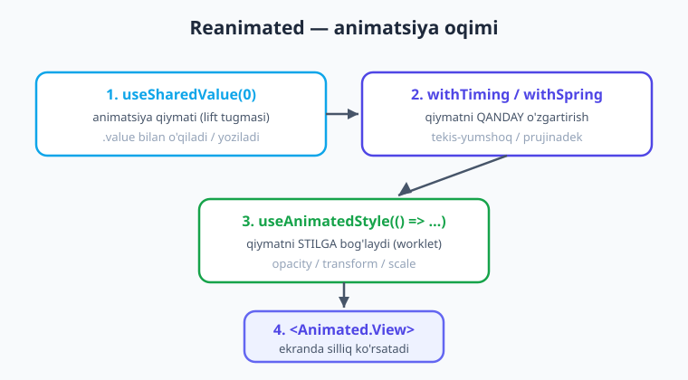
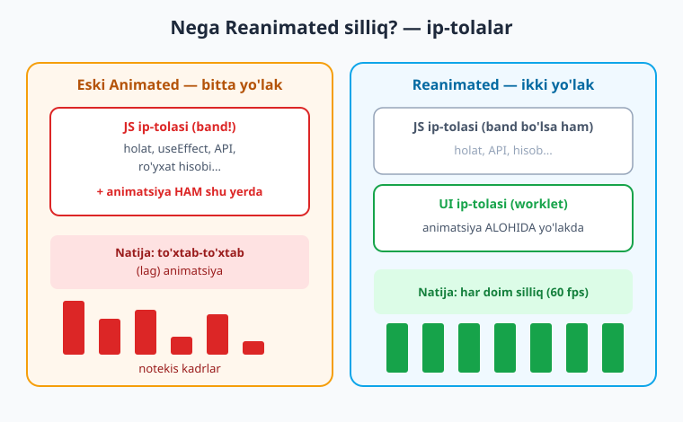
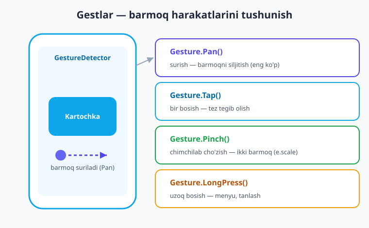

# 24 — Animatsiya va gestlar

[⬅️ Oldingi: 23 — Bildirishnoma va sensorlar](./23-bildirishnoma-sensor.md) · [🏠 Kitob boshi](./README.md) · [Keyingi: 25 — Autentifikatsiya ➡️](./25-autentifikatsiya.md)

> **Bu bobda:** Ilovangizni jonli va silliq qiladigan ikki sehrli kuchni o'rganamiz: **animatsiya** (elementlar yumshoq paydo bo'ladi, kattalashadi, suriladi) va **gestlar** (barmoq harakatlarini tushunish — surish, chimchilab cho'zish, uzoq bosish). Avval RN'ning o'rnatilgan `Animated` vositasini ko'ramiz, keyin zamonaviy va silliq **Reanimated**ni hamda **gesture-handler** kutubxonasini chuqur o'rganamiz. Oxirida ikkalasini birlashtirib, **bosilganda kattalashadigan tugma** va **surib o'chiriladigan ro'yxat** yasaymiz.

---

## Animatsiya nega kerak?

Tasavvur qiling, devorda ikkita rasm bor. Birinchisi — bitta qotib qolgan, qimirlamaydigan surat. Ikkinchisi — jonli multfilm bo'lagi: personajlar harakatlanadi, ranglar yumshoq o'tadi, hamma narsa nafas oladigandek tuyuladi. Qaysi biri sizni ko'proq jalb qiladi? Albatta, ikkinchisi.

Mobil ilovada ham xuddi shunday. Tugma bosilganda u shunchaki "qars" deb o'zgarsa — ilova qo'pol va arzon his qildiradi. Ammo o'sha tugma bosilganda sal kattalashib, keyin yumshoq joyiga qaytsa — ilova **qimmatbaho va o'ylangan** tuyuladi. Animatsiya — bu bezak emas, balki uchta muhim vazifani bajaradi:

- **Silliq o'tishlar.** Bir holatdan ikkinchisiga keskin "sakrash" emas, balki ko'z kuzata oladigan yumshoq yo'l. Ekran o'zgargani sezilmasdan amalga oshadi.
- **Jonli his.** Ilova "tirik" tuyuladi. Element paydo bo'lganda silliq suzib chiqsa, foydalanuvchi miyasi buni tabiiy deb qabul qiladi.
- **Foydalanuvchi e'tiborini boshqarish.** Animatsiya ko'zni kerakli joyga yo'naltiradi: yangi xabar qalqib chiqsa, xato qizarib silkinasa — foydalanuvchi nimaga e'tibor berishni darhol tushunadi.

> **Hayotiy o'xshatish.** Animatsiyasiz ilova — bu **qotib qolgan rasm**. Animatsiyali ilova — bu **jonli multfilm**. Bir xil sahna, lekin ikkinchisi sizni ekranga mixlab qo'yadi. Sirning kaliti — harakatning **silliqligi**: agar multfilm sekundiga 60 marta yangilanmasa (ya'ni "to'xtab-to'xtab" ketsa), sehr buziladi. Shu sababli biz qaysi vositani tanlashga juda jiddiy qaraymiz.

Bu bobda animatsiyaning ikki vositasini ko'ramiz. **Animated** — RN'ning o'rnatilgan, oddiy vositasi. **Reanimated** — zamonaviy, eng silliq va kuchli kutubxona. Ikkalasini ham o'rganamiz, lekin kun bo'yi ishlaydigan asosiy quroling **Reanimated** bo'ladi.

---

## `Animated` — RN'ning o'rnatilgan vositasi

RN'ning ichida `Animated` degan tayyor vosita bor. Hech narsa o'rnatmasdan, oddiy animatsiyalarni qila olasiz. U uchta asosiy qismdan iborat:

1. **`Animated.Value`** — animatsiyalanadigan **qiymat** (masalan, shaffoflik 0 dan 1 gacha). Uni `useRef` ichida saqlaymiz, chunki u render orasida buzilmasligi kerak.
2. **`Animated.timing`** / **`Animated.spring`** — qiymatni qanday o'zgartirish (vaqt bo'yicha tekis, yoki prujinadek sakrab).
3. **`Animated.View`** — animatsiyalanadigan qiymatni qabul qila oladigan maxsus `View`.

Mana oddiy **fade-in** (yumshoq paydo bo'lish) misoli:

```tsx
// app/fade-animated.tsx
import { useRef } from 'react';
import { Animated, Pressable, Text } from 'react-native';

export default function FadeAnimated() {
  // Shaffoflik qiymati: 0 = ko'rinmas, 1 = to'liq ko'rinadi
  const ozuvchanlik = useRef(new Animated.Value(0)).current;

  function korsat() {
    Animated.timing(ozuvchanlik, {
      toValue: 1,            // qayerga: to'liq ko'rinishga
      duration: 500,         // 500 millisekundda
      useNativeDriver: true, // MUHIM: native ipda ishlasin (silliqroq)
    }).start();              // animatsiyani boshlaymiz
  }

  return (
    <Animated.View style={{ opacity: ozuvchanlik }}>
      <Pressable onPress={korsat}>
        <Text>Salom! Meni paydo qiling.</Text>
      </Pressable>
    </Animated.View>
  );
}
```

Bu yerdagi eng muhim narsa — **`useNativeDriver: true`**. U animatsiyani imkon qadar native (mahalliy) tomonga uzatadi, shunda u silliqroq ishlaydi.

!!! warning "Ehtiyot bo'ling"
    `useNativeDriver: true` faqat ba'zi xususiyatlar uchun ishlaydi: `opacity` va `transform` (siljish, aylanish, masshtab). `width`, `height`, `backgroundColor` kabi tarkib (layout) xususiyatlarini native driver animatsiyalay olmaydi — ularda `useNativeDriver: false` bo'ladi, lekin u sekinroq.

`Animated` oddiy vazifalar uchun yaxshi. Ammo zamonaviy RN dunyosida murakkab va silliq animatsiyalar uchun barcha mutaxassislar **Reanimated**ni ishlatadi. Endi asosiy mavzuga o'tamiz.

---

## Reanimated — zamonaviy va silliq animatsiya

**Reanimated** (`react-native-reanimated`, hozirgi versiya **4.x**) — bu animatsiya uchun eng kuchli va eng silliq kutubxona. U RN'ning o'rnatilgan `Animated` vositasidan nimasi bilan yaxshi? **U animatsiyani UI (ko'rinish) ip-tolasida (thread) bajaradi** — buni tez orada batafsil tushuntiramiz, hozircha "u har doim silliq" deb yeting.

Bu kitobning Drawer navigatsiyasi (15-bob) allaqachon Reanimated'ga tayanadi, shuning uchun u odatda loyihangizda o'rnatilgan bo'ladi. Yangi loyihada o'rnatish:

```bash
npx expo install react-native-reanimated
```

Reanimated'ning to'rtta asosiy g'ishti bor. Ularni yaxshilab eslab qoling — qolgan hamma narsa shulardan quriladi:

| G'isht | Vazifasi |
|--------|----------|
| `useSharedValue(0)` | Animatsiyalanadigan **qiymat** (boshlang'ich 0) |
| `useAnimatedStyle(() => ({...}))` | Qiymatni **stilga bog'laydi** |
| `withTiming` / `withSpring` | Qiymatni **qanday** o'zgartirish |
| `<Animated.View>` | Animatsiyalangan stilni **qabul qiladigan** View |



> **Hayotiy o'xshatish.** `useSharedValue` — bu **lift tugmasi bosilgan qavat raqami**. `useAnimatedStyle` — bu **liftning o'zi** (raqamga qarab qaysi qavatga borishni biladi). `withTiming` esa — **lift qanday harakatlanishi** (tekis-yumshoq, yoki "ding!" deb prujinadek). Siz faqat qavat raqamini o'zgartirasiz — qolganini Reanimated o'zi silliq bajaradi.

### `useSharedValue` — animatsiya qiymati

**Shared value** (ya'ni "umumiy qiymat") — bu animatsiyaning yuragi. U `useState`ga o'xshaydi, lekin bitta katta farqi bor: uni o'zgartirsangiz, **komponent qayta render bo'lmaydi**. O'zgarish to'g'ridan-to'g'ri ekranga, qayta render qilishsiz yetib boradi — shuning uchun u juda tez.

```tsx
import { useSharedValue } from 'react-native-reanimated';

const ozuvchanlik = useSharedValue(0); // boshlang'ich qiymat 0
```

Qiymatni o'qish va yozish uchun har doim `.value` ishlatamiz:

```tsx
ozuvchanlik.value = 1;        // yozish
console.log(ozuvchanlik.value); // o'qish
```

!!! warning "Eng keng tarqalgan xato"
    `.value`ni unutmang! `ozuvchanlik = 1` deb yozsangiz ishlamaydi — bu shared value'ni butunlay buzadi. Har doim `ozuvchanlik.value = 1`.

### `useAnimatedStyle` — qiymatni stilga bog'lash

**Animated style** — bu shared value'ni komponent stiliga ulaydigan ko'prik. U funksiya qabul qiladi va o'sha funksiya stil obyektini qaytaradi:

```tsx
const uslub = useAnimatedStyle(() => ({
  opacity: ozuvchanlik.value, // shared value o'zgarsa, opacity ham o'zgaradi
}));
```

Endi `uslub`ni `Animated.View`ga beramiz. `ozuvchanlik.value` har safar o'zgarganda, bu stil avtomatik yangilanadi.

### `withTiming` va `withSpring` — qiymatni qanday o'zgartirish

Agar shunchaki `ozuvchanlik.value = 1` desangiz, qiymat **darhol** sakraydi — animatsiya bo'lmaydi. Silliq o'tish uchun qiymatni **animatsiya funksiyasi**ga o'rab beramiz:

- **`withTiming(maqsad, { duration })`** — qiymatni belgilangan vaqtda **tekis** o'zgartiradi. Fade, siljish uchun ideal.
- **`withSpring(maqsad)`** — qiymatni **prujinadek** o'zgartiradi: maqsadga yetib, biroz "sakrab" qaytadi. Tugma bosish, kartochka paydo bo'lishi uchun jonli his beradi.

```tsx
ozuvchanlik.value = withTiming(1, { duration: 300 }); // 300ms da tekis
olcham.value = withSpring(1.2);                        // prujinadek
```

### To'liq fade-in misoli

Endi hammasini birlashtiramiz. Tugma bosilsa, matn yumshoq paydo bo'ladi:

```tsx
// app/reanimated-fade.tsx
import Animated, {
  useSharedValue,
  useAnimatedStyle,
  withTiming,
} from 'react-native-reanimated';
import { Pressable, Text, StyleSheet } from 'react-native';

export default function ReanimatedFade() {
  const ozuvchanlik = useSharedValue(0); // 1. qiymat

  // 2. qiymatni stilga bog'laymiz
  const uslub = useAnimatedStyle(() => ({ opacity: ozuvchanlik.value }));

  // 3. tugma bosilsa qiymatni silliq 1 ga olib boramiz
  function korsat() {
    ozuvchanlik.value = withTiming(1, { duration: 300 });
  }

  return (
    <Animated.View style={[styles.quti, uslub]}>
      <Pressable onPress={korsat}>
        <Text style={styles.matn}>Men yumshoq paydo bo'laman</Text>
      </Pressable>
    </Animated.View>
  );
}

const styles = StyleSheet.create({
  quti: { padding: 20, backgroundColor: '#fff', borderRadius: 12 },
  matn: { fontSize: 16, color: '#1e293b' },
});
```

!!! note "Import nomi"
    Reanimated'ning `Animated` obyektini default import bilan olamiz: `import Animated from 'react-native-reanimated'`. Bu RN'ning o'z `Animated`idan **boshqa** narsa! Ataylab `Reanimated` deb nomlasangiz ham bo'ladi: `import Reanimated from 'react-native-reanimated'`. Bu kitobda qisqalik uchun `Animated` deb yozamiz.

### Yana foydali animatsiya funksiyalari

Bu to'rttasini ham bilib qo'ying — ular bilan murakkab animatsiyalarni quchaqlaysiz:

```tsx
import {
  withDelay, withRepeat, withSequence, Easing,
} from 'react-native-reanimated';

// 200ms kutib, keyin animatsiya boshlash:
x.value = withDelay(200, withTiming(100));

// Animatsiyani 3 marta takrorlash (true = oldinga-orqaga):
x.value = withRepeat(withTiming(50, { duration: 300 }), 3, true);

// Ketma-ket bir nechta animatsiya (silkinish effekti):
x.value = withSequence(withTiming(20), withTiming(-20), withTiming(0));

// Easing — harakat "tezlanishi" egri chizig'i:
x.value = withTiming(1, { duration: 400, easing: Easing.out(Easing.quad) });
```

`withSequence` bilan, masalan, xato kiritilganda inputni **chap-o'ng silkitish** mumkin. `withRepeat` esa "yuklanmoqda" indikatorini abadiy aylantirish uchun zo'r.

---

## Nega Reanimated shunchalik silliq? (ip-tolalar)

Bu eng muhim tushuncha — uni bilsangiz, qachon nimani ishlatishni bilasiz. 1-bobda biz **JSI** (JavaScript Interface) haqida gaplashgandik: New Architecture'da JS bilan native qatlam to'g'ridan-to'g'ri gaplashadi. Reanimated aynan shu imkoniyatga tayanadi.

RN ilovasida ikkita asosiy "ishchi yo'lak" (thread, ya'ni **ip-tola**) bor:

- **JS ip-tolasi** — sizning butun JavaScript kodingiz shu yerda ishlaydi: holat, `useEffect`, API so'rovlar, ro'yxatni hisoblash...
- **UI ip-tolasi** — ekranni chizadigan native qatlam. U sekundiga 60 (yoki 120) marta kadr chizadi.

Endi muammoni tasavvur qiling. Eski `Animated`da animatsiya **JS ip-tolasida** hisoblanadi. Agar shu paytda JS ip-tolasi band bo'lsa (masalan, katta ro'yxatni saralayapti yoki API javobini qayta ishlayapti) — animatsiya **to'xtab-to'xtab** ketadi. Multfilm "lag" qiladi.

Reanimated bu muammoni qoyilmaqom hal qiladi: u animatsiya kodini (`useAnimatedStyle` ichidagi funksiyani) **UI ip-tolasiga** ko'chiradi. Endi JS ip-tolasi nima bilan band bo'lishidan **qat'i nazar**, animatsiya alohida yo'lakda, har doim silliq ishlaydi.



> **Hayotiy o'xshatish.** Tasavvur qiling, restoran bor. **Bitta** ofitsiant ham buyurtma oladi, ham ovqat tashiydi, ham hisob yozadi — band paytda hamma narsa sekinlashadi (eski Animated, bitta JS ip-tolasi). **Reanimated** esa animatsiya uchun **alohida ofitsiant** yollaydi: u faqat "harakatni silliq olib borish" bilan shug'ullanadi. Asosiy ofitsiant qanchalik band bo'lmasin, animatsiya ofitsianti to'xtamaydi.

!!! tip "Worklet — UI ipida ishlaydigan kod"
    `useAnimatedStyle` va gest `onUpdate` ichidagi funksiyalar **worklet** deb ataladi — ular JS ip-tolasida emas, UI ip-tolasida ishlaydi. Reanimated buni avtomatik tashkil qiladi (Worklets kutubxonasi orqali). Worklet ichidan oddiy JS funksiyangizni (masalan, `setState`) chaqirmoqchi bo'lsangiz, `runOnJS` kerak bo'ladi — buni gestlar bo'limida ko'ramiz.

---

## Gestlar — barmoq harakatlarini tushunish

Animatsiya — bu yarmi. Ikkinchi yarmi — **gestlar**: foydalanuvchining barmog'i ekranda nima qilayotganini tushunish. Surish, chimchilab cho'zish, uzoq bosish... Bularni `react-native-gesture-handler` kutubxonasi boshqaradi (qisqacha **GH**). U ham Drawer (15-bob) tufayli odatda allaqachon o'rnatilgan.

```bash
npx expo install react-native-gesture-handler
```

### Ildizda `GestureHandlerRootView`

Gestlar ishlashi uchun butun ilovani **`GestureHandlerRootView`** bilan o'rab qo'yish kerak — bu bir martalik sozlash. Odatda buni ildiz `_layout.tsx`da qilamiz:

```tsx
// app/_layout.tsx
import { GestureHandlerRootView } from 'react-native-gesture-handler';
import { Stack } from 'expo-router';

export default function RootLayout() {
  return (
    <GestureHandlerRootView style={{ flex: 1 }}>
      <Stack />
    </GestureHandlerRootView>
  );
}
```

!!! warning "Eng keng tarqalgan xato"
    `GestureHandlerRootView` ildizda bo'lmasa, gestlaringiz **jimgina ishlamaydi** — xato ham chiqmaydi. Agar surishlaringiz "ta'sir qilmayotgan" bo'lsa, birinchi navbatda shuni tekshiring.

### `GestureDetector` + `Gesture` — to'rtta asosiy gest

Zamonaviy GH'ning ishlash uslubi sodda: gestni **`Gesture.Xxx()`** bilan yaratasiz, sozlaysiz, keyin uni **`<GestureDetector gesture={...}>`** bilan biror elementga "yopishtirib" qo'yasiz. To'rtta eng ko'p ishlatiladigan gest:

| Gest | Nima qiladi |
|------|-------------|
| `Gesture.Pan()` | **Surish** — barmoqni siljitish (eng ko'p ishlatiladi) |
| `Gesture.Tap()` | **Bir bosish** — tez tegib olish |
| `Gesture.Pinch()` | **Chimchilab cho'zish** — ikki barmoq bilan kattalashtirish |
| `Gesture.LongPress()` | **Uzoq bosib turish** — kontekst menyu, tanlash |



Har bir gestning "tinglovchilari" (callback'lari) bor. Eng muhimlari: **`.onBegin`** (gest boshlandi), **`.onUpdate`** (barmoq harakatlanmoqda — har kadrda chaqiriladi), **`.onEnd`** (barmoq ko'tarildi). Mana Tap, LongPress va Pinch'ning oddiy ko'rinishi:

```tsx
import { GestureDetector, Gesture } from 'react-native-gesture-handler';
import { View, Text } from 'react-native';

const tap = Gesture.Tap().onEnd(() => {
  console.log('Bir marta bosildi');
});

const uzunBosish = Gesture.LongPress().onStart(() => {
  console.log('Uzoq bosildi — menyu ochsa bo\'ladi');
});

const pinch = Gesture.Pinch().onUpdate((e) => {
  console.log('Cho\'zish masshtabi:', e.scale); // e.scale — necha barobar
});
```

Ko'rib turganingizdek, `onUpdate` callback'i **hodisa obyekti** (`e`) qabul qiladi — unda gest haqida hamma ma'lumot bor: `e.translationX/Y` (Pan uchun qancha surilgan), `e.scale` (Pinch masshtabi) va hokazo. Endi eng qiziq qismga — Pan gestini animatsiya bilan birlashtirishga o'tamiz.

---

## Gest + animatsiya birga: surilgan kartochka

Mana sehr boshlanadigan joy. **Pan gesti** barmoq qancha surilganini beradi, **shared value** uni saqlaydi, **animated style** esa elementni o'sha joyga ko'chiradi. Natijada — barmoq orqasidan ergashadigan, suriladigan kartochka.

```tsx
// app/surilgan-karta.tsx
import Animated, {
  useSharedValue, useAnimatedStyle,
} from 'react-native-reanimated';
import { GestureDetector, Gesture } from 'react-native-gesture-handler';
import { Text, StyleSheet } from 'react-native';

export default function SurilganKarta() {
  const x = useSharedValue(0);     // gorizontal siljish
  const y = useSharedValue(0);     // vertikal siljish
  const boshX = useSharedValue(0); // surish boshlangandagi joy
  const boshY = useSharedValue(0);

  const pan = Gesture.Pan()
    .onBegin(() => {
      // surish boshlanganda hozirgi joyni eslab qolamiz
      boshX.value = x.value;
      boshY.value = y.value;
    })
    .onUpdate((e) => {
      // boshlang'ich joy + barmoq qancha surilgani
      x.value = boshX.value + e.translationX;
      y.value = boshY.value + e.translationY;
    });

  const uslub = useAnimatedStyle(() => ({
    transform: [
      { translateX: x.value },
      { translateY: y.value },
    ],
  }));

  return (
    <GestureDetector gesture={pan}>
      <Animated.View style={[styles.karta, uslub]}>
        <Text style={styles.matn}>Meni istalgan joyga suring</Text>
      </Animated.View>
    </GestureDetector>
  );
}

const styles = StyleSheet.create({
  karta: { padding: 24, backgroundColor: '#0ea5e9', borderRadius: 16 },
  matn: { color: '#fff', fontSize: 16, fontWeight: '600' },
});
```

Diqqat qiling: `onBegin`da boshlang'ich joyni eslab qolamiz, `onUpdate`da esa **boshlang'ich + siljish** deb hisoblaymiz. Agar buni qilmasak, har gal surishni boshlaganda kartochka 0 ga "sakraydi". Bu — draggable (sudralib yuradigan) element yasashning standart usuli.

### `runOnJS` — worklet'dan oddiy kodga ko'prik

Esda tutasizmi, gest callback'lari worklet — ular UI ip-tolasida ishlaydi. Agar surish tugaganda **oddiy JS funksiyangizni** (masalan, `setState` yoki navigatsiya) chaqirmoqchi bo'lsangiz, to'g'ridan-to'g'ri chaqira olmaysiz — kerak **`runOnJS`** ko'prigi:

```tsx
import { runOnJS } from 'react-native-reanimated';

const pan = Gesture.Pan().onEnd(() => {
  // 'use worklet' — bu UI ipida ishlaydi
  runOnJS(menimFunksiyam)(); // oddiy JS funksiyani xavfsiz chaqiramiz
});
```

> **Hayotiy o'xshatish.** Worklet (UI ipi) va oddiy JS kodi — bu ikki xil tilda gaplashadigan ikki bo'lim kabi. `runOnJS` — ular orasidagi **tarjimon**: "men (UI ipi) JS bo'limiga xabar yubormoqchiman" deganingizda, xabarni `runOnJS`ga o'rab berasiz, u to'g'ri yetkazadi.

---

## Swipe-to-delete: surib o'chirish

Endi `runOnJS`ni amalda ko'ramiz — bu eng mashhur naqsh: ro'yxat elementini **chapga surib o'chirish**. Mantiq oddiy: agar foydalanuvchi yetarlicha uzoq surib (masalan, 120 dp chapga) qo'lini ko'tarsa, elementni o'chiramiz. Aks holda, element joyiga qaytadi.

```tsx
// app/swipe-ochirish.tsx
import Animated, {
  useSharedValue, useAnimatedStyle, withTiming, withSpring, runOnJS,
} from 'react-native-reanimated';
import { GestureDetector, Gesture } from 'react-native-gesture-handler';
import { Text, StyleSheet } from 'react-native';

type Props = { nomi: string; onOchir: () => void };

export default function SwipeOchirish({ nomi, onOchir }: Props) {
  const x = useSharedValue(0);

  const pan = Gesture.Pan()
    .onUpdate((e) => {
      x.value = e.translationX; // barmoq orqasidan suriladi
    })
    .onEnd(() => {
      if (x.value < -120) {
        // yetarlicha chapga surilgan — ekrandan chiqarib o'chiramiz
        x.value = withTiming(-400, { duration: 200 });
        runOnJS(onOchir)(); // ro'yxatdan o'chiruvchi JS funksiya
      } else {
        // yetmadi — silliq joyiga qaytaradi
        x.value = withSpring(0);
      }
    });

  const uslub = useAnimatedStyle(() => ({
    transform: [{ translateX: x.value }],
  }));

  return (
    <GestureDetector gesture={pan}>
      <Animated.View style={[styles.karta, uslub]}>
        <Text style={styles.matn}>{nomi}</Text>
      </Animated.View>
    </GestureDetector>
  );
}

const styles = StyleSheet.create({
  karta: {
    padding: 18, backgroundColor: '#fff', borderRadius: 12,
    marginVertical: 6, borderWidth: 1, borderColor: '#e2e8f0',
  },
  matn: { fontSize: 16, color: '#1e293b' },
});
```

Bu yerda `runOnJS(onOchir)()` ota komponentdagi `setState`ni chaqiradi — u ro'yxatdan elementni olib tashlaydi. Agar `runOnJS`siz to'g'ridan-to'g'ri `onOchir()` desangiz, ilova worklet ichida xato beradi.

!!! tip "Tayyor yechim ham bor"
    O'zingiz Pan bilan swipe yozish — o'rganish uchun zo'r. Lekin amaliyotda `react-native-gesture-handler`'ning o'zida **`Swipeable`** komponenti bor (`react-native-gesture-handler` dan import qilinadi), u chap/o'ng harakatlarni tayyor beradi. Mantiqni tushungandan keyin tayyorini ishlatish — aqlli yo'l.

---

## Layout animatsiyalari — eng oson sehr

Yuqorida biz qiymatlarni qo'lda animatsiya qildik. Lekin Reanimated yana bir ajoyib imkoniyat beradi: **layout animatsiyalari**. Bu eng oson va eng kuchli vosita. Element ro'yxatga **qo'shilganda** yoki undan **o'chirilganda** — Reanimated avtomatik silliq animatsiya qiladi. Sizdan deyarli hech narsa talab qilinmaydi!

Uchta xususiyat bor, ularni to'g'ridan-to'g'ri `Animated.View`ga berasiz:

- **`entering={FadeIn}`** — element ekranga qo'shilganda qanday paydo bo'ladi.
- **`exiting={FadeOut}`** — element o'chirilganda qanday yo'qoladi.
- **`layout={LinearTransition}`** — qolgan elementlar joyi o'zgarganda silliq surilishi.

```tsx
// app/layout-animatsiya.tsx
import Animated, {
  FadeIn, FadeOut, LinearTransition,
} from 'react-native-reanimated';
import { FlatList, Text, StyleSheet } from 'react-native';

type Vazifa = { id: string; nomi: string };

export default function LayoutMisol({ vazifalar }: { vazifalar: Vazifa[] }) {
  return (
    <FlatList
      data={vazifalar}
      keyExtractor={(v) => v.id}
      renderItem={({ item }) => (
        <Animated.View
          entering={FadeIn}              // qo'shilganda yumshoq paydo
          exiting={FadeOut}             // o'chirilganda yumshoq yo'qoladi
          layout={LinearTransition}     // qolganlar silliq suriladi
          style={styles.karta}
        >
          <Text style={styles.matn}>{item.nomi}</Text>
        </Animated.View>
      )}
    />
  );
}

const styles = StyleSheet.create({
  karta: { padding: 16, backgroundColor: '#fff', borderRadius: 12, marginVertical: 6 },
  matn: { fontSize: 16, color: '#1e293b' },
});
```

Endi `vazifalar` ro'yxatiga element qo'shsangiz — u yumshoq suzib chiqadi; o'chirsangiz — yumshoq so'nadi; qolganlar esa silliq surilib bo'sh joyni egallaydi. Hammasi avtomatik!

!!! note "Boshqa tayyor presetlar"
    `FadeIn`/`FadeOut`dan tashqari ko'plab tayyor presetlar bor: `SlideInLeft`, `SlideOutRight`, `ZoomIn`, `ZoomOut`, `BounceIn` va boshqalar. Ularni `react-native-reanimated`dan import qilib, sinab ko'ring. Davomiyligini sozlash: `entering={FadeIn.duration(400)}`.

---

## Tayyor kutubxonalar

Reanimated va gesture-handler — bu poydevor. Ular ustiga qurilgan tayyor yechimlar ham bor:

- **`react-native-reanimated`** — animatsiya va gest mantig'ining asosi. Deyarli har bir jiddiy RN ilovasi unga tayanadi.
- **`moti`** — Reanimated ustiga qurilgan, juda **qisqa** sintaksisli kutubxona. `<MotiView from={{ opacity: 0 }} animate={{ opacity: 1 }} />` — `useSharedValue`/`useAnimatedStyle` yozmasdan animatsiya. Tez prototip uchun qulay. Lekin avval poydevorni (Reanimated) tushunish muhim — keyin `moti` faqat qisqartma bo'ladi.

!!! tip "Maslahat"
    Yangi loyihada animatsiya kerak bo'lsa: oddiy paydo bo'lish/o'chish uchun — **layout animatsiyalar** (`FadeIn`/`FadeOut`). Interaktiv (surish, masshtab) uchun — **Reanimated + gesture-handler**. Juda tez prototip uchun — **moti**. Eski `Animated`ni faqat juda oddiy holatlarda ishlatish kifoya.

---

## To'liq misol: kattalashadigan tugma + surib o'chiriladigan ro'yxat

Endi bobning toji — o'rganganlarimizni bitta ishlaydigan ekranda birlashtiramiz. Bunda ikki narsa bor:

1. **Bosilganda kattalashadigan tugma** (`withSpring` bilan).
2. **Surib o'chiriladigan ro'yxat** (`Gesture.Pan` + `runOnJS` + layout animatsiya).

Avval kattalashadigan tugma. Barmoq tushganda (`onPressIn`) tugma sal kattalashadi, ko'tarilganda (`onPressOut`) prujinadek joyiga qaytadi:

```tsx
// app/prujina-tugma.tsx
import Animated, {
  useSharedValue, useAnimatedStyle, withSpring,
} from 'react-native-reanimated';
import { Pressable, Text, StyleSheet } from 'react-native';

export default function PrujinaTugma() {
  const olcham = useSharedValue(1); // masshtab: 1 = oddiy o'lcham

  const uslub = useAnimatedStyle(() => ({
    transform: [{ scale: olcham.value }],
  }));

  return (
    <Animated.View style={uslub}>
      <Pressable
        onPressIn={() => { olcham.value = withSpring(1.15); }} // bosilganda kattalashadi
        onPressOut={() => { olcham.value = withSpring(1); }}   // qo'yib yuborilganda qaytadi
        style={styles.tugma}
      >
        <Text style={styles.tugmaMatn}>Bos meni</Text>
      </Pressable>
    </Animated.View>
  );
}

const styles = StyleSheet.create({
  tugma: { backgroundColor: '#4f46e5', paddingVertical: 14, paddingHorizontal: 32, borderRadius: 12 },
  tugmaMatn: { color: '#fff', fontSize: 16, fontWeight: '700' },
});
```

Endi bularning hammasini bitta ekranga yig'amiz. Yuqoridagi `SwipeOchirish` va `PrujinaTugma` komponentlarini ishlatamiz, ro'yxatga esa layout animatsiya beramiz:

```tsx
// app/animatsiya-demo.tsx
import { useState } from 'react';
import { View, Text, StyleSheet } from 'react-native';
import Animated, { LinearTransition } from 'react-native-reanimated';
import PrujinaTugma from './prujina-tugma';
import SwipeOchirish from './swipe-ochirish';

type Vazifa = { id: string; nomi: string };

export default function AnimatsiyaDemo() {
  const [vazifalar, setVazifalar] = useState<Vazifa[]>([
    { id: '1', nomi: 'Sut sotib olish' },
    { id: '2', nomi: 'Kitob o\'qish' },
    { id: '3', nomi: 'Mashq qilish' },
  ]);

  function qoshish() {
    const yangi = { id: Date.now().toString(), nomi: 'Yangi vazifa' };
    setVazifalar((oldin) => [yangi, ...oldin]);
  }

  function ochir(id: string) {
    setVazifalar((oldin) => oldin.filter((v) => v.id !== id));
  }

  return (
    <View style={styles.box}>
      <Text style={styles.sarlavha}>Vazifalar</Text>

      <PrujinaTugma />

      {/* layout animatsiya bilan ro'yxat — har bir element suriladi/silliq paydo bo'ladi */}
      {vazifalar.map((v) => (
        <Animated.View key={v.id} layout={LinearTransition}>
          <SwipeOchirish nomi={v.nomi} onOchir={() => ochir(v.id)} />
        </Animated.View>
      ))}

      {vazifalar.length === 0 && (
        <Text style={styles.bosh}>Hammasi bajarildi!</Text>
      )}
    </View>
  );
}

const styles = StyleSheet.create({
  box: { flex: 1, padding: 20, gap: 14, justifyContent: 'center' },
  sarlavha: { fontSize: 24, fontWeight: '700', color: '#1e293b' },
  bosh: { fontSize: 16, color: '#94a3b8', textAlign: 'center' },
});
```

Bu ekranda: tugma bosilganda kattalashadi (`withSpring`), elementlarni chapga surib o'chirasiz (`Pan` + `runOnJS`), o'chgan element silliq ketadi va qolganlar avtomatik suriladi (`LinearTransition`). Esda tutilsin — bularning bari ishlashi uchun ildizda `GestureHandlerRootView` bo'lishi shart.

!!! example "Tekshirilgan"
    Bu bobdagi barcha kod namunalari — `Animated`, Reanimated (`useSharedValue`/`useAnimatedStyle`/`withTiming`/`withSpring`/`withDelay`/`withRepeat`/`withSequence`/`Easing`), gesture-handler (`Gesture.Pan/Tap/Pinch/LongPress`/`GestureDetector`), `runOnJS` va layout animatsiyalar (`FadeIn`/`FadeOut`/`LinearTransition`) — real Expo loyihasida (Reanimated 4.x, gesture-handler 2.x) `npx tsc --noEmit` bilan **xatosiz** tekshirildi.

---

## Xulosa

- **Animatsiya** ilovani jonli va qimmatbaho qiladi: silliq o'tishlar, jonli his, foydalanuvchi e'tiborini boshqarish. "Qotgan rasm vs jonli multfilm".
- **`Animated`** — RN'ning o'rnatilgan, oddiy vositasi: `Animated.Value` + `Animated.timing/spring` + `Animated.View` + `useNativeDriver: true`. Oddiy fade/slide uchun yetadi.
- **Reanimated** (zamonaviy, asosiy) to'rt g'ishtdan iborat: **`useSharedValue`** (qiymat), **`useAnimatedStyle`** (stilga bog'lash), **`withTiming`/`withSpring`** (qanday o'zgarish), **`Animated.View`** (ko'rsatish). Shared value `.value` orqali ishlaydi va qayta render qilmaydi.
- **Nega silliq:** Reanimated animatsiyani **UI ip-tolasida** (worklet) bajaradi — JS ip-tolasi band bo'lsa ham silliq. Bu New Architecture'ning JSI imkoniyatiga tayanadi.
- **`react-native-gesture-handler`**: `Gesture.Pan()` (surish), `.Tap()`, `.Pinch()` (cho'zish), `.LongPress()`; ularni `<GestureDetector>` elementga bog'laydi. Ildizda **`GestureHandlerRootView`** shart.
- **Gest + animatsiya birga:** Pan'ning `e.translationX/Y`ni shared value'ga yozib, `useAnimatedStyle`'da `translateX/Y` qilamiz — draggable, swipe-to-delete chiqadi. Worklet'dan JS funksiyani chaqirish uchun **`runOnJS`**.
- **Layout animatsiyalari** — eng oson kuch: `entering={FadeIn}`, `exiting={FadeOut}`, `layout={LinearTransition}` — element qo'shil/o'chirilganda avtomatik silliq animatsiya.
- Tayyor kutubxonalar: poydevor — **`react-native-reanimated`**; tez prototip uchun qisqa sintaksisli **`moti`**.

---

## Amaliy mashqlar

1. **Fade-in salom.** Ekran ochilganda matn 0 dan to'liq ko'rinishga **yumshoq** chiqsin. `useSharedValue(0)` + `useAnimatedStyle` (opacity) + `useEffect` ichida `withTiming(1)`. *Yo'naltirish:* `useEffect(() => { ozuvchanlik.value = withTiming(1, { duration: 600 }); }, [])`.

2. **Kattalashadigan tugma.** Bosilganda 1.15 barobar kattalashib, qo'yib yuborilganda joyiga qaytadigan tugma yasang (`withSpring`). *Yo'naltirish:* `Pressable`ning `onPressIn`/`onPressOut`da `olcham.value`ni o'zgartiring; stilga `transform: [{ scale }]`.

3. **Surib o'chirish.** Bitta kartochkani chapga surib o'chirib bo'ladigan qiling. 120 dp dan ko'p surilsa o'chsin, aks holda joyiga qaytsin. *Yo'naltirish:* `Gesture.Pan().onUpdate(...).onEnd(...)`; o'chirish uchun `runOnJS(onOchir)()`; qaytarish uchun `withSpring(0)`.

4. **Layout animatsiya ro'yxati.** "Qo'shish" tugmasi bosilganda ro'yxatga yangi element **yumshoq** qo'shilsin, o'chirilganda **yumshoq** ketsin. *Yo'naltirish:* har elementni `<Animated.View entering={FadeIn} exiting={FadeOut} layout={LinearTransition}>` bilan o'rang; ro'yxatni `useState` bilan boshqaring.

5. **Suriladigan kartochka (qiyin).** Ekran bo'ylab istalgan joyga sudralib yuradigan kartochka yasang. Surish tugaganda u **eng yaqin chetga** (chap yoki o'ng) prujinadek "yopishsin". *Yo'naltirish:* `x`/`y` shared value; `onBegin`da boshlang'ich joyni eslang; `onEnd`da `x.value < ekranKengligi/2 ? withSpring(0) : withSpring(maxX)`.

6. **Pinch bilan rasm cho'zish (qiyin).** Bir rasmni ikki barmoq bilan chimchilab kattalashtirib/kichraytiring (`Gesture.Pinch`). *Yo'naltirish:* `olcham.value`ni `e.scale`ga bog'lang; `onEnd`da `withSpring`bilan 1 ga qaytaring yoki cheklang (`Math.max/min`).

---

[⬅️ Oldingi: 23 — Bildirishnoma va sensorlar](./23-bildirishnoma-sensor.md) · [🏠 Kitob boshi](./README.md) · [Keyingi: 25 — Autentifikatsiya ➡️](./25-autentifikatsiya.md)
