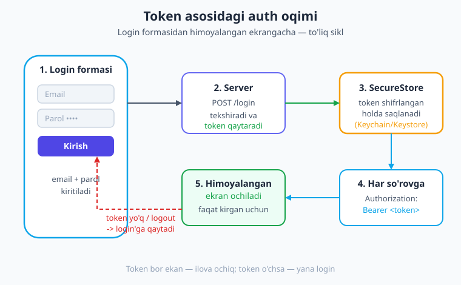
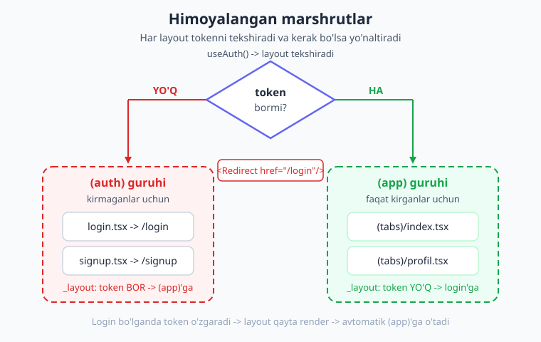
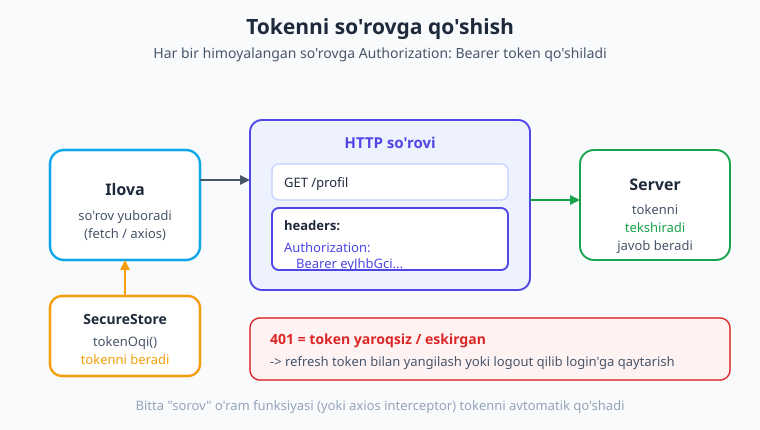

# 25 — Autentifikatsiya

[⬅️ Oldingi: 24 — Animatsiya va gestlar](./24-animatsiya-gest.md) · [🏠 Kitob boshi](./README.md) · [Keyingi: 26 — Testlash va debugging ➡️](./26-testlash-debugging.md)

> **Bu bobda:** Ilovaga **autentifikatsiya** (foydalanuvchini tanish) qo'shamiz. Login/signup formasini quramiz, serverdan kelgan **token**ni `expo-secure-store` bilan xavfsiz saqlaymiz, auth holatini Context (yoki Zustand) bilan butun ilovaga tarqatamiz va **himoyalangan marshrutlar**ni `<Redirect>` bilan qo'riqlaymiz. So'ng tokenni har so'rovga qo'shishni, token muddati va refresh'ni, OAuth va biometrik kirishni ko'rib, oxirida login → token → himoyalangan ekran → logout to'liq oqimini yig'amiz. Kod jonli Expo loyihada `tsc` bilan tekshirilgan.

---

## Autentifikatsiya nima?

Shu paytgacha qurgan ilovalarimiz **hammaga ochiq** edi: kim ochsa, hamma narsani ko'radi. Lekin haqiqiy ilovalar ko'pincha shaxsiy: Telegram'da faqat **sizning** chatlaringiz, bank ilovasida faqat **sizning** hisobingiz, Instagram'da faqat **siz** o'zingizning postingizni o'chira olasiz. Demak, ilova avval bir savolga javob topishi kerak: **"Sen kimsan?"**

Mana shu savolga javob berish jarayoni — **autentifikatsiya** (authentication, qisqacha "auth"). Bu — foydalanuvchini **tanish**: u kim ekanini aniqlash (login orqali) va shu odamga faqat o'ziga ruxsat berilgan ekranlarni ko'rsatish.

> **Hayotiy o'xshatish.** Autentifikatsiyani **uy eshigi** deb tasavvur qiling. Uyga kirish uchun sizda **kalit** bo'lishi kerak. Kalit to'g'ri kelsa — eshik ochiladi, ichkariga (himoyalangan xonalarga) kirasiz. Kalit yo'q bo'lsa — tashqarida (login ekranida) qolasiz. Mehmonxonada esa **karta-kalit** beriladi: resepsiyada pasportingizni ko'rsatasiz (login), sizga vaqtinchalik karta beriladi (token), va shu karta bilan faqat **o'z xonangiz** eshigini ochasiz. Token — aynan shu karta-kalit.

Bu jarayonda ikkita yaqin, lekin **farqli** tushuncha bor:

- **Autentifikatsiya** (authentication) — "**Sen kimsan?**" Foydalanuvchini tanish (login).
- **Avtorizatsiya** (authorization) — "**Senga nima qilishga ruxsat bor?**" Tanilgan foydalanuvchi qaysi amallarni bajara olishi (masalan, oddiy foydalanuvchi va admin farqi).

Bu bobda asosan **autentifikatsiya** bilan shug'ullanamiz: foydalanuvchini login qildirib, uning shaxsini token bilan eslab qolamiz.

### Token nima va nega parol emas?

Foydalanuvchi bir marta email va parolini kiritadi. Lekin keyin **har bir so'rovda** parolni qayta yuborib turish — xavfli va noqulay. Buning o'rniga server bir marta tekshiruvdan keyin sizga **token** beradi.

**Token** — bu serverga "men allaqachon kirgan o'sha foydalanuvchiman" deb tasdiqlaydigan maxsus, vaqtinchalik **maxfiy kalit-satr**. Eng keng tarqalgan turi — **JWT** (JSON Web Token): u uzun, tasodifiy ko'rinadigan harf-raqamlar zanjiri, ichida foydalanuvchi haqida ma'lumot va server imzosi bo'ladi.

> **Hayotiy o'xshatish.** Token — bu **pasport** yoki **chipta** kabi. Aeroportda bir marta hujjatingizni tekshiradilar, keyin sizga **bortga chiqish taloni** (boarding pass) beradilar. Endi har bir nazorat nuqtasida pasportni emas, shu talonni ko'rsatasiz. Talon vaqtincha amal qiladi va faqat sizning reysingizga to'g'ri keladi. Token ham xuddi shunday: bir marta parol bilan "tekshiruvdan o'tasiz", keyin har joyda token ko'rsatasiz.

!!! note "Eslatma: token = maxfiy"
    Token — bu vaqtinchalik **parolga teng** narsa. Kimdir tokeningizni qo'lga kiritsa, u sizning nomingizdan ilovaga kira oladi. Shuning uchun tokenni **maxfiy** saqlash juda muhim — buni quyida `expo-secure-store` bilan hal qilamiz.

---

## Auth oqimi: umumiy manzara

Kod yozishdan oldin butun oqimni boshdan-oxir ko'rib chiqaylik. Token asosidagi auth quyidagi qadamlardan iborat:

1. Foydalanuvchi **login formasi**ga email va parolini kiritadi.
2. Ilova bularni **serverga yuboradi** (`POST /login`).
3. Server tekshiradi va to'g'ri bo'lsa **token qaytaradi**.
4. Ilova tokenni **xavfsiz saqlaydi** (`expo-secure-store`).
5. Endi himoyalangan ma'lumot kerak bo'lsa, ilova **har so'rovga tokenni qo'shadi** (`Authorization: Bearer ...`).
6. Token bor ekan — foydalanuvchi himoyalangan ekranlarni ko'radi. **Token yo'q bo'lsa** (yoki logout qilsa) — login ekraniga qaytariladi.



Bu oqimning har bir bo'lagini biz oldingi boblarda alohida o'rganganmiz — endi ularni bitta tizimga **birlashtiramiz**:

| Qadam | Qaysi bobda o'rgangan edik |
|---|---|
| Forma (TextInput + validatsiya) | **20-bob** — Formalar va validatsiya |
| Serverga so'rov (`fetch` POST) | **17-bob** — Tarmoq va API |
| Tokenni xavfsiz saqlash | **18-bob** — Lokal saqlash (SecureStore) |
| Auth holatini global tarqatish | **19-bob** — Global holat (Context/Zustand) |
| Ekranlar va yo'naltirish | **14-bob** — Expo Router |

Endi har birini ketma-ket quramiz.

---

## 1-qadam: Login/signup formasi

Login formasi — bu oddiy forma: **email** va **parol** inputlari, **submit** tugmasi. Buni 20-bobda o'rgangan TextInput va validatsiya bilamiz bilan quramiz. Eng muhim qoidalardan birini eslang: parol inputiga **`secureTextEntry`** prop'ini berish kerak — shunda matn yulduzcha (•) bilan yashiriladi.

Hozircha forma faqat ma'lumotni **yig'adi** va validatsiya qiladi; serverga yuborishni keyingi qadamda ulaymiz. Forma quyidagicha:

```tsx
// app/(auth)/login.tsx
import { useState } from 'react';
import {
  View,
  Text,
  TextInput,
  Pressable,
  StyleSheet,
  ActivityIndicator,
} from 'react-native';
import { useAuth } from '../../context/AuthContext';

export default function LoginEkrani() {
  const { login } = useAuth(); // auth holatidan login funksiyasi (pastda quramiz)
  const [email, setEmail] = useState('');
  const [parol, setParol] = useState('');
  const [xato, setXato] = useState<string | null>(null);
  const [yuborilmoqda, setYuborilmoqda] = useState(false);

  const yubor = async () => {
    setXato(null);
    // Oddiy validatsiya (20-bob)
    if (email.trim() === '' || parol === '') {
      setXato('Email va parolni kiriting');
      return;
    }
    setYuborilmoqda(true);
    try {
      await login(email.trim(), parol); // serverga yuboradi va tokenni saqlaydi
    } catch (e) {
      setXato(e instanceof Error ? e.message : 'Nimadir xato ketdi');
    } finally {
      setYuborilmoqda(false);
    }
  };

  return (
    <View style={styles.box}>
      <Text style={styles.sarlavha}>Kirish</Text>

      <TextInput
        style={styles.input}
        value={email}
        onChangeText={setEmail}
        placeholder="Email"
        autoCapitalize="none"          // emailni katta harf bilan boshlamaydi
        keyboardType="email-address"   // @ belgisi bor klaviatura
      />
      <TextInput
        style={styles.input}
        value={parol}
        onChangeText={setParol}
        placeholder="Parol"
        secureTextEntry                 // parolni yashiradi (•••)
      />

      {/* Xato bo'lsa qizil matn */}
      {xato && <Text style={styles.xato}>{xato}</Text>}

      <Pressable
        style={[styles.tugma, yuborilmoqda && styles.tugmaOchiq]}
        onPress={yubor}
        disabled={yuborilmoqda}        // yuborilayotganda ikki marta bosilmasin
      >
        {yuborilmoqda ? (
          <ActivityIndicator color="#fff" />
        ) : (
          <Text style={styles.tugmaMatn}>Kirish</Text>
        )}
      </Pressable>
    </View>
  );
}

const styles = StyleSheet.create({
  box: { flex: 1, justifyContent: 'center', padding: 24, gap: 12 },
  sarlavha: { fontSize: 28, fontWeight: '700', color: '#1e293b', marginBottom: 8 },
  input: {
    borderWidth: 1,
    borderColor: '#cbd5e1',
    borderRadius: 10,
    paddingHorizontal: 14,
    paddingVertical: 12,
    fontSize: 16,
  },
  xato: { color: '#dc2626', fontSize: 14 },
  tugma: {
    backgroundColor: '#4f46e5',
    paddingVertical: 14,
    borderRadius: 10,
    alignItems: 'center',
    marginTop: 4,
  },
  tugmaOchiq: { opacity: 0.6 },
  tugmaMatn: { color: '#fff', fontWeight: '700', fontSize: 16 },
});
```

E'tibor bering: forma `login()` funksiyasini chaqiradi, lekin uning **ichi** qanday ishlashini bilmaydi. Bu yaxshi bo'linish — forma faqat UI bilan, server bilan ishlash esa boshqa joyda. `yuborilmoqda` holati esa server javobini kutayotganda spinner ko'rsatadi va tugmani vaqtincha "o'chiradi".

!!! tip "Signup (ro'yxatdan o'tish) — deyarli aynan shu"
    Signup formasi login'ga juda o'xshash, faqat odatda **parolni tasdiqlash** (ikkinchi parol inputi) va ism kabi qo'shimcha maydonlar bo'ladi. Server tomoni `POST /signup` ga so'rov yuboradi va ko'pincha darhol token qaytaradi (foydalanuvchi ro'yxatdan o'tib, bir vaqtning o'zida tizimga kiradi). Login uchun yozgan mantiqning ko'p qismi signup'ga ham yaraydi.

!!! warning "Matn har doim `<Text>` ichida"
    React Native'ning eng keng tarqalgan boshlovchi xatosini eslatib turamiz: formada ko'rsatadigan **har qanday matn** (xato xabari, tugma yozuvi) `<Text>` ichida bo'lishi shart. `{xato}` ni to'g'ridan-to'g'ri `<View>` ichiga yozsangiz — ilova yiqiladi.

---

## 2-qadam: Serverga so'rov va token olish

Forma tayyor. Endi email/parolni serverga yuborib, javobdan tokenni olamiz. Buni 17-bobdagi `fetch` bilan qilamiz. Server bilan ishlaydigan kodni alohida faylga ajratamiz — shunda u tartibli bo'ladi va boshqa joylardan ham ishlatish mumkin:

```ts
// lib/api.ts
const ASOS = 'https://api.example.com'; // o'z server manzilingiz

type Login = { token: string }; // server qaytaradigan javob shakli

export async function loginSorovi(email: string, parol: string): Promise<Login> {
  const javob = await fetch(`${ASOS}/login`, {
    method: 'POST',
    headers: { 'Content-Type': 'application/json' },
    body: JSON.stringify({ email, parol }), // obyektni JSON matnga aylantiramiz
  });

  // Server xato qaytarsa (masalan, parol noto'g'ri — 401)
  if (!javob.ok) {
    throw new Error('Email yoki parol xato');
  }

  return (await javob.json()) as Login; // { token: "..." }
}
```

Bu yerda muhim nuqtalar:

- **`method: 'POST'`** — biz serverga ma'lumot **yuboryapmiz** (olib emas), shuning uchun POST.
- **`headers: { 'Content-Type': 'application/json' }`** — serverga "men JSON yuboryapman" deb aytadi.
- **`body: JSON.stringify({...})`** — email va parolni JSON matniga o'rab yuboramiz.
- **`javob.ok`** — agar `false` bo'lsa (status 400/401/500...), demak xato; biz `throw` qilamiz, formadagi `try/catch` esa uni ushlab qizil matn ko'rsatadi.

Server muvaffaqiyatli javobida odatda shunday JSON bo'ladi:

```json
{ "token": "eyJhbGciOiJIUzI1NiIsInR5cCI6IkpXVCJ9..." }
```

Mana shu uzun satr — bizning tokenimiz. Endi uni saqlashimiz kerak.

---

## 3-qadam: Tokenni xavfsiz saqlash (SecureStore)

Tokenni qayerga saqlash kerak? Bu yerda **eng muhim xavfsizlik qarori** bor.

18-bobdan eslang: bizda ikkita saqlash vositasi bor edi — **AsyncStorage** (oddiy, **shifrlanmagan**) va **expo-secure-store** (**shifrlangan**, OS xavfsiz omborida: iOS Keychain, Android Keystore). Token — maxfiy narsa, parolga teng. Demak, javob aniq:

!!! danger "Tokenni AsyncStorage'ga SAQLAMANG — faqat SecureStore!"
    Token — vaqtinchalik parol. Uni **shifrlanmagan** AsyncStorage'ga saqlash — uni ochiq matnda diskda qoldirish demak. "Rootlangan"/"jailbreak" qilingan qurilmada zararli dastur uni o'qib olib, sizning nomingizdan ilovaga kira oladi. Token **doim** `expo-secure-store` da (shifrlangan) saqlanishi shart.

Tokenni saqlash, o'qish va o'chirishni alohida kichik faylga ("kalit boshqaruvchi") yig'amiz — shunda butun ilova bir joydan foydalanadi:

```ts
// lib/token.ts
import * as SecureStore from 'expo-secure-store';

const TOKEN_KALIT = 'auth_token'; // SecureStore'dagi kalit nomi

// Saqlash (login muvaffaqiyatli bo'lganda)
export async function tokenSaqla(token: string): Promise<void> {
  await SecureStore.setItemAsync(TOKEN_KALIT, token);
}

// O'qish (ilova ochilganda yoki so'rovga qo'shishda) — string yoki null
export async function tokenOqi(): Promise<string | null> {
  return await SecureStore.getItemAsync(TOKEN_KALIT);
}

// O'chirish (logout)
export async function tokenOchir(): Promise<void> {
  await SecureStore.deleteItemAsync(TOKEN_KALIT);
}
```

O'rnatishni unutmang (18-bobda ko'rgan paket):

```bash
npx expo install expo-secure-store
```

Uchta funksiya — uchta amal: **saqla** (login), **o'qi** (ilova ochilganda / so'rovda), **o'chir** (logout). Hammasi `async` (SecureStore — asinxron), shuning uchun `await` bilan chaqiramiz.

!!! note "iOS va Android farqi"
    SecureStore ostida iOS'da **Keychain**, Android'da **Keystore** ishlaydi. Siz uchun kod **bir xil** — Expo farqlarni yashiradi. Eslatma: SecureStore kalitlari faqat harf, raqam, `.`, `-`, `_` belgilaridan iborat bo'lishi mumkin (`auth_token` — mos).

---

## 4-qadam: Auth holati (Context yoki Zustand)

Token saqlandi. Lekin **butun ilova** "foydalanuvchi kirganmi?" degan savolga javob bilishi kerak: login ekrani, profil ekrani, himoyalangan layout — hammasi. Bu — tipik **global holat** masalasi, biz uni 19-bobda o'rgandik.

19-bobdagi qoidani eslang: **auth — kam o'zgaradigan, butun ilovaga kerak bo'ladigan holat** — bu **Context** uchun ideal holat. (Zustand bilan ham qilsa bo'ladi — pastda ko'rsatamiz.)

Auth holatida nimalar bo'ladi?

- `token` — joriy token (yoki `null`, agar kirilmagan bo'lsa);
- `foydalanuvchi` — foydalanuvchi ma'lumoti (ism, email...) yoki `null`;
- `yuklanmoqda` — ilova ochilganda saqlangan tokenni o'qiyapmizmi (boshlang'ich tekshiruv);
- `login()`, `logout()` — kirish va chiqish funksiyalari.

Eng nozik nuqta — **ilova ochilganda saqlangan tokenni yuklash**. Foydalanuvchi kecha kirgan bo'lsa, bugun ilovani ochganda yana login qildirmaslik kerak. Buning uchun ilova ishga tushganda `useEffect` ichida SecureStore'dan tokenni o'qib olamiz.

```tsx
// context/AuthContext.tsx
import {
  createContext,
  useContext,
  useState,
  useEffect,
  type ReactNode,
} from 'react';
import { tokenSaqla, tokenOqi, tokenOchir } from '../lib/token';
import { loginSorovi } from '../lib/api';

type Foydalanuvchi = { ism: string; email: string };

type AuthContextTuri = {
  token: string | null;
  foydalanuvchi: Foydalanuvchi | null;
  yuklanmoqda: boolean;
  login: (email: string, parol: string) => Promise<void>;
  logout: () => Promise<void>;
};

const AuthContext = createContext<AuthContextTuri | undefined>(undefined);

export function AuthProvider({ children }: { children: ReactNode }) {
  const [token, setToken] = useState<string | null>(null);
  const [foydalanuvchi, setFoydalanuvchi] = useState<Foydalanuvchi | null>(null);
  const [yuklanmoqda, setYuklanmoqda] = useState(true); // boshida true

  // Ilova ochilganda: saqlangan tokenni BIR MARTA o'qiymiz
  useEffect(() => {
    (async () => {
      try {
        const saqlangan = await tokenOqi();
        if (saqlangan !== null) {
          setToken(saqlangan);
          // Real ilovada: token bilan /profil so'rab, foydalanuvchini olamiz
          setFoydalanuvchi({ ism: 'Aziz', email: 'aziz@example.com' });
        }
      } catch (e) {
        console.warn('Tokenni yuklashda xato:', e);
      } finally {
        setYuklanmoqda(false); // tekshiruv tugadi
      }
    })();
  }, []);

  // Login: serverga so'rov -> tokenni saqlash -> holatni yangilash
  const login = async (email: string, parol: string) => {
    const javob = await loginSorovi(email, parol); // 2-qadam
    await tokenSaqla(javob.token);                 // 3-qadam
    setToken(javob.token);
    setFoydalanuvchi({ ism: 'Aziz', email });
  };

  // Logout: tokenni o'chirish -> holatni tozalash
  const logout = async () => {
    await tokenOchir();
    setToken(null);
    setFoydalanuvchi(null);
  };

  return (
    <AuthContext.Provider
      value={{ token, foydalanuvchi, yuklanmoqda, login, logout }}
    >
      {children}
    </AuthContext.Provider>
  );
}

// Toza va xavfsiz murojaat uchun custom hook (19-bobdagidek)
export function useAuth() {
  const ctx = useContext(AuthContext);
  if (ctx === undefined) {
    throw new Error('useAuth() faqat <AuthProvider> ichida ishlaydi');
  }
  return ctx;
}
```

Endi `AuthProvider`'ni **ildiz `_layout.tsx`** ga qo'yamiz — shunda butun ilova auth holatini ko'radi (19-bobda ko'rgan naqsh):

```tsx
// app/_layout.tsx
import { Stack } from 'expo-router';
import { AuthProvider } from '../context/AuthContext';

export default function RootLayout() {
  return (
    <AuthProvider>
      <Stack screenOptions={{ headerShown: false }} />
    </AuthProvider>
  );
}
```

!!! note "SDK 56 shabloni: `src/app/`"
    Esda tuting (14, 19-boblardan): SDK 56 standart shabloni marshrut ildizini `src/app/` qiladi. Qoidalar aynan bir xil — faqat yo'l `src/app/_layout.tsx` bo'ladi. Misollarda qisqalik uchun `app/` yozamiz.

!!! tip "Nega `yuklanmoqda` bayrog'i muhim?"
    Ilova ochilganda SecureStore'ni o'qish **vaqt oladi** (asinxron). Agar buni kutmasak, ilova birinchi lahzada "token yo'q" deb o'ylab foydalanuvchini login ekraniga otib yuboradi, keyin token kelganda yana orqaga "sakraydi" — yoqimsiz miltillash (18-bobdagi `yuklandi` g'oyasi). `yuklanmoqda` true ekan, biz "Yuklanmoqda..." ko'rsatamiz va hech qaerga yo'naltirmaymiz.

---

## 5-qadam: Himoyalangan marshrutlar (Expo Router)

Endi eng qiziq qism: ba'zi ekranlar **faqat kirgan** foydalanuvchiga, ba'zilari (login/signup) **faqat kirmagan**ga ko'rinishi kerak. Buni Expo Router'da chiroyli hal qilamiz.

Asosiy vosita — **`<Redirect>`** komponenti (4.9-grounding, 14-bob): u render bo'lganda foydalanuvchini boshqa marshrutga **yo'naltiradi**. Mantiqimiz oddiy:

```tsx
if (!token) return <Redirect href="/login" />;
```

Ya'ni: "token yo'q bo'lsa — login ekraniga ot". Lekin buni har bir himoyalangan ekranda yozish zerikarli. Yaxshiroq yo'l — **route guruhlari** bilan butun bir bo'limni bir joyda qo'riqlash.

### Route guruhlari: `(auth)` va `(app)`

14-bobdan eslang: qavs ichidagi papka nomi — `(tabs)` kabi — **route guruhi** bo'lib, URL'ga qo'shilmaydi (faqat fayllarni mantiqiy guruhlash uchun). Biz ekranlarni ikki guruhga ajratamiz:

- **`(auth)`** — kirmaganlarga: `login.tsx`, `signup.tsx`.
- **`(app)`** — faqat kirganlarga: himoyalangan ekranlar (masalan, `(tabs)` ichida).

Papka tuzilishi quyidagicha bo'ladi:

```text
app/
├─ _layout.tsx              ← ildiz: <AuthProvider> + <Stack>
├─ (auth)/
│  ├─ _layout.tsx           ← token BOR bo'lsa -> (app)'ga yo'naltiradi
│  ├─ login.tsx             ← /login
│  └─ signup.tsx            ← /signup
└─ (app)/
   ├─ _layout.tsx           ← token YO'Q bo'lsa -> login'ga yo'naltiradi
   └─ (tabs)/
      ├─ _layout.tsx        ← himoyalangan tablar
      ├─ index.tsx          ← bosh (himoyalangan)
      └─ profil.tsx         ← profil + logout
```

Sehr har bir guruhning **`_layout.tsx`** sida: u shu guruhdagi ekranlarni ko'rsatishdan oldin auth holatini **tekshiradi** va kerak bo'lsa yo'naltiradi.



**`(app)` guruhi qo'riqchisi** — token yo'q bo'lsa login'ga qaytaradi:

```tsx
// app/(app)/_layout.tsx
import { Redirect, Stack } from 'expo-router';
import { Text } from 'react-native';
import { useAuth } from '../../context/AuthContext';

export default function AppLayout() {
  const { token, yuklanmoqda } = useAuth();

  // 1) Token o'qilguncha kutamiz (miltillashning oldini oladi)
  if (yuklanmoqda) {
    return <Text>Yuklanmoqda...</Text>;
  }

  // 2) Token yo'q -> kirmagan -> login'ga ot
  if (!token) {
    return <Redirect href="/(auth)/login" />;
  }

  // 3) Token bor -> himoyalangan ekranlarni ko'rsatamiz
  return <Stack screenOptions={{ headerShown: false }} />;
}
```

**`(auth)` guruhi qo'riqchisi** — teskari mantiq: token **bor** bo'lsa (allaqachon kirgan), login ekranini ko'rsatish ortiqcha — to'g'ridan-to'g'ri ilovaga otamiz:

```tsx
// app/(auth)/_layout.tsx
import { Redirect, Stack } from 'expo-router';
import { Text } from 'react-native';
import { useAuth } from '../../context/AuthContext';

export default function AuthLayout() {
  const { token, yuklanmoqda } = useAuth();

  if (yuklanmoqda) {
    return <Text>Yuklanmoqda...</Text>;
  }

  // Allaqachon kirgan bo'lsa -> login ekranini ko'rsatmaymiz
  if (token) {
    return <Redirect href="/(app)/(tabs)" />;
  }

  return <Stack screenOptions={{ headerShown: false }} />;
}
```

Mana shu ikkita layout — **butun himoya tizimi**. Endi:

- Token yo'q foydalanuvchi `(app)` ichidagi **istalgan** ekranga urinsa — avtomatik login'ga otiladi.
- Token bor foydalanuvchi login ekraniga urinsa — avtomatik ilovaga otiladi.
- Login bo'lganda `token` o'zgaradi → layout qayta render bo'ladi → foydalanuvchi avtomatik himoyalangan ekranga o'tadi. **Qo'lda yo'naltirish shart emas** — `<Redirect>` o'zi qiladi.

> **Hayotiy o'xshatish.** `(app)/_layout.tsx` — bu **eshik oldidagi qo'riqchi**. Har kim ichkariga (himoyalangan ekranga) kirmoqchi bo'lganda, qo'riqchi avval **kartani (token)** tekshiradi. Karta bor — marhamat, ichkariga. Karta yo'q — "kechirasiz, avval resepsiyaga (login'ga) o'ting". Bitta qo'riqchi butun bo'limni qo'riqlaydi — har bir xona eshigiga alohida qo'riqchi qo'yish shart emas.

!!! tip "Bitta soddaroq variant ham bor"
    Agar ilovangiz kichik bo'lsa, route guruhlarisiz ham qilsa bo'ladi: **ildiz `_layout.tsx`** da `useAuth()` bilan tokenni tekshirib, `if (!token) return <Redirect href="/login" />` yozish. Lekin loyiha o'sgani sayin `(auth)` / `(app)` guruhli naqsh ancha toza va kengaytiriladigan bo'ladi — shuning uchun uni asosiy deb tavsiya qilamiz.

---

## 6-qadam: Tokenni so'rovlarga qo'shish

Foydalanuvchi kirdi, token bor. Endi himoyalangan ma'lumotni (masalan, uning profili, shaxsiy postlari) serverdan olishimiz kerak. Lekin server "sen kimsan?" deb so'raydi — har bir so'rovga tokenni **biriktirib** yuborishimiz kerak.

Buning standart usuli — so'rovning **header**'iga `Authorization: Bearer <token>` qo'shish. "Bearer" ("egasi") — bu tokenli auth'ning standart so'zi.



Bitta so'rov uchun u shunday ko'rinadi:

```tsx
const token = await tokenOqi();

const javob = await fetch('https://api.example.com/profil', {
  headers: {
    'Content-Type': 'application/json',
    Authorization: `Bearer ${token}`, // <-- tokenni biriktiramiz
  },
});
```

Lekin har bir so'rovda bu kodni qayta yozish — zerikarli va xatoga moyil. Yaxshiroq yo'l — **bitta o'rama funksiya** (ya'ni "interceptor" — so'rovni ushlab, har biriga avtomatik token qo'yadi) yozish va butun ilova faqat shu funksiyadan foydalanish:

```ts
// lib/sorov.ts
import { tokenOqi } from './token';

const ASOS = 'https://api.example.com';

// <T> — javob qaysi tipda bo'lishini chaqirgan joy aytadi
export async function sorov<T>(yol: string, opsiya: RequestInit = {}): Promise<T> {
  const token = await tokenOqi();

  const javob = await fetch(`${ASOS}${yol}`, {
    ...opsiya,
    headers: {
      'Content-Type': 'application/json',
      // Token bor bo'lsa -> avtomatik qo'shamiz
      ...(token ? { Authorization: `Bearer ${token}` } : {}),
      ...opsiya.headers, // chaqiruvchi qo'shgan header'lar ustun
    },
  });

  if (javob.status === 401) {
    throw new Error('Sessiya tugadi — qayta kiring');
  }
  if (!javob.ok) {
    throw new Error(`Xato: ${javob.status}`);
  }
  return (await javob.json()) as T;
}
```

Endi himoyalangan ma'lumotni olish bir qatorga aylanadi — token avtomatik qo'shiladi:

```tsx
type Profil = { id: number; ism: string; email: string };

const profil = await sorov<Profil>('/profil'); // token o'z-o'zidan qo'shildi
```

!!! note "axios bilan ham xuddi shu"
    Agar 17-bobda ko'rgan **axios**'ni ishlatsangiz, u **interceptor** mexanizmini o'z ichiga olgan:
    ```ts
    axios.interceptors.request.use(async (config) => {
      const token = await tokenOqi();
      if (token) config.headers.Authorization = `Bearer ${token}`;
      return config;
    });
    ```
    Bir marta sozlaysiz — keyin **har bir** axios so'roviga token avtomatik qo'shiladi. Natija `fetch` o'ramamiz bilan bir xil.

---

## Token muddati va refresh (qisqacha)

Token abadiy yashamaydi — xavfsizlik uchun u **muddatli** bo'ladi. Token o'g'irlansa ham, u tez orada amal qilmay qolsin, deb. Bu yerda ko'pincha **ikkita** token ishlatiladi:

- **Access token** — qisqa muddatli (masalan, 15 daqiqa). Har so'rovga biriktiriladigan token.
- **Refresh token** — uzoq muddatli (masalan, 30 kun), **xavfsiz** saqlanadi. Access token eskirsa, uning yordamida **yangisini** olish uchun.

Oqim shunday: agar so'rov **401** (ruxsat yo'q — token eskirgan) qaytarsa, ilova jimgina refresh token bilan serverdan **yangi access token** so'raydi, uni saqlaydi va asl so'rovni qaytadan yuboradi. Foydalanuvchi buni sezmaydi ham — qayta login qilmaydi.

> **Hayotiy o'xshatish.** Access token — **kunlik chipta**: tez tugaydi. Refresh token — **oylik abonement**: u bilan kunlik chiptani yangilab olasiz. Abonement (refresh) tugaganda esa endi haqiqatan ham qaytadan ro'yxatdan o'tasiz (login).

!!! note "Boshlovchi uchun"
    Refresh oqimi — bu o'rta darajadagi mavzu va ko'pincha server tomoni qanday ishlashiga bog'liq. Birinchi loyihalaringizda oddiy bitta token (yoki uzoqroq muddatli token) yetarli. 401 kelganda esa eng sodda yechim — foydalanuvchini logout qilib, login ekraniga qaytarish (yuqoridagi `sorov` funksiyasi shunday qiladi). Refresh'ni keyinroq, kerak bo'lganda qo'shasiz.

---

## OAuth va biometrik kirish (qisqacha)

### OAuth / ijtimoiy login

"Google bilan kirish", "Apple bilan kirish" tugmalarini ko'rgansiz. Bular **OAuth** texnologiyasi orqali ishlaydi: foydalanuvchi parolini sizning ilovangizga bermaydi, balki Google/Apple sahifasida tasdiqlaydi va ular sizning ilovangizga maxsus kod/token qaytaradi.

Expo'da buning uchun **`expo-auth-session`** paketi ishlatiladi:

```bash
npx expo install expo-auth-session
```

U Google, Apple, GitHub kabi provayderlar bilan ishlash uchun tayyor hooklarni beradi. Foydalanuvchi tugmani bosadi → tashqi sahifa ochiladi → tasdiqlaydi → ilovaga token qaytadi → uni xuddi oddiy tokendek SecureStore'ga saqlaysiz.

!!! note "Eslatma"
    OAuth sozlash provayder (Google Cloud Console va h.k.) tomonida bir oz konfiguratsiya talab qiladi va platformaga qarab nozikliklari bor. Bu — alohida mavzu; bu yerda shuni bilib qo'ying: ijtimoiy login = `expo-auth-session`, va natijada ham siz tokenni o'zimizning oqimimizdagidek saqlab ishlaysiz.

### Biometrik kirish (Face ID / barmoq izi)

Foydalanuvchi har safar parol kiritmasligi uchun ilovani **yuz** (Face ID) yoki **barmoq izi** bilan ham ochish mumkin. Buning uchun **`expo-local-authentication`** paketi bor:

```bash
npx expo install expo-local-authentication
```

Asosiy g'oya: token allaqachon SecureStore'da saqlangan bo'ladi. Ilova ochilganda, tokenni ishlatishdan **oldin**, biometrik tekshiruv so'raysiz:

```ts
import * as LocalAuthentication from 'expo-local-authentication';

async function biometrikTekshir(): Promise<boolean> {
  // Qurilmada biometrika bor va sozlanganmi?
  const bormi = await LocalAuthentication.hasHardwareAsync();
  const sozlangan = await LocalAuthentication.isEnrolledAsync();
  if (!bormi || !sozlangan) return false;

  // Tekshiruvni ishga tushiramiz (Face ID / barmoq oynasi chiqadi)
  const natija = await LocalAuthentication.authenticateAsync({
    promptMessage: 'Kirish uchun tasdiqlang',
  });
  return natija.success;
}
```

`success` true bo'lsa — saqlangan token bilan ilovani ochasiz. Bu — qulaylik qatlami: token baribir SecureStore'da, biometrika esa unga kirishni yanada xavfsiz va tez qiladi.

!!! note "Eslatma"
    `expo-local-authentication` va `expo-auth-session` — native modullar. Ularni **dev build** yoki Expo Go'da (qo'llab-quvvatlangan qismi) sinab ko'rasiz, brauzerda (`w`) emas. Bu ikki paket bu kitobning asosiy oqimiga kirmaydi — ularni qachon kerak bo'lsa, hujjatga qarab qo'shasiz.

---

## Xavfsizlik: oltin qoidalar

Auth — bu ilovangizning eng nozik qismi. Quyidagi qoidalar **buzilmasligi** kerak:

!!! danger "Auth xavfsizligi"
    - **Tokenni faqat `expo-secure-store` da saqlang** — hech qachon AsyncStorage'da. Token = vaqtinchalik parol.
    - **Parolni hech qachon saqlamang** — na SecureStore'da, na boshqa joyda. Parol faqat login lahzasida serverga yuboriladi va **darhol unutiladi**. Saqlanadigan yagona narsa — server qaytargan **token**.
    - **Faqat HTTPS** ishlating (`https://...`, hech qachon `http://`). HTTP bilan token va parol tarmoqda ochiq uchadi va o'g'irlanishi mumkin.
    - **Tokenni `console.log` qilib qoldirmang** va ekranda ko'rsatmang — debug paytida yozsangiz ham, keyin o'chiring.
    - **Logout — to'liq tozalash**: SecureStore'dan tokenni o'chirish (`deleteItemAsync`) **va** holatdagi `token`/`foydalanuvchi`ni `null` qilish. Faqat bittasini qilsangiz, ilova chalkash holatda qoladi.
    - **Validatsiyaga ishonmang** — klient validatsiyasi (formada) — qulaylik uchun. Asl tekshiruv **doim serverda** bo'ladi; klient validatsiyasini xavfsizlik chorasi deb hisoblamang.

> **Eslatma.** "Maxfiy = SecureStore, oddiy = AsyncStorage" qoidasini 18-bobda o'rgangandik — auth bu qoidaning eng muhim amaliy qo'llanishidir.

---

## To'liq misol: login → himoyalangan ilova → logout

Endi hammasini bitta ishlaydigan oqimga yig'amiz. Yuqorida `lib/token.ts`, `lib/api.ts`, `context/AuthContext.tsx`, `app/_layout.tsx`, `app/(auth)/login.tsx`, `app/(auth)/_layout.tsx`, `app/(app)/_layout.tsx` larni qurib bo'ldik. Qolgani — himoyalangan tablar va logout.

**Himoyalangan tablar layouti** (faqat kirgan foydalanuvchi ko'radi, chunki u `(app)` ichida):

```tsx
// app/(app)/(tabs)/_layout.tsx
import { Tabs } from 'expo-router';

export default function TabsLayout() {
  return (
    <Tabs>
      <Tabs.Screen name="index" options={{ title: 'Bosh' }} />
      <Tabs.Screen name="profil" options={{ title: 'Profil' }} />
    </Tabs>
  );
}
```

**Himoyalangan bosh ekran** — foydalanuvchini ism bilan kutib oladi:

```tsx
// app/(app)/(tabs)/index.tsx
import { View, Text, StyleSheet } from 'react-native';
import { useAuth } from '../../../context/AuthContext';

export default function BoshEkrani() {
  const { foydalanuvchi } = useAuth();

  return (
    <View style={styles.box}>
      <Text style={styles.salom}>Salom, {foydalanuvchi?.ism}!</Text>
      <Text style={styles.matn}>Bu faqat tizimga kirgan foydalanuvchi ekrani.</Text>
    </View>
  );
}

const styles = StyleSheet.create({
  box: { flex: 1, justifyContent: 'center', alignItems: 'center', padding: 24, gap: 8 },
  salom: { fontSize: 24, fontWeight: '700', color: '#1e293b' },
  matn: { fontSize: 16, color: '#475569', textAlign: 'center' },
});
```

**Profil ekrani + logout** — chiqish tugmasi tokenni o'chiradi va login'ga qaytaradi:

```tsx
// app/(app)/(tabs)/profil.tsx
import { View, Text, Pressable, StyleSheet } from 'react-native';
import { useRouter } from 'expo-router';
import { useAuth } from '../../../context/AuthContext';

export default function ProfilEkrani() {
  const { foydalanuvchi, logout } = useAuth();
  const router = useRouter();

  const chiqish = async () => {
    await logout(); // tokenni o'chiradi + holatni tozalaydi
    router.replace('/(auth)/login'); // login ekraniga qaytaramiz
  };

  return (
    <View style={styles.box}>
      <Text style={styles.sarlavha}>Profil</Text>
      <Text style={styles.matn}>Ism: {foydalanuvchi?.ism}</Text>
      <Text style={styles.matn}>Email: {foydalanuvchi?.email}</Text>

      <Pressable style={styles.tugma} onPress={chiqish}>
        <Text style={styles.tugmaMatn}>Chiqish (logout)</Text>
      </Pressable>
    </View>
  );
}

const styles = StyleSheet.create({
  box: { flex: 1, justifyContent: 'center', padding: 24, gap: 12 },
  sarlavha: { fontSize: 26, fontWeight: '700', color: '#1e293b' },
  matn: { fontSize: 16, color: '#475569' },
  tugma: {
    backgroundColor: '#dc2626',
    paddingVertical: 14,
    borderRadius: 10,
    alignItems: 'center',
    marginTop: 12,
  },
  tugmaMatn: { color: '#fff', fontWeight: '700', fontSize: 16 },
});
```

Mana butun oqim ishlamoqda:

1. Ilova ochiladi → `AuthProvider` SecureStore'dan tokenni o'qiydi (`yuklanmoqda`).
2. Token yo'q → `(app)` qo'riqchisi login'ga otadi → foydalanuvchi **login formasi**ni ko'radi.
3. Email/parol kiritib "Kirish" bosadi → server token qaytaradi → token **SecureStore**'ga saqlanadi → `token` holati o'zgaradi.
4. Layout qayta render → token bor → **himoyalangan tablar** (Bosh, Profil) ochiladi.
5. Profilda "Chiqish" → token **o'chiriladi**, holat tozalanadi → yana login ekraniga.
6. Keyingi safar ilova ochilganda token saqlangan bo'lsa — **to'g'ridan-to'g'ri** ilovaga kiradi, qayta login shart emas.

!!! example "Misol: jonli loyihada tekshirilgan"
    Ushbu bobdagi to'liq oqim — `lib/token.ts` (SecureStore), `lib/api.ts` (`fetch` POST login), `lib/sorov.ts` (token interceptor), `context/AuthContext.tsx` (Context + `useEffect` bilan ilk yuklash), `(auth)`/`(app)` layoutlar (`<Redirect>` bilan qo'riqlash), login formasi, tablar va logout — real Expo SDK 56 loyihasida `npx tsc --noEmit` orqali **xatosiz** kompilyatsiya bo'ldi.

### Xohlasangiz — Zustand bilan

19-bobda ko'rganimizdek, auth holatini **Zustand** bilan ham qilish mumkin (Provider o'rash shart emas):

```ts
// store/auth.ts
import { create } from 'zustand';
import { tokenSaqla, tokenOqi, tokenOchir } from '../lib/token';
import { loginSorovi } from '../lib/api';

type Foydalanuvchi = { ism: string; email: string };

type AuthHolati = {
  token: string | null;
  foydalanuvchi: Foydalanuvchi | null;
  yuklanmoqda: boolean;
  ilkYuklash: () => Promise<void>;
  login: (email: string, parol: string) => Promise<void>;
  logout: () => Promise<void>;
};

export const useAuthStore = create<AuthHolati>((set) => ({
  token: null,
  foydalanuvchi: null,
  yuklanmoqda: true,

  ilkYuklash: async () => {
    try {
      const saqlangan = await tokenOqi();
      if (saqlangan !== null) {
        set({ token: saqlangan, foydalanuvchi: { ism: 'Aziz', email: 'aziz@example.com' } });
      }
    } finally {
      set({ yuklanmoqda: false });
    }
  },

  login: async (email, parol) => {
    const javob = await loginSorovi(email, parol);
    await tokenSaqla(javob.token);
    set({ token: javob.token, foydalanuvchi: { ism: 'Aziz', email } });
  },

  logout: async () => {
    await tokenOchir();
    set({ token: null, foydalanuvchi: null });
  },
}));
```

Bunda ildiz layout'da Provider o'rash o'rniga, ilk yuklashni `useEffect` ichida `ilkYuklash()` chaqirib boshlaysiz, layoutlarda esa `useAuth()` o'rniga `useAuthStore((s) => s.token)` selektoridan foydalanasiz. Tanlov sizniki — ikkalasi ham mukammal ishlaydi. (19-bobdagi qoida: kam o'zgaradigan auth uchun Context — sodda va yetarli.)

---

## Xulosa

- **Autentifikatsiya** — foydalanuvchini tanish ("sen kimsan?"): login/signup orqali kirish va faqat o'ziga ruxsat berilgan ekranlarni ko'rsatish. **Token** — bir marta login'dan keyin beriladigan, parolga teng vaqtinchalik maxfiy kalit (ko'pincha **JWT**).
- **Auth oqimi:** login formasi → serverga email/parol (`POST /login`) → server token qaytaradi → token SecureStore'ga saqlanadi → har so'rovga token qo'shiladi → token yo'q bo'lsa login'ga.
- **Login formasi** — 20-bobdagi TextInput + validatsiya; parolga `secureTextEntry`. Server bilan ishlash 17-bobdagi `fetch` POST orqali, alohida `lib/` faylida.
- **Tokenni faqat `expo-secure-store`** (shifrlangan) da saqlang — `setItemAsync`/`getItemAsync`/`deleteItemAsync`. AsyncStorage'da **hech qachon** (shifrlanmagan).
- **Auth holati** — 19-bobdagi Context (yoki Zustand): `token`, `foydalanuvchi`, `login()`, `logout()`, `yuklanmoqda`. `AuthProvider` ildizda. Ilova ochilganda `useEffect` bilan saqlangan tokenni yuklang (`yuklanmoqda` miltillashning oldini oladi).
- **Himoyalangan marshrutlar** — Expo Router route guruhlari: `(auth)` (login/signup) va `(app)` (himoyalangan). Har guruh `_layout.tsx`'da `<Redirect>` bilan qo'riqlaydi — token yo'q bo'lsa login'ga, bor bo'lsa ilovaga.
- **Tokenni so'rovga qo'shish** — `Authorization: Bearer <token>` header; bitta `sorov` o'ram funksiyasi (yoki axios interceptor) buni avtomatlashtiradi. **401** = token eskirgan → refresh yoki logout.
- **Xavfsizlik:** token = SecureStore, parolni hech qachon saqlamang, faqat HTTPS, logout'da to'liq tozalash. OAuth = `expo-auth-session`, biometrik = `expo-local-authentication`.

---

## Amaliy mashqlar

1. **Login formasi + soxta token (oson).** Email va parol inputli login formasini quring (parolga `secureTextEntry`). "Kirish" bosilganda serverga bormasdan soxta token (`'soxta-token-123'`) yarating va uni `SecureStore.setItemAsync` bilan saqlang. Saqlangach ekranda "Kirdingiz!" matnini ko'rsating. *Yo'naltirish:* avval bo'sh maydonlarni tekshiring (validatsiya), keyin tokenni saqlang.

2. **Himoyalangan marshrut (o'rta).** `(auth)` va `(app)` route guruhlarini yarating. `(app)/_layout.tsx` da token yo'q bo'lsa `<Redirect href="/(auth)/login" />` qiling. Token yo'q holatda `(app)` ichidagi ekranga kirishga urinib ko'ring — avtomatik login'ga otilishini tekshiring. *Yo'naltirish:* `useAuth()` dan `token` va `yuklanmoqda` ni oling; `yuklanmoqda` true bo'lsa "Yuklanmoqda..." qaytaring.

3. **Logout (o'rta).** Profil ekraniga "Chiqish" tugmasini qo'shing. Bosilganda `SecureStore.deleteItemAsync` bilan tokenni o'chiring, auth holatini `null` qiling va `router.replace` bilan login'ga qaytaring. Logout'dan keyin ilovani yopib-oching — qayta login so'ralishini tekshiring. *Yo'naltirish:* token o'chgach holat (`token = null`) ham o'zgarishi shart, aks holda layout qayta render bo'lmaydi.

4. **Tokenni eslab qolish (o'rta-qiyin).** `AuthProvider`'da `useEffect` bilan ilova ochilganda saqlangan tokenni o'qing. Bir marta login qiling, ilovani **butunlay yoping va qayta oching** — login ekrani **ko'rinmasligi** va to'g'ridan-to'g'ri himoyalangan ekran ochilishi kerak. *Yo'naltirish:* `yuklanmoqda` bayrog'isiz qilib ko'ring — miltillashni o'z ko'zingiz bilan ko'ring, keyin bayroq bilan tuzating.

5. **Token interceptor (qiyin).** `lib/sorov.ts` o'ram funksiyasini yozing: har so'rovga SecureStore'dan tokenni o'qib `Authorization: Bearer` header qo'shsin. Javob **401** bo'lsa — avtomatik `logout()` chaqirib foydalanuvchini login'ga qaytarsin. Himoyalangan bir ekranda shu funksiya bilan ma'lumot yuklab ko'ring. *Yo'naltirish:* `fetch` opsiyalarini `...opsiya` bilan tarqating, token bor bo'lgandagina header qo'shing.

6. **Biometrik kirish (qiyin, ixtiyoriy).** `expo-local-authentication` o'rnating. Login bo'lgandan keyin ilovani qayta ochganda, saqlangan tokenni ishlatishdan oldin Face ID / barmoq izi tekshiruvini so'rang. Tekshiruv muvaffaqiyatli bo'lsagina himoyalangan ekranni oching. *Yo'naltirish:* `hasHardwareAsync` + `isEnrolledAsync` bilan qurilmani tekshiring, keyin `authenticateAsync` chaqiring; bu native modul — dev build kerak.

---

[⬅️ Oldingi: 24 — Animatsiya va gestlar](./24-animatsiya-gest.md) · [🏠 Kitob boshi](./README.md) · [Keyingi: 26 — Testlash va debugging ➡️](./26-testlash-debugging.md)
