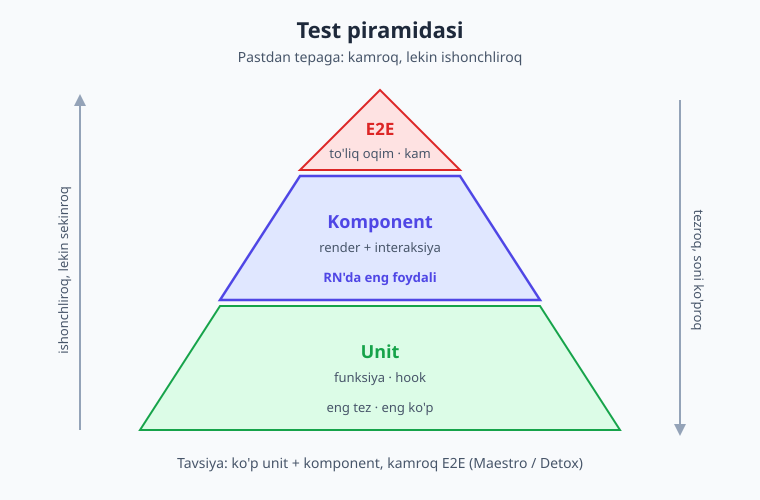
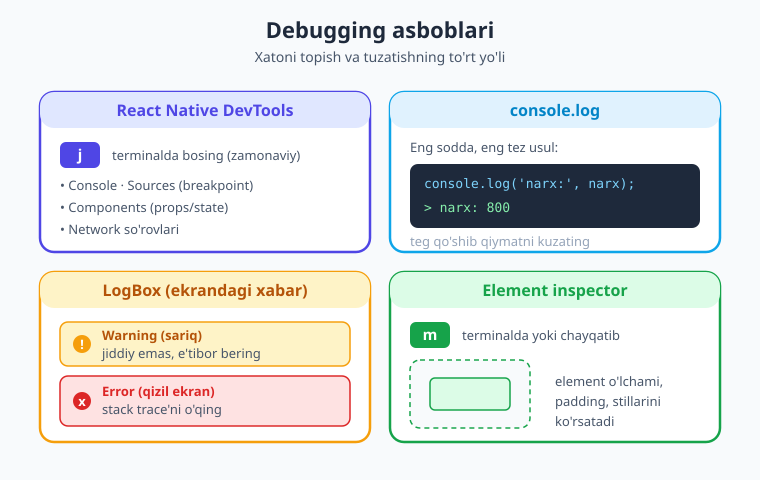
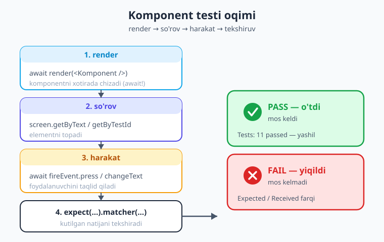

# 26 — Testlash va debugging

[⬅️ Oldingi: 25 — Autentifikatsiya](./25-autentifikatsiya.md) · [🏠 Kitob boshi](./README.md) · [Keyingi: 27 — Performance, New Architecture va deploy ➡️](./27-performance-build-deploy.md)

> **Bu bobda:** Ilovangiz o'sgani sayin har bir ekranni qo'lda bosib tekshirish charchatadi va xatolarni o'tkazib yuboradi. Shu muammoni hal qiladigan **avtomatik testlar**ni o'rganamiz: oddiy funksiya testidan tortib komponent, hodisa, async va custom hook testlarigacha. `jest-expo` va `@testing-library/react-native` bilan ishlaymiz. Keyin esa xato topishning ikkinchi tomonini — **debugging** (xatoni qidirib tuzatish) asboblarini ko'rib chiqamiz: React Native DevTools, `console.log`, LogBox va element inspector.

---

## Nega test yozamiz?

Tasavvur qiling, siz onlayn-do'kon ilovasini yozyapsiz. Bugun savatchaga mahsulot qo'shish ishlaydi. Ertaga siz narx hisoblash kodini o'zgartirasiz — va sezmagan holda savatcha jami summasi buzilib qoladi. Buni qachon bilib qolasiz? Foydalanuvchi shikoyat qilganda. Ya'ni juda kech.

Endi tasavvur qiling: har safar kod o'zgartirganingizda **kompyuter o'zi** savatchani sinab ko'radi, summani tekshiradi va "hammasi joyida" yoki "summa buzildi!" deb aytadi. Mana shu — **avtomatik test**.

> **Hayotiy o'xshatish.** Test — bu zavoddagi **sifat nazoratchisi** kabi. Konveyerda har bir mahsulot chiqishidan oldin nazoratchi uni tekshiradi: o'lchami to'g'rimi, ishlayaptimi, sinmaganmi. Siz uxlab yotganingizda ham nazoratchi ishlaydi — har bir "mahsulot" (kod o'zgarishi) standartga mos kelishini kafolatlaydi. Qo'lda har birini tekshirsangiz, charchaysiz va o'tkazib yuborasiz; nazoratchi esa hech qachon zerikmaydi va e'tibordan chetda qoldirmaydi.

Test yozishning aniq foydalari:

- **Ishonch.** Kodni o'zgartirib, "buzmadimmi?" deb qo'rqmaysiz. Testlar yashil bo'lsa — ishlaydi.
- **Regress himoyasi.** "Regress" — ilgari ishlagan narsaning yangi o'zgarishdan keyin buzilishi. Test buni darhol ushlaydi. Bir marta tuzatilgan xato qaytib kelsa, test "qizil" bo'ladi.
- **Hujjat.** Yaxshi yozilgan test — kodning qanday ishlashi haqidagi tirik misol. Yangi dasturchi testni o'qib, funksiya nima qilishini tushunadi.
- **Yaxshi dizayn.** Testlash oson kod — odatda toza, ajratilgan kod. Test yozish qiyin bo'lsa, ko'pincha kod tuzilishida muammo bor.

!!! tip "Maslahat"
    Boshlovchilar ko'pincha "test keyin yozaman" deb qoldiradi. Lekin eng katta foyda — kichik, ko'p ishlatiladigan qismlarga (narx hisoblash, validatsiya, asosiy tugma) test yozishdan boshlanadi. 100% qamrov shart emas; **muhim joylarni** himoya qiling.

---

## Test piramidasi: qaysi testdan qancha?

Hamma testlar bir xil emas. Ular tezligi, ishonchliligi va narxi bo'yicha farq qiladi. Buni odatda **piramida** ko'rinishida tasvirlashadi.



**1. Unit (birlik) testlar — eng pastki, eng keng qatlam.**
Bitta funksiya yoki bitta hookni alohida, izolyatsiyada sinaydi. Masalan: "chegirma narxini hisoblovchi funksiya to'g'ri ishlaydimi?". Ular **juda tez** (millisekundlar) va **juda ishonchli**. Shuning uchun ulardan ko'p yozasiz.

**2. Komponent (integratsiya) testlar — o'rta qatlam.**
Bir komponentni render qilib (chizib), u bilan foydalanuvchidek muloqot qiladi: tugma bosadi, matn kiritadi, natijani tekshiradi. **React Native'da aynan shu qatlam eng foydali** — chunki UI komponentlari ilovaning yuragi, va ularni tekshirish real foydalanuvchi tajribasiga eng yaqin.

**3. E2E (end-to-end, "uchidan uchigacha") testlar — eng tepa, eng kam qatlam.**
Haqiqiy qurilma yoki emulyatorda ilovani to'liq ishga tushirib, butun oqimni sinaydi: "login qil → mahsulot qo'sh → buyurtma ber". Ular **eng ishonchli** (haqiqiy ilovani sinaydi), lekin **eng sekin va eng nozik** (tarmoq, animatsiya tufayli ba'zan sababsiz yiqiladi). Shuning uchun ulardan ozgina, faqat eng muhim oqimlar uchun yoziladi.

!!! note "Eslatma"
    E2E uchun React Native dunyosida ikkita asosiy vosita bor: **Maestro** (sodda, YAML-ga asoslangan, boshlovchiga qulay) va **Detox** (kuchli, kod bilan yoziladi). Bu bobda biz piramidaning **pastki va o'rta** qatlamlariga (unit + komponent) e'tibor qaratamiz — chunki ular tezroq qaytim beradi va kundalik ishda eng ko'p qo'l keladi.

---

## Sozlash: jest-expo va Testing Library

Test yozish uchun bizga ikkita asosiy vosita kerak:

1. **Jest** — Facebook (Meta) yaratgan test "yuguruvchisi" (test runner). U testlarni topadi, ishga tushiradi va natijani ko'rsatadi. `jest-expo` esa — Jest'ni Expo/React Native muhitiga moslab sozlangan **preset** (tayyor sozlama to'plami).
2. **`@testing-library/react-native`** (qisqacha **RNTL**) — komponentlarni render qilib, ular bilan foydalanuvchidek muloqot qilish uchun. Uning falsafasi: "**foydalanuvchi ko'rgan narsani sinang**, ichki kod tafsilotini emas".

O'rnatish:

```bash
npx expo install -- --save-dev jest-expo jest @testing-library/react-native
```

Keyin `package.json` ga Jest preset'ini qo'shamiz:

```json
{
  "scripts": {
    "test": "jest"
  },
  "jest": {
    "preset": "jest-expo"
  }
}
```

Endi terminalda testlarni shunday ishga tushirasiz:

```bash
npm test                 # bir marta hamma testni yuguritadi
npm test -- --watch      # fayl o'zgarganda avtomatik qayta yuguritadi
```

Jest fayl nomi `.test.ts` / `.test.tsx` bilan tugaydigan yoki `__tests__/` papkasidagi fayllarni avtomatik topadi.

!!! warning "Ehtiyot bo'ling — versiya muhim!"
    Bu bob jonli loyihada **jest-expo 56** va **`@testing-library/react-native` 14** bilan tekshirilgan. RNTL 14 — **katta yangilanish**: undagi `render`, `fireEvent`, `renderHook` funksiyalari endi **asinxron** (Promise qaytaradi) va ularni **`await` qilish SHART**. Bu eski kodlardan (v12 va undan oldin) jiddiy farq. Quyida buni har joyda ko'rasiz — agar testingiz "render function has not been called" desa, demak `await` qo'yishni unutgansiz.

---

## Birinchi test: oddiy funksiya

Eng oddiy testdan boshlaymiz — hech qanday UI yo'q, faqat sof funksiya. Bu **unit test**ning klassik namunasi.

Aytaylik, narxdan chegirma hisoblaydigan kichik funksiyamiz bor:

```ts
// narx.ts
export function chegirmaNarxi(narx: number, foiz: number): number {
  if (foiz < 0 || foiz > 100) {
    throw new Error('Foiz 0 va 100 oralig\'ida bo\'lishi kerak');
  }
  return Math.round(narx - (narx * foiz) / 100);
}
```

Endi shu funksiya yonida `narx.test.ts` faylini yaratamiz:

```ts
// narx.test.ts
import { chegirmaNarxi } from './narx';

describe('chegirmaNarxi', () => {
  it('20% chegirmani to\'g\'ri hisoblaydi', () => {
    expect(chegirmaNarxi(1000, 20)).toBe(800);
  });

  it('0% chegirmada narx o\'zgarmaydi', () => {
    expect(chegirmaNarxi(1000, 0)).toBe(1000);
  });

  it('noto\'g\'ri foizda xato beradi', () => {
    expect(() => chegirmaNarxi(1000, 150)).toThrow();
  });
});
```

Bu yerda uchta yangi atama bor — ularni eslab qoling, ular **butun test dunyosining alifbosi**:

- **`describe('nom', () => {...})`** — bir-biriga bog'liq testlarni guruhlaydi (xuddi kitobdagi bo'lim sarlavhasi kabi).
- **`it('tavsif', () => {...})`** — bitta aniq testni e'lon qiladi. Tavsif odatdagi gap kabi o'qilishi kerak: *"it kiritilgan 20% chegirmani to'g'ri hisoblaydi"*. (`test(...)` ham xuddi shu, ikkalasi bir xil.)
- **`expect(qiymat).matcher(...)`** — kutilgan natijani tekshiradi. `expect` — "men kutaman", `.toBe(800)` — "bu aynan 800 bo'lishini" degani.

Eng ko'p ishlatiladigan **matcher**lar (tekshiruvchilar):

| Matcher | Ma'nosi |
|---|---|
| `.toBe(x)` | aynan teng (sonlar, satrlar uchun) |
| `.toEqual(obj)` | obyekt/massivlar ichki teng |
| `.toBeNull()` / `.toBeTruthy()` | null / "rost" qiymat |
| `.toThrow()` | funksiya xato tashlaydimi |
| `.toContain(x)` | massiv/satr ichida bormi |
| `.toHaveBeenCalledWith(x)` | mock shu argument bilan chaqirilganmi |

!!! example "Misol"
    Yuqoridagi `narx.test.ts` jonli Expo loyihasida ishga tushirilib, **uchta test ham xatosiz o'tdi**. `npm test` natijasi: `✓ 20% chegirmani to'g'ri hisoblaydi`, `✓ 0% chegirmada narx o'zgarmaydi`, `✓ noto'g'ri foizda xato beradi`.

---

## Komponent test: render va so'rovlar

Endi qiziqroq qismga o'tamiz — **komponentni** sinash. Bu uchun Testing Library'ning to'rtta asosiy quroli bor:

```tsx
import { render, screen, fireEvent } from '@testing-library/react-native';
```

- **`render(<Komponent />)`** — komponentni **xotirada** chizadi (haqiqiy ekran kerak emas). RNTL 14'da bu **asinxron** — `await render(...)`.
- **`screen`** — eng oxirgi render qilingan natijaga ulanish. Undan elementlarni qidirasiz.
- **`fireEvent`** — foydalanuvchi harakatini taqlid qiladi (bosish, matn kiritish).

`screen` orqali elementlarni topishning bir nechta usuli bor. Eng ko'p ishlatiladiganlari:

```tsx
screen.getByText('Salom')              // matn bo'yicha topadi
screen.getByPlaceholderText('Ism')     // input placeholder bo'yicha
screen.getByTestId('natija')           // testID prop bo'yicha
screen.queryByText('Yo\'q')            // topilmasa null qaytaradi (xato tashlamaydi)
screen.findByText('Yuklandi')          // KUTADI — async (Promise qaytaradi)
```

Uch xil prefiksning farqini yodda tuting — bu eng ko'p adashtiradigan joy:

- **`getBy...`** — element **bo'lishi shart**. Topilmasa, darhol xato beradi (test yiqiladi).
- **`queryBy...`** — element **bo'lmasligini** tekshirish uchun. Topilmasa `null` qaytaradi, xato bermaydi. ("Bu matn ekranda **yo'qligini** isbotlamoqchiman" — `queryBy` ishlating.)
- **`findBy...`** — element **keyinroq paydo bo'ladi** (masalan API javobidan keyin). U biroz **kutadi** va Promise qaytaradi, shuning uchun `await` bilan.

!!! tip "testID — testning 'tutqichi'"
    Ko'pincha matn bo'yicha topish noaniq bo'ladi (bir xil matn ikki joyda). Shunda komponentga `testID="natija"` propini qo'shing va `getByTestId('natija')` bilan aniq topib oling. `testID` — faqat test uchun, foydalanuvchiga ko'rinmaydi. Lekin uni me'yorida ishlating: imkon bo'lsa, foydalanuvchi **ko'radigan** narsa (matn, rol) bo'yicha qidirish afzal.

---

## Hodisa va holat testi: counter

Endi haqiqiy o'zaro ta'sirni sinaymiz. Mana oddiy "hisoblagich" (counter) komponenti — tugma bosilganda son oshadi:

```tsx
// Hisoblagich.tsx
import { View, Text, Pressable, StyleSheet } from 'react-native';
import { useState } from 'react';

export default function Hisoblagich() {
  const [soni, setSoni] = useState(0);
  return (
    <View style={styles.box}>
      <Text testID="natija">Hisob: {soni}</Text>
      <Pressable onPress={() => setSoni(soni + 1)}>
        <Text>Oshirish</Text>
      </Pressable>
    </View>
  );
}

const styles = StyleSheet.create({
  box: { alignItems: 'center', gap: 8 },
});
```

Test esa foydalanuvchini taqlid qiladi: tugmani ikki marta bosadi va sonni tekshiradi.

```tsx
// Hisoblagich.test.tsx
import { render, screen, fireEvent } from '@testing-library/react-native';
import Hisoblagich from './Hisoblagich';

describe('<Hisoblagich />', () => {
  it('boshida 0 ni ko\'rsatadi', async () => {
    await render(<Hisoblagich />);
    expect(screen.getByText('Hisob: 0')).toBeOnTheScreen();
  });

  it('tugma bosilganda son oshadi', async () => {
    await render(<Hisoblagich />);
    await fireEvent.press(screen.getByText('Oshirish'));
    await fireEvent.press(screen.getByText('Oshirish'));
    expect(screen.getByTestId('natija')).toHaveTextContent('Hisob: 2');
  });
});
```

Bu yerda nima bo'lyapti, qadam-baqadam:

1. `await render(<Hisoblagich />)` — komponentni xotirada chizdik.
2. `await fireEvent.press(...)` — "Oshirish" matnli elementni **bosdik** (ikki marta). `fireEvent.press` ham async — `await` qilamiz.
3. `expect(screen.getByTestId('natija')).toHaveTextContent('Hisob: 2')` — `testID="natija"` bo'lgan elementning ichida `Hisob: 2` borligini tekshirdik.

`fireEvent`ning eng ko'p ishlatiladigan turlari:

- `fireEvent.press(element)` — bosish (`onPress`).
- `fireEvent.changeText(input, 'matn')` — inputga matn yozish (`onChangeText`).
- `fireEvent(element, 'scroll', {...})` — boshqa istalgan hodisa.

!!! example "Misol"
    Bu test jonli loyihada ishlatildi va o'tdi: `✓ boshida 0 ni ko'rsatadi`, `✓ tugma bosilganda son oshadi`. Ikkita `press` dan keyin holat haqiqatan `2` ga yetdi.

> **Eslatma — RNTL'ning oltin qoidasi.** `toBeOnTheScreen()`, `toHaveTextContent()` kabi maxsus matcherlar (matchers) `@testing-library/react-native` o'rnatilganda **avtomatik** qo'shiladi. Ular faqat React Native elementlarida ishlaydi. Eski kodlarda `@testing-library/jest-native` alohida o'rnatilardi — endi kerak emas, hammasi RNTL ichida.

---

## Input testi: matn kiritish

Inputni sinash — formali ilovalarda eng ko'p uchraydigan vazifa. Mana foydalanuvchi ism kiritganda salomlashadigan komponent:

```tsx
// Salomlash.tsx
import { View, Text, TextInput } from 'react-native';
import { useState } from 'react';

export default function Salomlash() {
  const [ism, setIsm] = useState('');
  return (
    <View>
      <TextInput placeholder="Ismingiz" value={ism} onChangeText={setIsm} />
      {ism.length > 0 && <Text>Salom, {ism}!</Text>}
    </View>
  );
}
```

Diqqat: salom matni faqat ism kiritilgandagina ko'rinadi. Buni tekshiramiz:

```tsx
// Salomlash.test.tsx
import { render, screen, fireEvent } from '@testing-library/react-native';
import Salomlash from './Salomlash';

describe('<Salomlash />', () => {
  it('boshida salom matni yo\'q', async () => {
    await render(<Salomlash />);
    expect(screen.queryByText(/Salom/)).toBeNull();   // queryBy — yo'qligini tekshiramiz
  });

  it('matn kiritilganda salomlashadi', async () => {
    await render(<Salomlash />);
    await fireEvent.changeText(screen.getByPlaceholderText('Ismingiz'), 'Olim');
    expect(screen.getByText('Salom, Olim!')).toBeOnTheScreen();
  });
});
```

E'tibor bering: boshida salom matni **yo'qligini** tekshirish uchun `queryByText` ishlatdik (`getByText` bo'lsa, topa olmay xato berardi). Bu — "yo'qlikni isbotlash" uslubining klassik namunasi. `/Salom/` — regulyar ifoda; "Salom" so'zi qaysidir matn ichida bormi degani.

---

## Async test: API mock qilish

Haqiqiy ilovalar serverdan ma'lumot oladi. Lekin testda **haqiqiy serverga chiqib bo'lmaydi** — sekin, ishonchsiz, internet kerak. Yechim: **mock** (soxta versiya). Biz `fetch`ni o'z nazoratimizdagi soxta funksiya bilan almashtiramiz, va u istalgan ma'lumotni **darhol** qaytaradi.

> **Hayotiy o'xshatish.** Mock — kino suratga olishdagi **kaskadyor-dublyor** kabi. Asl aktyorni xavfli sahnada ishlatmaysiz — uni juda o'xshash dublyor bilan almashtirasiz. Test ham haqiqiy serverga "tegmaydi": u o'rniga oldindan tayyorlangan javob beradigan **dublyor `fetch`**ni qo'yadi. Shunda test tez, barqaror va internetga bog'liq emas.

Avval API'dan foydalanuvchini yuklaydigan komponent:

```tsx
// Profil.tsx
import { View, Text, ActivityIndicator } from 'react-native';
import { useFoydalanuvchi } from './useFoydalanuvchi';

export default function Profil({ id }: { id: number }) {
  const { data, yuklanmoqda } = useFoydalanuvchi(id);
  if (yuklanmoqda) {
    return <ActivityIndicator testID="spinner" />;
  }
  return (
    <View>
      <Text>Ism: {data?.ism}</Text>
    </View>
  );
}
```

Endi test — `fetch`ni mock qilamiz:

```tsx
// Profil.test.tsx
import { render, screen } from '@testing-library/react-native';
import Profil from './Profil';

beforeEach(() => {
  // global fetch ni soxta funksiya bilan almashtiramiz
  global.fetch = jest.fn(() =>
    Promise.resolve({
      json: () => Promise.resolve({ id: 1, ism: 'Olim' }),
    })
  ) as jest.Mock;
});

afterEach(() => jest.restoreAllMocks());   // har testdan keyin asl holatga qaytaramiz

describe('<Profil />', () => {
  it('yuklangach foydalanuvchi ismini ko\'rsatadi', async () => {
    await render(<Profil id={1} />);
    // findByText yuklanishni KUTADI (Promise qaytaradi)
    expect(await screen.findByText('Ism: Olim')).toBeOnTheScreen();
  });
});
```

Bu yerda yangi tushunchalar:

- **`jest.fn(() => ...)`** — soxta funksiya yaratadi. U haqiqiy `fetch` o'rniga turadi va biz aytgan qiymatni qaytaradi.
- **`beforeEach` / `afterEach`** — har testdan **oldin** va **keyin** ishlaydigan tayyorgarlik/tozalash kodi. `beforeEach`da mockni o'rnatamiz, `afterEach`da `jest.restoreAllMocks()` bilan tozalaymiz (aks holda mock keyingi testlarga ham ta'sir qiladi).
- **`findByText`** — `getByText`dan farqli, u ma'lumot kelishini **kutadi**. API javobi (mock bo'lsa ham) keyingi "tik"da keladi, shuning uchun `await` shart.

!!! warning "Ehtiyot bo'ling: yuklanish holati tezda o'tib ketadi"
    RNTL 14'da `await render(...)` o'zining ichida `act()` ni chaqiradi — ya'ni effektlar (`useEffect`) **darhol** ishlab ulguradi. Shuning uchun mock `fetch` zudlik bilan javob bersa, `await render` qaytganida `<ActivityIndicator>` (yuklanish spinneri) **allaqachon yo'qolgan** bo'ladi. Demak "avval spinner, keyin matn" degan testlar mock bilan ishonchsiz. **To'g'ri yondashuv:** yakuniy natijani `findByText` bilan tekshiring (yuqoridagidek). Bu nuanceni biz jonli loyihada o'z ko'zimiz bilan ko'rdik — `getByTestId('spinner')` mock tezda javob bergani uchun topa olmadi.

---

## Custom hook testi: renderHook va waitFor

13-bobda custom hook (`useXxx`) yozishni o'rgangandik. Hookni alohida sinash uchun maxsus vosita bor — **`renderHook`**. U hookni soxta komponent ichida ishga tushiradi va natijasini beradi.

Avval yuqorida `<Profil>` ishlatgan hookning o'zi:

```ts
// useFoydalanuvchi.ts
import { useState, useEffect } from 'react';

type Foydalanuvchi = { id: number; ism: string };

export function useFoydalanuvchi(id: number) {
  const [data, setData] = useState<Foydalanuvchi | null>(null);
  const [yuklanmoqda, setYuklanmoqda] = useState(true);

  useEffect(() => {
    let bekorQilindi = false;
    fetch(`https://api.example.com/users/${id}`)
      .then((r) => r.json())
      .then((j: Foydalanuvchi) => {
        if (!bekorQilindi) {
          setData(j);
          setYuklanmoqda(false);
        }
      });
    return () => {
      bekorQilindi = true;   // tozalash: komponent o'chsa, holatni o'zgartirmaymiz
    };
  }, [id]);

  return { data, yuklanmoqda };
}
```

Test:

```ts
// useFoydalanuvchi.test.ts
import { renderHook, waitFor } from '@testing-library/react-native';
import { useFoydalanuvchi } from './useFoydalanuvchi';

beforeEach(() => {
  global.fetch = jest.fn(() =>
    Promise.resolve({
      json: () => Promise.resolve({ id: 1, ism: 'Olim' }),
    })
  ) as jest.Mock;
});

afterEach(() => jest.restoreAllMocks());

describe('useFoydalanuvchi', () => {
  it('yuklangach data ni qaytaradi', async () => {
    const { result } = await renderHook(() => useFoydalanuvchi(1));
    // yuklanish tugashini kutamiz
    await waitFor(() => {
      expect(result.current.yuklanmoqda).toBe(false);
    });
    expect(result.current.data).toEqual({ id: 1, ism: 'Olim' });
  });

  it('to\'g\'ri manzilga so\'rov yuboradi', async () => {
    await renderHook(() => useFoydalanuvchi(7));
    expect(global.fetch).toHaveBeenCalledWith('https://api.example.com/users/7');
  });
});
```

Muhim tushunchalar:

- **`renderHook(() => useXxx(...))`** — hookni ishga tushiradi. RNTL 14'da bu ham **async** — `await` qiling.
- **`result.current`** — hookning eng oxirgi qaytargan qiymati. Holat o'zgargach, `result.current` yangilanadi.
- **`waitFor(() => {...})`** — ichidagi `expect` o'tguncha qayta-qayta tekshirib **kutadi**. Async holat o'zgarishini kutish uchun ishlatiladi. Vaqt tugasa (default ~1 soniya) test yiqiladi.
- **`toHaveBeenCalledWith(...)`** — mock funksiya aynan shu argument bilan chaqirilganmi. Ikkinchi test `id=7` uchun manzil to'g'ri qurilganini tekshiradi.

!!! example "Misol"
    Bu hook testi jonli loyihada `jest-expo` bilan ishga tushirilib o'tdi: `✓ yuklangach data ni qaytaradi`, `✓ to'g'ri manzilga so'rov yuboradi`. `waitFor` yuklanish tugashini kutdi va `result.current.data` to'g'ri obyektni qaytardi.

---

## Snapshot testi (qisqacha)

**Snapshot** ("oniy surat") testi — komponentning chiqishini matn ko'rinishida **suratga olib**, faylga saqlaydi. Keyingi safar test komponentni qayta chizib, eski surat bilan solishtiradi. Agar farq bo'lsa — test ogohlantiradi.

```tsx
// Snapshot.test.tsx
import { render, screen } from '@testing-library/react-native';
import Hisoblagich from './Hisoblagich';

it('chiqishi o\'zgarmaganini tekshiradi', async () => {
  await render(<Hisoblagich />);
  expect(screen.toJSON()).toMatchSnapshot();
});
```

Birinchi yuguritishda Jest `__snapshots__/` papkasida `.snap` faylini **yaratadi**. Keyingisida — solishtiradi. UI'ni ataylab o'zgartirsangiz, `npm test -- -u` bilan snapshotni yangilaysiz.

!!! tip "Snapshot — ehtiyotkorlik bilan"
    Snapshot oson, lekin haddan ko'p ishlatmang. Katta komponentning butun strukturasini "muzlatib" qo'ysangiz, har kichik o'zgarishda test "qizil" bo'ladi va odamlar `-u` bilan ko'r-ko'rona yangilashga o'rganadi — bu testning ma'nosini yo'qotadi. **Maslahat:** snapshotni kichik, barqaror komponentlarga ishlating; mantiqni esa yuqoridagi aniq `expect`'lar bilan sinang. (Biz snapshotni `<Hisoblagich>`ning **boshlang'ich** holatida — sinxron, barqaror — ishlatdik, async `<Profil>`da emas.)

---

## Debugging: xatoni qidirib tuzatish

Test — xatoning oldini olish. **Debugging** esa — paydo bo'lib qolgan xatoni topib tuzatish. React Native'da buning uchun bir nechta kuchli asbob bor.



### 1. React Native DevTools — zamonaviy asosiy vosita

Dev serverda (`npx expo start`) terminalda **`j`** tugmasini bossangiz, **React Native DevTools** ochiladi. Bu Chrome DevTools'ga asoslangan zamonaviy debugger (Hermes dvigeli uchun). Imkoniyatlari:

- **Console** — `console.log` chiqishlari, xatolar.
- **Sources** — kodga **breakpoint** (to'xtash nuqtasi) qo'yib, qator-qator yurish, o'zgaruvchilarni ko'rish.
- **Components** (React DevTools) — komponentlar daraxti, har birining props/state qiymati.
- **Network** — yuborilgan tarmoq so'rovlari va javoblari.

!!! note "Eski debugger endi tarixda"
    Ilgari "Remote JS Debugging" (`d` → Debug) ishlatilardi — u endi eskirgan. Hozir **React Native DevTools** (`j`) rasmiy va tavsiya etilgan yo'l. New Architecture + Hermes bilan u to'liq ishlaydi.

### 2. console.log — eng sodda, eng tez

Eng oddiy, lekin baribir foydali usul — kerakli joyga `console.log` qo'yib, qiymatni terminalda yoki DevTools console'da ko'rish:

```tsx
function hisobla(narx: number, foiz: number) {
  console.log('hisobla chaqirildi:', { narx, foiz });   // qiymatlarni ko'ramiz
  const natija = narx - (narx * foiz) / 100;
  console.log('natija:', natija);
  return natija;
}
```

Obyektlar uchun `console.log('teg:', obyekt)` ko'rinishida teg qo'shsangiz, qaysi log ekanini osongina topasiz. Faqat **production**ga (do'konga) chiqarishdan oldin loglarni tozalashni unutmang.

### 3. LogBox — ekrandagi sariq va qizil ogohlantirishlar

Development rejimida ilova ichida xatolar avtomatik ko'rsatiladi:

- **Sariq quti (warning)** — jiddiy emas, lekin e'tibor bering (masalan "har element uchun noyob `key` yo'q").
- **Qizil ekran (error)** — jiddiy xato, ilova ishlamayapti. To'liq xabar va stack trace (xato qaysi qatordan kelganini ko'rsatuvchi zanjir) chiqadi.

Qizil ekranni **diqqat bilan o'qing** — pastdagi stack ko'pincha aynan sizning faylingiz va qatoringizni ko'rsatadi.

### 4. Element inspector

Terminalda **`m`** (yoki qurilmada chayqatish → "Toggle Element Inspector") bilan inspektorni yoqasiz. Keyin ekrandagi istalgan elementga bossangiz — uning o'lchami, paddingi, stillari ko'rinadi. Layout muammosini ("nega bu quti shu yerda?") topishda ajoyib yordam beradi.

---

## Keng tarqalgan xatolar va ularning sababi

React Native'da boshlovchilar deyarli har doim shu uchta xatoga duch keladi:

!!! danger "1. Text strings must be rendered within a `<Text>` component"
    Eng mashhur xato. Matnni `<View>` ichiga to'g'ridan-to'g'ri qo'yib bo'lmaydi — u **albatta** `<Text>` ichida bo'lishi kerak.

    ```tsx
    <View>Salom</View>              // ❌ XATO — qizil ekran
    <View><Text>Salom</Text></View> // ✅ to'g'ri
    ```

    Ko'pincha bu shartli renderda yashirinadi: `{soni && <Komponent />}` — agar `soni` `0` bo'lsa, RN ekranga `0` matnini chizmoqchi bo'ladi va xato beradi! Yechim: `{soni > 0 && <Komponent />}` yoki `{!!soni && ...}`.

!!! danger "2. undefined is not an object (evaluating 'x.y')"
    `x` qiymati `undefined` ekanida uning ichidagi `y`ga murojaat qildingiz. Odatda API javobi hali kelmaganda yuz beradi: `data.ism` — lekin `data` hali `null`. Yechim: ixtiyoriy zanjir (optional chaining) — `data?.ism`, yoki yuklanish holatini tekshirish (`if (yuklanmoqda) return ...`).

!!! danger "3. Native/ko'prik xatolari"
    "Native module cannot be null" yoki shunga o'xshash xabar — odatda yangi native paket o'rnatib, ilovani **qayta build qilmaganingizda** chiqadi. Yechim: dev serverni to'xtatib, `npx expo start -c` (kesh tozalash) bilan qayta ishga tushiring; kerak bo'lsa dev build'ni qayta yarating. Bu xatolar JS xatosi emas — kodni emas, **build/o'rnatishni** tekshiring.

> **Eslatma.** Debugging — sehr emas, **tartibli izlash**. Avval xato xabarini to'liq o'qing. Keyin "qaysi o'zgartirishdan keyin buzildi?" deb so'rang. Kerakli joyga `console.log` qo'ying yoki breakpoint bilan to'xtab, qiymatlarni ko'ring. Muammoni **bo'lib-bo'lib** torayting — bu eng kuchli ko'nikma.

---

## Test ishlash oqimi: yashildan qizilgacha

Quyidagi diagrammada bitta komponent testining to'liq yo'li tasvirlangan — renderdan tortib natijagacha.



To'liq oqim shunday: **render** (komponentni chizish) → **so'rov** (`getByText`/`getByTestId` bilan element topish) → **harakat** (`fireEvent.press`/`changeText`) → **tekshiruv** (`expect(...).matcher(...)`). Agar tekshiruv mos kelsa — **yashil** (test o'tdi); mos kelmasa — **qizil** (yiqildi, va Jest farqni ko'rsatadi).

!!! example "Hammasi birga: jonli verifikatsiya"
    Ushbu bobning barcha kod misollari — util test, counter, input, async mock, custom hook, snapshot — **haqiqiy Expo loyihasida** `jest-expo` + `@testing-library/react-native` 14 bilan o'rnatilib ishlatildi. Yakuniy natija: **6 ta test fayli, 11 ta test — hammasi o'tdi (`Tests: 11 passed`)**, snapshot esa ikkinchi yuguritishda eskisiga mos keldi. Demak misollardagi `async/await` namunalari aynan ishlaydigan kod.

---

## Xulosa

- **Test = avtomatik sifat nazoratchisi.** U regressni (ilgari ishlagan narsaning buzilishini) darhol ushlaydi, kodni o'zgartirishga ishonch beradi va tirik hujjat bo'lib xizmat qiladi.
- **Test piramidasi:** pastda ko'p **unit** (funksiya/hook, tez), o'rtada **komponent** testlar (React Native'da eng foydali qatlam), tepada kam **E2E** (Maestro/Detox, sekin lekin ishonchli).
- **Sozlash:** `jest-expo` preset (`package.json` → `"preset": "jest-expo"`) + `@testing-library/react-native`. `npm test` bilan yuguritasiz; maxsus matcherlar RNTL bilan avtomatik keladi.
- **Asoslar:** `describe`/`it`/`expect` + matcherlar (`toBe`, `toEqual`, `toThrow`). Komponent uchun `render` → `screen` so'rovlari (`getBy`/`queryBy`/`findBy`) → `fireEvent` (`press`/`changeText`) → `expect`.
- **`getBy` vs `queryBy` vs `findBy`:** `getBy` — bo'lishi shart; `queryBy` — yo'qligini tekshirish (null); `findBy` — keyin paydo bo'ladigan element (async, `await`).
- **RNTL 14 — async!** `render`, `fireEvent`, `renderHook` endi Promise qaytaradi va `await` qilinadi. Mock `fetch` tezda javob bergani uchun boshlang'ich yuklanish holati `await render`dan keyin ko'rinmasligi mumkin — yakuniy natijani `findBy`/`waitFor` bilan tekshiring.
- **Async va hook:** API'ni `jest.fn()` bilan **mock** qiling (`beforeEach`/`afterEach` bilan tozalang); `findByText` va `waitFor` natijani kutadi; `renderHook` + `result.current` bilan custom hook sinaladi.
- **Debugging:** zamonaviy **React Native DevTools** (terminalda `j` — console, breakpoint, Components, Network), tezkor `console.log`, ekrandagi **LogBox** (sariq warning / qizil error), `m` bilan **element inspector**. Eng ko'p uchraydigan xatolar: "Text must be in `<Text>`", "undefined is not an object" (`?.` bilan yeching), native/build xatolari (`expo start -c`).

---

## Amaliy mashqlar

1. **Counter testi (oson).** Yangi `Hisoblagich` komponentiga "Kamaytirish" tugmasini qo'shing. Test yozing: ikki marta oshirib, bir marta kamaytirgach `Hisob: 1` chiqishini tekshiring. *Yo'naltirish:* `await fireEvent.press(...)` ni uch marta chaqiring, har bir tugmani matni bo'yicha toping, `getByTestId('natija')` ni `toHaveTextContent` bilan tekshiring.

2. **Input testi (oson).** Parol kiritish komponentini yozing: parol 6 belgidan qisqa bo'lsa "Juda qisqa" matnini ko'rsatsin. Test yozing: boshida xato matni **yo'qligini** (`queryByText`), "abc" kiritilganda **paydo bo'lishini** (`getByText`) tekshiring. *Yo'naltirish:* `fireEvent.changeText(getByPlaceholderText('Parol'), 'abc')`.

3. **Async mock (o'rta).** Berilgan shahar uchun ob-havoni yuklaydigan komponent yozing. Testda `global.fetch` ni `jest.fn` bilan mock qiling va `{ harorat: 25 }` qaytarsin. `findByText('25°')` bilan natijani tekshiring. *Yo'naltirish:* `beforeEach`da mockni o'rnating, `afterEach`da `jest.restoreAllMocks()`; `await render` dan keyin `findByText` ishlating.

4. **Hook testi (o'rta).** `useHisoblagich(boshlangich)` custom hookini yozing — `soni`, `oshir`, `kamaytir` qaytarsin. `renderHook` + `act` bilan test yozing: `oshir` chaqirilgach `soni` ortishini tekshiring. *Yo'naltirish:* holatni o'zgartiruvchi chaqiruvni `await act(async () => { result.current.oshir(); })` ichiga oling, keyin `result.current.soni` ni tekshiring (`act` ni `@testing-library/react-native` dan import qiling).

5. **Debugging mashqi (qiyin).** Ataylab xato kod yozing: `<View>{soni}</View>` (matn `<Text>` siz) yoki `data.ism` (`data` null bo'lganda). Ilovani ishga tushirib, LogBox/qizil ekran nima deyishini o'qing, React Native DevTools (`j`) ni oching va `console.log` bilan muammoni topib tuzating. *Yo'naltirish:* har xato uchun "qanday xabar chiqdi, qaysi qatorni ko'rsatdi, qanday tuzatdim" deb yozib boring — bu debugging ko'nikmasini mustahkamlaydi.

---

[⬅️ Oldingi: 25 — Autentifikatsiya](./25-autentifikatsiya.md) · [🏠 Kitob boshi](./README.md) · [Keyingi: 27 — Performance, New Architecture va deploy ➡️](./27-performance-build-deploy.md)
