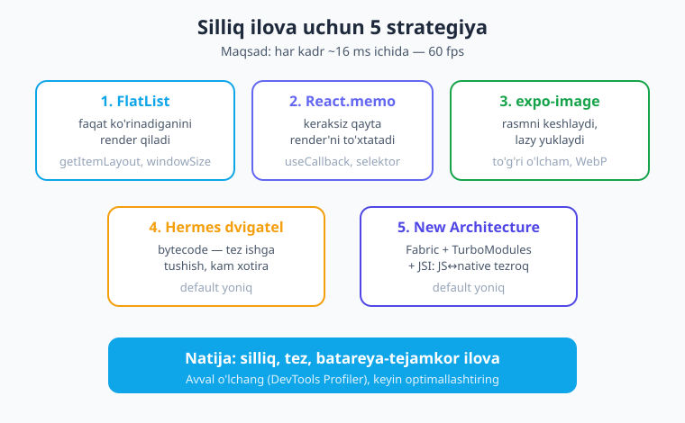
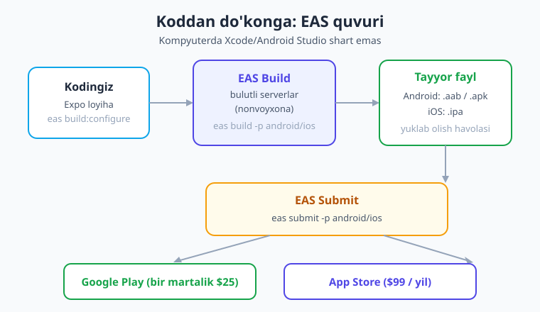
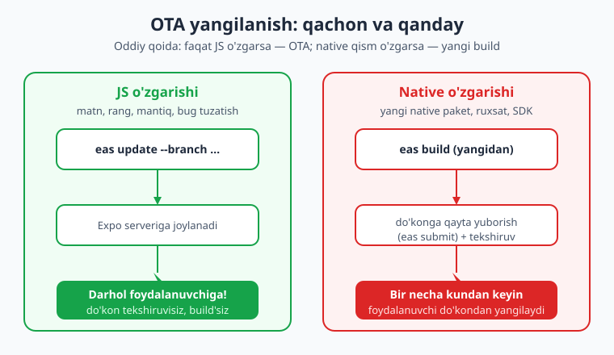

# 27 — Performance, New Architecture va deploy

[⬅️ Oldingi: 26 — Testlash va debugging](./26-testlash-debugging.md) · [🏠 Kitob boshi](./README.md) · [Keyingi: 28 — Yakuniy loyiha ➡️](./28-kapston-loyiha.md)

> **Bu bobda:** Ilovangiz tayyor — endi u **tez** ishlashi va foydalanuvchilarning telefoniga **yetib borishi** kerak. Avval ilovani silliq qiladigan performance (tezlik) usullarini o'rganamiz: `FlatList` optimizatsiyasi, keraksiz qayta render'ni kamaytirish, rasm keshlash va Hermes hamda New Architecture nima uchun ilovani tezroq qiladi. Keyin esa eng muhim qadamga o'tamiz — **EAS** yordamida ilovani bulutda yig'ish (`eas build`), do'konlarga yuborish (`eas submit`) va foydalanuvchilarga to'g'ridan-to'g'ri yangilanish jo'natish (`eas update` — OTA). Oxirida deploy uchun to'liq tekshiruv ro'yxati bilan yakunlaymiz.

---

## Nega tezlik mobil'da ayniqsa muhim

Tasavvur qiling: do'konga kirdingiz, lekin kassada navbat juda sekin harakatlanyapti. Bir-ikki daqiqada toqatingiz toqqa minadi va shunchaki chiqib ketasiz. Mobil ilovalar ham xuddi shunday — foydalanuvchi **sabrsiz**. Tugmani bossa, javob darhol kelishini kutadi. Ro'yxatni skroll qilsa, u **silliq** sirpanib ketishini istaydi. Agar ilova taqillab-tutilib ishlasa, foydalanuvchi sekundlar ichida uni yopadi va boshqa ochmaydi.

Shuning uchun bitta oltin qoida bor:

> **Sekin ilova = o'chirilgan ilova.** Foydalanuvchi sizning ilovangiz necha qator kod ekanini bilmaydi va bilishni ham xohlamaydi. U faqat bir narsani sezadi: ilova tez yoki sekin.

Mobil dasturlashda tezlik veb-saytdan ham muhimroq, chunki:

- **Qurilmalar har xil.** Hamma foydalanuvchida eng yangi, qimmat telefon yo'q. Ilovangiz uch yil avvalgi, kam quvvatli, kam xotirali telefonda ham silliq ishlashi kerak.
- **Batareya cheklangan.** Ortiqcha hisob-kitob, doimiy qayta render, og'ir animatsiya — bularning hammasi batareyani so'rib oladi. Batareyani tez tugatadigan ilovani odamlar tashlab yuboradi.
- **60 fps maqsadi.** Ekran soniyasiga 60 marta (ba'zi telefonlarda 120) yangilanadi. Har bir kadr (frame) chizilishiga atigi ~16 millisekund bor. Agar JavaScript shu vaqtga ulgurmasa, kadr "tushib qoladi" (dropped frame) va ko'z bu sakrashni "lag" (kechikish) deb sezadi.

> **Hayotiy o'xshatish.** 60 fps — bu kino lentasiga o'xshaydi: kadrlar yetarlicha tez almashsa, ko'z uzluksiz, silliq harakat ko'radi. Agar bir nechta kadr kechiksa, harakat "to'xtab-to'xtab" ko'rinadi — xuddi eski, shovqinli kino kabi. Bizning vazifamiz — har bir kadrni o'z vaqtida yetkazib berish.

Yaxshi xabar shuki, performance haqida **boshidan** o'ylash shart emas. Avval ishlaydigan ilova yozasiz, keyin sekin joylarni topib tuzatasiz. Quyida eng ko'p ta'sir beradigan usullardan boshlaymiz.



---

## A QISM — PERFORMANCE

### 1. FlatList'ni to'g'ri ishlatish (eng katta foyda)

8-bobda biz uzun ro'yxatlar uchun `ScrollView` emas, balki `FlatList` ishlatish kerakligini o'rgangan edik. Buni qisqacha eslaylik va keyin tezlashtirish sozlamalarini qo'shamiz.

> **Hayotiy o'xshatish.** `ScrollView` — bu kitobning **barcha** sahifalarini bir vaqtda stolga yoyib qo'yishga o'xshaydi: 1000 sahifa bo'lsa, 1000 sahifani birdaniga chizib qo'yasiz — joy ham, kuch ham ko'p ketadi. `FlatList` esa — kitobni o'qiyotgandek: faqat **ko'rinib turgan** sahifalarni ochasiz, qolganlarini esa kerak bo'lganda. Shuning uchun u uzun ro'yxatda ancha tejamkor.

`FlatList` ko'pchilik ishni o'zi qiladi, lekin uni yanada tezlashtiradigan bir nechta muhim props bor:

```tsx
// app/royxat.tsx — optimallashtirilgan FlatList
import { FlatList, View, Text, StyleSheet } from 'react-native';
import { memo, useCallback } from 'react';

type Mahsulot = { id: string; nomi: string; narxi: number };

// 1) Har bir element ALOHIDA, React.memo bilan o'ralgan komponent
const Element = memo(function Element({ item }: { item: Mahsulot }) {
  return (
    <View style={styles.qator}>
      <Text style={styles.nomi}>{item.nomi}</Text>
      <Text style={styles.narxi}>{item.narxi} so'm</Text>
    </View>
  );
});

export default function Royxat({ malumotlar }: { malumotlar: Mahsulot[] }) {
  // 2) renderItem va keyExtractor'ni useCallback bilan barqaror qilamiz
  const renderItem = useCallback(
    ({ item }: { item: Mahsulot }) => <Element item={item} />,
    []
  );
  const keyExtractor = useCallback((item: Mahsulot) => item.id, []);

  return (
    <FlatList
      data={malumotlar}
      renderItem={renderItem}
      keyExtractor={keyExtractor}
      // 3) Element balandligi BIR XIL bo'lsa — getItemLayout (eng kuchli sozlama)
      getItemLayout={(_, index) => ({
        length: 64,             // har bir qatorning balandligi (dp)
        offset: 64 * index,     // shu qator yuqoridan qancha uzoqda
        index,
      })}
      initialNumToRender={10}     // boshda nechta element chizilsin
      windowSize={5}              // ekran atrofida nechta "ekran" tayyor tursin
      removeClippedSubviews       // ko'rinmaydiganlarni xotiradan chiqar (Android'da samarali)
    />
  );
}

const styles = StyleSheet.create({
  qator: { height: 64, justifyContent: 'center', paddingHorizontal: 16, borderBottomWidth: 1, borderBottomColor: '#e2e8f0' },
  nomi: { fontSize: 16, fontWeight: '600', color: '#1e293b' },
  narxi: { fontSize: 14, color: '#475569' },
});
```

Har bir sozlamani tushuntiramiz:

- **`keyExtractor`** — har elementga barqaror, takrorlanmas kalit beradi (odatda `item.id`). React shu kalit orqali qaysi element o'zgarganini aniqlaydi. Indeks (`0, 1, 2`) ni kalit qilib ishlatmang — element o'rni o'zgarsa chalkashlik chiqadi.
- **`React.memo`** bilan o'ralgan element — agar elementning props'i o'zgarmasa, u **qayta render bo'lmaydi**. Ro'yxatda bittagina element o'zgarsa, qolgan yuzlab element tinch turadi.
- **`getItemLayout`** — agar har bir qatorning balandligi **aniq bir xil** bo'lsa, bu eng kuchli optimizatsiya. RN'ga "har element 64 dp" deb oldindan aytasiz — endi u har bir elementni o'lchab chiqishi shart emas, balandlikni hisoblab qo'yadi. Skroll va "filanchi elementga sakra" amallari tezlashadi.
- **`initialNumToRender`** — ilova ochilganda darhol nechta element chizilsin. Kichik son = tezroq birinchi ko'rinish.
- **`windowSize`** — ko'rinadigan ekran atrofida nechta "ekran balandligi"cha element tayyor turishi. Kattaroq = silliqroq skroll, lekin ko'proq xotira. Standart `21`, ko'p hollarda `5–10` yetadi.
- **`removeClippedSubviews`** — ekrandan chiqib ketgan elementlarni xotiradan vaqtincha olib tashlaydi. Ayniqsa Android'da yordam beradi.

!!! warning "Ehtiyot bo'ling"
    `getItemLayout` ni faqat **barcha** elementlar **bir xil** balandlikda bo'lganda ishlating. Agar balandlik turlicha bo'lsa (masalan, ba'zi qatorda uzun matn), `getItemLayout` noto'g'ri o'lchamlarni beradi va ro'yxat "sakraydi". Bunday holatda uni umuman bermang.

!!! tip "Maslahat"
    `renderItem` ichida **inline funksiya** (`() => {}`) yoki **inline obyekt/massiv** (`style={{...}}`) yaratmang — ular har render'da yangi qiymat bo'lib, `React.memo` ni "aldaydi" va element baribir qayta render bo'ladi. Stillarni `StyleSheet.create` bilan tashqarida e'lon qiling.

---

### 2. Keraksiz qayta render'ni kamaytirish

12-bobda hooklarni chuqur o'rganganimizda `React.memo`, `useCallback` va `useMemo` bilan tanishgan edik. Bu yerda ularning **performance** roliga alohida e'tibor beramiz, chunki "lag"ning eng keng tarqalgan sababi — **keraksiz qayta render**.

> **Hayotiy o'xshatish.** Tasavvur qiling, ofisda bitta hujjatdagi bitta so'z o'zgardi, lekin siz **butun ofisni** — har bir stol, har bir papkani — qaytadan tartibga solishni boshladingiz. Bu — keraksiz qayta render. Aslida faqat o'sha bitta hujjatni yangilash kerak edi. `React.memo` va selektorlar aynan shuni qiladi: faqat haqiqatan o'zgargan qismni yangilaydi.

**Uchta asosiy vosita:**

- **`React.memo(Komponent)`** — komponentni o'rab, props'i o'zgarmaganda uni qayta render qilmaydi. Ro'yxat elementlari, og'ir kartalar uchun ideal.
- **`useCallback(fn, [deps])`** — funksiyani "eslab qoladi" (memoizatsiya). Render orasida bir xil funksiya qaytaradi, shunda u `React.memo`'lik bola komponentni ortiqcha render qilmaydi.
- **`useMemo(() => hisob, [deps])`** — og'ir hisob-kitob natijasini eslab qoladi. Masalan, katta massivni saralash yoki filtrlash har render'da emas, faqat ma'lumot o'zgarganda qayta bajariladi.

```tsx
// Og'ir hisobni useMemo bilan eslab qolamiz
import { useMemo } from 'react';

function Royxat({ mahsulotlar, qidiruv }: { mahsulotlar: Mahsulot[]; qidiruv: string }) {
  // Bu filtrlash faqat mahsulotlar yoki qidiruv o'zgargandagina qayta ishlaydi
  const natija = useMemo(
    () => mahsulotlar.filter((m) => m.nomi.toLowerCase().includes(qidiruv.toLowerCase())),
    [mahsulotlar, qidiruv]
  );
  // ... natija'ni FlatList'ga beramiz
}
```

**Zustand bilan selektor.** 19-bobda ko'rgan global holatda `selektor` — performance'ning eng kuchli quroli. Komponent butun do'kondan emas, faqat o'ziga **kerakli bir qismni** olib o'qiydi. Shunda do'konning boshqa qismi o'zgarganda bu komponent **qayta render bo'lmaydi**:

```tsx
// YOMON: butun do'konni olamiz — har qanday o'zgarishda re-render
const savat = useSavat();

// YAXSHI: faqat sonni olamiz — faqat son o'zgarganda re-render
const soni = useSavat((s) => s.mahsulotlar.length);
```

**Sekin joyni qanday topish kerak?** Taxmin qilmang — **o'lchang**. React Native DevTools (terminalda `j` tugmasi bilan ochiladi, 26-bobda ko'rgan edik) ichidagi **Profiler** har bir komponent qancha vaqt va necha marta render bo'lganini ko'rsatadi. Eng ko'p yoki keraksiz render bo'layotgan komponentni topib, aynan o'shani optimallashtiring.

!!! warning "Ehtiyot bo'ling"
    Hamma joyga `useMemo`/`useCallback` "shoshib" qo'ymang. Ularning o'zi ham kichik xarajatga ega va kod o'qishini qiyinlashtiradi. Avval **o'lchang**, sekin joyni toping, keyin **aniq o'sha joyni** optimallashtiring. "Erta optimizatsiya" — keng tarqalgan xato.

!!! note "Eslatma — React Compiler"
    React 19 bilan kelgan **React Compiler** (SDK 56'da hali tajriba bosqichida) kelajakda `useMemo`/`useCallback` ning ko'pini **avtomatik** qo'shadi. Hozircha esa bu ishlarni qo'lda, lekin o'lchovga tayanib bajaramiz.

---

### 3. Rasm optimizatsiyasi: `expo-image`

Rasmlar — ilova hajmining va sekinligining eng katta sabablaridan biri. Katta rasm yuklanishi sekin, xotirani ko'p oladi va skroll'da "lag" beradi. RN'ning o'rnatilgan `Image` komponenti ishlaydi, lekin zamonaviy ilovalar uchun **`expo-image`** ancha tezroq va aqlliroq.

`expo-image` ni o'rnatish:

```bash
npx expo install expo-image
```

> **Hayotiy o'xshatish.** Keshlash (caching) — bu uyga olib kelgan kitobni har safar kutubxonadan qaytadan olib kelmasdan, javonda saqlab qo'yishga o'xshaydi. Bir marta yuklab olgan rasmni `expo-image` qurilmada saqlaydi (keshlaydi) — keyingi safar internetga bormasdan, darhol ko'rsatadi.

```tsx
// expo-image — keshlash va silliq ko'rinish bilan
import { Image } from 'expo-image';

function Avatar({ url }: { url: string }) {
  return (
    <Image
      source={{ uri: url }}
      style={{ width: 64, height: 64, borderRadius: 32 }}
      contentFit="cover"           // rasm qutiga qanday joylashsin (cover/contain)
      transition={200}             // paydo bo'lishda 200ms silliq o'tish
      cachePolicy="memory-disk"    // xotira VA diskda keshlash (eng tez)
    />
  );
}
```

`expo-image` ning afzalliklari:

- **Avtomatik keshlash** (`cachePolicy`) — bir marta yuklangan rasm xotira va diskda saqlanadi, qayta-qayta internetdan olib kelinmaydi.
- **Silliq paydo bo'lish** (`transition`) — rasm "sakrab" emas, yumshoq paydo bo'ladi.
- **Lazy yuklash** — ro'yxatda faqat ko'rinadigan rasmlar yuklanadi.
- Zamonaviy formatlarni (`WebP`, `AVIF`) qo'llab-quvvatlaydi — ular kichikroq va tezroq.

**To'g'ri o'lcham — eng muhim qoida.** Agar rasm ekranda 64×64 px ko'rinsa, lekin fayl 2000×2000 px bo'lsa, qurilma katta rasmni yuklab, xotirada saqlab, keyin kichraytiradi — bu sof isrof. Iloji bo'lsa serverdan **mos o'lchamdagi** rasmni so'rang (ko'p API'lar `?w=128` kabi parametrni qo'llab-quvvatlaydi). To'g'ri o'lcham + to'g'ri format (WebP) ko'pincha eng katta tezlik foydasini beradi.

---

### 4. Hermes va New Architecture nega tezroq

Endi "pardaning ortida" nima borligini ko'ramiz. Bularni sozlash **shart emas** — ikkalasi ham SDK 56'da default yoniq. Lekin **nega** ilovangiz tez ishlashini bilish foydali.

**Hermes — JavaScript dvigateli.** Hermes — Facebook (Meta) yaratgan, aynan mobil uchun mo'ljallangan JavaScript dvigateli (engine). 1-bobda aytganimizdek, RN'da JavaScript dvigatelda ishlaydi. Hermes ikki narsada yaxshi:

- **Tez ishga tushish.** Hermes kodingizni oldindan (build paytida) "bytecode"ga aylantiradi. Shuning uchun ilova ochilganda JS'ni noldan "o'qib o'tirish" shart emas — tayyor bytecode darhol ishlaydi. Bu ayniqsa zaif telefonlarda sezilarli.
- **Kam xotira.** Hermes telefon resurslariga moslab tuzilgan, shuning uchun kam RAM ishlatadi va batareyani tejaydi.

**New Architecture — JS bilan native o'rtasidagi yangi ko'prik.** 1-bobda eslatganimizdek, New Architecture uch qismdan iborat: **Fabric** (yangi renderer — UI'ni chizadigan tizim), **TurboModules** (native modullarni kerak bo'lgandagina yuklash) va **JSI** (JavaScript Interface — JS bilan native kod o'rtasidagi to'g'ridan-to'g'ri ko'prik).

> **Hayotiy o'xshatish.** Eski arxitekturadagi "bridge" (ko'prik) — bu ikki kishi (JS va native) faqat **xat orqali**, pochta bilan gaplashishiga o'xshardi: har bir xabar matnga aylantiriladi (serialize), pochtaga qo'yiladi, yetib boradi, qayta o'qiladi. Sekin va navbat hosil bo'ladi. **JSI** esa — ikkalasini **bir xonaga** o'tqazib qo'ygandek: ular endi to'g'ridan-to'g'ri, **bir-birini chaqirib** gaplashadi. Hech qanday xat, hech qanday pochta yo'q.

New Architecture nega tezroq:

- **JS↔native overhead kamayadi.** JSI tufayli ma'lumot endi matnga aylantirilib uzatilmaydi — JS to'g'ridan-to'g'ri native funksiyani chaqiradi. Pochta navbati yo'qoladi.
- **Sinxron chaqiruvlar mumkin.** Ayrim native qiymatlarni JS darhol, javob kutmasdan o'qiy oladi. Bu o'lchov (layout) va animatsiyalarni silliqroq qiladi.
- **TurboModules** native modullarni ilova ochilganda emas, **kerak bo'lganda** yuklaydi — ishga tushish tezlashadi.

!!! note "Eslatma"
    24-bobda ko'rgan **Reanimated** ham shu falsafadan foydalanadi: animatsiyani JS ip-tolasida emas, to'g'ridan-to'g'ri **UI ip-tolasida** ishlatadi, shuning uchun JS band bo'lganda ham animatsiya silliq qoladi. New Architecture bularning hammasini yanada kuchaytiradi.

---

### 5. Bundle hajmi: kichikroq = tezroq

**Bundle** (to'plam) — bu sizning butun JavaScript kodingiz va kutubxonalaringiz birlashtirilgan bitta katta fayl. U qanchalik kichik bo'lsa, ilova shunchalik tez ochiladi va kam joy egallaydi.

Hajmni kichraytirish usullari:

- **Keraksiz kutubxonalarni olib tashlang.** Bir marta sinab ko'rib, keyin tashlab ketgan paketlar `package.json`'da qolib ketadi va bundle'ga qo'shiladi. Ulardan voz keching: `npm uninstall kerakmas-paket`.
- **`npx expo-doctor`** — loyihangizdagi muammolarni (mos kelmaydigan versiyalar, noto'g'ri sozlamalar) topib beradigan tekshiruvchi. Build'dan oldin ishga tushiring:

```bash
npx expo-doctor
```

- **Tree-shaking** — bundler (Metro) faqat siz **haqiqatan ishlatadigan** kodni to'plamga qo'shadi, foydalanilmagan funksiyalarni "silkitib" tashlaydi. Bu avtomatik ishlaydi, lekin "named import" (`import { kerakli } from 'paket'`) ishlatsangiz, butun paketni emas, faqat kerakli qismni olishga yordam berasiz.
- **Bir vazifa — bitta paket.** Bir xil ishni qiladigan ikkita kutubxona o'rnatmang (masalan, ikkita sana kutubxonasi). Bittasini tanlang.

!!! tip "Maslahat"
    Og'ir kutubxona (masalan, katta xarita yoki video pleer) faqat bitta ekranda kerak bo'lsa, uni butun ilova boshida emas, faqat o'sha ekran ochilganda yuklash mumkin. Lekin bu murakkablik qo'shadi — avval `expo-doctor` va keraksiz paketlarni tozalashdan boshlang.

---

## B QISM — NEW ARCHITECTURE AMALDA

### 6. New Architecture yoniq — endi nima qilish kerak?

SDK 56'da New Architecture **default yoniq** va uni o'chirish tavsiya etilmaydi (kelajakda umuman majburiy bo'ladi). Sof Expo ilova yozsangiz, hamma narsa o'z-o'zidan ishlaydi — qo'shimcha sozlash kerak emas.

Yagona e'tibor beradigan narsa — **uchinchi tomon kutubxonalari**. Har bir native kutubxona New Architecture (Fabric/TurboModules) bilan moslashgan bo'lishi kerak. Yaxshi xabar: eng mashhur kutubxonalar (Reanimated, gesture-handler, safe-area-context, screens, ko'pchilik `expo-*` paketlari) allaqachon **to'liq moslashgan**.

Kutubxona moslimi yoki yo'qmi — buni **React Native Directory** saytida tekshirish mumkin: [reactnative.directory](https://reactnative.directory). Har bir paket yonida "New Architecture" belgisi turadi.

> **Hayotiy o'xshatish.** Yangi uyga ko'chgandek tasavvur qiling: yangi uyda rozetkalar yangi standart (masalan, uch teshikli). Ko'pchilik asboblaringiz allaqachon yangi standartga mos. Faqat juda eski, allaqachon ishlab chiqarilmaydigan asbob (qo'llab-quvvatlanmaydigan eski kutubxona) muammo bo'lishi mumkin — uni yangisi bilan almashtirasiz.

!!! warning "Ehtiyot bo'ling"
    Agar juda eski, endi yangilanmaydigan kutubxonaga duch kelsangiz (New Architecture'ni qo'llamaydi), eng yaxshi yechim — **zamonaviy almashtiruvchisini topish**. Ko'p eski paketlarning yangi, qo'llab-quvvatlanadigan muqobili bor. Tashlandiq kutubxonaga bog'lanib qolmang.

!!! tip "Maslahat"
    Build'dan oldin `npx expo-doctor` ishlating — u kutubxonalar va SDK versiyalari mosligini ham tekshiradi va muammolarni oldindan ogohlantiradi.

---

## C QISM — BUILD VA DEPLOY (EAS)

Ilova tayyor va tez bo'ldi. Endi uni **haqiqiy telefonga** o'rnatiladigan faylga aylantirib, do'konlarga joylashimiz kerak. Bu yerda **EAS** (Expo Application Services) — Expo'ning bulutli build va deploy xizmati yordamga keladi.



### 7. Dev build va Expo Go o'rtasidagi farq

Hozirgacha ilovani sinash uchun **Expo Go** ilovasidan foydalanib keldik: QR kodni skanerlab, ilovangizni darhol telefonda ko'rardik. Bu boshlanish uchun ajoyib, lekin uning **cheklovi** bor.

> **Hayotiy o'xshatish.** Expo Go — bu mehmonxona xonasiga o'xshaydi: tayyor, jihozlangan, darhol kirib yashashingiz mumkin. Lekin devorni buzib yangi xona qo'sholmaysiz — faqat bor narsadan foydalanasiz. **Dev build** esa — o'z uyingiz: istalgan o'zgartirish, istalgan qo'shimcha (native kod) ni kirita olasiz.

- **Expo Go** — Expo'ning oldindan tayyorlangan, ichida **standart** native kutubxonalar bor ilovasi. Agar loyihangizda Expo Go ichida bo'lmagan native kutubxona kerak bo'lsa (yoki o'zingizning native kodingiz), Expo Go uni ishga tushira olmaydi.
- **Dev build (development build)** — bu **aynan sizning** loyihangiz uchun yig'ilgan, ichida sizning barcha native kutubxonalaringiz bo'lgan maxsus dev ilova. U Expo Go kabi tez yangilanadi (Fast Refresh ishlaydi), lekin **istalgan** native paketni qo'llaydi.

Dev build yaratish uchun avval `expo-dev-client` qo'shasiz, keyin uni EAS bilan yig'asiz:

```bash
npx expo install expo-dev-client
eas build --profile development --platform android
```

!!! note "Qachon dev build kerak?"
    Loyihangizda Expo Go qo'llamaydigan native kutubxona paydo bo'lsa (masalan, maxsus to'lov SDK'si yoki Expo Go'ga kirmagan paket), Expo Go bilan ishlash to'xtaydi — o'shanda **dev build**ga o'tasiz. Oddiy, standart Expo paketlari bilan ishlasangiz, Expo Go yetib turadi.

---

### 8. EAS Build — bulutda yig'ish

Telefon ilovasini yig'ish (build qilish) odatda kompyuterda og'ir asboblar talab qiladi: iOS uchun **Xcode** (faqat Mac'da!), Android uchun **Android Studio**. Bularni o'rnatish, sozlash — uzoq va og'riqli. **EAS Build** bu muammoni butunlay yechadi: yig'ish ishi **Expo'ning bulutli serverlarida** bajariladi.

> **Hayotiy o'xshatish.** EAS Build — bu non yopish uchun uyingizda tandir qurmasdan, **nonvoyxonaga** xamir berib yuborishga o'xshaydi: siz retseptni (kodingizni) berasiz, ular o'zlarining katta, professional pechlarida (serverlarida) pishirib, tayyor nonni (ilova faylini) qaytaradi. Sizning kompyuteringizda Xcode ham, Android Studio ham kerak emas — hatto Mac'siz iOS ilova yig'a olasiz.

**1-qadam: EAS CLI o'rnatish va kirish.**

```bash
npm i -g eas-cli      # EAS buyruq qatori vositasini global o'rnatamiz
eas login             # Expo akkauntingizga kiramiz (bepul ro'yxatdan o'tish)
```

**2-qadam: loyihani sozlash.** Bu buyruq loyihaga `eas.json` faylini qo'shadi — unda build profillari (sozlamalar to'plami) saqlanadi:

```bash
eas build:configure
```

`eas.json` taxminan shunday ko'rinadi:

```json
{
  "build": {
    "development": {
      "developmentClient": true,
      "distribution": "internal"
    },
    "preview": {
      "distribution": "internal"
    },
    "production": {
      "autoIncrement": true
    }
  }
}
```

Bu yerda **uchta profil** bor — har biri boshqa maqsad uchun:

- **`development`** — yuqorida ko'rgan dev build (`developmentClient: true`). Ishlab chiqish va sinash uchun.
- **`preview`** — komandaga yoki testerlarga ko'rsatish uchun. `distribution: "internal"` — do'konsiz, havola orqali tarqatiladi. Android'da odatda `.apk` (to'g'ridan-to'g'ri o'rnatiladi).
- **`production`** — do'konga (App Store / Play Store) yuborish uchun yakuniy build.

**3-qadam: yig'ish.**

```bash
eas build --platform android     # Android uchun (.aab yoki .apk)
eas build --platform ios         # iOS uchun (.ipa)
eas build --platform all         # ikkalasi birdan
```

Profilni `--profile` (yoki qisqasi `-e`) bilan tanlaysiz:

```bash
eas build --platform android --profile preview
```

Buyruqni yuborgach, EAS bulutda yig'a boshlaydi. Tugagach, sizga **yuklab olish havolasi** beradi:

- **Android: `.aab`** (Android App Bundle) — Play Store'ga yuklash uchun rasmiy format. **`.apk`** — to'g'ridan-to'g'ri telefonga o'rnatish/sinash uchun.
- **iOS: `.ipa`** — App Store yoki TestFlight uchun.

!!! note "iOS va Android farqi"
    Eng yoqimli xabar: EAS bilan **iOS ilovani Mac'siz** ham yig'ish mumkin, chunki build Apple muhitiga ega Expo serverlarida bajariladi. Faqat App Store'ga **yuborish** uchun Apple Developer akkaunti kerak bo'ladi (pastda).

---

### 9. Ikonka, splash va versiya

Ilova do'konga chiqishidan oldin ikkita "yuz"i tayyor bo'lishi kerak: **ikonka** (telefon ekranidagi belgisi) va **splash screen** (ilova ochilayotganda ko'rsatiladigan boshlang'ich ekran). Bularning hammasi **`app.json`** da sozlanadi.

```json
{
  "expo": {
    "name": "Mening Ilovam",
    "version": "1.0.0",
    "icon": "./assets/images/icon.png",
    "ios": {
      "buildNumber": "1"
    },
    "android": {
      "versionCode": 1,
      "adaptiveIcon": {
        "foregroundImage": "./assets/images/android-icon-foreground.png",
        "backgroundColor": "#0ea5e9"
      }
    },
    "plugins": [
      [
        "expo-splash-screen",
        {
          "image": "./assets/images/splash-icon.png",
          "imageWidth": 200,
          "backgroundColor": "#0ea5e9"
        }
      ]
    ]
  }
}
```

Asosiy maydonlar:

- **`icon`** — ilova ikonkasi (kvadrat PNG, odatda 1024×1024). iOS uni avtomatik yumaloqlaydi.
- **Android adaptiv ikonka** (`adaptiveIcon`) — Android telefonlar ikonkani har xil shaklga (doira, kvadrat, "squircle") soladi. Shuning uchun ikonka **old qatlam** (`foregroundImage`) va **fon rangi** (`backgroundColor`) sifatida beriladi.
- **`expo-splash-screen`** plugin — ilova ochilayotganda ko'rsatiladigan rasm va fon rangi.
- **Versiya** — uchta sondan iborat bo'ladi:
  - **`version`** (`"1.0.0"`) — foydalanuvchi ko'radigan versiya (ikkala platforma uchun).
  - **`android.versionCode`** (`1`) — Android uchun ichki, **butun son** versiya. Har yangi build'da **oshishi shart**.
  - **`ios.buildNumber`** (`"1"`) — iOS uchun ichki build raqami.

!!! warning "Ehtiyot bo'ling"
    Do'konga har yangi versiya yuborganingizda **`versionCode`/`buildNumber` ni oshirishni** unutmang — aks holda do'kon "bu raqam allaqachon ishlatilgan" deb rad etadi. `eas.json` dagi `"autoIncrement": true` buni **avtomatik** qiladi — shuning uchun yuqoridagi `production` profilda uni yoqib qo'ydik.

---

### 10. EAS Submit — do'konlarga yuborish

Build tayyor. Endi uni odamlarga yetkazish kerak — ya'ni **App Store** (iOS) va **Google Play** (Android) ga yuklash. Buni qo'lda qilish ham mumkin, lekin **EAS Submit** buni bitta buyruq bilan bajaradi:

```bash
eas submit --platform android     # Google Play ga
eas submit --platform ios         # App Store ga
```

EAS oxirgi build'ni olib, sizning do'kon akkauntingizga yuklaydi. Buni build bilan **birga** ham qilish mumkin:

```bash
eas build --platform android --auto-submit
```

**Do'kon talablari (qisqacha):**

- **Google Play** — bir martalik **$25** to'lov bilan Google Play Console akkaunti ochasiz. Keyin cheksiz ilova chiqara olasiz.
- **App Store** — **yiliga $99** Apple Developer Program a'zoligi. Apple ilovalarni qo'lda **ko'rib chiqadi** (review) — bir necha kun ketishi mumkin va sifat talablari qattiqroq.

**Do'kon ro'yxati (store listing) — ilovangizning "vitrinasi".** Ilova faqat fayl emas; do'konda u qanday ko'rinishini ham tayyorlaysiz:

- **Skrinshotlar** — turli ekran o'lchamlari uchun (foydalanuvchilar shularni ko'rib yuklab oladi).
- **Tavsif** — ilova nima qilishi, asosiy imkoniyatlar.
- **Ilova ikonkasi**, kategoriya, yosh chegarasi, maxfiylik siyosati (privacy policy) — ayniqsa Apple buni qattiq talab qiladi.

!!! tip "Maslahat"
    Birinchi marta to'g'ridan-to'g'ri `production` ga emas, **`preview`** build bilan boshlang va `distribution: "internal"` orqali do'stlaringizga sinab ko'rishga bering. Do'kon ro'yxati va skrinshotlarni shoshmasdan, sifatli tayyorlang — bu yuklab olishlar soniga katta ta'sir qiladi.

---

### 11. EAS Update — OTA (havodan yangilanish)

Mana, eng sehrli qism. Tasavvur qiling: ilovangizda kichik matn xatosi bor yoki tugma rangini o'zgartirmoqchisiz. Buning uchun butun build'ni qaytadan yig'ib, do'konga yuborib, Apple'ning bir necha kunlik tekshiruvini kutib, keyin foydalanuvchilar yangilanishni qo'lda o'rnatishini kutishingiz kerakmi? **Yo'q!** **OTA** (Over-The-Air — "havodan") yangilanish buni soniyalarda hal qiladi.

> **Hayotiy o'xshatish.** Oddiy build — bu gazetaning **yangi nashrini** chop etib, har bir kioskka tarqatishga o'xshaydi: uzoq va qimmat. **OTA (EAS Update)** esa — gazetaning veb-saytidagi maqolani **darhol tahrirlash**ga o'xshaydi: o'quvchilar keyingi safar ochganda yangi matnni ko'radi, hech kim yangi nashr chiqarmaydi.

```bash
eas update --branch production --message "Tugma rangi tuzatildi"
```

Bu buyruq sizning **JavaScript** kodingizning yangi versiyasini Expo serveriga joylaydi. Foydalanuvchilar ilovani keyingi safar ochganda, ilova fonda yangi JS'ni yuklab oladi va keyingi ochilishda yangi versiyani ishlatadi — **do'kon tekshiruvisiz, foydalanuvchi hech nima o'rnatmasdan**.



**Eng muhim qoida — qachon OTA, qachon yangi build:**

| O'zgarish turi | Yechim |
|---|---|
| Matn, rang, tartib, JS mantiq, rasm almashtirish, bug tuzatish | **`eas update`** (OTA — darhol) |
| Yangi native kutubxona qo'shish | **Yangi build** (`eas build`) |
| `app.json` da native sozlama (ruxsat, plugin, ikonka) o'zgarishi | **Yangi build** |
| SDK versiyasini yangilash | **Yangi build** |

> **Oddiy qoida:** agar o'zgarish faqat **JavaScript**da bo'lsa — OTA yetadi. Agar **native qismga** (telefon ichidagi haqiqiy kodga) tegsa — yangi build kerak.

!!! warning "Ehtiyot bo'ling"
    OTA bilan native kodni o'zgartira **olmaysiz**. Agar yangi native kutubxona qo'shsangiz-u, OTA bilan jo'natsangiz, ilova ishlamaydi (yangi JS eski native kodda yo'q narsani chaqiradi). Native o'zgarish — **doim** yangi build.

!!! note "Eslatma — branch va channel"
    `eas update` "branch" (tarmoq) va "channel" (kanal) tushunchalaridan foydalanadi: build qaysi **channel**'ga ulangan bo'lsa, o'sha channel'ga yo'naltirilgan **branch**'dagi yangilanishni oladi. Boshlanishda `production` branch'idan foydalansangiz yetadi; jamoa o'sganda `preview`/`production` ni ajratasiz.

---

### 12. Web: ilovangizni saytga aylantirish

React Native + Expo'ning yana bir kuchi — **bitta kod web'da ham ishlaydi**. Ilovangizni statik veb-sayt sifatida eksport qilib, istalgan hostingda joylashingiz mumkin:

```bash
npx expo export -p web
```

Bu buyruq `dist/` papkasida tayyor statik sayt (HTML, JS, CSS) yaratadi. Uni Netlify, Vercel, GitHub Pages, Cloudflare Pages — istalgan statik hostingga yuklaysiz.

!!! note "Eslatma"
    Web'da ko'p narsa ishlaydi, lekin **hamma narsa emas** — kamera, push bildirishnoma, ayrim sensorlar brauzerda boshqacha (yoki umuman yo'q). Web'ni qo'shimcha bonus deb qarang: asosiy maqsad — mobil, web esa bir kodga bepul "ustama". `Platform.OS === 'web'` bilan platformaga qarab moslab yozish mumkin.

---

### 13. Deploy tekshiruv ro'yxati

Ilovani do'konga chiqarishdan oldin shu ro'yxatdan o'tib chiqing:

- [ ] **`npx expo-doctor`** xatosiz o'tdi (versiyalar mos, sozlamalar to'g'ri).
- [ ] **Keraksiz kutubxonalar** olib tashlandi, bundle tozalandi.
- [ ] **`FlatList`** uzun ro'yxatlarda ishlatilgan, og'ir komponentlar `React.memo` bilan.
- [ ] **Ikonka** va **splash screen** `app.json` da to'g'ri sozlangan (Android adaptiv ikonka ham).
- [ ] **`version`**, **`versionCode`/`buildNumber`** to'g'ri (yangi build = oshirilgan raqam, yoki `autoIncrement`).
- [ ] **`eas.json`** da `production` profil tayyor.
- [ ] **Maxfiy ma'lumot** (API kalitlar, tokenlar) kodda ochiq yozilmagan — `app.config` / muhit o'zgaruvchilari orqali.
- [ ] **Ruxsatlar** (`app.json` plugins) faqat haqiqatan kerakli bo'lganlari — do'kon ortiqcha ruxsatni so'raydi.
- [ ] Haqiqiy qurilmada (emulyator emas) **`preview` build** sinab ko'rilgan.
- [ ] **Do'kon ro'yxati** tayyor: skrinshotlar, tavsif, maxfiylik siyosati.
- [ ] **OTA strategiyasi** belgilangan: kichik tuzatishlar uchun `eas update`, native o'zgarish uchun yangi build.

---

## Xulosa

- **Sekin ilova = o'chirilgan ilova.** Mobil'da tezlik kritik: qurilmalar zaif, batareya cheklangan, maqsad — silliq 60 fps (har kadrga ~16 ms).
- **`FlatList`** uzun ro'yxat uchun (`ScrollView` emas): `keyExtractor`, element `React.memo`, `getItemLayout` (bir xil balandlikda), `initialNumToRender`, `windowSize`, `removeClippedSubviews`.
- **Keraksiz qayta render** — "lag"ning bosh sababi. `React.memo` + `useCallback` + `useMemo` + Zustand **selektor** bilan kamaytiriladi. Avval **o'lchang** (DevTools Profiler), keyin optimallashtiring.
- **`expo-image`** — keshlash, lazy yuklash, silliq o'tish. Eng muhim — rasmni **to'g'ri o'lchamda** va zamonaviy formatda (WebP) bering.
- **Hermes** (default) tez ishga tushadi (bytecode) va kam xotira oladi. **New Architecture** (Fabric + TurboModules + JSI) JS↔native overhead'ni kamaytiradi — "pochta" o'rniga to'g'ridan-to'g'ri chaqiruv.
- **EAS Build** — bulutda yig'ish: kompyuterda Xcode/Android Studio shart emas, hatto iOS'ni Mac'siz. Profillar: `development`, `preview`, `production`. Natija: `.aab`/`.apk`/`.ipa`.
- **EAS Submit** — `eas submit` bilan App Store / Play Store ga. Google Play bir martalik $25, Apple yiliga $99. Do'kon ro'yxati (skrinshot, tavsif) shart.
- **EAS Update (OTA)** — JS o'zgarishini do'kon tekshiruvisiz darhol yetkazadi. **Oddiy qoida:** faqat JS o'zgarsa — OTA; native qism o'zgarsa — yangi build.
- **Web:** `npx expo export -p web` bitta koddan statik sayt yaratadi.

---

## Amaliy mashqlar

1. **FlatList'ni optimallashtirish.** 8-bobdagi (yoki yangi) uzun ro'yxatni oling: kamida 200 ta element bo'lgan ma'lumot tuzing. Element komponentini `React.memo` bilan o'rang, `keyExtractor` va `getItemLayout` (bir xil balandlik) qo'shing. *Yo'naltirish:* avval sozlamalarsiz skroll qiling, keyin sozlamalar bilan farqni sezing; element balandligini `StyleSheet` da aniq belgilang.

2. **Render'ni o'lchash.** React Native DevTools'ni oching (terminalda `j`), Profiler tabini ishlatib, ro'yxatda bir element o'zgarganda nechta komponent qayta render bo'layotganini ko'ring. So'ng `React.memo` qo'shib, farqni qayta o'lchang. *Yo'naltirish:* 26-bobdagi debugging usullarini eslang; render sonini kuzating.

3. **`expo-image` bilan galereya.** Internetdan rasmlar ro'yxatini (masalan, bepul rasm API'sidan) `FlatList`da `expo-image` bilan ko'rsating. `cachePolicy` va `transition` qo'shing. *Yo'naltirish:* `npx expo install expo-image`; skroll'da rasmlar silliq paydo bo'lishini va qayta skroll'da kesh tufayli darhol chiqishini kuzating.

4. **EAS build sozlash.** Bepul Expo akkaunt oching, `npm i -g eas-cli`, `eas login`, `eas build:configure` ni bajaring. `eas.json` dagi uchta profilni ko'rib chiqing va `preview` profil bilan Android `.apk` yig'ishni ishga tushiring. *Yo'naltirish:* `eas build --platform android --profile preview`; tugagach havoladan `.apk` ni yuklab, telefonga o'rnatib ko'ring.

5. **Ikonka, splash va versiya.** O'z ilovangizga ikonka (1024×1024 PNG), Android adaptiv ikonka va splash screen rasmini `app.json` orqali ulang. `version`, `versionCode`, `buildNumber` ni to'g'ri to'ldiring. *Yo'naltirish:* `expo-splash-screen` plugin sozlamalarini ishlating; ranglarni ilova mavzusiga moslang.

6. **OTA update (qiyin).** 4-mashqdagi build telefonda turganda, ilovaning bir matni yoki rangini o'zgartiring va `eas update --branch production --message "..."` bilan jo'nating. Ilovani yopib qayta oching va o'zgarish build'siz kelganini kuzating. So'ng o'zingizdan so'rang: agar yangi **native** kutubxona qo'shsangiz, OTA yetarmidi? *Yo'naltirish:* faqat JS o'zgarsa OTA ishlaydi; native o'zgarish yangi build talab qiladi.

---

[⬅️ Oldingi: 26 — Testlash va debugging](./26-testlash-debugging.md) · [🏠 Kitob boshi](./README.md) · [Keyingi: 28 — Yakuniy loyiha ➡️](./28-kapston-loyiha.md)
