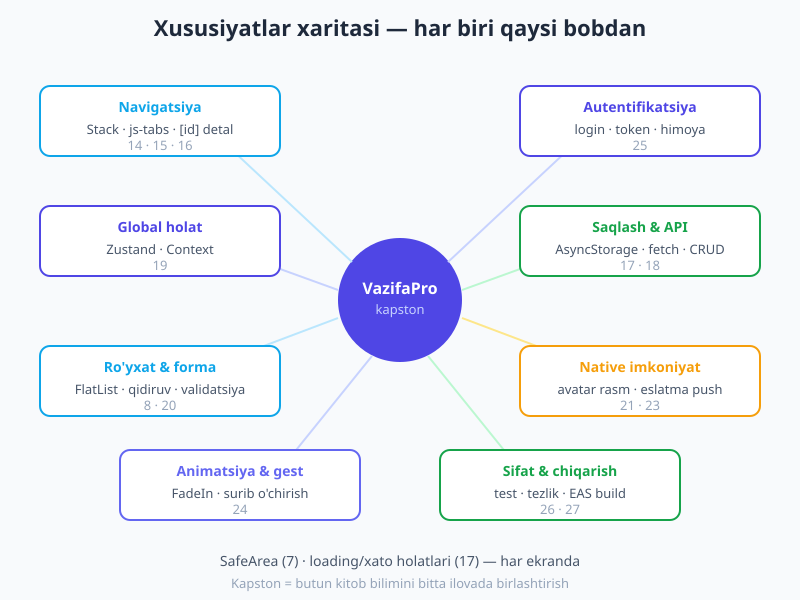
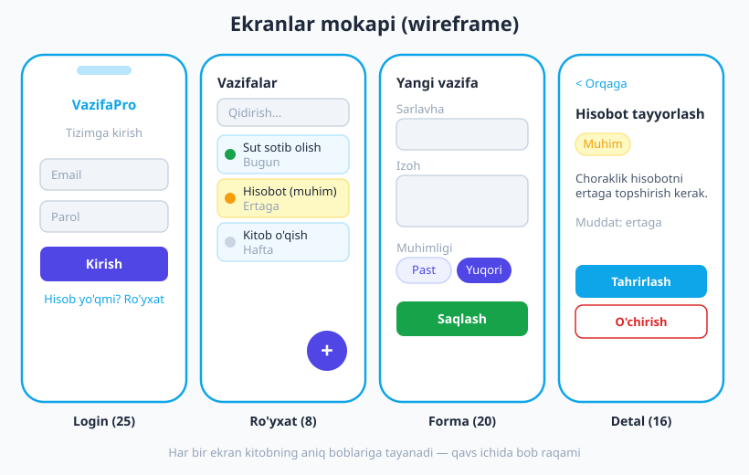
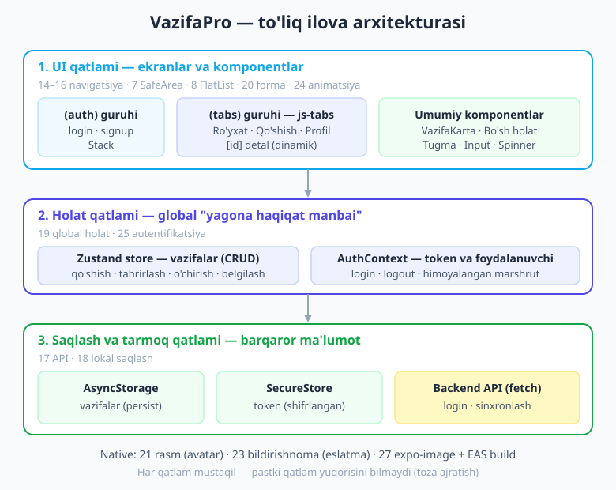
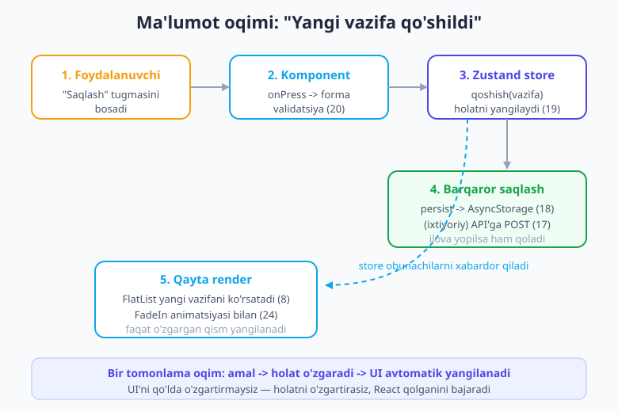

# 28 — Yakuniy loyiha: to'liq mobil ilova (KAPSTON)

[⬅️ Oldingi: 27 — Performance, New Architecture va deploy](./27-performance-build-deploy.md) · [🏠 Kitob boshi](./README.md)

> **Bu bobda:** Mana shu daqiqani biz butun kitob davomida kutgan edik. Endi siz o'rgangan **hamma narsani** — navigatsiya, autentifikatsiya, global holat, formalar, ro'yxatlar, native imkoniyatlar, animatsiya, test va do'konga chiqarishni — **bitta to'liq ilovaga** birlashtiramiz. Biz **VazifaPro** nomli vazifalar (to-do) ilovasini **noldan** quramiz: foydalanuvchi tizimga kiradi, o'z vazifalarini qo'shadi, tahrirlaydi, o'chiradi, qidiradi va ular telefonida saqlanib qoladi. Har bir qadamda qaysi bobdan kelganini ko'rsatib boramiz. Oxirida sizda portfelingizga qo'yadigan, do'konga chiqarishga tayyor **haqiqiy ilova** bo'ladi.

---

## Tabriklaymiz — bu yerga yetib keldingiz!

Avval bir to'xtab, o'zingizni tabriklang. Siz "React Native nima?" degan savoldan boshlab, bugun **New Architecture**, **EAS Build** va **OTA yangilanishlar**gacha yetib keldingiz. Bu — oson yo'l emas edi. Endi bilimingizni **amalda** ishlatadigan vaqt keldi.

Bu bob boshqa boblardan farq qiladi. Bu yerda yangi tushuncha kam — buning o'rniga biz **mavjud bilimlarni qanday birlashtirishni** o'rganamiz. Chunki haqiqiy ilova yozish — bu alohida-alohida tushunchalarni bilish emas, balki ularni **bir-biriga ulay olish** san'atidir.

> **Hayotiy o'xshatish.** Tasavvur qiling, siz oshpazlik kursini tugatdingiz: bir kuni sabzini to'g'rashni, boshqa kuni guruchni yuvishni, yana bir kuni go'shtni qovurishni o'rgandingiz. Lekin **palov** pishirish — bularning hammasini **to'g'ri tartibda, to'g'ri vaqtda** birlashtirishdir. Kapston loyiha — sizning birinchi mustaqil "palovingiz". Retsept sizda bor, mahsulotlar tayyor — endi pishiramiz.

!!! tip "Eng yaxshi o'qish usuli"
    Bu bobni shunchaki o'qib chiqmang — **o'z kompyuteringizda terib boring**. Har bir kod blokini o'z loyihangizga ko'chiring, `npx expo start` bilan ishga tushiring va telefoningizda (Expo Go) natijani ko'ring. Xatoga uchrasangiz — bu **yaxshi**, chunki xatoni tuzatish — eng kuchli o'rganish. Tugagach, bu ilovani o'zingizniki qilib **o'zgartiring**.

---

## 1. Loyiha tanishtiruvi: nimani quramiz?

**VazifaPro** — bu shaxsiy vazifalar ilovasi. Foydalanuvchi:

- Tizimga **kiradi** (login) yoki **ro'yxatdan o'tadi** (signup) — autentifikatsiya bilan.
- O'z **vazifalar ro'yxatini** ko'radi — har biri sarlavha, izoh va muhimlik darajasi bilan.
- Yangi vazifa **qo'shadi**, mavjudini **tahrirlaydi** yoki **o'chiradi** (CRUD).
- Vazifani **qidiradi** va **filtrlaydi** (hammasi / bajarilgan / bajarilmagan).
- Vazifani bajarilgan deb **belgilaydi** (bir bosishda).
- **Profil** ekranida o'z ma'lumotlarini ko'radi, **avatar rasm** tanlaydi va tizimdan **chiqadi**.
- Muhim vazifa uchun **eslatma bildirishnoma** rejalashtiradi.

Va eng muhimi — barcha ma'lumotlar **telefonda saqlanib qoladi**: ilovani yopib qaytadan ochsangiz ham vazifalaringiz joyida turadi.

### Xususiyatlar xaritasi — har biri qaysi bobdan

Quyidagi rasm butun ilovani bir qarashda ko'rsatadi: har bir xususiyat kitobning qaysi bobiga tayanadi.



Ko'rib turganingizdek, **bitta ham yangi narsa yo'q** — hammasi siz allaqachon o'rgangan boblardan. Bizning vazifamiz — ularni mantiqiy bir butunga ulash.

### Ekranlar wireframe (mokap)

Kod yozishdan oldin, har doim **ilova qanday ko'rinishini** chizib olish foydali. Bu — "wireframe" yoki "mokap" deyiladi: bezaksiz, faqat tuzilishni ko'rsatadigan eskiz. Bizning to'rtta asosiy ekranimiz:



> **Hayotiy o'xshatish.** Wireframe — uy quruvchi uchun **chizma** (chertyoj) kabi. G'isht terishdan oldin arxitektor xonalar qayerda bo'lishini, eshik qayerga ochilishini chizadi. Biz ham kod yozishdan oldin "ekran qayerda, tugma qayerda" ekanini chizib olamiz — keyin adashmaymiz.

!!! note "Nega aynan vazifalar ilovasi?"
    Vazifalar ilovasi — boshlovchilar uchun "Salom dunyo" dan keyingi eng yaxshi loyiha. U **kichik**, lekin haqiqiy ilovaning **barcha asosiy qismlarini** o'z ichiga oladi: ro'yxat, forma, saqlash, navigatsiya, holat. Shuni o'zlashtirsangiz — xarajat kuzatuvchisi, eslatmalar, ovqat retsepti yoki onlayn-do'kon kabi har qanday ilovani qura olasiz. Tuzilish bir xil.

---

## 2. Reja va arxitektura

Tajribali dasturchi darrov kod yozishga o'tirmaydi — avval **rejani** tuzadi. Keling, biz ham shunday qilaylik.

### Ilova arxitekturasi

Yaxshi ilova **qatlamlarga** bo'linadi. Har qatlam o'z ishini qiladi va boshqasiga aralashmaydi. Bu — 13-bobda o'rgangan "mantiqni UI'dan ajratish" tamoyilining katta ko'lamdagi ko'rinishi.



Uch asosiy qatlam:

1. **UI qatlami** (ekranlar va komponentlar) — foydalanuvchi ko'radigan va bosadigan hamma narsa. Bu qatlam ma'lumotni **qayerdan** kelishini bilmaydi — u faqat holatdan o'qiydi va amallarni chaqiradi.
2. **Holat qatlami** (Zustand store + AuthContext) — ilovaning "miyasi". Bu yerda barcha ma'lumot va uni o'zgartirish mantiqlari yashaydi. Bu — "yagona haqiqat manbai" (single source of truth).
3. **Saqlash va tarmoq qatlami** (AsyncStorage, SecureStore, API) — ma'lumotni barqaror qiladi. Ilova yopilsa ham ma'lumot yo'qolmaydi.

> **Hayotiy o'xshatish.** Bu — restoran kabi. **UI qatlami** = zal (mehmonlar o'tiradigan, ofitsiant buyurtma oladigan joy). **Holat qatlami** = oshxona (hamma narsa shu yerda tayyorlanadi, qaror qabul qilinadi). **Saqlash qatlami** = ombor va muzlatgich (mahsulotlar saqlanadi). Mehmon (foydalanuvchi) omborga kirmaydi — u faqat zal bilan ishlaydi. Har qatlam o'z vazifasini biladi.

### Papka tuzilishi (13-bob)

13-bobda o'rgangan tuzilish tamoyillarini katta loyihaga qo'llaymiz. Mana to'liq papka daraxti:

```text
VazifaPro/
├── src/
│   ├── app/                      # Expo Router — fayl = marshrut (14-bob)
│   │   ├── _layout.tsx           # ildiz layout — provayderlar + himoya
│   │   ├── index.tsx             # boshlang'ich yo'naltirish (redirect)
│   │   ├── (auth)/               # auth guruhi — login/signup (25-bob)
│   │   │   ├── _layout.tsx       # auth Stack
│   │   │   ├── login.tsx
│   │   │   └── signup.tsx
│   │   └── (tabs)/               # asosiy ilova — tab navigatsiya (15-bob)
│   │       ├── _layout.tsx       # Tabs (expo-router/js-tabs)
│   │       ├── index.tsx         # vazifalar ro'yxati (8-bob)
│   │       ├── qoshish.tsx       # yangi vazifa formasi (20-bob)
│   │       ├── profil.tsx        # profil + avatar + chiqish (21-bob)
│   │       └── vazifa/
│   │           └── [id].tsx      # vazifa detali + tahrirlash (16-bob)
│   ├── components/               # qayta ishlatiladigan UI (10-bob)
│   │   ├── VazifaKarta.tsx
│   │   ├── BoshHolat.tsx         # bo'sh ro'yxat ko'rinishi
│   │   └── Tugma.tsx
│   ├── store/                    # global holat (19-bob)
│   │   └── vazifaStore.ts        # Zustand + persist
│   ├── context/                  # auth holati (25-bob)
│   │   └── AuthContext.tsx
│   ├── lib/                      # yordamchi funksiyalar
│   │   ├── token.ts              # SecureStore o'rovi (18-bob)
│   │   └── eslatma.ts            # bildirishnoma (23-bob)
│   └── types.ts                  # umumiy TypeScript tiplari
├── assets/                       # rasm, ikonka
├── app.json                      # Expo sozlamalari + pluginlar
└── package.json
```

!!! tip "Tuzilishni oldindan o'ylab tuzing"
    Loyiha boshida papka tuzilishini o'ylab tuzish — keyinchalik vaqtni juda tejaydi. Qoidasi sodda: **bir-biriga o'xshash fayllar bitta papkada**. Ekranlar — `app/`, qayta ishlatiladigan komponentlar — `components/`, holat — `store/`, yordamchilar — `lib/`. Yangi dasturchi loyihangizga qarab darrov tushunadi.

### Ma'lumot oqimi

Eng muhim tushuncha — ma'lumot ilovada **qanday harakat qiladi**. React'da bu oqim **bir tomonlama**: amal -> holat o'zgaradi -> UI avtomatik yangilanadi.



Bu — 9-bobda o'rgangan "holat o'zgarsa, qayta render bo'ladi" qoidasining butun ilova darajasidagi ko'rinishi. Siz UI'ni **hech qachon qo'lda o'zgartirmaysiz** — siz faqat holatni o'zgartirasiz, React esa qolganini bajaradi.

---

## 3. Loyiha yaratish (2-bob)

Endi haqiqiy ish boshlanadi. Terminalni oching va yangi loyiha yarating (2-bobda o'rgandik):

```bash
npx create-expo-app@latest VazifaPro
cd VazifaPro
```

Bu buyruq Expo SDK 56 shablonini yuklab oladi: Expo Router, TypeScript va `(tabs)` namunasi bilan. Toza varaqdan boshlash uchun namuna ekranlarni tozalaymiz:

```bash
npm run reset-project
```

Bu `src/app/` ichida bitta `index.tsx` va `_layout.tsx` qoldiradi. Endi kerakli kutubxonalarni o'rnatamiz (har biri qaysi bob uchun ekanini izoh bilan):

```bash
# Global holat (19-bob)
npx expo install zustand

# Lokal saqlash (18-bob)
npx expo install @react-native-async-storage/async-storage expo-secure-store

# Animatsiya va gestlar (24-bob)
npx expo install react-native-reanimated react-native-gesture-handler

# Native: rasm tanlash va bildirishnoma (21, 23-bob)
npx expo install expo-image-picker expo-image expo-notifications

# SafeArea (7-bob) — odatda shablon bilan keladi
npx expo install react-native-safe-area-context
```

!!! warning "`npm install` emas, `npx expo install`"
    Expo loyihalarida paketni har doim `npx expo install` bilan o'rnating, oddiy `npm install` bilan emas. Sababi: `expo install` sizning Expo SDK versiyangizga **mos** versiyani tanlaydi. Oddiy `npm install` esa eng yangisini oladi — bu mosligi buzilishiga olib kelishi mumkin.

!!! note "SDK 56 shabloni `src/app/` ishlatadi"
    Yangi shablonda routing ildizi `src/app/` (eski loyihalarda `app/`). Qoidalar **aynan bir xil** — biz misollarda `src/app/...` yo'lini ishlatamiz. Agar sizning loyihangizda `app/` bo'lsa, shunchaki `src/` ni tashlab yuboring.

---

## 4. Umumiy tiplar va yordamchilar

Kod yozishni eng past, mustaqil qatlamdan — **TypeScript tiplari** va **yordamchi funksiyalardan** boshlaymiz. Ular boshqa hamma narsaning poydevori.

### TypeScript tiplari

Avval ilovaning markaziy ma'lumot turi — **Vazifa**ni ta'riflaymiz. Bitta joyda ta'riflasak, butun ilova bo'ylab bir xil ishlatamiz (10-bobdagi props tiplash tamoyili):

```ts
// src/types.ts — butun ilova uchun umumiy tiplar

// Vazifaning muhimlik darajasi — faqat shu uch qiymatdan biri bo'lishi mumkin
export type Muhimlik = 'past' | 'orta' | 'yuqori';

// Bitta vazifa qanday ko'rinishini ta'riflaymiz
export type Vazifa = {
  id: string;          // noyob identifikator (key uchun ham)
  sarlavha: string;    // vazifa nomi
  izoh: string;        // qo'shimcha tavsif (bo'sh bo'lishi mumkin)
  muhimlik: Muhimlik;  // past / orta / yuqori
  tayyor: boolean;     // bajarildimi?
  yaratilgan: number;  // qachon yaratilgan (Date.now() — millisekund)
};

// Foydalanuvchi ma'lumoti
export type Foydalanuvchi = {
  ism: string;
  email: string;
  avatar: string | null; // tanlangan rasm yo'li yoki null
};
```

TypeScript bu tiplarni biladigan bo'lgach, butun ilova bo'ylab xatolardan himoyalanasiz: agar `vazifa.sarlvha` deb xato yozsangiz (`a` tushib qolgan), tahrirlovchi darrov ogohlantiradi.

### Token yordamchisi (18-bob)

Maxfiy ma'lumotni (token) `expo-secure-store` da shifrlangan holda saqlaymiz. Buni alohida faylga o'rab qo'yamiz, shunda butun ilovada bir xil ishlatamiz:

```ts
// src/lib/token.ts — tokenni xavfsiz saqlash (18-bob)
import * as SecureStore from 'expo-secure-store';

const KALIT = 'foydalanuvchi-token';

// Tokenni shifrlangan saqlovga yozamiz
export async function tokenSaqla(token: string): Promise<void> {
  await SecureStore.setItemAsync(KALIT, token);
}

// Tokenni o'qiymiz (yo'q bo'lsa null qaytadi)
export async function tokenOqi(): Promise<string | null> {
  return await SecureStore.getItemAsync(KALIT);
}

// Tokenni o'chiramiz (chiqishda)
export async function tokenOchir(): Promise<void> {
  await SecureStore.deleteItemAsync(KALIT);
}
```

!!! danger "Token AsyncStorage'da emas, SecureStore'da"
    18-bobda aytganimizdek, **maxfiy ma'lumot** (token, parol) hech qachon `AsyncStorage`da saqlanmaydi — u shifrlanmagan. Token uchun **doim `expo-secure-store`** ishlating: u ma'lumotni qurilmaning shifrlangan saqlovida (iOS Keychain, Android Keystore) saqlaydi. Vazifalar kabi oddiy ma'lumot uchun esa AsyncStorage yetarli.

---

## 5. Global holat: vazifa store'i (19-bob)

Endi ilovaning "miyasi"ni quramiz — **vazifa store'i**. Bu yerda barcha vazifalar va ularni o'zgartirish mantiqlari yashaydi. 19-bobda o'rgangan **Zustand** ni ishlatamiz, chunki u sodda va ro'yxat kabi tez-tez o'zgaradigan ma'lumotga juda mos.

Eng muhimi — biz `persist` middleware'ni qo'shamiz, shunda vazifalar avtomatik ravishda **AsyncStorage**ga saqlanadi (18-bob). Foydalanuvchi hech narsa qilmasa ham, ma'lumot telefonda qoladi.

```ts
// src/store/vazifaStore.ts — global vazifa holati (19 + 18-bob)
import { create } from 'zustand';
import { persist, createJSONStorage } from 'zustand/middleware';
import AsyncStorage from '@react-native-async-storage/async-storage';
import type { Vazifa, Muhimlik } from '../types';

// Store qanday ko'rinishini ta'riflaymiz: ma'lumot + amallar
type VazifaHolati = {
  vazifalar: Vazifa[];
  // Amallar (ma'lumotni o'zgartiradigan funksiyalar)
  qoshish: (sarlavha: string, izoh: string, muhimlik: Muhimlik) => void;
  yangilash: (id: string, ozgarish: Partial<Vazifa>) => void;
  ochirish: (id: string) => void;
  belgilash: (id: string) => void; // tayyor <-> tayyor emas
  topish: (id: string) => Vazifa | undefined;
};

export const useVazifaStore = create<VazifaHolati>()(
  persist(
    (set, get) => ({
      vazifalar: [],

      // QO'SHISH (Create) — yangi vazifani ro'yxat boshiga qo'shamiz
      qoshish: (sarlavha, izoh, muhimlik) =>
        set((holat) => ({
          vazifalar: [
            {
              id: Date.now().toString(), // oddiy noyob id
              sarlavha,
              izoh,
              muhimlik,
              tayyor: false,
              yaratilgan: Date.now(),
            },
            ...holat.vazifalar, // mavjudlarini saqlaymiz (immutability — 9-bob)
          ],
        })),

      // YANGILASH (Update) — id bo'yicha topib, faqat o'zgargan maydonlarni almashtiramiz
      yangilash: (id, ozgarish) =>
        set((holat) => ({
          vazifalar: holat.vazifalar.map((v) =>
            v.id === id ? { ...v, ...ozgarish } : v
          ),
        })),

      // O'CHIRISH (Delete) — id'si mos kelmaganlarini qoldiramiz
      ochirish: (id) =>
        set((holat) => ({
          vazifalar: holat.vazifalar.filter((v) => v.id !== id),
        })),

      // BELGILASH — tayyor holatini teskari qilamiz
      belgilash: (id) =>
        set((holat) => ({
          vazifalar: holat.vazifalar.map((v) =>
            v.id === id ? { ...v, tayyor: !v.tayyor } : v
          ),
        })),

      // TOPISH (Read bitta) — detal ekrani uchun
      topish: (id) => get().vazifalar.find((v) => v.id === id),
    }),
    {
      name: 'vazifa-saqlovi', // AsyncStorage'dagi kalit nomi
      storage: createJSONStorage(() => AsyncStorage), // qayerda saqlash
    }
  )
);
```

Diqqat qiling — bu bitta faylda butun **CRUD** (Create, Read, Update, Delete) mantiqlari jamlangan. Har bir amal **immutable** (mavjud massivni o'zgartirmasdan, yangi massiv qaytaradi) — bu 9-bobdagi muhim qoida. `persist` esa avtomatik ravishda har o'zgarishni AsyncStorage'ga yozadi va ilova ochilganda qayta yuklaydi.

> **Hayotiy o'xshatish.** Store — ilovaning **markaziy ombori** kabi. Har bir ekran omborga borib "menga vazifalar ro'yxatini ber" yoki "bu vazifani o'chir" deydi. Ombor o'zgarsa, unga ulangan **hamma ekran** avtomatik yangilanadi — xuddi ombordagi tovar soni o'zgarsa, barcha do'kon oynalaridagi raqam yangilangani kabi.

!!! tip "Store'ni qanday ishlatamiz?"
    Istalgan komponentda: `const vazifalar = useVazifaStore((s) => s.vazifalar);` — faqat kerakli qismni tanlab oling (selector). Bu — keraksiz qayta renderlarning oldini oladi (27-bob, performance).

---

## 6. Autentifikatsiya: AuthContext (25-bob)

Vazifalardan farqli o'laroq, **kim tizimga kirgani** — bu kichik, kam o'zgaradigan holat. 25-bobda o'rganganimizdek, bunga **Context API** ideal mos keladi. AuthContext tokenni boshqaradi, login/logout funksiyalarini beradi va ilova ochilganda saqlangan tokenni tekshiradi.

```tsx
// src/context/AuthContext.tsx — autentifikatsiya holati (25-bob)
import { createContext, useContext, useState, useEffect, type ReactNode } from 'react';
import { tokenSaqla, tokenOqi, tokenOchir } from '../lib/token';
import type { Foydalanuvchi } from '../types';

type AuthHolati = {
  foydalanuvchi: Foydalanuvchi | null;
  yuklanmoqda: boolean; // boshlang'ich tokenni tekshirayotgan paytmi?
  login: (email: string, parol: string) => Promise<void>;
  signup: (ism: string, email: string, parol: string) => Promise<void>;
  logout: () => Promise<void>;
  avatarYangila: (yol: string) => void;
};

const AuthContext = createContext<AuthHolati | undefined>(undefined);

export function AuthProvider({ children }: { children: ReactNode }) {
  const [foydalanuvchi, setFoydalanuvchi] = useState<Foydalanuvchi | null>(null);
  const [yuklanmoqda, setYuklanmoqda] = useState(true);

  // Ilova ochilganda saqlangan tokenni tekshiramiz (avtomatik kirish)
  useEffect(() => {
    (async () => {
      try {
        const token = await tokenOqi();
        if (token !== null) {
          // Haqiqiy ilovada token bilan API'dan profilni olardik (17-bob)
          setFoydalanuvchi({ ism: 'Aziz', email: 'aziz@example.com', avatar: null });
        }
      } catch (e) {
        console.warn('Tokenni yuklashda xato:', e);
      } finally {
        setYuklanmoqda(false); // tekshiruv tugadi
      }
    })();
  }, []);

  // LOGIN — haqiqiy ilovada bu API so'rovi bo'lardi (17-bob)
  const login = async (email: string, _parol: string) => {
    // Soxta token — haqiqiy ilovada serverdan keladi
    const token = 'soxta-token-' + Date.now();
    await tokenSaqla(token);
    setFoydalanuvchi({ ism: 'Aziz', email, avatar: null });
  };

  // SIGNUP — login bilan deyarli bir xil, lekin ism ham olamiz
  const signup = async (ism: string, email: string, _parol: string) => {
    const token = 'soxta-token-' + Date.now();
    await tokenSaqla(token);
    setFoydalanuvchi({ ism, email, avatar: null });
  };

  // LOGOUT — tokenni o'chiramiz va holatni tozalaymiz
  const logout = async () => {
    await tokenOchir();
    setFoydalanuvchi(null);
  };

  // Avatar rasmini yangilash (21-bob bilan ulanadi)
  const avatarYangila = (yol: string) => {
    setFoydalanuvchi((f) => (f ? { ...f, avatar: yol } : f));
  };

  return (
    <AuthContext.Provider
      value={{ foydalanuvchi, yuklanmoqda, login, signup, logout, avatarYangila }}
    >
      {children}
    </AuthContext.Provider>
  );
}

// Qulay hook — har komponent shu orqali auth'ga ulanadi (13-bob: custom hook)
export function useAuth() {
  const ctx = useContext(AuthContext);
  if (ctx === undefined) {
    throw new Error('useAuth() faqat <AuthProvider> ichida ishlaydi');
  }
  return ctx;
}
```

!!! note "Soxta token nima uchun?"
    Bizda backend serveri yo'q, shuning uchun login'da **soxta** token yaratamiz. Haqiqiy ilovada bu yer `fetch('https://api.../login', {...})` bo'lardi (17-bob), va server haqiqiy token qaytarardi. Mantiq bir xil — faqat token manbai farq qiladi. Backend ulashga tayyor bo'lganingizda, faqat `login` funksiyasining ichini o'zgartirasiz, qolgan ilova o'zgarmaydi. Mana qatlamlarga bo'lishning kuchi!

---

## 7. Ildiz layout va himoyalangan marshrut (14, 25-bob)

Endi hamma narsani bir-biriga ulaydigan eng muhim fayl — **ildiz layout**ni yozamiz. Bu yerda biz:

1. Barcha provayderlarni o'rab olamiz (`AuthProvider`, `GestureHandlerRootView`, `SafeAreaProvider`).
2. **Himoyalangan marshrut**ni amalga oshiramiz: token yo'q bo'lsa — login ekraniga, bor bo'lsa — asosiy ilovaga yo'naltiramiz (25-bob).

```tsx
// src/app/_layout.tsx — ildiz layout: provayderlar + himoya (14, 25-bob)
import { Stack } from 'expo-router';
import { GestureHandlerRootView } from 'react-native-gesture-handler';
import { SafeAreaProvider } from 'react-native-safe-area-context';
import { ActivityIndicator, View } from 'react-native';
import { AuthProvider, useAuth } from '../context/AuthContext';

// Ichki komponent — auth holatiga qarab nimani ko'rsatishni hal qiladi
function IldizNavigatsiya() {
  const { foydalanuvchi, yuklanmoqda } = useAuth();

  // Token tekshirilayotganda spinner ko'rsatamiz (17-bob: loading holati)
  if (yuklanmoqda) {
    return (
      <View style={{ flex: 1, justifyContent: 'center', alignItems: 'center' }}>
        <ActivityIndicator size="large" color="#4f46e5" />
      </View>
    );
  }

  // Stack — auth holatiga qarab qaysi guruh ko'rinishini boshqaramiz
  return (
    <Stack screenOptions={{ headerShown: false }}>
      {/* Protected guruhlar: foydalanuvchi bor bo'lsa (tabs), bo'lmasa (auth) */}
      <Stack.Protected guard={foydalanuvchi !== null}>
        <Stack.Screen name="(tabs)" />
      </Stack.Protected>
      <Stack.Protected guard={foydalanuvchi === null}>
        <Stack.Screen name="(auth)" />
      </Stack.Protected>
    </Stack>
  );
}

export default function RootLayout() {
  return (
    // GestureHandlerRootView — surish gestlari uchun SHART (24-bob)
    <GestureHandlerRootView style={{ flex: 1 }}>
      <SafeAreaProvider>
        <AuthProvider>
          <IldizNavigatsiya />
        </AuthProvider>
      </SafeAreaProvider>
    </GestureHandlerRootView>
  );
}
```

`Stack.Protected` bilan `guard` — Expo Router'ning himoyalangan marshrut mexanizmi: shart `true` bo'lgan guruhgina ko'rsatiladi. Foydalanuvchi kirsa, `(auth)` o'chadi va `(tabs)` paydo bo'ladi — Router avtomatik yo'naltiradi.

Boshlang'ich `index.tsx` esa shunchaki to'g'ri joyga yo'naltiradi:

```tsx
// src/app/index.tsx — boshlang'ich yo'naltirish
import { Redirect } from 'expo-router';

export default function Index() {
  // Asosiy ilovaga yuboramiz; token yo'q bo'lsa _layout login'ga qaytaradi
  return <Redirect href="/(tabs)" />;
}
```

> **Hayotiy o'xshatish.** Ildiz layout — binoning **kirish nazoratchisi** kabi. Mehmon kelganda nazoratchi propuskini (token) tekshiradi: bor bo'lsa — binoga (asosiy ilova) kiritadi, yo'q bo'lsa — qabulxonaga (login) yo'naltiradi. Propuskini tekshirayotgan paytda esa "Bir daqiqa..." (spinner) deydi.

!!! warning "GestureHandlerRootView'ni unutmang"
    Agar `react-native-gesture-handler` ishlatsangiz (biz surib o'chirish uchun ishlatamiz), ilovaning eng tashqi qismi **`<GestureHandlerRootView style={{ flex: 1 }}>`** bilan o'ralishi **shart**. Aks holda gestlar ishlamaydi — bu juda keng tarqalgan xato.

---

## 8. Autentifikatsiya ekranlari (25-bob)

`(auth)` guruhini quramiz. Avval uning ichki Stack'i:

```tsx
// src/app/(auth)/_layout.tsx — auth navigatsiyasi (14, 15-bob)
import { Stack } from 'expo-router';

export default function AuthLayout() {
  return (
    <Stack screenOptions={{ headerShown: false }}>
      <Stack.Screen name="login" />
      <Stack.Screen name="signup" />
    </Stack>
  );
}
```

Endi **login ekrani**. Bu yerda controlled input (6, 9-bob), validatsiya (20-bob), loading va xato holatlari (17-bob), SafeArea (7-bob) — hammasi birga ishlaydi:

```tsx
// src/app/(auth)/login.tsx — tizimga kirish (25, 20, 7-bob)
import { useState } from 'react';
import { View, Text, TextInput, Pressable, StyleSheet, ActivityIndicator } from 'react-native';
import { SafeAreaView } from 'react-native-safe-area-context';
import { Link } from 'expo-router';
import { useAuth } from '../../context/AuthContext';

export default function Login() {
  const { login } = useAuth();
  const [email, setEmail] = useState('');
  const [parol, setParol] = useState('');
  const [xato, setXato] = useState('');
  const [yuborilmoqda, setYuborilmoqda] = useState(false);

  const kirish = async () => {
    // Oddiy validatsiya (20-bob)
    if (email.trim() === '' || parol === '') {
      setXato('Email va parolni kiriting');
      return;
    }
    if (!email.includes('@')) {
      setXato("Email noto'g'ri ko'rinishda");
      return;
    }
    setXato('');
    setYuborilmoqda(true);
    try {
      await login(email.trim(), parol);
      // Muvaffaqiyatli — _layout avtomatik (tabs)ga yo'naltiradi
    } catch {
      setXato('Kirishda xato yuz berdi');
    } finally {
      setYuborilmoqda(false);
    }
  };

  return (
    <SafeAreaView style={styles.sahifa}>
      <View style={styles.markaz}>
        <Text style={styles.logo}>VazifaPro</Text>
        <Text style={styles.tavsif}>Tizimga kiring va ishni boshlang</Text>

        <TextInput
          style={styles.input}
          placeholder="Email"
          value={email}
          onChangeText={setEmail}
          autoCapitalize="none"
          keyboardType="email-address"
        />
        <TextInput
          style={styles.input}
          placeholder="Parol"
          value={parol}
          onChangeText={setParol}
          secureTextEntry
        />

        {/* Xato bo'lsa — qizil matn ko'rsatamiz (17-bob: xato holati) */}
        {xato !== '' && <Text style={styles.xato}>{xato}</Text>}

        <Pressable style={styles.tugma} onPress={kirish} disabled={yuborilmoqda}>
          {yuborilmoqda ? (
            <ActivityIndicator color="#fff" />
          ) : (
            <Text style={styles.tugmaMatn}>Kirish</Text>
          )}
        </Pressable>

        <Link href="/(auth)/signup" style={styles.havola}>
          Hisobingiz yo'qmi? Ro'yxatdan o'ting
        </Link>
      </View>
    </SafeAreaView>
  );
}

const styles = StyleSheet.create({
  sahifa: { flex: 1, backgroundColor: '#f8fafc' },
  markaz: { flex: 1, justifyContent: 'center', paddingHorizontal: 24, gap: 12 },
  logo: { fontSize: 32, fontWeight: '800', color: '#4f46e5', textAlign: 'center' },
  tavsif: { fontSize: 15, color: '#64748b', textAlign: 'center', marginBottom: 16 },
  input: {
    backgroundColor: '#fff', borderWidth: 1, borderColor: '#cbd5e1',
    borderRadius: 12, paddingHorizontal: 16, paddingVertical: 14, fontSize: 16,
  },
  xato: { color: '#dc2626', fontSize: 14 },
  tugma: {
    backgroundColor: '#4f46e5', borderRadius: 12, paddingVertical: 16,
    alignItems: 'center', marginTop: 8,
  },
  tugmaMatn: { color: '#fff', fontWeight: '700', fontSize: 16 },
  havola: { color: '#0ea5e9', textAlign: 'center', marginTop: 8, fontSize: 15 },
});
```

**Signup ekrani** login'ga juda o'xshash — faqat qo'shimcha "Ism" maydoni bor. Qisqartirib, asosiy farqlarini ko'rsatamiz:

```tsx
// src/app/(auth)/signup.tsx — ro'yxatdan o'tish (25-bob)
import { useState } from 'react';
import { View, Text, TextInput, Pressable, StyleSheet } from 'react-native';
import { SafeAreaView } from 'react-native-safe-area-context';
import { Link } from 'expo-router';
import { useAuth } from '../../context/AuthContext';

export default function Signup() {
  const { signup } = useAuth();
  const [ism, setIsm] = useState('');
  const [email, setEmail] = useState('');
  const [parol, setParol] = useState('');
  const [xato, setXato] = useState('');

  const royxatdanOt = async () => {
    if (ism.trim() === '' || email.trim() === '' || parol.length < 6) {
      setXato("Ism, email va kamida 6 belgili parol kiriting");
      return;
    }
    setXato('');
    await signup(ism.trim(), email.trim(), parol);
  };

  return (
    <SafeAreaView style={styles.sahifa}>
      <View style={styles.markaz}>
        <Text style={styles.logo}>Ro'yxatdan o'tish</Text>
        <TextInput style={styles.input} placeholder="Ismingiz" value={ism} onChangeText={setIsm} />
        <TextInput
          style={styles.input} placeholder="Email" value={email}
          onChangeText={setEmail} autoCapitalize="none" keyboardType="email-address"
        />
        <TextInput
          style={styles.input} placeholder="Parol (kamida 6 belgi)"
          value={parol} onChangeText={setParol} secureTextEntry
        />
        {xato !== '' && <Text style={styles.xato}>{xato}</Text>}
        <Pressable style={styles.tugma} onPress={royxatdanOt}>
          <Text style={styles.tugmaMatn}>Ro'yxatdan o'tish</Text>
        </Pressable>
        <Link href="/(auth)/login" style={styles.havola}>
          Hisobingiz bormi? Kiring
        </Link>
      </View>
    </SafeAreaView>
  );
}

const styles = StyleSheet.create({
  sahifa: { flex: 1, backgroundColor: '#f8fafc' },
  markaz: { flex: 1, justifyContent: 'center', paddingHorizontal: 24, gap: 12 },
  logo: { fontSize: 28, fontWeight: '800', color: '#4f46e5', textAlign: 'center', marginBottom: 12 },
  input: {
    backgroundColor: '#fff', borderWidth: 1, borderColor: '#cbd5e1',
    borderRadius: 12, paddingHorizontal: 16, paddingVertical: 14, fontSize: 16,
  },
  xato: { color: '#dc2626', fontSize: 14 },
  tugma: { backgroundColor: '#4f46e5', borderRadius: 12, paddingVertical: 16, alignItems: 'center', marginTop: 8 },
  tugmaMatn: { color: '#fff', fontWeight: '700', fontSize: 16 },
  havola: { color: '#0ea5e9', textAlign: 'center', marginTop: 8, fontSize: 15 },
});
```

!!! tip "Takrorlanayotgan stillarni ajrating"
    Login va signup stillari deyarli bir xil. Haqiqiy loyihada ularni umumiy faylga (`src/styles/auth.ts`) chiqarib, ikkalasida import qilardik — kodni qisqartirish uchun. Bu yerda har bir fayl mustaqil tushunarli bo'lishi uchun ataylab takrorladik.

---

## 9. Tab navigatsiya (15-bob)

Asosiy ilova — `(tabs)` guruhi. Uch tab: ro'yxat, qo'shish, profil. **Muhim:** SDK 56'da `Tabs` ni `expo-router/js-tabs` dan import qilamiz (`expo-router` ning to'g'ridan-to'g'ri `Tabs` eksporti eskirgan).

```tsx
// src/app/(tabs)/_layout.tsx — pastki tab navigatsiya (15-bob)
import { Tabs } from 'expo-router/js-tabs';
import { Ionicons } from '@expo/vector-icons';

export default function TabsLayout() {
  return (
    <Tabs
      screenOptions={{
        tabBarActiveTintColor: '#4f46e5',
        headerStyle: { backgroundColor: '#4f46e5' },
        headerTintColor: '#fff',
      }}
    >
      <Tabs.Screen
        name="index"
        options={{
          title: 'Vazifalar',
          tabBarIcon: ({ color, size }) => (
            <Ionicons name="list" size={size} color={color} />
          ),
        }}
      />
      <Tabs.Screen
        name="qoshish"
        options={{
          title: "Qo'shish",
          tabBarIcon: ({ color, size }) => (
            <Ionicons name="add-circle" size={size} color={color} />
          ),
        }}
      />
      <Tabs.Screen
        name="profil"
        options={{
          title: 'Profil',
          tabBarIcon: ({ color, size }) => (
            <Ionicons name="person" size={size} color={color} />
          ),
        }}
      />
      {/* Detal ekrani tabda ko'rinmaydi — faqat dasturiy o'tiladi */}
      <Tabs.Screen name="vazifa/[id]" options={{ href: null }} />
    </Tabs>
  );
}
```

`href: null` — `vazifa/[id]` ekranini tab panelida **yashiradi**, lekin u baribir mavjud va kerak bo'lganda ochiladi. `@expo/vector-icons` — Expo bilan keladigan tayyor ikonkalar to'plami.

!!! warning "SDK 56: `expo-router/js-tabs`"
    SDK 56'dan boshlab `Tabs` ni **`expo-router/js-tabs`** dan import qiling — `expo-router` dan to'g'ridan-to'g'ri emas (eskirgan). Eski darsliklarda `import { Tabs } from 'expo-router'` ko'rishingiz mumkin — bu yangi loyihalarda ishlamasligi mumkin. Doim `js-tabs` ishlating.

---

## 10. Qayta ishlatiladigan komponentlar (10-bob)

Ro'yxat ekraniga o'tishdan oldin, ikki qayta ishlatiladigan komponent yasaymiz. Bu — 10-bobdagi kompozitsiya tamoyili.

### Bo'sh holat komponenti

Ro'yxat bo'sh bo'lganda chiroyli xabar ko'rsatish — yaxshi UX. 8-bobda buni `ListEmptyComponent` deb o'rgangan edik:

```tsx
// src/components/BoshHolat.tsx — bo'sh ro'yxat ko'rinishi (8-bob)
import { View, Text, StyleSheet } from 'react-native';
import { Ionicons } from '@expo/vector-icons';

export default function BoshHolat({ matn }: { matn: string }) {
  return (
    <View style={styles.quti}>
      <Ionicons name="documents-outline" size={64} color="#cbd5e1" />
      <Text style={styles.matn}>{matn}</Text>
      <Text style={styles.yordam}>Pastdagi "Qo'shish" tabidan boshlang</Text>
    </View>
  );
}

const styles = StyleSheet.create({
  quti: { flex: 1, alignItems: 'center', justifyContent: 'center', padding: 40, gap: 8 },
  matn: { fontSize: 18, fontWeight: '600', color: '#64748b' },
  yordam: { fontSize: 14, color: '#94a3b8' },
});
```

### Vazifa kartasi (memo + surib o'chirish)

Bu — eng muhim komponent. Bu yerda ko'p narsa birlashadi: `React.memo` (27-bob, performance), surib o'chirish gesti (24-bob), animatsiya (24-bob) va navigatsiya (16-bob).

```tsx
// src/components/VazifaKarta.tsx — ro'yxatdagi bitta vazifa (24, 27, 16-bob)
import { memo } from 'react';
import { Text, StyleSheet, Pressable, View } from 'react-native';
import Animated, { useAnimatedStyle, useSharedValue, withTiming, runOnJS } from 'react-native-reanimated';
import { Gesture, GestureDetector } from 'react-native-gesture-handler';
import { Ionicons } from '@expo/vector-icons';
import { useRouter } from 'expo-router';
import type { Vazifa } from '../types';

type Props = {
  vazifa: Vazifa;
  onBelgilash: (id: string) => void;
  onOchirish: (id: string) => void;
};

// Muhimlik darajasiga qarab rang
const RANGLAR: Record<Vazifa['muhimlik'], string> = {
  past: '#94a3b8',
  orta: '#0ea5e9',
  yuqori: '#f59e0b',
};

function VazifaKartaIchki({ vazifa, onBelgilash, onOchirish }: Props) {
  const router = useRouter();
  const x = useSharedValue(0); // gorizontal surish miqdori

  // Surish gesti: chapga sursa, o'chirish uchun tayyorlaydi (24-bob)
  const pan = Gesture.Pan()
    .activeOffsetX([-15, 15])
    .onUpdate((e) => {
      // faqat chapga surishga ruxsat (manfiy)
      if (e.translationX < 0) x.value = e.translationX;
    })
    .onEnd((e) => {
      if (e.translationX < -120) {
        // yetarlicha surildi — o'chiramiz (runOnJS — JS funksiyani gestdan chaqirish)
        x.value = withTiming(-400);
        runOnJS(onOchirish)(vazifa.id);
      } else {
        // yetmadi — joyiga qaytaramiz (silliq spring effekti uchun timing)
        x.value = withTiming(0);
      }
    });

  // Surish miqdorini stilga bog'laymiz (UI ip-tolasida — silliq)
  const animStyle = useAnimatedStyle(() => ({
    transform: [{ translateX: x.value }],
  }));

  return (
    <GestureDetector gesture={pan}>
      <Animated.View style={[styles.karta, animStyle]}>
        {/* Belgilash doirasi */}
        <Pressable onPress={() => onBelgilash(vazifa.id)} hitSlop={10}>
          <Ionicons
            name={vazifa.tayyor ? 'checkmark-circle' : 'ellipse-outline'}
            size={28}
            color={vazifa.tayyor ? '#16a34a' : '#cbd5e1'}
          />
        </Pressable>

        {/* Matn qismi — bosilsa detalga o'tadi (16-bob) */}
        <Pressable
          style={styles.matnQism}
          onPress={() => router.push(`/(tabs)/vazifa/${vazifa.id}`)}
        >
          <Text
            style={[styles.sarlavha, vazifa.tayyor && styles.tayyorMatn]}
            numberOfLines={1}
          >
            {vazifa.sarlavha}
          </Text>
          {vazifa.izoh !== '' && (
            <Text style={styles.izoh} numberOfLines={1}>{vazifa.izoh}</Text>
          )}
        </Pressable>

        {/* Muhimlik belgisi */}
        <View style={[styles.nuqta, { backgroundColor: RANGLAR[vazifa.muhimlik] }]} />
      </Animated.View>
    </GestureDetector>
  );
}

const styles = StyleSheet.create({
  karta: {
    flexDirection: 'row', alignItems: 'center', gap: 12,
    backgroundColor: '#fff', borderRadius: 14, padding: 16, marginBottom: 10,
    shadowColor: '#000', shadowOpacity: 0.05, shadowRadius: 6, shadowOffset: { width: 0, height: 2 },
    elevation: 2,
  },
  matnQism: { flex: 1 },
  sarlavha: { fontSize: 16, fontWeight: '600', color: '#1e293b' },
  tayyorMatn: { textDecorationLine: 'line-through', color: '#94a3b8' },
  izoh: { fontSize: 14, color: '#64748b', marginTop: 2 },
  nuqta: { width: 12, height: 12, borderRadius: 6 },
});

// React.memo — props o'zgarmasa qayta render qilmaymiz (27-bob, performance)
export default memo(VazifaKartaIchki);
```

> **Hayotiy o'xshatish.** Surib o'chirish — pochta ilovasidagidek. Xatni chapga surasiz — "o'chirish" paydo bo'ladi. Bu — telefonda eng tabiiy harakat, foydalanuvchilar buni instinktiv biladi. `Reanimated` buni **UI ip-tolasida** bajaradi — shuning uchun barmoq ostida muz ustida sirpangandek **silliq** harakatlanadi (24-bob).

!!! tip "`runOnJS` nima?"
    Reanimated gestlari **UI ip-tolasida** (alohida, tez ip) ishlaydi. Lekin `onOchirish` kabi oddiy JS funksiyalar **JS ip-tolasida** yashaydi. Ularni gest ichidan chaqirish uchun `runOnJS(funksiya)(argument)` ko'prigi kerak. Bu — 24-bobdagi muhim qoida.

---

## 11. Vazifalar ro'yxati ekrani (8-bob)

Endi asosiy ekran — vazifalar ro'yxati. Bu yerda **FlatList** (8-bob), **qidiruv**, **filtr**, **bo'sh holat** va **performance optimizatsiyasi** (27-bob) birlashadi.

```tsx
// src/app/(tabs)/index.tsx — vazifalar ro'yxati (8, 27-bob)
import { useState, useMemo, useCallback } from 'react';
import { View, Text, TextInput, FlatList, Pressable, StyleSheet } from 'react-native';
import Animated, { LinearTransition, FadeIn } from 'react-native-reanimated';
import { useVazifaStore } from '../../store/vazifaStore';
import VazifaKarta from '../../components/VazifaKarta';
import BoshHolat from '../../components/BoshHolat';
import type { Vazifa } from '../../types';

type Filtr = 'hammasi' | 'faol' | 'tayyor';

export default function RoyxatEkran() {
  // Store'dan kerakli qismlarni tanlab olamiz (selector — keraksiz render yo'q)
  const vazifalar = useVazifaStore((s) => s.vazifalar);
  const belgilash = useVazifaStore((s) => s.belgilash);
  const ochirish = useVazifaStore((s) => s.ochirish);

  const [qidiruv, setQidiruv] = useState('');
  const [filtr, setFiltr] = useState<Filtr>('hammasi');

  // Qidiruv + filtr natijasini hisoblaymiz (useMemo — keraksiz qayta hisoblash yo'q)
  const korinadigan = useMemo(() => {
    return vazifalar
      .filter((v) => {
        if (filtr === 'faol') return !v.tayyor;
        if (filtr === 'tayyor') return v.tayyor;
        return true;
      })
      .filter((v) =>
        v.sarlavha.toLowerCase().includes(qidiruv.trim().toLowerCase())
      );
  }, [vazifalar, qidiruv, filtr]);

  // renderItem'ni useCallback bilan barqaror saqlaymiz (27-bob)
  const renderItem = useCallback(
    ({ item }: { item: Vazifa }) => (
      <Animated.View entering={FadeIn.duration(300)}>
        <VazifaKarta vazifa={item} onBelgilash={belgilash} onOchirish={ochirish} />
      </Animated.View>
    ),
    [belgilash, ochirish]
  );

  return (
    <View style={styles.sahifa}>
      {/* Qidiruv maydoni */}
      <TextInput
        style={styles.qidiruv}
        placeholder="Vazifani qidirish..."
        value={qidiruv}
        onChangeText={setQidiruv}
      />

      {/* Filtr tugmalari */}
      <View style={styles.filtrlar}>
        {(['hammasi', 'faol', 'tayyor'] as Filtr[]).map((f) => (
          <Pressable
            key={f}
            style={[styles.filtrTugma, filtr === f && styles.filtrFaol]}
            onPress={() => setFiltr(f)}
          >
            <Text style={[styles.filtrMatn, filtr === f && styles.filtrMatnFaol]}>
              {f === 'hammasi' ? 'Hammasi' : f === 'faol' ? 'Faol' : 'Bajarilgan'}
            </Text>
          </Pressable>
        ))}
      </View>

      {/* Ro'yxat — bo'sh bo'lsa BoshHolat ko'rsatadi */}
      <Animated.FlatList
        data={korinadigan}
        keyExtractor={(item) => item.id} // har element noyob key (8-bob)
        renderItem={renderItem}
        contentContainerStyle={styles.royxat}
        itemLayoutAnimation={LinearTransition} // o'chirilganda qolganlar silliq suriladi (24-bob)
        ListEmptyComponent={
          <BoshHolat matn={qidiruv !== '' ? 'Hech narsa topilmadi' : "Hali vazifa yo'q"} />
        }
        ListHeaderComponent={
          korinadigan.length > 0 ? (
            <Text style={styles.soni}>{korinadigan.length} ta vazifa</Text>
          ) : null
        }
      />
    </View>
  );
}

const styles = StyleSheet.create({
  sahifa: { flex: 1, backgroundColor: '#f8fafc', padding: 16 },
  qidiruv: {
    backgroundColor: '#fff', borderWidth: 1, borderColor: '#e2e8f0',
    borderRadius: 12, paddingHorizontal: 16, paddingVertical: 12, fontSize: 16,
  },
  filtrlar: { flexDirection: 'row', gap: 8, marginVertical: 12 },
  filtrTugma: {
    paddingHorizontal: 16, paddingVertical: 8, borderRadius: 20,
    backgroundColor: '#fff', borderWidth: 1, borderColor: '#e2e8f0',
  },
  filtrFaol: { backgroundColor: '#4f46e5', borderColor: '#4f46e5' },
  filtrMatn: { fontSize: 14, color: '#64748b', fontWeight: '600' },
  filtrMatnFaol: { color: '#fff' },
  royxat: { paddingBottom: 24, flexGrow: 1 },
  soni: { fontSize: 14, color: '#94a3b8', marginBottom: 8 },
});
```

Diqqat qiling — `Animated.FlatList` va `itemLayoutAnimation={LinearTransition}` birga: bir vazifa surib o'chirilganda, qolgan elementlar **silliq surilib** bo'shliqni to'ldiradi. Va `entering={FadeIn}` — yangi qo'shilgan vazifa **asta paydo bo'ladi**. Bu kichik detallar ilovani professional ko'rsatadi.

!!! tip "Performance: selector + memo + useCallback"
    Bu ekranda 27-bobdagi uchta optimizatsiya birga ishlaydi: (1) store'dan **selector** bilan faqat kerakli qismni olamiz; (2) `VazifaKarta` — `React.memo` bilan o'ralgan; (3) `renderItem` — `useCallback` bilan barqaror. Natijada FlatList'da 1000 ta vazifa bo'lsa ham, faqat o'zgargan kartagina qayta render bo'ladi.

---

## 12. Qo'shish va tahrirlash formasi (20-bob)

Bitta forma komponentini ham **qo'shish**, ham **tahrirlash** uchun ishlatamiz — bu kodni takrorlamaslikning yaxshi usuli. Avval umumiy forma logikasi, keyin uni ikki joyda ishlatamiz.

```tsx
// src/app/(tabs)/qoshish.tsx — yangi vazifa formasi (20-bob)
import { useState } from 'react';
import { View, Text, TextInput, Pressable, StyleSheet, ScrollView } from 'react-native';
import { useRouter } from 'expo-router';
import { useVazifaStore } from '../../store/vazifaStore';
import type { Muhimlik } from '../../types';

const MUHIMLIK_TANLOV: { qiymat: Muhimlik; nom: string }[] = [
  { qiymat: 'past', nom: 'Past' },
  { qiymat: 'orta', nom: "O'rta" },
  { qiymat: 'yuqori', nom: 'Yuqori' },
];

export default function QoshishEkran() {
  const router = useRouter();
  const qoshish = useVazifaStore((s) => s.qoshish);

  const [sarlavha, setSarlavha] = useState('');
  const [izoh, setIzoh] = useState('');
  const [muhimlik, setMuhimlik] = useState<Muhimlik>('orta');
  const [xato, setXato] = useState('');

  const saqlash = () => {
    // Validatsiya (20-bob): sarlavha bo'sh bo'lmasligi kerak
    if (sarlavha.trim() === '') {
      setXato('Sarlavhani kiriting');
      return;
    }
    if (sarlavha.trim().length < 3) {
      setXato('Sarlavha kamida 3 belgi bo\'lsin');
      return;
    }
    qoshish(sarlavha.trim(), izoh.trim(), muhimlik);
    // Formani tozalaymiz va ro'yxatga qaytamiz
    setSarlavha('');
    setIzoh('');
    setMuhimlik('orta');
    setXato('');
    router.push('/(tabs)');
  };

  return (
    <ScrollView style={styles.sahifa} contentContainerStyle={styles.ichki}>
      <Text style={styles.yorliq}>Sarlavha *</Text>
      <TextInput
        style={styles.input}
        placeholder="Masalan: Sut sotib olish"
        value={sarlavha}
        onChangeText={setSarlavha}
      />

      <Text style={styles.yorliq}>Izoh</Text>
      <TextInput
        style={[styles.input, styles.kopQatorli]}
        placeholder="Qo'shimcha ma'lumot (ixtiyoriy)"
        value={izoh}
        onChangeText={setIzoh}
        multiline
        numberOfLines={3}
      />

      <Text style={styles.yorliq}>Muhimlik darajasi</Text>
      <View style={styles.tanlovlar}>
        {MUHIMLIK_TANLOV.map((t) => (
          <Pressable
            key={t.qiymat}
            style={[styles.tanlov, muhimlik === t.qiymat && styles.tanlovFaol]}
            onPress={() => setMuhimlik(t.qiymat)}
          >
            <Text style={[styles.tanlovMatn, muhimlik === t.qiymat && styles.tanlovMatnFaol]}>
              {t.nom}
            </Text>
          </Pressable>
        ))}
      </View>

      {xato !== '' && <Text style={styles.xato}>{xato}</Text>}

      <Pressable style={styles.saqlash} onPress={saqlash}>
        <Text style={styles.saqlashMatn}>Saqlash</Text>
      </Pressable>
    </ScrollView>
  );
}

const styles = StyleSheet.create({
  sahifa: { flex: 1, backgroundColor: '#f8fafc' },
  ichki: { padding: 16, gap: 6 },
  yorliq: { fontSize: 15, fontWeight: '600', color: '#475569', marginTop: 10 },
  input: {
    backgroundColor: '#fff', borderWidth: 1, borderColor: '#cbd5e1',
    borderRadius: 12, paddingHorizontal: 16, paddingVertical: 14, fontSize: 16,
  },
  kopQatorli: { height: 90, textAlignVertical: 'top' },
  tanlovlar: { flexDirection: 'row', gap: 8 },
  tanlov: {
    flex: 1, paddingVertical: 12, borderRadius: 12, alignItems: 'center',
    backgroundColor: '#fff', borderWidth: 1, borderColor: '#e2e8f0',
  },
  tanlovFaol: { backgroundColor: '#eef2ff', borderColor: '#4f46e5' },
  tanlovMatn: { fontSize: 15, color: '#64748b', fontWeight: '600' },
  tanlovMatnFaol: { color: '#4f46e5' },
  xato: { color: '#dc2626', fontSize: 14, marginTop: 8 },
  saqlash: {
    backgroundColor: '#16a34a', borderRadius: 12, paddingVertical: 16,
    alignItems: 'center', marginTop: 20,
  },
  saqlashMatn: { color: '#fff', fontWeight: '700', fontSize: 16 },
});
```

!!! note "react-hook-form bilan ham bo'lardi"
    20-bobda **`react-hook-form`** kutubxonasini ham o'rgangan edik — u katta formalarni soddalashtiradi. Bu yerda forma kichik bo'lgani uchun oddiy `useState` yetarli. Forma kattalashganda (10+ maydon), `react-hook-form`ga o'tish kodingizni ancha tozalaydi.

---

## 13. Detal va tahrirlash ekrani (16-bob)

Foydalanuvchi vazifaga bossa, uning to'liq ma'lumoti ochiladigan **detal ekrani**. Bu — dinamik marshrut `[id]` (16-bob). Bu yerda **o'qish**, **tahrirlash** va **o'chirish** birlashadi.

```tsx
// src/app/(tabs)/vazifa/[id].tsx — vazifa detali + tahrirlash (16-bob)
import { useState } from 'react';
import { View, Text, TextInput, Pressable, StyleSheet, ScrollView, Alert } from 'react-native';
import { useLocalSearchParams, useRouter, Stack } from 'expo-router';
import { useVazifaStore } from '../../../store/vazifaStore';

export default function VazifaDetal() {
  // URL'dan id ni olamiz: /vazifa/123 -> id = '123' (16-bob)
  const { id } = useLocalSearchParams<{ id: string }>();
  const router = useRouter();

  const vazifa = useVazifaStore((s) => s.topish(id));
  const yangilash = useVazifaStore((s) => s.yangilash);
  const ochirish = useVazifaStore((s) => s.ochirish);

  const [tahrirMode, setTahrirMode] = useState(false);
  const [sarlavha, setSarlavha] = useState(vazifa?.sarlavha ?? '');
  const [izoh, setIzoh] = useState(vazifa?.izoh ?? '');

  // Vazifa topilmasa (masalan o'chirilgan bo'lsa) — xabar (17-bob: xato holati)
  if (vazifa === undefined) {
    return (
      <View style={styles.markaz}>
        <Text style={styles.topilmadi}>Vazifa topilmadi</Text>
        <Pressable onPress={() => router.back()}>
          <Text style={styles.havola}>Orqaga qaytish</Text>
        </Pressable>
      </View>
    );
  }

  const saqlash = () => {
    if (sarlavha.trim() === '') return;
    yangilash(vazifa.id, { sarlavha: sarlavha.trim(), izoh: izoh.trim() });
    setTahrirMode(false);
  };

  // O'chirishdan oldin tasdiq so'raymiz (xavfsiz UX)
  const ochirishTasdiq = () => {
    Alert.alert('O\'chirish', 'Bu vazifani o\'chirmoqchimisiz?', [
      { text: 'Bekor', style: 'cancel' },
      {
        text: "O'chirish",
        style: 'destructive',
        onPress: () => {
          ochirish(vazifa.id);
          router.back();
        },
      },
    ]);
  };

  return (
    <ScrollView style={styles.sahifa} contentContainerStyle={styles.ichki}>
      {/* Sarlavhani header'ga qo'yamiz (16-bob) */}
      <Stack.Screen options={{ title: tahrirMode ? 'Tahrirlash' : 'Vazifa' }} />

      {tahrirMode ? (
        // TAHRIRLASH ko'rinishi
        <>
          <Text style={styles.yorliq}>Sarlavha</Text>
          <TextInput style={styles.input} value={sarlavha} onChangeText={setSarlavha} />
          <Text style={styles.yorliq}>Izoh</Text>
          <TextInput
            style={[styles.input, styles.kopQatorli]}
            value={izoh} onChangeText={setIzoh} multiline
          />
          <Pressable style={styles.saqlash} onPress={saqlash}>
            <Text style={styles.tugmaMatn}>Saqlash</Text>
          </Pressable>
        </>
      ) : (
        // KO'RISH ko'rinishi
        <>
          <Text style={styles.sarlavha}>{vazifa.sarlavha}</Text>
          <View style={[styles.belgi, vazifa.tayyor ? styles.belgiTayyor : styles.belgiFaol]}>
            <Text style={styles.belgiMatn}>
              {vazifa.tayyor ? 'Bajarilgan' : 'Bajarilmagan'}
            </Text>
          </View>
          {vazifa.izoh !== '' && <Text style={styles.izoh}>{vazifa.izoh}</Text>}
          <Text style={styles.meta}>Muhimlik: {vazifa.muhimlik}</Text>

          <Pressable style={styles.tahrir} onPress={() => setTahrirMode(true)}>
            <Text style={styles.tugmaMatn}>Tahrirlash</Text>
          </Pressable>
          <Pressable style={styles.ochir} onPress={ochirishTasdiq}>
            <Text style={styles.ochirMatn}>O'chirish</Text>
          </Pressable>
        </>
      )}
    </ScrollView>
  );
}

const styles = StyleSheet.create({
  sahifa: { flex: 1, backgroundColor: '#f8fafc' },
  ichki: { padding: 20, gap: 10 },
  markaz: { flex: 1, justifyContent: 'center', alignItems: 'center', gap: 12 },
  topilmadi: { fontSize: 18, color: '#64748b' },
  havola: { fontSize: 16, color: '#0ea5e9' },
  sarlavha: { fontSize: 26, fontWeight: '800', color: '#1e293b' },
  belgi: { alignSelf: 'flex-start', paddingHorizontal: 12, paddingVertical: 6, borderRadius: 20 },
  belgiTayyor: { backgroundColor: '#dcfce7' },
  belgiFaol: { backgroundColor: '#fef9c3' },
  belgiMatn: { fontSize: 14, fontWeight: '600', color: '#475569' },
  izoh: { fontSize: 16, color: '#475569', lineHeight: 24 },
  meta: { fontSize: 14, color: '#94a3b8' },
  yorliq: { fontSize: 15, fontWeight: '600', color: '#475569', marginTop: 6 },
  input: {
    backgroundColor: '#fff', borderWidth: 1, borderColor: '#cbd5e1',
    borderRadius: 12, paddingHorizontal: 16, paddingVertical: 14, fontSize: 16,
  },
  kopQatorli: { height: 90, textAlignVertical: 'top' },
  tahrir: { backgroundColor: '#0ea5e9', borderRadius: 12, paddingVertical: 16, alignItems: 'center', marginTop: 20 },
  saqlash: { backgroundColor: '#16a34a', borderRadius: 12, paddingVertical: 16, alignItems: 'center', marginTop: 20 },
  ochir: { borderWidth: 1.5, borderColor: '#dc2626', borderRadius: 12, paddingVertical: 16, alignItems: 'center' },
  tugmaMatn: { color: '#fff', fontWeight: '700', fontSize: 16 },
  ochirMatn: { color: '#dc2626', fontWeight: '700', fontSize: 16 },
});
```

> **Hayotiy o'xshatish.** Bitta ekran ham "ko'rish", ham "tahrirlash" rejimida ishlaydi — xuddi qog'oz hujjat va uni tahrirlash uchun olingan **qalam** kabi. Odatda hujjatni o'qiysiz; tahrirlash kerak bo'lsa "Tahrirlash" tugmasini bosib qalamni olasiz, o'zgartirib "Saqlash" bilan qo'yasiz. `tahrirMode` holati shu ikki rejim o'rtasida almashtiradi.

!!! warning "O'chirishda doim tasdiq so'rang"
    `Alert.alert` bilan o'chirishdan oldin tasdiq so'rash — muhim UX qoidasi. Foydalanuvchi tasodifan bosib qo'yishi mumkin, qaytarib bo'lmaydigan amalni (o'chirish) esa tasdiqsiz bajarmaslik kerak. `style: 'destructive'` — iOS'da tugmani qizil qiladi.

---

## 14. Profil ekrani: avatar (21-bob) va eslatma (23-bob)

Profil ekranida ikki native imkoniyat birlashadi: **galereyadan avatar tanlash** (21-bob) va **eslatma bildirishnoma** (23-bob).

```tsx
// src/app/(tabs)/profil.tsx — profil, avatar va chiqish (21, 23-bob)
import { View, Text, Pressable, StyleSheet, Alert } from 'react-native';
import { Image } from 'expo-image'; // optimizatsiya qilingan rasm (27-bob)
import * as ImagePicker from 'expo-image-picker';
import * as Notifications from 'expo-notifications';
import { Ionicons } from '@expo/vector-icons';
import { useAuth } from '../../context/AuthContext';
import { useVazifaStore } from '../../store/vazifaStore';

export default function ProfilEkran() {
  const { foydalanuvchi, logout, avatarYangila } = useAuth();
  const vazifalar = useVazifaStore((s) => s.vazifalar);

  const tayyorSoni = vazifalar.filter((v) => v.tayyor).length;

  // GALEREYADAN avatar tanlash (21-bob)
  const avatarTanla = async () => {
    // 1. Ruxsat so'raymiz (HAR DOIM tekshiramiz)
    const { status } = await ImagePicker.requestMediaLibraryPermissionsAsync();
    if (status !== 'granted') {
      Alert.alert('Ruxsat kerak', 'Galereyaga kirish uchun ruxsat bering');
      return;
    }
    // 2. Rasm tanlash oynasini ochamiz
    const natija = await ImagePicker.launchImageLibraryAsync({
      mediaTypes: ['images'],
      allowsEditing: true,
      aspect: [1, 1], // kvadrat avatar
      quality: 0.7,
    });
    // 3. Foydalanuvchi rasm tanlagan bo'lsa, saqlaymiz
    if (!natija.canceled) {
      avatarYangila(natija.assets[0].uri);
    }
  };

  // ESLATMA bildirishnoma rejalashtirish (23-bob)
  const eslatmaQoy = async () => {
    const { status } = await Notifications.requestPermissionsAsync();
    if (status !== 'granted') {
      Alert.alert('Ruxsat kerak', 'Bildirishnoma uchun ruxsat bering');
      return;
    }
    await Notifications.scheduleNotificationAsync({
      content: {
        title: 'VazifaPro eslatmasi',
        body: `Sizda ${vazifalar.length - tayyorSoni} ta bajarilmagan vazifa bor!`,
      },
      trigger: { type: Notifications.SchedulableTriggerInputTypes.TIME_INTERVAL, seconds: 5 },
    });
    Alert.alert('Eslatma qo\'yildi', '5 soniyadan keyin bildirishnoma keladi');
  };

  return (
    <View style={styles.sahifa}>
      {/* Avatar — bosilsa galereya ochiladi */}
      <Pressable onPress={avatarTanla} style={styles.avatarQuti}>
        {foydalanuvchi?.avatar ? (
          <Image source={{ uri: foydalanuvchi.avatar }} style={styles.avatar} contentFit="cover" />
        ) : (
          <View style={[styles.avatar, styles.avatarBosh]}>
            <Ionicons name="camera" size={32} color="#94a3b8" />
          </View>
        )}
      </Pressable>

      <Text style={styles.ism}>{foydalanuvchi?.ism}</Text>
      <Text style={styles.email}>{foydalanuvchi?.email}</Text>

      {/* Statistika */}
      <View style={styles.statlar}>
        <View style={styles.stat}>
          <Text style={styles.statSon}>{vazifalar.length}</Text>
          <Text style={styles.statNom}>Jami</Text>
        </View>
        <View style={styles.stat}>
          <Text style={styles.statSon}>{tayyorSoni}</Text>
          <Text style={styles.statNom}>Bajarilgan</Text>
        </View>
        <View style={styles.stat}>
          <Text style={styles.statSon}>{vazifalar.length - tayyorSoni}</Text>
          <Text style={styles.statNom}>Qolgan</Text>
        </View>
      </View>

      <Pressable style={styles.eslatma} onPress={eslatmaQoy}>
        <Ionicons name="notifications-outline" size={20} color="#4f46e5" />
        <Text style={styles.eslatmaMatn}>Eslatma qo'yish</Text>
      </Pressable>

      <Pressable style={styles.chiqish} onPress={logout}>
        <Text style={styles.chiqishMatn}>Tizimdan chiqish</Text>
      </Pressable>
    </View>
  );
}

const styles = StyleSheet.create({
  sahifa: { flex: 1, backgroundColor: '#f8fafc', alignItems: 'center', padding: 24, gap: 8 },
  avatarQuti: { marginTop: 16 },
  avatar: { width: 110, height: 110, borderRadius: 55 },
  avatarBosh: { backgroundColor: '#e2e8f0', alignItems: 'center', justifyContent: 'center' },
  ism: { fontSize: 24, fontWeight: '800', color: '#1e293b', marginTop: 8 },
  email: { fontSize: 15, color: '#64748b' },
  statlar: { flexDirection: 'row', gap: 16, marginVertical: 24 },
  stat: {
    backgroundColor: '#fff', borderRadius: 16, paddingVertical: 16, paddingHorizontal: 24,
    alignItems: 'center', minWidth: 90,
  },
  statSon: { fontSize: 28, fontWeight: '800', color: '#4f46e5' },
  statNom: { fontSize: 13, color: '#94a3b8', marginTop: 4 },
  eslatma: {
    flexDirection: 'row', alignItems: 'center', gap: 8,
    backgroundColor: '#eef2ff', borderRadius: 12, paddingVertical: 14, paddingHorizontal: 24,
  },
  eslatmaMatn: { color: '#4f46e5', fontWeight: '600', fontSize: 16 },
  chiqish: {
    borderWidth: 1.5, borderColor: '#dc2626', borderRadius: 12,
    paddingVertical: 14, paddingHorizontal: 32, marginTop: 8,
  },
  chiqishMatn: { color: '#dc2626', fontWeight: '700', fontSize: 16 },
});
```

Bu bitta ekranda **uchta** native/optimizatsiya imkoniyati: `expo-image-picker` (avatar tanlash, 21-bob), `expo-notifications` (eslatma, 23-bob) va `expo-image` (optimizatsiya qilingan rasm ko'rsatish, 27-bob).

!!! danger "Ruxsatni HAR DOIM tekshiring"
    Native imkoniyatlar (kamera, galereya, bildirishnoma, GPS) doim foydalanuvchidan **ruxsat** so'raydi. Ruxsat berilganini (`status === 'granted'`) tekshirmasdan davom etsangiz, ilova qulashi yoki jim ishlamasligi mumkin. 21–23-boblarda o'rganganimizdek: avval `requestXxxPermissionsAsync()`, keyin `status` ni tekshirib, faqat shundan keyin amalni bajaring.

---

## 15. Test yozish (26-bob)

Professional ilova testsiz bo'lmaydi. 26-bobda o'rgangan `@testing-library/react-native` bilan kamida bitta komponent testini yozamiz. `BoshHolat` komponentini sinab ko'ramiz — u berilgan matnni ko'rsatadimi?

```tsx
// src/components/BoshHolat.test.tsx — komponent testi (26-bob)
import { render, screen } from '@testing-library/react-native';
import BoshHolat from './BoshHolat';

describe('<BoshHolat />', () => {
  it('berilgan matnni ko\'rsatadi', () => {
    render(<BoshHolat matn="Hali vazifa yo'q" />);
    // Matn ekranda bormi?
    expect(screen.getByText("Hali vazifa yo'q")).toBeOnTheScreen();
  });

  it('yordamchi matnni ham ko\'rsatadi', () => {
    render(<BoshHolat matn="Bo'sh" />);
    expect(screen.getByText(/Qo'shish.* tabidan/)).toBeOnTheScreen();
  });
});
```

Store mantiqini ham test qilish mumkin — bu UI'siz "sof" mantiq bo'lgani uchun yanada oson:

```ts
// src/store/vazifaStore.test.ts — store mantiqi testi (26-bob)
import { useVazifaStore } from './vazifaStore';

describe('vazifaStore', () => {
  // Har testdan oldin store'ni tozalaymiz
  beforeEach(() => {
    useVazifaStore.setState({ vazifalar: [] });
  });

  it('yangi vazifa qo\'shadi', () => {
    useVazifaStore.getState().qoshish('Test vazifa', '', 'orta');
    expect(useVazifaStore.getState().vazifalar).toHaveLength(1);
    expect(useVazifaStore.getState().vazifalar[0].sarlavha).toBe('Test vazifa');
  });

  it('vazifani tayyor deb belgilaydi', () => {
    useVazifaStore.getState().qoshish('Test', '', 'past');
    const id = useVazifaStore.getState().vazifalar[0].id;
    useVazifaStore.getState().belgilash(id);
    expect(useVazifaStore.getState().vazifalar[0].tayyor).toBe(true);
  });

  it('vazifani o\'chiradi', () => {
    useVazifaStore.getState().qoshish('Test', '', 'past');
    const id = useVazifaStore.getState().vazifalar[0].id;
    useVazifaStore.getState().ochirish(id);
    expect(useVazifaStore.getState().vazifalar).toHaveLength(0);
  });
});
```

Testlarni ishga tushirish:

```bash
npm test
```

!!! tip "Avval mantiqni test qiling"
    Store testlari (CRUD mantiqi) — eng qimmatli testlar, chunki ular ilovaning "yuragi"ni tekshiradi va UI'siz juda tez ishlaydi. Komponent testlari esa foydalanuvchi ko'radigan narsani tekshiradi. Ikkalasi birga — ishonchli ilova. 26-bobda o'rganganimizdek, hammasini test qilish shart emas: **eng muhim mantiqdan** boshlang.

---

## 16. Build va do'konga chiqarish (27-bob)

Ilova tayyor! Endi uni do'konga chiqaramiz. 27-bobda o'rgangan **EAS** (Expo Application Services) qadamlarini qisqacha eslaylik.

```bash
# 1. EAS CLI'ni o'rnatamiz
npm install -g eas-cli

# 2. Expo hisobiga kiramiz (bepul ro'yxatdan o'ting)
eas login

# 3. Loyihani build'ga sozlaymiz (eas.json yaratadi)
eas build:configure

# 4. Android uchun build (cloudda quriladi — .aab fayl)
eas build --platform android

# 5. iOS uchun build (Apple Developer hisobi kerak)
eas build --platform ios
```

Build tugagach, do'konga yuborish:

```bash
# Google Play yoki App Store'ga yuborish
eas submit --platform android
eas submit --platform ios
```

Va eng kuchli imkoniyat — **OTA (Over-The-Air) yangilanish**. Kichik o'zgarish (matn, rang, mantiq) qilsangiz, do'kondan qayta o'tmasdan, to'g'ridan-to'g'ri foydalanuvchilarga yetkazasiz:

```bash
eas update --branch production --message "Qidiruvdagi xato tuzatildi"
```

Do'konga chiqishdan oldin `app.json` da ilova nomi, ikonkasi va splash ekranini sozlashni unutmang:

```json
{
  "expo": {
    "name": "VazifaPro",
    "slug": "vazifapro",
    "version": "1.0.0",
    "icon": "./assets/icon.png",
    "plugins": [
      "expo-router",
      "expo-secure-store",
      "expo-image-picker",
      "expo-notifications"
    ]
  }
}
```

!!! note "Do'konga chiqarish — alohida jarayon"
    Do'konga chiqarish texnik tomondan oson (EAS hammasini qiladi), lekin har do'konning o'z qoidalari bor: Google Play uchun bir martalik $25 to'lov, App Store uchun yiliga $99 Apple Developer hisobi, ilova tavsifi, skrinshotlar, maxfiylik siyosati va h.k. Bu — 27-bobda batafsil. Eng muhimi: **siz texnik tomonni to'liq o'zlashtirdingiz**.

---

## Yakuniy so'z: tabriklayman, siz buni qildingiz!

To'xtab, bir nafas oling va atrofga qarang. Siz hozir telefoningizda **o'zingiz noldan yaratgan**, haqiqiy ishlaydigan mobil ilovani ushlab turibsiz. Login bor, ma'lumotlar saqlanadi, animatsiyalar silliq, ilova do'konga chiqishga tayyor. Bu — **arzimas yutuq emas**.

Esingizdami, kitob boshida `<View>` va `<Text>` nima ekanini bilmas edingiz? Bugun siz:

- Bitta kod bazasidan iOS va Android ilovasini quryapsiz;
- Navigatsiya, autentifikatsiya va himoyalangan marshrutlarni boshqaryapsiz;
- Global holat, lokal saqlash va API bilan ishlaysiz;
- Native imkoniyatlar (kamera, bildirishnoma) va silliq animatsiyalarni qo'shasiz;
- Test yozasiz va ilovani do'konga chiqarasiz.

Bu — **professional React Native dasturchisining** ko'nikmalari. Tabriklayman!

### Keyingi qadamlar

O'rganish hech qachon tugamaydi — bu kasbning eng yaxshi tomoni. Mana sizning yo'l xaritangiz:

1. **Bu ilovani kengaytiring.** Quyidagi amaliy mashqlarni bajaring — har biri yangi mahorat qo'shadi. Eng yaxshi o'rganish — o'z loyihangizni o'zgartirish.
2. **Portfel quring.** 3-4 ta to'liq ilova yozing: ob-havo, xarajat kuzatuvchisi, retsept kitobi, fitnes tracker. Ularni GitHub'ga qo'ying — bu sizning "ko'rgazmangiz".
3. **Ochiq kodli loyihalarga hissa qo'shing.** Boshqalarning kodini o'qish — kuchli o'sish manbai. Kichik xatolarni tuzatishdan boshlang.
4. **RN ekotizimini chuqurlashtiring.** `react-native-reanimated` bilan murakkab animatsiyalar, `react-navigation` ichki ishlashi, `Tamagui`/`NativeWind` kabi UI kutubxonalari, `React Query`/`TanStack Query` server holati uchun.
5. **Ish toping.** Portfelingiz tayyor bo'lgach, frilanser platformalarida (Upwork) yoki mahalliy kompaniyalarda ish qidiring. React Native dasturchilariga talab katta — chunki bitta dasturchi ikki platformani qoplaydi.

> **So'nggi so'z.** Bilim — bu mushak kabi: ishlatmasangiz zaiflashadi, ishlatsangiz kuchayadi. Bu kitobni tugatdingiz, lekin bu — **yakun emas, boshlanish**. Eng yaxshi dasturchilar ham har kuni yangi narsa o'rganadi. Endi navbat sizniki: borib **biror narsa quring**. Dunyo sizning ilovangizni kutmoqda. Omad tilayman, kelajakdagi mobil dasturchi!

---

## Xulosa

- **Kapston loyiha** — alohida bilimlarni bitta ishlaydigan ilovaga **birlashtirish** san'ati; yangi tushuncha emas, balki ulashni o'rganish.
- **Qatlamli arxitektura** (UI / holat / saqlash) ilovani tartibli va kengaytiriladigan qiladi — har qatlam o'z ishini biladi, boshqasiga aralashmaydi.
- **Yagona haqiqat manbai**: Zustand store (vazifalar) va AuthContext (foydalanuvchi) — barcha ma'lumot bitta joyda, UI undan o'qiydi.
- **Bir tomonlama oqim**: amal -> holat o'zgaradi -> UI avtomatik yangilanadi; siz UI'ni qo'lda emas, holatni o'zgartirasiz.
- **CRUD + persist**: qo'shish/o'qish/tahrirlash/o'chirish store'da jamlangan, `persist` bilan avtomatik AsyncStorage'ga saqlanadi.
- **Himoyalangan marshrut**: token holatiga qarab `(auth)` yoki `(tabs)` guruhi ko'rsatiladi; SecureStore tokenni shifrlab saqlaydi.
- **Native + animatsiya + test + build** — professional ilovaning ajralmas qismlari; har biri kitobning aniq bobiga tayanadi.
- Eng muhimi: **siz endi mustaqil ravishda to'liq mobil ilova qura olasiz** — bu kitobning yakuniy maqsadi edi.

## Amaliy mashqlar

Bu mashqlar — VazifaPro'ni kengaytirish. Har biri yangi mahorat beradi va portfelingizni boyitadi. Yechim berilmaydi — siz o'rgangan boblarga qaytib, mustaqil yeching.

1. **(Oson) Kategoriyalar qo'shing.** Vazifaga "kategoriya" maydonini qo'shing (Ish, Uy, Xaridlar). Ro'yxatda kategoriya bo'yicha filtrlash imkonini bering. (Ishora: `types.ts`, store va forma kerak — 19, 20-bob.)

2. **(Oson) Statistika ekrani.** Profildagi statistikani alohida, boyroq ekranga aylantiring: muhimlik bo'yicha taqsimot, haftalik bajarilgan vazifalar soni. (Ishora: store'dan ma'lumotni `useMemo` bilan hisoblang — 12-bob.)

3. **(O'rta) Qorong'i tema (dark mode).** Butun ilovaga qorong'i/yorug' tema qo'shing. Tema tanlovini global holatda saqlang va SecureStore yoki AsyncStorage'da eslab qoling. (Ishora: tema uchun Context + `useColorScheme` — 19-bob.)

4. **(O'rta) Muddat va kunlik eslatma.** Vazifaga "muddat" (deadline) sanasini qo'shing va o'sha kuni avtomatik push-bildirishnoma rejalashtiring. (Ishora: `@react-native-community/datetimepicker` + `expo-notifications` trigger — 23-bob.)

5. **(Qiyin) Backend bilan sinxronlash.** AsyncStorage o'rniga (yoki bilan birga) haqiqiy backend (masalan, Supabase yoki o'z REST API'ngiz) bilan vazifalarni sinxronlang: ilova ochilganda yuklab oling, o'zgarishni serverga yuboring. (Ishora: `fetch` CRUD so'rovlari + auth tokeni — 17, 25-bob.)

6. **(Qiyin) Do'konga chiqaring.** Ilovangizni haqiqatan ham EAS bilan build qilib, ikonka va splash ekran qo'shib, Google Play yoki TestFlight'ga yuklang. (Ishora: `eas build` + `eas submit` + `app.json` sozlamalari — 27-bob.)

---

[⬅️ Oldingi: 27 — Performance, New Architecture va deploy](./27-performance-build-deploy.md) · [🏠 Kitob boshi](./README.md)
