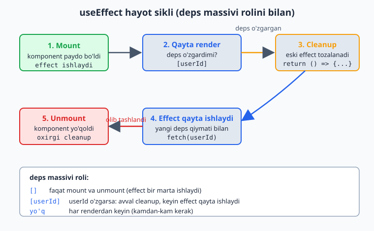
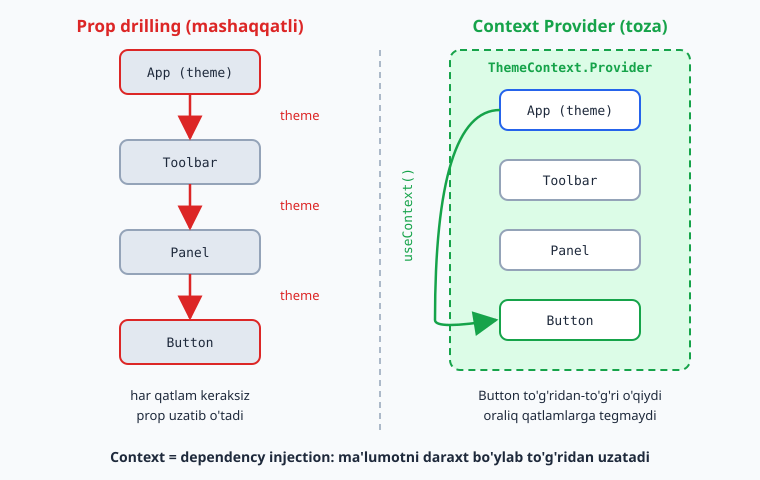
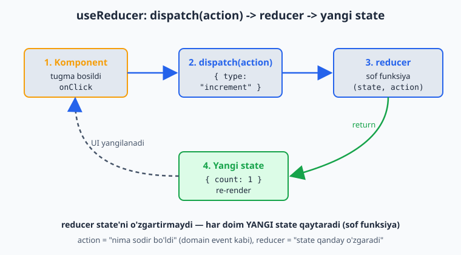
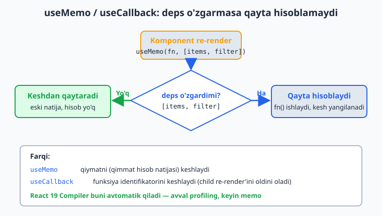

# Daraja 3 — Hooks olami

[⬅️ Oldingi: Daraja 2 — Interaktivlik: State va Events](./02-state-events.md) · [🏠 README](./README.md) · [Keyingi: Daraja 4 — Formalar va ma'lumotlar ➡️](./04-formalar.md)

---

Hook'lar — komponentlarga "qo'shimcha kuch" beruvchi funksiyalar (`use` bilan boshlanadi). `useState`ni allaqachon ko'rdik.

> **Hooks qoidalari (buzmaslik shart!):**
> 1. Hook'larni faqat komponent yoki boshqa hook *ichida*, eng yuqori darajada chaqiring.
> 2. **`if`, `for`, funksiya ichida hook chaqirmang** — har doim bir xil tartibda chaqirilishi kerak.

## 3.1. `useEffect` — side effect'lar

`useEffect` — render'dan *tashqaridagi* ishlar uchun: tarmoq so'rovi, taymer, brauzer API'lari, obuna (subscription).

> ⚠️ **2026-yilning eng muhim darsi:** `useEffect` — bu **oxirgi chora**, "to'g'ri yo'l" emas! Ko'p odam uni ma'lumot olishga ishlatadi — bu eski (2020) pattern. Zamonaviy yondashuvni Daraja 6 (TanStack Query) va Daraja 11 (Server Components)'da ko'rasiz. Hozir esa `useEffect`ni *tushunish* uchun o'rganamiz.

```jsx
import { useState, useEffect } from "react";

function Timer() {
  const [seconds, setSeconds] = useState(0);

  useEffect(() => {
    const id = setInterval(() => {
      setSeconds((s) => s + 1);
    }, 1000);

    // Cleanup — komponent yo'qolganda taymerni tozalaymiz
    return () => clearInterval(id);
  }, []); // [] = faqat bir marta (mount'da) ishlasin

  return <p>{seconds} soniya o'tdi</p>;
}
```

### Dependency array (eng muhim qism)

Quyidagi diagramma effect'ning to'liq hayot siklini ko'rsatadi — mount'da ishlaydi, deps o'zgarsa avval cleanup keyin qayta ishlaydi, unmount'da oxirgi marta tozalanadi:



```jsx
useEffect(() => { ... });           // har renderdan keyin (kamdan-kam kerak)
useEffect(() => { ... }, []);       // faqat bir marta (mount)
useEffect(() => { ... }, [userId]); // userId o'zgarganda
```

> **Strict Mode'da `useEffect` 2 marta ishlaydi** (development'da) — bu xato emas, cleanup'ingiz to'g'ri ekanini tekshirish uchun. Production'da 1 marta ishlaydi.

### Qachon `useEffect` KERAK EMAS?

```jsx
// ❌ Kerak emas — derived state (hosilaviy qiymat)
const [fullName, setFullName] = useState("");
useEffect(() => {
  setFullName(first + " " + last);
}, [first, last]);

// ✅ To'g'risi — render paytida hisoblang
const fullName = first + " " + last;
```

## 3.2. `useRef` — DOM va o'zgarmas qiymat

Ikki vazifasi bor: (1) DOM elementiga murojaat, (2) render'lar orasida qiymat saqlash (o'zgarsa ham re-render qilmaydi).

```jsx
import { useRef } from "react";

function FocusInput() {
  const inputRef = useRef(null);

  const focus = () => {
    inputRef.current.focus();  // DOM'ga to'g'ridan-to'g'ri
  };

  return (
    <>
      <input ref={inputRef} />
      <button onClick={focus}>Fokus qil</button>
    </>
  );
}
```

```jsx
// Render orasida qiymat saqlash (re-render qilmasdan)
function Stopwatch() {
  const countRef = useRef(0);
  countRef.current += 1;  // o'zgaradi, lekin re-render bo'lmaydi
}
```

> **React 19 yangiligi:** endi `ref`ni oddiy prop sifatida uzata olasiz — `forwardRef` kerak emas:
> ```jsx
> function MyInput({ ref, ...props }) {
>   return <input ref={ref} {...props} />;
> }
> ```

## 3.3. `useContext` — "prop drilling"dan qutulish

Ma'lumotni komponentlar daraxti bo'ylab har qatlamga props uzatmasdan tarqatish.

Quyidagi diagramma "prop drilling" (har qatlam orqali prop uzatish) bilan Context Provider/useContext yondashuvini yonma-yon solishtiradi:



```jsx
import { createContext, useContext, useState } from "react";

// 1. Context yaratish
const ThemeContext = createContext();

// 2. Provider bilan o'rash
function App() {
  const [theme, setTheme] = useState("light");
  return (
    <ThemeContext.Provider value={{ theme, setTheme }}>
      <Toolbar />
    </ThemeContext.Provider>
  );
}

// 3. Istalgan chuqurlikda ishlatish
function Toolbar() {
  return <ThemedButton />;  // theme'ni props sifatida uzatish shart emas
}

function ThemedButton() {
  const { theme, setTheme } = useContext(ThemeContext);
  return (
    <button onClick={() => setTheme(theme === "light" ? "dark" : "light")}>
      Hozirgi: {theme}
    </button>
  );
}
```

> **Muhim:** Context — bu **state manager emas**, balki *dependency injection* mexanizmi. Tez-tez o'zgaradigan ma'lumot uchun (har soniya) ishlatmang — performance muammosi chiqaradi. Buni Daraja 6'da ko'ramiz.

## 3.4. `useReducer` — murakkab state mantig'i

State logikasi murakkablashganda (ko'p maydon, ko'p action), `useState` o'rniga `useReducer`. Redux'ning kichik versiyasi.

Quyidagi diagramma `useReducer` oqimini ko'rsatadi: `dispatch(action)` reducer'ga boradi, reducer yangi state qaytaradi va komponent qayta render bo'ladi:



```jsx
import { useReducer } from "react";

const initialState = { count: 0 };

function reducer(state, action) {
  switch (action.type) {
    case "increment": return { count: state.count + 1 };
    case "decrement": return { count: state.count - 1 };
    case "reset":     return { count: 0 };
    default:          return state;
  }
}

function Counter() {
  const [state, dispatch] = useReducer(reducer, initialState);

  return (
    <div>
      <p>{state.count}</p>
      <button onClick={() => dispatch({ type: "increment" })}>+</button>
      <button onClick={() => dispatch({ type: "decrement" })}>-</button>
      <button onClick={() => dispatch({ type: "reset" })}>Reset</button>
    </div>
  );
}
```

> **Qachon `useReducer`?** Multi-step forma, murakkab UI holatlari, bir-biriga bog'liq state'lar. **DDD analogiyasi:** reducer — sof funksiya, `action` — domain event kabi.

## 3.5. `useMemo` va `useCallback` — memoizatsiya

Qimmat hisob-kitobni yoki funksiyani keraksiz qayta yaratmaslik uchun.

Quyidagi diagramma memoizatsiya mantig'ini ko'rsatadi: deps o'zgarmasa natija keshdan olinadi, faqat deps o'zgarganda qayta hisoblanadi:



```jsx
import { useMemo, useCallback } from "react";

function App({ items, filter }) {
  // Faqat items yoki filter o'zgarganda qayta hisoblanadi
  const filtered = useMemo(() => {
    return items.filter((i) => i.includes(filter));
  }, [items, filter]);

  // Funksiya identifikatorini saqlaydi (child re-render'ini oldini olish)
  const handleClick = useCallback(() => {
    console.log("bosildi");
  }, []);

  return <Child onClick={handleClick} data={filtered} />;
}
```

> ⚠️ **2026 muhim yangilik — React Compiler:** React 19 bilan kelgan compiler memoizatsiyani **avtomatik** qiladi. Ya'ni kelajakda `useMemo`/`useCallback`ni qo'lda yozish kamayadi. Lekin **ularni tushunish kerak** — eski kod va compiler yo'q joylarda hali ham ishlatiladi. **Maslahat:** premature optimization qilmang — avval profiling, keyin memo.

## 3.6. Custom hooks — o'z hook'ingizni yozish

Takrorlanuvchi mantiqni qayta ishlatiladigan funksiyaga ajrating. `use` bilan boshlansa bo'ldi.

```jsx
// useToggle.js
import { useState } from "react";

function useToggle(initial = false) {
  const [value, setValue] = useState(initial);
  const toggle = () => setValue((v) => !v);
  return [value, toggle];
}

// Ishlatish:
function Modal() {
  const [isOpen, toggle] = useToggle();
  return (
    <>
      <button onClick={toggle}>{isOpen ? "Yopish" : "Ochish"}</button>
      {isOpen && <div>Modal oynasi</div>}
    </>
  );
}
```

Ko'proq foydali custom hook:

```jsx
// useLocalStorage.js
import { useState, useEffect } from "react";

function useLocalStorage(key, initial) {
  const [value, setValue] = useState(() => {
    const stored = localStorage.getItem(key);
    return stored ? JSON.parse(stored) : initial;
  });

  useEffect(() => {
    localStorage.setItem(key, JSON.stringify(value));
  }, [key, value]);

  return [value, setValue];
}
```

> **Bu — React'da kodni qayta ishlatishning eng kuchli usuli.** Custom hooks orqali siz o'z "kutubxonangizni" yasaysiz. Backend'dagi Service/Repository pattern'iga o'xshash — mantiqni komponentdan ajratadi.

## 3.7. Keng tarqalgan xatolar

| Xato | To'g'risi |
|------|-----------|
| `useEffect`ni ma'lumot olishga "asosiy yo'l" deb ishlatish | TanStack Query / RSC (Daraja 6, 11) |
| Dependency array'ni unutish (`[]` qo'ymaslik) | Cheksiz loop'ga olib keladi |
| Effect ichida cleanup qilmaslik (taymer, listener) | `return () => {...}` |
| `if` ichida hook chaqirish | Faqat top-level |
| Hamma joyga `useMemo`/`useCallback` (premature) | Avval profiling |
| Derived state'ni `useEffect`+`useState` bilan | Render paytida hisoblash |

## +20 Masala — Daraja 3

**Oson (`useEffect`, `useRef`):**
1. Sahifa ochilganda `console.log("Mount!")` chiqaring (effect, `[]`).
2. Har soniya o'sadigan taymer yarating (cleanup bilan).
3. Input'ga avtomatik fokus bering (`useRef`, mount'da).
4. State o'zgarganda `document.title`ni yangilang.
5. Tugmaning necha marta bosilganini `useRef`'da saqlang (re-render qilmasdan).
6. 5 soniyalik countdown taymer yarating (0 da to'xtasin).
7. Oyna o'lchami (`window.innerWidth`)ni real vaqtda ko'rsating (resize listener + cleanup).
8. Toggle qiluvchi tugma yarating (ochiq/yopiq).

**O'rta (`useContext`, `useReducer`, custom hook):**
9. Theme switcher: `useContext` bilan light/dark rejim (butun ilovaga).
10. `useToggle` custom hook'ini yozing va modal'da ishlating.
11. `useLocalStorage` hook'ini yozing va todo ro'yxatini saqlang.
12. Savatchani `useReducer` bilan boshqaring (ADD, REMOVE, CLEAR).
13. `useReducer` bilan multi-step forma holati.
14. `useFetch` custom hook'ini yozing (loading, error, data qaytarsin).
15. `useDebounce` hook'ini yozing va qidiruv inputida ishlating.

**Qiyin:**
16. `useWindowSize`, `usePrevious`, `useOnlineStatus` — 3 ta custom hook yozing.
17. Auth kontekstini quring: `login`, `logout`, `user` — `useContext` + `useReducer`.
18. Stopwatch: start/stop/reset, lap vaqtlari (`useRef` + `useState` kombinatsiyasi).
19. `useMemo` bilan: 10000 elementli ro'yxatni filterlash (performance farqini sezing).
20. Infinite scroll mantiqi: scroll oxiriga yetganda yangi ma'lumot yuklash (`useRef` + `useEffect` + IntersectionObserver).

<details markdown="1">
<summary>✅ Qiyin masalalar yechimi (16–20)</summary>

**16 — 3 ta custom hook:**
```jsx
function useWindowSize() {
  const [size, setSize] = useState({ w: window.innerWidth, h: window.innerHeight });
  useEffect(() => {
    const onResize = () => setSize({ w: window.innerWidth, h: window.innerHeight });
    window.addEventListener("resize", onResize);
    return () => window.removeEventListener("resize", onResize); // cleanup SHART
  }, []);
  return size;
}

function usePrevious(value) {
  const ref = useRef();
  useEffect(() => { ref.current = value; }, [value]); // render'dan keyin yangilanadi
  return ref.current; // shuning uchun "oldingi" qiymatni qaytaradi
}

function useOnlineStatus() {
  const [online, setOnline] = useState(navigator.onLine);
  useEffect(() => {
    const on = () => setOnline(true), off = () => setOnline(false);
    window.addEventListener("online", on);
    window.addEventListener("offline", off);
    return () => { window.removeEventListener("online", on); window.removeEventListener("offline", off); };
  }, []);
  return online;
}
```

**17 — Auth (`useContext` + `useReducer`):**
```jsx
const AuthContext = createContext(null);

function authReducer(state, action) {
  switch (action.type) {
    case "login":  return { user: action.user };
    case "logout": return { user: null };
    default:       return state;
  }
}
function AuthProvider({ children }) {
  const [state, dispatch] = useReducer(authReducer, { user: null });
  const login = (user) => dispatch({ type: "login", user });
  const logout = () => dispatch({ type: "logout" });
  return (
    <AuthContext.Provider value={{ user: state.user, login, logout }}>
      {children}
    </AuthContext.Provider>
  );
}
export const useAuth = () => useContext(AuthContext); // qulay custom hook
```

**18 — Stopwatch** (`useRef` interval uchun, cleanup bilan):
```jsx
function Stopwatch() {
  const [ms, setMs] = useState(0);
  const [yurib, setYurib] = useState(false);
  const intervalRef = useRef(null);

  useEffect(() => {
    if (yurib) intervalRef.current = setInterval(() => setMs((m) => m + 10), 10);
    return () => clearInterval(intervalRef.current); // har safar tozalanadi
  }, [yurib]);

  return (
    <div>
      <p>{(ms / 1000).toFixed(2)}s</p>
      <button onClick={() => setYurib(true)}>Start</button>
      <button onClick={() => setYurib(false)}>Stop</button>
      <button onClick={() => { setYurib(false); setMs(0); }}>Reset</button>
    </div>
  );
}
```

**19 — `useMemo` bilan filtrlash** (qimmat hisobni keshlash):
```jsx
function BigList({ items, query }) {
  const filtered = useMemo(
    () => items.filter((it) => it.toLowerCase().includes(query.toLowerCase())),
    [items, query] // faqat shular o'zgarsa qayta hisoblanadi
  );
  return <ul>{filtered.map((it, i) => <li key={i}>{it}</li>)}</ul>;
}
```

**20 — Infinite scroll** (`IntersectionObserver` — yo'nalish):
```jsx
function useInfiniteScroll(onReachEnd) {
  const sentinelRef = useRef(null);
  useEffect(() => {
    const obs = new IntersectionObserver(
      ([entry]) => { if (entry.isIntersecting) onReachEnd(); }
    );
    if (sentinelRef.current) obs.observe(sentinelRef.current);
    return () => obs.disconnect();
  }, [onReachEnd]);
  return sentinelRef; // ro'yxat oxiridagi bo'sh <div ref={sentinelRef}/> ga ulanadi
}
```
"Sentinel" element ekranga kirsa — `onReachEnd` chaqiriladi (yangi sahifa yuklanadi). `scroll` event'dan tozaroq va tezroq.
</details>
