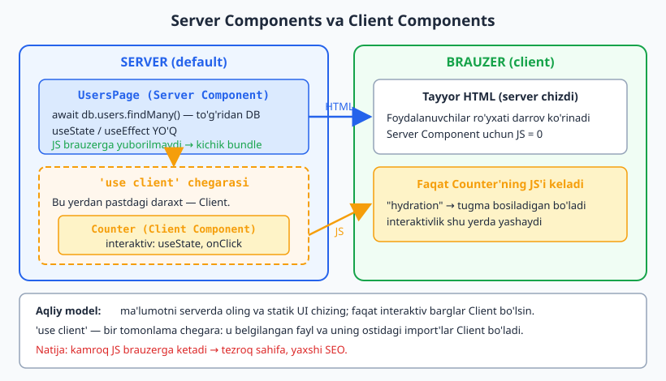
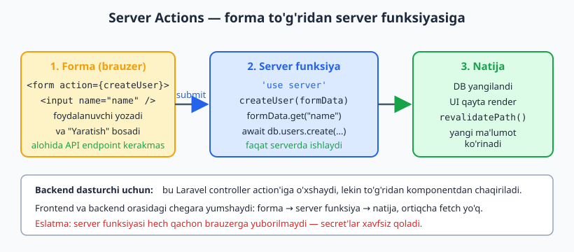
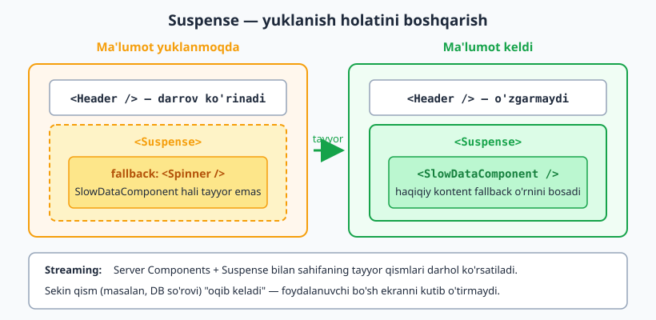

# Daraja 11 — Production va ekotizim

[⬅️ Oldingi: Daraja 10 — Testing](./10-testing.md) · [🏠 README](./README.md) · [Keyingi: Daraja 12 — Expert: Arxitektura va scaling ➡️](./12-arxitektura.md)

---

Bu darajada haqiqiy production ilovalarni quryapsiz. **Next.js** — bugungi kunda React'ning de-fakto production framework'i.

## 11.1. Nega framework?

> **2026 rasmiy maslahat:** React jamoasi yangi ilovalar uchun **framework** tavsiya qiladi (Vite SPA emas, agar SEO/SSR/data-loading kerak bo'lsa). Sabab: routing, data fetching, SSR, code splitting, optimizatsiya — hammasi tayyor.

Variantlar: **Next.js** (eng mashhur), **React Router v7 framework mode** (eski Remix), **TanStack Start**, **Expo** (mobil).

## 11.2. Next.js asoslari (App Router)

```bash
npx create-next-app@latest my-app --typescript --tailwind --eslint --app
```

Fayl-tizimga asoslangan routing:

```
app/
├── layout.tsx          ← umumiy layout
├── page.tsx            ← / sahifa
├── about/
│   └── page.tsx        ← /about
└── users/
    ├── page.tsx        ← /users
    └── [id]/
        └── page.tsx    ← /users/:id
```

## 11.3. Server Components (eng katta o'zgarish)

> **Tushuncha:** App Router'da komponentlar **default holda serverda** ishlaydi (Server Components). Ular brauzerga JS yubormaydi — to'g'ridan-to'g'ri ma'lumotlar bazasiga murojaat qilishi mumkin. Interaktivlik kerak bo'lsa `"use client"` qo'shasiz.

```tsx
// app/users/page.tsx — Server Component (default)
async function UsersPage() {
  // To'g'ridan-to'g'ri DB/API'dan — useEffect, useState YO'Q
  const users = await db.users.findMany();

  return (
    <ul>
      {users.map((u) => <li key={u.id}>{u.name}</li>)}
    </ul>
  );
}
```

```tsx
// Client Component — interaktivlik kerak bo'lganda
"use client";
import { useState } from "react";

function Counter() {
  const [count, setCount] = useState(0);
  return <button onClick={() => setCount(count + 1)}>{count}</button>;
}
```

> **Aqliy model:** Server Component'da ma'lumot oling va statik UI chizing. Faqat *interaktiv barglar* (button, forma, input) Client Component bo'lsin. Bu — kamroq JS, tezroq sahifa.

Quyidagi diagramma `"use client"` chegarasi qayerdan o'tishini va brauzerga faqat Client komponentlarning JS'i yuborilishini ko'rsatadi:



## 11.4. Server Actions

Forma yuborishni server funksiyasi bilan — alohida API endpoint yozmasdan.

```tsx
// Server Action
async function createUser(formData: FormData) {
  "use server";
  const name = formData.get("name");
  await db.users.create({ data: { name } });
}

// Komponentda
function Form() {
  return (
    <form action={createUser}>
      <input name="name" />
      <button>Yaratish</button>
    </form>
  );
}
```

> **Backend dasturchi uchun jozibali:** Server Actions — frontend va backend orasidagi chegarani yumshatadi. Laravel'dagi controller action'iga o'xshash, lekin to'g'ridan-to'g'ri komponentdan chaqiriladi.

Oqim oddiy: forma yuboriladi, server funksiyasi ishlaydi va natija qaytib UI'ni yangilaydi:



## 11.5. Suspense — yuklanishni boshqarish

```tsx
import { Suspense } from "react";

function Page() {
  return (
    <div>
      <Header />
      <Suspense fallback={<Spinner />}>
        <SlowDataComponent />   {/* yuklanguncha Spinner ko'rinadi */}
      </Suspense>
    </div>
  );
}
```

Server Components + Suspense = **streaming** — sahifaning tayyor qismlari darhol ko'rsatiladi, sekin qismlar keyin "oqib keladi".

Quyidagi diagramma yuklanish paytida `fallback` ko'rinishini, ma'lumot tayyor bo'lganda esa uning haqiqiy kontent bilan almashinishini ko'rsatadi:



## 11.6. Ma'lumot olish strategiyasi (umumiy)

| Holat | Yechim |
|-------|--------|
| Server'da renderlanadigan ma'lumot | Server Component (`async`/`await`) |
| Client'dagi interaktiv ma'lumot | TanStack Query |
| Forma yuborish | Server Actions / `useActionState` |
| Real-time | WebSocket / SSE |

## 11.7. Deploy

- **Vercel** — Next.js uchun eng oson (bir tugma).
- **VPS (sizning stack)** — `npm run build` + `npm start`, Nginx reverse proxy, PM2/systemd, Cloudflare oldida. SPA bo'lsa — statik fayllar (`dist/`) Nginx orqali.
- **Docker** — izchil muhit uchun.

```nginx
# SPA uchun Nginx (Vite build)
location / {
  try_files $uri $uri/ /index.html;   # client-side routing uchun
}
```

## 11.8. Production checklist

- ✅ Environment o'zgaruvchilar (`.env`, secret'larni commit qilmang)
- ✅ Error tracking (Sentry)
- ✅ Analytics
- ✅ SEO (meta teglar, `next/head` yoki metadata)
- ✅ Image optimizatsiya (`next/image`)
- ✅ Lighthouse skori 90+
- ✅ Accessibility (a11y) tekshiruvi
- ✅ Bundle hajmi nazorati

## 11.9. Keng tarqalgan xatolar

| Xato | To'g'risi |
|------|-----------|
| Hamma komponentga `"use client"` | Faqat interaktiv barglarga |
| Server Component'da `useState`/`useEffect` | Ular faqat Client'da |
| Secret'larni client kodga qo'yish | Faqat serverda (`process.env`) |
| SPA'da Nginx `try_files`'ni unutish | Routing buziladi |
| `next/image`siz katta rasmlar | Optimizatsiya qiling |

## +20 Masala — Daraja 11

**Oson:**
1. Next.js loyiha yarating va 3 sahifa qo'shing (App Router).
2. `layout.tsx` bilan umumiy navigatsiya yarating.
3. Server Component'da statik ma'lumotni ko'rsating.
4. Dinamik route `/blog/[slug]` yarating.
5. `loading.tsx` bilan yuklanish holatini ko'rsating.
6. `not-found.tsx` (404) sahifa yarating.
7. `<Link>` bilan navigatsiya qiling.
8. Metadata (sahifa title/description) qo'shing.

**O'rta:**
9. Server Component'da API'dan ma'lumot olib ro'yxat chizing.
10. Client Component bilan interaktiv tugma qo'shing (`"use client"`).
11. Server Action bilan forma yuborish.
12. Suspense + streaming bilan sekin komponentni o'rang.
13. `next/image` bilan rasmlarni optimallashtiring.
14. Server va Client komponentlarni to'g'ri ajrating (bitta sahifada).
15. Environment o'zgaruvchilar bilan API kalitini yashiring.

**Qiyin:**
16. To'liq blog: Server Components (ro'yxat/detail) + Server Actions (izoh qo'shish).
17. Autentifikatsiya: middleware + himoyalangan sahifalar (Next.js).
18. SSR + TanStack Query gibrid (hydration).
19. Loyihani VPS'ga deploy qiling (Nginx + PM2 + Cloudflare).
20. EduCore'ning bitta modulini Next.js App Router bilan to'liq qiling (multi-tenant, SSR, Server Actions).

<details markdown="1">
<summary>✅ Qiyin masalalar yechimi (16–20)</summary>

**16 — Blog: Server Components + Server Actions:**
```tsx
// app/posts/page.tsx — Server Component (serverda ishlaydi, DB'ga to'g'ridan kiradi)
async function PostsPage() {
  const posts = await db.posts.findMany();
  return <ul>{posts.map((p) => <li key={p.id}>{p.title}</li>)}</ul>;
}

// Server Action — izoh qo'shish (alohida API endpoint kerak emas)
async function addComment(formData: FormData) {
  "use server";
  const text = formData.get("text");
  await db.comments.create({ data: { text } });
}
function CommentForm() {
  return (
    <form action={addComment}>
      <input name="text" />
      <button>Yuborish</button>
    </form>
  );
}
```

**17 — Auth middleware** (himoyalangan sahifalar):
```ts
// middleware.ts
import { NextResponse } from "next/server";
import type { NextRequest } from "next/server";

export function middleware(request: NextRequest) {
  const token = request.cookies.get("token");
  if (!token && request.nextUrl.pathname.startsWith("/dashboard")) {
    return NextResponse.redirect(new URL("/login", request.url));
  }
  return NextResponse.next();
}
export const config = { matcher: ["/dashboard/:path*"] };
```

**19 — VPS deploy** (jarayon, yo'nalish):
1. `npm run build` → `npm start` (yoki `output: "standalone"`).
2. **PM2**: `pm2 start npm --name app -- start` (jarayonni doimiy ushlaydi).
3. **Nginx**: reverse proxy `localhost:3000` → `80`/`443` portga.
4. **Cloudflare**: DNS + SSL + CDN.
> Yoki osonroq: **Vercel** (`git push` → avtomatik deploy) — Next.js uchun mo'ljallangan.

> (18 — SSR + TanStack Query hydration: serverda `prefetchQuery` → `<HydrationBoundary>` bilan clientga uzatish; 20 — EduCore moduli: 16 (RSC/Actions) + 17 (auth) + `/:tenant` segment birga.)

> **Eslatma:** bu daraja Next.js'ga *kirish* — chuqurroq uchun alohida Next.js qo'llanmasi kerak. Bu yerda React bilimi Next.js kontekstida qanday ishlashini ko'rsatdik.
</details>
