# ReactJS — 0 dan Expert darajagacha (2026 nashri)

> **Bu qo'llanma kim uchun?** Hech qachon React ko'rmagan, lekin JavaScript bilan ozgina tanish bo'lgan boshlovchilar uchun. Oxirida siz production-ready React ilovalarini yoza oladigan, ekotizimni tushunadigan va arxitektura qaror qabul qila oladigan dasturchi bo'lasiz.
>
> **Qoidalar:**
> - Har bir daraja oldingisiga tayanadi — tartib bilan o'ting, sakramang.
> - Har darajada **20 ta masala** bor (oson → qiyin). Masalalarni *yechmasdan* keyingisiga o'tmang. Bilim faqat yozish bilan o'rnashadi.
> - Kod misollari **React 19** uchun yozilgan (2026-yilning standarti).
> - "Keng tarqalgan xatolar" bo'limlarini e'tibordan qochirmang — ko'pchilik aynan shu joylarda qoqiladi.

---

## Yo'l xaritasi (Roadmap)

| Daraja | Mavzu | Nima ochiladi |
|--------|-------|---------------|
| [**0**](#daraja-0) | Tayyorgarlik | JavaScript (ES6+), muhit sozlash |
| [**1**](#daraja-1) | React asoslari | JSX, Component, Props |
| [**2**](#daraja-2) | Interaktivlik | State, Event, Conditional rendering, Lists |
| [**3**](#daraja-3) | Hooks olami | useEffect, useRef, useContext, useReducer, useMemo/useCallback, custom hooks |
| [**4**](#daraja-4) | Formalar va ma'lumotlar | Controlled forms, validation, API, React 19 Actions |
| [**5**](#daraja-5) | Routing | React Router v7 |
| [**6**](#daraja-6) | State management | Server state (TanStack Query) + Client state (Zustand, Redux Toolkit) |
| [**7**](#daraja-7) | Performance | React.memo, code splitting, React Compiler, profiling |
| [**8**](#daraja-8) | Advanced patterns | Compound components, render props, HOC, portals, error boundaries |
| [**9**](#daraja-9) | TypeScript bilan React | Typed props, hooks, generics |
| [**10**](#daraja-10) | Testing | Vitest + React Testing Library |
| [**11**](#daraja-11) | Production & ekotizim | Next.js, Server Components, Suspense, deploy |
| [**12**](#daraja-12) | Expert | Arxitektura, scaling, design qarorlari |

---

<a id="daraja-0"></a>

# Daraja 0 — Tayyorgarlik

React'ni o'rganishdan oldin **JavaScript'ni bilish shart**. Ko'p odam "React qiyin" deydi, aslida ularning muammosi JavaScript bilan. React — bu shunchaki JavaScript kutubxonasi.

## 0.1. Kerakli JavaScript (ES6+)

Quyidagilarni **erkin** ishlata olishingiz kerak. Agar bittasi notanish bo'lsa, avval shuni o'rganing.

### `let` va `const` (`var` emas)

```js
const PI = 3.14;      // qiymati o'zgarmaydi
let count = 0;        // qiymati o'zgaradi
count = count + 1;
```

### Arrow functions

```js
// Oddiy funksiya
function add(a, b) {
  return a + b;
}

// Arrow ko'rinishi
const add = (a, b) => a + b;

// React'da doimo shunaqa ko'rasiz:
const greet = (name) => `Salom, ${name}!`;
```

### Destructuring (eng ko'p ishlatiladi)

```js
const user = { name: "Ali", age: 25 };
const { name, age } = user;   // user.name, user.age o'rniga

const colors = ["qizil", "yashil"];
const [first, second] = colors;
```

### Spread / Rest

```js
const arr1 = [1, 2];
const arr2 = [...arr1, 3, 4];   // [1, 2, 3, 4] — nusxa olish

const obj1 = { a: 1 };
const obj2 = { ...obj1, b: 2 };  // { a: 1, b: 2 }
```

> **Muhim:** React'da state'ni *hech qachon* to'g'ridan-to'g'ri o'zgartirmaymiz, balki spread bilan **yangi nusxa** yasaymiz. Bu pattern'ni hozir o'zlashtiring.

### Array metodlari: `map`, `filter`, `reduce`

```js
const nums = [1, 2, 3, 4];

const doubled = nums.map(n => n * 2);        // [2, 4, 6, 8]
const evens   = nums.filter(n => n % 2 === 0); // [2, 4]
const sum     = nums.reduce((acc, n) => acc + n, 0); // 10
```

> `map` — React'da ro'yxat chizishning asosi. Yoddan biling.

### Ternary va `&&`

```js
const status = isLoggedIn ? "Kirgan" : "Mehmon";
const greeting = isLoggedIn && "Xush kelibsiz!";
```

### Modules (import / export)

```js
// math.js
export const add = (a, b) => a + b;
export default function multiply(a, b) { return a * b; }

// app.js
import multiply, { add } from "./math.js";
```

### Promise / async-await

```js
async function getUser() {
  const res = await fetch("https://api.example.com/user");
  const data = await res.json();
  return data;
}
```

## 0.2. Muhit sozlash

1. **Node.js** o'rnating (LTS versiya, 20+). Tekshirish:
   ```bash
   node -v
   npm -v
   ```
2. **Code muharriri** — VS Code. Quyidagi extension'larni o'rnating:
   - ES7+ React/Redux/React-Native snippets
   - Prettier (kod formatlash)
   - ESLint
3. **Brauzer** — Chrome + **React Developer Tools** extension.

## 0.3. Birinchi loyiha (Vite bilan)

> ⚠️ **Create React App (CRA) o'lgan** — 2025-yilda rasman deprecated qilingan. Yangi SPA loyihalar uchun **Vite** ishlatamiz (tez, yengil, zamonaviy). Katta production ilovalar uchun keyinroq **Next.js**'ni ko'ramiz.

```bash
npm create vite@latest my-app -- --template react
cd my-app
npm install
npm run dev
```

Brauzerda `http://localhost:5173` ochiladi. Tabriklaymiz — bu sizning birinchi React ilovangiz.

### Loyiha tuzilishi

```
my-app/
├── index.html        ← yagona HTML fayl (SPA)
├── package.json      ← bog'liqliklar (dependencies)
├── vite.config.js    ← Vite sozlamalari
└── src/
    ├── main.jsx       ← kirish nuqtasi (entry point)
    ├── App.jsx        ← ildiz komponent
    └── index.css
```

`src/main.jsx` — bu yerda React DOM'ga ulanadi:

```jsx
import { StrictMode } from "react";
import { createRoot } from "react-dom/client";
import App from "./App.jsx";

createRoot(document.getElementById("root")).render(
  <StrictMode>
    <App />
  </StrictMode>
);
```

> `StrictMode` — development'da xatolarni topishga yordam beradi (ba'zi narsalarni 2 marta chaqiradi — bu normal, qo'rqmang).

## +20 Masala — Daraja 0

**Oson (JavaScript mashqi):**
1. `[5, 12, 8, 130, 44]` massividan 10 dan katta sonlarni `filter` bilan ajrating.
2. Ismlar massivini (`["ali", "vali"]`) `map` bilan bosh harfi kattaga aylantiring (`["Ali", "Vali"]`).
3. `reduce` bilan `[10, 20, 30]` massivining yig'indisini toping.
4. Obyektdan destructuring bilan `name` va `email`ni ajratib chiqaring.
5. Ikki massivni spread operatori bilan birlashtiring va dublikatlarni `Set` bilan olib tashlang.
6. Arrow function yozing: ikki sonni qabul qilib, kattasini qaytaradi (ternary bilan).
7. `const`, `let`, `var` farqini 3 ta misol bilan tushuntiring (kommentariy yozing).
8. Obyekt massivini (`[{id:1,name:"a"}]`) faqat `name`lar massiviga `map` bilan aylantiring.

**O'rta:**
9. `async/await` bilan `https://jsonplaceholder.typicode.com/users` dan ma'lumot oling va konsol'ga chiqaring.
10. Funksiya yozing: massiv qabul qilib, eng katta va eng kichik elementni `{min, max}` obyekt sifatida qaytarsin.
11. `map` + `filter`ni zanjir qiling: sonlar massividan juftlarini ikki barobar oshiring.
12. Obyektni spread bilan "yangilang" (bittasini o'zgartirib, qolganini saqlab) — immutable update.
13. `Promise.all` bilan 3 ta API'dan parallel ma'lumot oling.
14. `reduce` bilan obyektlar massivini ID bo'yicha guruhlang (group by).
15. Optional chaining (`?.`) va nullish coalescing (`??`) bilan xavfsiz qiymat o'qing.

**Qiyin:**
16. Vite bilan yangi loyiha yarating va `App.jsx`'da o'z ismingizni chiqaring.
17. `package.json`'dagi `dependencies` va `devDependencies` farqini yozib tushuntiring.
18. Sof JavaScript bilan kichik "todo" mantiqini yozing (qo'shish/o'chirish funksiyalari, hali UI yo'q).
19. `debounce` funksiyasini noldan yozing (keyin React'da kerak bo'ladi).
20. Closure tushunchasini misol bilan tushuntiring: counter funksiyasi yarating.

<details markdown="1">
<summary>✅ Qiyin masalalar yechimi (16–20)</summary>

**16 — Vite loyiha + ism:**
```jsx
// src/App.jsx
export default function App() {
  const ism = "Oqil";
  return <h1>Salom, mening ismim {ism}</h1>;
}
```
`npm create vite@latest` → React tanlang → `npm install` → `npm run dev`.

**17 — `dependencies` vs `devDependencies`:**
- **`dependencies`** — ilova ishlashi uchun kerak bo'lgan paketlar (`react`, `react-dom`). Production build'ga kiradi.
- **`devDependencies`** — faqat ishlab chiqishda kerak (`vite`, `eslint`, `vitest`). Tayyor mahsulotga kirmaydi.
- O'rnatish: `npm i react` (dependencies) vs `npm i -D vite` (devDependencies).

**18 — Todo mantiqi (sof JS, UI'siz):**
```js
let todos = [];
let nextId = 1;

function addTodo(text) {
  todos.push({ id: nextId++, text, done: false });
}
function removeTodo(id) {
  todos = todos.filter((t) => t.id !== id);
}
function toggleTodo(id) {
  todos = todos.map((t) => (t.id === id ? { ...t, done: !t.done } : t));
}
```
Diqqat: o'zgartirishda **yangi massiv/obyekt** yasaymiz (`filter`, `map`, `{...t}`) — bu React'da state yangilashning asosiy qoidasi (keyingi darajada ko'ramiz).

**19 — `debounce` noldan:**
```js
function debounce(fn, delay) {
  let timer;
  return function (...args) {
    clearTimeout(timer);
    timer = setTimeout(() => fn.apply(this, args), delay);
  };
}
// Har chaqirilganda oldingi taymerni bekor qiladi — faqat "tinchlik"dan keyin ishlaydi.
// Qidiruv input'ida har harfda emas, yozib bo'lgach API chaqirish uchun ishlatamiz.
```

**20 — Closure bilan counter:**
```js
function createCounter() {
  let count = 0; // closure ichida "yashiringan", tashqaridan to'g'ridan kirib bo'lmaydi
  return {
    increment: () => ++count,
    decrement: () => --count,
    value: () => count,
  };
}
const c = createCounter();
c.increment(); c.increment();
console.log(c.value()); // 2
```
`count` faqat qaytarilgan funksiyalar orqali o'zgaradi — bu **closure**. `useState` ham xuddi shu g'oyaga asoslanadi: holat funksiya "ichida" saqlanadi.
</details>

---

<a id="daraja-1"></a>

# Daraja 1 — React asoslari

## 1.1. React nima va nega kerak?

React — foydalanuvchi interfeysi (UI) yasash uchun JavaScript kutubxonasi. Asosiy g'oyalari:

- **Komponentlar** — UI'ni mustaqil, qayta ishlatiladigan bo'laklarga bo'lamiz.
- **Deklarativ** — "qanday chizishni" emas, "nima ko'rinishi kerakligini" aytamiz. State o'zgarsa, React UI'ni o'zi yangilaydi.
- **Bir tomonlama ma'lumot oqimi** — ma'lumot yuqoridan pastga (parent → child) oqadi.

> **Backend analogiyasi (Laravel'dan):** Komponent — bu Blade component (`<x-card>`) kabi. Props — komponentga uzatilgan parametrlar. Lekin React'da hammasi brauzerda, real vaqtda yangilanadi.

## 1.2. JSX

JSX — JavaScript ichida HTML kabi yozish imkoniyati. Brauzer buni tushunmaydi, Vite uni oddiy JavaScript'ga aylantiradi.

Quyidagi diagramma JSX'ning brauzergacha bo'lgan yo'lini ko'rsatadi — u aslida `React.createElement` chaqiruviga, undan oddiy obyektga aylanadi:

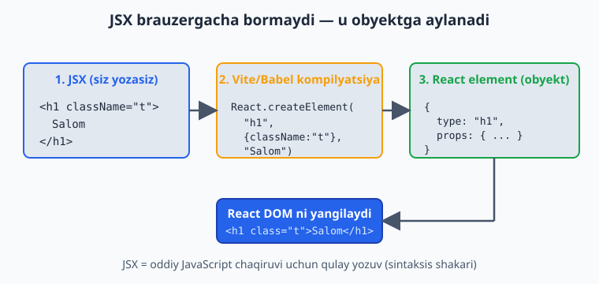

```jsx
const element = <h1>Salom, dunyo!</h1>;
```

### JSX qoidalari

```jsx
function App() {
  const name = "Oqil";
  const isAdmin = true;

  return (
    // 1. Bitta ildiz element bo'lishi shart (yoki Fragment <>...</>)
    <div>
      {/* 2. JavaScript {} ichida yoziladi */}
      <h1>Salom, {name}!</h1>

      {/* 3. class emas, className */}
      <p className="text-lg">Matn</p>

      {/* 4. Shartli ko'rsatish */}
      {isAdmin && <button>Admin paneli</button>}

      {/* 5. Inline style — obyekt sifatida */}
      <span style={{ color: "red", fontSize: "20px" }}>Qizil</span>

      {/* 6. Teglar yopilishi shart:  <br /> */}
      
    </div>
  );
}
```

> **Eslab qoling:** `class` → `className`, `for` → `htmlFor`, `onclick` → `onClick` (camelCase).

### Fragment

Ortiqcha `<div>` qo'shmaslik uchun:

```jsx
function List() {
  return (
    <>
      <li>Birinchi</li>
      <li>Ikkinchi</li>
    </>
  );
}
```

## 1.3. Komponentlar

Komponent — bu JSX qaytaradigan oddiy funksiya. **Nomi katta harf bilan boshlanishi shart.**

Komponentlar bir-birining ichiga joylashib, ildiz `App`'dan tarmoqlanuvchi daraxt hosil qiladi:

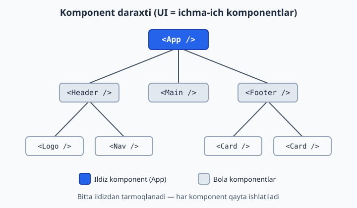

```jsx
// Welcome.jsx
function Welcome() {
  return <h1>Xush kelibsiz!</h1>;
}

export default Welcome;
```

Ishlatish:

```jsx
import Welcome from "./Welcome.jsx";

function App() {
  return (
    <div>
      <Welcome />
      <Welcome />  {/* qayta ishlatish mumkin */}
    </div>
  );
}
```

## 1.4. Props

Props — komponentga ma'lumot uzatish usuli (HTML atributlari kabi). Props **faqat o'qish uchun** (read-only) — komponent ichida o'zgartirib bo'lmaydi.

Ma'lumot doimo ota'dan bola'ga, bir tomonlama oqadi — bola uni o'zgartira olmaydi:

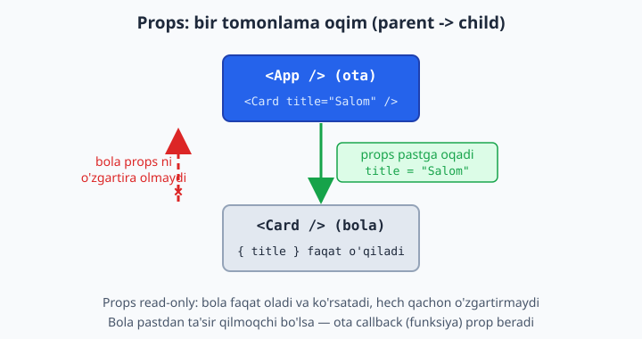

```jsx
// Card.jsx
function Card({ title, description }) {   // destructuring bilan
  return (
    <div className="card">
      <h2>{title}</h2>
      <p>{description}</p>
    </div>
  );
}

// App.jsx
function App() {
  return (
    <div>
      <Card title="Birinchi" description="Tavsif 1" />
      <Card title="Ikkinchi" description="Tavsif 2" />
    </div>
  );
}
```

### `children` prop

Komponent teglari orasidagi narsa `children`ga tushadi:

```jsx
function Box({ children }) {
  return <div className="box">{children}</div>;
}

// Ishlatish:
<Box>
  <p>Bu matn children bo'lib uzatiladi</p>
</Box>
```

### Default qiymatlar

```jsx
function Button({ text = "Bosing", color = "blue" }) {
  return <button style={{ background: color }}>{text}</button>;
}
```

## 1.5. Keng tarqalgan xatolar

| Xato | To'g'risi |
|------|-----------|
| Komponent nomini kichik harf bilan boshlash (`card`) | Katta harf (`Card`) |
| `return` ichida bir nechta ildiz element | Fragment `<>` yoki `<div>` bilan o'rash |
| Props'ni komponent ichida o'zgartirish | Props read-only — o'zgartirmang |
| `class` ishlatish | `className` |
| Teglarni yopmaslik (``) | `` |

## +20 Masala — Daraja 1

**Oson:**
1. `Greeting` komponentini yarating: "Assalomu alaykum" deb chiqarsin.
2. `Profile` komponenti yarating: `name`, `age` props'ini olib chiqarsin.
3. `Avatar` komponenti: `src` va `alt` props'ini olib `` chizsin.
4. Bitta `App` ichida `Greeting`ni 3 marta chizing.
5. `Button` komponenti: `label` props'i bo'lmasa default "Bosing" chiqarsin.
6. JSX'da inline style bilan ko'k fonli quti chizing.
7. `Card` komponenti yarating va `children` orqali ichiga matn joylang.
8. Ternary bilan: `isOnline` props'iga qarab "🟢 Online" yoki "🔴 Offline" chiqarsin.

**O'rta:**
9. `UserCard`: `user` obyektini props sifatida oling (`{name, email, avatar}`) va chiroyli karta chizing.
10. `PriceTag`: `price` va `currency` props'ini olib `"$25"` formatida chiqarsin.
11. `List` komponenti yarating, ichida 5 ta `Card`ni turli props bilan chizing.
12. `Badge` komponenti: `type` props'iga (`success`/`error`/`warning`) qarab turli `className` bersin.
13. `Layout` komponenti: `header`, `footer` slot'larini props sifatida olsin (children pattern).
14. Komponentni alohida faylga ajrating va to'g'ri `import`/`export` qiling.
15. `&&` bilan: `isPremium` props bo'lsagina "⭐ Premium" belgisini ko'rsating.

**Qiyin:**
16. `Accordion` komponentining *statik* (hali interaktiv emas) versiyasini yarating — sarlavha + matn.
17. `Rating` komponenti: `value` (1-5) props'ini olib shuncha ⭐ chizsin (`Array.from` + `map`).
18. Komponentlar daraxtini quring: `App > Sidebar > MenuItem` (3 qatlam props uzatish).
19. `Table` komponenti: ustun nomlarini props sifatida olib statik jadval chizing.
20. Tashrif qog'ozi (business card) UI'sini faqat komponentlar va props bilan yarating (rasm, ism, lavozim, kontakt).

<details markdown="1">
<summary>✅ Qiyin masalalar yechimi (16–20)</summary>

**16 — Statik Accordion** (`children` orqali kontent):
```jsx
function Accordion({ title, children }) {
  return (
    <div className="accordion">
      <h3>{title}</h3>
      <div className="content">{children}</div>
    </div>
  );
}
// <Accordion title="Savol 1">Javob matni</Accordion>
```

**17 — Rating** (`Array.from` + `map`):
```jsx
function Rating({ value }) {
  return (
    <div>
      {Array.from({ length: value }, (_, i) => <span key={i}>⭐</span>)}
    </div>
  );
}
// <Rating value={4} />  →  ⭐⭐⭐⭐
```

**18 — Komponentlar daraxti** (3 qatlam props):
```jsx
function MenuItem({ label }) {
  return <li>{label}</li>;
}
function Sidebar({ items }) {
  return <ul>{items.map((it) => <MenuItem key={it} label={it} />)}</ul>;
}
function App() {
  return <Sidebar items={["Bosh", "Profil", "Chiqish"]} />;
}
```
Props yuqoridan pastga "oqadi": `App` → `Sidebar` (items) → `MenuItem` (label).

**19 — Statik Table** (ustunlar props):
```jsx
function Table({ columns, rows }) {
  return (
    <table>
      <thead>
        <tr>{columns.map((c) => <th key={c}>{c}</th>)}</tr>
      </thead>
      <tbody>
        {rows.map((r, i) => (
          <tr key={i}>{r.map((cell, j) => <td key={j}>{cell}</td>)}</tr>
        ))}
      </tbody>
    </table>
  );
}
```

**20 — Business card:**
```jsx
function BusinessCard({ avatar, name, role, contact }) {
  return (
    <div className="card">
      
      <h2>{name}</h2>
      <p>{role}</p>
      <small>{contact}</small>
    </div>
  );
}
```
Hammasini props bilan — bir komponent, har xil ma'lumot bilan qayta ishlatiladi.
</details>

---

<a id="daraja-2"></a>

# Daraja 2 — Interaktivlik: State va Events

Hozirgacha komponentlarimiz "o'lik" edi. Endi ularni **jonlantiramiz**.

## 2.1. `useState` — komponent xotirasi

State — komponent "eslab qoladigan" va o'zgarganda UI'ni qayta chizdiradigan ma'lumot.

`setState` chaqirilganda React komponentni qayta render qiladi va yangi UI hosil bo'ladi — bu siklni quyida ko'rasiz:

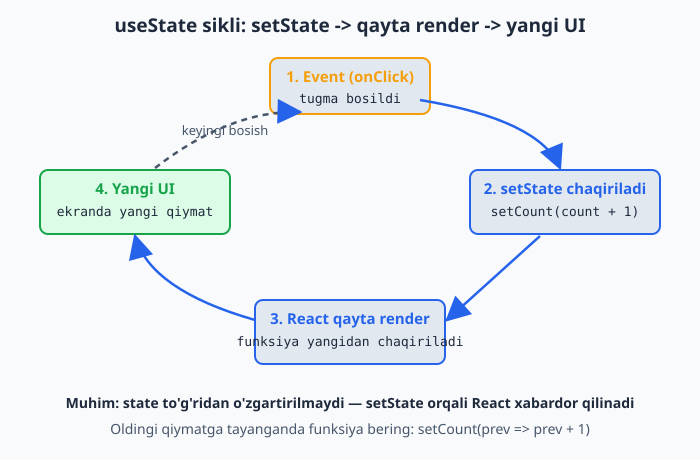

```jsx
import { useState } from "react";

function Counter() {
  const [count, setCount] = useState(0);
  //     ↑       ↑              ↑
  //  qiymat  yangilovchi    boshlang'ich qiymat

  return (
    <div>
      <p>Hisob: {count}</p>
      <button onClick={() => setCount(count + 1)}>+1</button>
      <button onClick={() => setCount(count - 1)}>-1</button>
      <button onClick={() => setCount(0)}>Reset</button>
    </div>
  );
}
```

### Muhim qoidalar

1. **State'ni to'g'ridan-to'g'ri o'zgartirmang:**
   ```jsx
   count = count + 1;        // ❌ ISHLAMAYDI — UI yangilanmaydi
   setCount(count + 1);      // ✅ to'g'ri
   ```

2. **Avvalgi qiymatga tayanganda funksiya bering:**
   ```jsx
   setCount(prev => prev + 1);   // ✅ ishonchli (ayniqsa ketma-ket yangilashda)
   ```

3. **Obyekt/massiv state'ni yangi nusxa bilan yangilang:**
   ```jsx
   const [user, setUser] = useState({ name: "Ali", age: 25 });

   setUser({ ...user, age: 26 });   // ✅ spread bilan yangi obyekt
   user.age = 26;                    // ❌ React buni "sezmaydi"
   ```

## 2.2. Event handling

```jsx
function Form() {
  const [text, setText] = useState("");

  const handleClick = () => {
    alert("Bosildi: " + text);
  };

  return (
    <div>
      <input
        value={text}
        onChange={(e) => setText(e.target.value)}
        placeholder="Yozing..."
      />
      <button onClick={handleClick}>Yuborish</button>
    </div>
  );
}
```

Asosiy eventlar: `onClick`, `onChange`, `onSubmit`, `onMouseEnter`, `onKeyDown`, `onFocus`, `onBlur`.

> **Diqqat:** `onClick={handleClick}` — funksiyani *uzatamiz*. `onClick={handleClick()}` — funksiyani *chaqiramiz* (xato! u darhol ishlab ketadi).

## 2.3. Conditional rendering (shartli ko'rsatish)

```jsx
function Status({ isLoading, error, data }) {
  if (isLoading) return <p>Yuklanmoqda...</p>;
  if (error) return <p>Xatolik: {error}</p>;

  return (
    <div>
      {data.length > 0 ? (
        <ul>{/* ... */}</ul>
      ) : (
        <p>Ma'lumot yo'q</p>
      )}
    </div>
  );
}
```

Uchta usul: `if` (early return), ternary (`? :`), `&&`.

## 2.4. Lists va keys

Ro'yxat chizish — `map` bilan. **Har bir elementga `key` shart.**

```jsx
function TodoList() {
  const [todos, setTodos] = useState([
    { id: 1, text: "Kod yozish" },
    { id: 2, text: "Dam olish" },
  ]);

  return (
    <ul>
      {todos.map((todo) => (
        <li key={todo.id}>{todo.text}</li>
      ))}
    </ul>
  );
}
```

> **`key` nega kerak?** React qaysi element o'zgarganini, qaysisi qo'shilgan/o'chganini aniqlash uchun. **`key` sifatida `index` ishlatmang** (agar ro'yxat o'zgarsa bug chiqadi) — barqaror `id` ishlating.

Quyidagi diagramma reconciliation'da barqaror `id` bilan `index` farqini ko'rsatadi:

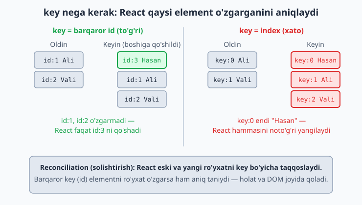

### To'liq Todo misoli

```jsx
import { useState } from "react";

function TodoApp() {
  const [todos, setTodos] = useState([]);
  const [input, setInput] = useState("");

  const addTodo = () => {
    if (input.trim() === "") return;
    setTodos([...todos, { id: Date.now(), text: input }]);
    setInput("");
  };

  const removeTodo = (id) => {
    setTodos(todos.filter((t) => t.id !== id));
  };

  return (
    <div>
      <input value={input} onChange={(e) => setInput(e.target.value)} />
      <button onClick={addTodo}>Qo'shish</button>

      <ul>
        {todos.map((todo) => (
          <li key={todo.id}>
            {todo.text}
            <button onClick={() => removeTodo(todo.id)}>❌</button>
          </li>
        ))}
      </ul>
    </div>
  );
}
```

## 2.5. State'ni "ko'tarish" (Lifting state up)

Ikki komponent bitta ma'lumotni baham ko'rishi kerak bo'lsa, state'ni ularning umumiy ota-onasiga ko'taramiz.

Quyidagi diagramma state otaga ko'tarilganda ikki bola uni qanday ulashishini ko'rsatadi:

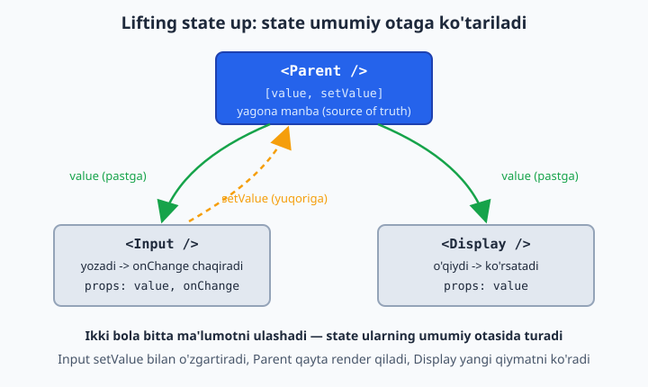

```jsx
function Parent() {
  const [value, setValue] = useState("");

  return (
    <>
      <Input value={value} onChange={setValue} />
      <Display value={value} />
    </>
  );
}

function Input({ value, onChange }) {
  return <input value={value} onChange={(e) => onChange(e.target.value)} />;
}

function Display({ value }) {
  return <p>Siz yozdingiz: {value}</p>;
}
```

## 2.6. Keng tarqalgan xatolar

| Xato | To'g'risi |
|------|-----------|
| State'ni mutatsiya qilish (`arr.push()`) | Yangi massiv (`[...arr, item]`) |
| `key` sifatida `index` | Barqaror `id` |
| `onClick={fn()}` | `onClick={fn}` yoki `onClick={() => fn()}` |
| Bir nechta `setState`ni eski qiymatga tayanib chaqirish | `setX(prev => ...)` funksiya formasi |
| Renderda to'g'ridan-to'g'ri `setState` chaqirish | Faqat event yoki effect ichida |

## +20 Masala — Daraja 2

**Oson:**
1. Counter yarating: +1, -1, Reset tugmalari bilan.
2. Tugma bosilganda matn "Yoqildi"/"O'chirildi" ga almashsin (toggle).
3. Input'ga yozilganini real vaqtda pastda ko'rsating (mirror).
4. Tugma bosilgan sonini sanang.
5. Checkbox holatini state'da saqlang va matnda ko'rsating.
6. 3 ta tugma: bosilganiga qarab fon rangini o'zgartirsin.
7. Inputdagi matn uzunligini real vaqtda chiqaring.
8. "Like" tugmasi: bosilsa ❤️, yana bosilsa 🤍 bo'lsin.

**O'rta:**
9. To'liq Todo ilovasi: qo'shish, o'chirish, ro'yxat.
10. Todo'ga "bajarildi" holatini qo'shing (chizilgan matn — `line-through`).
11. Hisoblagich: faqat 0 dan katta bo'lsa "-" tugmasi ishlasin (`disabled`).
12. Forma: ism + email kiritib, "Yuborish"da pastda kartada ko'rsating.
13. Rang tanlovchi: 5 ta tugma, tanlangani fon bo'lib o'zgarsin.
14. Filtrlash: ro'yxatdan inputga yozilgan matnga mos elementlarni ko'rsating.
15. Savatcha: mahsulot qo'shish, sonini oshirish/kamaytirish, umumiy narx.

**Qiyin:**
16. Quiz ilovasi: 5 ta savol, javoblar, oxirida ball ko'rsatish.
17. Soatli yulduzcha baholash (interaktiv `Rating`): hover va click.
18. Akkordeon: bir nechta panel, faqat bittasi ochiq (lifting state up).
19. Stepper forma: 3 qadam, "Oldinga/Orqaga", har qadam state'ni saqlasin.
20. Tic-tac-toe (krestiki-noliki) o'yini: 2 o'yinchi, g'olibni aniqlash.

<details markdown="1">
<summary>✅ Qiyin masalalar yechimi (16–20)</summary>

**17 — Interaktiv Rating** (hover + click; `hover || value` hiylasi):
```jsx
function Rating() {
  const [value, setValue] = useState(0);
  const [hover, setHover] = useState(0);
  return (
    <div>
      {[1, 2, 3, 4, 5].map((n) => (
        <span
          key={n}
          onClick={() => setValue(n)}
          onMouseEnter={() => setHover(n)}
          onMouseLeave={() => setHover(0)}
        >
          {n <= (hover || value) ? "⭐" : "☆"}
        </span>
      ))}
    </div>
  );
}
```

**18 — Accordion** (faqat bittasi ochiq — `openIdx` bitta state):
```jsx
function Accordion({ items }) {
  const [openIdx, setOpenIdx] = useState(null);
  return (
    <div>
      {items.map((it, i) => (
        <div key={i}>
          <h3 onClick={() => setOpenIdx(openIdx === i ? null : i)}>{it.title}</h3>
          {openIdx === i && <p>{it.content}</p>}
        </div>
      ))}
    </div>
  );
}
```
"Qaysi panel ochiq" — bitta `openIdx`. Yangisini ochsa, eskisi avtomatik yopiladi.

**19 — Stepper forma** (`[name]` pattern bilan bitta state obyekti):
```jsx
function Stepper() {
  const [step, setStep] = useState(1);
  const [data, setData] = useState({ ism: "", email: "", manzil: "" });
  const set = (k) => (e) => setData({ ...data, [k]: e.target.value });
  return (
    <div>
      {step === 1 && <input value={data.ism} onChange={set("ism")} placeholder="Ism" />}
      {step === 2 && <input value={data.email} onChange={set("email")} placeholder="Email" />}
      {step === 3 && <input value={data.manzil} onChange={set("manzil")} placeholder="Manzil" />}
      <div>
        {step > 1 && <button onClick={() => setStep(step - 1)}>Orqaga</button>}
        {step < 3 && <button onClick={() => setStep(step + 1)}>Oldinga</button>}
      </div>
    </div>
  );
}
```

**20 — Tic-tac-toe:**
```jsx
function hisoblaGolib(k) {
  const yutuq = [[0,1,2],[3,4,5],[6,7,8],[0,3,6],[1,4,7],[2,5,8],[0,4,8],[2,4,6]];
  for (const [a, b, c] of yutuq)
    if (k[a] && k[a] === k[b] && k[a] === k[c]) return k[a];
  return null;
}
function TicTacToe() {
  const [kataklar, setKataklar] = useState(Array(9).fill(null));
  const [xNavbat, setXNavbat] = useState(true);
  const golib = hisoblaGolib(kataklar);

  function bos(i) {
    if (kataklar[i] || golib) return;          // band yoki o'yin tugagan
    const yangi = kataklar.slice();            // NUSXA (state'ni to'g'ridan o'zgartirma!)
    yangi[i] = xNavbat ? "X" : "O";
    setKataklar(yangi);
    setXNavbat(!xNavbat);
  }
  return (
    <div>
      <p>{golib ? `G'olib: ${golib}` : `Navbat: ${xNavbat ? "X" : "O"}`}</p>
      <div className="board">
        {kataklar.map((k, i) => <button key={i} onClick={() => bos(i)}>{k}</button>)}
      </div>
    </div>
  );
}
```
Asosiy saboq: state massivni **nusxalab** (`slice`) o'zgartiramiz, g'olibni har renderda hosilaviy (derived) qiymat sifatida hisoblaymiz — alohida state'da saqlamaymiz.

> (16 — Quiz va undan oldingilar shu naqshlarning kombinatsiyasi: savollar massivi + `idx`/`ball` state + tugma `onClick`.)
</details>

---

<a id="daraja-3"></a>

# Daraja 3 — Hooks olami

Hook'lar — komponentlarga "qo'shimcha kuch" beruvchi funksiyalar (`use` bilan boshlanadi). `useState`ni allaqachon ko'rdik.

> **Hooks qoidalari (buzmaslik shart!):**
> 1. Hook'larni faqat komponent yoki boshqa hook *ichida*, eng yuqori darajada chaqiring.
> 2. **`if`, `for`, funksiya ichida hook chaqirmang** — har doim bir xil tartibda chaqirilishi kerak.

## 3.1. `useEffect` — side effect'lar

`useEffect` — render'dan *tashqaridagi* ishlar uchun: tarmoq so'rovi, taymer, brauzer API'lari, obuna (subscription).

> ⚠️ **2026-yilning eng muhim darsi:** `useEffect` — bu **oxirgi chora**, "to'g'ri yo'l" emas! Ko'p odam uni ma'lumot olishga ishlatadi — bu eski (2020) pattern. Zamonaviy yondashuvni Daraja 6 (TanStack Query) va Daraja 11 (Server Components)'da ko'rasiz. Hozir esa `useEffect`ni *tushunish* uchun o'rganamiz.

```jsx
import { useState, useEffect } from "react";

function Timer() {
  const [seconds, setSeconds] = useState(0);

  useEffect(() => {
    const id = setInterval(() => {
      setSeconds((s) => s + 1);
    }, 1000);

    // Cleanup — komponent yo'qolganda taymerni tozalaymiz
    return () => clearInterval(id);
  }, []); // [] = faqat bir marta (mount'da) ishlasin

  return <p>{seconds} soniya o'tdi</p>;
}
```

### Dependency array (eng muhim qism)

Quyidagi diagramma effect'ning to'liq hayot siklini ko'rsatadi — mount'da ishlaydi, deps o'zgarsa avval cleanup keyin qayta ishlaydi, unmount'da oxirgi marta tozalanadi:


```jsx
useEffect(() => { ... });           // har renderdan keyin (kamdan-kam kerak)
useEffect(() => { ... }, []);       // faqat bir marta (mount)
useEffect(() => { ... }, [userId]); // userId o'zgarganda
```

> **Strict Mode'da `useEffect` 2 marta ishlaydi** (development'da) — bu xato emas, cleanup'ingiz to'g'ri ekanini tekshirish uchun. Production'da 1 marta ishlaydi.

### Qachon `useEffect` KERAK EMAS?

```jsx
// ❌ Kerak emas — derived state (hosilaviy qiymat)
const [fullName, setFullName] = useState("");
useEffect(() => {
  setFullName(first + " " + last);
}, [first, last]);

// ✅ To'g'risi — render paytida hisoblang
const fullName = first + " " + last;
```

## 3.2. `useRef` — DOM va o'zgarmas qiymat

Ikki vazifasi bor: (1) DOM elementiga murojaat, (2) render'lar orasida qiymat saqlash (o'zgarsa ham re-render qilmaydi).

```jsx
import { useRef } from "react";

function FocusInput() {
  const inputRef = useRef(null);

  const focus = () => {
    inputRef.current.focus();  // DOM'ga to'g'ridan-to'g'ri
  };

  return (
    <>
      <input ref={inputRef} />
      <button onClick={focus}>Fokus qil</button>
    </>
  );
}
```

```jsx
// Render orasida qiymat saqlash (re-render qilmasdan)
function Stopwatch() {
  const countRef = useRef(0);
  countRef.current += 1;  // o'zgaradi, lekin re-render bo'lmaydi
}
```

> **React 19 yangiligi:** endi `ref`ni oddiy prop sifatida uzata olasiz — `forwardRef` kerak emas:
> ```jsx
> function MyInput({ ref, ...props }) {
>   return <input ref={ref} {...props} />;
> }
> ```

## 3.3. `useContext` — "prop drilling"dan qutulish

Ma'lumotni komponentlar daraxti bo'ylab har qatlamga props uzatmasdan tarqatish.

Quyidagi diagramma "prop drilling" (har qatlam orqali prop uzatish) bilan Context Provider/useContext yondashuvini yonma-yon solishtiradi:


```jsx
import { createContext, useContext, useState } from "react";

// 1. Context yaratish
const ThemeContext = createContext();

// 2. Provider bilan o'rash
function App() {
  const [theme, setTheme] = useState("light");
  return (
    <ThemeContext.Provider value={{ theme, setTheme }}>
      <Toolbar />
    </ThemeContext.Provider>
  );
}

// 3. Istalgan chuqurlikda ishlatish
function Toolbar() {
  return <ThemedButton />;  // theme'ni props sifatida uzatish shart emas
}

function ThemedButton() {
  const { theme, setTheme } = useContext(ThemeContext);
  return (
    <button onClick={() => setTheme(theme === "light" ? "dark" : "light")}>
      Hozirgi: {theme}
    </button>
  );
}
```

> **Muhim:** Context — bu **state manager emas**, balki *dependency injection* mexanizmi. Tez-tez o'zgaradigan ma'lumot uchun (har soniya) ishlatmang — performance muammosi chiqaradi. Buni Daraja 6'da ko'ramiz.

## 3.4. `useReducer` — murakkab state mantig'i

State logikasi murakkablashganda (ko'p maydon, ko'p action), `useState` o'rniga `useReducer`. Redux'ning kichik versiyasi.

Quyidagi diagramma `useReducer` oqimini ko'rsatadi: `dispatch(action)` reducer'ga boradi, reducer yangi state qaytaradi va komponent qayta render bo'ladi:


```jsx
import { useReducer } from "react";

const initialState = { count: 0 };

function reducer(state, action) {
  switch (action.type) {
    case "increment": return { count: state.count + 1 };
    case "decrement": return { count: state.count - 1 };
    case "reset":     return { count: 0 };
    default:          return state;
  }
}

function Counter() {
  const [state, dispatch] = useReducer(reducer, initialState);

  return (
    <div>
      <p>{state.count}</p>
      <button onClick={() => dispatch({ type: "increment" })}>+</button>
      <button onClick={() => dispatch({ type: "decrement" })}>-</button>
      <button onClick={() => dispatch({ type: "reset" })}>Reset</button>
    </div>
  );
}
```

> **Qachon `useReducer`?** Multi-step forma, murakkab UI holatlari, bir-biriga bog'liq state'lar. **DDD analogiyasi:** reducer — sof funksiya, `action` — domain event kabi.

## 3.5. `useMemo` va `useCallback` — memoizatsiya

Qimmat hisob-kitobni yoki funksiyani keraksiz qayta yaratmaslik uchun.

Quyidagi diagramma memoizatsiya mantig'ini ko'rsatadi: deps o'zgarmasa natija keshdan olinadi, faqat deps o'zgarganda qayta hisoblanadi:


```jsx
import { useMemo, useCallback } from "react";

function App({ items, filter }) {
  // Faqat items yoki filter o'zgarganda qayta hisoblanadi
  const filtered = useMemo(() => {
    return items.filter((i) => i.includes(filter));
  }, [items, filter]);

  // Funksiya identifikatorini saqlaydi (child re-render'ini oldini olish)
  const handleClick = useCallback(() => {
    console.log("bosildi");
  }, []);

  return <Child onClick={handleClick} data={filtered} />;
}
```

> ⚠️ **2026 muhim yangilik — React Compiler:** React 19 bilan kelgan compiler memoizatsiyani **avtomatik** qiladi. Ya'ni kelajakda `useMemo`/`useCallback`ni qo'lda yozish kamayadi. Lekin **ularni tushunish kerak** — eski kod va compiler yo'q joylarda hali ham ishlatiladi. **Maslahat:** premature optimization qilmang — avval profiling, keyin memo.

## 3.6. Custom hooks — o'z hook'ingizni yozish

Takrorlanuvchi mantiqni qayta ishlatiladigan funksiyaga ajrating. `use` bilan boshlansa bo'ldi.

```jsx
// useToggle.js
import { useState } from "react";

function useToggle(initial = false) {
  const [value, setValue] = useState(initial);
  const toggle = () => setValue((v) => !v);
  return [value, toggle];
}

// Ishlatish:
function Modal() {
  const [isOpen, toggle] = useToggle();
  return (
    <>
      <button onClick={toggle}>{isOpen ? "Yopish" : "Ochish"}</button>
      {isOpen && <div>Modal oynasi</div>}
    </>
  );
}
```

Ko'proq foydali custom hook:

```jsx
// useLocalStorage.js
import { useState, useEffect } from "react";

function useLocalStorage(key, initial) {
  const [value, setValue] = useState(() => {
    const stored = localStorage.getItem(key);
    return stored ? JSON.parse(stored) : initial;
  });

  useEffect(() => {
    localStorage.setItem(key, JSON.stringify(value));
  }, [key, value]);

  return [value, setValue];
}
```

> **Bu — React'da kodni qayta ishlatishning eng kuchli usuli.** Custom hooks orqali siz o'z "kutubxonangizni" yasaysiz. Backend'dagi Service/Repository pattern'iga o'xshash — mantiqni komponentdan ajratadi.

## 3.7. Keng tarqalgan xatolar

| Xato | To'g'risi |
|------|-----------|
| `useEffect`ni ma'lumot olishga "asosiy yo'l" deb ishlatish | TanStack Query / RSC (Daraja 6, 11) |
| Dependency array'ni unutish (`[]` qo'ymaslik) | Cheksiz loop'ga olib keladi |
| Effect ichida cleanup qilmaslik (taymer, listener) | `return () => {...}` |
| `if` ichida hook chaqirish | Faqat top-level |
| Hamma joyga `useMemo`/`useCallback` (premature) | Avval profiling |
| Derived state'ni `useEffect`+`useState` bilan | Render paytida hisoblash |

## +20 Masala — Daraja 3

**Oson (`useEffect`, `useRef`):**
1. Sahifa ochilganda `console.log("Mount!")` chiqaring (effect, `[]`).
2. Har soniya o'sadigan taymer yarating (cleanup bilan).
3. Input'ga avtomatik fokus bering (`useRef`, mount'da).
4. State o'zgarganda `document.title`ni yangilang.
5. Tugmaning necha marta bosilganini `useRef`'da saqlang (re-render qilmasdan).
6. 5 soniyalik countdown taymer yarating (0 da to'xtasin).
7. Oyna o'lchami (`window.innerWidth`)ni real vaqtda ko'rsating (resize listener + cleanup).
8. Toggle qiluvchi tugma yarating (ochiq/yopiq).

**O'rta (`useContext`, `useReducer`, custom hook):**
9. Theme switcher: `useContext` bilan light/dark rejim (butun ilovaga).
10. `useToggle` custom hook'ini yozing va modal'da ishlating.
11. `useLocalStorage` hook'ini yozing va todo ro'yxatini saqlang.
12. Savatchani `useReducer` bilan boshqaring (ADD, REMOVE, CLEAR).
13. `useReducer` bilan multi-step forma holati.
14. `useFetch` custom hook'ini yozing (loading, error, data qaytarsin).
15. `useDebounce` hook'ini yozing va qidiruv inputida ishlating.

**Qiyin:**
16. `useWindowSize`, `usePrevious`, `useOnlineStatus` — 3 ta custom hook yozing.
17. Auth kontekstini quring: `login`, `logout`, `user` — `useContext` + `useReducer`.
18. Stopwatch: start/stop/reset, lap vaqtlari (`useRef` + `useState` kombinatsiyasi).
19. `useMemo` bilan: 10000 elementli ro'yxatni filterlash (performance farqini sezing).
20. Infinite scroll mantiqi: scroll oxiriga yetganda yangi ma'lumot yuklash (`useRef` + `useEffect` + IntersectionObserver).

<details markdown="1">
<summary>✅ Qiyin masalalar yechimi (16–20)</summary>

**16 — 3 ta custom hook:**
```jsx
function useWindowSize() {
  const [size, setSize] = useState({ w: window.innerWidth, h: window.innerHeight });
  useEffect(() => {
    const onResize = () => setSize({ w: window.innerWidth, h: window.innerHeight });
    window.addEventListener("resize", onResize);
    return () => window.removeEventListener("resize", onResize); // cleanup SHART
  }, []);
  return size;
}

function usePrevious(value) {
  const ref = useRef();
  useEffect(() => { ref.current = value; }, [value]); // render'dan keyin yangilanadi
  return ref.current; // shuning uchun "oldingi" qiymatni qaytaradi
}

function useOnlineStatus() {
  const [online, setOnline] = useState(navigator.onLine);
  useEffect(() => {
    const on = () => setOnline(true), off = () => setOnline(false);
    window.addEventListener("online", on);
    window.addEventListener("offline", off);
    return () => { window.removeEventListener("online", on); window.removeEventListener("offline", off); };
  }, []);
  return online;
}
```

**17 — Auth (`useContext` + `useReducer`):**
```jsx
const AuthContext = createContext(null);

function authReducer(state, action) {
  switch (action.type) {
    case "login":  return { user: action.user };
    case "logout": return { user: null };
    default:       return state;
  }
}
function AuthProvider({ children }) {
  const [state, dispatch] = useReducer(authReducer, { user: null });
  const login = (user) => dispatch({ type: "login", user });
  const logout = () => dispatch({ type: "logout" });
  return (
    <AuthContext.Provider value={{ user: state.user, login, logout }}>
      {children}
    </AuthContext.Provider>
  );
}
export const useAuth = () => useContext(AuthContext); // qulay custom hook
```

**18 — Stopwatch** (`useRef` interval uchun, cleanup bilan):
```jsx
function Stopwatch() {
  const [ms, setMs] = useState(0);
  const [yurib, setYurib] = useState(false);
  const intervalRef = useRef(null);

  useEffect(() => {
    if (yurib) intervalRef.current = setInterval(() => setMs((m) => m + 10), 10);
    return () => clearInterval(intervalRef.current); // har safar tozalanadi
  }, [yurib]);

  return (
    <div>
      <p>{(ms / 1000).toFixed(2)}s</p>
      <button onClick={() => setYurib(true)}>Start</button>
      <button onClick={() => setYurib(false)}>Stop</button>
      <button onClick={() => { setYurib(false); setMs(0); }}>Reset</button>
    </div>
  );
}
```

**19 — `useMemo` bilan filtrlash** (qimmat hisobni keshlash):
```jsx
function BigList({ items, query }) {
  const filtered = useMemo(
    () => items.filter((it) => it.toLowerCase().includes(query.toLowerCase())),
    [items, query] // faqat shular o'zgarsa qayta hisoblanadi
  );
  return <ul>{filtered.map((it, i) => <li key={i}>{it}</li>)}</ul>;
}
```

**20 — Infinite scroll** (`IntersectionObserver` — yo'nalish):
```jsx
function useInfiniteScroll(onReachEnd) {
  const sentinelRef = useRef(null);
  useEffect(() => {
    const obs = new IntersectionObserver(
      ([entry]) => { if (entry.isIntersecting) onReachEnd(); }
    );
    if (sentinelRef.current) obs.observe(sentinelRef.current);
    return () => obs.disconnect();
  }, [onReachEnd]);
  return sentinelRef; // ro'yxat oxiridagi bo'sh <div ref={sentinelRef}/> ga ulanadi
}
```
"Sentinel" element ekranga kirsa — `onReachEnd` chaqiriladi (yangi sahifa yuklanadi). `scroll` event'dan tozaroq va tezroq.
</details>

---

<a id="daraja-4"></a>

# Daraja 4 — Formalar va ma'lumotlar

## 4.1. Controlled components

React'da forma maydonlarini state boshqaradi — bu "controlled" yondashuv.

Quyidagi diagramma state bilan input o'rtasidagi ikki tomonlama bog'lanishni ko'rsatadi: state input'ning `value`sini belgilaydi, `onChange` esa yozilgani state'ni yangilaydi:

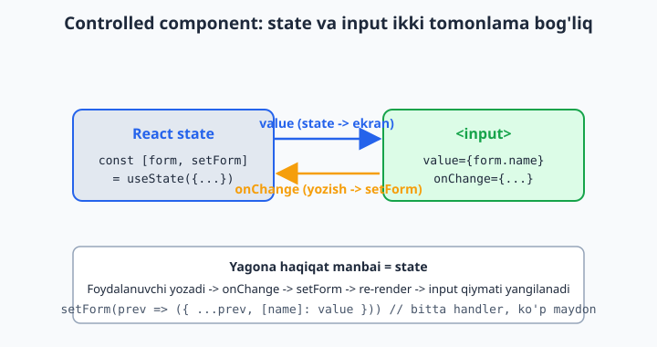

```jsx
import { useState } from "react";

function SignupForm() {
  const [form, setForm] = useState({ name: "", email: "", password: "" });

  const handleChange = (e) => {
    const { name, value } = e.target;
    setForm((prev) => ({ ...prev, [name]: value }));  // dinamik kalit
  };

  const handleSubmit = (e) => {
    e.preventDefault();  // sahifa yangilanishini to'xtatish
    console.log(form);
  };

  return (
    <form onSubmit={handleSubmit}>
      <input name="name" value={form.name} onChange={handleChange} />
      <input name="email" type="email" value={form.email} onChange={handleChange} />
      <input name="password" type="password" value={form.password} onChange={handleChange} />
      <button type="submit">Ro'yxatdan o'tish</button>
    </form>
  );
}
```

> **`[name]: value`** — bitta `handleChange` bilan barcha maydonlarni boshqaramiz (computed property). Bu pattern'ni yodda tuting.

## 4.2. Validation (tekshiruv)

```jsx
function LoginForm() {
  const [email, setEmail] = useState("");
  const [errors, setErrors] = useState({});

  const validate = () => {
    const errs = {};
    if (!email) errs.email = "Email majburiy";
    else if (!/\S+@\S+\.\S+/.test(email)) errs.email = "Email noto'g'ri";
    setErrors(errs);
    return Object.keys(errs).length === 0;
  };

  const handleSubmit = (e) => {
    e.preventDefault();
    if (validate()) {
      console.log("Yuborildi!");
    }
  };

  return (
    <form onSubmit={handleSubmit}>
      <input value={email} onChange={(e) => setEmail(e.target.value)} />
      {errors.email && <span style={{ color: "red" }}>{errors.email}</span>}
      <button>Kirish</button>
    </form>
  );
}
```

> **Real loyihada:** validatsiyani qo'lda yozish o'rniga **Zod** + **React Hook Form** ishlatiladi (kamroq kod, type-safe). Backend'dagi Form Request validation'ga o'xshash. Bularni o'rganib chiqing.

## 4.3. API'dan ma'lumot olish

### Eski usul (`useEffect` bilan) — tushunish uchun

```jsx
import { useState, useEffect } from "react";

function Users() {
  const [users, setUsers] = useState([]);
  const [loading, setLoading] = useState(true);
  const [error, setError] = useState(null);

  useEffect(() => {
    let ignore = false;  // race condition'dan himoya

    async function load() {
      try {
        setLoading(true);
        const res = await fetch("https://jsonplaceholder.typicode.com/users");
        if (!res.ok) throw new Error("Tarmoq xatosi");
        const data = await res.json();
        if (!ignore) setUsers(data);
      } catch (err) {
        if (!ignore) setError(err.message);
      } finally {
        if (!ignore) setLoading(false);
      }
    }

    load();
    return () => { ignore = true; };  // cleanup
  }, []);

  if (loading) return <p>Yuklanmoqda...</p>;
  if (error) return <p>Xato: {error}</p>;

  return (
    <ul>
      {users.map((u) => <li key={u.id}>{u.name}</li>)}
    </ul>
  );
}
```

> Ko'rib turganingizdek — `loading`, `error`, `data`, race condition... juda ko'p boilerplate. **Aynan shu sababli** zamonaviy loyihalar **TanStack Query** ishlatadi (Daraja 6). Bu usulni biling, lekin real loyihada qo'llamang.

## 4.4. React 19 — Actions (zamonaviy formalar)

React 19 formalar bilan ishlashni sezilarli soddalashtirdi. `<form>`ga `action` funksiyasi, `useActionState` va `useFormStatus` hook'lari.

```jsx
import { useActionState } from "react";

function SubscribeForm() {
  const [state, formAction, isPending] = useActionState(
    async (prevState, formData) => {
      const email = formData.get("email");
      // server'ga yuborish (yoki Server Action)
      await fakeApi(email);
      return { success: true, message: "Obuna bo'ldingiz!" };
    },
    { success: false, message: "" }
  );

  return (
    <form action={formAction}>
      <input name="email" type="email" />
      <button disabled={isPending}>
        {isPending ? "Yuborilmoqda..." : "Obuna"}
      </button>
      {state.message && <p>{state.message}</p>}
    </form>
  );
}
```

`useFormStatus` — ichki tugma forma holatini bilishi uchun:

```jsx
import { useFormStatus } from "react-dom";

function SubmitButton() {
  const { pending } = useFormStatus();
  return <button disabled={pending}>{pending ? "..." : "Yuborish"}</button>;
}
```

`useOptimistic` — optimistik yangilash (server javobini kutmasdan UI'ni darhol yangilash):

```jsx
import { useOptimistic } from "react";

function LikeButton({ likes, onLike }) {
  const [optimisticLikes, addOptimistic] = useOptimistic(likes);

  const handle = async () => {
    addOptimistic(optimisticLikes + 1);  // darhol ko'rsat
    await onLike();                        // keyin server'ga
  };

  return <button onClick={handle}>❤️ {optimisticLikes}</button>;
}
```

## 4.5. Keng tarqalgan xatolar

| Xato | To'g'risi |
|------|-----------|
| `e.preventDefault()`ni unutish | Forma'da har doim qo'ying |
| Uncontrolled + controlled aralashtirib yuborish | Bittasini tanlang (odatda controlled) |
| `useEffect`da cleanup/ignore'siz fetch | Race condition'dan himoya qiling |
| Validatsiyani faqat frontend'da qilish | Backend'da ham tekshiring (xavfsizlik) |
| Har bir maydonga alohida state | Bitta obyekt + `[name]` pattern |

## +20 Masala — Daraja 4

**Oson:**
1. Bitta input'li forma: submit'da qiymatni `alert` qiling.
2. Login forma (email + parol), `console.log`'ga obyekt chiqaring.
3. Bitta `handleChange` bilan 3 maydonli formani boshqaring.
4. Checkbox + radio + select bo'lgan forma yarating (controlled).
5. Textarea: belgilar sonini va qolgan limitni ko'rsating.
6. Forma'da "Tozalash" tugmasi: barcha maydonlarni bo'shatsin.
7. Email maydoni bo'sh bo'lsa qizil xato chiqarsin.
8. Parol va "parolni tasdiqlash" mosligini tekshiring.

**O'rta:**
9. To'liq ro'yxatdan o'tish formasi + validatsiya (ism, email, parol, yosh).
10. `jsonplaceholder` dan postlarni `useEffect` bilan yuklang (loading/error bilan).
11. Qidiruv: inputga yozilganda API'dan natija oling (debounce bilan).
12. Forma yuborilgach, ma'lumotni ro'yxatga qo'shing (POST simulyatsiyasi).
13. Multi-step ro'yxatdan o'tish (3 qadam, har biri validatsiyalansin).
14. React 19 `useActionState` bilan obuna formasi yarating.
15. Fayl yuklash inputi: tanlangan fayl nomini va o'lchamini ko'rsating.

**Qiyin:**
16. React Hook Form + Zod bilan type-safe forma yozing.
17. Dinamik forma: "Maydon qo'shish" tugmasi bilan input'lar massivi.
18. CRUD: foydalanuvchilarni qo'shish/tahrirlash/o'chirish (API bilan).
19. `useOptimistic` bilan like tugmasini optimistik yangilang.
20. Avtosaqlash forma: foydalanuvchi yozganda debounce bilan `localStorage`ga saqlasin.

<details markdown="1">
<summary>✅ Qiyin masalalar yechimi (16–20)</summary>

**16 — React Hook Form + Zod** (type-safe):
```jsx
import { useForm } from "react-hook-form";
import { zodResolver } from "@hookform/resolvers/zod";
import { z } from "zod";

const schema = z.object({ email: z.email(), parol: z.string().min(8) });

function LoginForm() {
  const { register, handleSubmit, formState: { errors } } = useForm({ resolver: zodResolver(schema) });
  return (
    <form onSubmit={handleSubmit((data) => console.log(data))}>
      <input {...register("email")} />
      {errors.email && <span>{errors.email.message}</span>}
      <input type="password" {...register("parol")} />
      {errors.parol && <span>{errors.parol.message}</span>}
      <button>Kirish</button>
    </form>
  );
}
```
`register` har bir input'ni ulaydi, `zodResolver` validatsiyani Zod schema'ga topshiradi.

**17 — Dinamik forma** (`useFieldArray`):
```jsx
import { useForm, useFieldArray } from "react-hook-form";

function DynamicForm() {
  const { register, control, handleSubmit } = useForm({ defaultValues: { items: [{ nom: "" }] } });
  const { fields, append, remove } = useFieldArray({ control, name: "items" });
  return (
    <form onSubmit={handleSubmit((d) => console.log(d))}>
      {fields.map((f, i) => (
        <div key={f.id}>
          <input {...register(`items.${i}.nom`)} />
          <button type="button" onClick={() => remove(i)}>O'chir</button>
        </div>
      ))}
      <button type="button" onClick={() => append({ nom: "" })}>Maydon qo'shish</button>
      <button>Yuborish</button>
    </form>
  );
}
```

**19 — `useOptimistic` like:**
```jsx
import { useOptimistic } from "react";

function LikeButton({ likes, onLike }) {
  const [optimistic, addOptimistic] = useOptimistic(likes, (state, amount) => state + amount);
  async function handle() {
    addOptimistic(1);   // UI darhol +1
    await onLike();     // server javobini kutadi; xato bo'lsa avtomatik qaytadi
  }
  return <button onClick={handle}>❤️ {optimistic}</button>;
}
```

**20 — Avtosaqlash** (debounce + `localStorage`, custom hook):
```jsx
function useAutosave(value, key, delay = 500) {
  useEffect(() => {
    const t = setTimeout(() => localStorage.setItem(key, JSON.stringify(value)), delay);
    return () => clearTimeout(t);  // har o'zgarishda eski taymerni bekor qiladi
  }, [value, key, delay]);
}
// Forma state'i o'zgarganda, foydalanuvchi to'xtagach 500ms keyin saqlanadi.
```

> (18 — CRUD: `useState`/TanStack Query'da ro'yxat + `fetch` bilan POST/PUT/DELETE; 6-daraja TanStack Query bilan toza ko'rinishini beradi.)
</details>

---

<a id="daraja-5"></a>

# Daraja 5 — Routing (React Router v7)

SPA'da sahifalar orasida URL bilan harakatlanish uchun **React Router** kerak (React'da o'z ichida yo'q).

```bash
npm install react-router-dom
```

## 5.1. Asosiy sozlash

```jsx
import { BrowserRouter, Routes, Route, Link } from "react-router-dom";

function App() {
  return (
    <BrowserRouter>
      <nav>
        <Link to="/">Bosh sahifa</Link>
        <Link to="/about">Biz haqimizda</Link>
        <Link to="/users">Foydalanuvchilar</Link>
      </nav>

      <Routes>
        <Route path="/" element={<Home />} />
        <Route path="/about" element={<About />} />
        <Route path="/users" element={<Users />} />
        <Route path="*" element={<NotFound />} />  {/* 404 */}
      </Routes>
    </BrowserRouter>
  );
}
```

> **`<Link>` ishlating, `<a href>` emas** — `<a>` butun sahifani qayta yuklaydi, `<Link>` esa SPA tezligini saqlaydi.

Quyidagi diagramma routing mexanizmini ko'rsatadi: URL o'zgarganda Router mos `path`ni topib, tegishli komponentni chizadi (`:id` dinamik segment bilan):

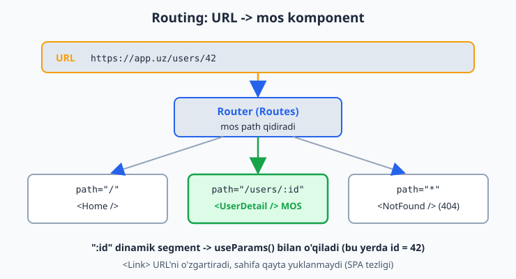

## 5.2. Dinamik route va parametrlar

```jsx
// Route
<Route path="/users/:id" element={<UserDetail />} />

// Komponent ichida parametrni o'qish
import { useParams } from "react-router-dom";

function UserDetail() {
  const { id } = useParams();
  return <h1>Foydalanuvchi #{id}</h1>;
}
```

## 5.3. Programmatik navigatsiya

```jsx
import { useNavigate } from "react-router-dom";

function LoginForm() {
  const navigate = useNavigate();

  const handleLogin = () => {
    // ... login mantiq
    navigate("/dashboard");  // boshqa sahifaga o'tkazish
  };
}
```

## 5.4. Nested routes va Layout

```jsx
import { Outlet } from "react-router-dom";

function DashboardLayout() {
  return (
    <div>
      <Sidebar />
      <main>
        <Outlet />  {/* bu yerda child route chiqadi */}
      </main>
    </div>
  );
}

// Routes
<Route path="/dashboard" element={<DashboardLayout />}>
  <Route index element={<Overview />} />
  <Route path="settings" element={<Settings />} />
  <Route path="profile" element={<Profile />} />
</Route>
```

Quyidagi diagramma nested route ishlashini ko'rsatadi: layout (Sidebar) doimiy qoladi, faqat `<Outlet />` ichidagi qism URL'ga qarab almashadi:

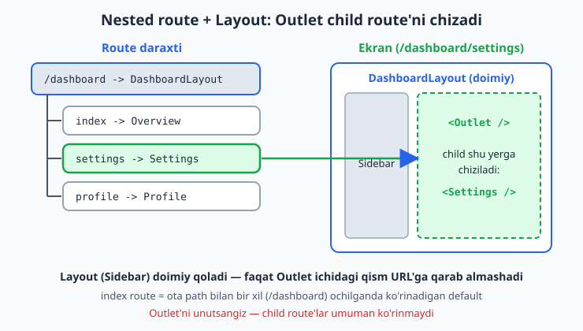

## 5.5. Himoyalangan route (Protected route)

```jsx
import { Navigate } from "react-router-dom";

function ProtectedRoute({ children }) {
  const { user } = useAuth();  // o'z auth hook'ingiz
  if (!user) return <Navigate to="/login" replace />;
  return children;
}

// Ishlatish:
<Route
  path="/dashboard"
  element={
    <ProtectedRoute>
      <Dashboard />
    </ProtectedRoute>
  }
/>
```

> **EduCore uchun muhim:** subdomain-based multi-tenant routing'da har tenant uchun alohida route logikasini shu yerda quryapsiz. Role-based middleware'ni `ProtectedRoute` ichida `user.role` bilan kengaytirasiz.

## 5.6. Zamonaviy eslatma

> **2026:** React Router **v7** "framework mode"da Remix bilan birlashdi — data loading (`loader`), action'lar, SSR'ni qo'llab-quvvatlaydi. Type-safety juda muhim bo'lsa **TanStack Router**'ni ham ko'rib chiqing (compile-time type-safe routing). Boshlovchi uchun esa yuqoridagi "declarative mode" yetarli.

## 5.7. Keng tarqalgan xatolar

| Xato | To'g'risi |
|------|-----------|
| `<a href>` ishlatish | `<Link to>` |
| `BrowserRouter`siz `Routes` ishlatish | Ildizda o'rang |
| 404 (`path="*"`) ni unutish | Har doim qo'shing |
| Nested'da `<Outlet />`ni unutish | Layout'ga qo'ying |
| Auth tekshiruvini `useEffect`+`navigate` bilan | `<Navigate>` deklarativ |

## +20 Masala — Daraja 5

**Oson:**
1. 3 sahifali sayt: Home, About, Contact + navigatsiya.
2. 404 sahifasini qo'shing.
3. `<Link>` bilan menyu yarating, aktiv link'ni ajrating (`NavLink`).
4. Tugma bosilganda `useNavigate` bilan boshqa sahifaga o'ting.
5. "Orqaga" tugmasi yarating (`navigate(-1)`).
6. Logo'ga bosilganda bosh sahifaga o'tsin.
7. Footer'ni barcha sahifalarda ko'rsating (umumiy layout).
8. Tashqi havola (`<a>`) va ichki havola (`<Link>`) farqini ko'rsatuvchi sahifa.

**O'rta:**
9. Bloglar ro'yxati + `/blog/:id` dinamik detail sahifa.
10. Query parametrlar bilan ishlash: `/search?q=react` (`useSearchParams`).
11. Nested routes: `/dashboard` ichida `overview`, `settings`, `profile`.
12. Login → dashboard redirect (`useNavigate`).
13. `ProtectedRoute` yarating, login bo'lmasa `/login`ga yuborsin.
14. Mahsulotlar katalogi: ro'yxat → detail → orqaga.
15. Breadcrumb (non zarralari) navigatsiyasini yarating.

**Qiyin:**
16. To'liq mini-blog: ro'yxat, detail, qo'shish, tahrirlash, o'chirish + routing.
17. Role-based routing: admin va user uchun turli sahifalar.
18. `loader` (React Router v7 framework mode) bilan ma'lumot oldindan yuklang.
19. Lazy loading: har bir route'ni `lazy` + `Suspense` bilan yuklang.
20. Multi-tenant routing prototipi: `/:tenant/dashboard` strukturasi (EduCore uslubida).

<details markdown="1">
<summary>✅ Qiyin masalalar yechimi (16–20)</summary>

**17 — Role-based routing:**
```jsx
function RoleRoute({ allow, role, children }) {
  return allow.includes(role)
    ? children
    : <Navigate to="/forbidden" replace />;
}

<Routes>
  <Route path="/dashboard" element={
    <RoleRoute allow={["user", "admin"]} role={role}><Dashboard /></RoleRoute>
  } />
  <Route path="/admin" element={
    <RoleRoute allow={["admin"]} role={role}><AdminPanel /></RoleRoute>
  } />
</Routes>
```

**18 — `loader` (React Router v7 framework mode)** — route ma'lumotni *render'dan oldin* yuklaydi:
```jsx
// routes.ts
export const usersLoader = async () => {
  const res = await fetch("/api/users");
  return res.json();
};
// komponentda
import { useLoaderData } from "react-router";
function Users() {
  const users = useLoaderData(); // yuklangan, kutish shart emas
  return <ul>{users.map((u) => <li key={u.id}>{u.name}</li>)}</ul>;
}
```
`useEffect` + `useState`siz — ma'lumot route bilan birga keladi (waterfall yo'q).

**19 — Lazy loading** (`lazy` + `Suspense`):
```jsx
import { lazy, Suspense } from "react";
const Dashboard = lazy(() => import("./Dashboard.jsx"));

<Suspense fallback={<p>Yuklanmoqda...</p>}>
  <Routes>
    <Route path="/dashboard" element={<Dashboard />} />
  </Routes>
</Suspense>
```
Har route alohida bundle bo'lib, faqat kerak bo'lganda yuklanadi (kichikroq boshlang'ich yuk).

**20 — Multi-tenant routing** (`/:tenant/...`, EduCore uslubida):
```jsx
function TenantLayout() {
  const { tenant } = useParams();
  return (
    <div>
      <header>Tenant: {tenant}</header>
      <Outlet />   {/* ichki route shu yerga chiziladi */}
    </div>
  );
}

<Routes>
  <Route path="/:tenant" element={<TenantLayout />}>
    <Route path="dashboard" element={<Dashboard />} />
    <Route path="students" element={<Students />} />
  </Route>
</Routes>
```
`useParams().tenant` orqali joriy markaz aniqlanadi — keyin uni context yoki store'ga (Zustand) qo'yib, butun ilova shu tenant bilan ishlaydi.

> (16 — mini-blog: yuqoridagi nested route + `useParams` (detail) + forma (qo'shish/tahrir) kombinatsiyasi.)
</details>

---

<a id="daraja-6"></a>

# Daraja 6 — State management

Ilova kattalashganda state'ni boshqarish murakkablashadi. **2026-yilning eng muhim qoidasi:** server state va client state'ni *ajrating*.

| Tur | Nima | Yechim |
|-----|------|--------|
| **Server state** | API'dan kelgan ma'lumot (cache, sync kerak) | **TanStack Query** |
| **Client state** | UI holati (modal, theme, forma) | **Zustand** / `useState` / Context |
| **Katta enterprise** | Murakkab global state | **Redux Toolkit** |

> ⚠️ **Eng keng tarqalgan xato:** API javobini Redux/Zustand'ga saqlash. Buni qilmang — server state uchun TanStack Query bor. Bu ikkisini aralashtirmaslik kod sifatini keskin oshiradi.

Quyidagi diagramma bu ikki turning farqini va TanStack Query keshi qanday yashashini (fetch → cache → stale → refetch) ko'rsatadi:

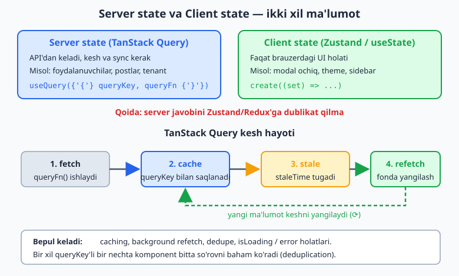

## 6.1. TanStack Query (server state uchun)

API ma'lumotini boshqarishning eng yaxshi yo'li. Caching, background refetch, loading/error — hammasi avtomatik.

```bash
npm install @tanstack/react-query
```

```jsx
import { QueryClient, QueryClientProvider, useQuery } from "@tanstack/react-query";

const queryClient = new QueryClient();

function App() {
  return (
    <QueryClientProvider client={queryClient}>
      <Users />
    </QueryClientProvider>
  );
}

function Users() {
  const { data, isLoading, error } = useQuery({
    queryKey: ["users"],
    queryFn: () =>
      fetch("https://jsonplaceholder.typicode.com/users").then((r) => r.json()),
  });

  if (isLoading) return <p>Yuklanmoqda...</p>;
  if (error) return <p>Xato!</p>;

  return <ul>{data.map((u) => <li key={u.id}>{u.name}</li>)}</ul>;
}
```

> **Solishtiring:** Daraja 4'dagi `useEffect` versiyasi 25 qator edi. Bu yerda 5 qator — va ustiga caching, refetch, deduplication bepul keladi. Aynan shu — to'g'ri yo'l.

Mutation (ma'lumot o'zgartirish):

```jsx
import { useMutation, useQueryClient } from "@tanstack/react-query";

function AddUser() {
  const queryClient = useQueryClient();

  const mutation = useMutation({
    mutationFn: (newUser) =>
      fetch("/api/users", { method: "POST", body: JSON.stringify(newUser) }),
    onSuccess: () => {
      queryClient.invalidateQueries({ queryKey: ["users"] });  // qayta yuklash
    },
  });

  return <button onClick={() => mutation.mutate({ name: "Ali" })}>Qo'shish</button>;
}
```

## 6.2. Zustand (client state uchun)

Eng yengil va sodda global state. Redux'siz boilerplate.

```bash
npm install zustand
```

```jsx
import { create } from "zustand";

// Store yaratish
const useCartStore = create((set) => ({
  items: [],
  addItem: (item) => set((state) => ({ items: [...state.items, item] })),
  removeItem: (id) =>
    set((state) => ({ items: state.items.filter((i) => i.id !== id) })),
  clear: () => set({ items: [] }),
}));

// Istalgan komponentda — Provider kerak emas!
function Cart() {
  const { items, removeItem } = useCartStore();
  return (
    <ul>
      {items.map((i) => (
        <li key={i.id}>
          {i.name} <button onClick={() => removeItem(i.id)}>x</button>
        </li>
      ))}
    </ul>
  );
}

function AddButton() {
  const addItem = useCartStore((s) => s.addItem);  // faqat kerakli qismni oling
  return <button onClick={() => addItem({ id: 1, name: "Kitob" })}>Qo'shish</button>;
}
```

> **Zustand'ning afzalligi:** `<Provider>` o'rash shart emas, selector (`(s) => s.addItem`) bilan faqat kerakli qismga obuna bo'lasiz → kamroq re-render. Auth, theme, savatcha — shular uchun ideal.

## 6.3. Redux Toolkit (katta loyihalar uchun)

Murakkab, ko'p jamoali enterprise loyihalarda. Strukturali, DevTools kuchli.

```jsx
import { createSlice, configureStore } from "@reduxjs/toolkit";

const counterSlice = createSlice({
  name: "counter",
  initialState: { value: 0 },
  reducers: {
    increment: (state) => { state.value += 1; },  // Immer ichida — mutatsiya OK
    decrement: (state) => { state.value -= 1; },
  },
});

export const { increment, decrement } = counterSlice.actions;
export const store = configureStore({ reducer: { counter: counterSlice.reducer } });
```

> **Qachon Redux?** Faqat haqiqatan murakkab, ko'p o'zaro bog'liq global state bo'lsa. Aks holda Zustand + TanStack Query yetadi. **Premature'ga Redux qo'shmang.**

## 6.4. Qanday tanlash kerak? (qaror jadvali)

- **Faqat bitta komponent ichida** → `useState`
- **Bir nechta komponent (kichik daraxt)** → lifting state up yoki Context
- **Tez-tez o'zgaradigan global UI state** → Zustand
- **API ma'lumoti** → TanStack Query (har doim!)
- **Juda katta, murakkab enterprise** → Redux Toolkit + TanStack Query

## 6.5. Keng tarqalgan xatolar

| Xato | To'g'risi |
|------|-----------|
| API javobini Redux/Zustand'ga saqlash | TanStack Query |
| Hamma narsani global state'ga tiqish | Avval local, keyin ko'taring |
| Context'ni tez-tez o'zgaruvchi state uchun ishlatish | Zustand (selectorlar bilan) |
| Boshlanishidayoq Redux qo'shish | Avval sodda yechim |
| `queryKey`ni noto'g'ri tuzish | Aniq, izchil kalitlar |

## +20 Masala — Daraja 6

**Oson (TanStack Query):**
1. `useQuery` bilan foydalanuvchilarni yuklang.
2. Loading va error holatlarini chiroyli ko'rsating.
3. "Refetch" tugmasi qo'shing.
4. `queryKey`ga parametr bering (`["user", id]`) va bitta foydalanuvchini oling.
5. `staleTime` sozlang va caching ishini kuzating.
6. Ikki xil API'dan ma'lumotni parallel yuklang.
7. `enabled` opsiyasi bilan shartli so'rov (faqat `id` bor bo'lsa).
8. DevTools'ni o'rnating va cache'ni kuzating.

**O'rta (Zustand + mutation):**
9. Zustand bilan savatcha: qo'shish/o'chirish/tozalash.
10. Zustand bilan dark mode toggle (butun ilovaga).
11. Auth store: `login`, `logout`, `user` (Zustand).
12. `useMutation` bilan yangi post qo'shish + `invalidateQueries`.
13. Optimistik mutation (TanStack Query): like'ni darhol ko'rsatish.
14. Selector bilan Zustand'dan faqat kerakli qismni olib re-render'ni kamaytiring.
15. Pagination: `page` state + `useQuery` (`keepPreviousData`).

**Qiyin:**
16. To'liq CRUD ilovasi: TanStack Query (read) + mutations (create/update/delete).
17. Infinite scroll: `useInfiniteQuery` bilan.
18. Server state (TanStack Query) + client state (Zustand)ni bitta ilovada to'g'ri ajrating.
19. Redux Toolkit bilan counter + todo slice yarating.
20. EduCore prototipi: tenant ma'lumotini TanStack Query bilan, UI holatini Zustand bilan boshqaring.

<details markdown="1">
<summary>✅ Qiyin masalalar yechimi (16–20)</summary>

**16 — TanStack Query CRUD** (read + mutation + invalidate):
```jsx
function useStudents() {
  return useQuery({
    queryKey: ["students"],
    queryFn: () => fetch("/api/students").then((r) => r.json()),
  });
}
function useAddStudent() {
  const qc = useQueryClient();
  return useMutation({
    mutationFn: (s) => fetch("/api/students", { method: "POST", body: JSON.stringify(s) }).then((r) => r.json()),
    onSuccess: () => qc.invalidateQueries({ queryKey: ["students"] }), // ro'yxat avtomatik yangilanadi
  });
}
```

**18 — Server state vs client state ajratish:**
```jsx
// SERVER state → TanStack Query (backend'dan keladi, kesh, qayta yuklash)
const { data: students } = useStudents();

// CLIENT state → Zustand (faqat UI: modal ochiq/yopiq, sidebar)
const useUiStore = create((set) => ({
  sidebarOpen: false,
  toggleSidebar: () => set((s) => ({ sidebarOpen: !s.sidebarOpen })),
}));
```
**Qoida:** backend'dan kelgan narsa — Query; faqat brauzerdagi UI holati — Zustand. Ularni aralashtirma (server datani Zustand'da dublikat qilma).

**19 — Redux Toolkit** (counter + todo slice):
```jsx
const counterSlice = createSlice({
  name: "counter",
  initialState: { value: 0 },
  reducers: {
    increment: (s) => { s.value += 1; },   // Immer tufayli "mutatsiya" xavfsiz
    decrement: (s) => { s.value -= 1; },
  },
});
const todoSlice = createSlice({
  name: "todos",
  initialState: { items: [] },
  reducers: {
    add: (s, a) => { s.items.push({ id: Date.now(), text: a.payload }); },
    remove: (s, a) => { s.items = s.items.filter((t) => t.id !== a.payload); },
  },
});
const store = configureStore({
  reducer: { counter: counterSlice.reducer, todos: todoSlice.reducer },
});
```

> (20 — EduCore prototipi: `useQuery(["tenant", id])` bilan tenant ma'lumoti + Zustand'da UI holati — 16 va 18 ni birlashtirish.)
</details>

---

<a id="daraja-7"></a>

# Daraja 7 — Performance optimizatsiya

> **Oltin qoida:** Avval o'lchang (profiling), keyin optimallashtiring. Premature optimization — yovuzlik.

## 7.1. Re-render qachon bo'ladi?

Komponent qayta render bo'ladi agar: (1) uning state'i o'zgarsa, (2) props'i o'zgarsa, (3) ota-onasi re-render bo'lsa.

Render o'zi ikki fazaga bo'linadi — quyidagi diagramma Render fazasi (virtual DOM diff/reconciliation) va Commit fazasini (DOM yangilash) ko'rsatadi:

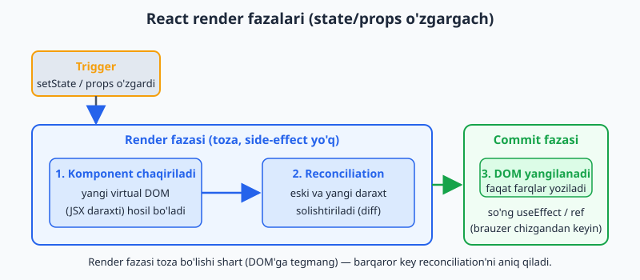

## 7.2. `React.memo` — keraksiz re-render'ni to'xtatish

```jsx
import { memo } from "react";

// Props o'zgarmasa, qayta render bo'lmaydi
const ExpensiveChild = memo(function ExpensiveChild({ data }) {
  console.log("render!");
  return <div>{data}</div>;
});
```

`memo` + `useCallback`/`useMemo` birgalikda ishlaydi (props referencelari barqaror bo'lishi uchun).

Quyidagi diagramma re-render kaskadini (ota re-render bo'lsa bolalar ham) va `React.memo` keraksiz re-render'ni qanday to'sishini ko'rsatadi:

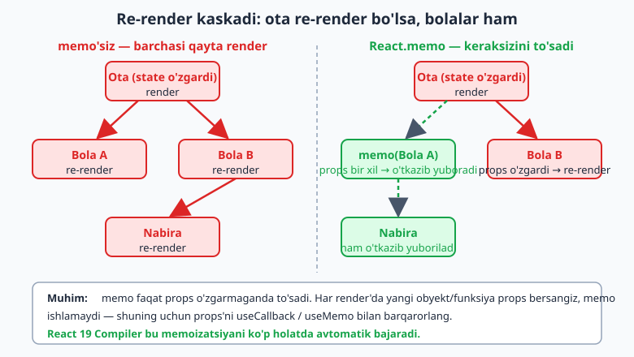

## 7.3. React Compiler (2026 yangiligi)

> **Eng muhim yangilik:** React 19 bilan kelgan **React Compiler** memoizatsiyani **avtomatik** qiladi. Kelajakda `React.memo`, `useMemo`, `useCallback`ni qo'lda yozish deyarli kerak emas — compiler buni o'zi optimallashtiradi. Yangi loyihalarda compiler'ni yoqing va manual memoizatsiyani minimal qiling.

```js
// vite.config.js (React Compiler yoqish)
import { defineConfig } from "vite";
import react from "@vitejs/plugin-react";

export default defineConfig({
  plugins: [
    react({
      babel: { plugins: [["babel-plugin-react-compiler"]] },
    }),
  ],
});
```

## 7.4. Code splitting va lazy loading

Boshida butun ilovani yuklamasdan, kerak bo'lganda yuklang.

```jsx
import { lazy, Suspense } from "react";

const Dashboard = lazy(() => import("./Dashboard"));

function App() {
  return (
    <Suspense fallback={<p>Yuklanmoqda...</p>}>
      <Dashboard />
    </Suspense>
  );
}
```

Route darajasida code splitting — eng samarali (har sahifa alohida bundle).

## 7.5. Ro'yxatlarni virtualizatsiya

10000 element bo'lsa, hammasini chizmang — faqat ekrandagisini. **`@tanstack/react-virtual`** ishlatiladi.

## 7.6. Boshqa texnikalar

- **Lift content up / push state down** — state'ni iloji boricha pastga tushiring (kichikroq daraxt re-render bo'ladi).
- **`children` prop** — o'zgarmaydigan qismni `children` qilib uzating (re-render'dan saqlanadi).
- **Debounce/throttle** — tez-tez ishlaydigan eventlar (scroll, qidiruv) uchun.
- **Image lazy loading** — ``.

## 7.7. Profiling (o'lchash)

React DevTools'da **Profiler** tab'i — qaysi komponent qancha render bo'lganini ko'rsatadi. React 19.2'da Chrome DevTools'ga **Performance Tracks** qo'shildi.

## 7.8. Keng tarqalgan xatolar

| Xato | To'g'risi |
|------|-----------|
| Profiling'siz optimallashtirishga urinish | Avval o'lchang |
| Hamma joyga `memo`/`useMemo` | Faqat kerakli joyda |
| `memo` + har render'da yangi funksiya/obyekt props | `useCallback`/`useMemo` bilan barqarorlash |
| Katta ro'yxatni virtualizatsiyasiz chizish | `react-virtual` |
| Butun ilovani bitta bundle qilish | Route-level code splitting |

## +20 Masala — Daraja 7

**Oson:**
1. `console.log` bilan komponent necha marta render bo'lganini kuzating.
2. `React.memo` qo'shib, keraksiz re-render'ni to'xtating.
3. Profiler bilan eng ko'p render bo'lgan komponentni toping.
4. `` bilan rasmlarni kechiktirib yuklang.
5. Tugmaning funksiyasini `useCallback`ga o'rang.
6. Qimmat hisobni `useMemo`ga o'rang.
7. State'ni pastroqqa tushirib (push state down) re-render hududini kichraytiring.
8. `children` prop bilan o'zgarmas qismni re-render'dan saqlang.

**O'rta:**
9. `lazy` + `Suspense` bilan komponentni kechiktirib yuklang.
10. Har bir route'ni code splitting qiling.
11. Qidiruvni debounce bilan optimallashtiring.
12. 1000 elementli ro'yxatda `memo`'siz va `memo` bilan farqni o'lchang.
13. `useMemo` bilan og'ir filtrlash/saralashni optimallashtiring.
14. React Compiler'ni Vite loyihasiga yoqing.
15. Scroll eventini throttle bilan optimallashtiring.

**Qiyin:**
16. `react-virtual` bilan 10000 qatorli jadvalni virtualizatsiya qiling.
17. Lighthouse/DevTools bilan bundle hajmini kamaytiring.
18. Murakkab dashboard'ni profiling qilib, render shovqinlarini tozalang.
19. Image lazy loading + blur placeholder (progressive yuklash).
20. Katta forma performance'ini optimallashtiring (har keystroke'da butun forma re-render bo'lmasin).

<details markdown="1">
<summary>✅ Qiyin masalalar yechimi (16–20)</summary>

**16 — Virtualizatsiya** (`@tanstack/react-virtual`):
```jsx
import { useVirtualizer } from "@tanstack/react-virtual";

function VirtualList({ rows }) {
  const parentRef = useRef(null);
  const v = useVirtualizer({
    count: rows.length,
    getScrollElement: () => parentRef.current,
    estimateSize: () => 35,
  });
  return (
    <div ref={parentRef} style={{ height: 400, overflow: "auto" }}>
      <div style={{ height: v.getTotalSize(), position: "relative" }}>
        {v.getVirtualItems().map((item) => (
          <div key={item.key} style={{ position: "absolute", transform: `translateY(${item.start}px)` }}>
            {rows[item.index]}
          </div>
        ))}
      </div>
    </div>
  );
}
```
10000 qatordan faqat ko'rinadigan ~15 tasi DOM'da bo'ladi — qolgani "virtual".

**20 — Katta forma perf** (har maydonni `memo` bilan ajratish):
```jsx
const Field = memo(function Field({ label, value, onChange }) {
  return <label>{label}<input value={value} onChange={onChange} /></label>;
});

function FastForm() {
  const [form, setForm] = useState({ ism: "", email: "" });
  const set = (k) => (e) => setForm((f) => ({ ...f, [k]: e.target.value }));
  return (
    <>
      <Field label="Ism" value={form.ism} onChange={set("ism")} />
      <Field label="Email" value={form.email} onChange={set("email")} />
    </>
  );
}
```
`memo` tufayli faqat o'zgargan maydon qayta render bo'ladi. (Yoki React Hook Form — u uncontrolled bo'lib, keystroke'da re-render qilmaydi.)

**17–19 — jarayon (kod emas, texnika):**
- **17 (bundle):** `npm run build` → bundle analizatori (`rollup-plugin-visualizer`); katta paketlarni `lazy` import qiling, ishlatilmaganini olib tashlang.
- **18 (profiling):** React DevTools → **Profiler** tab → yozib oling, qaysi komponent ko'p/keraksiz render bo'layotganini toping → `memo`/`useMemo`/`useCallback` qo'llang.
- **19 (image):** `loading="lazy"` atributi + kichik blur rasm (`placeholder`) → asl rasm yuklangach almashtirish.

> **Eslatma:** React Compiler (2026) `memo`/`useMemo`/`useCallback` ehtiyojini ko'p holatda avtomatik bartaraf etadi — avval profiling qiling, keyin kerak bo'lsa qo'lda optimallashtiring.
</details>

---

<a id="daraja-8"></a>

# Daraja 8 — Advanced patterns

Bu darajada professional kutubxonalar (Radix, shadcn/ui) ichida ishlatiladigan patternlarni o'rganasiz.

## 8.1. Compound components

Bir-biriga bog'liq komponentlar guruhi (masalan `<Select>`, `<Select.Option>`). HTML'dagi `<select>`/`<option>` kabi.

```jsx
import { createContext, useContext, useState } from "react";

const TabsContext = createContext();

function Tabs({ children, defaultValue }) {
  const [active, setActive] = useState(defaultValue);
  return (
    <TabsContext.Provider value={{ active, setActive }}>
      <div className="tabs">{children}</div>
    </TabsContext.Provider>
  );
}

function TabList({ children }) {
  return <div className="tab-list">{children}</div>;
}

function Tab({ value, children }) {
  const { active, setActive } = useContext(TabsContext);
  return (
    <button
      className={active === value ? "active" : ""}
      onClick={() => setActive(value)}
    >
      {children}
    </button>
  );
}

function TabPanel({ value, children }) {
  const { active } = useContext(TabsContext);
  return active === value ? <div>{children}</div> : null;
}

// Birikma
Tabs.List = TabList;
Tabs.Tab = Tab;
Tabs.Panel = TabPanel;

// Ishlatish — chiroyli, deklarativ API
<Tabs defaultValue="1">
  <Tabs.List>
    <Tabs.Tab value="1">Birinchi</Tabs.Tab>
    <Tabs.Tab value="2">Ikkinchi</Tabs.Tab>
  </Tabs.List>
  <Tabs.Panel value="1">Birinchi kontent</Tabs.Panel>
  <Tabs.Panel value="2">Ikkinchi kontent</Tabs.Panel>
</Tabs>
```

## 8.2. Render props

Komponent o'z renderini funksiya orqali tashqariga beradi.

```jsx
function MouseTracker({ render }) {
  const [pos, setPos] = useState({ x: 0, y: 0 });
  return (
    <div onMouseMove={(e) => setPos({ x: e.clientX, y: e.clientY })}>
      {render(pos)}
    </div>
  );
}

// Ishlatish
<MouseTracker render={({ x, y }) => <p>{x}, {y}</p>} />
```

> **Eslatma:** Render props'ning ko'p holatlarini hozir **custom hooks** soddaroq hal qiladi. Lekin ba'zi kutubxonalar (masalan eski form liblari) buni ishlatadi — tanib olishingiz kerak.

## 8.3. Higher-Order Components (HOC)

Komponentni qabul qilib, kuchaytirilgan komponent qaytaruvchi funksiya.

```jsx
function withLoading(Component) {
  return function WithLoading({ isLoading, ...props }) {
    if (isLoading) return <p>Yuklanmoqda...</p>;
    return <Component {...props} />;
  };
}

const UserListWithLoading = withLoading(UserList);
```

> **Zamonaviy holat:** HOC ham asosan custom hooks bilan almashtirildi. Lekin legacy kodda (`connect` Redux'da, `withRouter`) uchraydi. Bilib qo'ying, lekin yangi kodda hook'larni afzal ko'ring.

Quyidagi diagramma ikki patternni solishtiradi: compound components (qismlar Context bilan bog'lanadi) va HOC (komponentni o'rab funksiya qo'shadi):

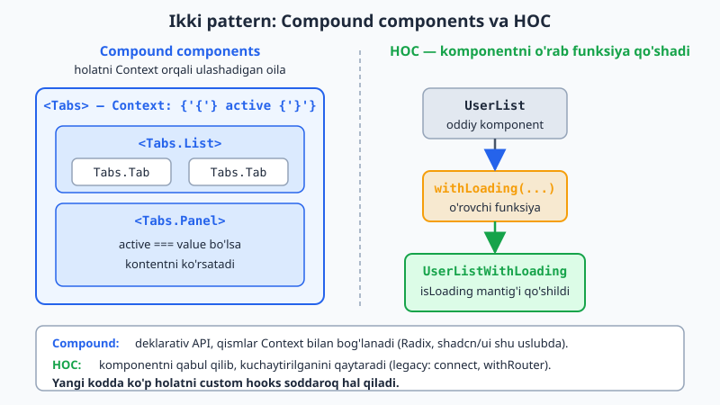

## 8.4. Portals

Komponentni DOM daraxtining boshqa joyiga "uchirish" (modal, tooltip uchun — `overflow: hidden`dan qutulish).

```jsx
import { createPortal } from "react-dom";

function Modal({ children, onClose }) {
  return createPortal(
    <div className="overlay" onClick={onClose}>
      <div className="modal" onClick={(e) => e.stopPropagation()}>
        {children}
      </div>
    </div>,
    document.body  // <body> ga chiqariladi
  );
}
```

## 8.5. Error Boundaries

JavaScript xatosi butun ilovani buzmasligi uchun "qo'riqchi" komponent.

```jsx
import { Component } from "react";

class ErrorBoundary extends Component {
  state = { hasError: false };

  static getDerivedStateFromError() {
    return { hasError: true };
  }

  componentDidCatch(error, info) {
    // log servisiga yuborish (Sentry kabi)
    console.error(error, info);
  }

  render() {
    if (this.state.hasError) {
      return <h1>Nimadir xato ketdi 😢</h1>;
    }
    return this.props.children;
  }
}

// Ishlatish
<ErrorBoundary>
  <App />
</ErrorBoundary>
```

> Error Boundary — hozircha **faqat class component** sifatida yoziladi (yoki `react-error-boundary` kutubxonasi bilan). Bu React'da class kerak bo'ladigan kam joylardan biri.

Quyidagi diagramma Error Boundary ishini ko'rsatadi: bola komponentda xato bo'lsa, fallback UI ko'rsatiladi va butun ilova qulamaydi:

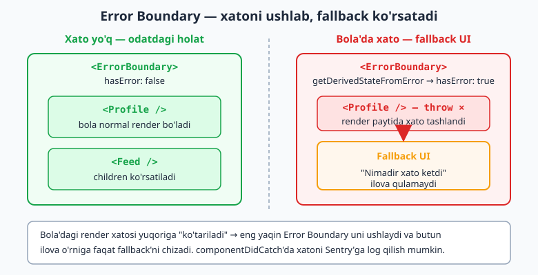

## 8.6. Boshqa muhim patternlar

- **Controlled vs Uncontrolled komponentlar** — komponentingiz har ikki rejimni qo'llab-quvvatlashi mumkin.
- **Slot pattern** — `header`, `footer`ni prop sifatida (`children`dan tashqari).
- **Provider pattern** — Context bilan global servis berish.
- **State reducer pattern** — foydalanuvchiga state mantig'ini override qilish imkonini berish.

## 8.7. Keng tarqalgan xatolar

| Xato | To'g'risi |
|------|-----------|
| Hamma joyda HOC/render props | Avval custom hook'ni o'ylang |
| Modal'ni portal'siz chizish | `createPortal` + `document.body` |
| Error boundary'siz ilova | Ildizga (va kalit joylarga) qo'ying |
| Compound'da Context'ni unutish | Holatni Context orqali ulang |
| Portal'da event bubbling'ni e'tibordan qoldirish | `stopPropagation` kerak bo'lishi mumkin |

## +20 Masala — Daraja 8

**Oson:**
1. `createPortal` bilan oddiy modal yarating.
2. Modal'ni overlay bosilganda yopiladigan qiling.
3. `withLoading` HOC yozing va ro'yxatda ishlating.
4. Render props bilan sichqoncha pozitsiyasini ko'rsating.
5. Tooltip komponentini portal bilan yarating.
6. Error Boundary yozing va atayin xato chiqarib sinab ko'ring.
7. `children` + slot pattern bilan `Layout` yarating.
8. Toast notification'ni portal bilan ko'rsating.

**O'rta:**
9. Compound component: `<Tabs>` to'liq tizimini yarating.
10. Compound: `<Accordion>` bir nechta paneli bilan.
11. `withAuth` HOC: login bo'lmasa boshqa narsa ko'rsatsin.
12. Render props bilan `<DataFetcher>` (loading/error/data).
13. Confirmation modal: "Ishonchingiz komilmi?" + portal.
14. Error Boundary'ni `react-error-boundary` bilan + "Qayta urinish" tugmasi.
15. Controlled + uncontrolled ikkalasini qo'llab-quvvatlovchi `<Input>`.

**Qiyin:**
16. To'liq `<Select>` compound komponenti (klaviatura navigatsiyasi bilan).
17. `<Modal>` tizimi: stack (bir nechta modal), focus trap.
18. Compound `<Form>`: `<Form.Field>`, `<Form.Error>`, Context bilan.
19. Plugin tizimi: Provider pattern bilan kengaytiriladigan komponent.
20. Dropdown menyu: portal + click-outside + klaviatura + a11y (accessibility).

<details markdown="1">
<summary>✅ Qiyin masalalar yechimi (16–20)</summary>

**16 — Compound `<Select>`** (Context bilan qismlar bog'lanadi):
```jsx
const SelectCtx = createContext(null);

function Select({ value, onChange, children }) {
  const [open, setOpen] = useState(false);
  return (
    <SelectCtx.Provider value={{ value, onChange, open, setOpen }}>
      <div className="select">{children}</div>
    </SelectCtx.Provider>
  );
}
Select.Trigger = function () {
  const { value, open, setOpen } = useContext(SelectCtx);
  return <button onClick={() => setOpen(!open)}>{value ?? "Tanlang"}</button>;
};
Select.Option = function ({ value: v, children }) {
  const { onChange, setOpen } = useContext(SelectCtx);
  return <div onClick={() => { onChange(v); setOpen(false); }}>{children}</div>;
};
// <Select value={v} onChange={setV}><Select.Trigger/><Select.Option value="a">A</Select.Option></Select>
```
Qismlar (`Trigger`, `Option`) Context orqali bog'lanadi — foydalanuvchi ularni erkin joylashtiradi.

**18 — Compound `<Form>`** (`Form.Field`, `Form.Error`):
```jsx
const FormCtx = createContext(null);

function Form({ children, onSubmit }) {
  const [errors, setErrors] = useState({});
  return (
    <FormCtx.Provider value={{ errors, setErrors }}>
      <form onSubmit={onSubmit}>{children}</form>
    </FormCtx.Provider>
  );
}
Form.Field = ({ name, children }) => <div data-name={name}>{children}</div>;
Form.Error = ({ name }) => {
  const { errors } = useContext(FormCtx);
  return errors[name] ? <span className="error">{errors[name]}</span> : null;
};
```

**20 — Dropdown** (portal + click-outside):
```jsx
function Dropdown({ trigger, children }) {
  const [open, setOpen] = useState(false);
  const ref = useRef(null);

  useEffect(() => {
    function onClick(e) {
      if (ref.current && !ref.current.contains(e.target)) setOpen(false);
    }
    if (open) document.addEventListener("mousedown", onClick);
    return () => document.removeEventListener("mousedown", onClick);
  }, [open]);

  return (
    <div ref={ref} style={{ position: "relative" }}>
      <button onClick={() => setOpen((o) => !o)} aria-haspopup="menu" aria-expanded={open}>
        {trigger}
      </button>
      {open && createPortal(
        <div className="menu" role="menu">{children}</div>,
        document.body
      )}
    </div>
  );
}
```
`createPortal` menyuni `document.body`ga chiqaradi (`overflow:hidden` ota element kesib qo'ymaydi); click-outside `mousedown` listener bilan; `aria-*` — a11y. Klaviatura uchun (↑/↓/Esc) `onKeyDown` qo'shiladi.

> **Maslahat:** real loyihada bularning hammasini noldan yozish o'rniga **Radix UI** / **shadcn/ui** ishlating — a11y va klaviatura tayyor. Lekin "ostida qanday ishlashini" bilish uchun bir marta o'zing yozib ko'r.
</details>

---

<a id="daraja-9"></a>

# Daraja 9 — TypeScript bilan React

TypeScript — JavaScript'ga tip qo'shadi. Xatolarni *yozish paytida* topadi, refactoring'ni xavfsiz qiladi. **2026'da professional React = TypeScript.**

```bash
npm create vite@latest my-app -- --template react-ts
```

## 9.1. Props'ni tiplash

```tsx
type ButtonProps = {
  label: string;
  onClick: () => void;
  variant?: "primary" | "secondary";  // ixtiyoriy
  disabled?: boolean;
};

function Button({ label, onClick, variant = "primary", disabled }: ButtonProps) {
  return (
    <button className={variant} onClick={onClick} disabled={disabled}>
      {label}
    </button>
  );
}
```

`children` bilan:

```tsx
type CardProps = {
  title: string;
  children: React.ReactNode;  // har qanday JSX
};

function Card({ title, children }: CardProps) {
  return <div><h2>{title}</h2>{children}</div>;
}
```

## 9.2. Hook'larni tiplash

```tsx
// useState — odatda tip o'zi aniqlanadi (inference)
const [count, setCount] = useState(0);          // number
const [name, setName] = useState("");           // string

// Murakkab tip bo'lsa — aniq belgilang
const [user, setUser] = useState<User | null>(null);

type User = { id: number; name: string };

// useRef
const inputRef = useRef<HTMLInputElement>(null);

// useReducer
type State = { count: number };
type Action = { type: "inc" } | { type: "dec" } | { type: "set"; payload: number };

function reducer(state: State, action: Action): State {
  switch (action.type) {
    case "inc": return { count: state.count + 1 };
    case "dec": return { count: state.count - 1 };
    case "set": return { count: action.payload };
  }
}
```

## 9.3. Event'larni tiplash

```tsx
function Form() {
  const handleChange = (e: React.ChangeEvent<HTMLInputElement>) => {
    console.log(e.target.value);
  };

  const handleSubmit = (e: React.FormEvent<HTMLFormElement>) => {
    e.preventDefault();
  };

  const handleClick = (e: React.MouseEvent<HTMLButtonElement>) => {};
}
```

## 9.4. Generic komponentlar

```tsx
type ListProps<T> = {
  items: T[];
  renderItem: (item: T) => React.ReactNode;
};

function List<T>({ items, renderItem }: ListProps<T>) {
  return <ul>{items.map((item, i) => <li key={i}>{renderItem(item)}</li>)}</ul>;
}

// Ishlatish — tip avtomatik aniqlanadi
<List items={users} renderItem={(u) => u.name} />
```

## 9.5. Custom hook'ni tiplash

```tsx
function useToggle(initial = false): [boolean, () => void] {
  const [value, setValue] = useState(initial);
  const toggle = () => setValue((v) => !v);
  return [value, toggle];
}
```

## 9.6. Foydali utility tiplar

- `React.ReactNode` — har qanday renderlanadigan narsa
- `React.FC<Props>` — function component (lekin hozir to'g'ridan-to'g'ri annotatsiya afzal)
- `Partial<T>`, `Pick<T>`, `Omit<T>` — tiplarni qayta shakllantirish
- `ComponentProps<"button">` — HTML element propslarini olish

```tsx
// Native button propslarini meros qilib olish
type Props = React.ComponentProps<"button"> & { variant: "primary" };
```

## 9.7. Keng tarqalgan xatolar

| Xato | To'g'risi |
|------|-----------|
| `any` ishlatish | Aniq tip bering yoki `unknown` |
| `React.FC`ni majburlash | To'g'ridan-to'g'ri props annotatsiyasi |
| Event tipini noto'g'ri tanlash | `ChangeEvent`, `MouseEvent`, `FormEvent` |
| `useState`ga tip bermaslik (null bo'lsa) | `useState<T \| null>(null)` |
| API javobini tiplab olmaslik | Zod bilan runtime validatsiya + tip |

## +20 Masala — Daraja 9

**Oson:**
1. `Button` komponentini TypeScript bilan tiplang.
2. `Card` (children bilan) tiplang.
3. `useState`ni `User \| null` bilan ishlating.
4. `onChange` event'ini to'g'ri tiplang.
5. Ixtiyoriy (`?`) va union tip (`"a" \| "b"`) propslar yozing.
6. `useRef<HTMLInputElement>` bilan input fokus qiling.
7. `Props` tipini `type` orqali eksport qiling.
8. Mavjud JS komponentni TS'ga ko'chiring.

**O'rta:**
9. Generic `List<T>` komponenti yozing.
10. `useReducer`ni to'liq tiplang (State + Action union).
11. `useToggle` custom hook'ini tiplang (tuple qaytarsin).
12. API javobini interface bilan tiplab, `useQuery`da ishlating.
13. `Omit`/`Pick` bilan tiplarni qayta ishlating.
14. `ComponentProps<"input">` bilan native propslarni meros qiling.
15. Discriminated union bilan turli holatlarni tiplang (loading/success/error).

**Qiyin:**
16. To'liq todo ilovasini TypeScript bilan qayta yozing.
17. Generic `useFetch<T>` hook'i yozing.
18. Zod schema + TypeScript bilan type-safe forma.
19. Polymorphic komponent (`as` prop bilan har xil HTML element).
20. EduCore bir modulini (masalan, student ro'yxati) to'liq type-safe qiling.

<details markdown="1">
<summary>✅ Qiyin masalalar yechimi (16–20)</summary>

**16 — Typed todo** (asosiy tip + state):
```tsx
type Todo = { id: number; text: string; done: boolean };

function TodoApp() {
  const [todos, setTodos] = useState<Todo[]>([]);
  const add = (text: string) =>
    setTodos((p) => [...p, { id: Date.now(), text, done: false }]);
  // ...
}
```

**17 — Generic `useFetch<T>`** (ignore bilan race'dan himoya):
```tsx
function useFetch<T>(url: string) {
  const [data, setData] = useState<T | null>(null);
  const [loading, setLoading] = useState(true);
  const [error, setError] = useState<Error | null>(null);
  useEffect(() => {
    let ignore = false;
    fetch(url)
      .then((r) => r.json())
      .then((d: T) => { if (!ignore) setData(d); })
      .catch((e) => { if (!ignore) setError(e); })
      .finally(() => { if (!ignore) setLoading(false); });
    return () => { ignore = true; };  // race condition'dan himoya
  }, [url]);
  return { data, loading, error };
}
// const { data } = useFetch<Student[]>("/api/students");  // data: Student[] | null
```

**19 — Polymorphic komponent** (`as` prop):
```tsx
import type { ElementType, ComponentPropsWithoutRef } from "react";

type TextProps<T extends ElementType> = {
  as?: T;
  children: React.ReactNode;
} & ComponentPropsWithoutRef<T>;

function Text<T extends ElementType = "span">({ as, children, ...rest }: TextProps<T>) {
  const Component = as || "span";
  return <Component {...rest}>{children}</Component>;
}
// <Text as="h1">Sarlavha</Text>   yoki   <Text as="a" href="/">Havola</Text>  — props tipi `as`ga moslashadi
```

> (18 — Zod + TS: `z.infer<typeof schema>` bilan tipni schema'dan avtomatik olasan; 20 — EduCore moduli: `Student` tipi + `useFetch<Student[]>` + typed props birlashtirib.)
</details>

---

<a id="daraja-10"></a>

# Daraja 10 — Testing

Sifatli kod = testlangan kod. **Vitest** (Vite'ga tabiiy) + **React Testing Library** standart.

```bash
npm install -D vitest @testing-library/react @testing-library/jest-dom @testing-library/user-event jsdom
```

## 10.1. Test falsafasi

> **RTL qoidasi:** "Foydalanuvchi qanday ishlatsa, shunday test qiling." Implementatsiya detallarini emas (state, ichki funksiya), **xulq-atvorni** (ekranda nima ko'rinadi, nima bosiladi) tekshiring.

## 10.2. Birinchi test

```jsx
// Button.jsx
export function Button({ onClick, children }) {
  return <button onClick={onClick}>{children}</button>;
}

// Button.test.jsx
import { render, screen } from "@testing-library/react";
import userEvent from "@testing-library/user-event";
import { expect, test, vi } from "vitest";
import { Button } from "./Button";

test("tugma bosilganda funksiya chaqiriladi", async () => {
  const handleClick = vi.fn();   // mock funksiya
  render(<Button onClick={handleClick}>Bosing</Button>);

  await userEvent.click(screen.getByText("Bosing"));

  expect(handleClick).toHaveBeenCalledTimes(1);
});
```

Har bir RTL testi bir xil to'rt bosqichli oqimni bosib o'tadi — komponentni chizish, elementni topish, u bilan ishlash va natijani tekshirish:

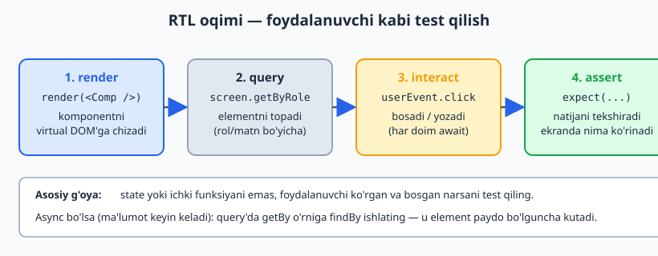

## 10.3. Element topish (queries)

```jsx
screen.getByRole("button", { name: "Yuborish" });  // afzal — a11y
screen.getByLabelText("Email");
screen.getByPlaceholderText("Yozing...");
screen.getByText("Salom");
screen.getByTestId("user-card");  // oxirgi chora

// findBy — async (kutadi)
await screen.findByText("Yuklandi");

// queryBy — yo'qligini tekshirish uchun (null qaytaradi, xato bermaydi)
expect(screen.queryByText("Xato")).not.toBeInTheDocument();
```

## 10.4. State va interaktivlikni test qilish

```jsx
test("counter oshadi", async () => {
  render(<Counter />);

  expect(screen.getByText("0")).toBeInTheDocument();
  await userEvent.click(screen.getByRole("button", { name: "+1" }));
  expect(screen.getByText("1")).toBeInTheDocument();
});
```

## 10.5. Async va API mock

```jsx
test("foydalanuvchilar yuklanadi", async () => {
  // fetch'ni mock qilamiz
  global.fetch = vi.fn(() =>
    Promise.resolve({ json: () => Promise.resolve([{ id: 1, name: "Ali" }]) })
  );

  render(<Users />);

  expect(screen.getByText("Yuklanmoqda...")).toBeInTheDocument();
  expect(await screen.findByText("Ali")).toBeInTheDocument();
});
```

> Real loyihada `fetch`ni qo'lda mock qilish o'rniga **MSW (Mock Service Worker)** ishlatiladi — tarmoq darajasida mock, eng ishonchli yondashuv.

## 10.6. Custom hook'ni test qilish

```jsx
import { renderHook, act } from "@testing-library/react";

test("useToggle ishlaydi", () => {
  const { result } = renderHook(() => useToggle());

  expect(result.current[0]).toBe(false);
  act(() => result.current[1]());  // toggle
  expect(result.current[0]).toBe(true);
});
```

## 10.7. Testlar turlari

- **Unit** — bitta funksiya/komponent (eng ko'p).
- **Integration** — bir nechta komponent birga (eng qimmatli).
- **E2E** — butun ilova brauzerda (**Playwright** / Cypress).

Bu uch turning nisbati piramida shaklida bo'ladi: tagida ko'p tez unit test, yuqorida esa kam, sekin E2E test:

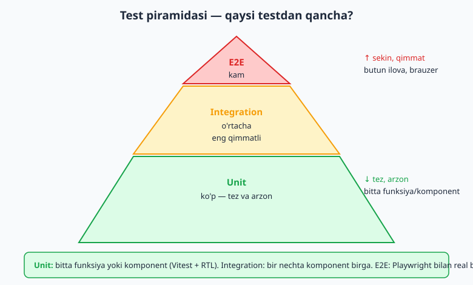

## 10.8. Keng tarqalgan xatolar

| Xato | To'g'risi |
|------|-----------|
| Implementatsiya detalini test qilish (state) | Xulq-atvorni test qiling |
| `getByTestId`ni asosiy usul qilish | `getByRole`/`getByText` afzal |
| Async'da `getBy` ishlatish | `findBy` (kutadi) |
| `userEvent`'ni `await`siz ishlatish | Har doim `await` |
| `fetch`ni qo'lda mock qilish | MSW |

## +20 Masala — Daraja 10

**Oson:**
1. `Button` bosilganda mock funksiya chaqirilishini test qiling.
2. Komponent matnni to'g'ri ko'rsatishini tekshiring.
3. `getByRole` bilan tugma toping.
4. Props o'tkazib, to'g'ri render bo'lishini test qiling.
5. `disabled` tugma bosilmasligini tekshiring.
6. Conditional rendering'ni test qiling (`queryBy` bilan yo'qligi).
7. Input'ga yozilganini `userEvent.type` bilan test qiling.
8. Snapshot test yozing.

**O'rta:**
9. Counter komponentini to'liq test qiling (+/-/reset).
10. Forma submit'ini test qiling (mock onSubmit).
11. Validatsiya xatosi ko'rinishini test qiling.
12. Todo qo'shish/o'chirishni test qiling.
13. `findBy` bilan async yuklanishni test qiling.
14. `useToggle` custom hook'ini `renderHook` bilan test qiling.
15. Mock fetch bilan API komponentini test qiling.

**Qiyin:**
16. MSW bilan API'ni mock qilib, integration test yozing.
17. TanStack Query komponentini test qiling (QueryClient wrapper bilan).
18. `useReducer`'li murakkab hook'ni to'liq test qiling.
19. Modal/portal komponentini test qiling.
20. Playwright bilan login → dashboard E2E test stsenariysi yozing.

<details markdown="1">
<summary>✅ Qiyin masalalar yechimi (16–20)</summary>

**17 — TanStack Query komponentini test qilish** (QueryClient wrapper):
```tsx
function renderWithClient(ui: React.ReactElement) {
  const client = new QueryClient({ defaultOptions: { queries: { retry: false } } });
  return render(<QueryClientProvider client={client}>{ui}</QueryClientProvider>);
}

it("o'quvchilarni ko'rsatadi", async () => {
  renderWithClient(<StudentList />);
  await waitFor(() => expect(screen.getByText("Ali Valiyev")).toBeInTheDocument());
});
```
Test uchun `retry: false` — xato bo'lsa darrov ko'rsin, qayta urinmasin.

**16 — MSW bilan API mock** (integration test):
```tsx
import { http, HttpResponse } from "msw";
import { setupServer } from "msw/node";

const server = setupServer(
  http.get("/api/students", () =>
    HttpResponse.json([{ id: 1, name: "Ali Valiyev" }])
  )
);
beforeAll(() => server.listen());
afterEach(() => server.resetHandlers());
afterAll(() => server.close());
```
MSW tarmoq so'rovini ushlab, soxta javob beradi — real backend kerak emas, lekin komponent "haqiqiy" fetch qilayotgandek ishlaydi.

**20 — Playwright E2E** (login → dashboard):
```ts
import { test, expect } from "@playwright/test";

test("login -> dashboard", async ({ page }) => {
  await page.goto("/login");
  await page.getByLabel("Email").fill("ali@mail.uz");
  await page.getByLabel("Parol").fill("12345678");
  await page.getByRole("button", { name: "Kirish" }).click();
  await expect(page).toHaveURL("/dashboard");
});
```
E2E test — real brauzerda, foydalanuvchi kabi: bosadi, yozadi, natijani tekshiradi.

> **Tamoyil:** `getByRole`/`getByLabel` bilan qidir (foydalanuvchi ko'rganidek), `getByTestId` ni kamroq ishlat. Test *foydalanuvchi xulqini* tekshirsin, *implementatsiyani* emas.
> (18 — `useReducer` hook'i: `renderHook` + `act` bilan; 19 — Modal/portal: `getByRole("dialog")` bilan tekshiriladi.)
</details>

---

<a id="daraja-11"></a>

# Daraja 11 — Production va ekotizim

Bu darajada haqiqiy production ilovalarni quryapsiz. **Next.js** — bugungi kunda React'ning de-fakto production framework'i.

## 11.1. Nega framework?

> **2026 rasmiy maslahat:** React jamoasi yangi ilovalar uchun **framework** tavsiya qiladi (Vite SPA emas, agar SEO/SSR/data-loading kerak bo'lsa). Sabab: routing, data fetching, SSR, code splitting, optimizatsiya — hammasi tayyor.

Variantlar: **Next.js** (eng mashhur), **React Router v7 framework mode** (eski Remix), **TanStack Start**, **Expo** (mobil).

## 11.2. Next.js asoslari (App Router)

```bash
npx create-next-app@latest my-app --typescript --tailwind --eslint --app
```

Fayl-tizimga asoslangan routing:

```
app/
├── layout.tsx          ← umumiy layout
├── page.tsx            ← / sahifa
├── about/
│   └── page.tsx        ← /about
└── users/
    ├── page.tsx        ← /users
    └── [id]/
        └── page.tsx    ← /users/:id
```

## 11.3. Server Components (eng katta o'zgarish)

> **Tushuncha:** App Router'da komponentlar **default holda serverda** ishlaydi (Server Components). Ular brauzerga JS yubormaydi — to'g'ridan-to'g'ri ma'lumotlar bazasiga murojaat qilishi mumkin. Interaktivlik kerak bo'lsa `"use client"` qo'shasiz.

```tsx
// app/users/page.tsx — Server Component (default)
async function UsersPage() {
  // To'g'ridan-to'g'ri DB/API'dan — useEffect, useState YO'Q
  const users = await db.users.findMany();

  return (
    <ul>
      {users.map((u) => <li key={u.id}>{u.name}</li>)}
    </ul>
  );
}
```

```tsx
// Client Component — interaktivlik kerak bo'lganda
"use client";
import { useState } from "react";

function Counter() {
  const [count, setCount] = useState(0);
  return <button onClick={() => setCount(count + 1)}>{count}</button>;
}
```

> **Aqliy model:** Server Component'da ma'lumot oling va statik UI chizing. Faqat *interaktiv barglar* (button, forma, input) Client Component bo'lsin. Bu — kamroq JS, tezroq sahifa.

Quyidagi diagramma `"use client"` chegarasi qayerdan o'tishini va brauzerga faqat Client komponentlarning JS'i yuborilishini ko'rsatadi:


## 11.4. Server Actions

Forma yuborishni server funksiyasi bilan — alohida API endpoint yozmasdan.

```tsx
// Server Action
async function createUser(formData: FormData) {
  "use server";
  const name = formData.get("name");
  await db.users.create({ data: { name } });
}

// Komponentda
function Form() {
  return (
    <form action={createUser}>
      <input name="name" />
      <button>Yaratish</button>
    </form>
  );
}
```

> **Backend dasturchi uchun jozibali:** Server Actions — frontend va backend orasidagi chegarani yumshatadi. Laravel'dagi controller action'iga o'xshash, lekin to'g'ridan-to'g'ri komponentdan chaqiriladi.

Oqim oddiy: forma yuboriladi, server funksiyasi ishlaydi va natija qaytib UI'ni yangilaydi:


## 11.5. Suspense — yuklanishni boshqarish

```tsx
import { Suspense } from "react";

function Page() {
  return (
    <div>
      <Header />
      <Suspense fallback={<Spinner />}>
        <SlowDataComponent />   {/* yuklanguncha Spinner ko'rinadi */}
      </Suspense>
    </div>
  );
}
```

Server Components + Suspense = **streaming** — sahifaning tayyor qismlari darhol ko'rsatiladi, sekin qismlar keyin "oqib keladi".

Quyidagi diagramma yuklanish paytida `fallback` ko'rinishini, ma'lumot tayyor bo'lganda esa uning haqiqiy kontent bilan almashinishini ko'rsatadi:


## 11.6. Ma'lumot olish strategiyasi (umumiy)

| Holat | Yechim |
|-------|--------|
| Server'da renderlanadigan ma'lumot | Server Component (`async`/`await`) |
| Client'dagi interaktiv ma'lumot | TanStack Query |
| Forma yuborish | Server Actions / `useActionState` |
| Real-time | WebSocket / SSE |

## 11.7. Deploy

- **Vercel** — Next.js uchun eng oson (bir tugma).
- **VPS (sizning stack)** — `npm run build` + `npm start`, Nginx reverse proxy, PM2/systemd, Cloudflare oldida. SPA bo'lsa — statik fayllar (`dist/`) Nginx orqali.
- **Docker** — izchil muhit uchun.

```nginx
# SPA uchun Nginx (Vite build)
location / {
  try_files $uri $uri/ /index.html;   # client-side routing uchun
}
```

## 11.8. Production checklist

- ✅ Environment o'zgaruvchilar (`.env`, secret'larni commit qilmang)
- ✅ Error tracking (Sentry)
- ✅ Analytics
- ✅ SEO (meta teglar, `next/head` yoki metadata)
- ✅ Image optimizatsiya (`next/image`)
- ✅ Lighthouse skori 90+
- ✅ Accessibility (a11y) tekshiruvi
- ✅ Bundle hajmi nazorati

## 11.9. Keng tarqalgan xatolar

| Xato | To'g'risi |
|------|-----------|
| Hamma komponentga `"use client"` | Faqat interaktiv barglarga |
| Server Component'da `useState`/`useEffect` | Ular faqat Client'da |
| Secret'larni client kodga qo'yish | Faqat serverda (`process.env`) |
| SPA'da Nginx `try_files`'ni unutish | Routing buziladi |
| `next/image`siz katta rasmlar | Optimizatsiya qiling |

## +20 Masala — Daraja 11

**Oson:**
1. Next.js loyiha yarating va 3 sahifa qo'shing (App Router).
2. `layout.tsx` bilan umumiy navigatsiya yarating.
3. Server Component'da statik ma'lumotni ko'rsating.
4. Dinamik route `/blog/[slug]` yarating.
5. `loading.tsx` bilan yuklanish holatini ko'rsating.
6. `not-found.tsx` (404) sahifa yarating.
7. `<Link>` bilan navigatsiya qiling.
8. Metadata (sahifa title/description) qo'shing.

**O'rta:**
9. Server Component'da API'dan ma'lumot olib ro'yxat chizing.
10. Client Component bilan interaktiv tugma qo'shing (`"use client"`).
11. Server Action bilan forma yuborish.
12. Suspense + streaming bilan sekin komponentni o'rang.
13. `next/image` bilan rasmlarni optimallashtiring.
14. Server va Client komponentlarni to'g'ri ajrating (bitta sahifada).
15. Environment o'zgaruvchilar bilan API kalitini yashiring.

**Qiyin:**
16. To'liq blog: Server Components (ro'yxat/detail) + Server Actions (izoh qo'shish).
17. Autentifikatsiya: middleware + himoyalangan sahifalar (Next.js).
18. SSR + TanStack Query gibrid (hydration).
19. Loyihani VPS'ga deploy qiling (Nginx + PM2 + Cloudflare).
20. EduCore'ning bitta modulini Next.js App Router bilan to'liq qiling (multi-tenant, SSR, Server Actions).

<details markdown="1">
<summary>✅ Qiyin masalalar yechimi (16–20)</summary>

**16 — Blog: Server Components + Server Actions:**
```tsx
// app/posts/page.tsx — Server Component (serverda ishlaydi, DB'ga to'g'ridan kiradi)
async function PostsPage() {
  const posts = await db.posts.findMany();
  return <ul>{posts.map((p) => <li key={p.id}>{p.title}</li>)}</ul>;
}

// Server Action — izoh qo'shish (alohida API endpoint kerak emas)
async function addComment(formData: FormData) {
  "use server";
  const text = formData.get("text");
  await db.comments.create({ data: { text } });
}
function CommentForm() {
  return (
    <form action={addComment}>
      <input name="text" />
      <button>Yuborish</button>
    </form>
  );
}
```

**17 — Auth middleware** (himoyalangan sahifalar):
```ts
// middleware.ts
import { NextResponse } from "next/server";
import type { NextRequest } from "next/server";

export function middleware(request: NextRequest) {
  const token = request.cookies.get("token");
  if (!token && request.nextUrl.pathname.startsWith("/dashboard")) {
    return NextResponse.redirect(new URL("/login", request.url));
  }
  return NextResponse.next();
}
export const config = { matcher: ["/dashboard/:path*"] };
```

**19 — VPS deploy** (jarayon, yo'nalish):
1. `npm run build` → `npm start` (yoki `output: "standalone"`).
2. **PM2**: `pm2 start npm --name app -- start` (jarayonni doimiy ushlaydi).
3. **Nginx**: reverse proxy `localhost:3000` → `80`/`443` portga.
4. **Cloudflare**: DNS + SSL + CDN.
> Yoki osonroq: **Vercel** (`git push` → avtomatik deploy) — Next.js uchun mo'ljallangan.

> (18 — SSR + TanStack Query hydration: serverda `prefetchQuery` → `<HydrationBoundary>` bilan clientga uzatish; 20 — EduCore moduli: 16 (RSC/Actions) + 17 (auth) + `/:tenant` segment birga.)

> **Eslatma:** bu daraja Next.js'ga *kirish* — chuqurroq uchun alohida Next.js qo'llanmasi kerak. Bu yerda React bilimi Next.js kontekstida qanday ishlashini ko'rsatdik.
</details>

---

<a id="daraja-12"></a>

# Daraja 12 — Expert: Arxitektura va scaling

Bu darajada siz endi sintaksis emas, **qarorlar** haqida o'ylaysiz. Expert React dasturchisini ajratib turadigan narsa — kod yozish emas, *to'g'ri arxitektura tanlash*.

## 12.1. Loyiha strukturasi — feature-based

Kichik loyihalar `components/`, `hooks/`, `utils/` bilan boshlanadi. Lekin o'sganda **xususiyat (feature) bo'yicha** tashkil qiling:

```
src/
├── app/                    ← routing, providerlar
├── shared/                 ← umumiy (ui, lib, hooks, api)
│   ├── ui/                 ← Button, Input, Modal (dizayn tizimi)
│   ├── lib/                ← yordamchilar
│   └── api/                ← API mijoz (axios/fetch wrapper)
├── features/               ← biznes xususiyatlari
│   ├── auth/
│   │   ├── components/
│   │   ├── hooks/
│   │   ├── api/
│   │   └── model/          ← state, tiplar
│   ├── students/
│   └── payments/
└── pages/                  ← sahifalar (feature'larni birlashtiradi)
```

> **DDD bilan bog'liqlik:** Bu **Feature-Sliced Design (FSD)** — frontend'ning DDD'siga eng yaqin metodologiya. Sizning backend tajribangiz (bounded context, domain ajratish) bu yerda to'g'ridan-to'g'ri qo'l keladi. Har bir `feature` — bu o'z domeniga ega modul. Qatlamlar orasida qat'iy bog'liqlik qoidalari (yuqori qatlam pastni biladi, aksincha emas).

## 12.2. Komponentlarni tashkil etish prinsiplari

- **Container vs Presentational** — mantiq (data fetching, state) va ko'rinish (sof UI)ni ajrating. Presentational komponentlar testlash va qayta ishlatish oson.
- **Single Responsibility** — bitta komponent bitta ishni qilsin. 200+ qatorli komponent — refactoring signali.
- **Composition over configuration** — 20 ta props o'rniga `children` va compound pattern.
- **Colocation** — bog'liq fayllarni yonma-yon saqlang (komponent + test + style + hook).

## 12.3. Dizayn tizimi (Design System)

Production ilova izchil UI talab qiladi. **shadcn/ui** (Radix asosida) — 2026'ning standarti: komponentlarni *loyihangizga ko'chirib olasiz* (kutubxona emas, kod), to'liq nazorat.

- Design tokens (rang, masofa, shrift) — markazlashtirilgan.
- Accessible by default (Radix primitivlar).
- Tailwind bilan birga.

## 12.4. Ilg'or React 19 imkoniyatlari

- **`use` hook** — Promise yoki Context'ni "ochish" (Suspense bilan).
  ```tsx
  import { use } from "react";
  function Comments({ commentsPromise }) {
    const comments = use(commentsPromise);  // Suspense bilan kutadi
    return <ul>{comments.map(...)}</ul>;
  }
  ```
- **`useEffectEvent`** (19.2) — effect ichidagi "reaktiv bo'lmagan" mantiqni ajratish (dependency muammosini hal qiladi).
- **Activity API** (19.2) — ko'rinmas qismlarni "to'xtatib qo'yish" (state'ni saqlab, renderni pauza qilish).
- **Partial Pre-rendering** — statik qismni CDN'dan, dinamikni keyin.

## 12.5. Scaling muammolari va yechimlari

| Muammo | Yechim |
|--------|--------|
| Katta bundle | Route splitting, tree shaking, dynamic import |
| Sekin ro'yxatlar | Virtualizatsiya (`react-virtual`) |
| Re-render shovqini | React Compiler, profiling, state'ni pastga |
| Prop drilling | Context (DI), Zustand |
| Server-client state chalkashligi | TanStack Query + Zustand ajratish |
| Izchilliksiz UI | Dizayn tizimi |
| Sekin birinchi yuklanish | SSR/RSC, streaming, code splitting |
| Murakkab forma logikasi | React Hook Form + Zod |

## 12.6. Monorepo va katta jamoa

- **Turbopack / Turborepo / Nx** — bir nechta ilova/paket bitta repo'da (web + admin + mobil shared kod).
- **Storybook** — komponentlarni izolyatsiyada ishlab chiqish va hujjatlash.
- **CI/CD** — har PR'da test + lint + type-check + build.
- **Conventional commits + changesets** — versiyalash.

## 12.7. Expert'ning fikrlash tarzi

1. **YAGNI** — kelajakda kerak bo'lishi *mumkin* degan narsani qo'shmang.
2. **Premature abstraction'dan qoching** — 3 marta takrorlangach abstraksiya qiling (rule of three).
3. **Performance — o'lchovga asoslangan** — taxmin emas, profiling.
4. **Accessibility — ixtiyoriy emas** — semantik HTML, ARIA, klaviatura.
5. **Server-first fikrlash** — brauzerga iloji boricha kam ish va JS yuboring.
6. **Tip xavfsizligi uchtadan** — TypeScript + Zod (runtime) + test.
7. **Trade-off'larni ayting** — har qaror narxga ega; uni ochiq bayon qiling.

## 12.8. Keng tarqalgan xatolar (expert darajada)

| Xato | To'g'risi |
|------|-----------|
| Boshidanoq murakkab arxitektura | Sodda boshlang, o'sgani sayin bo'ling |
| Hamma narsani abstraksiya qilish | Rule of three |
| Texnologiya tanlovini "hype" bilan | Loyiha ehtiyojiga ko'ra |
| Accessibility'ni keyinga qoldirish | Boshidan rejalashtiring |
| Test'ni "vaqt yo'q" deb tashlab qo'yish | Sifat = tezlik (uzoq muddatda) |

## +20 Masala — Daraja 12

**Oson (struktura):**
1. Mavjud loyihani feature-based strukturaga qayta tashkil eting.
2. `shared/ui` papkasiga 5 ta qayta ishlatiladigan komponent ajrating.
3. API mijozini (axios wrapper) markazlashtiring.
4. Container va Presentational komponentlarni ajrating.
5. Bitta katta komponentni (200+ qator) kichiklarga bo'ling.
6. Dizayn tokenlarni (rang, masofa) markazlashtiring.
7. Colocation prinsipini qo'llang (komponent + test + style yonma-yon).
8. shadcn/ui'ni loyihaga o'rnating va Button'ni sozlang.

**O'rta:**
9. Feature-Sliced Design qoidalarini loyihada qo'llang (qatlam bog'liqliklari).
10. Storybook o'rnating va 5 komponentni hujjatlang.
11. `use` hook + Suspense bilan ma'lumot oling.
12. React Compiler'ni yoqib, eski memo'larni tozalang.
13. Murakkab formani RHF + Zod bilan refactor qiling.
14. CI pipeline yozing (lint + type-check + test + build).
15. Bundle analyzer bilan eng katta paketlarni toping va kamaytiring.

**Qiyin:**
16. EduCore'ning to'liq frontend arxitekturasini loyihalang (FSD, multi-tenant, dizayn tizimi).
17. Monorepo quring: web + admin + shared paket (Turborepo).
18. To'liq dizayn tizimi yarating (tokenlar, komponentlar, Storybook, hujjat).
19. SSR + streaming + RSC bilan optimal yuklanadigan dashboard quring.
20. **Capstone:** o'z stack'ingizda (Laravel API + Next.js) to'liq production ilova: auth, CRUD, RBAC, payments, test, deploy, monitoring.

<details markdown="1">
<summary>✅ Qiyin masalalar yechimi (16–20) — yo'nalish va qarorlar</summary>

Bu daraja mashqlari — **kod parchasi emas, arxitektura qarorlari**. Yechim — to'g'ri tuzilma va prinsiplar:

**16 — Feature-Sliced Design (FSD) tuzilma:**
```
src/
├── app/          # provayderlar, router, global stillar
├── pages/        # sahifalar (route'lar yig'iladi)
├── widgets/      # mustaqil UI bloklar (Header, Sidebar)
├── features/     # foydalanuvchi amallari (auth, add-student)
├── entities/     # biznes obyektlar (student, payment, tenant)
└── shared/       # ui-kit, api, lib, config (hammaga umumiy)
```
Qoida: yuqori qatlam pastdagiga bog'lanadi, teskari emas (`features` → `entities` → `shared`). Multi-tenant: `shared/api`da tenant `baseURL`/header markazlashtiriladi.

**17 — Monorepo (Turborepo):**
```
apps/        web/ (mijoz), admin/ (boshqaruv)
packages/    ui/ (umumiy komponentlar), config/ (eslint/ts), types/ (umumiy tiplar)
```
`turbo.json` da build/lint pipeline; umumiy kod `packages/`da, ikki ilova ham ishlatadi.

**18 — Dizayn tizimi:** tokenlar (rang/spacing/typography CSS o'zgaruvchilar) → primitiv komponentlar (Button, Input) → **Storybook**da har birini hujjatlash + vizual test.

**19 — SSR + streaming + RSC:** Server Components'da ma'lumot oling, sekin qismlarni `<Suspense>`ga o'rab **stream** qiling (sahifa qism-qism keladi) — foydalanuvchi tez kontentni darrov ko'radi.

**20 — Capstone checklist** (production ilova):
- ✅ Auth (token/session) + **RBAC** (rol-asosli ruxsat, route + UI darajasida)
- ✅ CRUD (TanStack Query + optimistik yangilash)
- ✅ Validatsiya (Zod — client + server)
- ✅ Test (unit + integration + 1-2 E2E kritik yo'l uchun)
- ✅ Xato kuzatuvi (error boundary + Sentry kabi monitoring)
- ✅ CI/CD (lint + test + build → deploy)
- ✅ Performance (lazy, code splitting, profiling)

> **Expert sirri:** kod yozish emas — **to'g'ri qaror qabul qilish** muhim. "Bu yerda Context yetadimi yoki Zustand kerakmi?", "Bu komponentni bo'lish kerakmi?" — tajriba shu savollarga tez javob berishdir.
</details>

---

# Xulosa va keyingi qadamlar

Agar siz bu yo'lni oxirigacha bosib o'tib, har darajaning 20 masalasini yechgan bo'lsangiz — endi siz **junior emas, mustaqil React dasturchisi**siz. Eslab qoling:

- **Hujjatlar — eng yaxshi do'st:** [react.dev](https://react.dev) — rasmiy, eng sifatli manba. Yangi React 19 patternlari shu yerda.
- **O'qish ≠ bilish.** Faqat loyiha qurib o'rganasiz. Har darajadan keyin o'z loyihangizni qiling.
- **Ekotizim tez o'zgaradi, asoslar — yo'q.** Komponent, state, ma'lumot oqimi tushunchalari abadiy. Kutubxonalar almashadi.
- **2026 mentaliteti:** server-first, kam global state, `useEffect` — oxirgi chora, tip xavfsizligi standart.

## Tavsiya etilgan o'rganish tartibi (takror)

```
JavaScript (ES6+) → React asoslari → Hooks → Formalar/API
   → Routing → State management (Query + Zustand)
   → Performance → Patterns → TypeScript → Testing
   → Next.js/RSC → Arxitektura
```

## Foydali resurslar

- **Rasmiy:** react.dev, nextjs.org, tanstack.com/query
- **Kutubxonalar:** React Router, Zustand, React Hook Form, Zod, shadcn/ui, Radix UI
- **Testing:** Vitest, React Testing Library, Playwright, MSW
- **Amaliyot:** har darajada o'z mini-loyihangiz; oxirida bitta to'liq portfolio ilovasi

## Loyiha g'oyalari (portfolio uchun)

1. To'liq Todo/Notes ilovasi (CRUD + localStorage + filter)
2. Ob-havo ilovasi (API + qidiruv + favorites)
3. E-commerce mini-do'kon (savatcha + Zustand + checkout)
4. Blog platformasi (Next.js + RSC + Server Actions)
5. Dashboard (jadval + grafik + filter + virtualizatsiya)
6. EduCore moduli (sizning real loyihangiz — eng yaxshi mashq!)

---

> **Muallifga eslatma (juniorlarga o'rgatish uchun):** Bu qo'llanmani kurs sifatida ishlatsangiz, har darajani 1-2 hafta deb rejalashtiring (0-7 darajalar — asosiy kurs, 8-12 — ilg'or modul). Masalalarni uy vazifasi qiling, har darajada bitta kichik loyiha topshiring. Live coding'da "Keng tarqalgan xatolar" jadvallarini ko'rsatish juda samarali — talabalar aynan shu xatolarni qiladi.

**Omad! React — o'rganishga arziydigan, kuchli vosita. 🚀**
