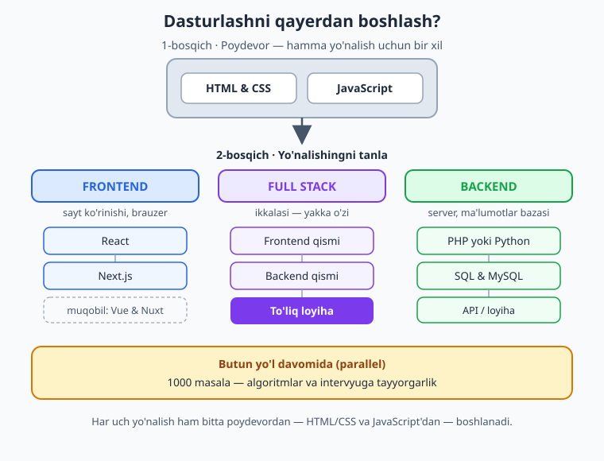
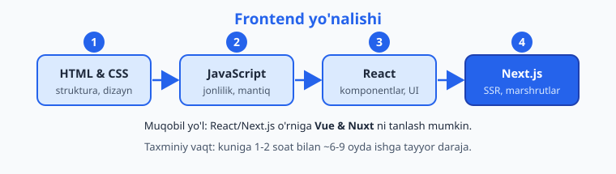
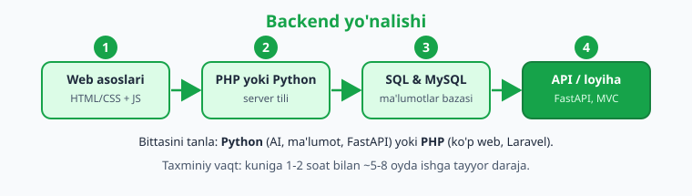
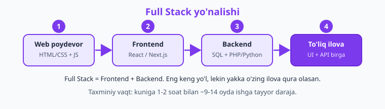

# 🗺️ Yo'l xaritasi — qayerdan boshlash?

> **Bu sahifa kim uchun:** dasturlashni boshlamoqchisiz, lekin *"qaysi kitobdan, qaysi tartibda boshlayman?"* degan savol bor. Quyida 3 ta aniq yo'nalish — **Frontend**, **Backend**, **Full Stack** — va har biri uchun bosqichma-bosqich reja.

Dasturlashda eng qiyin qadam — birinchi qadam. 9 ta kitob, yuzlab bob… qayerdan ushlash kerak? Javob sodda: **avval yo'nalishni tanlang, keyin shu yo'nalishning birinchi kitobini oching.** Hech narsani bir vaqtda o'rganishga urinmang.

---

## Avval — 3 yo'nalish nima? (oshxona o'xshatishi)

Bitta restoranni tasavvur qiling:

- 🎨 **Frontend** — restoranning **zali va menyusi**. Mijoz ko'radigan, bosadigan, his qiladigan hamma narsa: sayt ko'rinishi, tugmalar, ranglar, animatsiya.
- ⚙️ **Backend** — **oshxona**. Mijoz ko'rmaydi, lekin asosiy ish shu yerda: buyurtmani saqlash, hisob-kitob, ma'lumotlar bazasi, xavfsizlik.
- 🚀 **Full Stack** — **ham oshpaz, ham ofitsiant**. Ikkala tomonni ham biladi, yakka o'zi to'liq ilova qura oladi.

| Yo'nalish | Nima bilan shug'ullanadi | Misol vazifa |
|---|---|---|
| 🎨 **Frontend** | Foydalanuvchi ko'radigan qism, brauzer | Sayt dizayni, interaktiv tugmalar, mobil moslashuv |
| ⚙️ **Backend** | Server, mantiq, ma'lumotlar bazasi | Login tizimi, to'lov, API, ma'lumotni saqlash |
| 🚀 **Full Stack** | Ikkalasi birga | Butun ilovani noldan oxirigacha qurish |

!!! tip "Qaysi birini tanlasam?"
    - **Chiroyli, ko'rinadigan narsa yoqsa** → Frontend.
    - **Mantiq, ma'lumot, "ichki mexanika" qiziqtirsa** → Backend.
    - **Hammasini o'zim qilaman desangiz** (yoki hali qaror qila olmasangiz) → Frontend'dan boshlab, keyin Backend qo'shing = Full Stack.

    Xavotir olmang: **boshlanishi har uchovida bir xil.** Keyinroq fikringizni o'zgartirsangiz, hech narsa yo'qolmaydi.

---

## Hamma uchun umumiy poydevor

Qaysi yo'nalishni tanlasangiz ham, **ikkita kitobdan boshlaysiz**: HTML & CSS va JavaScript. Sababi oddiy — brauzer faqat shu uchta narsani (HTML, CSS, JS) tushunadi. Backend dasturchi bo'lsangiz ham, "web qanday ishlaydi?" degan savolni bilishingiz shart.

Va butun yo'l davomida, **parallel ravishda** ikki narsani mashq qiling: [1000 masala](1000-masala/README.md) bilan algoritmik fikrlashni (intervyularda eng ko'p so'raladigan qism) va [Git & GitHub](git-github/README.md) bilan kodingizni saqlashni.

---

## 🐙 Git & GitHub — birinchi kundan

Yo'nalishingizdan qat'i nazar, **birinchi kunlardanoq** kodingizni Git bilan saqlashni boshlang. Git — loyihangiz uchun "vaqt mashinasi"; GitHub esa ishingizni saqlash, jamoada hamkorlik va portfolio ko'rsatish joyi. Deyarli har bir vakansiya buni talab qiladi, lekin uni alohida "bosqich" emas, **butun yo'lga parallel** o'rganing — o'rgangan har bir kichik loyihangizni Git bilan saqlab, GitHub'ga yuklab boring.

[🐙 Git & GitHub — 0 dan Expertgacha](git-github/README.md) — commit, branch, merge, rebase, Pull Request, GitHub Actions. 24 bob, har biri SVG diagrammalar bilan.

---

## 🎨 Frontend yo'nalishi

**Kim uchun:** dizayn, ko'rinish, foydalanuvchi tajribasi yoqadiganlar uchun. Natijani darrov ko'rasiz — yozgan kodingiz brauzerda jonlanadi.

**Tartib:**

1. **[HTML & CSS](html-css/README.md)** — sahifa strukturasi va dizayni. Box model, flexbox, grid, responsive.
2. **[JavaScript](js/javascript-qollanma-1-qism.md)** — sahifaga jonlilik va mantiq. Bu yo'nalishning **eng muhim** kitobi, shoshilmang.
3. **[TypeScript](typescript/README.md)** — JavaScript'ga tip xavfsizligi. Zamonaviy React/Next.js loyihalari deyarli har doim TypeScript'da yoziladi, shuning uchun React'dan oldin o'rganib qo'ying.
4. **[React](react/reactjs-qollanma.md)** — zamonaviy interfeyslar komponentlardan quriladi. Bugungi bozorda eng ko'p so'raladigan.
5. **[Next.js](nextjs/README.md)** — React'ni production darajasiga olib chiqadi: SSR, marshrutlash, tezlik.

!!! note "Muqobil yo'l"
    React/Next.js o'rniga **[Vue & Nuxt](vue/README.md)** ni tanlashingiz mumkin — u ham kuchli va o'rganish biroz yengilroq. Bittasini tanlang, ikkalasini bir vaqtda emas. (Keyinroq ikkinchisi oson o'rganiladi.)

**Nima qura olasiz:** portfolio sayt, landing page, interaktiv dashboard, internet-do'kon interfeysi.

---

## ⚙️ Backend yo'nalishi

**Kim uchun:** mantiq, ma'lumot, tizim "ichki mexanikasi" qiziqtiradiganlar uchun. Ko'rinmaydi, lekin har bir ilovaning yuragi.

**Tartib:**

1. **Web asoslari** — [HTML & CSS](html-css/README.md) va [JavaScript](js/javascript-qollanma-1-qism.md) ni yengil darajada (chuqur dizayn shart emas, lekin "web nima?" ni biling).
2. **Bitta server tili** — [PHP](php/php-qollanma.md) yoki [Python](python/README.md) (pastdagi maslahatga qarang).
3. **[SQL & MySQL](sql/README.md)** — ma'lumotlar bazasi. Backend'ning poydevori: har bir login, buyurtma, post shu yerda saqlanadi.
4. **Framework / API** — tilning web qismi: PHP'da [Laravel](laravel/README.md), Python'da FastAPI/Django. Real server ilova quring.

!!! question "PHP yoki Python — qaysi biri?"
    - **Python** — agar AI, ma'lumot tahlili, avtomatlashtirish yoki zamonaviy startaplar qiziqtirsa. Sintaksisi sodda, FastAPI tez.
    - **PHP** — agar tez ishga joylashish kerak bo'lsa: dunyodagi saytlarning katta qismi PHP'da (WordPress, Laravel), O'zbekistonda ham vakansiya ko'p.

    Ikkalasi ham backend uchun a'lo. Birini tanlab, **chuqur** o'rganing — keyin ikkinchisi oson o'tadi.

**Nima qura olasiz:** login/ro'yxatdan o'tish tizimi, REST API, internet-do'kon backendi, telegram bot, ma'lumot boshqaruv panellari.

---

## 🚀 Full Stack yo'nalishi

**Kim uchun:** "men butun ilovani o'zim qurmoqchiman" deganlar uchun. Eng keng yo'l, lekin eng mustaqil — yakka o'zingiz ham frontend, ham backend yoza olasiz.

**Tartib:**

1. **Web poydevor** — [HTML & CSS](html-css/README.md) + [JavaScript](js/javascript-qollanma-1-qism.md).
2. **Frontend qismi** — [React](react/reactjs-qollanma.md) → [Next.js](nextjs/README.md) (yoki [Vue & Nuxt](vue/README.md)).
3. **Backend qismi** — [SQL & MySQL](sql/README.md) + [PHP](php/php-qollanma.md) yoki [Python](python/README.md).
4. **To'liq loyiha** — frontend va backend'ni bog'lab, boshidan oxirigacha ishlaydigan ilova quring.

!!! warning "Maslahat"
    Full Stack'ni **bir vaqtda hammasini** o'rganaman deb urinmang. Avval Frontend yo'lini to'liq tugating (kichik loyiha quring), **keyin** Backend qo'shing. Aks holda ikkala tomondan ham yarim bilim bilan qolasiz.

**Nima qura olasiz:** to'liq internet-do'kon, blog platforma, SaaS ilova, ijtimoiy tarmoq prototipi — boshidan oxirigacha o'zingiz.

---

## 🧩 Algoritmlar — qachon va nega?

[1000 masala](1000-masala/README.md) kitobi alohida yo'nalish emas — u **butun yo'l davomida parallel** ishlatiladigan mashq to'plami. Nega kerak:

- **Intervyu:** kompaniyalar texnik suhbatda aynan algoritmik masalalar beradi.
- **Fikrlash:** muammoni qismlarga bo'lib yechishni o'rgatadi — bu har qanday kodda asqotadi.

**Qachon boshlash:** JavaScript (yoki Python/PHP) asoslarini o'zlashtirgach. Kuniga 1-2 masaladan yeting — shoshilmasdan, lekin uzluksiz.

---

## 📋 Qisqacha — yo'nalish bo'yicha kitoblar

| Yo'nalish | Kitoblar (tartib bilan) | Taxminiy vaqt\* |
|---|---|---|
| 🎨 **Frontend** | HTML & CSS → JavaScript → TypeScript → React → Next.js | ~6–9 oy |
| ⚙️ **Backend** | (Web asoslari) → PHP yoki Python → SQL & MySQL → Laravel / FastAPI | ~5–8 oy |
| 🚀 **Full Stack** | HTML & CSS → JavaScript → TypeScript → React/Next → SQL → PHP/Python | ~9–14 oy |
| 🧩 **Algoritmlar** | 1000 masala (barcha yo'nalishlar uchun, parallel) | uzluksiz |
| 🐙 **Git & GitHub** | Barcha yo'nalishlar uchun (parallel, birinchi kundan) | uzluksiz |

\* *Kuniga 1–2 soat muntazam mashq qilingan holatda. Vaqt — yo'l-yo'riq, qonun emas: kimdir tezroq, kimdir sekinroq o'rganadi. Asosiysi — to'xtamaslik.*

---

## ✅ Boshlashdan oldin 5 ta qoida

1. **Bitta yo'nalish, bitta kitob.** Bir vaqtda 3 ta narsani o'rganib bo'lmaydi.
2. **Tartib bilan o'qing.** Har kitob oldingisiga tayanadi — sakrab o'tmang.
3. **Kod yozing, faqat o'qimang.** Har bob misolini o'zingiz tering, mashqlarni o'zingiz yeching.
4. **Kichik loyiha quring.** Har kitobdan keyin o'rganganingizdan biror narsa yasang — bilim shunda mustahkamlanadi.
5. **To'xtamang.** Kuniga 30 daqiqa > haftada bir marta 5 soat.

---

**Tayyormisiz?** Yo'nalishingizni tanladingiz — endi birinchi kitobni oching:

[🎨 Frontend — HTML & CSS'dan boshlash](html-css/README.md){ .md-button .md-button--primary }
[⚙️ Backend — PHP yoki Python](php/php-qollanma.md){ .md-button }
