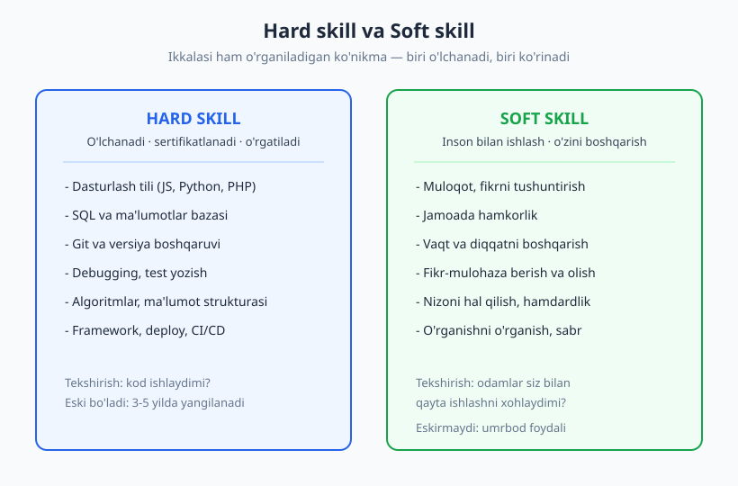
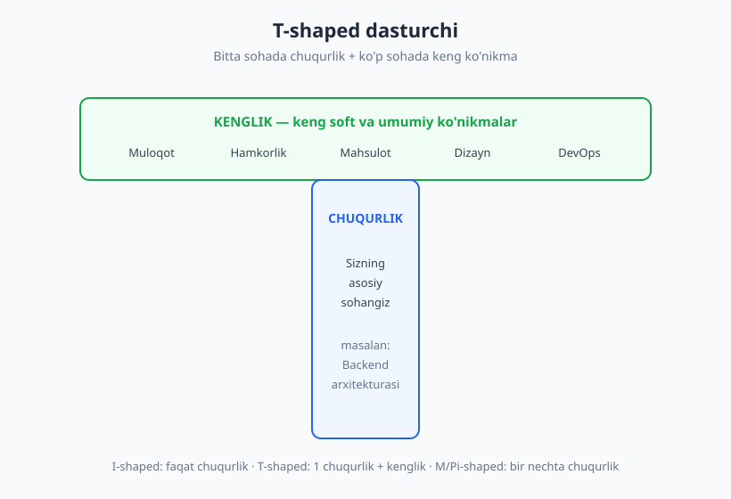
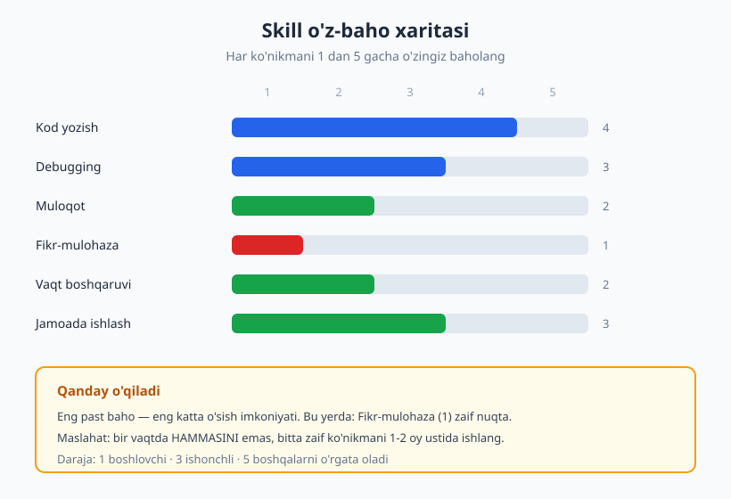

# 01 — Soft va Hard skills nima — T-shaped dasturchi

[🏠 README](./README.md) · [Keyingi: 02 — O'sish mentaliteti va imposter sindromi ➡️](./02-osish-mentaliteti.md)

---

> **Bu bobda:** dasturchining ikki turdagi ko'nikmasi — hard skill (o'lchanadigan texnik bilim) va soft skill (inson bilan ishlash, o'zini boshqarish) o'rtasidagi farqni aniqlaymiz, nega ish joyida ikkalasi ham kerakligini ko'ramiz, **T-shaped model** (chuqurlik + kenglik) bilan o'zingizni qayerga joylashtirishni o'rganamiz va birinchi amaliy qadam — **skill o'z-baho xaritasi**ni chizamiz.
>
> **Halollik / Eslatma:** "Soft" so'zi bu ko'nikmalarni "yengil" yoki "ixtiyoriy" deb ko'rsatadi — bu mutlaqo noto'g'ri. Ularni faqat o'qib o'rganib bo'lmaydi; suzishni kitobdan o'rganib bo'lmagani kabi, ular faqat amaliyotda o'sadi. Bu kitob xarita beradi, yo'lni esa siz bosib o'tasiz.

---

## "Soft" va "Hard" — nomlar chalg'itadi

Tasavvur qiling: ikki kishi bir xil ishga kelishdi. Birinchisi — Aziz — algoritmlarni mukammal biladi, har qanday tilni bir hafta ichida o'rganadi, kodi toza. Ikkinchisi — Dilshod — texnik jihatdan o'rtacha, lekin har bir vazifani aniq tushunadi, savol berishni biladi, code review'da hamkasbini xafa qilmasdan xatosini ko'rsatadi va deadline'ni har doim ogohlantirib ushlaydi. Olti oydan keyin Dilshod jamoaning markaziy figurasiga aylanadi, Aziz esa "kuchli, lekin u bilan ishlash qiyin" degan tavsifni oladi.

Bu hikoyaning maqsadi — Azizni yomonlash emas. Maqsad — bir savol: **nega texnik jihatdan kuchliroq odam o'smay qoldi?** Javob ikki so'zda: *soft skill*.

Keling, atamalarni aniqlaylik.

**Hard skill** — bu o'lchanadigan, o'rgatiladigan, sertifikatlanadigan texnik ko'nikma. Ularning umumiy belgisi: *to'g'ri yoki noto'g'ri javob bor*. Kod ishlaydi yoki ishlamaydi. So'rov natija qaytaradi yoki xato beradi. Misollar:

- Dasturlash tili (JavaScript, Python, PHP) sintaksisi va idiomalari
- SQL va ma'lumotlar bazasini loyihalash
- Git bilan versiyalarni boshqarish
- Debugging, test yozish, profiling
- Algoritmlar va ma'lumot strukturalari
- Framework, deploy, CI/CD quvuri

**Soft skill** — bu inson bilan ishlash va o'zingizni boshqarish ko'nikmasi. Ularning belgisi: *bir to'g'ri javob yo'q, kontekstga bog'liq*. Misollar:

- Fikrni aniq tushuntirish (muloqot)
- Jamoada hamkorlik va ishonch qurish
- Vaqt va diqqatni boshqarish
- Fikr-mulohaza (feedback) berish va og'rinmasdan qabul qilish
- Nizoni hal qilish, hamdardlik
- O'rganishni o'rganish, sabr, o'zini tanqid qila olish

"Soft" nomi bu yerda eng yomon marketing. U bu ko'nikmalarni "yumshoq", "ixtiyoriy", "tug'ma" deb tasvirlaydi. Aslida buning aksi to'g'ri:

- Ular **eng qiyin** — sintaksis xatosini kompilyator aytadi, lekin "men noto'g'ri muloqot qildim" deb hech bir mashina aytmaydi.
- Ular **eng qadrli** — hard skill'ni AI yoki yangi vosita tez almashtiradi; ishonchli muloqot va yetakchilikni almashtirmaydi.
- Ular **eskirmaydi** — bugun o'rgangan framework 3-5 yilda eskiradi; bugun o'rgangan "qiyin suhbatni boshqarish" umringiz davomida foydali.

> **Eslatma:** ba'zilar "soft skill" o'rniga "power skill", "core skill" yoki "human skill" atamasini ishlatishni taklif qiladi — aynan shu chalg'ituvchi taassurot tufayli. Atama qanday bo'lishidan qat'i nazar, biz nazarda tutgan narsa bir xil: kod bilan emas, odamlar va o'zingiz bilan ishlash.

## Nega ikkalasi ham kerak

Faqat hard skill bilan ham, faqat soft skill bilan ham uzoq borib bo'lmaydi. Buni ikki uchburchak orqali ko'ramiz.

**Faqat hard skill, soft yo'q.** Bu — Aziz holati. Kodi zo'r, lekin:

- Vazifani noto'g'ri tushunadi, chunki aniqlovchi savol bermaydi → ikki kun "noto'g'ri narsani" yozadi.
- Code review'da "bu kod axlat" deb yozadi → hamkasbi mudofaaga o'tadi, jamoada ishonch parchalanadi.
- Stand-up'da nima qilganini tushuntira olmaydi → menejer uning hissasini ko'rmaydi.

Natija: u "yaxshi muhandis", lekin **yakka o'yinchi**. Mas'uliyati katta loyihaga, jamoa yetakchiligiga yoki ko'tarilishga olib chiqilmaydi.

**Faqat soft skill, hard yo'q.** Bu ham qulamoq. Yoqimli, gapga chechan, lekin kodi ishonchsiz odam jamoaga texnik yuk bo'ladi. Soft skill hard skill'ning *o'rnini bosmaydi* — u uni *kuchaytiradi*. Ishonchli kod + ishonchli muloqot = ta'sir.

Vakansiyalarni o'qib ko'ring. Deyarli har birida "jamoada ishlay olish", "yaxshi muloqot", "mustaqillik", "o'rganishga ishtiyoq" yozilgan. Bu bo'sh so'zlar emas — ishga olish jarayonida aynan shular tekshiriladi (27-bobda **behavioral intervyu**ni ko'ramiz, u butunlay soft skill'ni o'lchaydi).

> **Halollik:** "soft skill ish joyini saqlaydi, hard skill ishga oladi" degan keng tarqalgan gap bor — bu juda jo'nlashtirilgan. Realroq tasvir: hard skill *eshikni ochadi*, soft skill esa *xonada qanchalik uzoq va baland o'tirishingizni* belgilaydi. Ikkisi bir-birini ko'paytiradi, qo'shmaydi.

### Ikki teng dasturchi — kim ko'tariladi

Ko'tarilish (promotion) bahslari amalda qanday ketishini tasavvur qiling. Ikki dasturchi — texnik jihatdan deyarli teng. Menejer qaror qabul qiladi. U nimani ko'radi?

| Mezon | Birinchi dasturchi | Ikkinchi dasturchi |
|---|---|---|
| Kod sifati | Yaxshi | Yaxshi |
| Vazifani aniqlashtirish | "Tushunarli" deb boshlaydi | Noaniqlikni oldindan so'raydi |
| Bloklanganda | Jim qoladi, kun yo'qoladi | Vaqtida yordam so'raydi |
| Code review | Faqat xatoni ko'rsatadi | Xato + sababi + variant beradi |
| Boshqalarga ta'sir | Yakka ishlaydi | Junior'larga yordam beradi |
| Menejerga ko'rinish | Ishini tushuntirmaydi | Progress'ni aniq yetkazadi |

Ikkisi ham yomon dasturchi emas. Lekin menejer **ta'sir doirasi kengroq** odamni tanlaydi — chunki ko'tarilish faqat "yaxshi kod yozish" emas, balki "boshqalarni ham yaxshiroq qilish". Bu farqning hammasi o'ng ustunda — va u butunlay soft skill.

Bu yerda ortiqcha va'da bermaylik: soft skill o'zi sizni ko'tarmaydi. Agar kodingiz ishonchsiz bo'lsa, eng yaxshi muloqot ham yordam bermaydi. Gap shundaki, **teng texnik darajada** soft skill hal qiluvchi farqqa aylanadi — va dasturchilarning aksariyati e'tiborni faqat hard tomonga qaratadi, shu sabab bu yer raqobat kam, o'sish ko'p.

## T-shaped model — chuqurlik va kenglik

Endi savol: agar ikkalasi kerak bo'lsa, qancha-qanchadan kerak? Buni tushuntiradigan eng foydali model — **T-shaped** odam g'oyasi.

"T" harfining shakli ikki narsani ko'rsatadi:

- **Vertikal chiziq (chuqurlik)** — bitta sohada chuqur ekspertlik. Sizning asosiy hard skill'ingiz. Masalan: backend arxitekturasi, yoki frontend performance, yoki ma'lumotlar muhandisligi.
- **Gorizontal chiziq (kenglik)** — ko'p sohada yetarli, ishchi darajadagi bilim. Bu yerda soft skill'lar va qo'shni texnik sohalar yashaydi: muloqot, hamkorlik, mahsulot tushunchasi, biroz dizayn, biroz DevOps.

Bu g'oyani **dizayn va innovatsiya kompaniyasi IDEO**, jumladan uning rahbari **Tim Brown** keng ommalashtirgan (atama undan ancha oldin paydo bo'lgan, lekin bugungi mashhurligi shu manbadan). G'oya oddiy: jamoaga eng foydali odam — o'z sohasida haqiqiy ekspert, *ammo* boshqa soha vakillari bilan gaplasha oladigan, ular bilan hamkorlik qila oladigan kishi.

Shaklning boshqa turlari ham bor — taqqoslab ko'ring:

| Shakl | Ma'nosi | Xavfi |
|---|---|---|
| **I-shaped** | Faqat chuqurlik, kenglik yo'q | Yakka o'yinchi, hamkorlik qiyin |
| **Dash (—)** | Faqat kenglik, chuqurlik yo'q | "Hamma narsani biladi, hech narsani chuqur emas" |
| **T-shaped** | 1 chuqurlik + keng kenglik | Muvozanatli, jamoaga qulay |
| **M / Pi-shaped** | Bir nechta chuqurlik + kenglik | Kuchli, lekin yillar talab qiladi |

Ko'pchilik karyerasini **I-shaped** boshlaydi — bitta tilni yoki bitta sohani chuqur o'rganadi, bu to'g'ri. Lekin o'sish — *gorizontal chiziqni cho'zish*da. Mid darajaga yetganda, eng katta cheklov ko'pincha vertikal emas (texnik chuqurlik yetarli), balki gorizontal (muloqot, jamoa, mahsulot) bo'ladi.

> **Trade-off:** "generalist (keng) bo'laymi yoki specialist (chuqur)?" — bu noto'g'ri savol. T-shaped javobi: *ikkalasi ham, lekin ketma-ket*. Avval bitta sohada ishonchli chuqurlik quring (sizni jiddiy qabul qilishadi), keyin kenglikni cho'zing. Chuqurliksiz kenglik — yuza; kengliksiz chuqurlik — yakkalanish.

Diqqat qiling: bu kitobning o'zi sizning **gorizontal chiziqingiz** uchun yozilgan. Vertikal chiziqni — JavaScript, Python, SQL — boshqa kitoblar chuqur o'rgatadi. Bu kitob ularni bog'lab turadigan inson va karyera qatlamini qo'shadi.

## "Soft skill — tug'ma, o'rganib bo'lmaydi" degan mif

Eng zararli yolg'on shu: *"Men introvertman, muloqot meniki emas"* yoki *"u tug'ma yetakchi"*. Bu fikrlash tarzi sizni ko'nikma ustida ishlashdan to'xtatadi — chunki "baribir o'zgarmaydi" deb o'ylaysiz.

Haqiqat: **soft skill ham xuddi hard skill kabi ko'nikma.** Ko'nikma esa — ta'rifi bo'yicha — mashq bilan o'sadigan narsa. Hech kim tug'ilganda Git'ni bilmagani kabi, hech kim tug'ilganda "qiyin suhbatni boshqarish"ni ham bilmaydi. Ikkalasi ham o'rganiladi.

Farqi shundaki, soft skill'da **fikr-mulohaza sekin va noaniq keladi**. Kod xato bersa, darhol bilasiz. Lekin "men yig'ilishda hamkasbimni xafa qildim"ni ko'pincha hech kim aytmaydi — shuning uchun o'z-o'zidan o'sib qolmaydi. Aynan shu sabab soft skill'ni *ataylab*, ramka va mashq bilan o'rganish kerak. Bu — bu kitobning butun mantig'i.

- ❌ "Men muloqotchi emasman, bu meniki emas." (sobit fikr — o'sishni to'xtatadi)
- ✅ "Men hozircha muloqotda zaifman, lekin bu mashq qilinadigan ko'nikma." (o'sish fikri — yo'l ochadi)

Bu ikki jumla o'rtasidagi farq — keyingi bobning ([02 — O'sish mentaliteti](./02-osish-mentaliteti.md)) butun mavzusi. Soft skill'ni qanday ataylab mashq qilishni esa [03 — O'rganishni o'rganish](./03-organishni-organish.md)da ko'ramiz. Hozircha esa shu fikrni yodda saqlang: **hech bir soft skill "tug'ma" emas — hammasi o'sadi.**

## O'z skill xaritangizni chizing

Endi nazariyadan amaliyotga. Birinchi qadam — har qanday o'sishning poydevori — **o'zingizni halol baholash**. Qaysi ko'nikmalaringiz kuchli, qaysilari zaif, qaysi biriga keyingi oylarda e'tibor berasiz?

Buni "kompetensiya o'z-bahosi" (competency self-assessment) deb ataladi. Sodda usul: 6-8 ta asosiy ko'nikmani yozing va har birini **1 dan 5 gacha** baholang.

- **1** — boshlovchi, deyarli tajriba yo'q
- **3** — ishonchli, kuzatuvsiz bajara olaman
- **5** — ekspert, boshqalarni o'rgata olaman

Hard va soft skill'larni aralashtirib yozing. Masalan:

| Ko'nikma | Tur | Bahoyim (1-5) |
|---|---|---|
| Kod yozish (asosiy til) | hard | 4 |
| Debugging | hard | 3 |
| Muloqot / fikrni tushuntirish | soft | 2 |
| Fikr-mulohaza berish/olish | soft | 1 |
| Vaqtni boshqarish | soft | 2 |
| Jamoada ishlash | soft | 3 |

Bu jadvalni o'qishning kaliti — **eng past baho eng katta imkoniyat**. Yuqoridagi misolda "Fikr-mulohaza (1)" eng zaif nuqta. Demak, keyingi 1-2 oyda e'tibor aynan shu yerga ([13 — Fikr-mulohaza](./13-feedback-berish-qabul.md)).

Ikki keng tarqalgan xato:

1. **Hamma narsani bir vaqtda yaxshilashga urinish.** Imkonsiz. Bitta zaif ko'nikmani tanlang, 1-2 oy unga e'tibor bering, keyin keyingisiga o'ting.
2. **O'zini noto'g'ri baholash.** Boshlovchilar ko'pincha o'zini ortiqcha baholaydi (bu — **Dunning-Kruger effekti**, uni 02-bobda ko'ramiz). Shuning uchun: bahoyingizni bitta ishonchli hamkasb yoki mentordan tekshirib oling. Ular ko'pincha boshqacha raqam aytadi — bu juda foydali ma'lumot.

> **Diqqat:** o'z-baho — bir martalik mashq emas. Uni har 3-6 oyda qayta chizing. Raqamlarning yuqoriga siljishi — sizning eng aniq o'sish dalilingiz, va u CV hamda [intervyu](./26-texnik-intervyu.md)da ham asqotadi.

## Bu kitobdan qanday foydalanish

Endi yo'l xaritasi. Bu kitob 30 bobdan iborat va olti qismga bo'lingan:

- **I qism (01-04)** — asos: ko'nikmalar, o'sish mentaliteti, o'rganishni o'rganish. Hammaga poydevor.
- **II qism (05-08)** — shaxsiy samaradorlik: vaqt, diqqat, maqsad, burnout.
- **III qism (09-13)** — muloqot: yozma, og'zaki, tinglash, fikr-mulohaza.
- **IV qism (14-18)** — jamoa: psixologik xavfsizlik, code review, nizolar, masofaviy ish.
- **V qism (19-24)** — muhandislik ko'nikmalari: muammo yechish, debugging, baholash, hujjat.
- **VI qism (25-30)** — karyera: CV, intervyu, maosh, networking, o'sish.

Uchta maslahat, eng yaxshi natija uchun:

1. **Tartib shart emas, lekin I qism birinchi.** Intervyuga shoshyapsizmi — VI qismni oching. Yangi jamoaga qo'shildingizmi — IV qism. Lekin I qism — poydevor, uni o'tkazib yubormang.
2. **Mashqlarni albatta bajaring.** Soft skill o'qishdan o'smaydi, *qilishdan* o'sadi. Har bobning oxiridagi mashqlar — kitobning eng muhim qismi.
3. **Bittadan.** Bir bobni o'qing, 1-2 hafta amaliyotga qo'ying, keyin keyingisiga o'ting. "Hammasini bir kechada" — yo'l emas.

Va eng oxirgi bob ([30 — Junior'dan senior va lead'gacha](./30-junior-senior-lead-mentorlik.md)) butun yo'lni bir-biriga bog'laydi: bu ko'nikmalar daraja oshgani sayin qanday o'sishini ko'rsatadi. Hozir esa — boshlash uchun eng yaxshi joy mana shu: o'zingizni halol baholash.

## Asosiy g'oyalar (bobni qisqacha)

- **Hard skill** o'lchanadi, o'rgatiladi, sertifikatlanadi (til, SQL, Git); **soft skill** — inson bilan ishlash va o'zini boshqarish (muloqot, hamkorlik, vaqt). "Soft" nomi chalg'itadi — ular aslida eng qiyin va eng qadrli.
- Faqat hard skill bilan odam **yakka o'yinchi** bo'lib qoladi; faqat soft bilan — texnik yuk. Ikkisi bir-birini **ko'paytiradi**, qo'shmaydi.
- **Teng texnik darajada** ko'tarilishni soft skill hal qiladi, chunki ta'sir doirasi kengligi muhim — lekin soft skill hard skill o'rnini bosmaydi.
- **T-shaped model** (IDEO / Tim Brown ommalashtirgan): bitta sohada **chuqurlik** + ko'p sohada **kenglik**. O'sish ko'pincha gorizontal chiziqni cho'zishda.
- **"Soft skill tug'ma" — mif.** U ham mashq bilan o'sadigan ko'nikma; faqat fikr-mulohaza sekin keladi, shuning uchun *ataylab* o'rganish kerak.
- Har qanday o'sish **halol o'z-bahodan** boshlanadi: 6-8 ko'nikmani 1-5 ga baholang, eng past bahoga e'tibor bering, **bittadan** ishlang.

## Mashqlar

### Oson

**1-mashq.** Quyidagi ko'nikmalarni ikki ustunga ajrating — *hard* yoki *soft*: SQL so'rov yozish, deadline'ni ushlash, code review'da xushmuomalalik, Docker konteyner sozlash, hamkasbni tinglash, Git rebase, vazifani aniqlashtiruvchi savol berish, regulyar ifoda (regex).

**2-mashq.** O'zingizning eng kuchli **hard skill**ingizni va eng kuchli **soft skill**ingizni bittadan yozing. Har biri uchun bitta aniq misol keltiring: bu ko'nikma so'nggi oyda qayerda yordam berdi?

### O'rta

**3-mashq.** Kamida 6 ta ko'nikma (hard va soft aralash) ro'yxatini tuzing va har birini 1-5 ga baholang. Eng past baholangan ko'nikmani belgilang — keyingi 2 oy e'tiboringiz shu. Bu sizning **skill xaritangiz**ning birinchi versiyasi.

**4-mashq.** 3-mashqdagi eng past baholangan **soft skill**ni oling. Uch jumlada yozing: (a) u aynan nimadan iborat, (b) u zaif bo'lgani ishingizga so'nggi paytda qanday halaqit berdi (aniq vaziyat), (c) uni yaxshilash nega siz uchun muhim.

### Qiyin

**5-mashq.** O'zingizning T-shaped shaklini chizing. Vertikal chiziq — sizning eng chuqur sohangiz (asosiy hard skill). Gorizontal chiziqqa hozir *yetarli* darajada egallagan 4-5 ta qo'shni ko'nikmani (soft yoki texnik) yozing. Keyin: gorizontal chiziqda eng zaif (deyarli yo'q) bitta bo'g'inni belgilang — bu sizning keyingi o'sish yo'nalishingiz.

**6-mashq.** Bitta ishonchli hamkasb yoki mentordan sizning 3-mashqdagi bahoyingizni *mustaqil* baholashni so'rang (ularga o'z raqamlaringizni ko'rsatmasdan). Keyin ikki ro'yxatni solishtiring. Qayerda eng katta farq bor? Bu farq Dunning-Kruger effekti haqida sizga nima aytadi — qaysi ko'nikmani o'zingiz ortiqcha yoki kam baholagansiz?

Yechimlar / Namunaviy yondashuvlar

### 1-mashq yechimi

- **Hard:** SQL so'rov yozish, Docker konteyner sozlash, Git rebase, regulyar ifoda (regex). Belgisi: aniq to'g'ri/noto'g'ri javob bor, o'lchanadi.
- **Soft:** deadline'ni ushlash (o'zini boshqarish), code review'da xushmuomalalik (muloqot), hamkasbni tinglash (muloqot), vazifani aniqlashtiruvchi savol berish (muloqot/tahlil). Belgisi: kontekstga bog'liq, bir to'g'ri javob yo'q.

Chegara ba'zan xira — "deadline ushlash" texnik rejalashtirishni ham talab qiladi. Muhimi tasniflashning o'zi emas, balki ikki turning *belgilarini* his qilish: o'lchanadimi yoki kontekstga bog'liqmi.

### 2-mashq yechimi

Namuna: *Hard — debugging. So'nggi oyda production'dagi xatoni loglarni tizimli o'qib, 2 soatda topdim. Soft — aniqlashtiruvchi savol berish. Yangi vazifani boshlashdan oldin menejerdan ikki savol so'radim va ikki kunlik noto'g'ri ishni oldini oldim.* Eng muhimi — **aniq misol**: "men yaxshi muloqot qilaman" emas, balki "falon vaziyatda falon qildim". Misolsiz o'z-baho ishonchsiz.

### 3-mashq yechimi

To'g'ri javob yo'q — bu sizning xaritangiz. Tekshirish mezonlari: (1) kamida 6 ta ko'nikma, hard va soft aralash; (2) baholar halol — agar hammasi 4-5 bo'lsa, ehtimol o'zingizni ortiqcha baholayapsiz; (3) bitta eng past baho aniq belgilangan. Namuna xaritasini bob ichidagi diagrammada ko'rdingiz. Bu ro'yxatni saqlang — 3 oydan keyin qayta baholaysiz.

### 4-mashq yechimi

Namuna (eng past skill — fikr-mulohaza berish):

- **(a) Nimadan iborat:** hamkasbga xatosini, uni xafa qilmasdan va aniq qilib aytish ko'nikmasi.
- **(b) Halaqit:** o'tgan hafta code review'da bitta jiddiy muammoni ko'rdim-u, "noqulay bo'ladi" deb yozmadim — natijada bug production'ga chiqdi.
- **(c) Nega muhim:** indamaslik menga "yaxshi" odam degan nom beradi, lekin jamoaga zarar yetkazadi. Halol va xushmuomala feedback — ishonchli muhandisning belgisi.

Bu mashqning maqsadi — abstrakt "zaif" ni *aniq vaziyat* va *aniq narx*ga bog'lash. Shu bog'lanish sizga uni yaxshilashga turtki beradi.

### 5-mashq yechimi

To'g'ri shakl yo'q — har kimniki har xil. Namuna: *Vertikal — frontend (React, performance). Gorizontal — Git (4), debugging (3), yozma muloqot (3), mahsulot tushunchasi (2), og'zaki taqdimot (1).* Eng zaif bo'g'in — og'zaki taqdimot (1), demak keyingi yo'nalish — [11-bob](./11-ogzaki-taqdimot-public-speaking.md). Asosiy fikr: o'sish odatda vertikalni yana chuqurroq qilishda emas, balki **eng zaif gorizontal bo'g'inni ko'tarish**da tezroq keladi.

### 6-mashq yechimi

Eng katta farq odatda **soft skill**larda chiqadi — chunki o'zimizni ichkaridan, boshqalar bizni tashqaridan ko'radi. Agar siz "muloqot — 4" desangiz-u, hamkasb "2" desa, ehtimol Dunning-Kruger effekti ishlamoqda: kam tajriba o'zini yuqori baholashga olib keladi (buni 02-bobda chuqur ko'ramiz). Aksincha, agar siz o'zingizni kam baholagan bo'lsangiz, bu imposter sindromi belgisi bo'lishi mumkin. Ikki holatda ham *tashqi ko'z* — sizning eng aniq kalibrlash vositangiz. Vazifa "kim haq" emas, balki **farqdan o'rganish**.

---

[🏠 README](./README.md) · [Keyingi: 02 — O'sish mentaliteti va imposter sindromi ➡️](./02-osish-mentaliteti.md)
