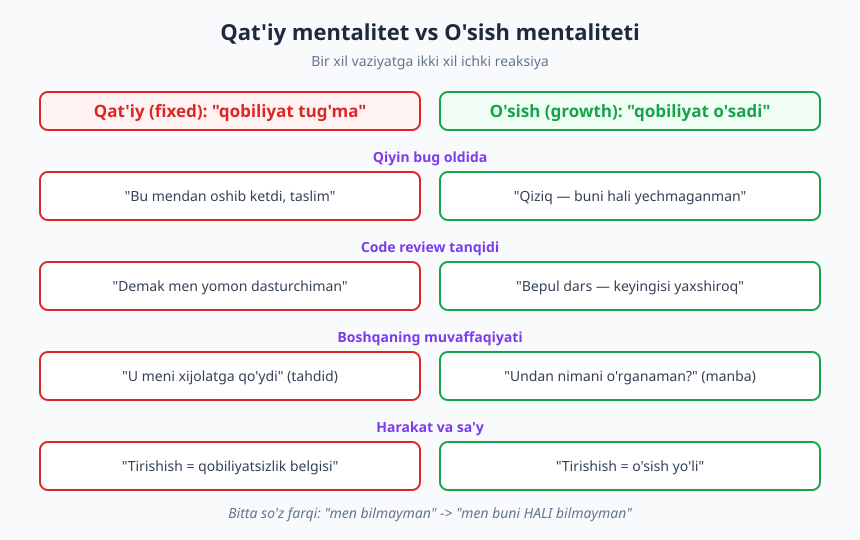
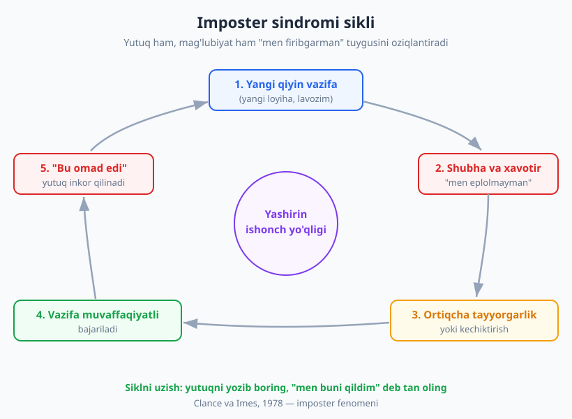
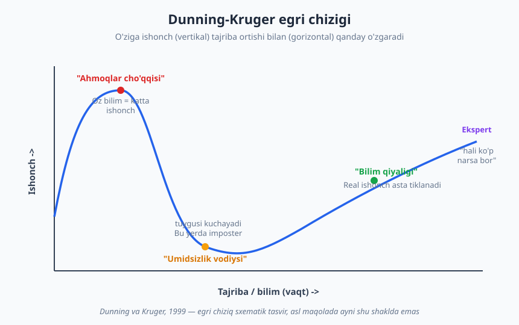

# 02 — O'sish mentaliteti va imposter sindromi

[⬅️ Oldingi: 01 — Soft va Hard skills nima](./01-skills-nima-t-shaped.md) · [🏠 README](./README.md) · [Keyingi: 03 — O'rganishni o'rganish ➡️](./03-organishni-organish.md)

---

> **Bu bobda:** dasturchining eng muhim ichki vositasi — o'zi haqidagi ishonchi bilan ishlashni o'rganasiz. Carol Dweck'ning qat'iy (fixed) va o'sish (growth) mentaliteti modelini, imposter sindromi siklini (Clance va Imes), Dunning-Kruger effektini va muvaffaqiyatsizlikni "ma'lumot"ga aylantirish usulini ko'rib chiqamiz.
>
> **Halollik / Eslatma:** mentalitet — bir kechada o'zgarmaydi va "men endi o'sish mentalitetidaman" deb e'lon qilish bilan ish bitmaydi. Bu kundalik mayda tanlovlar — qiyinchilik, tanqid va xato oldida qanday reaksiya berishingiz — yig'indisi. Bob sizga til va ramka beradi; mashqni o'zingiz haftalar davomida qilasiz.

---

## Nega aynan mentalitetdan boshlaymiz

Kitobning birinchi haqiqiy bobi nega vaqt boshqaruvi yoki muloqot emas, balki *mentalitet* haqida? Chunki qolgan hamma narsa — o'rganish, feedback olish, qiyin bug bilan kurashish, intervyuda mag'lub bo'lib qaytadan urinish — bittagina ichki sozlamaga bog'liq: **siz qobiliyatingizni o'zgarmas deb bilasizmi yoki o'sadigan deb?**

Bu mavhum savol emas. U sizning har kuni qanday harakat qilishingizni belgilaydi. Ikki junior dasturchini tasavvur qiling. Ikkalasi ham bir xil murakkab xatoga (bug) duch keladi. Birinchisi yarim soatdan keyin "men bunaqa narsalarni hech qachon tushunmayman" deb yopadi va boshqa vazifaga o'tadi. Ikkinchisi "qiziq, men buni *hali* yechmaganman" deb davom etadi, hujjat o'qiydi, savol beradi, ertasiga yechadi. Olti oydan keyin ular orasidagi farq ko'zga tashlanadi — lekin u qobiliyat farqi emas edi. U **reaksiya farqi** edi.

Shu sababli mentalitet — bu kitobdagi eng kuchli "ko'paytuvchi" (multiplier). Yaxshi mentalitetsiz qolgan boblardagi ramkalar shunchaki bilim bo'lib qoladi; u bilan esa ular odatga aylanadi.

## Qat'iy va o'sish mentaliteti (Carol Dweck)

Bu modelni Stenford universiteti psixologi **Carol Dweck** o'nlab yillik tadqiqotlari asosida "Mindset: The New Psychology of Success" (2006) kitobida ommalashtirdi. Dweck odamlarda iqtidor va aql haqidagi ikki xil asosiy e'tiqodni ajratdi:

- **Qat'iy mentalitet (fixed mindset):** "Qobiliyat — bu tug'ma berilgan, deyarli o'zgarmas miqdor. Sen yo matematik miyaga egasan, yo emas. Yo dasturlash uchun tug'ilgansan, yo yo'q." Bu e'tiqodda har bir vazifa — qobiliyatingni *o'lchaydigan imtihon*. Shuning uchun muvaffaqiyatsizlik dahshatli: u "men yetarli emasman" degan hukmni tasdiqlaydi.
- **O'sish mentaliteti (growth mindset):** "Qobiliyat — mashq, harakat va to'g'ri strategiya bilan o'sadigan narsa. Hozir uddasidan chiqolmasligim — abadiy hukm emas, balki hozirgi nuqta." Bu e'tiqodda har bir vazifa — *o'rganish imkoni*. Muvaffaqiyatsizlik og'riqli bo'lsa-da, u ma'lumot beradi, hukm chiqarmaydi.

Diqqat: bu "ikki turdagi odam" degani emas. **Hech kim 100% growth yoki 100% fixed emas.** Hammamizda ikkalasi ham bor, va u sohaga qarab o'zgaradi. Siz dasturlashda o'sish mentalitetiga ega bo'lishingiz mumkin, lekin "men rasm chizolmaydiganman" deb qat'iy ishonishingiz mumkin. Maqsad — o'zingizdagi qat'iy reaksiyalarni *payqash* va ularni ongli ravishda o'sish reaksiyalariga aylantirish.

### Dasturchi tilidagi farq: "men matematik emasman" va "hali bilmayman"

Mentalitet eng aniq tilda namoyon bo'ladi. Quyidagi iboralar tanish tuyuladimi?

| Qat'iy ovoz | O'sish ovozi |
|---|---|
| "Men matematik miyaga ega emasman." | "Men hali bu mavzuni puxta o'rganmadim." |
| "Men frontend odamiman, backend men uchun emas." | "Backend men uchun yangi — boshlash uchun nima kerak?" |
| "Men shunchaki algoritmlarni tushunmayman." | "Bu algoritm hali menga tushunarli emas. Qaysi qismi tushunmaydi?" |
| "U tug'ma iqtidorli, men esa oddiyman." | "U bu sohada mendan ko'p mashq qilgan. Men ham qila olaman." |

### "Hali" so'zining kuchi

Dweck'ning eng amaliy g'oyasi — bitta so'z: **"hali" (yet).** U bir maktab tajribasini keltiradi: o'quvchilar imtihondan o'tmaganda "muvaffaqiyatsiz" (fail) o'rniga "hali emas" (not yet) bahosini olishgan. "Hali emas" — bu yo'lning *bir nuqtasi*, oxiri emas. "Muvaffaqiyatsiz" esa — hukm, eshik yopilgani.

Amaliyotda sinab ko'ring: har gal "men buni qilolmayman" deyishni xohlaganingizda, oxiriga **"hali"** so'zini qo'shing.

- ❌ "Men rekursiyani tushunmayman."
- ✅ "Men rekursiyani *hali* tushunmayman."

Ikkinchi jumla psixologik jihatdan butunlay boshqa eshik ochadi: u keyingi qadam bo'lishini nazarda tutadi.

> **Diqqat:** "Hali" so'zi sehrli mantra emas. U ishlaydi, chunki diqqatingizni *hukmdan jarayonga* ko'chiradi — keyin siz haqiqatan ham o'sha hujjatni o'qiysiz, o'sha savolni berasiz. So'zning o'zi emas, undan keyingi harakat o'zgartiradi.

## Mentalitet xatti-harakatda ko'rinadi

Mentalitetni o'zingizda topishning eng ishonchli yo'li — e'tiqodingizni emas, **reaksiyangizni** kuzatish. To'rt vaziyat mentalitetni "fosh qiladi": qiyinchilik, xato, tanqid va boshqalarning muvaffaqiyati. Quyidagi jadval — sizga oyna.

| Vaziyat | Qat'iy reaksiya ❌ | O'sish reaksiyasi ✅ |
|---|---|---|
| **Qiyinchilik** (qiyin vazifa) | Qochadi, "bu men uchun emas" | Qiziqadi, "bu meni o'stiradi" |
| **Xato/muvaffaqiyatsizlik** | Yashiradi, uyaladi, ayblaydi | Tahlil qiladi, nimani o'rganganini so'raydi |
| **Tanqid (feedback)** | Mudofaaga o'tadi, shaxsiy oladi | Ma'lumot deb qabul qiladi, savol beradi |
| **Boshqaning yutugi** | Tahdid ko'radi, hasad qiladi | Manba ko'radi, "undan nimani o'rganaman?" |
| **Harakat/tirishish** | "Tirishish = qobiliyatsizlik belgisi" | "Tirishish = o'sish yo'li" |

Endi har bir qatorni dasturchi hayotiga tatbiq qilamiz — chunki bu kitob abstrakt nasihat emas.

### Kontekst 1: code review tanqidi

Siz bir kun ishlab, g'ururlanib PR (pull request) yubordingiz. Sizdan tajribaliroq dasturchi 12 ta izoh qoldirdi: "bu yerda nomlash chalkash", "bu funksiya juda uzun", "bu joyda xato ushlanmagan".

- **Qat'iy ichki ovoz:** "Demak men yomon dasturchiman. Hamma ko'rdi. Uyat." — Bu his nima qiladi? Sizni mudofaaga undaydi: har izohga bahonalar yozasiz yoki indamay tuzatasiz, lekin g'azab qoladi.
- **O'sish ichki ovozi:** "Bu — bepul, individual dars. Bu odam o'z vaqtini sarflab menga nimani yaxshilashni ko'rsatyapti. Keyingi PR'im bularsiz chiqadi." — Bu his nima qiladi? Siz savol berasiz: "Bu naqshni qayerda ko'proq o'qiyman?" — va keyingi safar 12 emas, 4 izoh olasiz.

Eslatma: izohlar sizning *qiymatingiz* haqida emas, *kodingizning hozirgi holati* haqida. Bu farqni ko'rish — o'sish mentalitetining yuragi. Buni 15-bobda code review'ning inson tomonida chuqurroq ko'ramiz (qarang: [Code review: inson tomoni](./15-code-review-inson-tomoni.md)).

### Kontekst 2: qiyin bug

Uch soat bo'ldi, bug hamon yo'qolmayapti. Stack trace tushunarsiz, log'lar chalkash.

- **Qat'iy:** "Agar men yaxshi dasturchi bo'lganimda, buni allaqachon yechardim. Demak men sustman." — Bu fikr energiyangizni so'rib oladi: siz muammoga emas, o'zingizni qoralashga sarflaysiz.
- **O'sish:** "Bu bug menga hali ma'lum bo'lmagan biror narsani o'rgatadi. Buni yechsam, kelajakda butun bir sinf shunaqa xatolarni tezroq tutaman." — Bu fikr sizni harakatda saqlaydi: tizimli debugging'ga o'tasiz (buni 20-bobda ko'ramiz), chunki maqsad — *o'rganish*, *isbotlash* emas.

### Kontekst 3: rad etilgan PR yoki intervyu

PR butunlay rad etildi ("bu yondashuv noto'g'ri, qaytadan o'ylaylik"). Yoki intervyudan keyin "afsus, bu safar emas" javobi keldi.

- **Qat'iy:** "Men befoyda ekanman. Boshqa urinmayman." — Eshik yopiladi.
- **O'sish:** "Bu yondashuv ishlamadi. *Bu urinish* muvaffaqiyatsiz, *men* emas. Nima yetishmadi? Keyingi safar nimani boshqacha qilaman?" — Eshik ochiq qoladi.

E'tibor bering: o'sish mentaliteti og'riqni inkor qilmaydi. Rad etilish — og'riq. Maqsad — "hammasi ajoyib" deb yolg'on aytish emas, balki og'riqni **hukmdan ajratish**: "bu urinish muvaffaqiyatsiz bo'ldi" ≠ "men muvaffaqiyatsizman".

## Imposter sindromi: malakali odamning "firibgar" tuyg'usi

Endi mentalitetning eng keng tarqalgan va eng noqulay shaklini ko'ramiz. **Imposter sindromi** (yoki imposter fenomeni) — bu malakali, ob'ektiv muvaffaqiyatga erishgan odamning o'zini "firibgar" his qilishi: "men aslida bilmayman, shunchaki omadim kelyapti, bir kun hamma buni fosh qiladi".

Bu atamani 1978-yilda psixologlar **Pauline Clance va Suzanne Imes** kiritgan. Ular yuqori darajada muvaffaqiyatli ayollarni o'rganib, ko'pchilik o'z yutuqlarini ichki qobiliyatga emas, omad yoki aldovga bog'lashini aniqladi. Keyingi tadqiqotlar buni jinsdan qat'i nazar, juda keng doirada uchrashini ko'rsatdi.

### Nega dasturlashda bu ayniqsa keng tarqalgan

Imposter tuyg'usi har sohada bor, lekin dasturchilar uni o'ta kuchli his qiladi. Sabablari:

- **Soha cheksiz va tez o'zgaradi.** Hech kim hamma narsani bilmaydi. Har doim siz bilmaydigan til, freymvork, vosita bor — bu doimo "men orqada qolyapman" hissi tug'diradi.
- **Boshqalarning kodi tayyor ko'rinadi.** Siz GitHub'da boshqalarning *tugatilgan, sayqallangan* ishini ko'rasiz, lekin ularning 50 ta o'chirilgan urinishini, kechalari yozgan savollarini ko'rmaysiz. Siz o'z ichingizni boshqalarning tashqi ko'rinishi bilan solishtirasiz.
- **Doimiy ravishda "bilmaslik"ka duch kelasiz.** Ish — bu uzluksiz yangi muammolarni yechish. Agar "bilmaslik" sizni firibgar his qildirsa, bu his hech qachon tugamaydi.
- **"Sindrom" so'zi ham aldaydi.** Bu kasallik emas. Bu — tez o'sayotgan, mas'uliyatli odamlarning juda tabiiy reaksiyasi. Aslida, uni his qilishingiz — siz o'sishga harakat qilayotganingizning belgisi.

### Imposter sikli

Clance va Imes tasvirlagan eng zararli jihat — bu **sikl**: yutuq ham, mag'lubiyat ham "men firibgarman" tuyg'usini *oziqlantiradi*, shuning uchun u o'z-o'zidan tugamaydi.

Siklni o'qiymiz:

1. **Yangi qiyin vazifa** keladi (yangi loyiha, lavozim, mas'uliyat).
2. **Shubha va xavotir:** "men eplolmayman, hammasi fosh bo'ladi".
3. **Ikki javobning biri:** yo *ortiqcha tayyorgarlik* (kerakdan ortiq mehnat, perfeksionizm), yo *kechiktirish* (qo'rquvdan ishni keyinga surish, keyin oxirgi kechada qilish).
4. **Vazifa baribir muvaffaqiyatli bajariladi.** Mantiqan bu ishonchni oshirishi kerak edi.
5. **Lekin yutuq inkor qilinadi:** "bu omad edi", "men kechasi tirishganim uchun", "vazifa oson edi". Yutuq *o'zingizga* yozilmaydi.

Natijada ishonch ortmaydi — ortiq harakat yoki omad bilan izohlanadi — va keyingi vazifa kelganda sikl qaytadan boshlanadi. Bu yopiq aylana muvaffaqiyat bilan ham, mag'lubiyat bilan ham uzilmaydi: muvaffaqiyat "omad", mag'lubiyat esa "fosh bo'lish" deb o'qiladi.

### Siklni qanday uzish

Sikl tuyg'u darajasida emas, **harakat darajasida** uziladi. "O'zimni firibgar his qilmaslik"ka harakat qilish foydasiz — his keladi. Lekin uning *qabul qilinishini* o'zgartirishingiz mumkin:

- **Yutuqlar jurnali (brag document).** Har hafta yoki har sprint oxirida nima qilganingizni yozib boring: "X bug'ni yechdim", "Y funksiyani yetkazdim", "Z odamga yordam berdim". Imposter xotira tanlamali — u yutuqlarni o'chiradi, xatolarni ushlab qoladi. Yozma jurnal — bu xotirani tuzatadigan ob'ektiv dalil.
- **Yutuqni omadga emas, harakatga yozing.** "Bu omad edi" o'rniga "men tayyorlandim, savol berdim, qattiq ishladim — shuning uchun bo'ldi" deb tan oling. Bu yolg'on emas: omad ham bo'lishi mumkin, lekin sizning hissangiz haqiqiy.
- **Solishtirishni to'xtating.** O'zingizning *boshlanishingizni* boshqaning *o'rtasi* bilan solishtirmang. To'g'ri taqqoslash — bugungi siz va kechagi siz.
- **Tuyg'uni ovoz chiqarib ayting.** Imposter tuyg'usi yashirinligida kuchli. "Men ba'zan bu yerda o'zimni firibgar his qilaman" deb ishonchli hamkasbga aytsangiz, deyarli har doim "men ham!" javobini eshitasiz. Bu — tuyg'uning quvvatini sindiradi.

> **Eslatma:** Imposter tuyg'usining *bir oz* bo'lishi — yomon emas. U sizni kamtar saqlaydi, tayyorgarlikka undaydi, haddan oshib ketishdan tiyadi. Muammo — u sizni *harakatdan to'xtatganda*: yangi loyihaga arz qilmaslik, savol bermaslik, taklif kuta-kuta hech qachon arizani yubormaslik. Maqsad — uni yo'qotish emas, undan qo'rqmaslik.

## Dunning-Kruger effekti: ishonch va malaka

Imposter sindromi — "men bilamanu o'zimni bilmasdek his qilaman" hissi. Uning to'liq aksini ham bilish foydali: ba'zan odam **bilmasligini bilmaydi**. Bu — **Dunning-Kruger effekti**.

Uni 1999-yilda psixologlar **David Dunning va Justin Kruger** tavsiflagan. Asosiy g'oya: biror sohada **kam biluvchi odam o'zini ortiqcha baholaydi**, chunki o'z bilimsizligini ko'rish uchun ham aynan o'sha bilim kerak. Ya'ni "siz nimani bilmasligingizni bilmaysiz". Aksincha, sohani chuqur biladigan ekspert ko'pincha o'zini **kamroq** baholaydi — chunki u mavzuning qanchalik keng va murakkab ekanini ko'radi.

Egri chiziqni dasturchi yo'li sifatida o'qing:

- **Ahmoqlar cho'qqisi:** "Tutorialni tugatdim, endi React'ni bilaman!" Oz bilim — katta ishonch. Bu yerda odam o'zining bilmagan narsalarini ko'rmaydi.
- **Umidsizlik vodiysi:** Real loyihaga kirib, narsalar buzilib, qancha ko'p narsa borligini ko'rgach, ishonch keskin tushadi: "men aslida hech narsa bilmas ekanman". **Aynan shu yerda imposter tuyg'usi ham eng kuchli bo'ladi.**
- **Bilim qiyaligi:** Mashq va tajriba bilan real, asoslangan ishonch asta-sekin tiklanadi — bu safar u dalilga tayanadi.
- **Ekspert platosi:** Tajribali odam ishonchli, lekin kamtar: "men ko'p bilaman, lekin hali bilmagan narsalar ham juda ko'p".

> **Diqqat (grounding):** Bu mashhur egri chiziqning aniq shakli — keng tarqalgan, soddalashtirilgan tasvir. Dunning va Kruger'ning asl 1999-yilgi maqolasida aynan shu "cho'qqi-vodiy" grafigi yo'q; ular insonlarning o'z malakasini baholashdagi xatosini o'lchaganlar. Grafik g'oyani yaxshi tushuntirsa-da, uni tom ma'noda olib bo'lmaydi. Halol bo'lish — o'sish mentalitetining bir qismi.

### Imposter va Dunning-Kruger qanday bog'liq

Bu ikkalasi bir-biriga teskari, lekin bir kasaga tushadi:

- **Dunning-Kruger** — bilimi kam odam *o'zini ortiqcha baholaydi* (ishonch > malaka).
- **Imposter sindromi** — bilimi ko'p odam *o'zini kam baholaydi* (ishonch < malaka).

Ko'pincha eng malakali, eng tirishqoq odamlar imposter his qiladi, eng kam tirishqoq esa eng baland gapiradi. Agar siz "men yetarli bilmayman" deb xavotirda bo'lsangiz — bu, ehtimol, siz allaqachon umidsizlik vodiysidan o'tib, real bilimga ega bo'layotganingiz belgisi. Xavotirning o'zi — o'sish dalili.

## Muvaffaqiyatsizlikka munosabat: xato = ma'lumot

Mentalitet nazariyasini bitta amaliy printsipga jamlasa bo'ladi: **xato — bu hukm emas, ma'lumot.** Har bir muvaffaqiyatsizlik — tizim, jarayon yoki bilimingiz haqidagi ma'lumotning bir bo'lagi. Savol "kim aybdor" emas, "bu menga nimani o'rgatadi".

### Reframing: "men fail bo'ldim" → "men nimani o'rgandim"

Reframing — vaziyatni *qayta ramkalash*, faktni emas, talqinni o'zgartirish. Bir xil fakt, ikki xil jumla:

- ❌ "Men deployni buzdim. Men dahshatli dasturchiman."
- ✅ "Men deployni buzdim. Bu menga nimani o'rgatdi? CI'da test yetishmas ekan. Endi qo'shaman, va boshqa hech kim shu xatoga tushmaydi."

Ikkinchi jumla zaifroqmi? Aksincha — u kuchliroq, chunki u *harakatga* yetaklaydi. Birinchi jumla esa faqat uyat va falajlik qoldiradi. E'tibor bering: ikkinchi versiya mas'uliyatdan qochmaydi ("men buzdim" — to'g'ridan-to'g'ri tan oladi), lekin o'zini qoralashga tushib qolmaydi.

### Ayblashsiz post-mortem (blameless post-mortem)

Yetuk muhandislik jamoalari xatolarni jazolamaydi — ularni **o'rganadi**. "Post-mortem" (yoki incident review) — biror narsa buzilganda o'tkaziladigan tahlil. Yaxshi post-mortem **ayblashsiz (blameless)**: maqsad — "kim qildi"ni topish emas, "tizim nega bunga yo'l qo'ydi"ni topish.

Mantiq oddiy: agar odam xato qilgani uchun jazolansa, keyingi safar u xatosini **yashiradi**. Yashirilgan xato esa kattaroq portlaydi. Agar xato xavfsiz ravishda muhokama qilinsa, jamoa undan o'rganadi va tizim mustahkamlanadi.

> **Misol (ayblashli vs ayblashsiz):**
>
> ❌ "Aziz production'ni buzdi. Aziz ehtiyotsiz."
> ✅ "Production'ga buzuq kod ketdi. *Nega* bizning jarayonimiz buni to'sib qololmadi? Test yo'q ekan, review yengil bo'libdi, deploy tugmasi ogohlantirmas ekan. Bularning har birini tuzatamiz."

Ikkinchi yondashuv Aziz'ni himoyalash uchun emas — u **kuchliroq tizim** quradi. Birinchisi esa faqat bitta qo'rqqan odam qoldiradi va asl muammoni hal qilmaydi.

Shaxsiy darajada ham xuddi shu printsipni qo'llang: o'z xatongizdan keyin "men ahmoqman" demang, balki "bu xato qaysi bo'shliqdan o'tdi? Qaysi odat yoki tekshiruvni qo'shsam, qaytarmayman?" deb so'rang. Bu sizni *qurbon*dan *muhandis*ga aylantiradi.

Xato va stress og'ir bo'lsa, o'zini qoralash burnout'ga ham olib boradi — bu chegarani [Stress, burnout va muvozanat](./08-stress-burnout-muvozanat.md) bobida ko'ramiz. Feedback'ni mudofaasiz qabul qilish esa o'z-o'zidan katta ko'nikma — uni [Feedback berish va qabul qilish](./13-feedback-berish-qabul.md) bobida chuqurlashtiramiz.

## Asosiy g'oyalar (bobni qisqacha)

- **Qat'iy mentalitet** ("qobiliyat tug'ma, o'zgarmas") va **o'sish mentaliteti** ("qobiliyat mashq bilan o'sadi") — Carol Dweck modeli. Hech kim faqat biri emas; maqsad — qat'iy reaksiyalarni payqab, o'sish reaksiyalariga aylantirish.
- **"Hali" (yet)** — eng amaliy vosita: "men buni qilolmayman" → "men buni *hali* qilolmayman" diqqatni hukmdan jarayonga ko'chiradi.
- Mentalitet e'tiqodda emas, **reaksiyada** ko'rinadi: qiyinchilik, xato, tanqid va boshqaning yutugiga munosabatda. Code review tanqidi = "bepul dars", qiyin bug = "o'rganish manbasi".
- **Imposter sindromi** (Clance va Imes, 1978) — malakali odamning o'zini "firibgar" his qilishi; dasturlashda keng tarqalgan. Sikl yutuq bilan ham uzilmaydi, chunki yutuq omadga yoziladi.
- Siklni **harakat bilan uzing**: yutuqlar jurnali yuriting, yutuqni harakatga yozing, solishtirishni to'xtating, tuyg'uni ovoz chiqarib ayting.
- **Dunning-Kruger effekti** (Dunning va Kruger, 1999) — kam biluvchi o'zini ortiqcha, ekspert kamroq baholaydi. "Men yetarli bilmayman" xavotiri ko'pincha siz allaqachon o'sayotganingiz belgisi.
- **Xato = ma'lumot, hukm emas.** Reframing ("men fail bo'ldim" → "men nimani o'rgandim") va **ayblashsiz post-mortem** xatoni o'sishga aylantiradi.

## Mashqlar

### Oson

**1-mashq.** Quyidagi qat'iy iboralarni o'sish mentaliteti tilida qayta yozing (har biriga "hali" yoki harakatga yo'naltirilgan ramka qo'shing):
- a) "Men SQL'ni hech qachon tushunmayman."
- b) "Men taqdimot qilolmayman, men shunaqaman."
- c) "U mendan ancha aqlli."

**2-mashq.** O'zingiz tez-tez ishlatadigan 3 ta qat'iy iborani yozing ("men ... odam emasman" shaklida). Har birining yonida o'sish versiyasini yozing. Keyingi hafta o'zingizni shu iboralarni aytayotganingizda "ushlashga" harakat qiling.

### O'rta

**3-mashq.** **Imposter triggerlarini aniqlash.** Oxirgi 2 oyda o'zingizni "firibgar" his qilgan 3 ta vaziyatni eslang. Har biri uchun yozing: (1) qanday vaziyat edi (yangi vazifa? taqqoslash? savol berish?), (2) qaysi fikr keldi, (3) o'sha fikr haqiqatga mosmi yoki imposter ovozimi. Umumiy trigger (masalan: doim taqqoslashdan keyin) bormi?

**4-mashq.** **Yutuqlar jurnalini boshlang.** Oxirgi 30 kunda qilgan 5 ta ishni yozing (kichik bo'lsa ham: bug yechdingiz, kimga yordam berdingiz, yangi narsa o'rgandingiz). Har birining yonida — bu yutuqqa *sizning* qaysi harakatingiz sabab bo'lganini yozing (omad emas, harakat).

### Qiyin

**5-mashq.** **Oxirgi xatodan o'rganilganni yozish (shaxsiy post-mortem).** Oxirgi sezilarli xatongizni (buzilgan deploy, rad etilgan PR, o'tmagan intervyu, yo'qotilgan deadline) tanlang. Ayblashsiz post-mortem yozing: (1) nima bo'ldi — faktlar, hukmsiz; (2) qaysi bo'shliq yoki yetishmovchilik bunga yo'l qo'ydi (tizim, bilim, jarayon — "men ahmoqman" emas); (3) keyingi safar nimani boshqacha qilaman — bitta aniq o'zgartiriladigan odat yoki tekshiruv.

**6-mashq.** **Reaksiya jurnali (1 hafta).** Bir hafta davomida har gal qiyinchilik, tanqid yoki xatoga duch kelganingizda, qisqa yozib boring: vaziyat, birinchi *avtomatik* reaksiyangiz (ko'pincha qat'iy), va keyin uni ongli ravishda qanday o'sish reaksiyasiga aylantirganingiz. Hafta oxirida: avtomatik reaksiyangiz ko'proq qaysi mentalitetdan? Qaysi vaziyat sizni eng tez qat'iy holatga tortadi?

Yechimlar / Namunaviy yondashuvlar

### 1-mashq yechimi

Bu mashqning "yagona to'g'ri javobi" yo'q — muhimi, har versiya **hukmni jarayonga** aylantirsin:
- a) "Men SQL'ni *hali* puxta o'rganmadim. JOIN'lardan boshlab, bir hafta har kuni bitta so'rov yozsam, asta tushunaman."
- b) "Men taqdimot qilishni *hali* mashq qilmadim. U mashq bilan o'sadigan ko'nikma. Kichik stand-up'dan boshlayman, keyin kattaroq demoga o'taman." (Buni 11-bobda ko'ramiz.)
- c) "U bu sohada mendan ko'proq mashq qilgan va menga manba bo'la oladi. 'U aqlli, men yo'q' — bu qat'iy tuzoq; to'g'ri savol: undan nimani o'rganaman?"

### 2-mashq yechimi

Namuna jadval:

| Qat'iy ibora | O'sish versiyasi |
|---|---|
| "Men frontend odamiman, backend men uchun emas." | "Backend men uchun hali yangi — kichik vazifadan boshlayman." |
| "Men matematikani tushunmayman." | "Algoritm matematikasi menga hali qiyin; har kuni bitta masala yechaman." |
| "Men ingliz tilini bilmayman." | "Ingliz tilim hali zaif; hujjatni har kuni 15 daqiqa o'qiyman." |

Asosiy mahorat — bu iboralarni *real vaqtda* o'zingizda ushlash. Ko'pincha ular shu qadar avtomatikki, ularni payqashning o'zi haftalar oladi.

### 3-mashq yechimi

Maqsad — imposter tuyg'usini **ko'rinadigan, takrorlanuvchi naqsh**ga aylantirish. Ko'pchilik bir-ikki asosiy triggerni topadi: masalan, "har gal LinkedIn'da kimningdir e'lonini ko'rganimdan keyin" yoki "har gal yangi loyihaga qo'shilganimda birinchi hafta". Triggerni bilsangiz, unga tayyor bo'lasiz: "aha, bu — o'sha imposter ovozi, fakt emas". Ko'pincha "fikr haqiqatga mosmi?" savoliga halol javob: "yo'q — men bu vazifani ilgari ham uddalaganman, dalil bor".

### 4-mashq yechimi

Eng muhim ustun — *sizning harakatingiz*. Masalan: "X bug'ni yechdim" → "chunki men log'larni tizimli o'qidim va gipoteza sinab ko'rdim". "Y odamga yordam berdim" → "chunki men tushuntirishga vaqt ajratdim". Bu jurnalni doimiy yuriting: u imposter tanlamali xotirasiga qarshi eng kuchli vosita. Bonus: chorak yoki yil oxirida o'sish suhbatida bu ro'yxat tayyor dalil bo'ladi.

### 5-mashq yechimi

Yaxshi shaxsiy post-mortem belgilari:
- **Faktlar hukmdan ajratilgan.** "Soat 18:00 da men test ishlatmasdan deploy qildim" (fakt), "men beparvoman" emas (hukm).
- **Aybdor odam emas, bo'shliq qidiriladi.** "Nega men buni osongina qila oldim? CI deploydan oldin testni majburlamas ekan." Bu sizni keyingi safar himoya qiladigan **tizim** o'zgarishiga olib keladi.
- **Bitta aniq harakat.** Ko'p emas, bitta o'zgartiradigan narsa: "endi deploydan oldin har doim checklistni ko'raman" yoki "PR'ni tushga qadar yuboraman, kechqurun emas". Bajariladigan kichik o'zgarish — 10 ta yaxshi niyatdan kuchliroq.

### 6-mashq yechimi

Hafta oxirida ko'pchilik shuni ko'radi: avtomatik (birinchi) reaksiya ko'pincha qat'iy, lekin uni *aylantirish mumkin* ekan. Bu — asosiy saboq: siz birinchi fikringizni tanlamaysiz, lekin **ikkinchisini** tanlaysiz. Shuningdek, odamlar ko'pincha bitta "issiq nuqta" topadi — masalan, ochiq tanqid yoki boshqa bilan taqqoslash — bu ularni eng tez qat'iy holatga tortadi. O'sha nuqtani bilish — unga tayyor turish demakdir. Vaqt o'tib, aylantirish tezlashadi va bir kun avtomatik reaksiyaning o'zi o'sishga moyil bo'la boshlaydi.

---

[⬅️ Oldingi: 01 — Soft va Hard skills nima](./01-skills-nima-t-shaped.md) · [🏠 README](./README.md) · [Keyingi: 03 — O'rganishni o'rganish ➡️](./03-organishni-organish.md)
