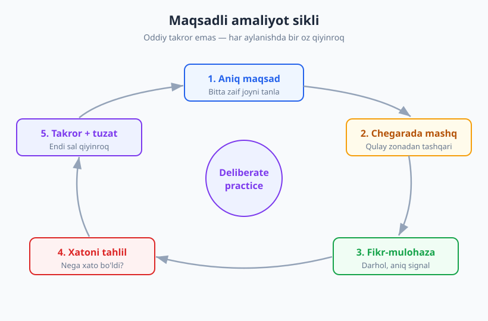
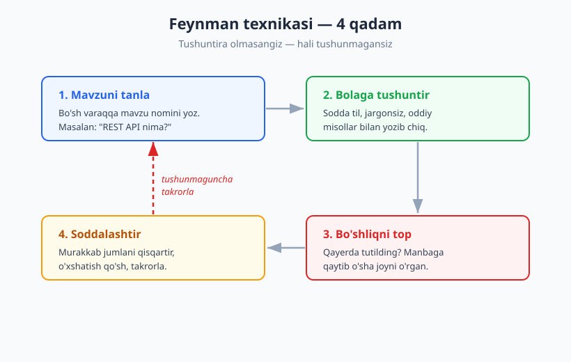
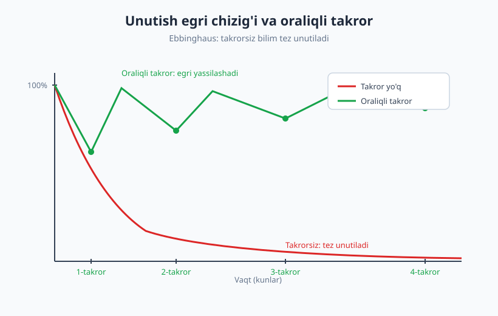

# 03 — O'rganishni o'rganish

[⬅️ Oldingi: 02 — O'sish mentaliteti va imposter sindromi](./02-osish-mentaliteti.md) · [🏠 README](./README.md) · [Keyingi: 04 — Bilim boshqaruvi va eslab qolish ➡️](./04-bilim-boshqaruvi-eslab-qolish.md)

---

> **Bu bobda:** dasturchining eng muhim meta-ko'nikmasi — samarali o'rganishni o'rganamiz. Maqsadli amaliyot (deliberate practice), Feynman texnikasi, unutish egri chizig'i va oraliqli takror, learning plateau hamda mentor va "ochiq o'rganish" orqali boshqalardan tezroq o'sish. Oxirida — yangi texnologiyani o'rganishning amaliy tizimi.
>
> **Halollik / Eslatma:** "10 000 soat" qoidasini Malcolm Gladwell ommalashtirgan, lekin uning manbasi K. Anders Ericsson buni soddalashtirilgan deb hisoblaydi — bu yerda to'g'ri shaklini beramiz. Bu texnikalar sehrli emas: ular o'rganishni *samaraliroq* qiladi, lekin o'rniga ishlamaydi. Mashq qilish kerakligicha qoladi.

---

## Nega aynan "o'rganishni o'rganish"?

Dasturchilikda bitta o'zgarmas haqiqat bor: bilim eskirad. Bugun o'rgangan framework uch yildan keyin "legacy" bo'ladi, kechagi "best practice" bugun anti-pattern deb ataladi. Agar siz hayotingizni bir marta o'rganib, keyin shu bilim bilan yashashga moslagan bo'lsangiz — bu kasbga noto'g'ri kelgansiz.

Shu sababli dasturchi uchun eng qadrli ko'nikma biror texnologiyaning o'zi emas, balki **qanday o'rganishni bilish**. Bu — meta-ko'nikma: barcha boshqa ko'nikmalarni tezlashtiruvchi ko'nikma. Tez va chuqur o'rganadigan junior bir yilda boshqalarning uch yilda yetadigan joyiga yetib boradi — chunki u har bir yangi mavzuga aniqroq, samaraliroq hujum qiladi.

Yomon xabar: maktab va universitet bizni ko'pincha *yomon* o'rganishga o'rgatadi — passiv tinglash, oxirgi kechada yodlash, imtihondan keyin unutish. Yaxshi xabar: o'rganishning qanday ishlashi yaxshi o'rganilgan va aniq texnikalari bor. Bu bobda eng kuchli to'rttasini ko'ramiz.

> **Eslatma:** Bu bob o'rganishning *jarayoni* haqida. Olgan bilimingizni qayerda saqlash, eslatma tizimi va "ikkinchi miya" (PKM) haqida [04-bobda](./04-bilim-boshqaruvi-eslab-qolish.md) chuqurroq gaplashamiz. Ikki bob bir-birini to'ldiradi: bu yerda — qanday o'rganish, u yerda — o'rganganingni qanday saqlash.

---

## Maqsadli amaliyot: takror emas, sifatli mashq

Ko'pchilik o'ylaydi: "Qancha ko'p mashq qilsam, shuncha yaxshi bo'laman." Bu yarim haqiqat. Mashqning *miqdori* emas, *sifati* asosiy. Bir narsani 10 yil noto'g'ri qilgan odam — 10 yillik tajribaga ega bo'lmaydi, balki *bitta yillik tajribani 10 marta takrorlagan* bo'ladi.

Psixolog **K. Anders Ericsson** o'nlab yillik tadqiqotida (shaxmatchilar, musiqachilar, sportchilar ustida) ustalikni keltirib chiqaradigan narsani aniqladi: u buni **maqsadli amaliyot** (deliberate practice) deb atadi. Bu oddiy takror emas. Uning to'rtta sharti bor:

1. **Aniq, tor maqsad.** "Bugun yaxshiroq dasturchi bo'laman" emas — "bugun rekursiv funksiyani bazaviy holatsiz yozmaslikni mashq qilaman". Maqsad qancha aniq bo'lsa, mashq shunchalik foydali.
2. **Qulay zona chegarasida ishlash.** Allaqachon biladigan narsani takrorlash — dam olish, mashq emas. O'sish faqat siz biroz tutilib qoladigan, hozircha eplay olmaydigan joyda sodir bo'ladi. Bu noqulay — va aynan shu noqulaylik o'sish belgisi.
3. **Darhol fikr-mulohaza (feedback).** Xato qilganingizni *tezda* va *aniq* bilishingiz kerak. Testlar yiqilganda, code review'da izoh kelganda, kodingiz ishlamaganda — bu hammasi feedback. Feedbacksiz mashq — qorong'uda o'q otish.
4. **Zaif joyga e'tibor.** Tabiiy mayl — biz yaxshi biladigan narsani qilish (chunki bu yoqimli). Maqsadli amaliyot esa ataylab *eng zaif* tomonga hujum qiladi.

### "10 000 soat" haqida halol gap

Siz "ustaga aylanish uchun 10 000 soat kerak" iborasini eshitgansiz. Buni **Malcolm Gladwell** "Outliers" kitobida ommalashtirdi — Ericsson tadqiqotiga tayanib. Lekin Ericsson o'zi bu raqamga e'tiroz bildirdi: bu o'rtacha ko'rsatkich, sehrli chegara emas, va eng muhimi — *qanday* mashq qilgan muhim, faqat *qancha* emas. 10 000 soat passiv takror sizni hech qayerga olib bormaydi; 1000 soat maqsadli amaliyot esa hayratlanarli natija beradi.

Demak xulosa: vaqtni emas, *sifatni* sanang.

### Dasturchi misoli: ✅ va ❌

Ikki junior bir xil "Algoritmlarni o'rganaman" maqsadini qo'ydi. Bir yildan keyin biri intervyudan o'tdi, ikkinchisi yo'q. Farq nimada edi?

| ❌ Passiv takror | ✅ Maqsadli amaliyot |
|---|---|
| YouTube'da masala yechilishini tomosha qiladi, bosh chayqaydi: "tushunarli". | Masalani avval o'zi yechishga urinadi, tutiladi, keyin yechimni ko'radi. |
| Bilgan turdagi masalalarni yana yechadi (yoqimli). | Ataylab eng yomon biladigan mavzuni (masalan, dinamik dasturlash) tanlaydi. |
| Yiqilgan testni tuzatib, keyingisiga o'tadi. | Nega yiqilganini *yozib qo'yadi*: "Men chegara holatni unutaman". |
| "Tushundim" hissiga ishonadi. | Bir hafta keyin xuddi shu masalani yordamSiz qayta yechib, haqiqatan tushunganini tekshiradi. |

Ikkinchi junior ko'proq vaqt sarflamadi — *boshqacha* sarfladi. Bu maqsadli amaliyot.

> **Trade-off:** Maqsadli amaliyot charchatadi. Qulay zona chegarasida ishlash aqliy jihatdan og'ir, shuning uchun uni uzoq vaqt davom ettirib bo'lmaydi. Kuniga 1–2 soat haqiqiy fokuslangan mashq — 6 soat passiv "o'rganish"dan ko'ra qimmatliroq. Sifatni qog'on ortidan quvib, o'zingizni tinkangizni quritmang.

---

## Feynman texnikasi: tushuntirib o'rganish

Fizik **Richard Feynman** murakkab g'oyalarni hayratlanarli soddalik bilan tushuntirishi bilan mashhur edi. Uning yondashuvi keyinchalik "Feynman texnikasi" deb nomlangan o'rganish usuliga aylandi. Asosiy g'oya bitta: **biror narsani tushunganingizni bilishning eng ishonchli yo'li — uni boshqaga (ayniqsa bolaga) tushuntirib berishga urinish.** Tushuntira olmasangiz — demak hali to'liq tushunmagansiz.

To'rtta qadam:

1. **Mavzuni tanla.** Bo'sh varaq oling, tepasiga mavzu nomini yozing. Masalan: "Promise va async/await nima?"
2. **Bolaga tushuntirgandek yozing.** Hech qanday jargonsiz, oddiy so'zlar va kundalik o'xshatishlar bilan. Agar "asinxronlik — bu non-bloklovchi I/O" deb yozsangiz — bu o'zingizni aldash. "Bola tushunadigan" til talab qiladi: "Buyurtmani aytib, oshpaz tayyorlaguncha kutib turmasdan boshqa ish qilish".
3. **Bo'shliqni toping.** Yozayotganda qayerda tutilib qolganingizni, qayerda jargonega yashiringaningizni sezasiz — aynan o'sha joy siz tushunmagan joy. Bu — texnikaning oltini. Manbaga qaytib, *faqat o'sha bo'shliqni* o'rganing.
4. **Soddalashtiring va takrorlang.** Murakkab jumlalarni qisqartiring, o'xshatish qo'shing, butun tushuntirishni ravon bo'lguncha qayta yozing.

### Nega o'rgatish = eng yaxshi o'rganish

Bu shunchaki "yaxshi maslahat" emas — bunga sabab bor. O'qiyotganda yoki video ko'rayotganda miyangiz *taniydi* ("ha, bu tanish") va buni *tushunish* bilan adashtiradi. Bu — **tanish bo'lish illuziyasi** (illusion of competence): tanishlik ravshanlik kabi his qilinadi, lekin u emas. Tushuntirishga urinish esa bu illuziyani darhol buzadi — chunki o'z so'zingiz bilan, bo'g'insiz tushuntirishni faqat haqiqatan tushungan narsa bilan qila olasiz.

Amalda bu nima degani:

- Yangi o'rgangan narsani jamoadoshga 2 daqiqada tushuntiring.
- Blog post yozing yoki [04-bobdagi](./04-bilim-boshqaruvi-eslab-qolish.md) eslatmangizda "o'zimga tushuntirish" bo'limini yarating.
- Junior'ga yordam berish — sizning o'rganishingiz. Shu sababli [30-bobda](./30-junior-senior-lead-mentorlik.md) ko'ramizki, mentorlik faqat mentee uchun emas, mentor uchun ham kuchli o'sish vositasi.

> **Diqqat:** "Rubber duck" usuli — muammoni o'rdakcha (yoki devor)ga ovoz chiqarib tushuntirish — Feynman texnikasining kichik akasi. Ko'pincha tushuntirishni boshlagah zahoti yechim o'zi paydo bo'ladi. Buni [20-bobda](./20-debugging-tizimli.md) debugging kontekstida yana ko'ramiz.

---

## Unutish egri chizig'i va oraliqli takror

Bir kun mavzuhi zo'r o'rganasiz, hammasi ravshan. Bir hafta keyin — go'yo umuman ko'rmagandek. Tanishmi? Bu — sizning aybihgiz emas, miyaning tabiiy ishlashi.

XIX asr oxirida nemis psixologi **Hermann Ebbinghaus** o'zi ustida tajriba o'tkazib, **unutish egri chizig'ini** (forgetting curve) kashf etdi: yangi olingan bilim vaqt o'tishi bilan tez sur'atda unutiladi — agar takrorlanmasa. Egri chiziq boshida keskin tushadi, keyin yassilashadi.

Yaxshi xabar: har safar bilimni takrorlaganingizda unutish sekinlashadi. Bu — **oraliqli takror** (spaced repetition): materialni o'sib boruvchi oraliqlar bilan qayta ko'rib chiqish (masalan, 1 kun → 3 kun → 1 hafta → 1 oy). Har takror egri chiziqni yassilaydi, bilim uzoq xotiraga o'tadi.

### Active recall: passiv qayta o'qish emas

Egri chiziqni yassilashning eng kuchli usuli — shunchaki qayta *o'qish* emas. Materialhi qayta o'qish — yana o'sha tanish bo'lish illuziyasi: ko'zga tanish ko'rinadi, lekin xotirada mustahkamlanmaydi.

Eng samarali usul — **active recall** (faol esga tushirish): kitobni yopib, "bu mavzuda nima esimda qoldi?" deb miyadan *tortib chiqarish*. Bu og'ir va noqulay — lekin aynan shu zo'riqish xotirani mustahkamlaydi. Test yechish, flashcard, o'zingizga savol berish — barchasi active recall.

| Passiv (zaif) | Faol (kuchli) |
|---|---|
| Konspektni qayta o'qish | Konspektsiz "nima esimda?" deb yozib chiqish |
| Yechilgan masalani ko'rib chiqish | Masalani yopib, qaytadan yechish |
| Video ni qayta ko'rish | Video so'ng tushunganini o'z so'zi bilan aytish |
| Marker bilan belgilash | O'ziga savol-javob (flashcard) tuzish |

Active recall + oraliqli takror — birgalikda o'rganishning eng kuchli juftligi. Buning amaliy tizimini (Anki, flashcard, eslatma) [04-bobda](./04-bilim-boshqaruvi-eslab-qolish.md) batafsil quramiz.

---

## Learning plateau: "to'xtab qoldim" hissi

O'rganish chizig'i hech qachon tekis yuqoriga ketmaydi. Boshida tez o'sasiz (hammasi yangi), keyin **plateau** — go'yo joyida turibsiz, harakat qilyapsiz lekin natija ko'rinmayapti. Ko'p odam aynan shu yerda taslim bo'ladi: "Men buni eplay olmasam kerak."

Birinchi navbatda biling: **plateau — normal va kutilgan.** U muvaffaqiyatsizlik belgisi emas, o'rganishning tabiiy fazasi. Ko'pincha plateau ostida ko'rinmas ish ketadi — miya yangi naqshlarni mustahkamlaydi, keyinroq u sakrash bo'lib chiqadi.

Ikkinchidan, ba'zi qiyinlik aslida *foydali*. Kognitiv olimlar **Robert va Elizabeth Bjork** buni **kerakli qiyinlik** (desirable difficulty) deb atashadi: o'rganishni biroz qiyinroq qiladigan sharoitlar (oraliqli takror, active recall, materialni aralashtirib mashq qilish) qisqa muddatda sekinroq tuyulsa-da, uzoq muddatda chuqurroq va mustahkam o'rganishga olib keladi. Ya'ni mashq oson tuyulsa — ehtimol siz o'sayotgan emassiz.

Plateaudan chiqish uchun:

- **Tashxis qo'ying.** Aynan qaysi konkret narsa sizni to'xtatyapti? Noaniq "qiyin" emas — aniqlang. Bu maqsadli amaliyotning 1-qadami.
- **Yondashuvni o'zgartiring.** Bir xil mashqdan natija bo'lmasa — burchakni o'zgartiring. Boshqa manba, boshqa loyiha, juftlikda ishlash.
- **Sabr va davomiylik.** Plateau ustida ishlashni davom ettirgan odam oxir-oqibat sakraydi. Bu — [02-bobdagi](./02-osish-mentaliteti.md) o'sish mentaliteti amalda: "hozircha eplay olmayman" — "hech qachon" emas.

> **Trade-off:** Plateau ustida turishni davom ettirish bilan, "bu yo'l menga to'g'ri kelmayapti" deb tan olish o'rtasida farq bor. Ba'zan haqiqatan boshqa yondashuv yoki boshqa o'qituvchi kerak. Qoida: avval yondashuvni 2–3 marta o'zgartirib ko'ring, keyin yo'lni o'zgartirishni o'ylang.

---

## Boshqalardan o'rganish: mentor, juftlik va ochiq o'rganish

Hozirgacha biz yakka o'rganish haqida gapirdik. Lekin eng tez o'rganish — boshqalar bilan. Birovning yillik tajribasini bir suhbatda olish mumkin.

### Mentor topish

Mentor — sizni o'zi bosib o'tgan yo'ldan tezroq olib o'tadigan, xatolardan ogohlantiradigan kishi. Mentor topish haqida bir necha amaliy nuqta:

- **Rasmiy "mentor bo'lasizmi?" so'rovi kamdan-kam ishlaydi.** Yaxshisi — kichik, aniq savol bilan murojaat qiling: "Sizning shu PR'dagi yondashuvingizni tushunmadim, 10 daqiqa tushuntira olasizmi?" Munosabat shunday tabiiy o'sadi.
- **Bitta mentor shart emas.** Turli mavzular uchun turli odamlar — birovdan kod sifatini, birovdan muloqotni o'rganasiz.
- **Mentor vaqtini hurmat qiling:** savolhi tayyorlab keling, avval o'zingiz urinib ko'rgan bo'ling, javobni eslatmaga oling.

### Code review — bepul mentorlik

Sizning PR'ingizga kelgan har bir izoh — bepul, shaxsiy darslik. Junior bo'lganda code review'hi tuzatishlar ro'yxati emas, **o'qish materiali** deb qarang: "Nega bu yerda bunday qil deyishyapti?" deb so'rang. Boshqalarning PR'larini o'qish ham (siz reviewer bo'lmasangiz ham) — katta o'rganish manbai. Buni [15-bobda](./15-code-review-inson-tomoni.md) inson tomoni bilan birga ko'ramiz.

### Pair programming

Juftlikda ishlash (pair programming) — real vaqtda birovning fikrlash jarayonini ko'rishingiz. U muammoga qanday yondashishini, qanday qidirishini, qanday debugging qilishini kuzatish — kitobdan o'rganib bo'lmaydigan narsa.

### Learning in public — ochiq o'rganish

**Shu o'rganishingizni ommaga ochiq qiling.** O'rganganingizni blog, Telegram, X (Twitter) yoki GitHub'da baham ko'ring. Bu g'oyani dasturchilar jamoasida **Shawn "swyx" Wang** "Learning in Public" essesi bilan ommalashtirdi. Buning kuchi:

- **Feynman texnikasi miqyosda:** ommaga yozish — tushuntirishga majbur qiladi, demak chuqurroq o'rganasiz.
- **Feedback va tarmoq:** odamlar tuzatadi, qo'shadi, siz bilan tanishadi.
- **Portfolio o'z-o'zidan quriladi:** bir yil ochiq o'rgangan odam tabiiy portfolioga ega bo'ladi (buni [25-bobda](./25-cv-portfolio-github.md) ko'ramiz).

"Lekin men hali yangiman, nima yozaman?" — aynan shu yerda kuch bor. Yangi o'rgangan odam yangi o'rganayotganlar tilida gapira oladi; ekspert ko'pincha buni unutgan. "Bugun X'ni o'rgandim, mana men tushunganim" — yetarli.

---

## Amaliy o'rganish tizimi: yangi texnologiyaga hujum

Endi hammasini bitta amaliy tartibga yig'amiz. Aytaylik, yangi texnologiyani (yangi framework, til yoki vosita) o'rganishingiz kerak. Mana ishonchli tizim:

1. **Avval "nega"ni ushlang.** Texnologiya qaysi muammoni hal qiladi? Bundan oldin odamlar nimani azob bilan qilardi? "Nega" tushunilsa, "qanday" osonlashadi. Tutorial'ga sho'ng'ishdan oldin shuni ayting.
2. **Rasmiy hujjatdan boshlang, video'dan emas.** Video oson tuyuladi (tanish bo'lish illuziyasi!), lekin rasmiy hujjat (official docs) eng aniq, eng yangi manba. Hujjatni o'qish — alohida ko'nikma; [04-bobda](./04-bilim-boshqaruvi-eslab-qolish.md) ko'ramiz.
3. **Eng kichik ishlaydigan narsani quring.** "Hello world"dan tashqari — sizga qiziq bo'lgan eng kichik real loyiha. O'qish emas, *qilish* o'rgatadi. Tutorial ko'rib turib "tushunarli" bo'lishi — tuzoq; klaviaturaga qo'l qo'ying.
4. **Maqsadli amaliyotni qo'llang.** Loyihada tutilgan har joyni — zaif joy sifatida belgilang, o'sha aniq mavzuni alohida mashq qiling.
5. **Feynman bilan tekshiring.** O'rgangan asosiy tushunchani (masalan, "bu framework'da holat (state) qanday boshqariladi?") bolaga tushuntirgandek yozing. Bo'shliq topilsa — qayting.
6. **Oraliqli takror bilan saqlang.** Muhim narsalarni eslatmaga (active recall savollari shaklida) yozing, vaqti-vaqti bilan qaytib ko'ring.

> **Eslatma:** Bu tizimni *har bir* yangi texnologiyada qo'llang. Bir necha martadan keyin o'rganishingiz tezlashganini sezasiz — chunki siz endi "o'rganishni o'rgangansiz". Aynan shu — bu bobning maqsadi.

Va begona kodbazaga qo'shilganda ham xuddi shu mantiq ishlaydi — kodni o'qib o'rganish alohida ko'nikma, uni [21-bobda](./21-begona-kodni-oqish.md) ko'ramiz.

---

## Asosiy g'oyalar (bobni qisqacha)

- **O'rganishni o'rganish — meta-ko'nikma.** Texnologiya eskiradi; tez va chuqur o'rganish qobiliyati — dasturchining eng qadrli, eskirmaydigan boyligi.
- **Maqsadli amaliyot (Ericsson)** — oddiy takror emas: aniq maqsad, qulay zona chegarasida ishlash, darhol fikr-mulohaza va zaif joyga e'tibor. Vaqtni emas, **sifatni** sanang. "10 000 soat"ni Gladwell ommalashtirgan, lekin *qanday* mashq muhimroq.
- **Feynman texnikasi** — biror narsani bolaga tushuntirgandek soddalashtirib yozing; tutilgan joy — siz tushunmagan joy. **O'rgatish — o'rganishning eng yaxshi yo'li**, chunki u "tanish bo'lish illuziyasini" buzadi.
- **Unutish egri chizig'i (Ebbinghaus)** — takrorsiz bilim tez unutiladi. **Oraliqli takror** va **active recall** (passiv qayta o'qish emas) egri chiziqni yassilaydi.
- **Learning plateau normal.** "To'xtab qoldim" hissi o'sishning tabiiy fazasi; **kerakli qiyinlik** (Bjork) — sekin tuyulsa ham chuqurroq o'rgatadi. Tashxis qo'ying, yondashuvni o'zgartiring, sabr qiling.
- **Boshqalardan tez o'rganing:** mentor (kichik aniq savollar bilan), code review'ni darslik sifatida, pair programming va **learning in public** (ochiq o'rganish — Feynman miqyosda + portfolio).
- **Amaliy tizim:** nega → rasmiy hujjat → kichik real loyiha → maqsadli amaliyot → Feynman tekshiruvi → oraliqli takror. Har yangi texnologiyaga shu tartibda hujum qiling.

---

## Mashqlar

### Oson

**1-mashq.** Oxirgi ikki haftada o'rgangan bitta texnik tushunchani tanlang (masalan: "Promise nima", "indeks ma'lumotlar bazasini qanday tezlashtiradi"). Bo'sh varaqqa, hech qanday manbaga qaramay, uni **bolaga tushuntirgandek** yozib chiqing. Qayerda tutilganingizni belgilang — bu sizning bo'shliqlaringiz.

**2-mashq.** O'tgan oyda biror narsani "o'rganaman" deb ko'rgan video yoki tutorial'ni eslang. Halol javob bering: undan keyin biror **real narsa qurdingizmi** yoki faqat ko'rib "tushunarli" deb o'tib ketdingizmi? Agar ikkinchisi bo'lsa — shu mavzuda 30 daqiqalik kichik amaliy topshiriq yozing.

### O'rta

**3-mashq.** Hozir o'rganayotgan ko'nikmangiz uchun bitta **maqsadli amaliyot sessiyasini** loyihalang. Yozma ravishda to'rtta elementhi aniqlang: (1) aniq, tor maqsad, (2) bu maqsad qulay zonangiz chegarasidaligini qanday bilasiz, (3) fikr-mulohazani qayerdan olasiz, (4) qaysi aniq zaif joyga hujum qilasiz.

**4-mashq.** Oxirgi marta o'rgangan muhim narsani (kontseptsiya, qoida, naqsh) **oraliqli takror rejasiga** soling. Uchta active recall savolini yozing (javob emas — savol!), va ularni qachon takrorlashingizni belgilang: ertaga, 3 kundan keyin, 1 haftadan keyin.

### Qiyin

**5-mashq.** O'zingiz hozir tutilib turgan, **plateau**dagi bir ko'nikmani tanlang. (a) Aniq tashxis qo'ying: noaniq "qiyin" emas — qaysi konkret narsa sizni to'xtatyapti? (b) Joriy yondashuvingizni yozing. (c) Uni o'zgartirishning uchta turli usulini yozing (boshqa manba, boshqa loyiha turi, juftlikda ishlash va h.k.) va birinchisini shu hafta sinab ko'ring.

**6-mashq.** Bir hafta **"learning in public"** mashqini bajaring: har kuni o'rgangan bitta narsani qisqa (3–5 jumla) post qilib baham ko'ring — Telegram kanal, blog yoki GitHub eslatma sifatida. Hafta oxirida reflektiya yozing: ommaga yozish majburiyati o'rganishingizga qanday ta'sir qildi? Tushuntirishga urinish qaysi bo'shliqlarni ochib berdi?

Yechimlar / Namunaviy yondashuvlar

### 1-mashq yechimi
Maqsad — "tanish bo'lish illuziyasini" buzish. Aksariyat odam bu mashqda hayron qoladi: "tushunaman" deb o'ylagan narsani yozishga urinib, ko'p joyda jargonega yashiringanini sezadi (masalan, "Promise — bu asinxron operatsiya natijasi" deyish — bu ta'rifni qaytarish, tushuntirish emas). Namunaviy yaxshi tushuntirish o'xshatish ishlatadi: "Promise — bu restoran chiqib bergan navbat raqamingiz: hozir taom yo'q, lekin tayyor bo'lganda chaqirish va'dasi bor". Tutilgan joylaringiz — keyingi o'rganish ro'yxatingiz.

### 2-mashq yechimi
Agar faqat ko'rib o'tgan bo'lsangiz — bu odatiy holat, uyalmang. Muhimi: *qilish* o'rgatadi, *ko'rish* emas. Kichik topshiriq misoli: agar video React hook haqida bo'lsa — "30 daqiqada hech narsaga qaramay bitta `useState` va `useEffect` ishlatuvchi kichik komponent yozaman". Klaviaturaga qo'l tegishi — tushunish bilan illuziya o'rtasidagi farqni ochadi.

### 3-mashq yechimi
Yaxshi loyihalangan sessiya misoli (mavzu: SQL JOIN'lar): (1) Maqsad — "uchta jadvalni bog'lovchi LEFT JOIN'ni yordamSiz yoza olaman"; (2) Chegara tekshiruvi — "ikki jadvalnini eplayman, uchta bo'lsa yoki LEFT/INNER farqida adashaman" (demak shu — o'sish zonasi); (3) Feedback — "har so'rovni real bazada ishga tushirib, natijani kutilgan bilan solishtiraman"; (4) Zaif joy — "NULL qatorlar LEFT JOIN'da qanday harakat qilishi". Diqqat: maqsad "SQL o'rganaman" emas, juda tor.

### 4-mashq yechimi
Yaxshi savollar javobni tortib chiqarishni majbur qiladi, tanib olishhi emas. ❌ "Oraliqli takror foydalimi?" (ha/yo'q — zaif). ✅ "Unutish egri chizig'ini kim kashf etgan va u nimani ko'rsatadi?", "Active recall passiv qayta o'qishdan nega kuchliroq?", "Oraliqli takrorda oraliqlar qanday o'zgaradi?". Reja: ertaga 5 daqiqa, 3 kundan keyin, 1 haftadan keyin. Har safar avval yopib eslashga urinib, keyin tekshiring.

### 5-mashq yechimi
Asosiy mahorat — noaniq "qiyin"ni aniq tashxisga aylantirish. Masalan, "rekursiya qiyin" emas, balki "rekursiv funksiyada bazaviy holatni (base case) qanday topishni bilmayapman" — bu endi hujum qilsa bo'ladigan aniq nishon. Yondashuvni o'zgartirish: agar matnli darslikdan natija bo'lmasa — rekursiyani vizualizatsiya qiluvchi vositadan, yoki masalani qog'ozda qo'lda "stack"hi chizib bajarib ko'ring, yoki kuchliroq do'stingiz bilan juftlikda yeching. Plateau — taslim bo'lish signali emas, yondashuvni o'zgartirish signali.

### 6-mashq yechimi
Aksariyat odam ikki narsani sezadi: (1) ommaga yozish "shunchaki o'zim uchun" yozishdan ko'ra chuqurroq tushunishni talab qiladi — chunki kimdir o'qishi mumkin, jargonega yashirina olmaysiz (bu — Feynman effekti). (2) Birinchi kunlar noqulay, lekin tez o'tadi va ko'pincha foydali feedback yoki tanishlar paydo bo'ladi. "Hech kim o'qimaydi" degan qo'rquv — odatda asossiz, va o'qilmasa ham siz baribir Feynman foydasini olasiz. Reflektiyada e'tibor bering: qaysi postda eng ko'p tutildingiz? O'sha — eng zaif tushuncha edi.

---

[⬅️ Oldingi: 02 — O'sish mentaliteti va imposter sindromi](./02-osish-mentaliteti.md) · [🏠 README](./README.md) · [Keyingi: 04 — Bilim boshqaruvi va eslab qolish ➡️](./04-bilim-boshqaruvi-eslab-qolish.md)
