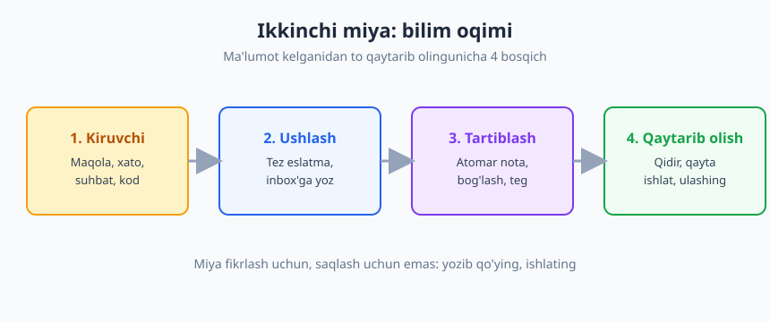
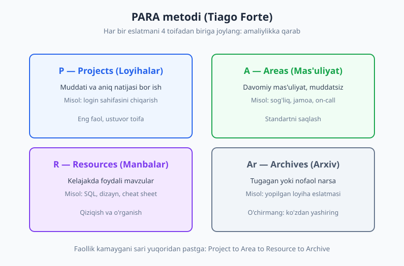
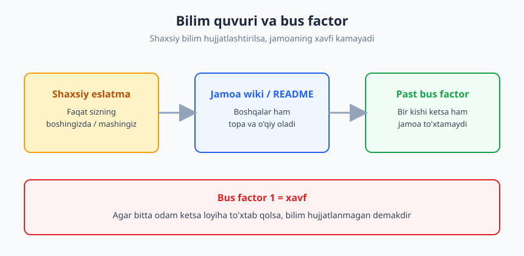

# 04 — Bilim boshqaruvi va eslab qolish

[⬅️ Oldingi: 03 — O'rganishni o'rganish](./03-organishni-organish.md) · [🏠 README](./README.md) · [Keyingi: 05 — Vaqtni boshqarish va prioritetlash ➡️](./05-vaqtni-boshqarish.md)

---

> **Bu bobda:** "ikkinchi miya" g'oyasi, shaxsiy bilim boshqaruvi (PKM) tizimlari — Zettelkasten va PARA metodi, faol qaytarib olish (active recall) bilan spaced repetition'ni amalda qo'llash, hujjat o'qish va qidirish ko'nikmasi, hamda jamoa bilimini saqlash (wiki, README, "bus factor"). Maqsad: yodda ko'p saqlash emas — kerakli narsani tez topish va qayta ishlatish tizimini qurish.
>
> **Halollik / Eslatma:** Eng zo'r bilim tizimi ham, agar siz uni har kuni ozgina to'ldirmasangiz, bir oyda o'lik arxivga aylanadi. Bu bob sizga ramkalarni beradi; lekin tizim odat bo'lmaguncha foyda bermaydi — kichik boshlang, mukammallikni quvib ketmang.

---

## Nega "ikkinchi miya" kerak

Yangi boshlovchi dasturchining keng tarqalgan xato e'tiqodi shu: "yaxshi dasturchi hamma narsani yoddan biladi". Aslida buning aksi. Tajribali muhandis ko'pincha sintaksisning aniq tafsilotini, kutubxona funksiyasining argumentlar tartibini yoki o'tgan yili o'zi yozgan skriptni eslay olmaydi — lekin u **qayerdan topishni** va **qanday qidirishni** biladi. Farq aynan shunda: yodlash emas, topa olish.

Sababi oddiy. Inson xotirasi ishonchsiz va cheklangan — 03-bobda ko'rgan Ebbinghaus'ning unutish egri chizig'i buni aniq ko'rsatadi: yangi o'rgangan narsangizning katta qismini bir necha kun ichida unutasiz. Miyani qattiq disk sifatida ishlatish — uni eng zaif tomonidan foydalanishdir. Aksincha, miya **fikrlashda**, bog'lanishlarni ko'rishda, yangi g'oya yaratishda kuchli. Demak mantiqiy strategiya: **saqlashni tashqi tizimga topshiring, miyani fikrlash uchun bo'shating.**

Bu g'oya ko'pincha **"ikkinchi miya" (second brain)** deb ataladi — uni Tiago Forte ommalashtirgan. Asos esa undan ham eski: kognitiv yuk nazariyasiga ko'ra, ishchi xotiramiz bir vaqtda atigi bir nechta narsani ushlab tura oladi. Agar siz "buni unutmasligim kerak" degan o'nta narsani boshingizda olib yursangiz, fikrlash uchun joy qolmaydi. Yozib qo'ysangiz — bosh bo'shaydi.

### Eslatma madaniyati: kompulsiv yozuvchi bo'ling

Amaliy o'zgarish bitta odatdan boshlanadi: **ko'rgan, eshitgan, hal qilgan har bir foydali narsani yozib qo'ying.** Production'da uchragan g'alati xatoni va uni qanday tuzatganingizni. Hamkasbingiz tushlikda aytgan zo'r maslahatni. O'qigan maqoladan bitta jumlani. Bu hozir behuda tuyuladi — lekin olti oydan keyin o'sha xato yana qaytganda, sizda allaqachon tayyor yechim bo'ladi.

> **Eslatma:** "Keyin yodimda bo'ladi" — eng qimmat yolg'on. Bo'lmaydi. Yozish 10 soniya oladi; qayta kashf qilish — yarim kun.

Bu yerda muhim nuqta: yozish jarayonining o'zi o'rganishdir. Biror narsani o'z so'zlaringiz bilan qisqacha yozib qo'yganingizda, miyangiz uni qayta ishlaydi, soddalashtiradi, mavjud bilimga bog'laydi. Passiv o'qishdan farqli, faol yozish bilimni ancha mustahkam o'rnatadi.

---

## Shaxsiy bilim boshqaruvi (PKM)

Shaxsiy bilim boshqaruvi (Personal Knowledge Management, PKM) — eslatmalarni ushlash, saqlash, tartiblash va qayta topish bo'yicha shaxsiy tizimingiz. Ikkita mashhur metodologiyani ko'rib chiqamiz.

### Zettelkasten: bog'langan atomar eslatmalar

Zettelkasten (nemischa "eslatma qutisi") — XX asr nemis sotsiologi **Niklas Luhmann** mashhur qilgan usul. Luhmann o'z karyerasi davomida o'n minglab qog'oz kartochka to'plagan, har biriga bitta g'oya yozgan va ularni o'zaro raqamli havolalar bilan bog'lab borgan. Ushbu tizim yordamida u nihoyatda mahsuldor bo'lgan — yetmishdan ortiq kitob va yuzlab maqola yozgan.

Zettelkasten'ning ikkita asosiy printsipi:

1. **Atomar eslatma** — har bir eslatma faqat **bitta** g'oyani o'z ichiga olishi kerak. "Keshlash" haqidagi eslatma bilan "indekslash" haqidagi eslatmani aralashtirmang. Atomar bo'lsa, keyinroq har birini alohida boshqa joyga bog'lay olasiz.
2. **Bog'lash (linking)** — har bir eslatmani tegishli boshqa eslatmalarga havola qiling. Bilimning qiymati ajratilgan faktlarda emas — ular orasidagi **bog'lanishlarda**. Vaqt o'tib bu havolalar fikr tarmog'iga aylanadi: bir g'oyadan ikkinchisiga sayohat qila olasiz va kutilmagan ulanishlarni ko'rasiz.

Dasturchi uchun bu juda tabiiy. "Race condition nima" degan atomar eslatma; undan "mutex bilan himoya"ga havola; undan "deadlock xavfi"ga havola. Vaqt o'tib sizda shaxsiy, o'zaro bog'langan texnik bilimlar atlasi paydo bo'ladi.

### PARA: amaliylikka qarab tartiblash

Zettelkasten g'oyalarni bog'lashga kuchli, lekin **kundalik ish fayllarini** tartiblashga unchalik mos emas. Bu yerda **Tiago Forte**ning PARA metodi yordam beradi (uning "Building a Second Brain" kitobidan). PARA — barcha eslatma va fayllaringizni atigi **to'rtta** toifaga ajratadi, lekin mavzu bo'yicha emas, **amaliylik darajasi** bo'yicha:

| Toifa | Ma'nosi | Dasturchi misoli |
|---|---|---|
| **P** — Projects | Aniq natijasi va muddati bor faol ish | "Login sahifasini chiqarish", "API'ni v2'ga ko'chirish" |
| **A** — Areas | Davomiy mas'uliyat, muddatsiz standart | On-call navbatchilik, kod sifati, sog'liq |
| **R** — Resources | Kelajakda foydali mavzular | SQL cheat sheet, dizayn naqshlari, o'rganilayotgan kutubxona |
| **Ar** — Archives | Tugagan yoki nofaol narsa | Yopilgan loyiha eslatmalari |

PARA'ning kuchi — soddaligida. Yangi eslatma kelganda o'zingizdan bitta savol so'raysiz: "Bu hozir qaysi ishimga kerak?" Agar aniq loyihaga — Projects. Agar davomiy mas'uliyatga — Areas. Boshqa hammasi — Resources yoki Archives. **Mavzu bo'yicha cheksiz papkalar yaratishni to'xtatasiz** — bu eng keng tarqalgan tartiblash xatosi, chunki bir narsa bir nechta mavzuga tegishli bo'lishi mumkin va siz uni qayerga qo'yishni hech qachon eslay olmaysiz.

> **Trade-off:** Mukammal tartibni quvib ketmang. Eng yaxshi tizim — siz **haqiqatan ishlatadiganingiz**. Ikkita papka va yaxshi qidiruv, o'ttizta toifali, lekin hech qachon ochilmaydigan murakkab tizimdan afzal.

### Qaysi vosita? Markdown, Obsidian, Notion

Vosita tanlash — eng kam muhim qaror, lekin ko'p odam aynan shu yerda haftalab tortishib qoladi. Asosiy variantlar:

- **Oddiy Markdown fayllar** (matn muharririda) — eng sodda, eng chidamli. Hech qanday kompaniyaga bog'lanmaysiz, fayllaringiz 20 yildan keyin ham ochiladi. Git bilan versiyalashingiz mumkin.
- **Obsidian** — Markdown fayllar ustida ishlaydi, lekin `[[bog'lanish]]` va grafik ko'rinish qo'shadi. Zettelkasten uslubidagi bog'langan eslatmalar uchun ajoyib.
- **Notion** — kuchli, ko'p funksiyali, jamoaviy. Lekin ma'lumotingiz ularning serverida va eksport qilish qiyinroq.

> **Diqqat:** Markdown'ni afzal ko'rishning chinakam sababi — **uzoq umr ko'rishi**. Vosita kompaniyasi yopilishi mumkin, lekin oddiy matn fayl abadiy. Dasturchi sifatida siz baribir Markdown'ni bilasiz (README'lar shunda yoziladi), demak qo'shimcha narsa o'rganishingiz shart emas.

Maslahat: bitta vositani tanlang va to'xtang. Vositadan vositaga ko'chish — soxta mahsuldorlik. Bilim tizimining 90 foizi — odat, 10 foizi — vosita.

---

## Active recall va spaced repetition amalda

03-bobda ikkita kuchli o'rganish printsipini ko'rgansiz: **faol qaytarib olish (active recall)** — ma'lumotni qayta o'qish o'rniga, xotiradan tortib chiqarishga urinish; va **interval takror (spaced repetition)** — takrorlashni vaqt bo'ylab kengayuvchi oraliqlarga taqsimlash, aynan unutish chegarasida. Bu yerda ularni kundalik amaliyotga qanday tushirishni ko'ramiz.

### Flashcard va Anki

Eng to'g'ridan-to'g'ri vosita — **flashcard** (savol-javob kartochkalari). Bir tomonda savol, ikkinchi tomonda javob. Siz savolni ko'rasiz, javobni **eslashga urinasiz**, keyin tekshirasiz. Bu sof active recall.

**Anki** — eng mashhur bepul flashcard ilovasi; u spaced repetition algoritmini avtomatik boshqaradi. Siz kartochkani qanchalik yaxshi eslaganingizni belgilaysiz ("oson / qiyin / unutdim"), Anki esa har bir kartochkani qachon yana ko'rsatishni hisoblaydi — yaxshi bilganlaringizni kamroq, qiyinlarini ko'proq.

Dasturchi uchun nimani kartochkaga aylantirish kerak? Yoddan bilish foydali, lekin doim qidirib o'tirish noqulay bo'lgan narsalarni:

- Tez-tez ishlatadigan terminal/git buyruqlari
- Kutubxona yoki framework'ning asosiy konseptlari
- Algoritm murakkabligi (masalan, "binar qidiruv — O(log n)")
- Til sintaksisining tez unutiladigan tafsilotlari

> **Diqqat:** Hamma narsani kartochkaga aylantirmang — bu tuzoq. Faqat **haqiqatan tez-tez kerak bo'ladigan va doim qidirish samarasiz** bo'lgan narsalarni yodlang. Qolgani uchun yaxshi eslatma yetadi.

### O'z so'zlaringiz bilan qayta yozish

Anki'siz ham active recall mumkin va ko'pincha kuchliroq: biror mavzuni o'rgangandan so'ng, **manbani yopib**, uni o'z so'zlaringiz bilan qaytadan yozing. Bu Feynman texnikasining yadrosi (03-bob) — agar sodda tilda tushuntira olmasangiz, demak hali tushunmagansiz. Bo'shliqlar darhol ko'rinadi.

### Kod snippet kutubxonasi va cheat sheet

Ikkita amaliy artefakt har bir dasturchining ikkinchi miyasida bo'lishi kerak:

1. **Snippet kutubxonasi** — qayta-qayta yozadigan kod bo'laklaringiz: loglash sozlamasi, fayl o'qish naqshi, API so'rovi shabloni. Bir marta to'g'ri yozing, saqlang, keyin nusxa oling.
2. **Cheat sheet** (qisqacha varaq) — bitta mavzu bo'yicha eng zarur ma'lumot bir sahifada. O'zingiz tuzgan cheat sheet internetdan yuklab olganingizdan kuchliroq, chunki uni tuzish jarayonida o'rganasiz va u **aynan sizning** ehtiyojingizga moslashgan.

---

## Hujjat o'qish va qidirish

Bilim boshqaruvining ikkinchi yarmi — sizda yo'q ma'lumotni tashqaridan **topish** ko'nikmasi. Bu kam baholanadigan, lekin haqiqatan ajratuvchi mahorat. Junior va senior orasidagi farq ko'pincha bilim hajmida emas — **qidiruv tezligida**.

### Rasmiy dokumentatsiyadan boshlang (RTFM, lekin hurmat bilan)

Birinchi instinkt ko'pincha Google yoki forumlar bo'ladi. Lekin ko'p hollarda eng aniq, eng yangi javob — **rasmiy dokumentatsiyada**. Forumdagi javob besh yil oldingi versiyaga tegishli bo'lishi mumkin; rasmiy hujjat esa siz ishlatayotgan versiyaga.

"RTFM" (Read The Friendly Manual — qo'llanmani o'qing) hamjamiyatda ba'zan qo'pol ishlatiladi. Lekin asl g'oyasi haq: **savol bermasdan oldin hujjatga qarang.** Bu hurmatsizlik emas — bu mustaqillik. Hujjatni o'qishni o'rganing: kirish bo'limini, API ma'lumotnomasini va misollarni ajrating; hammasini emas, kerakli bo'limni toping.

### Yaxshi qidiruv va xato xabarini qidirish

Qidiruv — o'rganiladigan ko'nikma. Bir nechta amaliy texnika:

- **Xato xabarini to'g'ridan-to'g'ri qidiring** — lekin loyihangizga xos qismlarni (fayl yo'llari, o'zgaruvchi nomlari, ID raqamlar) olib tashlang. Faqat xatoning umumiy, takrorlanadigan qismini qoldiring.
- **Aniq kalit so'zlardan foydalaning** — texnologiya nomi, versiya, aniq atama. "Tugma ishlamayapti" emas, balki aniq xato turi va kontekst.
- **Sana bo'yicha filtrlang** — tez o'zgaradigan ekotizimlarda eski javob noto'g'ri bo'lishi mumkin.

### Manbani baholash: hamma javob ham to'g'ri emas

Internetdagi yechimni ko'r-ko'rona nusxalash xavfli. Topgan javobni baholang:

| Savol | Nega muhim |
|---|---|
| Qachon yozilgan? | Eski Stack Overflow javobi eskirgan API'ga tegishli bo'lishi mumkin |
| Qaysi versiyaga? | Sizning versiyangizda boshqacha ishlashi mumkin |
| Tushunyapmanmi? | Tushunmagan kodni qo'shish — kelajakdagi xato |
| Eng yuqori ovozlimi, eng to'g'rimi? | Ba'zan past joydagi izoh asl muammoni tuzatadi |

> **Eslatma:** Eski Stack Overflow javoblari xavfli — ular bir vaqtlar to'g'ri bo'lgan, lekin ekotizim o'zgargan. Doim sana va kontekstga qarang.

### AI yordamchini tekshirib ishlatish

AI yordamchilari (Claude, Copilot va h.k.) endi qidiruvning kuchli qismi. Lekin oltin qoida o'zgarmaydi: **AI javobini tekshiring.** AI ishonch bilan noto'g'ri javob berishi mumkin — mavjud bo'lmagan funksiya nomini, eskirgan naqshni yoki nozik xatoni taklif qilishi mumkin. AI'ni **tezroq qoralama** sifatida ishlating, yakuniy haqiqat sifatida emas. Tushunmagan kodni hech qachon, hatto AI tavsiya qilgan bo'lsa ham, ko'chirib qo'ymang — buni 21-bobda ([begona kodni o'qish](./21-begona-kodni-oqish.md)) chuqurroq ko'ramiz.

---

## Jamoaviy bilim: shaxsiydan jamoaga

Hozircha biz shaxsiy bilim haqida gaplashdik. Lekin professional muhitda bilimning eng katta qiymati — uni **jamoa bilan ulashganda** ochiladi. Shaxsiy eslatmangiz faqat sizga foyda beradi; jamoa wiki esa butun jamoani kuchaytiradi.

### Wiki, README va runbook

Jamoaviy bilim odatda uch shaklda yashaydi:

- **README** — loyihani qanday o'rnatish, ishga tushirish va unga hissa qo'shish bo'yicha boshlang'ich hujjat. Har bir loyihaning kirish eshigi.
- **Wiki** — jamoaning umumiy bilim bazasi: arxitektura qarorlari, jarayonlar, "nima uchun shunday qilingan" tushuntirishlari.
- **Runbook** — aniq vaziyatda aniq harakatlar yo'riqnomasi: "agar serv­er qulasa, mana shu qadamlarni bajaring". Tunda navbatchilik paytida hayot qutqaradi.

Bularning hammasini chuqurroq 24-bobda ([hujjatlashtirish](./24-hujjatlashtirish.md)) ko'ramiz. Hozircha asosiy g'oya: **bilimni boshingizdan jamoa hujjatiga ko'chiring.**

### "Bus factor": yashirin xavf

Jamoaviy bilimni e'tiborsiz qoldirishning xavfini bitta tushuncha ajoyib ko'rsatadi — **bus factor** (avtobus omili). Savol shunday: "Jamoangizdan nechta odam to'satdan g'oyib bo'lsa (masalan, avtobus urib ketsa — shu sababdan nom), loyiha to'xtab qoladi?"

Agar javob "bitta" bo'lsa — **bus factor 1** — bu jiddiy xavf. Demak bitta odam butun bilimni boshida olib yuribdi va u ketsa, hech kim davom ettira olmaydi. Bu shaxs uchun ham yomon (hech qachon ta'tilga chiqolmaydi, hech qachon o'smaydi, chunki almashtirib bo'lmaydi).

Bus factor'ni oshirishning yo'li — **bilimni hujjatlashtirish va ulashish.** Siz hal qilgan murakkab muammoni wiki'ga yozsangiz, keyingi odam uni qaytadan hal qilishi shart emas. Buni "o'z xavfsizligimni yo'qotaman" deb o'ylash xato — aksincha, bilimni ulashish sizni **ishonchli va o'stiriladigan** qiladi.

> **Halollik:** Ba'zilar bilimni "ish kafolati" deb yashiradi — "men bilaman, boshqalar bilmaydi, demak kerakliman". Bu qisqa muddatda ishlaydi, uzoq muddatda zarar: sizni o'stirishmaydi, chunki o'rningizni to'ldirib bo'lmaydi. Haqiqiy karyera xavfsizligi — bilimni ulashish va o'rningizga yangi, kattaroq mas'uliyat olishdir.

### Onboarding hujjati

Jamoaviy bilimning eng yaxshi sinovi — **onboarding** (yangi xodimni ishga kiritish). Yangi odam qo'shilganda u qancha tez mustaqil ishlay boshlasa, jamoaning bilim hujjati shuncha yaxshi. Agar har bir yangi kishi bir xil savollarni so'rab, bir xil tuzoqlarga tushsa — bilim hujjatlanmagan demak.

Amaliy maslahat: **agar siz yaqinda jamoaga qo'shilgan bo'lsangiz** — onboarding'da uchragan har bir muammoni, tushunarsiz qadamni, yetishmayotgan hujjatni yozib boring. Siz "yangi ko'z" sifatida muammolarni ko'rasiz, eski xodimlar esa ularga ko'nikib, ko'rmay qo'ygan. Bu hissa — yangi xodimning jamoaga bera oladigan eng qadrli sovg'asidir. Bunday yozma muloqotni qanday yaxshi qilishni 10-bobda ([yozma va asinxron muloqot](./10-yozma-asinxron-muloqot.md)) ko'ramiz.

---

## Asosiy g'oyalar (bobni qisqacha)

- **Miya saqlash uchun emas, fikrlash uchun.** Eslab qolishga emas, **topa olishga** sarmoya qiling — bu "ikkinchi miya" g'oyasining yadrosi.
- **Eslatma madaniyatini odat qiling.** Foydali narsani ko'rganda 10 soniya yozish, keyin yarim kun qayta kashf qilishdan afzal.
- **PKM tizimini tanlang.** **Zettelkasten** (Luhmann) — atomar, bog'langan eslatmalar; **PARA** (Forte) — amaliylikka qarab to'rt toifa. Vosita (Markdown/Obsidian/Notion) ikkilamchi.
- **Active recall + spaced repetition'ni amalga tushiring** — flashcard (Anki), o'z so'zlaringiz bilan qayta yozish, snippet kutubxonasi va o'z cheat sheet'ingiz.
- **Qidiruv — alohida ko'nikma.** Rasmiy hujjatdan boshlang, xato xabarini tozalab qidiring, **manbani baholang** (sana, versiya), AI javobini doim **tekshiring**.
- **Bilimni jamoa bilan ulashing.** README, wiki, runbook — **bus factor**'ni oshiradi; bilimni yashirish karyera xavfsizligi emas, balki tuzoq.

---

## Mashqlar

### Oson

**1-mashq.** O'zingizning hozirgi "bilim saqlash" usulingizni tahlil qiling. Foydali narsani odatda qayerga yozasiz — daftarmi, telefon eslatmasimi, brauzer xatcho'pimi, yoki umuman hech qayerga? Uchta zaif tomonini sanab chiqing (masalan: "topib bo'lmaydi", "tarqoq", "hech qachon qayta ko'rmayman").

**2-mashq.** O'tgan hafta o'zingiz hal qilgan biror texnik muammoni eslang (xato, sozlama, g'alati holat). Uni **atomar eslatma** sifatida yozing: aniq muammo, yechim, va nima uchun ishlagani — hammasi bitta qisqa eslatmada, bitta g'oya atrofida.

### O'rta

**3-mashq.** **PARA** metodini sinab ko'ring. Hozirgi eslatma yoki fayllaringizdan 15–20 tasini oling va har birini to'rtta toifadan biriga (Projects / Areas / Resources / Archives) joylang. Qaysi toifaga joylash qiyin bo'lgan narsalarni belgilang — ular ko'pincha noaniq yoki ortiqcha.

**4-mashq.** O'zingiz tez-tez ishlatadigan, lekin har safar qidirib o'tiradigan bir mavzu tanlang (masalan: git buyruqlari, terminal yorliqlari, til sintaksisi). Bir sahifalik **cheat sheet** tuzing — faqat siz haqiqatan ishlatadigan 10–15 element. Keyingi hafta uni stol yoningizda saqlang va qanchalik tez-tez qaraganingizni kuzating.

### Qiyin

**5-mashq.** O'zingizning to'liq **shaxsiy bilim boshqaruvi (PKM) tizimingizni** loyihalang. Quyidagilarni hal qiling: (a) qaysi vosita (va nega); (b) tuzilma — PARA, Zettelkasten yoki ularning aralashmasimi; (c) "ushlash" odati — yangi eslatma qayerga tushadi; (d) "qayta ko'rish" odati — qachon va qanday tartiblanadi. Bir haftalik sinov rejasini yozing va boshlang.

**6-mashq.** Jamoangiz (yoki o'quv loyihangiz) uchun **bus factor**'ni baholang. Faqat siz biladigan, hech qayerda yozilmagan bilim bormi? Bittasini tanlang va uni **README yoki qisqa hujjat** sifatida yozing — boshqa odam o'qib, sizsiz ham davom ettira oladigan darajada aniq. Yozgandan keyin: bu hujjatni o'qigan odam yana qanday savol berishi mumkinligini o'ylab, bo'shliqlarni to'ldiring.

Yechimlar / Namunaviy yondashuvlar

### 1-mashq yechimi
Bu reflektiv mashq — "to'g'ri javob" yo'q, lekin tipik zaif tomonlar: **tarqoqlik** (ba'zi narsa daftarda, ba'zisi telefonda, ba'zisi brauzer xatcho'pida — birlashtirilmagan); **topib bo'lmaslik** (yozilgan, lekin keyin topa olmaysiz, chunki tartib yo'q); **qayta ko'rilmaslik** (yozasiz-u, hech qachon qaytib qaramaysiz — "yozish chuquri"). Bu uchtasi aniq bo'lsa, keyingi mashqlar ularni hal qilishga qaratilgan: yagona joy, tartib, qayta ko'rish odati.

### 2-mashq yechimi
Yaxshi atomar eslatma misoli: *"Muammo: `npm install` ruxsat xatosi bilan to'xtadi. Sabab: papka egasi noto'g'ri edi. Yechim: egasini joriy foydalanuvchiga o'zgartirish. Eslatma: keyingi safar avval papka ruxsatlarini tekshir."* Diqqat: bitta muammo, bitta yechim, va "nega" — kelajakdagi o'zingizga foydali. Ikki-uch xil narsani bitta eslatmaga tiqishtirsangiz — atomarlik buziladi va keyin topish qiyinlashadi.

### 3-mashq yechimi
PARA bilan ishlaganda qiyin keladigan narsalar odatda **noaniq** ("bularni qaytadan ko'rib chiqishim kerak" — bu loyihami, manbami?) yoki **toifalararo** (bir narsa ham loyiha, ham manba). Maslahat: shubha bo'lsa, "Bu hozir qaysi **faol ishimga** kerak?" deb so'rang. Hech qaysiga kerak bo'lmasa — Resources yoki Archives. Asosiy saboq: agar 20 ta narsadan ko'pchiligini joylash oson bo'lsa, tizim ishlaydi; agar ko'pini joylash qiyin bo'lsa, ehtimol siz mavzu bo'yicha o'ylayapsiz, amaliylik bo'yicha emas.

### 4-mashq yechimi
Yaxshi cheat sheet — **qisqa va shaxsiy**. Internetdan yuklab olingan 5 sahifalik "to'liq qo'llanma" emas, balki sizning aniq 12 ta tez-tez ishlatadigan buyrug'ingiz. Tuzish jarayonining o'zi o'rgatadi: "to'xtang, men buni qanchalik tez-tez ishlataman?" degan savol sizni eng muhim narsalarga e'tibor qaratishga majbur qiladi. Bir haftadan keyin: agar tez-tez qaragan bo'lsangiz — to'g'ri narsalarni tanlagansiz; agar umuman qaramagan bo'lsangiz — ehtimol bu bilim allaqachon yodingizda yoki noto'g'ri mavzu.

### 5-mashq yechimi
Namunaviy sodda tizim (boshlovchi uchun yetarli): **(a) Vosita:** Obsidian yoki oddiy Markdown papka — chunki uzoq umr ko'radi va dasturchi uchun tabiiy. **(b) Tuzilma:** PARA papkalar (tashqi tartib) + atomar eslatmalar ichida (Zettelkasten ruhi). **(c) Ushlash:** har bir yangi narsa bitta "Inbox" fayliga tushadi — hech narsa haqida o'ylamasdan, tez. **(d) Qayta ko'rish:** har juma 15 daqiqa — Inbox'ni bo'shatib, har narsani to'g'ri toifaga joylash. Asosiy printsip: **ushlash oson va tez** (aks holda yozmaysiz), **tartiblash keyinroq va davriy** (aks holda har safar to'xtaysiz). Mukammal tizimni emas, **boshlanadigan** tizimni quring.

### 6-mashq yechimi
Bus factor xavfini topish savoli: "Agar men ertaga bir oyga g'oyib bo'lsam, hamkasblarim qaysi narsada qotib qoladi?" Tipik javoblar: deploy jarayonining bir g'alati qadami, faqat sizga ma'lum sozlama, biror tashqi tizimga ulanish siri. Bittasini tanlab, **runbook uslubida** yozing: aniq qadamlar, tartib bilan, "agar X bo'lsa Y qiling" shaklida. Yozgandan keyin bo'shliqlarni topishning yaxshi usuli — hujjatni hamkasbingizga berib, "menga so'ramasdan shu bo'yicha bajara olasanmi?" deb so'rash. U to'xtagan har bir joy — sizning hujjatingizdagi bo'shliq. Bu mashq bus factor'ni 1 dan 2 ga ko'taradigan amaliy qadam.

---

[⬅️ Oldingi: 03 — O'rganishni o'rganish](./03-organishni-organish.md) · [🏠 README](./README.md) · [Keyingi: 05 — Vaqtni boshqarish va prioritetlash ➡️](./05-vaqtni-boshqarish.md)
