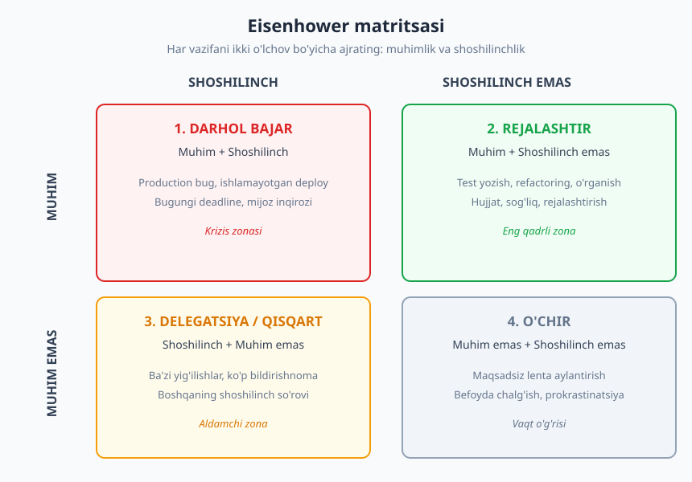
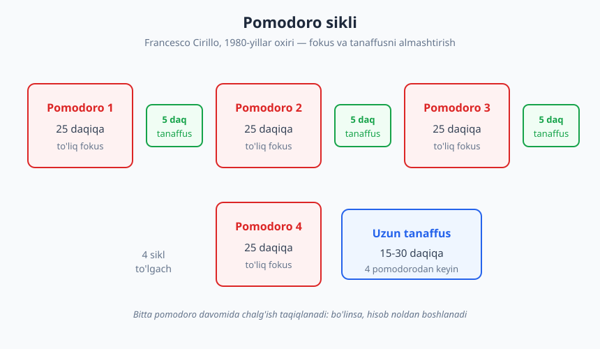

# 05 — Vaqtni boshqarish va prioritetlash

[⬅️ Oldingi: 04 — Bilim boshqaruvi va eslab qolish](./04-bilim-boshqaruvi-eslab-qolish.md) · [🏠 README](./README.md) · [Keyingi: 06 — Diqqat, chuqur ish va e'tibor ➡️](./06-diqqat-chuqur-ish.md)

---

> **Bu bobda:** vaqtni boshqarishning asosini — *prioritetlash* (eng muhim ishni tanlash) — va uni amalga oshiradigan tekshirilgan ramkalarni o'rganasiz: **Eisenhower matritsasi** (muhim/shoshilinch), **MoSCoW** (talab prioriteti), **timeboxing** va **Pomodoro**. Yana Parkinson qonuni, "Eat the Frog", 2-daqiqa qoidasi va ishlab chiquvchiga xos vaqt tuzoqlarini ko'rib chiqamiz.
>
> **Halollik / Eslatma:** vaqtni boshqarish — bu sehrli ilova yoki mukammal tizim emas. Hech qaysi ramka sizning o'rningizda qaror qabul qilmaydi. Ular faqat **qarorni osonlashtiradi**. Asl ko'nikma — "bularning hammasini qila olmayman, qaysi birini tanlayman?" degan halol savolga har kuni javob berishdir.

---

## Prioritetlash — vaqt boshqaruvining yuragi

Vaqtni boshqarish haqidagi eng katta yanglish tasavvur shuki, go'yo gap **tezroq ishlashda**. Yo'q. Siz qanchalik tez yozsangiz ham, sutkada 24 soat bor va qiladigan ish doim vaqtdan ko'p bo'ladi. Backlog hech qachon tugamaydi. Demak, asl savol "qanday qilib hamma ishni bajaraman?" emas — chunki bajara olmaysiz. Asl savol: **"qaysi ishlarni bajarmayman?"**

Mana shu — *prioritetlash*. Vaqtni boshqarishning haqiqiy yuragi tezlik emas, **tanlov**.

### "Band bo'lish" — bu "samarali bo'lish" emas

Ikki ishlab chiquvchini tasavvur qiling. Birinchisi kun bo'yi tinmaydi: o'nta Slack xabariga javob beradi, uchta yig'ilishga kiradi, kichik-kichik ticket'larni yopadi, GitHub bildirishnomalarini tekshiradi. Kechqurun charchagan, lekin "ko'p ish qildim" degan his bor. Ikkinchisi ertalab uch soat bitta murakkab muammoni hal qildi — sprintdagi eng muhim funksiyani ishga tushirdi — va qolgan vaqtda Slack'ga ataylab kech javob berdi.

Kim ko'proq qiymat yaratdi? Deyarli har doim — ikkinchisi. Birinchisi **band** edi; ikkinchisi **samarali**.

> **Diqqat:** band bo'lish — bu ko'pincha o'zini yaxshi his qilishning eng arzon usuli. U harakat illyuziyasini beradi: siz "ishlayapsiz", demak vijdoningiz tinch. Lekin tashkilot sizga harakat uchun emas, **natija** uchun haq to'laydi. Eng xavfli holat — noto'g'ri ishni juda samarali bajarish.

Bu farqni anglash — prioritetlashning birinchi qadami. Endi tanlovni *tartibli* qilishga yordam beradigan ramkalarga o'tamiz.

---

## Eisenhower matritsasi — muhim va shoshilinch

Eng mashhur prioritetlash vositasi — **Eisenhower matritsasi**. G'oya AQSh prezidenti Duayt Eyzenxauerga (Dwight D. Eisenhower) nisbat beriladi — unga tegishli deb keltiriladigan ibora: *"Menda ikki xil muammo bor: shoshilinch va muhim. Shoshilinch — muhim emas, muhim esa — hech qachon shoshilinch emas."* Bu ramkani keng ommalashtirgan kishi — **Stiven Kovi** (Stephen Covey), o'zining *"The 7 Habits of Highly Effective People"* (1989) kitobida (u buni "II kvadrant"da yashash deb atagan).

Matritsa har bir vazifani **ikki mustaqil o'lchov** bo'yicha baholaydi:

- **Muhimmi?** — bu ish sizning yoki jamoaning haqiqiy maqsadlariga, qiymatiga hissa qo'shadimi?
- **Shoshilinchmi?** — bu ish darhol e'tibor talab qiladimi, deadline yaqinmi?

Bu ikki o'lchov 2×2 to'rni hosil qiladi:

### To'rt kvadrat va ishlab chiquvchi misollari

**1-kvadrat — Muhim + Shoshilinch → DARHOL BAJAR.**
Bu krizis zonasi. Bularni hech qaysi ramka inkor etmaydi — ular haqiqatan ham hozir kerak.
- Production'da yiqilgan tizim, ishlamayotgan deploy.
- Bugun yetkazib berilishi shart bo'lgan, ertasi bo'lmaydigan funksiya.
- Xavfsizlik zaifligi haqida endigina kelgan xabar.

**2-kvadrat — Muhim + Shoshilinch emas → REJALASHTIR.**
Bu — **eng qadrli zona**, lekin eng oson e'tibordan chetda qoladigani. Hech kim sizdan buni *hozir* talab qilmaydi, shuning uchun u doim "keyinroq"ga suriladi.
- Test yozish, refactoring, texnik qarzni kamaytirish.
- Yangi texnologiyani o'rganish, mahoratni oshirish ([03-bob](./03-organishni-organish.md)).
- Hujjat yozish, monitoring qo'yish, jarayonni yaxshilash.

Kuchli ishlab chiquvchilarni ajratib turadigan narsa aynan shu: ular **2-kvadratga ataylab vaqt ajratadi**, bu ish portlab 1-kvadratga aylanguncha kutmaydi. Yozilmagan test bugun "muhim, lekin shoshilinch emas"; production'da bug chiqsa, ertaga "shoshilinch va muhim"ga aylanadi.

**3-kvadrat — Shoshilinch + Muhim emas → DELEGATSIYA / QISQART.**
Bu **aldamchi zona**. U shoshilinchligi tufayli muhimday tuyuladi, lekin sizning maqsadlaringizga hissa qo'shmaydi.
- Sizsiz ham bo'ladigan ba'zi yig'ilishlar.
- Boshqa odamning "shoshilinch" so'rovi — uning prioriteti, sizniki emas.
- Doim chalg'itadigan bildirishnomalar.

Bu yerda javob — **delegatsiya** (kim yaxshiroq bajarsa, o'shanga ber), **avtomatlashtirish**, yoki muloyim **"yo'q"** (pastda batafsil).

**4-kvadrat — Muhim emas + Shoshilinch emas → O'CHIR.**
Bu **vaqt o'g'risi**. Maqsadsiz lenta aylantirish, befoyda chalg'ish. Bularni ko'rsangiz — hayotingizdan olib tashlang.

> **Trade-off:** matritsa qarama-qarshi narsa emas, **suhbat boshlovchi**. "Muhim"likni baholash sub'yektiv — refactoring bir kishiga muhim, boshqasiga "keyinroq" tuyulishi mumkin. Ramkaning qiymati — sizni *to'xtab, o'ylashga* majbur qilishida, qisqa va aniq javob berishida emas.

---

## MoSCoW — talablarni prioritetlash

Eisenhower — bu sizning *shaxsiy* vazifalaringiz uchun. Lekin jamoada ko'pincha boshqacha savol turadi: **mahsulot yoki sprint'da qaysi talablar avval bajarilishi kerak?** Bu yerda **MoSCoW** metodi qo'l keladi. Uni 1990-yillarda **Dai Clegg** (DSDM agile metodologiyasi doirasida) taklif qilgan. Nom — to'rt toifa bosh harflaridan:

| Toifa | Ma'no | Misol (login funksiyasi) |
|---|---|---|
| **M** — Must have | Bu bo'lmasa, reliz umuman ma'nosiz | Parol bilan kirish, sessiyani saqlash |
| **S** — Should have | Muhim, lekin relizni to'xtatmaydi | "Parolni unutdim", xato xabarlari |
| **C** — Could have | Yaxshi bo'lardi, vaqt qolsa | "Eslab qol" belgisi, ijtimoiy tarmoq orqali kirish |
| **W** — Won't have (this time) | Bu safar emas — ataylab tashqarida | Ikki faktorli autentifikatsiya (keyingi sprint) |

MoSCoW'ning eng kuchli va eng kam ishlatiladigan qismi — **"Won't have"**. Ko'pchilik faqat "qilamiz" ro'yxatini tuzadi; professional jamoa esa **"bu safar qilmaymiz"**ni ham yozib qo'yadi. Bu — *ko'lam kengayishi* (scope creep)ga qarshi eng kuchli vosita. Yozilgan "Won't" — bu kelajakdagi "Nega buni qilmadik?" savoliga tayyor javob.

> **Eslatma:** MoSCoW'ni "hamma narsa Must" deb buzish oson. Agar ro'yxatdagi 90% "Must" bo'lsa — siz prioritetlamayapsiz, ro'yxat tuzyapsiz, xolos. Sog'lom nisbat: "Must" odatda umumiy mehnatning yarmidan ko'p bo'lmasligi kerak, qolgani — bufer va moslashuvchanlik uchun.

---

## Timeboxing va Pomodoro — vaqtni bloklarga ajratish

Prioritet aniqlandi — endi uni **bajarish** kerak. Bu yerda ikki kuchli usul bor.

### Timeboxing — kalendar to'do'dan kuchli

**To-do ro'yxat** sizga *nima* qilishni aytadi, lekin *qachon* qilishni aytmaydi. Shuning uchun u cheksiz o'sadi: yangi ish qo'shaverasiz, lekin vaqt qo'shilmaydi. **Timeboxing** esa har bir muhim vazifaga **kalendarda aniq vaqt oynasi** ajratadi: "soat 9:30 dan 11:30 gacha — autentifikatsiya funksiyasi". Vaqt tugadi — to'xtaysiz, keyingisiga o'tasiz.

Timeboxing nima beradi:
- **Reallikni ko'rsatadi.** To-do'da 12 ta ish bor; kalendarga joylashtirsangiz — ularning yarmiga vaqt yo'qligi ko'rinadi. Bu sizni *bugunoq* prioritetlashga majbur qiladi.
- **Mukammallikni jilovlaydi.** Cheksiz vaqt — cheksiz "yaxshilash"ga olib boradi. Aniq blok esa "yetarli darajada yaxshi"da to'xtashga undaydi.

E'tibor bering: yuqoridagi kunda eng **murakkab ish** ertalab — energiya eng yuqori paytda — qo'yilgan; yig'ilish va email kabi **sayoz ishlar** bir-ikki blokka to'plangan, kun bo'yiga sochilmagan. Bu kontekst almashinuvini kamaytiradi (bu narsa narxi haqida [06-bobda](./06-diqqat-chuqur-ish.md) batafsil gaplashamiz).

### Pomodoro — 25 + 5

**Pomodoro texnikasini** 1980-yillar oxirida **Francesco Cirillo** o'ylab topgan (nom — uning oshxona taymeri shaklidan: italyancha *pomodoro* — "pomidor"). G'oya juda sodda:

1. Bitta vazifani tanlang.
2. Taymerni **25 daqiqa**ga qo'ying va faqat shu ish bilan shug'ullaning.
3. Jiringladi — **5 daqiqa** tanaffus (turing, ko'zni dam bering).
4. Har **4 pomodoro**dan keyin — **uzunroq tanaffus** (15–30 daqiqa).

Pomodoro'ning maxfiy quroli — **chalg'ishni boshqarish qoidasi**: bitta pomodoro davomida chalg'ish taqiqlanadi. Boshingizga "buni keyin qidiraman" degan fikr kelsa — uni qog'ozga yozib qo'ying va davom eting. 25 daqiqa — boshlash uchun yetarlicha qisqa (mukammallik istagini yengadi), tugatish uchun yetarlicha uzun.

> **Eslatma:** 25 daqiqa — muqaddas raqam emas. Kimdir 50/10 ni afzal ko'radi. Asl g'oya — **fokus va dam almashishi** hamda **belgilangan vaqt mobaynida bitta ishga sodiqlik**. Raqamni o'zingizga moslang.

---

## Amaliy qonunlar — kichik, kuchli qoidalar

Bir nechta sodda, lekin kun sayin ta'sir qiladigan qoida bor.

### Parkinson qonuni — deadline qo'ying

**Parkinson qonuni** (Cyril Northcote Parkinson, 1955, *The Economist*): *"Ish unga ajratilgan vaqtni to'ldirguncha kengayadi."* Agar bir vazifaga bir hafta bersangiz — u bir hafta oladi; xuddi shu vazifaga ikki kun bersangiz — ko'pincha ikki kunda bitadi.

Amaliy xulosa: **ataylab tor, lekin real deadline qo'ying.** "Bu funksiyani qachondir tugataman" — bu hech qachon tugamaydigan retsept. "Bu funksiyani payshanba soat 15:00 gacha tugataman" — bu ishlaydi. Cheklov — bu dushman emas, bu **fokus generatori**.

### "Eat the Frog" — eng yoqimsiz ishni birinchi qiling

**Brian Tracy** "Eat That Frog!" (2001) kitobini Mark Tven'ga nisbat beriladigan iboraga qurgan: *"Agar har kuni ertalab tirik qurbaqani yeyishingiz kerak bo'lsa, buni birinchi qiling."* Ya'ni: kunning eng muhim, eng qiyin yoki eng ko'ngilsiz vazifasini — **"qurbaqani"** — birinchi bo'lib bajaring.

Nega? Chunki ertalab iroda kuchi (willpower) eng baland. Va o'sha og'ir ish boshda tugasa, kun bo'yi uni ortga surishdan kelib chiqadigan **kechiktirish tashvishi** (procrastination guilt) yo'qoladi. Aksincha, "qurbaqa"ni kechqurunga qoldirsangiz — u kun bo'yi xira bulutday boshingiz uzra osilib turadi va energiyangizni sezdirmay yeb qo'yadi.

### 2-daqiqa qoidasi

**David Allen**ning *"Getting Things Done"* (2001) tizimidan: **agar bir ish 2 daqiqadan kam vaqt olsa — uni darhol qiling, ro'yxatga yozmang.** Tez javob beriladigan xabar, kichik PR'ga "approve" bosish, bitta qatorlik typo tuzatish — bularni keyinga surishning o'zi (yozib qo'yish, eslab yurish, qaytib kelish) ishning o'zidan ko'proq vaqt oladi.

> **Diqqat:** 2-daqiqa qoidasini *chuqur ish* paytida qo'llamang. Fokus blokining o'rtasida har bir "tez ish"ni darhol qilsangiz — har 5 daqiqada chalg'iysiz. Bu qoida — bo'sh, oraliq vaqtlar uchun. Chuqur ish vaqtida "tez ishlar"ni bir ro'yxatga yig'ib, blok oxirida birdaniga bajaring.

### WIP'ni cheklang — bir vaqtda kam ish

**WIP** (Work In Progress — jarayondagi ish) — bir vaqtning o'zida "boshlangan, lekin tugamagan" vazifalar soni. Kanban metodologiyasining markaziy tamoyili: **WIP'ni cheklang.**

Beshta ishni bir vaqtda "boshlab" qo'yib, hech birini tugatmaslik — eng keng tarqalgan samaradorlik tuzog'i. Har bir tugallanmagan ish miyangizda joy egallaydi (psixologiyada buni *Zeygarnik effekti* deyiladi — tugamagan ish xotirada tinim bermaydi) va har biriga qaytganda **kontekstni qayta yuklash** kerak bo'ladi. Yaxshi qoida: **boshlashni to'xtat, tugatishni boshla.** Yangi ishga o'tishdan oldin — joriy ishni "Done" holatiga keltiring.

---

## Ishlab chiquvchiga xos vaqt tuzoqlari

Endi ramkalardan ishlab chiquvchining real kuniga o'tamiz. Bu yerda bir nechta o'ziga xos qiyinchilik bor.

### Yig'ilishlar — eng katta vaqt yebyotuvchi

Ishlab chiquvchi uchun yig'ilish ikki tomonlama zarba: u nafaqat o'z vaqtini oladi, balki **ortidagi va oldidagi fokus vaqtini** ham parchalaydi. Soat 11:00 dagi 30 daqiqalik yig'ilish ko'pincha 10:00–11:00 oralig'ini ham "yo'q qiladi" — chunki bir soatga arziydigan chuqur ishni boshlashga ma'no qolmaydi.

Amaliy yondashuvlar:
- **Kun bo'yi yig'ilishlarni bir joyga to'plashga** harakat qiling, sochib yubormang — natijada uzluksiz fokus bloklari qoladi.
- Har bir yig'ilishdan oldin so'rang: *"Bu yerda menim bo'lishim shartmi? Yozma yangilanish yetmaydimi?"*
- Agar yig'ilishning kun tartibi (agenda) bo'lmasa — bu ko'pincha 3-kvadrat ishi.

### "Yo'q" deyish — ko'nikma, sadoqatsizlik emas

Ko'plab junior ishlab chiquvchi har bir so'rovga "ha" deydi — chunki yordamchi bo'lib ko'rinishni xohlaydi. Lekin **har bir "ha" — boshqa narsaga aytilgan yashirin "yo'q"dir.** "Ha, bu ticket'ni ham olaman" deganingizda — siz aslida hozirgi muhim ishingizning bir qismiga "yo'q" deyapsiz.

Yaxshi "yo'q" — qo'pol emas, **shaffof**:

> ❌ Yomon: *"Yo'q, vaqtim yo'q."* (qattiq, sababsiz)
>
> ✅ Yaxshi: *"Buni jon deb qilardim. Hozir A funksiyasini payshanbaga yetkazyapman. Agar bu undan muhimroq bo'lsa — A'ni kechiktiramizmi? Yoki bu juma'gacha kuta oladimi?"*

Ikkinchi javob "yo'q" demaydi — u **prioritet to'qnashuvini ko'rinarli qiladi** va qarorni so'rovchi (yoki lead) bilan birga qabul qiladi. Bu ko'nikma navbatdagi boblar bilan ham bog'liq: [13-bob](./13-feedback-berish-qabul.md) (muloqot) va [22-bob](./22-baholash-rejalashtirish.md) (real baholash) — chunki "yo'q" ko'pincha "menim vaqtim cheklangan" haqidagi halol baho.

### Kontekst almashinuvi — ko'rinmas soliq

Bir ishdan ikkinchisiga sakrash bepul emas. Har safar miyangiz "qaerda edim?" deb yangi kontekstni yuklashi kerak — bu **kontekst almashinuvi narxi**. Ishlab chiquvchi uchun bu ayniqsa qimmat: murakkab kodga "kirib" ulgurmasdan chalg'isangiz, ko'plab oqim (flow) yo'qoladi va uni tiklash 15–20 daqiqa olishi mumkin. Aynan shu sabab timeboxing va Pomodoro shu qadar foydali — ular sizni bitta kontekstda **ushlab turadi**. Bu mavzu — keyingi bobning yuragi: [06-bob](./06-diqqat-chuqur-ish.md) chuqur ish va e'tiborga bag'ishlangan.

### Kun rejasini tuzish odati

Eng kuchli, eng arzon odat — **kun rejasini oldindan yozish**. Buni ikki vaqtdan birida qiling:
- **Kechqurun** (afzalroq): ish kunini tugatishdan oldin ertangi kun uchun 3 ta eng muhim vazifani yozing. Ertalab miyangiz "nima qilsam ekan?" degan og'ir savol bilan kurashmaydi — reja tayyor.
- **Ertalab**: birinchi 10 daqiqa — kun rejasini ko'rib chiqish. Eisenhower bilan tanlang, timeboxing bilan kalendarga joylang, "qurbaqa"ni belgilang.

Asosiy qoida: **kunni o'zgalar boshlashidan oldin boshlang.** Agar ertalab birinchi qiladigan ishingiz — Slack yoki emailni ochish bo'lsa, kun *sizning* prioritetlaringiz bilan emas, *boshqalarning* prioritetlari bilan boshlanadi.

---

## Asosiy g'oyalar (bobni qisqacha)

- **Prioritetlash — vaqt boshqaruvining yuragi.** Asl savol "hamma ishni qanday bajaraman?" emas, balki **"qaysi ishlarni bajarmayman?"**. *Band bo'lish* — bu *samarali bo'lish* emas.
- **Eisenhower matritsasi** vazifani muhimlik va shoshilinchlik bo'yicha 4 kvadratga ajratadi: darhol bajar / **rejalashtir** / delegatsiya / o'chir. Kuchli ishlab chiquvchilar **2-kvadratga** (muhim, lekin shoshilinch emas) ataylab vaqt ajratadi.
- **MoSCoW** (Must / Should / Could / **Won't**) talablarni prioritetlaydi; eng kuchli va eng kam ishlatiladigan qism — ataylab yoziladigan **"Won't have"**.
- **Timeboxing** vazifaga kalendarda aniq vaqt oynasi beradi — to-do'dan kuchli, chunki reallikni ko'rsatadi. **Pomodoro** (25+5) fokus va dam almashuvini tartibga soladi.
- **Amaliy qonunlar:** Parkinson — tor deadline qo'y; **Eat the Frog** — eng og'ir ishni birinchi qil; 2-daqiqa qoidasi; **WIP'ni cheklang** (boshlashni to'xtat, tugatishni boshla).
- **Ishlab chiquvchiga xos:** yig'ilishlarni to'pla, shaffof **"yo'q"** ayt, kontekst almashinuvini kamaytir, kun rejasini **kechqurun** yoz — kunni o'zgalardan oldin boshla.

---

## Mashqlar

### Oson

**1-mashq.** Bugungi yoki ertangi 8–10 ta vazifangizni qog'ozga yozing. Har birini Eisenhower matritsasining to'rt kvadratidan biriga joylang. Keyin o'zingizga halol javob bering: nechtasi 3- va 4-kvadratda (muhim emas) ekan? Ulardan qaysi birini bugun *o'chirsangiz* yoki *birovga bersangiz* bo'ladi?

**2-mashq.** Bitta Pomodoro sinab ko'ring: bitta aniq vazifa tanlang, taymerni 25 daqiqaga qo'ying va shu ish bilan shug'ullaning. Chalg'itadigan har bir fikrni qog'ozga yozib qo'ying (lekin qilmang). Tanaffusdan keyin yozuvga qarang: nechtasi haqiqatan muhim edi?

### O'rta

**3-mashq.** Ertangi kuningizni **timeboxing** bilan rejalang: kalendarga (yoki qog'ozga) kamida 2 ta chuqur ish bloki, 1 ta yig'ilish/sayoz ish bloki va "qurbaqa" (eng og'ir ish) qo'ying. Kechqurun solishtiring: reja qanchalik ushlandi? Qaerda buzildi va nega?

**4-mashq.** O'zingizning so'nggi sprintdagi (yoki shaxsiy loyihadagi) talablar ro'yxatini oling va ularni **MoSCoW** bo'yicha taqsimlang. Eng muhimi — kamida 2 ta **"Won't have (this time)"** elementini ataylab yozing. Buni yozish qanday his uyg'otdi?

### Qiyin

**5-mashq.** O'tgan ikki haftada siz "ha" degan, lekin aslida **"yo'q"** deyishingiz kerak bo'lgan bir so'rovni eslang (qo'shimcha ticket, keraksiz yig'ilish, boshqaning shoshilinch ishi). Endi o'sha "yo'q"ni *shaffof* shaklda qayta yozing: prioritet to'qnashuvini ko'rsating va qarorni birga qabul qilishni taklif qiling. (Yuqoridagi ✅ namunaga qarang.)

**6-mashq.** Bir hafta davomida har kuni ertalab kun rejasini yozish odatini sinab ko'ring (afzal — bir kun oldin kechqurun). Hafta oxirida tahlil qiling: reja yozilgan kunlar reja yozilmagan kunlardan farq qildimi? Eng muhim ishlaringiz qaysi kunlarda bajarilgan — rejali kunlardami yoki "oqim bo'yicha" o'tgan kunlardami?

Yechimlar / Namunaviy yondashuvlar

### 1-mashq yechimi
Ko'pchilik birinchi marta buni qilganda hayron qoladi: vazifalarning katta qismi 1-kvadrat (shoshilinch+muhim) yoki 3-kvadrat (shoshilinch, lekin muhim emas)da to'planib qoladi, 2-kvadrat (muhim, shoshilinch emas) deyarli bo'sh bo'ladi. Bu odatiy "o't o'chiruvchi" rejimining belgisi — siz doim yong'inlarni o'chiryapsiz, lekin yong'in chiqmasligi uchun ish (test, refactoring, o'rganish) qilmayapsiz. Maqsad — vaqt o'tishi bilan 2-kvadratga ko'proq vaqt o'tkazish, shunda 1-kvadrat tabiiy ravishda kichrayadi. 3- va 4-kvadrat ishlaridan hech bo'lmasa bittasini bugun o'chirsangiz yoki delegatsiya qilsangiz — mashq muvaffaqiyatli.

### 2-mashq yechimi
"To'g'ri" natija yo'q, lekin ko'pchilik ikki narsani sezadi: (1) qog'ozga yozilgan chalg'itadigan fikrlarning aksariyati — "tez tekshirib qo'yay" turidagi, hech qanaqa shoshilinch bo'lmagan narsalar; ularni keyinroq qilish mumkin va dunyo qulamaydi. (2) 25 daqiqa o'ylaganingizdan tez o'tadi. Bu mashqning maqsadi — chalg'ishlarning ko'pchiligi *o'z-o'zidan kelgan*, tashqaridan majburlangan emasligini ko'rsatish. Demak, ularni boshqarish — sizning qo'lingizda.

### 3-mashq yechimi
Deyarli hech kimning birinchi timeboxing rejasi to'liq ushlanmaydi — bu normal va aslida foydali. Eng keng tarqalgan xato: **kun haddan tashqari zich rejalashtiriladi**, bufer qoldirilmaydi. Bitta yig'ilish kechiksa yoki bitta bug chiqsa — qolgan hamma blok suriladi. Saboq: kunning 60–70% ini rejalashtiring, qolganini kutilmagan ishlar va buferga qoldiring. Reja buzilishi — muvaffaqiyatsizlik emas; u sizga *qancha ishni real bajara olishingiz* haqida aniq ma'lumot beradi (bu — baholash ko'nikmasining urug'i, [22-bob](./22-baholash-rejalashtirish.md)).

### 4-mashq yechimi
Agar barcha narsa "Must" bo'lib chiqsa — bu signal: siz hali prioritetlamadingiz. O'zingizga savol bering: *"Agar shu element bo'lmasa, reliz umuman ma'noga ega bo'ladimi?"* Faqat "yo'q" javobi bo'lsa — bu "Must". "Won't have" yozish ko'pchilikka noqulay — go'yo biror narsadan voz kechayotganday. Lekin aslida bu — eng ozod qiluvchi qadam: "Won't"ga tushgan narsa endi sizning fikringizni va vaqtingizni egallamaydi. Yozilgan "Won't" — bu kelajakdagi "Nega buni qilmadingiz?" savoliga tayyor, hujjatlangan javob.

### 5-mashq yechimi
Yaxshi qayta yozilgan "yo'q" uch qismdan iborat bo'ladi: (1) **ijobiy niyat** ("buni qilardim / muhimligini tushunaman"), (2) **real cheklov** ("hozir X ustida ishlayapman, deadline Y"), (3) **birgalikda qaror** ("X'ni kechiktiramizmi yoki bu kuta oladimi?"). Bu "yo'q"ni "kim muhimroq qaror qabul qilsin" degan savolga aylantiradi. Ko'pincha so'rovchi o'zi orqaga chekinadi ("ha, bu kuta oladi") — chunki uning ham aslida real prioriteti bor edi, faqat avtomatik "tezroq qilib bering" deb yuborgandi.

### 6-mashq yechimi
Ko'pchilik reja yozilgan kunlarda nafaqat ko'proq, balki **to'g'riroq** ish qilganini sezadi — chunki kun o'zining prioriteti bilan boshlangan, kelgan birinchi xabar bilan emas. "Oqim bo'yicha" o'tgan kunlar ko'pincha band tuyuladi, lekin kechqurun "bugun aslida nima muhim ish qildim?" degan savolga aniq javob bo'lmaydi. Asosiy saboq: kun rejasini yozish — bir necha daqiqa oladi, lekin u sizni *boshqalarning prioritetlari rejimidan* o'z prioritetlaringiz rejimiga o'tkazadi. Bu — eng yuqori qaytim beradigan odatlardan biri ([07-bob](./07-maqsad-odatlar.md) odatlar haqida).

---

[⬅️ Oldingi: 04 — Bilim boshqaruvi va eslab qolish](./04-bilim-boshqaruvi-eslab-qolish.md) · [🏠 README](./README.md) · [Keyingi: 06 — Diqqat, chuqur ish va e'tibor ➡️](./06-diqqat-chuqur-ish.md)
