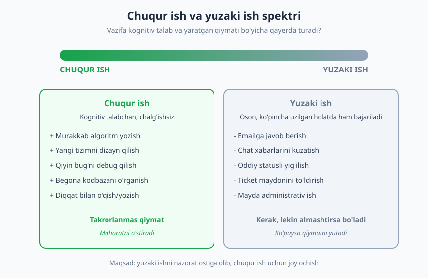
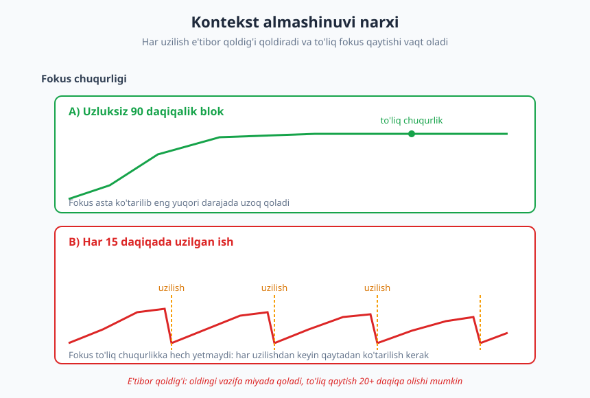
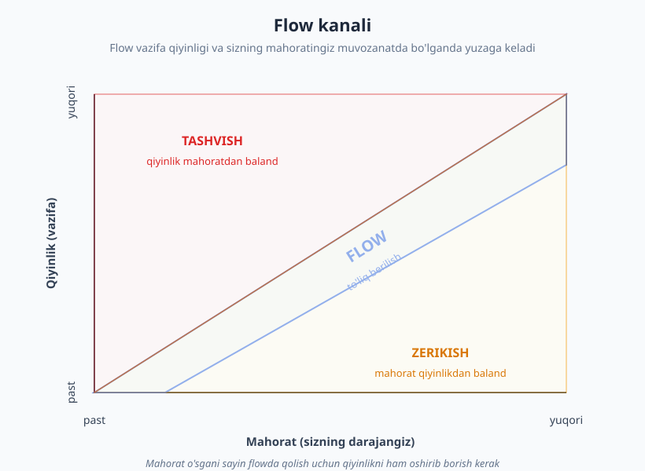

# 06 — Diqqat, chuqur ish va e'tibor

[⬅️ Oldingi: 05 — Vaqtni boshqarish va prioritetlash](./05-vaqtni-boshqarish.md) · [🏠 README](./README.md) · [Keyingi: 07 — Maqsad qo'yish va odatlar ➡️](./07-maqsad-odatlar.md)

---

> **Bu bobda:** dasturlash nega chuqur diqqat talab qiladigan kasb ekanini ko'ramiz. Cal Newport'ning **chuqur ish (deep work)** g'oyasi, kontekst almashinuvi va e'tibor qoldig'i narxi, Mihaly Csikszentmihalyi'ning **flow** holati va chalg'itishni boshqarishning amaliy tizimi — diqqatni himoya qiladigan ko'nikmani quramiz.
>
> **Halollik / Eslatma:** chuqur ish — sehrli tugma emas. U mashqlanadigan mushak: birinchi kunlari 25 daqiqa fokusda qolish ham qiyinday tuyuladi. Bu yerdagi ramkalar yo'lni ko'rsatadi, ammo bardoshni faqat takror amaliyot beradi.

---

## Nega aynan dasturchiga chuqur diqqat kerak

Tasavvur qiling: siz uchta xizmat orasida ma'lumot oqib o'tadigan murakkab funksiyani yozyapsiz. Boshingizda bir vaqtning o'zida o'nlab narsa turibdi — bu funksiya nima qaytaradi, oldingi qatorda qaysi o'zgaruvchi qanday holatda, agar tarmoq uzilsa nima bo'ladi, bu yerda qaysi xato turini ushlash kerak. Bu — miyaning ishchi xotirasida (working memory) qurilgan nozik "qasr". Endi yoningizdagi hamkasb savol berdi yoki telefonda bildirishnoma chiqdi — va qasr qulaydi. Siz uni qaytadan, g'isht-g'ishtdan tiklashga majbur bo'lasiz.

Aynan shu — dasturlashning markaziy haqiqati. Kod yozish ko'p hollarda jismoniy harakat emas, balki **murakkab modelni boshda ushlab turish**dir. Ana shuning uchun dasturchi boshqa ko'p kasblardan ko'ra ko'proq uzluksiz, chalg'imagan vaqtga muhtoj. Bir soatlik bo'linmagan fokus — to'rt marta uzilgan bir soatdan tubdan boshqa narsa: birinchisi murakkab masalani yechadi, ikkinchisi faqat charchatadi.

Bu bob — ana shu diqqatni qanday himoya qilish, qanday chuqurlikka kirish va qanday qilib chalg'itishlarni nazoratga olish haqida. Bu vaqt boshqaruvining ([5-bob](./05-vaqtni-boshqarish.md)) davomi: u qaysi ishni qachon qilishni hal qiladi; bu bob esa o'sha ishni **qanday sifatda** bajarishni ko'rsatadi.

---

## 1. Chuqur ish va yuzaki ish

Kompyuter olimi va yozuvchi **Cal Newport** 2016-yilda chiqqan "Deep Work" kitobida ishni ikki turga ajratadi. Bu ajratish oddiy, lekin kunlik ishingizga boshqacha qarashga majbur qiladi.

**Chuqur ish (deep work)** — chalg'ishsiz, to'liq diqqat sharoitida bajariladigan, kognitiv jihatdan talabchan faoliyat. Bunday ish mahoratingizni chegaragacha cho'zadi va takrorlanmas, yangi qiymat yaratadi. Dasturchi uchun bu — murakkab algoritm yozish, yangi tizimni dizayn qilish, qiyin bug'ni topish, begona kodbazani tushunish, diqqat bilan texnik hujjat o'qish yoki yozish.

**Yuzaki ish (shallow work)** — kognitiv jihatdan yengil, ko'pincha chalg'igan holatda ham bajarib bo'ladigan, logistik xarakterdagi vazifalar. Emailga javob berish, chat xabarlarini kuzatish, ticket maydonlarini to'ldirish, oddiy statusli yig'ilishda o'tirish. Bu ishlar **kerak** — ularsiz jamoa ishlamaydi. Muammo shundaki, yuzaki ish bo'shliqni to'ldirib, asta-sekin butun kunni egallab oladi, chuqur ishga esa joy qolmaydi.

Newport'ning asosiy da'vosi: bilim iqtisodida (knowledge economy) eng qadrli ko'nikma — chuqur ishga uzoq berila olish — kamayib bormoqda, chunki muhit (doimiy ulanish, bildirishnomalar, ochiq ofis) buni qiyinlashtiradi. Aynan shuning uchun bu ko'nikma **noyob va shu sababli qimmat** bo'lib qolmoqda. Kim diqqatini himoya qila olsa, o'shanda raqobat ustunligi bor.

> **Diqqat:** "chuqur" degani "qiyin" yoki "uzoq" degani emas. Mezon — *kognitiv talab* va *takrorlanmas qiymat*. Bir soat davomida bir necha email yozish — bu uzoq, lekin yuzaki ish. Yarim soatlik nozik bir refaktoring esa chuqur ish bo'lishi mumkin.

### Ikkalasi ham kerak — lekin nisbat muhim

Maqsad — yuzaki ishni nolga tushirish emas. Junior dasturchi sifatida siz ko'p savol berasiz, ko'p yozasiz, ko'p kuzatasiz — bu normal. Maqsad — yuzaki ishni **ongli ravishda chegaralash**, uni kunning ma'lum oynalariga to'plash va o'rtada chuqur ish uchun himoyalangan bloklar qoldirishdir.

Amaliy mezon: kun oxirida o'zingizdan so'rang — "Bugun nimaga eng ko'p vaqt sarfladim? U chuqur ishmidi yoki yuzaki?" Agar bir hafta ketma-ket javob "yuzaki" bo'lsa — bu signal: siz band ko'rinasiz, lekin asl, mahoratni o'stiruvchi ish surilib qolmoqda.

---

## 2. Kontekst almashinuvi va e'tibor qoldig'i narxi

Eng keng tarqalgan xato — uzilishni "bir daqiqalik" deb hisoblash. "Hammasi bo'lib 30 soniya javob berdim-ku" deysiz. Lekin haqiqiy narx 30 soniya emas.

### E'tibor qoldig'i (attention residue)

Tashkilot tadqiqotchisi **Sophie Leroy** 2009-yilda "e'tibor qoldig'i" (attention residue) deb atalgan hodisani ta'riflagan. Bir vazifadan ikkinchisiga o'tganingizda, miyangizning bir qismi hamon oldingi vazifada qoladi — ayniqsa, agar siz uni **tugatmagan** bo'lsangiz. Natijada yangi vazifaga to'liq diqqatingizni bera olmaysiz: bir qismingiz hali ham orqadagi muammoni o'ylaydi.

Dasturlashda bu ayniqsa og'riqli, chunki yuqorida aytilgan "boshdagi qasr" — kontekst — to'liq qaytarilishi kerak. Tadqiqotchilar va dasturchilarning kuzatuvlari shuni ko'rsatadiki, chuqur masaladan uzilgandan keyin to'liq fokusga qaytish ko'pincha **20 daqiqa va undan ko'proq** vaqt oladi. Ya'ni: 30 soniyalik uzilish aslida 20+ daqiqalik chuqurlikni yo'qotishi mumkin.

Diagrammaning yuqori chizig'i — uzluksiz 90 daqiqalik blok: fokus asta-sekin ko'tarilib, eng yuqori darajaga chiqib, u yerda uzoq qoladi. Pastki chiziq — har 15 daqiqada uzilgan ish: fokus to'liq chuqurlikka **hech qachon yetmaydi**, chunki har uzilishdan keyin ko'tarilish qaytadan boshlanadi. Ikkinchi holatda siz xuddi shuncha "ishlagan" bo'lsangiz-da, sifat va natija keskin past.

### "Multitasking" mifi

Ko'pchilik o'zini bir vaqtda bir necha ishni qila oladi deb o'ylaydi. Aslida miya bir nechta kognitiv vazifani parallel bajarmaydi — u ular orasida tez **almashadi** (task switching), va har almashinuv narx (e'tibor qoldig'i) qoldiradi. "Multitasking" deb atalgan narsa — aslida tez va doimiy kontekst almashinuvi, ya'ni eng samarasiz ish rejimi.

> **Trade-off:** doimiy ulangan, har xabarga darhol javob beradigan dasturchi *javobgar* va *foydali* ko'rinadi. Lekin u hech qachon chuqurlikka kira olmaydi. Aksincha, ma'lum vaqtga "yo'qoladigan" dasturchi qisqa muddatda biroz sekin ko'rinishi mumkin — ammo aynan u qiyin masalalarni yechadi. Bu — qabul qilinadigan ayirboshlash.

### Maker jadvali va Manager jadvali

2009-yilda Y Combinator asoschisi **Paul Graham** "Maker's Schedule, Manager's Schedule" essesida muhim farqni ta'riflagan. Ikki xil kun tuzilishi bor:

| | Manager jadvali | Maker jadvali |
|---|---|---|
| **Kim** | Menejer, rahbar | Dasturchi, dizayner, yozuvchi |
| **Vaqt birligi** | 30–60 daqiqalik bo'laklar | Yarim kun yoki butun kun bloklar |
| **Yig'ilish** | Normal, kun shulardan iborat | Har biri butun yarim kunni "buzadi" |
| **Asosiy resurs** | Vaqt taqsimoti | Uzluksiz e'tibor |

Graham'ning fikri: dasturchi — **maker**. Uning ishi katta, bo'linmagan vaqt bloklarini talab qiladi. Tushlikgacha bo'lgan vaqt o'rtasiga qo'yilgan bitta 30 daqiqalik yig'ilish menejer uchun arzimas, ammo maker uchun butun yarim kunni ikki yaroqsiz bo'lakka bo'lib tashlaydi — chunki yig'ilishni kutib turganda chuqur ishga kirib bo'lmaydi, undan keyin esa qaytadan ko'tarilish kerak.

Buni bilish ikki yo'l bilan yordam beradi. Birinchi: yig'ilishlarni kun chetlariga (ertalab birinchi ish yoki tushlikdan keyin) to'plang, o'rtada bo'linmagan blok qoldiring. Ikkinchi: menejeringizga bu farqni tushuntiring — ko'p rahbarlar maker jadvali borligini bilmaydi va sizning kalendaringizni o'zlarinikidek to'ldiraveradi.

---

## 3. Flow holati

Chuqur ishning eng yoqimli ko'rinishi — **flow** (oqim holati). Buni macar-amerikalik psixolog **Mihaly Csikszentmihalyi** 1970–90-yillarda o'rgangan va ommalashtirgan. Flow — shunday holatki, unda ish shu qadar o'ziga tortadiki, vaqt sezilmaydi, atrofdagi narsalar yo'qoladi, harakat oson va tabiiy tuyuladi. Ko'p dasturchi buni biladi: ba'zan kod "o'zidan-o'zi oqib" yozilganday, soatlar bir lahzaday o'tib ketadi.

### Flow qachon yuzaga keladi

Csikszentmihalyi'ning markaziy topilmasi: flow **qiyinlik va mahorat muvozanatida** tug'iladi.

- Agar vazifa mahoratingizdan ancha **oson** bo'lsa — **zerikasiz**, e'tiboringiz tarqaydi.
- Agar vazifa mahoratingizdan ancha **qiyin** bo'lsa — **tashvishga** tushasiz, taranglashasiz, fokus buziladi.
- Agar qiyinlik mahoratingizdan **biroz baland**, ya'ni "cho'zilib yetadigan" darajada bo'lsa — flow yo'lagiga kirasiz.

Diagrammada o'q markaziy diagonal bo'ylab cho'zilgan "flow kanali"ni ko'rasiz. Yuqori chap zona — tashvish (qiyinlik mahoratdan baland); pastki o'ng zona — zerikish (mahorat qiyinlikdan baland). Muhim xulosa: mahoratingiz o'sgani sayin, flowda qolish uchun **qiyinlikni ham oshirib borishingiz** kerak. Kechagi flow beruvchi masala bugun zerikarli bo'lib qolishi mumkin.

### Flowning amaliy shartlari

Csikszentmihalyi va keyingi tadqiqotlar flowni osonlashtiruvchi bir necha shartni ajratadi. Dasturchi tiliga o'girsak:

1. **Aniq maqsad.** Hozir aniq nima qilayotganingizni bilishingiz kerak. "Modulni yaxshilash" — noaniq. "Bu funksiya bo'sh ro'yxatda ham to'g'ri ishlashini ta'minlash" — aniq. Noaniqlik flowga kirishni qiyinlashtiradi.
2. **Darhol fikr-mulohaza (feedback).** Harakatingiz to'g'rimi-yo'qmi tezda bilishingiz kerak. Dasturlashda buni testlar, tez ishlaydigan lokal muhit, REPL beradi. Sekin yoki noaniq fikr-mulohaza flowni buzadi.
3. **Chalg'ishsizlik.** Flow nozik — bitta uzilish uni darhol sindiradi. Shuning uchun keyingi bo'lim — chalg'itishni boshqarish — flowning shartidir.

> **Eslatma:** flow — maqsad emas, qo'shimcha sovg'a. Flowsiz ham chuqur ish qilsa bo'ladi; flowni "majburlab" chaqirib bo'lmaydi. Lekin yuqoridagi shartlarni yaratsangiz — aniq maqsad, tez feedback, himoyalangan vaqt — flow ehtimoli sezilarli oshadi.

---

## 4. Chalg'itishni boshqarish

Chuqur ish va flow uchun bitta umumiy dushman bor: **chalg'itish (distraction)**. Va eng achchiq haqiqat shuki, chalg'itishlarning aksariyati tashqaridan emas, balki bizning o'z odatlarimizdan keladi — har 5 daqiqada chatni tekshirish, "bir lahzaga" lentaga kirish.

Chalg'itishni ikki turkumga bo'lish foydali:

- **Tashqi chalg'itish:** bildirishnomalar, telefon ovozi, yoningizdagi suhbat, "bir soniyaga" yondashgan hamkasb, yangi email signali.
- **Ichki chalg'itish:** zerikish yoki qiyinlik paytida o'zingiz qidiradigan qochish — chatni ochish, brauzerda yangi tab ochish, telefonni qo'lga olish. Bu odatda masala qiyinlashganda kuchayadi.

### Amaliy himoya choralari

❌ **Yomon yondashuv:** "Iroda bilan chalg'imayman" deb umid qilish. Iroda charchaydi; har safar "tekshirmaslik"ka qaror qilish uchun energiya sarflaysiz. Bu jang oxir-oqibat yutqaziladi.

✅ **Yaxshi yondashuv:** chalg'itishni *muhitdan* olib tashlash, shunda iroda umuman kerak bo'lmaydi. Eng kuchli qoida: **eng oson yo'l — to'g'ri yo'l bo'lsin.**

Aniq choralar:

- **Bildirishnomalarni o'chiring.** Telefon va kompyuterda chuqur ish bloki davomida barcha push-bildirishnomalarni o'chiring. Sukut yetmaydi — bildirishnoma ekranda chaqnashining o'zi e'tiborni tortadi.
- **Telefonni ko'rinishdan oling.** Stolda yotgan telefon — hatto yuzi pastga qaratilgan bo'lsa ham — diqqatni "tortib turadi". Uni boshqa xonaga yoki sumkaga qo'ying. Masofa odat zanjirini uzadi.
- **Keraksiz tablar va ilovalarni yoping.** Ochiq turgan chat oynasi yoki 20 ta brauzer tabi — doimiy ichki chaqiruv. Faqat hozirgi vazifaga keraklisini qoldiring.
- **Chat statusini "band / fokusda" qiling.** Slack/Teams'da fokus rejimini yoqing, statusni "chuqur ishda, 11:00 da javob beraman" deb qo'ying. Bu ham sizni himoya qiladi, ham jamoaga sizning ish uslubingizni o'rgatadi.
- **Muhitni sozlang.** Ko'pchilik uchun naushnik (hatto musiqasiz ham) — "meni bezovta qilmang" signali. Imkon bo'lsa, chuqur ish uchun alohida joy yoki vaqt ajrating; miya joyni rejim bilan bog'lashni o'rganadi.

### "Bezovta qilmaslik" madaniyati

Eng kuchli o'zgarish — shaxsiy emas, jamoaviy. Agar butun jamoa har xabarga **darhol** javob kutmasligini, asinxron muloqotni norma deb bilsa, har kim chuqur ishlay oladi. Bu — siz yolg'iz hal qila olmaydigan, lekin ko'tarib chiqa oladigan masala: "Keling, ertalab 2 soatni 'fokus vaqti' deb belgilab, o'sha paytda bir-birimizni faqat shoshilinch holatda chaqiraylik." Asinxron muloqot va remote madaniyat haqida [10-bob](./10-yozma-asinxron-muloqot.md) va [17-bob](./17-masofaviy-ish-jamoa.md)da chuqurroq gaplashamiz.

> **Diqqat:** chalg'itishni boshqarish "hech kimga javob bermaslik" degani emas. Production yonayotganda uzilish — to'g'ri. Gap o'sha — chuqur ishni *standart* qilish, uzilishni esa *istisno* qilishda; hozir esa ko'pchilikda bu teskari.

---

## 5. Amaliy tizim: chuqur ish blokini qurish

Endi ramkalarni bitta ishlaydigan tartibga yig'amiz. Maqsad — chuqur ishni "umid qilinadigan" narsadan "rejalashtirilgan" narsaga aylantirish.

### Energiya egri chizig'iga moslang

Hammaning kuni bir xil emas. Ba'zilarning eng tiniq fikri ertalab, ba'zilarniki kechqurun. Bir hafta davomida kuzating: qachon eng oson fikrlaysiz, qachon "miya tumanli"? **Eng yuqori energiya oynangizni** aniqlang va eng qiyin, eng muhim chuqur ishni aynan o'sha vaqtga rejalashtiring. Email va yuzaki ishni esa past energiya vaqtlariga (masalan, tushlikdan keyingi cho'kkan payt) suring — yuzaki ish ko'p fokus talab qilmaydi.

### Bitta chuqur blokni loyihalash

Yaxshi chuqur ish bloki shu elementlarga ega:

1. **Aniq, yagona maqsad.** "Ishlash" emas — "X funksiyaning chegaraviy holatlarini test bilan qoplash". Boshlashdan oldin maqsadni bir jumlada yozing.
2. **Belgilangan davomiylik.** Boshlovchi uchun 25–50 daqiqa (Pomodoro uslubi), tajriba ortgach 90 daqiqagacha. 90 daqiqa — ko'p odam uchun uzluksiz fokusning tabiiy yuqori chegarasi.
3. **Boshlash rituali.** Har gal bir xil kichik harakat — naushnikni kiyish, suvni olib kelish, telefonni narida qoldirish, maqsadni yozish. Ritual miyaga "endi chuqurlik vaqti" signalini beradi va kirishni osonlashtiradi.
4. **Himoya.** Blok davomida bildirishnomalar o'chiq, chat statusi band, tablar yopiq.
5. **Aniq tugash.** Blok tugaganda qisqa eslatma yozing: "qayerda to'xtadim, keyingi qadam nima". Bu ikki narsa beradi — keyin tezroq qaytasiz va vazifani "yopib" e'tibor qoldig'ini kamaytirasiz.

### Tanaffuslar va dam

Fokus cheksiz emas. Chuqur blokdan keyin **haqiqiy** tanaffus oling — telefonni varaqlash dam emas, u boshqa turdagi e'tibor sarfi. Yurish, deraza oldida turish, ko'zni uzoqqa qaratish — miyaga tiklanish beradi. Klassik naqsh: 25 daqiqa fokus + 5 daqiqa dam (Pomodoro), yoki 90 daqiqa fokus + 15–20 daqiqa dam.

> **Trade-off:** kuniga 12 soat chuqur ishlay olmaysiz — bu mumkin emas. Ko'p tadqiqotchilarning kuzatishicha, hatto tajribali odam uchun ham haqiqiy chuqur ishning yuqori chegarasi kuniga taxminan 3–4 soat. Maqsad — kunni chuqur ish bilan to'ldirish emas, balki o'sha 2–4 soatni **himoya qilish** va sifatli o'tkazish. Qolgan vaqt yuzaki ish va dam uchun.

### Boshlash uchun eng kichik qadam

Agar bularning hammasi ko'p tuyulsa, ertaga bitta narsadan boshlang: **ertalabki ishingizning birinchi 50 daqiqasini himoyalangan chuqur blok qiling.** Telefon narida, bildirishnoma o'chiq, bitta aniq maqsad. Bitta blok — bitta g'alaba. Odat shundan o'sadi. Odatlarni tizimli qurish haqida [7-bob](./07-maqsad-odatlar.md)da, charchoq va burnout chegarasi haqida [8-bob](./08-stress-burnout-muvozanat.md)da davom etamiz.

---

## Asosiy g'oyalar (bobni qisqacha)

- **Dasturlash — chuqur ish kasbi.** Kod yozish ko'pincha murakkab modelni boshda ushlab turishdir; shuning uchun uzluksiz, chalg'imagan vaqt — dasturchining asosiy resursi.
- **Chuqur ish (Newport)** kognitiv talabchan va takrorlanmas qiymat yaratadi; **yuzaki ish** kerak, lekin nazoratsiz qolsa butun kunni yutadi. Maqsad — nisbatni boshqarish.
- **E'tibor qoldig'i (Leroy)** sababli har uzilish narx qoldiradi: 30 soniyalik chalg'ish 20+ daqiqalik fokusni yo'qotishi mumkin. **Multitasking** — aslida samarasiz kontekst almashinuvi.
- Dasturchi — **maker (Graham)**: katta, bo'linmagan bloklar kerak. Yig'ilishlarni kun chetlariga to'plang, o'rtada himoyalangan vaqt qoldiring.
- **Flow (Csikszentmihalyi)** qiyinlik va mahorat muvozanatida tug'iladi; sharti — aniq maqsad, darhol feedback va chalg'ishsizlik.
- **Chalg'itishni irodadan emas, muhitdan** olib tashlang: bildirishnoma o'chiq, telefon narida, tablar yopiq, status band. Eng oson yo'l to'g'ri yo'l bo'lsin.
- **Chuqur ish blokini rejalashtiring:** energiya cho'qqisiga moslang, aniq maqsad + ritual + himoya + aniq tugash. Realistik chegara — kuniga 2–4 soat sifatli chuqurlik.

## Mashqlar

### Oson

**1-mashq.** Bugungi (yoki kechagi) ish kuningizni eslang va har bir asosiy faoliyatni "chuqur" yoki "yuzaki" deb belgilang. Taxminan necha foiz vaqt har biriga ketdi? Bitta jumlada xulosa yozing: kuningiz ko'proq nimaga sarflanadi?

**2-mashq.** Hozir, shu daqiqada, atrofingiz va qurilmalaringizdagi barcha potensial chalg'itish manbalarini sanab chiqing (ochiq tablar, bildirishnomalar, telefon joyi, atrofdagi shovqin). Ro'yxat tuzing va har biri yonida "tashqi" yoki "ichki" deb belgilang.

### O'rta

**3-mashq.** Ertangi kun uchun bitta **90 daqiqalik chuqur ish blokini** to'liq loyihalang: aniq vaqt (energiya cho'qqingizga mos), bitta yagona maqsad (bir jumla), boshlash rituali (3 ta konkret harakat) va blokni himoya qilish uchun qiladigan 3 ta ish. Yozib qo'ying va ertaga bajaring.

**4-mashq.** Bir kun davomida har safar chalg'iganingizda (chatga, telefonga, tabga o'tganingizda) qisqa belgi qo'ying — qog'ozga chiziqcha yoki telefon eslatmasiga vaqt. Kun oxirida sanang: necha marta uzildingiz va ularning qanchasi *o'zingizdan* (ichki) boshlandi?

### Qiyin

**5-mashq.** Oxirgi marta **flow** holatini his qilganingizni eslang (kod yoki boshqa ish bo'lishi mumkin). Csikszentmihalyi shartlari bo'yicha tahlil qiling: qiyinlik va mahoratingiz qanday nisbatda edi? Maqsad qanchalik aniq edi? Feedback tez kelganmidi? Chalg'itish bormidi? Endi teskarisini qiling: oxirgi marta qachon **zerikdingiz** yoki **tashvishlandingiz** ishda — va bu qiyinlik-mahorat muvozanati buzilgani bilan bog'liqmidi?

**6-mashq.** Jamoangizdagi (yoki o'qish guruhingizdagi) chalg'itish madaniyatini tahlil qiling. Har xabarga darhol javob kutiladimi? "Fokus vaqti" tushunchasi bormi? Bitta aniq, kichik taklif yozing — masalan, ertalab 2 soatlik umumiy "fokus oynasi" — va uni jamoaga qanday tushuntirishingizni 3–4 jumlada yozing (ularning e'tirozini ham hisobga olib).

Yechimlar / Namunaviy yondashuvlar

### 1-mashq yechimi
"To'g'ri javob" yo'q — maqsad ko'rinishni oshirish. Tipik junior natija: yangi loyihada chuqur ishga 2–3 soat, qolgani — chat, savol, kichik yig'ilish, ticket yangilash (yuzaki). Agar yuzaki ulush juda baland chiqsa, bu yomon emas (junior'da normal), lekin signal: keyingi hafta ataylab bitta himoyalangan chuqur blok qo'shing. Asosiy savol — "Bu nisbat men xohlagan tomonga ketyaptimi?"

### 2-mashq yechimi
Tipik ro'yxat: telefon (tashqi + ichki — ko'rinib turibdi, qo'l o'zi cho'ziladi), brauzer chat tabi (ichki), email signali (tashqi), Slack bildirishnoma (tashqi), ochiq ijtimoiy tarmoq tabi (ichki), yondagi suhbat (tashqi). Foydali kuzatish: ko'pchilikning aksariyat chalg'itishi aslida **ichki** — ya'ni o'zimiz qidiramiz. Bu yaxshi xabar: ichki chalg'itishni muhitni sozlash bilan ancha kamaytirsa bo'ladi (telefonni narida qo'yish, tablarni yopish).

### 3-mashq yechimi
Namunaviy blok: **Vaqt** — 09:00–10:30 (eng tiniq vaqtim). **Maqsad** — "Buyurtma moduli uchun bo'sh savatcha holatini test bilan qoplash va xatoni tuzatish". **Ritual** — (1) naushnik kiyaman, (2) suv olib kelaman, (3) telefonni boshqa xonada qoldiraman va maqsadni daftarga yozaman. **Himoya** — (1) Slack statusini "fokusda, 10:30 da javob beraman" qilaman, (2) barcha bildirishnomani o'chiraman, (3) ortiqcha tablarni yopaman. Tugashda: "qayerda to'xtadim + keyingi qadam"ni yozaman. Muhim nuqta — maqsad bitta va aniq, davomiylik real (90 daqiqa — boshlovchi uchun ko'p bo'lsa, 50 daqiqadan boshlang).

### 4-mashq yechimi
Ko'pchilikni hayratga soladigan natija: uzilishlar soni o'ylanganidan ancha ko'p (ko'pincha kuniga 20–50), va kattagina qismi ichki — hech kim chaqirmaganda o'zimiz chatga yoki telefonga o'tamiz. Bu — odat zanjiri. Yechim: ana shu ichki uzilishlar eng ko'p qaysi paytda bo'lishini ko'ring (ko'pincha masala qiyinlashganda) — va o'sha lahzada chalg'ish o'rniga 10 soniya to'xtab, "men hozir qiyinlikdan qochyapman" deb tan oling. Ko'rishning o'zi chastotani kamaytiradi.

### 5-mashq yechimi
Kuchli flow xotirasida odatda to'rt shart ham bajarilgan bo'ladi: masala "cho'zilib yetadigan" darajada qiyin (juda oson ham, juda qiyin ham emas), nima qilish kerakligi aniq edi, tez feedback bor edi (test o'tdi/o'tmadi, ekranda natija darhol ko'rindi), va hech kim/hech narsa uzmagan edi. Zerikish xotirasi ko'pincha "juda oson, takroriy ish" bilan, tashvish xotirasi esa "qanday boshlashni ham bilmadim, juda katta/noaniq edi" bilan bog'liq chiqadi. Saboq: zeriksangiz — qiyinlikni oshiring yoki o'zingizga qo'shimcha cheklov qo'ying; tashvishlansangiz — masalani kichik, aniq qadamlarga bo'ling (bu [19-bob](./19-muammoni-hal-qilish.md) mavzusi).

### 6-mashq yechimi
Namunaviy taklif: "Sezdimki, ko'pimiz kun bo'yi chatga darhol javob berishga harakat qilamiz va shu sabab chuqur ishga vaqt qiyin topiladi. Taklif: ertalab 09:30–11:30 ni jamoaviy 'fokus oynasi' qilaylik — bu paytda bir-birimizni faqat shoshilinch (production, blocker) holatda chaqiramiz, qolgan savollarni asinxron yozib qo'yamiz va keyin javob beramiz. Bu hech kimni izolyatsiya qilmaydi — shoshilinch yo'l ochiq qoladi, faqat standart o'zgaradi." E'tirozga tayyor javob: "Agar kimdir blok bo'lib qolsa, baribir yozadi va biz ko'ramiz — shunchaki darhol javob *kutilmaydi*, holos." Muhim — taklifni kichik, sinov sifatida (masalan, 2 haftaga) qo'yish: katta doimiy o'zgarishdan ko'ra qabul qilinishi oson.

---

[⬅️ Oldingi: 05 — Vaqtni boshqarish va prioritetlash](./05-vaqtni-boshqarish.md) · [🏠 README](./README.md) · [Keyingi: 07 — Maqsad qo'yish va odatlar ➡️](./07-maqsad-odatlar.md)
