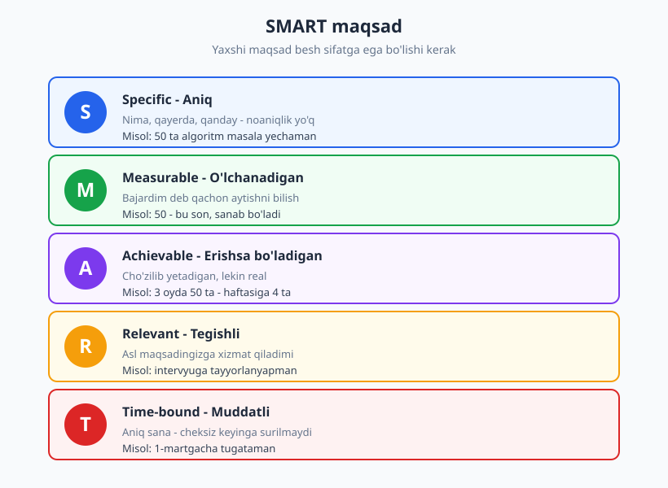
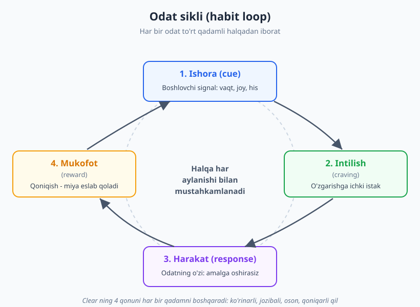
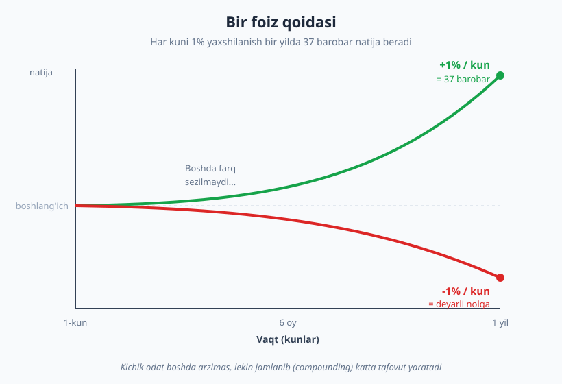

# 07 — Maqsad qo'yish va odatlar

[⬅️ Oldingi: 06 — Diqqat, chuqur ish va e'tibor](./06-diqqat-chuqur-ish.md) · [🏠 README](./README.md) · [Keyingi: 08 — Stress, burnout va muvozanat ➡️](./08-stress-burnout-muvozanat.md)

---

> **Bu bobda:** maqsad qo'yishning ikki tekshirilgan ramkasini ko'ramiz — **SMART** (George Doran) va **OKR** (Andy Grove, John Doerr ommalashtirgan) — hamda maqsadni amalga aylantiradigan mexanizmni: **atomar odatlar** (James Clear). Odat siklini (ishora, intilish, harakat, mukofot), Clearning 4 qonunini, habit stacking va 2-daqiqa qoidasini o'rganamiz. Eng muhimi: nega *tizim* va *o'ziga xoslik (identity)* aksariyat hollarda maqsadning o'zidan kuchliroq ekanini ko'ramiz.
>
> **Halollik / Eslatma:** bu yerdagi hech bir ramka sehrli emas. Odatni o'zgartirish — sekin va ba'zan zerikarli jarayon; muvaffaqiyatsizlik (bir-ikki kun o'tkazib yuborish) qoidaning bir qismi, istisno emas. Ramka yo'lni ko'rsatadi, lekin har kunlik kichik harakatni faqat siz qila olasiz.

---

## Nega maqsad yetarli emas: tizim kerak

Yangi yil arafasida deyarli har kim biror maqsad qo'yadi: "bu yil yaxshiroq dasturchi bo'laman", "ko'proq o'qiyman", "ingliz tilini ko'taraman". Fevralga borib esa ko'pchilik o'sha maqsadlarni unutadi. Muammo niyatda emas — niyat samimiy edi. Muammo shundaki, **xohish o'zi hech narsani harakatga aylantirmaydi**.

Bu yerda muhim farqni ajratish kerak: maqsad va tizim. **Maqsad** — siz erishmoqchi bo'lgan natija ("3 oyda 50 ta algoritm masala yechish"). **Tizim** — sizni o'sha natijaga olib boradigan, takrorlanadigan jarayon ("har kuni ertalab ishga kelishimdan oldin bitta masala yechaman"). Boshqacha aytsak:

> **Maqsad — yo'nalish; tizim — yo'l.** Yo'nalishni bilish kerak, lekin manzilga sizni faqat yo'l olib boradi. Karta oldida turib "men tog' cho'qqisiga chiqaman" deyaversangiz, bir qadam ham yaqinlashmaysiz.

Bu farqning amaliy oqibati katta. Maqsad — bir martalik, "ha/yo'q" holatidagi narsa: yo erishasiz, yo yo'q. Tizim esa — kunlik. G'olib jamoa va mag'lub jamoa bir xil maqsad qo'yadi ("chempion bo'lish") — ularni ajratadigan narsa maqsad emas, balki **kundalik mashq tizimi**. Dasturchilikda ham xuddi shunday: "senior bo'laman" degan maqsad sizniki ham, yoningizdagi odamniki ham bir xil bo'lishi mumkin. Sizni ajratadigan narsa — har kuni nima qilayotganingiz.

Shuning uchun bu bob ikki qismdan iborat. Avval maqsadni **to'g'ri ifodalashni** o'rganamiz (SMART, OKR) — chunki noaniq maqsad yomon tizim quradi. Keyin esa asosiy ishga — **odat tizimini qurishga** o'tamiz, bu kitobning amaliy yuragi.

---

## 1. SMART maqsad: noaniq xohishni aniq ishga aylantirish

Eng keng tarqalgan maqsad qo'yish ramkasi — **SMART**. Bu nom 1981-yilda menejment maslahatchisi **George T. Doran** chiqargan maqolada ("There's a S.M.A.R.T. way to write management's goals and objectives") ommalashgan. SMART — beshta sifatning bosh harflari; yaxshi maqsad shu beshtasiga javob berishi kerak.

| Harf | Ma'no | Savol |
|---|---|---|
| **S** — Specific | Aniq | Aynan nima? Qayerda? Qanday? |
| **M** — Measurable | O'lchanadigan | Bajardim deb qachon aytaman? |
| **A** — Achievable | Erishsa bo'ladigan | Bu real, lekin cho'zilarlimi? |
| **R** — Relevant | Tegishli | Bu asl maqsadimga xizmat qiladimi? |
| **T** — Time-bound | Muddatli | Qachongacha? |

Bu ramkani his qilish uchun eng yaxshi yo'l — yomon maqsadni yaxshisiga aylantirib ko'rish.

❌ **Yomon maqsad:** "Yaxshiroq dasturchi bo'laman."

Bu — xohish, maqsad emas. U *aniq emas* (qaysi jihatda yaxshiroq?), *o'lchanmaydi* (qachon "yaxshiroq" bo'lasiz?), *muddatsiz* (qachon?). Bunday maqsadni hech qachon "bajardim" deb yopa olmaysiz, chunki bajarilganini bilishning yo'li yo'q. Natijada u abadiy osilib qoladi va asta-sekin aybdorlik hissiga aylanadi.

✅ **SMART maqsad:** "Texnik intervyuga tayyorlanish uchun 3 oyda 50 ta algoritm masala yechaman — haftasiga kamida 4 ta, 1-martgacha."

Endi har bir sifat bor:

- **Aniq:** algoritm masalalari, soni belgilangan.
- **O'lchanadigan:** 50 — bu son, har hafta nechtasini yechganingizni sanab borasiz.
- **Erishsa bo'ladigan:** haftasiga 4 ta — band odam uchun ham real, lekin biroz cho'zilish talab qiladi.
- **Tegishli:** intervyuga tayyorlanyapsiz — bu maqsad o'sha katta niyatga xizmat qiladi.
- **Muddatli:** 1-martgacha — aniq sana, cheksiz keyinga surilmaydi.

Yana bir nechta dasturchi misoli, yomondan yaxshiga:

| ❌ Noaniq | ✅ SMART |
|---|---|
| "Test yozishni o'rganaman" | "Iyun oxirigacha o'z pet-loyihamning asosiy modulini 80% test bilan qoplayman" |
| "Ko'proq ochiq kod (open source) qilaman" | "3 oy ichida bitta ochiq loyihaga 5 ta qabul qilingan PR (pull request) yuboraman" |
| "Frontend yaxshilayman" | "Avgustgacha React bilan 3 ta real loyiha qilaman va portfolioga qo'shaman" |

> **Diqqat:** SMART — kuchli, lekin u hammasini hal qilmaydi. Uning kuchi — *aniqlik*. Uning cheklovi — bu odatni qurish mexanizmi emas, balki faqat manzilni aniq belgilash usuli. Aniq maqsad qo'yib, keyin tizim qurmasangiz — baribir yetib bormaysiz. Aynan shu sabab bu bobning yarmidan ko'pi odatlarga bag'ishlangan.

---

## 2. OKR: ambitsiyali maqsad va o'lchanadigan natijalar

SMART — bitta maqsadni aniq ifodalashga yaxshi. Lekin katta, ilhomlantiruvchi yo'nalishni bir nechta o'lchanadigan qadamga bog'lash uchun yana bir ramka mashhur — **OKR** (Objectives and Key Results — Maqsadlar va Kalit Natijalar).

OKR ni 1970-yillarda Intel kompaniyasida **Andy Grove** yaratgan. Keyinroq Intelda Grove qo'lida ishlagan investor **John Doerr** uni Google'ga olib kirdi va o'zining "Measure What Matters" (2018) kitobida keng ommalashtirdi. Bugun ko'p texnologiya kompaniyalari maqsadlarni shu ramkada qo'yadi.

OKR ikki qismdan iborat:

- **Objective (Maqsad)** — *sifatli*, ilhomlantiruvchi, ambitsiyali yo'nalish. "Qayerga bormoqchimiz?" U raqamsiz, lekin ruhlantiradigan bo'ladi.
- **Key Results (Kalit Natijalar)** — har biri *o'lchanadigan* 2–4 ta natija. "O'sha yerga yetganimizni qanday bilamiz?" Har biri songa bog'langan.

Maqsad — yurakka, kalit natijalar — boshqa, ya'ni miyaga gapiradi. Misol — junior dasturchining shaxsiy choraklik OKR'i:

> **Objective:** Jamoamda ishonchli, mustaqil ishlay oladigan dasturchiga aylanaman.
>
> **Key Results:**
> 1. Kichik-o'rta vazifalarni katta yordamsiz, o'rtacha 3 kunda yopaman (hozir ~6 kun).
> 2. Code review'da olgan izohlarim soni 40% ga kamayadi.
> 3. Jamoaning 2 ta yangi modulini hech kimdan so'ramay mustaqil tushunib chiqaman va hujjatlayman.

E'tibor bering: *Objective* sizni ruhlantiradi (uni o'qib ishlagingiz keladi), *Key Results* esa sovuq va o'lchanadigan — chorak oxirida ularni "bajardim/qisman/yo'q" deb baholay olasiz.

OKR'ning yana bir muhim jihati — **ambitsiya**. Ko'p jamoalarda kalit natijaning 100% emas, balki **~70%** bajarilishi "yaxshi" hisoblanadi. Buning mantig'i: agar har doim 100% bajarsangiz, demak maqsadlaringiz juda yumshoq — siz o'zingizni cho'zmayapsiz. Bu "cho'zilgan maqsad" (stretch goal) falsafasi.

> **Trade-off:** stretch-maqsad motivatsiya beradi, lekin ehtiyot bo'ling — agar har chorak 40% bajarsangiz, bu ruhdan tushiradi, ilhomlantirmaydi. Boshlovchi uchun maslahat: dastlab biroz konservativroq OKR qo'ying (60–80% real bajariladigan), keyin tajriba ortgach ambitsiyani oshiring. Maqsad — o'zingizni jazolash emas, yo'naltirish.

### SMART va OKR — qachon qaysi biri

Bu ikkisi raqobatchi emas, balki turli vazifaga mos. Qisqa qoida:

| | SMART | OKR |
|---|---|---|
| **Eng yaxshi qachon** | Bitta aniq, yopiq maqsad uchun | Katta yo'nalish + bir nechta o'lchov |
| **Ohang** | Aniq, quruq | Ilhomlantiruvchi + o'lchanadigan |
| **Vaqt oralig'i** | Ixtiyoriy (hafta–yil) | Odatda chorak (3 oy) |
| **Misol** | "50 masala 1-martgacha" | "Ishonchli dasturchi bo'lish" + 3 KR |

Ko'pincha ikkisini birga ishlatasiz: OKR katta yo'nalishni beradi, har bir kalit natija esa o'z ichida SMART bo'lishi mumkin.

---

## 3. Atomar odatlar: maqsadni harakatga ulaydigan mexanizm

Maqsadni aniq qo'ydingiz. Endi eng qiyin qismi — uni **har kunlik harakatga** aylantirish. Aynan shu yerda eng foydali ramka — **odat (habit)**. Bu mavzuni eng yaxshi ifodalagan kitob — **James Clear**ning "Atomic Habits" (2018) asari. "Atomar" so'zi ikki ma'noni anglatadi: kichik (atom kabi) va asos (atom — qurilish g'ishti).

Odatlarni tushunish uchun avval ularning **mexanizmini** bilish kerak. Har bir odat to'rt bosqichli halqadan iborat. Clear bu halqani shunday ataydi:

1. **Ishora (cue)** — odatni ishga tushiruvchi signal. Vaqt ("ertalab soat 8"), joy ("stolga o'tirdim"), oldingi harakat ("qahva qaynatdim"), his ("zerikdim").
2. **Intilish (craving)** — ishora keltirgan ichki istak. Aslida siz odatni emas, u keltiradigan *o'zgarish holatini* xohlaysiz (masalan, "bilimga ega bo'lish hissi", yoki "zerikishdan qutulish").
3. **Harakat (response)** — odatning o'zi: amalda bajaradigan ish (bitta masala yechish, kitob ochish).
4. **Mukofot (reward)** — harakat keltirgan qoniqish. Miya buni eslab qoladi: "bu ishora kelganda shu harakat qilsam — yaxshi bo'ladi". Shu tariqa halqa keyingi gal yana ishlaydi.

> **Eslatma — manbalarni aralashtirmang.** Odat halqasi g'oyasi Cleardan oldin ham bor edi. Jurnalist **Charles Duhigg** o'zining "The Power of Habit" (2012) kitobida halqani uch qismli — **cue → routine → reward** (ishora → odat → mukofot) deb ta'riflagan. James Clear bunga to'rtinchi bo'g'in — **craving** (intilish) ni qo'shib, to'rt qadamli model qildi va har qadam uchun amaliy qonun chiqardi. Ikkalasi ham foydali; bu yerda Clearning to'rt qadamli versiyasini ishlatamiz, lekin asl uch qadamli sxema Duhiggniki ekanini bilib qo'ying.

### Clearning 4 qonuni: odatni qurish (va buzish)

Clearning asosiy hissasi — har bir bosqichni boshqaradigan amaliy qoida berishi. Yaxshi odatni **qurish** uchun:

| Bosqich | Qonun | Amaliy ma'no |
|---|---|---|
| Ishora | **Ko'rinarli qil** | Signalni ko'zga tashlanadigan qiling |
| Intilish | **Jozibali qil** | Odatni yoqimli narsa bilan bog'lang |
| Harakat | **Oson qil** | Boshlash uchun ishqalanish (friction) ni kamaytiring |
| Mukofot | **Qoniqarli qil** | Darhol kichik mukofot bering, jarayonni belgilang |

Dasturchi misollari bilan:

- **Ko'rinarli:** ertalab algoritm masalasi yechmoqchimisiz? Kechqurun brauzeringizda masala sahifasini ochiq qoldiring — ertalab kompyuterni ochsangiz, u o'zi ko'rinadi. Ishora ko'z oldingizda.
- **Jozibali:** yoqtirmagan ish (test yozish) ni yoqtirgan narsa bilan bog'lang — "faqat sevimli qahvamni ichib turib test yozaman". Buni Clear "temptation bundling" (vasvasani bog'lash) deydi.
- **Oson:** muhitni shunday tayyorlangki, boshlash uchun deyarli hech narsa kerak bo'lmasin. IDE ochiq, kerakli fayl ko'rinib turibdi, kontekst eslatmasi yozilgan. Har bir ortiqcha qadam — boshlamaslik uchun bahona.
- **Qoniqarli:** har masalani yechganda taqvimda belgi qo'ying, yoki kichik ro'yxatdan o'chiring. Bu kichik "bajardim" hissi — miyaga mukofot.

Yomon odatni **buzish** uchun qonunlar teskari: ishorani **ko'rinmas**, intilishni **jozibasiz**, harakatni **qiyin**, mukofotni **qoniqarsiz** qiling. Masalan, ish vaqtida ijtimoiy tarmoqqa kirib ketasizmi? Telefonni boshqa xonaga qo'ying (ishora ko'rinmas), ilovani o'chiring (harakat qiyin) — [6-bobda](./06-diqqat-chuqur-ish.md) ko'rganimizdek, irodaga emas, muhitga tayaning.

### Habit stacking: mavjud odatga ulash

Yangi odatni noldan qurish qiyin, chunki unga ishora topish kerak. Eng oson yo'l — uni **allaqachon mavjud** bir odatga ulash. Clear buni **habit stacking** (odatni taxlash) deydi, formula oddiy:

> **[Hozirgi odatim]dan keyin, men [yangi odatni] qilaman.**

Misollar:

- "Ertalab ishga o'tirib **birinchi qahvamni ochganimdan keyin**, bitta algoritm masalasini o'qib chiqaman."
- "Tushlikdan **qaytib stolga o'tirganimdan keyin**, kunlik o'rganish maqsadimni daftarga yozaman."
- "Kunni yopib kompyuterni **o'chirishdan oldin**, bugun nima o'rganganimni bir jumlada yozaman."

Bu ishlaydi, chunki mavjud odat tayyor **ishora** beradi — yangi odatga signalni qayerdan topishni o'ylab o'tirmaysiz.

### 2-daqiqa qoidasi: boshlashni juda osonlashtirish

Eng katta to'siq — boshlash. "Bugun 1 soat o'qiyman" degan reja qo'rqitadi, shuning uchun keyinga surasiz. Clearning yechimi — **2-daqiqa qoidasi**: yangi odatni shunchalik kichik qiling-ki, u 2 daqiqadan ko'p vaqt olmasin.

- "Har kuni 1 soat algoritm o'qiyman" emas → "Har kuni **bitta masalani ochib, shartini o'qiyman**."
- "Har kuni kitob o'qiyman" emas → "Har kuni **bitta sahifa o'qiyman**."

Maqsad — boshlash chegarasini deyarli nolga tushirish. Sir shundaki, odam ko'pincha boshlagandan keyin davom etadi — masalani o'qib bo'lib, "mayli, bittasini yechaman" deydi. Lekin bu shart emas: agar faqat 2 daqiqalik qismni qilsangiz ham — odat *yoqilgan* bo'ladi. Avval **odatni o'rnatasiz**, keyin uni **kattalashtirasiz**. Kichik, lekin har kuni qilinadigan ish — katta, lekin hech qachon boshlanmaydigan ishdan tubdan kuchli.

> **Diqqat:** 2-daqiqa qoidasi hiyla emas — bu strategiya. Maqsad "kuniga 2 daqiqa o'qish" emas. Maqsad — *paydo bo'lish odatini* (showing up) mustahkamlash. Avval har kuni paydo bo'lishni o'rganasiz; davomiylikni keyin oshirish oson.

---

## 4. Tizim maqsaddan ustun: o'ziga xoslik (identity) odatlari

Endi bobning eng chuqur g'oyasiga keldik. Clearning eng kuchli da'vosi shu: barqaror o'zgarish maqsadni o'zgartirishdan emas, balki **o'zingiz haqingizdagi tasavvurni (identity)** o'zgartirishdan keladi.

Bizning ko'p maqsadlarimiz *natijaga* qaratilgan: "men dasturlashni o'rganmoqchiman". Bu maqsadli yondashuv. Lekin u zaif, chunki maqsadga yetganingizda (yoki yetolmaganingizda) motivatsiya yo'qoladi. Kuchliroq yondashuv — **o'ziga xoslikka asoslangan odat** (identity-based habit): siz qanday *natija* xohlashingizdan emas, qanday *odam* bo'lishni xohlashingizdan boshlaysiz.

| Yondashuv | Gap | Xususiyat |
|---|---|---|
| ❌ Natija-asosli | "Men dasturlashni **o'rganmoqchiman**." | Maqsadga bog'liq, vaqtinchalik |
| ✅ Identity-asosli | "Men **har kuni kod yozadigan odamman**." | Kimligingizga bog'liq, barqaror |

Farq nozik, lekin amalda katta. Agar siz o'zingizni "har kuni kod yozadigan odam" deb bilsangiz, har kungi kod yozish — sizni isbotlaydigan harakat. Bir kun o'tkazib yuborsangiz, "bu men emas" degan ichki nomuvofiqlik paydo bo'ladi va sizni qaytaradi. Bu o'z-o'zini quvvatlovchi halqa: **har harakat o'sha tasavvur uchun "ovoz" beradi.**

Clearning so'zi bilan: "Har bir harakat — siz bo'lmoqchi bo'lgan odam turi uchun tashlangan ovoz." Bir necha ovoz hech narsa o'zgartirmaydi. Lekin minglab ovoz — "men shunday odamman" degan ishonchni quradi. Va bir marta o'sha ishonch o'rnashsa, odat tabiiy bo'ladi — endi siz o'zingizni majburlamaysiz, shunchaki o'zingizday yashaysiz.

### 1% yaxshilanish: jamlanma kuchi

Identity nega muhim ekanini tushuntiruvchi ikkinchi g'oya — **jamlanish (compounding)**. Clear "har kuni 1% yaxshilanish" haqida gapiradi. Bitta kunlik 1% — sezilmas. Lekin 1% har kuni jamlanib borsa, matematik jihatdan bir yilda taxminan **37 barobar** natija beradi (1.01 ning 365-darajasi ~37.8). Aksincha, har kuni 1% *yomonlashuv* sizni deyarli nolga olib keladi.

Diagrammaning yashil chizig'i — har kuni kichik yaxshilanish: boshda boshlang'ich chiziqdan deyarli farq qilmaydi, lekin oxiriga borib keskin yuqoriga ko'tariladi. Qizil chiziq — har kuni kichik yomonlashuv: u ham boshda sezilmaydi, lekin asta pastga tushadi. Eng muhim saboq aynan **boshidagi tekis qism**da: bu yerda farq ko'rinmaydi, shuning uchun ko'pchilik aynan shu davrda taslim bo'ladi — "men 3 hafta o'rgandim, lekin hech narsa o'zgargani yo'q". Aslida o'zgarish yig'ilmoqda, faqat hali ko'rinmaydi. Clear buni "kutilishlar vodisi" (valley of disappointment) deydi: natija kech keladi, lekin keladi — agar siz o'sha tekis qismda to'xtamasangiz.

> **Eslatma:** "1% har kuni 37 barobar" — adabiy, ilhomlantiruvchi matematika, aniq biologik qonun emas. Real hayotda har kun bir xil 1% o'smaysiz, ba'zi kunlar orqaga ketasiz. Lekin asosiy g'oya to'g'ri va kuchli: **kichik, izchil harakat vaqt bilan jamlanib, kutilmagan katta natija beradi** — va aksincha, kichik beparvolik ham jamlanadi.

---

## 5. Amaliy: bitta odatni yo'lga qo'yish tizimi

Endi hammasini bitta ishlaydigan rejaga yig'amiz. Maqsad — *bitta* yangi odatni mustahkam o'rnatish (hammasini birdan emas).

### 1-qadam: identity va eng kichik harakatni belgilang

Avval **kim** bo'lmoqchisiz? "Men muntazam o'rganadigan dasturchiman." Keyin shu identityni isbotlaydigan **eng kichik** harakatni tanlang (2-daqiqa qoidasi): "har kuni bitta masala shartini o'qiyman". Natija emas — paydo bo'lishni maqsad qiling.

### 2-qadam: ishorani habit stacking bilan bog'lang

Yangi odatga tayyor ishora bering: "Ertalab **birinchi qahvamni qaynatib bo'lganimdan keyin**, masala sahifasini ochaman." Ishorani **ko'rinarli** qiling — sahifani oldindan ochiq qoldiring.

### 3-qadam: harakatni oson, mukofotni qoniqarli qiling

Boshlash ishqalanishini kamaytiring (IDE ochiq, fayl tayyor). Tugatganda darhol kichik mukofot bering — taqvimga belgi, ro'yxatdan o'chirish, qisqa qoniqish.

### Odat trekeri: ko'rinishni oshirish

Eng oddiy va kuchli vosita — **odat trekeri** (habit tracker): taqvim yoki jadval, har bajargan kuningizda belgi qo'yasiz. U ikki ish qiladi: (1) jarayonni **ko'rinadigan** qiladi — siz "zanjir" yasayapsiz va uni uzgingiz kelmaydi (mashhur "don't break the chain" g'oyasi); (2) har belgi — kichik **mukofot**. Boshlang'ich uchun bitta odat uchun bitta trekerdan boshlang — bir vaqtda 5 ta odat kuzatish ko'pchilikni cho'ktiradi.

### Muvaffaqiyatsizlikdan keyin qaytish: eng muhim ko'nikma

Bu — butun bobning eng amaliy maslahati. Hech kim odatni mukammal bajarmaydi: kasal bo'lasiz, band bo'lasiz, shunchaki unutasiz. **Bir kun o'tkazib yuborish — muammo emas. Ikki kun ketma-ket o'tkazib yuborish — yangi (yomon) odatning boshlanishi.** Clearning qoidasi oddiy va kechirimli:

> **"Hech qachon ikki marta ketma-ket o'tkazib yubormang."**

Bitta kun o'tkazib yuborsangiz — o'zingizni jazolamang, aybdorlikka botmang ("hammasi buzildi, endi keyingi haftadan boshlayman" — bu eng katta tuzoq). Ertasi kuni shunchaki qaytib keling, hatto eng kichik versiyada (yana 2-daqiqa qoidasi). Odatni *o'tkazib yuborish* zarar qilmaydi; uni *tashlab yuborish* zarar qiladi. Mukammallikni emas, **izchillikni** maqsad qiling — 90% kun bajarilgan odat, 3 hafta mukammal qilib keyin butunlay tashlangan odatdan ming marta kuchli.

Bularning hammasi katta tizimning bir qismi: vaqtni qanday ajratishni [5-bobda](./05-vaqtni-boshqarish.md), diqqatni qanday himoya qilishni [6-bobda](./06-diqqat-chuqur-ish.md) ko'rdik; charchoq va burnout chegarasini — odatlar sog'lom bo'lib qolishi uchun — [8-bobda](./08-stress-burnout-muvozanat.md) ko'ramiz.

---

## Asosiy g'oyalar (bobni qisqacha)

- **Maqsad — yo'nalish, tizim — yo'l.** Xohish hech narsani harakatga aylantirmaydi; sizni natijaga olib boradigan narsa — kunlik, takrorlanadigan **tizim**, maqsadning o'zi emas.
- **SMART (Doran, 1981)** noaniq xohishni aniq maqsadga aylantiradi: **Aniq, O'lchanadigan, Erishsa bo'ladigan, Tegishli, Muddatli**. "Yaxshiroq dasturchi bo'laman" emas — "3 oyda 50 masala, 1-martgacha".
- **OKR (Grove; Doerr ommalashtirgan)** — ilhomlantiruvchi **Objective** + 2–4 o'lchanadigan **Key Results**. Ko'pincha ~70% bajarilishi yaxshi (cho'zilgan maqsad).
- **Odat sikli** to'rt bosqich: **ishora → intilish → harakat → mukofot** (Clear). Asl uch qismli cue/routine/reward sxemasi **Duhigg**niki — ikkisini aralashtirmang.
- **Clearning 4 qonuni:** odatni qurish uchun ishorani **ko'rinarli**, intilishni **jozibali**, harakatni **oson**, mukofotni **qoniqarli** qiling. **Habit stacking** va **2-daqiqa qoidasi** boshlashni osonlashtiradi.
- **Identity > maqsad:** "o'rganmoqchiman" emas, "men har kuni kod yozadigan odamman". Har harakat shu tasavvur uchun **ovoz** beradi; **1% jamlanish** boshda sezilmaydi, lekin keyin keskin ajraladi.
- **Izchillik > mukammallik.** Hech qachon **ikki marta ketma-ket** o'tkazib yubormang. Bir kun o'tkazib yuborish normal; uni tashlab yuborish — emas.

## Mashqlar

### Oson

**1-mashq.** Hozir boshingizda turgan biror noaniq maqsadni oling ("frontend o'rganaman", "ko'proq o'qiyman" kabi) va uni to'liq **SMART** maqsadga aylantiring. Beshala sifatni (S, M, A, R, T) bittadan tekshirib, har biri bor ekaniga ishonch hosil qiling.

**2-mashq.** O'zingizning bironta mavjud yaxshi yoki yomon odatingizni oling (masalan, "ishga o'tirgach darhol ijtimoiy tarmoqni ochaman") va uni odat sikliga ajrating: **ishora** nima? **intilish** nima? **harakat** nima? **mukofot** nima? To'rttasini yozing.

### O'rta

**3-mashq.** O'zingizga bitta choraklik **OKR** yozing: bitta ilhomlantiruvchi **Objective** (raqamsiz) va unga 3 ta o'lchanadigan **Key Result** (har biri songa bog'langan). Keyin tekshiring: kalit natijalarni chorak oxirida "bajardim/qisman/yo'q" deb baholay olasizmi?

**4-mashq.** Bitta yangi dev-odatni (masalan, "har kuni bitta masala yechish" yoki "har kuni 20 daqiqa hujjat o'qish") to'liq loyihalang: **habit stacking** formulasi bilan ishorani bog'lang ("[mavjud odat]dan keyin..."), **2-daqiqa** versiyasini yozing, va uni **oson** hamda **qoniqarli** qilish uchun bittadan konkret choralar yozing.

### Qiyin

**5-mashq.** Bo'lmoqchi bo'lgan dasturchi turingizni o'ylang va uni **identity gapi** sifatida yozing: "Men ... odamman". Keyin shu identityni isbotlaydigan 3 ta kichik, kunlik harakatni sanang. Endi teskarisini qiling: hozirgi bironta odatingiz qaysi *boshqa* identityni quvvatlayotganini toping ("har xabarga darhol javob beradigan odam" kabi) — va u sizni xohlagan tomonga olib boryaptimi?

**6-mashq.** O'tmishda boshlab keyin tashlab yuborgan bitta odatni eslang (sport, til, o'qish — har qanday). Bu bobdagi ramkalar bilan tahlil qiling: u **identity**ga bog'liq edimi yoki faqat natijaga? **Ishora** aniq edimi? Boshlash **oson** edimi? Va eng muhimi — qaysi nuqtada tashladingiz: bir-ikki kun o'tkazib yuborgandan keyin "buzildi" deb butunlay tashladingizmi? Endi xuddi shu odatni shu bob qoidalari bilan qayta loyihalang.

Yechimlar / Namunaviy yondashuvlar

### 1-mashq yechimi
"To'g'ri javob" yo'q, lekin natija beshala sifatni o'tishi kerak. Namuna: "ko'proq o'qiyman" → "Iyul oxirigacha 'Clean Code' kitobini o'qib tugataman — haftasiga 2 bobdan, har yakshanba". Tekshiring: Aniq (aynan shu kitob), O'lchanadigan (boblar soni), Erishsa bo'ladigan (haftasiga 2 — band odam uchun ham real), Tegishli (kod sifatini ko'taraman), Muddatli (iyul oxiri). Eng ko'p unutiladigan sifat — odatda **Measurable** va **Time-bound**: "yaxshilayman" degan so'z ko'rinsa, demak hali SMART emas.

### 2-mashq yechimi
Namuna ("ishga o'tirgach ijtimoiy tarmoq"): **ishora** — stolga o'tirib kompyuterni ochish (joy + harakat); **intilish** — ishga kirishish noqulayligidan qochish, yangilik ko'rish hissi; **harakat** — brauzerda tarmoqni ochish; **mukofot** — qisqa zavq, ishni kechiktirish yengilligi. Foydali kuzatish: yomon odatni buzish uchun siklning bitta bo'g'inini sindirish yetarli — bu yerda **ishorani** ko'rinmas qilish (telefon narida, tarmoq sahifasi yopiq, hatto ilova bloklangan) eng oson nuqta. Aksariyat yomon odat — qiyinlikdan qochish; intilishni tan olishning o'zi ("men hozir noqulaylikdan qochyapman") chastotani kamaytiradi.

### 3-mashq yechimi
Namuna — **Objective:** "Jamoamga real qiymat qo'shadigan, ishonchli dasturchiga aylanaman." **Key Results:** (1) chorak davomida 8 ta vazifani belgilangan muddatda yopaman; (2) code review izohlarim soni 30% kamayadi; (3) 2 ta yangi modulni mustaqil tushunib hujjatlayman. Tekshiruv: har KR raqamga bog'langanmi? "Yaxshi dasturchi bo'laman" — bu Objective bo'la oladi, lekin KR bo'lolmaydi (o'lchab bo'lmaydi). Agar KR ni "bajardim/qisman/yo'q" deb baholay olmasangiz — u hali yetarlicha aniq emas. Boshlovchi uchun maslahat: KR ni juda baland qo'ymang — 100% imkonsiz bo'lsa ruhdan tushasiz; 60–80% real bajariladigan darajadan boshlang.

### 4-mashq yechimi
Namuna ("har kuni bitta masala yechish"): **Habit stacking** — "Ertalab birinchi qahvamni qaynatib bo'lganimdan keyin, masala sahifasini ochaman." **2-daqiqa versiyasi** — "faqat bitta masala shartini o'qib chiqaman" (yechish shart emas — odat yoqiladi). **Oson qilish** — kechqurun sahifani ochiq qoldiraman, IDE'da bo'sh fayl tayyor turadi. **Qoniqarli qilish** — yechganimda taqvimga belgi qo'yaman va haftalik zanjirni ko'raman. Muhim nuqta: ko'pchilik odatni **juda katta** boshlaydi ("kuniga 1 soat") va tashlab yuboradi — 2-daqiqa versiyasi aynan shu xatoning oldini oladi.

### 5-mashq yechimi
Namuna — identity gapi: "Men har kuni, oz bo'lsa ham, biror narsa o'rganadigan dasturchiman." Quvvatlovchi harakatlar: (1) har kuni bitta masala/maqola o'qiyman; (2) o'rganganimni bir jumlada yozib qo'yaman; (3) haftada bir marta kimgadir o'rganganimni tushuntiraman. Teskari tahlil ko'pincha ko'zni ochadi: "har xabarga 30 soniyada javob beradigan odam" degan identity sizni "ishonchli" his qildiradi, lekin aslida chuqur ishni buzadigan odamga aylantiradi ([6-bob](./06-diqqat-chuqur-ish.md)). Saboq: odatlaringiz qaysi identityni quryaptimi — o'sha *aslida* siz xohlagan odammi? Agar yo'q bo'lsa, identityni ongli tanlang va kichik harakatlardan qaytadan quring.

### 6-mashq yechimi
Eng tez-tez uchraydigan naqsh: odat **natijaga** bog'langan edi ("6 oyda ozaman", "tez orada ravon gapiraman") — identityga emas — shuning uchun natija kech kelganda ("kutilishlar vodisi"da) motivatsiya tugadi. Ko'pincha **ishora ham noaniq** edi (qachon, qayerda qilishni belgilamagansiz) va boshlash **qiyin** edi (har gal "kayfiyat" kutgansiz). Va deyarli har doim tashlash bir-ikki kun o'tkazib yuborgandan keyin "endi hammasi buzildi" degan o'y bilan boshlangan. Qayta loyihalash: identitydan boshlang ("men o'rganadigan odamman"), 2-daqiqa versiyasini oling, mavjud odatga ulang, trekerda zanjir yasang va eng muhimi — bir kun o'tkazib yuborsangiz ertasi kuni **albatta** qayting (hech qachon ikki marta ketma-ket emas). Mukammallik emas, qaytish ko'nikmasi odatni saqlaydi.

---

[⬅️ Oldingi: 06 — Diqqat, chuqur ish va e'tibor](./06-diqqat-chuqur-ish.md) · [🏠 README](./README.md) · [Keyingi: 08 — Stress, burnout va muvozanat ➡️](./08-stress-burnout-muvozanat.md)
