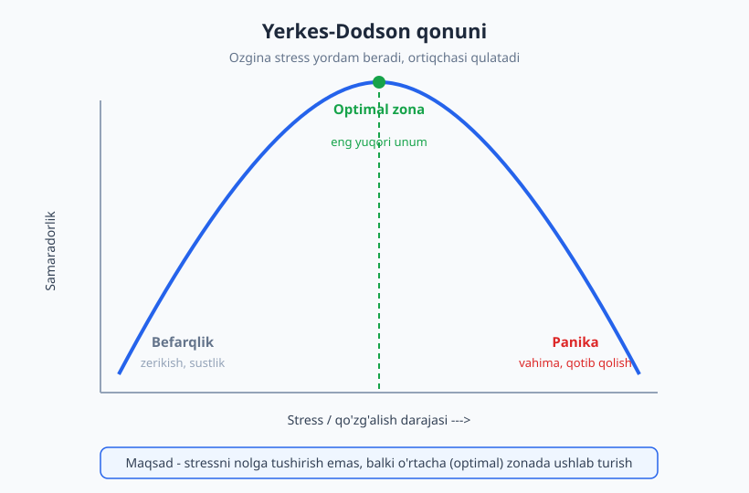
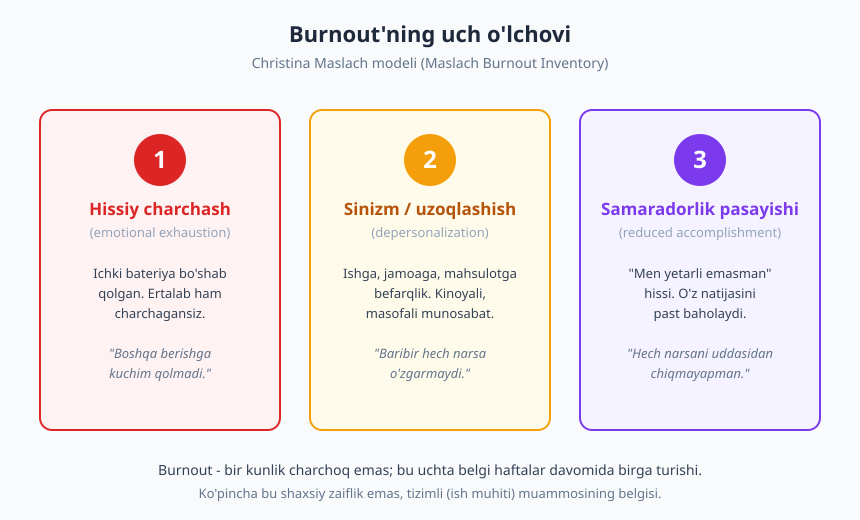
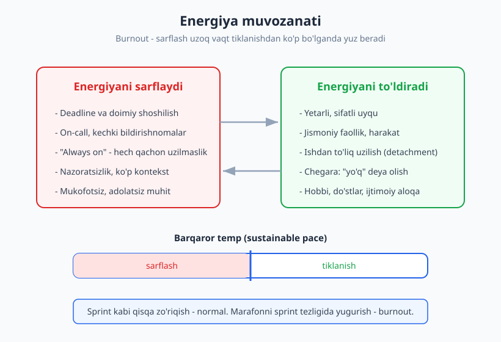

# 08 — Stress, burnout va muvozanat

[⬅️ Oldingi: 07 — Maqsad qo'yish va odatlar](./07-maqsad-odatlar.md) · [🏠 README](./README.md) · [Keyingi: 09 — Texnik muloqot asoslari ➡️](./09-texnik-muloqot-asoslari.md)

---

> **Bu bobda:** stress har doim dushman emasligini — Yerkes-Dodson qonuni orqali — ko'ramiz, so'ng surunkali stress qanday qilib **burnout**ga (charchab-bo'shab qolish) aylanishini Christina Maslach modeli bilan tushunamiz. Burnout belgilari, sabablari, tiklanish yo'llari va ish-hayot chegarasini qurish — dasturchining eng nozik, ammo eng muhim ko'nikmasini quramiz.

> **Halollik / Eslatma:** bu mavzu jiddiy. Bu yerda berilgan ramkalar o'zingizni tushunish va erta belgilarni ko'rish uchun xarita beradi — lekin **tibbiy maslahat emas**. Agar charchash uzoq davom etsa, uyqu yoki kayfiyatga jiddiy ta'sir qilsa, yoki o'zingizni xavfli his qilsangiz — bu zaiflik emas, mutaxassisga (shifokor, psixolog) murojaat qilish kuchli va to'g'ri qadam.

---

## Stress yomonmi? Yerkes-Dodson qonuni

Birinchi savol — odatda noto'g'ri qo'yiladi. Ko'pchilik "stressni qanday yo'q qilaman?" deb so'raydi. To'g'ri savol esa: "stressni qanday **optimal** darajada ushlab turaman?"

Demo'gacha bir kun qolgan. Yuragingiz tezroq uradi, diqqatingiz keskinlashadi, ortiqcha narsalar miyangizdan o'chadi, vaqt tezroq oqayotganday tuyuladi. Bu — stress. Va aynan shu holatda siz, ehtimol, oddiy kunga qaraganda ko'proq va aniqroq ishni bitirasiz. Stress bu yerda **dushman emas, yoqilg'i**.

Endi boshqa manzara: production'da jiddiy buzilish, mijoz qo'ng'iroq qilmoqda, lead yozyapti, bir vaqtning o'zida uchta odam sizdan javob kutyapti, hech narsa ishlamayapti. Endi qo'llaringiz titraydi, oddiy `for` siklini ham buzasiz, eng aniq narsani ham o'qiy olmaysiz. Bu ham stress — lekin endi u **falaj qiladi**.

Ikkalasi ham stress. Farq — darajada.

### Teskari U egri chizig'i

1908-yilda ikki psixolog — **Robert Yerkes** va **John Dodson** — sichqonlar ustida o'tkazgan tajribalarida qiziq naqshni topishdi. Ularning topilmasi keyinchalik **Yerkes-Dodson qonuni** deb nomlandi va bugun u **teskari U egri chizig'i** (inverted-U) shaklida tasvirlanadi: qo'zg'alish (stress) past bo'lsa — samaradorlik past, qo'zg'alish o'rtacha bo'lsa — samaradorlik eng yuqori, qo'zg'alish o'ta yuqori bo'lsa — samaradorlik yana qulaydi.

Egrining uchta zonasi bor:

- **Chap tomon — befarqlik zonasi.** Stress juda kam. Hech qanday muddat yo'q, hech kim natija kutmayapti, ish zerikarli. Bu yerda odam sustlashadi, e'tibor tarqaladi, kichik ish ham cho'zilib ketadi. Stressning yo'qligi ham unumdorlikning dushmani.
- **Tepa — optimal zona.** O'rtacha, boshqariladigan stress. Aniq maqsad, mantiqiy muddat, o'zingizga mos qiyinlik. Bu yerda siz "oqim"ga (flow) eng oson kirasiz — bu holat haqida [6-bobda](./06-diqqat-chuqur-ish.md) gaplashgan edik.
- **O'ng tomon — panika zonasi.** Stress haddan oshgan. Fikr tezligi pasayadi, xato ko'payadi, ba'zan "qotib qolish" yuz beradi — ko'p ishingiz bor, lekin hech qaysiniga qo'l ura olmaysiz.

> **Eslatma:** egrining cho'qqisi har kim uchun bir xil joyda emas, va vazifaga ham bog'liq. Murakkab, yangi masala uchun optimal stress darajasi **pastroq** — ya'ni murakkab kodga o'tirganda atrofdagi bosimni ataylab kamaytirish kerak. Oddiy, mexanik ishni esa biroz ko'proq tig'izlik bilan ham bajarasiz.

### "Yaxshi stress" va surunkali stress

Bu yerda muhim ajratish bor:

- **Eustress (foydali stress)** — qisqa muddatli, aniq sababga ega, va tugaydigan stress. Demo, deadline, intervyu, qiziqarli yangi loyiha. U sizni harakatga keltiradi, keyin esa **bosim pasayadi va tana tiklanadi**.
- **Surunkali stress (chronic stress)** — uzoq cho'zilgan, tinmaydigan, "qachon tugaydi?" degan savolga javobi yo'q stress. Har kuni deadline. Har hafta yong'in o'chirish. Hech qachon to'liq nafas olmaslik.

Tana qisqa stressga yaratilgan: zo'riq, harakat qil, keyin bo'shashib tiklan. Muammo — surunkali stress bu siklning "tiklan" qismini o'chirib qo'yadi. Aynan o'sha to'xtovsiz, tiklanishsiz bosim asta-sekin keyingi bo'limning mavzusiga — **burnout**ga olib keladi.

---

## Burnout nima

Stress va burnout ko'pincha bir narsa deb o'ylanadi. Aslida ular qarama-qarshi qutblar.

> **Stress** — bu **ortiqcha**lik holati. Juda ko'p narsa, juda kam vaqt. Sizda hamon energiya bor, lekin u toshib ketyapti. Stressli odam "agar shu zo'riqish to'xtasa, hammasi yaxshi bo'ladi" deb o'ylaydi.
>
> **Burnout** — bu **bo'shab qolish** holati. Endi toshib ketadigan narsa yo'q. Bateriya o'chgan. Burnout'dagi odam "endi nima ham o'zgaradi" deb o'ylaydi.

Stress odatda bosimni kamaytirish bilan yengiladi. Burnout esa shunchaki "biroz dam olish" bilan tuzalmaydi — chunki u uzoq davom etgan jarayonning oxirgi nuqtasidir.

### Maslach modeli: uchta o'lchov

Burnoutni ilmiy o'rganishning kashshofi — ijtimoiy psixolog **Christina Maslach** (1970-yillardan boshlab). U va hamkasblari **Maslach Burnout Inventory (MBI)** nomli o'lchov vositasini ishlab chiqishdi — bu bugun burnoutni baholashda eng keng qo'llaniladigan asboblardan biri. Maslach burnoutni uchta o'lchov orqali ta'riflaydi:

1. **Hissiy charchash (emotional exhaustion)** — ichki resurs tugagan his. Faqat jismoniy charchoq emas; odam o'zini "boshqalarga, ishga berishga kuchim qolmadi" deb his qiladi. Ertalab uyg'onganda ham allaqachon charchagan.
2. **Sinizm / uzoqlashish (depersonalization, cynicism)** — ishga, jamoaga, mahsulotga sovuq, masofali, kinoyali munosabat. Ilgari ahamiyat bergan narsalar endi "baribir" tuyuladi. Bu — psixika o'zini himoya qilish uchun hissiy aloqani uzishi.
3. **Samaradorlik hissi pasayishi (reduced personal accomplishment)** — "men yetarli emasman", "hech narsani uddasidan chiqmayapman" hissi. Odam o'z natijasini real bo'lganidan past baholaydi, har bir kichik xatoni o'ziga isbot qilib oladi.

Bu uchtasi birga, uzoq vaqt davom etsa — bu burnout. Bitta yomon hafta yoki charchagan kun emas.

### Nega aynan dasturchida tez-tez

Dasturchilik kasbida burnoutga olib boradigan omillar ayniqsa zich:

- **Tinimsiz deadline.** Sprint ketma-ket keladi; bittasi tugaganda ikkinchisi boshlanadi, "yetib oldik" hissi kam.
- **On-call va kechki uzilishlar.** Tunda telefon jiringlashi mumkinligini bilish — bu o'zi doimiy fonli stress, hatto jiringlamasa ham.
- **Doimiy yangi texnologiya.** "Orqada qolyapman" hissi (bu his [2-bobdagi](./02-osish-mentaliteti.md) imposter sindromi bilan chambarchas). Har yili yangi freymvork, yangi vosita.
- **"Always on" madaniyati.** Slack har doim ochiq, xabar har soatda kelishi mumkin, ish ofisda tugamaydi — telefoningizda davom etadi.
- **Ko'rinmas ish.** Soatlab debug qilgan bug' tashqaridan "bir qator o'zgartirish" bo'lib ko'rinadi; mehnat tan olinmaganday tuyuladi.

Bu omillar yo'qolmaydi — lekin ularni tanib olish, ataylab chegaralash mumkin. Shu bobning qolgan qismi aynan shu haqida.

---

## Burnout sabablari va belgilari

Bu yerda eng muhim — va eng ko'p yanglishadigan — nuqta:

> **Burnout shaxsiy zaiflik emas.** "Men shunchaki bardoshli emasman" degan xulosa ko'pincha noto'g'ri va zararli. Maslach tadqiqotlari aniq ko'rsatadiki, burnout ko'p hollarda **shaxs xususiyati emas, ish muhitining** xususiyati — ya'ni tizimli muammoning belgisi.

Bu — **halol reframing** (qayta ramkalash). O'zini ayblash o'rniga, sababga real qarash.

### Olti tizimli sabab

Maslach ish muhitining olti sohasi insonga mos kelmaganda burnout xavfi oshishini ta'kidlaydi. Dasturchi kontekstida:

| Soha | Mos bo'lmaganda | Dasturchi misoli |
|---|---|---|
| **Ish yuki** | Talab resursdan doim ortiq | Har sprint "stretch goal", hech qachon yetishmaslik |
| **Nazorat** | Qaror qilish huquqi yo'q | "Qanday qilish"ni boshqa hal qiladi, siz faqat ijrochisiz |
| **Mukofot** | Mehnat tan olinmaydi | Kechalab tuzatilgan bug' uchun hech kim rahmat aytmaydi |
| **Jamoa** | Yolg'izlik, ishonchsizlik | Yordam so'rash xavfli his qilinadi (psixologik xavfsizlik yo'q) |
| **Adolat** | Adolatsiz munosabat | Bir xil ish, har xil tan olinish; favoritizm |
| **Qadriyat** | Ziddiyat | "To'g'ri emas" deb bilgan narsani qilishga majburlik |

Diqqat qiling — bu sohalarning aksariyati **shaxsdan tashqarida**. Shuning uchun ularning ba'zilarini yolg'iz o'zingiz to'liq hal qila olmaysiz; ba'zilari lead yoki tashkilot darajasidagi suhbatni talab qiladi (bu haqda keyingi jamoa va muloqot boblarida).

### Erta belgilar

Burnout bir kechada kelmaydi — sekin, sezilmay o'rmalaydi. Aynan shuning uchun erta belgilarni bilish muhim. O'zingizda quyidagilarni payqasangiz, bu signal:

- ✅ **Normal:** og'ir haftadan keyin charchash, dam olishdan keyin tiklanish.
- ❌ **Signal:** dam olish kunidan keyin ham charchoq ketmasligi; "yana dushanba" qo'rquvi (Sunday dread); ilgari yoqqan ishga befarqlik; arzimagan narsadan jahl chiqishi; uyqu buzilishi; "men befoyda" degan tinimsiz fikr; oddiy vazifa ham toqqa o'xshab ko'rinishi; tana belgilari (bosh og'rig'i, ovqatlanish o'zgarishi).

> **Diqqat:** bu ro'yxat — o'zingizni tushunish uchun, tashxis qo'yish uchun emas. Agar bu belgilar bir necha haftadan ortiq davom etsa yoki kuchaysa, professional yordamga murojaat qilish to'g'ri qaror. Bu — kuchsizlik emas, o'zingizga g'amxo'rlik.

---

## Tiklanish va oldini olish

Yaxshi xabar: burnoutni oldini olish mumkin, va undan tiklanish ham mumkin. Asosiy g'oya bitta — **sarflash va tiklanish o'rtasidagi muvozanatni** tiklash.

Burnout — sarflash uzoq vaqt tiklanishdan ko'p bo'lganda yuzaga keladi. Demak yechim ikki tomonda: sarflashni kamaytirish va tiklanishni ko'paytirish.

### Tiklanishning poydevori

Bu narsalar oddiy ko'rinadi, lekin aynan ular birinchi bo'lib qurbon qilinadi — va aynan shuning uchun burnout boshlanadi:

- **Uyqu.** Eng kam baholaniadigan, lekin eng kuchli tiklanish vositasi. Yetarli uyqu kechasi — ertangi diqqat va kayfiyatning poydevori. "Bir kechani qurbon qilib kod yozaman" — qisqa muddatda ishlaydi, surunkali bo'lsa zararlidan ham battar.
- **Jismoniy faollik.** Yurish, sport, harakat. Soatlab o'tirgan dasturchi uchun bu ayniqsa muhim — tana harakat qilmasa, stress jismonan "chiqib ketmaydi".
- **Ishdan uzilish (psychological detachment).** Bu eng nozigi. Tiklanish jismonan ishdan turish emas — **fikran** uzilish. Agar tanangiz divanda, ammo miyangiz hamon production bug'ini o'ylasa — siz dam olmayapsiz. Ishni o'ylashni to'xtatadigan marosim kerak (pastda).

### Tanaffus va barqaror temp

Kun ichidagi kichik tanaffuslar — bu dangasalik emas, balki diqqatni saqlash mexanizmi. Pomodoro yoki shunga o'xshash ritmlar (vaqtni boshqarish bobida ko'rib o'tilgan) aynan shu uchun foydali: ular tiklanishni ish kuniga **qurib** qo'yadi, oxiriga qoldirmaydi.

Kattaroq miqyosda — **barqaror temp** (sustainable pace) g'oyasi. Bu tasodifiy ibora emas: **Agile manifestining** o'n ikki tamoyilidan biri aynan shunday deydi — jamoa **doimiy ravishda saqlab turish mumkin bo'lgan** sur'atda ishlashi kerak. Ya'ni "qahramonlik" bilan bir oy tunlab ishlab, keyin yiqilish — bu Agile emas, bu anti-Agile. Sprint qisqa zo'riqish bo'lishi mumkin; lekin har sprint sprint bo'lsa, bu marafonni yugurish tezligida o'tash demak — va u burnout bilan tugaydi.

### "Yo'q" deyish va chegara qo'yish

Tiklanishni himoya qilishning eng amaliy ko'nikmasi — **chegara qo'yish**, ko'pincha bu "yo'q" deya olishni anglatadi. Bu noqulay, lekin o'rgansa bo'ladigan ko'nikma.

> **❌ Yomon:** "Ha, albatta, bugun kechgacha qilib beraman" (har safar, hammaga, o'zingizni qurbon qilib).
>
> **✅ Yaxshi:** "Bu muhimligini tushunaman. Hozir A va B ustida ishlayapman. Agar bu shoshilinch bo'lsa, qaysi birini keyinroqqa surishimiz mumkin?" — chegara qo'yasiz, lekin hamkorlikni saqlaysiz va tanlovni ko'rsatasiz.

"Yo'q" deyish o'zboshimchalik emas — bu o'z energiyangizni boshqarish, va shu orqali uzoq muddatda **ko'proq** foyda berish. Charchab yiqilgan dasturchi hech kimga foyda keltirmaydi.

### Hobbi va ijtimoiy aloqa

Karyera — hayotning bir qismi, hammasi emas. Ishdan tashqarida bir narsa borligi (sport, ijod, do'stlar, oila) — bu nafaqat zavq, balki **buffer**: bir sohada qiyin bo'lsa, butun o'zlikni shu bilan o'lchamaslik. Ijtimoiy aloqa esa o'zicha kuchli himoya — yolg'izlik burnoutni kuchaytiradi, qo'llab-quvvatlovchi odamlar uni yumshatadi.

---

## Ish-hayot chegarasi

Burnoutning kelib chiqishida tobora ko'proq aybdor — **ish va hayot orasidagi chegaraning yo'qolishi**. Ayniqsa masofaviy ishda (bu mavzu [17-bobda](./17-masofaviy-ish-jamoa.md) chuqurroq) ofisning fizik chegarasi yo'q: ish stoli — uxlaydigan xona; ish vaqtining "tugashi" — endi avtobusga chiqish emas, balki shunchaki noutbukni yopish, lekin u yoningizda turibdi va Slack hamon jiringlaydi.

Chegara o'z-o'zidan paydo bo'lmaydi — uni **ataylab qurish** kerak:

- **Ish vaqtini belgilang va unga rioya qiling.** Ish soatining boshi va oxiri bo'lsin. Oxir — haqiqiy oxir: noutbukni yoping, ishchi ilovalarni chiqing.
- **Bildirishnomalarni boshqaring.** Ish vaqtidan keyin Slack/email bildirishnomalarini **o'chiring** (yoki alohida ish profili/qurilmasiga ajrating). "Faqat bir ko'z tashlayman" — odatda 40 daqiqalik ishga aylanadi va kechki tiklanishni buzadi.
- **"Yopilish" marosimi.** Ish kunini tugatadigan kichik ritual — kunlik vazifalar ro'yxatini ko'rib chiqib, ertaga uchun yozib qo'yish va "bugun tamom" deb ataylab aytish. Bu miyaga "ishni qo'yib yuborish mumkin" degan signal beradi — bu fikran uzilishni osonlashtiradi.
- **Dam olishni xuddi yig'ilish kabi rejalashtiring.** Dam olish "vaqt qolsa" qiladigan narsa emas. Agar uni kalendarga yozmasangiz, ish uning o'rnini egallaydi. Ta'til, dam olish kunlari, hatto kunlik tanaffuslar — ataylab ajratilsin.

> **Trade-off:** chegara qo'yish ba'zan "kamroq tirishqoq ko'rinish" xavfini tug'diradi, ayniqsa hamma kech ishlaydigan jamoada. Lekin bu qisqa muddatli taassurot; uzoq muddatda barqaror, ishonchli, charchamaydigan dasturchi — har doim kechalab yonib, keyin bir oyga yiqiladigan "qahramon"dan qadrli. Maqsad — band ko'rinish emas, davomiy unum.

Eslab qoling: chegara qo'yish — o'ziga g'amxo'rlik, jamoaga xiyonat emas. Aksincha, o'zini asragan dasturchi jamoaga uzoqroq va barqarorroq foyda keltiradi.

---

## Asosiy g'oyalar (bobni qisqacha)

- **Stress har doim dushman emas.** **Yerkes-Dodson qonuni** (teskari U): o'rtacha stress samaradorlikni oshiradi, juda kam (befarqlik) va juda ko'p (panika) — ikkalasi ham zararli. Maqsad — stressni yo'q qilish emas, **optimal zonada** ushlab turish.
- **Stress va burnout farqi:** stress — bu **ortiqcha**lik ("juda ko'p"), burnout — bu **bo'shab qolish** ("hech narsa qolmadi"). Burnout shunchaki dam olish bilan tuzalmaydi.
- **Maslach modeli — burnoutning uch o'lchovi:** hissiy charchash, sinizm/uzoqlashish, samaradorlik hissi pasayishi. Uchtasi birga, uzoq davom etsa — bu burnout.
- **Burnout shaxsiy zaiflik EMAS** — ko'pincha tizimli, ish muhiti muammosi (ish yuki, nazorat yo'qligi, mukofotsizlik, adolatsizlik, qadriyat ziddiyati). O'zini ayblash o'rniga sababga real qara.
- **Tiklanish poydevori:** yetarli **uyqu**, jismoniy faollik, ishdan **fikran uzilish** (detachment). Sarflash va tiklanish muvozanatda bo'lsin.
- **Barqaror temp (sustainable pace)** — Agile manifestining tamoyili: jamoa doimiy saqlab turish mumkin bo'lgan sur'atda ishlasin. Marafonni sprint tezligida yugurma.
- **Chegara qo'yish — o'ziga g'amxo'rlik:** ish vaqtini belgila, bildirishnomalarni o'chir, "yopilish" marosimi qil, dam olishni rejalashtir. "Yo'q" deyish — ko'nikma.

---

## Mashqlar

### Oson

**1-mashq.** O'tgan haftangizni eslang va Yerkes-Dodson egri chizig'ida o'zingizni joylashtiring: ko'p vaqt qaysi zonada bo'ldingiz — befarqlik, optimal, yoki panika? Bitta aniq misol yozing (qaysi vaziyat sizni qaysi zonaga olib bordi).

**2-mashq.** Quyidagi burnoutning erta belgilari ro'yxatini ko'rib chiqing va o'zingizda so'nggi oyda payqaganlaringizni belgilang: (a) dam olishdan keyin charchoq ketmasligi, (b) "yana dushanba" qo'rquvi, (c) ilgari yoqqan ishga befarqlik, (d) arzimas narsadan jahl, (e) uyqu buzilishi, (f) "men befoyda" fikri. Nechta belgi bor? (Bu tashxis emas — faqat o'zingizni kuzatish.)

### O'rta

**3-mashq.** Bitta aniq **chegara** tanlang va uni shu hafta amalga oshiring. Masalan: "Ish soati tugagach Slack bildirishnomalarini o'chiraman" yoki "Kechki ovqatdan keyin ishchi noutbukni ochmayman". Aniq yozing: qaysi chegara, qachondan, qanday amalga oshirasiz. Hafta oxirida natijani baholang.

**4-mashq.** O'zingizning haftalik **tiklanish rejasini** tuzing. Uchta ustun: *Uyqu* (qachon yotaman/turaman), *Harakat* (haftada qancha marta, qanday), *Uzilish* (ishdan fikran chiqish uchun nima qilaman — hobbi, yurish, do'st bilan uchrashuv). Har biriga aniq, real qadam yozing — "ko'proq uxlayman" emas, "23:00da telefonni qo'yaman".

### Qiyin

**5-mashq.** Maslachning olti tizimli sababini (ish yuki, nazorat, mukofot, jamoa, adolat, qadriyat) o'z ishingizga qo'llang. Har bir sohaga 1 dan 5 gacha baho bering (1 = juda yomon mos, 5 = juda yaxshi mos). Eng past baholi sohani aniqlang. So'ng: bu sohada men **o'zim** o'zgartira oladigan bitta narsa nima, va lead bilan **suhbat** talab qiladigan bitta narsa nima? Ikkalasini ham yozing.

**6-mashq.** Tasavvur qiling: hamkasbingiz sizga "Iltimos, bu taskni ham bugun kechgacha qilib bersangiz" deydi — lekin sizning kunlik rejangiz allaqachon to'la. Chegara qo'yadigan, lekin hamkorlikni saqlaydigan javobni yozing (rad etish emas, balki birgalikda prioritet qo'yishni taklif qilish). So'ng o'zingizdan so'rang: bu javobni aytishda nima sizni to'xtatib turadi?

Yechimlar / Namunaviy yondashuvlar

### 1-mashq yechimi
Bu reflektiv mashq — "to'g'ri javob" yo'q. Namuna: "Seshanba kuni hech qanday muddat yo'q edi, task noaniq edi — men butun tushgacha sahifalarni varaqlab, hech narsa qilmadim. Bu **befarqlik zonasi** edi: stress kamligidan emas, ishtiyoq yo'qligidan sustlashdim. Aksincha, payshanba demoga 2 soat qolganda — keskin fokuslandim va ko'p ish bitirdim, bu **optimal zona** edi." Asosiy maqsad — stressning yo'qligi ham unumni pasaytirishini o'z tajribangizda ko'rish.

### 2-mashq yechimi
Bu mashqda "yaxshi" yoki "yomon" natija yo'q — maqsad faqat ongli kuzatish. Agar 1-2 belgi bo'lsa va ular vaqtinchalik bo'lsa, bu odatda og'ir davrning normal ifodasi. Agar ko'p belgi bir necha hafta davom etsa — bu signal: tiklanishga ataylab vaqt ajrating, va kerak bo'lsa ishonchli odam yoki mutaxassis bilan gaplashing. Eng muhimi — bu belgilar "men yomon dasturchiman" degani EMAS; ular "mening sarflash/tiklanish muvozanatim buzilgan" degani.

### 3-mashq yechimi
Namuna: "Chegara: ish soati 18:00 da tugagach, telefonimdagi Slack bildirishnomalarini o'chiraman (sokin rejim 18:00-09:00). Boshlash: ertadan. Qanday: telefon sozlamalarida jadval qo'yaman, shunda o'zim eslab o'tirmayman." Kalit nuqta — chegarani **iroda**ga emas, **tizim**ga (avtomatik jadval, alohida profil) bog'lash. Hafta oxirida: kechki vaqtim qanday his bo'ldi? Hech bir muhim narsani o'tkazib yubordimmi? (Odatda — yo'q.)

### 4-mashq yechimi
Namunaviy reja:
- **Uyqu:** har kuni 23:30 da telefonni zaryadga qo'yaman (yotoqdan tashqarida), 07:00 da turaman. Maqsad — izchil vaqt, hatto dam olish kunlari ham yaqin.
- **Harakat:** haftada 3 marta 30 daqiqa yurish (tushlik vaqtida yoki ishdan keyin); seshanba/payshanba/shanba.
- **Uzilish:** har kuni ish tugagach 15 daqiqa "yopilish marosimi" (ertangi rejani yozish), keyin telefon ishchi ilovalardan tozalanadi; shanba kuni ishni umuman ochmayman.

Asosiy tamoyil — har punkt **aniq va o'lchanadigan** (vaqt, son), "ko'proq/yaxshiroq" kabi noaniq emas.

### 5-mashq yechimi
Namuna (bahoning o'zi shaxsiy): faraz qilaylik eng past baho — **mukofot** (mehnat tan olinmaydi).
- **O'zim o'zgartira olaman:** o'z yutuqlarimni ko'rinarli qilaman — haftalik yakunni qisqa yozaman, demo'da o'z ishimni ko'rsataman, "bajardim" ro'yxatini yuritaman (o'z-o'zini tan olish ham muhim).
- **Lead bilan suhbat:** "Men o'z hissamni qanday qilib jamoaga ko'rinarliroq qilishim mumkin? Va menga o'sishim uchun qanday fikr-mulohaza bera olasiz?" — bu ayblash emas, hamkorlikdagi savol.

Asosiy saboq — burnout sabablarining bir qismi shaxsiy harakatda, bir qismi tizimda; ikkalasini ajratish o'zini ojiz his qilishni kamaytiradi. (Bu suhbatlarni qanday olib borish — feedback va jamoa boblarida.)

### 6-mashq yechimi
Namunaviy javob: *"Bu muhimligini ko'ryapman va yordam berishni xohlayman. Lekin bugun mening kunim X va Y bilan to'la — ikkalasi ham bugunga kelishilgan. Agar bu yangi task shoshilinchroq bo'lsa, keling birga ko'ramiz: qaysi birini ertaga surishimiz mumkin? Yoki men buni ertaga ertalab birinchi bo'lib qila olaman."*

Bu javob: (1) odamni rad etmaydi, (2) o'z chegarasini ochiq qo'yadi, (3) tanlovni hamkorlikka aylantiradi. Ikkinchi savol — "nima meni to'xtatadi?" — odatda javob: "yoqimsiz ko'rinishdan qo'rquv" yoki "hammani xafa qilmaslik istagi". Buni tan olish — chegarani osonlashtiradigan birinchi qadam. Eslang: doimo "ha" deydigan odam oxir-oqibat hech kimga ishonchli "ha" ayta olmaydi, chunki yonib qoladi.

---

[⬅️ Oldingi: 07 — Maqsad qo'yish va odatlar](./07-maqsad-odatlar.md) · [🏠 README](./README.md) · [Keyingi: 09 — Texnik muloqot asoslari ➡️](./09-texnik-muloqot-asoslari.md)
