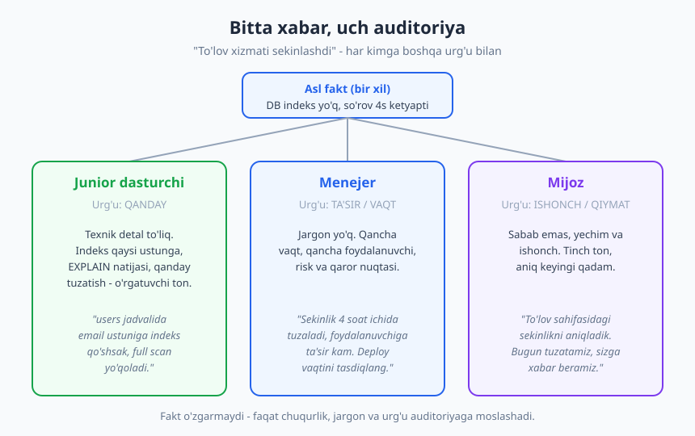
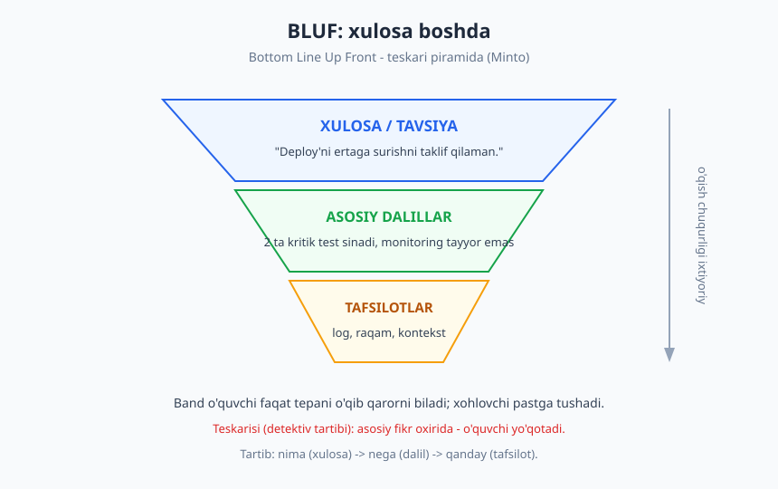
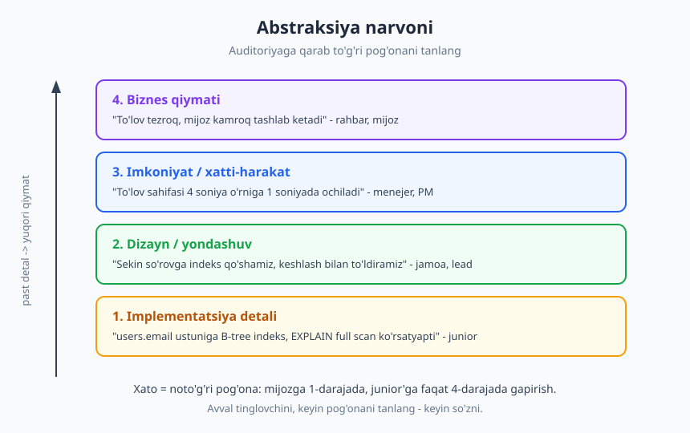

# 09 — Texnik muloqot asoslari

[⬅️ Oldingi: 08 — Stress, burnout va muvozanat](./08-stress-burnout-muvozanat.md) · [🏠 README](./README.md) · [Keyingi: 10 — Yozma va asinxron muloqot ➡️](./10-yozma-asinxron-muloqot.md)

---

> **Bu bobda:** dasturchining eng kam baholanadigan kuchini — g'oyani aniq yetkaza olishni — o'rganamiz. Auditoriyani tanish, **bilim la'nati** (curse of knowledge) tuzog'idan chiqish, xabarni **BLUF** va **Minto piramidasi** bilan tuzish, va jargon, abstraksiya, analogiya bilan murakkabni soddalashtirish. Bu bob butun III qism (muloqot) uchun poydevor.

> **Halollik / Eslatma:** muloqot — bir martalik "o'qib oldim, bildim" ko'nikmasi emas. Bu bobdagi ramkalar sizga aniq xarita beradi, lekin haqiqiy o'zgarish faqat amaliyotda — har bir xabar, har bir stand-up, har bir code review izohidan keyin "buni aniqroq ayta olarmidim?" deb so'rashda yuzaga keladi.

---

## Nega kod yaxshi bo'lsa-da, yetmaydi

Tasavvur qiling: ikki dasturchi bir xil murakkab muammoni hal qildi. Birinchisi yechimni mukammal yozdi, lekin uni hech kimga tushuntira olmaydi — code review'da "shunchaki ishoning" deydi, stand-up'da gapi chalkash, hujjat yozmaydi. Ikkinchisi biroz oddiyroq yechim yozdi, lekin nega shunday qilganini, qanday tradeoff borligini, keyin nima bo'lishini aniq tushuntiradi.

Bir yildan keyin ikkinchisi tezroq o'sadi. Sababi shafqatsiz oddiy: **yetkazilmagan qiymat — qiymat emas.** Sizning miyangizdagi ajoyib yechim, agar boshqa odam (lead, jamoadosh, mijoz, kelajakdagi siz) uni tushuna olmasa, jamoaga deyarli foyda bermaydi. Kod — bu sizning fikringizning bir ko'rinishi; muloqot esa o'sha fikrni odamlar ongiga ko'chiradigan ko'prik.

Bu yaxshi xabar ham: muloqot — tug'ma iste'dod emas, **o'rganiladigan ko'nikma**. U ramkalarga, naqshlarga va mashqqa bo'ysunadi. Aynan shu bilan shug'ullanamiz.

> **Eslatma:** "yaxshi muloqotchi" demak — chiroyli gapiradigan yoki ko'p gapiradigan degani emas. Aksincha — eng yaxshi texnik muloqotchilar ko'pincha kam, lekin aniq gapiradi. Maqsad — ta'sir qoldirish emas, **tushunchani uzatish**.

---

## Auditoriyani bilish

Texnik muloqotning birinchi qoidasi — **xabar emas, auditoriya** birinchi keladi. Bir xil faktni junior dasturchiga, senior'ga, menejerga va mijozga aytganda — to'rt xil gapirasiz. Buni qilmaslik — eng keng tarqalgan xato.

Auditoriyani o'qishda uchta savol beradi:

1. **Ular nimani biladi?** (bilim darajasi) — Texnik atamalarni tushunadimi? Kontekstni biladimi? Junior'ga "indeks" so'zini tushuntirish kerak; senior'ga esa darrov "qaysi ustunga" deysiz.
2. **Ularni nima qiziqtiradi?** (motiv) — Dasturchi *qanday* ishlashini biladi; menejer *qancha vaqt* va *qancha risk*ni biladi; mijoz *o'ziga qanday ta'sir* qilishini biladi.
3. **Ular nima qaror qilmoqchi?** (maqsad) — Xabardan keyin tinglovchi nima qilishi kerak? Tasdiqlashimi? Tanlashimi? Faqat xabardor bo'lishimi? Buni bilsangiz, qaysi ma'lumot muhim, qaysi biri ortiqcha — o'zidan ayon bo'ladi.

### Bitta muammo, uch auditoriya

Aytaylik, to'lov sahifasi sekinlashdi: ma'lumotlar bazasidagi bir so'rovga indeks yo'q, shuning uchun har bir so'rov 4 soniya ketyapti. Bu — **bitta fakt**. Endi uni uch xil odamga aytamiz.

> **Junior dasturchiga** (urg'u: *qanday*):
> "To'lov sahifasi sekin, chunki `payments` jadvalidagi so'rov `user_id` bo'yicha filtrlaydi-yu, o'sha ustunda indeks yo'q — `EXPLAIN` to'liq jadval skanini ko'rsatyapti. Indeks qo'shsak, so'rov millisekundlarga tushadi. Kel, birga `EXPLAIN` natijasini ko'ramiz, sen ko'rasan."

> **Menejerga** (urg'u: *ta'sir va vaqt*):
> "To'lov sahifasidagi sekinlik aniqlandi — bitta ma'lumotlar bazasi sozlamasi yetishmayotgan ekan. Tuzatish kichik, taxminan yarim kun. Foydalanuvchiga ta'siri katta emas edi, lekin tuzatsak sahifa sezilarli tezlashadi. Bugun deploy qilsak bo'ladimi?"

> **Mijozga** (urg'u: *ishonch va keyingi qadam*):
> "To'lov sahifasidagi sekinlik sababini aniqladik va bugun tuzatamiz. Sizning ma'lumotlaringizga xavf yo'q edi. Tuzatish chiqqach sizga xabar beramiz."

Diqqat qiling — yolg'on hech qayerda yo'q. Fakt o'zgarmadi. O'zgargani — **chuqurlik, jargon va urg'u**. Junior `EXPLAIN`ni eshitadi; menejer "yarim kun" va "deploy"ni; mijoz "xavf yo'q" va "xabar beramiz"ni. Har biriga *o'sha odam qaror qilishi uchun kerak bo'lgani qadar* ma'lumot berdik — ko'p ham emas, kam ham.

> **❌ Yomon:** mijozga `EXPLAIN full table scan` deb yozish (qo'rqitadi, hech narsa tushunmaydi).
> **❌ Yomon ham:** junior'ga "hammasi joyida, tuzatamiz" deb texnik detalni yashirish (u o'rganmaydi, mavhumlikdan zerikadi).
> **✅ Yaxshi:** har auditoriyaga o'z pog'onasida gapirish.

---

## Bilim la'nati — eng katta tuzoq

Endi muloqotning eng yashirin va eng zararli dushmani bilan tanishamiz. Uning nomi — **bilim la'nati** (curse of knowledge).

G'oya oddiy: **biror narsani bilib bo'lgach, uni bilmaslik qanaqaligini tasavvur qila olmaymiz.** Sizning ongingiz allaqachon o'sha bilim bilan "to'lgan", shuning uchun siz o'zingizga ayon narsa boshqaga ham ayon bo'lib tuyuladi — aslida unday emas.

Bu atama dastlab iqtisodchilar **Colin Camerer, George Loewenstein va Martin Weber** tomonidan 1989-yilda ilmiy ishda kiritilgan; keyinroq esa **Chip va Dan Heath** o'zlarining "Made to Stick" (2007) kitobida buni keng ommalashtirdi. Ularning ta'rifi yaxshi: "Bir narsani bilib bo'lgach, uni bilmaslik qanday bo'lishini tasavvur qilish qiyin. Bilimimiz bizni 'la'natlagan'."

### Bu dasturchida qanday ko'rinadi

Bilim la'nati uchta odatda yashiringan:

- **Tashlab ketilgan jargon.** Siz "shunchaki bir CORS muammosi" deb yozasiz — sizga oddiy. Tinglovchi "CORS nima?" deb so'rashga uyaladi va xabar yo'qoladi. Qisqartmalar (CORS, CI, TTL, RCA, p95) — la'natning eng tez-tez ko'rinadigan shakli.
- **Tashlab ketilgan kontekst.** Siz muammoning yarmini boshingizda o'ylab, faqat oxirgi xulosani aytasiz: "Ha, bu o'sha eski rate limiter sababli". Tinglovchi qaysi rate limiter, qachon, nega — bilmaydi. Sizning boshingizdagi zanjirning yarmi gapingizda yo'q.
- **Noto'g'ri baholangan masofa.** "Buni 5 daqiqada tushunadi" deb o'ylaysiz, chunki *siz* uni hozir 5 daqiqada ko'rasiz — lekin siz bu ustida bir hafta ishlagansiz. Yangi odam uchun bu — soatlik yo'l.

> **Mashhur tajriba.** 1990-yilda Stenfordda Elizabeth Newton o'tkazgan tajribada bir guruh odam taniqli qo'shiqlar ohangini stol ustida barmoq bilan "chertib" berdi, ikkinchi guruh esa taxmin qildi. "Chertuvchilar" tinglovchilar ohangni 50% holatda topadi deb o'yladi; aslida atigi 2.5% topdi. Chertuvchining boshida musiqa jaranglardi — tinglovchi esa faqat tuq-tuqni eshitardi. Aynan shu — bilim la'nati: bizning boshimizda "musiqa" bor, lekin tinglovchi faqat "tuqillash"ni eshitadi.

### Davosi

Bilim la'natidan to'liq qutulib bo'lmaydi — lekin uni yengish mumkin:

- **Birinchi marta — tushuntir.** Har qisqartma yoki atama matnda birinchi marta kelganda, qisqa ochib ber: "p95 (foydalanuvchilarning 95% shu vaqtdan tez javob oladi)". Keyin uni ishlataver.
- **"Buni bilmagan odam" ni tasavvur qil.** Yozayotganda yelkangizda yangi stajyor o'tirgandek o'ylang: "u bu so'zni tushunadimi?"
- **Test: birovga o'qib ber.** Eng oson tekshiruv — xabarni mavzudan tashqaridagi odamga ko'rsatish (yoki ovoz chiqarib o'qish). "Bu yerda nima demoqchisan?" degan savol — la'natni ochib beradi.
- **Savolga joy qoldir.** "Bu yerda noaniqlik bo'lsa, ayting" — degan ochiq taklif, tinglovchiga "men hammasini tushunishim shart" bosimini olib tashlaydi.

---

## Tuzilish: BLUF va piramida

Auditoriyani bildingiz, jargonni tozaladingiz — endi xabarni **qanday tartibda** joylashtirasiz? Bu yerda ko'p dasturchi xato qiladi: ular xabarni **detektiv romani** kabi yozadi — avval butun tergov, dalillar, ehtimollar, va eng oxirida "...demak, ayb mushukda!" Texnik muloqotda esa o'quvchi band — u oxirigacha kutmaydi.

### BLUF — xulosani boshda ayt

**BLUF** (Bottom Line Up Front — "asosiy xulosa eng oldinda") — AQSh harbiylaridan kelib chiqqan yozish naqshi. Qoida: **xabaringizning eng muhim qismi — xulosa, qaror yoki so'rovingiz — birinchi jumlada bo'lsin.** Tafsilotlar keyin keladi.

> **❌ Detektiv tartibi:**
> "Kecha staging'da test qildim, p95 normal ko'rinardi, lekin keyin production loglarni ochsam timeout ko'paygan, men o'yladimki balki cache, keyin payments servisini tekshirdim, o'sha yerda... demak, **deploy'ni ertaga surishni taklif qilaman.**"

> **✅ BLUF tartibi:**
> "**Deploy'ni ertaga surishni taklif qilaman.** Sababi: ikkita kritik test hozir sinadi, va production'da timeout ko'paygan. Tafsilotlar pastda."

Ikkinchisi nima uchun yaxshi? Chunki band lead birinchi jumlani o'qib, darrov *qaror* va *kontekst*ni biladi. Agar u ko'proq bilishni xohlasa — pastga tushadi. Agar ishonsa — javob beradi. Siz uning vaqtini hurmat qildingiz.

### Minto piramidasi

BLUF "nimadan boshlash" ni aytadi; **Minto piramidasi** esa qolganini qanday tartiblashni. Bu naqshni **Barbara Minto** (McKinsey'da ishlagan maslahatchi) 1970-yillarda ishlab chiqqan va "The Pyramid Principle" kitobida bayon qilgan.

G'oya: yozuvni **piramida** kabi quring —

- **Tepada:** bitta asosiy fikr (sizning xulosangiz).
- **O'rtada:** o'sha fikrni qo'llab-quvvatlovchi bir nechta asosiy dalil.
- **Pastda:** har dalilni tasdiqlovchi tafsilot, raqam, log.

Bu "teskari piramida" — jurnalistikada ham xuddi shunday: eng muhim xabar sarlavhada va birinchi abzatsda, tafsilotlar pastda. Sababi bir xil: o'quvchi istalgan joyda to'xtashi mumkin va baribir asosiy xabarni olgan bo'ladi.

### "nima → nega → qanday" tartibi

Amalda Minto piramidasini eslab qolishning eng oson yo'li — uchta savolga shu tartibda javob bering:

| Tartib | Savol | Misol (deploy taklifi) |
|---|---|---|
| **1. Nima** | Xulosa/so'rov nima? | "Deploy'ni ertaga suraylik." |
| **2. Nega** | Nega? (asosiy dalillar) | "Ikkita kritik test sinadi; timeout ko'paygan." |
| **3. Qanday** | Qanday? (tafsilot, keyingi qadam) | "Loglarda p95 2x oshgan; ertaga ertalab fix tayyor bo'ladi." |

Ko'pchilik aksincha — "qanday"dan boshlaydi (jarayonni, qilgan ishini tasvirlaydi) va "nima"ni oxiriga qoldiradi. Buni teskari aylantiring. Bu kichik o'zgarish — lekin xabaringizni ikki barobar aniqroq qiladi.

> **Trade-off:** BLUF har doim ham mos kelmaydi. Nozik, hissiy yoki yomon xabarlarda (masalan, nizo yoki feedback) to'g'ridan-to'g'ri xulosa qattiq tuyulishi mumkin — u yerda biroz kontekst oldin kelishi insoniyroq. BLUF — *axborot* uzatishda kuchli; *munosabat* talab qiladigan suhbatlar boshqacha (bu haqda [13-bob](./13-feedback-berish-qabul.md) va nizolar bobida).

---

## Soddalashtirish vositalari

Tuzilish tayyor. Endi — har bir jumlani qanday qilib **soddaroq** qilish? Soddalashtirish — bu "ovomlashtirish" emas; aksincha, bu eng qiyin mahorat: murakkab narsani aniqligini yo'qotmasdan tushunarli qilish.

### 1. To'g'ri abstraksiya pog'onasini tanlash

Eng kuchli vosita — **abstraksiya narvoni**. Har bir g'oyani turli "balandlikda" tasvirlash mumkin: pastda — implementatsiya detali (kod, ustun, indeks); yuqorida — biznes qiymati ("mijoz kamroq ketadi").

To'g'ri pog'onani auditoriya belgilaydi: junior'ga 1-2-pog'ona, lead'ga 2-3, menejerga 3-4, mijozga 4-pog'ona. Eng keng tarqalgan xato — **noto'g'ri pog'onada gapirish**: rahbarga indeks haqida, junior'ga esa faqat "biznes uchun yaxshi bo'ladi" deb gapirish. Ikkalasi ham tinglovchini yo'qotadi.

### 2. Analogiya va o'xshatish

Yangi g'oyani tinglovchi *allaqachon biladigan* narsaga bog'lash — eng tez tushuntirish usuli. "Kesh — bu stol ustidagi tez-tez ishlatadigan kitoblar; har safar kutubxonaga (ma'lumotlar bazasi) bormaysiz." "Rate limiter — bu klubdagi qorovul: soatiga faqat shuncha odam kiritadi."

> **Diqqat:** analogiya — *ko'prik*, *isbot* emas. U tushunchani boshlash uchun ajoyib, lekin har analogiyaning chegarasi bor. Texnik suhbat chuqurlashganda analogiyadan haqiqiy modelga o'ting, aks holda u chalkashtiradi.

### 3. Misol va vizual

Mavhum tushuntirish o'rniga — **aniq misol**. "Bu funksiya inputni tozalaydi" o'rniga: "Masalan, `' Ali '` kiritsangiz, `'Ali'` qaytaradi." Va imkon bo'lsa — **diagramma**. Aynan shuning uchun bu kitobda har bobda SVG bor: ramka rasmda matndan ko'ra tezroq tushuniladi. Murakkab oqim, arxitektura yoki ketma-ketlikni 100 so'z bilan yozgandan ko'ra, bitta diagramma bilan ko'rsatish ko'pincha aniqroq.

### 4. Jargonni boshqarish — kamroq = ko'proq

Jargon o'zicha yomon emas — u jamoa ichida *tezlik* beradi (bir so'z butun tushunchani anglatadi). Muammo — jargonni tushunmaydigan odam bilan ishlatish. Qoida oddiy:

- **Birinchi marta** atamani ochib ber, keyin ishlataver.
- **Aralash auditoriya** bo'lsa (masalan, dasturchi + menejer bir yig'ilishda), eng kam tayyorlangan odamga moslab gapir.
- **Shubha bo'lsa** — soddaroq so'z tanla. "Foydalanish" deb yozsa bo'ladigan joyda "utilizatsiya" yozish — bu aql ko'rsatish emas, to'siq qo'yish.

Eng yaxshi texnik muloqot ko'pincha **kamroq** so'z, **kamroq** jargon, **kamroq** tafsilot bilan bo'ladi — lekin har biri o'z o'rnida. "Kamroq = ko'proq" bu yerda haqiqiy tamoyil.

---

## Amaliy holatlar

Endi bu ramkalarni dasturchi kunidagi beshta tipik vaziyatga qo'llaymiz.

### Texnik qarorni tushuntirish

Siz arxitektura qarori qabul qildingiz va uni jamoaga sotishingiz kerak. **nima → nega → qanday** tartibida boring: avval qaror, keyin asosiy sabablar (va ko'rib chiqilgan alternativalar), keyin tafsilot. Eng muhimi — **tradeoff'ni ochiq ayt**: "Bu yondashuv tezroq, lekin keyinroq migratsiya kerak bo'ladi." Tradeoff'ni yashirgan qaror ishonchsiz tuyuladi. (Qarorni hujjatlash — ADR — haqida [23-bob](./23-texnik-qaror-tradeoff.md).)

### Muammoni xabar qilish (reporting)

Bug yoki uzilish haqida xabar berishda BLUF kuchli: **avval ta'sir**, keyin tafsilot. Yaxshi xato xabari uchta narsani aniq aytadi: (1) nima kutilgan edi, (2) nima bo'ldi, (3) qanday takrorlanadi. "Ishlamayapti" — bu xabar emas. "To'lov tugmasi bosilganda 500 xato qaytadi; kutilgani — tasdiq sahifasi; har safar takrorlanadi, log shu" — bu xabar.

### Savol berish

To'g'ri savol — bu ham muloqot mahorati. Yaxshi texnik savol kontekstni o'zida olib yuradi: nimani sinab ko'rganingiz, nima kutganingiz, nima bo'lganini qo'shadi. "Bu nega ishlamaydi?" o'rniga: "X ni qildim, Y kutdim, lekin Z bo'ldi — qaerda adashayapman?" Bu javob beruvchiga ham hurmat, ham tezlik. (Savol berish va XY-muammosi haqida [12-bobda](./12-tinglash-savol-berish.md) chuqurroq.)

### Hujjat yozish

Hujjat — bu **kelajakdagi auditoriyaga** xabar. O'quvchi siz emas, balki olti oydan keyin bu kodga kelgan begona odam (yoki o'zingiz, lekin kontekstni unutgan holda). Shuning uchun bilim la'nati hujjatda ayniqsa xavfli: siz uchun ayon kontekst — o'quvchi uchun yo'q. (Hujjatlashtirish — README, runbook, Diátaxis — to'liq [24-bobda](./24-hujjatlashtirish.md).)

### Code review izohi

Code review — bu yozma muloqot, va u inson tomoni bilan to'la. "Bu noto'g'ri" o'rniga — "Bu yerda `null` kelsa nima bo'ladi? Men ko'rmayapman, tushuntirib bera olasanmi?" Niyatni (nima uchun), aniqlikni (qaysi qator) va hurmatni saqlash — review'ning soft tomoni. (Bu mavzuga butun [15-bob](./15-code-review-inson-tomoni.md) bag'ishlangan.)

---

## Asosiy g'oyalar (bobni qisqacha)

- **Yetkazilmagan qiymat — qiymat emas.** Eng yaxshi yechim ham, tushuntirilmasa, jamoaga kam foyda beradi. Muloqot — o'rganiladigan ko'nikma, tug'ma iste'dod emas.
- **Auditoriya birinchi, xabar keyin.** Uch savol bering: ular *nimani biladi*, *nima qiziqtiradi*, *nima qaror qilmoqchi*. Bir xil faktni junior, menejer va mijozga — boshqa chuqurlik va urg'u bilan ayting.
- **Bilim la'nati (curse of knowledge)** — eng katta tuzoq: bilib bo'lgach, bilmaslik qanaqaligini unutamiz. Belgilari: tashlab ketilgan jargon, kontekst va noto'g'ri baholangan masofa. Davosi — atamani birinchi marta ochish, "bilmagan odam"ni tasavvur qilish, birovga o'qib berish. (Atama: Camerer, Loewenstein & Weber, 1989; ommalashtirgan — Chip va Dan Heath.)
- **BLUF (Bottom Line Up Front):** xulosa/qarorni birinchi jumlada ayt. Detektiv tartibi (asosiy fikr oxirida) — band o'quvchini yo'qotadi.
- **Minto piramidasi** (Barbara Minto): tepada bitta asosiy fikr, ostida dalillar, eng pastda tafsilot. Amalda — **nima → nega → qanday** tartibi.
- **Soddalashtirish vositalari:** to'g'ri **abstraksiya pog'onasini** tanlash, **analogiya** (ko'prik, isbot emas), aniq **misol** va **vizual** (diagramma), va **jargonni boshqarish** (birinchi marta ochib ber). Kamroq = ko'proq.

---

## Mashqlar

### Oson

**1-mashq.** Hozir ustida ishlayotgan (yoki yaqinda hal qilgan) bitta texnik narsani tanlang. Uni **ikkita** auditoriyaga 2-3 jumlada tushuntiring: (a) yangi junior dasturchiga, (b) texnik bilimsiz menejerga. Ikkala matnni yonma-yon qo'ying va farqni belgilang: qaysi so'z tushib qoldi, qaysi urg'u o'zgardi?

**2-mashq.** Quyidagi jargon bilan to'la jumlani kontekstsiz odam tushunadigan qilib qayta yozing: *"p95 latency spike'i CDN cache miss'idan, TTL'ni bump qilsak SLO'ga qaytamiz."* Har qisqartma va atamani birinchi marta ochib bering.

### O'rta

**3-mashq.** Quyidagi "detektiv tartibidagi" xabarni **BLUF** tartibiga keltiring:
> "Ertalab monitoringni ko'rdim, biroz g'alati edi, keyin loglarni ochdim, payments servisida xato ko'paygan, men cache deb o'yladim lekin yo'q, aslida yangi deploy sababli, shuning uchun menimcha rollback qilishimiz kerak."
Birinchi jumla — xulosa/so'rov bo'lsin; keyin nega; keyin tafsilot.

**4-mashq.** Bitta texnik tushunchani (masalan: kesh, API, indeks, rate limiting, deadlock — bittasini tanlang) **analogiya** orqali tushuntiring. So'ng o'sha analogiyaning **chegarasini** yozing: u qayerda buziladi, qaysi nuqtada haqiqiy modelga o'tish kerak?

### Qiyin

**5-mashq.** Bitta haqiqiy texnik qaror (yaqinda qabul qilingan yoki qilinayotgan) oling va uni **nima → nega → qanday** tartibida, **tradeoff bilan**, bitta abzatsda yozing. Keyin o'zingizdan so'rang: bu qarorda men *yashirib qo'ygan* qaysi qiyinchilik yoki alternativa bor — uni ochiq aytsam ishonch oshadimi?

**6-mashq.** O'zingizning so'nggi yozgan xabaringiz (Slack, PR izohi, email) ni oling va undagi **bilim la'nati** belgilarini toping: (a) tushuntirilmagan qisqartma/jargon bormi? (b) boshingizdagi qaysi kontekst matnda yo'q? (c) "buni darrov tushunadi" deb noto'g'ri baholaganmisiz? Topgan har bir nuqtani tuzating va xabarni qayta yozing.

Yechimlar / Namunaviy yondashuvlar

### 1-mashq yechimi
Bu mashqning maqsadi — bitta fakt ikki auditoriyaga ikki xil shaklga kirishini *o'z tajribangizda* ko'rish. Namuna (mavzu: "API javobini keshladim"):
- **Junior'ga:** "Bu endpoint har safar bazaga boradi, lekin natija kam o'zgaradi. Shuning uchun javobni 60 soniyaga keshladim — Redis'da saqlanadi, takroriy so'rov bazaga bormaydi. Kel, kesh kalitini qanday tuzganimni ko'rsatay."
- **Menejerga:** "Bu sahifa endi sezilarli tez ochiladi — takroriy so'rovlarni optimizatsiya qildim. Foydalanuvchi farqni sezadi, server yuki ham kamayadi."
Farq: junior'da *Redis, kesh kaliti, 60s* bor — menejerda yo'q; menejerda *foydalanuvchi sezadi, server yuki* bor. Bilim darajasi va motiv urg'uni belgiladi.

### 2-mashq yechimi
Namuna: "Foydalanuvchilarning sekin javob oladigan 5%i (buni p95 deb ataymiz — 95% shu vaqtdan tez) yanada sekinlashdi. Sababi — bizning tezlashtiruvchi tarmoq (CDN) ba'zi sahifalarni vaqtincha xotirasida saqlamay qolgan (cache miss). Agar shu xotira muddatini (TTL) biroz oshirsak, javob tezligi yana belgilangan maqsadimizga (SLO) qaytadi." Kalit: har qisqartmani (p95, CDN, TTL, SLO) birinchi uchraganda qavs yoki tushuntirish bilan ochib berdik — keyin uni ishlatish mumkin.

### 3-mashq yechimi
BLUF tartibida:
> "**Yangi deploy'ni rollback qilishni taklif qilaman.** Sababi: payments servisida xatolar ortdi, va bu ertalabki deploy bilan mos keladi (cache emas — buni tekshirib chiqdim). Tafsilot: monitoringda g'ayrioddiy ko'rsatkich, loglarda payments xatolari deploy vaqtidan boshlab ko'paygan."
Asosiy o'zgarish — *qaror* (rollback) birinchi jumlaga ko'tarildi; tergov jarayoni (men o'yladim... keyin... aslida) tafsilotga tushdi. Band lead birinchi jumlani o'qib darrov harakat qila oladi.

### 4-mashq yechimi
Namuna (kesh): "Kesh — bu ish stolingizdagi tez-tez ochadigan kitoblar. Har safar kutubxonaga (ma'lumotlar bazasi) borish o'rniga, kerakli bir nechtasini yoningizda saqlaysiz — tezroq olasiz."
**Chegarasi:** analogiya "eskirish" (cache invalidation) muammosini ko'rsatmaydi — stoldagi kitob "eskirmaydi", lekin keshlangan ma'lumot manbada o'zgarsa eskiradi. Suhbat shu nuqtaga yetganda analogiyani tashlab, haqiqiy modelga (TTL, invalidatsiya strategiyasi) o'tish kerak. Saboq: analogiya boshlash uchun, davom ettirish uchun emas.

### 5-mashq yechimi
Namuna (qaror: "monolit o'rniga alohida servis qilmadik, hozircha modulli monolit"):
> "**Hozircha alohida mikroservis qilmaymiz — modulli monolit ichida ajratamiz** (nima). Sababi: jamoamiz kichik, va alohida servis bizga deploy, monitoring, tarmoq murakkabligini qo'shadi — bu hozir foydadan ortiq xarajat (nega). Qanday: kodni aniq modul chegaralari bilan ajratamiz, shunda kelajakda ajratish oson bo'ladi. **Tradeoff:** bu masshtablashda biroz cheklov beradi, lekin hozirgi hajmda bu real muammo emas; kerak bo'lsa keyin ajratamiz."
Yashirilgan qiyinchilikni (masshtab cheklovi) ochiq aytish — qarorni *kuchsizlantirmaydi*, balki ishonchni oshiradi: siz alternativani ko'rganingiz va ongli tanlaganingiz ko'rinadi.

### 6-mashq yechimi
Bu reflektiv mashq — natija shaxsiy. Tipik topilmalar:
- **(a) Jargon:** "RCA tugadi" deb yozgansiz — o'quvchi RCA (root cause analysis — ildiz sabab tahlili) nimaligini bilmasligi mumkin.
- **(b) Yo'qolgan kontekst:** "o'sha bug yana chiqdi" — qaysi bug? Sizning boshingizda aniq, matnda havola/raqam yo'q.
- **(c) Noto'g'ri masofa:** "tez tuzataman" — siz uchun tez (kontekst yodingizda), lekin kodni endi ochgan odam uchun yo'q.
Tuzatish: birinchi qisqartmani oching, bug'ga aniq havola/ID qo'shing, va "tez" o'rniga real baho bering. Qayta yozilgan xabar — qisqaroq emas, balki *o'z-o'zicha tushunarli* bo'lsin. Eng yaxshi test: uni mavzudan tashqaridagi odamga ko'rsating va "nima demoqchiman?" deb so'rang.

---

[⬅️ Oldingi: 08 — Stress, burnout va muvozanat](./08-stress-burnout-muvozanat.md) · [🏠 README](./README.md) · [Keyingi: 10 — Yozma va asinxron muloqot ➡️](./10-yozma-asinxron-muloqot.md)
