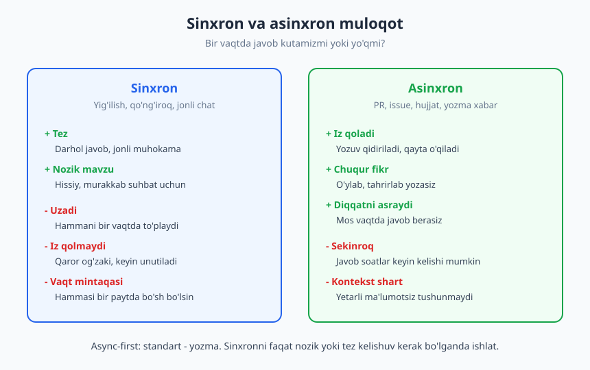
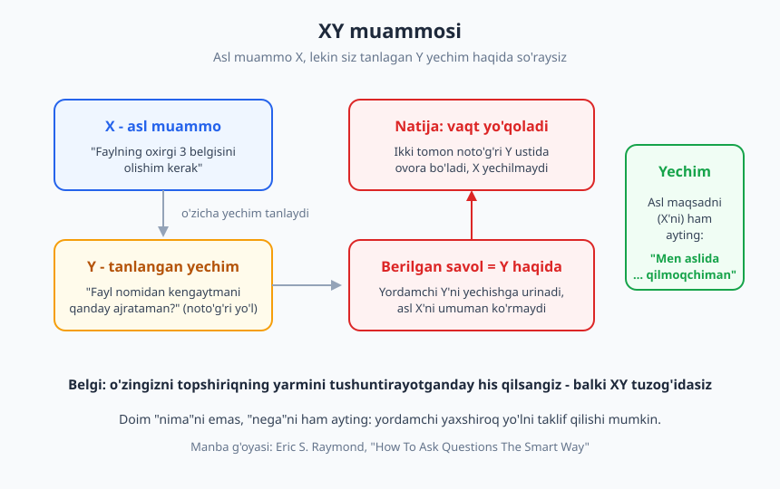
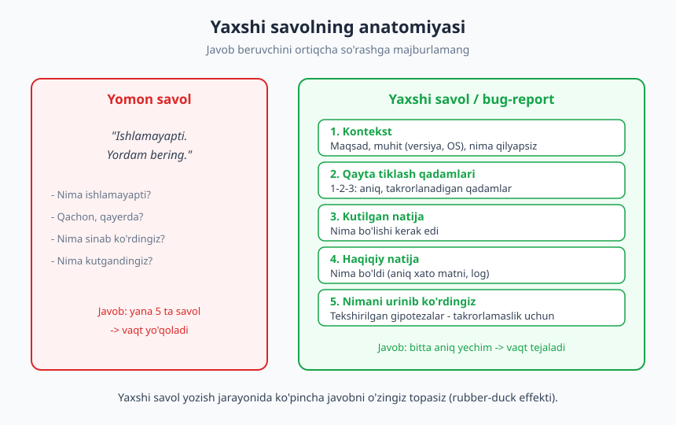

# 10 — Yozma va asinxron muloqot

[⬅️ Oldingi: 09 — Texnik muloqot asoslari](./09-texnik-muloqot-asoslari.md) · [🏠 README](./README.md) · [Keyingi: 11 — Og'zaki muloqot, taqdimot va public speaking ➡️](./11-ogzaki-taqdimot-public-speaking.md)

---

> **Bu bobda:** zamonaviy dasturchi gapirgandan ko'ra ko'proq **yozadi** — Slack, pull request, issue, dizayn hujjati, commit xabari. Shu bobda **asinxron-birinchi (async-first)** ish madaniyatini, **yaxshi savol berish** san'atini (XY muammosidan qochish, sifatli bug-report), Slack/email etiketini va uzun shakldagi **RFC/dizayn hujjati**ni qanday yozishni o'rganamiz.

> **Halollik / Eslatma:** yozma muloqot — bir martalik "qoidalar ro'yxati" emas, har kuni mashq qilinadigan ko'nikma. Bu yerdagi ramkalar yo'lni ko'rsatadi, lekin yaxshi yozuvchi bo'lish faqat ko'p yozish va o'z yozganingizni qayta o'qib, qisqartirib borish bilan keladi. Har bir jamoaning o'z me'yorlari ham bor — bularni kuzating va moslang.

---

## Nega yozma muloqot karyerangizni belgilaydi

Tasavvur qiling, ikki dasturchi bir xil texnik mahoratga ega. Biri Slack'da chala jumlalar yozadi, PR'larini izohsiz qoldiradi, savollarni "ishlamayapti, qarab bera olasizmi?" deb beradi. Ikkinchisi muammoni aniq tasvirlaydi, qarorlarini yozib qo'yadi, savollarini shunday tuzadiki, javob beruvchi bir o'qishda tushunadi. Bir-ikki yildan keyin ikkinchisi sezilarli oldinga chiqadi — chunki uning **fikrlari boshqalarga yetib boradi**, va u "ishonchli" degan obro' qozonadi.

Bu tasodif emas. Yozma muloqotning to'rtta ustunligi bor:

- **Yozuv hujjatga aylanadi.** Og'zaki aytilgan qaror unutiladi; yozilgan qaror qoladi, qidiriladi, yangi qo'shilgan odam o'qiydi. Slack thread'i, PR izohi, dizayn hujjati — bularning hammasi kelajakdagi "nega biz buni shunday qildik?" savoliga javob.
- **Bir yozuv ko'pchilikka yetadi.** Yig'ilishda aytgan gapingizni o'sha xonadagi 5 kishi eshitadi. Yozib qo'ygan tahlilingizni bugun 5, ertaga 50, kelasi yili yangi xodim — hammasi o'qiydi. Yozuv **masshtablanadi**.
- **Yozuv vaqt va makonni kesib o'tadi.** Boshqa vaqt mintaqasidagi hamkasbingiz siz uxlayotganda yozganingizni o'qiydi. Bu — masofaviy va taqsimlangan jamoaning yuragi (bu mavzu [17-bobda](./17-masofaviy-ish-jamoa.md) chuqurroq).
- **Yozish fikrni tozalaydi.** Bu eng kam baholanadigan foyda. Bir narsani aniq yozish uchun avval uni aniq **o'ylab olishingiz** kerak. Ko'pincha muammoni yozayotib, "voy, men aslida tushunmagan ekanman" yoki aksincha "to'xta, yechim shu-ku!" deysiz.

> **Yozish — o'ylashning tozalangan shaklidir.** Chalkash yozuv — bu deyarli har doim chalkash fikrning belgisi. Yozuvni tartibga solish jarayonida fikrni ham tartibga solasiz.

Shuning uchun yozma muloqotni "majburiy ortiqcha ish" emas, balki o'z fikrlash sifatingizni oshiradigan vosita deb qarang. Bu bob ko'nikmasi — [9-bobda](./09-texnik-muloqot-asoslari.md) ko'rganimiz "auditoriyani bil, soddalashtir, nima-nega-qanday" tamoyillarini aynan **yozuvga** qo'llashdir.

---

## Asinxron-birinchi (async-first) madaniyat

Muloqotning ikki rejimi bor, va ularni adashtirmaslik muhim:

- **Sinxron (synchronous)** — ikki tomon **bir vaqtda** mavjud bo'ladi: yig'ilish, qo'ng'iroq, jonli chat. Javob darhol keladi.
- **Asinxron (asynchronous)** — siz xabar qoldirasiz, qarshi tomon **o'ziga qulay** vaqtda javob beradi: email, PR izohi, issue, hujjat, Slack thread'i.

Ikkalasining ham o'rni bor — bu "biri yaxshi, biri yomon" masalasi emas, balki **trade-off** masalasi. Sinxron tez va jonli, lekin u hammani bir vaqtda to'plashni talab qiladi, diqqatni uzadi va og'zaki qaror iz qoldirmaydi. Asinxron sekinroq, lekin u iz qoldiradi, chuqur fikrga vaqt beradi va har kimning diqqat vaqtini asraydi.

### Nega "async-first"

Ko'p zamonaviy (ayniqsa masofaviy) jamoalar **async-first** ("avval asinxron") tamoyilni tanlaydi: standart — yozma, sinxron esa **zarur bo'lgandagina**. Sababi oddiy — har bir yig'ilish bir nechta odamning **chuqur ish** (deep work) blokini buzadi. Diqqatni qayta yig'ish narxi yuqori. Demak, agar muammoni yozma hal qilib bo'lsa, yig'ilish chaqirish — boshqalarning vaqtini isrof qilish.

Async madaniyatning uchta asosiy qoidasi bor:

1. **Yetarli kontekst bering.** Asinxron yozuvda siz yonida emassiz — "anavi narsa", "biz aytgandek" kabi noaniqliklar ishlamaydi. O'quvchi sizning miyangizdagini ko'rmaydi. Demak, savol yoki taklifni **o'zicha to'liq** yozing: nima, nega, qaysi havola, qanday qaror kerak.
2. **Javobni kutib o'tirmang.** Asinxron yozdingizmi — boring, boshqa ish qiling. Odamning darhol javob berishini kutib, har 30 soniyada Slack'ni yangilash — bu asinxronlikning butun foydasini yo'qotadi. Javob kelganda ko'rasiz.
3. **Hujjatlashtiring.** Muhim qaror chatda chiqdimi — uni doimiy joyga (hujjat, issue, README) ko'chiring. Chat — oqib ketadigan daryo; muhim narsa daryoda qolmasligi kerak.

### Sinxron qachon kerak

Async-first "hech qachon gaplashmang" degani emas. Ba'zi vaziyatlar sinxronni talab qiladi:

| Vaziyat | Nega sinxron |
|---|---|
| Nozik yoki hissiy mavzu | Yozuvda ohang yo'qoladi; feedback, nizo, qiyin xabar — jonli yaxshiroq |
| Tez, ko'p qatlamli kelishuv | 20 ta xabar bilan yozishadigan narsani 5 daqiqada gaplashasiz |
| Yangi g'oya bo'ronini (brainstorm) qilish | Jonli muhokama fikrlarni tezroq uchiradi |
| Chuqur tushunmovchilik | Thread aylanma bo'lib qoldimi — "keling 10 daqiqa gaplashamiz" |

Amaliy qoida: **agar thread uch marta orqaga-oldinga aylansa ham tushunmovchilik tugamasa — sinxronga o'ting.** Lekin gaplashgandan keyin **xulosani yozib qo'ying**, toki qaror iz qoldirsin. Bu — eng yaxshi ikki dunyo: jonli hal qilish + yozma iz.

> **Diqqat:** "tezroq" har doim "yaxshiroq" emas. Yig'ilish tez tuyuladi, chunki javob darhol keladi — lekin u 6 kishining yarim soatini oladi. O'sha qarorga yetadigan yaxshi yozilgan xabar 5 daqiqangizni oladi, lekin har kim **o'ziga qulay** vaqtda o'qiydi. Jamoa darajasida asinxron ko'pincha arzonroq.

---

## Yaxshi savol berish san'ati

Dasturchining kunlik ishida savol berish — markaziy ko'nikma. Yaxshi berilgan savol bir o'qishda javob oladi; yomon berilgan savol esa "savol-javob"ning besh raundini boshlaydi va ikki tomonni ham charchatadi.

### XY muammosi

Eng keng tarqalgan tuzoq — **XY muammosi**. Bu shunday bo'ladi: sizning asl muammoyingiz **X**, lekin siz o'zingizcha bir yechim **Y**'ni tanlaysiz, keyin **Y haqida** savol berasiz — asl X'ni umuman aytmasdan. Yordamchi esa Y'ni yechishga urinadi, vaqt yo'qoladi, va oxir-oqibat ma'lum bo'ladiki, X'ni butunlay boshqacha, soddaroq yo'l bilan yechsa bo'lar ekan.

Klassik misol:

> **Savol (Y):** "Fayl nomidan oxirgi 3 ta belgini qanday kesib olaman?"
>
> **Yarim soatlik muhokamadan keyin:** "Aslida nega kerak edi?"
>
> **Asl maqsad (X):** "Fayl kengaytmasini olmoqchi edim."
>
> **Yaxshiroq yechim:** kengaytma 3 belgili bo'lmasligi mumkin (`.jpeg`, `.config`) — to'g'ri yo'l oxirgi nuqtadan keyingisini olish, "oxirgi 3 belgi" emas. Y noto'g'ri edi.

XY muammosidan qochishning yo'li bitta: **"nima"ni so'raganda "nega"ni ham ayting.** Tanlagan yechimingizni so'rashdan oldin, asl maqsadingizni bir jumlada bering: *"Men aslida ... qilmoqchiman, buning uchun ... ni o'ylayapman, lekin ... da qotib qoldim."* Shunda yordamchi sizning Y'ingizni tuzatibgina qolmay, balki butun X'ga yaxshiroq yo'l ko'rsatishi mumkin.

> **Belgi:** agar savolingizni berishda o'zingizni topshiriqning yarmini yashirayotganday yoki "buni tushuntirsam uzoq bo'ladi" deb his qilsangiz — ehtimol siz XY tuzog'idasiz. O'sha "uzoq" kontekst aynan eng kerakli qism.

### Yaxshi savolning tarkibi

Buyuk hacker madaniyatining klassik matni — **Eric S. Raymond**ning "How To Ask Questions The Smart Way" (Savollarni aqlli berish yo'li) inshosi — onlayn jamoalarda savol berishning hamon dolzarb me'yorini belgilab bergan. Uning mohiyati: **javob beruvchining vaqtini hurmat qiling.** Yaxshi savol uch qismdan iborat:

1. **Kontekst** — nima qilmoqchisiz (maqsad/X), qaysi muhitda (versiya, OS, vosita).
2. **Nima sinab ko'rdingiz** — qaysi gipotezalarni allaqachon tekshirdingiz. Bu yordamchini sizdan o'tib ketgan yo'lni qaytadan taklif qilishdan saqlaydi va sizning o'zingiz harakat qilganingizni ko'rsatadi.
3. **Kutilgan va haqiqiy natija** — nima bo'lishini kutgandingiz, aslida nima bo'ldi (aniq xato matni bilan).

Bularni qo'shganda, "ishlamayapti" o'rniga shunday savol chiqadi:

> ❌ **Yomon:** "Auth ishlamayapti, kim biladi?"
>
> ✅ **Yaxshi:** "Login formasini ulashga harakat qilyapman (kontekst). Foydalanuvchi to'g'ri parol kiritganda ham 'invalid credentials' chiqyapti (haqiqiy), token tasdiqlanishi kerak edi (kutilgan). Tekshirdim: parol bazada to'g'ri hash bilan saqlangan, va boshqa foydalanuvchi bilan ham takrorlanadi (urinishlar). Xato logi: `[...]`. Qayerga qarashni maslahat berasizmi?"

Ikkinchi savolga deyarli har qanday hamkasb darhol foydali javob bera oladi — chunki unda **fikrlash uchun zarur hamma narsa bor**.

### Yaxshi bug-report

Bug-report — savolning rasmiy ukasi. Issue ochayotganda yoki testerga muammoni tasvirlayotganda aynan shu tuzilish ishlaydi:

Sifatli bug-report'ning belgilari:

- **Qisqa, aniq sarlavha** — "Login sahifasida 'Esladim' tugmasi ishlamaydi", "ishlamayapti" emas.
- **Qayta tiklash qadamlari (steps to reproduce)** — 1, 2, 3 tartibda, har kim takrorlay oladigan darajada aniq. Bu eng muhim qism: takrorlay olinmaydigan bug — deyarli tuzatib bo'lmaydigan bug.
- **Kutilgan natija** va **haqiqiy natija** — ikkalasi alohida, aniq.
- **Muhit** — versiya, brauzer/OS, qurilma; ba'zan muammo faqat bitta muhitda chiqadi.
- **Dalil** — log, skrinshot, xato matni (rasmni so'z bilan tasvirlash o'rniga to'g'ridan-to'g'ri matnni nusxalang, toki qidirilsin).

Diqqat qiling: yaxshi bug-report yozish jarayonida siz muammoni **qayta tiklashga** majbur bo'lasiz — va ko'pincha aynan shu paytda sababni o'zingiz topasiz. Bu — yozuvning "fikrni tozalash" foydasining yana bir ko'rinishi. Aniqlovchi savol berish va "Besh nega" kabi texnikalar haqida [12-bobda](./12-tinglash-savol-berish.md) batafsil to'xtalamiz.

---

## Slack va email etiketi

Kunlik yozma muloqotning aksariyati Slack (yoki shunga o'xshash chat) va email orqali kechadi. Bir nechta oddiy odat bu kanalni hamma uchun samaraliroq qiladi.

### BLUF: eng muhimni boshda ayting

Harbiy yozuvdan kelgan **BLUF** (Bottom Line Up Front — "asosiy xulosa eng boshda") tamoyili yozma muloqotda oltinday qadrli. O'quvchi birinchi jumladayoq **nima kerakligini va undan nima kutilayotganini** bilsin. Kontekst keyin keladi.

> ❌ **Ko'milgan so'rov:** "Salom, umid qilamanki yaxshisiz. Kecha deploy haqida o'ylayotgan edim, va anavi config masalasi bor edi, esimda, biz uni o'tgan oy muhokama qilgandik... [5 qator]... xullas, sizningcha staging'ni qayta ishga tushirsak bo'ladimi?"
>
> ✅ **BLUF:** "**So'rov:** staging'ni qayta ishga tushirishga ruxsat bera olasizmi? (Config o'zgarishi sinab ko'rilishi kerak, batafsil pastda.) Bugun 15:00gacha javob kerak."

O'quvchi birinchi jumladan **harakat** va **muddat**ni biladi; o'qishni davom ettirishi ham mumkin, ammo shart emas.

### "nohello": shunchaki "Salom" deb to'xtab qolmang

Eng ko'p tarqalgan async anti-naqsh — chatda faqat "Salom" yoki "Bandmisiz?" deb yozib, javob kutib turish, asl savolni keyin aytish. Bu qarshi tomonni javob yozishga majbur qiladi, keyin yana kutadi — asinxronlikni buzadi va ikki tomonning ham diqqatini ikki marta uzadi. Bu odat shunchalik keng tarqalganki, uni qoralovchi alohida sahifa — **nohello** — internetda mashhur bo'lib ketgan.

> ❌ "Salom!" *(20 daqiqa kutadi)* "Bandmisiz?" *(yana kutadi)* "Bitta savol bor edi..."
>
> ✅ "Salom! Tez savol: deploy skriptidagi `RETRY` o'zgaruvchisini 3'dan 5'ga oshirsak xavfsizmi? Hozir flaky testlar uchun yetmayapti. Shoshilinch emas, qulay bo'lganda javob bering."

Bitta xabarda: salom + kontekst + aniq savol + shoshilinchlik darajasi. Odam buni o'ziga qulay vaqtda ochib, **bitta o'qishda** javob bera oladi.

### Boshqa amaliy me'yorlar

- **Email mavzu sarlavhasi (subject) — aniq va mazmunli.** "Savol" emas, "Q3 hisobotidagi ma'lumotlar bazasi migratsiyasi: ruxsat kerak". Sarlavha — keyinchalik qidirishning kaliti.
- **Thread'dan foydalaning.** Yangi mavzuni asosiy kanalga to'kib tashlamang — tegishli xabarga thread oching. Bu kanalni o'qilishli saqlaydi.
- **@mention me'yorini biling.** `@channel` / `@here` — butun jamoani uzadi. Uni faqat haqiqatan hammaga shoshilinch bo'lganda ishlating. Aks holda muayyan odamni @mention qiling.
- **Ohang yozuvda yo'qoladi.** Quruq "yo'q." yoki "nega bunday qildingiz?" yozuvda dag'al tuyulishi mumkin, garchi siz shunday demoqchi bo'lmasangiz ham. Yozuvda biroz **iliqroq** bo'lish — yaxshi odat. Emoji va to'liq jumla ohangni yumshatadi.
- **Qayta o'qing, keyin yuboring.** Yuborishdan oldin bir o'qib chiqing: o'quvchi kontekstsiz tushunadimi? Ortiqcha so'z bormi? Bu 20 soniya — lekin ko'p tushunmovchilikni oldini oladi.

---

## Uzun shakl: dizayn hujjati va RFC

Kichik savol-javobdan tashqari, dasturchi ba'zan **uzun yozuv** ham yozadi — muhim qaror, yangi tizim yoki muhim o'zgarish haqida. Bu odatda **dizayn hujjati** yoki **RFC** (Request for Comments — "izohlar uchun so'rov") deb ataladi.

RFC madaniyatining mohiyati: katta qarorni amalga oshirishdan **oldin** yozma bayon qilib, jamoadan fikr olish. Bu sizni qaror mantig'ini aniq o'ylashga majbur qiladi va boshqalarga e'tirozini erta bildirish imkonini beradi — kod yozilib bo'lgandan keyin emas.

Tipik dizayn hujjati quyidagilarni qamraydi:

- **Kontekst / muammo** — nima uchun bu hujjat yozilyapti, qanday muammoni hal qilyapmiz.
- **Maqsadlar va maqsad emaslari (goals / non-goals)** — bu ish nimani qiladi va **nimani qilmaydi**. "Non-goals" — eng ko'p o'tkazib yuboriladigan, lekin eng foydali bo'lim: u doirani aniqlaydi.
- **Taklif qilingan yechim** — qanday qilamiz.
- **Ko'rib chiqilgan muqobillar (alternatives)** — yana qanday yo'llar bor edi, nega ularni tanlamadingiz. Bu trade-off'larni ochiq ko'rsatadi.
- **Xavf va savollar** — nima noma'lum, nima xato ketishi mumkin.

Diqqat qiling — bu **qaror va kontekstni yozish** haqida. "Nega buni shunday qildik?" savoliga olti oydan keyin javob beradigan yagona narsa — o'sha paytda yozilgan hujjat. Qarorni hujjatlashning eng ixcham shakli — **ADR** (Architecture Decision Record); trade-off mantig'i va texnik qarorlarni hujjatlash 23-bobda, hujjatlashtirish ko'nikmasining o'zi esa [24-bobda](./24-hujjatlashtirish.md) chuqur ko'riladi.

### Commit xabari ham muloqot

Oxirgi, lekin tez-tez unutiladigan nuqta: **commit xabari ham yozma muloqot.** U kelajakda kodni o'qiyotgan odamga (ko'pincha — olti oydan keyingi o'zingizga) "nega bu o'zgarish qilindi" ni aytadi. Yaxshi commit xabari:

- **Sarlavha qatori** — qisqa (taxminan 50 belgi), buyruq mayli: "Login xatosini tuzatish", "Login xatosini tuzatdim" emas.
- **Tana (body)** — agar kerak bo'lsa, **nega** (kontekst) ni tushuntiradi, "nima"ni emas ("nima"ni diff ko'rsatadi). Nima muammo edi, nega aynan bu yechim.

> ❌ "fix" / "update" / "asdf"
>
> ✅ "Login: bo'sh parolda 500 o'rniga 400 qaytarish — validatsiya autentifikatsiyadan oldin ishlashi kerak edi"

Ko'ryapsizmi — bu butun bobning mavzusi bitta kichik commit xabarida jamlangan: **kontekst + nima + nega.** Yozma muloqot — bu Slack va hujjatdan tortib, kodning har bir tarixiy izigacha cho'ziladigan ko'nikma.

---

## Asosiy g'oyalar (bobni qisqacha)

- **Dasturchi gapirgandan ko'p yozadi.** Yozuv **hujjatga aylanadi**, **ko'pchilikka yetadi**, vaqt/makonni kesib o'tadi va eng muhimi — **fikrni tozalaydi**. "Yozish — o'ylashning tozalangan shakli."
- **Async-first:** standart — yozma, sinxron faqat zarur bo'lganda. Async qoidalari: **yetarli kontekst ber**, **javobni kutib o'tirma**, **muhim qarorni hujjatlashtir**. Thread uch marta aylansa ham tushunmovchilik tugamasa — sinxronga o't, keyin xulosani yoz.
- **XY muammosidan qoching:** asl maqsad X'ni aytmay, tanlangan yechim Y haqida so'rash vaqt yo'qotadi. "Nima"ni so'raganda doim **"nega"ni ham ayting**.
- **Yaxshi savol = kontekst + nima sinadingiz + kutilgan va haqiqiy natija.** Eric S. Raymondning "How To Ask Questions The Smart Way" — bu me'yorning klassik manbasi: javob beruvchining vaqtini hurmat qil.
- **Yaxshi bug-report:** aniq sarlavha, qayta tiklash qadamlari, kutilgan/haqiqiy natija, muhit, dalil (log/skrinshot). Uni yozish jarayonida ko'pincha sababni o'zingiz topasiz.
- **Slack/email etiketi:** **BLUF** (asosiyni boshda), **nohello** (faqat "Salom" deb to'xtama — bitta to'liq xabar yoz), aniq mavzu sarlavhasi, thread, @mention me'yori, yozuvda ohangni iliq tut.
- **Uzun shakl — RFC/dizayn hujjati:** muammo, maqsad va non-goals, yechim, muqobillar, xavf. **Commit xabari ham muloqot** — sarlavha buyruq maylida, tana esa "nega"ni tushuntiradi.

---

## Mashqlar

### Oson

**1-mashq.** Quyidagi noaniq savolni yaxshi savolga aylantiring (kontekst + nima sinadingiz + kutilgan/haqiqiy natija qo'shing): *"API javob bermayapti, nima qilay?"* Faraz qilingan tafsilotlarni o'zingiz to'ldiring.

**2-mashq.** O'tgan haftada siz yuborgan (yoki olganingiz) bitta "nohello" yoki ko'milgan-so'rovli xabarni eslang. Uni BLUF tamoyili bo'yicha qayta yozing: asosiy so'rov va muddat birinchi jumlada bo'lsin.

### O'rta

**3-mashq.** Faraziy bir bug uchun to'liq **bug-report** yozing (masalan: "Saytda 'Saqlash' tugmasi bosilganda hech narsa bo'lmaydi"). Quyidagilarni alohida bo'lim qilib kiriting: sarlavha, qayta tiklash qadamlari (1-2-3), kutilgan natija, haqiqiy natija, muhit. Eng kamida 5 qadamlik aniq reproduksiya yozishga harakat qiling.

**4-mashq.** Jamoangizga (yoki faraziy jamoaga) **holat yangilanishi (status update)** yozing: bitta tugagan ish, bitta davom etayotgan ish va bitta blokiruvchi (blocker). BLUF tamoyilini qo'llang — o'quvchi 10 soniyada eng muhim narsani (ayniqsa blokiruvchini) bilsin. 6–8 qatordan oshmasin.

### Qiyin

**5-mashq.** O'zingiz yaqinda bergan (yoki bermoqchi bo'lgan) bir savolni oling va undan **XY muammosi**ni "tozalang". Avval asl maqsadingizni (X) bir jumlada yozing, keyin nega Y yechimni tanlaganingizni, va nihoyat savolni shunday qayta tuzingki, u X va Y'ni **ikkalasini ham** ochib bersin. Savolingiz XY tuzog'ida bo'lmaganida ham — buni qanday tekshirish mumkinligini yozing.

**6-mashq.** Kichik bir texnik o'zgarish uchun mini **RFC / dizayn hujjati** yozing (masalan: "Loyihaga linter qo'shish" yoki "Ma'lumotlar bazasi backup jadvalini o'zgartirish"). Quyidagi bo'limlar bo'lsin: Muammo/kontekst, Maqsadlar, **Non-goals**, Taklif qilingan yechim, Ko'rib chiqilgan muqobillar (kamida 1 ta), Xavf/ochiq savollar. Har bo'lim 1–3 jumla.

Yechimlar / Namunaviy yondashuvlar

### 1-mashq yechimi
Namuna: *"To'lov xizmatining `/charge` endpointiga POST yuborayapman (kontekst). Kutgandim: 200 va tranzaksiya ID. Aslida: 30 soniyadan keyin timeout, hech qanday javob yo'q (kutilgan/haqiqiy). Tekshirdim: boshqa endpoint (`/health`) ishlayapti, demak server tirik; payload JSON validligini tasdiqladim; staging'da ham takrorlanadi (urinishlar). Xato logi: `upstream timeout`. Qayerga qarashni maslahat berasizmi — bizning so'rovmi yoki upstream xizmatmi?"* Kalit — yordamchiga **fikrlash uchun zarur hamma narsa** berildi: muhit, kutilgan/haqiqiy, va siz allaqachon o'tgan yo'l.

### 2-mashq yechimi
Asl (ko'milgan): *"Salom, qalaysiz? Kecha haligi PR haqida o'ylayotgandim, biz aytgandek... sizningcha bugun merge qilsak bo'ladimi?"*
BLUF qayta yozish: *"**So'rov:** #142 PR'ni bugun merge qilishga roziligingiz kerakmi? CI yashil, ikki approve bor. Bloklasa biror narsa bormi? Bugun 16:00gacha javob kifoya."* Asosiy so'rov + holat + muddat — birinchi ikki jumlada.

### 3-mashq yechimi
Namuna:
- **Sarlavha:** Profil sahifasida "Saqlash" tugmasi hech qanday ta'sir bermaydi
- **Qayta tiklash qadamlari:** (1) Profil sahifasini och, (2) "Ism" maydonini o'zgartir, (3) "Saqlash" tugmasini bos, (4) sahifani yangila, (5) eski ism qaytib keladi
- **Kutilgan:** yangi ism saqlanadi va yangilashdan keyin ham qoladi
- **Haqiqiy:** hech qanday xabar chiqmaydi, ma'lumot saqlanmaydi
- **Muhit:** Chrome 120, Windows 11, staging muhiti; konsolda `400 Bad Request /api/profile` xatosi
Kalit — qadamlar takrorlanadigan va aniq; konsol xatosi qo'shilgani sababni topishni tezlashtiradi.

### 4-mashq yechimi
Namuna (BLUF — blokiruvchi boshda):
> **Blokiruvchi:** to'lov API kalitiga kira olmayapman — DevOps'dan ruxsat kutyapman (#OPS-21). Bugun hal bo'lmasa, to'lov integratsiyasi kechikadi.
> **Tugadi:** login formasi validatsiyasi + testlar (PR #142, merge qilindi).
> **Davom etyapti:** to'lov oqimi UI — ~60%, kalit kelishi bilan tugataman.

Asosiy tamoyil — o'quvchi (ayniqsa lead) eng muhim narsani — **blokiruvchini** — darhol ko'radi, qolganini xohlasa o'qiydi.

### 5-mashq yechimi
Namuna:
- **Asl maqsad (X):** "Foydalanuvchilar ro'yxatini sahifalarga bo'lib ko'rsatmoqchiman, chunki ro'yxat juda uzun."
- **Tanlangan Y:** "SQL'da `OFFSET` qanday ishlatishni so'ramoqchi edim."
- **Tozalangan savol:** "Uzun foydalanuvchilar ro'yxatini sahifalashtirmoqchiman (X). Hozir `OFFSET` ni o'ylayapman (Y), lekin katta sahifalarda sekinlashayotganini eshitganman — bu holatda qaysi yondashuv to'g'ri?" Endi yordamchi `OFFSET` o'rniga kursor-asoslangan sahifalashni taklif qilishi mumkin — bu Y'ni emas, X'ni yechadi.
- **Tekshirish:** "Bu savolni berishda asl maqsadimni bir jumlada ayta olamanmi?" Agar yo'q bo'lsa yoki "buni tushuntirsam uzoq bo'ladi" desangiz — XY ehtimoli yuqori.

### 6-mashq yechimi
Namuna (mini-RFC: "Loyihaga linter qo'shish"):
- **Muammo:** Kod uslubi har bir dasturchida har xil; code review'da uslub bahslari vaqt oladi.
- **Maqsadlar:** Avtomatik uslub tekshiruvi, CI'da majburiy, bir xil format.
- **Non-goals:** Mavjud kodni hozir butunlay qayta formatlash emas (alohida ish); murakkab mantiqiy qoidalar emas — faqat uslub.
- **Taklif:** Standart linter konfiguratsiyasini qo'shish, CI'ga "lint" bosqichi, pre-commit hook (ixtiyoriy).
- **Muqobillar:** (1) Hech narsa qilmaslik — uslub bahslari davom etadi; (2) faqat tavsiya, majburiy emas — amalda e'tiborsiz qoladi. Shu sabab CI'da majburiy tanlandi.
- **Xavf/ochiq savol:** Eski kodda ko'p ogohlantirish chiqishi mumkin — bosqichma-bosqich yoqamizmi yoki bir martada? Jamoa fikri kerak.

Asosiy saboq — **non-goals** va **muqobillar** bo'limlari hujjatni shunchaki "men shuni qilaman" dan "men shuni, mana shu sabablarga ko'ra, mana bularning o'rniga qilaman" ga aylantiradi — bu esa fikrni va kelajakdagi "nega?" javobini aniqlashtiradi.

---

[⬅️ Oldingi: 09 — Texnik muloqot asoslari](./09-texnik-muloqot-asoslari.md) · [🏠 README](./README.md) · [Keyingi: 11 — Og'zaki muloqot, taqdimot va public speaking ➡️](./11-ogzaki-taqdimot-public-speaking.md)
