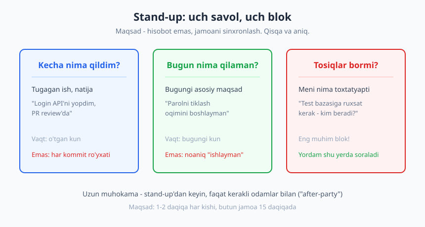
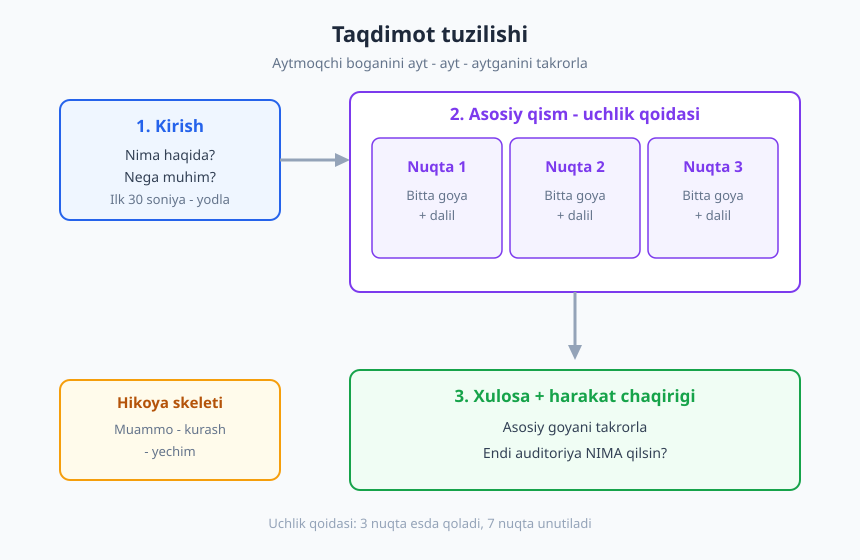
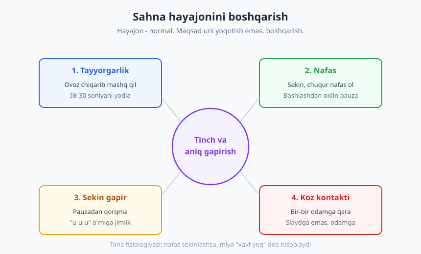

# 11 — Og'zaki muloqot, taqdimot va public speaking

[⬅️ Oldingi: 10 — Yozma va asinxron muloqot](./10-yozma-asinxron-muloqot.md) · [🏠 README](./README.md) · [Keyingi: 12 — Faol tinglash va to'g'ri savol berish ➡️](./12-tinglash-savol-berish.md)

---

> **Bu bobda:** dasturchi ham gapiradi — stand-up'da, demo'da, texnik taqdimotda, mijoz bilan. Biz og'zaki muloqotning kundalik shakllaridan boshlab, taqdimot tuzilishining klassik ramkasiga ("aytmoqchi bo'lganini ayt → ayt → aytganini takrorla"), uchlik qoidasiga, slayd dizayniga va eng nozik qismi — sahna hayajonini boshqarishga o'tamiz. Oxirida demo va texnik taqdimotning maxsus xavflarini ko'ramiz.

> **Halollik / Eslatma:** public speaking — bu ko'nikma, iste'dod emas. Hech kim sahna ustasi bo'lib tug'ilmaydi; sezilarli notiqlarning deyarli barchasi yuzlab marta gapirib, mashq qilib o'sgan. Bu bob sizga xaritani beradi, lekin haqiqiy o'zgarish faqat gapirganda — stand-up'da ovoz chiqarib, jamoa oldida demo qilib — sodir bo'ladi.

---

## "Men kod yozaman, gapirish menga kerak emas" — eng qimmat xato

Ko'p junior dasturchi ichidan shunday o'ylaydi: "Mening ishim — yaxshi kod yozish. Gapirish — menejerlar va sotuvchilar ishi." Bu fikr qulay, lekin noto'g'ri. Bir kun ishlab ko'ring va sanang: stand-up'da gapirasiz, PR'ingizni og'zaki tushuntirasiz, dizayn muhokamasida fikr bildirasiz, demo'da ishingizni ko'rsatasiz, mijoz qo'ng'irog'ida texnik savolga javob berasiz. Kod yozish — kunning bir qismi; qolgani — muloqot, va uning katta ulushi **og'zaki**.

Va mana achchiq haqiqat: ikki dasturchi bir xil ishni qilsa, lekin biri uni aniq tushuntira olsa, ikkinchisi esa "ha, ishladim" deb mug'ombir bo'lsa — boshqalar nazarida birinchisi ko'proq ish qilgan. Adolatsizday tuyuladi, lekin shunday: **ko'rinmagan ish — qilinmagan ishga teng**. Og'zaki gapirish — sizning ishingizni ko'rinadigan qilish vositasi.

Yaxshi xabar shu: og'zaki muloqot — texnik ko'nikma kabi o'rganiladi. Uning qoidalari, ramkalari va mashqlari bor. Keling, eng kichik, eng tez-tez uchraydigan shakldan boshlaylik.

---

## Kundalik og'zaki muloqot: stand-up, demo, 1:1

Sahnadagi katta taqdimot yiliga bir-ikki marta bo'lishi mumkin. Lekin **kichik og'zaki muloqot** — har kuni. Aynan shu yerda obro'ingiz, ko'rinishingiz va jamoadagi o'rningiz quriladi. Ularda yaxshi bo'lish — katta sahnaga qaraganda muhimroq.

### Stand-up: hisobot emas, sinxronlash

Kunlik stand-up (daily) — Agile jamoalarining eng keng tarqalgan marosimi (bu haqda [18-bobda](./18-agile-scrum-jarayonlar.md) batafsil). Uning klassik formati — uchta savol:

1. **Kecha nima qildim?**
2. **Bugun nima qilaman?**
3. **Meni nima to'sib turibdi (blocker)?**

Yangi boshlovchilar shu yerda ikki xatoga yo'l qo'yadi. Birinchisi — **hisobot beraman deb cho'zib yuborish**:

> ❌ "Kecha ertalab kelib avval pochtani o'qidim, keyin login modulini ochdim, u yerda bir bug bor edi, uni qidirdim, taxminan soat 11 da topdim, keyin tushlikdan keyin yana boshqa joyga qaradim, validatsiyani ko'rdim, keyin..."

Bu — vaqt isrofi. Hech kimga sizning soatma-soat kuningiz kerak emas. Ikkinchi xato — **mavhumlik**:

> ❌ "Kecha login ustida ishladim. Bugun yana ishlayman. Blocker yo'q."

Bu — ma'lumotsiz. "Ishladim" — nima qilingani noma'lum. Yaxshi stand-up — qisqa, lekin **mazmunli**:

> ✅ "Kecha login API'ning xato-javoblarini yopdim, PR review'da turibdi. Bugun parolni tiklash oqimini boshlayman. Blocker: test bazasiga ruxsatim yo'q — Aziz, sen bera olasanmi?"

Uch jumla. Har biri aniq. Eng muhimi — **blocker oxirida aniq odamga qaratilgan**. Stand-up'ning asosiy qiymati shu yerda: yordam aynan shu yerda so'raladi. Ko'pchilik blocker'ni "boshqalarni bezovta qilmay" deb yashiradi — bu xato. Stand-up aynan blocker'lar uchun mavjud.

> **Diqqat:** stand-up — sinxronlash, debugging emas. Agar siz bilan Aziz orasida uzoq texnik muhokama kerak bo'lsa, "buni stand-up'dan keyin gaplashamiz" deng. Buni "after-party" deyishadi: butun jamoani 10 daqiqa kutdirmaslik uchun, faqat kerakli ikki kishi qoladi.

Stand-up'ga **tayyorlanib keling**. 20 soniya — kecha nima qilganingizni eslab, bugun nima qilishingizni aniqlab, blocker bormi deb o'ylab oling. Tayyor odam aniq gapiradi; tayyorlanmagan odam "e-e, kecha... nima edi..." deb gangiraydi.

### Demo: natijani ko'rsatish

Demo — ishingizning natijasini jonli ko'rsatish. Sprint oxirida, mijozga, yoki jamoaga. Demo'da eng katta o'zgarish — fokusni o'zgartirishingiz kerak: siz **qanday qilganingiz** emas, balki **foydalanuvchi nima oladi** muhim.

> ❌ "Men `UserService`'ga yangi metod qo'shdim, u repository orqali bazaga so'rov yuboradi, keyin DTO'ga map qiladi..."
>
> ✅ "Endi foydalanuvchi parolini unutsa — 'Parolni tiklash' tugmasini bosadi, pochtasiga havola keladi, va bir daqiqada qayta kiradi. Mana, ko'rsataman."

Birinchisi — kod tafsiloti (mijozga ahamiyatsiz). Ikkinchisi — **qiymat** (mijoz nimani his qiladi). Demo'da har doim savoldan boshlang: "bu ko'rsatuvni kim ko'radi?" Texnik jamoa bo'lsa — biroz ichki tafsilot mumkin. Mijoz yoki menejer bo'lsa — faqat natija, foyda, ko'rinish. Bu auditoriyaga moslash — [9-bobda](./09-texnik-muloqot-asoslari.md) o'rgangan markaziy g'oyamiz.

### 1:1 va yig'ilishda gapirish

**1:1** (rahbar bilan yakkama-yakka uchrashuv) — sizning karyerangiz, o'sishingiz, muammolaringiz haqida. Bu yerda ham tayyorgarlik foyda beradi: 2-3 mavzuni oldindan yozib oling, aks holda "hammasi yaxshi" deb chiqib ketasiz va imkoniyatni boy berasiz.

**Katta yig'ilishda gapirish** — ko'pchilik uchun qo'rqinchli. Maslahat: birinchi navbatda **bitta aniq narsa** ayting, cho'zmang. "Menimcha, A variant yaxshiroq, chunki B" — bir jumla, lekin aniq pozitsiya. Yig'ilishda jim o'tirib ketmaslik — o'zini ko'rsatishning eng oson yo'li; lekin bo'sh gapirib, vaqtni isrof qilish — eng tez obro' yo'qotish yo'li. **Aniqlik > miqdor.**

---

## Taqdimot tuzilishi: aytmoqchi bo'lganini ayt → ayt → aytganini takrorla

Endi kattaroq shaklga — tayyorlangan taqdimotga o'tamiz. Bu texnik prezentatsiya, konferensiya ma'ruzasi, yoki jamoaga yangi g'oyani tushuntirish bo'lishi mumkin.

Yaxshi taqdimotning eng eski va eng ishonchli ramkasi — notiqlikda azaldan ma'lum bo'lgan uch qismli tuzilish, ko'pincha shunday ifodalanadi:

> **"Aytmoqchi bo'lganingizni ayting → asosini ayting → aytganingizni takrorlang."**
> (Ingliz tilida: *Tell them what you're going to tell them; tell them; then tell them what you told them.*)

Bu — kirish, asosiy qism va xulosaning aniq vazifasini belgilaydi. Odam og'zaki nutqni qaytib o'qiy olmaydi (kitobdan farqli) — shuning uchun takror va aniq tuzilish uni eslab qolishga yordam beradi.

### Kirish: nima va nega muhim

Birinchi 30-60 soniyada auditoriya "bu menga keraklimi?" degan savolga javob izlaydi. Shuning uchun kirishda ikki narsani ayting:

- **Nima haqida** gapiramiz (mavzu);
- **Nega bu muhim** (auditoriya uchun foyda, og'riq, yoki qiziqish).

> "Bugun deploy jarayonimizni qanday 40 daqiqadan 5 daqiqaga tushirganimiz haqida gaplashaman. Bu nima uchun muhim — har reliz kuni biz 35 daqiqani kutib o'tkazyapmiz, va shu vaqt sizning ham vaqtingiz."

E'tibor bering: bu kirish darrov **nega**ga tegdi — "sizning ham vaqtingiz". Auditoriya endi qoladi.

### Asosiy qism: uchlik qoidasi

Insonning qisqa muddatli xotirasi cheklangan. Agar siz 7 ta nuqtani aytsangiz, auditoriya 1-2 tasini eslaydi (va qaysi 2 tasini — siz tanlamaysiz). Agar **3 ta** nuqta aytsangiz, uchalasi ham qoladi. Bu — **uchlik qoidasi** (rule of three): notiqlik, reklama va yozuvchilikda asrlar davomida ishlatib kelinadigan naqsh. Uch — eslab qolinadigan eng katta son.

Shuning uchun taqdimotingizning asosiy qismini **3 ta asosiy nuqta** atrofida quring. Har bir nuqta — bitta g'oya plus uni tasdiqlovchi dalil (raqam, misol, demo). Agar sizda 6 ta aytadigan narsa bo'lsa — ularni 3 ta guruhga jamlang yoki eng muhim 3 tasini tanlang.

| Yondashuv | Natija |
|---|---|
| 1 ta katta nuqta | Yetarli emas — yuzaki tuyuladi |
| **3 ta nuqta** | **Optimal — eslab qolinadi, to'liq** |
| 7+ nuqta | Auditoriya adashadi, hech narsa qolmaydi |

### Xulosa: takror va harakat chaqirig'i

Xulosada ikki ish qiling. Birinchi — **asosiy g'oyani qisqa takrorlang** ("Demak, uchta narsa: kesh, parallel build, va eski qadamlarni olib tashlash — shular deploy'ni 8 marta tezlashtirdi"). Ikkinchi va eng ko'p unutiladigani — **harakat chaqirig'i** (call to action): auditoriya endi NIMA qilsin?

> "Ertaga bu yangi pipeline'ni hammangiz ishlatasiz — README'da qadamlar yozilgan. Savol bo'lsa, menga yozing."

Harakat chaqirig'isiz taqdimot — eshik oldida to'xtab qolgan mehmonday: hamma yaxshi, lekin "endi nima?" degan savol osilib qoladi.

### Hikoya (storytelling): muammo → kurash → yechim

Quruq faktlar ro'yxati zerikarli; **hikoya** esa esda qoladi. Inson miyasi hikoyaga moslangan. Shuning uchun texnik taqdimotni ham oddiy hikoya skeletiga solish kuchli ta'sir beradi:

1. **Muammo** — boshida og'riqni ko'rsating. "Har reliz kuni jamoamiz 40 daqiqa deploy'ni kutib o'tirardi. Asabiy edi."
2. **Kurash** — qanday urinishlar, qanday to'siqlar. "Avval kesh qo'shdik — yordam berdi, lekin kam. Keyin parallel build'ni sinadik — yangi muammolar chiqdi."
3. **Yechim** — qanday hal bo'ldi va natija. "Oxiri uch narsa birga ishladi: endi 5 daqiqa."

Bu — quruq "biz deploy'ni optimallashtirdik" jumlasiga qaraganda yuz marta yaxshi yopishadi. Auditoriya sizning kurashingizni his qiladi va yechimni qadrlaydi.

> **Eslatma:** auditoriyaga moslash bu yerda ham asosiy. Junior dasturchilarga — ko'proq hikoya va kontekst; tajribali jamoaga — tezroq mohiyatga. Auditoriyaning bilim darajasini noto'g'ri baholash — taqdimotni buzadigan eng keng tarqalgan xato.

---

## Slayd dizayni: slayd — yordamchi, asosiysi — siz

Ko'pchilik taqdimotni "slayd to'plami" deb tushunadi. Bu noto'g'ri. **Asosiy taqdimotchi — siz; slayd — faqat yordamchi.** Agar slaydlaringizni o'qib chiqsangiz va u o'zicha tushunarli bo'lsa — unda nega siz turibsiz? Hujjat (dokument) jo'nating, vaqtni tejaysiz.

Slaydning ikki kasalligi bor:

**1. Matn devori.** Slaydga butun paragraflar yozib qo'yish. Natija: auditoriya slaydni o'qiydi, sizni eshitmaydi (odam bir vaqtda o'qib ham, tinglab ham bo'lmaydi). Qoida: **kam matn, bitta slaydda bitta g'oya.** Sarlavha + 3-4 kalit so'z yoki bitta rasm yetarli.

**2. Signal va shovqin.** Har bir slaydda faqat **kerakli** narsa qolsin. Logotip, bezak, ortiqcha grafika, "qiziqarli" animatsiya — bular **shovqin**, ular asosiy g'oyani (signalni) ko'mib yuboradi. Yaxshi slayd — bo'sh joyi ko'p, bitta aniq fikrli slayd.

> ❌ Yomon slayd: 11 qatorli matn, 3 ta logo, gradient fon, ikkita jadval.
>
> ✅ Yaxshi slayd: katta sarlavha "Deploy: 40 → 5 daqiqa", ostida bitta sodda diagramma.

Va eng muhim qoida: **slaydni o'qib bermang.** Auditoriya o'qishni siz bilan bilmaydi deb o'ylamang — ular o'qiy oladi. Agar siz ekrandagi matnni so'zma-so'z takrorlasangiz, ortiqcha bo'lib qolasiz. Slaydda — kalit so'z; og'zaki — siz tafsilotni qo'shasiz. Slayd va siz **bir-biringizni to'ldirasiz**, takrorlamaysiz.

---

## Hayajonni boshqarish: sahna qo'rquvi normal

Ko'pchilik gapirishdan oldin yuragi tez urishini, qo'li titrashini, ovozi qaltirashini his qiladi. Bu — **sahna qo'rquvi**, va u butunlay normal. Hatto tajribali notiqlar ham buni his qiladi — ular shunchaki uni boshqarishni o'rgangan. Maqsad hayajonni **yo'qotish** emas (uni yo'qotib bo'lmaydi va kerak ham emas — biroz hayajon sizni jonli va diqqatli tutadi), balki uni **boshqarish**.

### Eng kuchli dori — tayyorgarlik

Hayajonning katta qismi noaniqlikdan keladi: "esimdan chiqsa-chi? Savol bersa-chi?" Tayyorgarlik bu noaniqlikni kamaytiradi. **Ovoz chiqarib mashq qiling** — ichingizda o'qish yetarli emas, og'iz va ovozni ham mashq qildirish kerak. Bir-ikki marta jonli aytib ko'ring; vaqtni o'lchang.

Alohida texnika: **birinchi 30 soniyani yodlab oling.** Eng qo'rqinchli payt — boshlanish. Agar dastlabki bir-ikki jumlani so'zma-so'z bilsangiz, avtomatik boshlaysiz, va o'sha 30 soniyada tana tinchlanadi, keyin oson ketadi.

### Tananing fiziologiyasi: nafas

Hayajon — fiziologik holat: tana "xavf" deb o'ylab adrenalin chiqaradi. Buni teskari yo'naltirish mumkin: **sekin, chuqur nafas** miyaga "xavf yo'q" signalini beradi. Boshlashdan oldin bir necha sekin nafas oling. Gapirar ekansiz, **sekin gapiring** — hayajonda hamma tezlashadi, ataylab sekinlashtiring. Pauzadan qo'rqmang: bir-ikki soniya jimlik sizga tabiiy tuyulmaydi, lekin auditoriyaga u **ishonchli** ko'rinadi.

### Ko'z kontakti va "u-u-u" so'zlari

**Ko'z kontakti** — auditoriya bilan bog'lanish. Slaydga yoki shiftga emas, **odamlarga** qarang — bir jumlani bir kishiga, keyingisini boshqasiga. Bu sizni ham tinchlantiradi (auditoriya — odamlar, dushman emas) va ularni ham jalb qiladi.

**To'ldiruvchi so'zlar** ("u-u-u", "ya'ni", "demak", "anu") — hayajondan keladi, miya keyingi so'zni izlayotganda bo'sh joyni to'ldiradi. Ularni butunlay yo'qotish shart emas, lekin kamaytirish mumkin: o'sha bo'sh joyni **jimlik** bilan to'ldiring. Pauza — "u-u-u"dan yaxshiroq; u sizni o'ychan ko'rsatadi. Buni mashqda o'zingizni yozib ko'rib (audio/video) sezasiz — ko'pchilik o'z "u-u-u"larini eshitmaguncha ularning qancha ekanini bilmaydi.

> **Trade-off:** hayajonni nazorat qilaman deb haddan ortiq tayyorlanish (har so'zni yodlash) ham xavfli — yodlangan nutq mexanik va sun'iy chiqadi, va bir so'z unutilsa — butun zanjir uziladi. Optimal: **tuzilishni** (3 nuqta, o'tishlar) yaxshi biling, lekin aniq so'zlarni jonli toping. Faqat boshlanishni so'zma-so'z yodlang.

---

## Demo va texnik taqdimotning maxsus holati

Dasturchi taqdimotlarining ko'pi — **jonli demo** yoki **kod ko'rsatish**. Bularning o'ziga xos xavflari va qoidalari bor.

### Jonli demo xavfi: "demo effekti"

Dasturchilar orasida mashhur hazil bor: demo qancha muhim bo'lsa, u shuncha ehtimol buziladi ("demo effekti"). Internet uzilib qoladi, server yiqiladi, aynan o'sha tugma kerakli paytda ishlamay qoladi. Bu — Murfi qonunining sahna versiyasi.

Yechim — **har doim zaxira**:

- **Video yozib qo'ying** — demo'ni oldindan ekranda yozib oling. Jonli buzilsa, "mana, oldindan yozib qo'ygan edim" deb videoga o'tasiz. Auditoriya hatto sezmaydi.
- **Skrinshotlar** — asosiy ekranlarning surati. Eng oddiy zaxira.
- **Hech narsaga bog'lanmaslik** — imkon bo'lsa, demo'ni lokal ishlating, internetga tayanmang.

> **Diqqat:** jonli demo buzilsa — vahima qilmang. "Ha, demo effekti" deb tabassum qiling va zaxiraga o'ting. Auditoriya buzilishni emas, sizning **muomalangizni** eslab qoladi. Tinch reaksiya — professionallik belgisi.

### Kodni ko'rsatish

Agar kod ko'rsatsangiz: **shriftni kattalashtiring** (orqa qatordagi odam ham o'qiy olsin — odatda IDE'dagidan ancha katta), faqat **kerakli** qismni ko'rsating (butun faylni emas), va kodni **o'qib bermang** — uni tushuntiring. "Mana bu funksiya foydalanuvchini topadi, agar topilmasa — null qaytaradi" — kodning **mohiyatini** ayting, har qatorni emas.

### Savollarga javob: "bilmayman"ni ayta olish

Taqdimotdan keyin savollar keladi. Eng muhim ko'nikma — **bilmagan narsangizni tan olish**. Junior dasturchi savol kelganda javobni "to'qib" yuborishdan qo'rqadi — bu eng yomon variant. Tajribali muhandis tinchgina shunday deydi:

> ✅ "Bu yaxshi savol, hozir aniq raqamim yo'q. Tekshirib, bugun sizga yozaman."

Bu — kuchsizlik emas, **ishonch belgisi**. "Bilmayman, lekin bilib beraman" — to'qigan, keyin ushlanib qolgandan yuz barobar yaxshi. Aniqlovchi savollarni qadrlang (savol berishning o'zi alohida ko'nikma — [12-bobda](./12-tinglash-savol-berish.md)); ular auditoriya jalb bo'lganini ko'rsatadi.

---

## Asosiy g'oyalar (bobni qisqacha)

- **Og'zaki muloqot — har kunlik ish**, yiliga bir martalik sahna emas. Stand-up, demo, 1:1, yig'ilish — obro'ingiz aynan shu kichik daqiqalarda quriladi. **Ko'rinmagan ish — qilinmagan ishga teng.**
- **Stand-up — hisobot emas, sinxronlash.** Uch jumla: kecha (natija), bugun (aniq maqsad), blocker (aniq odamga qaratilgan). Cho'zmang va mavhum bo'lmang.
- **Taqdimot tuzilishi: "aytmoqchi bo'lganini ayt → ayt → takrorla."** Kirish (nima + nega muhim) → asosiy qism (**uchlik qoidasi** — 3 nuqta) → xulosa + **harakat chaqirig'i**.
- **Hikoya esda qoladi:** texnik mavzuni ham **muammo → kurash → yechim** skeletiga soling.
- **Slayd — yordamchi, asosiysi siz.** Kam matn, bitta slaydda bitta g'oya, signal vs shovqin, va **slaydni o'qib bermang**.
- **Sahna qo'rquvi normal va boshqariladi:** tayyorgarlik (ovoz chiqarib mashq, ilk 30 soniyani yodlash), sekin nafas, sekin gapirish, ko'z kontakti, "u-u-u" o'rniga **jimlik**.
- **Demo'ga doim zaxira** (video/skrinshot), kodni katta shriftda va mohiyat bilan ko'rsating, va **"bilmayman"ni ayta olish** — kuchsizlik emas, ishonch belgisi.

## Mashqlar

### Oson

**1-mashq.** Ertangi (yoki keyingi) stand-up uchun uch jumlali yangilanish yozing: "Kecha ___", "Bugun ___", "Blocker: ___". Har jumla bitta aniq narsa bo'lsin — mavhum ("ishladim") yoki cho'zilgan emas. Keyin uni ovoz chiqarib ayting va vaqtni o'lchang (maqsad: 30 soniyadan kam).

**2-mashq.** O'tgan haftada eshitgan yoki bergan bir demo (yoki YouTube'dagi texnik taqdimot)ni eslang. Unda **harakat chaqirig'i** (call to action) bormidi? Agar yo'q bo'lsa, qanday bo'lishi mumkin edi — bir jumlada yozing.

### O'rta

**3-mashq.** Sizga yaxshi tanish bo'lgan bir texnik mavzuni (masalan, "nega biz Git ishlatamiz" yoki "kesh nima") tanlang. Uni **5 daqiqalik** taqdimot tuzilishiga soling: kirish (nima + nega muhim, 2-3 jumla), asosiy qism (**aynan 3 ta nuqta**), xulosa + harakat chaqirig'i. Faqat skelet — to'liq matn emas.

**4-mashq.** 3-mashqdagi mavzuni endi **hikoya** (muammo → kurash → yechim) skeletiga qayta soling. Boshida qanday "og'riq" bor edi? Qanday urinishlar bo'ldi? Yechim qanday keldi? Quruq tuzilish va hikoya tuzilishini taqqoslang — qaysi biri ko'proq qiziq?

### Qiyin

**5-mashq.** 3-mashqdagi 5 daqiqalik taqdimotni **ovoz chiqarib, telefonda yozib oling** (audio yoki video). Keyin uni eshiting va sanang: nechta "u-u-u / ya'ni / demak" bor? Qayerda juda tez gapirgansiz? Endi uni **ikkinchi marta** yozing, ataylab sekinlashtirib va pauzalardan foydalanib. Ikki yozuvni solishtiring.

**6-mashq.** Yaqin orada qilishingiz mumkin bo'lgan bir demo uchun **zaxirali reja** tuzing. Yozing: (a) jonli ko'rsatadigan asosiy oqim; (b) qaysi qadam buzilishi ehtimoli yuqori; (c) zaxira nima bo'ladi (video? skrinshot? lokal versiya?); (d) "bilmayman" deb javob berishingiz mumkin bo'lgan ikki savolni oldindan toping va ularga "tekshirib aytaman" javobini tayyorlang.

Yechimlar / Namunaviy yondashuvlar

### 1-mashq yechimi

Namuna: "Kecha to'lov modulining xato-holatlarini yopdim, PR review'da. Bugun qaytarish (refund) oqimini boshlayman. Blocker: stage muhitiga to'lov kaliti kerak — DevOps jamoasidan kim bera oladi?" Uch jumla, har biri aniq, blocker aniq adresatga qaratilgan. Yozib o'lchang: agar 30 soniyadan oshsa — qaysi tafsilot ortiqcha ekanini toping (odatda "qanday qildim" qismi — uni olib tashlang).

### 2-mashq yechimi

Ko'p taqdimot harakat chaqirig'isiz tugaydi — "rahmat, savollar?" bilan. Bu imkoniyatni boy beradi. Misol: agar demo "yangi API'ni ko'rsatdik" bilan tugagan bo'lsa, harakat chaqirig'i bo'lishi mumkin edi: "Ertadan boshlab eski endpoint'ni ishlatmang — yangi URL hujjatda. Migratsiya uchun savol bo'lsa #api kanalga yozing." Yaxshi chaqiriq — aniq, bajariladigan, va kim qilishini ko'rsatadi.

### 3-mashq yechimi

"Nega biz Git ishlatamiz" misoli:
- **Kirish:** "Git — kodimizni saqlash va birga ishlash vositasi. Nega muhim: usiz ikki kishi bir faylni o'zgartirsa, biri ikkinchisining ishini yo'qotadi — Git buni hal qiladi."
- **3 nuqta:** (1) Tarix — har o'zgarish saqlanadi, orqaga qaytish mumkin; (2) Birga ishlash — branch'lar bilan har kim alohida ishlaydi, keyin birlashtiradi; (3) Xavfsizlik — kod faqat sizning kompyuteringizda emas, markaziy joyda ham.
- **Xulosa + chaqiriq:** "Demak, tarix + birga ishlash + xavfsizlik. Agar hali Git'ni o'rganmagan bo'lsangiz — README'dagi 'Boshlash' qo'llanmasidan boshlang."

Diqqat: aynan 3 nuqta. Agar sizda 5 ta g'oya bo'lsa — eng muhim 3 tasini tanlang yoki guruhlang.

### 4-mashq yechimi

Hikoya versiyasi: "Bir yil oldin jamoamizda uch kishi bir faylni bir vaqtda o'zgartirib, bir kishining bir kunlik ishi yo'qoldi (**muammo**). Avval 'kim qachon o'zgartiradi' deb jadval tuzib ko'rdik — har safar kimdir unutardi (**kurash**). Keyin Git'ga o'tdik: endi har kim o'z branch'ida ishlaydi, hech kim hech kimning ishini yo'qotmaydi (**yechim**)." Bu versiya quruq "Git tarix saqlaydi"dan ko'ra ko'proq yopishadi, chunki auditoriya og'riqni his qiladi. Texnik taqdimotda ham hikoya ishlaydi.

### 5-mashq yechimi

Bu mashqning "to'g'ri javobi" yo'q — maqsad o'zingizni eshitish. Deyarli hamma birinchi yozuvda: (1) o'ylaganidan ko'proq "u-u-u" ishlatadi; (2) o'ylaganidan tezroq gapiradi; (3) pauzalardan qochadi. Ikkinchi yozuvda ataylab sekinlashtirsangiz, odatda u **ishonchliroq** eshitiladi — garchi gapirayotganda "juda sekinmi?" deb tuyulsa ham. Saboq: sizga sekin tuyulgan tezlik — auditoriyaga normal; sizga normal tuyulgani — ularga tez.

### 6-mashq yechimi

Namunaviy zaxirali reja (kichik demo):
- **(a) Asosiy oqim:** foydalanuvchi ro'yxatdan o'tadi → pochtaga tasdiq keladi → kiradi → asosiy panelni ko'radi.
- **(b) Eng xavfli qadam:** pochta yetib kelishi (tashqi xizmatga bog'liq, kechikishi mumkin).
- **(c) Zaxira:** butun oqimni oldindan ekranda **video** qilib yozib qo'yaman; bundan tashqari har ekranning **skrinshoti** slaydda tayyor. Demo'ni iloji boricha **lokal** muhitda ishlataman.
- **(d) Ehtimoliy savollar:** "Bu qancha foydalanuvchini ko'taradi?" → "Aniq yuk testi raqami hozir yo'q, o'lchab bugun yozaman." "Xavfsizlik qanday?" → "Parollar hash qilinadi; batafsil arxitekturani alohida yuboraman." Oldindan tayyorlangan "tekshirib aytaman" javobi — vahima qilib to'qishdan yaxshiroq.

---

[⬅️ Oldingi: 10 — Yozma va asinxron muloqot](./10-yozma-asinxron-muloqot.md) · [🏠 README](./README.md) · [Keyingi: 12 — Faol tinglash va to'g'ri savol berish ➡️](./12-tinglash-savol-berish.md)
