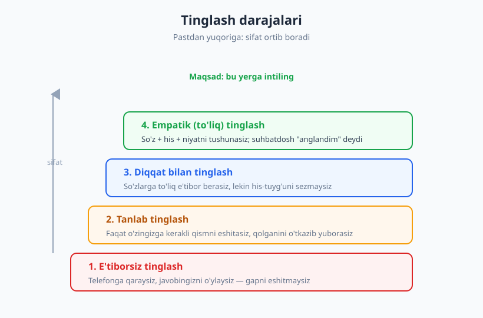
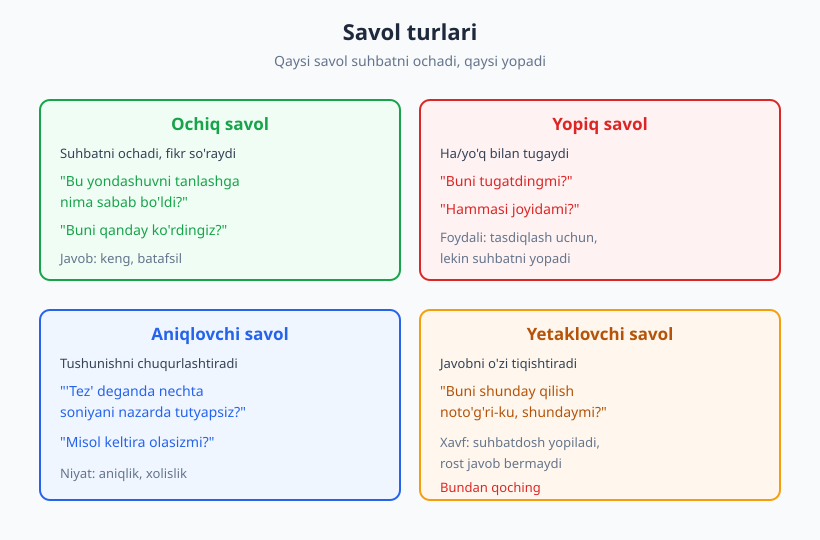
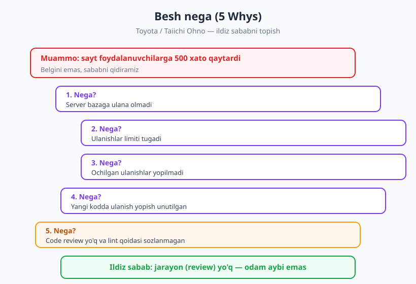

# 12 — Faol tinglash va to'g'ri savol berish

[⬅️ Oldingi: 11 — Og'zaki muloqot, taqdimot va public speaking](./11-ogzaki-taqdimot-public-speaking.md) · [🏠 README](./README.md) · [Keyingi: 13 — Fikr-mulohaza: berish va qabul qilish ➡️](./13-feedback-berish-qabul.md)

---

> **Bu bobda:** muloqotning eng kam o'rgatiladigan, lekin eng ko'p ta'sir qiladigan yarmi — *tinglash* va *savol berish*. Faol tinglash (active listening) darajalarini, qayta aytish (paraphrasing) texnikasini, ochiq va yopiq savollar farqini, Toyota'ning "Besh nega" (5 Whys) ildiz-sabab metodini va savol orqali haqiqiy ehtiyojni ochish (XY muammosi) ko'nikmalarini o'rganasiz.
>
> **Halollik / Eslatma:** tinglash — passiv ko'rinadi, lekin aslida muloqotdagi eng faol harakat. Buni o'qib emas, har bir suhbatda ataylab mashq qilib o'rganasiz. Ramkalar yo'lni ko'rsatadi, lekin "javob navbatini kutish" odatini sindirish oylar oladi.

---

## Nega tinglash dasturchining ko'nikmasi?

Aksariyat odamlar "muloqot ko'nikmasi" deganda *gapirishni* tushunadi — ravon so'zlash, ishonarli taqdimot, kuchli dalil. Lekin ish joyidagi muloqotning yarmidan ko'pi — *qabul qilish*: kollegangiz nima demoqchi ekanini, mahsulot egasi (product owner) aslida qanday muammoni hal qilmoqchi ekanini, junior nimaga "stuck" bo'lganini tushunish. Yomon eshitsangiz, mukammal gapirganingiz ham foyda bermaydi — chunki noto'g'ri savolga javob berasiz.

Dasturchi uchun bu ayniqsa qimmat. Talabni noto'g'ri eshitsangiz — noto'g'ri xususiyatni yozasiz. Bug haqida hamkasbingizni oxirigacha tinglamasangiz — ikki soat noto'g'ri joyda debug qilasiz. Talabnomani (requirement) chala tushunsangiz — sprint oxirida "men buni boshqacha tasavvur qilgandim" eshitasiz. Tinglash — bu xatolarning oldini olishning eng arzon usuli: kodga teginishdan **oldin**.

Yaxshi xabar: tinglash — *o'rganiladigan* ko'nikma. U xarakter emas, malaka. Bu bobda uni qismlarga ajratamiz va har biriga mashq beramiz.

---

## Faol tinglash: javob kutish emas, tushunish

**Faol tinglash (active listening)** — suhbatdoshni *tushunish* maqsadida tinglash, o'z javobingizni o'ylab navbat kutish emas. Bu ta'rif soddaday tuyuladi, lekin amaliyotda ko'pchiligimiz ikkinchisini qilamiz: odam gapirayotganda biz allaqachon javobimizni miyamizda tayyorlaymiz va uning gapining yarmini eshitmaymiz.

Faol tinglash bir nechta amaliy belgidan tashkil topadi:

- **Bo'lmaslik.** Odam fikrini tugatishiga ruxsat bering. Dasturchilar orasida keng tarqalgan odat — javobni bilgan zahoti gapni bo'lish ("ha-ha, bilaman, bu cache muammosi..."). Ko'pincha siz "bilgan" narsa noto'g'ri bo'lib chiqadi, chunki odam aytib bo'lmagan kontekst boshqacha edi.
- **To'liq e'tibor.** Suhbat paytida monitorga termulish, telefon varaqlash, Slack'ga javob yozish — bularning hammasi "sen men uchun muhim emassan" degan signal. Hatto eshitayotgan bo'lsangiz ham, suhbatdosh buni sezadi va ochilmaydi.
- **Tana tili.** Ko'z aloqasi (madaniyatga mos darajada), bosh chayqab tasdiqlash, ochiq poza. Video qo'ng'iroqda — kameraga qarash, "aha", "tushunarli" kabi qisqa og'zaki signallar.
- **Pauza.** Odam gapirib tugatgach, darhol javob bermang. 2–3 soniya pauza — siz haqiqatan o'ylayotganingizni ko'rsatadi va ko'pincha suhbatdosh eng muhim qo'shimchani aynan shu pauzada aytadi.

### Tinglash darajalari

Hamma tinglash bir xil sifatda emas. Tinglashni darajalarga ajratish foydali — qaysi darajada ekaningizni anglasangiz, yuqoriga ko'tarila olasiz:

1. **E'tiborsiz tinglash** — jismonan shu yerdasiz, lekin fikran yo'qsiz. Telefonga qaraysiz, javobingizni o'ylaysiz. Suhbatdosh gapirib bo'lgach, "kechirasiz, nima deding?" deysiz.
2. **Tanlab tinglash** — faqat o'zingizga kerakli yoki qiziq qismini eshitasiz, qolganini o'tkazib yuborasiz. Stand-up'da o'z navbatingizni kutib, boshqalarni eshitmaslik — klassik misol.
3. **Diqqat bilan tinglash** — so'zlarga to'liq e'tibor berasiz, mazmunni tushunasiz. Bu yaxshi daraja, lekin hali his-tuyg'u va niyatni sezmaysiz.
4. **Empatik (to'liq) tinglash** — so'z + his + niyatni birga tushunasiz. Suhbatdoshning *nima uchun* bunday gapirayotganini, qanday his qilayotganini sezasiz. Aynan shu darajada odam "meni anglashdi" deb his qiladi.

> **Diqqat:** maqsad — har bir suhbatda 4-darajada bo'lish emas (bu charchatadi va doim kerak ham emas). Maqsad — qaysi darajada ekaningizni *bilish* va muhim suhbatlarda ataylab yuqoriga ko'tarilish. Junior bug bilan kelganida 3–4-daraja; oddiy "build o'tdimi?" savolida 2-daraja yetarli.

Bu darajalar g'oyasi keng tarqalgan tinglash modellariga asoslanadi (masalan, Stephen Covey "empatik tinglash" tushunchasini ommalashtirgan). Aniq muallifga qat'iy nisbat berishdan ko'ra, foydali tomoni — *o'zingizni qaysi darajada ekaningizni baholash* uchun amaliy o'lchov sifatida ishlatish.

---

## Tasdiqlash va qayta aytish (paraphrasing)

Tinglaganingizni isbotlashning eng kuchli usuli — **qayta aytish (paraphrasing)**: eshitganingizni o'z so'zlaringiz bilan qisqacha takrorlash va tasdiqlatish.

Standart shakl:

> **"To'g'ri tushundimmi: siz ... demoqchisiz?"**
>
> yoki
>
> **"Demak, asosiy muammo — ... , shundaymi?"**

Bu oddiy jumlaning uchta kuchli ta'siri bor:

1. **Anglashilmovchilikni erta tutadi.** Agar siz noto'g'ri tushungan bo'lsangiz, suhbatdosh shu yerda tuzatadi — kod yozishdan, sprint rejalashdan, noto'g'ri yo'nalishda yugurishdan oldin.
2. **Suhbatdoshga "eshitildim" hissini beradi.** Odam o'z fikrini boshqa og'izdan eshitganda, anglandim deb his qiladi va ko'proq ochiladi.
3. **Sizni ham fikrni tartibga solishga majbur qiladi.** Eshitganni qayta ifodalash uchun uni haqiqatan tushunish kerak — bu sizning diqqatingizni o'tkir qiladi.

### Misol: noto'g'ri tinglash vs qayta aytish

❌ **Qayta aytmasdan:**

> **Mahsulot egasi:** "Foydalanuvchilar hisobot sahifasidan shikoyat qilishyapti, juda sekin."
>
> **Dasturchi:** "Tushunarli, hisobot so'rovini optimallashtirish kerak. Indeks qo'shaman."

Bu yerda dasturchi *taxmin* qildi: "sekin" = "DB so'rovi sekin". Lekin balki muammo — foydalanuvchi 10 000 qatorni bir varaqda ko'rmoqchi va frontend renderi sekin. Ikki soat indeks ustida ishlab, muammo yechilmaganini ko'radi.

✅ **Qayta aytish bilan:**

> **Dasturchi:** "To'g'ri tushundimmi — foydalanuvchilar hisobot sahifasi ochilishini *kutishdan* shikoyat qilishyapti? Bu sahifa yuklanishi sekinmi, yoki filtr bosgandan keyin sekinmi?"
>
> **Mahsulot egasi:** "Yo'q, ochilishi joyida. Filtr bosgandan keyin 'spinner' uzoq aylanadi."
>
> **Dasturchi:** "Tushunarli — demak filtr so'rovi sekin, sahifa o'zi emas. Buni o'lchab ko'raman."

Bitta tasdiqlovchi savol — bir necha soat tejadi. Bu bobning markaziy g'oyasi: **savol kod yozishdan arzon.**

> **Eslatma:** qayta aytishni "papag'ay" qilib yubormang — har gapni so'zma-so'z takrorlamang, bu sun'iy va asabiy. Faqat *muhim* yoki *noaniq* nuqtalarni, o'z so'zlaringiz bilan jamlang. Bu tinglashning passiv-agressiv emas, samimiy ko'rinishi.

---

## Yaxshi savol berish

Savol — fikrlash vositasi. Yaxshi savol noaniqlikni ochadi, yomon savol suhbatni yopadi yoki noto'g'ri yo'nalishga buradi. Savollarni bir nechta o'q bo'yicha ajratish foydali:

### Ochiq vs yopiq savol

- **Yopiq savol** — "ha/yo'q" yoki bitta so'z bilan tugaydi. *"Buni tugatdingmi?", "Bug bormi?"* Foydali: tez tasdiqlash, faktni aniqlash uchun. Lekin suhbatni *yopadi* — qo'shimcha ma'lumot olib kelmaydi.
- **Ochiq savol** — fikr, izoh, kontekst so'raydi. *"Bu xususiyatni qanday ko'rdingiz?", "Qaysi qism eng murakkab bo'ldi?"* Suhbatni *ochadi*, kutilmagan ma'lumot olib keladi.

Qoida emas, lekin yo'naltiruvchi tamoyil: **muammoni tushunmoqchi bo'lsangiz — ochiq savol; faktni tekshirmoqchi bo'lsangiz — yopiq savol.** Ko'pchilik xatosi — tushunish kerak bo'lganda yopiq savol berib, "ha" eshitib, tushunmasdan davom etish.

### Aniqlovchi vs yetaklovchi savol

- **Aniqlovchi (clarifying) savol** — noaniq atamani aniqlikka aylantiradi. *"'Tez' deganda nechta soniyani nazarda tutyapsiz?", "'Ko'p foydalanuvchi' — taxminan necha kishi?", "Misol keltira olasizmi?"* Bu — talabnomani aniqlashtirishning asosiy quroli.
- **Yetaklovchi (leading) savol** — javobni o'zi ichiga yashirgan, suhbatdoshni siz xohlagan javobga itaradi. *"Buni shunday qilish noto'g'ri-ku, shundaymi?"* Bundan qoching: u suhbatdoshni mudofaaga o'tkazadi, u rost javob o'rniga sizga ma'qul javobni beradi. Ayniqsa code review va dizayn muhokamasida xavfli.

### "Nega bunday qilding?" tuzog'i

Eng ko'p uchraydigan xato — *ayblovga o'xshagan savol*. "Nega" so'zi to'g'ridan-to'g'ri odamga qaratilganda, u tanqid sifatida eshitiladi:

❌ "**Nega** bu yondashuvni tanlading?" → "Sen xato qilding, o'zingni oqla" deb eshitiladi.

✅ "Bu yondashuvni tanlashingga **nima sabab bo'ldi**?" → "Sening fikrlash jarayoningni tushunmoqchiman" deb eshitiladi.

Farq nozik, lekin natija katta. Ikkinchi shaklda odam ochiladi, kontekstini aytadi — va siz ko'pincha uning qarori siz o'ylaganingizdan oqilona ekanini ko'rasiz. Savolni *odamga* emas, *qarorga* qarating.

Bu ayniqsa code review (15-bobda chuqurroq) va nizoli suhbatlarda (16-bobda) muhim — savol ohangi munosabatni hal qiladi.

| Yopiq / ayblovchi | Ochiq / qiziquvchan |
|---|---|
| "Buni testlading-mi?" | "Buni qanday tekshirib ko'rding?" |
| "Nega bu kutubxonani tanlading?" | "Bu kutubxonaga qaror qilishingda nimalar muhim bo'ldi?" |
| "Bu ishlaydi-mi umuman?" | "Qaysi holatlarda ishlashini ko'rding, qaysi holatlar hali noaniq?" |
| "Tushundingmi?" | "Qaysi qismi hali tumanli bo'lib turibdi?" |

---

## Besh nega (5 Whys): ildiz sababni topish

Belgi (symptom) bilan ildiz sabab (root cause) — boshqa narsalar. Aksariyat tezkor "tuzatish" belgini bekitadi, sabab esa qoladi va keyin yana qaytadi. **Besh nega (5 Whys)** — sababgacha tushishning eng sodda quroli.

Bu metod **Toyota** ishlab chiqarish tizimida, **Taiichi Ohno** tomonidan rasmiylashtirilgan. G'oyasi: muammoni ko'rganingizda, "nega?" deb so'rang; javob olgach, yana "nega?" — odatda taxminan besh marta "nega" sizni ildizga olib boradi. "Besh" — qat'iy raqam emas, balki "yuza bilan to'xtama" eslatmasi.

### Ishlangan misol: production bug

> **Muammo:** sayt foydalanuvchilarga 500 xato qaytardi.
>
> 1. **Nega?** Server ma'lumotlar bazasiga ulana olmadi.
> 2. **Nega?** Ulanishlar (connection) limiti tugagan edi.
> 3. **Nega?** Ochilgan ulanishlar yopilmasdan qolib ketdi.
> 4. **Nega?** Yangi qo'shilgan kodda ulanishni yopish unutilgan.
> 5. **Nega?** Bu kod code review'siz merge bo'lgan va linter ulanish-yopish qoidasini tekshirmaydi.
>
> **Ildiz sabab:** *jarayon* muammosi — review yo'q, lint sozlanmagan. Bitta dasturchining "aybi" emas.

E'tibor bering: agar 2-bosqichda to'xtab, "limitni oshiramiz" desangiz — bug bir necha haftadan keyin yana qaytadi. Faqat 5-darajaga tushganda haqiqiy yechim (review jarayoni + lint qoidasi) ko'rinadi.

> **Trade-off:** "Besh nega" chiziqli — bitta sababga olib boradi. Murakkab incident'larda ko'pincha *bir nechta* sabab birlashadi (masalan, kod + monitoring yo'qligi + alert sozlanmagani). Bunday holatda "Besh nega"ni kengaytiring: har bosqichda bir nechta "nega" tarmoqlanishi mumkin (ba'zan buni "fishbone" yoki Ishikawa diagrammasi bilan birga ishlatadilar). Va eng muhimi: **5 Whys odamni emas, tizimni qidiradi.** Agar oxirgi javob "falonchi e'tiborsiz" bo'lsa — yetarlicha pastga tushmagansiz; "nega odam buni e'tiborsiz qilishi *mumkin bo'ldi*?" deb davom eting.

Bu metod debugging bobida (20-bob) markaziy o'rin tutadi — u yerda "Besh nega"ni log o'qish va ilmiy metod bilan birga ishlatamiz. Muammoni tahlil qilishning kengroq ramkasi esa 19-bobda.

---

## Sokratik savol va XY muammosi

Eng kuchli savol — odamga *o'zi bilmagan ehtiyojini* ochib beradigan savol. Bu **sokratik metod**ning mohiyati: javob bermay, savol orqali suhbatdoshni haqiqatga olib borish.

Dasturchilar hayotida bu eng ko'p **XY muammosi** ko'rinishida uchraydi.

### XY muammosi nima?

XY muammosi — odam aslida **X** muammoni hal qilmoqchi, lekin o'zi tanlagan **Y** yechimi haqida savol beradi. U Y'ga shu qadar bog'lanib qolganki, asl X'ni umuman aytmaydi. Natijada siz Y'ni yechishga yordam berasiz — lekin Y noto'g'ri yo'l edi.

Klassik misol:

> **Junior:** "Fayl nomidan oxirgi 3 ta belgini qanday olaman?"
>
> **Siz (Y'ga javob):** "`substr` bilan oxiridan kesib olasan."
>
> **Junior:** "Lekin ba'zi fayllarda ishlamayapti..."
>
> **Siz (X'ni so'rab):** "To'xta — aslida nimaga erishmoqchisan? Nima uchun oxirgi 3 belgi kerak?"
>
> **Junior:** "Fayl kengaytmasini (extension) olmoqchiman."
>
> **Siz:** "Unda 'oxirgi 3 belgi' noto'g'ri — `.jpeg` 4 belgi, `.md` 2 belgi. Senga kengaytmani ajratadigan funksiya kerak."

Junior X'ni (kengaytmani olish) aytsa, siz darhol to'g'ri yechimga olib borardingiz. Lekin u Y'ni (oxirgi 3 belgi) so'radi, chunki o'zicha shu yechimga qaror qilgandi.

### XY'ni savol bilan ochish

Davo — bitta sokratik savol:

> **"To'xta, bir qadam orqaga qaytaylik — aslida qanday muammoni hal qilmoqchisan?"**
>
> yoki
>
> **"Bu senga nima uchun kerak? Yakuniy maqsad nima?"**

Bu savol kontekstni ochadi va siz Y'ni emas, X'ni yechasiz. Aynan shu — senior dasturchini junior'dan ajratib turadigan ko'nikma: berilgan savolni *qaytadan ramkalash* (reframe), so'rovning ortidagi asl ehtiyojni ko'rish.

> **Diqqat:** XY muammosi faqat boshqalarda emas, *o'zingizda* ham bo'ladi. Bironta yechim ustida bir soat urinib ham natija chiqmasa — to'xtang va o'zingizga so'rang: "Men aslida qaysi muammoni yechyapman? Bu yo'lning o'zi to'g'rimi?" Ko'pincha javob — "men noto'g'ri Y'ni tanlagan ekanman".

Sokratik savol — yetaklovchi savolning teskarisi. Yetaklovchi savol *sizning* javobingizni tiqishtiradi; sokratik savol *suhbatdoshning* o'z javobini topishiga yordam beradi. Mentorlik va junior'larga yordam berishda (30-bob) bu farq hal qiluvchi: tayyor yechim berish o'rniga, to'g'ri savol bilan ularning o'zini yechimga olib borish — uzoq muddatda ancha qimmatli.

---

## Hammasini birga: tinglash-savol sikli

Yaxshi muloqotchi bu ko'nikmalarni alohida emas, bir sikl sifatida ishlatadi:

1. **Tingla** — to'liq e'tibor, bo'lmasdan, eng yuqori daraja muhim suhbatda.
2. **Qayta ayt** — "To'g'ri tushundimmi: ...?" bilan tasdiqlat.
3. **Ochiq savol ber** — kontekstni kengaytirish uchun.
4. **Aniqlovchi savol ber** — noaniq atamalarni aniqlikka aylantirish uchun.
5. **Ildizga tush** — kerak bo'lsa "Besh nega" yoki "aslida qanday muammoni hal qilmoqchisiz?".

Bu sikl asinxron muloqotda ham qo'llaniladi — yozma savolda ham (10-bob, yozma va asinxron muloqot) avval o'qiganingizni qayta ayting, keyin aniqlovchi savol bering. Yozma muloqotda XY muammosi ayniqsa ko'p uchraydi, chunki odam savolini bir martada to'liq yozadi va kontekstni tushirib qoldiradi.

---

## Asosiy g'oyalar (bobni qisqacha)

- **Faol tinglash** — javob navbatini kutish emas, *tushunish* uchun tinglash: bo'lmaslik, to'liq e'tibor, mos tana tili, pauza.
- **Tinglash darajalari** (e'tiborsiz → tanlab → diqqat bilan → empatik) sizga o'zingizni baholash o'lchovini beradi; muhim suhbatda ataylab yuqoriga ko'tariling.
- **Qayta aytish (paraphrasing)** — "To'g'ri tushundimmi: ...?" — anglashilmovchilikni *kod yozishdan oldin* tutadi va suhbatdoshga "eshitildim" hissini beradi.
- **Ochiq savol suhbatni ochadi, yopiq savol yopadi**; aniqlovchi savol noaniqlikni aniqlikka aylantiradi, **yetaklovchi savoldan qoching**.
- Savolni **odamga emas, qarorga** qarating: "Nega bunday qilding?" o'rniga "Buni tanlashingga nima sabab bo'ldi?".
- **Besh nega (5 Whys)** (Toyota / Taiichi Ohno) belgini emas, **ildiz sababni** topadi — odamni emas, **tizimni** qidiring.
- **XY muammosi** — odam Y yechimi haqida so'raydi, X muammoni yashiradi; **"aslida qanday muammoni hal qilmoqchisiz?"** sokratik savoli asl ehtiyojni ochadi.

---

## Mashqlar

### Oson

**1-mashq.** Quyidagi beshta yopiq savolni ochiq savolga aylantiring (ma'noni saqlab, suhbatni ochadigan shaklga):

1. "Taskni tugatdingmi?"
2. "Bu kod ishlaydi-mi?"
3. "Yangi API hujjati yoqdimi?"
4. "Bu deadline'ga ulgurasanmi?"
5. "Review'da hammasi joyidami?"

**2-mashq.** Keyingi kun davomida bo'lgan bitta ish suhbatini eslang (stand-up, Slack savoli, hamkasb bilan gaplashish). Bu suhbatda siz **tinglash darajalarining** qaysi birida bo'lgansiz (1–4)? Nima uchun aynan shu darajada qoldingiz — chalg'igan edingizmi, javobingizni o'ylab turdingizmi? Bir-ikki jumlada yozing.

### O'rta

**3-mashq.** Hamkasbingiz quyidagini aytdi:

> "Bilasanmi, men o'sha eski to'lov modulini umuman tushunmayman. Har safar unga tegishim kerak bo'lsa, ikki soat yo'qotaman va baribir nimadir buziladi. Joriy sprintda yana ikkita task aynan o'sha yerda."

Bu gapga **qayta aytish (paraphrasing)** javobi yozing — "To'g'ri tushundimmi: ...?" shaklida. Keyin bitta **aniqlovchi** va bitta **ochiq** savol qo'shing.

**4-mashq.** Quyidagi to'rtta savol — yetaklovchimi yoki yo'qmi? Yetaklovchi bo'lsa, uni neytral (ochiq yoki aniqlovchi) shaklga qayta yozing:

1. "Bu yondashuv juda murakkab-ku, soddaroq qilsa bo'lmaydimi?"
2. "Buni qanday test qilding?"
3. "Microservice'ga o'tish bu yerda ortiqcha emasmi?"
4. "Qaysi holatlar hali noaniq qolyapti?"

### Qiyin

**5-mashq.** Quyidagi muammoga **"Besh nega"** ni qo'llang. Har bir "nega"ga ishonarli javob yozing va ildiz sababgacha tushing. Ildiz sabab — *tizim/jarayon* darajasida bo'lsin, "falonchi e'tiborsiz" emas:

> **Muammo:** Jamoaning reliz (release) jarayoni har safar 3 soat cho'ziladi, garchi rejada 30 daqiqa bo'lsa ham.

**6-mashq.** Quyidagi yozma savol — XY muammosining klassik namunasi. (a) Bu yerda Y (so'ralgan yechim) nima va ehtimoliy X (asl muammo) nima bo'lishi mumkin? (b) Junior'ga yozadigan, X'ni ochadigan sokratik javobingizni yozing:

> **Junior (Slack'da):** "Salom! Bir foydalanuvchining barcha log'larini bitta katta JSON faylga qanday yozsam bo'ladi? Fayl 2 GB bo'lib ketyapti, sekin ochilyapti."

Yechimlar / Namunaviy yondashuvlar

### 1-mashq yechimi

Yagona to'g'ri javob yo'q; muhimi — savol *fikr/kontekst* so'rasin:

1. "Task qanday ketyapti, qaysi qism qoldi?"
2. "Buni qaysi holatlarda sinab ko'rding, qayerlar hali noaniq?"
3. "Yangi API hujjatida nima yaxshi chiqibdi, nima hali tushunarsiz?"
4. "Bu deadline'ga ulgurish uchun nimalar to'sqinlik qilishi mumkin?"
5. "Review'da qaysi qism muhokamaga arziydi deb o'ylaysan?"

Har bir ochiq variant "ha/yo'q" o'rniga kontekst olib keladi.

### 2-mashq yechimi

Namunaviy yondashuv (siznikidan farq qilishi tabiiy):

> "Ertalabki stand-up'da men 2-darajada (tanlab tinglash) edim — o'z navbatimni kutib, kechagi taskimni miyamda takrorladim va boshqalar nima aytayotganini deyarli eshitmadim. Sababi: men 'mening qismim' tugaganda diqqatimni o'chirdim. Aslida lead bizning servisga ta'sir qiladigan bir o'zgarishni aytgan ekan, men keyin Slack'dan o'qib bildim."

Bu mashqning maqsadi — *o'z* tinglashingizni kuzata olish odatini boshlash. Aynan shu kuzatuv yuqoriroq darajaga ko'tarilishning birinchi qadami.

### 3-mashq yechimi

Namunaviy qayta aytish + savollar:

> **Qayta aytish:** "To'g'ri tushundimmi — eski to'lov moduli sen uchun juda noaniq, har safar unga tegishing katta vaqt oladi va xavfli his qilasan, hozir esa shu modulda yana ikkita task bor?"
>
> **Aniqlovchi savol:** "'Nimadir buziladi' deganda — odatda qanday narsa buziladi? Test tutadimi, yoki productionda chiqadimi?"
>
> **Ochiq savol:** "Bu tasklarni xavfsizroq qilish uchun nima yordam berardi — masalan birga modulni ko'rib chiqsak, yoki avval test yozsak?"

E'tibor bering: qayta aytishda biz his-tuyg'uni ham aks ettirdik ("xavfli his qilasan") — bu empatik (4-daraja) tinglash belgisi.

### 4-mashq yechimi

1. **Yetaklovchi** — "juda murakkab" degan baho savolga yashiringan. Neytral: "Bu yondashuvning murakkabligi haqida nima deb o'ylaysan — qaysi qismlari zarur, qaysilari kamaytirilishi mumkin?"
2. **Neytral (aniqlovchi).** O'zgartirish shart emas — bu qanday test qilinganini xolis so'raydi.
3. **Yetaklovchi** — "ortiqcha emasmi?" javobni tiqishtiradi. Neytral: "Microservice'ga o'tish bu holatda qanday foyda va narx keltiradi deb o'ylaysan?"
4. **Neytral (ochiq).** O'zgartirish shart emas — kontekstni ochadi.

### 5-mashq yechimi

Namunaviy "Besh nega" (sizniki boshqacha sabab zanjiriga ega bo'lishi mumkin — muhimi tizimga tushish):

> **Muammo:** reliz 30 daqiqa o'rniga 3 soat cho'ziladi.
>
> 1. **Nega?** Har relizda qo'lda bir nechta qadam bajariladi (build, test, migratsiya, deploy) va orasida kutish bor.
> 2. **Nega qo'lda?** reliz skripti to'liq avtomatlashtirilmagan — yarmi hujjatdagi qadamlar.
> 3. **Nega avtomatlashtirilmagan?** Hech kim buni o'z vazifasi deb hisoblamaydi; reliz "qo'shimcha ish" sifatida qaraladi.
> 4. **Nega egasi yo'q?** Jamoada reliz jarayonini yaxshilash hech qaysi sprintga kiritilmagan — doim "keyinroq".
> 5. **Nega kiritilmagan?** Texnik qarz (tech debt) ishlari rejalashtirishda ko'rinmaydi; faqat yangi xususiyatlar prioritetlanadi.
>
> **Ildiz sabab:** rejalashtirish jarayonida texnik qarzga joy yo'q — *tizim* muammosi, biror dasturchining sustligi emas. Yechim: reliz avtomatlashtiruvini aniq egasi bilan sprintga task sifatida kiritish.

Diqqat: agar siz "relizni Vali sekin qiladi" deb to'xtagan bo'lsangiz — bu odamni ayblash, ildiz emas. Har doim "nega bu *holat mumkin bo'ldi*?" deb davom eting.

### 6-mashq yechimi

**(a)** 
- **Y (so'ralgan yechim):** barcha log'larni bitta katta JSON faylga yozish.
- **Ehtimoliy X (asl muammo):** junior bir foydalanuvchining log'larini *qidirish/tahlil qilish* yoki *muammoni debug qilish* istayapti, va o'zicha "hammasini bir faylga yig'sam, ochib qarayman" degan yechimga keldi. Asl ehtiyoj — log'larni samarali *qidirish va filtrlash*, bitta ulkan fayl emas.

**(b)** Namunaviy sokratik javob:

> "Salom! Bir qadam orqaga qaytaylik — bu log'lar bilan aslida nima qilmoqchisan? Foydalanuvchining muammosini izlayapsanmi, yoki muayyan voqeani topmoqchimisan? Chunki agar maqsad qidirish bo'lsa, 2 GB JSON fayl — eng qiyin yo'l: uni ochish va qidirish sekin bo'ladi. Odatda log'larni faylga yig'ish o'rniga, ularni qidiriladigan tizimga (masalan log to'plovchi/indeks) yo'naltirib, sana yoki foydalanuvchi bo'yicha filtrlaymiz. Aniq aytsang — nimani topmoqchisan? — to'g'ri yo'lni birga tanlaymiz."

Bu javob Y'ni (katta JSON) yechishga urinmaydi; X'ni (samarali qidirish) ochadi va junior'ni to'g'ri yo'nalishga oladi.

---

[⬅️ Oldingi: 11 — Og'zaki muloqot, taqdimot va public speaking](./11-ogzaki-taqdimot-public-speaking.md) · [🏠 README](./README.md) · [Keyingi: 13 — Fikr-mulohaza: berish va qabul qilish ➡️](./13-feedback-berish-qabul.md)
